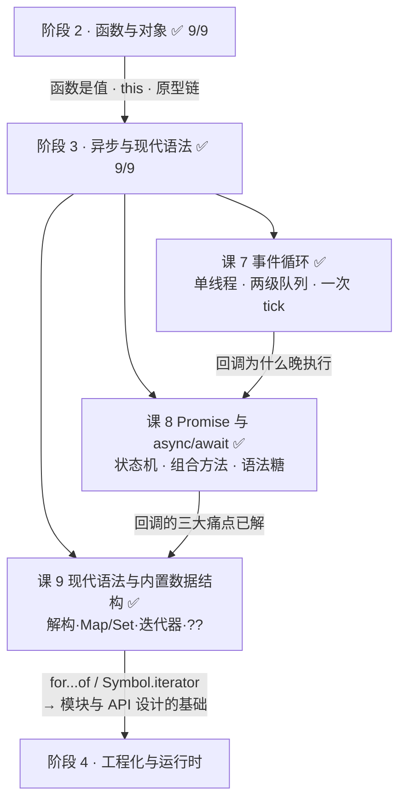
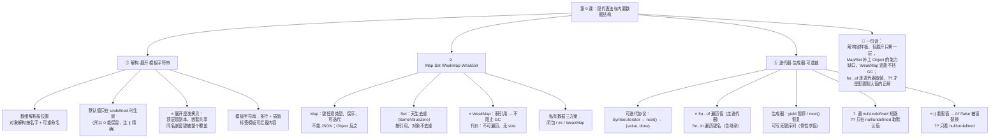

# 第 9 课：现代语法与内置数据结构

> 所属阶段：阶段 3《异步与现代语法》｜ 水平：入门 ｜ 本课知识点：解构·展开·模板字符串、Map·Set·WeakMap·WeakSet、迭代器·生成器·可选链
> 故事情节：主角的代码越写越短——解构、可选链、展开运算符让样板代码消失了。但"短"不等于"对"：展开是浅拷贝，这又回到了阶段 1 的那个坑
> ✅ 状态：已完成（2026-09-03）｜ 实操环境：Node.js v22.14.0（文中所有输出均为本机实测）
> 🎉 **本课是阶段 3《异步与现代语法》的收官课**——学完它，JS 处理"时间"和"现代写法"这两块就都齐了

## 🎯 本课目标

- 用解构 + 默认值重写配置合并，并说清展开运算符是**浅拷贝**（回扣课 2）
- 说清 Map vs Object 的选型条件，用 `WeakMap` 做私有数据
- 区分 `for...of` 与 `for...in`，用生成器写一个可暂停的序列

## 📌 知识点导航

| # | 知识点 | 状态 |
|---|--------|------|
| 1 | 解构·展开·模板字符串 | ✅ |
| 2 | Map·Set·WeakMap·WeakSet | ✅ |
| 3 | 迭代器·生成器·可选链 | ✅ |

---

## 第一幕：起源与场景引入

> 🏛️ **起源**：本课的语法不是一次进来的，而是**分了三批**——背后是 JS 一段"憋了六年"的历史。
>
> - **ES5 发布于 2009 年 12 月**；而它的下一版 **ES6（正式名 ECMAScript 2015）直到 2015 年 6 月**才定稿——**中间隔了将近六年**。这六年里，被称作 **ES4** 的第四版因"语言复杂度"的政治分歧而**胎死腹中**（最后一份草案停留在 2003 年 6 月），其遗留特性后来并入了代号 **Harmony** 的计划，也就是后来的 ES6。
> - 所以 ES6 是一次**憋了六年的大爆发**：`class`、模块、箭头函数、`let`/`const`、**解构**、迭代器与 `for...of`、生成器、**Map / Set / WeakMap**、Promise、**模板字符串**……几乎同一批进来。
> - 而本课还有两位是**后来逐年补上的**：**对象展开 `...`（ES2018 / ES9）**，以及**可选链 `?.` 与空值合并 `??`（ES2020 / ES11）**。
>
> （核查于 2026-09，来源：Wikipedia「ECMAScript version history」词条及其引用的 ECMA-262 各版规范）
>
> ⚠️ **一个高频误解**：**数组**的展开与剩余参数是 ES6 的，但**对象**的展开与剩余属性是 **ES2018** 才有的——两者差了三年。这一点在查兼容性时经常踩坑。

> 🎬 **场景**：一个 HTTP 客户端的配置合并。

```js
const defaultHeaders = { 'Content-Type': 'application/json' };

function createClient(options) {
  return {
    baseURL: options.baseURL || 'https://api.example.com',
    timeout: options.timeout || 30000,
    maxRetries: options.maxRetries || 3,
    headers: { ...defaultHeaders, ...options.headers },
  };
}
```

看起来很正常。直到某天产品提需求：**"批量导入那个接口不要自动重试"**。你传了 `maxRetries: 0`：

```js
createClient({ maxRetries: 0 });   // ❌ 实际 maxRetries = 3
```

**`0` 被当成了"没传"。**

你学会现代语法后重写，代码短了一大截：

```js
function createClient(options = {}) {
  const { baseURL = 'https://api.example.com', timeout = 30000, maxRetries = 3, headers = {} } = options;
  return { baseURL, timeout, maxRetries, headers: { ...defaultHeaders, ...headers } };
}
createClient({ maxRetries: 0 });   // ✅ maxRetries = 0
```

然后你顺手把整个配置改成"一键合并"：

```js
const defaults = { host: 'localhost', nested: { retries: 3, timeout: 30 } };
const userOpts = { nested: { retries: 1 } };

const merged = { ...defaults, ...userOpts };
// 实际结果：{ host: 'localhost', nested: { retries: 1 } }  ← timeout 呢？！
```

**`nested.timeout` 凭空消失了。**

---

## 第二幕：认知冲突

> ❓ **问题**：代码越写越短，但"短"等于"对"吗？

三个困惑：

1. **`{ ...defaults, ...options }` 看起来就是"合并"，为什么嵌套的配置整层消失了？** 它是把两个对象"合"起来了，还是"盖"上去了？
2. **已经有 Object 和数组了，为什么还要 Map / Set？** 是"更好用"还是"能干 Object 干不了的事"？
3. **`||` 到底差在哪？** 为什么 `0` 会被当成"没传"？解构的默认值为什么就没这个问题？

| 困惑 | 答案藏在 |
|------|---------|
| 嵌套配置为什么整层消失 | **知识点 1**：展开是**浅拷贝**——同名的嵌套键被**整个替换**，不是逐层合并 |
| 为什么要 Map / Set | **知识点 2**：Map 的键可以是**任意类型**，Set 天生去重，WeakMap 还能**不阻止 GC** |
| `\|\|` 差在哪 | **知识点 3**：`\|\|` 看的是"假值"，`??` 与解构默认值只看 `null`/`undefined` |

> 💡 第 1 个困惑会带你**回到课 2**——当年讲"赋值只是多配一把钥匙，柜子从没被复制过"，今天这个坑会以新面貌再撞你一次。**这就是为什么要先学值与引用：它们会在每一层语法里反复出现。**

---

## 第三幕：层层揭示

### 知识点 1：解构·展开·模板字符串

> 本知识点关键点：数组解构与对象解构 / 默认值与重命名 / 展开运算符（`...`）与**浅拷贝**的关联 / 标签模板（tagged template）

#### 一句话定义

**解构**是"按位置（数组）或按名字（对象）把值取出来赋给变量"的简写；**展开**（`...`）是把一个数组/对象"摊开"到另一个里——**它只摊开一层（浅拷贝）**；**模板字符串**用反引号包住，支持多行与 `${}` 插值。

#### 直觉建立（类比）

把解构想成**拆快递**：

- **数组解构 = 按格子拆**：第一格给 `a`，第二格给 `b`——只看**位置**，不关心里面是什么。
- **对象解构 = 按标签拆**：写着 `host` 的那个给 `host`——只看**名字**，跟顺序无关。
- **展开 = 把箱子里的东西全倒进另一个箱子**：倒进去的是**复印件（顶层）**，但里面的**小盒子还是同一只**（浅拷贝）。

> 💡 **类比的边界（本课最重要的一处）**：展开**不是"融合"而是"覆盖"**——两个对象有同名键时，**后面的整个盖住前面的**，不做任何递归合并。想逐层合并，就得**手动再展开一层**。

#### 核心原理

**① 数组解构（按位置）**

```js
const arr = [1, 2, 3, 4, 5];
const [first, second, , fourth, ...restArr] = arr;
// first=1, second=2（第三格被逗号跳过）, fourth=4, restArr=[5]

let x = 1, y = 2;
[x, y] = [y, x];        // 一行交换两个变量，不用临时变量
```

**② 对象解构（按名字）+ 重命名 + 默认值 + 嵌套**

```js
const opts = { host: 'example.com', port: 0, tags: ['a'] };

const { host, port = 8080, debug = false } = opts;
// host='example.com'  port=0  debug=false
// ⚠️ port 是 0，不是 8080 —— 默认值只在值为 undefined 时才生效

const { host: serverHost, timeout = 30 } = opts;   // 重命名：host → serverHost
const { tags: [firstTag] } = opts;                 // 嵌套解构：firstTag='a'
```

> 🎯 注意 `port = 0` 这一条：**解构的默认值只在 `undefined` 时触发**，所以 `0` 会被原样保留。这正是第一幕那个 bug 的解药——它比 `||` 更精确。

**③ 函数参数解构**（配置函数的标配）

```js
function connect({ host = 'localhost', port = 8080, ...restOpts } = {}) {
  return { host, port, restOpts };
}
connect();                          // { host: 'localhost', port: 8080, restOpts: {} }
connect({ port: 3000 });            // { host: 'localhost', port: 3000, restOpts: {} }
connect({ port: 3000, ssl: true }); // { host: 'localhost', port: 3000, restOpts: { ssl: true } }
```

末尾那个 `= {}` 别忘了——它让"不传参数"也能工作。

**④ 展开是浅拷贝（回扣课 2，本课的题眼）**


实测三层结论：

```js
const defaults = { host: 'localhost', nested: { retries: 3, timeout: 30 } };
const copy = { ...defaults };

copy.nested.retries = 99;
defaults.nested.retries;   // 99   ⚠️ 跟着变了（共享同一个嵌套对象）
copy.host = 'changed';
defaults.host;             // 'localhost'   ✅ 不受影响（顶层是副本）

const userOpts = { nested: { retries: 1 } };
const merged = { ...defaults, ...userOpts };
merged.nested;             // { retries: 1 }   ⚠️ timeout 整个没了——被"覆盖"而非"合并"

// 正确做法：需要合并的那一层，手动再展开一次
const right = { ...defaults, ...userOpts, nested: { ...defaults.nested, ...userOpts.nested } };
// { host: 'localhost', nested: { retries: 1, timeout: 30 } }
```

> 🔑 **两条推论**：
> ① `{...a, ...b}` **不是深合并**——同名嵌套键会被整个替换。
> ② 层数固定就手动再展开一层；层数不定就上 `structuredClone`（课 2 讲过）或递归深合并。

**⑤ 模板字符串与标签模板**

```js
const name = '小明', n = 3;
`我是 ${name}，第 ${n} 次`;      // 插值
`第一行
第二行`;                          // 多行（不用 \n）

// 标签模板：函数名直接跟在模板前，能拿到「字符串片段数组」和「各个插值」
function highlight(strings, ...values) {
  return strings.reduce((out, s, i) => out + s + (i < values.length ? `[${values[i]}]` : ''), '');
}
highlight`我是 ${name}，第 ${n} 次`;   // '我是 [小明]，第 [3] 次'
```

标签模板的价值：**你可以在拼接之前拦截并处理内容**。现实中的典型用途是防 XSS 转义（如 `html\`<p>${userInput}</p>\`` 自动转义）和多语言。

#### 示例演示

见上方各段（全部为实测）。

#### 常见误区

1. **"解构的默认值和 `||` 一样"** → 不一样。默认值只在 `undefined` 时生效，`||` 对所有假值（`0`、`''`、`false`、`NaN`）都生效。
2. **"`{...a, ...b}` 是深合并"** → 不是。只合并**一层**，同名嵌套键整个被替换。
3. **"`{...obj}` 是深拷贝"** → 是**浅拷贝**。嵌套对象仍共享引用（回扣课 2）。
4. **"对象展开是 ES6 的"** → 数组展开是 ES6，对象展开是 **ES2018（ES9）**。
5. **"函数参数解构不用写 `= {}`"** → 不写的话，调用时不传参会报错（对 `undefined` 解构会抛 TypeError）。

#### 一句话记住

> **解构按位置（数组）/ 按名字（对象）取值，默认值只在 `undefined` 时生效；展开只拷一层——同名嵌套键被整个覆盖而非合并；模板字符串支持多行与插值，标签模板还能拦截内容。**

> ✅ **困惑 1 已解**：`{...defaults, ...userOpts}` 里，`nested` 这个键同名 → **后面的整个盖住前面的**，所以 `timeout` 直接消失。想保留就得手动再展开一层：`nested: { ...defaults.nested, ...userOpts.nested }`。

#### 官方文档

- [解构赋值 - MDN](https://developer.mozilla.org/zh-CN/docs/Web/JavaScript/Reference/Operators/Destructuring_assignment)
- [展开语法 - MDN](https://developer.mozilla.org/zh-CN/docs/Web/JavaScript/Reference/Operators/Spread_syntax)
- [模板字符串 - MDN](https://developer.mozilla.org/zh-CN/docs/Web/JavaScript/Reference/Template_literals)
- [带标签的模板 - MDN](https://developer.mozilla.org/zh-CN/docs/Web/JavaScript/Reference/Template_literals#%E5%B8%A6%E6%A0%87%E7%AD%BE%E7%9A%84%E6%A8%A1%E6%9D%BF)

---

### 知识点 2：Map·Set·WeakMap·WeakSet

> 本知识点关键点：Map vs Object 的选型（键类型、顺序、性能、序列化）/ Set 去重与集合运算 / `WeakMap` 的弱引用与不可遍历 / 用 WeakMap 做私有数据与缓存（回扣课 3 闭包）

#### 一句话定义

ES6 新增了四个**专用集合类型**：`Map`（键值对，键可以是任意类型）、`Set`（值的集合，自动去重）、`WeakMap` / `WeakSet`（键/值必须是对象，且**弱引用**——不阻止垃圾回收，因此不可遍历）。

#### 直觉建立（类比）

把 Object 想成**贴标签的收纳盒**，Map 想成**带编号的储物柜**：

- Object 的"标签"**只能是字符串**（你拿任何东西当键，它都会被转成字符串）；
- Map 的"编号"可以是**任何东西**——数字、对象、函数，而且 `1` 和 `'1'` 是两个不同的柜子。

> 💡 **类比的边界**：WeakMap 不是"更弱的 Map"，它是一把**一次性的临时钥匙**——它认得这个对象，但**不会因为这个对象在柜子里就阻止保洁把它收走**。代价是：**你不能清点柜子里有什么**（不可遍历、没有 size）。

#### 核心原理

**① Map vs Object：该怎么选**

```js
const objKey = { id: 1 };
const map = new Map();
map.set(objKey, '对象当键');
map.set('1', '字符串键 1');
map.set(1, '数字键 1');
map.get(1);        // '数字键 1'   ← 和 '1' 是两个不同的键
map.get(objKey);   // '对象当键'
map.size;          // 3

const obj = {};
obj[objKey] = 'x';
obj[1] = 'y';
Object.keys(obj);  // [ '1', '[object Object]' ]  ⚠️ 键全被转成字符串了
```

| 维度 | `Object` | `Map` |
|------|----------|-------|
| **键的类型** | 只能是字符串 / Symbol | **任意类型**（对象、函数、数字都行） |
| **`1` vs `'1'`** | 同一个键 | **两个不同的键** |
| **键值对数量** | 要 `Object.keys(o).length` | `map.size` |
| **遍历** | 要 `Object.keys/values/entries` | **可直接迭代**（`for...of`、展开） |
| **顺序** | 字符串键按插入顺序（整数键会被重排） | **严格按插入顺序** |
| **JSON 序列化** | ✅ 直接支持 | ❌ 要自己转 |
| **原型键冲突** | 有（课 6 讲过 `toString` 之类） | **没有**（不走原型链） |

**选型口诀**：**键是动态的 / 非字符串的 → Map；数据结构固定、要 JSON 序列化 / 写在配置里 → Object。**

**② Set：天生去重**

```js
[...new Set([1, 2, 2, 3, 3, 3])];   // [ 1, 2, 3 ]
[...new Set([NaN, NaN])];           // [ NaN ]  ← Set 用 SameValueZero，NaN 等于 NaN
new Set([{ id: 1 }, { id: 1 }]).size;  // 2  ← 引用不同，不去重
```

集合运算（下面这套 filter 写法在各版本都能用）：

```js
const setA = new Set([1, 2, 3]), setB = new Set([2, 3, 4]);
[...setA].filter((v) => setB.has(v));            // 交集 [ 2, 3 ]
[...new Set([...setA, ...setB])];                // 并集 [ 1, 2, 3, 4 ]
[...setA].filter((v) => !setB.has(v));           // 差集 A-B [ 1 ]
```

> 📌 **新写法**：Wikipedia「ECMAScript version history」记载，**ES2025（第 16 版）** 加入了原生集合方法 `Set.prototype.intersection` / `difference` / `symmetricDifference` / `isSubsetOf` 等。**本机 Node v22.14.0 实测已支持**（`typeof new Set().intersection === 'function'`），所以新项目可以直接写 `setA.intersection(setB)`；需要兼容老环境时，仍用上面的 filter 写法。

**③ WeakMap：弱引用 + 不可遍历（实测）**

```js
const wm = new WeakMap();
wm.size;         // undefined  ← 没有 size
wm.forEach;      // undefined  ← 不可遍历
wm.set('字符串键', 'x');
// TypeError: Invalid value used as weak map key  ← 键必须是对象
```

**为什么"不可遍历"？** 因为**弱引用的代价就是你无法清点内容**——如果允许遍历，就能随时拿到那些"本该被回收"的对象，弱引用就不成立了。这是**设计上的必然取舍**，不是偷懒。

**Map 强引用 vs WeakMap 弱引用**（实测，需 `node --expose-gc`）：

```js
let strongKey = { id: 1 };
const strongMap = new Map();
strongMap.set(strongKey, '数据');
strongKey = null;
global.gc();
strongMap.size;   // 1  ← 条目还在，Map 强引用着它，无法回收（泄漏风险）

let weakKey = { id: 2 };
const weakMap = new WeakMap();
weakMap.set(weakKey, '数据');
weakKey = null;
global.gc();
weakMap.size;     // undefined ← 无从得知，也不阻止回收
```

**④ 三种私有数据方案对比**（回扣课 3 的闭包、课 6 的 `#x`）

```js
// 方案 C：WeakMap（在类外部挂私有数据，不侵入类定义）
const _private = new WeakMap();
class BankAccount {
  constructor(balance) {
    _private.set(this, { balance, log: [] });
  }
  deposit(n) {
    const p = _private.get(this);
    p.balance += n;
    p.log.push('存入 ' + n);
    return p.balance;
  }
  get balance() { return _private.get(this).balance; }
}
const acc = new BankAccount(100);
acc.deposit(50);        // 150
Object.keys(acc);       // []  ✅ 外部拿不到，且实例被回收时私有数据自动消失
```

| 方案 | 写法 | 优点 | 缺点 |
|------|------|------|------|
| **闭包私有变量**（课 3） | `let n = 0` + 返回方法 | 最原生，函数工厂场景自然 | 每个实例一套方法，内存略高 |
| **`#x` 私有字段**（课 6） | `#balance = 0` | **语法级私有**，最简单直观 | 必须在类体内声明 |
| **`WeakMap`**（本课） | 外部 `_private.set(this, {})` | 不侵入类定义；**随实例自动回收** | 写法略笨重 |

**WeakSet** 同理：值的集合，弱引用，主要用于"给对象打标记"（比如记录"这个节点已经处理过了"），且不会阻止对象被回收。

#### 示例演示

见上方各段（全部为实测）。

#### 常见误区

1. **"Map 就是更好的 Object，无脑替换"** → 不。Map **不能 JSON 序列化**，写配置、传给接口仍然要用 Object。
2. **"Object 的键可以是任意类型"** → 不行，非字符串键会被 `toString()`（实测 `{id:1}` 变成了 `'[object Object]'`）。
3. **"Set 能按内容去重对象"** → 不行，按**引用**去重。同形对象照样存两份。
4. **"WeakMap 能遍历，只是 API 名字不同"** → 不能遍历，也没有 `size`。这是弱引用的**必然代价**。
5. **"用 Map 存缓存不会内存泄漏"** → 会。Map 是**强引用**，对象作为键存进去就永远不会被回收——缓存场景应该用 WeakMap（或自己实现 LRU）。

#### 一句话记住

> **Map 的键可以是任意类型且严格保序（不能 JSON）；Set 天生去重（按引用）；WeakMap/WeakSet 弱引用——不阻止 GC 的代价是不可遍历、没有 size，适合做私有数据与缓存。**

> ✅ **困惑 2 已解**：Map 能干 Object 干不了的事——**键可以是对象**（实测：Object 会把 `{id:1}` 变成字符串 `'[object Object]'`，Map 不会）；Set 天生去重；WeakMap 还能**不阻止垃圾回收**，用它做缓存不会泄漏。

#### 官方文档

- [Map - MDN](https://developer.mozilla.org/zh-CN/docs/Web/JavaScript/Reference/Global_Objects/Map)
- [Set - MDN](https://developer.mozilla.org/zh-CN/docs/Web/JavaScript/Reference/Global_Objects/Set)
- [WeakMap - MDN](https://developer.mozilla.org/zh-CN/docs/Web/JavaScript/Reference/Global_Objects/WeakMap)
- [WeakSet - MDN](https://developer.mozilla.org/zh-CN/docs/Web/JavaScript/Reference/Global_Objects/WeakSet)

---

### 知识点 3：迭代器·生成器·可选链

> 本知识点关键点：可迭代协议与 `Symbol.iterator` / `for...of` vs `for...in` 的本质区别 / `generator` 与 `yield` 的暂停机制 / 可选链 `?.` 与空值合并 `??`（以及 `??` 与 `||` 的关键差异）

#### 一句话定义

**可迭代协议**：对象只要有一个 `Symbol.iterator` 方法（返回一个形如 `{ next() { return { value, done } } }` 的迭代器），就能被 `for...of` 和展开运算符消费。**生成器**（`function*`）是写迭代器最省事的方式——`yield` 让函数**暂停**，下次 `next()` 再**从暂停处恢复**。可选链 `?.` 在遇到 `null`/`undefined` 时**短路返回 `undefined`**；空值合并 `??` **只在 `null`/`undefined` 时**取默认值。

#### 直觉建立（类比）

- **迭代器** = **一本可以一页页翻的书**：`next()` 翻一页，返回 `{ value: 这一页的内容, done: 翻完了吗 }`。
- **生成器** = **一个能随时按暂停键的主讲人**：讲到 `yield` 就停住等你，你喊 `next()`，他从刚才那句接着讲。
- **可选链 `?.`** = **问路时加一句"如果没人知道就算了"**——不用每层都先确认"这人存在吗"。

> 💡 **类比的边界**：书是"死"的，翻完就完；**生成器是"活"的**——它可以**永不结束**（无限序列），因为你不要它就不产生。**这就是"惰性求值"**：只在你要下一个的时候才计算下一个。

#### 核心原理

**① 可迭代协议：`Symbol.iterator`**

```js
const iterable = ['a', 'b'];
const it = iterable[Symbol.iterator]();
it.next();   // { value: 'a', done: false }
it.next();   // { value: 'b', done: false }
it.next();   // { value: undefined, done: true }

const plainObj = { a: 1 };
plainObj[Symbol.iterator];   // undefined  ← 普通对象不可迭代
```

**哪些东西自带 `Symbol.iterator`**：数组、字符串、Map、Set、NodeList、`arguments`……**普通对象没有**（因为"属性该按什么顺序迭代"没有天然答案）。

**② `for...of` vs `for...in`：这是两条完全不同的路**

```js
const arr = ['x', 'y'];
arr.customProp = '自定义属性';

for (const v of arr) console.log(v);    // 'x'  'y'          ← 值，走迭代器
for (const k in arr) console.log(k);    // '0'  '1'  'customProp'  ← 键名（字符串），且含自定义属性

for (const v of { a: 1 }) {}            // TypeError: plainObj is not iterable
```

| | `for...of` | `for...in` |
|---|-----------|-----------|
| 遍历的是 | **值** | **键名**（字符串） |
| 依赖 | **可迭代协议**（`Symbol.iterator`） | 枚举对象自身 + **原型链上**的可枚举属性 |
| 能用于普通对象吗 | ❌ 报错（不可迭代） | ✅ 可以 |
| 会带上自定义属性吗 | 不会（只看迭代器给的） | **会**（实测带上了 `customProp`） |
| 典型坑 | 遍历对象要先用 `Object.keys/entries` | 会遍历到原型链上的属性，通常要配 `hasOwnProperty` |

> 📌 记住：**数组用 `for...of`，对象用 `Object.keys/entries`**。`for...in` 基本只在"我就是要枚举所有可枚举属性（含继承的）"时才用。

**③ 生成器：`yield` 的暂停与恢复**

```js
function* counter() {
  yield 1;
  yield 2;
  return 3;
}
const gen = counter();
gen.next();   // { value: 1, done: false }
gen.next();   // { value: 2, done: false }
gen.next();   // { value: 3, done: true }   ← return 的值在 done:true 那次给出
```

**惰性求值 + 无限序列**（生成器最迷人的地方）：

```js
function* infinite() { let i = 0; while (true) yield i++; }
const inf = infinite();
inf.next().value;   // 0
inf.next().value;   // 1

// 取前 N 个的通用工具
function* takeN(it, n) {
  let i = 0;
  for (const v of it) { if (i++ >= n) return; yield v; }
}
[...takeN(infinite(), 3)];   // [ 0, 1, 2 ]
```

`while (true)` 能写，是因为**你不 `next()` 它就不算**。这是数组做不到的（数组必须一次性把所有元素都造出来）。

> 🔗 **生成器和 async/await 是亲戚**：`async` 函数本质上就是"自动执行到底的生成器"，`await` 就是 `yield` 一个 Promise。理解了 yield 的暂停，就不难理解 await 为什么"停在那里却不阻塞线程"（课 8）。

**④ 可选链 `?.` 与空值合并 `??`**（ES2020）

```js
const user = { name: '小明', address: null };
user.address?.city;      // undefined  ← 短路，不报错
user.address.city;       // TypeError: Cannot read properties of null (reading 'city')
user.sayHi?.();          // undefined  ← 方法不存在也不会崩
```

**`??` 与 `||` 的关键差异**（实测对照表，这是本知识点最该背下来的一条）：

| 值 | `v \|\| '默认'` | `v ?? '默认'` |
|----|----------------|---------------|
| `0` | `'默认'` ❌ | `0` ✅ |
| `''` | `'默认'` ❌ | `''` ✅ |
| `false` | `'默认'` ❌ | `false` ✅ |
| `NaN` | `'默认'` ❌ | `NaN` ✅ |
| `null` | `'默认'` | `'默认'` |
| `undefined` | `'默认'` | `'默认'` |

**一句话**：**`||` 看的是"假值"（falsy），`??` 只看 `null` / `undefined`。** 只要 `0`、`''`、`false` 在你那儿是**合法值**，就必须用 `??`。

回扣第一幕：`maxRetries: 0` 被 `||` 换成 3，换成 `??` 或解构默认值就对了。

#### 示例演示

见上方各段（全部为实测）。

#### 常见误区

1. **"`for...of` 能遍历对象"** → 不能，普通对象没有 `Symbol.iterator`（实测报 `TypeError: not iterable`）。
2. **"`for...in` 和 `for...of` 差不多"** → 完全不同：一个遍历**键名**（且含继承属性），一个遍历**值**。
3. **"生成器一调用就全跑完"** → 不是。调用生成器函数**不执行函数体**，只返回迭代器；每次 `next()` 才执行到下一个 `yield`。
4. **"`while(true)` 的生成器会死循环"** → 不会。你不 `next()` 它就不算。
5. **"`??` 和 `||` 可以互换"** → 不能。`0`、`''`、`false` 是合法值时，`||` 会出错（实测表）。
6. **"`?.` 能用在所有地方"** → 它只对**属性访问 / 调用 / 下标**生效；不能用于赋值左侧（`a?.b = 1` 是语法错误）。

#### 一句话记住

> **可迭代协议 = `Symbol.iterator` + `next()`；`for...of` 走迭代器遍历值，`for...in` 遍历键名（含继承）；生成器用 `yield` 暂停、`next()` 恢复，可做无限序列；`?.` 遇空短路，`??` 只在 null/undefined 时取默认值——`0`/`''`/`false` 是合法值时必须用 `??`。**

> ✅ **困惑 3 已解**：`||` 判断的是**假值**，于是 `0`、`''`、`false`、`NaN` 全被当成"没传"——第一幕的 `maxRetries: 0` 就是这么丢的。`??` 和解构的默认值都**只看 `null`/`undefined`**，所以 0 能原样保留。

#### 官方文档

- [迭代协议 - MDN](https://developer.mozilla.org/zh-CN/docs/Web/JavaScript/Reference/Iteration_protocols)
- [for...of - MDN](https://developer.mozilla.org/zh-CN/docs/Web/JavaScript/Reference/Statements/for...of)
- [function* - MDN](https://developer.mozilla.org/zh-CN/docs/Web/JavaScript/Reference/Statements/function*)
- [可选链运算符 - MDN](https://developer.mozilla.org/zh-CN/docs/Web/JavaScript/Reference/Operators/Optional_chaining)
- [空值合并运算符 - MDN](https://developer.mozilla.org/zh-CN/docs/Web/JavaScript/Reference/Operators/Nullish_coalescing)

---

## 第四幕：实操验证

把下面代码存成 `l9-demo.js`，用 `node l9-demo.js` 运行（本机 Node.js v22.14.0）。

```js
// l9-demo.js —— 回扣第一幕：代码变短了，但「短」不等于「对」
const line = (t) => console.log('\n=== ' + t + ' ===');

line('1. 解构：按位置 / 按名字取');
const arr = [1, 2, 3, 4, 5];
const [first, second, , fourth, ...restArr] = arr;
console.log('  数组解构（跳过 + 剩余）:', { first, second, fourth, restArr });
let x = 1, y = 2;
[x, y] = [y, x];
console.log('  一行交换两个变量      :', { x, y });

const opts = { host: 'example.com', port: 0, tags: ['a'] };
const { host, port = 8080, debug = false } = opts;
console.log('  对象解构 + 默认值     :', { host, port, debug }, '← port=0 被保留，没被默认值覆盖');
const { host: serverHost, timeout = 30 } = opts;
console.log('  重命名 host → serverHost:', { serverHost, timeout });
const { tags: [firstTag] } = opts;
console.log('  嵌套解构              :', { firstTag });

line('2. 函数参数解构');
function connect({ host = 'localhost', port = 8080, ...restOpts } = {}) {
  return { host, port, restOpts };
}
console.log('  connect()                        =', connect());
console.log('  connect({ port: 3000 })          =', connect({ port: 3000 }));
console.log('  connect({ port: 3000, ssl: true })=', connect({ port: 3000, ssl: true }));

line('3. 展开运算符是浅拷贝（回扣课 2）');
const defaults = { host: 'localhost', nested: { retries: 3, timeout: 30 } };
const copy = { ...defaults };
copy.nested.retries = 99;
console.log('  ① 只改嵌套属性 → defaults.nested.retries =', defaults.nested.retries, '⚠️ 跟着变了（共享同一对象）');
copy.host = 'changed';
console.log('  ② 只改顶层标量 → defaults.host           =', defaults.host, '✅ 不受影响（顶层是副本）');

const userOpts = { nested: { retries: 1 } };
const merged = { ...defaults, ...userOpts };
console.log('  ③ 合并结果      =', JSON.stringify(merged));
console.log('     nested.timeout 还在吗:', 'timeout' in merged.nested, '← 整个 nested 被替换，不是逐层合并！');
console.log('     正确做法（逐层展开）:', JSON.stringify({ ...defaults, ...userOpts, nested: { ...defaults.nested, ...userOpts.nested } }));

line('4. 模板字符串');
const name = '小明', n = 3;
console.log('  插值:', `我是 ${name}，第 ${n} 次`);
function highlight(strings, ...values) {
  return strings.reduce((out, s, i) => out + s + (i < values.length ? `[${values[i]}]` : ''), '');
}
console.log('  标签模板:', highlight`我是 ${name}，第 ${n} 次`);

line('5. Map vs Object：键的类型');
const objKey = { id: 1 };
const map = new Map();
map.set(objKey, '对象当键');
map.set('1', '字符串键 1');
map.set(1, '数字键 1');
console.log('  Map 区分 1 和 "1" :', map.get(1), '/', map.get('1'));
console.log('  Map 用对象当键    :', map.get(objKey));
console.log('  Map.size          :', map.size);
const obj = {};
obj[objKey] = 'x';
obj[1] = 'y';
console.log('  Object 的键会变成  :', Object.keys(obj), '⚠️ 全被转成字符串');

line('6. Map：插入顺序 + 可直接迭代');
const order = new Map([['z', 1], ['a', 2], ['m', 3]]);
console.log('  Map 遍历顺序:', [...order.keys()].join(','));
console.log('  Map 可直接展开:', JSON.stringify([...order]));
console.log('  Object 需要 Object.keys/entries 才能遍历:', Object.keys({ z: 1, a: 2 }));

line('7. Set：去重与集合运算');
console.log('  基本去重      :', [...new Set([1, 2, 2, 3, 3, 3])]);
console.log('  NaN 能去重吗  :', [...new Set([NaN, NaN])], '（SameValueZero：NaN 等于 NaN）');
const o1 = { id: 1 }, o2 = { id: 1 };
console.log('  两个同形对象  : size =', new Set([o1, o2]).size, '（引用不同，不去重）');
const setA = new Set([1, 2, 3]), setB = new Set([2, 3, 4]);
console.log('  交集:', [...setA].filter((v) => setB.has(v)));
console.log('  并集:', [...new Set([...setA, ...setB])]);
console.log('  差集 A-B:', [...setA].filter((v) => !setB.has(v)));

line('8. WeakMap：弱引用 + 不可遍历 + 做私有数据');
const wm = new WeakMap();
console.log('  WeakMap.size   :', wm.size, '（没有 size）');
console.log('  WeakMap.forEach:', typeof wm.forEach, '（不可遍历）');
try { wm.set('字符串键', 'x'); } catch (e) { console.log('  用字符串当键 =>', e.constructor.name + ':', e.message); }

// 用 WeakMap 做真正的私有数据（回扣课 3 的闭包私有变量）
const _private = new WeakMap();
class BankAccount {
  constructor(balance) {
    _private.set(this, { balance, log: [] });
  }
  deposit(n) {
    const p = _private.get(this);
    p.balance += n;
    p.log.push('存入 ' + n);
    return p.balance;
  }
  get balance() { return _private.get(this).balance; }
}
const acc = new BankAccount(100);
acc.deposit(50);
console.log('  私有数据方案：acc.balance =', acc.balance);
console.log('  从外部能拿到吗：Object.keys(acc) =', Object.keys(acc), '✅ 拿不到');

line('9. 可迭代协议与 Symbol.iterator');
const iterable = ['a', 'b'];
const it = iterable[Symbol.iterator]();
console.log('  手动 next():', JSON.stringify(it.next()), JSON.stringify(it.next()), JSON.stringify(it.next()));
const plainObj = { a: 1 };
console.log('  普通对象有 Symbol.iterator 吗:', typeof plainObj[Symbol.iterator], '← 没有');

line('10. for...of vs for...in');
const arr2 = ['x', 'y'];
arr2.customProp = '自定义属性';
console.log('  for...of（遍历值）:');
for (const v of arr2) console.log('    ', v);
console.log('  for...in（遍历键名，含自定义属性）:');
for (const k in arr2) console.log('    ', k, '=>', arr2[k]);
try { for (const v of plainObj) { /* 报错 */ } }
catch (e) { console.log('  for...of 遍历普通对象 =>', e.constructor.name + ':', e.message); }

line('11. 生成器：yield 的暂停与恢复');
function* counter() {
  yield 1;
  yield 2;
  return 3;
}
const gen = counter();
console.log('  next() =>', JSON.stringify(gen.next()), JSON.stringify(gen.next()), JSON.stringify(gen.next()));
function* infinite() { let i = 0; while (true) yield i++; }
const inf = infinite();
console.log('  无限序列取 3 个:', inf.next().value, inf.next().value, inf.next().value);
function* takeN(iterable2, n) {
  let i = 0;
  for (const v of iterable2) { if (i++ >= n) return; yield v; }
}
console.log('  takeN(无限序列, 3):', [...takeN(infinite(), 3)]);

line('12. 可选链 ?. 与空值合并 ??');
const user = { name: '小明', address: null };
console.log('  user.address?.city =', user.address?.city, '（遇到 null 短路，不报错）');
try { console.log(user.address.city); } catch (e) { console.log('  不用 ?. =>', e.constructor.name + ':', e.message); }
console.log('  ?? vs || 的关键差异：');
for (const v of [0, '', false, null, undefined, NaN]) {
  console.log(`    ${String(v).padEnd(9)} || '默认' => ${String(v || '默认').padEnd(6)} | ?? '默认' => ${String(v ?? '默认')}`);
}

line('13. 回扣第一幕：配置合并的正确写法');
function createServer(options = {}) {
  return {
    host: options.host ?? 'localhost',
    port: options.port ?? 8080,
    debug: options.debug ?? false,
    nested: { ...defaults.nested, ...(options.nested ?? {}) },
  };
}
console.log('  默认配置              :', JSON.stringify(createServer()));
console.log('  传 port=0（合法端口）:', JSON.stringify(createServer({ port: 0 })));
console.log('  传嵌套（只覆盖一层）  :', JSON.stringify(createServer({ nested: { retries: 1 } })));
```

**实测输出**：

```
=== 1. 解构：按位置 / 按名字取 ===
  数组解构（跳过 + 剩余）: { first: 1, second: 2, fourth: 4, restArr: [ 5 ] }
  一行交换两个变量      : { x: 2, y: 1 }
  对象解构 + 默认值     : { host: 'example.com', port: 0, debug: false } ← port=0 被保留，没被默认值覆盖
  重命名 host → serverHost: { serverHost: 'example.com', timeout: 30 }
  嵌套解构              : { firstTag: 'a' }

=== 2. 函数参数解构 ===
  connect()                        = { host: 'localhost', port: 8080, restOpts: {} }
  connect({ port: 3000 })          = { host: 'localhost', port: 3000, restOpts: {} }
  connect({ port: 3000, ssl: true })= { host: 'localhost', port: 3000, restOpts: { ssl: true } }

=== 3. 展开运算符是浅拷贝（回扣课 2） ===
  ① 只改嵌套属性 → defaults.nested.retries = 99 ⚠️ 跟着变了（共享同一对象）
  ② 只改顶层标量 → defaults.host           = localhost ✅ 不受影响（顶层是副本）
  ③ 合并结果      = {"host":"localhost","nested":{"retries":1}}
     nested.timeout 还在吗: false ← 整个 nested 被替换，不是逐层合并！
     正确做法（逐层展开）: {"host":"localhost","nested":{"retries":1,"timeout":30}}

=== 4. 模板字符串 ===
  插值: 我是 小明，第 3 次
  标签模板: 我是 [小明]，第 [3] 次

=== 5. Map vs Object：键的类型 ===
  Map 区分 1 和 "1" : 数字键 1 / 字符串键 1
  Map 用对象当键    : 对象当键
  Map.size          : 3
  Object 的键会变成  : [ '1', '[object Object]' ] ⚠️ 全被转成字符串

=== 6. Map：插入顺序 + 可直接迭代 ===
  Map 遍历顺序: z,a,m
  Map 可直接展开: [["z",1],["a",2],["m",3]]
  Object 需要 Object.keys/entries 才能遍历: [ 'z', 'a' ]

=== 7. Set：去重与集合运算 ===
  基本去重      : [ 1, 2, 3 ]
  NaN 能去重吗  : [ NaN ] （SameValueZero：NaN 等于 NaN）
  两个同形对象  : size = 2 （引用不同，不去重）
  交集: [ 2, 3 ]
  并集: [ 1, 2, 3, 4 ]
  差集 A-B: [ 1 ]

=== 8. WeakMap：弱引用 + 不可遍历 + 做私有数据 ===
  WeakMap.size   : undefined （没有 size）
  WeakMap.forEach: undefined （不可遍历）
  用字符串当键 => TypeError: Invalid value used as weak map key
  私有数据方案：acc.balance = 150
  从外部能拿到吗：Object.keys(acc) = [] ✅ 拿不到

=== 9. 可迭代协议与 Symbol.iterator ===
  手动 next(): {"value":"a","done":false} {"value":"b","done":false} {"done":true}
  普通对象有 Symbol.iterator 吗: undefined ← 没有

=== 10. for...of vs for...in ===
  for...of（遍历值）:
     x
     y
  for...in（遍历键名，含自定义属性）:
     0 => x
     1 => y
     customProp => 自定义属性
  for...of 遍历普通对象 => TypeError: plainObj is not iterable

=== 11. 生成器：yield 的暂停与恢复 ===
  next() => {"value":1,"done":false} {"value":2,"done":false} {"value":3,"done":true}
  无限序列取 3 个: 0 1 2
  takeN(无限序列, 3): [ 0, 1, 2 ]

=== 12. 可选链 ?. 与空值合并 ?? ===
  user.address?.city = undefined （遇到 null 短路，不报错）
  不用 ?. => TypeError: Cannot read properties of null (reading 'city')
  ?? vs || 的关键差异：
    0         || '默认' => 默认     | ?? '默认' => 0
              || '默认' => 默认     | ?? '默认' =>
    false     || '默认' => 默认     | ?? '默认' => false
    null      || '默认' => 默认     | ?? '默认' => 默认
    undefined || '默认' => 默认     | ?? '默认' => 默认
    NaN       || '默认' => 默认     | ?? '默认' => NaN

=== 13. 回扣第一幕：配置合并的正确写法 ===
  默认配置              : {"host":"localhost","port":8080,"debug":false,"nested":{"retries":99,"timeout":30}}
  传 port=0（合法端口）: {"host":"localhost","port":0,"debug":false,"nested":{"retries":99,"timeout":30}}
  传嵌套（只覆盖一层）  : {"host":"localhost","port":8080,"debug":false,"nested":{"retries":1,"timeout":30}}
```

> ✅ **回扣场景**：三个困惑全部结案——
>
> - **"嵌套配置为什么整层消失"**：第 3 段给出三层证据——① 改嵌套属性 `defaults` 跟着变（共享引用）；② 改顶层标量 `defaults` 不受影响（顶层是副本）；③ `{...defaults, ...userOpts}` 里 `nested.timeout` **直接消失**（被覆盖而非合并）。第 13 段给出正确写法：需要合并的那一层手动再展开一次。
> - **"为什么要 Map / Set"**：第 5 段——Object 把 `{id:1}` 这个键变成了字符串 `'[object Object]'`，Map 不会；第 6 段——Map 严格保序且可直接迭代；第 7 段——Set 天生去重（连 `NaN` 都能去）；第 8 段——WeakMap 不可遍历，但换来"不阻止 GC"。
> - **"`||` 差在哪"**：第 12 段的对照表是答案——`0`、`''`、`false`、`NaN` 在 `||` 下**全被替换成默认值**，在 `??` 下**原样保留**。第一幕的 `maxRetries: 0` 就是这么丢的。
>
> 💡 **顺带看第 13 段的一个细节**：`默认配置` 里 `nested.retries` 是 `99` 而不是 `3`——因为第 3 段已经把 `defaults.nested.retries` 改成了 99。**同一个对象被前后两段代码共享着**，这恰好是浅拷贝的另一个现场演示。

---

## 第五幕：体系收束

> 🎉 **阶段 3《异步与现代语法》至此收官。**



**阶段 3 三课的完整拼图**：

| 课 | 回答的问题 | 一句话 |
|----|-----------|--------|
| 课 7 | 回调为什么"晚"执行？ | 单线程 + 调用栈 + **两级队列** |
| 课 8 | 回调的三大痛点怎么解？ | Promise 用**状态机 + `then` 链**收回控制权，`await` 是它的语法糖 |
| **课 9** | **代码怎么更短、更安全、更能表达意图？** | **解构 / Map·Set / 迭代器 / `??`**——但记住：**短 ≠ 对** |

**你现在会了什么**：

- 面对配置合并，能用解构 + `??` 写出既短又正确的代码，并知道嵌套要手动再展开一层
- 面对"键不是字符串"或"要缓存对象"的需求，能正确选 Map / WeakMap，并说出 Object 的局限
- 面对遍历需求，能区分 `for...of`（值 / 迭代器）与 `for...in`（键名 / 含继承），不为普通对象踩坑
- 面对可能为 `null` 的深层属性，能用 `?.` 优雅短路

**本课的"包袱 vs 取舍"总账**（体例从课 1 延续至今）：

| 现象 | 归属 |
|------|------|
| 对象展开是 ES2018 而非 ES6 | **历史进程**（数组展开先标准化，对象展开的语义争议拖了三年） |
| 展开是浅拷贝 | **设计取舍**（代价：嵌套共享、同名键整个覆盖；收益：O(1) 写法且性能可预期——若默认深拷贝，每次合并都要递归遍历，代价不可控） |
| WeakMap 不可遍历 | **设计取舍**（代价：无法清点、无 size；收益：**不阻止 GC**，这是它能做缓存的根本原因） |
| `for...in` 会遍历原型链 | **历史包袱**（ES1 就有的语法，语义沿用到今天；ES6 另起炉灶做了 `for...of`） |
| `??` 与 `\|\|` 并存 | **设计取舍**（代价：多一个运算符要记；收益：`0`/`''`/`false` 作为合法值终于能被表达——`\|\|` 的"假值"语义在配置场景里就是错的） |
| 生成器惰性求值 | **设计取舍**（代价：心智负担（暂停/恢复）；收益：可表达无限序列、按需计算） |

**这就是这门课想给你的东西**：JS 的每个诡异行为，背后都有一笔**明确的交易**。把它们逐个归类成"包袱"或"取舍"之后，你就从"记住一堆特例"变成了"能从设计动机推导出行为"。

> 🔗 **下一步：阶段 4《工程化与运行时》**，也是本课程的最后一个阶段：
> - **课 10 模块化**：CommonJS vs ESM、`import`/`export` 全语法、循环依赖与动态导入（本课埋的**顶层 await 只在 ESM** 那个伏笔，会在那里展开）
> - **课 11 错误处理与调试**：Error 体系、`try/catch/finally` 与异步错误、调试工具链与 Source Map
> - **课 12 内存·性能与选型收束**：GC 机制、常见内存泄漏与排查、JS vs TS 与运行时工具链选型（**本课讲的 WeakMap 会在"内存泄漏"那节派上用场**）
>
> ⚠️ **重要提醒**：课时讲完 ≠ 学完。阶段 4 三课上完后，还有两个收尾环节：
> 1. **综合实战项目**（跨阶段整合，≥3 个阶段知识点）
> 2. **实战经验 / 排障速查手册 / 场景解法库**（学习态 / 使用态 / 设计态三件套）
>
> 别在最后一天课时讲完时就以为结课了。

---

## 🐞 常见误区（本课汇总）

1. **"解构默认值和 `||` 一样"** → 默认值只在 `undefined` 时生效，`||` 对所有假值生效。
2. **"`{...a, ...b}` 是深合并"** → 只合一层，同名嵌套键被**整个覆盖**。
3. **"`{...obj}` 是深拷贝"** → 浅拷贝，嵌套仍共享引用。
4. **"对象展开是 ES6 的"** → 数组展开是 ES6，**对象展开是 ES2018**。
5. **"函数参数解构不用写 `= {}`"** → 不写则不传参会报错。
6. **"Map 可以无脑替换 Object"** → Map **不能 JSON 序列化**，配置/接口数据仍用 Object。
7. **"Object 的键可以是任意类型"** → 会转成字符串（实测 `{id:1}` → `'[object Object]'`）。
8. **"Set 按内容去重对象"** → 按**引用**去重。
9. **"WeakMap 可以遍历，只是 API 不同"** → 不可遍历、无 size，这是弱引用的必然代价。
10. **"用 Map 存缓存不会泄漏"** → 会，Map 是**强引用**；缓存用 WeakMap。
11. **"`for...of` 能遍历对象"** → 不能，普通对象没有 `Symbol.iterator`。
12. **"`for...in` 和 `for...of` 差不多"** → 一个遍历**键名**（含继承），一个遍历**值**。
13. **"生成器一调用就全跑完"** → 调用只返回迭代器，每次 `next()` 才走到下一个 `yield`。
14. **"`while(true)` 的生成器会死循环"** → 不会，不 `next()` 就不算。
15. **"`??` 和 `||` 可以互换"** → `0`/`''`/`false`/`NaN` 是合法值时必须用 `??`。
16. **"`?.` 能用在赋值左侧"** → 不能（`a?.b = 1` 是语法错误）。

## 一图总结



## 课后小测

**Q1**：这段代码的 `merged` 长什么样？

```js
const defaults = { host: 'localhost', nested: { retries: 3, timeout: 30 } };
const userOpts = { nested: { retries: 1 } };
const merged = { ...defaults, ...userOpts };
```

- A. `nested` 为 `{ retries: 1, timeout: 30 }`
- B. `nested` 为 `{ retries: 3, timeout: 30 }`
- C. `nested` 为 `{ retries: 1 }` ← timeout 消失
- D. `nested` 为 `{ retries: 1 }`，但 `defaults.nested` 也变成了 `{ retries: 1 }`

<details><summary>答案与解析</summary>

**答案：C**。

**展开只拷一层，同名的键被"整个覆盖"而不是"逐层合并"**。`nested` 这个键在两边都有 → 后面的 `userOpts.nested`（即 `{ retries: 1 }`）整个盖住前面的 → `timeout` 直接消失。

实测：

```
合并结果      = {"host":"localhost","nested":{"retries":1}}
nested.timeout 还在吗: false
```

D 错：`defaults` 本身不受影响（展开不会改原对象）。

**正确写法**：需要合并的那一层，手动再展开一次：

```js
const right = { ...defaults, ...userOpts, nested: { ...defaults.nested, ...userOpts.nested } };
// { host: 'localhost', nested: { retries: 1, timeout: 30 } }
```

</details>

**Q2**：下面两种写法，哪种能正确保留 `maxRetries: 0`？

```js
const a = { maxRetries: options.maxRetries || 3 };      // ①
const b = { maxRetries: options.maxRetries ?? 3 };      // ②
```

- A. 只有 ①
- B. 只有 ②
- C. 两者都行
- D. 两者都不行，要用 `if`

<details><summary>答案与解析</summary>

**答案：B**（只有 `??`）。

**`||` 判断的是"假值"（falsy）**，而 `0`、`''`、`false`、`NaN` 都是假值，于是全被当成"没传"。`??` **只看 `null` / `undefined`**。

实测对照表：

| 值 | `v \|\| '默认'` | `v ?? '默认'` |
|----|----------------|---------------|
| `0` | `'默认'` ❌ | `0` ✅ |
| `''` | `'默认'` ❌ | `''` ✅ |
| `false` | `'默认'` ❌ | `false` ✅ |
| `NaN` | `'默认'` ❌ | `NaN` ✅ |

> 📌 解构的默认值（`const { maxRetries = 3 } = options`）也是**只在 `undefined` 时生效**，所以同样能保留 `0`。

</details>

**Q3**：关于 `for...of` 与 `for...in`，下列说法正确的是？

- A. 两者都能遍历普通对象
- B. `for...of` 遍历**值**（依赖可迭代协议），`for...in` 遍历**键名**（且含原型链上的可枚举属性）
- C. `for...in` 遍历值，`for...of` 遍历键名
- D. 两者完全等价，只是写法不同

<details><summary>答案与解析</summary>

**答案：B**。

实测（`arr = ['x','y']`，且给它挂了个 `customProp`）：

```
for...of（遍历值）:   x  y
for...in（遍历键名）: 0  1  customProp   ← 连自定义属性都带上了
for...of 遍历普通对象 => TypeError: plainObj is not iterable
```

所以：
- **A 错**：`for...of` 遍历普通对象会抛 `TypeError`（对象没有 `Symbol.iterator`）。要遍历对象请用 `Object.keys/values/entries`。
- **C 错**：正好说反了。

**记忆口诀**：**数组用 `for...of`，对象用 `Object.keys/entries`；`for...in` 基本只在"就要枚举所有可枚举属性（含继承的）"时才用。**

</details>

**Q4**：什么场景**必须**用 `Map` 而不是 `Object`？

- A. 数据要 `JSON.stringify` 传给后端
- B. 需要一个**配置对象**，键名固定且已知
- C. **键是运行时产生的对象**（比如用 DOM 节点 / 类实例当键）
- D. 想用点号（`obj.key`）访问属性

<details><summary>答案与解析</summary>

**答案：C**。

`Object` 的键**只能是字符串 / Symbol**——你传任何东西进去，都会被悄悄转成字符串。实测：

```js
const objKey = { id: 1 };
const obj = {};
obj[objKey] = 'x';
Object.keys(obj);   // [ '[object Object]' ]  ⚠️
```

`Map` 则保留键的原始身份：`map.get(objKey)` 能正常取回值，而且 `1` 和 `'1'` 是两个不同的键。

其他选项：
- **A 反而要用 Object**——Map **不能** JSON 序列化。
- B：键名固定的配置用 Object 更自然。
- D：Map 用 `get/set`，没有点号语法。

**选型口诀**：**键是动态的 / 非字符串的 → Map；要 JSON 或键名固定 → Object。**

</details>

**Q5（进阶）**：关于生成器，下列说法**错误**的是？

- A. 调用生成器函数不会执行函数体，只返回一个迭代器
- B. 每次 `next()` 执行到下一个 `yield` 就暂停
- C. `function* infinite() { let i = 0; while (true) yield i++; }` 会立刻死循环
- D. `return` 的值会出现在 `done: true` 那次 `next()` 的结果里

<details><summary>答案与解析</summary>

**答案：C**。

**生成器是惰性求值的**：你不 `next()`，它就不会往下算。`while (true)` 能写，正是因为每次 `next()` 只推进一格。

实测：

```js
function* infinite() { let i = 0; while (true) yield i++; }
const inf = infinite();
inf.next().value;   // 0
inf.next().value;   // 1

function* takeN(it, n) { let i = 0; for (const v of it) { if (i++ >= n) return; yield v; } }
[...takeN(infinite(), 3)];   // [ 0, 1, 2 ]   ← 从无限序列里安全地取 3 个
```

其余选项都对：
- A 对：调用 `gen()` 只拿到迭代器，函数体一行都没跑。
- B 对：这就是 `yield` 的"暂停 / 恢复"。
- D 对：实测 `next()` 第三次返回 `{ value: 3, done: true }`。

> 🔗 顺带一提：**`async/await` 本质就是"自动执行到底的生成器"**——理解了 `yield` 的暂停，就不难理解 `await` 为什么"停在那儿却不阻塞线程"。

</details>

## 🚀 下一批接力提示词

> 🎉 **阶段 3 已全部完成**，复制下面这段文字发给 AI，即可无缝进入阶段 4：

```
继续学 JavaScript 语言核心（ES6+）。我的学习档案在 frontend/javascript-core/00-学习档案.md，
刚学完阶段 3《异步与现代语法》全部 3 课（事件循环 / Promise 与 async-await / 现代语法与内置数据结构），
请按大纲继续讲解阶段 4《工程化与运行时》的课 10《模块化》。
```

## 🧭 课程导航

⬅️ **上一课**：[课 8：Promise 与 async/await](lesson-08-Promise与async-await.md)

➡️ **下一课**：[课 10：模块化](../../4-工程化与运行时/lessons/lesson-10-模块化.md)（跨阶段 · 阶段 4 开始）

📚 **返回目录**：[课程目录](../../02-课程目录.md) ｜ [阶段概览](../overview.md)
