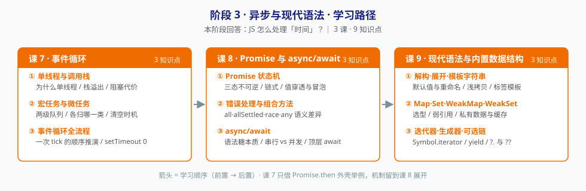

# 阶段 3：异步与现代语法

> 所属课程：JavaScript 语言核心（ES6+） ｜ 故事章节：**与时间打交道** ｜ 上一阶段：[阶段 2 函数与对象](../2-函数与对象/overview.md)
> 返回：[学习路径总览](../01-学习路径总览.md) ｜ [课程目录](../02-课程目录.md)

## 🎯 本阶段目标

- 搞清楚 JS 怎么处理"时间"：**单线程 + 调用栈 + 任务队列** 三个零件，缺一不可。
- 理解宏任务与微任务是**两级队列**，清空时机决定了所有"输出顺序题"的答案——从此靠推演而非靠试。
- 认清 `async/await` 不是新机制，是 Promise 的**语法糖**——理解这点才知道怎么把串行改成并发。

## 📌 前置约定（重要）

课 7 讲微任务时，会借用 `Promise.then` 的**外壳**举例（"它是微任务"），但 Promise 的完整机制留到课 8 展开。

这是**刻意的顺序安排，不是遗漏**：先把事件循环这台机器讲清楚，再讲 Promise 这个零件，理解成本更低。

## 📍 学习重点

| 重点 | 为什么重要 |
|------|-----------|
| 单线程 + 调用栈 | 为什么 JS 是单线程？因为要操作 DOM 且不能有并发冲突。理解动机，才能理解为什么要异步 |
| 宏任务与微任务 | 两级队列的**清空时机**是唯一难点。掌握它，所有输出顺序题都是同一道题 |
| 事件循环全流程 | 一次 tick 的完整顺序。这是"能在脑子里跑一遍异步代码"的能力来源 |
| Promise 状态机 | 三态不可逆 + then 返回新 Promise = 链式调用与错误冒泡的全部基础 |
| async/await 的真身 | 它是语法糖。知道这点，才知道 `await` 放在循环里会退化成串行 |

## ✅ 必须掌握的知识点

| 知识点 | 所属课 | 学完应能 |
|--------|--------|----------|
| 单线程与调用栈 | 课 7 | 解释为什么 JS 是单线程；说出栈溢出的触发条件 |
| 宏任务与微任务 | 课 7 | 对 `setTimeout` / `Promise.then` / `queueMicrotask` 正确归类，说出微任务的清空时机 |
| 事件循环全流程 | 课 7 | 推演任意 `setTimeout` + Promise 混合代码的输出顺序；解释为什么 `setTimeout(fn, 0)` 不是立即 |
| Promise 状态机 | 课 8 | 说清三态不可逆、then 返回新 Promise、值穿透与错误冒泡 |
| 错误处理与组合方法 | 课 8 | 区分 `all` / `allSettled` / `race` / `any` 的语义，并选出适合"允许部分失败"场景的那个 |
| async/await | 课 8 | 把串行的 `await` 循环改成并发；说清 `try...catch` 与 `.catch` 的取舍 |
| 解构·展开·模板字符串 | 课 9 | 用解构 + 默认值重写配置合并；说清展开运算符是浅拷贝 |
| Map·Set·WeakMap·WeakSet | 课 9 | 说清 Map vs Object 的选型条件；用 WeakMap 做私有数据 |
| 迭代器·生成器·可选链 | 课 9 | 区分 `for...of` 与 `for...in`；用生成器写一个可暂停的序列 |

## 🗺️ 本阶段路径图

> 箭头 = 学习顺序（前置 → 后置）。

## 本阶段产出

- [x] `lessons/lesson-07-事件循环.md` ✅（2026-09-02）
- [ ] `lessons/lesson-08-Promise与async-await.md`
- [ ] `lessons/lesson-09-现代语法与内置数据结构.md`

> 实操环境：Node.js v22.14.0（Windows PowerShell）。
