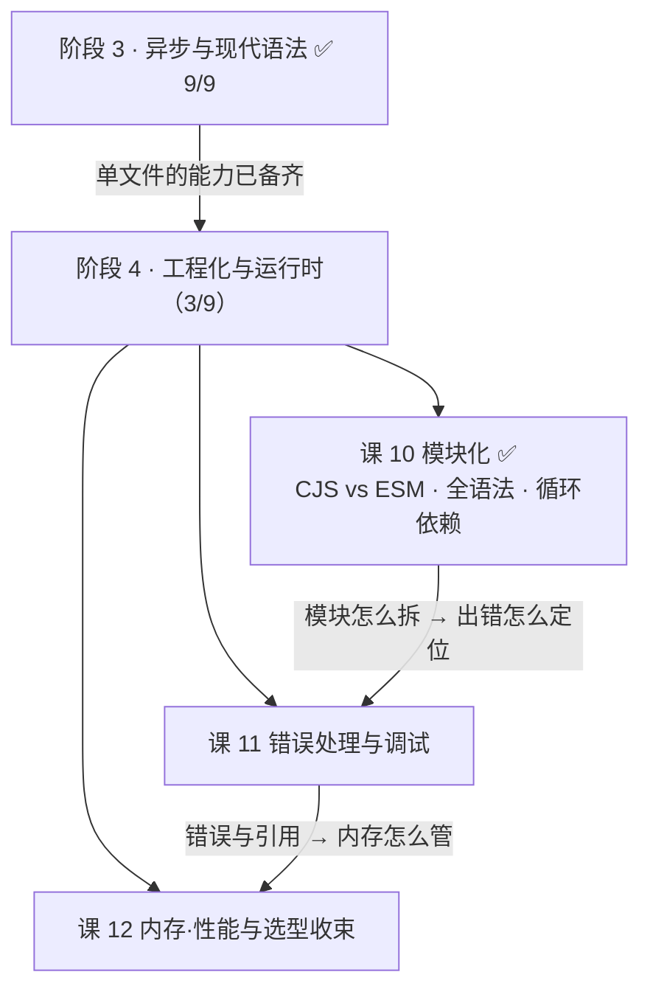
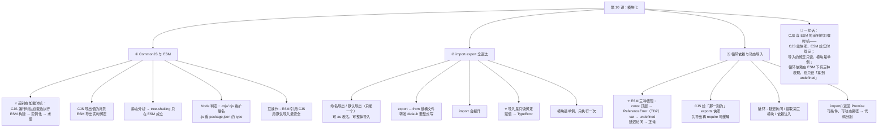

# 第 10 课：模块化

> 所属阶段：阶段 4《工程化与运行时》｜ 水平：入门 ｜ 本课知识点：CommonJS 与 ESM、import·export 全语法、循环依赖与动态导入
> 故事情节：主角的项目从 1 个文件长到 30 个文件，`require` 和 `import` 混用炸了——这一课把"代码怎么组织"这件事一次讲透
> 🎯 **本课承载「决策参考」目标**：CommonJS vs ESM 的选型对比 + 翻转条件
> ✅ 状态：已完成（2026-09-03）｜ 实操环境：Node.js v22.14.0（文中所有输出均为本机实测，采用临时模块目录验证后删除）

## 🎯 本课目标

- 说清 ESM 的"**实时绑定**"与 CommonJS 的"**值拷贝**"差异及后果，解释为什么 tree-shaking 只在 ESM 上成立
- 用命名导出 / 默认导出 / 转发写出多模块项目，解释导入绑定为什么是**只读**的
- 解释 ESM 循环依赖的三种表现（含**报错**的那种），给出破环手段，用 `import()` 做代码分割

## 📌 知识点导航

| # | 知识点 | 状态 |
|---|--------|------|
| 1 | CommonJS 与 ESM | ✅ |
| 2 | import·export 全语法 | ✅ |
| 3 | 循环依赖与动态导入 | ✅ |

---

## 第一幕：起源与场景引入

> 🏛️ **起源**：JS 诞生后的**头十四年没有官方模块系统**。
>
> 1995 年 JS 被设计成"给网页加点小动效"的脚本，不需要模块。到了 2009 年，**CommonJS** 规范在 Node.js 社区成形——它给服务端 JS 补上了 `require` / `module.exports`。同年 **AMD**（异步模块定义）在浏览器侧流行，靠 `require.js` 之类的加载器工作。
>
> 官方方案 **ESM（ES Modules）** 直到 **ES6（2015 年 6 月）**才进标准，而 Node 真正默认支持它又过了几年。**于是今天的项目里，两套模块系统同时存在**。
>
> （核查于 2026-09，来源：Wikipedia「ECMAScript version history」——ES2015 一节明确列出 "ES6 modules like `import ... from ...`; `export const Foo`"）
>
> ⏳ **置信度提示**：关于 CommonJS / AMD 的具体诞生年份与推动者，本课未逐一检索权威一手来源，故只作背景陈述、不作精确断言；下文所有**行为结论均为本机实测**。

> 🎬 **场景**：你的项目从 1 个文件长到 30 个文件。

你新写了一个 ESM 模块，想复用两年前写的老工具库：

```js
// utils.cjs —— 两年前写的 CommonJS 老模块
module.exports = { formatDate, formatMoney };

// report.mjs —— 你新写的 ESM 模块
import { formatDate } from './utils.cjs';
```

一运行就炸：

```
SyntaxError: Named export 'formatDate' not found.
The requested module './utils.cjs' is a CommonJS module,
which may not support all module.exports as named exports.
```

你改成默认导入，居然就好了：

```js
import utils from './utils.cjs';
utils.formatDate(new Date());   // ✅ 能跑
```

松了口气，接着又撞上第二个：

```js
import { count } from './counter.mjs';
count++;
// TypeError: Assignment to constant variable.
```

**我只是想加个数，为什么不行？**

---

## 第二幕：认知冲突

> ❓ **问题**：`require` 和 `import` 看起来都是"把别的文件拿过来用"，差别到底在哪？

三个困惑：

1. **为什么 `import { formatDate } from './utils.cjs'` 炸了，改成默认导入就好了？** 明明导出对象上就有 `formatDate` 这个属性啊。
2. **为什么导入进来的 `count` 不能改？** 我在自己文件里 `count++` 都不行——它是常量吗？
3. **两个模块互相 import 时会怎样？** 为什么有人说"拿到 undefined"，我却直接报错了？

| 困惑 | 答案藏在 |
|------|---------|
| 命名导入 CJS 为什么炸 | **知识点 1**：加载时机不同 + ESM 要**静态分析**导出名 |
| 导入的绑定为什么不能改 | **知识点 2**：导入的是**只读绑定**，不是变量副本 |
| 循环依赖的三种表现 | **知识点 3**：ESM 的**实例化 + 求值两阶段**决定了它（含 TDZ） |

> 💡 这三个困惑的答案指向**同一件事**：**CommonJS 与 ESM 的差别不在语法，而在"什么时候把模块加载进来"**。抓住这一条，本课的三块内容就全串起来了。

---

## 第三幕：层层揭示

### 知识点 1：CommonJS 与 ESM

> 本知识点关键点：语法差异 / 值的拷贝（`require`）vs 实时绑定（`import`） / 运行时加载 vs 编译时静态分析 / tree-shaking 的前提 / 在 Node 中如何启用 ESM（`package.json` 的 `type` 字段与 `.mjs`/`.cjs`）

#### 一句话定义

**CommonJS 在运行时"边加载边执行"，导出的是值的拷贝；ESM 先在编译期建好依赖图与绑定、再统一求值，导出的是实时绑定（live binding）。** 这个差别不在语法，而在**加载时机**。

#### 直觉建立（类比）

把模块想成**外卖**：

- **CommonJS** = **打电话点餐**：你说要什么，店家**当场做一份**，装盒递给你。之后店家再改菜单、再涨价，你手上这盒**不会变**（值的拷贝）。
- **ESM** = **看店里的实时菜单**：你拿到的不是一份菜，而是**指向那道菜的取餐凭证**。店家改了配方，你下次去取就是新的（实时绑定）。

> 💡 **类比的边界**：外卖是你**主动打电话**才发生（运行时）；而 ESM 的"建依赖图"是**在你下单前**就完成的——店家先把整条街的菜单都收齐、检查有没有缺货，再开始做菜。这正是 ESM 能在**编译期发现错误**的原因。

#### 核心原理

**① 加载机制：一步走 vs 三步走**


| | CommonJS | ESM |
|---|----------|-----|
| **阶段** | 一步：require 时**立刻加载并执行** | 三步：**构建**（解析依赖图）→ **实例化**（建立绑定）→ **求值**（执行代码） |
| **发生时机** | 运行时 | 构建在**编译期**，实例化与求值在运行期 |
| **导出的是什么** | `module.exports` 对象；基本类型是**值的拷贝** | **实时绑定**（同一个内存位置） |
| **能否静态分析** | ❌ 不能 | ✅ 能 |
| **错误何时暴露** | 运行时（调到那行才知道） | 构建期（语法错误、缺失导出**启动就报**） |

**② 值拷贝 vs 实时绑定（实测）**

```js
// ===== CommonJS =====
// cjs-counter.cjs
let count = 0;
function inc() { count++; }
module.exports = { count, inc };      // ← count 在此刻被求值并拷贝成 0

// cjs-main.cjs
const { count, inc } = require('./cjs-counter.cjs');
console.log(count);   // 0
inc(); inc();
console.log(count);   // 0   ← 不变！拿到的是拷贝

// ===== ESM =====
// esm-counter.mjs
export let count = 0;
export function inc() { count++; }

// esm-main.mjs
import { count, inc } from './esm-counter.mjs';
console.log(count);   // 0
inc(); inc();
console.log(count);   // 2   ← 跟着变，因为是同一个绑定
```

> 🔑 **后果**：在 CommonJS 里，如果模块导出的是一个**会变的原始值**，你拿到手的那份就是**过期的快照**。而 ESM 永远给你最新的。

**③ 为什么 tree-shaking 只在 ESM 上成立**

**Tree-shaking**（摇树）= 打包时把**没被用到的导出**剔除掉。它成立需要两个前提，ESM 都满足，CommonJS 都不满足：

| 前提 | ESM | CommonJS |
|------|-----|----------|
| **能静态确定"依赖了谁"** | ✅ `import` 必须在**顶层**、路径必须是**字符串字面量**（实测：写在 `if` 里直接 `SyntaxError: Unexpected token '{'`） | ❌ `require` 可以写在任何地方、路径可以是**变量**（实测：`require('./' + name)` 正常工作） |
| **能静态确定"谁被用了"** | ✅ `export const x` 是声明式的，没被 import 就能删 | ❌ 导出是往 `module.exports` 对象上**动态挂属性**，无法判断哪个没被用 |

```js
// CJS：这些都能跑 → 打包器无法预知，只能全部保留
if (flag) { mod = require('./a'); }
require('./' + variableName);

// ESM：这样写直接语法错误 → 所以依赖图一定能静态画出来
if (flag) { import { x } from './a'; }   // SyntaxError
```

> ⚠️ **推论**：想要产物体积小，就必须让**被引用的库提供 ESM 版本**。这也是现代 npm 包普遍提供 `"exports"` 字段里 `import` / `require` 双入口的原因。

**④ 在 Node 里启用 ESM：三条规则（实测）**

| 文件 | 判定依据 | 实测 |
|------|---------|------|
| `xxx.mjs` | **扩展名**决定 | 一律按 ESM 加载，不管 `package.json` |
| `xxx.cjs` | **扩展名**决定 | 一律按 CommonJS 加载，不管 `package.json` |
| `xxx.js` | 看**最近的** `package.json` 的 `type` 字段 | `"type": "module"` → ESM；`"type": "commonjs"` 或没有 → CommonJS |

```
.mjs 一律按 ESM 加载，不管 package.json
.cjs 一律按 CommonJS 加载，不管 package.json
type:"module" 下的 .js 被当 ESM
```

> 🔗 回扣课 8：这就是为什么**顶层 `await` 只在 ESM 里能用**——`.cjs` 里写会直接 `SyntaxError: await is only valid in async functions and the top level bodies of modules`。

**⑤ 互操作：混用时的三个坑（实测，Node v22.14.0）**

| 场景 | 结果 |
|------|------|
| **ESM → CJS，默认导入** | ✅ **永远安全**（实测三种 CJS 写法都通过） |
| **ESM → CJS，命名导入** | ⚠️ **取决于 CJS 的写法**（见下表） |
| **CJS → ESM，用 `require()`** | ✅ Node 22.12+ 起支持同步 `require(esm)`（实测返回 `{ __esModule: true, default: ..., name: ... }`）；但被 require 的 ESM **不能含顶层 await** |
| **CJS 里用 `import()`** | ✅ 可以（返回 Promise），这是 CJS 加载 ESM 的**兼容写法** |

**命名导入 CJS 的实测边界**（Node 用静态词法分析探测导出名）：

| CJS 的写法 | ESM 命名导入能否识别 |
|-----------|---------------------|
| `exports.name = ...` | ✅ 能（实测拿到 `'A-name'`） |
| `module.exports = { name: ... }` | ❌ 不能 → `SyntaxError: Named export 'name' not found` |
| `const o = {}; o.name = ...; module.exports = o;` | ❌ 不能 → 同上 |

> 🎯 **实践结论**：在 ESM 里引用 CommonJS 模块，**一律用默认导入**（`import utils from './utils.cjs'`）——它对任何写法都安全。命名导入只在对方是"纯 `exports.x = ...` 写法"时才碰运气。

**⑥ 元信息的差异**

| | CommonJS | ESM |
|---|----------|-----|
| 当前文件路径 | `__filename` / `__dirname` | 用 `import.meta.url`（实测：ESM 里 `typeof __dirname` 是 `undefined`） |
| `import.meta` | ❌ 用了就 `SyntaxError: Cannot use 'import.meta' outside a module` | ✅ 可用 |

#### 示例演示

见上方各段（全部为实测，文件布局见**第四幕**）。

#### 常见误区

1. **"`import` 只是 `require` 的新写法"** → 不。加载时机完全不同，这是本课的核心。
2. **"ESM 导入的是值的副本"** → 是**实时绑定**，导出方改了导入方看得到（实测 0 → 2）。
3. **"CommonJS 也能 tree-shaking"** → 不能。依赖与导出都无法静态确定。
4. **"`.js` 默认是 CommonJS"** → 取决于最近 `package.json` 的 `type` 字段；没有 `package.json` 时 Node 还会做**语法检测**（课 8 实测过）。
5. **"ESM 里能 `require`"** → 不能（`require is not defined`）；反过来 CJS 里可以用 `import()`。

#### 一句话记住

> **CJS 运行时加载、导出的是值的拷贝；ESM 先建图再求值、导出的是实时绑定——也正因为图是静态的，tree-shaking 才只在 ESM 上成立。**

> ✅ **困惑 1 已解**：`import { formatDate } from './utils.cjs'` 之所以炸，是因为 **ESM 的命名导入要靠静态分析确定导出名**，而 `module.exports = { ... }` 这种写法 Node 探测不出 `formatDate` 这个名字。默认导入不依赖名字探测，所以永远安全。

#### 官方文档

- [模块 - MDN（JavaScript modules）](https://developer.mozilla.org/zh-CN/docs/Web/JavaScript/Guide/Modules)
- [Node.js：CommonJS 模块](https://nodejs.org/api/modules.html)
- [Node.js：ESM 模块](https://nodejs.org/api/esm.html)
- [Node.js：package.json 的 type 字段](https://nodejs.org/api/packages.html#type)

---

### 知识点 2：import·export 全语法

> 本知识点关键点：命名导出与默认导出（以及混用的坑）/ `export ... from` 转发 / `import` 的提升 / 只读绑定与"导入变量是常量"的直觉 / 模块是单例（多次 import 只执行一次）

#### 一句话定义

ESM 提供**命名导出**（`export const x`）与**默认导出**（`export default`）两种形式，支持重命名、聚合转发与整体导入；**导入进来的绑定是只读的**，且**模块是单例**——无论被 import 多少次，模块体只执行一次。

#### 直觉建立（类比）

把模块想成**一家店的橱窗**：

- **命名导出** = 橱窗里**贴了名字的商品**（`export const formatDate`）——你得按名字拿。
- **默认导出** = 橱窗里**一件主推品**（`export default`）——不用知道名字，默认就给你它。
- **转发** = 这家店**代卖隔壁店的东西**（`export { x } from './other'`）。

> 💡 **类比的边界**：现实里你把商品买回家，想怎么改就怎么改；**ESM 不行**——你拿到的是"店里那件商品的取货凭证"，只能**取用**，不能**换掉**。想改，只能让店里改（导出方改）。

#### 核心原理

**① 命名导出（推荐）**

```js
// math.js —— 声明时直接导出
export const PI = 3.14;
export function add(a, b) { return a + b; }

// 或者集中导出（更推荐：一眼看清模块对外提供了什么）
const PI = 3.14;
function add(a, b) { return a + b; }
export { PI, add };
export { PI as 圆周率 };          // 导出时改名
```

**② 默认导出（一个模块只能有一个）**

```js
// logger.js
export default function log(msg) { console.log(msg); }

// 导入时名字随便起（因为没有名字约束）
import log from './logger.js';
import 随便什么名字 from './logger.js';
```

**③ 混用与重命名**

```js
import log, { PI, add as plus } from './x.js';   // 默认 + 命名，命名可改名
import * as math from './math.js';                // 整体导入成命名空间对象
math.add(1, 2);
```

**⚠️ 混用的坑**：默认导出和命名导出是**两套东西**，不要混着理解。上面的 `import log, { PI }` 里，`log` 是默认导出的值，`PI` 是命名导出的绑定——**它们没有任何关系**。

**④ 转发（`export ... from`）：做"桶文件"**

```js
// utils/index.js —— 把散落在多个文件的工具聚合成一个入口
export { formatDate, formatMoney } from './format.js';
export { debounce, throttle } from './timing.js';
export { default as Logger } from './logger.js';   // 转发默认导出要显式写 default

// 外部只需要
import { formatDate, debounce } from './utils/index.js';
```

这是大型项目里最常见的组织手法（俗称 barrel file / 桶文件）。

**⑤ `import` 的提升**

`import` 声明会被**提升到模块顶部**，所以可以"先使用后导入"：

```js
console.log(add(1, 2));     // ✅ 能跑
import { add } from './math.js';
```

它和课 3 讲的函数声明提升是一个道理——但因为 ESM 的构建阶段在**求值之前**，所以依赖此时已经就绪。

**⑥ 只读绑定：为什么 `count++` 不行（实测）**

```js
import { count } from './esm-counter.mjs';
count = 99;
// TypeError: Assignment to constant variable.
```

**原因**：导入的不是"值的副本"，而是**指向导出模块里那个绑定的引用**。你改它，等于**跨模块去改别人家的变量**——ESM 直接禁止（就像 `const` 一样）。

想在自己这边改？先存成局部变量：

```js
import { count } from './esm-counter.mjs';
let local = count;      // ✅ 拷一份出来
local++;
```

> 🎯 想让导出方可变，正确做法是**导出一个修改函数**（如前面的 `inc()`），由导出方自己改自己的绑定。

**⑦ 模块是单例（实测）**

```js
// singleton-mod.mjs
console.log('[打印] singleton-mod 被执行了一次');
export const value = 1;

// a.mjs 和 b.mjs 都 import 它，main.mjs 再 import a 和 b
```

实测输出：

```
[打印] singleton-mod 被执行了一次     ← 只打印一次
fromA = 1 | fromB = 1
```

**无论被多少个模块 import，模块体只执行一次**，之后所有人都共享同一份实例状态。这既带来了"天然单例"的便利（比如做配置、连接池），也带来了"模块级可变状态"的风险。

#### 示例演示

见上方各段（全部为实测）。

#### 常见误区

1. **"一个模块可以有多个默认导出"** → 只能有**一个**（重复会 `SyntaxError`）。
2. **"默认导出和命名导出是一回事"** → 是两套机制，`import x, { y }` 里两者无关。
3. **"导入进来的变量可以随便改"** → 是**只读绑定**，赋值会 `TypeError: Assignment to constant variable.`
4. **"每次 import 都会重新执行模块"** → 不会。模块是**单例**，只执行一次。
5. **"转发不用写 `default`"** → 转发默认导出必须显式写 `export { default as X } from ...`。

#### 一句话记住

> **命名导出按名字取、默认导出整包给、`export ... from` 做桶文件；导入的绑定是只读的（想改就拷一份），模块是单例（只执行一次）。**

> ✅ **困惑 2 已解**：`count` 之所以不能改，是因为你拿到的是**导出模块里那个绑定的只读引用**，不是副本。ESM 禁止跨模块写别人的变量——想改就 `let local = count` 拷一份，或者让导出方提供修改函数。

#### 官方文档

- [import - MDN](https://developer.mozilla.org/zh-CN/docs/Web/JavaScript/Reference/Statements/import)
- [export - MDN](https://developer.mozilla.org/zh-CN/docs/Web/JavaScript/Reference/Statements/export)
- [import() - MDN](https://developer.mozilla.org/zh-CN/docs/Web/JavaScript/Reference/Operators/import)

---

### 知识点 3：循环依赖与动态导入

> 本知识点关键点：ESM 循环依赖的三种表现（**并非都"不报错"**）/ CommonJS 的处理差异（拿到不完整的 `exports`）/ 破环手段（提取第三模块、改为函数内延迟引用）/ 动态 `import()` 与代码分割

#### 一句话定义

**循环依赖**指两个（或多个）模块互相引用。它**不是语法错误**，模块系统都能跑完——但你可能在某个时刻读到**尚未初始化的绑定**。ESM 的表现取决于**声明方式与访问时机**（可能是 `undefined`，也可能直接 `ReferenceError`）；CommonJS 则是拿到**"那一刻的" `exports` 快照**。

#### 直觉建立（类比）

把循环依赖想成**两个人互相等对方先开口**：

- **CommonJS**：A 说到一半被 B 打断，B 问 A"你刚才说了啥"，A 回答"我只说到这"——B 拿到的是**半成品**（不完整的 exports）。
- **ESM**：A 和 B 先把**要说的提纲都写好并交换**（实例化阶段），然后按次序正式发言（求值阶段）。谁先开口，就可能在对方还没说到那句时去翻提纲——翻到的是**"待填写"**（TDZ）。

> 💡 **类比的边界**：这是本课**最容易记错**的地方——很多人以为"ESM 循环依赖不报错，只拿到 undefined"。**实测证明这是不成立的简化**。继续看下面的三种情况。

#### 核心原理

**① ⚠️ ESM 循环依赖的三种表现（实测，不是一种！）**

三个模块：`a.mjs` 与 `b.mjs` 互相 import，`main.mjs` 引入 `a.mjs`。

| 情况 | 写法 | 实测结果 |
|------|------|---------|
| **A：`const` / `let` + 顶层同步访问** | `export const a = 'A'` 且模块体里 `console.log(b)` | 💥 **`ReferenceError: Cannot access 'a' before initialization`** |
| **B：`var` + 顶层访问** | `export var av = 'AV'` | `undefined` ← var 在实例化阶段被初始化为 `undefined`，不进 TDZ |
| **C：任意声明 + 延迟访问**（放进函数里） | `export function getA() { return a; }` | ✅ **正常拿到值**（实测得到 `'A'` / `'B'`） |

实测输出对照：

```
# 情况 A（const）
ReferenceError: Cannot access 'a' before initialization

# 情况 B（var）
  b 里读 av = undefined   ← var 声明会被提升为 undefined，不进 TDZ
  a 里读 bv = BV

# 情况 C（延迟访问）
  延迟调用 getA()   = A
  延迟调用 getB()   = B   ← 只要不在模块顶层同步读取，循环依赖完全正常
```

> 🔑 **为什么 A 会报错？** 这正是课 1 讲的 **TDZ**：ESM 的 `export const a = 'A'` 在**实例化阶段**就建立了绑定，但要到**求值阶段**执行到那一行才被赋值。循环依赖时，`a.mjs` 还没执行到 `export const a`，`b.mjs` 就去读它——**等于在 TDZ 里读一个 const**，于是抛 `ReferenceError`。
>
> **一句话**：**循环依赖本身不报错，"在对方初始化完成前就去读它的 `const`"才会报错。**

**② CommonJS 循环依赖：拿到的是"那一刻的" exports 快照**

CommonJS 没有实例化阶段，`require` 的返回值就是**执行到那一行时 `exports` 对象的内容**。所以**导出语句写在 require 前面还是后面，结果完全不同**（实测）：

```js
// ===== 情况一：先导出，再 require =====
// a.cjs
exports.a = 'A';                        // ← 先导出
const b = require('./b.cjs');           // ← 再 require
console.log('a 看到 b =', b);
// b.cjs
const a = require('./a.cjs');
console.log('b 看到 a =', a);           // ← { a: 'A' } 完整！
exports.b = 'B';

// 实测输出：
//   b 看到 a = { a: 'A' }
//   a 看到 b = { b: 'B' }
```

```js
// ===== 情况二：先 require，再导出 =====
// a2.cjs
const b = require('./b2.cjs');          // ← 先 require
console.log('a 看到 b =', b);
exports.a = 'A';                        // ← 再导出
// b2.cjs
const a = require('./a2.cjs');
console.log('b 看到 a =', a);           // ← {} 空对象！
exports.b = 'B';

// 实测输出：
//   b 看到 a = {}   ⚠️ 空对象！
//   a 看到 b = { b: 'B' }
```

> 🎯 **实践结论（CommonJS）**：**把 `exports.xxx = ...` 写在 `require` 之前**，能显著降低循环依赖踩坑概率。但这是**缓解**，不是根治。

**③ 破环手段（两种都适用）**

| 手段 | 做法 | 适用 |
|------|------|------|
| **① 延迟访问**（最轻量） | 不要模块顶层同步读，改成**函数里读**、调用方晚点调 | ESM 的情况 C；绝大多数场景 |
| **② 提取第三模块**（最彻底） | 把互相依赖的那部分抽到独立的 `c.mjs`，a 和 b 都只依赖 c | 依赖确实纠缠时 |
| **③ 依赖注入** | 由外部把依赖当参数传进去，而不是 import | 类 / 工厂函数场景 |

```js
// ② 提取第三模块：把共享的常量/类型抽出去
// constants.mjs
export const A = 'A';
export const B = 'B';
// a.mjs
import { B } from './constants.mjs';
// b.mjs
import { A } from './constants.mjs';
// a 与 b 不再互相依赖 → 环消失
```

> 🔑 **判据**：循环依赖通常意味着**职责划分有问题**。能用"提取第三模块"解决就别用"延迟访问"绕——后者只是让 bug 变成"大部分时候正常"。

**④ 动态 `import()`：按需加载 + 代码分割**

静态 `import` 必须写在顶层、路径必须是字面量（知识点 1 已实测）。**动态 `import()` 是个表达式**——它可以写在**任何地方**，返回 **Promise**：

```js
// esm-dyn-main.mjs
console.log('主模块开始');
const shouldLoad = true;
if (shouldLoad) {
  const mod = await import('./esm-dyn-mod.mjs');   // ← 可以写在 if 里
  console.log('动态拿到:', mod.heavy);
}
console.log('主模块结束');

// 实测输出：
//   主模块开始
//   [打印] 动态导入的模块被加载了
//   动态拿到: 我很重，按需加载
//   主模块结束
```

关键点：

- **返回 Promise**，所以要 `await` 或 `.then()`；
- **可以在条件 / 函数 / 循环里**，路径可以是**运行时拼出来的**；
- **CommonJS 里也能用**（实测通过）——这是 CJS 加载 ESM 的**推荐写法**；
- **代码分割**：浏览器打包器（Vite / webpack / Rollup）遇到 `import()` 会把该模块切成**独立的 chunk**，只有真正执行到才去下载——首屏体积因此变小。

```js
// 典型用法：路由级懒加载（前端框架里的标配）
button.addEventListener('click', async () => {
  const { openEditor } = await import('./heavy-editor.js');
  openEditor();
});
```

> ⚠️ **注意**：`import()` 在 **CommonJS 里**加载带**顶层 await** 的 ESM 没问题，但用 `require()` 同步加载就不行（会报 `ERR_REQUIRE_ASYNC_MODULE`）。

#### 示例演示

文件布局与运行命令见**第四幕**。

#### 常见误区

1. **"ESM 循环依赖不报错，只会拿到 undefined"** → ❌ **不准确**。实测：`const` + 顶层访问会抛 **`ReferenceError`**；`var` 才拿到 `undefined`；延迟访问则完全正常。
2. **"循环依赖是语法错误"** → 不是。模块系统能跑完，问题出在**读到未初始化的绑定**。
3. **"CommonJS 循环依赖一定拿到空对象"** → 取决于**导出与 require 的先后顺序**（实测：先导出再 require → 完整；反之 → `{}`）。
4. **"动态 `import()` 就是异步版的 `import`"** → 它更灵活（可条件、可动态路径），且是**代码分割**的触发点。
5. **"CommonJS 里不能用 `import()`"** → 能（实测通过），这是 CJS 加载 ESM 的推荐写法。

#### 一句话记住

> **ESM 循环依赖有三种表现（const 顶层访问报错 ReferenceError、var 拿到 undefined、延迟访问正常），根因是实例化与求值分两阶段；CommonJS 给的是"那一刻的" exports 快照，先导出再 require 能缓解。破环靠"延迟访问"或"提取第三模块"，按需加载用返回 Promise 的动态 `import()`。**

> ✅ **困惑 3 已解**：你之所以**报错**而别人拿到 `undefined`，是因为你们用的**声明方式和访问时机不同**——`export const` 在 TDZ 里被读会抛 `ReferenceError`，`export var` 则只是 `undefined`。把读取挪进函数（延迟访问），两种都能拿到正确值。

#### 官方文档

- [循环依赖 - Node.js ESM 文档](https://nodejs.org/api/esm.html#cycles)
- [模块循环 - MDN](https://developer.mozilla.org/zh-CN/docs/Web/JavaScript/Guide/Modules#%E5%BE%AA%E7%8E%AF%E4%BE%9D%E8%B5%96)
- [动态 import - MDN](https://developer.mozilla.org/zh-CN/docs/Web/JavaScript/Reference/Operators/import)

---

## 🎯 决策参考：CommonJS vs ESM 该怎么选

> 本课承载的「决策参考」专项。给**对比 + 翻转条件**，不给信仰。

| 维度 | CommonJS | ESM |
|------|----------|-----|
| 语法 | `require()` / `module.exports` | `import` / `export` |
| 加载时机 | 运行时，**边加载边执行** | 编译期建图 → 实例化 → 求值 |
| 导出的是 | 值的**拷贝** | **实时绑定** |
| 静态可分析 | ❌ | ✅（**tree-shaking 的前提**） |
| 顶层 `await` | ❌ `SyntaxError` | ✅ |
| `import.meta` | ❌ | ✅ |
| `__dirname` / `__filename` | ✅ | ❌（要用 `import.meta.url`） |
| 条件 / 动态路径加载 | ✅ 原生支持 | 需 `import()` |
| Node 生态兼容 | ✅ 二十年存量包 | ✅ 新包默认 |
| 浏览器原生 | ❌ 需打包 | ✅ `<script type="module">` |

### 选型建议

| 场景 | 选 | 理由 |
|------|-----|------|
| **新项目（Node 或前端）** | **ESM** | 静态分析带来 tree-shaking；能顶层 await；浏览器与 Node 统一语法 |
| **写要发布的 npm 库** | **ESM 为主，同时提供 CJS 入口** | 用 `package.json` 的 `exports` 字段给双入口，两边都照顾 |
| **维护大型 CommonJS 老项目** | **保持 CJS，新模块用 ESM，靠 `.mjs`/`.cjs` 明确区分** | 一次性迁移风险远大于收益 |
| **需要动态拼路径加载**（插件系统） | **CJS 的 `require`，或 ESM 的 `import()`** | 前者同步、后者异步，看是否需要 `await` |
| **写配置文件**（如 `eslint.config.js`） | 看工具要求 | 很多工具两套都支持；用 `type` 字段决定 |

### 🔄 什么条件下该改选另一个（翻转条件）

**从 ESM 改回 CJS，如果**：

1. 你依赖的某个**关键库只有 CJS 版本**且用了动态导出写法，命名导入一直探测不到；
2. 你的代码大量依赖 `__dirname` / `require.resolve` 且不想改写；
3. 项目需要**同步**动态加载模块（`import()` 是异步的，会改变调用方代码结构）。

**从 CJS 迁到 ESM，如果**：

1. 你在意**产物体积**（前端项目几乎都在意）；
2. 你需要**顶层 await**（如启动时读配置再导出）；
3. 团队新成员已经习惯 `import` 写法，混用造成持续的认知负担；
4. 你要把代码**同时跑在浏览器和 Node**（同构/SSR）。

> 💡 **最实用的一条**：**不要在一个项目里长期混用**。混用时，至少用 `.mjs` / `.cjs` 扩展名**把边界写清楚**，别让 `type` 字段去猜。

---

## 第四幕：实操验证

本课需要**多个文件**才能演示。请在一个空目录里按下面的布局建文件，然后逐条运行。

> 💡 建议：目录里**不要放 `package.json`**，这样 `.mjs` / `.cjs` 的扩展名就是唯一的判定依据，结果最清晰（`.js` 的行为则取决于 `type` 字段）。
> 实测环境：Node.js v22.14.0 / Windows PowerShell。

### 文件布局

```
demo/
├── cjs-counter.cjs
├── cjs-main.cjs
├── esm-counter.mjs
├── esm-main.mjs
├── esm-readonly.mjs
├── esm-singleton-mod.mjs
├── esm-singleton-a.mjs
├── esm-singleton-b.mjs
├── esm-singleton-main.mjs
├── cjs-cond.cjs
├── esm-cond.mjs
├── esm-circ-a.mjs / esm-circ-b.mjs / esm-circ-main.mjs
├── esm-circ-var-a.mjs / esm-circ-var-b.mjs / esm-circ-var-main.mjs
├── esm-circ-defer-a.mjs / esm-circ-defer-b.mjs / esm-circ-defer-main.mjs
├── cjs-circ-a.cjs / cjs-circ-b.cjs / cjs-circ-main.cjs
├── cjs-circ2-a.cjs / cjs-circ2-b.cjs / cjs-circ2-main.cjs
├── esm-dyn-mod.mjs / esm-dyn-main.mjs
└── esm-tla.mjs / cjs-tla.cjs
```

### ① 值拷贝 vs 实时绑定

```js
// cjs-counter.cjs
let count = 0;
function inc() { count++; }
module.exports = { count, inc };   // count 在此刻被「求值并拷贝」成 0
```

```js
// cjs-main.cjs
const { count, inc } = require('./cjs-counter.cjs');
console.log('  调用前 count =', count);
inc(); inc();
console.log('  调用两次后 count =', count, '  ← CommonJS 拿到的是拷贝，不会跟着变');
```

```js
// esm-counter.mjs
export let count = 0;
export function inc() { count++; }
```

```js
// esm-main.mjs
import { count, inc } from './esm-counter.mjs';
console.log('  调用前 count =', count);
inc(); inc();
console.log('  调用两次后 count =', count, '  ← ESM 是实时绑定，跟着变');
```

运行：

```bash
node cjs-main.cjs
node esm-main.mjs
```

**实测输出**：

```
# node cjs-main.cjs
  调用前 count = 0
  调用两次后 count = 0   ← CommonJS 拿到的是拷贝，不会跟着变

# node esm-main.mjs
  调用前 count = 0
  调用两次后 count = 2   ← ESM 是实时绑定，跟着变
```

### ② 只读绑定与模块单例

```js
// esm-readonly.mjs
import { count } from './esm-counter.mjs';
try {
  count = 99;
} catch (e) {
  console.log('  给导入的绑定赋值 =>', e.constructor.name + ': ' + e.message);
}
```

```js
// esm-singleton-mod.mjs
console.log('  [打印] singleton-mod 被执行了一次');
export const value = 1;
```

```js
// esm-singleton-a.mjs
import { value } from './esm-singleton-mod.mjs';
export const fromA = value;
```

```js
// esm-singleton-b.mjs
import { value } from './esm-singleton-mod.mjs';
export const fromB = value;
```

```js
// esm-singleton-main.mjs
import { fromA } from './esm-singleton-a.mjs';
import { fromB } from './esm-singleton-b.mjs';
console.log('  fromA =', fromA, '| fromB =', fromB, '（两个模块都 import 了同一个模块）');
```

运行：

```bash
node esm-readonly.mjs
node esm-singleton-main.mjs
```

**实测输出**：

```
# node esm-readonly.mjs
  给导入的绑定赋值 => TypeError: Assignment to constant variable.

# node esm-singleton-main.mjs
  [打印] singleton-mod 被执行了一次
  fromA = 1 | fromB = 1 （两个模块都 import 了同一个模块）
```

### ③ 静态分析（tree-shaking 的前提）

```js
// cjs-cond.cjs
const flag = true;
let mod = null;
if (flag) { mod = require('./cjs-counter.cjs'); }   // require 可以出现在任何地方
console.log('  CJS 条件 require 成功:', mod !== null, '（运行时才解析）');
const name = 'cjs-counter.cjs';
console.log('  CJS 用变量当路径也行:', typeof require('./' + name).inc);
```

```js
// esm-cond.mjs
const flag = true;
if (flag) { import { count } from './esm-counter.mjs'; }   // ← 静态 import 不能写在块里
```

运行：

```bash
node cjs-cond.cjs
node esm-cond.mjs
```

**实测输出**：

```
# node cjs-cond.cjs
  CJS 条件 require 成功: true （运行时才解析）
  CJS 用变量当路径也行: function

# node esm-cond.mjs
SyntaxError: Unexpected token '{'
```

### ④ 循环依赖：三种表现

```js
// 【A】const + 顶层访问 → 报错
// esm-circ-a.mjs
import { b } from './esm-circ-b.mjs';
export const a = 'A';
console.log('  a.mjs 里读 b =', b);

// esm-circ-b.mjs
import { a } from './esm-circ-a.mjs';
export const b = 'B';
console.log('  b.mjs 里读 a =', a);

// esm-circ-main.mjs
import './esm-circ-a.mjs';
```

```js
// 【B】var + 顶层访问 → undefined
// esm-circ-var-a.mjs
import { bv } from './esm-circ-var-b.mjs';
export var av = 'AV';
console.log('  a 里读 bv =', bv);

// esm-circ-var-b.mjs
import { av } from './esm-circ-var-a.mjs';
export var bv = 'BV';
console.log('  b 里读 av =', av, '  ← var 声明会被提升为 undefined，不进 TDZ');
```

```js
// 【C】延迟访问 → 正常
// esm-circ-defer-a.mjs
import { getB } from './esm-circ-defer-b.mjs';
export const a = 'A';
export function getA() { return a; }
export function callGetB() { return getB(); }

// esm-circ-defer-b.mjs
import { getA } from './esm-circ-defer-a.mjs';
export const b = 'B';
export function getB() { return b; }
export function callGetA() { return getA(); }

// esm-circ-defer-main.mjs
import { getA, callGetB } from './esm-circ-defer-a.mjs';
console.log('  延迟调用 getA()   =', getA());
console.log('  延迟调用 getB()   =', callGetB(), '  ← 只要不在模块顶层同步读取，循环依赖完全正常');
```

**实测输出**：

```
# A：node esm-circ-main.mjs
ReferenceError: Cannot access 'a' before initialization

# B：node esm-circ-var-main.mjs
  b 里读 av = undefined   ← var 声明会被提升为 undefined，不进 TDZ
  a 里读 bv = BV

# C：node esm-circ-defer-main.mjs
  延迟调用 getA()   = A
  延迟调用 getB()   = B   ← 只要不在模块顶层同步读取，循环依赖完全正常
```

```js
// 【CommonJS】先导出再 require → 完整
// cjs-circ-a.cjs
exports.a = 'A';                       // ← 先导出
const b = require('./cjs-circ-b.cjs'); // ← 再 require
console.log('  a 看到 b =', b);

// cjs-circ-b.cjs
const a = require('./cjs-circ-a.cjs');
console.log('  b 看到 a =', a);
exports.b = 'B';

// 【CommonJS】先 require 再导出 → 空对象
// cjs-circ2-a.cjs
const b = require('./cjs-circ2-b.cjs');
console.log('  a 看到 b =', b);
exports.a = 'A';
```

**实测输出**：

```
# 先导出再 require：node cjs-circ-main.cjs
  b 看到 a = { a: 'A' }
  a 看到 b = { b: 'B' }

# 先 require 再导出：node cjs-circ2-main.cjs
  b 看到 a = {}   ⚠️ 空对象！
  a 看到 b = { b: 'B' }
```

### ⑤ 动态导入与顶层 await

```js
// esm-dyn-mod.mjs
console.log('  [打印] 动态导入的模块被加载了');
export const heavy = '我很重，按需加载';

// esm-dyn-main.mjs
console.log('  主模块开始');
const shouldLoad = true;
if (shouldLoad) {
  const mod = await import('./esm-dyn-mod.mjs');   // 可以写在条件里，返回 Promise
  console.log('  动态拿到:', mod.heavy);
}
console.log('  主模块结束');

// esm-tla.mjs
const v = await Promise.resolve('顶层 await 可用');
console.log('  ESM:', v);

// cjs-tla.cjs
const v = await Promise.resolve('x');
console.log('  CJS:', v);
```

**实测输出**：

```
# node esm-dyn-main.mjs
  主模块开始
  [打印] 动态导入的模块被加载了
  动态拿到: 我很重，按需加载
  主模块结束

# node esm-tla.mjs
  ESM: 顶层 await 可用

# node cjs-tla.cjs
SyntaxError: await is only valid in async functions and the top level bodies of modules
```

### ⑥ Node 里启用 ESM

```bash
# .mjs / .cjs 由扩展名决定，与 package.json 无关
node xxx.mjs    # 一律按 ESM
node xxx.cjs    # 一律按 CommonJS

# .js 由最近的 package.json 的 type 字段决定
echo '{ "type": "module" }' > package.json
node plain-module.js    # 实测：按 ESM 加载
```

**实测输出**：

```
  .mjs 一律按 ESM 加载，不管 package.json
  .cjs 一律按 CommonJS 加载，不管 package.json
  type:"module" 下的 .js 被当 ESM
```

> ✅ **回扣场景**：三个困惑全部结案——
>
> - **"命名导入 CJS 为什么炸"**（知识点 1）：ESM 的命名导入依赖**静态探测导出名**，而 `module.exports = { ... }` 这种写法探测不出来 → `SyntaxError`。默认导入不依赖名字探测，所以永远安全。
> - **"导入的绑定为什么不能改"**（知识点 2）：它是**只读绑定**，不是副本 → `TypeError: Assignment to constant variable.`。想改就 `let local = count` 拷一份，或让导出方提供修改函数。
> - **"循环依赖到底怎样"**（知识点 3）：实测证明**不是一个答案而是三个**——`const` 顶层访问报 `ReferenceError`（TDZ）、`var` 拿到 `undefined`、延迟访问正常。CommonJS 则取决于导出与 require 的先后。
>
> 💡 **本课最反直觉的一条**：很多人以为"ESM 循环依赖不报错"。**实测推翻了这个简化说法**——用 `export const` 且在顶层读，是会**直接抛异常**的。

---

## 第五幕：体系收束



**本课在整条故事线里的位置**（阶段 4 章节名：**从一个文件到一个项目**）：

| 阶段 | 回答的问题 | 一句话 |
|------|-----------|--------|
| 阶段 1 | 值存在哪里、谁能看见它？ | 值与作用域的地基 |
| 阶段 2 | 函数怎么调？对象怎么连？ | 函数与原型两根支柱 |
| 阶段 3 | JS 怎么处理"时间"？ | 事件循环 + Promise + 现代语法 |
| **阶段 4 课 10** | **一个文件长成一个项目，代码怎么组织？** | **模块化的差异在加载时机，不在语法** |

**你现在会了什么**：

- 面对"`require` 和 `import` 混用炸了"，能立刻定位到**命名导出探测失败**，并给出默认导入的修法
- 面对"导入的变量改不动"，能解释这是**只读绑定**，并给出两种正确解法
- 面对循环依赖，能判断是三种情况中的哪一种，并给出破环方案
- 面对"该用 CJS 还是 ESM"，能给出**带翻转条件**的选型建议，而不是跟风

**本课的"包袱 vs 取舍"总账**（体例从课 1 延续至今）：

| 现象 | 归属 |
|------|------|
| 两套模块系统并存 | **历史包袱**（JS 头十四年没有官方模块系统；CJS 先在 Node 落地，ESM 2015 才进标准，存量生态无法一刀切） |
| CommonJS 的 `require` 能写在任何地方 | **设计取舍**（代价：无法静态分析 → 不能 tree-shaking；收益：**同步**、灵活，插件系统天然好用） |
| ESM 的 `import` 必须顶层、路径必须字面量 | **设计取舍**（代价：失去运行时灵活性；收益：静态可分析 → tree-shaking、构建期报错、循环依赖可预测） |
| 导入绑定只读 | **设计取舍**（代价：不能跨模块写；收益：模块边界清晰，一个模块的绑定不会被别人偷偷改掉） |
| ESM 循环依赖会 TDZ 报错 | **设计取舍**（代价：比 CJS 的"静默拿到半成品"更容易炸；收益：**炸在明处**——总比拿到一个 `{}` 然后一路运行到莫名其妙的地方强） |
| 模块是单例 | **设计取舍**（代价：模块级可变状态是共享的；收益：天然单例，配置 / 连接池直接受益） |

> 🔗 **下一步：课 11《错误处理与调试》**。项目拆成 30 个文件之后，第一个现实问题就是——**某个模块抛错了，怎么快速定位？** 课 11 会讲 Error 体系与 `throw`、`try/catch/finally` 与异步错误（回扣课 8 的 `unhandledrejection`）、以及调试工具链与 Source Map。
>
> ⚠️ 提醒：阶段 4 上完后还有两个收尾环节——**综合实战项目** + **实战经验 / 排障速查手册 / 场景解法库**。

---

## 🐞 常见误区（本课汇总）

1. **"`import` 只是 `require` 的新写法"** → 差别在**加载时机**，不在语法。
2. **"ESM 导入的是值的副本"** → 是**实时绑定**（实测 0 → 2）。
3. **"CommonJS 也能 tree-shaking"** → 不能，依赖与导出都无法静态确定。
4. **"`.js` 默认是 CommonJS"** → 看最近 `package.json` 的 `type`；没有时 Node 还会做语法检测。
5. **"ESM 里能 `require`"** → 不能；CJS 里可以用 `import()`。
6. **"一个模块可以有多个默认导出"** → 只能一个。
7. **"默认导出和命名导出是一回事"** → 两套机制，`import x, { y }` 里两者无关。
8. **"导入进来的变量可以改"** → 只读绑定，赋值会 `TypeError`。
9. **"每次 import 都重新执行模块"** → 模块是单例，只执行一次。
10. **"转发默认导出不用写 default"** → 必须写 `export { default as X } from ...`。
11. **"ESM 循环依赖不报错，只拿到 undefined"** → ❌ **三种表现**：`const` 顶层访问**报 ReferenceError**、`var` 拿 `undefined`、延迟访问正常。
12. **"循环依赖是语法错误"** → 不是，问题在读到**未初始化的绑定**。
13. **"CommonJS 循环依赖一定拿到空对象"** → 取决于导出与 require 的**先后顺序**。
14. **"动态 `import()` 只是异步版 import"** → 更灵活（可条件、可动态路径），且是**代码分割**的触发点。
15. **"CommonJS 里不能用 `import()`"** → 能，这是 CJS 加载 ESM 的推荐写法。

## 一图总结



## 课后小测

**Q1**：这段 ESM 代码的输出是什么？

```js
// counter.mjs
export let count = 0;
export function inc() { count++; }

// main.mjs
import { count, inc } from './counter.mjs';
inc(); inc();
console.log(count);
```

- A. `0`
- B. `2`
- C. `undefined`
- D. 报错（`count` 是只读的）

<details><summary>答案与解析</summary>

**答案：B**。

ESM 导出的是**实时绑定（live binding）**——导入方和导出方共享**同一个绑定**。所以 `inc()` 改了 `count`，导入方看到的也跟着变成 2。

如果把 `counter.mjs` 换成 CommonJS 写法（`module.exports = { count, inc }`），答案才是 **A（0）**——因为 `count` 在导出那一刻就被**求值并拷贝**成 0 了。

D 会让人误以为"只读 = 不能变"。注意区分：**只读是对导入方而言**（你不能 `count = 99`），但**导出方可以随时改它**，而且改了导入方看得到。

</details>

**Q2**：ESM 循环依赖，下面说法正确的是？

- A. 一定不报错，只会拿到 `undefined`
- B. 用 `export const` 且在模块**顶层同步读取**，会抛 `ReferenceError: Cannot access 'x' before initialization`
- C. 循环依赖是语法错误，启动就失败
- D. 无论怎么写，两边都能拿到正确值

<details><summary>答案与解析</summary>

**答案：B**。

**这是本课最容易记错的一条**。实测三种表现：

| 情况 | 结果 |
|------|------|
| `export const` + 顶层同步访问 | 💥 `ReferenceError: Cannot access 'a' before initialization` |
| `export var` + 顶层访问 | `undefined`（var 在实例化阶段就初始化为 undefined，不进 TDZ） |
| 任意声明 + **延迟访问**（放进函数里） | ✅ 正常拿到值 |

原因是 ESM 分**实例化**与**求值**两步：实例化阶段就把绑定建好了（`const`/`let` 处于 TDZ），但赋值要等求值阶段执行到那一行。循环依赖时对方还没求值完，你去读它的 `const` —— 就是**在 TDZ 里读一个 const**，于是抛错。

A 是流传最广的错误说法。C 错：循环依赖不是语法错误。D 明显错。

</details>

**Q3**：为什么 `import { formatDate } from './utils.cjs'` 会抛 `SyntaxError: Named export 'formatDate' not found`？

- A. CommonJS 模块不能被 ESM 导入
- B. ESM 的命名导入依赖**静态探测导出名**，`module.exports = { ... }` 这种写法探测不出来；改用**默认导入**即可
- C. `formatDate` 必须改名成 `default`
- D. 必须在 `package.json` 里加 `"type": "module"`

<details><summary>答案与解析</summary>

**答案：B**。

ESM 在**构建阶段**就要确定"这个模块导出哪些名字"。对 CommonJS 模块，Node 用**静态词法分析**去猜导出名——能不能猜中，取决于 CJS 的写法（实测）：

| CJS 写法 | 命名导入能否识别 |
|---------|-----------------|
| `exports.name = ...` | ✅ 能 |
| `module.exports = { name: ... }` | ❌ 不能 → SyntaxError |
| 先建对象再 `module.exports = o` | ❌ 不能 → SyntaxError |

而**默认导入（`import utils from './utils.cjs'`）对任何写法都安全**，因为它不需要知道导出名。

A 错：CJS 可以被 ESM 导入，只是有边界。D 错：`type` 字段决定的是 `.js` 文件的归属，跟这里的问题无关。

</details>

**Q4**：关于动态 `import()`，下列说法**错误**的是？

- A. 它返回一个 Promise
- B. 它可以写在 `if`、函数里，路径可以是运行时拼出来的
- C. 它是打包器做**代码分割**的触发点
- D. 它和静态 `import` 完全等价，只是写法不同

<details><summary>答案与解析</summary>

**答案：D**。

- A、B、C 都对，而且 B 正是它相对静态 `import` 的**核心价值**——静态 `import` 必须写在顶层、路径必须是字面量（实测：写在 `if` 里直接 `SyntaxError: Unexpected token '{'`）。
- **D 错**：两者不等价。静态 `import` 是**声明**（编译期建图、可 tree-shaking）；`import()` 是**表达式**（运行时求值、返回 Promise、触发代码分割）。

另外两点值得记：
- **CommonJS 里也能用 `import()`**（实测通过）——这是 CJS 加载 ESM 的推荐写法。
- 反过来，用 `require()` 同步加载 ESM 虽然在新版 Node 可行，但**被加载的 ESM 不能含顶层 await**。

</details>

**Q5（进阶）**：一个新项目该选 CommonJS 还是 ESM？

- A. 无脑 ESM，CJS 已经过时
- B. 无脑 CJS，生态兼容性最好
- C. **新项目优先 ESM**（静态分析 → tree-shaking、支持顶层 await、浏览器与 Node 语法统一）；但如果依赖关键库只有 CJS 且导出写法探测不到、或需要**同步**动态加载，则应保留 CJS
- D. 二者没有任何实质差异，看心情

<details><summary>答案与解析</summary>

**答案：C**。

**本课的决策参考结论**：给条件，不给信仰。

选 ESM 的理由：
- 静态可分析 → **tree-shaking**（产物体积）
- 支持**顶层 await**
- `import.meta`，浏览器与 Node **语法统一**

翻转回 CJS 的条件：
1. 依赖的关键库**只有 CJS**，且导出写法导致命名导入始终探测失败；
2. 代码重度依赖 `__dirname` / `require.resolve`，不想改写；
3. 需要**同步**动态加载模块（`import()` 是异步的，会改变调用方的代码结构）。

A、B 都是"信仰式选型"，D 明显错（差异在加载时机，很实质）。

</details>

## 🚀 下一批接力提示词

> 学完本课后，**复制下面这段文字发给 AI**，即可无缝进入下一课：

```
继续学 JavaScript 语言核心（ES6+）。我的学习档案在 frontend/javascript-core/00-学习档案.md，
刚学完阶段 4《工程化与运行时》的课《模块化》三个知识点
（CommonJS 与 ESM / import·export 全语法 / 循环依赖与动态导入），
请按大纲继续讲解下一课《错误处理与调试》。
```

## 🧭 课程导航

⬅️ **上一课**：[课 9：现代语法与内置数据结构](../../3-异步与现代语法/lessons/lesson-09-现代语法与内置数据结构.md)（跨阶段 · 阶段 3 收官课）

➡️ **下一课**：[课 11：错误处理与调试](lesson-11-错误处理与调试.md)

📚 **返回目录**：[课程目录](../../02-课程目录.md) ｜ [阶段概览](../overview.md)
