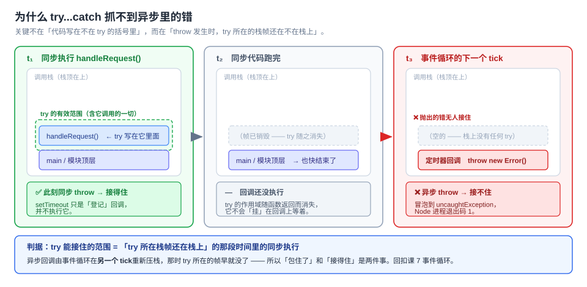

# 第 11 课：错误处理与调试

> 所属阶段：阶段 4《工程化与运行时》｜ 水平：入门 ｜ 本课知识点：Error 体系与 throw、try·catch·finally 与异步错误、调试工具链与 Source Map
> 故事情节：主角给异步代码包了 `try...catch`，线上照样崩——因为 `try` 抓不到异步里的错。这一课建立"同步 / 异步"两套错误捕获的分工意识
> ✅ 状态：已完成（2026-09-03）｜ 实操环境：Node.js v22.14.0（文中所有输出均为本机实测，采用临时实验目录验证后删除）

## 🎯 本课目标

- 区分 `TypeError` / `RangeError` / `SyntaxError` 等内置错误类型，用 `cause` 串起错误链
- 解释 `finally` 的覆盖行为，为 `unhandledrejection` 写全局兜底，说清**什么时候该 catch、什么时候该往上抛**
- 说出 `console.log` 调试的三个坑，用 `debugger` 和断点定位问题，说清生产环境 Source Map 的取舍

## 📌 知识点导航

| # | 知识点 | 状态 |
|---|--------|------|
| 1 | Error 体系与 throw | ✅ |
| 2 | try·catch·finally 与异步错误 | ✅ |
| 3 | 调试工具链与 Source Map | ✅ |

---

## 第一幕：起源与场景引入

> 🏛️ **起源**：JS 诞生后的**头几年没有标准的异常处理机制**。
>
> 1995 年的 JS 只是"给网页加点小动效"的脚本（回扣课 1），出错处理非常原始。直到 **ES3（1999 年 12 月）**，`try...catch` 异常处理才进标准。
>
> （核查于 2026-09，来源：Wikipedia「ECMAScript version history」，第 3 版一栏原文 —— "Added regular expressions, better string handling, new control statements, **try/catch exception handling**, tighter definition of errors, formatting for numeric output, and other enhancements"）
>
> 注意这里有个**历史包袱**：ES3 引入 `try/catch` 时，沿袭了早期脚本语言的宽松传统 —— **`throw` 后面可以跟任何值**，不强制是 `Error`。这个决定到今天还留着，也是本课知识点 1 里那个"抛字符串的坑"的根源。

> 🎬 **场景**：你给异步代码包了 `try...catch`，线上照样崩。

用户提交了一份非法 JSON，你在处理函数里规规矩矩包了 `try...catch`（示意代码，`save` 等函数省略；可运行的完整版本在第四幕）：

```js
function handleRequest(raw) {
  try {
    setTimeout(() => {
      const data = JSON.parse(raw);   // ← 用户传了非法 JSON，这里会抛
      save(data);
    }, 0);
  } catch (e) {
    console.log('接住了：', e.message);
    reportToServer(e);
  }
}
handleRequest('{ 坏的 json');
```

你满以为万无一失。结果线上告警炸了，进程直接退出。

本机复现（文件名 `crash-first-act.js`，代码与上面完全一致）：

```
主流程开始

同步主流程结束
<anonymous_script>:1
{ 坏的 json
  ^

SyntaxError: Expected property name or '}' in JSON at position 2 (line 1 column 3)
    at JSON.parse (<anonymous>)
    at Timeout._onTimeout (D:\...\crash-first-act.js:5:25)
    at listOnTimeout (node:internal/timers:594:17)
    at process.processTimers (node:internal/timers:529:7)

Node.js v22.14.0
---- exit code = 1 ----
```

三件事同时发生了：

1. **`catch` 一次都没执行** —— 那句 `console.log('接住了：', ...)` 从没出现过。
2. **后面的代码全没跑** —— 「同步主流程结束」打印了，但进程在回调执行的那一刻就崩了。
3. **进程退出码是 1**。

你试着改成 Promise 版本，一样崩：

```
同步主流程结束

D:\...\crash-promise.js:3
  Promise.reject(new Error('没人接的 Promise'));
                 ^

Error: 没人接的 Promise
    at Object.<anonymous> (D:\...\crash-promise.js:3:18)
    at Module._compile (node:internal/modules/cjs/loader:1554:14)

Node.js v22.14.0
---- exit code = 1 ----
```

**我明明把 throw 的代码包在 try 里了，为什么 catch 一次都没执行？**

而这还只是麻烦的开始 —— 就算接住了：

- **错误里的信息全丢了**：只剩一句 `Expected property name...`，你不知道是哪个用户、哪次请求、哪个字段。
- **线上堆栈是压缩后的乱码**：`at o (app.3f2a.js:1:28471)`，根本对不上源码。

---

## 第二幕：认知冲突

三个困惑：

1. **为什么 `try` 包住了 throw 的代码，却一次都没接住？** 那句代码明明写在 `try { }` 的花括号里面啊。
2. **错误该怎么"带信息"？** 接住了也只剩一句 message。`throw '字符串'` 好像也能用，有什么讲究？
3. **本地堆栈清清楚楚，线上全是压缩后的乱码，怎么定位回源码？**

| 困惑 | 答案藏在 |
|------|---------|
| 为什么 try 接不住 | **知识点 2**：`try` 的作用边界是「调用栈上的一段时间」，不是「花括号里的一片代码」 |
| 错误怎么带信息 | **知识点 1**：Error 体系、`cause` 错误链、throw 什么才有用 |
| 怎么定位压缩后的堆栈 | **知识点 3**：Source Map 与调试工具链 |

> 💡 这三个困惑指向**同一件事**：**错误处理不是一个「写个 try 就完事」的动作，而是一条从「抛出点」到「处理点」的链路** —— 链路的每一段（抛什么 / 谁接得住 / 怎么定位）各有各的规矩，任何一段没接上，错误就会漏到线上。

---

## 第三幕：层层揭示

### 知识点 1：Error 体系与 throw

> 本知识点关键点：`Error`·`TypeError`·`RangeError`·`SyntaxError`·`ReferenceError` 各自何时抛出 / `error.stack` 与 `Error.cause`（错误链）/ 自定义错误类（`instanceof` 为何会失效及修复）/ `throw` 什么才有用（抛原始值的坑）

#### 一句话定义

**JS 有 8 个内置错误构造器，全部继承自 `Error`；`throw` 可以抛任意值，但只有抛 `Error`（或其子类）才带得走 `message` 和 `stack`。**

#### 直觉建立（类比）

把错误对象想成一个**快递包裹**：

- `message` = 面单上的品名（人能读的一句话）
- `stack` = 物流轨迹（从哪来、经过了哪些中转站）
- `cause` = 包裹里**套着的那个原包裹**（原始错误）
- 自定义字段（`field`、`userId`）= 你额外贴上去的便签

> 💡 **类比的边界**（三条，都很重要）：
> 1. `stack` 不是包裹里自带的一张纸，而是**你第一次拆包裹时才打印的**——V8 把它做成 getter，读的时候才格式化（实测见下）。所以"不读就不花这个钱"。
> 2. `cause` **不会**自动把上一层的 `stack` 拼进来，它只是一个普通属性引用，你得自己一层层 `.cause` 往下找。
> 3. 包裹里装什么都能寄（`throw '出错了'` 也能跑），但**没面单、没轨迹**——收件方只能干瞪眼。

#### 核心原理

**① 内置错误类型全景（本机实测）**

```js
const samples = [
  ['TypeError      读 null 的属性',       () => null.foo],
  ['TypeError      调用不存在的方法',      () => ({}).noSuchMethod()],
  ['ReferenceError 未声明标识符',         () => notDefinedAnywhere],
  ['SyntaxError    JSON.parse 非法串',    () => JSON.parse('{')],
  ['RangeError     new Array(-1)',       () => new Array(-1)],
  ['RangeError     严格模式下 length=-1',  () => { 'use strict'; [].length = -1; }],
  ['URIError       decodeURIComponent',  () => decodeURIComponent('%')],
  ['Error          手动 throw',           () => { throw new Error('手动抛的'); }],
];
```

实测输出：

```
TypeError      读 null 的属性            → TypeError       | instanceof Error: true  | msg: Cannot read properties of null (re
TypeError      调用不存在的方法              → TypeError       | instanceof Error: true  | msg: {}.noSuchMethod is not a function
ReferenceError 未声明标识符                → ReferenceError  | instanceof Error: true  | msg: notDefinedAnywhere is not defined
SyntaxError    JSON.parse 非法串        → SyntaxError     | instanceof Error: true  | msg: Expected property name or '}' in J
RangeError     new Array(-1)         → RangeError      | instanceof Error: true  | msg: Invalid array length
RangeError     严格模式下 length = -1     → RangeError      | instanceof Error: true  | msg: Invalid array length
URIError       decodeURIComponent("%") → URIError        | instanceof Error: true  | msg: URI malformed
Error          手动 throw              → Error           | instanceof Error: true  | msg: 手动抛的
```

整理成表：

| 类型 | 什么时候抛 | 一句话区分 |
|------|-----------|-----------|
| **`Error`** | 手动 `throw new Error()` | 基类，其余 7 个都继承它 |
| **`TypeError`** | 这个**值**不能这么用：`null.foo`、`{}.noSuchMethod()`、`1()` | 值的能力不对 |
| **`ReferenceError`** | 这个**名字**找不到：未声明标识符、TDZ（回扣课 1）、ESM 循环依赖（回扣课 10） | 名字不存在 |
| **`SyntaxError`** | 这段话**根本不是合法 JS**：`JSON.parse('{')`、`new Function('坏代码')` | 解析期就错了 |
| **`RangeError`** | 数值**越界**：`new Array(-1)`、递归爆栈 | 数量级不对 |
| **`URIError`** | `decodeURI('%')` / `decodeURIComponent('%')` 遇到非法转义序列；`encodeURI` 遇到无法编码的字符（如孤立代理项） | URI 编解码专用 |
| **`EvalError`** | **规范保留但不再使用** —— 实测 `typeof EvalError === 'function'`、`new EvalError('x')` 仍能构造，但**现代引擎不会主动抛它**（`eval` 相关错误现在抛 `TypeError`/`SyntaxError`） | 历史遗留 |
| **`AggregateError`** | `Promise.any` 全部失败（回扣课 8） | 一次装多个错 |

> ⚠️ **`RangeError` 你最常遇见的那种**：递归爆栈 —— `RangeError: Maximum call stack size exceeded`。课 7 实测本机递归到 **12549 层**才炸。

> ⚠️ **`SyntaxError` 有个反直觉的地方**：它是**解析期**错误。这意味着**同一个文件里**的语法错误，`try/catch` 根本抓不到 —— 因为整段代码在解析阶段就失败了，你的 `try` 从来没被执行过。（这也是课 6 里 `#x` 私有字段类外访问报的是 SyntaxError 而不是能被 catch 的运行期错误的原因。）

**② `error.stack`：V8 的懒加载细节**

```js
function innerFn() { throw new Error('来自 innerFn'); }
function outerFn() { innerFn(); }
try { outerFn(); } catch (e) { console.log(e.stack); }
```

实测输出：

```
Error: 来自 innerFn
    at innerFn (D:\...\probe-main.js:35:28)
    at outerFn (D:\...\probe-main.js:36:22)
    at Object.<anonymous> (D:\...\probe-main.js:37:7)
```

栈是**从抛出点往外层**排的，最上面一行是出错的地方。

查它的属性描述符，会发现一个容易被忽略的实现细节：

```
自有属性: true | 有 getter: true | 有 setter: true | enumerable: false | configurable: true
```

**`stack` 是访问器属性（getter/setter），不是数据属性。** 也就是说 **V8 在你第一次读 `e.stack` 时才去格式化字符串**。这是个性能优化——绝大多数错误被 catch 掉之后你根本不看栈，那就不该为它付代价。

两个可调旋钮（实测）：

```js
Error.stackTraceLimit            // 默认 10
Error.stackTraceLimit = 3;       // 实测：30 层深栈的行数从 11 行变成 4 行（1 标题 + 3 帧）

// 拿到结构化栈帧 —— 错误监控 SDK 就是靠它把栈序列化上报的
Error.prepareStackTrace = (err, frames) =>
  frames.map(f => `${f.getFunctionName() || '(anonymous)'}:${f.getLineNumber()}`);
// 实测输出：['deep:51', 'deep:51', 'deep:51', '(anonymous):60', ...]
```

**③ `Error.cause`（ES2022）：把错误串成链**

```js
const root = new Error('ECONNREFUSED 127.0.0.1:5432');
const wrapped = new Error('数据库连接失败', { cause: root });

wrapped.message          // '数据库连接失败'
wrapped.cause === root   // true
wrapped.cause.message    // 'ECONNREFUSED 127.0.0.1:5432'
new Error('x').cause     // undefined（不传时就是 undefined）
```

三层链实测：

```
第 3 层：下单失败 ← 第 2 层：重试耗尽 ← 第 1 层：请求失败
```

> 📌 **版本与属性细节**（核查于 2026-09）：
> - `cause` 属 **ES2022（2022 年 6 月发布）**，来源：Wikipedia「ECMAScript version history」第 13 版一栏 —— "the `cause` property on `Error` objects, which can be used to record a causation chain in errors"。
> - 它是**数据属性**：`writable: yes` / `enumerable: no` / `configurable: yes`；浏览器 Baseline 自 2021 年 9 月起广泛可用（来源：MDN「Error: cause」）。
> - `enumerable: no` 这一点很关键：**直接 `JSON.stringify(error)` 什么都拿不到**。实测：
>
>   ```js
>   const wrapped = new Error('外层失败', { cause: new Error('根因 ECONNREFUSED') });
>   JSON.stringify(wrapped)   // '{}'   ← 空对象！
>   Object.keys(wrapped)      // []     ← 一个键都没有
>   ```
>
>   因为 `message`、`stack`、`cause` **全都是不可枚举的**。上报日志时必须手动取字段：
>
>   ```js
>   const payload = { name: e.name, message: e.message, stack: e.stack, cause: e.cause?.message };
>   ```

> 💡 MDN 还给了三个"多错误"类型的分工，值得记一下：`cause` = **单一失败点**（外层只加上下文）；`AggregateError` = **多个互不相关的失败**（如 `Promise.any` 全败）；`SuppressedError` = **处理错误时又出了新错**（如 `try` 里失败、`finally` 里也失败）。

**④ 自定义错误类，以及 `instanceof` 为什么会失效**

```js
class ValidationError extends Error {
  constructor(message, field) {
    super(message);
    this.name = 'ValidationError';   // ← 别忘了这行，否则栈首行会显示 'Error'
    this.field = field;
  }
}
const ve = new ValidationError('邮箱格式不对', 'email');
```

实测：

```
instanceof ValidationError: true
instanceof Error          : true
name / message / field   : ValidationError / 邮箱格式不对 / email
stack 首行               : ValidationError: 邮箱格式不对
JSON.stringify(ve)       : {"name":"ValidationError","field":"email"}   ← 注意：连 message 都没有！
```

> ⚠️ `JSON.stringify(ve)` 里有 `name` 和 `field`，**却没有 `message`** —— 因为 `message` 在 `Error.prototype` 上且**不可枚举**，`JSON.stringify` 看不见它（实测 `Object.keys(ve)` 只有 `["name","field"]`）。**上报错误日志时千万别直接 `JSON.stringify(error)`。**

> 💡 至于 `this.name = 'ValidationError'` 那行为什么必须写 —— 实测：不写的话栈首行是 `Error: 出错啦`，写了才是 `ValidationError: 出错啦`。而栈首行正是你扫日志时第一眼看到的东西。

**`instanceof` 的失效现场（跨 realm）：**

```js
const vm = require('vm');
const foreign = vm.runInContext('new TypeError("来自另一个 realm")', vm.createContext({}));

foreign instanceof Error       // false  ← ！
foreign instanceof TypeError   // false  ← ！
foreign.constructor.name       // 'TypeError'
Object.prototype.toString.call(foreign)   // '[object Error]'
```

**为什么？** `instanceof` 比的是**原型对象是不是同一个对象**。另一个 realm（iframe、`vm` 上下文、worker）有自己的一套 `Error` 构造器，原型对象不是同一个，所以判等失败。

**稳妥判据：**

```js
if (e.name === 'ValidationError') { ... }                       // 用 name 判等（推荐）
if (Object.prototype.toString.call(e) === '[object Error]') {}  // 只要确认是 Error 家族
```

> ⏳ **置信度提示**：另一个常听说的失效场景是「Babel/TS 把 `class X extends Error` 降级到 ES5 后 `instanceof` 失效，要补 `Object.setPrototypeOf(this, X.prototype)`」。本机是原生 class，**无法复现该失效，未实测**；此处只作背景陈述，让你在老项目里认出这个写法，不作精确断言。

> 🔍 **实测澄清：关于 `Error.captureStackTrace` 的一条反直觉结论**
>
> 很多教程说「自定义错误类要写 `Error.captureStackTrace(this, MyClass)` 把构造函数帧藏起来」。本机实测（V8 / Node v22.14.0）结果：
>
> ```
> [不带 captureStackTrace] 栈前 2 行:
> PlainErr: 普通
>     at makePlain (...:25:31)
> [带 captureStackTrace]   栈前 2 行:
> CleanErr: 修过栈
>     at makeClean (...:26:31)
> ```
>
> **两者完全一样** —— 因为 `class X extends Error` 的**构造函数帧 V8 已经默认隐藏了**，写不写栈顶都是调用方那一帧。
>
> 但这个 API **确实有效**，只是用武之地在别处（实测对照）：
>
> ```js
> function c1() { const e = new Error('x'); Error.captureStackTrace(e, c1); return e; }  // 传了 c1
> function d1() { const e = new Error('x'); Error.captureStackTrace(e);      return e; }  // 没传
> // c1 版首帧：at c0（c1 被藏掉了）
> // d1 版首帧：at d1
> ```
>
> **结论**：今天的原生 class 场景下这一行是锦上添花；它真正的价值是**在辅助函数里构造错误时，把中间的辅助帧藏掉**。

**⑤ `throw` 什么才有用（抛原始值的坑）**

```js
for (const v of ['出错了', 42, { code: 500 }, null, undefined]) {
  try { throw v; } catch (e) { /* 检查 e 的类型 */ }
}
```

实测：

| `throw` 的值 | catch 到的类型 | `e.message` | `e.stack` |
|---|---|---|---|
| `'出错了'` | `string` | `undefined` | `undefined` |
| `42` | `number` | `undefined` | `undefined` |
| `{ code: 500 }` | `object` | `undefined` | `undefined` |
| `null` | `object` | **读 `e.message` 直接抛 TypeError** | — |
| `undefined` | `undefined` | **读 `e.message` 直接抛 TypeError** | — |

更狠的是后两种，实测原文：

```
throw null → e 是 null | 读 e.message 直接抛 TypeError: Cannot read properties of null (reading 'message')
throw undefined → e 是 undefined | 读 e.message 直接抛 TypeError: Cannot read properties of undefined (reading 'message')
```

**结论：永远 `throw new Error(...)`（或其子类）。** 抛原始值唯一的"好处"是少打几个字符，代价是丢掉 `stack`（等于失去全部定位能力），而 `throw null` / `throw undefined` 之后连 `e.message` 都读不了 —— 你在 `catch` 里写的第一行日志就会二次崩溃。

✅ **困惑 2 已解**：错误想"带信息"，靠三样东西 —— 用**正确的内置类型**（或自定义子类）表达"这是什么错"、用 `cause` **保留原始错误**、用**自定义字段**带业务上下文。而这一切的前提是 `throw` 一个 `Error`，不是字符串。

---

### 知识点 2：try·catch·finally 与异步错误

> 本知识点关键点：`finally` 的**覆盖行为**（`return` 被覆盖）/ `try...catch` **只能捕获同步错误**（回扣课 7 事件循环）/ Promise 错误的捕获（`.catch` / `await` + `try`）/ 全局兜底 `onerror` 与 `unhandledrejection` / 错误边界：什么时候该 catch、什么时候该往上抛

#### 一句话定义

**`try` 能接住的范围，是「`try` 所在栈帧还在栈上」的那段时间里的同步执行。异步回调由事件循环在另一个 tick 重新压栈，它接不住。**



#### 直觉建立（类比）

把 `try...catch` 想成**你在教室里举手问老师**：

- 老师只在**这节课**在教室（= `try` 所在的栈帧在栈上）。
- 异步回调是**下节课**才发生的事 —— 那时老师早走了，你举手没人应。
- 想让下节课也有人接，你得**另外安排一个人**：`.catch` / `await` + `try` / 全局兜底。

> 💡 **类比的边界**：
> 1. 老师**不会**因为你写了 `try` 就一直留在教室 —— `try` 不是"订阅"，它是一次性的栈结构。
> 2. `finally` 不像"下课铃"，它更像**离场时必须经过的通道**：就算你提前 `return`、`break`、`throw`，也得先过它（实测三种都执行了）。
> 3. 但这条通道有**霸王条款**：你可以在通道里**改变离场方式**（`finally` 里 `return`/`throw` 会覆盖之前的返回值或异常）。

#### 核心原理

**① `try` 抓不到异步错误（实测）**

```js
// crash-try.js
try {
  setTimeout(() => { throw new Error('异步回调里的错'); }, 10);
} catch (e) {
  console.log('catch 抓到了:', e.message);     // ← 永远不会执行
}
console.log('同步主流程结束');
```

```
主流程开始
同步主流程结束          ← 同步代码跑完了，try 的使命结束
Error: 异步回调里的错    ← 10ms 后回调执行，此时栈上没有任何 try
    at Timeout._onTimeout (...)
---- exit code = 1 ----
```

**根因（回扣课 7）**：`try` 的作用域**不是**"花括号里的一片代码"，而是**"调用栈上的一段时间"**。`setTimeout` 只是把回调**登记**到定时器队列，然后 `handleRequest` 就返回了 —— 栈帧销毁，`try` 随之消失。10 毫秒后事件循环把回调重新压栈执行，那时栈上只有回调自己，没有任何 `try` 在等它。

Promise 版本同理（`crash-promise.js` 实测也是 exit code 1）。

**三条修复路径：**

| 路径 | 做法 | 适用 |
|---|---|---|
| **A. 把 `try` 移进回调** | `setTimeout(() => { try { ... } catch {} }, 0)` | 一次性、简单场景 |
| **B. 改成 Promise + `await` + `try`** | 见下 | **推荐**，主流写法 |
| **C. 全局兜底** | `process.on('uncaughtException')` | 兜住所有漏网之错 |

**② Promise 的错误要单独接（实测三种写法）**

```js
function rejects() { return Promise.reject(new Error('Promise 里的错')); }
```

| 写法 | 结果（实测） |
|---|---|
| `await rejects().catch(e => ...)` | ✅ **A 用 .catch 接住：Promise 里的错** |
| `try { await rejects(); } catch (e) {}` | ✅ **B 用 try + await 接住：Promise 里的错** |
| `try { rejects(); } catch (e) {}`（**没有 await**） | ❌ **C try 块正常走完**（错误没接住，最终触发 unhandledRejection 让进程崩溃） |

> 💡 回扣课 8：`await` 的语义就是**把 Promise 的完成/失败拉回当前这条同步执行流**，所以它才重新落进 `try` 的接管范围。**没有 `await`，就等于把错误留在了另一条时间线上。**

**⚠️ 进阶坑：`new Promise` 同样接不住「回调里」的错（实测）**

这是第一幕那个 bug 的"进阶版"，非常隐蔽：

```js
// ❌ 错误写法：JSON.parse 在 setTimeout 回调里抛错，Promise 接不住
function parseAsyncWrong(raw) {
  return new Promise((resolve) => {
    setTimeout(() => resolve(JSON.parse(raw)), 0);   // 抛错 → 逃到全局
  });
}

// ✅ 正确写法：把回调式 API 包进 async 函数，错误自动进 Promise 链
async function parseAsyncRight(raw) {
  await delay(0);
  return JSON.parse(raw);        // async 函数体里抛错 → 变成 rejected Promise
}
```

实测（第四幕脚本【3】【4】两段）：

```
【3】进阶坑：new Promise 也接不住「回调里」的错
  [兜底 uncaughtException]  SyntaxError : Expected property name or '}' in JSON at p
  → 上面那条错误同样逃到了 [兜底]，而这个 Promise 本身永远 pending

【4】修复二：把回调式 API 包进 async 函数，错误自动进 Promise 链
  接住了: SyntaxError - Expected property name or '}' in JSO
```

注意那个**二次伤害**：`.catch()` 不会触发，**Promise 永远停在 pending**。如果你 `await` 它，代码会静默挂死——比崩溃更难查。

**判据：`new Promise` 的 executor 只在「同步执行期间」能把抛错转成 reject。任何异步回调（setTimeout / 事件监听器 / fs 回调）里抛的错，executor 早就跑完了，接不住。**

**③ `finally` 的覆盖行为（实测四条）**

```js
function f1() { try { return 'try 的返回值'; } finally { return 'finally 的返回值'; } }
function f2() { try { return 'try 的返回值'; } finally { throw new Error('finally 抛的'); } }
function f3() { try { throw new Error('try 抛的错'); } finally { return '异常被 finally 吞了'; } }
function f4() { try { return 'try 的返回值'; } finally { } }
```

| 写法 | 实测结果 |
|---|---|
| ① `finally` 里 `return` | **返回 `finally 的返回值`**（`try` 的 return 被覆盖） |
| ② `finally` 里 `throw` | **抛出 `finally 抛的`**（`try` 的 return 被吞） |
| ③ `try` 抛异常 + `finally` 里 `return` | **返回 `异常被 finally 吞了`** —— ⚠️ **异常被静默吞掉** |
| ④ 空 `finally` | 返回 `try 的返回值`（正常） |

**第 ③ 条是线上最难查的一类 bug**：错误发生了，但没人知道，函数还"正常"返回了一个值。

`finally` 的执行时机（实测）：

```
  1) try 里
  2) finally 里（在 return 之后、函数真正返回之前）
  3) 调用方收到: try 的返回值
```

`finally` 一定执行吗？实测**提前 `return` 和 `break` 都会执行**：

```
  （提前 return 也执行了 finally）
  （break 也执行了 finally，i = 0 ）
  （break 也执行了 finally，i = 1 ）
```

> ⚠️ **工程结论：`finally` 里只做清理（关文件、清定时器、解锁），绝不写 `return` 或 `throw`。** 你写在 `finally` 里的 `return` 会无声地吃掉前面所有的异常。

**④ 全局兜底：两套异步错误各有一个入口**

```js
// guard.js —— 第一幕场景的兜底修复
process.on('uncaughtException', (err) => {
  console.log('[兜底 1] uncaughtException  :', err.constructor.name, '-', err.message);
});
process.on('unhandledRejection', (reason) => {
  console.log('[兜底 2] unhandledRejection :', reason.constructor.name, '-', reason.message);
});
```

实测（同一个崩溃脚本，装上兜底之后）：

```
主流程开始
[兜底 2] unhandledRejection : Error - 没人接的 Promise
[兜底 1] uncaughtException  : Error - 异步回调里的错
主流程继续 —— 进程没崩
---- exit code = 0 ----
```

**崩溃（exit 1）变成了可控（exit 0）。** 这就是第一幕那个线上事故的止血方案。

| 运行时 | 回调 / 同步里的漏网之错 | Promise 的漏网之错 |
|---|---|---|
| **Node** | `process.on('uncaughtException')` | `process.on('unhandledRejection')` |
| **浏览器** | `window.addEventListener('error')` | `window.addEventListener('unhandledrejection')` |

> 📌 **浏览器侧细节**（本机无浏览器环境，**未实跑**；以下为依据 MDN 的描述，来源：MDN「Window: unhandledrejection event」）：
> - 事件对象是 `PromiseRejectionEvent`，两个关键字段：**`event.reason`**（拒因）与 **`event.promise`**（那个 Promise 本身）。
> - 它是 **cancelable** 的：调用 **`event.preventDefault()`** 可以阻止默认的控制台报错。
> - **跨域脚本产生的 rejection 不会触发该事件**（出于防数据泄露的考虑）。

> ⚠️ **兜底不是银弹。** `uncaughtException` 被触发时，进程状态已经**不可信**了 —— 你不知道哪个请求做了一半、哪个锁没释放。工程上的通行做法是：**兜底只做「记日志 + 上报 + 优雅退出」，不要试图继续服务。**

**⑤ 错误边界：什么时候该 catch，什么时候该往上抛**

| 场景 | 该怎么做 |
|---|---|
| 你能**解决**它（有 fallback、默认值、可重试） | **catch**，并写清为什么能安全继续 |
| 你只能**加上下文**（用户 ID、请求 ID、参数） | **catch → 加信息 → 用 `cause` 串起来再 throw** |
| 你**什么都做不了** | **别 catch**，让它往上冒 |
| 你在**边界层**（请求入口 / 任务调度 / `main`） | **catch**，决定响应码、是否上报、是否退出 |

三层分工的实例（实测输出）：

```js
// 底层：只负责发现问题，绝不决定怎么办
function parseUserInput(raw) {
  const obj = JSON.parse(raw);
  if (!obj.email) throw new ValidationError('缺少 email 字段', 'email');
  return obj;
}

// 中层：加上下文，用 cause 串起来后继续往上抛
async function handleRequest(userId, raw) {
  try {
    return parseUserInput(raw);
  } catch (e) {
    throw new Error('处理用户 ' + userId + ' 的请求失败', { cause: e });
  }
}

// 边界层：唯一决定「怎么响应」的地方（这段代码在一个 async 函数里）
const cases = [
  ['u-1', '{"email":"a@b.com","age":18}'],   // 正常
  ['u-2', '{ 坏的 json'],                    // SyntaxError
  ['u-3', '{"age":18}'],                     // ValidationError：缺 email
];
for (const [userId, raw] of cases) {
  try {
    const user = await handleRequest(userId, raw);
    console.log(`[${userId}] 成功:`, JSON.stringify(user));
  } catch (e) {
    const cause = e.cause;
    if (cause instanceof ValidationError)      console.log(`[${userId}] 400 参数错误 → ${cause.field}`);
    else if (cause instanceof SyntaxError)     console.log(`[${userId}] 400 JSON 解析失败`);
    else                                       console.log(`[${userId}] 500 未知错误，上报监控`);
    console.log(`        完整错误链: ${e.message} ← ${cause.message}`);
  }
}
```

> 💡 这里的 `instanceof` 是**安全的** —— 三层代码在同一个 realm 里。如果错误可能跨 realm 传进来（iframe / worker / `vm`），就要按知识点 1 ④ 的结论换成 `cause.name === 'ValidationError'`。

实测输出：

```
[u-1] 成功: {"email":"a@b.com","age":18}
[u-2] 400 JSON 解析失败 → Expected property name or '}' in JSON at position 2 (line 1 column 3)
        完整错误链: 处理用户 u-2 的请求失败 ← Expected property name or '}' in JSON at position 2 (line 1 column 3)
[u-3] 400 参数错误 → email: 缺少 email 字段
        完整错误链: 处理用户 u-3 的请求失败 ← 缺少 email 字段
```

**对照：如果底层"吞掉"错误会怎样（实测）：**

```js
function swallowEverything(raw) {
  try { return JSON.parse(raw); }
  catch (e) {
    console.log('  （底层打印一行日志就当没事发生）');
    return null;                       // ← 错误被吞了
  }
}
const result = swallowEverything('{ 坏的 json');   // null
```

```
  （底层打印一行日志就当没事发生）
  调用方拿到: null
  → 调用方无法区分「用户没填」和「数据坏了」，只能一路判空
```

**吞掉错误不是"处理了错误"，是把错误从"能被发现"变成了"只能靠猜"。**

✅ **困惑 1 已解**：`try` 接不住异步错误，是因为它的作用域是"栈帧存在的时间"而不是"花括号里的代码"。修复要靠三条路径：把 `try` 移进回调、改用 `await` 把错误拉回同步流、以及全局兜底。

---

### 知识点 3：调试工具链与 Source Map

> 本知识点关键点：`console` 的正确用法与三个坑 / `debugger` 与条件断点 / Node 内置调试器（`node --inspect`）/ Source Map 原理与生产环境策略

#### 一句话定义

**`console.log` 是"撒网"，`debugger`/断点是"垂钓"，Source Map 是"把压缩后的坐标翻译回源码坐标"的字典 —— 三者解决的是不同阶段的问题。**

#### 直觉建立（类比）

- **`console.log`** = 在河里**撒网**：不管鱼在哪，先捞一堆上来看看。成本低、信息杂。
- **断点 / `debugger`** = **垂钓**：你盯着一个点，鱼上钩时**整条河的状态随你看**。慢，但看得全（调用栈、作用域变量、表达式求值）。
- **Source Map** = 一张**坐标对照表**：生产环境那条河是改过道的（压缩后），对照表告诉你"第 1 行第 28471 列"其实是源码的"第 42 行第 8 列"。

> 💡 **类比的边界**：
> 1. **撒网本身会扰动水流** —— `console.log` 会改变程序的时序（下面坑 3 有实测数据）。
> 2. **对照表只翻译位置，不翻译语义** —— 变量名被压缩没了就是没了；Source Map 的 `names` 字段能补一部分，但不保证。
> 3. **对照表自己也可能对不上**（生成器与运行时版本不匹配），这时它会给你一个**更错的**位置，所以别盲信。

#### 核心原理

**① `console` 的三个坑**

**坑 1：你看到的可能不是"当时"的值，也可能不是全部（保留引用 / 惰性求值 / 深度截断）**

**① 求值时机** —— Node 侧实测：

```js
const obj = { a: 1, nested: { b: 2 } };
console.log('  log 时:', obj);
obj.a = 999; obj.nested.b = 888;
console.log('  改完  :', obj);
```

```
  log 时: { a: 1, nested: { b: 2 } }
  改完  : { a: 999, nested: { b: 888 } }
```

**Node 的 `console.log` 是同步序列化的 —— 第一行打印的就是当时的快照。**

而**浏览器 DevTools 相反**：它持有对象的**引用**，展开时才求值，所以你会看到 `999`；Chrome 会在这样的值旁边显示一个提示图标（社区俗称 "value below was evaluated just now"）。

> ⏳ **置信度提示**：浏览器侧的惰性求值是**社区广泛记载的行为**，但本机**没有浏览器环境、未实跑**，故只作提示不作实测断言。

**② 深度截断** —— 本机实测：

```js
const deep = { a: { b: { c: { d: { e: '第 5 层' } } } } };
console.log(deep);                    // { a: { b: { c: [Object] } } }   ← 被截断了
console.dir(deep, { depth: null });   // 完整展开
```

```
  console.log 默认 : { a: { b: { c: [Object] } } }
  console.dir depth:null :
{
  a: {
    b: { c: { d: { e: '第 5 层' } } }
  }
}
```

**规避办法**：想要真快照就 `JSON.stringify(obj)` 或 `structuredClone(obj)` 之后再打印；想要完整结构就用 `console.dir(obj, { depth: null })` 明确表达意图。

> 🔍 **实测推翻的一条预设**：我原本准备演示"`console.log` 会触发对象的 getter 产生副作用"。**实测结果相反** —— Node 遇到 getter 属性时打印 `[Getter]` 而**不调用它**：
>
> ```
>   打印前 _n = 0
>   console.log(tricky) → { _n: 0, value: [Getter] }
>   打印后 _n = 0    ← 没变，getter 没被调用
> ```

**坑 2：生产环境性能（实测）**

```js
// perf-log.js：同样跑 50000 次，对比纯计算与 console.log（输出重定向到 NUL）
```

```
__RESULT__ 纯计算 50000 次: 0ms | 同样次数 console.log: 220ms
__RESULT__ 纯计算 50000 次: 0ms | 同样次数 console.log: 243ms
```

**5 万条日志 ≈ 220–243 ms**（单次约 4–5 微秒）。热路径里每轮打一条，跑一百万轮就是好几秒。

> 工程做法：**分级日志**（`debug` 级默认关闭）+ **构建期剔除**（打包时用插件删掉 `console.debug`）。

**坑 3：`console.log` 会改变时序（Heisenbug，实测）**

```js
// timing-shift.js：先注册一个 10ms 定时器，再同步塞进 N 条 console.log
const t0 = Date.now();
setTimeout(() => console.error(`N=${N} 时，10ms 的定时器实际在 ${Date.now() - t0}ms 后才执行`), 10);
for (let i = 0; i < N; i++) console.log('日志行 ' + i);
```

| 循环里 `console.log` 的条数 | 10ms 定时器**实际**执行时刻 |
|---|---|
| 0 条 | **10 ms** |
| 20000 条 | **113 ms** |
| 100000 条 | **484 ms** |

**你加/删一行 `console.log`，依赖时序的 bug 就可能时隐时现。** 这正是异步 bug 难查的根源之一 —— 你为了观察它而加的日志，本身改变了它的行为。

> 规避：查时序问题时**改用断点**（断点不产生 I/O），或把日志改成**批量异步落盘**。

> 🔍 **再推翻一条预设（诚实记录）**：常见说法是「`process.exit()` 会截断还没刷出去的 stdout 日志」。本机实测：写 20000 行日志后立刻 `process.exit(0)`，**重定向到文件**时 process.exit 版与自然退出版行数**完全相同**；改用**管道**接收时，也完整收到全部 20000 行。
>
> **两种落地方式都没有出现截断。** Node 对文件与管道的 stdout 写入是同步的，所以这个坑在 Node 侧不成立。本课不把它列为坑 —— 记录在此，免得你被老文章误导。

**② `debugger` 与断点**

**实测 1：没附加调试器时，`debugger;` 就是一行 no-op。**

```
debugger 之前
debugger 之后 —— 说明没有调试器时它什么都不做
```

**实测 2：`node --inspect-brk` 真的会把脚本停住，并暴露一个调试端点。**

```
===== 子进程 stderr（Node 打印的调试信息）=====
Debugger listening on ws://127.0.0.1:51271/1d655104-7bd4-4a4f-aeeb-32939c9ba435
For help, see: https://nodejs.org/en/docs/inspector

===== 子进程 stdout（脚本自己的输出）=====
""   ← 空 = 脚本被停在了断点上，还没往下执行

===== 查询 CDP 的 /json/list 端点 =====
  type : node
  CDP 版本: 1.1 | 浏览器标识: node.js/v22.14.0
```

用法：

```bash
node --inspect-brk app.js    # 停在第一行，等你连上来
node --inspect app.js        # 不停，照常跑，调试器可以随时连上来
```

然后打开 `chrome://inspect`（Chrome / Edge），就能用**同一个 DevTools 界面**调试 Node。

`debugger` 语句 vs 断点：

| | 断点（DevTools 里点行号） | `debugger` 语句 |
|---|---|---|
| 存在哪 | DevTools 里，刷新可能丢 | 源码里，跟着文件走 |
| 条件暂停 | ✅ **条件断点**：右键 → Add conditional breakpoint，写表达式，只在为真时停 | ❌ 无条件（除非配 `if`） |
| 风险 | 无 | **提交前记得删** |

> 💡 **条件断点是查"循环第 5000 次才出问题"的唯一实用手段** —— 无条件断点你得手动点 5000 次 Continue。

> 🏛️ **起源**：Node 用的这套协议叫 **CDP（Chrome DevTools Protocol）**，本质是一套 WebSocket + JSON 的远程调试协议（实测协议版本 1.1）。正因为 Node 直接**复用**了浏览器的协议，你才能用一个 DevTools 界面打通两端 —— 这也是为什么 `chrome://inspect` 里能出现 Node 进程。

**③ Source Map 原理（本课手工构造并实测）**

> 🏛️ **起源**（核查于 2026-09，来源：**ECMA-426 标准原文** `tc39.es/ecma426/` 与 tc39/source-map-spec 仓库的 `source-map-rev3.md`）：
>
> - **v1** 由 **Joseph Schorr** 创建，给 **Closure Inspector** 用，目的是让**优化后的 JS 也能做源码级调试**（规范特意说明：格式本身与语言无关）。
> - **v2**（John Lenz，2010）：为减小体积，牺牲了部分简单性与灵活性。
> - **v3**（**John Lenz（Google）** 与 **Nick Fitzgerald（Mozilla）**，提案日期 **2011-02-11**）：基于 **Pavel Podivilov（Google）** 的建议改用 **Base64 VLQ** 编码，实测在 Google Calendar 上比 v2 **体积减少 50%**。
> - **2023–2024 年被标准化为 Ecma 标准 ECMA-426**，第 1 版于 **2024 年 12 月**发布（项目编辑：Asumu Takikawa、Nicolò Ribaudo、Jon Kuperman）。
> - 两个有趣的**历史细节**：`//# sourceMappingURL=` 的前缀**最初是 `//@`**，因为和 Internet Explorer 的条件编译冲突才改成 `//#`（规范至今要求消费者两种都接受、生成器只输出 `//#`）；HTTP 头也从 `X-SourceMap` 改成了 `SourceMap`。

本课手动构造了一个最小 Source Map 并让 Node 真的消费了它。原始源码（4 行）：

```js
// demo.src.js
function readConfig(cfg) {
  return cfg.server.port          // ← 第 2 行，这里会抛 TypeError
}
readConfig({})
```

"压缩后"的产物（1 行，`cfg` 被缩短成 `o`）：

```js
// demo.min.js
function readConfig(o){return o.server.port}readConfig({})
//# sourceMappingURL=demo.min.js.map
```

配套生成的 map（**本课实验的真实产物**）：

```json
{
  "version": 3,
  "file": "demo.min.js",
  "sources": ["demo.src.js"],
  "sourcesContent": ["function readConfig(cfg) {\n  return cfg.server.port\n}\nreadConfig({})"],
  "names": [],
  "mappings": "AAAA,SAAS,WAAW,GAClB,OAAO,CAAG,CAAC,OAAO,KAEpB,WAAW"
}
```

**`mappings` 怎么读**（依据 ECMA-426 §9.2）：

- `;` 分隔**生成文件的行**；`,` 分隔**段（segment）**
- 每段 1 / 4 / 5 个字段：`[生成列, 源文件索引, 原始行, 原始列, (名字索引)]`
- **除生成列外，所有字段都是「相对于上一段」的增量**；生成列在**每一行开头会重置为绝对值**
- 每个数字是 **Base64 VLQ**：6 bit 里**最高位是"还有后续"标志**，**最低位是符号位**

**实测对照（同一份崩溃代码，只差一个启动参数）：**

```
=========== 不带 --enable-source-maps ===========
function readConfig(o){return o.server.port}readConfig({})
                                       ^
TypeError: Cannot read properties of undefined (reading 'port')
    at readConfig (D:\...\sm\demo.min.js:1:40)
    at Object.<anonymous> (D:\...\sm\demo.min.js:1:45)

=========== 带 --enable-source-maps ===========
  return cfg.server.port
                    ^
TypeError: Cannot read properties of undefined (reading 'port')
    at readConfig (D:\...\sm\demo.src.js:2:21)
    at Object.<anonymous> (D:\...\sm\demo.src.js:4:1)
```

**`demo.min.js:1:40` 被还原成了 `demo.src.js:2:21`**，而且 Node 还把**原始源码那一行**打了出来（因为 map 里有 `sourcesContent`）。这就是第一幕里"线上堆栈是乱码"的解药。

Node 侧两种开启方式（实测 `process.setSourceMapsEnabled` 是 `function`）：

```bash
node --enable-source-maps app.js      # 命令行
```

```js
process.setSourceMapsEnabled(true);   // 运行时 API
```

**④ 生产环境 Source Map 策略：四种选择与取舍**

| 策略 | 你能还原源码 | 别人也能拿到 | 适合 |
|---|---|---|---|
| **A. 不生成 map** | ❌ | ❌ | 内部工具、对排错无要求的脚本 |
| **B. 生成 map，但不部署到公网**（只留在 CI 产物 / 私有对象存储） | ✅ | ❌ | **默认推荐**，绝大多数业务 |
| **C. map 随产物一起公开部署** | ✅ | ✅ | 开源库、Demo |
| **D. 上传到错误监控平台，从公网删掉** | ✅（仅在平台内） | ❌ | 有 Sentry / 自建监控时，**B + D 组合最佳** |

**核心取舍：Source Map 会把你的原始源码（含注释、未压缩逻辑、变量名）完整暴露给任何能下载它的人。** 尤其 `sourcesContent` 字段是把源码正文**直接内嵌**进 map 的 —— 上面那个实验产物里你就能看到。所以默认策略是 **B**：自己能查，外人拿不到。

✅ **困惑 3 已解**：线上堆栈之所以是乱码，是因为跑的是**压缩后的产物**。定位分三步 —— 本地/预发用 **`debugger` 或断点**（比 `console.log` 可靠得多，还不改变时序）；Node 侧加 **`--enable-source-maps`**，运行时就能自动把 `min.js:1:40` 还原成 `src.js:2:21`；生产环境则按 **B（生成但不公开）** 或 **B+D（上传监控平台）** 的策略，既保住可查性、又不泄露源码。

---

## 第四幕：实操验证

把第一幕的场景从"崩溃"一步步修到"可控"。完整脚本（`lesson-11-demo.js`）：

```js
const delay = (ms) => new Promise((r) => setTimeout(r, ms));

// ---------- 前置：两套全局兜底 ----------
process.on('uncaughtException', (err) => {
  console.log('  [兜底 uncaughtException] ', err.name, ':', err.message.slice(0, 42));
});
process.on('unhandledRejection', (reason) => {
  console.log('  [兜底 unhandledRejection]', reason.name, ':', reason.message.slice(0, 42));
});

// ---------- 自定义错误 ----------
class ValidationError extends Error {
  constructor(message, field) {
    super(message);
    this.name = 'ValidationError';
    this.field = field;
  }
}

// ---------- 第一幕的原始写法 ----------
function buggyHandle(raw) {
  try {
    setTimeout(() => { JSON.parse(raw); }, 0);
  } catch (e) {
    console.log('  catch 抓到了（这行不会打印）');
  }
}

// ---------- 错误版：new Promise 也接不住「回调里」的错 ----------
function parseAsyncWrong(raw) {
  return new Promise((resolve) => {
    setTimeout(() => resolve(JSON.parse(raw)), 0);
  });
}

// ---------- 修复版：把回调式 API 包进 async 函数 ----------
async function parseAsyncRight(raw) {
  await delay(0);
  return JSON.parse(raw);
}

// ---------- 底层 / 中层 / 边界层 ----------
function parseUserInput(raw) {
  const obj = JSON.parse(raw);
  if (!obj.email) throw new ValidationError('缺少 email 字段', 'email');
  return obj;
}
async function handleRequest(userId, raw) {
  try {
    return parseUserInput(raw);
  } catch (e) {
    throw new Error('处理用户 ' + userId + ' 的请求失败', { cause: e });
  }
}

async function main() {
  console.log('【1】复现第一幕：try 包住 setTimeout，但错误来自回调');
  buggyHandle('{ 坏的 json');
  await delay(30);
  console.log('  → try 块正常走完，什么也没接住；错误由上方 [兜底] 接住');

  console.log('\n【2】修复一：把 try 移进回调内部');
  setTimeout(() => {
    try { JSON.parse('{ 坏的 json'); }
    catch (e) { console.log('  接住了:', e.name, '-', e.message.slice(0, 36)); }
  }, 0);
  await delay(30);

  console.log('\n【3】进阶坑：new Promise 也接不住「回调里」的错');
  parseAsyncWrong('{ 坏的 json').catch(() => console.log('  .catch 接住了（这行不会打印）'));
  await delay(30);
  console.log('  → 上面那条错误同样逃到了 [兜底]，而这个 Promise 本身永远 pending');

  console.log('\n【4】修复二：把回调式 API 包进 async 函数，错误自动进 Promise 链');
  try {
    await parseAsyncRight('{ 坏的 json');
  } catch (e) {
    console.log('  接住了:', e.name, '-', e.message.slice(0, 36));
  }

  console.log('\n【5】错误链：底层抛 → 中层加 cause → 边界层决策');
  for (const [userId, raw] of [
    ['u-1', '{"email":"a@b.com"}'],
    ['u-2', '{ 坏的 json'],
    ['u-3', '{"age":18}'],
  ]) {
    try {
      const user = await handleRequest(userId, raw);
      console.log(`  [${userId}] 成功:`, JSON.stringify(user));
    } catch (e) {
      const cause = e.cause;
      const verdict =
        cause instanceof ValidationError ? `400 参数错误 → ${cause.field}: ${cause.message}` :
        cause instanceof SyntaxError     ? '400 JSON 解析失败' :
                                           '500 未知错误，上报监控';
      console.log(`  [${userId}] ${verdict}`);
      console.log(`         错误链: ${e.message} ← ${cause.message}`);
    }
  }

  console.log('\n【6】finally 的覆盖行为');
  const f1 = () => { try { return 'try 的返回值'; } finally { return 'finally 的返回值'; } };
  const f3 = () => { try { throw new Error('try 抛的错'); } finally { return '异常被 finally 吞了'; } };
  console.log('  finally 里 return →', f1());
  console.log('  finally 吞异常    →', f3());

  console.log('\n【7】throw 原始值的代价');
  try { throw '出错了'; } catch (e) {
    console.log('  throw 字符串 → catch 到', typeof e, '| e.stack:', e.stack);
  }
  try { throw new Error('出错了'); } catch (e) {
    console.log('  throw Error   → catch 到', e.constructor.name, '| e.stack 首行:', e.stack.split('\n')[0]);
  }
}

main();
```

**实测输出（Node v22.14.0，退出码 0）：**

```
【1】复现第一幕：try 包住 setTimeout，但错误来自回调

  [兜底 uncaughtException]  SyntaxError : Expected property name or '}' in JSON at p
  → try 块正常走完，什么也没接住；错误由上方 [兜底] 接住

【2】修复一：把 try 移进回调内部
  接住了: SyntaxError - Expected property name or '}' in JSO

【3】进阶坑：new Promise 也接不住「回调里」的错
  [兜底 uncaughtException]  SyntaxError : Expected property name or '}' in JSON at p
  → 上面那条错误同样逃到了 [兜底]，而这个 Promise 本身永远 pending

【4】修复二：把回调式 API 包进 async 函数，错误自动进 Promise 链
  接住了: SyntaxError - Expected property name or '}' in JSO

【5】错误链：底层抛 → 中层加 cause → 边界层决策
  [u-1] 成功: {"email":"a@b.com"}
  [u-2] 400 JSON 解析失败
         错误链: 处理用户 u-2 的请求失败 ← Expected property name or '}' in JSON at position 2 (line 1 column 3)
  [u-3] 400 参数错误 → email: 缺少 email 字段
         错误链: 处理用户 u-3 的请求失败 ← 缺少 email 字段

【6】finally 的覆盖行为
  finally 里 return → finally 的返回值
  finally 吞异常    → 异常被 finally 吞了

【7】throw 原始值的代价
  throw 字符串 → catch 到 string | e.stack: undefined
  throw Error   → catch 到 Error | e.stack 首行: Error: 出错了
---- exit code = 0 ----
```

**回扣第一幕**：同样是那份非法 JSON，第一幕里进程崩了（exit 1）；现在【1】由兜底接住、【2】【4】由正确的捕获路径接住、【5】在边界层变成了明确的 400 响应，**进程退出码 0**。

---

## 第五幕：体系收束

### 一、两套错误的捕获分工（本课总表）

| 错误发生在 | 用什么接 | 接不住会怎样 |
|---|---|---|
| **同步代码** | `try...catch` | 冒泡到 `uncaughtException` |
| **`setTimeout` / 事件 / I/O 回调** | `try` 写在**回调内部** | 冒泡到 `uncaughtException` |
| **Promise（`await` 了）** | `try { await p } catch`，或 `p.catch()` | — |
| **Promise（没 `await`）** | `p.catch()` | 冒泡到 `unhandledRejection` |
| **前面全漏了** | **全局兜底**（`uncaughtException` / `unhandledRejection`） | 进程崩溃，退出码 1 |

### 二、错误链路速查

```
抛出点  →  throw new Error(msg, { cause: root })      ← 带 stack + 原始错误
   ↓
中层    →  catch → 加上下文 → 再 throw（cause 串起来）  ← 只加信息，不决定结局
   ↓
边界层  →  catch → 决定响应码 / 上报 / 是否退出         ← 唯一做决策的地方
   ↓
兜底    →  process.on('uncaughtException')             ← 只记日志 + 优雅退出
```

### 三、常见误区

| ❌ 误区 | ✅ 事实（本机实测） |
|---|---|
| "把代码放进 `try` 花括号里就一定接得住" | `try` 的作用域是**栈帧存在的时间**；异步回调在另一个 tick（exit 1 实测） |
| "`await` 不写也行，反正在 `try` 里" | 不 `await` 就接不住，错误走 `unhandledRejection` |
| "`new Promise` 能包住异步回调里的错" | **接不住**，且 Promise 会永远 pending（实测） |
| "抛个字符串也能用" | 丢掉 `stack`；`throw null` 后连 `e.message` 都读不了 |
| "`instanceof Error` 永远可靠" | **跨 realm 会失效**（实测 `false`），用 `name` 判等 |
| "自定义错误类必须写 `captureStackTrace`" | V8 已默认隐藏构造帧，实测写不写一样 |
| "`finally` 里 `return` 没问题" | 会**静默吞掉** `try` 里的异常 |
| "`process.exit()` 会截断日志" | **Node 侧不成立**（文件重定向与管道两种方式都完整，实测无截断） |
| "`JSON.stringify(error)` 就能上报" | 实测返回 **`{}`** —— `message`/`stack`/`cause` 全都不可枚举，必须手动取 |
| "Source Map 可以放心传到线上" | 它会完整暴露源码（`sourcesContent` 内嵌源码正文） |

### 四、与其他课的连线

| 本课内容 | 回扣 / 铺垫 |
|---|---|
| `try` 抓不到异步错误 | **回扣课 7 事件循环**：回调在另一个 tick 重新压栈 |
| Promise 的错误捕获 | **回扣课 8**：`await` 把完成/失败拉回同步流；`unhandledRejection` 使进程崩溃 |
| `ReferenceError` | **回扣课 1 TDZ**、**课 10** ESM 循环依赖的 `Cannot access 'a' before initialization` |
| `SyntaxError` 抓不到 | **回扣课 6**：`#x` 私有字段类外访问是解析期错误 |
| `RangeError` 爆栈 | **回扣课 7** 实测递归 12549 层 |
| `AggregateError` | **回扣课 8** `Promise.any` 全败 |
| 内存相关的排查工具 | **铺垫课 12**：Memory 面板、堆快照 |

---

## 🎯 本课目标回扣

| 目标 | 达成情况 |
|---|---|
| 区分内置错误类型，用 `cause` 串起错误链 | ✅ 8 个类型实测全景表；三层 cause 链实测；ES2022 出处已核实 |
| 解释 `finally` 覆盖行为，写全局兜底，说清何时 catch 何时抛 | ✅ 四条覆盖行为实测；兜底实测 exit 1 → 0；四场景判据 + 三层分工实测 |
| 说出 `console.log` 三个坑，用 `debugger`/断点定位，说清 Source Map 取舍 | ✅ 三个坑全部实测（含 2 条**被推翻的预设**）；`--inspect-brk` + CDP 实测；**手工构造 Source Map 并被 Node 真实消费**（`min.js:1:40` → `src.js:2:21`）；四种生产策略取舍 |

---

## 📝 小测

**Q1.** 为什么下面这段代码的 `catch` 永远不会执行？

```js
try {
  setTimeout(() => { throw new Error('x'); }, 0);
} catch (e) { console.log('接住了'); }
```

<details><summary>答案</summary>

`try` 的作用域不是"花括号里的代码"，而是**"`try` 所在栈帧还在栈上"的那段时间**。`setTimeout` 只是把回调登记进定时器队列，随即 `try` 所在的函数返回、栈帧销毁、`try` 消失。下一个 tick 事件循环把回调重新压栈执行时，栈上只有回调自己，没有任何 `try`，错误就冒泡成了 `uncaughtException`（实测 exit code 1）。

</details>

**Q2.** 下面 `new Promise` 的写法有什么问题？错误会去哪？

```js
function parseAsync(raw) {
  return new Promise((resolve) => {
    setTimeout(() => resolve(JSON.parse(raw)), 0);
  });
}
parseAsync('{ 坏的').catch(() => console.log('接住了'));
```

<details><summary>答案</summary>

`JSON.parse` 在 **`setTimeout` 的回调里**执行，此时 `new Promise` 的 executor 早就跑完了，所以抛出的错**不会**转成 reject，`catch` 不会触发。错误逃到全局变成 `uncaughtException`（实测由兜底接住），而这个 Promise **永远停在 pending** —— 如果 `await` 它会静默挂死。
**修法**：把回调式 API 包进 `async` 函数，`async` 函数体里抛错会自动变成 rejected。

</details>

**Q3.** 你用 `console.log(obj)` 打印一个对象，之后又改了它 —— 为什么在 Node 和浏览器 DevTools 里看到的结果会不一样？

<details><summary>答案</summary>

根因是 **`console.log` 的求值时机**不同：

- **Node**：`console.log` **同步序列化**，打印的是调用那一刻的**快照**。实测改完对象后，先前那一行仍是 `{ a: 1, nested: { b: 2 } }`。
- **浏览器 DevTools**：持有对象的**引用**，**展开时才求值**，于是会看到改后的 `999`（Chrome 会在这样的值旁显示提示图标）。本机无浏览器环境、未实跑，此为社区记载行为。

想强制拿到快照，就 `JSON.stringify(obj)` 或 `structuredClone(obj)` 之后再打印。

（顺便还有第二个坑：Node 默认有**深度截断**，深层会显示 `[Object]`（实测 `{ a: { b: { c: [Object] } } }`），要用 `console.dir(obj, { depth: null })` 才完整。）

</details>

**Q4.** 这个函数返回什么？为什么危险？

```js
function f() {
  try { throw new Error('真的出错了'); }
  finally { return '看起来正常'; }
}
```

<details><summary>答案</summary>

返回 `'看起来正常'`。**`finally` 里的 `return` 会静默吞掉 `try` 里抛出的异常**（实测输出：`finally 吞异常 → 异常被 finally 吞了`）。函数看起来"正常返回"了，但错误消失了 —— 这是线上最难查的一类 bug。
**工程结论：`finally` 里只做清理，绝不写 `return` 或 `throw`。**

</details>

**Q5.** 跨 realm（iframe / `vm` 上下文）传来的错误对象，`err instanceof Error` 为什么可能是 `false`？该怎么判断？

<details><summary>答案</summary>

`instanceof` 比的是**原型对象是不是同一个对象**。不同 realm 有各自一套 `Error` 构造器，原型对象不同，所以判等失败（实测 `foreign instanceof Error → false`、`foreign instanceof TypeError → false`，但 `foreign.constructor.name` 仍是 `'TypeError'`）。
**稳妥判据**：用 `err.name === 'ValidationError'` 判等；只想确认是 Error 家族时用 `Object.prototype.toString.call(err) === '[object Error]'`（实测跨 realm 仍返回 `'[object Error]'`）。

</details>

---

## 🚀 下一批接力提示词

> 学完本课后，**复制下面这段文字发给 AI**，即可无缝进入下一课（也是本课程的最后一课）：

```
继续学 JavaScript 语言核心（ES6+）。我的学习档案在 frontend/javascript-core/00-学习档案.md，
刚学完阶段 4《工程化与运行时》的课《错误处理与调试》三个知识点
（Error 体系与 throw / try·catch·finally 与异步错误 / 调试工具链与 Source Map），
请按大纲继续讲解下一课《内存·性能与选型收束》。
```

---

## 📚 本课导航

| 上一课 | 返回目录 | 下一课 |
|--------|---------|--------|
| [第 10 课：模块化](lesson-10-模块化.md) | [学习路径总览](../../../01-学习路径总览.md) | [第 12 课：内存·性能与选型收束](lesson-12-内存性能与选型收束.md) |
