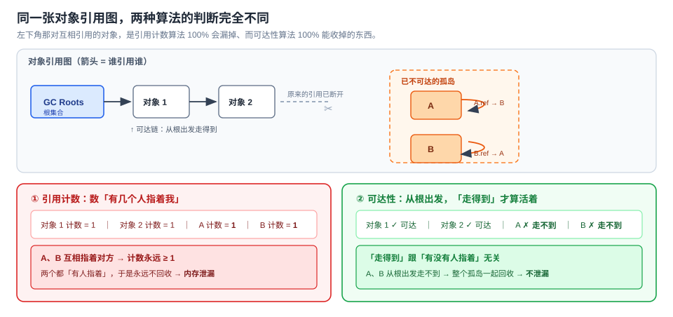

# 第 12 课：内存·性能与选型收束

> 所属阶段：阶段 4《工程化与运行时》｜ 水平：入门 ｜ 本课知识点：垃圾回收机制、常见内存泄漏与排查、选型收束：JS vs TS、运行时与工具链
> 故事情节：最后一课，主角站高一层——页面用久了越来越卡，是内存泄漏；而"要不要上 TypeScript"这种问题，答案从来不在工具本身
> 🎯 **本课承载「决策参考」目标**：JS vs TS 判断条件 + 运行时 / 工具链选型对比（走事实核查，标注时点）
> ✅ 状态：已完成（2026-09-03）｜ 实操环境：Node.js v22.14.0（文中所有输出均为本机实测，采用临时实验目录验证后删除）

## 🎯 本课目标

- 用"**可达性**"解释为什么引用计数解决不了循环引用，说清标记清除与分代回收
- 指出并修复闭包 / 定时器 / 监听器导致的内存泄漏，用 `WeakMap` 给出通用解
- 给出"该不该上 TypeScript"的**判断条件**；说出各运行时（Node / Deno / Bun）与工具链的取舍边界

## 📌 知识点导航

| # | 知识点 | 状态 |
|---|--------|------|
| 1 | 垃圾回收机制 | ✅ |
| 2 | 常见内存泄漏与排查 | ✅ |
| 3 | 选型收束：JS vs TS、运行时与工具链 | ✅ |

---

## 第一幕：起源与场景引入

> 🏛️ **起源**：**垃圾回收不是 JS 的发明，它比 JS 还大 36 岁。**
>
> 1959 年，**John McCarthy** 在设计 **LISP** 时发明了垃圾回收（garbage collection）。值得注意的是——他在论文里只用了**一页多一点的篇幅**，描述的算法就是**标记-清除（mark and sweep）**，而且判据就是**可达性**：用深度优先搜索找出所有"能走到的"内存单元，剩下的回收。
>
> （核查于 2026-09，来源：Harvard CS252 课程材料《Origins of Garbage Collection》—— "McCarthy introduces the LISP language and invents garbage collection to implement the language, devoting just over a page to a mark and sweep algorithm that identifies reachable words by depth-first search."）
>
> 💡 这解释了一件重要的事：**"可达性"从第一天起就是 GC 的正统思路**，"引用计数"反而是后来的一种实现尝试。而 JS 之所以也走这条路——回扣课 3：JS 的词法作用域、闭包设计都源自 Lisp / Scheme 这一脉。

> 🎬 **场景 A**：你的服务跑了一夜，内存从 80 MB 涨到 1.2 GB。重启，立刻回到 80 MB。

你翻代码，把几个大数组都置了 `null`：

```js
let cache = loadBigData();
// ... 用完
cache = null;          // ← 我明明置 null 了，为什么内存不降？
```

内存曲线还是一路向上。

> 🎬 **场景 B**：同一周，团队为"要不要上 TypeScript"吵了一下午。

主张上的人说"类型安全、重构放心"；反对的人说"配置麻烦、编译慢"。

一小时后谁也没说服谁——**因为双方一直在讲工具本身的优缺点，没人问一句：我们这个项目是什么情况？**

**这两个场景是同一道题**：它们都要求你**看整体结构**（引用图 / 项目约束），而不是盯着某一个局部（某一行代码 / 某一个工具）。

---

## 第二幕：认知冲突

三个困惑：

1. **内存为什么只涨不跌？** 我把变量都置 `null` 了啊——置 `null` 不就是"释放"吗？
2. **到底是哪段代码在漏？** 内存曲线只告诉我"总量在涨"，不告诉我"谁在涨"。
3. **"我们该不该上 TypeScript" 这种问题，该从哪下手？** 双方说的都有道理，怎么判断？

| 困惑 | 答案藏在 |
|------|---------|
| 置 null 了内存还不降 | **知识点 1**：`null` 只断开**一条边**，对象是否回收取决于**从根还能不能走到它** |
| 谁在漏怎么定位 | **知识点 2**：四种典型泄漏模式 + 堆快照对比法 + `WeakMap` 通用解 |
| 选型问题从哪下手 | **知识点 3**：不看工具看**约束**——项目规模 × 团队规模 × 维护周期 × 依赖生态 |

> 💡 这三个困惑指向**同一件事**：**本课的两半内容其实是同一个动作**——前半（知识点 1、2）教你**看懂一张引用图**，后半（知识点 3）教你**看懂一张约束图**。两件事都不是"找某个东西的毛病"，而是"看清楚关系"。

---

## 第三幕：层层揭示

### 知识点 1：垃圾回收机制

> 本知识点关键点：引用计数与**循环引用**问题（它为什么被淘汰）/ 标记清除与可达性（从 GC Roots 出发）/ 分代回收与增量标记 / V8 的 Orinoco 概况

#### 一句话定义

**对象是否该被回收，不看"有没有人指着它"，而看"从根集合出发还能不能走到它"。** 这条路走不到的，哪怕它内部互相指着，也一律回收。



#### 直觉建立（类比）

把内存想成一张**地铁线路图**：

- **对象** = 车站
- **引用** = 站点之间的轨道
- **GC Roots** = 你手上那张"起点站清单"（全局对象、当前执行栈上的变量……）
- **可达** = 从任意起点站出发，**沿着轨道能走到**

- **引用计数** = 挨个问每站：**"有几条轨道通到你这儿？"** 数为 0 就拆掉。
- **可达性** = 拿着起点站清单，**真的沿着轨道走一遍**，走不到的全拆掉。

> 💡 **类比的边界**：
> 1. 地铁是**连通性**问题，GC 也一样——**环**对可达性毫无威胁（走不到就是走不到），但对引用计数是致命的（环里每一站都有轨道通进来）。这正是引用计数被淘汰的原因。
> 2. GC Roots 不是"固定的几个站"，它包含**当前执行栈上的变量**——所以同一个对象在函数执行期间是可达的，函数返回后就可能不可达了。回扣课 3：**栈帧销毁 = 局部变量的引用边同时消失**。
> 3. GC **不是实时的**。对象变成垃圾的那一刻不会被立刻收走，得等下一轮 GC。所以你看内存曲线时，"没立刻降"不等于"漏了"。

#### 核心原理

**① 引用计数为什么不行（算法模拟）**

```js
function demo() {                    // 模拟：每多一条指向我的引用，计数 +1
  const a = { name: 'A', count: 0 };
  const b = { name: 'B', count: 0 };
  a.count += 1; b.count += 1;     // 局部变量各持一次  → A 1 / B 1
  b.count += 1;                   // a.ref = b         → A 1 / B 2
  a.count += 1;                   // b.ref = a         → A 2 / B 2
  a.count -= 1; b.count -= 1;     // 函数结束，局部变量消失 → A 1 / B 1
  console.log(`函数结束后：A.count = ${a.count}，B.count = ${b.count}`);
}
demo();
```

实测输出：

```
（这是算法模拟，不是 V8 的真实实现 —— V8 用的是可达性）
函数结束后：A.count = 1，B.count = 1
→ 引用计数算法：两个都不是 0，都不回收 → 泄漏
→ 可达性算法  ：从根出发走不到 A 也走不到 B → 两个都回收
```

**只要两个人互相指着对方，它们就永远"有人指着"。** 这就是引用计数无法解决的**循环引用**问题。

**② 本机铁证：V8 确实能回收循环引用**

用 `FinalizationRegistry` 可以在对象被回收时收到通知。先看对照组——一个普通对象：

```js
const registry = new FinalizationRegistry((held) => {
  console.log('  [GC 回调] 对象已被回收：', held);
});

function makeAndDrop() {
  const obj = { name: '临时对象' };
  registry.register(obj, '临时对象');
}
makeAndDrop();
global.gc();
```

实测：

```
函数内：obj 还活着
gc() 之前 —— 回调还没触发
gc() 已调用（回调是异步的，等一个宏任务）
  [GC 回调] 对象已被回收： 临时对象
```

**关键的一步——把两个对象做成环：**

```js
function makeCycle() {
  const a = { name: 'A' };
  const b = { name: 'B' };
  a.ref = b;                       // ← 互相引用，成环
  b.ref = a;
  registry.register(a, 'A（在环里）');
  registry.register(b, 'B（在环里）');
}
makeCycle();
global.gc();
```

实测：

```
已经成环，且函数已返回（从根出发走不到它们）
  [GC 回调] 对象已被回收： A（在环里）
  [GC 回调] 对象已被回收： B（在环里）
```

**两个都被回收了。** 这就是"V8 用的是可达性、不是引用计数"的直接证据。

再补一个反向对照——只要还可达，就不会被回收（实测：下面没有任何"释放"输出，`keepAlive.name` 照常能读）。

> ⚠️ **`FinalizationRegistry` 的重要限制**（核查于 2026-09，来源：MDN「FinalizationRegistry」）：
> - **"A conforming JavaScript implementation... is not required to call cleanup callbacks."** —— 规范**不保证**回调一定被调用，"may be called then, or some time later, or **not at all**"。
> - 官方建议：**"Cleanup callbacks should not be used for essential program logic."**（别用它承载关键逻辑）
> - 提案作者原话：如果你的程序依赖 GC 及时、可预测地调用 finalizer，**"it's likely to be disappointed: the cleanup may happen much later than expected, or not at all"**。
> - 所以：**它只适合用来"观察"和"顺手减少内存占用"，不能用来做资源释放的兜底。** 需要确定性清理就用 `try...finally`（课 11）或显式的 `close()`/`dispose()`。

**③ 标记-清除、标记-整理，与 OOM 时你能看到的名字**

基本流程：

1. **标记（Mark）**：从 GC Roots 出发，遍历所有能走到的对象，打上标记。
2. **清除（Sweep）**：没被标记的就是垃圾，回收其内存。
3. **整理（Compact，可选）**：把活下来的对象往一端挪，消除内存碎片。

这两个名字不是传说——**OOM 的时候 Node 会直接把它们打印出来**。实测（把老生代上限压到 64 MB）：

```
<--- Last few GCs --->
[30384:...]   83 ms: Mark-Compact 50.2 (67.1) -> 50.0 (83.1) MB, ... (average mu = 0.864, ...)
[30384:...]  110 ms: Mark-Compact 65.2 (98.4) -> 65.2 (97.9) MB, ... (average mu = 0.727, ...)
             allocation failure; scavenge might not succeed
<--- JS stacktrace --->
FATAL ERROR: Reached heap limit Allocation failed - JavaScript heap out of memory
---- exit code = 134 ----
```

三处值得看：

- **`Mark-Compact`** = 标记-整理，就是上面第 3 步。
- **`scavenge`** = 新生代回收的名字（见下条分代）。"scavenge might not succeed" 是说：新生代那点空间救不了你了。
- **退出码 134**：按 Unix 惯例 = 128 + 6（`SIGABRT`），表示进程被中止而非正常退出；**本机 Windows 实测也是 134**（Node 在各平台统一用这个值表示致命错误）。

**④ 分代回收（实测 V8 的堆分区）**

V8 把堆分成几块，不同块用不同策略。本机实测 `v8.getHeapSpaceStatistics()`：

```
new_space            已用     0.0 MB / 可用     1.0 MB / 总     2.0 MB
old_space            已用     3.1 MB / 可用     0.2 MB / 总     3.8 MB
code_space           已用     0.1 MB / 可用     0.0 MB / 总     0.3 MB
trusted_space        已用     0.9 MB / 可用     0.1 MB / 总     1.0 MB
large_object_space   已用     0.3 MB / 可用     0.0 MB / 总     0.3 MB
```

| 分区 | 放什么 | 回收策略 |
|---|---|---|
| **新生代（new space）** | 新创建的对象 | **Scavenge**：活着的对象被复制到另一块，剩下的整块清空。**极快，但空间小**（本机只有 2 MB） |
| **老生代（old space）** | 熬过几轮新生代回收还活着的对象 | **Mark-Sweep / Mark-Compact**：慢，但能处理大量对象 |
| **大对象空间（large object space）** | 特别大的对象（如大数组） | 单独管理，一般不移动 |
| **代码空间（code space）** | 编译后的代码 | — |

**为什么要分代？** 靠一个经验规律（**分代假说**）：**绝大多数对象"朝生夕死"**。函数里的临时对象，往往函数返回就成了垃圾。所以：

- 对新生代，用"复制存活对象"的 Scavenge —— 因为存活的少，复制成本低；
- 对老生代，用标记清除/整理 —— 因为存活的多，复制反而亏。

> 💡 这也解释了课上常见的现象：`--expose-gc` 后调一次 `gc()` 未必让内存立刻回到基线 —— 对象可能还在新生代里"熬资历"。

**⑤ 三个容易混淆的内存数字**

实测 `process.memoryUsage()`：

```
rss        （常驻集，进程占的物理内存）: 37.1 MB
heapTotal  （V8 已申请的堆）           :  7.3 MB
heapUsed   （堆中真正在用的）           :  4.4 MB
external   （绑定到 JS 对象的 C++ 内存）:  1.7 MB
arrayBuffers（ArrayBuffer 占用）       :  0.0 MB
```

| 字段 | 含义 | 什么时候看它 |
|---|---|---|
| `heapUsed` | **堆中真正在用的** | **排查 JS 内存泄漏就看这个** |
| `heapTotal` | V8 已向系统申请的堆 | 它比 `heapUsed` 大是**正常的**（预留空间） |
| `rss` | 进程占用的全部物理内存 | 它大但 `heapUsed` 小 → 问题多半在 `external` / `ArrayBuffer` / 原生模块 |
| `external` | 绑定到 JS 对象的 C++ 内存 | Buffer、原生 addon 出问题看这里 |

> ⚠️ **常见误判**：看到 `rss` 一路涨就喊"内存泄漏"。`rss` 还包含代码段、栈、原生模块；**JS 层的泄漏要看 `heapUsed`**。

✅ **困惑 1 已解**：把变量置 `null`，只是**断开了一条边**。对象是否回收，取决于**从 GC Roots 出发还能不能走到它**。你的 `cache = null` 断开了 `cache` 这一条，但那个数组可能还被别处引用着（另一个变量、某个闭包、某个数组、某个对象属性）——只要有任意一条路径可达，它就活着。本课知识点 2 会把"别处"具体是哪几处一一列出来。

---

### 知识点 2：常见内存泄漏与排查

> 本知识点关键点：意外全局变量 / 未清理的定时器与事件监听 / 闭包持有大对象（**回扣课 3**）/ 脱离 DOM 的引用残留 / 用 DevTools 的 Memory 面板定位（堆快照对比法）/ `WeakMap` 为什么是通用解

#### 一句话定义

**内存泄漏 = 一个对象"逻辑上该死了"，但引用图上还有一条路径让它保持可达。** 排查就是找出那条路径，修复就是剪断它。

#### 直觉建立（类比）

把对象想成**被绳子拴住的气球**，GC Roots 是**地面上的桩子**：

- 引用 = 绳子
- 可回收 = 没有任何绳子（直接或间接）把它连到桩子上
- **泄漏 = 你以为剪断了绳子，其实还有一根没剪**

四种典型泄漏，就是四根**你容易忘记剪的绳子**：

| 绳子 | 具体是什么 |
|---|---|
| ① 意外全局 | 忘了写 `const`，气球直接拴死在桩子上 |
| ② 定时器 / 监听器 | 桩子上有一根"常驻绳"，你没解 |
| ③ 闭包 | 回扣课 3：闭包的气球包着一整个作用域 |
| ④ 缓存 / 脱离 DOM 的引用 | 一个永不清理的容器在囤气球 |

> 💡 **类比的边界**：
> 1. 绳子是**有向**的（A 引用 B 不等于 B 引用 A）。所以"环"不算被桩子拴住 —— 这正是知识点 1 的结论。
> 2. GC 不会**实时**剪绳子。气球脱手后要等下一轮 GC 才飞走。
> 3. 有些"绳子"看不见：引擎可能因为优化、内联缓存等原因让对象多活一会儿。所以内存数字**有波动是正常的**，看**趋势**而不是某个瞬间。

#### 核心原理

**① 泄漏 ①：意外全局变量**

```js
function leakByGlobal() { accidental = new Array(2e6).fill('x'); }   // ← 忘了 const/let
```

实测：

```
泄漏前                            heapUsed =   4.2 MB
泄漏后（局部变量本该消失）            heapUsed =  19.5 MB
globalThis 上有 accidental 吗： object
修复后（delete globalThis.accidental） heapUsed =  4.3 MB
严格模式直接拦住： ReferenceError - strictAccidental is not defined
```

**非严格模式下，给未声明的变量赋值 = 在 `globalThis` 上创建属性。** 而 `globalThis` 正是 GC Roots —— 永远可达。

**修复**：加 `'use strict'`（回扣课 1）。严格模式会直接抛 `ReferenceError`，把泄漏**挡在运行之前**。

**② 泄漏 ②：未清理的定时器和事件监听**

```js
function startTimer() {
  const big = new Array(2e6).fill('x');
  return setInterval(() => { if (big.length > 0) { /* 什么都不做 */ } }, 1000);
}
```

实测：

```
启动前                heapUsed =   4.3 MB
启动后                heapUsed =  19.6 MB
修复后（clearInterval） heapUsed =   4.3 MB
```

**定时器只要还挂着，它的回调就活着；回调活着，回调闭包引用的 `big` 就活着** —— 哪怕这个回调什么都不做。

事件监听同理：`addEventListener` 之后不 `removeEventListener`，监听器（及其闭包）就一直挂在那个 DOM 节点 / EventTarget 上。

> 💡 现代浏览器/框架提供了更省心的写法：`AbortController` 一次 `abort()` 可以撤销一批监听；React 的 `useEffect` 返回清理函数；`setTimeout` 用 `unref()`（Node）不阻止进程退出。

**③ 泄漏 ③：闭包持有大对象（回扣课 3）**

```js
function holdEverything() {            // 问题版
  const big = new Array(2e6).fill('x');
  return () => big.length;             // ← 闭包持有整个 big
}
function holdOnlyWhatINeed() {         // 修复版
  const big = new Array(2e6).fill('x');
  const len = big.length;              // ← 只留下真正需要的值
  return () => len;
}
```

实测：

```
创建闭包前                    heapUsed =   4.3 MB
返回「持有整个数组」的闭包       heapUsed =  19.6 MB
闭包置 null 后                heapUsed =   4.3 MB
返回「只持有 length」的闭包（修复版） heapUsed =   4.3 MB   ← 压根没涨
```

这就是课 3 那条结论的代价：闭包保存的是**整个变量环境**，不是"用到的那几个变量"。你只需要一个 `length`，它却把 16 MB 的数组一起留着。

**修复**：在返回闭包**之前**，把需要的值提取成局部变量，让大对象留在函数里被回收。

**④ 泄漏 ④：无上限的缓存（Map vs WeakMap）**

这是**最容易被忽略、也最有通用解**的一种。场景：你给一批"不属于你"的对象附加元数据。

```js
const strongCache = new Map();      // ← 键是强引用
const weakCache = new WeakMap();    // ← 键是弱引用
// 两个容器都常驻（模拟模块级缓存）
for (let i = 0; i < 5; i++) { const k = { id: i }; strongKeys.push(k); strongCache.set(k, BIG()); }
for (let i = 0; i < 5; i++) { const k = { id: i }; weakKeys.push(k);   weakCache.set(k, BIG()); }
```

实测：

```
两个缓存各填 5 份 16MB 后   heapUsed = 156.9 MB
丢弃所有「键」之后          heapUsed =  95.9 MB
→ 实测差值 61.0 MB 就是 WeakMap 被自动回收的那部分
```

**业务代码把键丢掉之后，Map 那半份一个字节都没降，WeakMap 那半份自动没了 61 MB。**

> 💡 回扣课 9：**`WeakMap` 的键是弱引用**——键被回收时，对应条目会**自动消失**。这就是为什么它是"给别人的对象附加数据"的通用解：你不用管清理，GC 替你做。
> 代价是：不能遍历、没有 `size`、不能清空。需要这些能力时，就得自己设上限（LRU）或自己清理。

**⑤ 泄漏 ⑤：脱离 DOM 的引用残留**

浏览器里的经典模式：你从页面上删掉了一个节点，但某个 JS 变量还指向它 —— 于是这棵 DOM 子树（连同它挂的数据和事件）全部活着。

```js
const removed = [];
function removeRow(row) {
  row.remove();            // 从 DOM 里删掉了
  removed.push(row);       // ← 但 JS 还持有它 → 整棵子树不释放
}
```

> ⏳ **置信度提示**：这是浏览器场景，**本机没有浏览器环境、未实跑**。它的**内存原理与上面 ④ 完全同构**（一个永不清理的容器持有本该死亡的对象），本课的修复思路同样适用。**未实测**的部分仅指浏览器 DOM API 的具体行为。

**⑥ 怎么定位：堆快照对比法**

两个环境各有入口，产出的是**同一种文件格式**：

| 环境 | 怎么拿堆快照 |
|---|---|
| **浏览器 DevTools** | Memory 面板 → Take heap snapshot |
| **Node** | `v8.writeHeapSnapshot('x.heapsnapshot')` |

Node 侧实测：

```
已生成 demo.heapsnapshot， 88.17 MB
文件开头: {"snapshot":{"meta":{"node_fields":["type","name","id","self_size","edge_count", ...
→ 这正是 Chrome DevTools Memory 面板「Load」能打开的同一格式
```

**堆快照对比法（三步）**：

1. **在操作前**拍一张快照（基线）
2. **执行你怀疑泄漏的操作**，重复几次
3. **再拍一张**，用 DevTools 的 **Comparison（对比）视图**按 "Delta"（增量）排序

**只增不减、且数量持续变大的那些构造器，就是泄漏源。** 从它往回看 "Retainers"（谁在持有它），那条链就是你要剪的绳子。

> ⏳ **置信度提示**：DevTools Memory 面板的**具体操作**（Comparison 视图、Retainers 面板）本机无浏览器环境、**未实跑**，按工具文档的通用流程陈述；上面 Node 侧的 `writeHeapSnapshot` 与文件格式是**实测**的。

✅ **困惑 2 已解**：泄漏的本质是**引用图上多了一条本该消失的边**。定位靠**堆快照对比**（找只增不减的构造器，顺 Retainers 往回找持有者）；修复有四类对应手段 —— `'use strict'`、`clearInterval`/`removeEventListener`、闭包只留需要的值、以及 **`WeakMap` 这个"不用你管清理"的通用解**。

---

### 知识点 3：选型收束：JS vs TS、运行时与工具链

> 本知识点关键点：该不该上 TypeScript 的**判断条件**（项目规模 × 团队规模 × 维护周期 × 依赖生态），以及翻转点 / Node vs Deno vs Bun 的取舍边界 / 打包器与转译器的现状（**走事实核查，标注时点**）/ 知识体系全景收束与下一步学习路径

#### 一句话定义

**"该不该上 X"不是关于 X 的问题，而是关于"你现在的约束是什么"的问题。给条件，不给结论。**

#### 先看一个活教材：两个厂商的基准，互相打架

在讲判断条件之前，先看本课最重要的一段事实核查。这是**同一时点（2026-09）**，两个运行时官网各自公布的基准：

**Bun 官网**（bun.sh）公布：

| 场景 | Bun | Node | Deno |
|---|---|---|---|
| Express over HTTPS（req/s，越高越好） | **48,243** | 25,181 | 19,243 |
| 安装依赖（warm cache，越低越好） | **0.21 s** | npm 4.45 s | — |

**Deno 官网**（deno.com）公布：

| 场景 | Deno | Bun | Node |
|---|---|---|---|
| Realworld（req/s，越高越好） | **72,400** | 68,200 | 44,000 |
| Realworld p99 延迟（越低越好） | **1.87 ms** | 2.80 ms | 3.76 ms |
| 峰值内存（越低越好） | 64 MB | **45 MB** | 116 MB |
| 安装依赖（warm cache，越低越好） | **598 ms** | 766 ms | npm 3,852 ms |

**两边都把自己排在吞吐量第一，而且差距悬殊**：Bun 官网说 Bun 是 Deno 的 **2.5 倍**；Deno 官网说 Deno **略胜** Bun。

> ⚠️ **这两组数据都是厂商自己发布的、为自己的产品做背书的基准**（测什么、怎么测、在什么硬件上测，都是发布方选的）。**它们不是谎言，但它们不是中立的结论。**
>
> **两边唯一一致的结论是**：在原始吞吐和安装速度上，**Node / npm 都是最慢的那个**。这才是可以放心采信的部分——因为它是**两个有竞争关系的对手得出了同一个方向**。

**这就是本知识点的全部题眼**：看到"X 比 Y 快 N 倍"时，先问三件事 —— **谁测的？测的什么？我的场景像不像它测的那个？**

#### 一、该不该上 TypeScript：四个判断条件

**先看事实**（核查于 2026-09）：

- TypeScript 官网定义：**"TypeScript is JavaScript with syntax for types."**（TS 就是带类型语法的 JS）
- **TypeScript 7.0 已于 2026-07-08 发布**（来源：微软 TypeScript 官方博客《Announcing TypeScript 7.0》，Daniel Rosenwasser）。它是**用 Go 重写的原生编译器**，官方称完整构建加速 **8x–12x**。

TS 7.0 官方公布的实测：

| 代码库 | TypeScript 6 | TypeScript 7 | 加速 |
|---|---|---|---|
| vscode | 125.7 s | 10.6 s | **11.9x** |
| sentry | 139.8 s | 15.7 s | **8.9x** |
| bluesky | 24.3 s | 2.8 s | **8.7x** |
| playwright | 12.8 s | 1.47 s | **8.7x** |
| tldraw | 11.2 s | 1.46 s | **7.7x** |

内存占用也降了（vscode −18%、bluesky −26%）。编辑器体验：在 VS Code 代码库里，从打开编辑器到看到第一个错误，**17.5 秒 → 1.3 秒**。Slack 报告 CI 类型检查从 **7.5 分钟降到 1.25 分钟**。

**但 TS 7.0 有一个必须知道的坑**（官方原文）：

> "TypeScript 7.0... **does not ship with an API**." —— 7.0 **不提供程序化 API**，计划 7.1 才补。

后果（官方原文）：**typescript-eslint、webpack loaders、以及 Vue / MDX / Astro / Svelte 这类需要把 TS 嵌进自己编译器的工具链，目前还得用 TypeScript 6.0。**

**这条限制恰好就是下面"判断条件"里第四条（依赖生态）的活例子** —— 工具再好，生态没跟上就是没跟上。

**判断条件清单：**

| 条件 | 倾向**上 TS** | 倾向**用 JS** |
|---|---|---|
| **① 项目规模** | 多个模块/包、API 面大、跨文件契约多 | 单文件脚本、一次性工具、几百行的小项目 |
| **② 团队规模** | 多人协作，有人不熟全部代码 | 一人项目，或所有人每天都看全部代码 |
| **③ 维护周期** | 要活几年、会不断重构 | 用完就扔、原型验证、活动页 |
| **④ 依赖生态** | 主要依赖都有类型定义（或 `@types` 齐全） | 重度依赖那些**没有类型、且 TS 7.0 API 缺失导致工具链断裂**的库 |
| **⑤ 上手成本** | 团队有时间学，或已经会 | 明天就要上线，没人能抽出时间 |

**翻转点（什么时候该改主意）：**

| 从 | 到 | 触发条件 |
|---|---|---|
| JS → TS | 项目从"一个人的脚本"变成"几个人在改同一份代码"，且**开始出现"改了 A 崩了 B"** | 协作半径超出一个人脑容量 |
| JS → TS | 你开始写**给别人用的库**，需要别人在你的 API 上获得补全 | 你成了别人的"依赖" |
| TS → JS | 团队被类型体操拖住，业务迭代速度明显下降 | 类型的成本超过了它防住的 bug |
| 不上 → 上 | **TS 7.0 之后**："编译太慢"这条理由**基本不成立了**（8–12x） | 历史成本被消除 |

> 💡 **一个务实的中间路线**：不上 TS，也用 **JSDoc + `// @ts-check`** 拿到大部分类型检查的好处，零构建成本。官方也支持（TS 7.0 对 JS 支持做了调整，具体见官方 `CHANGES.md`）。

#### 二、运行时：Node vs Deno vs Bun 的取舍边界

**事实核查（时点 2026-09，来源见各行）：**

| | **Node.js** | **Deno** | **Bun** |
|---|---|---|---|
| 当前版本 | 26.7.0 | **2.9.6**（deno.com 安装页） | **1.4.0**（bun.sh，2026-08 发布） |
| JS 引擎 | **V8** | V8 | **JavaScriptCore**（WebKit） |
| 官方定位 | 通用 JS 运行时（**生态与稳定的基准**） | "drop-in JavaScript runtime for Node developers"——**完全 Node 兼容 + 默认安全的沙箱** | "all-in-one toolkit"——**运行时 + 包管理器 + 测试运行器 + 打包器四合一** |
| 内置工具 | 较少（npm 单独装） | 13 个（fmt / lint / test / bench / compile / desktop…） | 4 个核心（install / test / build / run） |
| 安全模型 | 默认全开 | **默认拒绝**（文件/网络/环境都要显式授权，支持 `--deny-net`） | 默认全开 |
| TypeScript | 需构建步骤 | **原生运行**："No `tsc`, no `ts-node`, no bundler" | **原生运行** |

**Node.js 的一个重要变更**（来源：nodejs.org 官方公告《Evolving the Node.js Release Schedule》，发布于 2026-03-10）：

- 从 **27.x 起，Node.js 从"每年两个大版本"改成"每年一个"**。
- 新节奏：**Alpha 6 个月（10 月–次年 3 月）→ Current 6 个月（4 月–10 月）→ LTS 30 个月**。
- **每个版本都会成为 LTS**，不再有"奇数版不稳定"的区分。
- Node 26 是旧模式下的**最后一条发布线**（2026-04 发布，2026-10 进 LTS，2029-04 EOL）。

> 📌 这条对选型有实际影响：**"我只升 LTS"的老习惯在新节奏下依然成立，但版本号的含义变了** —— 以后 `27` 不是"过渡版"，它也会进 LTS。

**取舍边界：**

| 你的情况 | 建议 | 理由 |
|---|---|---|
| **生产服务、要长期维护、依赖大量 npm 包** | **Node.js** | 生态与兼容性是压倒性的；LTS 支持窗口明确 |
| **跑不受信的代码 / 需要沙箱 / 重视供应链安全** | **Deno** | 默认拒绝 + `--allow-*` / `--deny-*` + `deno audit`，是**唯一把安全做成默认**的一家 |
| **追求极致启动速度 / 想要一个工具搞定全部 / 本地开发体验** | **Bun** | 安装与冷启动最快，四合一省配置；但**历史较短，生产验证相对少** |
| **已经在用 Node，只是想加速本地开发** | **继续 Node，只换包管理器/测试器** | Bun 官网自己也说：`bun install` / `bun test` **可以直接用在现有 Node 项目里，不切换运行时** |

> ⚠️ **别用吞吐基准做这个决定。** 上面两组互相打架的数据已经说明了原因。真实的决定性因素通常是：**生态兼容性、团队熟悉度、部署平台支持、出问题时能不能搜到答案**——这些都不在基准里。

#### 三、打包器与转译器现状

**事实核查（时点 2026-09）**：

- **Vite**（vite.dev）：由 **VoidZero** 维护，**80k+ GitHub stars，8000 万+ 周下载量**。官方描述生产构建的能力是 "**powered by Rolldown**"（由 Rolldown 驱动），插件接口沿用 Rollup 的设计。
- **TypeScript 7.0**（2026-07-08）：Go 原生编译器，8–12x 加速；**但 7.0 无 API**，依赖 TS API 的插件链还需 TS 6.0。
- **Bun** 的打包器定位（bun.sh 原话）："**replaces esbuild · Vite · webpack**"。

**怎么理解这条线：**

```
写代码（ES2025+ / TS / JSX）
   │
   ├─ 转译（降语法、去类型）  ← esbuild / SWC / tsc / Bun / Deno 内置
   │
   ├─ 打包（合并、tree-shaking、压缩）  ← Vite(Rolldown) / webpack / Rspack / Bun
   │
   └─ 开发服务器（HMR）  ← Vite / Bun
```

**趋势（据上面核查到的事实）**：**用 Rust / Go / Zig 等原生语言重写工具链**，把"转译 + 打包"从秒级压到毫秒级（TS 7.0 的 8–12x 就是同一波浪潮的一部分）。

> ⏳ **置信度提示**：本节只对 **Vite（官网）、TypeScript 7.0（微软官方博客）、Bun（官网）** 做了官方源核查。**webpack / Rollup / esbuild / SWC / Rspack / Turbopack 等未逐一核查当前版本与状态**，故不在此给出版本号，避免给出过时数字。需要时请自行查各自官网 —— **这也正是本知识点想教你的动作：要数字，去一手来源看，并记下核查日期。**

#### 四、知识体系全景收束：12 课走过了什么

| 阶段 | 课 | 你现在能回答的问题 |
|---|---|---|
| **1 值与作用域** | 课 1 变量与类型 | 一个值有哪几种类型？`var` / `let` / `const` 差在哪？ |
| | 课 2 值的复制与比较 | 为什么改了 A，B 也跟着变？`==` 到底在比什么？ |
| | 课 3 作用域与闭包 | 一个名字在哪儿能被看见？闭包为什么能"记住"？ |
| **2 函数与对象** | 课 4 函数是一等公民 | 函数凭什么能被传来传去？参数是怎么传进去的？ |
| | 课 5 this 到底指向谁 | 调用一个函数时，`this` 是谁？（看调用点，不看定义处） |
| | 课 6 原型与类 | `class` 底下到底是什么？继承有几种写法、怎么选？ |
| **3 异步与现代语法** | 课 7 事件循环 | 为什么 JS 单线程却不卡？代码的执行顺序怎么排？ |
| | 课 8 Promise 与 async/await | 异步的结果和错误怎么接？串行和并发怎么写？ |
| | 课 9 现代语法与内置数据结构 | `...`、`?.`、`Map`/`Set`/`WeakMap` 什么时候用？ |
| **4 工程化与运行时** | 课 10 模块化 | 代码怎么拆？CJS 和 ESM 差在哪？（加载时机） |
| | 课 11 错误处理与调试 | 错误从哪来、到哪去？线上堆栈怎么定位回源码？ |
| | 课 12 内存·性能与选型收束 | 内存为什么只涨不跌？该用什么工具？（看约束，不看宣传） |

**贯穿全程的三条主线：**

1. **值的身份**（阶段 1）→ **值的传递**（阶段 2）→ **时间的顺序**（阶段 3）→ **代码与资源的组织**（阶段 4）
2. **"看起来一样，其实不同"**：`==` vs `===`、浅拷贝 vs 深拷贝、`this` 的定义处 vs 调用点、`class` vs 原型、同步 vs 异步错误、引用计数 vs 可达性
3. **每一次"为什么"都指向一个机制**：TDZ → 词法作用域；闭包保住变量 → 作用域链；`try` 抓不到异步 → 调用栈帧的生命周期；`instanceof` 失效 → 跨 realm 的不同原型对象

#### 五、下一步往哪走

| 方向 | 建议的下一站 | 前置 |
|---|---|---|
| **异步进阶** | 手写 Promise（A+ 规范）、`AbortController` 取消、并发控制 | 课 8 |
| **底层机制** | 读 ECMA-262 中你感兴趣的那几章；用 `node --inspect` 调试真实项目 | 全部 |
| **浏览器侧** | DOM / 事件 / 渲染管线 / Performance 与 Memory 面板实操 | 课 7、课 12 |
| **工程化** | 用 Vite 起一个真项目，配 ESLint / Prettier / CI | 课 10、课 12 |
| **类型系统** | TypeScript 官方 Handbook，从 JSDoc + `@ts-check` 起步 | 课 12 |

> 📌 **课程边界提醒**（沿用 `01-学习路径总览.md` 的声明）：本课程聚焦 **JavaScript 语言核心**，**不含** DOM/BOM、前端框架、Node 后端 API。上面"浏览器侧""工程化"属于**超出本课程范围的延伸方向**。

✅ **困惑 3 已解**：像"该不该上 TypeScript"这种问题，**答案从来不在工具本身**。它是一组**约束条件**的函数——项目规模 × 团队规模 × 维护周期 × 依赖生态。团队吵一下午没结果，是因为双方一直在比较工具，没人问"我们是什么情况"。

而当你去查资料做判断时，记住本课那段核查给你的三个动作：

1. **去一手来源看，并记下核查日期**（本课所有数字都标了时点：2026-09）。
2. **警惕厂商自己发布的基准** —— Bun 和 Deno 的官网基准互相打架，两边都排第一。
3. **只采信"对手之间一致的结论"** —— 两边都测出 Node/npm 最慢，这个方向才可信。

最后别忘了：**工具的成本是会变的**。三年前"TS 编译慢"是真的，2026 年 TS 7.0 把这个成本砍掉了 8–12 倍；但同时"TS 7.0 没有 API"又成了新的生态约束。**条件要定期重估，结论不要刻在石头上。**

---

## 第四幕：实操验证

把四种泄漏逐个复现、逐个修好。完整脚本（`lesson-12-demo.js`，需 `--expose-gc`）：

```js
// ===== 第 12 课 第四幕：泄漏复现 → 定位 → 修复 =====
// 运行：node --expose-gc lesson-12-demo.js
const v8 = require('v8');
const fs = require('fs');
const path = require('path');

const MB = () => (process.memoryUsage().heapUsed / 1024 / 1024).toFixed(1);
const BIG = () => new Array(2e6).fill('x');        // 约 16 MB

function show(label) {
  global.gc(); global.gc();          // 多跑一次，让弱引用和大对象都清干净
  console.log(`  ${label.padEnd(48)} heapUsed = ${MB().padStart(7)} MB`);
}

console.log('基线 heapUsed =', MB(), 'MB\n');

// ========== 泄漏 ①：意外全局变量 ==========
console.log('【1】意外全局变量：忘了写 const / let');
function leakByGlobal() { accidental = BIG(); }     // ← 非严格模式下自动挂到 globalThis
show('泄漏前');
leakByGlobal();
show('泄漏后（局部变量本该消失）');
console.log('  globalThis 上有 accidental 吗：', typeof globalThis.accidental);
console.log('  → 它挂在根对象上，永远可达，永远不会被回收');
delete globalThis.accidental;                        // 修复：手动断开
show('修复后（delete globalThis.accidental）');
try {
  (function () { 'use strict'; strictAccidental = BIG(); })();
} catch (e) {
  console.log('  严格模式直接拦住：', e.constructor.name, '-', e.message);
}

// ========== 泄漏 ②：未清理的定时器 ==========
console.log('\n【2】未清理的定时器：回调闭包持有大对象');
function startTimer() {
  const big = BIG();
  return setInterval(() => { if (big.length > 0) { /* 什么都不做 */ } }, 1000);
}
show('启动前');
const timer = startTimer();
show('启动后');
clearInterval(timer);                                // 修复：清理
show('修复后（clearInterval）');

// ========== 泄漏 ③：闭包持有大对象 ==========
console.log('\n【3】闭包持有大对象（回扣课 3）');
function holdEverything() {                          // 问题版
  const big = BIG();
  return () => big.length;                           // 闭包持有整个 big
}
function holdOnlyWhatINeed() {                       // 修复版
  const big = BIG();
  const len = big.length;                            // 只留下真正需要的值
  return () => len;
}
show('创建闭包前');
let fn = holdEverything();
show('返回「持有整个数组」的闭包');
fn = null;
show('闭包置 null 后');
fn = holdOnlyWhatINeed();
show('返回「只持有 length」的闭包（修复版）');
fn = null;

// ========== 泄漏 ④：Map vs WeakMap ==========
console.log('\n【4】无上限的元数据缓存：Map vs WeakMap');
const strongCache = new Map();                       // 两个容器都常驻（模拟模块级缓存）
const weakCache = new WeakMap();
let strongKeys = [];
let weakKeys = [];
for (let i = 0; i < 5; i++) { const k = { id: i }; strongKeys.push(k); strongCache.set(k, BIG()); }
for (let i = 0; i < 5; i++) { const k = { id: i }; weakKeys.push(k);   weakCache.set(k, BIG()); }
show('两个缓存各填 5 份 16MB 后');
const filled = Number(MB());
strongKeys.length = 0;                               // 业务代码把「键」全丢了
weakKeys.length = 0;
show('丢弃所有「键」之后');
console.log('  → Map 那半还在（强引用键），WeakMap 那半被回收（弱引用键）');
console.log('  → 实测差值', (filled - Number(MB())).toFixed(1), 'MB 就是 WeakMap 被自动回收的那部分');
strongCache.clear();                                 // 清掉，免得污染后面的快照体积

// ========== 定位手段 ==========
console.log('\n【5】定位手段：堆快照（Node 侧就能产出）');
const snap = path.join(__dirname, 'demo.heapsnapshot');
v8.writeHeapSnapshot(snap);
console.log('  已生成 demo.heapsnapshot，', (fs.statSync(snap).size / 1024 / 1024).toFixed(2), 'MB');
console.log('  → 这正是 Chrome DevTools Memory 面板「Load」能打开的同一格式');
```

**实测输出（Node v22.14.0）：**

```
基线 heapUsed = 4.7 MB

【1】意外全局变量：忘了写 const / let
  泄漏前                                              heapUsed =     4.2 MB
  泄漏后（局部变量本该消失）                                    heapUsed =    19.5 MB
  globalThis 上有 accidental 吗： object
  → 它挂在根对象上，永远可达，永远不会被回收
  修复后（delete globalThis.accidental）                heapUsed =     4.3 MB
  严格模式直接拦住： ReferenceError - strictAccidental is not defined

【2】未清理的定时器：回调闭包持有大对象
  启动前                                              heapUsed =     4.3 MB
  启动后                                              heapUsed =    19.6 MB
  修复后（clearInterval）                               heapUsed =     4.3 MB

【3】闭包持有大对象（回扣课 3）
  创建闭包前                                            heapUsed =     4.3 MB
  返回「持有整个数组」的闭包                                    heapUsed =    19.6 MB
  闭包置 null 后                                       heapUsed =     4.3 MB
  返回「只持有 length」的闭包（修复版）                           heapUsed =     4.3 MB

【4】无上限的元数据缓存：Map vs WeakMap
  两个缓存各填 5 份 16MB 后                                heapUsed =   156.9 MB
  丢弃所有「键」之后                                        heapUsed =    95.9 MB
  → Map 那半还在（强引用键），WeakMap 那半被回收（弱引用键）
  → 实测差值 61.0 MB 就是 WeakMap 被自动回收的那部分

【5】定位手段：堆快照（Node 侧就能产出）
  已生成 demo.heapsnapshot， 88.17 MB
  → 这正是 Chrome DevTools Memory 面板「Load」能打开的同一格式
```

**回扣第一幕**：场景 A 里"内存只涨不跌"，根源就是这四条路径之一。而"置 null 了没用"（困惑 1）的答案也在上面 —— 泄漏 ①②③ 里，局部变量**确实**都出了作用域，但**另一条边**还拴着它：`globalThis`（①）、定时器持有的回调（②）、返回的闭包（③）。

---

## 第五幕：体系收束

### 一、内存排查速查

```
内存涨了
  │
  ├─ 先看 heapUsed 还是 rss？
  │    ├─ heapUsed 涨 → JS 层泄漏 → 继续
  │    └─ rss 涨但 heapUsed 不涨 → 看 external / ArrayBuffer / 原生模块
  │
  ├─ 拍两张堆快照做对比，按 Delta 排序，找只增不减的构造器
  │
  ├─ 顺着 Retainers 往回找「谁在持有它」
  │
  └─ 对照四种典型模式剪绳子
       ├─ globalThis 上有残留？      → 'use strict'
       ├─ 定时器 / 监听器没清？       → clearInterval / removeEventListener / AbortController
       ├─ 闭包抱住了整个大对象？      → 先提取需要的值，再返回闭包
       └─ 容器在无限囤积？           → WeakMap（键是别人的对象时）/ 自己设上限
```

### 二、常见误区

| ❌ 误区 | ✅ 事实（本机实测 / 官方源） |
|---|---|
| "置 `null` 就等于释放" | 只断开**一条边**。是否回收取决于**从根还能不能走到它** |
| "循环引用会泄漏" | **不会** —— 实测环里的 A、B 都被回收了（V8 用可达性） |
| "`rss` 涨就是内存泄漏" | 看 `heapUsed`；`rss` 还含代码段、栈、原生模块 |
| "`heapTotal` 比 `heapUsed` 大是异常" | 正常，那是 V8 预留的空间 |
| "调用 `gc()` 后内存应该回到基线" | 不一定；对象可能还在新生代"熬资历"，弱引用的清理也需要时机 |
| "用 `FinalizationRegistry` 释放资源" | **规范不保证回调被调用**（MDN 原文），只能用于观察 |
| "WeakMap 可以遍历" | 不能，也没有 `size`；这是**设计取舍**，不是缺陷 |
| "厂商基准说 X 最快" | Bun 与 Deno 官网的基准**互相矛盾**，两边都把自己排第一 |
| "上 TS 就一定更好" | 是**项目规模 × 团队规模 × 维护周期 × 依赖生态**的函数 |

### 三、决策参考清单（本课🎯专项）

> 三个问题，各给一组**条件**，不给结论。

**决策题 1：我这个项目该不该上 TypeScript？**

```
□ 项目是多模块、跨文件契约多吗？
□ 团队 > 1 人，且有人不熟全部代码吗？
□ 要维护一两年以上、会持续重构吗？
□ 主要依赖都有类型定义吗？
□ 团队有时间学（或已经会）吗？

→ 勾选 ≥ 3 条：上。
→ 勾选 ≤ 1 条：先用 JSDoc + @ts-check。
→ 卡在「依赖生态」：先查你的关键依赖在 TS 7.0 下能不能用（7.0 无 API，
   typescript-eslint / Vue / Svelte 等仍需 6.0）。
```

**决策题 2：运行时选哪个？**

```
□ 生产服务、长期维护、重度依赖 npm      → Node.js
□ 跑不受信代码 / 要沙箱 / 重供应链安全   → Deno（默认拒绝是独一份）
□ 要最快启动 / 想要一个工具全包          → Bun
□ 只想提速本地开发、不想换运行时         → 继续 Node，只换 bun install / bun test
```

**决策题 3：碰到"X 比 Y 快 N 倍"这类宣传怎么办？**

```
□ 谁测的？（厂商自己测的，还是第三方？）
□ 测的什么？（hello-world 还是真实业务？）
□ 我的场景像不像它测的那个？
□ 两个互为对手的厂商，有没有得出同一个方向？  ← 只有这种结论才可信
```

### 四、与前 11 课的连线

| 本课内容 | 回扣 |
|---|---|
| 栈帧销毁 = 引用边消失 | **课 3** 词法作用域、闭包 |
| 闭包持有大对象 | **课 3** 已做过内存实验（4.6 → 19.4 → 4.2 MB），本课补上修复 |
| `WeakMap` 是通用解 | **课 9** 已实测 Map 强引用 vs WeakMap 弱引用 |
| GC 用的 Lisp 血脉 | **课 3** 已核实 JS 与 Scheme 的渊源 |
| `try...finally` 做确定性清理 | **课 11**（GC 不可预测，确定性清理要靠 `finally`） |
| `--inspect-brk` 与 CDP | **课 11** 已实测；Deno 的 `deno run --inspect-brk` 是同一套协议 |
| 堆快照与 DevTools | **课 11** 已建立"CDP 复用"的认知 |
| Source Map 与生产排错 | **课 11** |

---

## 🎯 本课目标回扣

| 目标 | 达成情况 |
|---|---|
| 用"可达性"解释引用计数为何不行，说清标记清除与分代回收 | ✅ 算法模拟 + **实测铁证**（环里 A、B 都被回收）；OOM 日志里的 `Mark-Compact` / `scavenge`；V8 分区实测表 |
| 指出并修复闭包/定时器/监听器泄漏，用 `WeakMap` 给出通用解 | ✅ 四种典型全部实测复现与修复（4.2→19.5→4.3 等）；`WeakMap` 对照实测**差值 61.0 MB**；堆快照实测 |
| 给出"该不该上 TS"的判断条件；说出各运行时取舍边界 | ✅ 四条件 + 翻转点；**Bun 与 Deno 官网基准互相矛盾**的活教材；Node/Deno/Bun 官方数据 + 时点标注；TS 7.0 官方数据（含"7.0 无 API"这个关键限制） |

---

## 📝 小测

**Q1.** 下面这段代码执行完，两个对象会被回收吗？为什么？

```js
function makeCycle() {
  const a = { name: 'A' };
  const b = { name: 'B' };
  a.ref = b;
  b.ref = a;
}
makeCycle();
```

<details><summary>答案</summary>

**会，两个都被回收。**

V8 用的是**可达性**而不是引用计数。函数返回后，`a` 和 `b` 这两个局部变量消失，虽然 `a` 和 `b` 互相引用，但**从 GC Roots 出发走不到它们**，所以整个孤岛一起被回收。

本机用 `FinalizationRegistry` 实测，两个对象都收到了"已被回收"的回调：
```
  [GC 回调] 对象已被回收： A（在环里）
  [GC 回调] 对象已被回收： B（在环里）
```

**循环引用会导致泄漏，是引用计数算法的问题，不是现代 JS 引擎的问题。**

</details>

**Q2.** 你把一个大数组置了 `null`，内存却没降。列出**三种**可能的原因。

<details><summary>答案</summary>

置 `null` 只断开了**这一条**引用边。对象是否回收取决于**从 GC Roots 出发还能不能走到它**。三种常见原因：

1. **还有别的变量/属性指向它** —— 比如它被 push 进了某个数组、存进了某个对象、或另一个变量也指向它。
2. **被闭包抱住了** —— 某个还活着的闭包（定时器回调、事件监听器、返回的闭包函数）引用着它。
3. **挂在根上了** —— 忘了写 `const`，它被挂在 `globalThis` 上（非严格模式），而 `globalThis` 就是 GC Roots。

（还有第四种：GC 还没跑。对象变成垃圾不等于立刻被回收，得等下一轮 GC。）

</details>

**Q3.** 为什么 `WeakMap` 被称为"给别人的对象附加元数据"的通用解？它的代价是什么？

<details><summary>答案</summary>

**原因**：`WeakMap` 的**键是弱引用**——当键对象在别处被回收时，WeakMap 里对应的条目会**自动消失**，你完全不用管清理。

实测（两个缓存各放 5 份 16MB，然后把键全丢掉）：
```
两个缓存各填 5 份 16MB 后   heapUsed = 156.9 MB
丢弃所有「键」之后          heapUsed =  95.9 MB
→ 实测差值 61.0 MB 就是 WeakMap 被自动回收的那部分
```
`Map` 那半一个字节没降（它的键是强引用，把本该死亡的对象硬留着）。

**代价**：不可遍历、没有 `size`、不能清空 —— 你放弃了"看见里面有什么"的能力。需要这些能力时，就得自己设上限（如 LRU）或自己清理。

</details>

**Q4.** 看到"Bun 比 Deno 快 2.5 倍"这类基准结论，你应该先问什么？

<details><summary>答案</summary>

先问 **谁测的、测的什么、我的场景像不像**。

本课实测核查了一个现成的例子（2026-09）：

- **Bun 官网**公布的 Express 吞吐：**Bun 48,243 > Node 25,181 > Deno 19,243**
- **Deno 官网**公布的 Realworld 吞吐：**Deno 72,400 > Bun 68,200 > Node 44,000**

**两边都是厂商自己发布、为自己背书的基准，而且都把自己排第一，差距悬殊（一个说 Bun 是 Deno 的 2.5 倍，一个说 Deno 略胜 Bun）。**

可以这样用的可靠结论只有一条：**两个互为对手的厂商得出了同一个方向 —— Node / npm 在原始吞吐和安装速度上都是最慢的。**

做选型时，真正决定的通常是：生态兼容性、团队熟悉度、部署平台支持、出问题时能不能搜到答案 —— **这些都不在基准里。**

</details>

**Q5.** 团队问"我们要不要上 TypeScript"，按本课的思路，你会怎么把这个问题拆开？

<details><summary>答案</summary>

**不谈 TS 本身的优缺点，先问约束。** 四个判断条件：

| 条件 | 倾向上 | 倾向不上 |
|---|---|---|
| **项目规模** | 多模块、跨文件契约多 | 单文件脚本、几百行 |
| **团队规模** | 多人协作、有人不熟全部代码 | 一人项目 |
| **维护周期** | 要活几年、会重构 | 用完就扔、原型验证 |
| **依赖生态** | 依赖都有类型定义 | 重度依赖无类型、且工具链受影响 |

≥3 条命中就上；≤1 条就先用 **JSDoc + `@ts-check`**（零构建成本，拿大部分好处）。

**还要叠上当前时点的事实**（核查于 2026-09）：
- **TypeScript 7.0（2026-07-08 发布）是 Go 原生编译器，官方实测加速 8–12x** —— "编译太慢"这条反对理由**基本不成立了**。
- **但 TS 7.0 不提供程序化 API** —— typescript-eslint、webpack loaders、以及 Vue / MDX / Astro / Svelte 这类工具链目前还得用 TS 6.0。这直接命中"依赖生态"那条判断条件。

</details>

---

## 🚀 下一批接力提示词

> 12 课全部讲完 —— **复制下面这段文字发给 AI**，进入 Phase 3 综合实战项目：

```
继续学 JavaScript 语言核心（ES6+）。我的学习档案在 frontend/javascript-core/00-学习档案.md，
刚学完阶段 4《工程化与运行时》全部 3 课（模块化 / 错误处理与调试 / 内存·性能与选型收束），
4 个阶段 12 课 36 知识点已全部讲完。
请按流程进入 Phase 3，给我一个跨阶段整合的综合实战项目。
```

---

## 📚 本课导航

| 上一课 | 返回目录 | 下一站 |
|--------|---------|--------|
| [第 11 课：错误处理与调试](lesson-11-错误处理与调试.md) | [学习路径总览](../../../01-学习路径总览.md) | **Phase 3 综合实战项目**（见上方接力提示词） |
