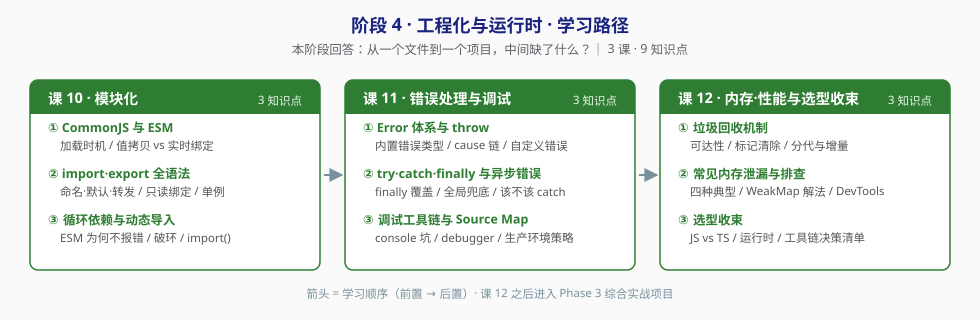

# 阶段 4：工程化与运行时

> 所属课程：JavaScript 语言核心（ES6+） ｜ 故事章节：**从一个文件到一个项目** ｜ 上一阶段：[阶段 3 异步与现代语法](../3-异步与现代语法/overview.md)
> 返回：[学习路径总览](../01-学习路径总览.md) ｜ [课程目录](../02-课程目录.md)

## 🎯 本阶段目标

- 从"能写单文件"走向"能组织一个项目"：模块怎么拆、错怎么捕、内存怎么管。
- 理解 `CommonJS` 与 `ESM` 的差异在**加载时机**，不在语法——这决定了 tree-shaking 为什么只在 ESM 上成立。
- 站高一层回答"我该用什么"：给出 JS vs TS、运行时与工具链的**判断条件**，而不是跟风选型。

## 📍 学习重点

| 重点 | 为什么重要 |
|------|-----------|
| 模块的加载时机 | CommonJS 是运行时加载、值是拷贝；ESM 是编译时静态分析、值是实时绑定。这一条解释了循环依赖在两者下表现不同的全部原因 |
| 异步错误捕获 | `try...catch` 抓不到异步错误，是新手最常踩的坑。必须建立"同步用 try、异步用 catch/全局兜底"的分工意识 |
| 内存泄漏的四种典型 | 意外全局、未清理的定时器与监听、闭包持有大对象、DOM 引用。认出这四种，就覆盖了绝大多数泄漏 |
| 选型判断条件 | "该不该上 TS"不是信仰问题，是**项目规模 × 团队规模 × 维护周期**的函数。给条件，不给结论 |

## 🎯 决策参考专项

本阶段承载学习目标的「③ 决策参考」，三处给对比 + 决策清单：

| 位置 | 决策题 | 产出形式 |
|------|--------|----------|
| 课 10 | CommonJS vs ESM 该怎么选 | 对比表 + "什么条件下该改选另一个" |
| 课 12 | 我这个项目该不该上 TypeScript | 判断条件清单 + 翻转点 |
| 课 12 | 运行时与工具链怎么选（Node / Deno / Bun、打包器 / 转译器） | 对比表 + 现状说明（走事实核查，标注时点） |

## ✅ 必须掌握的知识点

| 知识点 | 所属课 | 学完应能 |
|--------|--------|----------|
| CommonJS 与 ESM | 课 10 | 说清"实时绑定"与"值拷贝"的差异及后果；解释为什么 tree-shaking 只在 ESM 上成立 |
| import·export 全语法 | 课 10 | 用命名导出 / 默认导出 / 转发写出多模块项目；解释导入绑定为什么是只读的 |
| 循环依赖与动态导入 | 课 10 | 解释 ESM 循环依赖的**三种**表现（`const` + 同步访问会**抛 ReferenceError**（TDZ）；`var` 才是 `undefined`；延迟访问正常）；给出破环手段；用 `import()` 做代码分割 |
| Error 体系与 throw | 课 11 | 区分 `TypeError` / `RangeError` / `SyntaxError`；用 `cause` 串起错误链 |
| try·catch·finally 与异步错误 | 课 11 | 解释 `finally` 的覆盖行为；为 `unhandledrejection` 写全局兜底；说清什么时候该 catch、什么时候该往上抛 |
| 调试工具链与 Source Map | 课 11 | 说出 `console.log` 调试的三个坑；用 `debugger` 和断点定位问题；说清生产环境 Source Map 的取舍 |
| 垃圾回收机制 | 课 12 | 用"可达性"解释为什么引用计数解决不了循环引用；说清标记清除与分代回收 |
| 常见内存泄漏与排查 | 课 12 | 指出并修复闭包 / 定时器 / 监听器导致的泄漏；用 WeakMap 给出通用解 |
| 选型收束：JS vs TS、运行时与工具链 | 课 12 | 给出"该不该上 TS"的判断条件；说出各运行时的取舍边界 |

## 🗺️ 本阶段路径图

> 箭头 = 学习顺序（前置 → 后置）。课 12 之后进入 Phase 3 综合实战项目。

## 本阶段产出

- [x] `lessons/lesson-10-模块化.md` ✅（2026-09-03，含「决策参考」专项）
- [x] `lessons/lesson-11-错误处理与调试.md` ✅（2026-09-03）
- [x] `lessons/lesson-12-内存性能与选型收束.md` ✅（2026-09-03，含「决策参考」专项；**全部 12 课收官**）

> 实操环境：Node.js v22.14.0 / npm 10.9.2（Windows PowerShell）。课 11、课 12 会用到 Chrome/Edge DevTools。
