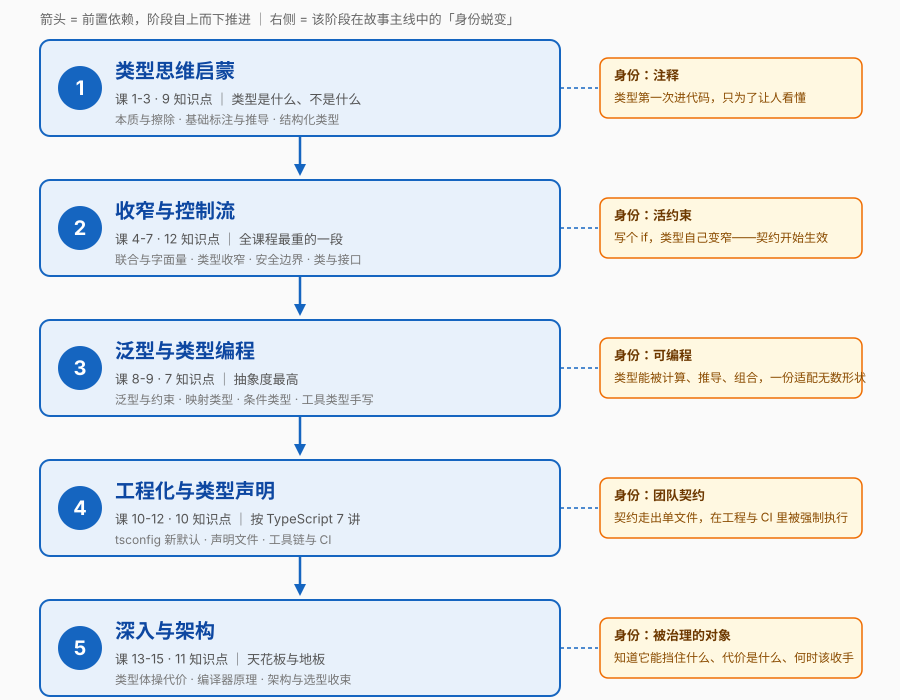

# TypeScript · 学习路径总览

> 水平：**零基础 TS** ｜ 模式：课程制 ｜ 规模：**5 阶段 / 15 课 / 49 知识点**（深入版）
> 四大目标：① 理解概念 ② 动手实操 ③ 决策参考 ④ 工程实践
> 实操环境：**Node.js v22.14.0 + TypeScript 7.0.2**（核查于 2026-08）
> 📑 按课查阅请走 [`02-课程目录.md`](02-课程目录.md)（书本式目录，已编写 = 链接）
> 📌 本文件是**活文档**，随学习进度与大纲调整同步更新。

## 🎯 学习目标

- **目标类型**：理解概念 + 动手实操 + 决策参考 + 工程实践（用户四项全选）
- **目标说明**：能说清 TS 类型系统**为什么这么设计**、能在真实项目里把类型当作**契约**而非装饰使用、能在「用不用 `any` / 类型写多严 / 该不该上 TS」这些岔路口说出理由、能独立配置一套 TS 7 工程化流水线（tsconfig + 声明文件 + lint + CI）。

> 学习目标是全局基准，决定各阶段 / 课的取舍与实操比重。目标变更时更新此处并同步调整相关课。

## 🚧 课程边界与前置（重要）

### 不在本课程范围内

| 不在范围内 | 归属 / 说明 |
|-----------|------------|
| JavaScript 语言核心本身 | [`javascript-core`](../javascript-core/02-课程目录.md) 课程 |
| React / Vue / Angular 的类型用法 | 框架主题（学完本课自然能看懂） |
| Volar 类插件 / 模板内类型检查 | TS 7 暂不支持（无稳定 API），见课 12 |
| Node.js 后端 API（http / fs / stream） | Node 服务端主题（本课只用 Node 当**代码运行环境**） |
| 类型体操竞赛（type-challenges 全刷） | 刻意不做——课 13 会讲**什么时候不该做类型体操** |

### 前置知识假设

假设你已具备 **ES6 基础**：箭头函数、解构与展开、模板字符串、`class` 语法、`Promise` / `async/await`、`import` / `export`。

你的 JS 课程目前进度 3/36，尚未覆盖全部。处置原则见 [`00-学习档案.md`](00-学习档案.md)「前置知识约定」——**语法层面不影响理解的一句带过，概念层面影响理解的回指 JS 课**，不阻塞 TS 主线。

## 🎬 故事主线

**一个「类型」在团队里的身份蜕变：从注释 → 到契约 → 到可编程的约束。**

想象你接手一个跑了一年的 JS 项目。你要改一个函数，于是你问：

> "这个 `formatUser(data)` 到底要传什么样的对象？哪些字段是必填的？返回的东西里有没有 `id`？"

没人答得上来。你只能去翻调用它的 17 个地方，靠猜。改完之后，测试环境一切正常，上线三小时后——`Cannot read properties of undefined`。

**问题不在于你不够小心，而在于：这些信息本来应该写在代码里，而 JS 把它们全丢在了人的脑子里。**

TypeScript 的答案听起来很简单——"给值加上类型标注"。但真正有意思的是后面：类型一旦进了代码，它就开始**自己生长**。

- 它先是**注释**：告诉读代码的人这里要什么
- 然后变成**契约**：编译器会替你检查每一处调用，你不能反悔
- 再然后变成**可编程的约束**：类型可以被计算、被推导、被组合，你能写出"只要传错字段名就编译不过"的代码
- 最后你必须面对它的**天花板与地板**：类型能挡住多少错误？代价是什么？什么时候这一点代价不值得付？

**这门课就是你从"给变量加个 `: string`"成长为"能用类型系统表达业务规则、并知道什么时候该收手"的完整旅程。** 五个阶段，对应五次身份蜕变：

- **阶段 1**：类型是什么、不是什么 —— 从此不再把它当成"要背的语法"
- **阶段 2**：让编译器看懂你的 `if` —— 类型从静态标注变成随控制流变化的活物
- **阶段 3**：给类型装上参数 —— 类型开始可编程，一份代码适配无数形状
- **阶段 4**：类型走出单文件 —— 契约要在整个工程、整个团队里生效
- **阶段 5**：天花板与地板 —— 类型能做什么、做不到什么、什么时候别干

## 🗺️ 学习路径图



> 箭头 = 前置依赖。每个阶段都建立在前一阶段之上，不可跳过。
> 右侧标签 = 该阶段在故事主线中对应的"身份蜕变"章节。

## 📚 阶段总览

### 阶段 1：类型思维启蒙（课 1-3 · 9 知识点）

- **目标**：搞清楚"类型到底是什么、它不是什么"，能写出并编译第一个 TS 程序，从此不再把 TS 当成"要背的语法"。
- **学习重点**：
  - TS 是**擦除式类型超集**——类型在编译后**完全消失**，它不改变运行时行为（这一个问题能解开后面一半的困惑）
  - 静态类型的价值是**错误发现左移**，代价是认知成本与构建成本——两者都要看，才知道什么时候不值
  - 类型**推导**优先于类型**注解**：TS 不是让你到处写类型，是让你在关键处写
- **必须掌握**：能说清 `tsc` 编译的产物里类型去哪了；能解释一个类型错误与一个运行时错误的本质差别；能独立初始化一个 TS 7 项目并跑通
- **对应课**：[课 1 TypeScript 到底是什么](stages/1-类型思维启蒙/lessons/lesson-01-TypeScript到底是什么.md) ✅、课 2 基础类型标注与推导、课 3 对象类型与结构化类型
- [进入阶段 1 概览](stages/1-类型思维启蒙/overview.md)

### 阶段 2：收窄与控制流（课 4-7 · 12 知识点）

- **目标**：让编译器看懂你的 `if`。从此类型不再是死的标注，而是随控制流变化的活物。
- **学习重点**：
  - 联合类型是**集合**，而收窄是"排除不可能的成员"——理解这点，`unknown` 就不难了
  - 控制流分析是 TS 最聪明的地方：写一个 `if`，后面的代码类型自动变窄
  - `any` 不是"关闭开关"，它是**会传染的**；`unknown` 才是安全的顶层类型
  - 类型断言是"我向编译器保证"，**不是检查**——所有外部数据都必须在边界处校验
- **必须掌握**：能为一个判别式联合写穷尽性检查；能说清 `any` 与 `unknown` 的差别并举出各自该用的场景；能解释为什么 `as` 不能替代运行时校验
- **⚠️ 难度提示**：**课 5「类型收窄」是阶段 2 的核心**，也是分水岭——学完它你才真正开始"用" TS 而不是"写" TS。课 6 相对轻松，可当作缓冲。
- **对应课**：课 4 联合类型与字面量类型、课 5 类型收窄、课 6 any·unknown·never 与信任边界、课 7 类与接口的类型世界
- [进入阶段 2 概览](stages/2-收窄与控制流/overview.md)

### 阶段 3：泛型与类型编程（课 8-9 · 7 知识点）

- **目标**：给类型装上参数。从此一份代码能适配无数形状，且**不丢失类型信息**。
- **学习重点**：
  - 泛型不是 `any` 的别名——它是"**调用时才确定的类型参数**"，会把类型信息一路带下去
  - `keyof` + 索引访问类型 + 映射类型 + 条件类型，是类型编程的**四块积木**
  - 内置工具类型不是魔法，每一个都能自己手写出来（手写一遍 = 彻底理解）
- **必须掌握**：能手写 `Partial` / `Pick` / `Omit` / `ReturnType` 的实现；能说清条件类型"裸类型参数会分发"这个坑；能看出泛型被滥用的信号
- **⚠️ 难度提示**：**课 9 是全课程抽象度最高的一课**。若卡住，允许先跳过「条件类型与 infer」，学完阶段 4 再回头补。
- **对应课**：课 8 泛型基础、课 9 类型编程三件套与内置工具类型
- [进入阶段 3 概览](stages/3-泛型与类型编程/overview.md)

### 阶段 4：工程化与类型声明（课 10-12 · 10 知识点）

- **目标**：让类型走出单文件，在整个工程、整个团队里真正生效。
- **学习重点**：
  - **TS 7 改了一批默认值**：`strict` 默认开、`rootDir` 默认 `./`、`types` 默认 `[]`，一批旧选项变硬错误——照 5.x 老教程配置会直接撞墙
  - `target` / `module` / `moduleResolution` 是一组**联动**配置，`nodenext` 与 `bundler` 的取舍取决于你的运行环境
  - 声明文件 `.d.ts` 是**类型的对外接口**：全局声明、模块声明、给无类型 JS 库补类型，三种场景三种写法
  - 类型检查必须进 CI，且**不能被构建工具悄悄跳过**
- **必须掌握**：能独立写出一份 TS 7 可用的 `tsconfig.json` 并解释每个关键选项；能为无类型的 JS 库写一份 `.d.ts`；能把 `tsc --noEmit` 接进 CI 与 pre-commit
- **对应课**：课 10 tsconfig 与编译配置、课 11 模块与声明文件、课 12 工具链集成与团队协作
- [进入阶段 4 概览](stages/4-工程化与类型声明/overview.md)

### 阶段 5：深入与架构（课 13-15 · 11 知识点）

- **目标**：摸到类型系统的天花板与地板——它能做到什么、做不到什么、什么时候别干。
- **学习重点**：
  - 类型体操的**代价**是真实的：编译耗时、报错可读性、团队可维护性——会写不等于该写
  - 编译流程（Scanner → Parser → Binder → Checker → Emitter）能解释"为什么这个报错长这样"、"为什么类型检查慢"
  - 可赋值性与变体（协变 / 逆变）是结构化类型的**底层规则**，很多"莫名其妙"的报错根因在这里
  - 收束到决策：**什么项目不该上 TS**、渐进迁移怎么走、类型放哪一层
- **必须掌握**：能读懂复杂的类型报错并定位到根因；能为老 JS 项目设计渐进迁移路径；能给出"我这个项目该不该上 TS / 该上多严"的判断条件
- **对应课**：课 13 类型体操进阶、课 14 编译器原理与类型检查机制、课 15 大型项目类型架构与选型收束
- [进入阶段 5 概览](stages/5-深入与架构/overview.md)

## 🔧 实操环境

| 项 | 值 |
|----|-----|
| 运行时 | **Node.js v22.14.0**（nvm4w 管理） |
| 包管理器 | npm 10.9.2 ｜ pnpm 10.33.0 |
| TypeScript | 待安装，课 1 执行 `npm i -D typescript`（将装到 7.0.2） |
| Shell | Windows PowerShell |
| 编辑器 | VS Code（TS 7 需装官方 `TypeScriptTeam.native-preview` 扩展，课 12 讲） |

> 完整环境结论与版本事实基线见 [`00-学习档案.md`](00-学习档案.md)。

## 当前进度

- [ ] 阶段 1：类型思维启蒙（🔄 进行中 · 3/9）
- [ ] 阶段 2：收窄与控制流（⬜ 未开始 · 0/12）
- [ ] 阶段 3：泛型与类型编程（⬜ 未开始 · 0/7）
- [ ] 阶段 4：工程化与类型声明（⬜ 未开始 · 0/10）
- [ ] 阶段 5：深入与架构（⬜ 未开始 · 0/11）

> 知识点级进度以 [`00-学习档案.md`](00-学习档案.md) 的进度表为准。

## 🚀 续学接力提示词

> 复制下面这段文字发给 AI，即可从下一个未完成知识点继续（无需重新描述上下文）：

```
继续学 TypeScript。我的学习档案在 frontend/typescript-core/00-学习档案.md，
刚学完阶段 1《类型思维启蒙》的课 1《TypeScript 到底是什么》三个知识点
（TS 的本质：擦除式类型超集 / 静态类型的价值与代价 / 第一个 TS 程序与编译流程），
请按大纲继续讲解下一课《基础类型标注与推导》。
```
