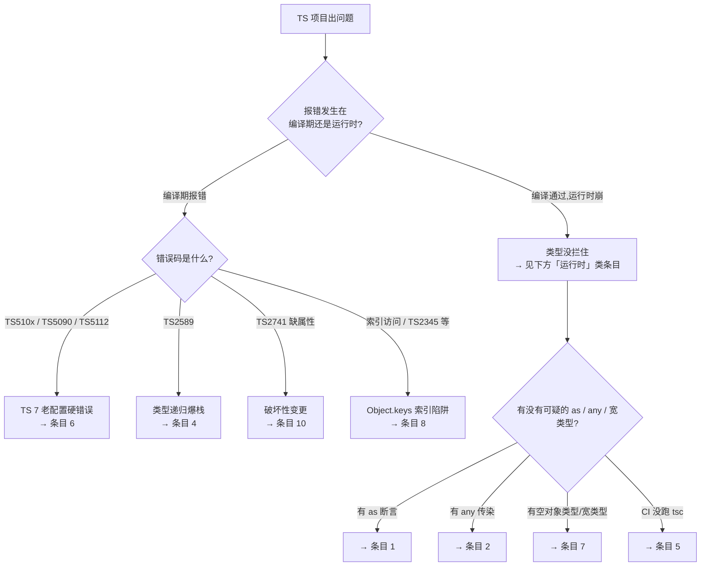

# TypeScript 排障速查手册（QRH 式）

> **Phase 5 三件套之二 · 使用态**（崩了就翻，只要答案）
> 实测环境：Node.js v22.14.0 + TypeScript 7.0.2 ｜ 生成日期：2026-09-04
>
> 📌 **本手册只给动作，不给原理。** 想懂"为什么会这样"去 [`08-实战经验.md`](08-实战经验.md)（每条末尾标了对应编号）。
> ⚠️ **第一条动作永远是止血，不是查根因**——线上没时间先搞清楚再动手。

## 怎么用

1. 先分清你的问题是**编译期报错**还是**运行时崩溃**（见下方分流图）
2. 看**索引表**，用你看到的**报错关键字 / 现象**定位条目
3. 进入条目后**从上往下执行**，别跳步骤
4. 每条最后有「若无效」的出口，不留死胡同

**紧急度**：🔴 立即处理（业务已受损）｜🟡 尽快处理（有风险未爆发）｜⚪ 有时间再看（体验或优化）

---

## 快速分流：你的问题出在哪一关

---

## 📇 症状索引表

> 交叉引用一律用**条目编号**（如「→ 转条目 4」），不用锚点链接——中文标题的锚点在不同渲染器下生成规则不一致，跳不过去。

| 你看到的（关键字 / 现象） | 条目 | 紧急度 |
|---|---|---|
| 编译全绿，运行时 `TypeError: Cannot read properties of undefined`，出错点在"以为校验过"之后 | **1** | 🔴 |
| 改了接口字段 / 删字段 / 改类型，编译器**不报错** | **2** | 🟡 |
| 复杂类型"算不出"，赋给什么都"合法"，**零报错** | **3** | 🔴 |
| `TS2589: Type instantiation is excessively deep`，或编译明显变慢 | **4** | 🟡 |
| CI 全绿但线上报类型错（`"0100"` 当数字、枚举值写错等） | **5** | 🔴 |
| `TS5108` / `TS5102` / `TS5090` / `TS5112` 等，指向 `tsconfig.json` 选项 | **6** | 🟡 |
| 类型检查通过，但那个值**根本不该被接受**，运行时崩 | **7** | 🟡 |
| `Object.keys(obj).map(k => obj[k])` 报类型错 / 索引访问报错 | **8** | ⚪ |
| 自动补全给的方法，运行时报 `xxx is not a function` | **9** | 🟡 |
| 升级依赖后冒出 `TS2741: Property 'xxx' is missing` | **10** | 🟡 |

---

## 1. 🔴 编译全绿，运行时 `Cannot read properties of undefined`

**一眼识别**：类型检查**全部通过**，线上报 `TypeError: Cannot read properties of undefined (reading 'x')`；出错点往往在 `JSON.parse` / 网络响应 / 跨模块边界之后。

| 步骤 | 动作 | 预期 |
|---|---|---|
| **止血** | 若最近有发布 → **回滚**；否则在报错点前加运行时守卫，先让它降级为可控错误而非崩溃 | 不再崩（这是降级不是根治） |
| 定位 1 | 报错点往上追一层，看数据是不是来自 `JSON.parse` / 网络 / 跨模块边界 | 确认是"外部数据" |
| 定位 2 | 搜代码里的 `as ` 断言，看断言右侧是"精确业务类型"（如 `User`）、左侧是 `any`/`unknown` 的 | 找到把数据"洗白"的那处 |
| 修复 | 入口改 `unknown` → 写**类型守卫**（`is User`）或运行时校验后收窄；需要强校验用 schema 库 | 边界处就能拦住 |
| 若无效 | → 转**条目 2**（可能有 `any` 在更上游把类型信息丢了） |

**分支判定**：

- 若数据来自**第三方接口且形状多变** → 必须运行时校验（schema 库），`as` 断言永远不够
- 若是**内部数据**却报这个错 → 不是信任边界问题，是数据流里有 `undefined` 没处理，回源头查
- 若加了守卫仍崩 → 检查守卫本身写对没有（`is` 断言 vs `as` 断言，别把守卫也写成承诺）

**预防**：信任边界处 `as` 一律视为红灯；外部数据唯一合法通道是「`unknown` → 运行时校验 → 精确类型」
**原理**：→ [`08-实战经验.md`](08-实战经验.md) · 故障模式 1

---

## 2. 🟡 改了字段 / 接口，编译器不报错

**一眼识别**：改了接口（改名 / 删字段 / 改类型），`tsc` **一声不吭**；上线后崩，报错点离你改的地方隔了好几层。

| 步骤 | 动作 | 预期 |
|---|---|---|
| **止血** | 若已上线 → 回滚该改动；本地先把可疑 `any` 改回 `unknown` 看哪里报错 | 找到类型信息丢失的边界 |
| 定位 1 | 报错链路上逐层看函数签名，找第一个**返回 `any` 或参数是 `any`** 的 | 定位到传染源 |
| 定位 2 | 跑 `npx tsc --noEmit`，把 `any` 出现点全列出来（开 `noImplicitAny` 更明显） | 拿到所有 `any` 清单 |
| 修复 | 源头 `any` → `unknown`（逼下游显式收窄）；迁移中转站的 `any` 立即收窄；lint 加 `no-explicit-any` | 类型检查恢复 |
| 若无效 | → 转**条目 5**（可能 CI 压根没跑 typecheck） |

**分支判定**：

- 若 `any` 是**新引入**的 → 直接改回精确类型，最省事
- 若 `any` 是**历史遗留**（迁移中）→ 逐个收窄，优先收窄"对外边界"处的 `any`
- 若改了 `unknown` 后下游**报错成片** → 说明类型信息本来就断了，这正是要修的债，别退回 `any`

**预防**：`any` 是"我要回来修"的标记不是"我放弃"；每写一处配一条 TODO，Code Review 把裸 `any` 当红灯
**原理**：→ [`08-实战经验.md`](08-实战经验.md) · 故障模式 2

---

## 3. 🔴 类型算不出，零报错，赋给什么都行

**一眼识别**：一段条件类型在某个输入上"算不出"，编译器**不报错**，结果静默变成 `never`；于是错误值一路绿灯。**比"报错难读"危险得多。**

| 步骤 | 动作 | 预期 |
|---|---|---|
| **止血** | 用 `IsNever` 显式探测可疑类型，先确认"它到底是不是 `never`" | 拿到"是否静默"的确定结论 |
| 定位 1 | 给复杂类型配 `Equals`/`Expect` 断言（**别用 `as` 断言**，会蒙混过关） | 定位到哪条输入算错 |
| 定位 2 | 检查条件类型的**兜底分支**：`X extends Y ? A : B` 的 `B` 有没有覆盖"算不出"的情况 | 找到缺失的兜底 |
| 修复 | 补兜底分支；断言改 `Equals` + `Expect` 并补负向对照；实在兜不住 → 回课 13 七步标准，**别写这个体操** | 结果可控，不再静默 |
| 若无效 | → 转**条目 4**（可能同时还有递归爆栈/性能问题） |

**分支判定**：

- 若你能为"算不出"写清楚兜底 → 补兜底即可
- 若"算不出"本身就无法预测 → 这类体操**不该写**，改手写 / 代码生成
- 若已经配了断言却没抓到 → 检查断言是不是 `as unknown as` 这种会被 `never` 蒙混的写法

**预防**：递归/复杂条件类型必配兜底 + `Equals` 断言 + 负向对照；"算不出会静默"是类型体操的头号代价
**原理**：→ [`08-实战经验.md`](08-实战经验.md) · 故障模式 3

---

## 4. 🟡 `TS2589` 递归深度超限 / 编译变慢

**一眼识别**：`tsc` 报 `TS2589: Type instantiation is excessively deep and possibly infinite`；或编译耗时明显上升（复杂体操比手写慢约 2.9x）。

| 步骤 | 动作 | 预期 |
|---|---|---|
| **止血** | 若这个类型挡了发布 → 临时改回手写 / 生成，先让构建过 | 构建恢复 |
| 定位 1 | 看报错定位到哪个类型别名，确认递归是不是**尾递归** | 非尾递归约 50 层爆、尾递归约 1000 层爆 |
| 定位 2 | `tsc --diagnostics` 看 Instantiations / Check time 是否异常 | 确认是类型求值拖慢 |
| 修复 | 非尾递归 → 改尾递归（分支直接递归，TS 4.5+ 自动优化）；加兜底防无限递归 | `TS2589` 消失 |
| 若无效 | → 转**条目 3**（可能改了之后又踩静默退化的坑） |

**分支判定**：

- 若递归**层数受输入规模驱动**（数据越大越深）→ 结构本身有问题，改设计，别硬调阈值
- 若只是**偶发逼近上限** → 尾递归 + 兜底通常够
- 若改成尾递归仍爆 → 已到语言边界，回课 13 七步标准换方案

**实测参考**：非尾递归 48 层 OK / 49 层 `TS2589`；尾递归 999 层 OK / 1000 层 `TS2589`（本机实测）

**预防**：写递归类型前先问"能不能尾递归？有没有兜底？"
**原理**：→ [`08-实战经验.md`](08-实战经验.md) · 故障模式 4

---

## 5. 🔴 CI 全绿，线上报类型错

**一眼识别**：CI 全绿、正常上线，然后线上报**类型错误**——`total = "0100"`（字符串当数字）、枚举值写错等。回看构建日志，**类型检查根本没跑过**。

| 步骤 | 动作 | 预期 |
|---|---|---|
| **止血** | 若已上线 → 回滚该改动；本地立刻跑 `npx tsc --noEmit` | 先让错误显形 |
| 定位 1 | 看 CI 配置里有没有**独立的 `tsc --noEmit`** 步骤（很多项目没加，或合进了 build） | 确认 typecheck 是缺失还是被跳过 |
| 定位 2 | 查构建工具：esbuild / swc / tsx / vite 都**只转译不检查** | 确认是不是只有转译 |
| 修复 | CI 加独立且可见的 `tsc --noEmit` gate；pre-commit 也挂一条；别用 `tsc --noCheck` 糊 | 类型错误在 CI 就红 |
| 若无效 | → 转 `debug`（typecheck 恢复了，但要查具体类型错怎么漏的） |

**分支判定**：

- 若 CI **有** `tsc --noEmit` 却还是漏 → 检查是不是用了 `tsc --noCheck`、或 `tsc` 的 `include` 没覆盖到出问题的文件
- 若 CI **没有** → 这就是根因，补上即可，别急着改代码
- 若编辑器里能看到报错但 CI 看不到 → 编辑器用的是 TS 7 原生扩展，CI 可能用了旧 `tsc`，版本对齐

**预防**："构建通过" ≠ "类型通过"；typecheck 是独立 gate，不依附 build
**原理**：→ [`08-实战经验.md`](08-实战经验.md) · 故障模式 5

---

## 6. 🟡 `TS5108` / `TS5102` / `TS5090` / `TS5112` 硬错误

**一眼识别**：初始化后 `tsc` 直接报错，错误码是 `TS510x` / `TS5090` / `TS5112` 系列，指向 `tsconfig.json` 里某个选项（`baseUrl`、`target: es5`、`moduleResolution: node` 等）。

| 步骤 | 动作 | 预期 |
|---|---|---|
| **止血** | 删掉报错指向的那个废弃/变硬错误选项，先让 `tsc` 跑起来 | 不再硬错误 |
| 定位 1 | 看错误码是不是 `TS510x` / `TS5090` / `TS5112` 系列 | 确认是"TS 7 老配置"问题 |
| 定位 2 | `npx tsc --init` 生成一份 TS 7 新模板，与你的 `tsconfig.json` 逐项 diff | 找出所有过时项 |
| 修复 | `baseUrl` → 改用 `paths` 绝对写法；`moduleResolution` → `bundler`/`nodenext`；`target` → 现代值；按课 1 的最小配置重写 | `tsc` 正常 |
| 若无效 | → 转 `debug`（可能还有别的隐藏过时项没被报出来） |

**分支判定**：

- 若你**不确定哪些选项过时** → 对照官方「Announcing TypeScript 7.0」的破坏性变更清单，逐条核
- 若是**从老项目迁移** → 老配置大概率一堆硬错误，建议直接按 TS 7 新默认重写，别逐条补丁

**预防**：配 TS 7 前先确认教程的大版本；"TS 5 配置"字样的教程要逐条过 TS 7 兼容性
**原理**：→ [`08-实战经验.md`](08-实战经验.md) · 故障模式 6

---

## 7. 🟡 类型检查通过，但值根本不该被接受

**一眼识别**：一个本该被类型拦住的值，**类型检查通过了**，运行时崩。回头看类型定义，某个位置用的是 `{}` / `Object` / 或某个"看起来很宽"的类型。

| 步骤 | 动作 | 预期 |
|---|---|---|
| **止血** | 在**你的边界**处加运行时校验，先拦住不该进来的值 | 错误在边界被拦 |
| 定位 1 | 报错点上溯，看类型定义链里哪个字段是 `{}` / `Object` / 宽类型 | 找到黑洞入口 |
| 定位 2 | 确认这个值该是什么精确形状，收窄成接口 / 联合 / `Record<string, unknown>` | 明确正确类型 |
| 修复 | `{}` / `Object` → `unknown`（逼收窄）或精确接口；"任意键值对象" → `Record<string, unknown>`；第三方宽类型在**你的边界**收窄 | 类型恢复精确 |
| 若无效 | → 转**条目 1**（可能同时还有 `as` 断言在别处放水） |

**分支判定**：

- 若宽类型来自**你写的** → 直接收窄，成本最低
- 若来自**第三方**（如 `React.ReactNode`）→ 你改不了别人，只能在你的边界收窄，别透传
- 若值是**外部数据** → 这本质是信任边界问题，运行时校验兜底

**预防**：看到 `{}` / `Object` 当类型默认它是 bug；精确的类型才拦得住错误
**原理**：→ [`08-实战经验.md`](08-实战经验.md) · 故障模式 7

---

## 8. ⚪ `Object.keys(...).map(k => obj[k])` 报类型错

**一眼识别**：`Object.keys(obj).map(k => obj[k])` 报类型错误（`k` 是 `string` 不能索引 `obj`）；或你为绕开写了 `as keyof`。

| 步骤 | 动作 | 预期 |
|---|---|---|
| **止血** | 先别写 `as keyof`（那是埋雷）；改用能正确索引的写法 | 类型安全 |
| 定位 1 | 确认键来源：是对象自身可枚举键，还是可能混入原型键 | 判定是否真安全 |
| 定位 2 | 确认你需要的到底是"遍历键"还是"遍历键值对" | 决定用 `keys` 还是 `entries` |
| 修复 | 遍历键值对 → `Object.entries(obj)`（值仍是 `unknown`，要收窄）；确定键就是 `keyof T` → 收窄到 `keyof T`；更稳 → `Record<string, T>` 或 `Map` | 索引安全 |
| 若无效 | → 转 `debug`（可能是对象形状本身设计有误） |

**分支判定**：

- 若对象有**运行时额外键**（原型/枚举）→ `Object.keys` 的 `string[]` 是对的，别硬断言
- 若对象是你自己定义的**纯数据** → `Object.entries` 最干净
- 若你只是想要**值的集合** → `Object.values(obj)` 更直接

**预防**：把 `Object.keys` 的返回当成 `string[]`，别默认它能索引回对象（这是 TS 官方有意设计）
**原理**：→ [`08-实战经验.md`](08-实战经验.md) · 故障模式 8

---

## 9. 🟡 自动补全给的方法，运行时报 `is not a function`

**一眼识别**：编辑器补全提示一个方法，照着写、编译**通过**，运行时报 `xxx is not a function`。翻源码发现方法根本不存在，是 `.d.ts` 写错了。

| 步骤 | 动作 | 预期 |
|---|---|---|
| **止血** | 定位到出错调用，先按**真实实现**修正（别信 `.d.ts` 的提示） | 运行时恢复 |
| 定位 1 | 找这个类型来自哪个 `.d.ts`（第三方 `@types` 还是项目里的 `declare module`） | 定位漂移源头 |
| 定位 2 | 打开 `.d.ts` 与对应 JS 实现，逐方法名 / 签名比对 | 找到具体写错的那处 |
| 修复 | 第三方漂移 → 升级/降级 `@types`，或项目里 `declare module` 覆盖；自己的 → 改 `.d.ts` 并同步实现 | 类型与实现一致 |
| 若无效 | → 转 `debug`（可能是多个 `.d.ts` 冲突，如全局声明撞名） |

**分支判定**：

- 若是**第三方 `@types` 版本不匹配** → 对齐版本即可
- 若是**自己维护的 `.d.ts`** → 建立"改实现必须同步改 `.d.ts`"的约定，并补一致性抽查
- 若补全给出**根本不存在**的东西 → 就是漂移，别纠结，按实现修正

**预防**：把 `.d.ts` 当需要测试的代码；对外库的 `.d.ts` 就是你的 API 契约，错了会误导所有调用方
**原理**：→ [`08-实战经验.md`](08-实战经验.md) · 故障模式 9

---

## 10. 🟡 依赖升级后 `TS2741` 缺属性

**一眼识别**：升级某依赖版本后，自己项目冒出一堆 `TS2741: Property 'xxx' is missing in type ...`，全是"传参对象缺字段"。

| 步骤 | 动作 | 预期 |
|---|---|---|
| **止血** | 若升级不可回退 → 给新增字段补值（或改可选），先让构建过 | 不再报错 |
| 定位 1 | 定位到新加的**必填**字段，看它是不是"所有调用方都该有" | 判定该必填还是该可选 |
| 定位 2 | 看是依赖的 `.d.ts` 变更，还是你自己的类型变更 | 定位变更来源 |
| 修复 | 若字段不是每个调用方都有 → 改**可选** `?` 或给默认值；若确实必填 → 这是 **major 变更**，按语义化版本升级并通知下游 | `TS2741` 消失 |
| 若无效 | → 转 `debug`（可能还有其他连带变更没发现） |

**分支判定**：

- 若字段**本可缺省** → 是类型定义太严了，改可选
- 若字段**必须补** → 补值，且意识到这是破坏性变更，评估下游影响
- 若升级的是**你自己的库** → 加必填字段前就要评估：所有老调用方都有这个字段吗？

**预防**：给公开类型加字段前先问"所有老调用方都有吗？"没有 → 可选
**原理**：→ [`08-实战经验.md`](08-实战经验.md) · 故障模式 10

---

## 🚑 通用止血动作（不确定是哪类问题时，先把损失停下）

| 场景 | 止血动作 | 代价 |
|------|----------|------|
| 刚上线就崩（运行时类型错） | 回滚本次发布 | 丢失新功能 |
| 编译期大面积报错 | 临时改回手写/生成，先让构建过 | 类型强度暂时下降 |
| 依赖升级引入破坏性变更 | 回退依赖版本 | 失去新版本修复 |
| 类型体操拖慢构建 | 临时换成手写类型 | 丢失类型自动推导 |

---

## 🆘 手册查不到当前症状

本手册只收录**领域典型**失败模式的预案。查不到 → 说明你遇到的是**具体**的 bug，转 `debug` 现场取证（拿报错、最小复现、`tsc --traceResolution` 等），不要在本手册里硬套。

---

## 🚀 接下来

- 想搞懂原理 → [`08-实战经验.md`](08-实战经验.md)
- 想练设计 → [`10-场景解法库.md`](10-场景解法库.md)（7 道开放设计题）
- 想自测 → 复制"考我一下 TypeScript"进入知识点对齐
