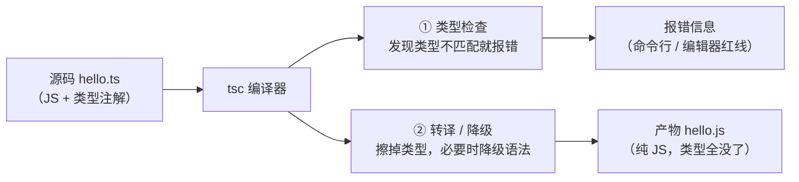
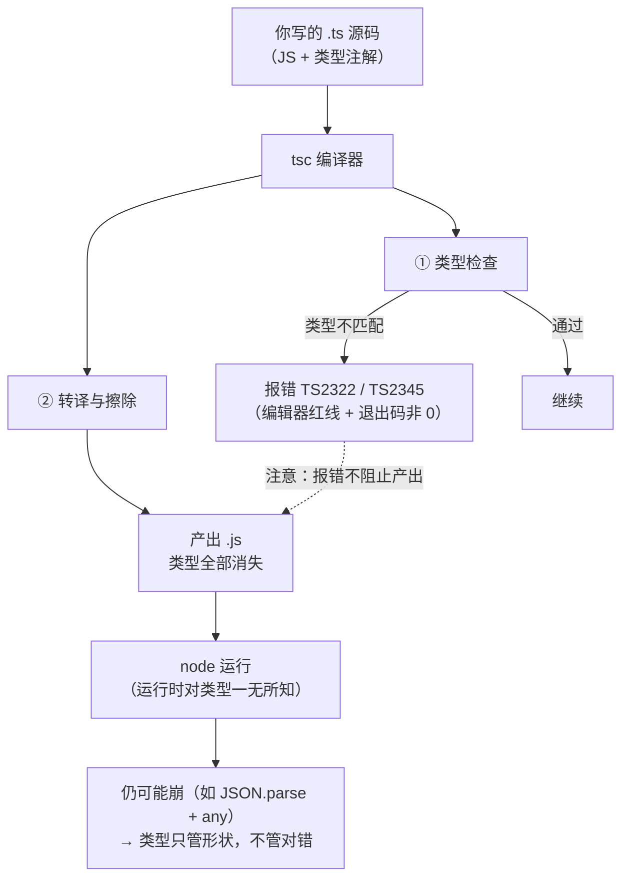

# 第 1 课：TypeScript 到底是什么

> 所属阶段：阶段 1《类型思维启蒙》｜ 水平：零基础 TS
> 本课知识点：TS 的本质：擦除式类型超集、静态类型的价值与代价、第一个 TS 程序与编译流程
> 故事情节：主角接手的 JS 项目上线三小时后崩了——**那些本该写在代码里的信息，全被丢在了人的脑子里**
> ✅ 状态：已完成（2026-08-31）｜ 实操环境：Node.js v22.14.0 + TypeScript 7.0.2（**文中所有输出均为本机实测**）

## 🎯 本课目标

- 说清 TypeScript 与 JavaScript 的关系，并解释**类型在编译后去了哪里**
- 从"错误发现时机"的角度论证静态类型的价值，同时说出它的代价与不适用场景
- 独立走通「安装 TS → 写 `.ts` → `tsc` 编译 → `node` 跑产物」全流程，并区分类型错误与运行时错误

## 📌 知识点导航

| # | 知识点 | 关键点 | 状态 |
|---|--------|--------|------|
| 1 | TS 的本质：擦除式类型超集 | 类型擦除 / 与 JS 的超集关系 / 只在编译期存在 / 不改变运行时行为 | ✅ |
| 2 | 静态类型的价值与代价 | 错误发现左移 / 类型即文档与编辑器能力 / 认知与构建成本 / 什么时候不值 | ✅ |
| 3 | 第一个 TS 程序与编译流程 | `npm i -D typescript` / `tsc` 编译与产物 / 类型错误 vs 运行时错误 / 最小 tsconfig（TS7 版） / 用 Node 跑产物 | ✅ |

## 📦 前置依赖（JS 概念）

| 用到的 JS 概念 | 掌握要求 | 回补 |
|---------------|---------|------|
| 变量声明与函数定义 | 会用即可 | 已掌握（JS 课 1） |
| 隐式类型转换 | 本课第一幕要用到（`"100" * 0.8`） | [JS 课 2 值的复制与比较](../javascript-core/02-课程目录.md)（未学不影响：本课会当场解释） |

---

## 第一幕：起源与场景引入

> 🏛️ **起源**：2012 年 10 月 1 日，微软发布了 **TypeScript 0.8**——在此之前它已在微软内部研发了两年。设计者是 **Anders Hejlsberg**（C# 的首席架构师，也是 Delphi 和 Turbo Pascal 的创造者）与 **Luke Hoban**。诞生动机很直白：JavaScript 在**开发大型应用**时力不从心（微软内部和外部客户都撞上了这堵墙），而团队要的解法有个硬约束——**不能破坏与 ECMAScript 标准和生态的兼容**。于是他们做了个编译器：把"带类型注解和类的 JS 超集"翻译回普通 JS。随后版本一路演进：0.9（2013）加入泛型、1.0（2014）正式定版、2.0（2016）带来空安全、5.0（2023）支持装饰器，**7.0（2026-07-08）用 Go 重写了编译器，官方称全量构建提速 8–12 倍**。（核查于 2026-08，来源：Wikipedia TypeScript 词条，其中引用微软官方博客与 Somasegar 2012-10-01 的文章）

**记住这段历史里的一个关键点就够了**：TypeScript 从第一天起就不是"取代 JS"，而是"**在不破坏 JS 的前提下，给它补上大规模协作需要的信息**"。这个定位决定了它后面所有的设计取舍——包括"类型编译后必须消失"。

好，回到你的项目。

> 🎬 **场景**：你接手了一个跑了一年的 JS 项目。某个函数长这样：

```js
// 老项目里的这个函数，没人知道参数到底要什么
function calcDiscount(price, rate) {
  return price * rate;
}
```

你要改它，于是你问："`price` 和 `rate` 到底该传什么？数字？字符串？百分比还是小数？"

没人答得上来。你只能去翻调用它的 17 个地方，靠猜。这一跑，结果很有意思：

```js
console.log(calcDiscount(100, 0.8));   // 80   ✅ 正常
console.log(calcDiscount("100", 0.8)); // 80   ⚠️ 传字符串居然也算对了
console.log(calcDiscount(100, "八折")); // NaN  💥 灾难的开始

const total = calcDiscount(100, "八折");
console.log(`应付：${total} 元`);        // 应付：NaN 元
```

> 上面这段是**本机实测输出**（Node.js v22.14.0）。

前三行里，**两行是巧合，一行是灾难**：

- 第 2 行传了字符串 `"100"`，JS 的隐式转换把它变成了数字，结果碰巧对了
- 第 3 行传了 `"八折"`，转换失败得到 `NaN`，而 **JS 一声不吭**——`NaN` 沿着数据流一路传到页面上，变成了用户看到的"应付：NaN 元"

**JS 没有背叛你，它只是在你写错的那一刻保持了沉默。** 因为对它来说，`price` 是什么类型，只有跑到那一行才知道，而那时它已经决定默默给你一个 `NaN` 了。

---

## 第二幕：认知冲突

> ❓ **问题**：那给变量加个 `: number`，就能让程序不崩了吗？

先别急着回答。我们马上会做三个实验，而它们的结论会让你意外：

```ts
// 实验 A：加了类型，编译后它们还在吗？
const price: number = 100;

// 实验 B：编译器报错了，代码还能跑吗？
const n: number = "我不是数字";

// 实验 C：类型检查通过了，程序就安全了吗？
const user: User = JSON.parse('{"name":"Alice"}');
console.log(user.age.toFixed(2));
```

这三个实验指向三个更深的问题：

1. **类型到底存在在哪儿？** 如果编译后类型就消失了，那它凭什么保护我的程序？
2. **编译器报错了，为什么代码还是能跑？** 报错和"不能运行"是一回事吗？
3. **如果类型检查通过的代码照样会崩，那 TypeScript 究竟值不值得学？**

这三个问题，恰好对应本课的三个知识点。

---

## 第三幕：层层揭示

### 知识点 1：TS 的本质：擦除式类型超集

> 关键点：类型擦除 / 与 JS 的超集关系 / 只在编译期存在 / 不改变运行时行为

#### 一句话定义

TypeScript 是 JavaScript 的**类型超集**：它在 JS 之上加了一套**只在编译期存在**的类型系统，`tsc` 编译后类型被完全擦除，产出的是纯 JavaScript。

#### 直觉建立（类比）

想象小学课本上的**注音**。

你在学认字的时候，字上面印着拼音，帮你读准字音。但当你把课文朗读出来、或者书被印刷成没有注音的版本时——**拼音就不在了**。它从来不是课文的一部分，它只是**帮助你正确读出课文的工具**。

TypeScript 的类型就是这套注音：

- 它给你和编译器看，帮你"读准"这段代码
- 一旦代码被"读出来"（编译成 JS 并运行），类型标注就消失了
- 真正跑在浏览器 / Node 里的，是**没有类型的普通 JS**

> 💡 **类比的边界**：注音完全不影响你读出什么内容，但类型**会影响你能写出什么代码**——写错了编译器会拦你，注音可不会拦着你读错。而且类型不只是"标注"，它还能被计算、被推导、被组合（那是阶段 3 泛型的事）。所以类比只在"编译后消失"这一点上成立。

#### 核心原理

**① 超集关系**：任何合法的 JavaScript 都是合法的 TypeScript。把一个 `.js` 文件改名成 `.ts`，它能直接编译通过——你不需要重写代码，只需要**逐步**加类型。这条保证了迁移成本可控（课 15 会讲怎么迁）。

**② `tsc` 干两件事**：



这两件事**互相独立**——这解释了第二幕那个反直觉现象：检查可以失败，转译照常进行（知识点 3 会用实测证明）。

**③ 类型擦除**：`: string`、`: number`、`interface`、`readonly`、`private`、`as`……这些**只存在于编译期**的东西，在产物里一个都不剩。

#### 示例演示

我们把它跑一遍。源文件 `hello.ts`：

```ts
// 课 1 示例：类型擦除的证据
function greet(name: string): string {
  return `你好，${name}！`;
}

const message: string = greet("TypeScript");
console.log(message);

interface User {
  id: number;
  name: string;
  isAdmin: boolean;
}

const u: User = { id: 1, name: "Alice", isAdmin: true };
console.log(u);
```

执行 `npx tsc hello.ts`，得到的 `hello.js`（**本机实测产物**）：

```js
"use strict";
function greet(name) {
    return `你好，${name}！`;
}
const message = greet("TypeScript");
console.log(message);
const u = { id: 1, name: "Alice", isAdmin: true };
console.log(u);
```

把两列并排看，消失了什么：

| 源码里有 | 产物里 |
|---------|--------|
| `name: string`、`: string` 返回值 | `name`（光秃秃的参数） |
| `const message: string` | `const message` |
| `interface User { ... }` **整个定义** | **完全没有** |
| `const u: User` | `const u` |

**`interface User` 连一个字符都没留下。** 这就是"擦除式"（erasable）的含义——不是压缩、不是隐藏，是彻底删除。

顺带一个观察：产物里 `class Order` **没有被降级**成 `function`。因为 TS 7 的默认 `target` 已经很高（`target: es5` 在 TS 7 中已不被支持），这类降级不再是默认行为。

#### 常见误区

1. **"TS 会在运行时检查类型。"** —— 不会。运行时跑的是擦除后的 JS，它对类型一无所知。运行时要校验数据，得靠代码（阶段 2 课 6 讲信任边界）。
2. **"TS 是一门新语言，有自己的运行时。"** —— 不是。TS 编译成 JS，跑在同样的 JS 引擎里。这也是为什么 TS 能无缝使用整个 npm 生态。
3. **"加了类型，程序性能会更好。"** —— 类型不会进运行时，对运行时性能**零影响**。反过来，某些降级转译（比如把 `class` 降级成 `function`）反而可能让代码略慢。

#### 一句话记住

> **TS 是"给编译器看的 JS"——编译完，它就变回普通 JS 了。**

> ✅ **困惑 1 已解**：类型到底存在在哪儿？→ **只存在在编译期**。编译产物里连整个 `interface` 都一个字符不剩，运行时对它一无所知。

#### 官方文档

- TypeScript 官网首页：https://www.typescriptlang.org/
- Handbook「TypeScript 是什么」：https://www.typescriptlang.org/docs/handbook/2/basic-types.html

---

### 知识点 2：静态类型的价值与代价

> 关键点：错误发现左移 / 类型即文档与编辑器能力 / 认知与构建成本 / 什么时候不值

#### 一句话定义

**静态类型** = 在代码**运行之前**（编译期）就确定并检查每个值的类型；**动态类型**（如 JS）= 类型跟着值走，只有**运行时**才知道。

#### 直觉建立（类比）

**机场安检 vs 空中救火。**

- 动态类型像**起飞后才检查**：你带着打火机上飞机，飞到一半才发现，这时候处理成本是"返航 / 迫降 / 事故"
- 静态类型像**登机前安检**：同样的打火机，在安检口就被拦下，处理成本是"扔掉，三秒钟"

核心差异不是"能不能发现问题"，而是**发现问题的时机**——而时机直接决定了成本。

> 💡 **类比的边界**：安检拦得住打火机（类型不匹配），但拦不住"你走错登机口"（业务逻辑错误），也拦不住"别人托你带的行李里有问题"（外部数据不符合预期）。**类型系统只管形状，不管对错**——这句话会在课 6 再次出现。

#### 核心原理

**① 价值一：错误发现左移**

同一个 bug，在不同阶段被发现，成本是指数级差距：

| 发现时机 | 典型成本 |
|---------|---------|
| 写代码时（编辑器红线） | 3 秒 |
| 编译时（`tsc`） | 10 秒 |
| 测试环境 | 几小时 |
| 生产环境 | 几小时 + 一次事故复盘 + 用户信任损失 |

第一幕那个 `calcDiscount(100, "八折")`，在 JS 里要等到用户投诉才发现；在 TS 里，你敲完括号它就变红了。

**② 价值二：类型即文档**

回看第一幕的困境——"没人知道参数要什么"。类型标注把这份信息**从人的脑子里搬进了代码里**，而且它不会过时（过时了就编译不过）。新同事接手时，看函数签名就够了，不用翻 17 个调用点。

**③ 价值三：编辑器能力**

类型信息让编辑器能做：自动补全、跳转到定义、安全重命名、查找所有引用。这些能力的上限**直接取决于类型信息的质量**——这也是为什么 TS 7 要花一年时间重写编译器：语言服务的响应速度，就是开发者每天的体验（官方数据：VS Code 打开一个含错误的文件，从 17.5 秒降到 1.3 秒内）。

**④ 代价一：认知成本**

你要学一套类型语法，还要学会"跟编译器讲道理"（阶段 2 收窄、阶段 3 泛型）。对零基础来说，前两周一定会觉得"我在跟编译器打架"。

**⑤ 代价二：构建成本**

多一步编译，多一份配置（tsconfig）。项目越大，类型检查越慢（课 14 会讲为什么慢、怎么提速）。

**⑥ 代价三：假安全感（最危险的一个）**

类型标注是**你告诉编译器的承诺**，编译器不会去验证这个承诺是否真实。写错了比不写更危险：

```ts
// ❌ 类型写对了，数据和类型不符——编译器信了你，于是它闭嘴了
const user: User = JSON.parse('{"name":"Alice"}');
```

**⑦ 什么时候不值得上 TS**

| 场景 | 为什么不值 |
|------|-----------|
| 一次性脚本、临时数据处理 | 写完就扔，类型成本 > 收益 |
| 需求未定的原型验证 | 类型会锁死还在变化的结构 |
| 没有类型定义的混乱依赖 | 你大部分时间在写 `any`，白付成本 |
| 团队完全没有类型经验且无学习时间 | 会写出一堆 `any`，等于花钱买了假安全感 |

#### 示例演示

现在回答第二幕的实验 C——**类型检查通过，程序照样崩**：

```ts
// 课 1 示例：类型检查通过，但运行时依然崩溃
interface User {
  name: string;
  age: number;
}

// JSON.parse 返回 any —— 它可以被赋给任何类型，编译器完全不拦
const user: User = JSON.parse('{"name":"Alice"}'); // age 字段其实不存在！

console.log("用户名：", user.name);
console.log("年龄（保留两位）：", user.age.toFixed(2)); // 💥 运行时炸在这里
```

**实测结果**（Node.js v22.14.0 + TypeScript 7.0.2）：

```
$ npx tsc trap.ts          # ← 一个字都没报，exit=0
$ node trap.js
用户名： Alice
TypeError: Cannot read properties of undefined (reading 'toFixed')
```

**类型检查 100% 通过，运行到第二行就炸了。**

为什么？因为 `JSON.parse` 的返回值是 `any`（这个坑课 6 会专门讲），而 `any` 可以被赋给任何类型——**你向编译器承诺"这个字符串解析出来一定是 User"，编译器信了，于是它闭嘴了**。运行时 `user.age` 是 `undefined`，`undefined.toFixed()` 直接抛错。

这正是"假安全感"的活标本。

#### 常见误区

1. **"上了 TS 就没有 bug 了。"** —— TS 拦的是"类型/形状不匹配"这一类错误。逻辑错误、外部数据不符、并发问题，它一个都拦不住。
2. **"类型写得越多越安全。"** —— 错的类型标注比没有更危险。宁可少写，不要写错。

#### 一句话记住

> **TS 把"运行到那一行才发现"的错误，提前到了"保存文件的那一刻"——但它只管形状，不管对错。**

> ✅ **困惑 3 已解**：类型检查通过的代码照样会崩，那 TS 还值不值得学？→ **值**。它把一大类错误从"用户投诉"提前到"敲完括号"。但记住边界：**它只管形状，不管对错**。

#### 官方文档

- TS 7.0 发布公告（含性能数据与生态现状）：https://devblogs.microsoft.com/typescript/announcing-typescript-7-0/

---

### 知识点 3：第一个 TS 程序与编译流程

> 关键点：`npm i -D typescript` / `tsc` 编译与产物 / 类型错误 vs 运行时错误 / 最小 tsconfig（TS7 版） / 用 Node 跑产物

#### 一句话定义

TS 项目的标准工作流是四步：**装 `typescript`** → 写 `.ts` → **`tsc` 编译（或 `--noEmit` 只检查）** → **运行产出的 `.js`**。

#### 核心原理

**① 安装**

```bash
npm init -y
npm i -D typescript       # 装到 TypeScript 7.0.2（核查于 2026-08）
npx tsc --version         # Version 7.0.2
```

装完你得到的是 `tsc` 命令。**从 TS 7 起，`tsc` 是一个用 Go 写的原生二进制**（不再是 JS），这也是它快 8–12 倍的原因。

**② TypeScript 7 的新默认（重要）**

⚠️ **这一节是全网教程最容易过时、也最容易坑到你的地方。** TS 7 改了一批默认值，还把一批旧选项变成了硬错误。先看 `npx tsc --init` 在 **TypeScript 7.0.2 上实测生成**的配置（精简了注释）：

```jsonc
{
  "compilerOptions": {
    // File Layout
    // "rootDir": "./src",
    // "outDir": "./dist",

    // Environment Settings
    "module": "nodenext",
    "target": "esnext",
    "types": [],                        // ← TS7 新默认：不再自动引入所有 @types

    // Other Outputs
    "sourceMap": true,
    "declaration": true,
    "declarationMap": true,

    // Stricter Typechecking Options
    "noUncheckedIndexedAccess": true,
    "exactOptionalPropertyTypes": true,

    // Recommended Options
    "strict": true,                     // ← TS7 新默认：严格模式默认开
    "jsx": "react-jsx",
    "verbatimModuleSyntax": true,
    "isolatedModules": true,
    "noUncheckedSideEffectImports": true,
    "moduleDetection": "force",
    "skipLibCheck": true,
  }
}
```

> 上面是 **TS 7.0.2 本机实测生成**（2026-08）。若你学的时候版本已更新，先自己跑一遍 `npx tsc --init` 对照。

TS 7 里最需要注意的三条（完整清单见课 10）：

| 变化 | 后果 | 怎么办 |
|------|------|--------|
| `strict` 默认 `true` | 以前"能编过"的宽松代码现在会报错 | 这是好事；老项目可渐进开启（课 10） |
| `types` 默认 `[]` | `@types/*` 不再自动全部生效 | 需要哪个显式写：`"types": ["node"]` |
| `rootDir` 默认 `./` | 源码不在 `src/` 时，产物目录结构会变 | 显式设置 `"rootDir": "./src"` |

至于变成**硬错误**（直接报错不让用）的旧项：`target: es5`、`downlevelIteration`、`moduleResolution: node`、`baseUrl`、`esModuleInterop: false` 等。**照着 5.x 老教程抄配置，会当场撞墙。**

**③ 类型错误 ≠ 编译失败**

这是本课最反直觉、也最实用的一条。看第二幕的实验 B：

```ts
// err.ts
const n: number = "我不是数字";
console.log(n);
```

**实测结果**：

```
PS> npx tsc err.ts
err.ts(2,7): error TS2322: Type 'string' is not assignable to type 'number'.
PS> $LASTEXITCODE
2                                                # ← 报错了，退出码非 0

PS> node err.js                                  # ← 但产物照样生成、照样能跑
我不是数字
```

**`tsc` 报错，但 `err.js` 照样被产出，而且跑得通。**

为什么？回到知识点 1 那张图：**类型检查和转译是两条独立的流水线**。检查失败不会阻止转译——这是 TS 的刻意设计（渐进迁移时，老代码一堆错误也得能跑）。

> 🔧 **工程后果**：这意味着"编译报错"这件事**必须靠退出码或 `noEmitOnError` 来卡住**。CI 里如果只看"有没有产出文件"，一堆类型错误会悄悄溜进生产。课 12 会讲怎么把它接进 CI。

**④ 三条运行路线**（点到为止，课 12 展开）

| 路线 | 命令 | 说明 |
|------|------|------|
| 编译后跑（本课用） | `tsc` → `node dist/x.js` | 最标准，产物是纯 JS |
| 只检查不产出 | `tsc --noEmit` | CI 里最常用 |
| 直接跑 `.ts` | `tsx` / `node --experimental-strip-types` | 开发时方便，课 12 讲清楚各自的坑 |

> 🎯 **本课走第一条**（编译后跑）——因为只有它让你**亲眼看到"类型被擦除"**，这是理解 TS 最快的方式。另外两条在课 12 讲清楚各自的适用场景与坑。

#### 示例演示

完整走一遍（**本机实测**）：

```bash
# 1) 初始化并安装
mkdir playground && cd playground
npm init -y
npm i -D typescript          # added 2 packages

# 2) 确认版本
npx tsc --version            # Version 7.0.2

# 3) 写代码（hello.ts，见知识点 1）

# 4) 编译
npx tsc hello.ts             # 无输出 = 成功，exit=0

# 5) 跑产物
node hello.js
```

**实测输出**：

```
你好，TypeScript！
{ id: 1, name: 'Alice', isAdmin: true }
Order { id: 42 }
```

四步走通，你已经是 TypeScript 用户了。

#### 常见误区

1. **"`tsc` 报错了，肯定没产出文件。"** —— 错，默认照样产出（见上面实测）。要么看退出码，要么开 `noEmitOnError`。
2. **"装了 typescript 就能 `node xxx.ts` 了。"** —— 不能。`node` 不认识 `.ts` 文件，必须先编译（或用 `tsx` 这类工具）。Node 22.6+ 有实验性的类型剥离能力，但那又是另一个话题（课 12）。
3. **"网上找份 tsconfig 抄一下就行。"** —— 在 TS 7 时代这是高风险动作。请从 `npx tsc --init` 开始，并从课 10 理解每个选项。

#### 一句话记住

> **`tsc` 有两张嘴——一张说"这里类型不对"，另一张默默吐出 JS。别把"它报错了"当成"它没产出"。**

> ✅ **困惑 2 已解**：编译器报错了，为什么代码还是能跑？→ 因为**类型检查与转译是两条独立的流水线**，检查失败并不阻止转译。

#### 官方文档

- tsconfig 配置总参考：https://www.typescriptlang.org/tsconfig
- `tsc` CLI 参考：https://www.typescriptlang.org/docs/handbook/compiler-options.html

---

## 第四幕：实操验证

回到第一幕那个 `calcDiscount`。我们**什么都不改逻辑**，只加类型：

```ts
// 第四幕：给同样的函数加上类型，编译器当场拦住
function calcDiscount(price: number, rate: number): number {
  return price * rate;
}

console.log(calcDiscount(100, 0.8));    // ✅ 正常
console.log(calcDiscount("100", 0.8));  // ❌ 编译时报错
console.log(calcDiscount(100, "八折"));  // ❌ 编译时报错
```

执行 `npx tsc --noEmit scenario.ts`，**实测输出**：

```
scenario.ts(7,26): error TS2345: Argument of type 'string' is not assignable to parameter of type 'number'.
scenario.ts(8,31): error TS2345: Argument of type 'string' is not assignable to parameter of type 'number'.
```

对比一下同一段逻辑在两种语言下的命运：

| 调用 | JS（运行时） | TS（编译时） |
|------|-------------|-------------|
| `calcDiscount(100, 0.8)` | `80` ✅ | 通过 ✅ |
| `calcDiscount("100", 0.8)` | `80` ⚠️ **碰巧对了，隐患埋下** | **报错** ❌ 逼你修正 |
| `calcDiscount(100, "八折")` | `NaN` 💥 **静默污染，一路传到页面** | **报错** ❌ 当场拦下 |

> ✅ **回扣场景**：第一幕里那个"没人知道参数要什么、上线三小时后才炸"的函数，现在只要你**敲完括号**，编辑器就会变红。错误从"用户投诉"提前到了"保存文件的那一刻"——这就是知识点 2 说的"错误发现左移"。

而那两行报错信息本身，就是在替你回答一年前没人答得上来的问题：**"`price` 和 `rate` 要什么？要 `number`，不是字符串。"**

---

## 第五幕：体系收束

> 📍 **全局定位**：本课是 5 阶段旅程的**地基**。后面 14 课全部建立在一条认知上——**类型是编译期的东西，运行时拿不到它**。
>
> 这条认知会在三个地方反复回来：
> - 阶段 2 课 6：既然运行时拿不到类型，那外部数据的类型只能靠**运行时校验**补上（信任边界）
> - 阶段 4 课 10：既然类型只在编译期，`tsc` 的配置就决定了它能查多严
> - 阶段 5 课 14：既然擦除发生在编译流程的某一步，那条流水线就值得你看清楚

**现在你会了什么**：

- 能说清 TS 是 JS 的擦除式类型超集，并能用 `hello.ts → hello.js` 的对比证明类型确实消失了
- 能从"错误发现时机"论证类型的价值，也知道它的三个代价（认知 / 构建 / 假安全感）
- 能独立走通 `npm i -D typescript` → 写 `.ts` → `tsc` → `node` 全流程，并且知道 **`tsc` 报错不代表没有产物**

> 🔗 **下一步**：课 2《基础类型标注与推导》。你已经知道"类型是什么"，接下来学"类型怎么写"——以及一个会让你舒服很多的事实：**大部分地方你什么都不用写，TS 已经知道了**。

---

## 🐞 常见误区

1. **"TS 会在运行时检查类型。"** → 编译后类型被完全擦除，运行时是纯 JS。运行时校验要靠代码（课 6）。
2. **"`tsc` 报错 = 编译失败、没有产物。"** → 默认照样产出 JS 且能运行。CI 里必须看退出码或开 `noEmitOnError`。
3. **"上了 TS 就没有 bug 了。"** → 它只拦"形状不匹配"；`JSON.parse` + `any` 的例子证明了类型检查通过照样能崩。
4. **"类型写得越多越安全。"** → 错误标注 = 假安全感，比不写更危险。
5. **"照网上的 tsconfig 抄一份就行。"** → TS 7 改了默认值并把一批选项变成硬错误，旧配置会直接报错。

## 一图总结



> 关键记忆点：① 类型擦除 → 运行时无类型；② 检查与转译独立 → 报错照样产出；③ 类型通过 ≠ 不会崩。

## 课后小测

**Q1**：`tsc` 编译 `const x: number = 1` 之后，产出的 JS 里 `x` 带类型信息吗？

- A. 带，运行时会检查 `x` 是不是 number
- B. 不带，类型在编译期被擦除了
- C. 带，但只在 `strict` 模式下检查
- D. 不带，但会生成一份单独的 `.d.ts` 供运行时使用

<details><summary>答案与解析</summary>

**答案：B**。这正是"擦除式"的含义——`hello.ts` 里连整个 `interface User` 定义都没在产物中留下一个字符。

干扰项辨析：C 混淆了"编译期严格度"与"运行时检查"；D 里的 `.d.ts` 是**类型声明文件**，给编译器和其他项目看的，运行时不读它（课 11 会讲）。

</details>

**Q2**：`npx tsc err.ts` 报了 `error TS2322`，下列说法正确的是？

- A. `err.js` 一定没有生成
- B. `err.js` 照样生成，且能正常运行
- C. 会生成 `err.js`，但里面是空文件
- D. 取决于 `strict` 是否开启

<details><summary>答案与解析</summary>

**答案：B**。本课实测：`tsc err.ts` 报错且退出码为 2，但 `err.js` 被正常产出，`node err.js` 打印出了内容。

原因是**类型检查与转译是两条独立流水线**。这也是为什么 CI 里必须看退出码或设 `noEmitOnError`——光看"有没有产物"会漏掉所有类型错误。

</details>

**Q3**：下面这段代码 `tsc` 能编译通过吗？运行时会怎样？

```ts
interface User { name: string; age: number }
const user: User = JSON.parse('{"name":"Alice"}');
console.log(user.age.toFixed(2));
```

- A. 编译报错（缺 age 字段）
- B. 编译通过，运行正常，输出 `undefined`
- C. 编译通过，运行时抛 `TypeError`
- D. 编译通过，运行时输出 `NaN`

<details><summary>答案与解析</summary>

**答案：C**。实测：编译零报错（exit=0），运行到 `user.age.toFixed(2)` 抛 `TypeError: Cannot read properties of undefined (reading 'toFixed')`。

因为 `JSON.parse` 返回 `any`，`any` 可以赋给任何类型——**你向编译器做了个承诺，编译器信了**。这个"假安全感"的正解在阶段 2 课 6（信任边界）。

</details>

## 🚀 下一批接力提示词

> 学完本课后，**复制下面这段文字发给 AI**，即可无缝进入下一批（无需重新描述上下文）：

```
继续学 TypeScript。我的学习档案在 frontend/typescript-core/00-学习档案.md，
刚学完阶段 1《类型思维启蒙》的课 1《TypeScript 到底是什么》三个知识点
（TS 的本质：擦除式类型超集 / 静态类型的价值与代价 / 第一个 TS 程序与编译流程），
请按大纲继续讲解下一课《基础类型标注与推导》。
```

## 🧭 课程导航

➡️ **下一课**：[课 2：基础类型标注与推导](lesson-02-基础类型标注与推导.md)

📚 **返回目录**：[课程目录](../../02-课程目录.md)
