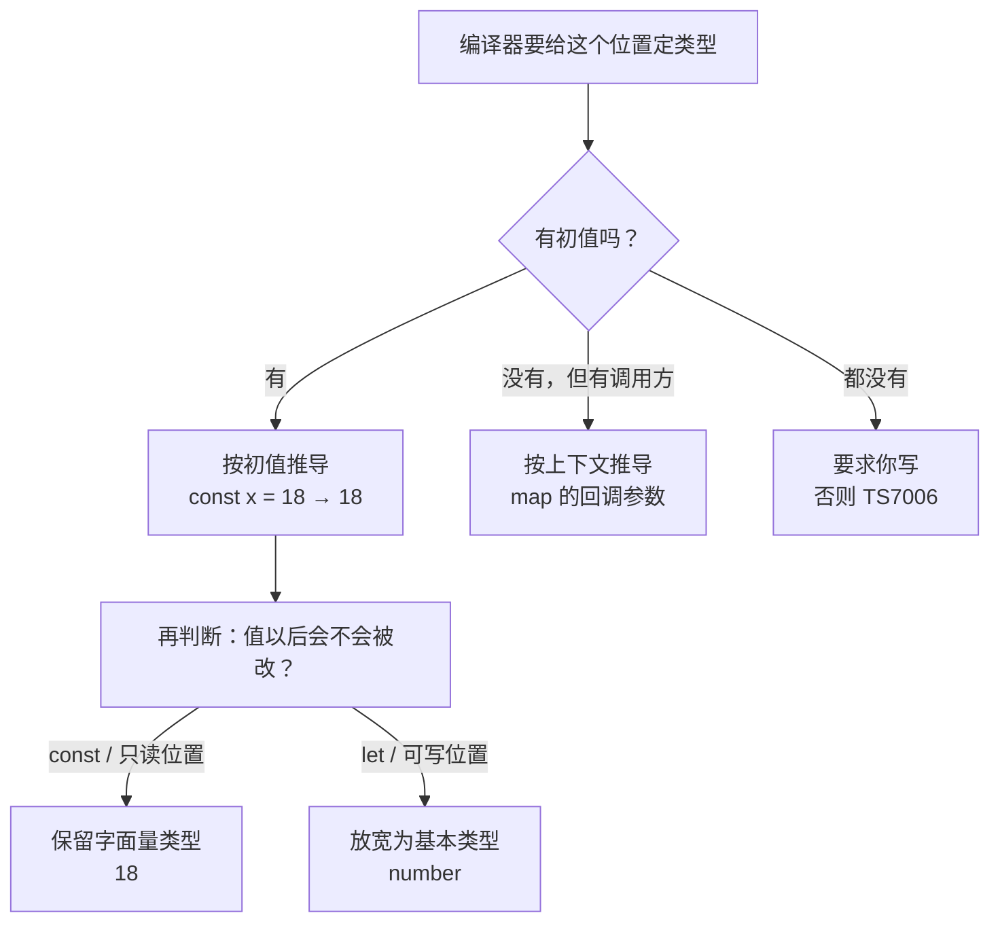
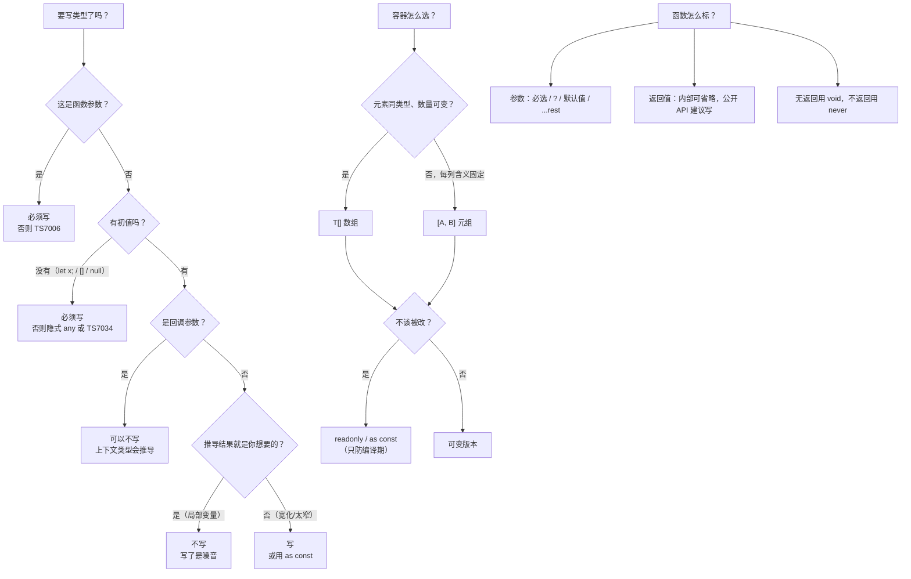

# 第 2 课：基础类型标注与推导

> 所属阶段：阶段 1《类型思维启蒙》｜ 水平：零基础 TS
> 本课知识点：原始类型标注与类型推导、数组、元组与只读、函数类型标注
> 故事情节：主角开始给老项目加类型，撞上两个极端建议——**"全都写"和"全都不用写"**
> ✅ 状态：已完成（2026-09-03）｜ 实操环境：Node.js v22.14.0 + TypeScript 7.0.2（**文中所有输出均为本机实测**）

## 🎯 本课目标

- 判断某处该写类型注解还是交给推导，并说出**四类必须显式标注**的场合
- 区分数组 / 元组 / 只读三者的适用场景，说清 `readonly` 与 `as const` 的**赋值方向**和**运行时真相**
- 为任意函数写出完整类型签名，区分 `void` 与 `never`、可选参数与 `| undefined`

## 📌 知识点导航

| # | 知识点 | 关键点 | 状态 |
|---|--------|--------|------|
| 1 | 原始类型标注与类型推导 | 七个原始类型 / 推导的三个信息来源 / 字面量宽化 / 四类必须标注 / 注解 vs 推导决策清单 | ✅ |
| 2 | 数组、元组与只读 | `T[]` 与 `Array<T>` / 元组四件套 / `readonly` 与 `as const` / 赋值方向 / 运行时不设防 | ✅ |
| 3 | 函数类型标注 | 参数与返回值 / 可选·默认·剩余 / `void`·`never` / 函数类型表达式 / 上下文类型 | ✅ |

## 📦 前置依赖（JS 概念）

| 用到的 JS 概念 | 掌握要求 | 回补 |
|---------------|---------|------|
| 箭头函数 | 会用即可 | 已掌握（ES6 基础） |
| 数组解构（`const [a, b] = arr`） | 本课第四幕用到 | 已掌握（ES6 基础） |
| `Array.prototype.map` | 会用即可 | 已掌握（ES6 基础） |
| `Array.prototype.reduce` | 本课用到一次 | 一句话说明：把一串值"归约"成一个值，本课 `reduce((acc, n) => acc + n, 0)` 就是求和 |

---

## 第一幕：起源与场景引入

> 🏛️ **起源**：上一课讲了 TypeScript 这门语言的来历，这一课讲**类型推导**的来历——因为它不是 TS 的发明。
>
> 1969 年，逻辑学家 **Roger Hindley** 提出了一套"不用写类型也能算出类型"的算法；1978 年，**Robin Milner** 在 ML 语言中独立重新发现了它（1982 年由 Luis Damas 补全证明），这就是著名的 **Hindley–Milner 类型推导算法**。ML、OCaml、Haskell 这一支语言靠它做到了"几乎不用手写任何类型"。
>
> 但 TypeScript **刻意没走这条路**。它用的是**局部类型推导（local type inference）**——和 Scala、Rust、C# 同类，而不是 Haskell 那种全局推导。原因很实际：JS 的写法太灵活，全局推导要么推不出来、要么推出来的类型离你的意图差很远，而且**报错位置会跑到离出错代码十万八千里外**。TS 要的是"报错就近、类型可渐进添加"。
>
> 顺带一提 `name: string` 这个**类型写在后面**的语法：它来自 Pascal / ML 那一支（`x: integer`），不是 C / Java 的前缀写法（`int x`）。因为 JS 是"先有值、后有类型"的语言，在已有标识符后面追加类型，对语法的改动最小。

**记住这段历史里的一个关键点就够了**：TS 的推导是**局部的、保守的**——它只在你"给了足够信息"的地方替你写类型，其余地方它会**明确地要求你写**，而不是替你猜。

好，回到你的项目。

> 🎬 **场景**：你给课 1 那个 `calcDiscount` 加了类型，尝到甜头。于是接了新活：**从 CSV 导入用户积分，算总账，导出报表**。

开工前，两个同事给了你完全相反的建议：

- 老张："每个变量都给我写上类型，越全越好！"
- 小李："TS 会自己推导，你写类型纯属浪费时间！"

你先照老张的写：

```ts
const total: number = calcTotal(scores);
const message: string = `总计 ${total}`;
const count: number = scores.length;
```

写了 500 行之后你发现：`const total: number = calcTotal(scores)` 这种标注**一个比特的新信息都没提供**——右边那个函数的返回类型本来就是 `number`。这是纯粹的视觉噪音。

你又照小李的写：

```ts
function calcTotal(list) {
  return list.reduce((a, b) => a + b, 0);
}
// ❌ error TS7006: Parameter 'list' implicitly has an 'any' type.
```

编译器直接罢工了。小李的建议也不对。

你挠挠头，决定先用最熟的 JS 把功能跑通再说（`playground/lesson-02/bug.js`）：

```js
// 本想放数字，顺手把初值写成了空串
let total = "";
const scores = [98, 76, 89];
for (const s of scores) {
  total += s;
}
console.log("total =", total);
console.log("total + 100 =", total + 100);

// 状态表：本该是常量，被同事顺手加了一项
const STATUS = ["pending", "paid", "refunded"];
STATUS.push("paid"); // 手滑，重复状态混进来了
console.log("STATUS =", STATUS);
```

**实测输出**（Node.js v22.14.0）：

```
total = 987689
total + 100 = 987689100
STATUS = [ 'pending', 'paid', 'refunded', 'paid' ]
```

两处全错，而 **JS 一声不吭**：

- `total` 应该是 `263`，但初值 `""` 让它变成了字符串，`+=` 于是变成**拼接**——`987689`。更糟的是它还能继续参与运算，`total + 100` 得到 `"987689100"`，一路污染到报表
- `STATUS` 用 `const` 声明，但 `const` 只锁**绑定**，不锁**内容**——`push` 照样进去了

**三个坑，根子是同一个：这段代码的"类型信息"，只存在于写代码那一瞬间你的脑子里。** 课 1 说过，TS 的价值就是把这些信息从人脑搬进代码。那问题来了——**搬到什么程度合适？**

---

## 第二幕：认知冲突

> ❓ **问题**：既然类型是好的，那我是不是该把每个变量都标上类型？

先别急着回答。做三个实验，它们的结论会出乎意料：

```ts
// 实验 A：我什么都不写，它真的知道吗？
let total = 0;
const nums = []; // 空数组，它推得出是"什么的数组"吗？

// 实验 B：我写了 readonly，为什么它"防君子不防小人"？
const STATUS: readonly string[] = ["pending", "paid"];
// 编译后 STATUS.push("x") 竟然成功了？

// 实验 C：函数的参数标了，返回值和回调不标行不行？
function double(a: number) {
  return a * 2;
}
lines.map((line) => line.split(",")); // 这个 line 没标类型，为什么没报错？
```

这三个实验指向三个更深的问题：

1. **我不写的时候，TS 到底"知道"多少？** 它凭什么知道，又在哪一步会放弃？
2. **数组、元组、只读，三个东西到底差在哪？`readonly` 究竟是防谁的？**
3. **函数的类型到底该标哪几处？为什么有的地方不标反而没事？**

这三个问题，恰好对应本课的三个知识点。

---

## 第三幕：层层揭示

> ⚠️ **本课的默认环境**（重要，影响你复现每一个输出）：
> 本课所有示例都在 `playground/lesson-02/` 目录下执行，**该目录没有 `tsconfig.json`**，直接 `npx tsc xxx.ts` 编译单个文件。
> 实测确认 TypeScript 7.0.2 的两条基线：
> - **`strict: true` 默认开启**（即使没有 tsconfig）——`function f(x) {}` 直接报 TS7006
> - **`noUncheckedIndexedAccess` 默认仍是 `false`**——`const n: number = arr[0]` 不报错
>
> 第二条要和课 1 那个 `tsc --init` 模板区分开：模板**推荐**你开这个选项，但默认值本身是关。课 10 会完整讲这组开关。

### 知识点 1：原始类型标注与类型推导

> 关键点：七个原始类型 / 推导的三个信息来源 / 字面量宽化 / 四类必须标注 / 注解 vs 推导决策清单

#### 一句话定义

**类型标注**是你手写告诉编译器"这个值是 T"；**类型推导**是编译器根据你给的信息**自己算出**它是 T。TS 的策略是：**能推就推，推不出来就明确报错要求你写**。

#### 直觉建立（类比）

想象**寄快递时的面单**。

包裹是什么，有两种方式确定：

- **手写面单（标注）**：你在单子上写明"里面是锂电池"
- **过安检机（推导）**：机器扫一眼包裹内容，自动识别出"这是衣服"

现实中大部分包裹过一下机器就够了，但有几类必须你手写：

- **空包裹**：里面什么都没有，机器扫不出内容（→ `const nums = []`）
- **未来会换内容**：现在装的是衣服，明天要换成书（→ `let user = null`，之后要放对象）
- **寄违禁品**：你不申报，机器按普通件收了，后面全错（→ 参数不标注，编译器直接拒绝）

> 💡 **类比的边界**：安检机扫的是**实物**（运行时），而 TS 的推导看的是**代码文本**（编译期静态分析），它从不执行你的代码。更关键的一点差异：安检机识别出来是什么就是什么；TS 推导时发现"这个值以后可能被改"，会**主动把类型放宽**（字面量宽化）——这个"体贴"的举动正是本知识点最容易踩坑的地方。

#### 核心原理

**① 七个原始类型**

TS 的类型标注写在标识符后面，用 `: T`：

| 类型 | 含义 | 示例 |
|------|------|------|
| `string` | 字符串 | `const a: string = "hi"` |
| `number` | 数字（不区分整数/浮点，也没有 `int`/`float`） | `const b: number = 18` |
| `boolean` | 布尔 | `const c: boolean = true` |
| `null` | 只有一个值 `null` | `const d: null = null` |
| `undefined` | 只有一个值 `undefined` | `const e: undefined = undefined` |
| `bigint` | 大整数（ES2020，字面量带 `n`） | `const f: bigint = 9007199254740993n` |
| `symbol` | 唯一符号（ES2015） | `const g: symbol = Symbol("id")` |

两个必须记住的细节：

- **`null` 和 `undefined` 是独立的类型**，在 `strict` 下它们**不属于**任何其他类型——`let n: number = null` 会报错。这一点后面讲可选参数时还会回来。
- 还有 `any` / `unknown` / `never` / `void` / `object` 这几个，它们不属于"原始类型"，分别在课 6、知识点 3 和课 3 出场。

**② 推导的三个信息来源**



**信息源一：初值。** `const x = 18` 的初值就是信息来源。

**信息源二：上下文。** 回调函数的位置，类型由调用方（如 `map`）"灌"进来——这叫**上下文类型（contextual typing）**，知识点 3 会详细讲。

**信息源三：都没有。** 那就只能报错要求你写（`TS7006`）。

**③ 字面量宽化（widening）——最容易踩的坑**

同样是 `= "Alice"`，`const` 和 `let` 推导出的类型**不一样**。这是实测证据（`infer-probe.ts`）：

```ts
const nameConst = "Alice";
const p1: "Bob" = nameConst; // 报错：Type '"Alice"' is not assignable to type '"Bob"'

let nameLet = "Alice";
const p2: "Bob" = nameLet; // 报错：Type 'string' is not assignable to type '"Bob"'
```

**同一个初值，报错信息一个是 `"Alice"`，一个是 `string`。** 规则是：

| 声明方式 | 推导结果 | 为什么 |
|---------|---------|--------|
| `const x = "Alice"` | `"Alice"`（字面量类型） | `const` 不能再赋值，值永远是这个，类型可以收紧到这一个值 |
| `let x = "Alice"` | `string` | `let` 以后可能被改成 `"Bob"`，所以放宽到 `string`，否则你改一下就报错 |

这个"因为可能被改所以放宽"的动作就叫**字面量宽化**。它还会发生在两个地方（同样是实测）：

```ts
const obj = { mode: "dev" };
const p3: { mode: "prod" } = obj;
// 报错：Type '{ mode: string; }' is not assignable to type '{ mode: "prod"; }'
//   Types of property 'mode' are incompatible.
//     Type 'string' is not assignable to type '"prod"'.
```

**对象的属性是可修改的**，所以 `mode` 推导为 `string` 而不是 `"dev"`。想锁住它，就要用知识点 2 的 `as const`。

```ts
function inferred() {
  return "on";
}
const p4: "off" = inferred();
// 报错：Type 'string' is not assignable to type '"off"'.
```

**函数返回值也会宽化**——`inferred()` 推导出的返回类型是 `string`，不是 `"on"`。这就是"导出函数建议显式标注返回类型"的第一条理由（知识点 3 会展开）。

**④ 四类必须（或强烈建议）标注的场合**

这是第一幕"两个极端建议"的正确答案——不是全写，也不是全不写，而是**这四类要写**：

| 场合 | 不写会怎样 | 实测证据 |
|------|-----------|---------|
| **函数参数**（无默认值、无上下文） | 直接报错 `TS7006` | `functions-probe.ts(3,14)` |
| **空数组 / 空对象初值** | 类型无法确定，报 `TS7034` / `TS7005` | 见下 |
| **初值类型比将来要用的窄**（如 `null`、`""` 起步） | 后续赋值被拦，或得到 `any` | `Type 'null' is not assignable...` |
| **需要比推导更宽或更窄的类型** | 推导结果不是你想要的 | 如想让返回值是 `"on" \| "off"` 联合 |

空数组这一条值得单独看，因为它的行为比"报错"更微妙（`infer-probe.ts` 实测）：

```ts
const nums = [];
const p: string = nums;
// error TS7034: Variable 'nums' implicitly has type 'any[]' in some locations where its type cannot be determined.
// error TS7005: Variable 'nums' implicitly has an 'any[]' type.
```

TS 有个"演进数组（evolving array）"机制：`const nums = []` 之后如果你 `nums.push(1)`，它会**根据 push 的内容反推**出 `number[]`；但如果从头到尾没 push 就拿来用，它无法确定类型，于是报 `TS7034`。两种情况下你都不该依赖它——**空数组老老实实写标注**：

```ts
const nums: number[] = []; // ✅
let user: { name: string } | null = null; // ✅ 第三种场合的正确写法
```

**⑤ 决策清单：这行到底写不写注解？**

这是本课的**决策参考**条目，可以直接当团队规范用：

| 场合 | 写不写 | 理由 |
|------|-------|------|
| 函数参数（无默认值） | **必须写** | 没有信息源，编译器会拒绝 |
| 函数返回值 · 导出 / 公开 API / 库 | **建议写** | ① 防止字面量宽化 ② 当文档用 ③ 报错定位更准 ④ 防止内部实现细节泄漏到对外类型 |
| 函数返回值 · 内部小函数 | 可不写 | 推导足够，写了是噪音 |
| 局部变量有初值 | **不写** | 推导就够了，写了是噪音（老张的坑） |
| 变量声明但无初值（`let x;`） | **写** | 否则是隐式 `any` |
| 空数组 `[]` / 空对象 `{}` | **写** | 否则 `any[]` 或报错 |
| 初值窄、后续要放宽 | **写** | `let user: User \| null = null` |
| 对象字面量想锁成字面量类型 | 用 `as const`（不是注解） | 见知识点 2 |
| 回调参数（有上下文） | 可不写 | 上下文类型会自动推导（知识点 3） |

#### 示例演示

`playground/lesson-02/annotations.ts`：

```ts
// ① 七个原始类型的显式标注
const userName: string = "Alice";
const age: number = 18;
const isVip: boolean = true;
const empty: null = null;
const notFound: undefined = undefined;
const huge: bigint = 9007199254740993n;
const key: symbol = Symbol("id");

// ② 不写标注，看它推导出什么
const nameConst = "Alice"; // 推导："Alice"（字面量类型）
let nameLet = "Alice"; // 推导：string（宽化）
const ageConst = 18; // 推导：18
let ageLet = 18; // 推导：number
const flag = true; // 推导：true

// ③ 该写不写的场合：推导太窄
const nums: number[] = []; // 不写会变成 any[] 或报错
nums.push(1);

let user: { name: string } | null = null; // 不写会一直是 null，之后赋对象就报错
user = { name: "Alice" };

console.log(userName, age, isVip, empty, notFound, huge, key);
console.log(nameConst, nameLet, ageConst, ageLet, flag, nums, user);
```

**实测结果**：`npx tsc annotations.ts` **零报错**，运行 `node annotations.js`：

```
Alice 18 true null undefined 9007199254740993n Symbol(id)
Alice Alice 18 18 true [ 1 ] { name: 'Alice' }
```

注意第二行：`const` 和 `let` 版本的**输出完全一样**——类型的差异只存在于编译期，运行时它们都是普通值。这又一次印证了课 1 的擦除。

#### 常见误区

1. **"类型标注越多越好。"** —— 恰恰相反。`const total: number = calcTotal(x)` 当 `calcTotal` 已声明返回 `number` 时，这个注解零信息量，还会在函数改签名时变成**过时注释**。**噪音不是安全。**
2. **"TS 能推导出一切，我都不用写。"** —— 参数推不出来（TS7006），空数组推不出来（TS7034），初值窄的时候推出来的是错的。**推导是"能推就推"，不是"猜着推"。**
3. **用 `String` / `Number` / `Boolean` / `Object` 当类型。** —— 这是**包装对象**类型，不是原始类型。实测：

   ```ts
   const boxed: String = "Alice"; // 能过（但不该这么写）
   const p: string = new String("Alice");
   // error TS2322: Type 'String' is not assignable to type 'string'.
   //   'string' is a primitive, but 'String' is a wrapper object. Prefer using 'string' when possible.
   ```

   **永远用小写**：`string` / `number` / `boolean` / `object`。
4. **"`const` 声明的数组就不能改了。"** —— 第一幕实测过：`STATUS.push("paid")` 成功了。`const` 只锁绑定，不锁内容，要锁内容请看知识点 2。

#### 一句话记住

> **推导负责"你给了信息的地方"，标注负责"你没给信息、或信息会误导人的地方"——噪音不是安全。**

#### 官方文档

- 基础类型：https://www.typescriptlang.org/docs/handbook/2/basic-types.html
- 类型推导：https://www.typescriptlang.org/docs/handbook/type-inference.html
- 字面量类型：https://www.typescriptlang.org/docs/handbook/2/everyday-types.html#literal-types

---

### 知识点 2：数组、元组与只读

> 关键点：`T[]` 与 `Array<T>` / 元组四件套 / `readonly` 与 `as const` / 赋值方向 / 运行时不设防

#### 一句话定义

**数组** `T[]`：同类型元素的**变长**序列；**元组** `[A, B]`：**定长**、每个位置类型各自独立的序列；**只读**（`readonly T[]` / `as const`）：在**编译期**禁止修改的类型标记，运行时会被完全擦除。

#### 直觉建立（类比）

把三者想象成办公室里的三种容器：

| 容器 | 对应类型 | 特征 |
|------|---------|------|
| **一排工位** | `T[]` 数组 | 规格统一（都是 `T`），数量可增可减 |
| **一张固定表格的一行** | `[A, B]` 元组 | 每一列有固定含义和固定类型，列数写死 |
| **玻璃展柜** | `readonly` | 看得见，但**贴了封条**不能动 |

第一幕那个 `STATUS` 就是典型：它本该是"固定表格"（装进玻璃展柜），结果被当成了"一排工位"（谁都能加一把椅子）。

> 💡 **类比的边界**（这一条很重要）：玻璃展柜的封条**只在编译期有效**。擦除之后，元组和普通数组在运行时**一模一样**，`readonly` 也一个字符都不剩。所以 `readonly` 防的是**你自己和同事的手滑**，防不住外部代码（比如 JS 调用方、`JSON.parse` 出来的数据）。另外——**元组有个设计上的破口**：`push` 在类型层面居然是允许的（下面实测），所以"定长"这个说法要在编译期语境下理解。

#### 核心原理

**① 数组：`T[]` 与 `Array<T>`**

```ts
const scores: number[] = [98, 76, 89];
const names: Array<string> = ["Alice", "Bob"]; // 与 string[] 完全等价，纯风格差异
```

两者**完全等价**，团队里统一选一种即可（社区更常用 `T[]`）。

数组元素类型不一致时，TS 会算出一个**最佳公共类型（best common type）**（实测）：

```ts
const mixed = [1, "a"];
const m0: number = mixed[0];
// error TS2322: Type 'string | number' is not assignable to type 'number'.
```

`mixed` 被推导为 `(string | number)[]`。`|` 是**联合类型**，课 4 会正式讲，这里先认识符号就行。

**② 元组四件套**

```ts
// 基础：定长、每格类型独立
const row: [string, number] = ["Alice", 98];

// 具名元素：给每格起个名字，纯粹为了让编辑器提示和报错更好读
type CsvRow = [id: string, score: number, remark?: string];

// 可选元素：最后一格可以没有
const r1: CsvRow = ["u1", 98];
const r2: CsvRow = ["u2", 76, "late"];

// 剩余元素：第一个是 string，后面跟任意个 number
type Header = [title: string, ...rest: number[]];
const header: Header = ["scores", 1, 2, 3];
```

注意：**具名元素只是标签，不影响类型兼容**，运行时更是连名字都不存在。

**③ 只读三兄弟与 `as const`**

| 写法 | 作用 |
|------|------|
| `readonly T[]` | 只读数组：没有 `push` / `pop` / `splice`，也不能通过下标赋值 |
| `ReadonlyArray<T>` | 同上，老式写法，功能一致 |
| `readonly [A, B]` | 只读元组 |
| `as const` | 作用在整个**字面量**上：把所有值锁成字面量类型 + 递归只读 |

`as const` 的威力（实测见下文 `arrays.ts`）：

```ts
const frozen = ["pending", "paid", "refunded"] as const;
// 类型：readonly ["pending", "paid", "refunded"]  ← 连每个值都被锁住了

const config = { mode: "dev", retries: 3 } as const;
// 类型：{ readonly mode: "dev"; readonly retries: 3 }  ← 属性值也是字面量类型
```

这正是知识点 1 里"对象属性会宽化"的解药。

**④ 赋值方向：可变 ↔ 只读（单向）**

这是一条必须记住的规则（实测）：

```
可变 T[]  ──可以──▶  只读 readonly T[]      ✅
只读 readonly T[] ──不行──▶  可变 T[]       ❌ TS4104
```

```ts
const mutable: number[] = [1, 2, 3];
const readonlyView: readonly number[] = mutable; // ✅ 收紧是安全的

const STATUS: readonly string[] = ["pending", "paid"];
const back: string[] = STATUS;
// error TS4104: The type 'readonly string[]' is 'readonly' and cannot be assigned to the mutable type 'string[]'.
```

**为什么？** 把可变交给只读，等于"我承诺不改"，安全；反过来，把一个"只读的东西"交给要求可变的变量，等于**允许别人去改一个承诺不被改的东西**，不安全。

> 🔧 **工程后果**：把函数参数写成 `readonly T[]` 而不是 `T[]`，是**对调用方的承诺**（"我不会改你的数组"），同时它还放宽了接受范围——`readonly T[]` 参数既能接可变数组也能接只读数组，而 `T[]` 参数接不了只读数组。第四幕会用到。

**⑤ 运行时真相：类型全没了**

`erase.ts`（导出三个值，编译后用 Node 从外部操作）：

```ts
export const STATUS: readonly string[] = ["pending", "paid", "refunded"];
export const ROW: readonly [id: string, score: number] = ["u1", 98];
export const CONFIG = { mode: "dev", retries: 3 } as const;
```

**实测**（编译后，用 Node 从外部操作产物）：

```
$ npx tsc erase.ts
$ node -e "const m=require('./erase.js'); m.STATUS.push('hacked'); console.log('after push:', m.STATUS); ..."

after push: [ 'pending', 'paid', 'refunded', 'hacked' ]
ROW: [ 'u1', 98 ] isArray: true
ROW after push: [ 'u1', 98, 999 ]
CONFIG: { mode: 'dev', retries: 3 }
```

**`readonly` 数组被 `push` 成功了，元组的长度被 `push` 突破了。** 运行时它就是个普通数组，`readonly` 和元组长度约束连一个字符都没留下。

#### 示例演示

`playground/lesson-02/arrays.ts`（**实测零报错**）：

```ts
const scores: number[] = [98, 76, 89];
const names: Array<string> = ["Alice", "Bob"];

// 元组：CSV 的一行，长度固定、每列类型各自独立
const row: [string, number] = ["Alice", 98];
const cell0: string = row[0]; // 第一格一定是 string
const cell1: number = row[1]; // 第二格一定是 number

type CsvRow = [id: string, score: number, remark?: string];
const r1: CsvRow = ["u1", 98];
const r2: CsvRow = ["u2", 76, "late"];

type Header = [title: string, ...rest: number[]];
const header: Header = ["scores", 1, 2, 3];

const STATUS: readonly string[] = ["pending", "paid", "refunded"];
const mutable: number[] = [1, 2, 3];
const readonlyView: readonly number[] = mutable; // ✅ 可变 → 只读

const frozen = ["pending", "paid", "refunded"] as const;
const config = { mode: "dev", retries: 3 } as const;

console.log(scores, names, row, cell0, cell1, r1, r2, header);
console.log(STATUS, mutable, readonlyView, frozen, config);
```

**实测输出**：

```
[ 98, 76, 89 ] [ 'Alice', 'Bob' ] [ 'Alice', 98 ] Alice 98 [ 'u1', 98 ] [ 'u2', 76, 'late' ] [ 'scores', 1, 2, 3 ]
[ 'pending', 'paid', 'refunded' ] [ 1, 2, 3 ] [ 1, 2, 3 ] [ 'pending', 'paid', 'refunded' ] { mode: 'dev', retries: 3 }
```

再看边界（`arrays-probe.ts`，**预期报错，实测输出**）：

```
arrays-probe.ts(5,19): error TS2493: Tuple type '[string, number]' of length '2' has no element at index '2'.
arrays-probe.ts(8,7): error TS4104: The type 'readonly string[]' is 'readonly' and cannot be assigned to the mutable type 'string[]'.
arrays-probe.ts(9,8): error TS2339: Property 'push' does not exist on type 'readonly string[]'.
arrays-probe.ts(12,8): error TS2540: Cannot assign to 'port' because it is a read-only property.
arrays-probe.ts(15,14): error TS2339: Property 'push' does not exist on type 'readonly [1, 2, 3]'.
arrays-probe.ts(18,7): error TS2322: Type 'string | number' is not assignable to type 'number'.
arrays-probe.ts(21,7): error TS2322: Type '[string, number]' is not assignable to type 'string[]'.
```

**注意第一行之前的第 4 行没有报错**——那行是 `row.push(3)`：

```ts
const row: [string, number] = ["Alice", 98];
row.push(3); // ✅ 编译通过！元组的长度约束被 push 绕过了
const cell2 = row[2]; // ❌ TS2493：类型系统仍然认为它只有 2 个元素
```

这是 TS 的一个**已知破口**：元组有 `push` 方法（因为它运行时就是数组），类型系统不去拦。想要真正的"不可变元组"，用 `readonly [string, number]`——那样 `push` 直接不存在（见上面第 5 条报错）。

#### 常见误区

1. **"元组是定长的，所以很安全。"** —— 编译期读它是定长的，但 `push` 能绕过。要 enforce 就用 `readonly [...]`。
2. **"`as const` 能冻结任何值。"** —— 只能作用于**字面量**，对变量无效（实测）：

   ```ts
   const arr = [1, 2, 3];
   const frozen = arr as const;
   // error TS1355: A 'const' assertion can only be applied to references to enum members,
   //   or string, number, boolean, array, or object literals.
   ```

   它是对"字面量"的断言，不是"冻结运行时对象"的咒语（真要冻结运行时对象用 `Object.freeze()`）。
3. **"`readonly` 数组赋值给 `T[]` 应该没问题吧。"** —— 反了。方向是**可变 → 只读**单向（TS4104）。
4. **"`readonly` 能防止数据被改。"** —— 只防编译期。运行时 `push` 照样成功（本知识点实测）。要防外部输入，得靠运行时校验（课 6 信任边界）。

#### 一句话记住

> **数组管"一堆同类的"，元组管"一行有固定列含义的"，`readonly` 管"别手滑改它"——三者都只在编译期存在。**

#### 官方文档

- 数组与元组：https://www.typescriptlang.org/docs/handbook/2/objects.html#tuple-types
- `readonly` 与 `as const`：https://www.typescriptlang.org/docs/handbook/2/everyday-types.html#readonly-array-type

---

### 知识点 3：函数类型标注

> 关键点：参数与返回值 / 可选·默认·剩余 / `void`·`never` / 函数类型表达式 / 上下文类型

#### 一句话定义

函数的类型标注写在**两处**：参数列表（`a: T`）和返回值（`: R`）。两者合起来叫**函数签名**——它是调用方和实现方之间的一份**合同**。

#### 直觉建立（类比）

**函数签名 = 一份合同。**

```
(a: string, b: number) => string
 ↑               ↑          ↑
甲方要提供的材料   材料2    乙方要交付的成果
```

合同的价值在于：双方**不需要看对方的实现**，只看合同就能协作。这就是课 1 说的"类型即文档"在函数上的体现——回看第一幕那句"函数参数要什么，只有看实现才知道"，有了签名，这个信息就在函数名旁边。

> 💡 **类比的边界**：这份合同**只约定成功路径**。它没写"什么时候交付"（异步要 `Promise<T>`，阶段 3 之后）、也没写"乙方可能罢工不干"（抛异常，TS **不检查**异常类型）。所以"签名完整"不等于"行为确定"。

#### 核心原理

**① 参数：必选 / 可选 / 默认 / 剩余**

```ts
function formatRow(id: string, score: number, suffix = "pts"): string {
  //       必选        必选         默认值（类型由初值推导为 string，调用时可省略）
  return `${id}: ${score}${suffix}`;
}

function join(parts: string[], sep?: string): string {
  //                            可选参数：类型是 string | undefined，调用时可省略
  return parts.join(sep ?? "-");
}

function first(...items: number[]): number {
  //          剩余参数：调用时可传任意个 number
  return items[0];
}
```

**可选参数 `?` 与 `| undefined` 不是一回事**（实测）：

```ts
function optional(x?: number) {
  return x;
}
function explicit(x: number | undefined) {
  return x;
}
optional(); // ✅
optional(undefined); // ✅
explicit(); // ❌ error TS2554: Expected 1 arguments, but got 0.
explicit(undefined); // ✅
```

`x?: number` 表示"这个参数可以不传"，`x: number | undefined` 表示"这个参数必须传，值可以是 undefined"。**想省参数用 `?`。**

在函数内部，可选参数的类型是 `number | undefined`，所以直接用 `x.toFixed()` 会报错——要先用 `if (x !== undefined)` 或 `x?.toFixed()` 收窄（**这正是阶段 2 课 5 的主题，先知道有这回事**）。

**② 返回值：推导还是标注？**

不写也能过——TS 会推导。但**导出 / 公开 API 建议写**，四条理由：

| 理由 | 说明 |
|------|------|
| 防止字面量宽化 | 实测：`function f() { return "on" }` 推导为 `string` 而非 `"on"`；想返回 `"on" \| "off"` 联合就必须写 |
| 当文档用 | 看签名就知道交付什么，不用读实现 |
| 报错定位更准 | 返回类型写死后，错误报在 return 语句处，而不是漂到调用方 |
| 防止实现细节泄漏 | 内部返回的类型改了，对外类型不变，不破坏调用方 |

内部小函数（一两行、不导出）可以不写，写了反而是噪音。

**③ `void` / `never` / `undefined`**

| 返回类型 | 含义 | 典型场景 |
|---------|------|---------|
| `void` | **不关心返回值**（调用方不该用返回值） | 纯副作用函数：`log()`、`report()` |
| `undefined` | 明确返回 `undefined` | 少用；函数体里得写 `return undefined` |
| `never` | **永远不会正常返回** | 只抛异常 / 死循环 / 进程退出 |

```ts
function log(message: string): void {
  console.log(message); // 允许写 return; 或 return undefined; 但调用方拿不到有意义的值
}

function fail(message: string): never {
  throw new Error(message); // 函数在这里就"结束了"
}
```

`never` 有个实用性质：**它可以赋给任何类型**（因为"不可能发生的值"放在哪都不破坏类型安全）。实测 `const fromNever: void = fail()` **零报错**。这个性质在阶段 2 的**穷尽性检查**里会大放异彩（课 5）。

**④ 函数类型表达式与类型别名**

签名可以抽出来复用：

```ts
type Formatter = (id: string, score: number) => string;
const formatter: Formatter = formatRow;
```

**⑤ 上下文类型：回调参数不写也能推导**

```ts
const lines = ["u1,98", "u2,76", "u3,89"];
const rows = lines.map(parseRow); // parseRow 的参数类型由 map 灌进来
const allScores = rows.map(([, score]) => score); // score 被推导为 number
```

`map` 的签名告诉 TS"回调会收到一个 `string`"，于是 `line` 不用标也知道是 `string`——这就是第二幕实验 C 里"没标类型却没报错"的原因。**有了上下文，不写反而更简洁。**

#### 示例演示

`playground/lesson-02/functions.ts`（**实测零报错**）：

```ts
// ① 参数与返回值都标注
function formatRow(id: string, score: number, suffix = "pts"): string {
  return `${id}: ${score}${suffix}`;
}

// ② 箭头函数 + 返回值标注
const sum = (list: number[]): number => list.reduce((acc, n) => acc + n, 0);

// ③ 返回元组：把 CSV 的一行解析成结构化数据
function parseRow(line: string): [id: string, score: number] {
  const [id, rawScore] = line.split(",");
  return [id, Number(rawScore)];
}

// ④ void：只做副作用
function log(message: string): void {
  console.log(message);
}

// ⑤ never：永远不会正常返回
function fail(message: string): never {
  throw new Error(message);
}

// ⑥ 可选参数与剩余参数
function join(parts: string[], sep?: string): string {
  return parts.join(sep ?? "-");
}
function first(...items: number[]): number {
  return items[0];
}

// ⑦ 函数类型：把签名抽出来复用
type Formatter = (id: string, score: number) => string;
const formatter: Formatter = formatRow; // 第三个参数有默认值，赋给 2 参类型也成立

// ⑧ 上下文类型：回调参数不写，TS 从调用方推出来
const lines = ["u1,98", "u2,76", "u3,89"];
const rows = lines.map(parseRow);
const allScores = rows.map(([, score]) => score); // score 被推导为 number
const total = sum(allScores);

console.log(formatRow("u1", 98));
console.log(formatRow("u2", 76, "分"));
console.log(formatter("u3", 89)); // 按 Formatter 签名调用：只能传 2 个
log(`total = ${total}`);
console.log(join(["a", "b"]), join(["a", "b"], "+"), first(1, 2, 3));
console.log(rows, allScores);
if (total < 0) fail("total should not be negative");
```

**实测输出**：

```
u1: 98pts
u2: 76分
u3: 89pts
total = 263
a-b a+b 1
[ [ 'u1', 98 ], [ 'u2', 76 ], [ 'u3', 89 ] ] [ 98, 76, 89 ]
```

再看边界（`functions-probe.ts`，**预期报错，实测输出**）：

```
functions-probe.ts(3,14): error TS7006: Parameter 'a' implicitly has an 'any' type.
functions-probe.ts(18,1): error TS2554: Expected 1 arguments, but got 0.
functions-probe.ts(24,7): error TS2322: Type 'string' is not assignable to type '"off"'.
functions-probe.ts(32,44): error TS2554: Expected 2-3 arguments, but got 4.
functions-probe.ts(41,15): error TS2554: Expected 2 arguments, but got 3.
```

第 41 行这条值得单独看：

```ts
type TwoArgs = (a: string, b: number) => string;
const three: TwoArgs = (a, b, c = "!") => `${a}${b}${c}`;
three("x", 1); // ✅
three("x", 1, "?"); // ❌ TS2554: Expected 2 arguments, but got 3.
```

**调用时能传几个参数，取决于变量声明的类型，而不是实际函数的定义。** 你把函数赋给一个更窄的类型，多出来的参数就被"藏起来"了——这是设计使然，也是很多"为什么我传不了这个参数"困惑的来源。

#### 常见误区

1. **"返回 `void` 的函数类型只能接受不返回值的函数。"** —— 恰恰相反（实测通过）：

   ```ts
   type VoidFn = () => void;
   const returnsNumber: VoidFn = () => 42; // ✅ 合法
   ```

   `void` 作为返回类型时，意思是"**调用方不该依赖返回值**"，而不是"不能返回值"。这就是为什么 `[1, 2].forEach(fn)` 里的回调返回什么都行。
2. **"参数不标，TS 会推导。"** —— 不会，直接 TS7006。这是知识点 1 决策清单里的"必须写"。
3. **"`never` 就是 `void` 的高级说法。"** —— 不是。`void` 是"没有有意义的返回值"，`never` 是"根本不会返回"（抛异常 / 死循环）。
4. **"回调参数不写类型会报错。"** —— 有上下文时不会，反而更简洁。没有上下文（比如自己定义一个回调类型变量）时才需要写。

#### 一句话记住

> **函数签名是一份合同：参数写"我要什么"，返回值写"我给什么"；回调的参数让上下文去推。**

#### 官方文档

- 函数类型：https://www.typescriptlang.org/docs/handbook/2/functions.html
- `never` 与穷尽性检查：https://www.typescriptlang.org/docs/handbook/2/narrowing.html#exhaustiveness-checking

---

## 第四幕：实操验证

回到第一幕那个"导入 CSV、算总账、导出报表"。这一次**按本课的规矩**写：只用必要的标注、状态表上只读、函数签名写全（`playground/lesson-02/scenario.ts`）：

```ts
// 原始数据：三行 CSV
const LINES: readonly string[] = ["u1,Alice,98", "u2,Bob,76", "u3,Cindy,89"];

// 一行数据 = 元组：长度固定，每格类型各自独立
type Row = [id: string, name: string, score: number];

// 函数签名就是合同：进来一行字符串，出去一个 Row
function parseRow(line: string): Row {
  const [id, name, rawScore] = line.split(",");
  return [id, name, Number(rawScore)];
}

// 参数写 readonly：向调用方承诺「我不会改你的数组」
function totalOf(rows: readonly Row[]): number {
  let total = 0; // ← 第一幕的 bug 就在这一行（JS 版写成了 let total = ""）
  for (const [, , score] of rows) {
    total += score;
  }
  return total;
}

const DISCOUNT = 0.8;
const STATUS: readonly string[] = ["pending", "paid", "refunded"];

const rows: Row[] = LINES.map(parseRow); // 回调参数由 map 推导，不用写
const total = totalOf(rows);

console.log(`rows = ${rows.length}`);
console.log(`total = ${total}`);
console.log(`after discount = ${(total * DISCOUNT).toFixed(2)}`);
console.log(`status = ${STATUS.join("/")}`);
```

**实测结果**：`npx tsc scenario.ts` **零报错**，运行 `node scenario.js`：

```
rows = 3
total = 263
after discount = 210.40
status = pending/paid/refunded
```

**`total = 263`** —— 第一幕那个 `987689` 的幽灵，消失了。

再看三重防护是不是真的生效（`scenario-guard.ts`，**实测报错**）：

```
scenario-guard.ts(5,1): error TS2322: Type 'string' is not assignable to type 'number'.
scenario-guard.ts(9,8): error TS2339: Property 'push' does not exist on type 'readonly string[]'.
scenario-guard.ts(12,19): error TS7006: Parameter 'line' implicitly has an 'any' type.
```

| 第一幕的事故 | JS 里的结局 | TS 里的结局 |
|-------------|------------|------------|
| `total = "263 pts"` 覆盖求和结果 | 静默变成字符串，一路污染 | **TS2322 当场拦下** |
| `STATUS.push("paid")` 手滑 | 成功，重复状态混进系统 | **TS2339 当场拦下**（`push` 不存在） |
| `function parseRow(line)` 不知要什么 | 运行时才发现 `line.split` 炸了 | **TS7006 当场拦下** |

**但必须说清楚一件事**——TS 拦不住第一幕那个 bug 的**根源**。实测（`probe3.ts`）：

```ts
let total = ""; // ← 初值就写错了
for (const s of [98, 76, 89]) {
  total += s;
}
console.log("total =", total);
```

```
total = 987689          ← 编译零报错，运行结果依然是错的
```

`string += number` 在 JS 里是合法的字符串拼接，所以 TS 认为它完全正确。**TS 拦得住"初值对了之后跑偏"，拦不住"初值本身写错了"。**

> ✅ **回扣课 1**：这正是那句"**类型只管形状，不管对错**"。类型是**你给编译器的承诺**，你把初值写成 `""`，等于承诺"这是个字符串"，编译器就照着这个承诺放行。**错误标注 = 假安全感。**
>
> 那么正确姿势是什么？**别用可变累加，用推导出来的结果**：`const total = rows.reduce((acc, r) => acc + r[2], 0)`——`const` 声明 + 初值即终值，编译器替你守住它是 `number`。

---

## 第五幕：体系收束

> 📍 **全局定位**：本课是**日常使用频率最高的一课**。课 1 让你知道类型是什么，本课让你知道**怎么写、以及哪些不用写**。
>
> 这条主线会在三个地方继续：
> - 课 3：把视角从"单个值"抬到"形状"——对象类型、结构化类型，你会发现**判断兼容的规则和这里讲的赋值方向是一脉相承的**
> - 阶段 2 课 5：可选参数带来的 `undefined`、元组解构出的联合类型，都需要**收窄**来处理——那是从"写类型"到"用类型"的转折
> - 课 10：今天反复出现的 `strict`、`noUncheckedIndexedAccess`、字面量宽化规则，全都是 tsconfig 里的开关

**现在你会了什么**：

- 能判断一行代码该写注解还是靠推导，并说出**四类必须标注**的场合（参数 / 空数组 / 初值太窄 / 需要更宽更窄）
- 能区分数组、元组、只读的适用场景，说清 `readonly` 的**单向赋值规则**和 **"运行时不设防"** 的真相
- 能为任意函数写出完整签名，区分 `void` / `never`、可选参数与 `| undefined`，并知道回调参数可以交给上下文推导
- 记住了一条纪律：**噪音不是安全，错误标注比不写更危险**

> 🔗 **下一步**：课 3《对象类型与结构化类型》。你已经会给"单个值"写类型了，接下来学怎么描述"一整个东西的形状"——以及那个让很多人意外的规则：**TS 判断两个类型是否兼容，看的是形状，不是名字**。

---

## 🐞 常见误区

1. **"类型标注越全越好。"** → 冗余注解零信息量，还会在重构后变成过时注释。**噪音不是安全。**
2. **"TS 能推导一切，参数也不用写。"** → 参数没有信息源，直接 TS7006；空数组也推不出来（TS7034）。
3. **用 `String` / `Number` 当类型。** → 那是包装对象，实测 `Type 'String' is not assignable to type 'string'`。永远用小写。
4. **"`const` 声明的数组 / 对象就改不了了。"** → `const` 只锁绑定，内容照改。要锁内容用 `readonly` / `as const`。
5. **"`readonly` 能防止数据被改。"** → 只防编译期。实测：编译后的 `readonly string[]` 照样被 `push` 成功。
6. **"`as const` 能冻结任何值。"** → 只能作用于**字面量**，对变量报 TS1355。它也不影响运行时。
7. **"返回 `void` 的函数类型不能接受有返回值的函数。"** → 可以。`void` 作为返回类型是"调用方不该依赖返回值"。

## 一图总结



> 关键记忆点：① 推导负责有信息的地方，标注负责没信息的地方；② `readonly` 单向、只防编译期；③ 函数签名是合同，回调参数交给上下文。

## 课后小测

**Q1**：`const a = 18;` 与 `let b = 18;` 推导出的类型分别是？

- A. 都是 `number`
- B. `18` 和 `number`
- C. `number` 和 `18`
- D. 都是 `18`

<details><summary>答案与解析</summary>

**答案：B**。实测证据：`const p1: "Bob" = nameConst` 报 `Type '"Alice"' is not assignable`，而 `let` 版本报 `Type 'string' is not assignable`。

`const` 不能再赋值，所以类型可以收紧到单个值（字面量类型 `18`）；`let` 可能被改成别的值，所以**宽化**为 `number`。同样的宽化也发生在对象属性和函数返回值上。

</details>

**Q2**：下面这段代码为什么能编译通过？（多选）

```ts
type VoidFn = () => void;
const f: VoidFn = () => 42;
```

- A. TS 的 `void` 检查有 bug
- B. `void` 作为返回类型表示"调用方不该依赖返回值"，不是"不能返回值"
- C. `42` 被隐式转换成了 `undefined`
- D. 这正是 `forEach` 的回调返回什么都行的原因

<details><summary>答案与解析</summary>

**答案：B、D**。实测：`const returnsNumber: VoidFn = () => 42` 零报错。

`void` 在返回位置的含义是"**调用方不该用这个返回值**"。这个规则让 `arr.forEach(cb)` 这类 API 用起来很顺手：你传给它的回调爱返回什么返回什么（比如箭头函数简写体顺手返回了一个值），编译器不拦。

A 错（这是刻意设计），C 错（类型系统不做运行时转换）。

</details>

**Q3**：关于 `readonly`，下列说法正确的是？

- A. `const arr: readonly number[] = [1,2]; const b: number[] = arr;` 可以赋值成功
- B. `readonly` 数组在运行时也无法被 `push`
- C. `const arr = [1,2]; const b = arr as const;` 能把 `arr` 变成只读
- D. `const mutable = [1,2]; const ro: readonly number[] = mutable;` 可以赋值成功

<details><summary>答案与解析</summary>

**答案：D**。赋值方向是**单向的：可变 → 只读**。

- A 错：反向赋值报 `TS4104: The type 'readonly number[]' is 'readonly' and cannot be assigned to the mutable type 'number[]'`
- B 错：实测——编译后从产物里 `m.STATUS.push('hacked')` 成功了。`readonly` 编译后一个字符都不剩
- C 错：`as const` 只能作用于**字面量**，作用于变量报 `TS1355`

</details>

## 🚀 下一批接力提示词

> 学完本课后，**复制下面这段文字发给 AI**，即可无缝进入下一批（无需重新描述上下文）：

```
继续学 TypeScript。我的学习档案在 frontend/typescript-core/00-学习档案.md，
刚学完阶段 1《类型思维启蒙》的课 2《基础类型标注与推导》三个知识点
（原始类型标注与类型推导 / 数组、元组与只读 / 函数类型标注），
请按大纲继续讲解下一课《对象类型与结构化类型》。
```

## 🧭 课程导航

⬅️ **上一课**：[课 1：TypeScript 到底是什么](lesson-01-TypeScript到底是什么.md)

➡️ **下一课**：[课 3：对象类型与结构化类型](lesson-03-对象类型与结构化类型.md)

📚 **返回目录**：[课程目录](../../02-课程目录.md)

---

## 附：本课示例文件清单

所有示例位于 `playground/lesson-02/`，均可直接 `npx tsc <文件名>` 复现：

| 文件 | 用途 | 预期结果 |
|------|------|---------|
| `bug.js` | 第一幕：JS 版的两个事故 | 直接 `node bug.js` 运行 |
| `annotations.ts` | 知识点 1：标注与推导主示例 | 零报错，可运行 |
| `infer-probe.ts` | 知识点 1：反查推导结果 | 8 条报错（故意） |
| `arrays.ts` | 知识点 2：数组 / 元组 / 只读主示例 | 零报错，可运行 |
| `arrays-probe.ts` | 知识点 2：边界探测 | 7 条报错（故意） |
| `erase.ts` | 知识点 2：只读与元组的运行时真相 | 编译后用 Node 从外部修改产物 |
| `functions.ts` | 知识点 3：函数标注主示例 | 零报错，可运行 |
| `functions-probe.ts` | 知识点 3：边界探测 | 6 条报错（故意） |
| `scenario.ts` | 第四幕：完整的 CSV 导入 | 零报错，输出 `total = 263` |
| `scenario-guard.ts` | 第四幕：三重防护验证 | 3 条报错（故意） |
| `probe3.ts` | 第四幕：`as const` 边界 + TS 拦不住的 bug | 2 条报错 + 运行输出 `987689` |
