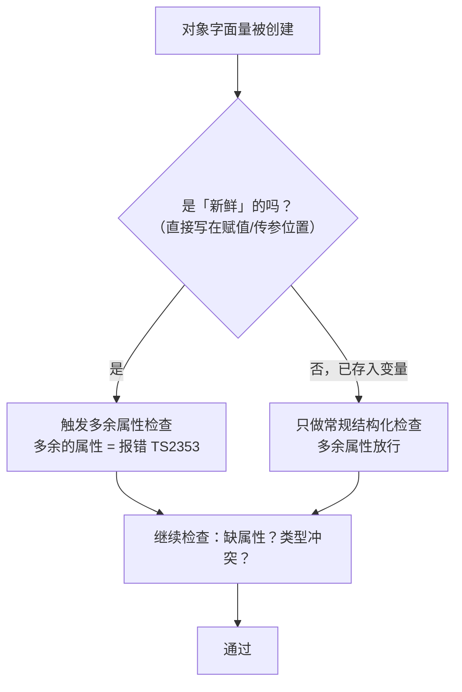
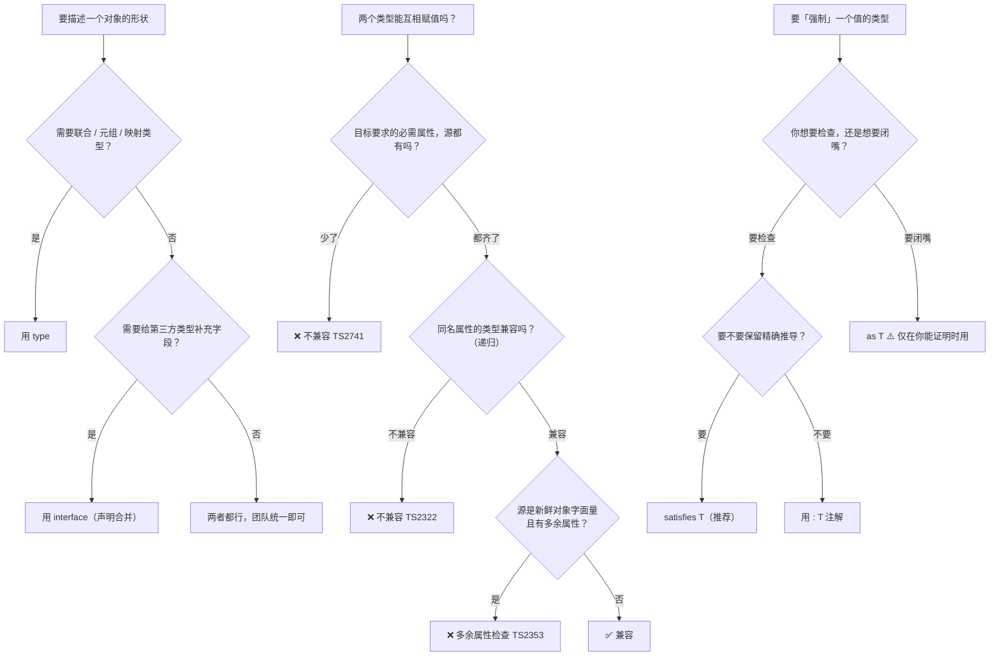

# 第 3 课：对象类型与结构化类型

> 所属阶段：阶段 1《类型思维启蒙》｜ 水平：零基础 TS
> 本课知识点：对象类型：interface 与 type、结构化类型系统、类型断言与 satisfies
> 故事情节：统一记录格式上线，同一个对象两种命运——**写在变量里放行，直接写在调用里报错**
> ✅ 状态：已完成（2026-09-03）｜ 实操环境：Node.js v22.14.0 + TypeScript 7.0.2（**文中所有输出均为本机实测**）

## 🎯 本课目标

- 为业务对象写出类型，正确使用可选 / 只读 / 索引签名，说清 `interface` 与 `type` 的**能力边界**
- 预判两个类型是否兼容，并解释**"多余属性检查"为什么只在对象字面量直接赋值时触发**
- 说清 `as` 能做什么、不能做什么；知道 `satisfies` 解决了 `as` 的什么问题

## 📌 知识点导航

| # | 知识点 | 关键点 | 状态 |
|---|--------|--------|------|
| 1 | 对象类型：interface 与 type | 可选·只读·索引签名 / `extends` 与交叉 `&` / 声明合并 / 能力边界对比 / 选型清单 | ✅ |
| 2 | 结构化类型系统 | 看形状不看名字 / 宽度与深度两条规则 / 多余属性检查（新鲜性）/ `{}` 的坑 | ✅ |
| 3 | 类型断言与 satisfies | `as` 的语义与三条边界 / 双重断言 / `satisfies` 保留推导 / 三种写法对比表 | ✅ |

## 📦 前置依赖（JS 概念）

| 用到的 JS 概念 | 掌握要求 | 回补 |
|---------------|---------|------|
| 对象字面量与属性访问 | 会用即可 | 已掌握 |
| 展开运算符 `...` | 第四幕合并数组用到 | 已掌握（ES6 基础） |
| `class` 与 `constructor` | 知识点 2 用到一次 | 已掌握（ES6 基础） |
| 类型别名 `type` | 已掌握（课 2 知识点 3 用过函数类型别名） | — |

---

## 第一幕：起源与场景引入

> 🏛️ **起源**：判断"这两个类型能不能互相赋值"，类型系统有两条截然不同的路。
>
> **名义类型（nominal typing）**：看**名字和声明关系**。Java、C#、C++ 的 class 体系走这条路——两个类就算字段一模一样，没有 `extends` 关系就不能互相赋值。
>
> **结构化类型（structural typing）**：看**形状**。只要成员对得上就兼容，不管你叫什么、从哪来。ML 家族的记录类型、Go 的 interface 走这条路。
>
> **TypeScript 从 0.8 第一天起就是结构化类型**，原因很硬：JavaScript 里的对象**大多没有 class**——`{ x, y }` 这种字面量才是主流写法。如果按名字判断兼容，你写的每个字面量都得先声明"我是谁"，TS 也就没法兼容 JS 生态了。
>
> 这个选择带来了 TS 的灵魂，也带来了它的**代价**：类型检查"看起来很松"（一个从没声明过关系的类也能赋值成功），并且催生了本课最反直觉的那条规则——**多余属性检查只在对象字面量"新鲜"时生效**。这个规则，就是第二幕的主角。

**记住这段历史里的一个关键点就够了**：TS 的类型兼容**不看名字、只看形状**；而"形状检查的严格程度"，还取决于这个对象是**刚写出来的**还是**从变量里来的**。

好，回到你的项目。

> 🎬 **场景**：CSV 导入跑通了（课 2 的 `scenario.ts` 输出了漂亮的 `total = 263`）。产品说："API 那边也有一份数据，合并进来。"

你定义了统一的记录格式，然后小王提交了第一版（`playground/lesson-03/bug.js`）：

```js
function report(record) {
  return `${record.id}: ${record.score}`;
}

// 从 API 拿的对象，多带了一个字段
const fromApi = { id: "u1", name: "Alice", score: 98, source: "api" };
console.log("from api ->", report(fromApi));

// 他自己写死的一条测试数据，字段名拼错了
const typo = { id: "u2", name: "Bob", scroe: 76 };
console.log("typo     ->", report(typo));

// 字段名完全对不上的一份数据
const wrong = { key: "u3", value: 88 };
console.log("wrong    ->", report(wrong));
```

**实测输出**（Node.js v22.14.0）：

```
from api -> u1: 98
typo     -> u2: undefined
wrong    -> undefined: undefined
```

三行数据，**两行是静默失败**：

- `typo`：字段名拼成了 `scroe`，`record.score` 取到 `undefined`，输出 `u2: undefined`
- `wrong`：字段名完全对不上，整行变成 `undefined: undefined`

**JS 一声不吭。** 报表上线后，运营看到满屏 `undefined` 才来问。这和课 1 第一幕那个 `calcDiscount(100, "八折")` 是同一类事故——**本该写在代码里的信息（这个对象该长什么样），全被丢在了人的脑子里。**

现在你要把这份"形状"写进代码。

---

## 第二幕：认知冲突

你写下统一格式，然后撞上了三件怪事：

```ts
interface DataRow {
  id: string;
  name: string;
  score: number;
}

// 实验 A：这个对象从没声明过 implements DataRow，为什么能赋值？
const fromApi = { id: "u1", name: "Alice", score: 98, source: "api" };
const row1: DataRow = fromApi; // ✅ 编译通过，还多带了个 source

// 实验 B：一模一样的对象，直接写在赋值里，为什么报错？
const row2: DataRow = { id: "u1", name: "Alice", score: 98, source: "api" }; // ❌ 报错

// 实验 C：as 一下就不报错了，那我本来想要的检查还在吗？
const row3 = { id: "u1", name: "Alice" } as DataRow; // 缺了 score，居然过了
```

**同一个对象、同一份类型，只因为"是不是直接写出来的"，命运完全不同。**

这三个实验指向三个更深的问题：

1. **描述一个对象的形状，到底该用 `interface` 还是 `type`？** 它俩的能力边界在哪？
2. **凭什么"从没声明过关系"的对象能赋值成功？** 类型兼容到底按什么规则判断？为什么"直接写出来"反而更严格？
3. **`as` 一下就安静了——那我为类型付的钱，是不是白付了？**

这三个问题，恰好对应本课的三个知识点。

---

## 第三幕：层层揭示

> ⚠️ **本课的默认环境**（与课 2 一致）：所有示例在 `playground/lesson-03/` 目录下执行，**没有 `tsconfig.json`**，直接 `npx tsc xxx.ts` 编译单个文件。TS 7.0.2 默认 `strict: true`。

### 知识点 1：对象类型：interface 与 type

> 关键点：可选·只读·索引签名 / `extends` 与交叉 `&` / 声明合并 / 能力边界对比 / 选型清单

#### 一句话定义

**`interface`** 是专门描述"对象形状"的声明，支持**同名自动合并**；**`type`** 是给**任意类型**起别名（可以是对象、联合、元组、原始类型），**不允许重复声明**。

#### 直觉建立（类比）

- **`interface` = 一份可续写的合同**。同名声明会自动合并，像往同一份合同里追加补充条款。
- **`type` = 给一个类型起名字**。像给一个公式起名字——它指向什么都可以：一个对象的形状、几个类型的**联合**、一个元组、甚至就是 `string`。

> 💡 **类比的边界**：这个比喻容易让人以为"interface 描述对象、type 描述其他"，但**两者都能描述对象**——这正是选型困惑的来源。更准确的划分是：**interface 只会是对象形状，type 什么都能是**。所以凡是需要"非对象"能力的地方（联合、元组、映射），只能选 `type`。

#### 核心原理

**① 三种写法都能描述对象**

```ts
interface DataRow {          // ① 接口
  id: string;
  score: number;
}

type DataRowAlias = {        // ② 类型别名
  id: string;
  score: number;
};

function report(row: { id: string; score: number }) {} // ③ 内联字面量（一次性使用）
```

**② 三个修饰符**

| 修饰符 | 写法 | 含义 |
|-------|------|------|
| 可选 | `source?: string` | 可以有，也可以没有（类型实为 `string \| undefined`） |
| 只读 | `readonly createdAt: string` | 赋值后不能再改（编译期约束） |
| 索引签名 | `[userId: string]: number` | 键名任意，但**所有值**必须是 `number` |

实测（只读被改、`{}` 相关）：

```
objects-probe.ts(9,4): error TS2540: Cannot assign to 'x' because it is a read-only property.
objects-probe.ts(26,3): error TS2411: Property 'id' of type 'string' is not assignable to 'string' index type 'number'.
```

第二条很容易踩：**一旦写了索引签名，所有具体属性的类型都必须服从它**：

```ts
interface Mixed {
  id: string; // ❌ string 不服从下面的 number 索引签名
  [key: string]: number;
}
```

**③ 扩展：extends vs 交叉 `&`**

```ts
interface ApiRow extends DataRow {   // interface 用 extends
  endpoint: string;
}

type ApiRowAlias = DataRowAlias & { endpoint: string };  // type 用交叉类型 &
```

两者效果相近，但**遇到同名属性冲突时行为完全不同**（实测）：

```ts
interface Base { x: number }

interface Derived extends Base {
  x: string;   // ❌ error TS2430: Interface 'Derived' incorrectly extends interface 'Base'.
}

type Cross = { x: number } & { x: string };  // ✅ 交叉成立，x 变成 number & string = never
const c: Cross = { x: 1 };
// ❌ error TS2322: Type 'number' is not assignable to type 'never'.
```

`extends` **当场报错逼你处理**；交叉 `&` 一声不吭地把 `x` 变成了 `never`（`number & string` 是不可能存在的值），错误要等你真去赋值时才炸，而且报错信息离现场很远。**想表达"继承"时用 `extends` 更安全。**

**④ 声明合并：interface 独占的能力**

```ts
interface AppConfig { mode: string }
interface AppConfig { port: number }     // ✅ 自动合并
const cfg: AppConfig = { mode: "dev", port: 3000 };  // 两个属性都必需

type Dup = { x: number };
type Dup = { y: number };                // ❌ error TS2300: Duplicate identifier 'Dup'.
```

声明合并不是给日常业务代码用的，它的价值在**给第三方库/全局对象补充类型**（课 11 声明文件会用到）。日常写业务类型时，它反而是个"同名不报错"的隐患。

**⑤ 能力边界对比表**

| 能力 | `interface` | `type` |
|------|------------|--------|
| 描述对象形状 | ✅ | ✅ |
| 可选 / 只读 / 索引签名 | ✅ | ✅ |
| 被 `implements` | ✅ | ✅（对象字面量类型） |
| 被 `extends` / 交叉扩展 | `extends` | `&` |
| **同名声明合并** | ✅ | ❌ TS2300 |
| **描述联合类型** | ❌ | ✅ `type Id = string \| number` |
| **描述元组 / 原始类型别名** | ❌ | ✅ `type Pair = [string, number]` |
| **映射类型**（课 9） | ❌ | ✅ `{ [K in Keys]: T }` |

**⑥ 选型清单（决策参考）**

| 场景 | 选谁 | 理由 |
|------|------|------|
| 描述业务对象的形状（绝大多数情况） | **两者都行，团队统一** | 能力重叠区，风格问题 |
| 需要**联合 / 元组 / 原始类型别名** | `type` | interface 做不到 |
| 需要**映射类型、条件类型**（课 9） | `type` | interface 做不到 |
| 想让**同名声明报错**（防手滑重名） | `type` | interface 会静默合并 |
| 需要给**第三方类型补字段** | `interface` | 只有它能合并 |
| 需要与 `class` 的 `implements` 配合 | `interface` | 语义最贴合 |

> 🔧 **团队规范建议**：**默认 `interface` 描述对象形状，需要联合/元组/映射时才用 `type`。** 这是 TS 官方 handbook 的立场，也是社区主流。但比"选谁"更重要的是**团队内统一**——混用不会出错，只会让人纠结。

#### 示例演示

`playground/lesson-03/objects.ts`（**实测零报错**）：

```ts
interface DataRow {
  id: string;
  name: string;
  score: number;
  source?: string; // 可选属性
  readonly createdAt: string; // 只读属性
}

type DataRowAlias = {
  id: string;
  name: string;
  score: number;
  source?: string;
  readonly createdAt: string;
};

interface ApiRow extends DataRow {
  endpoint: string;
}

type ApiRowAlias = DataRowAlias & { endpoint: string };

// 索引签名：键名不确定，值的类型确定
interface ScoreMap {
  [userId: string]: number;
}
const scores: ScoreMap = { u1: 98, u2: 76 };
scores.u3 = 89;

// 声明合并：两个 AppConfig 自动合并
interface AppConfig { mode: string }
interface AppConfig { port: number }
const cfg: AppConfig = { mode: "dev", port: 3000 };

const row: DataRow = { id: "u1", name: "Alice", score: 98, createdAt: "2026-09-01" };
const apiRow: ApiRow = {
  id: "u2", name: "Bob", score: 76, createdAt: "2026-09-02", endpoint: "/users",
};

console.log(row, apiRow, scores, cfg);
```

**实测输出**：

```
{ id: 'u1', name: 'Alice', score: 98, createdAt: '2026-09-01' } {
  id: 'u2',
  name: 'Bob',
  score: 76,
  createdAt: '2026-09-02',
  endpoint: '/users'
} { u1: 98, u2: 76, u3: 89 } { mode: 'dev', port: 3000 }
```

边界探测（`objects-probe.ts`，**实测 6 条报错**）：

```
objects-probe.ts(4,6): error TS2300: Duplicate identifier 'Dup'.
objects-probe.ts(5,6): error TS2300: Duplicate identifier 'Dup'.
objects-probe.ts(9,4): error TS2540: Cannot assign to 'x' because it is a read-only property.
objects-probe.ts(20,7): error TS2322: Type 'null' is not assignable to type '{}'.
objects-probe.ts(21,7): error TS2322: Type 'string' is not assignable to type 'object'.
objects-probe.ts(26,3): error TS2411: Property 'id' of type 'string' is not assignable to 'string' index type 'number'.
```

#### 常见误区

1. **"`readonly` 属性运行时也改不了。"** —— 和课 2 的 `readonly` 数组一样，**只防编译期**，编译后一个字符都不剩。真要冻结用 `Object.freeze()`。
2. **"可选属性 `a?: number` 就等于 `a: number | undefined`。"** —— 在**默认配置**下行为接近（实测 `{ a: undefined }` 能赋给 `{ a?: number }`），但语义不同：`?` 表示"这个键可以不写"。TS 7 的 `tsc --init` 推荐开启 `exactOptionalPropertyTypes`，开了之后两者就**严格区分**了（课 10 会讲）。
3. **"`{}` 表示空对象。"** —— 大坑，见下一条实测：

   ```ts
   const e1: {} = "hello";   // ✅ 通过！
   const e2: {} = 42;        // ✅ 通过！
   const e3: {} = null;      // ❌ TS2322（strict 下）
   const e4: object = "hello"; // ❌ TS2322
   ```

   **`{}` 的意思是"任何非 `null`/`undefined` 的值"**，字符串数字都能进。想表达"任意对象"请用 `object`；想表达"键是字符串、值不知道是什么的对象"，请用**索引签名** `{ [key: string]: unknown }`；想表达"任意值"请用 `unknown`（课 6 正式讲）。

#### 一句话记住

> **`interface` 是对象形状的专用声明（还能合并），`type` 是给任何类型起别名（联合、元组、映射都靠它）——描述对象时两者重叠，选一个团队统一即可。**

#### 官方文档

- 对象类型：https://www.typescriptlang.org/docs/handbook/2/objects.html
- interface vs type：https://www.typescriptlang.org/docs/handbook/2/everyday-types.html#differences-between-type-aliases-and-interfaces

---

### 知识点 2：结构化类型系统

> 关键点：看形状不看名字 / 宽度与深度两条规则 / 多余属性检查（新鲜性）/ `{}` 的坑

#### 一句话定义

TS 判断两个类型能否互相赋值时，**只比较形状（成员名与成员类型），不比较名字与声明关系**。

#### 直觉建立（类比）

**锁与钥匙。**

一把锁不认钥匙上刻的**品牌**、也不认它是**谁配的**——它只认**齿形**。齿形对得上就能开。

TS 的可赋值性判断就是这样：不管你这个对象是 `class` 实例、字面量、还是从 API `JSON.parse` 来的（只要类型对），只要它**有被调用方需要的那些成员，且类型对得上**，就能赋值。

> 💡 **类比的边界**：真实钥匙必须**完全匹配**齿形，多一个齿都插不进去；而 TS 是"**够用就行**"——源类型只需**包含**目标类型的必需属性，**多出来的属性不碍事**（在失去新鲜性之后）。另外真实钥匙的匹配是"一对一"，TS 的兼容是**单向**的（属性多的可以赋给属性少的，反之不行）。

#### 核心原理

**① 两条规则**

```
源类型 S 能赋给目标类型 T，当且仅当：
  ① 宽度：T 的每个必需属性，S 都必须有（可以多，不能少）
  ② 深度：同名的属性，S 的类型必须能赋给 T 的类型（递归检查）
```

**② 形状对就行，不管出身**（实测通过）：

```ts
class Point {
  constructor(public x: number, public y: number) {}
}
interface XY { x: number; y: number }
const xy: XY = new Point(1, 2);   // ✅ 没有任何地方声明过 Point implements XY
```

这就是结构化类型的直接体现——**没有人声明过它们的关系，关系自动成立**。

**③ 多余属性检查（Excess Property Check）——本课最反直觉的规则**

先看实测对照（`structural-probe.ts`）：

| 写法 | 结果 |
|------|------|
| `const a: DataRow = { id, score, source }` | ❌ TS2353 |
| `const raw = { id, score, source }; const b: DataRow = raw` | ✅ 通过 |
| `report({ id, score, source })`（直接传字面量） | ❌ TS2353 |
| `report(raw)`（传变量） | ✅ 通过 |
| `const g: Box = { row: { id, score, extra } }`（嵌套） | ❌ TS2353 |
| `const h: DataRow = { id, score, extra } as DataRow` | ✅ 通过（断言绕过） |

**同一个对象，直接写出来就报错，先存进变量就放行。** 差别在于一个概念——**新鲜性（freshness）**：



**为什么要这样设计？** 因为两种场景的"多余属性"含义完全不同：

- **对象字面量直接写出来**：多余属性**几乎总是笔误**（拼错字段名、复制粘贴残留）。此时拦下来收益极高——实测它甚至能猜出你想写什么：

  ```
  error TS2561: Object literal may only specify known properties, but 'scroe' does not exist in type 'DataRow'. Did you mean to write 'score'?
  ```

  **编译器直接问你："是不是想写 `score`？"** 这正是第一幕那个 `typo` bug 的正解。

- **已经存进变量的对象**：它可能来自 API 响应、配置文件、数据库查询。这些地方天然会多带字段，**一律拦截就没法写代码了**。所以放行。

> 🔧 **工程后果**：这条规则解释了一个常见困惑——"为什么我加了个字段就报错，同事加了同样的字段却没事？"答案多半是：**你直接写在调用处（新鲜），他先存进了变量（不新鲜）**。

**④ `{}` 与 `object` 的区别**（承接知识点 1 的误区 3）

`{}` 是结构化类型的极端案例：它**不要求任何属性**，所以任何非 `null`/`undefined` 的值都"形状兼容"（包括字符串和数字）。

| 写法 | 能接受 | 用途 |
|------|-------|------|
| `{}` | 任何非 `null`/`undefined` 的值（含 `"str"`、`42`） | ❌ 别用它表示"对象" |
| `object` | 任何**非原始类型**（对象、数组、函数） | 表示"是个对象，但不知道有什么属性" |
| `unknown` | 一切 | 表示"不知道是什么"（课 6 正式讲） |

#### 示例演示

`playground/lesson-03/structural.ts`（**实测零报错**）：

```ts
interface DataRow {
  id: string;
  score: number;
}

// ① 从没声明过 implements DataRow，形状对就能赋值
const fromApi = { id: "u1", name: "Alice", score: 98, source: "api" };
const row1: DataRow = fromApi; // ✅ 多余属性不拦

// ② class 也一样：只要形状对
class Point {
  constructor(public x: number, public y: number) {}
}
interface XY { x: number; y: number }
const xy: XY = new Point(1, 2); // ✅ 没人声明过 Point implements XY

// ③ 嵌套也递归检查
interface Box { row: DataRow }
const box: Box = { row: fromApi }; // ✅ 里面的 row 也按形状检查

function report(row: DataRow): string {
  return `${row.id}: ${row.score}`;
}

console.log(report(fromApi));
console.log(row1, xy, box);
```

**实测输出**：

```
u1: 98
{ id: 'u1', name: 'Alice', score: 98, source: 'api' } Point { x: 1, y: 2 } { row: { id: 'u1', name: 'Alice', score: 98, source: 'api' } }
```

边界探测（`structural-probe.ts`，**实测 6 条报错**）：

```
structural-probe.ts(9,43): error TS2353: Object literal may only specify known properties, and 'source' does not exist in type 'DataRow'.
structural-probe.ts(20,31): error TS2353: Object literal may only specify known properties, and 'source' does not exist in type 'DataRow'.
structural-probe.ts(24,32): error TS2561: Object literal may only specify known properties, but 'scroe' does not exist in type 'DataRow'. Did you mean to write 'score'?
structural-probe.ts(27,22): error TS2322: Type 'number' is not assignable to type 'string'.
structural-probe.ts(30,7): error TS2741: Property 'score' is missing in type '{ id: string; }' but required in type 'DataRow'.
structural-probe.ts(36,46): error TS2353: Object literal may only specify known properties, and 'extra' does not exist in type 'DataRow'.
```

**注意第 12 行和第 21 行没有报错**——那两行正是"变量中转"和"传变量"的写法。这就是新鲜性的实证。

#### 常见误区

1. **"TS 不检查多余属性。"** —— 检查，但**只在字面量新鲜时**。这也是很多人觉得规则"飘忽不定"的原因。
2. **"结构化类型 = 完全不检查。"** —— 缺属性（TS2741）、属性类型冲突（TS2322）**任何情况下都检查**。
3. **"两个字段一样的对象类型一定互相兼容。"** —— 只要属性**类型**不兼容就不行（深度规则，见上面第 4 条报错）。函数成员还涉及参数与返回值的兼容方向（课 14 变体）。
4. **"用 `{}` 表示空对象。"** —— 它能接受字符串和数字。用 `object` 或 `{ [key: string]: unknown }`。

#### 一句话记住

> **TS 只认形状不认出身；但刚写出来的对象字面量会被额外查一遍多余属性——因为那多半是笔误。**

#### 官方文档

- 结构化类型（Type Compatibility）：https://www.typescriptlang.org/docs/handbook/type-compatibility.html
- 多余属性检查：https://www.typescriptlang.org/docs/handbook/2/objects.html#excess-property-checks

---

### 知识点 3：类型断言与 satisfies

> 关键点：`as` 的语义与三条边界 / 双重断言 / `satisfies` 保留推导 / 三种写法对比表

#### 一句话定义

**`as T`** 是告诉编译器"相信我，它就是 T"（跳过大部分检查）；**`satisfies T`** 是"你先检查一遍它是否符合 T，**但别改我的类型**"。

#### 直觉建立（类比）

过安检时两种方式：

- **`as` = 你跟安检员说"这是我自己的东西，我担保"**——他**不打开检查**，直接放行。但出了事，责任全在你。
- **`satisfies` = 东西照常过安检机**——机器**真的扫一遍**，有问题照样拦；但扫完**不换包装**，你的包裹还是原来那个。

> 💡 **类比的边界**：`as` 也不是"完全不检查"——如果两个类型**毫无重叠**（比如把 `string` 断言成 `number`），它会拒绝（TS2352）。所以 `as` 更像"安检员看一眼体积：明显不可能的拦下，看着差不多就放行"。而 `satisfies` 与"类型注解"的区别在于：**注解会给你换个新包装（类型被固定成注解的类型），`satisfies` 不会。**

#### 核心原理

**① `as` 的本质**

`as` 是**编译期断言**：它不改变任何运行时行为（编译后擦除，和课 1 所有类型一样），也**不做类型转换**——`const n = "123" as number` 不会把字符串变成数字，运行时它还是字符串。

**② `as` 的三条边界（实测）**

| 检查项 | `as T` 拦不拦 | 实测证据 |
|-------|-------------|---------|
| 属性**缺失** | ❌ **不拦**（最危险） | `const a = { method: "GET" } as Req` 缺 `url` 零报错 |
| 属性**多余** | ❌ 不拦 | `{ method, url, extra } as Req` 零报错 |
| 属性**类型冲突** | ✅ 拦（TS2352） | `{ method: "GET", url: 123 } as Req` 报错 |

第一条的后果是实打实的（`assertions-probe.ts` 编译后运行）：

```ts
const a = { method: "GET" } as Req; // 缺 url，编译器一声不吭
const aUrl: string = a.url;         // 编译也通过
console.log("a.url =", aUrl);      // 运行时：undefined
```

**实测输出：`a.url = undefined`** —— 这正是课 1 说过的**假安全感**：`JSON.parse` + `any` 能骗过编译器，`as` 也能。

**③ 双重断言 = 危险信号**

```ts
const e = { method: "GET", url: 123 } as unknown as Req;  // ✅ 编译通过
```

`as unknown as T` 能绕过**一切**检查（因为 `unknown` 与任何类型都"有重叠"）。看到它，就该警觉：**这行代码的类型安全已经归零了。** 课 6 讲 `unknown` 时会回来解释为什么它这么万能。

**④ `satisfies`（TypeScript 4.9，2022 年 11 月引入）**

它解决的是一个两难：

- 用**类型注解** `const x: Config = {...}` → 类型被固定成 `Config`，**丢失了更精确的信息**
- 用**什么都不写** → 没有任何合规性检查
- 用 `as` → 检查被跳过

`satisfies` 的答案：**检查照做，类型保留**。

实测对比（`assertions-probe.ts`）：

```ts
type Method = "GET" | "POST";

// 注解：method 的类型被固定为 Method（两个值都有可能）
const g1: Req = { method: "GET", url: "/x" };
const gm1: "GET" = g1.method;
// ❌ error TS2322: Type 'Method' is not assignable to type '"GET"'.
//      Type '"POST"' is not assignable to type '"GET"'.

// satisfies：保留了"我写的就是 GET"
const g2 = { method: "GET", url: "/x" } satisfies Req;
const gm2: "GET" = g2.method;   // ✅ 通过
```

**⑤ 三种写法对比表**（本知识点的核心）

| 行为 | `const x: T = {...}` 注解 | `{...} satisfies T` | `{...} as T` |
|------|--------------------------|---------------------|--------------|
| 缺属性 | ✅ 拦（TS2741） | ✅ 拦（TS2741） | ❌ 放行 |
| 多余属性 | ✅ 拦（TS2353） | ✅ 拦（TS2353） | ❌ 放行 |
| 属性类型冲突 | ✅ 拦（TS2322） | ✅ 拦（TS2322） | ✅ 拦（TS2352，可绕过） |
| 变量得到的类型 | 固定为 `T` | **保留推导出的精确类型** | 固定为 `T` |

一句话总结：**`satisfies` = 注解的检查力度 + 不写注解的类型精度。**

**⑥ 什么时候才该用 `as`**

`as` 不是禁药，它的正当用途是"**你比编译器多知道一些信息**"：

| 场景 | 例子 |
|------|------|
| DOM 元素类型 | `document.querySelector("#app") as HTMLElement`（编译器不知道这个 id 是什么标签） |
| 收窄外部数据的形状 | 配合运行时校验后断言（课 6 信任边界的正解） |
| 第三方库类型不准 | 权宜之计，能提 issue 就提 |

判断标准：**用 `as` 之前先问自己"我能不能证明它一定是这个类型"**。证明不了，就该用运行时校验（课 6），而不是断言。

#### 示例演示

`playground/lesson-03/assertions.ts`（**实测零报错**）：

```ts
type Method = "GET" | "POST"; // 联合类型：只能是这两个值之一（课 4 正式讲）
type Req = { method: Method; url: string };

// ① 类型注解：类型被固定成 Req，"我写的是 GET" 这个信息丢了
const byAnnotation: Req = { method: "GET", url: "/users" };

// ② satisfies：既要合规检查，又要保留"我写的就是 GET"
const bySatisfies = { method: "GET", url: "/users" } satisfies Req;

// ③ 关键差异：satisfies 保留了 "GET" 这个字面量类型
const methodFromSatisfies: "GET" = bySatisfies.method; // ✅ 通过
// const methodFromAnnotation: "GET" = byAnnotation.method; // ❌ 见 probe

console.log(byAnnotation, bySatisfies, methodFromSatisfies);
```

**实测输出**：

```
{ method: 'GET', url: '/users' } { method: 'GET', url: '/users' } GET
```

两个对象**打印出来一模一样**——差异只在编译期。

边界探测（`assertions-probe.ts`，**实测 7 条报错**）：

```
assertions-probe.ts(12,7): error TS2741: Property 'url' is missing in type '{ method: "GET"; }' but required in type 'Req'.
assertions-probe.ts(15,29): error TS2741: Property 'url' is missing in type '{ method: "GET"; }' but required in type 'Req'.
assertions-probe.ts(18,11): error TS2352: Conversion of type '{ method: "GET"; url: number; }' to type 'Req' may be a mistake because neither type sufficiently overlaps with the other. If this was intentional, convert the expression to 'unknown' first.
  Types of property 'url' are incompatible.
    Type 'number' is not comparable to type 'string'.
assertions-probe.ts(24,11): error TS2352: Conversion of type 'string' to type 'number' may be a mistake because neither type sufficiently overlaps with the other. If this was intentional, convert the expression to 'unknown' first.
assertions-probe.ts(29,7): error TS2322: Type 'Method' is not assignable to type '"GET"'.
  Type '"POST"' is not assignable to type '"GET"'.
assertions-probe.ts(33,45): error TS2353: Object literal may only specify known properties, and 'extra' does not exist in type 'Req'.
assertions-probe.ts(34,40): error TS2353: Object literal may only specify known properties, and 'extra' does not exist in type 'Req'.
```

**重点关注"没报错"的那几行**：`as` 缺属性（第 7 行）、双重断言（第 21 行）、`as` 多余属性（第 35 行）、以及 `satisfies` 保留字面量（第 30 行）——它们共同构成了上面那张对比表。

#### 常见误区

1. **"`as` 会做类型转换。"** —— 不会。`"123" as number` 运行时还是字符串（而且这句本身会报 TS2352）。要做转换用 `Number()`、`String()`。
2. **"断言了就是安全的。"** —— `as` 跳过检查，是把**编译器的保护撤掉**，不是加上。实测 `a.url = undefined`。
3. **"`as unknown as T` 是标准解法。"** —— 它是"我放弃治疗"的信号。出现时应该写注释说明为什么，或者改用运行时校验。
4. **"`satisfies` 只是 `as` 的更好听的写法。"** —— 完全相反：`as` **放弃检查**，`satisfies` **执行检查**。

#### 一句话记住

> **`as` 是让编译器闭嘴，`satisfies` 是让编译器检查完再闭嘴——但别改我的类型。**

#### 官方文档

- 类型断言：https://www.typescriptlang.org/docs/handbook/2/everyday-types.html#type-assertions
- `satisfies` 运算符（TS 4.9 发布说明）：https://www.typescriptlang.org/docs/handbook/release-notes/typescript-4-9.html

---

## 第四幕：实操验证

回到第一幕那个"API 数据合进来"的需求。按本课的规矩写（`playground/lesson-03/scenario.ts`）：

```ts
// 统一记录格式：CSV 和 API 两边的数据都要能进这个模子
interface DataRow {
  id: string;
  name: string;
  score: number;
}

// 来源一：CSV 解析
function fromCsv(line: string): DataRow {
  const [id, name, rawScore] = line.split(",");
  return { id, name, score: Number(rawScore) };
}

// 来源二：API，多带了一个字段
interface ApiRow {
  id: string;
  name: string;
  score: number;
  source: string;
}

function report(rows: readonly DataRow[]): void {
  for (const row of rows) {
    console.log(`${row.id} ${row.name}: ${row.score}`);
  }
}

const csvRows: DataRow[] = ["u1,Alice,98", "u2,Bob,76"].map(fromCsv);
const apiRows: ApiRow[] = [{ id: "u3", name: "Cindy", score: 89, source: "api" }];

// 两个来源混在一起：ApiRow 结构上兼容 DataRow，不需要任何转换
const all: DataRow[] = [...csvRows, ...apiRows];
report(all);

// 配置用 satisfies：既检查合规性，又保留"我选的是 score"这个信息
type ReportConfig = { title: string; sortBy: "id" | "score" };
const config = { title: "Score Report", sortBy: "score" } satisfies ReportConfig;
const sortKey: "score" = config.sortBy; // ✅ satisfies 保留了字面量

console.log(`${config.title} - sorted by ${sortKey}`);
```

**实测结果**：`npx tsc scenario.ts` **零报错**，运行 `node scenario.js`：

```
u1 Alice: 98
u2 Bob: 76
u3 Cindy: 89
Score Report - sorted by score
```

**没有一行 `undefined`。** 第一幕那三行输出的幽灵，被彻底解决了。

再看四道防线是不是真的立住了（`scenario-guard.ts`，**实测 3 条报错**）：

```
scenario-guard.ts(10,48): error TS2561: Object literal may only specify known properties, but 'scroe' does not exist in type 'DataRow'. Did you mean to write 'score'?
scenario-guard.ts(13,7): error TS2741: Property 'score' is missing in type '{ id: string; name: string; }' but required in type 'DataRow'.
scenario-guard.ts(16,62): error TS2353: Object literal may only specify known properties, and 'source' does not exist in type 'DataRow'.
```

对照第一幕的三行 JS 输出：

| 第一幕的事故 | JS 里的结局 | TS 里的结局 |
|-------------|------------|------------|
| `scroe` 拼错 | `u2: undefined` 静默 | **TS2561 当场拦下，还问"是不是想写 score"** |
| 缺 `score` 字段 | 静默产出 `undefined` | **TS2741 当场拦下** |
| 字面量多带 `source` | 无所谓（本来就是静默） | **TS2353 提醒你"这个字段不在格式里"** |
| API 数据多带 `source` | 无所谓 | **放行**（变量中转，失去新鲜性）——这是特性 |

**最后一行才是关键**：同样的"多带一个字段"，直接写出来被拦（那是笔误），从 API 变量里来就被放行（那是数据）。**同一条规则，两种命运，因为编译器知道你在哪种场景。**

> ✅ **回扣结构化类型**：`ApiRow` 从没声明过 `implements DataRow`，`report(rows: readonly DataRow[])` 照收不误——**看形状，不看名字**。这正是 TS 能无缝兼容 JS 生态的根本原因。

---

## 第五幕：体系收束

> 📍 **全局定位**：本课是**阶段 1 的收官**，把视角从"单个值"抬到了"一整个东西的形状"。结构化类型是 TS 的灵魂，后面所有内容都建立在它之上。
>
> 这条主线会在四个地方继续：
> - **阶段 2 课 4**（下一课）：结构化类型 + 字面量类型 = **判别联合（discriminated union）**，那是 TS 最强大的建模工具之一
> - **阶段 2 课 5**：可选属性带来的 `undefined`、判别联合的分支，都需要**收窄**来处理
> - **阶段 2 课 7**：`class` 的兼容同样走结构化规则（本课已埋点：`Point` 能赋给 `XY`）
> - **阶段 3 课 9**：`type` 的专属能力（映射类型、条件类型）会让你真正理解"为什么两个都要有"

**现在你会了什么**：

- 能为业务对象写出类型，正确使用可选 / 只读 / 索引签名，并说清 `interface` 与 `type` 的能力边界（合并 vs 联合/元组/映射）
- 能预判两个类型是否兼容（宽度 + 深度两条规则），并解释**多余属性检查为什么只在字面量新鲜时触发**
- 能区分 `as` 与 `satisfies`：`as` 放弃检查、`satisfies` 执行检查但保留类型精度；知道 `as unknown as T` 是危险信号
- 记住了一条纪律：**`as` 是撤掉保护，不是加上保护**

> 🔗 **下一步**：阶段 1 结束，进入**阶段 2《收窄与控制流》**。课 4《联合类型与字面量类型》——类型不再是你写死的单个形状，而是"几种可能之一"；而让"几种可能"变回"一种确定"的技术，就是阶段 2 的核心：**收窄**。**那是这门课的分水岭。**

---

## 🐞 常见误区

1. **"`readonly` 运行时也防改。"** → 只防编译期，编译后擦除。要冻结用 `Object.freeze()`。
2. **"用 `{}` 表示空对象。"** → 它能接受 `"str"` 和 `42`。用 `object` 或 `{ [key: string]: unknown }` 表示对象，用 `unknown` 表示任意值。
3. **"TS 不检查多余属性。"** → 检查，但**只在对象字面量新鲜时**。存进变量再赋值就放行（这是刻意为之）。
4. **"结构化类型等于不检查。"** → 缺属性和类型冲突任何情况下都查；只有"多余属性"受新鲜性影响。
5. **"`as` 会做类型转换。"** → 不会。它只改编译器的看法，运行时一个比特都不变。
6. **"`as unknown as T` 是解决问题的标准写法。"** → 那是"放弃治疗"的信号。它绕过了一切检查，应先尝试运行时校验（课 6）。
7. **"`satisfies` 就是更好听的 `as`。"** → 相反：`as` 放弃检查，`satisfies` 执行检查且**保留推导出的精确类型**。

## 一图总结



> 关键记忆点：① 形状对就兼容，不看名字；② 多余属性只查"新鲜"的字面量；③ `as` 撤保护、`satisfies` 加检查。

## 课后小测

**Q1**：同一个对象，一个报错一个不报错，为什么？

```ts
interface DataRow { id: string; score: number }
const raw = { id: "u1", score: 98, source: "api" };

const a: DataRow = raw;                                  // ①
const b: DataRow = { id: "u1", score: 98, source: "api" }; // ②
```

- A. ① 不报错，② 报错：因为 ② 是"新鲜"的对象字面量，会触发多余属性检查
- B. ① 报错，② 不报错
- C. 两个都报错
- D. 两个都不报错，TS 从不检查多余属性

<details><summary>答案与解析</summary>

**答案：A**。实测：`structural-probe.ts` 中变量中转的行零报错，而直接写字面量的行报 `TS2353: Object literal may only specify known properties, and 'source' does not exist in type 'DataRow'`。

设计理由：字面量直接写出来时，多余属性几乎总是**笔误**（编译器甚至会提示"Did you mean to write 'score'?"）；而已经存进变量的对象可能来自 API、配置文件，天然会多带字段，一律拦截就没法写代码了。

</details>

**Q2**：下列需求分别该用 `interface` 还是 `type`？

1. 给一个"ID 可以是字符串或数字"的类型起名字
2. 描述"用户对象"的形状
3. 把已有的 `DataRow` 加上一个 `endpoint` 字段
4. 给第三方库的 `Window` 类型补一个自定义字段

- A. 1→type，2→都行，3→都行，4→interface
- B. 全部用 type
- C. 全部用 interface
- D. 1→type，2→interface，3→interface，4→type

<details><summary>答案与解析</summary>

**答案：A**。

1. `type Id = string | number`——**联合类型只能靠 `type`**，interface 没有对应语法
2. 描述对象形状，两者能力重叠，**团队统一即可**（社区主流默认 `interface`）
3. 扩展两者都行：`interface B extends A` 或 `type B = A & {...}`
4. 给第三方类型补字段**必须用 `interface`**——只有它支持同名声明合并（`type` 重复声明会报 TS2300）

</details>

**Q3**：你想定义一个配置对象，要求：**既检查它是否符合 `Config`，又保留"我写的是 `score`"这个精确信息**。该用哪个？

```ts
type ReportConfig = { title: string; sortBy: "id" | "score" };
```

- A. `const c: ReportConfig = { title: "R", sortBy: "score" }`
- B. `const c = { title: "R", sortBy: "score" } satisfies ReportConfig`
- C. `const c = { title: "R", sortBy: "score" } as ReportConfig`
- D. `const c = { title: "R", sortBy: "score" }`

<details><summary>答案与解析</summary>

**答案：B**。

- A 注解：检查做了，但类型被固定成 `ReportConfig`，`c.sortBy` 变成 `"id" | "score"`，**丢了"我写的是 score"**（实测 `const k: "score" = c.sortBy` 报 TS2322）
- B `satisfies`：检查照做，**类型保留推导结果**——实测 `const k: "score" = c.sortBy` 零报错
- C `as`：**跳过检查**（缺 `title` 也不报错），且同样丢精度
- D 什么都不写：**没有检查**，写错字段没人管

一句话：`satisfies` = 注解的检查力度 + 不写注解的类型精度。

</details>

## 🚀 下一批接力提示词

> 学完本课后，**复制下面这段文字发给 AI**，即可无缝进入下一批（无需重新描述上下文）：

```
继续学 TypeScript。我的学习档案在 frontend/typescript-core/00-学习档案.md，
刚学完阶段 1《类型思维启蒙》的课 3《对象类型与结构化类型》三个知识点
（对象类型：interface 与 type / 结构化类型系统 / 类型断言与 satisfies），
阶段 1 已全部完成，请按大纲继续讲解阶段 2 课 4《联合类型与字面量类型》。
```

## 🧭 课程导航

⬅️ **上一课**：[课 2：基础类型标注与推导](lesson-02-基础类型标注与推导.md)

➡️ **下一课**：[阶段 2 · 课 4：联合类型与字面量类型](../2-收窄与控制流/lessons/lesson-04-联合类型与字面量类型.md)（阶段 1 已收官）

📚 **返回目录**：[课程目录](../../02-课程目录.md)

---

## 附：本课示例文件清单

所有示例位于 `playground/lesson-03/`，均可直接 `npx tsc <文件名>` 复现：

| 文件 | 用途 | 预期结果 |
|------|------|---------|
| `bug.js` | 第一幕：JS 版的三行数据、两行静默失败 | 直接 `node bug.js` 运行 |
| `objects.ts` | 知识点 1：interface 与 type 主示例 | 零报错，可运行 |
| `objects-probe.ts` | 知识点 1：能力边界探测 | 6 条报错（故意） |
| `structural.ts` | 知识点 2：结构化类型主示例 | 零报错，可运行 |
| `structural-probe.ts` | 知识点 2：多余属性检查的两种命运 | 6 条报错（故意） |
| `assertions.ts` | 知识点 3：`as` 与 `satisfies` 主示例 | 零报错，可运行 |
| `assertions-probe.ts` | 知识点 3：三种写法对比 | 7 条报错 + 运行输出 `a.url = undefined` |
| `probe-extends.ts` | 知识点 1：`extends` 与交叉的冲突行为 | 2 条报错（故意） |
| `scenario.ts` | 第四幕：CSV + API 双数据源合并 | 零报错，输出三行记录 |
| `scenario-guard.ts` | 第四幕：四道防线验证 | 3 条报错（故意） |
