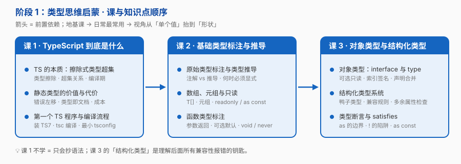

# 阶段 1：类型思维启蒙

> 所属课程：[TypeScript](../01-学习路径总览.md) ｜ 故事章节：**「身份：注释」——类型第一次进代码，只为了让人看懂**
> 规模：3 课 / 9 知识点 ｜ 水平：零基础 TS

## 🎯 本阶段目标

- 说清 TypeScript 是什么、**不是什么**——尤其理解"类型在编译后完全消失"意味着什么
- 能独立初始化一个 TS 7 项目：安装、编译、跑起来，并看懂 `tsc` 报的错
- 建立"**推导优先、注解补位**"的直觉，而不是到处写类型

## 📍 学习重点

- **类型擦除是理解 TS 的地基**：TS 不改变运行时行为，所以 `tsc` 报的错和实际运行是两回事；这一条能解开后面大半的困惑（比如"为什么我写了类型它还是崩了"）
- **静态类型的价值是"错误发现左移"**：同一个 bug，在编译期发现的成本是 3 秒，在生产环境发现的成本是 3 小时 + 一次事故复盘
- **代价同样真实**：认知成本（要学一套类型语法）+ 构建成本（多一步编译）+ 假安全感（`as` 一下就全没了）。只看好处不看代价，就会在错误的地方过度使用
- **结构化类型是 TS 的灵魂**：它按"形状"而非"名字"判断兼容——这解释了后面无数"为什么这样也能赋值"

## ✅ 必须掌握的知识点

| 知识点 | 所属课 | 学完应能 |
|--------|--------|----------|
| TS 的本质：擦除式类型超集 | 课 1 | 说清类型在编译后去了哪里，举出一个"TS 检查通过但运行时仍崩溃"的例子并解释 |
| 静态类型的价值与代价 | 课 1 | 从"错误发现时机"角度论证类型的作用，并说出至少两种不值得上 TS 的场景 |
| 第一个 TS 程序与编译流程 | 课 1 | 独立执行 `npm i -D typescript` → 写 `.ts` → `tsc` 编译 → `node` 跑产物，并解释每一步发生了什么 |
| 原始类型标注与类型推导 | 课 2 | 判断某处该写注解还是靠推导；说清哪些场合必须显式标注 |
| 数组、元组与只读 | 课 2 | 区分 `string[]` 与 `[string, number]` 的适用场景；说清 `readonly` 与 `as const` 的赋值方向 |
| 函数类型标注 | 课 2 | 为任意函数写出完整类型签名；区分 `void` 与 `never`、`undefined` 与可选参数 |
| 对象类型：interface 与 type | 课 3 | 为业务对象写出类型，正确使用可选 / 只读 / 索引签名；说清 interface 与 type 各自的能力边界 |
| 结构化类型系统 | 课 3 | 预判两个类型是否兼容，并解释"多余属性检查"为什么只在直接赋值时触发 |
| 类型断言与 satisfies | 课 3 | 说清 `as` 能做什么、不能做什么；知道 `satisfies` 解决了 `as` 的什么问题 |

## 🗺️ 本阶段路径图

> 课 1 是地基（不学它就是"只会抄语法"），课 2 是日常最常用的一课，课 3 把视角从"单个值"抬到"形状"。

## 本阶段产出

- [x] `lessons/lesson-01-TypeScript到底是什么.md`
- [x] `lessons/lesson-02-基础类型标注与推导.md`
- [x] `lessons/lesson-03-对象类型与结构化类型.md`

## 🔗 下一步

阶段 2《收窄与控制流》——类型不再是你写死的标注，而是能跟着 `if` 自动变窄的活物。**那是这门课的分水岭。**
