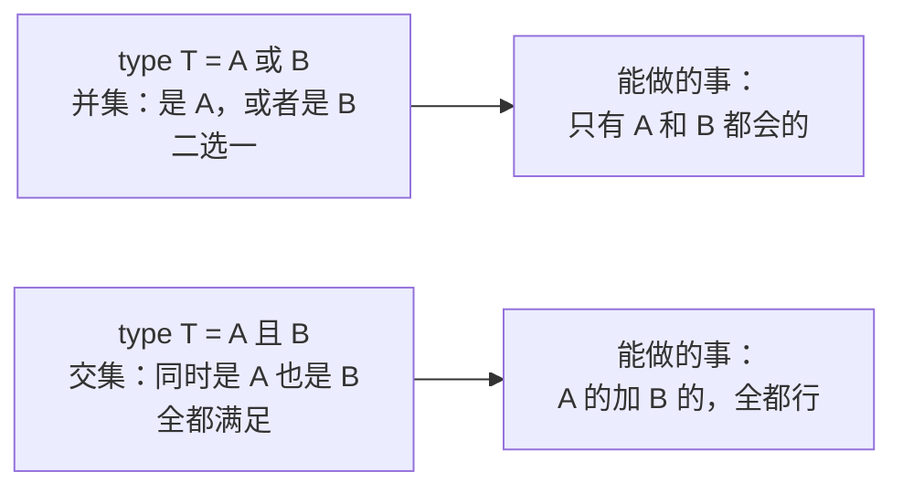
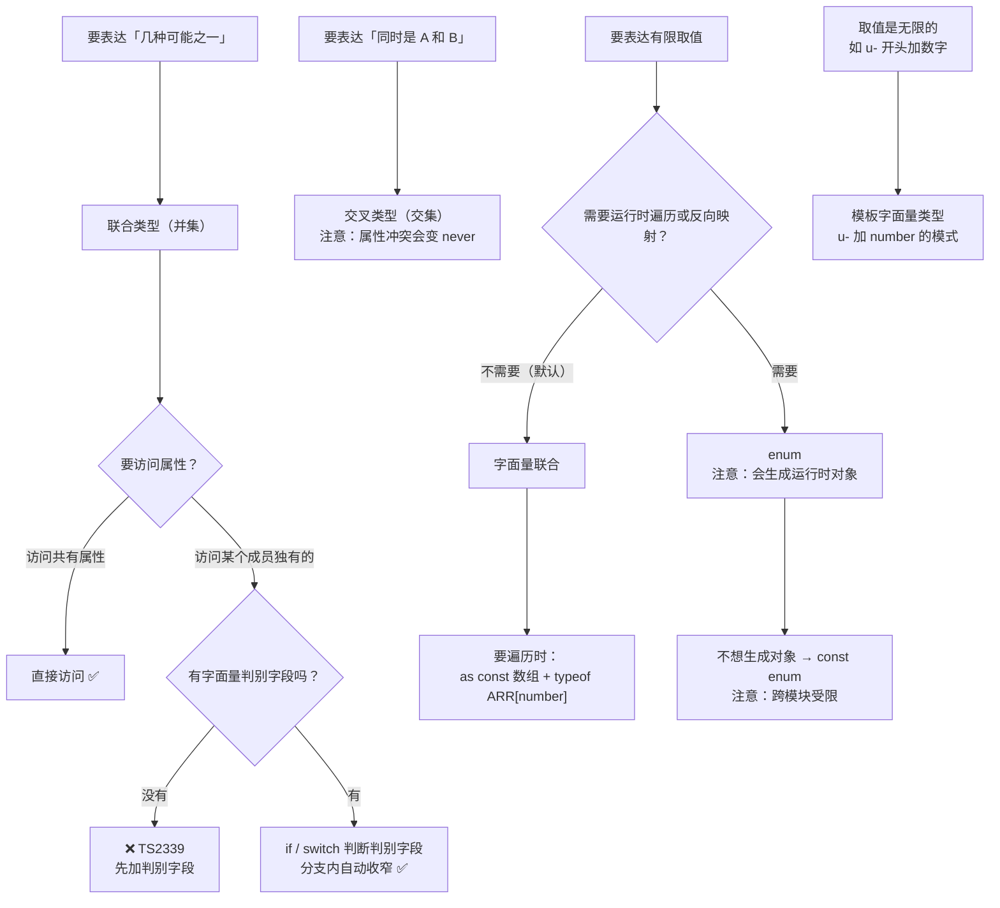

# 第 4 课：联合类型与字面量类型

> 所属阶段：阶段 2《收窄与控制流》｜ 水平：零基础 TS
> 本课知识点：联合类型、字面量类型与模板字面量类型、枚举与替代方案
> 故事情节：主角要表达"这个值只能是三种状态之一"，发现用 `string` 等于什么都没说
> ✅ 状态：已完成（2026-09-03）｜ 实操环境：Node.js v22.14.0 + TypeScript 7.0.2（**文中所有输出均为本机实测**）

## 🎯 本课目标

- 用**集合视角**理解联合类型，并为判别式联合写出正确的字段访问
- 用字面量类型与模板字面量类型表达"有限取值"与"动态字段名"
- 说清 `enum` 的运行时产物，并在「字面量联合 vs enum」之间给出有理由的选择

## 📌 知识点导航

| # | 知识点 | 关键点 | 状态 |
|---|--------|--------|------|
| 1 | 联合类型 | `\|` 的集合语义 / 联合上的属性访问规则 / 判别式联合 / 交叉类型 | ✅ |
| 2 | 字面量类型与模板字面量类型 | 字面量类型的来源 / `as const` / 模板字面量类型 / TS7 的 Unicode 码点变化 | ✅ |
| 3 | 枚举与替代方案 | `enum` 的运行时产物 / `const enum` / 用字面量联合替代 enum 的取舍 | ✅ |

## 📦 前置依赖（JS 概念）

| 用到的 JS 概念 | 掌握要求 | 回补 |
|---------------|---------|------|
| 对象字面量、属性访问 | 需理解 | 入门级，已覆盖（JS 课 1） |
| `switch` 语句 | 会用即可 | 入门级，已覆盖 |
| 模板字符串 | 知识点 2 的语法类比基础 | 已掌握（ES6 基础） |
| `Array.prototype.includes` | 第四幕做运行时校验 | 已掌握 |

---

## 第一幕：起源与场景引入

> 🏛️ **起源**：这一课的三种语法，来自三条完全不同的血脉。
>
> **联合类型**的思想来自类型论里的**和类型（sum type）**，ML / Haskell 家族叫它**代数数据类型（ADT）**。那边的写法是"这个类型要么是 A 要么是 B，并且可以用模式匹配把分支拆开"。TypeScript 把这套理论搬到了 JS 的普通对象上——**用一个普通字段当标签**，就得到了 TS 里最强大的建模工具：**判别式联合（discriminated union）**。
>
> **字面量类型**是 TS 相对 Java / C# 这类语言的**关键设计差异**：它把"值"提升成了"类型"。在 Java 里 `1` 只是个值，而在 TS 里 `1` 既能当值也能当类型。正是这一步，让"字符串的子集"可以被精确表达——`string` 有无限个取值，`"pending" | "paid"` 只有三个。
>
> **枚举 `enum`** 则是从 C / C# / Java 传统继承来的语法，TS 早期就引入了它。但它是个**异类**：TS 的整体定位是"擦除式类型"（课 1），而 `enum` **编译后会留下真实的运行时代码**。这个内在矛盾，正是本课知识点 3 要摊开讲的决策点。

**记住这段历史的三个关键点就够了**：联合来自"和类型"理论、字面量类型是 TS 把值当类型用的独门设计、`enum` 是唯一会留下运行时代码的类型语法。

好，回到你的项目。

> 🎬 **场景**：CSV + API 的双数据源导入跑通了（课 3 第四幕输出了三行干净的记录）。新需求来了：**订单要能流转状态**——待付款 → 已付款 → 已退款。

你写下状态机（`playground/lesson-04/bug.js`）：

```js
function nextStatus(status) {
  if (status === "pending") return "paid";
  if (status === "paid") return "refunded";
  return status;
}

console.log("pendng  ->", nextStatus("pendng"));   // 手滑拼错
console.log("PAID    ->", nextStatus("PAID"));     // 大小写不一致
console.log("已付款  ->", nextStatus("已付款"));   // 中文状态混进来

const order = { id: "o1", status: "pendng" };
if (order.status === "pending") {
  console.log("可以付款");
} else {
  console.log("订单状态异常，无法付款：", order.status);
}
```

**实测输出**（Node.js v22.14.0）：

```
pendng  -> pendng
PAID    -> PAID
已付款  -> 已付款
pending -> paid
订单状态异常，无法付款： pendng
```

**四个调用，三个是错的，而 JS 一次都没拦。** 拼错的 `pendng` 一路穿透到最后那个 `else`，用户看到"订单状态异常，无法付款"——但代码里写的明明是 `pending`。

问题出在 `status` 的类型是 `string`：它名义上"声明了类型"，实际上**什么都没说**。`string` 的取值是无限的，而你的业务里状态只有三种。**用一个无限的类型去表达三个取值，等于没表达。**

---

## 第二幕：认知冲突

你决定把状态收紧成三个值，然后立刻撞上三件怪事：

```ts
// 实验 A：收窄之后，属性为什么访问不了了？
type Circle = { radius: number };
type Square = { size: number };
type Shape = Circle | Square;
function area(s: Shape) {
  return s.radius;   // ❌ 报错：radius 不存在
}
// 但加一个 kind 字段之后，同样的访问就合法了？

// 实验 B：我想表达「所有 u- 开头的 id」，字面量能写完吗？
type UserId = "u-1" | "u-2" | "u-3" | ...   // 写不完啊

// 实验 C：既然字面量联合这么好，团队里为什么还有人用 enum？
enum Status { Pending, Paid }   // 它编译完还剩下什么？
```

这三个问题指向本课的**三个台阶**：

1. **联合到底是什么？** 为什么"或"在一起之后，能做的事反而变少了？
2. **字面量类型能表达多少？** 拼不出无限集合时怎么办？
3. **`enum` 和字面量联合，到底该选哪个？**

---

## 第三幕：层层揭示

> ⚠️ **本课的默认环境**（与前三课一致）：所有示例在 `playground/lesson-04/` 目录下执行，**没有 `tsconfig.json`**，直接 `npx tsc xxx.ts` 编译单个文件。TS 7.0.2 默认 `strict: true`。

### 知识点 1：联合类型

> 关键点：`|` 的集合语义 / 联合上的属性访问规则 / 判别式联合 / 交叉类型

#### 一句话定义

`A | B` 表示"这个值**要么是 A，要么是 B**"，语义上是**集合的并集**；`A & B` 表示"这个值**同时是 A 也是 B**"，是**集合的交集**。

#### 直觉建立（类比）

**一把瑞士军刀。**

刀上可能有螺丝刀、开瓶器、小刀。但**在你把它展开之前**，你不清楚手上的这一把是哪一种——所以此刻你唯一能安全做的事，只有**所有刀都支持的动作**：握着它、放进兜里。

这就是联合类型的核心体验：**当 TS 不知道具体是哪一个成员时，你只能做"所有成员都支持"的操作。**

> 💡 **类比的边界**：真实的军刀展开后，螺丝刀和小刀**同时在**（可以同时用）；但联合类型的值**同一时刻只能是其中一个成员**——绝不会"同时是 A 又是 B"（那是交叉类型 `&` 的事）。另外真实军刀你得手动展开才知道，而 TS 里你写一个 `if` 它自己就"展开"了（那是课 5 的收窄）。

#### 核心原理

**① `|` 是并集，`&` 是交集**



记住这个方向感：**联合让"能做的事"变少，交叉让"要满足的条件"变多。**

**② 联合上的属性访问：只能访问共有属性**（实测）

```ts
function f(id: string | number): number {
  return id.length;
  // ❌ error TS2339: Property 'length' does not exist on type 'string | number'.
  //      Property 'length' does not exist on type 'number'.
}
```

`string` 有 `length`，`number` 没有——所以联合上访问不了。反过来，`.toString()` 两者都有，就可以用。

**③ 判别式联合（Discriminated Union）——本课的重头戏**

先看**没有**判别字段时的窘境（实测）：

```ts
type Circle = { radius: number };
type Square = { size: number };
type Shape = Circle | Square;

function area(s: Shape): number {
  return s.radius;
  // ❌ error TS2339: Property 'radius' does not exist on type 'Shape'.
  //      Property 'radius' does not exist on type 'Square'.
}
```

TS 只知道 `s` 是"圆或方"，不敢让你碰 `radius`——**万一是方的呢？**

现在**加一个字面量类型的公共字段**当"标签"：

```ts
type Tagged = { kind: "circle"; radius: number } | { kind: "square"; size: number };

function taggedArea(s: Tagged): number {
  if (s.kind === "circle") return s.radius; // ✅ 这个分支里，s 已经收窄为圆
  return s.size;                             // ✅ 走到这里，只可能是方
}
```

**同一段逻辑，加了一个 `kind` 字段就从"报错"变成"完全安全"。**（实测：`unions-probe.ts` 的第 18 行报错、第 24 行通过，两行代码只差一个判别字段。）

构成判别式联合需要三个条件：

| 条件 | 说明 |
|------|------|
| 有一个**公共字段** | 每个成员都有，名字相同 |
| 这个字段的类型是**字面量类型** | 不是 `string`，而是 `"circle"` / `"square"` 这种具体值 |
| 各成员的该字段值**互不相同** | 否则区分不开 |

满足这三条，TS 就能在 `if` / `switch` 里**自动把类型收窄到对应的成员**——这就是课 5《类型收窄》要展开的核心机制，本课的判别式联合是它最重要的应用场景。

**④ 交叉类型 `&`：同时满足**

```ts
type Timestamped = { createdAt: string };
type Row = { id: string; score: number } & Timestamped;
const row: Row = { id: "u1", score: 98, createdAt: "2026-09-01" }; // 三个字段缺一不可
```

课 3 讲过：**属性冲突时交叉会静默变成 `never`**（实测 `Type 'number' is not assignable to type 'never'`），所以表达"继承"优先用 `interface extends`。

**⑤ 从常量数组生成联合类型**

这是本课最实用的技巧之一——**同一份取值，既当运行时数据用，又当类型用**：

```ts
const ORDER_STATUS = ["pending", "paid", "refunded"] as const;
type StatusFromList = (typeof ORDER_STATUS)[number]; // "pending" | "paid" | "refunded"

const s1: StatusFromList = "paid";     // ✅
const s2: StatusFromList = "shipped";  // ❌ error TS2322
```

`(typeof ARR)[number]` 这个语法叫**索引访问类型**，课 9 会正式展开，这里先会用即可。它的价值是：**取值只写一遍**，加状态时数组和类型一起变，不会漏。

#### 示例演示

`playground/lesson-04/unions.ts`（**实测零报错**）：

```ts
type Status = "pending" | "paid" | "refunded";
let orderStatus: Status = "pending";
orderStatus = "paid";

// 联合上的属性访问：只能访问共有属性
function format(id: string | number): string {
  return id.toString(); // ✅ string 和 number 都有 toString
}

// 判别式联合
type Result =
  | { ok: true; data: string[] }
  | { ok: false; error: string };

function handle(r: Result): string {
  if (r.ok) {
    return r.data.join(", "); // ✅ 这个分支里 r 收窄为 { ok: true; data: string[] }
  }
  return `failed: ${r.error}`; // ✅ 收窄为 { ok: false; error: string }
}

// 交叉类型
type Timestamped = { createdAt: string };
type Row = { id: string; score: number } & Timestamped;
const row: Row = { id: "u1", score: 98, createdAt: "2026-09-01" };

console.log(orderStatus, format(42));
console.log(handle({ ok: true, data: ["a", "b"] }));
console.log(handle({ ok: false, error: "timeout" }));
console.log(row);
```

**实测输出**：

```
paid 42
a, b
failed: timeout
{ id: 'u1', score: 98, createdAt: '2026-09-01' }
```

边界探测（`unions-probe.ts`，**实测 5 条报错**）：

```
unions-probe.ts(6,7): error TS2322: Type '"shipped"' is not assignable to type 'Status'.
unions-probe.ts(10,13): error TS2339: Property 'length' does not exist on type 'string | number'.
  Property 'length' does not exist on type 'number'.
unions-probe.ts(18,12): error TS2339: Property 'radius' does not exist on type 'Shape'.
  Property 'radius' does not exist on type 'Square'.
unions-probe.ts(30,32): error TS2322: Type 'number' is not assignable to type 'never'.
unions-probe.ts(36,7): error TS2322: Type '"shipped"' is not assignable to type '"paid" | "pending" | "refunded"'.
```

#### 常见误区

1. **"联合类型 = 同时是两个类型。"** —— 反了。联合是**二选一**；"同时是"是交叉 `&` 的语义。
2. **"联合类型的对象能访问任一成员的属性。"** —— 只能访问**所有成员共有**的属性，否则必须先判别（TS2339）。
3. **"对象联合只要字段不同就能自动判别。"** —— 不行，必须有**字面量类型**的公共判别字段。`{ radius } | { size }` 判别不了，`{ kind: "circle"; radius } | { kind: "square"; size }` 才行。
4. **"交叉类型比 `extends` 更好用。"** —— 属性冲突时交叉会静默产出 `never`，报错离现场很远。表达"继承"优先 `extends`。

#### 一句话记住

> **联合 = 二选一，能做的事取交集；判别字段一加，`if` 里就自动知道是哪一个。**

#### 官方文档

- 联合类型：https://www.typescriptlang.org/docs/handbook/2/everyday-types.html#union-types
- 判别式联合：https://www.typescriptlang.org/docs/handbook/2/narrowing.html#discriminated-unions

---

### 知识点 2：字面量类型与模板字面量类型

> 关键点：字面量类型的来源 / `as const` / 模板字面量类型 / TS7 的 Unicode 码点变化

#### 一句话定义

**字面量类型**把类型收紧到**单个具体值**（`"pending"`、`42`、`true`）；**模板字面量类型**用模板字符串的语法（`\`on${T}\``）**生成新的字符串字面量类型**。

#### 直觉建立（类比）

**从"一整条数轴"到"骰子的六个面"。**

普通类型 `number` 像一整条数轴，取值无限；字面量联合 `1 | 2 | 3 | 4 | 5 | 6` 像骰子的六个面——**有限、可枚举、能一个个数完**。你描述业务时，绝大多数"取值"其实是后者：订单状态、HTTP 方法、按钮尺寸。

模板字面量类型则像**填空题模板**：`"on" + 事件名` 这个模板一摆，`onclick`、`onchange` 就自动生成了。

> 💡 **类比的边界**：骰子有实体、能拿在手上；字面量类型**只存在于编译期**，运行时该是字符串还是字符串（课 1 的擦除）。另外模板字面量类型不是字符串拼接函数——它在**类型层面**展开，你不能在运行时"调用"它。

#### 核心原理

**① 字面量类型的三种来源**

| 来源 | 写法 | 推导结果 |
|------|------|---------|
| `const` 声明 | `const a = "pending"` | `"pending"`（课 2 讲过：`let` 会宽化成 `string`） |
| `as const` | `const b = ["a","b"] as const` | `readonly ["a", "b"]` |
| 显式标注 | `let c: "paid" \| "refunded" = "paid"` | 标注的那个联合 |

**② 用字面量联合表达"有限取值"**

这就是第一幕那个状态机 bug 的正解：`type OrderStatus = "pending" | "paid" | "refunded"`。拼错、大小写、中文，全都不再是合法值（第四幕实测）。

**③ 模板字面量类型**

语法和 JS 模板字符串一模一样，只是放在类型位置：

```ts
type EventName = "click" | "change";
type HandlerName = `on${EventName}`; // "onclick" | "onchange"
const handler: HandlerName = "onclick";   // ✅
const bad: HandlerName = "onhover";       // ❌ 实测报错
```

**④ 联合之间会自动做笛卡尔积**（模板里放多个联合时）：

```ts
type Vertical = "top" | "bottom";
type Horizontal = "left" | "right";
type Corner = `${Vertical}-${Horizontal}`;
// = "top-left" | "top-right" | "bottom-left" | "bottom-right"
```

**⑤ 与原始类型组合 = 模式匹配**

```ts
type UserId = `u-${number}`;
const id1: UserId = "u-1001";   // ✅
const id2: UserId = "x-1001";   // ❌ 前缀不对
const id3: UserId = "u-abc";    // ❌ 后缀不是数字
```

这解决了第二幕实验 B 的困境——**不用把无限多个值写完**，用一个模式就能表达"所有 `u-` 加数字的字符串"。

**⑥ 内置的字符串变换类型**

`Uppercase` / `Lowercase` / `Capitalize` / `Uncapitalize` 四个，配合模板字面量很好用：

```ts
type Capped = Capitalize<"pending">;   // "Pending"
type Getter = `get${Capitalize<Field>}`; // "getId" | "getScore"
```

> ⚠️ **版本提示（Unicode 码点）**：**TS 7 改变了模板字面量类型推断字符串的方式**——以前它按 JavaScript 的 UTF-16 索引行为切分，遇到 emoji 这类"两个码元表示一个字符"的情况会切出半个代理对；**7.0 改为按 Unicode 码点切分**。官方给出的例子：
>
> ```ts
> type HeadTail<S> = S extends `${infer Head}${infer Tail}` ? [Head, Tail] : never;
> type Result = HeadTail<"😀abc">;
> //   TS 7.0：  ["😀", "abc"]
> //   7.0 之前： ["\ud83d", "\ude00abc"]   ← 被拆成了半个代理对
> ```
>
> 官方明确说这是一个**破坏性变更**（breaking change）：如果你的类型体操**刻意**按 UTF-16 码元处理字符串（比如某些求字符串长度的 `Length` 工具类型），升级后行为会变。日常业务代码基本不受影响。
>
> （核查于 2026-09，来源：官方博客 Announcing TypeScript 7.0「Template Literal Types Now Preserve Unicode Code Points」一节）

#### 示例演示

`playground/lesson-04/literals.ts`（**实测零报错**）：

```ts
// ① 字面量类型的三种来源
const fromConst = "pending";                      // const 推导为 "pending"
const fromAsConst = ["a", "b"] as const;          // as const 把每个值锁成字面量
let fromAnnotation: "paid" | "refunded" = "paid"; // 显式标注

// ② 模板字面量类型
type EventName = "click" | "change";
type HandlerName = `on${EventName}`; // "onclick" | "onchange"
const handler: HandlerName = "onclick";

// ③ 笛卡尔积展开
type Vertical = "top" | "bottom";
type Horizontal = "left" | "right";
type Corner = `${Vertical}-${Horizontal}`; // 4 种组合
const corner: Corner = "top-left";

// ④ 内置字符串变换
type Upper = Uppercase<"pending">;   // "PENDING"
type Capped = Capitalize<"pending">; // "Pending"
const upper: Upper = "PENDING";
const capped: Capped = "Pending";

// ⑤ 模式匹配
type UserId = `u-${number}`;
const id1: UserId = "u-1001";

console.log(fromConst, fromAsConst, fromAnnotation, handler, corner, upper, capped, id1);
```

**实测输出**：

```
pending [ 'a', 'b' ] paid onclick top-left PENDING Pending u-1001
```

边界探测（`literals-probe.ts`，**实测 5 条报错**）：

```
literals-probe.ts(7,7): error TS2322: Type '"onhover"' is not assignable to type '"onchange" | "onclick"'.
literals-probe.ts(8,7): error TS2322: Type '"on"' is not assignable to type '"onchange" | "onclick"'.
literals-probe.ts(12,1): error TS2322: Type '"paid"' is not assignable to type '"pending"'.
literals-probe.ts(16,7): error TS2322: Type '"x-1001"' is not assignable to type '`u-${number}`'.
literals-probe.ts(17,7): error TS2322: Type '"u-abc"' is not assignable to type '`u-${number}`'.
```

第一条最有意思：报错信息里写的是 `"onchange" | "onclick"`——**编译器已经把模板展开成了具体的联合**。

#### 常见误区

1. **"`let x = "pending"` 得到的是字面量类型。"** —— 不，`let` 会**宽化**成 `string`（课 2 知识点 1）。要字面量用 `const` 或 `as const`。
2. **"模板字面量类型能拼接出无限集合。"** —— 与原始类型组合（`` `u-${number}` ``）确实能表达无限集合，但那本质上变成了**模式匹配**，不再是有限联合。
3. **"字面量类型在运行时也生效。"** —— 编译后一个字符都不剩。运行时校验仍要靠代码（第四幕的 `toStatus`）。

#### 一句话记住

> **字面量类型把"无限"收成"有限几个"；模板字面量类型让你用模板生成它们，或用模式匹配表达无限集合。**

#### 官方文档

- 字面量类型：https://www.typescriptlang.org/docs/handbook/2/everyday-types.html#literal-types
- 模板字面量类型：https://www.typescriptlang.org/docs/handbook/2/template-literal-types.html

---

### 知识点 3：枚举与替代方案

> 关键点：`enum` 的运行时产物 / `const enum` / 用字面量联合替代 enum 的取舍

#### 一句话定义

`enum` 是 TS 提供的枚举语法，它**会生成一个真实的运行时对象**——这是 TS 里少数"编译后不消失"的类型语法。

#### 直觉建立（类比）

**字面量联合 = 写在纸上的清单**（检查时对照，用完就扔，不占地方）；**`enum` = 做了一块金属铭牌**（真的把牌子做出来了，占一份实物，还能挂在墙上给大家看、还能反过来查编号）。

需要"运行时也有这个东西"时（比如要遍历所有状态渲染下拉框），铭牌有用；只是想让编译器检查时，纸片就够了——**白做的铭牌是要占空间的（产物体积）**。

> 💡 **类比的边界**：铭牌是"实物"，而 `enum` 编译出的对象虽然真实存在，但它仍是**普通 JS 对象**——可以被外部任意修改、可以传进不相关的值。另外 `const enum` 相当于"不做铭牌，用的时候直接把内容抄上去"，连对象都不生成。

#### 核心原理

**① `enum` 的运行时产物（本课最反直觉的一点）**

源码（`enum.ts`）：

```ts
enum OrderStatus { Pending, Paid, Refunded }   // 数字 enum，值 0/1/2
enum Direction { Up = "UP", Down = "DOWN" }    // 字符串 enum
```

**编译后的 `enum.js`（实测产物）**：

```js
var OrderStatus;
(function (OrderStatus) {
    OrderStatus[OrderStatus["Pending"] = 0] = "Pending";
    OrderStatus[OrderStatus["Paid"] = 1] = "Paid";
    OrderStatus[OrderStatus["Refunded"] = 2] = "Refunded";
})(OrderStatus || (OrderStatus = {}));
var Direction;
(function (Direction) {
    Direction["Up"] = "UP";
    Direction["Down"] = "DOWN";
})(Direction || (Direction = {}));
```

**`interface`、`type`、`: string` 全都擦除得干干净净（课 1 实测），而 `enum` 留下了整整两个 IIFE。**

这是理解 `enum` 的钥匙：它不是"类型"，它是"**一个类型 + 一个运行时对象**"。

**② 数字 enum 有反向映射，字符串 enum 没有**

看产物第一行：`OrderStatus[OrderStatus["Pending"] = 0] = "Pending"`——它赋了**两次值**，于是既能 `OrderStatus.Pending === 0`，也能 `OrderStatus[0] === "Pending"`。

实测运行：

```
s = 1 d = UP
OrderStatus[0] = Pending
```

字符串 enum 只赋一次值，所以 `Direction["UP"]` 是 `undefined`。

**③ `enum` 是名义类型：不接受裸值**（实测）

```ts
enum Str { X = "x" }
const s1: Str = "x";     // ❌ error TS2322: Type '"x"' is not assignable to type 'Str'.
const s2: Str = Str.X;   // ✅

enum Other { Y = "x" }
const cross: Str = Other.Y;  // ❌ error TS2322: Type 'Other' is not assignable to type 'Str'.
```

**即使值一模一样（都是 `"x"`），也不兼容。** 这是 `enum` 与字面量联合最本质的行为差异——`enum` 是**名义**的，字面量联合是**结构**的。

这条有好处也有坏处：

| 面 | 说明 |
|----|------|
| ✅ 好处 | 防止手滑传裸字符串，两个同名 enum 不会互相污染 |
| ❌ 坏处 | **与外部数据对接很麻烦**——API 返回的 `"x"` 必须显式转换，通常需要断言 |

**④ 数字 enum 的一个残留行为**（实测）

```ts
enum Num { A, B }
const n1: Num = 42;                     // ❌ error TS2322: Type '42' is not assignable to type 'Num'
declare const someNumber: number;
const n2: Num = someNumber;             // ✅ 通过（数字 enum 仍接受 number 变量）
```

数字**字面量**被拦住了（`42` 不在枚举内），但 `number` **类型**的变量仍能赋进来。这是数字 enum 历史设计的残留——**字符串 enum 没这个问题**，这也是推荐用字符串 enum（或干脆用字面量联合）的原因之一。

**⑤ `const enum`：内联，不生成对象**

```ts
const enum ConstEnum { P = "p", Q = "q" }
const c: ConstEnum = ConstEnum.P;
```

**编译产物（实测）**：

```js
const c = "p" /* ConstEnum.P */;
```

值被**直接内联**，且 `ConstEnum` 对象**完全不存在**于产物中。这是 `enum` 唯一不产生运行时代码的形式。

> ⚠️ **代价**：`const enum` 依赖"编译期能看到定义"才能内联。跨模块使用时，在 `isolatedModules`（TS 7 默认开启，课 10 会讲）下会受限——单个文件独立编译时看不到别的模块的 enum 定义。所以跨模块共享的枚举，**别用 `const enum`**。

**⑥ 决策清单：enum 还是字面量联合？**（本课的**决策参考**）

| 维度 | 字面量联合 | `enum` |
|------|-----------|-------|
| **运行时产物** | **零**（完全擦除） | **生成对象**（数字 enum 还有反向映射） |
| 与外部数据（API / JSON）对接 | **天然兼容**（值就是字符串） | 需要断言或转换（名义类型） |
| 遍历所有取值 | 需另建 `as const` 数组 | **自带对象，可直接遍历** |
| 反向映射（值 → 名） | 无 | 数字 enum **有** |
| 防止手滑传裸值 | 靠字面量本身 | **名义性更强**（不同 enum 互不兼容） |
| 跳转定义 / 重命名 | 跳转到你写类型的地方 | 可跳转到 enum 成员 |
| tree-shaking | 无产物，天然友好 | 对象可能被整体保留 |
| 与"擦除式类型"的一致性 | **一致** | **不一致**（这是争议根源） |

**推荐结论**：

| 场景 | 选谁 |
|------|------|
| 绝大多数业务状态、配置项、字符串取值 | **字面量联合** |
| 需要遍历取值 + 要类型 | **`as const` 数组 + `typeof ARR[number]`**（两者兼得） |
| 需要**反向映射**（日志里要把 `0` 显示成 `"Pending"`） | `enum` |
| 与后端协议严格绑定的数值码（如错误码 `10001`） | `const enum` 或常量对象 |
| 团队已有规范 | 服从规范（一致性 > 个人偏好） |

> 🔧 **一句话建议**：**默认用字面量联合**；需要运行时遍历时，用 `as const` 数组 + 索引访问类型生成联合——**一份取值，两种用途**，且零运行时产物。`enum` 只在真的需要它"是个对象"时才用。

#### 示例演示

`playground/lesson-04/enum.ts`（**实测零报错**，产物见上文）：

```ts
enum OrderStatus { Pending, Paid, Refunded }
enum Direction { Up = "UP", Down = "DOWN" }

const s: OrderStatus = OrderStatus.Paid;
const d: Direction = Direction.Up;

console.log("s =", s, "d =", d);
console.log("OrderStatus[0] =", OrderStatus[0]);  // 反向映射
```

**实测输出**：

```
s = 1 d = UP
OrderStatus[0] = Pending
```

边界探测（`enum-probe.ts`，**实测 3 条报错**）：

```
enum-probe.ts(9,7): error TS2322: Type '42' is not assignable to type 'Num'.
enum-probe.ts(16,7): error TS2322: Type '"x"' is not assignable to type 'Str'.
enum-probe.ts(23,7): error TS2322: Type 'Other' is not assignable to type 'Str'.
```

三条分别对应：**不在枚举内的数字**、**裸字符串**、**另一个 enum**——这就是 `enum` 名义性的三面墙。

#### 常见误区

1. **"`enum` 和别的类型一样会被擦除。"** —— 不会。它生成真实的运行时对象（本课实测产物）。这是 TS 里最大的例外之一。
2. **"字符串 enum 可以直接用字符串赋值。"** —— 不行，必须用 `Enum.Member`（TS2322）。
3. **"数字 enum 很安全。"** —— 数字**字面量**确实被拦了，但 `number` 变量仍能赋进去（实测）。要严格就用字符串 enum 或字面量联合。
4. **"`const enum` 总是更好。"** —— 它不生成对象，但跨模块在 `isolatedModules` 下受限。共享枚举别用它。

#### 一句话记住

> **`enum` 是「类型 + 运行时对象」的二合一，这是它与 TS 擦除原则唯一的冲突点；只是想让编译器检查时，字面量联合更轻、更 compatible。**

#### 官方文档

- 枚举：https://www.typescriptlang.org/docs/handbook/enums.html
- 何时不用 enum（Handbook Objects 章节）：https://www.typescriptlang.org/docs/handbook/2/objects.html

---

## 第四幕：实操验证

回到第一幕那个订单状态机。按本课的规矩重写（`playground/lesson-04/scenario.ts`）：

```ts
// ① 状态只有三种取值：拼错、大小写、中文，全都不再是合法值
type OrderStatus = "pending" | "paid" | "refunded";

// ② 需要遍历 / 校验时，从常量数组生成同一份联合
const ORDER_STATUS = ["pending", "paid", "refunded"] as const;
type StatusFromList = (typeof ORDER_STATUS)[number];

function nextStatus(status: OrderStatus): OrderStatus {
  switch (status) {
    case "pending":  return "paid";
    case "paid":     return "refunded";
    case "refunded": return "refunded";
  }
}

// ③ 判别式联合：不同状态携带不同字段
type Order =
  | { status: "pending"; id: string; amount: number }
  | { status: "paid"; id: string; amount: number; paidAt: string }
  | { status: "refunded"; id: string; amount: number; refundedAt: string };

function describe(order: Order): string {
  switch (order.status) {
    case "pending":  return `${order.id}: pending ${order.amount}`;
    case "paid":     return `${order.id}: paid at ${order.paidAt}`;
    case "refunded": return `${order.id}: refunded at ${order.refundedAt}`;
  }
}

// ④ 外部进来的字符串：先运行时校验，再断言成 OrderStatus
function toStatus(raw: string): OrderStatus | null {
  return (ORDER_STATUS as readonly string[]).includes(raw) ? (raw as OrderStatus) : null;
}

const orders: Order[] = [
  { status: "pending", id: "o1", amount: 99 },
  { status: "paid", id: "o2", amount: 199, paidAt: "2026-09-01" },
  { status: "refunded", id: "o3", amount: 299, refundedAt: "2026-09-02" },
];

for (const order of orders) {
  console.log(describe(order));
}

console.log("next(pending) =", nextStatus("pending"));
console.log("toStatus(PAID) =", toStatus("PAID"));
console.log("toStatus(paid) =", toStatus("paid"));
```

**实测结果**：`npx tsc scenario.ts` **零报错**，运行 `node scenario.js`：

```
o1: pending 99
o2: paid at 2026-09-01
o3: refunded at 2026-09-02
next(pending) = paid
toStatus(PAID) = null
toStatus(paid) = paid
```

**第一幕那三个静默穿透，全部消失了。**

再看四道防线（`scenario-guard.ts`，**实测 5 条报错**）：

```
scenario-guard.ts(11,7): error TS2820: Type '"pendng"' is not assignable to type 'OrderStatus'. Did you mean '"pending"'?
scenario-guard.ts(14,7): error TS2820: Type '"PAID"' is not assignable to type 'OrderStatus'. Did you mean '"paid"'?
scenario-guard.ts(17,7): error TS2322: Type '"已付款"' is not assignable to type 'OrderStatus'.
scenario-guard.ts(21,16): error TS2339: Property 'paidAt' does not exist on type 'Order'.
  Property 'paidAt' does not exist on type '{ status: "pending"; id: string; amount: number; }'.
scenario-guard.ts(26,7): error TS2322: Type 'string' is not assignable to type 'OrderStatus'.
```

| 第一幕的事故 | JS 里的结局 | TS 里的结局 |
|-------------|------------|------------|
| `"pendng"` 拼错 | 静默穿透到 `else` 分支 | **TS2820 当场拦下，还问"是不是想写 pending"** |
| `"PAID"` 大小写 | 静默穿透 | **TS2820 当场拦下，提示 `"paid"`** |
| `"已付款"` 中文 | 静默穿透 | **TS2322 当场拦下** |
| 不判断 `status` 就访问 `paidAt` | 拿到 `undefined` | **TS2339 当场拦下** |
| 外部 `string` 直接当状态 | 什么都可能发生 | **TS2322 拦下，逼你先校验** |

> ✅ **注意第 ④ 条 `toStatus`**：外部数据（API 返回的字符串）**不能**直接当成 `OrderStatus`——因为类型只存在于编译期，运行时它就是个普通字符串（课 1 的擦除）。正确做法是**先运行时校验（`includes`），再断言**。
>
> 这里的 `as OrderStatus` 是 `as` 的**正当用法**（课 3 知识点 3 讲过）：你用 `includes` 证明了它一定是这三个值之一，编译器看不懂 `includes` 的语义，所以由你来担保。**顺序不能反**——先校验，后断言。

---

## 第五幕：体系收束

> 📍 **全局定位**：本课是**阶段 2 的地基**。判别式联合是 TS 最强大的建模工具，而"把状态写进类型"这个动作，直接决定了下一课能不能施展。
>
> 这条主线会这样走下去：
> - **课 5《类型收窄》（下一课）**：本课的 `if (s.kind === "circle")` 让类型自动变窄——那套机制会展开成**完整的收窄工具箱**（`typeof`、`in`、`instanceof`、类型守卫）和**穷尽性检查**（用 `never` 兜底让漏分支编译报错）。**那是整门课的分水岭。**
> - **课 6**：`unknown` 之所以难用，是因为它是"所有类型的联合"——**用本课的联合视角看它，就不神秘了**；`JSON.parse` 的返回值正是本课第 ④ 条要处理的信任边界问题
> - **课 9**：模板字面量类型 + 映射类型 + 条件类型，三者组合才能真正做类型编程（比如自动给所有字段生成 getter 类型）
> - **阶段 5 课 15**："状态该用 enum 还是字面量联合"这类决策，会收敛成团队的**类型规范**

**现在你会了什么**：

- 能用**集合视角**解释 `|`（并集）与 `&`（交集），并预判联合类型上哪些属性能访问
- 能写出**判别式联合**（公共字面量字段 + 各分支独有字段），让 `if` / `switch` 里的类型自动变精确
- 能用**字面量类型**表达有限取值，用**模板字面量类型**生成组合或做模式匹配
- 能说清 `enum` 的**运行时产物**、名义性与 `const enum` 的内联行为，并在「enum vs 字面量联合」之间给出有理由的选择

> 🔗 **下一步**：课 5《类型收窄》——**本阶段的核心，也是全课程的分水岭**。你已经能让类型表达"几种可能"，接下来学怎么把"几种可能"变成"一种确定"：`typeof`、`in`、`instanceof`、自定义类型守卫，以及那个让漏分支编译不过的**穷尽性检查**。

---

## 🐞 常见误区

1. **"联合类型 = 同时是两个类型。"** → 联合是**二选一**；"同时是"是交叉 `&`。
2. **"联合类型的对象能访问任一成员的属性。"** → 只能访问**共有属性**，或先判别（TS2339）。
3. **"对象联合能自动判别。"** → 必须有**字面量类型的公共判别字段**，`{radius} | {size}` 判别不了。
4. **"`let x = "pending"` 拿到的是字面量类型。"** → `let` 会宽化成 `string`，要字面量用 `const` / `as const` / 显式标注。
5. **"`enum` 和别的类型一样会被擦除。"** → 不会，它生成真实的运行时对象；`const enum` 才内联。
6. **"字符串 enum 可以用裸字符串赋值。"** → 不行（TS2322），这是它名义性的一面。
7. **"外部数据校验完就不需要类型了。"** → 需要：先运行时校验，再断言成精确类型（顺序不能反）。

## 一图总结



> 关键记忆点：① 联合是并集，能做的事取交集；② 判别字段一加，`if` 里自动精确；③ `enum` 是唯一留下运行时对象的类型语法。

## 课后小测

**Q1**：下面三个函数，哪些能编译通过？

```ts
type Shape = { radius: number } | { size: number };
type Tagged = { kind: "circle"; radius: number } | { kind: "square"; size: number };

function area1(s: Shape): number { return s.radius; }   // ①

function area2(s: Tagged): number { return s.radius; }  // ②

function area3(s: Tagged): number {                     // ③
  if (s.kind === "circle") return s.radius;
  return s.size;
}
```

- A. 只有 ③
- B. ② 和 ③
- C. ①②③ 全都行
- D. 只有 ①

<details><summary>答案与解析</summary>

**答案：A**。

- **① 报错**：联合上只能访问**所有成员共有**的属性，`radius` 不在 `{ size }` 上 → TS2339
- **② 也报错**：这是最容易想错的一条——**加了判别字段 ≠ 能直接访问独有属性**。此刻编译器还不知道 `s` 是哪一个成员，照样报 TS2339

  实测（`unions-probe2.ts` 第 9 行）：
  ```
  error TS2339: Property 'radius' does not exist on type 'Tagged'.
    Property 'radius' does not exist on type '{ kind: "square"; size: number; }'.
  ```

- **③ 通过**：判断了 `kind` 之后，每个分支内的类型**自动收窄**到对应成员（实测 `unions-probe.ts` 第 24 行零报错）

**教训**：判别式联合的价值不是"加了字段就能用"，而是"**加了字段 + 判断了字段**"之后，分支内自动变精确。而"判断之后自动变窄"这套机制，正是下一课《类型收窄》的主题。

</details>

**Q2**：`type HandlerName = \`on${"click" | "change"}\`` 展开后等价于什么？

- A. `string`
- B. `"onclick" | "onchange"`
- C. `` `on${string}` ``
- D. `"on"`

<details><summary>答案与解析</summary>

**答案：B**。实测报错信息直接给出了答案：`Type '"onhover"' is not assignable to type '"onchange" | "onclick"'`——编译器已经把模板展开成了具体的字面量联合。

多个联合同时出现在模板里时会做**笛卡尔积**：`` `${"top"|"bottom"}-${"left"|"right"}` `` 展开为 4 个值。

C 是"模板里放 `string` / `number` 等原始类型"时的结果（变成模式匹配，如 `` `u-${number}` ``），注意区分。

</details>

**Q3**：团队要选"订单状态"的表达方式，下列哪个理由**支持用字面量联合**而非 `enum`？

- A. 需要在日志里把 `0` 反查成 `"Pending"`（反向映射）
- B. 状态值来自后端 API 的 JSON 字符串，希望直接对接
- C. 想让两个不同的枚举类型即使值相同也不兼容
- D. 需要在运行时遍历所有状态渲染下拉框，且不想额外维护数组

<details><summary>答案与解析</summary>

**答案：B**。

- A 支持 `enum`：**只有数字 enum 有反向映射**（实测 `OrderStatus[0] === "Pending"`）
- B 支持字面量联合：`enum` 是名义类型，实测 `const s: Str = "x"` 报 TS2322，**API 返回的字符串无法直接赋值**，必须断言或转换；字面量联合本身就是字符串，天然兼容
- C 支持 `enum`：这是 `enum` 名义性的好处（实测两个值相同的 enum 互不兼容）
- D 支持 `enum`：它自带运行时对象可直接遍历；不过用 **`as const` 数组 + `typeof ARR[number]`** 也能同时满足"可遍历 + 有类型 + 零产物"

默认建议：**字面量联合**；要遍历就用 `as const` 数组生成联合。

</details>

## 🚀 下一批接力提示词

> 学完本课后，**复制下面这段文字发给 AI**，即可无缝进入下一批（无需重新描述上下文）：

```
继续学 TypeScript。我的学习档案在 frontend/typescript-core/00-学习档案.md，
刚学完阶段 2《收窄与控制流》的课 4《联合类型与字面量类型》三个知识点
（联合类型 / 字面量类型与模板字面量类型 / 枚举与替代方案），
请按大纲继续讲解下一课《类型收窄》。
```

## 🧭 课程导航

⬅️ **上一课**：[课 3：对象类型与结构化类型](../../1-类型思维启蒙/lessons/lesson-03-对象类型与结构化类型.md)

➡️ **下一课**：[课 5：类型收窄](lesson-05-类型收窄.md)（本阶段核心 · 全课程分水岭）

📚 **返回目录**：[课程目录](../../02-课程目录.md)

---

## 附：本课示例文件清单

所有示例位于 `playground/lesson-04/`，均可直接 `npx tsc <文件名>` 复现：

| 文件 | 用途 | 预期结果 |
|------|------|---------|
| `bug.js` | 第一幕：JS 状态机的静默穿透 | 直接 `node bug.js` 运行 |
| `unions.ts` | 知识点 1：联合类型与判别式联合主示例 | 零报错，可运行 |
| `unions-probe.ts` | 知识点 1：属性访问 / 判别字段 / 交叉冲突 | 5 条报错（故意） |
| `unions-probe2.ts` | 知识点 1：判别式联合「不判断」时同样报错 | 1 条报错（故意） |
| `literals.ts` | 知识点 2：字面量与模板字面量类型主示例 | 零报错，可运行 |
| `literals-probe.ts` | 知识点 2：模板展开与模式匹配边界 | 5 条报错（故意） |
| `enum.ts` | 知识点 3：enum 及其运行时产物 | 零报错；看 `enum.js` 看产物 |
| `enum-probe.ts` | 知识点 3：enum 的名义性三面墙 | 3 条报错（故意） |
| `enum-probe2.ts` | 知识点 3：`const enum` 内联与数字 enum 边界 | 零报错；看产物确认内联 |
| `scenario.ts` | 第四幕：订单状态机完整实现 | 零报错，输出三行订单 |
| `scenario-guard.ts` | 第四幕：四道防线验证 | 5 条报错（故意） |
