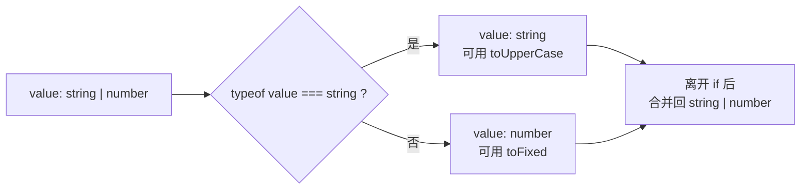
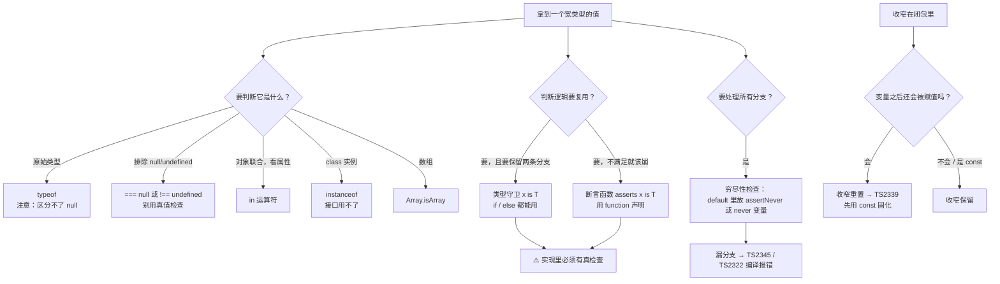

# 第 5 课：类型收窄

> 所属阶段：阶段 2《收窄与控制流》｜ 水平：零基础 TS
> 本课知识点：内置收窄手段、自定义类型守卫与断言函数、控制流分析与穷尽性检查
> 故事情节：主角写了一个 `if`，后面的代码里类型**自己变窄了**——第一次感觉编译器在"思考"
> ✅ 状态：已完成（2026-09-03）｜ 实操环境：Node.js v22.14.0 + TypeScript 7.0.2（**文中所有输出均为本课本机实测**）
> ⚠️ **本课是阶段 2 核心，也是全课程的分水岭**

## 🎯 本课目标

- 针对一个值选出正确的收窄方式（typeof / 真值 / 相等 / instanceof / in），并说清各自适用的类型范围
- 为外部数据写自定义类型守卫 `x is T` 与断言函数 `asserts x is T`
- 用 `never` 兜底实现 `switch` 的穷尽性检查——漏一个分支就编译不过

## 📌 知识点导航

| # | 知识点 | 关键点 | 状态 |
|---|--------|--------|------|
| 1 | 内置收窄手段 | typeof / 真值 / 相等 / instanceof / in 五种收窄 / 各自适用类型与盲区 | ✅ |
| 2 | 自定义类型守卫与断言函数 | `x is T` 谓词 / `asserts x is T` / 断言函数的显式标注要求 / 守卫"说谎"的后果 | ✅ |
| 3 | 控制流分析与穷尽性检查 | 可达性与收窄传播 / `never` 兜底 / `switch` 穷尽报错 / 闭包里的收窄重置 | ✅ |

## 📦 前置依赖（JS 概念）

| 用到的 JS 概念 | 掌握要求 | 回补 |
|---------------|---------|------|
| `typeof` / `instanceof` 运算符 | 需理解 | [JS 课 1 类型检测的四种方式](../javascript-core/stages/1-值与作用域/lessons/lesson-01-变量与类型.md) ✅ 已学 |
| `class` 与 `instanceof` 的关系 | 会用即可 | 本课只借 `instanceof` 做收窄，机制在课 7 展开 |
| `switch` 语句 | 会用即可 | — |
| `in` 运算符（判断属性是否存在） | 会用即可 | 入门级 |
| `throw` 与 `try` / `catch` | 会用即可 | 断言函数靠抛错工作 |
| 闭包与回调 | 会用即可 | 知识点 3 的「闭包里的收窄重置」用到 |

---

## 第一幕：起源与场景引入

> 🏛️ **起源**：本课的三样东西，都不是 TS 发明的，而是 TS 把编译原理与类型论的成熟成果**搬进了主流工业语言**。
>
> **控制流分析（CFA）**来自编译器的**数据流分析**——1970 年代编译器就会沿着程序的分支路径，追踪"在这个程序点上，这个变量可能是什么"。TS 把这套技术用在了**类型**上：于是你写一个 `if`，后面的代码里类型就变了。
>
> **"类型随测试而变窄"**这个思想，在函数式语言圈子里叫 **occurrence typing**（出现类型），最早系统化于 Typed Racket。它的洞见很朴素：**`if` 的条件一旦成立，就给"值是什么"提供了信息，类型系统没有理由忽略它。**
>
> **穷尽性检查**来自 ML / Haskell 的**模式匹配完整性检查**——那边你漏写一个 case，编译器会直接警告。TS 没有原生模式匹配，但用 `never` 兜底能模拟出同样的效果。
>
> 换句话说，**本课学的是"让编译器跟着你的 `if` 一起思考"**。这也是为什么它被称作全课程的分水岭：在此之前你是在"写类型"，从此以后你是在"用类型"。

**记住一句话就够了**：`if` 不只是控制程序走向，它**同时也在告诉编译器"这里的值变窄了"**。

好，回到你的项目。

> 🎬 **场景**：课 4 把订单状态从 `string` 收紧成了三个字面量，拼错被拦住了。但新代码一上线，还是出了三件事（`playground/lesson-05/bug.js`）：

```js
// 场景一：switch 漏了分支
function nextStatus(status) {
  switch (status) {
    case "pending": return "paid";
    case "paid": return "refunded";
    // 忘了 refunded
  }
}
console.log("nextStatus(refunded) =", nextStatus("refunded"));

// 场景二：判断不全
function describeResult(result) {
  if (typeof result === "string") return "error: " + result;
  return "ok: " + result.amount;   // result 是 null 时炸
}
try { describeResult(null); } catch (e) { console.log("describeResult(null) ->", e.constructor.name + ": " + e.message); }

// 场景三：真值判断把合法的 0 也排除了
function discount(count) {
  if (count) return "count = " + count;
  return "no count";
}
console.log("discount(0) =", discount(0));
```

**实测输出**（Node.js v22.14.0）：

```
nextStatus(refunded) = undefined
ok: 99
error: timeout
describeResult(null) -> TypeError: Cannot read properties of null (reading 'amount')
discount(0) = no count
discount(3) = count = 3
```

三个事故，三种不同的"漏"：

1. **漏分支**：`switch` 少写一个 `case`，函数静默返回 `undefined`——**而 JS 不会告诉你还有一条路没走**
2. **漏判断**：你判断了 `string`，但没挡住 `null`——`null.amount` 当场炸
3. **误判断**：`if (count)` 把合法的 `0` 也当成了"没填"——**`0` 和 `undefined` 在 JS 眼里是一样的**

它们指向同一个问题：**你写的每一个 `if`，都隐含着"我排除了某些可能"这个判断——但没有东西帮你检查它是否完整、是否准确。**

---

## 第二幕：认知冲突

换成 TS 之后，你撞上了三件既惊喜又困惑的事：

```ts
// 实验 A：我写了个 if，后面居然就能用了 —— 谁告诉编译器的？
function f(value: string | number) {
  if (typeof value === "string") {
    return value.toUpperCase();   // ✅ 这里 value 是 string
  }
  return value.toFixed(2);        // ✅ 这里 value 是 number
}

// 实验 B：我自己写的判断函数，为什么编译器不认？
function isString(value: unknown): boolean {
  return typeof value === "string";
}
function g(value: string | number) {
  if (isString(value)) {
    return value.toUpperCase();   // ❌ 报错！同样的逻辑，凭什么？
  }
}

// 实验 C：switch 漏了分支，为什么编译器不吭声？
function next(status: "pending" | "paid" | "refunded") {
  switch (status) {
    case "pending": return "paid";
    case "paid": return "refunded";
    // 漏了 refunded —— 没有任何警告
  }
}
```

**实验 A 是"魔法"，实验 B 是"魔法失效"，实验 C 是"魔法没覆盖到"。** 这三者背后是三套机制：

1. **收窄**到底有哪些手段？各自的边界在哪？（为什么 `typeof` 对 `null` 不管用？）
2. **我自己的判断**怎么才能让编译器认？（凭什么内置的行，我写的不行？）
3. **"所有可能都处理了吗"** 这种检查，TS 能做吗？

---

## 第三幕：层层揭示

> ⚠️ **本课的默认环境**（与前四课一致）：所有示例在 `playground/lesson-05/` 目录下执行，**没有 `tsconfig.json`**，直接 `npx tsc xxx.ts` 编译单个文件。TS 7.0.2 默认 `strict: true`。

### 知识点 1：内置收窄手段

> 关键点：typeof / 真值 / 相等 / instanceof / in 五种收窄 / 各自适用类型范围与盲区

#### 一句话定义

**收窄（narrowing）**：TS 根据你写的判断条件，把一个宽类型**缩小**成更精确的类型。做这件事的第一种办法，是用 TS 内置的判断语法。

#### 直觉建立（类比）

**一套不同孔径的筛子。**

你手里有一堆混在一起的东西，想取出特定的一类，就得选对筛子：

- **量尺寸**的筛子（`typeof`）→ 分出原始类型
- **看形状**的筛子（`in`）→ 分出"有没有这个部件"
- **认品牌**的筛子（`instanceof`）→ 分出"是不是这个厂家出的"
- **抖一抖**（真值检查）→ 把"空的"（`null` / `undefined`）抖下去

选错筛子就筛不干净——**这正是本知识点的重点：每种手段都有自己的盲区。**

> 💡 **类比的边界**：真实筛子筛完，东西就**物理分开**了；而 TS 的收窄只是**编译器对同一份代码的"看法"变了**，值本身纹丝不动（课 1 的擦除）。而且真实筛子是单向不可逆的，TS 的收窄**随控制流反复变化**——`if` 里变窄，出了 `if` 又变回宽类型。

#### 核心原理

**① 五种手段与各自的能力范围**

| 手段 | 写法 | 能收窄什么 | ⚠️ 盲区 |
|------|------|-----------|---------|
| `typeof` | `typeof x === "string"` | 原始类型：`string` / `number` / `boolean` / `symbol` / `bigint` / `undefined` / `function` | **分不出 `null` 和普通对象**（`typeof null === "object"`，JS 的历史 bug）；分不出数组 |
| 真值检查 | `if (x)` | 排除 `null` / `undefined` | **顺带排除了 `0` / `""` / `false` / `NaN`**——它们常常是合法值 |
| 相等检查 | `x === null`、`x !== undefined` | 精确排除某个具体值 | 只排除你写明的那一个 |
| `in` | `"swim" in animal` | 对象联合 / 判别式联合 | 只能判断"属性在不在"，判断不了属性的类型 |
| `instanceof` | `x instanceof Date` | `class` 的实例 | **右边必须是值**——接口编译后不存在，用不了 |
| `Array.isArray` | `Array.isArray(x)` | 数组 | 只认数组 |

**② `typeof` 的致命盲区：`null`**（实测，`narrowing-probe2.ts` 第 6 行）

```ts
function f(value: string[] | null): number {
  if (typeof value === "object") {
    return value.length;
    // ❌ error TS18047: 'value' is possibly 'null'.
  }
  return 0;
}
```

**`typeof null === "object"` 是 JS 1995 年就有的历史 bug**，TS 为了兼容 JS 语义只能照做。所以**判断 `null` 请一律用 `=== null` 或真值检查，别用 `typeof`。**

**③ 真值检查的陷阱：`0` 也会被排除**（第一幕场景三就是这个坑）

```ts
function f(count: number | undefined): number {
  if (count) return count;   // count = 0 时会走 else！
  return 0;
}
```

实测：`f(0)` 返回 `0`——结果碰巧对，但**走了错误的分支**。第一幕的 `discount(0)` 输出 `"no count"` 就是这么来的。

**判断"有没有值"时，请写 `!== undefined` 或 `!== null`，别偷懒写 `if (x)`**，除非你确实想把 `0` 和 `""` 也算作"没有"。

**④ `in` 的一个现代能力**（TS 4.9+，实测 `narrowing-probe2.ts` 第 14 行）

```ts
function f(value: { a: number }): unknown {
  if ("b" in value) {
    const b: number = value.b;
    // ❌ error TS2322: Type 'unknown' is not assignable to type 'number'.
  }
}
```

`in` 用在**类型里没声明过**的属性上时，TS 4.9+ 会为它补上一个 `unknown` 类型的属性——能访问 `b` 了，但拿到的类型是 `unknown`（所以它仍然逼你去确认）。日常主要用在**联合 / 判别式**场景。

**⑤ `instanceof` 的右边必须是"值"**（实测）

```ts
interface Point { x: number }
function f(value: Point | string) {
  if (value instanceof Point) return value.x;
  // ❌ error TS2693: 'Point' only refers to a type, but is being used as a value here.
}
```

`interface` 编译后**完全消失**（课 1），运行时没有 `Point` 这个东西，`instanceof` 自然无从判断。**接口用 `in`，类才用 `instanceof`。**

#### 示例演示

`playground/lesson-05/narrowing.ts`（**实测零报错**）：

```ts
// ① typeof：识别原始类型
function format(value: string | number | boolean): string {
  if (typeof value === "string") return value.toUpperCase();
  if (typeof value === "number") return value.toFixed(2);
  return value ? "yes" : "no";
}

// ② 真值检查：排除 null
function greet(name: string | null): string {
  if (name) return `hello, ${name}`;
  return "hello, stranger";
}

// ③ 相等检查：精确排除
function lengthOf(value: string | null): number {
  if (value === null) return 0;
  return value.length;
}

// ④ in：按属性区分
type Fish = { swim: () => void };
type Bird = { fly: () => void };
function move(animal: Fish | Bird): string {
  if ("swim" in animal) return "swimming";
  return "flying";
}

// ⑤ instanceof：识别 class 实例
function formatDate(value: Date | string): string {
  if (value instanceof Date) return value.toISOString().slice(0, 10);
  return value;
}

// ⑥ Array.isArray：识别数组
function join(value: string | string[]): string {
  if (Array.isArray(value)) return value.join(",");
  return value;
}
```

**实测输出**：

```
HI 3.14 yes
hello, stranger | hello, Alice
0 4
swimming flying
2026-09-03 2026-09-03
a,b a
```

边界探测（`narrowing-probe.ts`，**实测 4 条报错**）：

```
narrowing-probe.ts(32,24): error TS2693: 'Point' only refers to a type, but is being used as a value here.
narrowing-probe.ts(32,44): error TS2339: Property 'x' does not exist on type 'string | Point'.
  Property 'x' does not exist on type 'string'.
narrowing-probe.ts(42,18): error TS2339: Property 'toUpperCase' does not exist on type 'string | number'.
  Property 'toUpperCase' does not exist on type 'number'.
narrowing-probe.ts(44,16): error TS2339: Property 'toFixed' does not exist on type 'string | number'.
  Property 'toFixed' does not exist on type 'string'.
```

最后两条是**第二幕实验 B 的答案**：把 `typeof` 包进一个返回 `boolean` 的普通函数，收窄就**失效了**——`if` 里和 `else` 里都还是 `string | number`。原因见下一个知识点。

再看 `narrowing-probe2.ts`（**实测 3 条报错**，其中前两条属于本知识点）：

```
narrowing-probe2.ts(6,12): error TS18047: 'value' is possibly 'null'.
narrowing-probe2.ts(14,11): error TS2322: Type 'unknown' is not assignable to type 'number'.
narrowing-probe2.ts(26,3): error TS2322: Type 'boolean' is not assignable to type 'void'.  ← 这条属于知识点 2
```

运行时另有一组对照（`node narrowing-probe2.js`）：`g3(0) = 0 | g3(5) = 5`——`0` 走了 `else` 分支，印证了上面第 ③ 条。

#### 常见误区

1. **"用 `typeof x === "object"` 判断对象。"** → `null` 也会通过（TS18047）。判断 `null` 用 `=== null`。
2. **"`if (x)` 等于"x 有值"。"** → 它同时排除了 `0` / `""` / `false`。判断"有没有值"请写 `x !== undefined`。
3. **"`instanceof` 能判断接口。"** → 不行，接口编译后不存在（TS2693）。接口用 `in`。
4. **"把判断抽成函数，收窄照样生效。"** → 不行，普通 `boolean` 函数会**断掉**收窄（TS2339）。要抽函数必须写成类型守卫。

#### 一句话记住

> **选对筛子：`typeof` 管原始类型（别碰 null）、`in` 管对象形状、`instanceof` 管类、`=== null` 管空值——判断"有没有值"别用真值检查偷懒。**

#### 官方文档

- 类型收窄总览：https://www.typescriptlang.org/docs/handbook/2/narrowing.html
- `typeof` / 真值 / 相等收窄：https://www.typescriptlang.org/docs/handbook/2/narrowing.html#typeof-type-guards

---

### 知识点 2：自定义类型守卫与断言函数

> 关键点：`x is T` 谓词 / `asserts x is T` / 断言函数的显式标注要求 / 守卫"说谎"的后果

#### 一句话定义

**类型守卫**是返回值写成 `value is T` 的函数——它告诉编译器"这个函数返回 `true` 时，`value` 就是 `T`"。**断言函数**是返回值写成 `asserts value is T` 的函数——它不返回，而是**不满足就抛错**，调用之后的代码里类型都被收窄。

#### 直觉建立（类比）

**安检员盖章。**

- 普通 `boolean` 函数 = 路人甲说了一句"我觉得没问题"——**没人认**
- 类型守卫 = **有资质的安检员**检查后盖了个章——编译器认这个章
- 断言函数 = 安检员说"**不合格的我不放行，直接拦下来**"——过了这一关，后面全是安全的

> 💡 **类比的边界**（**这一条极其重要**）：真实安检员会被抽查、会被追责；而 TS 的守卫**完全不会被核实**——编译器只看你的**返回类型签名**，**从不检查你的实现逻辑**。你盖章说"这是 Order"，编译器就信。**章是你盖的，出了事也是你的责任。** 这与课 3 的 `as` 是同一类问题：**你说服了编译器，而不是证明了它。**

#### 核心原理

**① 为什么普通的 `boolean` 函数不行**

TS 看的是**语法结构**，不是语义。它内置了"`typeof x === "string"` → x 变窄"这条规则，但 `isString(x)` 对它来说只是一个返回 `boolean` 的普通调用——**它不知道这个 `true` 和 `x` 的类型有什么关系**。

想让编译器认，就要把返回值从 `boolean` 改成**类型谓词（type predicate）** `value is T`：

```ts
// ❌ 收窄失效
function isString(value: unknown): boolean { return typeof value === "string"; }

// ✅ 收窄生效
function isString(value: unknown): value is string { return typeof value === "string"; }
```

**② 类型守卫的写法**

```ts
interface Order { id: string; amount: number }

function isOrder(value: unknown): value is Order {
  if (typeof value !== "object" || value === null) return false;
  const candidate = value as Record<string, unknown>;
  return typeof candidate.id === "string" && typeof candidate.amount === "number";
}

function processOrder(input: unknown): string {
  if (isOrder(input)) {
    return `order ${input.id}: ${input.amount}`;   // ✅ input 收窄为 Order
  }
  return "not an order";
}
```

**③ 断言函数：不满足就抛错**

守卫适合"两条路都走"（`if` / `else`）；断言适合"**不满足就直接崩**"，好处是**后面所有代码都不用再包在 `if` 里**：

```ts
function assertOrder(value: unknown): asserts value is Order {
  if (!isOrder(value)) throw new Error("not an order");
}

function handle(input: unknown): string {
  assertOrder(input);
  return `${input.id} -> ${input.amount}`;   // ✅ 从这一行起，input 都是 Order
}
```

**④ 断言函数的一个硬要求**（实测）

```ts
const assertOrderArrow = (value: unknown): asserts value is Order => { /* ... */ };

function f(value: unknown): void {
  assertOrderArrow(value);
  // ❌ error TS2775: Assertions require every name in the call target to be declared with an explicit type annotation.
  console.log(value.id);
  // ❌ error TS18046: 'value' is of type 'unknown'.
}
```

TS 要求**调用目标的每个名字都有显式类型标注**。写成 `const x = (v) => ...` 这种"类型靠推导"的形式，断言就失效了。解决办法是**用 `function` 声明**，或者给变量补上显式的函数类型标注。

另外，断言函数**不能返回值**（实测）：

```
narrowing-probe2.ts(26,3): error TS2322: Type 'boolean' is not assignable to type 'void'.
```

**⑤ 守卫"说谎"的后果**（本课最重要的警告）

```ts
function lyingGuard(value: unknown): value is Order {
  return true;   // 永远放行，实现里一个检查都没有
}

function useLying(raw: unknown): number {
  if (lyingGuard(raw)) return raw.amount;   // ✅ 编译通过（编译器只看签名）
  return 0;
}

useLying(null);   // 💥 运行时崩溃
```

**实测输出**：

```
useLying(null) -> Cannot read properties of null (reading 'amount')
```

**编译零报错，运行时炸。** 这就是课 1 说的**假安全感**、课 3 说的"`as` 是撤掉保护"——**守卫是同一类东西的另一种形式**：编译器把判断权交给了你，也把责任交给了你。

> 🔧 **纪律**：**守卫函数内部必须有真实的运行时检查，而且检查逻辑要和它声称的类型一致。** 写守卫时把它当成"运行时校验"来写（课 6 会把它提升为完整的**信任边界**概念）。

#### 示例演示

`playground/lesson-05/guards.ts`（**实测零报错**）：

```ts
interface Order { id: string; amount: number }

// ① 类型守卫：返回值写成 `value is Order`
function isOrder(value: unknown): value is Order {
  if (typeof value !== "object" || value === null) return false;
  const candidate = value as Record<string, unknown>;
  return typeof candidate.id === "string" && typeof candidate.amount === "number";
}

function processOrder(input: unknown): string {
  if (isOrder(input)) {
    return `order ${input.id}: ${input.amount}`; // ✅ 收窄为 Order
  }
  return "not an order";
}

// ② 断言函数：不满足就抛错，之后的代码全部收窄
function assertOrder(value: unknown): asserts value is Order {
  if (!isOrder(value)) throw new Error("not an order");
}

function handle(input: unknown): string {
  assertOrder(input);
  return `${input.id} -> ${input.amount}`; // ✅ 从这一行起都是 Order
}
```

**实测输出**：

```
order o1: 99
not an order
o2 -> 199
handle(null) -> not an order
```

边界探测（`guards-probe.ts`，**实测 3 条报错**）：

```
guards-probe.ts(14,17): error TS18046: 'value' is of type 'unknown'.
guards-probe.ts(33,3): error TS2775: Assertions require every name in the call target to be declared with an explicit type annotation.
guards-probe.ts(34,15): error TS18046: 'value' is of type 'unknown'.
```

#### 常见误区

1. **"把 `typeof` 包进函数，收窄照样生效。"** → 断掉（TS2339）。必须用 `value is T` 签名。
2. **"守卫里的检查逻辑编译器会帮我审。"** → 不会。它只检查你的返回值是不是 `boolean`，**实现写在里面什么都不做也照样通过**。
3. **"断言函数可以写成箭头函数赋给变量。"** → 会失效（TS2775），除非给变量补显式类型标注。**用 `function` 声明最省心。**
4. **"断言函数可以返回值。"** → 不行，它的返回类型是 `void`（TS2322）。

#### 一句话记住

> **守卫和断言都是"你向编译器做的承诺"：编译器盖章不看内容，所以检查必须真写在函数里——否则就只是一个更好听的 `as`。**

#### 官方文档

- 类型谓词 `x is T`：https://www.typescriptlang.org/docs/handbook/2/narrowing.html#using-type-predicates
- 断言函数 `asserts x is T`：https://www.typescriptlang.org/docs/handbook/release-notes/typescript-3-7.html#assertion-functions

---

### 知识点 3：控制流分析与穷尽性检查

> 关键点：可达性与收窄传播 / `never` 兜底 / `switch` 穷尽报错 / 闭包里的收窄重置

#### 一句话定义

**控制流分析（CFA）**是 TS 沿着代码的分支路径**追踪类型变化**的机制；**穷尽性检查**是用 `never` 兜底，让"漏处理某个分支"变成**编译错误**。

#### 直觉建立（类比）

**迷宫里的路标。**

CFA 就像一个跟着你走迷宫的记录员：**你每拐一个弯，他就更新一次"你现在在哪"**——走进 `if (typeof x === "string")` 这条岔路，他就记下"x 现在是 string"。

穷尽性检查则是**在迷宫出口放一个警报器**，条件是"如果还有任何一条路你没走过，就响"。`never` 就是那个警报器的触发条件。

> 💡 **类比的边界**：迷宫记录员只在你**走过**的路上更新；CFA 更聪明——它还会做**可达性分析**（`return` 之后的代码根本不检查），并且能在 `if` 结束后**把类型合并回去**（`string | number`）。另外它有个记录员没有的弱点：**遇到回调（闭包）它会"失忆"**（下面会讲）。

#### 核心原理

**① CFA 怎么传播收窄**



赋值也会让类型跟着变（实测通过）：

```ts
function flow(): void {
  let value: string | number = "start";
  console.log(value.toUpperCase());   // ✅ 此刻是 string
  value = 42;
  console.log(value.toFixed(2));      // ✅ 此刻是 number
}
```

CFA 还负责**可达性分析**：`return` / `throw` 之后的代码根本执行不到，TS 就不会去检查它们。这一点在穷尽性检查里也在起作用——正因为 `nextStatus` 的每个 `case` 都以 `return` 结束，控制流**不会穿透**到 `default`，TS 才能断定 `default` 处的 `status` 已经没有任何剩余可能。

**② `never` 兜底：让漏分支变成编译错误**

`never` 是"**不可能存在的值**"的类型，所以**没有任何值能赋给 `never`**（课 2 知识点 3 提过它能赋给任何类型，反过来不行）。

利用这一点：

```ts
function assertNever(value: never): never {
  throw new Error(`unexpected value: ${String(value)}`);
}

function nextStatus(status: OrderStatus): OrderStatus {
  switch (status) {
    case "pending":  return "paid";
    case "paid":     return "refunded";
    case "refunded": return "refunded";
    default:         return assertNever(status);   // ✅ 全覆盖时，status 是 never
  }
}
```

**原理**：如果所有 `case` 都写全了，`default` 分支里的 `status` 就**没有任何剩余可能**——它的类型是 `never`，传给 `assertNever(never)` 完全合法。**一旦漏掉一个 `case`**，`default` 里的 `status` 就还剩 `"refunded"` 这一种可能，它不是 `never`——**报错**：

```
cfa-probe.ts(17,26): error TS2345: Argument of type '"refunded"' is not assignable to parameter of type 'never'.
```

**这就是穷尽性检查：把"漏分支"从运行时静默，变成了编译时报错。**

**③ 另一种写法：`never` 变量兜底**

不想写 `assertNever` 函数时，可以直接用一个 `never` 类型的变量：

```ts
function label(status: OrderStatus): string {
  switch (status) {
    case "pending":  return "PENDING";
    case "paid":     return "PAID";
    case "refunded": return "REFUNDED";
    default: {
      const exhaustive: never = status;   // 漏分支时这里报错
      return exhaustive;
    }
  }
}
```

漏分支实测：

```
cfa-probe.ts(29,13): error TS2322: Type '"refunded"' is not assignable to type 'never'.
```

两种写法选一种团队内统一即可；**`assertNever` 版本的好处是有明确的运行时代价（抛错）和清晰的错误信息**。

**④ 闭包里的收窄会"重置"**（实测）

CFA 在**回调（闭包）**里会变得保守——因为它不知道回调**什么时候**执行，变量可能在那之前被改掉：

```ts
// ❌ 闭包之后又赋值 → 收窄失效
function reassignedAfterCallback(): void {
  let value: string | number = "hi";
  if (typeof value === "string") {
    setTimeout(() => console.log(value.toUpperCase()), 0);
    // ❌ error TS2339: Property 'toUpperCase' does not exist on type 'string | number'.
    value = 42;   // ← 闭包执行时，value 可能已经是 42 了
  }
}

// ✅ const：不可能再被赋值，收窄保留
function withConst(): void {
  const value: string | number = "hi";
  if (typeof value === "string") {
    setTimeout(() => console.log(value.toUpperCase()), 0);   // ✅
  }
}

// ✅ let，但之后再没赋值 → TS 分析得出来，收窄同样保留
function withLetNeverReassigned(): void {
  let value: string | number = "hi";
  if (typeof value === "string") {
    setTimeout(() => console.log(value.toUpperCase()), 0);   // ✅
  }
}
```

**规则**：`const`（或之后不再被赋值的 `let`）在闭包里**保留**收窄；**可能在闭包执行前被再次赋值**的变量，收窄**重置**为声明类型。

> 🔧 **工程建议**：进回调之前，先把收窄结果存进一个 `const`，**最省心也最不容易踩坑**：
> ```ts
> if (typeof value === "string") {
>   const text: string = value;          // 固化下来
>   setTimeout(() => console.log(text.toUpperCase()), 0);   // ✅ 永远安全
> }
> ```

#### 示例演示

`playground/lesson-05/cfa.ts`（**实测零报错**）：

```ts
type OrderStatus = "pending" | "paid" | "refunded";

function assertNever(value: never): never {
  throw new Error(`unexpected value: ${String(value)}`);
}

// ① 分支完整
function nextStatus(status: OrderStatus): OrderStatus {
  switch (status) {
    case "pending":  return "paid";
    case "paid":     return "refunded";
    case "refunded": return "refunded";
    default:         return assertNever(status);
  }
}

// ② never 变量兜底
function label(status: OrderStatus): string {
  switch (status) {
    case "pending":  return "PENDING";
    case "paid":     return "PAID";
    case "refunded": return "REFUNDED";
    default: {
      const exhaustive: never = status;
      return exhaustive;
    }
  }
}

// ③ 赋值之后类型跟着变
function flow(): void {
  let value: string | number = "start";
  console.log(value.toUpperCase());   // ✅ string
  value = 42;
  console.log(value.toFixed(2));      // ✅ number
}
```

**实测输出**：

```
paid
PAID
START
42.00
```

漏分支与闭包的边界探测（`cfa-probe.ts` + `cfa-probe2.ts`，**实测 3 条报错**）：

```
cfa-probe.ts(17,26): error TS2345: Argument of type '"refunded"' is not assignable to parameter of type 'never'.
cfa-probe.ts(29,13): error TS2322: Type '"refunded"' is not assignable to type 'never'.
cfa-probe2.ts(7,40): error TS2339: Property 'toUpperCase' does not exist on type 'string | number'.
  Property 'toUpperCase' does not exist on type 'number'.
```

#### 常见误区

1. **"漏了 `case` 编译器会提醒我。"** → 默认不会，**必须自己加 `default` + `never` 兜底**才有这个检查。
2. **"写了 `default` 就安全了。"** → 要看 `default` 里做了什么。`default: return status;` 等于什么都没检查；`default: return assertNever(status)` 才是穷尽性检查。
3. **"闭包里收窄一定还在。"** → `let` 变量若在闭包之后被再赋值，收窄会重置（TS2339）。用 `const` 固化。
4. **"穷尽性检查对任何类型都有效。"** → 只对**联合类型**有意义。类型本身就是单一值时，`default` 里的类型天然是 `never`，检查不出什么。

#### 一句话记住

> **`if` 会带着类型一起走；`default` 里放个 `never` 兜底，"漏分支"就从静默变成编译错误。**

#### 官方文档

- `never` 与穷尽性检查：https://www.typescriptlang.org/docs/handbook/2/narrowing.html#exhaustiveness-checking
- 控制流分析：https://www.typescriptlang.org/docs/handbook/2/narrowing.html#control-flow-analysis

---

## 第四幕：实操验证

回到第一幕那三个事故。逐一修掉（`playground/lesson-05/scenario.ts`）：

```ts
type OrderStatus = "pending" | "paid" | "refunded";
interface Order { id: string; amount: number; status: OrderStatus }

function assertNever(value: never): never {
  throw new Error(`unhandled status: ${String(value)}`);
}

// ① 漏分支：从「静默 undefined」变成「编译不过」
function nextStatus(status: OrderStatus): OrderStatus {
  switch (status) {
    case "pending":  return "paid";
    case "paid":     return "refunded";
    case "refunded": return "refunded";
    default:         return assertNever(status);
  }
}

// ② 判断不全：外部数据先过守卫
function isOrder(value: unknown): value is Order {
  if (typeof value !== "object" || value === null) return false;
  const candidate = value as Record<string, unknown>;
  return (
    typeof candidate.id === "string" &&
    typeof candidate.amount === "number" &&
    (candidate.status === "pending" || candidate.status === "paid" || candidate.status === "refunded")
  );
}

function describeResult(result: unknown): string {
  if (typeof result === "string") return `error: ${result}`;
  if (isOrder(result)) return `ok: ${result.amount}`;
  return "unknown result";   // null 被这里接住，不再炸
}

// ③ 误判断：显式比较替代真值检查，0 不再被误伤
function discountLabel(count: number | undefined): string {
  if (count === undefined) return "no count";
  return `count = ${count}`;
}
```

**实测结果**：`npx tsc scenario.ts` **零报错**，运行 `node scenario.js`：

```
nextStatus(pending) = paid
describeResult(order) = ok: 99
describeResult(timeout) = error: timeout
describeResult(null) = unknown result
discountLabel(0) = count = 0
discountLabel(3) = count = 3
```

对照第一幕：

| 第一幕的事故 | JS 里的结局 | TS 里的结局 |
|-------------|------------|------------|
| `switch` 漏了 `refunded` | 静默返回 `undefined` | **漏一个分支就编译不过**（TS2345） |
| `describeResult(null)` | `TypeError` 崩溃 | **守卫 + 兜底分支，输出 `unknown result`** |
| `discount(0)` 误判 | `0` 被当成"没填" → `no count` | **显式 `=== undefined`，输出 `count = 0`** |

**但防线不是万能的**（`scenario-guard.ts` 实测）：

```
scenario-guard.ts(24,26): error TS2345: Argument of type '"refunded"' is not assignable to parameter of type 'never'.
scenario-guard.ts(30,10): error TS18046: 'raw' is of type 'unknown'.
useLying(null) -> Cannot read properties of null (reading 'amount')
```

前两条是防线在工作（漏分支拦住了、裸用 `unknown` 拦住了）。**第三条是防线被绕过**：

```ts
function lyingGuard(value: unknown): value is Order {
  return true;   // 什么都不检查
}
function useLying(raw: unknown): number {
  if (lyingGuard(raw)) return raw.amount;   // ✅ 编译通过
  return 0;
}
useLying(null);   // 💥 运行时崩溃
```

> ✅ **回扣课 1 与课 3**：这是"假安全感"的第三次出现——课 1 是 `JSON.parse` + `any`，课 3 是 `as`，本课是**说谎的守卫**。三者的本质相同：**你向编译器做了一个承诺，编译器信了，于是它闭嘴。** 类型系统能帮你**传递**正确的信息，但没法替你**生成**正确的信息。
>
> 这个"信息从哪来、可信吗"的问题，正是下一课《any·unknown·never 与信任边界》要正面解决的。

---

## 第五幕：体系收束

> 📍 **全局定位**：**本课是阶段 2 的核心，也是全课程的分水岭。**
>
> 分水岭的含义是：**在此之前，类型是你写给编译器的说明；从此以后，类型是你和编译器协作的产物。** 你写一个 `if`，它替你重新计算类型；你漏一个分支，它替你报错。你不再需要把每个变量的类型都背下来——**你只需要把判断写清楚，剩下的它来推。**
>
> 这套机制会一路延伸下去：
> - **课 6（下一课）**：`unknown` 之所以"难用但安全"，正因为它是"所有类型的联合"——**用本课的收窄视角看它，`unknown` 就是"必须先收窄才能用"的代名词**。课 6 还会把本课的守卫升级为完整的**信任边界**方案
> - **课 7**：类的 `private` / `protected` 同样依赖结构化兼容判断，`instanceof` 收窄也会在那里讲透
> - **课 9**：判别式联合 + 条件类型 + 映射类型组合，能做出"根据状态自动改变可用字段"的高级建模
> - **课 14**：控制流分析的算法细节、以及"为什么有时候它推不出来"

**现在你会了什么**：

- 能针对一个值选出正确的收窄方式，并说清各自的**能力范围与盲区**（`typeof` 管不了 `null`、真值检查误伤 `0`、`instanceof` 用不了接口）
- 能为外部数据写自定义类型守卫 `x is T` 与断言函数 `asserts x is T`，并知道**箭头函数赋值会让断言失效**
- 能用 `never` 兜底实现穷尽性检查，让漏分支变成编译错误；知道闭包里收窄何时会重置
- 记住了一条纪律：**守卫是承诺，不是证明——说谎的守卫比没有守卫更危险**

> 🔗 **下一步**：课 6《any·unknown·never 与信任边界》——阶段 2 的缓冲课，也是把本课"假安全感"问题彻底解决的一课。你会看到 `any` 如何**传染**、`unknown` 为什么是安全的顶层类型，以及**外部数据的类型到底该从哪来**。

---

## 🐞 常见误区

1. **"用 `typeof x === "object"` 判断是不是对象。"** → `null` 也会通过（TS18047）。判断 `null` 用 `=== null`。
2. **"`if (x)` 就是判断"x 有值"。"** → 它把 `0` / `""` / `false` 一起排除了（第一幕的 `discount(0)` 就是这么错的）。
3. **"把判断抽成 `boolean` 函数，收窄还在。"** → 断掉（TS2339）。必须写成 `x is T` 类型守卫。
4. **"守卫里的检查编译器会审。"** → 不会。只检查返回类型，实现可以是空的——**说谎的守卫编译通过、运行时崩溃**。
5. **"断言函数可以写成箭头函数。"** → 会失效（TS2775），要求调用目标有显式类型标注。用 `function` 声明。
6. **"漏了 `case` 编译器会提醒。"** → 默认不会。必须自己写 `default` + `never` 兜底。
7. **"闭包里的收窄一定还在。"** → `let` 若在闭包之后被再赋值，收窄重置（TS2339）。用 `const` 固化。

## 一图总结



> 关键记忆点：① 收窄是"编译器跟着你的 `if` 一起推理"；② 守卫是承诺不是证明；③ `never` 兜底把"漏分支"变成编译错误。

## 课后小测

**Q1**：这段代码的 `if` 里能访问 `value.length` 吗？

```ts
function f(value: string[] | null): number {
  if (typeof value === "object") {
    return value.length;   // ❓
  }
  return 0;
}
```

- A. 能，`typeof` 已经排除了 `string`
- B. 不能，因为 `typeof null === "object"`，`null` 没被排除
- C. 能，但会返回 `undefined`
- D. 能，因为数组和 null 都有 `length`

<details><summary>答案与解析</summary>

**答案：B**。实测报错：

```
error TS18047: 'value' is possibly 'null'.
```

`typeof null === "object"` 是 JS 从 1995 年就存在的历史 bug，TS 为了兼容只能照做。所以 `typeof x === "object"` **同时匹配数组和 `null`**，起不到排除 `null` 的作用。

正确写法：`if (value !== null) return value.length;` 或 `if (Array.isArray(value)) return value.length;`

</details>

**Q2**：下面两种写法，哪种能让 `if` 里收窄？

```ts
function isStringA(v: unknown): boolean { return typeof v === "string"; }   // ①
function isStringB(v: unknown): v is string { return typeof v === "string"; } // ②
```

- A. 只有 ①
- B. 只有 ②
- C. 两个都行
- D. 两个都不行，必须用 `as`

<details><summary>答案与解析</summary>

**答案：B**。

- ① 返回 `boolean`：TS 不知道这个 `true` 和 `v` 的类型有什么关系 → `if` 里仍然是 `unknown`（实测 TS18046 / TS2339）
- ② 返回**类型谓词** `v is string`：这才是"有资质的安检员"，编译器认这个结论

顺带两个坑：

- 断言函数 `asserts v is T` 写成**箭头函数赋给变量**会失效，实测报 `TS2775: Assertions require every name in the call target to be declared with an explicit type annotation`——**用 `function` 声明最省心**
- 守卫的**实现编译器不审**：`function isAnything(v: unknown): v is Order { return true }` 编译通过，但运行时会崩（本课的 `useLying(null)` 实测）

</details>

**Q3**：为什么在 `default` 分支里放 `assertNever(status)` 就能检查出漏分支？

```ts
function assertNever(value: never): never { throw new Error("..."); }
```

- A. 因为 `assertNever` 会抛异常，所以 TS 强制你写全
- B. 因为所有分支都覆盖时 `default` 里的类型是 `never`；漏了一个，`status` 就不是 `never`，传不进 `never` 参数
- C. 因为 `switch` 语法要求 `default` 必须调用某个函数
- D. 因为 TS 内置了 switch 完整性检查，与 `never` 无关

<details><summary>答案与解析</summary>

**答案：B**。

`never` 表示"不可能存在的值"，因此**没有任何值能赋给 `never` 类型的参数**。

- 所有 `case` 都写全 → `default` 里 `status` 没有任何剩余可能 → 类型是 `never` → 传入 `assertNever` 合法
- 漏了一个 `case` → `default` 里 `status` 还剩那个成员 → 它不是 `never` → 报错

实测（漏了 `refunded`）：

```
error TS2345: Argument of type '"refunded"' is not assignable to parameter of type 'never'.
```

注意 A 是常见的想当然：抛异常只是运行时的兜底行为，**真正起作用的是类型层面的"传不进去"**。同理，`default: return status;` 这种写法虽然编译通过，但**什么都没检查**——必须有 `never` 参与才有穷尽性检查。

</details>

## 🚀 下一批接力提示词

> 学完本课后，**复制下面这段文字发给 AI**，即可无缝进入下一批（无需重新描述上下文）：

```
继续学 TypeScript。我的学习档案在 frontend/typescript-core/00-学习档案.md，
刚学完阶段 2《收窄与控制流》的课 5《类型收窄》三个知识点
（内置收窄手段 / 自定义类型守卫与断言函数 / 控制流分析与穷尽性检查），
请按大纲继续讲解下一课《any·unknown·never 与信任边界》。
```

## 🧭 课程导航

⬅️ **上一课**：[课 4：联合类型与字面量类型](lesson-04-联合类型与字面量类型.md)

➡️ **下一课**：[课 6：any·unknown·never 与信任边界](lesson-06-any·unknown·never与信任边界.md)

📚 **返回目录**：[课程目录](../../02-课程目录.md)

---

## 附：本课示例文件清单

所有示例位于 `playground/lesson-05/`，均可直接 `npx tsc <文件名>` 复现：

| 文件 | 用途 | 预期结果 |
|------|------|---------|
| `bug.js` | 第一幕：漏分支 / 判断不全 / 真值误判 | 直接 `node bug.js` 运行 |
| `narrowing.ts` | 知识点 1：六种收窄手段主示例 | 零报错，可运行 |
| `narrowing-probe.ts` | 知识点 1：instanceof 用接口、普通函数不收窄 | 4 条报错（故意） |
| `narrowing-probe2.ts` | 知识点 1：`typeof` 的 null 盲区、`in` 的收窄结果、断言函数返回值 | 3 条报错（故意） |
| `guards.ts` | 知识点 2：类型守卫与断言函数主示例 | 零报错，可运行 |
| `guards-probe.ts` | 知识点 2：普通函数不收窄、箭头函数断言失效、说谎的守卫 | 3 条报错（故意） |
| `cfa.ts` | 知识点 3：穷尽性检查与类型随赋值变化 | 零报错，可运行 |
| `cfa-probe.ts` | 知识点 3：漏分支的两种兜底写法 | 2 条报错（故意） |
| `cfa-probe2.ts` | 知识点 3：闭包里的收窄保留 vs 重置 | 1 条报错（故意） |
| `scenario.ts` | 第四幕：三个事故全部修掉 | 零报错，输出 6 行 |
| `scenario-guard.ts` | 第四幕：两条防线 + 一个破口 | 2 条报错 + 运行时崩溃 |
