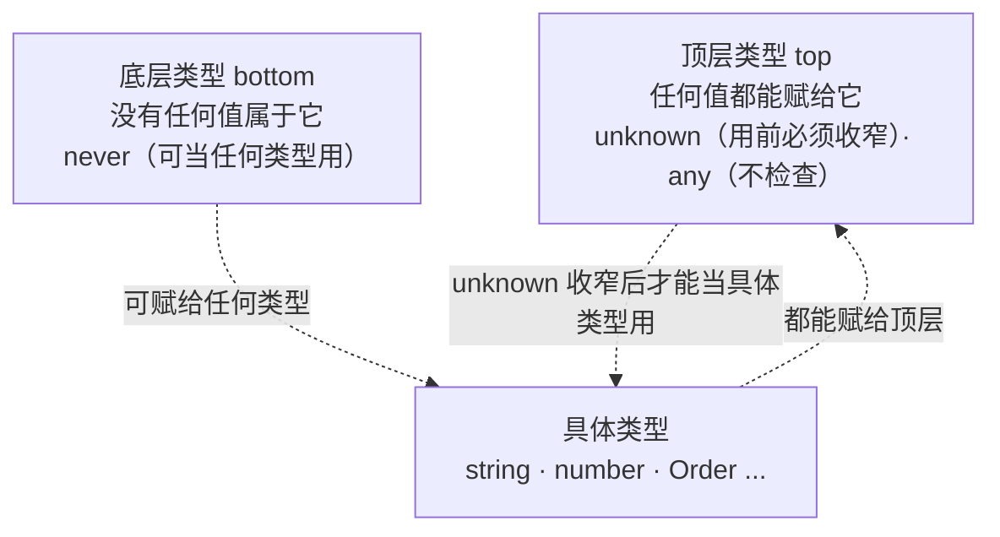
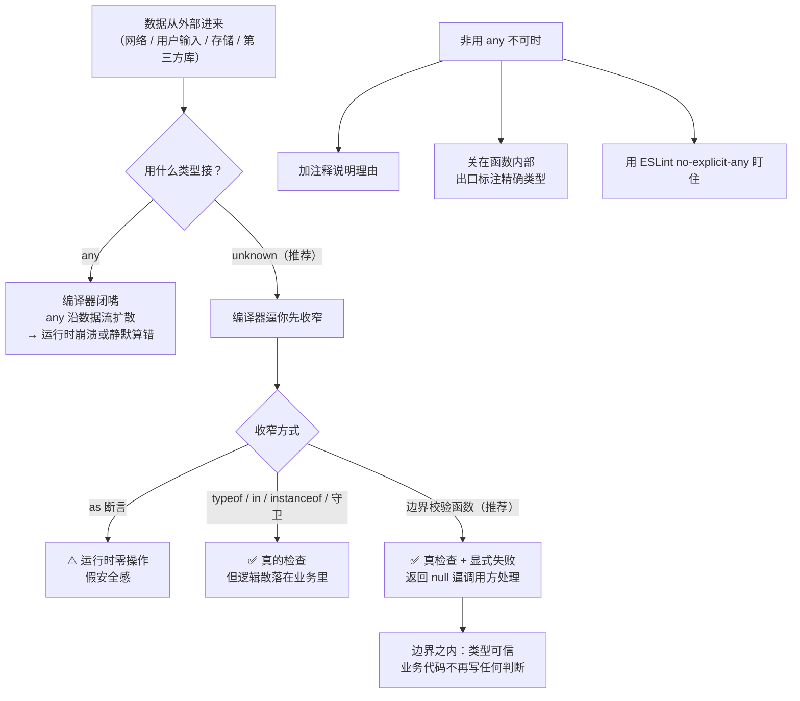

# 第 6 课：any·unknown·never 与信任边界

> 所属阶段：阶段 2《收窄与控制流》｜ 水平：零基础 TS
> 本课知识点：any：逃生舱与传染性、unknown：安全的顶层类型、信任边界：类型从哪来
> 故事情节：主角用一个 `as` 让报错消失了，三小时后线上炸了——**编译器不是被说服了，是被捂住了嘴**
> ✅ 状态：已完成（2026-09-03）｜ 实操环境：Node.js v22.14.0 + TypeScript 7.0.2（**文中所有输出均为本课本机实测**）

## 🎯 本课目标

- 举出 `any` 沿数据流扩散导致崩溃的例子，说出它仅有的合理用法与拦截手段
- 说清 `unknown` 与 `any` 的本质差别，并在 `JSON.parse` / `catch` 等场景正确使用
- 解释为什么类型断言不是校验，并在**信任边界**处收敛所有不安全类型

## 📌 知识点导航

| # | 知识点 | 关键点 | 状态 |
|---|--------|--------|------|
| 1 | any：逃生舱与传染性 | `any` 的四条特权 / 沿数据流扩散 / 用返回类型标注阻断 / 仅有的合理用法与拦截手段 | ✅ |
| 2 | unknown：安全的顶层类型 | 三条限制 / 必须先收窄 / 与 `any` 对比 / `JSON.parse` 返回 any、catch 变量是 unknown / 类型层次全景 | ✅ |
| 3 | 信任边界：类型从哪来 | 四类不可信来源 / 断言不是校验 / 边界处三种收敛手段对比 | ✅ |

## 📦 前置依赖（JS 概念）

| 用到的 JS 概念 | 掌握要求 | 回补 |
|---------------|---------|------|
| `JSON.parse` | 会用即可 | — |
| `try/catch` 与错误对象 | 需理解（`catch` 变量类型） | [JS 课 11 错误处理](../javascript-core/02-课程目录.md)（未学，本课内一句带过） |
| 收窄与类型守卫 | **强依赖** | 课 5 ✅（本课建立在课 5 之上） |

---

## 第一幕：起源与场景引入

> 🏛️ **起源**：这三个关键字的来历，恰好对应 TS 要解决的三个不同问题。
>
> **`any` 从 TS 第一天就存在**，而且它是**刻意的逃生舱**。原因很实际：TS 要能渐进迁移现有 JS 项目，就必须在某些地方"暂时放弃检查"——否则你连编译都过不了。`any` 的设计意图是"**我知道这里不安全，先让我过**"。
>
> **`unknown` 是 TS 3.0（2018 年 7 月）才加入的**。因为实践中 `any` 被严重滥用：人们用它"让报错消失"，而不是"临时跳过"。社区需要一个"**我知道我什么都不知道**"的类型——它同样能装下任何值，但**用之前必须证明它是什么**。
>
> **顶层类型 / 底层类型**来自类型论：`any` 和 `unknown` 是**顶层（top）**——任何类型都是它们的子类型；`never` 是**底层（bottom）**——它是任何类型的子类型。这套层次解释了它们所有的行为差异。
>
> **信任边界（trust boundary）**则是从安全工程借来的概念：**绝不信任来自系统外部的输入**。TS 把它移植成一句类型系统的格言——**类型只在边界之内有效**。

**记住三句话就够了**：`any` 是逃生舱（用多了会淹水）、`unknown` 是上锁的容器（要先用钥匙开）、**类型保护不了边界之外的数据**。

好，回到你的项目。

> 🎬 **场景**：课 5 的守卫已经挡住了 `null`。但某天下午，后端把 `amount` 从数字改成了字符串，**接口文档没更新**。

先看看没有类型时是什么样（`playground/lesson-06/bug.js`）：

```js
const response = '{"id":"o1","amount":"99"}';
const raw = JSON.parse(response);   // 拿到什么全凭后端心情

const total = raw.amount * 0.8;     // 79.2 —— 隐式转换，碰巧对了
const bonus = raw.amount + 10;      // "9910" —— 字符串拼接，悄悄错了
console.log("total =", total);
console.log("bonus =", bonus);
console.log(save({ bonus }));       // saved: 9910 —— 污染一路传到账单
```

**实测输出**（Node.js v22.14.0）：

```
raw.amount = 99
total = 79.2
bonus = 9910
saved: 9910
caught: SyntaxError | Expected property name or '}' in JSON at position 1 (line 1 column 2)
caught2: message = undefined
```

**同一份数据，`*` 是对的，`+` 是错的。** 而 `saved: 9910` 说明错误数据一路流到了账单，中途没有任何一道关卡。

现在加上 TS。你赶工时写下了这行（`playground/lesson-06/bug-as.ts`）：

```ts
interface Order { id: string; amount: number }

const response = '{"id":"o1","amount":"99"}';

// 一个 as，让所有报错都消失了
const order = JSON.parse(response) as Order;

console.log("打折后 =", order.amount * 0.8);        // 79.2 —— 碰巧对了
console.log("加运费 =", order.amount + 10);         // "9910" —— 悄悄错了
console.log("格式化 =", order.amount.toFixed(2));   // 运行时炸在这里
```

**实测结果**：

```
$ npx tsc bug-as.ts        # ← 零报错，exit=0
$ node bug-as.js
打折后 = 79.2
加运费 = 9910
TypeError: order.amount.toFixed is not a function
```

**编译器不是被说服了，是被捂住了嘴。**

这一个 `as` 背后，其实藏着三个不同的问题，正好对应本课的三个知识点：

1. `JSON.parse` 返回的到底是什么？为什么它能被赋给任何类型？（**`any` 从哪来**）
2. 如果把它换成 `unknown`，会怎样？（**`unknown` 怎么用**）
3. 那正确的做法到底是什么？（**信任边界**）

---

## 第二幕：认知冲突

你试了三种写法，越试越糊涂：

```ts
// 实验 A：any 什么都能做 —— 那还要类型干什么？
let a: any = 1;
a.foo.bar.baz;    // ✅ 编译通过
a();              // ✅ 编译通过

// 实验 B：unknown 什么都做不了 —— 那它有什么用？
let u: unknown = 1;
u.toFixed();      // ❌ 报错：'u' is of type 'unknown'

// 实验 C：我明明写了类型，为什么线上还是炸了？
const order = JSON.parse(response) as Order;   // 编译通过
order.amount.toFixed(2);                        // 运行时炸
```

**实验 A 让人上瘾，实验 B 让人烦躁，实验 C 让人怀疑人生。** 三个疑惑：

1. **`any` 到底"宽松"到什么程度？** 它会不会污染到别的地方去？
2. **`unknown` 这么难用，为什么还有人说它更安全？** 它的安全体现在哪？
3. **如果类型保护不了我，那我为类型付的钱到底买到了什么？**

---

## 第三幕：层层揭示

> ⚠️ **本课的默认环境**（与前五课一致）：所有示例在 `playground/lesson-06/` 目录下执行，**没有 `tsconfig.json`**，直接 `npx tsc xxx.ts` 编译单个文件。TS 7.0.2 默认 `strict: true`（因此 `noImplicitAny` 与 `useUnknownInCatchVariables` 都是开着的）。

### 知识点 1：any：逃生舱与传染性

> 关键点：`any` 的四条特权 / 沿数据流扩散 / 用返回类型标注阻断 / 仅有的合理用法与拦截手段

#### 一句话定义

`any` 是 TypeScript 的**逃生舱**：它关闭这一处（及其下游）的类型检查。任何值都能赋给它，它也能赋给任何类型——**代价是它碰过的东西，类型信息全部消失**。

#### 直觉建立（类比）

**给编译器签的免责协议 + 一滴会扩散的墨水。**

- **免责协议**：签了之后，编译器对这块代码**概不负责**——怎么用它都不拦你
- **会扩散的墨水**：`any` 不是孤立的。它碰到什么，什么就失去颜色——`any` 参与运算，结果是 `any`；`any` 混进数组，整个数组退化；`any` 传进函数，返回值也跟着变

> 💡 **类比的边界**：墨水扩散是均匀、无差别的；而 `any` 的传染**有明确的边界**——**一个标注了返回类型的函数就是防火墙**：哪怕函数内部全是 `any`，只要出口标了 `number`，外面拿到的就是 `number`。这条性质是治理 `any` 的关键手段，下面会实测。

#### 核心原理

**① `any` 的四条特权**

| 特权 | 示例 | 后果 |
|------|------|------|
| 任何值都能赋给它 | `const a: any = 1; a = "x"; a = {};` | 类型信息清零 |
| 它能赋给任何类型 | `const n: number = someAny;` | **污染从这里开始扩散** |
| 可以访问任意属性 | `a.foo.bar.baz` | 编译过、运行炸 |
| 可以当函数调用 | `a()` | 编译过、运行炸 |

**② 传染性**（实测）

```ts
const raw: any = "99";
const doubled = raw * 2;          // any（不是 number！）
const label = `x${doubled}`;      // any
const clean: number[] = [1, 2, 3];
const mixed = [...clean, raw];    // 整个数组被污染
```

`mixed` 的实际内容（实测输出）：`[ 1, 2, 3, '99' ]`——**`number[]` 里混进了一个字符串，类型系统一声不吭。**

**③ 用返回类型标注"阻断"传染**（实测）

```ts
function toNumber(x: any): number {
  return Number(x);
}
const blocked = toNumber("99");   // number，不是 any
const check: string = blocked;
// ❌ error TS2322: Type 'number' is not assignable to type 'string'.
```

**报错本身就是证据**：如果 `any` 传染了，`blocked` 就是 `any`，赋给 `string` 不会报错。**因为它报错了，说明 `any` 被挡在了函数内部。**

> 🔧 **工程手段**：处理第三方无类型数据时，**把 `any` 关在函数里，出口处标注精确类型**。这样污染被限制在一个函数内，而不是扩散到整个代码库。

**④ `any` 仅有的合理用法**

| 场景 | 说明 |
|------|------|
| 渐进迁移的过渡期 | 老代码暂时改不动，标 `any` 先跑起来（目标是一个个消灭掉） |
| 与确实没有类型的第三方库对接 | 权宜之计；能补 `.d.ts` 就补（课 11） |
| 类型递归过深导致编译器"爆栈" | 极罕见，且应该有注释说明 |
| 测试代码里的 mock | 影响面小，可接受 |

**不属于合理用法的**："我懒得写类型"、"报错了我不知道怎么改"、"赶进度先这样"——**这些都是把问题推给运行时。**

**⑤ 拦截 `any` 的四种手段**

| 手段 | 拦什么 | 说明 |
|------|-------|------|
| `noImplicitAny` | 隐式 any（参数没标注等） | TS 7 默认开启，实测报 TS7006 |
| ESLint `no-explicit-any` | 显式写 `any` | 团队规范首选（课 12 会讲怎么配） |
| 用 `unknown` 替代 | 从源头换掉 | 见下一知识点 |
| 函数出口标注类型 | 阻断扩散 | 本知识点第 ③ 条 |

#### 示例演示

`playground/lesson-06/any.ts`（**实测编译零报错**）：

```ts
// ① any 什么都能做 —— 编译器完全不拦
let value: any = 1;
value = "hello";
value = { a: 1 };
try {
  console.log(value.foo.bar.baz);   // ✅ 编译通过
} catch (e) {
  console.log("value.foo.bar.baz ->", (e as Error).message);   // 💥 运行时才炸
}

// ② 传染：any 参与运算，结果还是 any
const raw: any = "99";
const doubled = raw * 2;        // any
const label = `x${doubled}`;    // any

// ③ 传染：喂给函数，返回值也跟着变成 any
function doubleIt(x: any) { return x * 2; }
const result = doubleIt("99");  // any

// ④ 传染：混进正常类型，整个数组被污染
const clean: number[] = [1, 2, 3];
const mixed = [...clean, raw];
```

**实测输出**：

```
value.foo.bar.baz -> Cannot read properties of undefined (reading 'bar')
198 x198
198
[ 1, 2, 3, '99' ]
```

看最后一行：**`number[]` 里出现了一个字符串，编译器零反应。**

边界探测（`any-probe.ts`，**实测 2 条报错**）：

```
any-probe.ts(4,19): error TS7006: Parameter 'x' implicitly has an 'any' type.
any-probe.ts(13,7): error TS2322: Type 'number' is not assignable to type 'string'.
```

第一条证明**隐式 any 会被拦**（TS 7 默认 `noImplicitAny`）；第二条证明**返回类型标注能阻断传染**。

#### 常见误区

1. **"`any` 只是跳过这一处的检查。"** → 它还会**沿数据流扩散**。真正的"只跳过一处"是 `@ts-expect-error`（且它也需要注释说明理由）。
2. **"`any` 和 JS 的变量一样，问题不大。"** → 比 JS 更糟：`any` 能赋给任何类型，等于在**类型系统内部**开了一个洞，把不安全的值伪装成安全类型传下去。
3. **"用了 `any` 就再也收不回来了。"** → 收得回来：在**函数出口标注精确类型**，污染就被关在函数里了。

#### 一句话记住

> **`any` 是逃生舱不是常住房；真要用，就把它关在函数里，出口处标上类型。**

#### 官方文档

- `any` 与类型断言：https://www.typescriptlang.org/docs/handbook/2/everyday-types.html#any
- `noImplicitAny`：https://www.typescriptlang.org/tsconfig#noImplicitAny

---

### 知识点 2：unknown：安全的顶层类型

> 关键点：三条限制 / 必须先收窄 / 与 `any` 对比 / `JSON.parse` 返回 any、catch 变量是 unknown / 类型层次全景

#### 一句话定义

`unknown` 是**类型安全的顶层类型**：任何值都能放进它，但它**不能被使用**，除非你先收窄（证明它是什么）。

#### 直觉建立（类比）

**`any` 是敞开的纸箱，`unknown` 是上锁的保险箱。**

两者都能往里放任何东西。区别在于：

- 纸箱：**随手就能掏**——摸出什么全凭运气，摸到钉子就流血
- 保险箱：**必须先开锁才能拿**——而"开锁"这一步，逼你先确认里面是什么

> 💡 **类比的边界**：保险箱只有配了钥匙的人能开；而 `unknown` 的"锁"是**你自己开的**——用 `as` 一撬就开，而且开了之后编译器不会核实你开得对不对（课 5 的"说谎的守卫"就是这么来的）。所以**`unknown` 的安全，来自它逼你走"收窄"这条路，而不是它能自动验证什么。**

#### 核心原理

**① `unknown` 的三条限制**（实测）

```ts
const u: unknown = "hello";
u.toUpperCase();        // ❌ TS18046: 'u' is of type 'unknown'.
const n: unknown = 1;
n + 1;                  // ❌ TS18046
const s: string = u;    // ❌ TS2322: Type 'unknown' is not assignable to type 'string'.
```

不能访问属性、不能参与运算、不能直接赋给别人——**必须先收窄**。收窄之后，它比 `any` 更精确、更好用。

**② 与 `any` 的本质差别**

| 行为 | `any` | `unknown` |
|------|-------|-----------|
| 任何值赋给它 | ✅ | ✅ |
| 它赋给具体类型 | ✅ | ❌（必须先收窄） |
| 访问任意属性 | ✅ | ❌ |
| 参与运算 | ✅ | ❌ |
| 当作函数调用 | ✅ | ❌ |
| 收窄后可用 | 不需要 | **必须** |

一句话：**`any` 是"你说了算"，`unknown` 是"你证明给我看"。**

**③ 高频场景一：`JSON.parse` 返回的是 `any`**（实测，重要陷阱）

```ts
const parsed = JSON.parse('{"a":1}');
const asNumber: number = parsed;   // ✅ 编译通过！
```

**没报错 = `parsed` 是 `any`**（如果是 `unknown`，这里会报 TS2322）。

这就是第一幕事故的根源：`JSON.parse` 的签名是 `(text: string) => any`。**TS 没有帮你把这道门守起来。**

> 🔧 **正确姿势**：拿到 `JSON.parse` 的结果，第一件事就是把它**当成 `unknown`**：
> ```ts
> const raw: unknown = JSON.parse(response);   // 显式标注，逼自己校验
> ```

**④ 高频场景二：`catch` 变量是 `unknown`**（实测）

```ts
try {
  throw new Error("x");
} catch (e) {
  const msg: string = e;
  // ❌ error TS2322: Type 'unknown' is not assignable to type 'string'.
}
```

**报错 = `e` 是 `unknown`**。在 TS 7（`strict: true`）下，`useUnknownInCatchVariables` 默认开启，catch 变量是 `unknown`——**这是对的**，因为 JS 里你什么都能 `throw`（第一幕的 `caught2: message = undefined` 就是抛了个字符串导致的）。

正确写法：

```ts
catch (e) {
  const message = e instanceof Error ? e.message : String(e);   // ✅ 先收窄
}
```

**⑤ 类型层次全景**（把 `any` / `unknown` / `never` 放在一起看）



| 位置 | 类型 | 关键性质 |
|------|------|---------|
| 顶层 | `unknown` | 装得下一切，**用之前必须收窄** |
| 顶层 | `any` | 装得下一切，**也可以直接用**（不检查） |
| 底层 | `never` | **没有任何值**属于它；它可以赋给任何类型（课 5 穷尽性检查靠这个） |

#### 示例演示

`playground/lesson-06/unknown.ts`（**实测零报错**）：

```ts
// ① 任何值都能放进 unknown（它是顶层类型）
let value: unknown = 1;
value = "hello";
value = { a: 1 };
value = null;

// ② 但要用它，必须先收窄
function describe(input: unknown): string {
  if (typeof input === "string") return `string: ${input.toUpperCase()}`;
  if (typeof input === "number") return `number: ${input.toFixed(2)}`;
  if (input === null) return "null";
  return "something else";
}

// ③ 收窄之后，unknown 比 any 更安全也更精确
function lengthOf(input: unknown): number {
  if (typeof input === "string") return input.length;
  if (Array.isArray(input)) return input.length;
  return 0;
}
```

**实测输出**：

```
string: HI number: 3.14 null something else
4 3 0
```

边界探测（`unknown-probe.ts`，**实测 4 条报错**）：

```
unknown-probe.ts(6,13): error TS18046: 'u' is of type 'unknown'.
unknown-probe.ts(10,13): error TS18046: 'n' is of type 'unknown'.
unknown-probe.ts(13,7): error TS2322: Type 'unknown' is not assignable to type 'string'.
unknown-probe.ts(23,9): error TS2322: Type 'unknown' is not assignable to type 'string'.
```

第 4 条是 `catch` 变量——**证明它是 `unknown`**。而探测文件里 `JSON.parse` 那一行**没有报错**——**证明它是 `any`**。

#### 决策清单：any 还是 unknown？（本课的**决策参考**）

| 场景 | 选谁 | 理由 |
|------|------|------|
| 函数接收"不知道是什么"的外部数据 | **`unknown`** | 逼调用方（也就是你）先收窄 |
| 声明一个变量，稍后才确定类型 | **`unknown`** | 同上 |
| `JSON.parse` / `fetch` 的结果 | **`unknown`** | 落到谁手里都必须先校验 |
| 与无类型第三方库临时对接 | `any`（**并加注释**） | 权宜，且应尽快用 `.d.ts` 替换 |
| 老代码渐进迁移的过渡期 | `any`（**并加 TODO**） | 明确标记为技术债 |
| 类型体操里需要"绕过检查" | `any`（**局部、有注释**） | 高级场景，课 13 会讲代价 |
| **默认** | **`unknown`** | 只要你想不出必须用 `any` 的理由，就用 `unknown` |

> 🔧 **一句话建议**：**默认 `unknown`，`any` 需要理由和注释。** 并且把 `any` 关在函数里、出口标类型。

#### 常见误区

1. **"`unknown` 就是麻烦版的 `any`。"** → 恰恰相反：`any` 是"我不想知道"，`unknown` 是"我知道我不知道"。后者逼你在**用之前**证明，前者在**崩之后**才发现。
2. **"`JSON.parse` 返回 `unknown`，TS 会帮我检查。"** → 不，它返回 **`any`**（实测）。必须自己显式标注成 `unknown`。
3. **"`catch (e)` 里的 `e` 是 `any`，可以直接 `e.message`。"** → 在 `strict` 下它是 **`unknown`**（实测），必须收窄。这是好事——别人可能 `throw "字符串"`。
4. **"`unknown` 收窄一次就够了。"** → 每次使用都要在**当前控制流**下已经收窄；跨函数、进闭包都要重新确认（课 5 的收窄规则）。

#### 一句话记住

> **`any` 是"你说了算"，`unknown` 是"你证明给我看"——默认用后者，前者需要理由。**

#### 官方文档

- `unknown`：https://www.typescriptlang.org/docs/handbook/2/functions.html#unknown
- `useUnknownInCatchVariables`：https://www.typescriptlang.org/tsconfig#useUnknownInCatchVariables

---

### 知识点 3：信任边界：类型从哪来

> 关键点：四类不可信来源 / 断言不是校验 / 边界处三种收敛手段对比

#### 一句话定义

**信任边界**是"数据从不可信来源进入你程序"的那道线。类型系统只能保证边界**内部**的一致性；边界**外部**的数据，必须在入口处做**运行时校验**，才能以精确类型进入内部。

#### 直觉建立（类比）

**海关。**

- 一个国家的法律（**类型**）只在国境之内有效
- 境外来的货物（**外部数据**）不能默认遵守你的法律
- 所以必须过海关（**运行时校验**）：开箱检查、确认品类、盖章放行
- 盖了章之后，货物就能在国内按规则流通了（**边界之内类型可信**）

> 💡 **类比的边界**：海关是**真的开箱检查**；而类型系统的"盖章"（`as`、守卫、断言）是**你自己盖的**——编译器不核实内容。所以"过海关"这一步必须包含**真实的运行时检查代码**，只写一个 `as` 相当于自己给自己盖了个章就放行。

#### 核心原理

**① 四类不可信来源**

| 来源 | 例子 | 为什么不可信 |
|------|------|-------------|
| 网络 | `fetch` / `JSON.parse` 的响应 | 后端可能改字段、改类型、文档过期 |
| 用户输入 | 表单、URL 参数、上传文件 | 什么都可能填 |
| 存储 | `localStorage`、数据库、配置文件 | 可能是旧版本写入的、被人手改过 |
| 第三方库 | 没有类型定义的 npm 包 | 返回值实际形状未知 |

**共同点**：这些数据在运行时才存在，而**类型在编译期就被擦除了**（课 1）。**编译器从没见过它们，也就不可能为它们做担保。**

**② 为什么 `as` 不能替代运行时校验**（实测三种后果）

```ts
interface Order { id: string; amount: number }

// A：as 不检查任何东西 —— 缺字段也放行
const raw: unknown = JSON.parse('{"id":"o1"}');
const order = raw as Order;                  // ✅ 编译通过
order.amount.toFixed(2);                     // 💥 运行时炸

// B：双重断言能把完全不对的东西"变成" Order
const notAnOrder = "hello" as unknown as Order;   // ✅ 编译通过

// C：断言之后，类型系统再也不会提醒你任何事
function use(order: Order): number { return order.amount * 2; }
use(notAnOrder);                             // NaN，静默错误
```

**实测输出**：

```
as -> Cannot read properties of undefined (reading 'toFixed')
double as -> Cannot read properties of undefined (reading 'toFixed')
use(notAnOrder) -> NaN
```

**两次崩溃 + 一次静默的 `NaN`。** 第三种最危险——它不报错，只是悄悄算错。

**③ 边界处收敛的三种手段对比**

| 手段 | 做法 | 编译期 | 运行时 | 适用 |
|------|------|-------|-------|------|
| `as` 断言 | `raw as Order` | 通过 | **什么都不做** | 仅当你能证明（且最好有注释） |
| 类型守卫 | `if (isOrder(raw))` | 通过 | **真的检查**（但由你实现） | 分支处理、可容错场景 |
| **校验函数（推荐）** | `parseOrder(raw): Order \| null` | 通过 | 真的检查 + **显式失败** | **外部数据入口** |

推荐第三种：**它把"失败"变成了一个必须处理的值（`null`），而不是一个被忽略的可能性。**

**④ 一个绕不开的问题：双写**

手写校验意味着你要写两遍形状：

```ts
interface Order { id: string; amount: number }          // 类型
function parseOrder(raw: unknown): Order | null {       // 校验逻辑
  if (typeof raw !== "object" || raw !== null) return null;
  /* 逐字段检查 …… */
}
```

改了接口，两处都要改，容易漏。工业界的解法是 **schema 库**（如 `zod`、`valibot`）：

```ts
// 思路示意（本课不引入依赖）：一份 schema，同时得到校验器和类型
const OrderSchema = z.object({ id: z.string(), amount: z.number() });
type Order = z.infer<typeof OrderSchema>;    // 类型从 schema 推导
OrderSchema.parse(raw);                       // 运行时校验
```

**形状只写一遍**，类型和校验逻辑由同一份定义生成。课 12 讲工具链时会再提。

#### 示例演示

`playground/lesson-06/boundary.ts`（**实测零报错**）：

```ts
interface Order { id: string; amount: number }

// ① 信任边界：逐字段运行时校验，不合格就明确拒绝
function parseOrder(raw: unknown): Order | null {
  if (typeof raw !== "object" || raw === null) return null;
  const candidate = raw as Record<string, unknown>;
  if (typeof candidate.id !== "string") return null;
  if (typeof candidate.amount !== "number") return null;   // 后端改成字符串 → 这里拦住
  return { id: candidate.id, amount: candidate.amount };
}

// ② 边界之内，类型是可信的（不用再写任何判断）
function formatOrder(order: Order): string {
  return `order ${order.id}: ${order.amount.toFixed(2)}`;
}

function handle(raw: unknown): string {
  const order = parseOrder(raw);
  if (order === null) return "invalid order";
  return formatOrder(order);
}
```

**实测输出**：

```
invalid order            ← 后端改了类型，被边界拦住
order o2: 199.00         ← 合规数据正常通过
```

**第一幕那次线上事故，在这里被提前到了"数据入口处"。**

#### 常见误区

1. **"用了 `as` 就等于校验过了。"** → `as` 在运行时是**零操作**（编译后一个字符都不剩）。它只改编译器的看法。
2. **"类型守卫一定会检查。"** → 只有**你真的在守卫里写了检查**才会。课 5 的"说谎的守卫"实测过：实现写成 `return true` 也能编译通过。
3. **"外部数据校验一次就够了。"** → 校验要放在**每一个入口**。同一个 Order 可能来自 HTTP、WebSocket、localStorage 三条路径。
4. **"失败就抛异常最省事。"** → 返回 `null` / `Result` 类型更好：它**逼调用方处理失败**，而抛异常容易被忘记捕获。

#### 一句话记住

> **类型只在边界之内有效——外部数据必须在入口处用运行时校验换一张"通行证"。**

#### 官方文档

- 类型断言与校验：https://www.typescriptlang.org/docs/handbook/2/everyday-types.html#type-assertions
- `unknown` 与收窄：https://www.typescriptlang.org/docs/handbook/2/narrowing.html#unknown

---

## 第四幕：实操验证

回到第一幕那份"后端偷偷改了类型"的数据。三种处理方式的结局（`playground/lesson-06/scenario.ts`）：

```ts
// 方式一：as 断言 —— 第一幕的做法
function byAssertion(input: unknown): string {
  const order = input as Order;
  try {
    return `as        -> ${order.amount.toFixed(2)}`;
  } catch (e) {
    return `as        -> 崩溃: ${(e as Error).message}`;
  }
}

// 方式二：unknown + 收窄 —— 编译期逼你处理每一种可能
function byNarrowing(input: unknown): string {
  if (typeof input === "object" && input !== null) {
    const candidate = input as Record<string, unknown>;
    if (typeof candidate.amount === "number") {
      return `narrowing -> ${candidate.amount.toFixed(2)}`;
    }
    return `narrowing -> amount 不是数字（实际是 ${typeof candidate.amount}）`;
  }
  return "narrowing -> 不是对象";
}

// 方式三：边界校验 —— 一次校验，边界之内处处安全
function byValidation(input: unknown): string {
  const order = parseOrder(input);
  if (order === null) return "validation -> 拒绝接收（数据不符合契约）";
  return `validation -> ${order.id} ${order.amount.toFixed(2)}`;
}
```

**实测输出**（三种方式都**编译零报错**）：

```
as        -> 崩溃: order.amount.toFixed is not a function
narrowing -> amount 不是数字（实际是 string）
validation -> 拒绝接收（数据不符合契约）
validation -> o2 199.00
```

| 方式 | 编译时 | 运行时 | 结局 |
|------|-------|-------|------|
| `as` 断言 | 零报错 | 崩溃 | **事故**（第一幕） |
| `unknown` + 收窄 | 零报错 | 给出可读的降级信息 | 可接受，但**校验逻辑散落在业务代码里** |
| 边界校验函数 | 零报错 | 明确拒绝 | **推荐**：一次校验，处处安全 |

> ✅ **回扣课 1**：这是"假安全感"这条线的第四次、也是最后一次出现——
> - 课 1：`JSON.parse` + `any`
> - 课 3：`as` 直接断言
> - 课 5：说谎的类型守卫
> - 本课：`as` 让后端改字段这件事**彻底消失在编译器的视野里**
>
> 四者的共同点：**你向编译器做了一个承诺，编译器信了，于是它闭嘴。** 区别只在于——这次你有了正确的解法：**在信任边界做真实的运行时校验**。

---

## 第五幕：体系收束

> 📍 **全局定位**：本课是**阶段 2 的安全收口**。课 4 给你"几种可能"的表达能力，课 5 教你把可能变成确定，本课回答最后一个问题：**那些从外面进来的、根本没有类型的东西，该怎么办？**
>
> 答案是两句话：**用 `unknown` 接住它们，在边界处用运行时校验换通行证。**
>
> 这条线会继续走下去：
> - **课 7（下一课）**：类与接口——阶段 2 的最后一课，把类型用在业务建模上
> - **课 11**：`.d.ts` 声明文件——**给无类型的第三方库补上类型**，从源头消灭一类 `any`
> - **课 12**：ESLint 的 `no-explicit-any` 规则——**把"禁用 any"变成团队里可执行的规范**
> - **课 14**：可赋值性与变体——从底层规则解释为什么 `any` 能双向通行

**现在你会了什么**：

- 能举出 `any` **沿数据流扩散**导致崩溃的例子（`number[]` 里混进字符串而编译器不吭声），并说出它的**四种拦截手段**
- 能说清 `unknown` 与 `any` 的本质差别（"你证明给我看" vs "你说了算"），并在 `JSON.parse`（返回 `any`）与 `catch`（是 `unknown`）这两个高频场景正确使用
- 能解释**为什么断言不是校验**，并在信任边界处用运行时校验收敛不安全类型
- 拿到一条决策规则：**默认 `unknown`，用 `any` 需要理由和注释，且要把它关在函数里**

> 🔗 **下一步**：课 7《类与接口的类型世界》——阶段 2 的收官，也是相对轻松的一课。你会学到 `public` / `private` / `protected`、参数属性、抽象类与 `implements`，以及**类的结构化兼容**——它和课 3 讲的对象结构化类型是同一套规则。

---

## 🐞 常见误区

1. **"`any` 只是跳过这一处检查。"** → 它会沿数据流扩散，污染碰到的一切。
2. **"`any` 用了就收不回来。"** → 在函数出口标注精确类型，就是防火墙（实测 TS2322 证明阻断了）。
3. **"`unknown` 是麻烦版的 `any`。"** → 相反：它把"崩了才发现"变成"用之前必须证明"。
4. **"`JSON.parse` 返回 `unknown`。"** → 它返回 **`any`**（实测）。必须自己标注成 `unknown`。
5. **"`catch (e)` 里的 `e` 是 `any`。"** → `strict` 下是 **`unknown`**（实测），因为 JS 里你什么都能 `throw`。
6. **"`as` 之后就等于校验过了。"** → `as` 运行时零操作。缺字段、类型不对，它一概不管。
7. **"类型守卫一定会检查。"** → 只有你在里面**真的写了检查**才会（课 5 的"说谎的守卫"）。

## 一图总结



> 关键记忆点：① `any` 会扩散，返回类型标注是防火墙；② `unknown` = "你证明给我看"；③ 类型只在边界内有效，入口处必须运行时校验。

## 课后小测

**Q1**：下面两段代码，结果有什么不同？

```ts
const a: any = "99";
const b: unknown = "99";

const n1: number = a;   // ①
const n2: number = b;   // ②
```

- A. ① 报错，② 通过
- B. ① 通过，② 报错
- C. 两个都通过
- D. 两个都报错

<details><summary>答案与解析</summary>

**答案：B**。

- ① `any` 能赋给任何类型 → 编译通过（然后运行时 `n1.toFixed()` 才会炸，因为实际值是字符串）
- ② `unknown` 不能直接赋给具体类型 → 报 `TS2322: Type 'unknown' is not assignable to type 'number'`

这正是 `any` 危险的地方：**它让不安全的值伪装成安全类型，一路传下去**；而 `unknown` 在赋值这一步就拦住了你。

</details>

**Q2**：关于 `JSON.parse` 与 `catch` 变量，下列说法正确的是？

- A. `JSON.parse` 返回 `unknown`，`catch` 变量是 `any`
- B. `JSON.parse` 返回 `any`，`catch` 变量是 `unknown`
- C. 两者都是 `any`
- D. 两者都是 `unknown`

<details><summary>答案与解析</summary>

**答案：B**（本课实测，TS 7.0.2 + `strict: true`）。

- `JSON.parse` 的签名是 `(text: string) => any` → 实测 `const n: number = JSON.parse('{"a":1}')` **不报错**，证明是 `any`。**这是个陷阱**：TS 没有替你把这道门守起来，要自己写成 `const raw: unknown = JSON.parse(...)`
- `catch` 变量在 `strict` 下是 `unknown`（`useUnknownInCatchVariables` 默认开启）→ 实测 `const msg: string = e` 报 `TS2322`，证明是 `unknown`。**这是对的**：JS 里你什么都能 `throw`，包括字符串

</details>

**Q3**：后端可能返回不合规数据，下面哪种做法最合理？

- A. `const order = raw as Order;`
- B. `if (isOrder(raw)) { /* 使用 */ }`，其中 `isOrder` 内部写真实检查
- C. `function parseOrder(raw: unknown): Order | null { /* 逐字段校验 */ }`，调用方必须处理 `null`
- D. `const order = raw as unknown as Order;`

<details><summary>答案与解析</summary>

**答案：C**。

- A：`as` 在运行时**零操作**，缺字段、类型不对一概不管（实测崩溃）
- B：守卫**确实会检查**，但校验逻辑散落在业务代码里，每个使用点都要记得调用
- C：**推荐**。真检查 + **把失败变成必须处理的值**，边界之内类型完全可信
- D：双重断言绕过一切检查，**是最危险的做法**（实测产生静默的 `NaN`）

B 和 C 的本质差别在于：C 让"数据不合规"成为**调用方无法忽略的一件事**（返回 `null` 就必须处理），而 B 可以什么都不做就跳过那个 `if`。

</details>

## 🚀 下一批接力提示词

> 学完本课后，**复制下面这段文字发给 AI**，即可无缝进入下一批（无需重新描述上下文）：

```
继续学 TypeScript。我的学习档案在 frontend/typescript-core/00-学习档案.md，
刚学完阶段 2《收窄与控制流》的课 6《any·unknown·never 与信任边界》三个知识点
（any：逃生舱与传染性 / unknown：安全的顶层类型 / 信任边界：类型从哪来），
请按大纲继续讲解下一课《类与接口的类型世界》。
```

## 🧭 课程导航

⬅️ **上一课**：[课 5：类型收窄](lesson-05-类型收窄.md)

➡️ **下一课**：[课 7：类与接口的类型世界](lesson-07-类与接口的类型世界.md)（阶段 2 收官）

📚 **返回目录**：[课程目录](../../02-课程目录.md)

---

## 附：本课示例文件清单

所有示例位于 `playground/lesson-06/`，均可直接 `npx tsc <文件名>` 复现：

| 文件 | 用途 | 预期结果 |
|------|------|---------|
| `bug.js` | 第一幕：JS 版的数据污染与 `throw` 字符串 | 直接 `node bug.js` 运行 |
| `bug-as.ts` | 第一幕：一个 `as` 让报错消失，运行时炸 | **编译零报错**，运行时 TypeError |
| `any.ts` | 知识点 1：`any` 的四条特权与传染性 | 编译零报错，运行时第一行崩溃被捕获 |
| `any-probe.ts` | 知识点 1：隐式 any 被拦、返回类型标注阻断传染 | 2 条报错（故意） |
| `unknown.ts` | 知识点 2：`unknown` 的三条限制与收窄 | 零报错，可运行 |
| `unknown-probe.ts` | 知识点 2：`unknown` 限制 + `JSON.parse` 是 any + catch 是 unknown | 4 条报错（故意） |
| `boundary.ts` | 知识点 3：信任边界的校验函数 | 零报错，输出 `invalid order` 与正常订单 |
| `boundary-probe.ts` | 知识点 3：`as` 的三种后果（两次崩溃 + 一次 NaN） | 编译零报错，运行时见输出 |
| `scenario.ts` | 第四幕：三种处理方式的结局对比 | 零报错，输出 4 行 |
