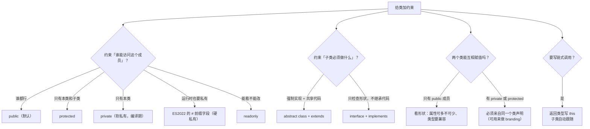

# 第 7 课：类与接口的类型世界

> 所属阶段：阶段 2《收窄与控制流》｜ 水平：零基础 TS
> 本课知识点：类的成员与修饰符、抽象类与 implements、类的结构化兼容与 this 类型
> 故事情节：主角给订单系统建模，发现 TS 的类不只是"能加类型"——它让**意图**也变成了可检查的东西
> ✅ 状态：已完成（2026-09-03）｜ 实操环境：Node.js v22.14.0 + TypeScript 7.0.2（**文中所有输出均为本课本机实测**）

## 🎯 本课目标

- 正确使用 `public` / `private` / `protected` / `readonly` 与参数属性，并区分 `private` 与 `#private`
- 区分 `extends` 与 `implements`，用抽象类与接口约束实例形状
- 预判两个类能否互相赋值，并用 `this` 类型实现链式调用

## 📌 知识点导航

| # | 知识点 | 关键点 | 状态 |
|---|--------|--------|------|
| 1 | 类的成员与修饰符 | public / private / protected / readonly / 参数属性 / `private` 与 `#private` 的本质区别 / 方括号逃逸口 | ✅ |
| 2 | 抽象类与 implements | `abstract` 类与成员 / `implements` 与 `extends` 的区别 / 接口只约束实例形状 | ✅ |
| 3 | 类的结构化兼容与 this 类型 | 类的结构化比较 / 私有与受保护成员破坏兼容 / 用 private 做品牌化 / `this` 类型与链式调用 | ✅ |

## 📦 前置依赖（JS 概念）

| 用到的 JS 概念 | 掌握要求 | 回补 |
|---------------|---------|------|
| `class` 语法、构造函数、`extends` | 需理解 | [JS 课 6 原型与类](../javascript-core/02-课程目录.md)（未学 —— 本课会先给最小可用的 `class` 回顾） |
| 原型与原型链 | **不要求** | TS 的类检查发生在编译期，与运行时原型无关 |
| 结构化类型 | **强依赖** | 阶段 1 课 3 ✅ |

> ⚠️ **注意**：本课涉及 JS 的 `class`，而 JS 课 6 尚未学到。处置：课首给一段 **5 分钟的 `class` 最小回顾**，够用即可；想深入再回补 JS 课 6。

---

## 🔁 课前回顾：class 最小语法（5 分钟）

> JS 课 6 还没学到 `class`，但本课要用。这里给一份**够用即可**的回顾，想深入再回补 [JS 课 6 原型与类](../javascript-core/02-课程目录.md)。

```js
class Order {
  constructor(id, amount) {   // 构造函数：new 的时候自动调用
    this.id = id;             // this.xxx 就是实例字段
    this.amount = amount;
  }
  total() {                   // 方法
    return this.amount;
  }
}

class GroupOrder extends Order {   // extends：继承
  constructor(id, amount) {
    super(id, amount);             // 子类构造函数里必须先调用 super()
  }
  total() {                        // 重写父类方法
    return this.amount * 0.8;
  }
}
```

三条够用的规则：

1. `constructor` 里用 `this.x = x` 定义**实例字段**
2. `extends` 继承；子类构造函数里**必须先 `super(...)`** 才能用 `this`
3. 子类可以**重写**父类的方法

**TS 在它之上加了四样东西**（本课主题）：字段的**类型标注**、四个**访问修饰符**、**参数属性**简写、以及 `abstract` / `implements` 两个约束关键字。

---

## 第一幕：起源与场景引入

> 🏛️ **起源**：TS 的类，是一个"三合一"的产物。
>
> **语法来自 Java / C# 传统**：`public` / `private` / `protected` / `abstract` / `implements` 这套词，都是面向对象语言用了几十年的老词汇。TS 把它们搬进 JS，为的是让写惯了 Java/C# 的人能立刻上手。
>
> **但语义是 TS 自己的**：类的兼容判断走**结构化类型**（课 3）——两个类不需要有任何继承关系，形状对就能赋值。这是 TS 与 Java 的根本分歧。
>
> **而实现是"擦除"的**（课 1）：`private`、`protected`、`readonly`、`abstract` 编译后**全部消失**。这一点在类身上尤其反直觉，因为 Java 的 `private` 在运行时是真的访问不到，而 **TS 的 `private` 只在编译期存在**。
>
> 顺带一提：JS 自己在 **ES2022** 才有了真正的私有字段 `#field`（运行时硬私有）。所以 TS 里存在两套私有机制——**TS 的 `private`（软私有，编译期）** 和 **JS 的 `#field`（硬私有，运行时）**。本课的实测会把它们的差别摆得很清楚。

**记住三句话就够了**：TS 的类是**Java 风格的语法 + 结构化类型的语义 + 编译期擦除的实现**。

好，回到你的项目。

> 🎬 **场景**：订单系统要支持三种订单了——普通订单、团购订单（八折）、预售订单（付定金）。你用 `class` 建模（`playground/lesson-07/bug.js`）：

```js
class Order {
  constructor(id, amount) {
    this.id = id;
    this.amount = amount;   // 本该是内部数据，谁都能改
  }
  total() { return this.amount; }
}

class GroupOrder extends Order {
  total() { return this.amount * 0.8; }
}

// 事故一：内部字段被外部改掉
const g = new GroupOrder("o1", 100);
console.log("before   =", g.total());
g.amount = -999;
console.log("after    =", g.total());

// 事故二：子类忘了实现方法，静默继承父类的实现
class PreOrder extends Order {
  // 忘了写 total()，本该返回定金
}
console.log("preorder =", new PreOrder("o2", 100).total());

// 事故三：形状一样的东西可以互换，换错了也没人知道
class Coupon { /* id / amount / total()，和 Order 一模一样 */ }
function applyTo(order) { return order.total(); }
console.log("coupon   =", applyTo(new Coupon("c1", 20)));
```

**实测输出**（Node.js v22.14.0）：

```
before   = 80
after    = -799.2
preorder = 100
coupon   = 20
```

三个事故，三个"没人管"：

1. **`amount` 谁都能改**——`g.amount = -999` 直接生效，账单变成负数
2. **`PreOrder` 忘了实现 `total()`**——静默继承父类的实现，预售订单按全款算了
3. **优惠券被当成订单传进去**——形状一样，函数照单全收

**这三个问题的共同点是：你的"意图"没有变成代码里可检查的东西。** 你知道 `amount` 是内部数据、你知道子类必须实现 `total()`、你知道优惠券不是订单——但代码里没有任何一处写着这些。

---

## 第二幕：认知冲突

换成 TS 之后，又出现了三件意外：

```ts
// 实验 A：我写了 private，为什么它还能被改？
class Vault { private secret = "key" }
const v = new Vault();
v["secret"] = "hacked";   // ✅ 编译通过！

// 实验 B：abstract 和 implements 到底有什么区别？
abstract class A { abstract f(): void }
class B implements A {}     // ❓ 这样写对吗

// 实验 C：两个毫无关系的类，为什么能互相赋值？
class Point2D { constructor(public x: number, public y: number) {} }
class Coordinate { constructor(public x: number, public y: number) {} }
const p: Point2D = new Coordinate(1, 2);   // ✅ 居然可以
```

三个疑惑：

1. **`private` 到底"私有"到什么程度？** 它和 `#private` 是一回事吗？
2. **`abstract` 和 `implements` 各自在约束什么？**
3. **类的兼容到底按什么规则？** 有没有办法让"形状一样但不是一回事"的两个类区分开？

---

## 第三幕：层层揭示

> ⚠️ **本课的默认环境**（与前六课一致）：所有示例在 `playground/lesson-07/` 目录下执行，**没有 `tsconfig.json`**，直接 `npx tsc xxx.ts` 编译单个文件。TS 7.0.2 默认 `strict: true`。

### 知识点 1：类的成员与修饰符

> 关键点：public / private / protected / readonly / 参数属性 / `private` 与 `#private` 的本质区别 / 方括号逃逸口

#### 一句话定义

TS 给 `class` 加了四个**访问修饰符**（`public` / `private` / `protected` / `readonly`）和一个**参数属性**简写，用来把"这个成员能被谁访问"写进代码。

#### 直觉建立（类比）

**公司的门禁卡等级。**

| 修饰符 | 门禁等级 | 谁能进 |
|--------|---------|-------|
| `public`（默认） | 公司大堂 | 谁都能访问 |
| `protected` | 部门区域 | 本部门 + 子公司（**类内部 + 子类**） |
| `private` | 老板办公室 | 只有**这个类自己** |
| `readonly` | 展柜里的奖杯 | 谁都能看，**谁都不能动** |

> 💡 **类比的边界**（**这条极重要**）：真实的门禁卡是**物理存在**的，而 TS 的这些修饰符**编译后全部消失**——运行时，所有字段都变成了普通属性，谁都能改。更糟的是，**方括号访问 `obj["x"]` 是编译期就能走的一道暗门**（下面实测）。想要**运行时真私有**，得用 JS 的 `#field`。

#### 核心原理

**① 四个修饰符**（实测，`members-probe.ts`）

```ts
class Vault {
  public open = 1;
  private secret = "key";
  protected internal = 42;
  readonly fixed = "ro";
}
const v = new Vault();
v.secret;      // ❌ TS2341: Property 'secret' is private and only accessible within class 'Vault'.
v.internal;    // ❌ TS2445: Property 'internal' is protected and only accessible within class 'Vault' and its subclasses.
v.fixed = "x"; // ❌ TS2540: Cannot assign to 'fixed' because it is a read-only property.
```

**② 参数属性：省掉样板代码**

```ts
// 传统写法：字段声明 + 构造函数赋值，写两遍
class OrderVerbose {
  id: string;
  constructor(id: string) { this.id = id; }
}

// 参数属性：构造参数前加修饰符，一步到位
class Order {
  constructor(public id: string, private rate: number = 1) {}
}
```

这是 TS 类里**最常用的语法糖**。`public` / `private` / `protected` / `readonly` 都能加在参数上。

**③ 逃逸口：方括号访问能绕过 `private`**（实测）

```ts
class Vault { private secret = "key"; }
const v = new Vault();
console.log(v["secret"]);   // ✅ 编译通过！
```

**成员访问语法 `v.secret` 会检查修饰符，而下标访问 `v["secret"]` 不会。** 这是 TS 一个已知的软肋（"soft privacy"）。

> 🔧 **纪律**：看到 `obj["somePrivate"]` 就该警觉——它在绕过类型系统的保护。**真正需要运行时私有时，用 `#field`**。

**④ `private` vs `#private`：软私有与硬私有**

| | `private`（TS） | `#field`（JS ES2022） |
|--|----------------|----------------------|
| 什么时候生效 | **仅编译期** | **运行时也是私有的** |
| 编译后 | 变成普通字段，**修饰符消失** | **保留 `#` 语法** |
| 方括号能绕过吗 | **能** | 不能（语法层面就访问不了） |
| 子类能访问吗 | 不能（`protected` 才行） | 不能 |
| 实测报错码 | TS2341 | TS18013 |

**实测产物对比**（`private-erase.ts` 编译后）：

```js
class Soft {
    softField;                    // ← private 消失了，变成普通字段
    constructor(softField) { this.softField = softField; }
}
class Hard {
    #hardField;                   // ← # 保留！运行时依然私有
    constructor(value) { this.#hardField = value; }
}
```

> 🔧 **选择建议**：日常用 `private`（够用、简洁、子类可通过 `protected` 协作）。**只有当这个字段真的不能被外部触碰时**（如安全敏感数据），才用 `#field`。

#### 示例演示

`playground/lesson-07/members.ts`（**实测零报错**）：

```ts
class Order {
  // 参数属性：构造参数前加修饰符，自动声明并赋值同名字段
  constructor(
    public id: string,
    public amount: number,
    private discountRate: number = 1,
    protected readonly createdAt: string = "2026-09-03",
  ) {}

  total(): number {
    return this.amount * this.discountRate; // ✅ 类内部能访问 private
  }

  describe(): string {
    return `Order ${this.id} created at ${this.createdAt}`;
  }
}

class GroupOrder extends Order {
  constructor(id: string, amount: number) {
    super(id, amount, 0.8); // 团购八折
  }
  createdOn(): string {
    return this.createdAt; // ✅ 子类能访问 protected
  }
}
```

**实测输出**：

```
o1 90
Order o1 created at 2026-09-03
80 2026-09-03
```

边界探测（`members-probe.ts`，**实测 5 条报错**）：

```
members-probe.ts(14,15): error TS2341: Property 'secret' is private and only accessible within class 'Vault'.
members-probe.ts(17,15): error TS2445: Property 'internal' is protected and only accessible within class 'Vault' and its subclasses.
members-probe.ts(20,3): error TS2540: Cannot assign to 'fixed' because it is a read-only property.
members-probe.ts(34,15): error TS2341: Property 'b' is private and only accessible within class 'Param'.
members-probe.ts(45,15): error TS18013: Property '#hidden' is not accessible outside class 'Hard' because it has a private identifier.
```

探测文件里的 `v["secret"]` **没有报错**——这就是上面第 ③ 条说的逃逸口。

#### 常见误区

1. **"`private` 运行时也访问不到。"** → 编译后它变成普通字段（实测产物）。运行时谁都能改。
2. **"`obj["x"]` 和 `obj.x` 一样。"** → 对 `private` 成员不一样：**下标访问不受修饰符检查**。
3. **"`readonly` 等于 `const`。"** → `readonly` 只约束**这个引用不能被重新赋值**，对象内部的属性照样能改（课 2 的 `readonly T[]` 同理，只管一层）。
4. **"参数属性只是语法糖，没什么用。"** → 它把"字段声明 + 赋值"从两处收敛到一处，是 TS 类里最省样板代码的写法。

#### 一句话记住

> **四个修饰符把"谁能碰这个成员"写进代码——但它们只在编译期有效，运行时全靠自觉。**

#### 官方文档

- 类的成员与修饰符：https://www.typescriptlang.org/docs/handbook/2/classes.html
- 参数属性：https://www.typescriptlang.org/docs/handbook/2/classes.html#parameter-properties

---

### 知识点 2：抽象类与 implements

> 关键点：`abstract` 类与成员 / `implements` 与 `extends` 的区别 / 接口只约束实例形状

#### 一句话定义

**`abstract class`** 是不能被实例化的半成品类，可以包含**抽象方法**（子类必须实现）；**`implements`** 是类对编译器的一句声明："我符合这个接口"。

#### 直觉建立（类比）

- **`abstract class` = 岗位说明书**：写清了"这个岗位必须干哪些活"（抽象方法），也提供了一些通用工具（已实现的方法）。**但岗位本身不能上班**——不能 `new`。
- **`implements` = 签合同**：我承诺做到接口要求的那些事。**签了就得干，没干完就编译不过**。
- **`extends` = 继承家业**：拿走父类已有的东西，同时被强制实现父类没做完的事。

> 💡 **类比的边界**：Java 里的 `abstract class` 在运行时也真的不能实例化（JVM 层面就拦）。而 **TS 的 `abstract` 编译后消失**——**运行时它就是个普通类，JS 代码完全可以 `new` 它**（下面实测）。所以这套约束同样是"编译期契约"。

#### 核心原理

**① `abstract` 的三条约束**（实测，`abstract-probe.ts`）

```ts
abstract class Base {
  abstract required(): void;        // 抽象方法：只有签名，没有实现
  optional(): void { /* 默认实现 */ }
}

new Base();                         // ❌ TS2511: Cannot create an instance of an abstract class.
class Missing extends Base {}       // ❌ TS2515: Non-abstract class 'Missing' does not implement inherited abstract member required.
class Good extends Base { required(): void {} }   // ✅
```

**② `implements` vs `extends`**

| | `extends` | `implements` |
|--|-----------|--------------|
| 从谁继承 | 另一个**类** | 一个 **interface / type** |
| 拿到什么 | **真实的继承**（代码复用 + 运行时原型链） | **只有约束**（不继承任何实现） |
| 数量 | 只能 **1** 个 | 可以 **多个**（`implements A, B, C`） |
| 抽象方法 | 子类必须实现 | 接口成员必须实现 |
| 运行时产物 | 有（原型链） | **无**（编译后完全消失） |

一句话：**`extends` 是"我要复用你的代码"，`implements` 是"我保证长成你要的样子"。**

**③ `implements` 只约束实例形状**（实测）

```ts
interface Creatable { create(): void }
class WithStatics implements Creatable {
  static version = "1.0";   // ✅ 静态成员不受接口约束
  create(): void {}
}
```

`interface` 描述的是**实例**长什么样，管不到 `static` 成员。（想约束静态侧，得再写一个描述构造函数形状的 interface——属于进阶用法。）

**④ `abstract` 编译后还在吗？**（实测，`abstract-erase.ts`）

源码：

```ts
export abstract class Shape {
  abstract area(): number;
  describe(): string { return `area = ${this.area()}`; }
}
```

**编译产物**：

```js
export class Shape {                    // ← abstract 消失了
    describe() { return `area = ${this.area()}`; }
}
```

用 Node 从产物里硬 `new`（**实测**）：

```
new Shape() ok, type = object
describe() -> TypeError: this.area is not a function
```

**运行时它就是一个普通类，能 `new`**——只是调用抽象方法会崩。**`abstract` 是编译期的门禁，不是运行时的锁。**

#### 示例演示

`playground/lesson-07/abstract.ts`（**实测零报错**）：

```ts
// 接口：只描述"实例长什么样"，不管实现
interface Payable {
  id: string;
  total(): number;
}

// 抽象类：半成品 —— 既有实现，也规定子类必须做的事
abstract class Order {
  constructor(public id: string, public amount: number) {}

  describe(): string {            // 已实现：所有子类共享
    return `${this.id} -> ${this.total()}`;
  }

  abstract total(): number;       // 抽象方法：子类必须实现
}

class NormalOrder extends Order {
  total(): number { return this.amount; }
}

// 既继承抽象类，又声明自己符合 Payable 接口
class GroupOrder extends Order implements Payable {
  total(): number { return this.amount * 0.8; }
}

const orders: Order[] = [new NormalOrder("o1", 100), new GroupOrder("g1", 100)];
for (const order of orders) console.log(order.describe());
```

**实测输出**：

```
o1 -> 100
g1 -> 80
```

边界探测（`abstract-probe.ts`，**实测 3 条报错**）：

```
abstract-probe.ts(15,11): error TS2511: Cannot create an instance of an abstract class.
abstract-probe.ts(18,7): error TS2515: Non-abstract class 'Missing' does not implement inherited abstract member required from class 'Base'.
abstract-probe.ts(21,7): error TS2420: Class 'BadShape' incorrectly implements interface 'Shape'.
  Property 'area' is missing in type 'BadShape' but required in type 'Shape'.
```

#### 常见误区

1. **"`abstract` 类编译后也不能被 new。"** → 实测：能 `new`（编译后它是普通类）。它防的是**你自己的 TS 代码**。
2. **"`implements` 会继承实现。"** → 不会。`implements` 只做**检查**，要复用代码得 `extends`。
3. **"一个类只能 `implements` 一个接口。"** → 可以多个：`class A implements B, C, D`。
4. **"`abstract` 方法能有默认实现。"** → 不能，抽象方法只有签名。要默认实现就写成普通方法（子类可重写）。

#### 一句话记住

> **`abstract` 规定"子类必须做什么"，`implements` 承诺"我符合这个接口"，`extends` 才是"我要复用你的代码"。**

#### 官方文档

- 抽象类：https://www.typescriptlang.org/docs/handbook/2/classes.html#abstract-classes-and-members
- `implements`：https://www.typescriptlang.org/docs/handbook/2/classes.html#implements-clauses

---

### 知识点 3：类的结构化兼容与 this 类型

> 关键点：类的结构化比较 / 私有与受保护成员破坏兼容 / 用 private 做品牌化 / `this` 类型与链式调用

#### 一句话定义

**类的兼容判断同样走结构化规则**（课 3）：形状对就能赋值，**与继承关系无关**。唯一例外是——**含 `private` / `protected` 成员的类，只与"同一个类声明"（或其子类）兼容**。

#### 直觉建立（类比）

**还是课 3 那把锁和钥匙，但这次钥匙上带品牌认证。**

- 普通成员：锁只看齿形（**结构**），谁配的都行
- `private` / `protected` 成员：锁还要扫一下钥匙柄上的**品牌芯片**——**不是同一家出的，齿形再像也插不进去**

> 💡 **类比的边界**：真实品牌认证是为了"防伪"；TS 这条规则起初是**实现上的必然**（私有成员在运行时没有名字信息，无法跨声明比较），后来被发现**可以用来模拟名义类型**——这正是第四幕事故三的解法。

#### 核心原理

**① 结构化比较：形状对就行**（实测通过）

```ts
class Point2D { constructor(public x: number, public y: number) {} }
class Coordinate { constructor(public x: number, public y: number) {} }

const p: Point2D = new Coordinate(1, 2);   // ✅ 没人声明过它们有任何关系
```

**只有 public 成员时，规则与课 3 的对象完全一致**：属性可以多不能少、类型要兼容。

**② 例外：私有与受保护成员会破坏兼容**（实测）

```ts
class WithPrivateA { constructor(public x: number, private tag: string) {} }
class WithPrivateB { constructor(public x: number, private tag: string) {} }
const a: WithPrivateA = new WithPrivateB(1, "t");
// ❌ error TS2322: Type 'WithPrivateB' is not assignable to type 'WithPrivateA'.
//      Types have separate declarations of a private property 'tag'.

class ProtectedA { protected v = 1 }
class ProtectedB { protected v = 1 }
const b: ProtectedA = new ProtectedB();
// ❌ error TS2322: Property 'v' is protected but type 'ProtectedB' is not a class derived from 'ProtectedA'.
```

**两个类字段一模一样，只因为 `tag` 是私有的、且来自不同声明，就不兼容了。**

**③ 把这个"缺陷"变成武器：品牌化（branding）**

第一幕事故三里，"优惠券被当成订单"之所以发生，就是因为结构化类型只看形状。解法是**给订单加一个不参与业务的私有字段**：

```ts
abstract class Order {
  private readonly brand = "order";   // 只为阻止结构兼容，不参与业务逻辑
  // ...
}
class Coupon {
  private readonly brand = "coupon";
  // ...
}

applyTo(new Coupon("c1", 20));
// ❌ error TS2345: Argument of type 'Coupon' is not assignable to parameter of type 'Order'.
//      Types have separate declarations of a private property 'brand'.
```

这样 `Order` 就获得了**近似名义类型**的效果：只有 `Order` 及其子类能传进去。这个技巧叫**品牌化（branding）**，是 TS 里模拟"这两个类型不是一回事"的标准做法。

> ⚠️ **代价**：`brand` 是真实存在的字段，会占一点内存。更轻量的写法（用 `declare` 声明一个只有类型、没有运行时值的字段）属于进阶内容，等你熟悉声明文件后再用。

**④ `this` 类型与链式调用**

返回值写成 `this`（不是类名），**子类调用时会自动变成子类类型**：

```ts
class QueryBuilder {
  protected conditions: string[] = [];
  where(cond: string): this {
    this.conditions.push(cond);
    return this;
  }
  build(): string { return this.conditions.join(" AND "); }
}

class OrderQuery extends QueryBuilder {
  onlyPaid(): this { return this.where("status = 'paid'"); }
}

const query = new OrderQuery().onlyPaid().where("amount > 100");
//    ^? OrderQuery —— 每一步都保留真实类型
console.log(query.build());   // status = 'paid' AND amount > 100
```

**如果 `where` 的返回类型写成 `QueryBuilder`（父类名）**，那么 `.onlyPaid().where(...)` 之后得到的就是 `QueryBuilder`，**不能再调 `onlyPaid()`**——链式调用就断了。这就是 `this` 类型的价值。

#### 示例演示

`playground/lesson-07/structural.ts`（**实测零报错**）：

```ts
class QueryBuilder {
  protected conditions: string[] = [];
  where(cond: string): this {
    this.conditions.push(cond);
    return this;
  }
  build(): string { return this.conditions.join(" AND "); }
}

class OrderQuery extends QueryBuilder {
  onlyPaid(): this { return this.where("status = 'paid'"); }
}

const query = new OrderQuery().onlyPaid().where("amount > 100");
console.log(query.build());

class Point2D { constructor(public x: number, public y: number) {} }
class Coordinate { constructor(public x: number, public y: number) {} }
const asPoint: Point2D = new Coordinate(1, 2);   // ✅ 结构化兼容
```

**实测输出**：

```
status = 'paid' AND amount > 100
Coordinate { x: 1, y: 2 }
```

边界探测（`structural-probe.ts`，**实测 3 条报错**）：

```
structural-probe.ts(16,7): error TS2322: Type 'WithPrivateB' is not assignable to type 'WithPrivateA'.
  Types have separate declarations of a private property 'tag'.
structural-probe.ts(25,7): error TS2322: Type 'ProtectedB' is not assignable to type 'ProtectedA'.
  Property 'v' is protected but type 'ProtectedB' is not a class derived from 'ProtectedA'.
structural-probe.ts(49,7): error TS2741: Property 'age' is missing in type 'Parent' but required in type 'Child'.
```

没报错的三条同样重要：属性多的赋给属性少的 ✅、子类赋给父类 ✅、#private 类外访问被拦 ✅。

#### 常见误区

1. **"两个类必须继承关系才能互相赋值。"** → 不需要，形状对就行（结构化类型）。
2. **"只要字段都一样，任何两个类都兼容。"** → 有 `private` / `protected` 成员时不兼容（TS2322）。
3. **"链式调用的返回类型写父类名就行。"** → 会断链：子类方法之后就调不了子类自己的方法了。用 `this` 类型。
4. **"`this` 类型就是当前类名。"** → 不是。它是"**调用时的实际类型**"，在子类里会自动变成子类。

#### 一句话记住

> **类的兼容看形状，但私有成员要求"同一个出处"——这条规则既能坑你，也能用来做品牌化。**

#### 官方文档

- 类的兼容：https://www.typescriptlang.org/docs/handbook/type-compatibility.html#classes
- `this` 类型：https://www.typescriptlang.org/docs/handbook/2/classes.html#this-types

---

## 第四幕：实操验证

回到第一幕那三个事故。用本课的三样东西逐一修掉（`playground/lesson-07/scenario.ts`）：

```ts
interface Payable {
  id: string;
  total(): number;
}

abstract class Order implements Payable {
  // 事故三的解药：一个不参与业务的私有字段，让 Order 与形状相同的类互不兼容
  private readonly brand = "order";

  constructor(
    public readonly id: string,
    protected amount: number,        // 事故一：外部改不了了
  ) {}

  abstract total(): number;          // 事故二：子类必须实现，忘了就编译不过

  describe(): string {
    return `${this.id} -> ${this.total().toFixed(2)}`;
  }
  kind(): string { return this.brand; }
}

class NormalOrder extends Order {
  total(): number { return this.amount; }
}
class GroupOrder extends Order {
  total(): number { return this.amount * 0.8; }
}
class PreOrder extends Order {
  total(): number { return this.amount * 0.1; }   // 只付定金
}

// 优惠券：形状几乎一样，但它不是订单
class Coupon {
  private readonly brand = "coupon";
  constructor(public readonly id: string, public amount: number) {}
  total(): number { return this.amount; }
  kind(): string { return this.brand; }
}

function applyTo(order: Order): string {
  return `applied: ${order.total().toFixed(2)}`;
}
```

**实测结果**：`npx tsc scenario.ts` **零报错**，运行 `node scenario.js`：

```
o1 -> 100.00
g1 -> 80.00
p1 -> 10.00
applied: 100.00
20
```

**预售订单现在是 `10.00`（定金），不再是第一幕那个错的 `100`。**

三道防线是不是真的立住了（`scenario-guard.ts`，**实测 3 条报错**）：

```
scenario-guard.ts(47,7): error TS2445: Property 'amount' is protected and only accessible within class 'Order' and its subclasses.
scenario-guard.ts(50,7): error TS2515: Non-abstract class 'Broken' does not implement inherited abstract member total from class 'Order'.
scenario-guard.ts(53,9): error TS2345: Argument of type 'Coupon' is not assignable to parameter of type 'Order'.
  Types have separate declarations of a private property 'brand'.
```

| 第一幕的事故 | JS 里的结局 | TS 里的结局 |
|-------------|------------|------------|
| `g.amount = -999` | 生效，账单变 `-799.2` | **TS2445 拦下**（protected） |
| `PreOrder` 忘了写 `total()` | 静默继承父类，按全款算 | **TS2515 拦下**（缺抽象成员实现） |
| 优惠券当订单传进去 | 照单全收，输出 `20` | **TS2345 拦下**（private brand 分离声明） |

**但有一道门没关上**（同一文件第 56 行，**实测没报错**）：

```ts
order["amount"] = -999;   // ⚠️ 编译通过
```

> ✅ **回扣课 1**：这是"擦除"这条主线的又一次现身——`private` / `protected` / `readonly` / `abstract` 编译后全部消失，**运行时 JS 对它们一无所知**。而方括号访问又能在编译期绕过 `private` 检查。
>
> 所以本课的正确心智模型是：**这些修饰符是给"你和你的同事"看的契约，不是给运行时看的锁。** 真要运行时防不住，用 `#field`；真要防止外部数据乱入，用课 6 的**信任边界**。

---

## 第五幕：体系收束

> 📍 **全局定位**：本课是**阶段 2 的收官**，也是把类型用到**业务建模**上的第一课。
>
> 阶段 2 的完整旅程到这里合拢了：
> - **课 4**：类型能表达"几种可能"（联合 + 字面量）
> - **课 5**：`if` 能让"几种可能"变确定（收窄 + 守卫 + 穷尽性）
> - **课 6**：外部数据必须用运行时校验换通行证（any / unknown / 信任边界）
> - **课 7**：**意图本身也能被检查**——谁能访问这个字段、子类必须实现什么、这两个类是不是一回事
>
> 课 7 之后，TS 对你来说不再是"给变量加类型"，而是**一套表达和检查业务约束的工具**。
>
> 后续会继续延伸：
> - **课 8（下一阶段）**：泛型——让类和方法也能参数化，`QueryBuilder<T>` 这种写法会让今天的 `this` 类型发挥更大作用
> - **课 11**：声明文件——给第三方库补类型，从源头消灭 `any`
> - **课 14**：可赋值性与变体——从底层规则解释为什么结构化兼容要这么设计

**现在你会了什么**：

- 能正确使用 `public` / `private` / `protected` / `readonly` 与参数属性，并说清 **`private` 是软私有、`#field` 是硬私有**，以及方括号能绕过前者
- 能区分 `extends`（复用代码）与 `implements`（只做约束），用抽象类强制子类实现关键方法
- 能预判两个类能否互相赋值（形状规则 + private/protected 例外），会用 **branding** 让"形状相同但语义不同"的类型区分开，会用 `this` 类型写链式调用
- 记住了一条边界：**类的一切修饰符都只在编译期有效**

> 🔗 **下一步**：阶段 3《泛型与类型编程》课 8《泛型基础》——**类型是"一次性的标注"还是"可参数化的模板"？** 学完泛型，你就能写出 `function first<T>(list: T[]): T` 这种"不丢失类型信息"的通用代码，那是 TS 从"能用来"到"好用"的又一次跃迁。

---

## 🐞 常见误区

1. **"`private` 运行时也访问不到。"** → 编译后变成普通字段（实测产物）。运行时谁都能改。
2. **"`obj["x"]` 和 `obj.x` 检查规则一样。"** → 不一样：**下标访问不受修饰符检查**，是 `private` 的逃逸口。
3. **"`implements` 会继承实现。"** → 不会，它只做检查。要复用代码用 `extends`。
4. **"`abstract` 类编译后也不能 new。"** → 实测：能 new（编译后是普通类）。它只约束 TS 代码。
5. **"两个类必须有继承关系才能互相赋值。"** → 不需要，形状对就行。
6. **"字段一模一样的两个类一定兼容。"** → 有 `private` / `protected` 成员时不兼容（TS2322）。
7. **"链式调用返回类型写父类名就够了。"** → 会断链。用 `this` 类型。

## 一图总结



> 关键记忆点：① 四个修饰符只在编译期有效，方括号是逃逸口；② `extends` 复用代码、`implements` 只做检查；③ 类的兼容看形状，但私有成员要求同一出处。

## 课后小测

**Q1**：关于 `private` 与 `#field`，下列说法正确的是？

- A. 两者都在运行时保持私有
- B. `private` 只在编译期有效，`#field` 运行时也是私有的
- C. 两者都只在编译期有效，运行时都能改
- D. `private` 运行时也私有，`#field` 只是 TS 的语法糖

<details><summary>答案与解析</summary>

**答案：B**。

实测产物对比最能说明问题：

```js
class Soft {
    softField;          // ← TS 的 private 编译后变成普通字段
}
class Hard {
    #hardField;         // ← # 保留，运行时依然私有
}
```

另外两个佐证：

- `v.secret` 报 `TS2341`（private 不可访问），而 `v["secret"]` **不报错**——**方括号能绕过 `private`**
- `h.#hidden` 报 `TS18013`，而且这是**语法层面**的拒绝，没有绕过办法

日常用 `private` 就够；真要运行时防不住，用 `#field`。

</details>

**Q2**：`extends` 与 `implements` 的区别是？

- A. 没有区别，只是写法不同
- B. `extends` 只做检查，`implements` 会继承实现
- C. `extends` 继承实现（代码复用），`implements` 只做形状检查
- D. `implements` 只能用于抽象类

<details><summary>答案与解析</summary>

**答案：C**。

- `extends` 继承一个**类**：拿到它的实现代码，运行时有原型链，同时被强制实现其抽象成员（漏了报 TS2515）
- `implements` 声明符合一个 **interface**：**只做检查，不继承任何代码**，编译后不留痕迹，且可以一次实现多个接口

补充两点实测细节：

- `abstract` 类不能实例化（TS2511），但**编译后是普通类，运行时能 `new`**
- `implements` **只约束实例形状**，类的 `static` 成员不受接口约束（实测通过）

</details>

**Q3**：为什么给 `Order` 加一个 `private readonly brand = "order"` 之后，形状几乎相同的 `Coupon` 就不能传进 `applyTo(order: Order)` 了？

- A. 因为 `brand` 的值不同
- B. 因为含私有成员的类只与"同一个类声明"（及其子类）兼容
- C. 因为 `readonly` 阻止了赋值
- D. 因为 Coupon 没有继承 Order

<details><summary>答案与解析</summary>

**答案：B**。

实测报错：

```
error TS2345: Argument of type 'Coupon' is not assignable to parameter of type 'Order'.
  Types have separate declarations of a private property 'brand'.
```

TS 判断类兼容时，对 **`private` / `protected` 成员**有一条额外要求：**必须来自同一个类声明**（或是其子类）。两个类各自声明了 `private brand`，即使名字、类型、可见性完全一样，也被视为"不同出处"，因此不兼容。

这个技巧叫**品牌化（branding）**，用来给结构化类型系统补上一点"名义类型"的味道——**让"形状一样但语义不同"的两个类型区分开**。

A 错（值不同不是原因，TS 不看值）；C 错（`readonly` 管的是"能不能改"）；D 是干扰项——Coupon 确实没继承 Order，但**即使它继承了别的东西**，只要有独立声明的 private 成员，照样不兼容。

</details>

## 🚀 下一批接力提示词

> 学完本课后，**复制下面这段文字发给 AI**，即可无缝进入下一批（无需重新描述上下文）：

```
继续学 TypeScript。我的学习档案在 frontend/typescript-core/00-学习档案.md，
刚学完阶段 2《收窄与控制流》的课 7《类与接口的类型世界》三个知识点
（类的成员与修饰符 / 抽象类与 implements / 类的结构化兼容与 this 类型），
阶段 2 已全部完成，请按大纲继续讲解阶段 3 课 8《泛型基础》。
```

## 🧭 课程导航

⬅️ **上一课**：[课 6：any·unknown·never 与信任边界](lesson-06-any·unknown·never与信任边界.md)

➡️ **下一课**：[阶段 3 · 课 8：泛型基础](../3-泛型与类型编程/lessons/lesson-08-泛型基础.md)

📚 **返回目录**：[课程目录](../../02-课程目录.md)

---

## 附：本课示例文件清单

所有示例位于 `playground/lesson-07/`，均可直接 `npx tsc <文件名>` 复现：

| 文件 | 用途 | 预期结果 |
|------|------|---------|
| `bug.js` | 第一幕：JS 类的三类事故 | 直接 `node bug.js` 运行 |
| `members.ts` | 知识点 1：四个修饰符与参数属性主示例 | 零报错，可运行 |
| `members-probe.ts` | 知识点 1：各修饰符的拦截行为 | 5 条报错（故意）；方括号那行不报错 |
| `private-erase.ts` | 知识点 1：`private` 与 `#private` 的产物对比 | 看 `private-erase.js` 看差异 |
| `abstract.ts` | 知识点 2：抽象类 + implements 主示例 | 零报错，可运行 |
| `abstract-probe.ts` | 知识点 2：三条约束的报错 | 3 条报错（故意） |
| `abstract-erase.ts` | 知识点 2：`abstract` 编译后消失、运行时可 new | 见产物与 Node 验证输出 |
| `structural.ts` | 知识点 3：`this` 类型链式调用 + 结构化兼容 | 零报错，可运行 |
| `structural-probe.ts` | 知识点 3：private / protected 破坏兼容 | 3 条报错（故意） |
| `scenario.ts` | 第四幕：订单建模，三道防线 | 零报错，输出 5 行 |
| `scenario-guard.ts` | 第四幕：三道防线 + 一个逃逸口 | 3 条报错（故意）；方括号那行不报错 |
