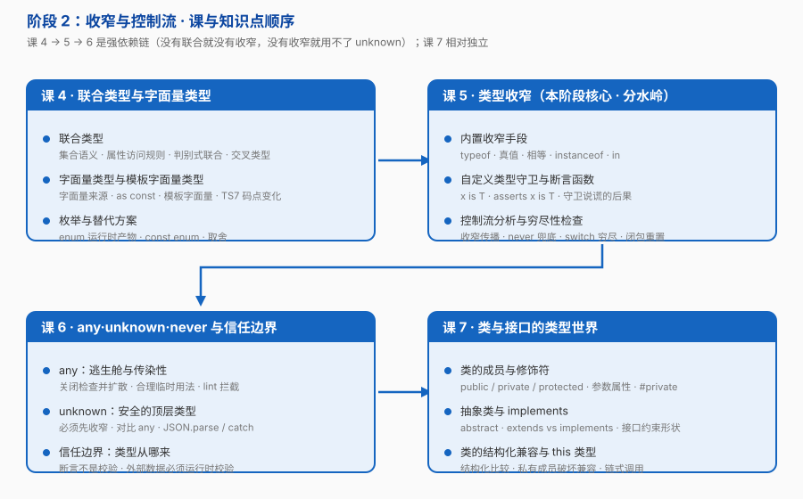

# 阶段 2：收窄与控制流

> 所属课程：[TypeScript](../01-学习路径总览.md) ｜ 故事章节：**「身份：活约束」——写个 `if`，类型自己变窄，契约开始生效**
> 上一阶段：[阶段 1《类型思维启蒙》](../1-类型思维启蒙/overview.md)
> 规模：4 课 / 12 知识点 ｜ **全课程最重的一段**

## 🎯 本阶段目标

- 让编译器看懂你的 `if`：掌握联合类型、字面量类型与全部收窄手段，写出**穷尽性检查**
- 建立安全边界意识：知道 `any` 为什么危险、`unknown` 为什么安全、类型断言为什么不是校验
- 能把 TS 的类（成员修饰符、抽象类、`implements`）用在真实业务代码里

## 📍 学习重点

- **联合类型是集合，收窄是"排除不可能的成员"**——这一句话能让你理解后面所有的收窄行为，包括 `unknown`
- **控制流分析是 TS 最聪明的地方**：你写一个 `if`，后面所有代码的类型自动变窄，不需要你做任何额外声明
- **`any` 会传染**：它不是"关掉这一处的检查"，而是沿着数据流向下游扩散，直到某处突然崩溃
- **类型断言是"我向编译器保证"，不是检查**：所有外部数据（接口响应、用户输入、`JSON.parse`）都必须在边界处做运行时校验
- **类与接口是 TS 的日常主力**：成员修饰符、`implements`、结构化兼容——零基础学员写业务代码几乎必用

## ✅ 必须掌握的知识点

| 知识点 | 所属课 | 学完应能 |
|--------|--------|----------|
| 联合类型 | 课 4 | 用集合视角解释 `\|`；为判别式联合写出正确的字段访问 |
| 字面量类型与模板字面量类型 | 课 4 | 用字面量联合表达有限取值；用模板字面量类型拼出字段名 |
| 枚举与替代方案 | 课 4 | 说清 `enum` 的运行时产物，并给出「字面量联合 vs enum」的选择理由 |
| 内置收窄手段 | 课 5 | 针对一个值选出正确的收窄方式，并说清各自适用的类型范围 |
| 自定义类型守卫与断言函数 | 课 5 | 为外部数据写 `x is T` 守卫；知道守卫"说谎"会有什么后果 |
| 控制流分析与穷尽性检查 | 课 5 | 用 `never` 兜底让 `switch` 漏分支时编译报错 |
| any：逃生舱与传染性 | 课 6 | 举出 `any` 扩散导致崩溃的例子；说出它仅有的合理用法与拦截手段 |
| unknown：安全的顶层类型 | 课 6 | 说清 `unknown` 与 `any` 的本质差别，并在 `JSON.parse` / `catch` 场景正确使用 |
| 信任边界：类型从哪来 | 课 6 | 解释为什么 `as` 不能替代运行时校验，并在边界处收敛不安全类型 |
| 类的成员与修饰符 | 课 7 | 正确使用 `public` / `private` / `protected` / `readonly` / 参数属性 |
| 抽象类与 implements | 课 7 | 区分 `extends` 与 `implements`，用接口约束实例形状 |
| 类的结构化兼容与 this 类型 | 课 7 | 预判两个类能否互相赋值；用 `this` 类型实现链式调用 |

## 🗺️ 本阶段路径图

> 顺序：**先联合（课 4）→ 再收窄（课 5）→ 再安全边界（课 6，依赖收窄）→ 最后类与接口（课 7，相对独立）**。
> 课 6 的 `unknown` 必须建立在课 5 的收窄之上（不收窄就用不了），因此排在课 5 之后。

## 本阶段产出

- [ ] `lessons/lesson-04-联合类型与字面量类型.md`
- [ ] `lessons/lesson-05-类型收窄.md`
- [ ] `lessons/lesson-06-any·unknown·never与信任边界.md`
- [ ] `lessons/lesson-07-类与接口的类型世界.md`

## ⚠️ 难度提示

- **课 5《类型收窄》是本阶段核心，也是全课程的分水岭**——学完它，你才真正开始"用" TS。
- 课 6 相对轻松，可当作课 5 之后的缓冲。
- 课 7 与阶段 1 课 3 的「结构化类型」呼应，理解了课 3 再来学它会很轻松。

## 🔗 下一步

阶段 3《泛型与类型编程》——类型开始可编程：一份代码适配无数形状，且不丢失类型信息。
