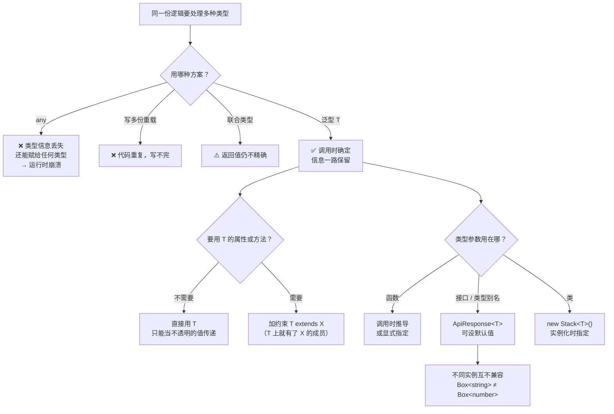

# 第 8 课：泛型基础

> 所属阶段：阶段 3《泛型与类型编程》｜ 水平：零基础 TS
> 本课知识点：泛型函数与类型参数推导、泛型约束与 keyof、泛型类型：接口、别名与默认值
> 故事情节：主角写了个 `identity` 函数，用 `any` 能跑但类型信息全丢了——**泛型让"不知道是什么类型"变成了"调用时才确定类型"**
> ✅ 状态：已完成（2026-09-03）｜ 实操环境：Node.js v22.14.0 + TypeScript 7.0.2（**文中所有输出均为本课本机实测**）

## 🎯 本课目标

- 写出带泛型的函数，并解释类型参数**在调用时如何被推导出来**
- 用 `extends` + `keyof` 约束类型参数，用 `T[K]` 取出属性类型
- 定义泛型接口 / 类型别名，设置默认类型参数，处理多个类型参数之间的依赖

## 📌 知识点导航

| # | 知识点 | 关键点 | 状态 |
|---|--------|--------|------|
| 1 | 泛型函数与类型参数推导 | 为什么需要泛型 / 调用时推导 / 显式指定 / **泛型不是 `any`** / 无约束 T 的限制 | ✅ |
| 2 | 泛型约束与 keyof | `extends` 约束 / `keyof` 运算符 / 索引访问类型 `T[K]` / 约束只要「最低限度」 | ✅ |
| 3 | 泛型类型：接口、别名与默认值 | 泛型接口与类型别名 / 默认类型参数 / 多参数依赖 / 泛型类 / 不同实例互不兼容 | ✅ |

## 📦 前置依赖（JS 概念）

| 用到的 JS 概念 | 掌握要求 | 回补 |
|---------------|---------|------|
| 函数与箭头函数 | 需理解 | — |
| `Promise` / `async·await` | 示例会用（`Promise<T>` 是泛型最经典的例子） | [JS 课 8 Promise](../javascript-core/02-课程目录.md)（未学，本课一句带过） |
| 对象的键与值 | 需理解（`keyof` 建立在其上） | — |
| `interface` / `type` | 强依赖（泛型类型建立在它们之上） | 阶段 1 课 3 ✅ |
| `class` 与修饰符 | 知识点 3 的泛型类用到 | 阶段 2 课 7 ✅ |

---

## 第一幕：起源与场景引入

> 🏛️ **起源**：泛型的学名叫**参数化多态（parametric polymorphism）**，是 1970 年代类型论里的老概念（ML 语言家族很早就有了）。工业界大规模使用是 2004 年的 **Java 5** 和 2005 年的 **C# 2.0**。**TypeScript 在 0.9 版本（2013）就加入了泛型**——回看课 1 那张版本表，你会发现它和泛型是同一批进来的，因为它是 TS 类型系统的支柱之一。
>
> 要理解泛型，先看它要解决的那个问题——**"同一份逻辑，要处理多种类型"**——历史上只有两条路：
>
> | 路线 | 做法 | 问题 |
> |------|------|------|
> | **特设多态**（重载） | 为每种类型写一份 | 代码重复，且写不完 |
> | **参数化多态**（泛型） | 一份代码，**类型作为参数** | 需要语言支持 |
>
> 泛型走的是第二条：**把"类型"也变成可以传的参数。** 于是关键区别出现了——`any` 是**放弃**类型信息，泛型是**推迟确定**类型信息，并且**一路带下去**。

**记住一句话就够了**：**`any` 是"我不知道这是什么"，泛型是"我现在不知道，但调用时一定知道，而且我会记住"。**

好，回到你的项目。

> 🎬 **场景**：订单系统稳定了，你要抽一套通用工具函数（`playground/lesson-08/bug.js`）：

```js
const orders = [
  { id: "o1", amount: 100, status: "paid" },
  { id: "g1", amount: 80, status: "pending" },
];

function first(list) { return list[0]; }                    // 取第一个
function pluck(list, key) { return list.map((i) => i[key]); } // 按 key 批量取值
function wrap(data) { return { code: 0, data }; }            // 包装 API 响应

console.log("first(ids)   =", first(["o1", "o2"]));
console.log("pluck(id)    =", pluck(orders, "id"));
console.log("pluck(nmae)  =", pluck(orders, "nmae"));   // 拼错了
const names = pluck(orders, "nmae");
console.log("names[0].toUpperCase() ->", names[0].toUpperCase());
```

**实测输出**（Node.js v22.14.0）：

```
first(ids)   = o1
first(orders) = o1
pluck(id)    = [ 'o1', 'g1' ]
pluck(nmae)  = [ undefined, undefined ]
wrap -> 0 2
TypeError: Cannot read properties of undefined (reading 'toUpperCase')
```

**拼错的 `nmae` 让 `pluck` 静默返回了两个 `undefined`，一直到几行之后的 `.toUpperCase()` 才炸。**

现在把它改成 TS。你试了三种写法，没有一种满意：

```ts
// 尝试一：用 any —— 能跑，但类型信息全丢了（课 6 的传染性）
function first(list: any[]): any { return list[0]; }
const x = first([1, 2, 3]);        // any
const y: string = x;               // ✅ 编译通过 —— 明明是 number 数组！

// 尝试二：为每种类型写一份 —— 写得完吗？
function firstOrder(list: Order[]): Order { return list[0]; }
function firstString(list: string[]): string { return list[0]; }
// ……

// 尝试三：联合类型 —— 返回值还是联合，不够精确
function first(list: (string | number)[]): string | number { return list[0]; }
const z = first(["a", "b"]);       // string | number，明明只可能是 string
```

三种方案各自死在一个地方：**`any` 丢信息、重载写不完、联合不够精确。**

---

## 第二幕：认知冲突

你写下了第一个泛型函数，然后撞上三件怪事：

```ts
// 实验 A：我明明没说过类型，它怎么知道的？
function identity<T>(value: T): T { return value; }
const a = identity("hello");   // a 是 string —— 谁告诉它的？

// 实验 B：同样是"不知道什么类型"，为什么泛型能拦、any 不能？
const fromAny: Order = firstAny([1, 2, 3]);        // ✅ 通过（危险）
const fromGeneric: Order = firstGeneric([1, 2, 3]); // ❌ 报错

// 实验 C：函数体里，T 到底能干什么？
function inspect<T>(value: T): string {
  return value.toString();   // ❌ 报错！连 toString 都不让用？
}
```

三个问题：

1. **`T` 是从哪来的？** 它怎么在调用时变成具体类型的？
2. **泛型和 `any` 到底差在哪？** 为什么一个拦得住、一个拦不住？
3. **我想在函数里用 `T` 的属性，为什么不行？** 该怎么解决？

---

## 第三幕：层层揭示

> ⚠️ **本课的默认环境**（与前七课一致）：所有示例在 `playground/lesson-08/` 目录下执行，**没有 `tsconfig.json`**，直接 `npx tsc xxx.ts` 编译单个文件。TS 7.0.2 默认 `strict: true`。

### 知识点 1：泛型函数与类型参数推导

> 关键点：为什么需要泛型 / 调用时推导 / 显式指定 / **泛型不是 `any`** / 无约束 T 的限制

#### 一句话定义

**泛型**把"类型"变成函数的**参数**：`function f<T>(x: T): T` 中的 `T` 是**类型参数**——它在**调用时**由实参推导出来，并一路带下去。

#### 直觉建立（类比）

**包裹上的标签。**

- **写死具体类型**（`string`）：标签上印死了"内装书籍"，只能装书
- **`any`**：**把标签撕了**——里面是什么谁也不知道，你说是什么就是什么（**信息丢失**）
- **泛型 `<T>`**：标签栏空着，**打包时装的是什么就填什么，而且标签一路跟着包裹走**（**信息保留**）

> 💡 **类比的边界**：真实标签是物理的、运行时也能看到；而**类型参数在运行时完全不存在**（擦除，课 1）——`identity<string>` 和 `identity<number>` 编译后是**同一个函数**。另一个重要差异：真实标签撕了就什么都没有；而**无约束的 `T` 在函数体内部几乎什么都做不了**——连 `toString()` 都不能调（下面实测）。这不是缺陷，而是"你还没告诉我 T 是什么，我不能假设它有什么"。

#### 核心原理

**① 语法与推导**

```ts
function identity<T>(value: T): T {
  return value;
}

const a = identity("hello");    // T 推导为 string   → a 是 string
const b = identity(42);         // T 推导为 number   → b 是 number
const c = identity([1, 2, 3]);  // T 推导为 number[] → c 是 number[]
```

**你不需要写 `identity<string>("hello")`**——TS 根据实参自动推导。这就是**类型参数推导**。

**② 什么时候必须显式指定**

```ts
function makeEmpty<T>(): T[] { return []; }
const e1 = makeEmpty();          // 没有实参可参考 → T 推导为 unknown
const e2 = makeEmpty<number>();  // ✅ 显式指定
```

**③ 泛型 vs `any`：本阶段最重要的一条认知**（实测）

```ts
function firstAny(list: any[]): any { return list[0]; }
function firstGeneric<T>(list: T[]): T { return list[0]; }

const fromAny = firstAny([1, 2, 3]);
const fromGeneric = firstGeneric([1, 2, 3]);

const wrong1: string = fromAny;      // ✅ 编译通过（危险！）
const wrong2: string = fromGeneric;  // ❌ error TS2322: Type 'number' is not assignable to type 'string'.
```

| | `any` | 泛型 `<T>` |
|--|-------|-----------|
| 语义 | "我不知道这是什么" | "现在不知道，调用时确定" |
| 返回值信息 | **丢失**（变成 `any`） | **保留**（还是 `number`） |
| 补全与检查 | 全没了 | 一路都在 |
| 传染性 | **会扩散**（课 6） | 不会 |
| 运行时 | 无（擦除） | 无（擦除） |

**一句话：`any` 是放弃检查，泛型是推迟确定。**

**④ 无约束的 `T` 在函数体里能做什么？**（实测，很反直觉）

```ts
function inspect<T>(value: T): string {
  return value.toString();   // ❌ error TS2339: Property 'toString' does not exist on type 'T'.
}
function inspectBad<T>(value: T): number {
  return value.length;       // ❌ error TS2339: Property 'length' does not exist on type 'T'.
}
```

**连 `toString` 都不让用！** 因为 `T` 可能是 `null` 或 `undefined`，它们没有 `toString`。

所以**无约束的泛型参数在函数体内部只能被当"不透明的值"传递**——赋值、传参、返回、放进数组，仅此而已。**想对 `T` 做点什么，就必须给它加约束**——这正是下一个知识点的动机。

**⑤ 你早就见过的泛型**

| 写法 | 含义 |
|------|------|
| `Array<T>` / `T[]` | 元素类型 |
| `Promise<T>` | resolve 出来的值的类型（一句带过：`Promise` 是"未来才会有的值"） |
| `readonly T[]` | 只读数组的元素类型 |
| `Record<K, V>` | 键类型 K、值类型 V 的对象（课 9 讲） |

**⑥ 命名约定**（不是语法规定，但全社区都这么写）

| 名字 | 通常用于 |
|------|---------|
| `T` | 第一个类型参数（Type） |
| `U` / `V` | 第二、三个 |
| `K` | 键（Key） |
| `V` | 值（Value） |
| `E` | 元素 / 错误（Element / Error） |

#### 示例演示

`playground/lesson-08/generics.ts`（**实测零报错**）：

```ts
// ① 最简单的泛型函数：T 是「类型的占位符」
function identity<T>(value: T): T {
  return value;
}
const a = identity("hello");    // T 推导为 string
const b = identity(42);         // T 推导为 number
const c = identity([1, 2, 3]);  // T 推导为 number[]

// ② 显式指定
const d = identity<string>("hello");

// ③ 泛型把类型信息一路带下去
function first<T>(list: T[]): T { return list[0]; }
const firstOrder = first([{ id: "o1", amount: 100 }]);
const firstId = firstOrder.id;   // ✅ 有补全、有检查

// ④ 多个类型参数
function pair<A, B>(a: A, b: B): [A, B] { return [a, b]; }
const p = pair("id", 1);         // [string, number]
```

**实测输出**：

```
hello 42 [ 1, 2, 3 ] hello o1 [ 'id', 1 ] [AsyncFunction: fetchOrder]
```

边界探测（`generics-probe.ts`，**实测 4 条报错**）：

```
generics-probe.ts(17,7): error TS2322: Type 'number' is not assignable to type 'string'.
generics-probe.ts(21,16): error TS2339: Property 'toString' does not exist on type 'T'.
generics-probe.ts(24,16): error TS2339: Property 'length' does not exist on type 'T'.
generics-probe.ts(35,35): error TS2345: Argument of type 'number' is not assignable to parameter of type 'string'.
```

同一文件里 `const wrong1: string = fromAny` **没有报错**——这就是泛型与 `any` 的分水岭。

#### 常见误区

1. **"泛型就是高级版的 `any`。"** → 正好相反：`any` **丢**信息，泛型**保**信息。这是整个阶段最重要的一条。
2. **"每次调用都要写 `<string>`。"** → 绝大多数情况能自动推导，不用写。
3. **"泛型函数里能随便用 `T` 的属性。"** → 不行，无约束的 `T` 连 `toString()` 都不能调（TS2339）。
4. **"泛型会让代码变慢。"** → 类型参数运行时完全不存在，编译后与手写多份的版本没有区别（擦除）。

#### 一句话记住

> **`any` 是放弃检查，泛型是推迟确定——前者把类型信息扔掉，后者把它一路带到底。**

#### 官方文档

- 泛型函数：https://www.typescriptlang.org/docs/handbook/2/generics.html
- 类型参数推导：https://www.typescriptlang.org/docs/handbook/2/generics.html#inference

---

### 知识点 2：泛型约束与 keyof

> 关键点：`extends` 约束 / `keyof` 运算符 / 索引访问类型 `T[K]` / 约束只要「最低限度」

#### 一句话定义

**泛型约束**是给类型参数设"招聘要求"：`<T extends HasId>` 表示"任何 T 都可以，但必须有 `id`"。**`keyof T`** 取出 `T` 的所有键组成一个联合类型，**`T[K]`** 取出 `T` 中键 `K` 对应值的类型。

#### 直觉建立（类比）

**招聘启事上的"任职要求"。**

`<T>` 是"谁来都行"，`<T extends HasId>` 是"**应聘者必须满足这些条件**"。

> 💡 **类比的边界**：真实招聘的任职要求往往还会写"具备 X 优先"这种软条件；而 TS 的约束是**硬门槛**——不满足直接编译不过。另一个更重要的差异：**约束只规定"最低限度"，不要求"精确匹配"**——应聘者多带几项技能（多几个属性）完全没问题（下面实测）。

#### 核心原理

**① `extends` 约束：给 T 一个下限**

```ts
interface HasId { id: string }

function logId<T extends HasId>(item: T): string {
  return item.id;   // ✅ 因为 T 一定有 id
}

logId({ id: "o1", amount: 100 });        // ✅ 多出来的属性没关系

const noId = { name: "no id field" };
logId(noId);
// ❌ error TS2741: Property 'id' is missing in type '{ name: string; }' but required in type 'HasId'.
```

**约束解决了知识点 1 留下的那个问题**：一旦声明 `T extends HasId`，函数体里就能访问 `item.id` 了。

**② `keyof`：把键变成类型**

```ts
interface Order { id: string; amount: number; status: string }
type OrderKeys = keyof Order;   // "id" | "amount" | "status"
```

**键从"值"变成了"类型"**——这是类型编程的第一块积木（课 9 会系统地讲）。

**③ `T[K]`：索引访问类型**

```ts
type IdType = Order["id"];        // string
type AmountType = Order["amount"]; // number
```

**④ 三者组合：本课最经典的签名**

```ts
function getField<T, K extends keyof T>(obj: T, key: K): T[K] {
  return obj[key];
}

const order: Order = { id: "o1", amount: 100, status: "paid" };
const id = getField(order, "id");        // string
const amount = getField(order, "amount"); // number
getField(order, "nmae");
// ❌ error TS2345: Argument of type '"nmae"' is not assignable to parameter of type 'keyof Order'.
```

拆解这个签名：

| 部分 | 作用 |
|------|------|
| `<T, K>` | 两个类型参数 |
| `K extends keyof T` | K 必须是 T 的键（**约束依赖另一个参数**） |
| `(obj: T, key: K)` | 参数 |
| `: T[K]` | 返回值类型 = T 中 K 键的值类型 |

**第一幕那个"拼错 key 静默返回 undefined"的 bug，就死在这一行签名上。**

**⑤ 约束 ≠ 精确匹配**（实测）

```ts
const extra = logId({ id: "o1", extra: 42 });   // ✅ 编译通过
```

多出来的属性不影响——**约束只检查"要求的那些在不在"**。注意这里没触发课 3 的"多余属性检查"，因为 `T` 被推导成了实参的完整类型。

**⑥ 一个容易困惑的报错差异**（实测，串起课 3）

同样是"不满足约束"，写法不同，报错码也不同：

```ts
const noId = { name: "no id field" };
logId(noId);                        // TS2741: Property 'id' is missing ...
logId({ name: "no id field" });     // TS2353: 'name' does not exist in type 'HasId'
```

原因：`noId` 是变量，TS 拿它的类型去检查约束，得到"缺 id"（TS2741）；而**直接写字面量**时，因为实参不满足约束，TS 会退回用**约束类型 `HasId`** 去检查，于是触发了课 3 讲过的**多余属性检查**（TS2353）。

**两条报错说的是同一件事，只是切入角度不同。** 想看"到底缺了什么"，用变量中转更清楚。

#### 示例演示

`playground/lesson-08/constraints.ts`（**实测零报错**）：

```ts
interface Order { id: string; amount: number; status: string }

// ① keyof：把对象的键取出来，组成一个字面量联合
type OrderKeys = keyof Order;   // "id" | "amount" | "status"

// ② 索引访问类型：用键取出对应值的类型
type IdType = Order["id"];      // string

// ③ 用 extends 约束类型参数：K 必须是 T 的键
function getField<T, K extends keyof T>(obj: T, key: K): T[K] {
  return obj[key];
}

// ④ 批量取值：第一幕那个 pluck 的泛型版
function pluck<T, K extends keyof T>(list: T[], key: K): T[K][] {
  return list.map((item) => item[key]);
}

// ⑤ 用 extends 约束「必须有某个形状」
interface HasId { id: string }
function logId<T extends HasId>(item: T): string {
  return item.id;   // ✅ 因为 T 一定有 id
}
```

**实测输出**：

```
id amount o1 o1 100 [ 'o1' ] [ 100 ] o1
```

边界探测（`constraints-probe.ts`，**实测 5 条报错**）：

```
constraints-probe.ts(15,30): error TS2345: Argument of type '"nmae"' is not assignable to parameter of type 'keyof Order'.
constraints-probe.ts(18,7): error TS2322: Type '"missing"' is not assignable to type 'keyof Order'.
constraints-probe.ts(27,22): error TS2353: Object literal may only specify known properties, and 'name' does not exist in type 'HasId'.
constraints-probe.ts(31,14): error TS2339: Property 'id' does not exist on type 'T'.
constraints-probe.ts(36,7): error TS2322: Type 'number' is not assignable to type 'string'.
```

第一条就是第一幕那个拼错 key 的正解。

其中 C 那条（`logId({ name: "no id field" })`）报的是 **TS2353**，原因见上面第 ⑥ 条。想看"缺 id"这条本意报错，用变量中转（**实测 `constraints-probe2.ts`，2 条报错**）：

```
constraints-probe2.ts(12,17): error TS2741: Property 'id' is missing in type '{ name: string; }' but required in type 'HasId'.
constraints-probe2.ts(16,17): error TS2345: Argument of type '{ id: number; }' is not assignable to parameter of type 'HasId'.
  Types of property 'id' are incompatible.
    Type 'number' is not assignable to type 'string'.
```

#### 常见误区

1. **"约束 = 类型必须完全等于约束。"** → 不是，只要**满足最低要求**即可，多出来的属性没问题。
2. **"`keyof T` 拿到的是键的数组。"** → 不是，它是**类型层面**的联合（`"id" | "amount"`），运行时不存在。
3. **"`T[K]` 里 K 可以是任意字符串。"** → 必须 `K extends keyof T`，否则报错。
4. **"约束会影响运行时性能。"** → 约束是编译期概念，运行时什么都没有。

#### 一句话记住

> **约束给 `T` 划了下限，`keyof` 把键变成类型，`T[K]` 把值类型取出来——三者一组合，拼错的 key 就再也溜不过去了。**

#### 官方文档

- 泛型约束：https://www.typescriptlang.org/docs/handbook/2/generics.html#generic-constraints
- `keyof` 与索引访问类型：https://www.typescriptlang.org/docs/handbook/2/keyof-types.html

---

### 知识点 3：泛型类型：接口、别名与默认值

> 关键点：泛型接口与类型别名 / 默认类型参数 / 多参数依赖 / 泛型类 / 不同实例互不兼容

#### 一句话定义

类型参数不只属于函数——**接口、类型别名、类都能带类型参数**，而且类型参数可以有**默认值**、可以**互相依赖**。

#### 直觉建立（类比）

**模具与成品。**

- `interface ApiResponse<T>` 是**模具**——规定了形状，但"装什么"留了个空位
- `ApiResponse<Order>` 是**成品**——把 `Order` 灌进模具，得到一个具体类型

> 💡 **类比的边界**：真实模具是实物、能反复用；而泛型类型**编译后完全消失**，`ApiResponse<Order>` 和 `ApiResponse<string>` 在运行时是同一个 JS 对象形状。另外真实模具一次只能出一种成品；泛型则是**每次实例化都生成一个新类型**——`Box<string>` 和 `Box<number>` 是**两个不同的类型，互不兼容**（下面实测）。

#### 核心原理

**① 泛型接口**

```ts
interface ApiResponse<T> {
  code: number;
  message: string;
  data: T;
}
const single: ApiResponse<Order> = { code: 0, message: "ok", data: order };
const list: ApiResponse<Order[]> = { code: 0, message: "ok", data: [order] };
```

**② 泛型类型别名**（课 3 的 interface vs type 选择在这里同样适用）

```ts
type Result<T> = { ok: true; data: T } | { ok: false; error: string };
```

**③ 默认类型参数**

```ts
interface Paged<T = Order> {
  items: T[];
  total: number;
}
const a: Paged = { items: [order], total: 1 };      // ✅ 用默认 Order
const b: Paged<string> = { items: ["x"], total: 1 };
```

规则与函数默认参数一样：**有默认值的参数必须排在没默认值的后面。**

**④ 多个类型参数，后面的可以依赖前面的**

```ts
interface KeyValue<K extends string | number, V = string> {
  key: K;
  value: V;
}
const kv: KeyValue<number> = { key: 1, value: "one" };          // V 用默认 string
const kv2: KeyValue<string, number> = { key: "one", value: 1 };
```

**⑤ 泛型类**（回扣课 7）

```ts
class Stack<T> {
  private items: T[] = [];
  push(item: T): this { this.items.push(item); return this; }
  pop(): T | undefined { return this.items.pop(); }
  get size(): number { return this.items.length; }
}
const stack = new Stack<number>();
stack.push(1).push(2);   // ✅ this 类型让链式调用保留 Stack<number>
```

注意 `new Stack<number>()`——**类的类型参数在实例化时指定**，而函数的类型参数在调用时推导。这是二者最大的差别。

**⑥ 不同实例互不兼容**（实测）

```ts
const stringBox: Box<string> = { value: "a" };
const numberBox: Box<number> = stringBox;
// ❌ error TS2322: Type 'Box<string>' is not assignable to type 'Box<number>'.
```

`Box<string>` 和 `Box<number>` 是两个不同的类型。**泛型擦除的是"类型参数"本身，但实例化出来的类型是编译期的真实存在。**

#### 示例演示

`playground/lesson-08/generic-types.ts`（**实测零报错**）：

```ts
// ① 泛型接口：一份模具，装什么由调用方决定
interface ApiResponse<T> {
  code: number;
  message: string;
  data: T;
}

// ② 泛型类型别名
type Result<T> = { ok: true; data: T } | { ok: false; error: string };

// ③ 默认类型参数
interface Paged<T = Order> {
  items: T[];
  total: number;
}
const defaultPaged: Paged = { items: [order], total: 1 };   // T = Order

// ④ 多个类型参数，后面的可以用前面的，也可以有默认值
interface KeyValue<K extends string | number, V = string> {
  key: K;
  value: V;
}

// ⑤ 泛型类
class Stack<T> {
  private items: T[] = [];
  push(item: T): this { this.items.push(item); return this; }
  pop(): T | undefined { return this.items.pop(); }
  get size(): number { return this.items.length; }
}
```

**实测输出**：

```
0 1 42 timeout
1 [ 'a' ] one 1
2 1
```

边界探测（`generic-types-probe.ts`，**实测 4 条报错**）：

```
generic-types-probe.ts(7,16): error TS2314: Generic type 'Box<T>' requires 1 type argument(s).
generic-types-probe.ts(19,20): error TS2344: Type 'string' does not satisfy the constraint 'number'.
generic-types-probe.ts(26,50): error TS2322: Type 'string' is not assignable to type 'number'.
generic-types-probe.ts(30,7): error TS2322: Type 'Box<string>' is not assignable to type 'Box<number>'.
  Type 'string' is not assignable to type 'number'.
```

#### 常见误区

1. **"泛型接口可以直接当类型用（`const x: Box`）。"** → 没有默认值时必须给参数（TS2314）。
2. **"默认类型参数可以放在前面。"** → 与函数默认参数一样，**有默认值的必须靠后**。
3. **"`Box<string>` 和 `Box<number>` 是同一个类型。"** → 不是，互不兼容（TS2322）。
4. **"泛型类的参数能自动推导。"** → 大部分情况可以（`new Stack()` 推导为 `Stack<unknown>`），但**推荐显式写出来**，可读性更好。

#### 一句话记住

> **泛型类型是把"形状模具"参数化：接口、别名、类都能带 `<T>`，可以有默认值，但每次实例化出来的都是彼此独立的新类型。**

#### 官方文档

- 泛型接口与类：https://www.typescriptlang.org/docs/handbook/2/generics.html#generic-types
- 默认类型参数：https://www.typescriptlang.org/docs/handbook/2/generics.html#generic-parameter-defaults

---

## 第四幕：实操验证

回到第一幕那套工具函数。用泛型重写（`playground/lesson-08/scenario.ts`）：

```ts
interface Order {
  id: string;
  amount: number;
  status: "pending" | "paid" | "refunded";
}

// ① 取第一个元素 —— 不用 any，类型信息完整保留
function first<T>(list: readonly T[]): T {
  if (list.length === 0) throw new Error("empty list");
  return list[0];
}

// ② 按 key 批量取值 —— key 拼错会被当场拦住
function pluck<T, K extends keyof T>(list: readonly T[], key: K): T[K][] {
  return list.map((item) => item[key]);
}

// ③ API 响应包装 —— 一份模具适配所有数据
interface ApiResponse<T> {
  code: number;
  message: string;
  data: T;
}
function ok<T>(data: T): ApiResponse<T> {
  return { code: 0, message: "ok", data };
}

const orders: Order[] = [
  { id: "o1", amount: 100, status: "paid" },
  { id: "g1", amount: 80, status: "pending" },
];

const head = first(orders);                 // Order（不是 any）
const ids = pluck(orders, "id");            // string[]
const amounts = pluck(orders, "amount");    // number[]
const response = ok(orders);                // ApiResponse<Order[]>
```

**实测结果**：`npx tsc scenario.ts` **零报错**，运行 `node scenario.js`：

```
head.id        = o1
ids            = [ 'o1', 'g1' ]
amounts        = [ 100, 80 ]
response       = 0 2
total          = 180
```

**每一个返回值都带着精确的类型**，一个 `any` 都没用。

再看防线立没立住（`scenario-guard.ts`，**实测 3 条报错 + 1 次运行时崩溃**）：

```
scenario-guard.ts(24,28): error TS2345: Argument of type '"nmae"' is not assignable to parameter of type 'keyof Order'.
scenario-guard.ts(35,7): error TS2322: Type 'number' is not assignable to type 'Order'.
scenario-guard.ts(39,14): error TS2339: Property 'id' does not exist on type 'T'.
fromAny -> Cannot read properties of undefined (reading 'toUpperCase')
```

| 第一幕的用法 | any 版本 | 泛型版本 |
|-------------|---------|---------|
| `pluck(orders, "nmae")` | 静默返回 `[undefined, undefined]` | **TS2345 当场拦下** |
| `first([1,2,3])` 当订单用 | ✅ 编译通过，**运行时崩** | **TS2322 当场拦下** |
| 函数体里访问 `obj.id` | 随便访问（不检查） | **TS2339 逼你加约束** |

最后那条运行时崩溃，是 `any` 版本留下的：**`firstAny([1,2,3])` 赋给 `Order` 编译通过，运行到 `.toUpperCase()` 才炸。** 而泛型版本在编译期就拦住了。

> ✅ **回扣课 6**：`any` 的传染性在这里表现得淋漓尽致——它让不安全的值**伪装成安全类型**一路传下去，直到某个使用点崩溃。泛型从根上没有这个问题，因为它**从不丢弃类型信息**。

---

## 第五幕：体系收束

> 📍 **全局定位**：本课是**阶段 3 的入门**，也是整个 TS 学习里"从会用类型到会设计类型"的转折点。
>
> 一句话概括本课的价值：**在此之前，类型是你给值贴的标签；从此以后，类型可以像值一样被传递、被推导、被组合。**
>
> 这条线会这样走下去：
> - **课 9（下一课）**：`keyof` + 索引访问类型只是**四块积木中的两块**；加上**映射类型**和**条件类型**，你就能手写 `Partial` / `Pick` / `Omit` 这些内置工具类型——**那是全课程抽象度最高的一课**
> - **课 10-12**：tsconfig、声明文件、工具链里到处是泛型（比如 `Promise<T>` 的声明、`.d.ts` 里的泛型接口）
> - **课 13**：类型体操的代价——本课学的泛型是"好泛型"，课 13 会讲什么样的泛型是"过度设计"

**现在你会了什么**：

- 能写出带泛型的函数，并解释**类型参数在调用时如何被推导出来**（以及什么时候必须显式指定）
- 能用 `extends` + `keyof` 约束类型参数，用 `T[K]` 取属性类型，写出 `getField<T, K extends keyof T>` 这种经典签名
- 能定义泛型接口 / 类型别名 / 泛型类，设置默认类型参数，处理多参数依赖
- 记住了本阶段最重要的一条认知：**`any` 是放弃检查，泛型是推迟确定——前者丢信息，后者保信息**

> 🔗 **下一步**：课 9《类型编程三件套与内置工具类型》——**全课程抽象度最高的一课**。学完你能手写出 `Partial` / `Pick` / `Omit` 的每一行实现，看懂 `ReturnType<T>` 是怎么"从函数类型里把返回值类型挖出来"的。
>
> ⚠️ 若卡住，**允许先只学「映射类型」和「内置工具类型的用法」**，学完阶段 4 写过真实项目后，再回头补「条件类型与 `infer`」。**泛型是用着用着就懂的知识，先会用，再懂原理。**

---

## 🐞 常见误区

1. **"泛型就是高级版的 `any`。"** → 相反：`any` 丢信息，泛型保信息。这是本阶段最重要的一条。
2. **"每次调用泛型都要写 `<string>`。"** → 大多数情况自动推导。
3. **"泛型函数里能随便用 `T` 的属性。"** → 不行，无约束的 `T` 连 `toString()` 都不能调。
4. **"约束要求类型完全等于约束条件。"** → 不是，只要满足最低要求，多出的属性没问题。
5. **"`keyof T` 拿到的是键的数组。"** → 是**类型层面的联合**，运行时不存在。
6. **"泛型接口不传参数也能用。"** → 没有默认值时必须传（TS2314）。
7. **"`Box<string>` 和 `Box<number>` 兼容。"** → 不兼容，是两个不同的类型（TS2322）。

## 一图总结



> 关键记忆点：① `any` 丢信息、泛型保信息；② 约束给 T 划下限；③ `keyof` 取键、`T[K]` 取值、`extends` 定约束。

## 课后小测

**Q1**：`firstAny` 和 `firstGeneric` 的返回值，有什么不同？

```ts
function firstAny(list: any[]): any { return list[0]; }
function firstGeneric<T>(list: T[]): T { return list[0]; }

const fromAny = firstAny([1, 2, 3]);
const fromGeneric = firstGeneric([1, 2, 3]);
```

- A. 两者都是 `number`
- B. `fromAny` 是 `any`，`fromGeneric` 是 `number`
- C. 两者都是 `any`
- D. 两者都是 `unknown`

<details><summary>答案与解析</summary>

**答案：B**。

- `fromAny` 是 `any` → 赋给任何类型都不报错（实测 `const wrong: string = fromAny` 编译通过），**信息丢了**
- `fromGeneric` 是 `number` → 赋给 `string` 会报 `TS2322: Type 'number' is not assignable to type 'string'`，**信息保留了**

这就是本阶段最重要的一条认知：**`any` 是放弃检查（丢信息），泛型是推迟确定（保信息）。**

</details>

**Q2**：为什么下面这个函数会报错？怎么修？

```ts
function getLength<T>(value: T): number {
  return value.length;
  // ❌ error TS2339: Property 'length' does not exist on type 'T'.
}
```

- A. 泛型不能用于返回值，改成 `any` 就行
- B. `T` 没有约束，编译器不知道它有 `length`；改成 `<T extends { length: number }>`
- C. `length` 是保留字，换个名字
- D. 这是 TS 的 bug，用 `as any` 绕过

<details><summary>答案与解析</summary>

**答案：B**。

`T` 无约束时，它可能是 `number`、`null`、`undefined`——它们都没有 `length`。所以 TS 不允许访问 `T` 上的任何属性（**连 `toString()` 都不行，本课实测过**）。

正确写法——**加约束**：

```ts
function getLength<T extends { length: number }>(value: T): number {
  return value.length;   // ✅
}
getLength("hello");   // ✅ string 有 length
getLength([1, 2, 3]); // ✅ 数组有 length
getLength(42);        // ❌ number 没有 length
```

约束的本质是"**招聘要求**"：声明 T 至少具备什么，函数体里就能用什么。

</details>

**Q3**：关于 `keyof` 与 `T[K]`，下列说法正确的是？

```ts
interface Order { id: string; amount: number }
type Keys = keyof Order;
function getField<T, K extends keyof T>(obj: T, key: K): T[K] { return obj[key]; }
```

- A. `Keys` 是 `["id", "amount"]` 数组
- B. `getField(order, "nmae")` 会编译通过，但返回 `undefined`
- C. `Keys` 是 `"id" | "amount"` 联合类型；拼错的 key 会被拦下
- D. `T[K]` 中的 `K` 可以是任意字符串

<details><summary>答案与解析</summary>

**答案：C**。

- `keyof Order` 得到的是**类型层面的联合** `"id" | "amount"`，不是数组（运行时不存在）
- 因为 `K extends keyof T`，传 `"nmae"` 会报 `TS2345: Argument of type '"nmae"' is not assignable to parameter of type 'keyof Order'`——**这正是第一幕那个静默 bug 的解药**
- 返回值 `T[K]` 是索引访问类型：`getField(order, "id")` 得到 `string`，`getField(order, "amount")` 得到 `number`

B 错（泛型版本会拦住，any 版本才会静默）；D 错（K 必须受 `keyof T` 约束）。

</details>

## 🚀 下一批接力提示词

> 学完本课后，**复制下面这段文字发给 AI**，即可无缝进入下一批（无需重新描述上下文）：

```
继续学 TypeScript。我的学习档案在 frontend/typescript-core/00-学习档案.md，
刚学完阶段 3《泛型与类型编程》的课 8《泛型基础》三个知识点
（泛型函数与类型参数推导 / 泛型约束与 keyof / 泛型类型：接口、别名与默认值），
请按大纲继续讲解下一课《类型编程三件套与内置工具类型》。
```

## 🧭 课程导航

⬅️ **上一课**：[课 7：类与接口的类型世界](../../2-收窄与控制流/lessons/lesson-07-类与接口的类型世界.md)（阶段 2 收官）

➡️ **下一课**：[课 9：类型编程三件套与内置工具类型](lesson-09-类型编程三件套与内置工具类型.md)（全课程抽象度最高）

📚 **返回目录**：[课程目录](../../02-课程目录.md)

---

## 附：本课示例文件清单

所有示例位于 `playground/lesson-08/`，均可直接 `npx tsc <文件名>` 复现：

| 文件 | 用途 | 预期结果 |
|------|------|---------|
| `bug.js` | 第一幕：JS 通用函数拼错 key 的静默失败 | 直接 `node bug.js` 运行 |
| `generics.ts` | 知识点 1：泛型函数与类型参数推导主示例 | 零报错，可运行 |
| `generics-probe.ts` | 知识点 1：泛型 vs any、无约束 T 的限制 | 4 条报错（故意）；`wrong1` 那行不报错 |
| `constraints.ts` | 知识点 2：keyof / 索引访问 / extends 约束主示例 | 零报错，可运行 |
| `constraints-probe.ts` | 知识点 2：拼错 key、约束不满足、无约束访问属性 | 5 条报错（故意） |
| `constraints-probe2.ts` | 知识点 2：用变量中转看「缺 id」的真实报错 | 2 条报错（故意） |
| `generic-types.ts` | 知识点 3：泛型接口 / 别名 / 默认值 / 泛型类 | 零报错，可运行 |
| `generic-types-probe.ts` | 知识点 3：缺参数、违反约束、实例互不兼容 | 4 条报错（故意） |
| `scenario.ts` | 第四幕：泛型版工具函数库 | 零报错，输出 5 行 |
| `scenario-guard.ts` | 第四幕：泛型 vs any 的结局对比 | 3 条报错 + 1 次运行时崩溃（故意） |
