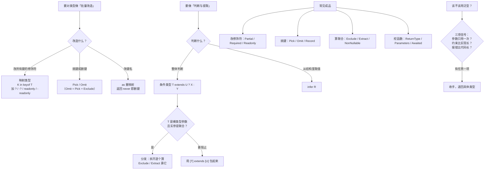

# 第 9 课：类型编程三件套与内置工具类型

> 所属阶段：阶段 3《泛型与类型编程》｜ 水平：零基础 TS
> 本课知识点：映射类型、条件类型与 infer、内置工具类型全景与手写实现、泛型的实际设计场景
> 故事情节：主角面对"把 User 的所有字段变成可选"这种需求，原本要手写一遍——**映射类型让它变成了一行**
> ✅ 状态：已完成（2026-09-03）｜ 实操环境：Node.js v22.14.0 + TypeScript 7.0.2（**文中所有输出均为本课本机实测**）
> ⚠️ **全课程抽象度最高的一课**，卡住可先学「映射类型 + 工具类型用法」，回头再补「条件类型与 infer」

## 🎯 本课目标

- 用 `in` 遍历键、`+?` / `-readonly` 改修饰符、`as` 重映射键名，写出映射类型
- 写出条件类型并用 `infer` 提取类型；规避"裸类型参数会分发"这个坑
- 逐个手写 12 个内置工具类型的实现，并为 API 包装 / 事件总线 / 表单映射设计类型

## 📌 知识点导航

| # | 知识点 | 关键点 | 状态 |
|---|--------|--------|------|
| 1 | 映射类型 | `in` 遍历键 / 修饰符 `+?` 与 `-readonly` / 键重映射 `as` / 只作用于一层 | ✅ |
| 2 | 条件类型与 infer | `extends` 三元 / **裸类型参数会分发** / `infer` 提取 / 分发的坑与 `[T]` 规避 | ✅ |
| 3 | 内置工具类型全景与手写实现 | 12 个工具类型逐个手写，并用「类型层面的单元测试」验证与内置版等价 | ✅ |
| 4 | 泛型的实际设计场景 | API 响应包装 / 事件总线类型 / 表单字段映射 / 泛型滥用信号 | ✅ |

## 📦 前置依赖（JS 概念）

| 用到的 JS 概念 | 掌握要求 | 回补 |
|---------------|---------|------|
| 数组与对象的高阶方法（`map` / `reduce`） | 类比用（映射类型 ≈ 类型的 `map`） | — |
| 联合类型与 `keyof` | **强依赖** | 阶段 2 课 4 ✅ + 课 8 ✅ |
| 泛型基础 | **强依赖** | 课 8 ✅ |

---

## 第一幕：起源与场景引入

> 🏛️ **起源**：前面八课学的所有类型，都是"**一次性写出来的**"。从这一课开始，类型可以**被计算出来**。
>
> 让类型可编程，靠的是三块积木，它们不是同时出现的，而是分批加进 TS 的：
>
> | 积木 | 大约何时加入 | 解决的问题 |
> |------|------------|-----------|
> | **映射类型** | TS 2.x（2016-2018） | "把这个类型的所有字段改成可选"这类批量改造 |
> | **条件类型 + `infer`** | TS 2.8（2018） | "如果 T 是数组，就取出元素类型"这类判断与提取 |
> | **键重映射 `as`** | TS 4.x | "把所有键名加个前缀" |
>
> 而**内置工具类型**（`Partial` / `Pick` / `Omit` ……）本质上是**官方用这三块积木写好的一批"常用类型函数"**——所以本课的知识点 3 不是让你背它们，而是让你**自己写出来**。`Omit`、`Awaited` 这些还是后来陆续补进标准库的，说明这套积木到今天还在生长。
>
> 一句话概括这一课：**类型不再只能被"声明"，还能被"计算"。**

**记住三句话就够了**：映射类型做**批量改造**，条件类型做**判断分支**，`infer` 做**从结构里取值**。

好，回到你的项目。

> 🎬 **场景**：订单系统的类型越来越多，你开始频繁遇到"把某个类型改一改"的需求（`playground/lesson-09/bug.js`）：

```js
const order = { id: "o1", amount: 100, status: "pending" };

// 需求一：部分更新 —— 表单编辑只提交改动的字段
function updateOrder(base, patch) {
  return { ...base, ...patch };
}
const updated = updateOrder(order, { ammount: 200 });   // 手滑拼错

// 需求二：事件总线 —— 事件名靠字符串对得上
const handlers = {};
function on(event, handler) { handlers[event] = handler; }
function emit(event, payload) { handlers[event](payload); }
on("orderPaid", (p) => console.log("paid:", p.orderId));
emit("order_paid", { orderId: "o1" });   // 事件名不一致 → 崩

// 需求三：同一份数据，不同场景要不同的字段子集
function toSummary(o) { return { id: o.id, amount: o.amount }; }
```

**实测输出**（Node.js v22.14.0）：

```
updated = { id: 'o1', amount: 100, status: 'pending', ammount: 200 }
amount 还是 100 ，却多了个 ammount = 200
emit(order_paid) -> TypeError: handlers[event] is not a function
summary = { id: 'o1', amount: 100 }
```

三个需求，三个问题：

1. **拼错的 `ammount` 没人管**——`amount` 还是 100，反而多出一个垃圾字段
2. **事件名对不上**——到运行时才崩
3. **字段子集靠手写**——`toSummary` 里的字段名和 `Order` 的定义**是两份独立的真相**，改一处容易漏另一处

---

## 第二幕：认知冲突

你想用类型解决它们，但卡在"怎么表达"上：

```ts
// 实验 A：把 Order 的所有字段变成可选 —— 手写一遍吗？
type EditableOrder = {
  id?: string;
  amount?: number;
  status?: "pending" | "paid" | "refunded";
};   // 写完了，但 Order 加一个字段，这里就漏了

// 实验 B：从函数类型里把返回值类型"挖"出来 —— 怎么表达？
type CreateResult = ???   // 想要 Order

// 实验 C：用工具类型改完了，为什么里层没跟着变？
const draft: Partial<Nested> = { meta: { tags: [] } };
draft.meta.tags.push("x");   // ❌ 报错：'draft.meta' is possibly 'undefined'
```

三个疑惑：

1. **"把一个类型的所有字段都改一遍"** 这种需求，有没有不用手写的写法？
2. **"如果 T 是 X 就取 Y"** 这种判断，类型层面能做吗？
3. **工具类型到底改到哪一层？** 为什么里层不受影响？

---

## 第三幕：层层揭示

> ⚠️ **本课的默认环境**（与前八课一致）：所有示例在 `playground/lesson-09/` 目录下执行，**没有 `tsconfig.json`**，直接 `npx tsc xxx.ts` 编译单个文件。TS 7.0.2 默认 `strict: true`。

### 知识点 1：映射类型

> 关键点：`in` 遍历键 / 修饰符 `+?` 与 `-readonly` / 键重映射 `as` / 只作用于一层

#### 一句话定义

**映射类型**用 `[K in 键的联合]` 遍历一个类型的所有键，**批量生成新类型**——它是"类型的 `map`"。

#### 直觉建立（类比）

**工厂的批量加工流水线。**

传送带上是原来的一批零件（键），经过加工站后统一改造成新的形状：

- 加工站 1：**改值类型**（`T[K]` → `string`）
- 加工站 2：**改修饰符**（加 `?`、加 `readonly`，或去掉它们）
- 加工站 3：**改键名**（`as` 重映射）

> 💡 **类比的边界**：真实流水线是**逐个处理实物**；映射类型是**编译期一次性展开**——`Partial<Order>` 会被展开成 `{ id?: string; amount?: number; ... }`，运行时什么都没有。另一个关键差异：**流水线可以设计成多层的，而映射类型只处理一层**——嵌套对象里的字段不会被递归改造（下面实测）。

#### 核心原理

**① 基本语法**

```ts
type Copy<T> = { [K in keyof T]: T[K] };   // 原样复制一份
```

拆解：`keyof T` 取出键的联合 → `in` 逐个遍历 → `T[K]` 取原来的值类型。

**② 改修饰符：`+` 加上，`-` 去掉**

| 写法 | 效果 |
|------|------|
| `[K in keyof T]?` | 全部变**可选**（`+?` 的简写） |
| `[K in keyof T]-?` | 去掉可选，全部变**必填** |
| `readonly [K in keyof T]` | 全部变**只读** |
| `-readonly [K in keyof T]` | 去掉只读 |

**③ 挑键与改键名**

```ts
type MyPick<T, K extends keyof T> = { [P in K]: T[P] };   // 只保留指定的键

type Getters<T> = {                                        // 键名加前缀
  [K in keyof T as `get${Capitalize<string & K>}`]: () => T[K];
};
```

`as` 子句里返回 **`never`** 就能**删掉某个键**——这是过滤字段的标准技巧：

```ts
type OnlyStringKeys<T> = {
  [K in keyof T as T[K] extends string ? K : never]: T[K];
};
```

**④ 只作用一层**（实测）

```ts
interface Nested { meta: { tags: string[] } }
const deep: Partial<Nested> = { meta: { tags: [] } };
deep.meta.tags.push("y");
// ❌ error TS18048: 'deep.meta' is possibly 'undefined'.
```

**报错只说 `meta` 可能不存在**——说明 `Partial` 改的是**外层**，`tags` 本身没变成可选。**映射类型不会递归。** 想要深层可选，得自己写递归版本（属于类型体操范畴，课 13 会讲代价）。

**⑤ 会保留什么**（实测）

- **索引签名会被保留**：`Copy<{ [k: string]: number }>` 之后依然能用任意键
- **可选性、只读性会被映射类型的修饰符覆盖**

#### 示例演示

`playground/lesson-09/mapped.ts`（**实测零报错**）：

```ts
// ② 全部变可选 —— 手写 Partial
type MyPartial<T> = { [K in keyof T]?: T[K] };
const draft: MyPartial<Order> = { id: "o1" };

// ③ 去掉可选与只读
type MyRequired<T> = { [K in keyof T]-?: T[K] };
type MyMutable<T> = { -readonly [K in keyof T]: T[K] };

// ④ 挑出部分键 —— 手写 Pick
type MyPick<T, K extends keyof T> = { [P in K]: T[P] };

// ⑤ 键重映射
type Getters<T> = {
  [K in keyof T as `get${Capitalize<string & K>}`]: () => T[K];
};

// ⑥ 手写 Record
type MyRecord<K extends keyof any, V> = { [P in K]: V };
```

**实测输出**：

```
{ id: 'o1' } { id: 'o1', amount: 100, status: 'pending' } { id: 'o1', amount: 100, status: 'paid' } { id: 'o1', amount: 100 } { pending: 'PENDING', paid: 'PAID', refunded: 'REFUNDED' }
```

边界探测（`mapped-probe.ts`，**实测 1 条报错**）：

```
mapped-probe.ts(11,26): error TS2344: Type '"nmae"' does not satisfy the constraint 'keyof Order'.
```

同一文件里另外三条**没报错**，各自说明了映射类型的一条性质：`as` + `never` 过滤生效、索引签名被保留、里层不受影响（用 `?.` 之后正常访问）。

#### 常见误区

1. **"`Partial` 会把嵌套对象也变成可选。"** → 不会，只作用一层（实测 TS18048）。
2. **"映射类型能挑任意键。"** → 键必须来自 `keyof T`（或某个键的联合），挑不存在的会报 TS2344。
3. **"`-?` 是删除可选属性。"** → 是"去掉可选标记，让它变必填"，不是删除这个键。**删键要用 `as` + `never`。**
4. **"映射类型运行时会有开销。"** → 编译期展开，运行时零存在。

#### 一句话记住

> **映射类型就是类型的 `map`：遍历键、改值、改修饰符、还能改键名——但只改一层。**

#### 官方文档

- 映射类型：https://www.typescriptlang.org/docs/handbook/2/mapped-types.html
- 键重映射：https://www.typescriptlang.org/docs/handbook/2/mapped-types.html#key-remapping-via-as

---

### 知识点 2：条件类型与 infer

> 关键点：`extends` 三元 / **裸类型参数会分发** / `infer` 提取 / 分发的坑与 `[T]` 规避

#### 一句话定义

**条件类型**是类型层面的三元表达式：`T extends U ? X : Y`。**`infer`** 用来在匹配的同时**把某个位置的类型提取出来**。

#### 直觉建立（类比）

**类型层面的 `if` / `else`**——和 JS 的三元运算符长得一模一样，只是操作对象从"值"变成了"类型"。

> 💡 **类比的边界**（**这是本阶段最大的坑**）：值层面的三元是"二选一"，只算一次；而条件类型在**类型参数是"裸"的联合类型时，会把联合拆开、逐个计算再合并结果**——这叫**分发（distribution）**。JS 的 `?:` 绝不会这么干。

#### 核心原理

**① 基本语法**

```ts
type IsString<T> = T extends string ? "yes" : "no";
type A1 = IsString<string>;   // "yes"
type A2 = IsString<number>;   // "no"
```

**② 分发：联合被拆开逐个算**

```ts
type ToArray<T> = T extends unknown ? T[] : never;
type B1 = ToArray<string | number>;   // string[] | number[]   ← 分发了！
```

**③ 阻止分发：把类型参数包成元组**

```ts
type ToArrayNoDist<T> = [T] extends [unknown] ? T[] : never;
type B2 = ToArrayNoDist<string | number>;   // (string | number)[]
```

**分发有时是你要的，有时是坑。** 需要"整体判断"时就用 `[T] extends [U]`。

**④ 分发最经典的坑：判断 `never`**（实测）

```ts
type IsNever<T> = T extends never ? true : false;
type A1 = IsNever<never>;
const check: A1 = true;
// ❌ error TS2322: Type 'true' is not assignable to type 'never'.
```

**`IsNever<never>` 得到的是 `never`，不是 `true`！** 因为 `never` 是"空联合"——分发到零个成员，结果就是 `never`。

正确写法——**阻止分发**：

```ts
type IsNeverCorrect<T> = [T] extends [never] ? true : false;   // ✅ true
```

**⑤ `infer`：从结构里提取类型**

```ts
type MyReturnType<T> = T extends (...args: any[]) => infer R ? R : never;
type C1 = MyReturnType<() => string>;   // string

type ElementOf<T> = T extends (infer U)[] ? U : never;
type C2 = ElementOf<number[]>;          // number
```

`infer R` 的意思是"**这里应该有个类型，请把它记下来，命名为 R**"。

⚠️ `infer` **只能**出现在条件类型的 `extends` 右侧（实测）：

```
conditional-probe.ts(25,15): error TS1338: 'infer' declarations are only permitted in the 'extends' clause of a conditional type.
```

#### 示例演示

`playground/lesson-09/conditional.ts`（**实测零报错**）：

```ts
// ② 裸类型参数会「分发」
type ToArray<T> = T extends unknown ? T[] : never;
type B1 = ToArray<string | number>;          // string[] | number[]

// ③ 用 [T] 包起来阻止分发
type ToArrayNoDist<T> = [T] extends [unknown] ? T[] : never;
type B2 = ToArrayNoDist<string | number>;    // (string | number)[]

// ④ infer 提取
type MyReturnType<T> = T extends (...args: any[]) => infer R ? R : never;
type ElementOf<T> = T extends (infer U)[] ? U : never;

// ⑤ 分发的正面用途：从联合里剔除成员
type MyExclude<T, U> = T extends U ? never : T;
type MyExtract<T, U> = T extends U ? T : never;
type MyNonNullable<T> = T extends null | undefined ? never : T;
```

**实测输出**（每个 `const` 都是一条"类型断言"，写错就会编译报错）：

```
yes [ 'x', 1 ] hello 42 b text
```

边界探测（`conditional-probe.ts`，**实测 2 条报错**）：

```
conditional-probe.ts(6,7): error TS2322: Type 'true' is not assignable to type 'never'.
conditional-probe.ts(25,15): error TS1338: 'infer' declarations are only permitted in the 'extends' clause of a conditional type.
```

第一条就是上面第 ④ 条那个 `IsNever` 的坑——**报错信息本身就是证据**。

#### 常见误区

1. **"条件类型和三元运算符一样。"** → 不一样：**裸类型参数会分发**，联合被拆开逐个算。
2. **"`IsNever<T> = T extends never ? true : false` 能用。"** → 不能，对 `never` 得到 `never`。必须用 `[T] extends [never]`。
3. **"`infer` 可以写在任何位置。"** → 只能在条件类型 `extends` 的右侧（TS1338）。
4. **"分发永远是坏事。"** → 不是，`Exclude` / `Extract` / `NonNullable` 全都靠它实现。

#### 一句话记住

> **条件类型是类型的 `if`，`infer` 是"把这里挖出来"——但记住：裸类型参数会把联合拆开分发，需要整体判断时用 `[T]` 包起来。**

#### 官方文档

- 条件类型：https://www.typescriptlang.org/docs/handbook/2/conditional-types.html
- `infer`：https://www.typescriptlang.org/docs/handbook/2/conditional-types.html#inferring-within-conditional-types

---

### 知识点 3：内置工具类型全景与手写实现

> 关键点：12 个工具类型逐个手写，并用"类型层面的单元测试"验证与内置版等价

#### 一句话定义

**内置工具类型**是 TS 官方用映射类型与条件类型写好的一批"类型函数"。它们**不是语法，是普通的 `type` 定义**——所以你能自己写出来。

#### 核心原理：按实现机制分四组

| 分组 | 工具类型 | 靠什么实现 |
|------|---------|-----------|
| **改修饰符**（映射） | `Partial` / `Required` / `Readonly` | `[K in keyof T]` + `?` / `-?` / `readonly` |
| **挑键删键**（映射 + 约束） | `Pick` / `Omit` / `Record` | `[P in K]` / `Exclude` |
| **联合运算**（条件 + 分发） | `Exclude` / `Extract` / `NonNullable` | `T extends U ? never : T` |
| **挖函数类型**（条件 + infer） | `ReturnType` / `Parameters` / `Awaited` | `infer` |

#### 逐个手写（`playground/lesson-09/utilities.ts`，**实测零报错**）

```ts
// ── 改修饰符 ──
type MyPartial<T>   = { [K in keyof T]?: T[K] };
type MyRequired<T>  = { [K in keyof T]-?: T[K] };
type MyReadonly<T>  = { readonly [K in keyof T]: T[K] };

// ── 挑键删键 ──
type MyPick<T, K extends keyof T> = { [P in K]: T[P] };
type MyOmit<T, K extends keyof any> = MyPick<T, Exclude<keyof T, K>>;  // 删 = 挑出「除 K 以外」
type MyRecord<K extends keyof any, V> = { [P in K]: V };

// ── 联合运算 ──
type MyExclude<T, U> = T extends U ? never : T;
type MyExtract<T, U> = T extends U ? T : never;
type MyNonNullable<T> = T extends null | undefined ? never : T;

// ── 挖函数类型 ──
type MyReturnType<T extends (...args: any[]) => any> = T extends (...args: any[]) => infer R ? R : never;
type MyParameters<T extends (...args: any[]) => any> = T extends (...args: infer P) => any ? P : never;
type MyAwaited<T> = T extends Promise<infer U> ? MyAwaited<U> : T;   // 递归剥掉多层 Promise
```

**三个值得单独说的**：

1. **`Omit` 不是独立的机制**——它是"挑出除 K 以外的键"：`Pick<T, Exclude<keyof T, K>>`。这也解释了为什么 `Omit` 比 `Pick` 晚进标准库。
2. **`Exclude` / `Extract` / `NonNullable` 全靠分发**——`Exclude<"a"|"b", "a">` 会把联合拆开，逐个判断，`"a"` 命中变成 `never`，剩下 `"b"`。
3. **`MyAwaited` 是递归的**——`Promise<Promise<Order>>` 会被剥两层得到 `Order`。递归条件类型是 TS 4.x 才稳定的能力。

#### 怎么验证手写版和内置版一样？——类型层面的单元测试

普通代码写测试用 `assert`，类型层面可以用**"双向可赋值"**来断言两个类型结构等价（`utilities-probe.ts`）：

```ts
type Equivalent<A, B> = [A] extends [B] ? ([B] extends [A] ? true : false) : false;

const t01: Equivalent<MyPartial<Order>, Partial<Order>> = true;
const t02: Equivalent<MyRequired<Order>, Required<Order>> = true;
// …… 一直到 t12
```

**任何一组不等价，`= true` 就会编译报错。** 这就是"类型层面的单元测试"。

**实测结果**：`t01` ~ `t12` **全部通过**，唯一报错的是我故意加的反例：

```
utilities-probe.ts(40,7): error TS2322: Type 'true' is not assignable to type 'false'.
```

（第 40 行是 `const f01: Equivalent<MyPartial<Order>, Order> = true;`——它确实是 `false`，报错证明这套测试**真的有效**，不是摆设。）

#### 常见误区

1. **"工具类型是 TS 的特殊语法。"** → 不是，它们就是普通的 `type` 定义，你能自己写。
2. **"`Omit` 和 `Exclude` 差不多。"** → `Exclude` 操作**联合类型**，`Omit` 操作**对象类型的键**；后者是用前者实现的。
3. **"`Pick` 的键可以不来自 `keyof T`。"** → 必须来自，否则 TS2344。
4. **"`Awaited` 只能剥一层 Promise。"** → 递归实现，能剥多层。

#### 一句话记住

> **12 个工具类型不是魔法，是四组积木的排列组合——改修饰符、挑键、算联合、挖函数，你都能自己写出来。**

#### 官方文档

- 工具类型总览：https://www.typescriptlang.org/docs/handbook/utility-types.html

---

### 知识点 4：泛型的实际设计场景

> 关键点：API 响应包装 / 事件总线类型 / 表单字段映射 / 泛型滥用信号

#### 一句话定义

把泛型用在**真实的设计场景**里：让 API 响应、事件系统、表单配置这些"结构性"的东西，都只需要维护**一份真相**。

#### 核心原理

**① 场景一：API 响应包装**

```ts
type ApiResult<T> = { ok: true; data: T } | { ok: false; error: string };
interface Paged<T> { items: T[]; total: number; page: number }
```

判别联合（课 4）+ 泛型（课 8）的组合：`ApiResult<Order>`、`ApiResult<Paged<Order>>`。

**② 场景二：类型安全的事件总线**（`design.ts` 实测）

思路是**先写一张"事件名 → payload 类型"的映射表**，然后让 `on` / `emit` 都从这张表里取值：

```ts
interface OrderEvents {
  orderCreated: { orderId: string };
  orderPaid: { orderId: string; amount: number };
  orderRefunded: { orderId: string; reason: string };
}

class EventBus<Events extends object> {
  private handlers: { [K in keyof Events]?: ((payload: Events[K]) => void)[] } = {};

  on<K extends keyof Events>(event: K, handler: (payload: Events[K]) => void): this { /* ... */ }
  emit<K extends keyof Events>(event: K, payload: Events[K]): void { /* ... */ }
}

const bus = new EventBus<OrderEvents>();
bus.emit("orderPaid", { orderId: "o1", amount: 100 });   // ✅
bus.emit("order_paid", { orderId: "o1" });
// ❌ error TS2345: Argument of type '"order_paid"' is not assignable to parameter of type '"orderPaid"'.
bus.emit("orderPaid", { orderId: "o1" });
// ❌ error TS2741: Property 'amount' is missing ...
```

**第一幕那个"事件名对不上导致运行时崩溃"的 bug，现在编译期就被拦住了。**

> 🔧 **一个踩过的坑**：约束写成 `Events extends Record<string, unknown>` 会对 `interface` 报错——因为 **`interface` 没有隐式索引签名，而 `type` 有**（实测 `design-probe.ts`，同样形状两种写法）：
>
> ```
> design-probe.ts(15,7): error TS2322: Type 'EventMapAsInterface' is not assignable to type 'Record<string, unknown>'.
>   Index signature for type 'string' is missing in type 'EventMapAsInterface'.
> ```
>
> 上面这段里，**用 `type` 定义的 `EventMapAsType` 通过了、用 `interface` 定义的 `EventMapAsInterface` 报错**。所以约束写成 `Events extends object` 更省心。（这条差异也解释了课 3 里"接口与类型别名的能力边界"为什么会让人困惑。）

**③ 场景三：从数据模型生成表单字段类型**

技巧：**映射类型 + 索引访问**，把一个对象类型"转"成一个联合：

```ts
type FormField<T> = {
  [K in keyof T]: { name: K; value: T[K]; label: string };
}[keyof T];

type OrderField = FormField<Order>;
// { name: "id"; value: string; label: string } | { name: "amount"; value: number; label: string } | ...
```

好处：`name` 和 `value` **永远对得上**——选了 `name: "amount"`，`value` 就必须是 `number`。

**④ 泛型滥用的三个信号**（阶段 3 的收手线）

| 信号 | 说明 |
|------|------|
| **类型参数只出现一次** | `function f<T>(x: T): void` —— T 没有建立任何关联，等于 `unknown` |
| **约束比实现还长** | `T extends A & B & C & D` 却只用其中一个成员——约束过度 |
| **报错比代码还长** | 调用方看到一屏无法理解的类型错误——抽象成本超过了收益 |

看到这三条中的任何一条，**就该考虑收手**：要么退回具体类型，要么拆成几个简单的泛型。

#### 示例演示

`playground/lesson-09/design.ts`（**实测零报错**）：

```
paid o1: 100
{ name: 'id', value: 'o1', label: '订单号' } { name: 'amount', value: 100, label: '金额' }
```

#### 常见误区

1. **"泛型用得越多越高级。"** → 上面那三个信号出现任意一个，就是过度设计。
2. **"事件总线用 `Record<string, unknown>` 约束最严谨。"** → 对 `interface` 会报错（缺隐式索引签名），用 `object` 更省心。
3. **"类型参数可以随便起别名。"** → 遵循 `T` / `K` / `V` / `R` 的约定，可读性差别很大。

#### 一句话记住

> **把"真相"写在一处（映射表 / 数据模型），其余的用映射类型和条件类型推导出来——但要警惕泛型滥用的三个信号。**

---

## 第四幕：实操验证

回到第一幕那三个需求（`playground/lesson-09/scenario.ts`）：

```ts
interface Order {
  id: string;
  amount: number;
  status: "pending" | "paid" | "refunded";
}

// 需求一：部分更新 —— 键必须是 Order 的键，值类型还得对
function updateOrder(base: Order, patch: Partial<Order>): Order {
  return { ...base, ...patch };
}
const updated = updateOrder(order, { amount: 200 });   // ✅
// updateOrder(order, { ammount: 200 });               // ❌ 第一幕的事故一

// 需求二：事件总线 —— 事件名与 payload 都受约束
const bus = new EventBus<OrderEvents>();
bus.emit("orderPaid", { orderId: "o1", amount: 200 });

// 需求三：字段子集 —— 用 Pick 从源类型派生，不手写第二份
type OrderSummary = Pick<Order, "id" | "amount">;
function toSummary(o: Order): OrderSummary {
  return { id: o.id, amount: o.amount };
}
```

**实测结果**：`npx tsc scenario.ts` **零报错**，运行 `node scenario.js`：

```
event: o1 paid 200
updated = { id: 'o1', amount: 200, status: 'pending' }
summary = { id: 'o1', amount: 100 }
```

**注意 `updated`：`amount` 真的变成了 200，而且没有多出 `ammount`。**

四道防线逐一验证（`scenario-guard.ts`，**实测 4 条报错**）：

```
scenario-guard.ts(31,22): error TS2561: Object literal may only specify known properties, but 'ammount' does not exist in type 'Partial<Order>'. Did you mean to write 'amount'?
scenario-guard.ts(34,10): error TS2345: Argument of type '"order_paid"' is not assignable to parameter of type '"orderPaid"'.
scenario-guard.ts(37,23): error TS2741: Property 'amount' is missing in type '{ orderId: string; }' but required in type '{ orderId: string; amount: number; }'.
scenario-guard.ts(40,71): error TS2353: Object literal may only specify known properties, and 'status' does not exist in type 'Omit<Order, "status">'.
```

| 第一幕的需求 | JS 里的结局 | TS 里的结局 |
|-------------|------------|------------|
| 部分更新拼错字段 | 静默多出一个 `ammount` | **TS2561 拦下，还提示"是不是想写 amount"** |
| 事件名对不上 | 运行时 `TypeError` | **TS2345 拦下** |
| payload 缺字段 | 运行时拿到 `undefined` | **TS2741 拦下** |
| `Omit` 删掉的字段 | 想加就加 | **TS2353 拦下** |

> ✅ **回扣第一幕**：三个需求有一个共同的解法——**不再手写第二份形状，而是从源类型"算"出来**。`Partial<Order>` 算自 `Order`，`OrderSummary` 算自 `Order`，事件 payload 算自 `OrderEvents`。**一份真相，处处推导**——这才是类型编程真正的价值，不是为了炫技。

---

## 第五幕：体系收束

> 📍 **全局定位**：本课是**阶段 3 的收官**，也是全课程抽象度的顶点。
>
> 阶段 3 的两课完成了一次跃迁：
> - **课 8**：类型可以像值一样**被传递**（泛型）
> - **课 9**：类型可以像值一样**被计算**（映射 / 条件 / `infer`）
>
> 有了这两样，你面对"把 User 的所有字段变成可选"这种需求，不再需要手写一遍——**一行 `Partial<User>` 就够，而且源类型改了它会自动跟着变。**
>
> 后续会继续延伸：
> - **课 10-12**：声明文件（`.d.ts`）里**满是这些写法**，看不懂工具类型就读不懂 `.d.ts`
> - **课 13**：**类型体操的代价**——本课学的都是"好用的类型编程"，课 13 会画一条收手线
> - **课 15**：类型该放在哪一层——本课"一份真相，处处推导"的思路会升级成架构原则

**现在你会了什么**：

- 能用 `in` 遍历键、`+?` / `-readonly` 改修饰符、`as` 重映射键名，写出映射类型；知道它**只作用一层**
- 能写出条件类型并用 `infer` 提取类型；知道**裸类型参数会分发**，会用 `[T]` 规避分发的坑
- **能手写出 12 个内置工具类型**，并且能用"类型层面的单元测试"验证它们与内置版等价
- 能为 API 包装 / 事件总线 / 表单字段设计类型，并识别**泛型滥用的三个信号**

**如果这一课有地方没懂**——完全正常。按阶段概览的预案：

1. 先只掌握**映射类型**和**工具类型的用法**（会用 `Partial` / `Pick` / `Omit` 就行）
2. 学完阶段 4、写过真实项目后，再回来补**条件类型与 `infer`** 以及手写实现

**泛型是用着用着就懂的知识，先会用，再懂原理。**

> 🔗 **下一步**：阶段 4《工程化与类型声明》课 10《tsconfig 与编译配置》——**按 TypeScript 7 讲**。类型要走出单个文件，在整个工程里生效：TS 7 改了一批默认值、一批旧选项变成硬错误，照着网上 5.x 的老教程抄配置会当场撞墙。

---

## 🐞 常见误区

1. **"`Partial` 会把嵌套对象也变可选。"** → 只作用一层（实测 TS18048）。
2. **"`-?` 是删除属性。"** → 是"去掉可选标记"，删键要用 `as` + `never`。
3. **"条件类型和三元运算符行为一致。"** → 不一致：**裸类型参数会分发**。
4. **"`T extends never ? true : false` 能判断 never。"** → 得到的是 `never`；要用 `[T] extends [never]`。
5. **"`infer` 可以写在任何位置。"** → 只能在条件类型 `extends` 的右侧（TS1338）。
6. **"工具类型是特殊语法。"** → 不是，就是普通的 `type` 定义。
7. **"泛型用得越多越高级。"** → 类型参数只用一次、约束比实现长、报错比代码长——都是该收手的信号。

## 一图总结



> 关键记忆点：① 映射类型 = 类型的 map（只改一层）；② 条件类型 = 类型的 if（裸参数会分发）；③ `infer` = 从结构里取值；④ 12 个工具类型是四组积木的组合。

## 课后小测

**Q1**：`type A = ToArray<string | number>` 的结果是什么？

```ts
type ToArray<T> = T extends unknown ? T[] : never;
```

- A. `(string | number)[]`
- B. `string[] | number[]`
- C. `unknown[]`
- D. `never`

<details><summary>答案与解析</summary>

**答案：B**。

因为 `T` 是**裸类型参数**，条件类型会**分发**：联合 `string | number` 被拆开，`string` 算出 `string[]`，`number` 算出 `number[]`，再合并成 `string[] | number[]`。

想要 A 的结果（`(string | number)[]`），需要**阻止分发**——把类型参数包成元组：

```ts
type ToArrayNoDist<T> = [T] extends [unknown] ? T[] : never;
type B = ToArrayNoDist<string | number>;   // (string | number)[]
```

实测依据：本课 `conditional.ts` 里 `const checkB2: B2 = ["x", 1]` 编译通过——一个数组里同时装字符串和数字，只有 `(string | number)[]` 才允许；而 `string[] | number[]` 不允许混装。

</details>

**Q2**：为什么这个判断 `never` 的类型不工作？

```ts
type IsNever<T> = T extends never ? true : false;
type R = IsNever<never>;   // 期望 true，实际是？
```

- A. 实际是 `true`，工作正常
- B. 实际是 `never`，因为 `never` 是空联合，分发后没有成员
- C. 实际是 `false`
- D. 会报语法错误

<details><summary>答案与解析</summary>

**答案：B**。

实测（`conditional-probe.ts` 第 6 行）：

```
error TS2322: Type 'true' is not assignable to type 'never'.
```

这行报错是 `const checkA1: A1 = true;` 触发的——赋给 `never` 类型必然报错，**反过来证明了 `IsNever<never>` 的结果是 `never`**。

原因：`never` 被视为"零个成员的联合"，条件类型分发时没有成员可算，结果就是 `never`。

正确写法——阻止分发：

```ts
type IsNeverCorrect<T> = [T] extends [never] ? true : false;   // ✅ true
```

</details>

**Q3**：关于 `Omit<T, K>`，下列说法正确的是？

- A. `Omit` 有独立的实现机制，与 `Pick` 无关
- B. `Omit<T, K> = Pick<T, Exclude<keyof T, K>>`——"删"是"挑出除 K 以外的"
- C. `Omit` 操作的是联合类型
- D. `Omit` 只能删一个键

<details><summary>答案与解析</summary>

**答案：B**。

`Omit` 并不依赖新机制，它是"先算出除 K 以外的键，再用 Pick 挑出来"：

```ts
type MyOmit<T, K extends keyof any> = MyPick<T, Exclude<keyof T, K>>;
```

这也解释了为什么 `Omit` 比 `Pick` 晚进标准库——它是**组合**出来的。

- C 错：操作联合类型的是 `Exclude` / `Extract`；`Omit` 操作的是**对象类型的键**
- D 错：`Omit<Order, "a" | "b">` 可以一次删多个键（因为 `Exclude` 支持联合）

实测：本课用"双向可赋值"验证过 `MyOmit<Order, "status">` 与内置 `Omit<Order, "status">` 结构等价（12 组测试全部通过，只有故意加的反例报错）。

</details>

## 🚀 下一批接力提示词

> 学完本课后，**复制下面这段文字发给 AI**，即可无缝进入下一批（无需重新描述上下文）：

```
继续学 TypeScript。我的学习档案在 frontend/typescript-core/00-学习档案.md，
刚学完阶段 3《泛型与类型编程》的课 9《类型编程三件套与内置工具类型》四个知识点
（映射类型 / 条件类型与 infer / 内置工具类型全景与手写实现 / 泛型的实际设计场景），
阶段 3 已全部完成，请按大纲继续讲解阶段 4 课 10《tsconfig 与编译配置》。
```

## 🧭 课程导航

⬅️ **上一课**：[课 8：泛型基础](lesson-08-泛型基础.md)

➡️ **下一课**：[阶段 4 · 课 10：tsconfig 与编译配置](../4-工程化与类型声明/lessons/lesson-10-tsconfig与编译配置.md)

📚 **返回目录**：[课程目录](../../02-课程目录.md)

---

## 附：本课示例文件清单

所有示例位于 `playground/lesson-09/`，均可直接 `npx tsc <文件名>` 复现：

| 文件 | 用途 | 预期结果 |
|------|------|---------|
| `bug.js` | 第一幕：拼错字段污染 + 事件名崩溃 | 直接 `node bug.js` 运行 |
| `mapped.ts` | 知识点 1：映射类型、修饰符、键重映射 | 零报错，可运行 |
| `mapped-probe.ts` | 知识点 1：挑错键、只作用一层、as+never 过滤 | 1 条报错（故意） |
| `conditional.ts` | 知识点 2：条件类型、分发、`infer` | 零报错，可运行 |
| `conditional-probe.ts` | 知识点 2：`IsNever` 的坑、`infer` 的合法位置 | 2 条报错（故意） |
| `utilities.ts` | 知识点 3：12 个工具类型逐个手写并使用 | 零报错，可运行 |
| `utilities-probe.ts` | 知识点 3：类型层面的单元测试（等价性验证） | 仅反例那 1 条报错（故意） |
| `design.ts` | 知识点 4：API 包装 / 事件总线 / 表单字段 | 零报错，可运行 |
| `design-probe.ts` | 知识点 4：`interface` 无隐式索引签名（type 有） | 1 条报错（故意） |
| `scenario.ts` | 第四幕：三个需求的泛型解法 | 零报错，输出 3 行 |
| `scenario-guard.ts` | 第四幕：四道防线验证 | 4 条报错（故意） |
