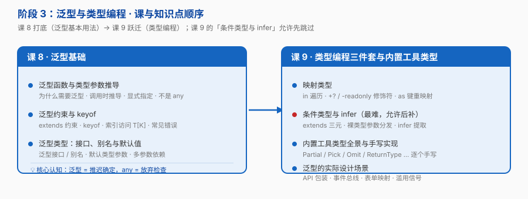

# 阶段 3：泛型与类型编程

> 所属课程：[TypeScript](../01-学习路径总览.md) ｜ 故事章节：**「身份：可编程」——类型能被计算、推导、组合，一份代码适配无数形状**
> 上一阶段：[阶段 2《收窄与控制流》](../2-收窄与控制流/overview.md)
> 规模：2 课 / 7 知识点 ｜ **全课程抽象度最高的一段**

## 🎯 本阶段目标

- 理解泛型是"**调用时才确定的类型参数**"，而不是 `any` 的别名——它把类型信息一路带下去
- 掌握类型编程的四块积木：`keyof`、索引访问类型、映射类型、条件类型（`infer`）
- 能手写出每一个内置工具类型的实现，并判断泛型是否被滥用

## 📍 学习重点

- **泛型不是 `any`**：`any` 是"放弃检查"，泛型是"推迟确定"——前者丢信息，后者**保信息**。这是本阶段最重要的一条认知
- **四块积木层层依赖**：`keyof` 取出键 → 索引访问类型取出值类型 → 映射类型遍历改造 → 条件类型做分支。手写一遍 `Pick` / `Omit` 就能全部串起来
- **条件类型的"裸类型参数会分发"** 是本阶段最大的坑：同一个条件类型，参数穿上衣服（`[T] extends [U]`）行为就不一样
- **泛型滥用有信号**：类型参数只出现一次、约束条件比实现还长、报错比代码本身还长——都是该收手的信号

## ✅ 必须掌握的知识点

| 知识点 | 所属课 | 学完应能 |
|--------|--------|----------|
| 泛型函数与类型参数推导 | 课 8 | 写出带泛型的函数并解释"类型参数在调用时如何被推导出来" |
| 泛型约束与 keyof | 课 8 | 用 `extends` + `keyof` 约束类型参数；用 `T[K]` 取属性类型 |
| 泛型类型：接口、别名与默认值 | 课 8 | 定义泛型接口 / 类型别名，设置默认类型参数，处理多参数依赖 |
| 映射类型 | 课 9 | 用 `in` 遍历键、`+?` / `-readonly` 改修饰符、`as` 重映射键名 |
| 条件类型与 infer | 课 9 | 写出条件类型；用 `infer` 提取类型；规避"裸类型参数分发"的坑 |
| 内置工具类型全景与手写实现 | 课 9 | 逐个手写 `Partial` / `Required` / `Readonly` / `Pick` / `Omit` / `Record` / `Exclude` / `Extract` / `NonNullable` / `ReturnType` / `Parameters` / `Awaited` |
| 泛型的实际设计场景 | 课 9 | 为 API 响应包装、事件总线、表单字段映射设计类型；识别泛型滥用信号 |

## 🗺️ 本阶段路径图

> 课 8 是入门（泛型的基本用法），课 9 是跃迁（类型编程）。**课 9 的「条件类型与 infer」允许先跳过**，学完阶段 4 再回头补。

## 本阶段产出

- [x] `lessons/lesson-08-泛型基础.md`
- [x] `lessons/lesson-09-类型编程三件套与内置工具类型.md`

## ⚠️ 难度提示

**课 9 是全课程抽象度最高的一课。** 若卡住，允许按这个顺序降级：

1. 先只学「映射类型」+「内置工具类型的用法」（会用即可）
2. 阶段 4 学完、写过真实项目后，再回头补「条件类型与 infer」+「手写实现」

泛型是"用着用着就懂"的知识，卡住不是你的问题——**先会用，再懂原理**。

## 🔗 下一步

阶段 4《工程化与类型声明》——从"能写类型"到"让类型在整个工程里生效"。**按 TypeScript 7 讲。**
