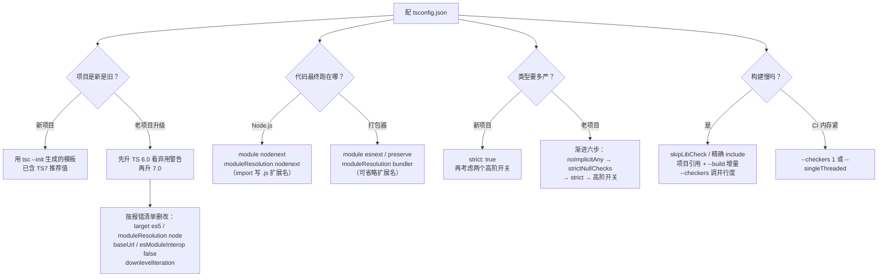

# 第 10 课：tsconfig 与编译配置

> 所属阶段：阶段 4《工程化与类型声明》｜ 水平：零基础 TS
> 本课知识点：TS7 的新默认与硬错误、目标与模块配置、严格性开关族与渐进收紧、构建性能与项目引用
> 故事情节：主角照着网上的老教程配 `tsconfig.json`，结果一路红灯——**TS 7 把一批默认值改了，旧选项直接变硬错误**
> ✅ 状态：已完成（2026-09-03）｜ 实操环境：Node.js v22.14.0 + TypeScript 7.0.2（**文中所有输出均为本课本机实测**）

## 🎯 本课目标

- 说出 TS 7 改了哪些默认值、哪些选项变成硬错误，并给出老项目的迁移路径
- 为自己的运行环境选出 `target` / `module` / `moduleResolution` 组合，说清 `nodenext` 与 `bundler` 的取舍
- 用 `--build` 做增量构建，用 `--checkers` / `--builders` 调并行度，定位常见性能杀手

## 📌 知识点导航

| # | 知识点 | 关键点 | 状态 |
|---|--------|--------|------|
| 1 | TS7 的新默认与硬错误 | `strict: true` 默认 / `rootDir: ./`、`types: []` 默认变化 / 被移除的旧选项 / 迁移路径 | ✅ |
| 2 | 目标与模块配置 | `target` / `module` / `moduleResolution` 的取值与组合 / `nodenext` vs `bundler` 取舍 / ESM 扩展名规则 | ✅ |
| 3 | 严格性开关族与渐进收紧 | `strict` 各子项 / `noUncheckedIndexedAccess` / `exactOptionalPropertyTypes` / 老项目渐进策略 | ✅ |
| 4 | 构建性能与项目引用 | `--build` 增量 / `--checkers` `--builders` 并行 / `--singleThreaded` / 常见性能杀手与诊断 | ✅ |

## 📦 前置依赖（JS 概念）

| 用到的 JS 概念 | 掌握要求 | 回补 |
|---------------|---------|------|
| ESM 与 CommonJS 的差异 | **需理解**（`module` / `moduleResolution` 建立在其上） | [JS 课 10 模块化](../javascript-core/02-课程目录.md)（未学 —— 本课给最小对比表） |
| `package.json` 与 npm 脚本 | 会用即可 | — |

## ⚠️ 事实核查要求（编写本课时必做）

本课内容**强时效**，编写时必须：

1. 跑 `npx tsc --version` 确认实际版本，与 [`00-学习档案.md`](../../00-学习档案.md) 的「版本事实基线」对照
2. 所有默认值 / 硬错误清单以 **TypeScript 官方博客 Announcing TypeScript 7.0（2026-07-08）** 为准
3. 每个新建的 `tsconfig.json` 都要**实测跑一遍**，不靠记忆写配置
4. 与基线不符之处就地更新档案并在文中标注 `（核查于 YYYY-MM）`

### ✅ 核查结果（2026-09-03）

| 核查项 | 结果 |
|--------|------|
| 本机版本 | `npx tsc --version` → **Version 7.0.2**（与基线一致） |
| 官方来源 | Announcing TypeScript 7.0（Daniel Rosenwasser，2026-07-08）已通读，本文默认值与硬错误清单均以此为据 |
| 档案基线 | `00-学习档案.md` 的「版本事实基线」与官方**完全一致**，无需修正 |
| 实测覆盖 | 本文 10 份配置全部实跑：`init-template`、`legacy`、`modern`、`module/esm`、`types-test`、`strict-demo`×3、`perf`、`refs`×2 |
| 额外发现 | 命令行指定文件时若目录含 `tsconfig.json` 会报 **TS5112**（官方提及的那条限制的实测证据） |

---

## 📦 课前回顾：ESM 与 CommonJS 最小对比

> `module` / `moduleResolution` 建立在这套概念上。JS 课 10 还没学到，这里给一张**够用即可**的对比表。

| | CommonJS（CJS） | ES Modules（ESM） |
|--|----------------|------------------|
| 语法 | `require()` / `module.exports` | `import` / `export` |
| 加载时机 | **运行时**动态加载 | **静态**，编译期就能确定依赖 |
| 文件由谁决定 | Node 默认 | `package.json` 的 `"type": "module"`，或 `.mjs` 扩展名 |
| 相对路径 | `./helper`（可省扩展名） | **必须写全扩展名**（`./helper.js`） |
| 顶层 `await` | 不支持 | 支持 |

判断你的代码属于哪一种，看两件事：**`package.json` 里有没有 `"type": "module"`**，以及**你要不要经过打包器**。

---

## 第一幕：起源与场景引入

> 🏛️ **起源**：`tsconfig.json` 并不是一开始就有的。TypeScript 早期只能靠命令行传参（`tsc --target es5 src/*.ts`），**1.5（2015）才引入 `tsconfig.json`**——从此配置可以随项目走，而不是随命令走。
>
> 那为什么 TS 7 要动它？两个原因：
>
> **一是历史包袱。** 十年里 `tsconfig` 积累了大量"为了兼容当年环境而设的默认值"（`target: es3/es5`、`moduleResolution: node`），而今天的运行环境早已变了。
>
> **二是机会窗口。** TS 7 是用 Go 重写的，这是一次**大规模不兼容改动的最后机会**。微软的过渡设计是：
>
> - **TS 6.0（2026-03）**：最后一个基于 JS 代码库的大版本，先把这些选项标为**弃用**（给警告）
> - **TS 7.0（2026-07-08）**：用 Go 重写完成，同时把这些弃用项**升级为硬错误**
>
> 官方的原话是：TS 7"采纳了 6.0 的新默认值，并对 6.0 中弃用的任何标志和构造报硬错误"，并且**鼓励开发者先升级到 6.0 再升 7.0**。
>
> **这就带来一个现实问题**：网上绝大多数教程还停留在 5.x，而 5.x 的配置在 TS 7 下会**直接报错**。

**记住一句话就够了**：TS 7 是一次"默认值大扫除"——**照老教程抄配置，会当场撞墙。**

好，回到你的项目。

> 🎬 **场景**：订单系统要正式工程化了。你从网上找了份"经典 tsconfig"，改改就用（`playground/lesson-10/legacy/`）：

```json
{
  "compilerOptions": {
    "target": "es5",
    "module": "commonjs",
    "moduleResolution": "node",
    "baseUrl": "./src",
    "paths": { "@/*": ["*"] },
    "esModuleInterop": false,
    "downlevelIteration": true,
    "strict": false,
    "outDir": "./dist"
  }
}
```

执行 `npx tsc --noEmit`，**实测输出**：

```
tsconfig.json(3,15): error TS5108: Option 'target=ES5' has been removed. Please remove it from your configuration.
tsconfig.json(5,25): error TS5108: Option 'moduleResolution=node10' has been removed. Please remove it from your configuration.
tsconfig.json(6,5): error TS5102: Option 'baseUrl' has been removed. Please remove it from your configuration.
  Use '"paths": {"*": ["./src/*"]}' instead.
tsconfig.json(8,15): error TS5090: Non-relative paths are not allowed. Did you forget a leading './'?
tsconfig.json(10,24): error TS5108: Option 'esModuleInterop=false' has been removed. Please remove it from your configuration.
tsconfig.json(11,5): error TS5102: Option 'downlevelIteration' has been removed. Please remove it from your configuration.
```

**九个选项，六个被拒。** 这份在 TS 5.x 下完全正常的配置，在 TS 7 里连编译都开始不了。

注意报错信息的语气都很一致——`has been removed. Please remove it from your configuration.`，有的还贴心地给了替代方案（`baseUrl` 那条甚至直接给了新的 `paths` 写法）。**这不是 TS 在为难你，是它在帮你铲掉十年旧账。**

---

## 第二幕：认知冲突

你按报错一条条删完之后，又冒出三个新问题：

```ts
// 实验 A：删掉 target: es5 之后，代码还能跑在老浏览器上吗？
// （答：不能——但这可能恰恰是 TS 7 想告诉你的事）

// 实验 B：module 改成 nodenext 之后，为什么 import 路径要写成 .js？
import { label } from "./helper";     // ❌ 报错
import { label } from "./helper.js";  // ✅ 通过（但 helper.ts 明明是 .ts！）

// 实验 C：strict 默认开了，老项目几百个报错怎么办？能直接关掉吗？
```

三个疑惑，正好落在本课的三个知识点上：

1. **TS 7 到底改了什么？** 除了报错的这些，还有哪些"没报错但行为变了"的默认值？
2. **`target` / `module` / `moduleResolution` 该怎么选？** 为什么它们必须一起看？
3. **严格性怎么渐进地开？** 一次全开会不会把团队劝退？

---

## 第三幕：层层揭示

> ⚠️ **本课的实测环境**：所有配置都在 `playground/lesson-10/` 下**实际跑过**（共 10 份）。默认值与硬错误清单以官方博客 **Announcing TypeScript 7.0（2026-07-08）** 为准，与本机 `tsc 7.0.2` 交叉验证。

### 知识点 1：TS7 的新默认与硬错误

> 关键点：`strict: true` 默认 / `rootDir: ./`、`types: []` 默认变化 / 被移除的旧选项 / 迁移路径

#### 一句话定义

TS 7 改了一批**默认值**（不写就是这个值），并把 TS 6.0 中弃用的一批选项**升级为硬错误**（写了就报错）。

#### 直觉建立（类比）

**搬家时的"断舍离"。**

TS 5.x 的 `tsconfig` 像住了十年的老房子：角落里堆着"当年为了兼容 IE8 买的转接头"（`target: es5`）、"给老式插座配的转换器"（`moduleResolution: node`）。它们没坏，但你早就用不上了，还占地方、让新人困惑。

TS 7 的 Go 重写就是一次**搬家**——趁机把这些东西清掉。默认值的改动相当于"新房子默认装了更好的设施"（`strict` 默认开），而硬错误相当于"旧转接头在新房子里根本插不进去"。

> 💡 **类比的边界**：搬家时可以慢慢收拾、可以先留着；而 TS 7 **没有中间态**——选项要么合法要么报错，不存在"警告但能用"。这也是为什么官方**强烈建议先升 6.0**：6.0 会先给弃用警告，让你有时间慢慢改。

#### 核心原理

**① 改了的默认值**（来源：官方博客，与本机 7.0.2 交叉验证）

| 选项 | 新默认 | 旧默认 | 影响 |
|------|-------|-------|------|
| `strict` | **`true`** | `false` | **影响最大**：老代码会冒出一批新报错 |
| `module` | `esnext` | `commonjs` | 产物默认 ESM |
| `target` | 紧邻 `esnext` 之前的当前稳定 ES 版本 | `es3`/`es5` | 几乎不再降级语法 |
| `noUncheckedSideEffectImports` | `true` | `false` | 只为了副作用的 import 会被检查 |
| `libReplacement` | `false` | `true` | `@types` 不再自动替换内置 lib |
| `stableTypeOrdering` | **`true`，且不能关** | — | 保证不同并行度下类型结果一致 |
| `rootDir` | **`./`** | 推断出的公共根目录 | **产物目录结构可能变** |
| `types` | **`[]`** | 自动引入所有 `@types` | **全局类型可能"消失"** |

官方特别点名：**`rootDir` 和 `types` 这两个变化"最让人意外"**，但它们都很容易补救。

**② 变成硬错误的旧选项**（实测，`legacy/` 项目）

| 被移除的选项 | 实测报错码 | 替代方案 |
|-------------|-----------|---------|
| `target: es5` | TS5108 | 用更高版本；真要支持老环境，交给打包器降级 |
| `downlevelIteration` | TS5102 | 删除（高 `target` 下不需要） |
| `moduleResolution: node` / `node10` / `classic` | TS5108 | `nodenext` 或 `bundler` |
| `module: amd` / `umd` / `systemjs` / `none` | TS5108 | `esnext` 或 `preserve` |
| `baseUrl` | TS5102 | `paths` 直接相对项目根（如 `"./src/*"`） |
| `esModuleInterop: false` | TS5108 | 删除（现在恒为 `true`） |
| `allowSyntheticDefaultImports: false` | TS5108 | 删除 |
| `alwaysStrict: false` | TS5108 | 删除（现在恒为 `true`） |
| `paths` 里用非相对路径 | TS5090 | 加 `./` 前缀 |

另外还有几条语言层面的硬错误：**namespace 里不能用 `module` 关键字**、**import 断言必须用 `with` 而非 `assert`**。

**③ 一条命令行行为的变化**（实测）

官方提到："命令行构建时，若当前目录含 `tsconfig.json`，不能再传文件路径，除非显式 `--ignoreConfig`。" 本课实测到了它：

```
error TS5112: tsconfig.json is present but will not be loaded if files are specified on commandline. Use '--ignoreConfig' to skip this error.
```

**这条很容易撞上**：在有 `tsconfig.json` 的目录里跑 `npx tsc src/app.ts` 会直接报错。要么进到项目里跑 `npx tsc`（用配置），要么加 `--ignoreConfig`（明确表示"我就是要单独编这个文件"）。

**④ 官方给出的 `tsc --init` 模板**（本机 7.0.2 实测生成）

```
{
  // Visit https://aka.ms/tsconfig to read more about this file
  "compilerOptions": {
    // File Layout
    // "rootDir": "./src",
    // "outDir": "./dist",

    // Environment Settings
    // See also https://aka.ms/tsconfig/module
    "module": "nodenext",
    "target": "esnext",
    "types": [],

    // Other Outputs
    "sourceMap": true,
    "declaration": true,
    "declarationMap": true,

    // Stricter Typechecking Options
    "noUncheckedIndexedAccess": true,
    "exactOptionalPropertyTypes": true,

    // Recommended Options
    "strict": true,
    "jsx": "react-jsx",
    "verbatimModuleSyntax": true,
    "isolatedModules": true,
    "noUncheckedSideEffectImports": true,
    "moduleDetection": "force",
    "skipLibCheck": true,
  }
}
```

注意模板里**显式写了** `noUncheckedIndexedAccess: true` 和 `exactOptionalPropertyTypes: true`——这两个**不在**默认值里（默认是关的），是官方额外推荐。

**⑤ 老项目的迁移路径**

```
第一步：先升到 TypeScript 6.0（给弃用警告，不阻塞编译）
   ↓
第二步：按警告逐个改掉弃用项
   ↓
第三步：升到 TypeScript 7.0（此时不该再有硬错误）
   ↓
第四步：补上 rootDir（若 tsconfig 不在源码目录旁）与 types（若依赖 @types 全局类型）
```

如果**必须**一步升到 7.0，那就照着报错清单改——好消息是每条报错都写得很清楚，有的还直接给了替代写法。

#### 常见误区

1. **"硬错误和弃用警告一样，能照常编译。"** → 不能，写了就是编译失败（实测 exit=1）。
2. **"删掉 `target` 就不管产物兼容性了。"** → 默认 `target` 已经很高，产物几乎不降级；真要兼容老环境，靠打包器（Babel / esbuild），而不是靠 `tsc` 降级。
3. **"`strict` 默认开只影响新项目。"** → 所有项目。老项目升级后会冒出一批新报错，这就是知识点 3 要解决的问题。
4. **"`types: []` 之后 `console` 不能用了。"** → 能用（见本知识点实测）。

#### 一句话记住

> **TS 7 是"默认值大扫除"：`strict` 默认开、`rootDir` 变 `./`、`types` 变 `[]`，一批旧选项直接报错——照老教程配置会当场撞墙。**

#### 官方文档

- Announcing TypeScript 7.0（官方博客）：https://devblogs.microsoft.com/typescript/announcing-typescript-7-0/
- tsconfig 配置总参考：https://www.typescriptlang.org/tsconfig

---

### 知识点 2：目标与模块配置

> 关键点：`target` / `module` / `moduleResolution` 的取值与组合 / `nodenext` vs `bundler` 取舍 / ESM 扩展名规则

#### 一句话定义

- **`target`**：产物要降级到哪个 JS 语法版本（同时决定默认的 `lib`）
- **`module`**：产物用哪种模块格式（ESM / CJS / 保留原样）
- **`moduleResolution`**：`import` 语句怎么被解析成文件

**这三者必须一起看**——它们描述的是同一件事：**你的代码最终跑在哪里**。

#### 直觉建立（类比）

**寄快递时填的三栏信息，必须一致：**

- `target` = **收件地址的语言版本**（收件人看得懂多新的写法）
- `module` = **包装方式**（散装 / 打包 / 原样不动）
- `moduleResolution` = **快递员按什么规则找门牌号**

填错了不会报错，但包裹到不了——比如你写"ESM 包装"却让快递员按"CJS 的找法"去找，他就找不到门牌。

> 💡 **类比的边界**：真实快递三栏填错会被退回；而这三个配置填错**往往不报错**，直到运行时才崩（或产物体积暴涨）。所以它们需要你主动想清楚，而不是等编译器提醒。

#### 核心原理

**① `target`：语法降级 + 决定 `lib`**（实测）

同一份源码（用了 `#private` 字段和 `Array.prototype.at()`）：

| target | 产物 | 说明 |
|--------|------|------|
| `es2020` | **28 行** | `#private` 被降级成 `WeakMap` + 两个辅助函数；且 `at()` 报 `TS2550` |
| `es2022` | **15 行** | 源码原样保留 |
| `esnext` | 15 行 | 与 `es2022` 相同 |

**实测报错**（`target: es2020` 时）：

```
error TS2550: Property 'at' does not exist on type 'number[]'. Do you need to change your target library? Try changing the 'lib' compiler option to 'es2022' or later.
```

**这揭示了 `target` 的双重作用**：它不只控制语法降级，**还决定了默认加载哪些 `lib`（标准库类型）**。`target: es2020` 时，`lib` 里没有 ES2022 的 `at()`，于是报错。

> `tsc` 只降级**语法**，不补**运行时 API**（不 polyfill）。想用 `at()` 跑在老环境，得自己加 polyfill 或用 core-js。

**② `module` 与 `moduleResolution` 的取值组合**（本课的**决策参考**）

| 你的代码跑在哪 | `module` | `moduleResolution` | 说明 |
|--------------|----------|-------------------|------|
| **Node.js（ESM）** | `nodenext` | `nodenext` | 推荐；遵守 Node 的 ESM 规则 |
| **Node.js（CJS）** | `nodenext` | `nodenext` | 由 `package.json` 的 `type` 自动决定 |
| **打包器**（Vite / webpack / esbuild） | `esnext` 或 `preserve` | `bundler` | 允许省略扩展名、支持 `package.json` 的 `exports` |
| **纯浏览器原生 ESM** | `esnext` | `bundler` 或 `nodenext` | 无打包器时需要写全扩展名 |

**`nodenext` vs `bundler` 的取舍**，取决于一个问题：**你的代码会不会经过打包器？**

- **经过打包器** → 用 `bundler`：更宽松（可省略扩展名、支持目录 import），因为打包器会自己解析
- **直接跑在 Node** → 用 `nodenext`：严格遵守 Node 的解析规则，避免"本地能跑、上线就崩"

**③ `nodenext` 的 ESM 扩展名规则**（实测，`module/esm/`）

你的项目 `package.json` 里有 `"type": "module"` 时：

```ts
import { label } from "./helper";
// ❌ error TS2835: Relative import paths need explicit file extensions in ECMAScript imports
//    when '--moduleResolution' is 'node16' or 'nodenext'. Did you mean './helper.js'?

import { label } from "./helper.js";   // ✅ 通过
```

**这是新手最困惑的一条**：明明文件叫 `helper.ts`，import 却要写 `.js`。

原因是 TS 的一个刻意设计：**import 路径写的是"运行时会存在的那个文件名"**。编译后 `helper.ts` 变成 `helper.js`，所以现在写 `.js` 才是对的。TS 会自动把 `.js` 映射回 `.ts` 来找类型。

> 用 `moduleResolution: bundler` 就没这个要求——这也是打包器项目的便利之一。

**④ `types`：只管 `@types` 包，不管 `lib`**（实测，`types-test/`）

TS 7 把 `types` 默认改成了 `[]`，意味着 **`node_modules/@types/*` 不再自动全部生效**。实测：

```ts
console.log("console is available");   // ✅ 通过 —— console 来自 lib（标准库）
console.log(process.version);
// ❌ error TS2591: Cannot find name 'process'.
//    Do you need to install type definitions for node?
//    Try `npm i --save-dev @types/node` and then add 'node' to the types field in your tsconfig.
```

**这个对比极其重要**：

- `console` **能用**——它来自 `lib`（标准库），`types` 管不着
- `process` **不能用**——它来自 `@types/node`，而 `types: []` 不自动引入

补救办法（报错信息里就写了）：`npm i -D @types/node`，然后 `"types": ["node"]`。

> 官方说：`types` 的旧行为可以用 `"types": ["*"]` 恢复。**但更推荐显式列出你真正需要的**（`"types": ["node", "jest"]`），加载更少、更快、更可控。

#### 示例演示

`playground/lesson-10/modern/` —— 一份 TS 7 可用的最小配置（**实测 exit=0，运行输出 `100`**）：

```json
{
  "compilerOptions": {
    "target": "esnext",
    "module": "nodenext",
    "moduleResolution": "nodenext",
    "strict": true,
    "types": [],
    "rootDir": "./src",
    "outDir": "./dist"
  },
  "include": ["./src"]
}
```

注意 `rootDir: "./src"` —— 因为默认值是 `./`，不显式写的话产物目录结构可能不符合预期（官方点名的"最让人意外"的变化之一）。

#### 常见误区

1. **"`target` 越低越安全。"** → 低 `target` 会让产物膨胀（实测 28 行 vs 15 行）且更慢；现代做法是高 `target` + 打包器负责兼容。
2. **"`target` 只影响语法。"** → 它还决定默认的 `lib`，进而决定哪些 API 可用（实测 TS2550）。
3. **"`.ts` 文件就该 import `.ts`。"** → `nodenext` 下写 `.js`（指向运行时产物），TS 会自动映射。
4. **"`types: []` 之后所有全局类型都没了。"** → `@types` 包的类型没了，但 `lib`（标准库）还在（实测 `console` 可用）。

#### 一句话记住

> **`target` 管语法与 `lib`，`module` 管产物格式，`moduleResolution` 管怎么找文件——三者按"代码最终跑在哪"一起选。**

#### 官方文档

- `target`：https://www.typescriptlang.org/tsconfig#target
- `module` 与 `moduleResolution`：https://www.typescriptlang.org/docs/handbook/modules/reference.html

---

### 知识点 3：严格性开关族与渐进收紧

> 关键点：`strict` 各子项 / `noUncheckedIndexedAccess` / `exactOptionalPropertyTypes` / 老项目渐进策略

#### 一句话定义

`strict: true` 是一组开关的**总闸**；此外还有几个更严格的独立开关（不在 `strict` 里）。老项目升级时，应该**分批打开**而不是一次全开。

#### 直觉建立（类比）

**健身房的分档训练计划。**

`strict: false` 是"什么器械都不上"，`strict: true` 是"标准套餐"，`noUncheckedIndexedAccess` / `exactOptionalPropertyTypes` 是"高阶加练"。

**直接上最高档，新手会当场受伤（几百个报错）然后放弃。** 正确做法是分档加量。

> 💡 **类比的边界**：健身可以一直停留在低强度；而这里的**目标是把开关全部打开**——每一档都在帮你挡住一类真实 bug。分档只是手段，不是妥协。

#### 核心原理

**① `strict` 包含哪些子开关**

| 子开关 | 拦什么 |
|--------|-------|
| `strictNullChecks` | `null` / `undefined` 不能赋给其他类型 |
| `noImplicitAny` | 参数等无法推导时不能默默变 `any` |
| `strictFunctionTypes` | 函数参数的兼容性检查更严 |
| `strictBindCallApply` | `call` / `apply` / `bind` 也检查参数 |
| `strictPropertyInitialization` | 类的属性必须在构造函数里初始化 |
| `noImplicitThis` | `this` 不能默默是 `any` |
| `alwaysStrict` | 产物加 `"use strict"`（TS 7 恒为 `true`） |
| `useUnknownInCatchVariables` | `catch` 变量是 `unknown`（课 6 实测过） |

**② 三档实测对比**（`strict-demo/`，同一份代码）

| 档位 | 报错数 | 拦住了什么 |
|------|-------|-----------|
| `strict: false` | **0 条** | 什么都不拦 |
| `strict: true` | **3 条** | 隐式 any ×2、null 赋给 string |
| `strict` + 两个高阶开关 | **5 条** | 再加：下标访问可能 undefined、可选属性赋 undefined |

**`strict: true` 的实测报错**：

```
demo.ts(8,14): error TS7006: Parameter 'a' implicitly has an 'any' type.
demo.ts(8,17): error TS7006: Parameter 'b' implicitly has an 'any' type.
demo.ts(13,7): error TS2322: Type 'null' is not assignable to type 'string'.
```

**最严格档新增的两条**：

```
demo.ts(17,7): error TS2322: Type 'number | undefined' is not assignable to type 'number'.
  Type 'undefined' is not assignable to type 'number'.
demo.ts(20,7): error TS2375: Type '{ retries: undefined; }' is not assignable to type 'Config' with 'exactOptionalPropertyTypes: true'. Consider adding 'undefined' to the types of the target's properties.
  Types of property 'retries' are incompatible.
```

**③ 两个高阶开关在说什么**

**`noUncheckedIndexedAccess`**——数组/索引访问的结果带上 `| undefined`：

```ts
const scores: number[] = [1, 2, 3];
const first: number = scores[0];   // ❌ number | undefined
```

它强迫你面对一个事实：**`scores[0]` 确实可能是 `undefined`**（空数组、越界）。这是课 3 索引签名那条规则的延伸。

**`exactOptionalPropertyTypes`**——区分"没有这个键"和"这个键的值是 `undefined`"：

```ts
interface Config { retries?: number }
const config: Config = { retries: undefined };   // ❌ 开了之后不允许
```

要允许，得显式写 `retries?: number | undefined`。

> 这两个都**不在** `strict` 里，需要单独打开。`tsc --init` 的模板会推荐它们——说明官方认为它们值得开，但又没敢放进默认值。

**④ 老项目的渐进收紧策略**

不要一次全开。按这个顺序，每档跑通、修完、合入，再开下一档：

```
第 0 步：strict: false                    ← 先让项目能在 TS 7 下跑起来
   ↓
第 1 步：noImplicitAny（单独开）           ← 拦住最危险的一类：变量悄悄变成 any
   ↓
第 2 步：strictNullChecks（单独开）        ← 拦住最多的真实 bug，也是报错最多的一档
   ↓
第 3 步：strict: true                     ← 打开总闸，收下剩下的子开关
   ↓
第 4 步：noUncheckedIndexedAccess         ← 高阶：索引访问
   ↓
第 5 步：exactOptionalPropertyTypes       ← 高阶：可选属性的精确语义
```

**第 1、2 步可以单独开**（不用先开 `strict`），这是渐进收紧的关键——`strict` 的每个子开关都能单独配置，并且单独配置会**覆盖**总闸：

```json
{
  "compilerOptions": {
    "strict": true,
    "noUncheckedIndexedAccess": false   // 总闸开了，但这一项单独关掉
  }
}
```

> 🔧 **团队建议**：把"严格度"写进 `README` 或专门的文档，说明当前开到哪一档、**下一步打算开什么**。这样新成员不会困惑，也不会有人偷偷把开关关掉。

#### 常见误区

1. **"`strict: true` 就是最严格了。"** → 还有 `noUncheckedIndexedAccess` / `exactOptionalPropertyTypes` 等独立开关。
2. **"老项目只能关掉 strict。"** → 可以逐项开：先 `noImplicitAny`，再 `strictNullChecks`，最后 `strict: true`。
3. **"开了严格模式，报错太多就先 `as any` 顶上。"** → 这是在积累债务。更好的做法是**分文件推进**（用 `@ts-expect-error` 标记待修的地方，并统计数量）。
4. **"子开关只能跟 `strict` 一起开。"** → 每个都能单独配，单独配置优先于总闸。

#### 一句话记住

> **`strict` 是总闸、子开关可单独拧；老项目按"隐式 any → null → 总闸 → 高阶"的顺序分批收紧。**

#### 官方文档

- `strict` 与子开关：https://www.typescriptlang.org/tsconfig#strict
- `noUncheckedIndexedAccess`：https://www.typescriptlang.org/tsconfig#noUncheckedIndexedAccess

---

### 知识点 4：构建性能与项目引用

> 关键点：`--build` 增量 / `--checkers` `--builders` 并行 / `--singleThreaded` / 常见性能杀手与诊断

#### 一句话定义

TS 7 用 Go 重写后**默认并行**，并提供 `--checkers` / `--builders` / `--singleThreaded` 三个开关；项目引用（`references` + `composite`）配合 `--build` 实现**增量构建**。

#### 直觉建立（类比）

**工厂的生产线调度。**

- `--checkers` = **质检员的人数**（多了快，但每人都要一份图纸副本→更占内存）
- `--builders` = **同时开工的分厂数量**（monorepo 里有用，与质检员人数**相乘**）
- `--singleThreaded` = **全部改成一个人干**（慢，但好调试、省内存）
- 项目引用 + `--build` = **只重做改过的那部分**，而不是每次全厂重来

> 💡 **类比的边界**：真实工厂人多一定快；而**类型检查的并行有收益递减**——下面实测会看到，本项目规模下 8 个质检员只比 1 个快约 12%，因为"复制图纸"（内存与协调）也有成本。

#### 核心原理

**① TS 7 的速度提升**（官方数据）

官方在几个大型开源项目上测得：

| 项目 | TS 6 | TS 7 | 提速 |
|------|------|------|------|
| vscode | 125.7s | 10.6s | **11.9x** |
| sentry | 139.8s | 15.7s | 8.9x |
| bluesky | 24.3s | 2.8s | 8.7x |
| playwright | 12.8s | 1.47s | 8.7x |
| tldraw | 11.2s | 1.46s | 7.7x |

内存占用也下降（vscode -18%、bluesky -26%）。编辑器侧的体感更明显：**在 vscode 仓库打开一个含错误的文件，从 17.5 秒降到 1.3 秒内**（课 1 已引用过这条）。

同一批项目在 **`--checkers 8`** 下还能再快一截（vscode 10.6s → 7.51s，即 **16.7x**；playwright 1.47s → 1.16s，11x）。但官方同时提醒：**增大 `--checkers` 会以增加内存为代价**，而且不同项目、不同机器的结果差异很大。

**② 三个并行开关**

| 开关 | 默认 | 作用 |
|------|------|------|
| `--checkers N` | **4** | 类型检查的并行 worker 数；可调到 1（省内存）或更高（更快，更占内存） |
| `--builders N` | — | `--build` 时并行构建几个项目（monorepo 用）；**与 `--checkers` 相乘** |
| `--singleThreaded` | 关 | 全部单线程，用于调试 / 资源受限环境 |

官方提醒：`--checkers 4 --builders 4` 意味着最多 **16 个**类型检查器同时跑，可能过头了。

**③ 本机实测**（`perf/`，200 个文件，预热后取 3 次最小值）

| 配置 | 耗时 |
|------|------|
| `--checkers 1` | 1227 ms |
| `--checkers 4`（默认） | 1107 ms |
| `--checkers 8` | 1078 ms |

**结论与官方一致但要注意语境**：

- 并行确实更快，但**收益递减**（1 → 8 只快了约 12%）
- 这是因为本项目规模小，`npx` 启动开销占了很大比重
- **真正的大型项目**才能获得官方那种量级的收益
- 官方建议：**CPU / 内存紧张的 CI 环境，可以把 `--checkers` 调低到 1**

**④ 项目引用与 `--build`**（实测，`refs/`）

两个包：`core`（被依赖）和 `app`（依赖 core）。

```json
// packages/core/tsconfig.json
{
  "compilerOptions": {
    "composite": true,      // ← 必须：允许被引用
    "declaration": true,    // ← composite 要求产出 .d.ts
    "rootDir": "./src",
    "outDir": "./dist"
  },
  "include": ["./src"]
}

// packages/app/tsconfig.json
{
  "compilerOptions": { "composite": true, "declaration": true, ... },
  "include": ["./src"],
  "references": [{ "path": "../core" }]   // ← 声明依赖
}
```

执行 `npx tsc --build .`（**实测 exit=0**）：

- 按依赖顺序构建（先 core 后 app）
- 两个包都产出了 `.d.ts`（`core/dist/index.d.ts`、`app/dist/main.d.ts`）
- 运行 `node dist/main.js` 输出 **`total = 180`**

**`--build` 的价值**：第二次构建时，没变的项目会被**跳过**（靠 `.tsbuildinfo` 记录）——这就是增量构建。monorepo 里这是数量级的差异。

> ⚠️ **一个实践细节**：`app` 里 import 的是 core 的**产物**（`../../core/dist/index.js`），不是源码。真实项目通常配合 `paths` 别名或 `package.json` 的 `exports` 来做——**那是课 11 的内容**。

**⑤ 常见性能杀手与诊断**

| 杀手 | 症状 | 处理 |
|------|------|------|
| `skipLibCheck: false` | 检查所有 `.d.ts`，大型依赖下极慢 | 开 `skipLibCheck`（`--init` 模板默认开） |
| 巨型 `.d.ts`（如旧版 `@types`） | 解析耗时 | 升级依赖，或 `types` 里只列需要的 |
| 深层类型体操 | 某个类型递归太深导致编译爆炸 | 简化类型（课 13 会讲代价） |
| 无项目引用的大 monorepo | 每次全量重编 | 拆项目 + `references` + `--build` |
| `include` 范围过大 | 把 `node_modules` 或产物也编译了 | 精确设置 `include` / `exclude` |

诊断手段：`tsc --diagnostics`（打印各阶段耗时）、`tsc --explainFiles`（为什么某个文件被包含）、`tsc --listFiles`（列出所有参与的文件）。

#### 常见误区

1. **"`--checkers` 越大越好。"** → 收益递减且吃内存（官方明确提到调高的代价）。
2. **"`--singleThreaded` 只是慢一点。"** → 慢得多，它主要用于调试或受限环境。
3. **"项目引用只是 monorepo 才需要。"** → 任何"拆成多个可独立构建单元"的项目都适用。
4. **"`--build` 等于 `tsc -p`。"** → 不同：`--build` 会处理项目引用顺序 + 增量跳过。

#### 一句话记住

> **默认 4 个检查器已经不错；CI 上内存紧就调低，大 monorepo 用 `references` + `--build` 做增量。**

#### 官方文档

- TS 7 性能与并行：https://devblogs.microsoft.com/typescript/announcing-typescript-7-0/#custom-scaling-parallelization-and-controls
- 项目引用：https://www.typescriptlang.org/docs/handbook/project-references.html

---

## 第四幕：实操验证

回到第一幕那份"九个选项六个被拒"的老配置。我们把它完整迁到 TS 7：

**迁移前**（`legacy/tsconfig.json`，实测 6 条报错）：

```json
{
  "compilerOptions": {
    "target": "es5",                  // ❌ TS5108：已移除
    "module": "commonjs",             // ⚠️ 合法但不推荐
    "moduleResolution": "node",       // ❌ TS5108：已移除
    "baseUrl": "./src",               // ❌ TS5102：已移除
    "paths": { "@/*": ["*"] },        // ❌ TS5090：需要 ./ 前缀
    "esModuleInterop": false,         // ❌ TS5108：不能设 false
    "downlevelIteration": true,       // ❌ TS5102：已移除
    "strict": false,                  // ⚠️ 合法但挡不住任何 bug
    "outDir": "./dist"
  }
}
```

**迁移后**（`modern/tsconfig.json`，**实测 exit=0**）：

```json
{
  "compilerOptions": {
    "target": "esnext",               // es5 → esnext
    "module": "nodenext",             // commonjs → nodenext
    "moduleResolution": "nodenext",   // node → nodenext
    "paths": { "@/*": ["./src/*"] },  // baseUrl 移除，paths 直接相对项目根
    "strict": true,                   // false → true
    "types": [],                      // 显式列出所需的 @types
    "rootDir": "./src",               // 补上：默认是 ./ 会导致产物结构变化
    "outDir": "./dist"
  },
  "include": ["./src"]
}
```

**实测结果**：

```
$ cd modern && npx tsc
exit=0
$ node dist/index.js
100
```

**编译零报错，产物正常运行。** 从"连配置都过不了"到"干净跑通"，改动只有 7 行。

三个关键点的验证结果汇总（均为本课本机实测）：

| 验证项 | 实测结论 |
|--------|---------|
| 老配置 | 6 条硬错误（TS5108×3 / TS5102×2 / TS5090） |
| 命令行传文件（目录含 tsconfig） | TS5112，需 `--ignoreConfig` |
| `target` 差异 | es2020 产物 28 行 + `at()` 报 TS2550；es2022/esnext 保留 15 行 |
| `nodenext` 扩展名 | `./helper` 报 TS2835（提示 `./helper.js`）；写 `.js` 通过 |
| `types: []` | `console` 可用（lib）、`process` 报 TS2591（需 `@types/node`） |
| 严格性三档 | 0 / 3 / 5 条报错 |
| 并行度 | `--checkers` 1/4/8 = 1227 / 1107 / 1078 ms |
| 项目引用 | `tsc --build` exit=0，产物运行输出 `total = 180` |

> ✅ **回扣课 1**：课 1 只给了一个"能用的最小 tsconfig"，并预告"完整配置在课 10 讲"。现在这张拼图补齐了——**你知道那几行配置为什么是那样的，也知道老教程里的写法为什么在这里会报错。**

---

## 第五幕：体系收束

> 📍 **全局定位**：本课是**阶段 4 的配置核心**，也是整个课程中"最贴近实际工程"的一课。
>
> 前面九课都在讲"类型是什么、怎么写"，从这一课开始转向"**怎么让类型在整个工程里生效**"。而 `tsconfig.json` 就是那个总开关——它决定了：
> - 类型检查**有多严**（知识点 3）
> - 产物**长什么样**（知识点 2）
> - 构建**有多快**（知识点 4）
> - 以及……你的老项目**能不能编译**（知识点 1）
>
> 后续两课：
> - **课 11（下一课）**：`paths` 别名怎么配（`baseUrl` 已经没了）、`.d.ts` 声明文件怎么写、`@types` 生态与 `lib` 配置——**本课留下的两个伏笔**（别名与 `types: []`）都会在那里展开
> - **课 12**：把 `tsc --noEmit` 接进 CI、ESLint 配置、以及 JSDoc + `checkJs` 的轻量路线

**现在你会了什么**：

- 能说出 TS 7 改了哪些**默认值**（`strict` / `rootDir` / `types` / `module` / `target` 等）、哪些选项变成**硬错误**，并给出老项目的**四步迁移路径**
- 能为自己的运行环境选出 `target` / `module` / `moduleResolution` 组合，说清 **`nodenext` 与 `bundler` 的取舍**，以及为什么 ESM 下要写 `.js` 扩展名
- 能解释 `strict` 各子项的作用，为老项目设计**六步渐进收紧**策略
- 能用 `--build` 做增量构建、用 `--checkers` / `--builders` 调并行度，并识别**五种常见性能杀手**

**给未来自己的提醒**（本课内容强时效）：

> 若你读到这里时 TS 已发布新版本，请先跑 `npx tsc --version`，与 [`00-学习档案.md`](../../00-学习档案.md) 的「版本事实基线」对照。**默认值和硬错误清单会随版本变，但"按运行环境选配置、按批次收紧严格度"这套思路不会过时。**

> 🔗 **下一步**：课 11《模块与声明文件》——配好 `paths` 别名（`baseUrl` 已移除）、为无类型的 JS 库写 `.d.ts`、搞懂 `@types` 生态与 `types` / `lib` 配置。

---

## 🐞 常见误区

1. **"照网上的 tsconfig 抄一份就行。"** → TS 7 改了默认值、一批选项变硬错误，5.x 老配置会当场报错（实测 6 条）。
2. **"硬错误和弃用警告一样能编译。"** → 不能，写了就是失败（exit=1）。
3. **"`target` 越低越安全。"** → 产物膨胀（28 行 vs 15 行）且更慢；现代做法是高 target + 打包器负责兼容。
4. **"`.ts` 文件就该 import `.ts` 后缀。"** → `nodenext` 下写 `.js`（指向运行时产物），TS 自动映射。
5. **"`types: []` 之后全局类型全没了。"** → `@types` 包的类型没了，但 `lib` 还在（实测 `console` 可用、`process` 报错）。
6. **"`strict: true` 就是最严格。"** → 还有 `noUncheckedIndexedAccess`、`exactOptionalPropertyTypes` 等独立开关。
7. **"老项目只能关掉 strict。"** → 可以逐项开：隐式 any → null → 总闸 → 高阶。
8. **"`--checkers` 越大越好。"** → 收益递减且吃内存，CI 上反而应该调低。

## 一图总结



> 关键记忆点：① TS7 是默认值大扫除，老配置会撞墙；② target/module/moduleResolution 按运行环境一起选；③ strict 可分批收紧；④ 并行有收益递减，CI 上可反向调低。

## 课后小测

**Q1**：TS 5.x 下正常的这份配置，在 TS 7 下会怎样？

```json
{
  "compilerOptions": {
    "target": "es5",
    "moduleResolution": "node",
    "baseUrl": "./src",
    "esModuleInterop": false
  }
}
```

- A. 正常编译，只是有弃用警告
- B. 编译失败，四个选项都会报硬错误
- C. 只有 `target` 会报错，其他三个正常
- D. 能编译，但产物会自动降级到 es5

<details><summary>答案与解析</summary>

**答案：B**。实测（`legacy/` 项目）：四个选项**全部**报错，退出码非 0：

```
error TS5108: Option 'target=ES5' has been removed.
error TS5108: Option 'moduleResolution=node10' has been removed.
error TS5102: Option 'baseUrl' has been removed.
error TS5108: Option 'esModuleInterop=false' has been removed.
```

TS 7 把 TS 6.0 中的弃用项**升级为硬错误**，没有"警告但能用"的中间态。这也是官方建议**先升 6.0** 的原因——6.0 会先给警告，留时间给你改。

注意报错码有两种：`TS5108`（has been removed）和 `TS5102`（也是 removed，用在 `baseUrl` / `downlevelIteration` 上）。

</details>

**Q2**：项目用 Vite 打包，`package.json` 里有 `"type": "module"`。下面哪组配置最合适？

- A. `module: nodenext` + `moduleResolution: nodenext`
- B. `module: esnext` + `moduleResolution: bundler`
- C. `module: commonjs` + `moduleResolution: node`
- D. `module: umd` + `moduleResolution: classic`

<details><summary>答案与解析</summary>

**答案：B**。

选配置的关键问题是：**代码会不会经过打包器？**

- **经过打包器**（Vite / webpack / esbuild）→ `moduleResolution: bundler`：更宽松，允许省略扩展名，打包器自己会解析
- **直接跑在 Node** → `nodenext`：严格遵守 Node 的解析规则，避免"本地能跑、上线崩"

C 和 D 在 TS 7 下**直接报错**：`moduleResolution: node` / `classic` 已移除，`module: umd` 也不再支持。

顺带一个易错点：如果选了 A（`nodenext`），那么相对路径的 import **必须写 `.js` 扩展名**，否则报 `TS2835`（实测）。用 `bundler` 就没这个要求。

</details>

**Q3**：老项目升级后 `strict: true` 冒出 300 个报错，团队应该怎么做？

- A. 把 `strict` 关掉，等有空再开
- B. 分批开启：先 `noImplicitAny`，修完再 `strictNullChecks`，最后 `strict: true`
- C. 全部用 `as any` 压下去
- D. 只对新文件开 strict，老文件加 `@ts-nocheck`

<details><summary>答案与解析</summary>

**答案：B**。

`strict` 的每个子开关都能**单独配置**，且单独配置**优先于**总闸——这正是渐进收紧的基础：

```json
{
  "compilerOptions": {
    "strict": false,        // 总闸先关
    "noImplicitAny": true   // 但单独打开这一项
  }
}
```

推荐顺序（每档修完合入再进下一档）：

1. `noImplicitAny`（拦住最危险的：变量悄悄变 `any`）
2. `strictNullChecks`（拦住最多真实 bug，也是报错最多的一档）
3. `strict: true`（收下剩余子开关）
4. `noUncheckedIndexedAccess`
5. `exactOptionalPropertyTypes`

A 是放弃，C 是积累债务（300 个 `as any` 等于 300 个隐患），D 虽然是合法过渡手段，但**没有推进计划就变成了永久债**——`B` 的思路配合"记录当前开到哪一档、下一步开什么"，才可持续。

</details>

## 🚀 下一批接力提示词

> 学完本课后，**复制下面这段文字发给 AI**，即可无缝进入下一批（无需重新描述上下文）：

```
继续学 TypeScript。我的学习档案在 frontend/typescript-core/00-学习档案.md，
刚学完阶段 4《工程化与类型声明》的课 10《tsconfig 与编译配置》四个知识点
（TS7 的新默认与硬错误 / 目标与模块配置 / 严格性开关族与渐进收紧 / 构建性能与项目引用），
请按大纲继续讲解下一课《模块与声明文件》。
```

## 🧭 课程导航

⬅️ **上一课**：[课 9：类型编程三件套与内置工具类型](../../3-泛型与类型编程/lessons/lesson-09-类型编程三件套与内置工具类型.md)（阶段 3 收官）

➡️ **下一课**：[课 11：模块与声明文件](lesson-11-模块与声明文件.md)（待编写）

📚 **返回目录**：[课程目录](../../02-课程目录.md)

---

## 附：本课示例文件清单

所有示例位于 `playground/lesson-10/`，每份配置都**实测跑过**：

| 目录 | 用途 | 预期结果 |
|------|------|---------|
| `init-template/tsconfig.json` | `npx tsc --init` 在 7.0.2 上生成的官方模板 | 供对照，不单独编译 |
| `legacy/` | 5.x 老配置，演示硬错误 | **6 条报错**（故意） |
| `modern/` | 迁移后的 TS 7 配置 | exit=0，运行输出 `100` |
| `module/esm/` | `nodenext` 下的 import 扩展名规则 | `bad-import.ts` 报 TS2835；`good-import.ts` 通过 |
| `types-test/` | `types: []` 的影响 | `process` 报 TS2591；`console` 正常 |
| `strict-demo/` | 严格性三档对比（同一份源码） | off=0 条 / on=3 条 / max=5 条 |
| `perf/` | 200 个文件的并行度对比 | `--checkers` 1/4/8 ≈ 1227/1107/1078 ms |
| `refs/packages/*` | 项目引用 + `--build` 增量构建 | exit=0，运行输出 `total = 180` |

复现性能数据的命令（预热后取 3 次最小值）：

```powershell
cd perf
npx tsc -p . --checkers 4            # 预热
(Measure-Command { npx tsc -p . --checkers 1 }).TotalMilliseconds
(Measure-Command { npx tsc -p . --checkers 8 }).TotalMilliseconds
```
