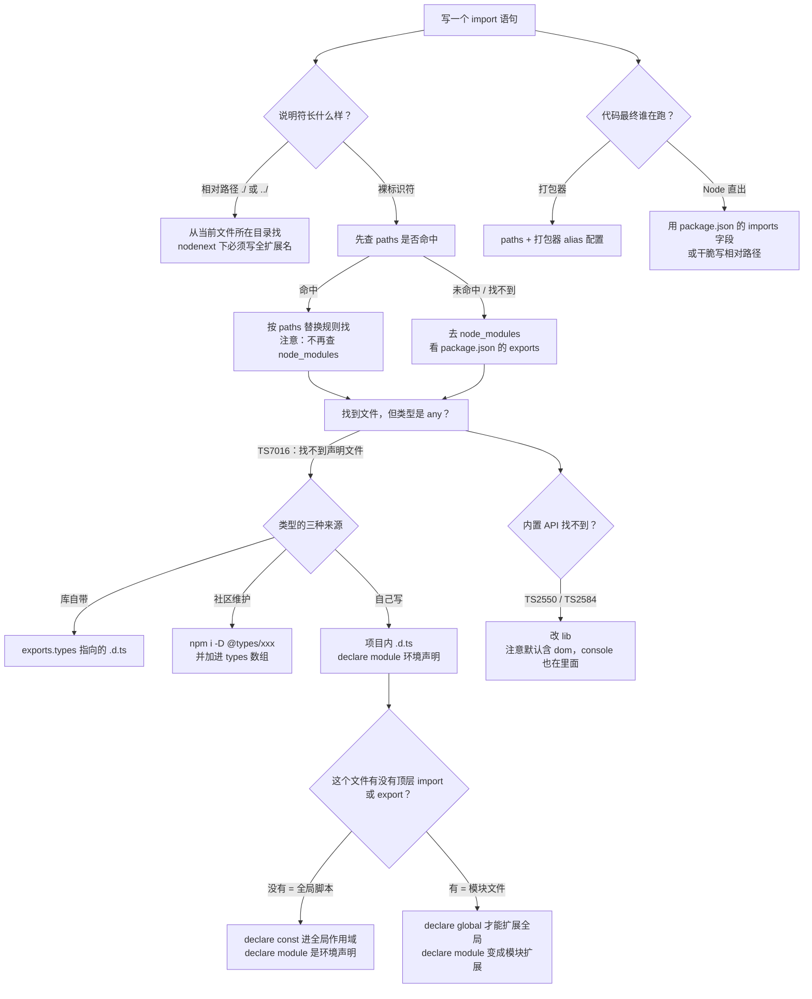

# 第 11 课：模块与声明文件

> 所属阶段：阶段 4《工程化与类型声明》｜ 水平：零基础 TS
> 本课知识点：模块解析与路径别名、声明文件 .d.ts 与 declare、@types 生态与 types·lib 配置
> 故事情节：主角引了一个没有类型的第三方 JS 库，编辑器全程飘红——**这库的"形状"谁来告诉 TS？**
> ✅ 状态：已完成（2026-09-04）｜ 实操环境：Node.js v22.14.0 + TypeScript 7.0.2（**文中所有输出均为本课本机实测**）

## 🎯 本课目标

- 配好 `paths` 路径别名（注意 `baseUrl` 在 TS 7 已移除），说清 ESM 下的扩展名规则
- 为无类型的 JS 库写一份 `.d.ts`，区分全局声明、模块声明与声明合并三种写法
- 说清 `@types` 生态的作用、`types` 默认 `[]` 带来的影响、以及 `lib` 与 `libReplacement`

## 📌 知识点导航

| # | 知识点 | 关键点 | 状态 |
|---|--------|--------|------|
| 1 | 模块解析与路径别名 | 解析流程 / `paths` 相对项目根 / `baseUrl` 已移除 / ESM 下的扩展名规则 | ✅ |
| 2 | 声明文件 .d.ts 与 declare | `declare` 的作用 / 全局声明 vs 模块声明 / 给无类型 JS 库补类型 / 声明合并 | ✅ |
| 3 | @types 生态与 types·lib 配置 | DefinitelyTyped / `types` 默认 `[]` 的影响 / `lib` 的作用与 `libReplacement` | ✅ |

## 📦 前置依赖（JS 概念）

| 用到的 JS 概念 | 掌握要求 | 回补 |
|---------------|---------|------|
| `import` / `export` 语法 | **需理解** | [JS 课 10 模块化](../javascript-core/02-课程目录.md)（未学 —— 本课给最小回顾） |
| npm 安装与 `node_modules` 结构 | 会用即可 | — |
| `tsconfig` 基础配置 | **强依赖** | 课 10 ✅ |

## ⚠️ 事实核查要求（编写本课时必做）

- `paths` / `types` / `lib` 的行为在 TS 7 有变化，**必须实测**后写，不照抄旧教程
- `baseUrl` 已移除、`types` 默认 `[]` 这两条要以官方 7.0 公告为准并标注核查时点

### ✅ 核查结果（2026-09-04）

| 核查项 | 结果 |
|--------|------|
| 本机版本 | `node node_modules/typescript/bin/tsc --version` → **Version 7.0.2**（与基线一致） |
| 运行时 | `node --version` → **v22.14.0**（与基线一致） |
| 档案基线 | `00-学习档案.md`「版本事实基线」复核通过，**无需修正**；课 10 的 `types: []` / `baseUrl` 移除两条在本课被独立复现验证 |
| 实测覆盖 | 本文 **9 个子项目 / 14 份 tsconfig** 全部实跑：`resolve`、`resolve/bad`、`alias`、`nodenext-alias`、`nodenext-alias/fixed`、`node-alias`、`paths-priority`×2、`untyped`×3、`untyped/bad`、`decls`×2、`types-lib`×3、`libtest`×4、`emit-types` |
| 额外发现① | **TS2834 与 TS2835 是两个码**：import 路径缺扩展名时，若存在候选文件报 TS2835（会提示 `Did you mean './helper.js'`，课 10 实测到的那条）；若**没有**候选（如目录 import）报 TS2834（只提示 `Consider adding an extension`）。课 10 只测到了前者 |
| 额外发现② | **`console` 属于 `lib.dom`，不在 `lib.es5`**。写 `lib: ["es2022"]` 不带 `dom` 时，连 `console.log` 都报 TS2584（实测）——这解释了"为什么去掉 DOM 后一堆基础 API 消失" |
| 额外发现③ | **`paths` 是"优先"而非"兜底"**：`--traceResolution` 实测显示 paths 命中时 **根本不查 node_modules**；只有 paths 解析失败才回退到 node_modules |
| 额外发现④ | **`skipLibCheck` 默认是 `false`**（实测：省略时 `.d.ts` 内部错误照样暴露）。`tsc --init` 模板把它写成 `true`，那是官方推荐值而不是默认值 |
| 附带修正 | 课 10「`types: []` 之后 `console` 能用」的表述需要补一句限定：那是因为**默认 `lib` 含 DOM**，`console` 在 `lib.dom` 里。若手动设 `lib` 且不含 `dom`，`console` 一样会消失 |

---

## 📦 课前回顾：import / export 最小回顾

> 模块解析建立在这套语法上。JS 课 10 还没学到，这里给一张**够用即可**的清单。

```js
// 具名导出 / 导入
export function money(n) { return "CNY " + n.toFixed(2); }
import { money } from "./format.js";

// 默认导出 / 导入
export default class Cart {}
import Cart from "./cart.js";

// 只为了副作用（不取任何值）
import "./style.css";
```

模块说明符（specifier）只有**三种形态**，本课全部内容都围着它们转：

| 形态 | 长什么样 | 去哪找 |
|------|---------|-------|
| 相对路径 | `./helper.js`、`../utils/index.js` | 从**当前文件所在目录**出发 |
| 绝对路径 | `/src/main.js` | 从文件系统根出发（极少用） |
| 裸标识符 | `demo-pkg`、`demo-pkg/sub`、`@/utils/format` | 去 `node_modules`，或走 `paths` 映射 |

---

## 第一幕：起源与场景引入

> 🏛️ **起源**：模块解析规则不是一开始就有的。
>
> TypeScript 早期只有一种解析算法（后来被叫做 `node` / `node10`）：**照着 Node.js 的 CommonJS 规则来**——可以省扩展名、`node_modules` 里找 `package.json` 的 `main` 字段、目录则找 `index.js`。
>
> 但 2015 年之后 Node 自己变了：ES Modules 来了，`package.json` 多了 `exports` 字段（它可以**封死**子路径，也可以按 `import` / `require` 条件给不同文件），相对路径**必须写全扩展名**。TS 的旧算法对这一切一无所知。
>
> 于是 TS 补了新算法：先有 `node16` / `nodenext`（严格照 Node 的新规则来），再有 `bundler`（打包器世界：没有 Node 那些限制，可以省扩展名）。TS 7 干脆把老的 `node` / `node10` / `classic` 三种**全部移除**（课 10 实测：TS5108）。
>
> 而**声明文件**的历史比这更早。2012 年 TS 发布时，市面上所有 JS 库都没有类型。社区的做法是建一个巨大的仓库 **DefinitelyTyped**，志愿给每个流行库手写 `.d.ts`，再以 `@types/xxx` 的形式发到 npm。这就是为什么你今天 `npm i -D @types/node` 就能拿到 Node 的全部类型——**那不是微软写的，是社区写的**。

**记住一句话就够了**：TS 有两种"找东西"的动作——**找模块**（解析 import）和**找类型**（解析这个文件长什么样）。前者靠模块解析规则，后者靠声明文件。

好，回到你的项目。

> 🎬 **场景**：订单系统要接一个内部的 JS 工具库。它发布多年、只有 JS、没有类型。你照着 README 写下第一行（`playground/lesson-11/untyped/src/app.ts`）：

```ts
import { add, mul } from "legacy-math";

console.log("add(2, 3) =", add(2, 3));
```

执行 `npx tsc --noEmit`，**实测输出**：

```
src/app.ts(2,26): error TS7016: Could not find a declaration file for module 'legacy-math'.
  'D:/.../untyped/node_modules/legacy-math/index.js' implicitly has an 'any' type.
  Try `npm i --save-dev @types/legacy-math` if it exists or add a new declaration (.d.ts)
  file containing `declare module 'legacy-math';`
```

**注意报错信息的态度**：它没有说"这个库不能用"，它说"**我不知道这个库长什么样**"，而且贴心地给了两条路——去装 `@types/legacy-math`，或者自己写一份 `.d.ts`。

你选了第二条，新建 `types/legacy-math.d.ts`：

```ts
declare module "legacy-math" {
  export function add(a: number, b: number): number;
  export function mul(a: number, b: number): number;
}
```

再跑一次，**exit=0**，运行输出：

```
add(2, 3) = 5
mul(2, 3) = 6
```

飘红消失了。但你可能没意识到：你刚才写下的 `declare` 是一个**承诺**——而 TS 从不验证承诺是否兑现。这一课会告诉你这个承诺的分量到底有多重。

---

## 第二幕：认知冲突

库的问题解决了，你又踩了三个新坑：

```ts
// 实验 A：import 一个目录，报错了
import { money } from "../src/utils";      // ❌ 报 TS2834
import { money } from "../src/utils/index.js";  // ✅ 通过

// 实验 B：配好 paths 别名，编译通过了，一运行就崩
//   tsconfig: "paths": { "@/*": ["./src/*"] }
import { money } from "@/utils/format";    // ✅ tsc 通过
//   $ node dist/index.js
//   Error [ERR_MODULE_NOT_FOUND]: Cannot find package '@/utils' ...

// 实验 C：想给全局加个类型，写 declare global 结果报错
declare global { var __BUILD_ID__: string; }   // ❌ 报 TS2669
```

三个疑惑，正好落在本课的三个知识点上：

1. **TS 到底怎么把 `import "..."` 变成一个文件？** 为什么 `paths` 配好了编译能过、运行却崩？
2. **`.d.ts` 和 `declare` 到底是什么关系？** 为什么有的 `declare` 合法、有的直接报错？
3. **`@types`、`types`、`lib` 三个东西谁管谁？** 为什么去掉某些配置后 `console` 都找不到了？

---

## 第三幕：层层揭示

> ⚠️ **本课的实测环境**：所有结论都在 `playground/lesson-11/` 下**实际跑过**（9 个子项目 / 14 份 tsconfig）。默认值与移除项以官方博客 **Announcing TypeScript 7.0（2026-07-08）** 为准，与本机 `tsc 7.0.2` 交叉验证。

### 知识点 1：模块解析与路径别名

> 关键点：解析流程 / `paths` 相对项目根 / `baseUrl` 已移除 / ESM 下的扩展名规则

#### 一句话定义

**模块解析**就是把 `import "xxx"` 里的字符串，**变成一个磁盘上的具体文件**的过程。它的规则由 `moduleResolution` 决定；`paths` 是你自己加的一条**映射规则**，插在解析流程的前面。

#### 直觉建立（类比）

**去图书馆找一本书。**

- **相对路径** = 你站在某个书架前，去相邻书架找（"从当前文件所在目录出发"）
- **裸标识符** = 去"新书区"（`node_modules`）按书名找
- **`package.json` 的 `exports` 字段** = 索引卡，上面写着"这本书的正本在 B 区 3 排第 2 层"，而且**没写在索引卡上的书一律不借**（`exports` 会封死未声明的子路径）
- **`paths` 别名** = **你自己贴在目录上的便利贴**

> 💡 **类比的边界**：图书馆的索引卡是**所有人**都认的，你写完别人也能用。而 `paths` 那张便利贴**只有 TS 编译器看得到**——Node、打包器、你的同事的编辑器（如果没读同一份 tsconfig）都不认。**这是本知识点最贵的一个坑**，下面实测。

#### 核心原理

**① 解析流程**（实测，`resolve/` 项目 + `--traceResolution`）

一次解析大致分四步：

```
1. 判断说明符形态：相对 / 绝对 / 裸
2. 若是裸标识符，先看 paths 有没有命中的模式   ← 注意顺序！见 ③
3. 命中就按 paths 的替换规则找；没命中或找不到，再去 node_modules
4. 找到 package.json → 看 exports → 按 conditions 挑一个文件 → 再找它的类型
```

**实测轨迹**（`tsc -p . --traceResolution`，裸标识符 `demo-pkg`）：

```
======== Resolving module 'demo-pkg' from '.../resolve/src/main.ts'. ========
Loading module 'demo-pkg' from 'node_modules' folder, target file types: TypeScript, JavaScript, Declaration, JSON.
Found 'package.json' at '.../resolve/node_modules/demo-pkg/package.json'.
File '.../resolve/node_modules/demo-pkg/dist/index.d.ts' exists - use it as a name resolution result.
======== Module name 'demo-pkg' was successfully resolved to '.../dist/index.d.ts' with Package ID 'demo-pkg/dist/index.d.ts@1.0.0'. ========
```

注意最后那句里的 **Package ID**——TS 记下了"这个类型来自 `demo-pkg@1.0.0` 的 `dist/index.d.ts`"。类型不是凭空来的，它**总能追溯到某个文件**。

**② ESM 扩展名规则与目录 import**（实测）

| 写法 | `nodenext` | `bundler` |
|------|-----------|-----------|
| `./helper` | ❌ TS2835（有候选，提示 `./helper.js`） | ✅ |
| `./utils`（目录） | ❌ **TS2834**（无候选） | ✅ |
| `./helper.js` | ✅ | ✅ |

**实测报错**（`resolve/bad/dir-import.ts`）：

```
dir-import.ts(2,23): error TS2834: Relative import paths need explicit file extensions in ECMAScript imports
  when '--moduleResolution' is 'node16' or 'nodenext'. Consider adding an extension to the import path.
```

> 📌 **补充课 10**：课 10 实测到的是 **TS2835**（`./helper` → 提示 `Did you mean './helper.js'`）。本课补上另一半——**没有候选文件时报 TS2834**，措辞也从"你是不是想写……"变成"考虑加个扩展名"。两个码的差别就是"找没找到候选"。

**③ `paths` 是"优先"还是"兜底"？实测是"优先"**（`paths-priority/`）

很多人以为 `paths` 是"实在找不到才用的后备方案"。用 `--traceResolution` 一看，不是：

*paths 指向真实存在的文件时*——**node_modules 一次都没被查**：

```
'paths' option is specified, looking for a pattern to match module name '@/utils/format'.
Module name '@/utils/format', matched pattern '@/*'.
Trying substitution './src/*', candidate module location: './src/utils/format'.
File '.../src/utils/format.ts' exists - use it as a name resolution result.
======== Module name '@/utils/format' was successfully resolved to '.../src/utils/format.ts'. ========
```

*paths 指向不存在的目录时*——才回退：

```
Trying substitution './nope/*', candidate module location: './nope/utils/format'.
Loading module as file / folder, candidate module location '.../nope/utils/format', ...
Loading module '@/utils/format' from 'node_modules' folder, ...
Found 'package.json' at '.../node_modules/@/utils/package.json'.
======== Module name '@/utils/format' was successfully resolved to '.../node_modules/@/utils/format.d.ts'. ========
```

**结论**：`paths` **先试**，失败才回退 node_modules。所以别用 `paths` 去"覆盖"一个真实安装的包——覆盖不了。

**④ TS 7 下 `paths` 的写法**（`baseUrl` 已移除）

```json
{
  "compilerOptions": {
    "module": "esnext",
    "moduleResolution": "bundler",
    "paths": {
      "@/*": ["./src/*"]      // ← 相对 tsconfig 所在目录，必须带 ./
    }
  }
}
```

三条规定（前两条是 TS 7 的变化）：

1. **没有 `baseUrl` 了**（写了报 TS5102，课 10 实测）。`paths` 的值一律**相对于 `tsconfig.json` 所在目录**
2. 值必须以 `./` 或 `../` 开头，否则报 **TS5090**
3. `paths` 的值是**数组**，可以列多个候选（按顺序试），monorepo 里常用于"优先指向源码，没有则指向产物"

**⑤ `paths` 只改类型解析，不改产物**（实测，`alias/`）

这是本知识点**最贵的一个坑**。配置同上，`src/index.ts`：

```ts
import { money } from "@/utils/format";   // 走别名
import { label } from "./helper.js";      // 走相对路径（对照组）
```

`tsc` **exit=0**。但看一下产物 `dist/index.js`：

```js
// 走别名：类型解析靠 tsconfig 的 paths
import { money } from "@/utils/format";   // ← 原样保留，TS 一个字都没改
// 走相对路径：写全扩展名，运行时 Node 认得出来（对照组）
import { label } from "./helper.js";
console.log(label, money(99));
```

跑一下：

```
Error [ERR_MODULE_NOT_FOUND]: Cannot find package '@/utils' imported from
  D:\...\playground\lesson-11\alias\dist\index.js
```

**为什么会这样**：`tsc` 是"类型检查 + 转译"，**它不做打包，也不重写 import 路径**。`paths` 只影响"TS 去哪找类型"，不影响"产物里写什么"。

**⑥ 别名的四条出路**（本知识点的**决策参考**）

| 方案 | 谁在解析 | 类型检查 | `node` 直跑产物 | 适合 |
|------|---------|---------|---------------|------|
| `paths` + 打包器 `alias` 配置 | 打包器 | ✅ | — （产物已打包） | **Vite / webpack / esbuild 项目**（最常见） |
| `paths` + `tsc-alias` 之类后处理 | 构建后重写路径 | ✅ | ✅ | 不想引打包器的小项目 |
| `package.json` 的 `imports` 字段（`#` 前缀） | **Node 原生** | ✅ | ✅ | **直出 Node、无打包器** |
| 干脆不用别名，写相对路径 | Node 原生 | ✅ | ✅ | 小项目 / 库 |

第三条是本课实测通过的方案（`node-alias/`）。`package.json`：

```json
{
  "type": "module",
  "imports": { "#money": "./vendor/money.js" }
}
```

`src/index.ts`：

```ts
import { money } from "#money";
console.log(money(199));
```

**实测**：`tsc` exit=0，`node dist/index.js` 输出 **`CNY 199.00`** —— 类型层和运行时都认。

它的关键在于 `#` 前缀是 **Node 原生**的子路径导入语法，TS 的 `nodenext` 解析算法也实现了同一套规则。**两边看的是同一个 `package.json`，所以不可能不一致**——这正是 `paths` 做不到的地方。

> `vendor/money.js` 旁边放了一个手写的 `vendor/money.d.ts`。一个 JS 文件 + 一份手写的类型描述——这就是知识点 2 的第一种用法。

**⑦ `nodenext` 下用 `paths` 的正确姿势**（实测）

同一份 `paths`，把 `moduleResolution` 换成 `nodenext`，直接报错：

```
src/index.ts(2,23): error TS2307: Cannot find module '@/utils/format' or its corresponding type declarations.
```

原因：`paths` 把 `@/utils/format` 替换成 `./src/utils/format`，而 `nodenext` 要求**扩展名必须显式**——映射结果没有扩展名，于是找不到。

**修法：import 里照写 `.js`**（`nodenext-alias/fixed/`，实测 **exit=0**）：

```ts
import { money } from "@/utils/format.js";   // ← 注意 .js
```

> 和课 10 那条规则完全一致：**import 路径写的是运行时会存在的那个文件名**。

#### 常见误区

1. **"`paths` 配好了就万事大吉。"** → 只影响类型检查，产物里的路径原样保留，Node 直跑必崩（实测 ERR_MODULE_NOT_FOUND）。
2. **"`paths` 是找不到时才用的兜底。"** → 实测是**优先**，命中就不查 node_modules。
3. **"`nodenext` 下 `paths` 用不了。"** → 能用，但 import 里要写 `.js`（实测 exit=0）。
4. **"目录 import 在哪都一样。"** → `nodenext` 下不支持（TS2834）；`bundler` 下可以。
5. **"`baseUrl` 还能配。"** → TS 7 已移除（TS5102，课 10 实测），`paths` 改为相对 tsconfig 所在目录。

#### 一句话记住

> **解析流程：相对路径走相邻目录、裸标识符走 paths 再走 node_modules；`paths` 只改类型解析不改产物，要让运行时也认，得用打包器 alias 或 `imports` 字段。**

#### 官方文档

- Module Resolution 参考：https://www.typescriptlang.org/docs/handbook/modules/reference.html
- `paths`：https://www.typescriptlang.org/tsconfig#paths
- `--traceResolution`：https://www.typescriptlang.org/tsconfig#traceResolution

---

### 知识点 2：声明文件 .d.ts 与 declare

> 关键点：`declare` 的作用 / 全局声明 vs 模块声明 / 给无类型 JS 库补类型 / 声明合并

#### 一句话定义

`.d.ts` 是**只含类型、不含实现**的文件（`declaration` 的缩写）。`declare` 的意思是：**"我向编译器承诺，这里有这么个东西，形状是这样——你别管它从哪来，也别为它产出代码。"**

#### 直觉建立（类比）

**产品的说明书 vs 产品本身。**

- `.js` = **产品本身**（会在运行时真实执行）
- `.d.ts` = **说明书**（只描述"有哪些按钮、每个按钮干什么"，它自己不干活）
- `declare` = 说明书上的一行字："本机配备 XX 接口"

**说明书和产品可以分开写、分开给**：产品是厂商给的，说明书可能是社区志愿者补的（`@types`）。这正是 `.d.ts` 与 `.js` 分离的全部理由。

> 💡 **类比的边界**：正规说明书出错要召回；而 `.d.ts` 写错了**编译器不会告诉你**——它只是照着错的形状去检查你的代码。这就是"类型撒谎"的来源：`.d.ts` 与 `.js` 的真实行为可能不同步。所以 `.d.ts` 是**承诺**，不是保证。

#### 核心原理

**① `.d.ts` 不产出任何 JS**（实测，`decls/`）

`decls/src/` 下有 5 个 `.d.ts` 和 4 个 `.ts`。编译后：

```
dist\ambient-probe.js
dist\bootstrap.js
dist\css-import.js
dist\main.js
```

**4 个输出，全部来自 `.ts`；5 个 `.d.ts` 一个产物都没有。** 这不是配置出来的，是 `.d.ts` 的定义——它只存在于编译期。

**② `declare` 只管类型，不管值**（实测）

`ambient-probe.ts`：

```ts
declare const __DEV__: boolean;
declare function ping(): void;

if (__DEV__) {
  ping();
}
```

编译通过。产物 `dist/ambient-probe.js`：

```js
if (__DEV__) {
    ping();
}
```

运行：

```
ReferenceError: __DEV__ is not defined
```

**这就是 `declare` 的完整含义**：编译器信了你，然后把你用它的地方原样留下——**它没有义务帮你把东西造出来**。想兑现承诺，得有人真的赋值（`decls/src/bootstrap.ts` 里用 `globalThis.__BUILD_ID__ = "..."` 做了这件事，于是 `main.js` 跑出了 `BUILD_ID = build-2026-09-04`）。

> 🔗 **回扣课 6**：这正是「信任边界」。`declare` 和 `as` 是同一类东西——**都是你向编译器下的保证，编译器都不做运行时校验**。区别只是 `as` 保证"这个值是什么类型"，`declare` 保证"这个值存在"。

**③ 声明文件的三种来源**

| 来源 | 例子 | 谁写的 |
|------|------|-------|
| **库自带** | `demo-pkg` 的 `dist/index.d.ts`（`exports.types` 指向它） | 库的作者 |
| **`@types` 包** | `@types/node`、`@types/react` | DefinitelyTyped 社区（知识点 3） |
| **自己写** | 项目里的 `types/legacy-math.d.ts`；或用 `declaration: true` 自动生成 | 你 |

第三种里的"自动生成"就是**你写库时**的情形（`emit-types/`，`declaration: true`）：

```ts
// src/calc.ts（源码）
type Mode = "fast" | "safe";            // 内部类型，没导出
export interface CalcOptions { mode: Mode; scale?: number }
export function calc(n: number, options: CalcOptions): number { ... }
```

产出的 `dist/calc.d.ts`（**实测内容**）：

```ts
type Mode = "fast" | "safe";
export interface CalcOptions {
    mode: Mode;
    scale?: number;
}
export declare function calc(n: number, options: CalcOptions): number;
export {};
```

注意两个细节：**没导出的 `Mode` 也被写进了 `.d.ts`**（因为 `CalcOptions` 用到了它，不写出来消费者就没法理解这个形状）；**函数被写成了 `export declare function`**（只留签名）。

**④ 全局声明 vs 模块声明**（本知识点的**核心分水岭**）

判断一个 `.d.ts` 属于哪一种，只看一件事：**它有没有顶层 `import` / `export`**。

| | 全局脚本（无顶层 import/export） | 模块文件（有顶层 import/export） |
|--|---|---|
| `declare const X` | X 进**全局作用域**，任何文件直接用 | X 只在本文件可见 |
| `declare module "foo" {}` | **环境模块声明**：给一个尚无类型的模块补类型 | **模块扩展**：给一个**已有类型**的模块追加成员 |
| 想扩展全局作用域 | 直接写就行 | 必须用 `declare global { }` |
| 典型文件 | `globals.d.ts`、`shims.d.ts` | `types/xxx.d.ts`（需要引用别的类型时） |

**给无类型 JS 库补类型**，用的是左边那列（`untyped/types/legacy-math.d.ts`，实测 exit=0）：

```ts
// 本文件没有任何顶层 import / export —— 所以它是「全局脚本」，
// 里面的 declare module "xxx" 才是「环境模块声明」
declare module "legacy-math" {
  export function add(a: number, b: number): number;
  export function mul(a: number, b: number): number;
}
```

**踩坑对照**（`untyped/bad/`，实测）：

```ts
export {};   // ← 只要有这一行，本文件就成了模块
declare module "legacy-math" {
  export function add(a: number, b: number): number;
}
```

```
bad-module-decl.d.ts(6,16): error TS2665: Invalid module name in augmentation.
  Module 'legacy-math' resolves to an untyped module at '.../node_modules/legacy-math/index.js',
  which cannot be augmented.
```

**报错说得很清楚**：在模块文件里，`declare module "X"` 的含义从"环境声明"变成了"扩展"；而 `legacy-math` 此刻是个**无类型模块**，没有东西可给你扩展。

> 如果你的环境声明确实需要引用别的类型（很常见），把 `import` 写进 `declare module` 的**内部**，用 `import("...")` 语法：
> ```ts
> declare module "legacy-math" {
>   export function fmt(n: number, opt: import("./options").FmtOptions): string;
> }
> ```

**⑤ 三种 `declare` 的位置**（实测，`decls/`）

**a) 全局环境声明** —— `src/globals.d.ts`：

```ts
declare const APP_ENV: "dev" | "prod";
declare interface AppInfo { name: string; version: string; }
```

任何文件直接用，不需要 import。

**b) 模块内扩展全局** —— `src/build.d.ts`：

```ts
declare global {
  var __BUILD_ID__: string;
  interface FeatureFlags { dark: boolean; beta: boolean; }
}

export {};   // ← 必需：让本文件成为模块，declare global 才合法
```

**末尾那行 `export {}` 是必需的**。少了它，本文件是全局脚本，`declare global` 直接报错（`decls/src/bad/`，实测）：

```
src/bad/global-in-script.d.ts(2,9): error TS2669: Augmentations for the global scope can only be
  directly nested in external modules or ambient module declarations.
```

**c) 通配模块声明** —— `src/shims.d.ts`：

```ts
declare module "*.css";
```

空实现 = 类型为 `any`。这条在 TS 7 里变得格外重要：

**`noUncheckedSideEffectImports: true` 是 TS 7 的新默认值**（课 10 知识点 1），意味着"只为了副作用的 import"也会被检查。没有 shim 时（`decls/src/bad/`，实测）：

```
src/bad/css-no-shim.ts(2,8): error TS2882: Cannot find module or type declarations for
  side-effect import of './../style.css'.
```

加上 `declare module "*.css";` 就通过了。**课 10 埋的默认值的坑，在课 11 用声明文件填上。**

**⑥ 声明合并**（实测）

同名的 `interface` 会自动合并。`merge-a.d.ts` 给 `name`，`merge-b.d.ts` 给 `version`，于是 `AppPlugin` 同时要求两个字段。

**证据来自反例**（`decls/src/bad/plugin-incomplete.ts`，实测）：

```ts
const plugin: AppPlugin = { name: "logger" };   // 只写了 name
```

```
src/bad/plugin-incomplete.ts(2,7): error TS2741: Property 'version' is missing in type
  '{ name: string; }' but required in type 'AppPlugin'.
```

`version` 明明写在另一个文件里，却被要求——**这就是合并发生了的直接证据**。

**⑦ ⚠️ 全局命名会撞车**（实测）

全局作用域不是空的，里面已经塞满了 `lib.dom` 的类型。本课写示例时就撞了一次（`decls/src/bad/global-clash.d.ts`）：

```ts
interface Plugin {          // ← lib.dom 里早就有一个 Plugin（浏览器插件）
  name: string;
  version: string;
}
```

```
src/bad/global-clash.d.ts(5,3): error TS2687: All declarations of 'name' must have identical modifiers.
```

`lib.dom` 的 `Plugin.name` 是只读的，你写的不是——修饰符不一致，合并失败。

> 这是写全局声明时**最高频的翻车点**。规避办法很简单：**给全局类型加项目前缀**（`AppPlugin` 而不是 `Plugin`）。

**⑧ `.d.ts` 里不能有实现**（实测）

```
src/bad/impl-in-ambient.d.ts(2,41): error TS1183: An implementation cannot be declared in ambient contexts.
```

环境上下文（ambient context）里只能有形状，不能有函数体。

#### 示例演示：给无类型库补类型的完整流程（`untyped/`）

```
第 1 步  直接 import           → TS7016（strict 下）
第 2 步  写 types/xxx.d.ts     → exit=0，运行输出 add(2, 3) = 5 / mul(2, 3) = 6
```

还有一个**必须知道的中间态**：把 `strict` 关掉，第 1 步的 TS7016 会**消失**（实测 `untyped/tsconfig.loose.json` → exit=0）。

这不是修好了，是**TS 把整个库静默当成了 `any`**——库里所有函数的参数、返回值都不再被检查。**关 `strict` 从来不是"解决"类型问题，只是让 TS 停止提醒你。**

#### 常见误区

1. **"`.d.ts` 会编译出对应的 `.js`。"** → 不会，实测 5 个 `.d.ts` 零产物。
2. **"`declare` 出来的东西运行时就存在了。"** → 不存在，实测 ReferenceError；得有人真的赋值。
3. **"`declare module "X"` 在哪写都一样。"** → 在有顶层 import/export 的文件里它变成"模块扩展"，会报 TS2665。
4. **"`declare global` 随便写。"** → 必须在模块里（末尾加 `export {}`），否则 TS2669。
5. **"全局类型随便起名。"** → 会跟 `lib.dom` 撞车并合并，实测 TS2687；加项目前缀。
6. **"库没类型就把 `strict` 关掉。"** → 那是把库整体降级成 `any`。

#### 一句话记住

> **`.d.ts` 是只含类型的文件、不产出 JS；`declare` 是"承诺存在"而非"创造存在"；有顶层 import/export 就是模块文件，`declare module` 的语义会从"补类型"变成"扩展"。**

#### 官方文档

- 声明文件入门：https://www.typescriptlang.org/docs/handbook/2/type-declarations.html
- `.d.ts` 模板与结构：https://www.typescriptlang.org/docs/handbook/declaration-files/introduction.html
- 声明合并：https://www.typescriptlang.org/docs/handbook/declaration-merging.html

---

### 知识点 3：@types 生态与 types·lib 配置

> 关键点：DefinitelyTyped / `types` 默认 `[]` 的影响 / `lib` 的作用与 `libReplacement`

#### 一句话定义

`types` 管**要不要加载 `@types/*` 包**（第三方/环境的类型），`lib` 管**加载哪些内置标准库类型**（语言自带 + DOM）。**两者互不隶属**——这是最容易混的一点。

#### 直觉建立（类比）

**一本书的"正文"和"注释本"。**

- **`lib` = 教材正文**：数学、语文这些**基础学科**，出版社（TS 团队）随书印好。你挑哪些学科（`"lib": ["es2022", "dom"]`）
- **`@types` = 民间注释本**：教材没覆盖的课外书，由**志愿者**写好注释，摆在书店（`node_modules/@types`）里
- **`types` = 你要把哪些注释本搬回家**。TS 7 之前是"全搬"，TS 7 默认"**一本都不搬**"

> 💡 **类比的边界**：教材正文不会有错（TS 团队维护）；而**注释本是志愿翻译，可能有错**。这就是为什么 `skipLibCheck` 存在——你不想因为某本注释本印错了一个字，导致整本书读不下去。

#### 核心原理

**① `@types` 与 DefinitelyTyped**

DefinitelyTyped 是一个 GitHub 仓库，社区为没有自带类型的 JS 库手写 `.d.ts`，审核通过后以 `@types/<包名>` 发布到 npm。你 `npm i -D @types/node` 装下的，是**社区为 Node 写的一整套声明**。

它的加载位置是 `node_modules/@types/`，可以用 `typeRoots` 改（很少需要）。

**② `types` 默认 `[]` 的实测**（`types-lib/`）

本课在 `node_modules/@types/legacy-logger/` 下放了一个手写假包，只提供两个全局名字（`LOG_LEVEL`、`logOnce`）。三种配置对照：

| 配置 | 实测结果 |
|------|---------|
| 省略 `types`（TS 7 默认 `[]`） | ❌ exit=1：`error TS2304: Cannot find name 'LOG_LEVEL'.` ×2 |
| `"types": ["legacy-logger"]` | ✅ exit=0 |
| `"types": ["*"]` | ✅ exit=0（恢复旧行为：全部加载） |

**省略 `types` 就等于 `[]`** —— 课 10 从官方公告得到的结论，在本课被独立复现验证。

**怎么选**：

- **显式列出**（推荐）：`"types": ["node", "jest"]` —— 加载更少、更快、更可控
- **`["*"]`**：恢复旧行为，省事但会把 node_modules 里所有 `@types` 都拉进来（含你不想要的）

> ⚠️ **只在全局类型"莫名消失"时需要想起它**。典型症状：升级 TS 7 后 `process`、`__dirname`、`describe` 突然报 TS2591 / TS2304——就是 `types` 默认值变了。

**③ `lib`：内置标准库的类型**（`libtest/`）

`lib` 决定哪些**内置 API** 有类型。四组实测：

| 配置 | 测什么 | 结果 |
|------|-------|------|
| **不写 `lib`**（默认） | Node 项目里写 `document.title` | ✅ **exit=0**（陷阱！） |
| `["es2020"]` | `[1,2,3].at(0)` | ❌ **TS2550**（`at` 是 ES2022 的） |
| `["es2022"]` | `document.title` | ❌ **TS2584** |
| `["es2022", "dom"]` | `[1,2,3].at(0)` | ✅ exit=0 |

**实测报错**：

```
src/es2022-api.ts(2,33): error TS2550: Property 'at' does not exist on type 'number[]'.
  Do you need to change your target library? Try changing the 'lib' compiler option to 'es2022' or later.
src/dom-api.ts(2,23): error TS2584: Cannot find name 'document'.
  Do you need to change your target library? Try changing the 'lib' compiler option to include 'dom'.
```

**第一条结论（很多人不知道）**：**默认 `lib` 是包含 DOM 的**。所以一个纯 Node 项目里写 `document.title` **能编译通过**，然后在运行时炸掉。想关掉它，得显式写 `lib`。

**第二条结论（课本次实测的新发现）**：**`console` 也在 `lib.dom` 里**。上表中 `lib: ["es2020"]` 和 `lib: ["es2022"]` 两组，除了目标 API 报错外，都额外报了一条：

```
src/xxx.ts(4,1): error TS2584: Cannot find name 'console'.
  Do you need to change your target library? Try changing the 'lib' compiler option to include 'dom'.
```

也就是说：**一旦你把 `dom` 从 `lib` 里去掉，连 `console.log` 都没了**。此时要靠 `@types/node` 把 `console` 补回来（它自己声明了 `console`）——这正是 `types` 与 `lib` 互补的地方。

> 📌 **补充课 10**：课 10 说"`types: []` 之后 `console` 能用，因为它来自 `lib`"。这话成立，但要加限定——**`console` 来自 `lib.dom`，而默认 `lib` 含 DOM**。若你手动设了不含 `dom` 的 `lib`，`console` 一样会消失。

**`target` 与 `lib` 的关系**（课 10 已讲，此处收束）：不写 `lib` 时，它由 `target` 推出；**一旦写了 `lib`，就完全由你负责**，包括要不要 `dom`。

**④ `libReplacement`**

`libReplacement` 允许 `@types` 包**替换掉内置的 lib 文件**（历史上用于让旧版 `@types` 塞进对新 lib 的补丁）。TS 7 把它默认改成了 **`false`**（课 10 知识点 1 的默认值清单里有它），因为现代 `@types` 包基本不再需要这套机制。

> 本条**未构造实测**（要复现需一个专门提供 lib 替换文件的 `@types` 包），属于官方说明。实践中你几乎不需要动它；若升级 TS 7 后遇到与旧 `@types` 相关的怪异类型冲突，可以试着打开看是否缓解。

**⑤ `skipLibCheck`：要不要检查 `.d.ts`**（`types-lib/`）

`.d.ts` 内部也可能有错（尤其是社区维护的 `@types`）。`skipLibCheck` 决定**要不要检查它们**。

本课在 `node_modules/broken-types/index.d.ts` 里埋了一行 `export type Alias = NonExistentType;`（引用了不存在的类型）。实测：

| 配置 | 结果 |
|------|------|
| 省略（**默认**） | ❌ exit=1：`node_modules/broken-types/index.d.ts(4,21): error TS2304: Cannot find name 'NonExistentType'.` |
| `skipLibCheck: false` | ❌ 同上 |
| `skipLibCheck: true` | ✅ exit=0 |

**两个结论**：

1. **`skipLibCheck` 的默认值是 `false`**（不是 `true`）。`tsc --init` 模板把它写成 `true`，那是**官方推荐值**
2. **推荐开着**：别人的 `.d.ts` 里有个错，不该拦住你的构建。`tsc --init` 模板、`skipLibCheck` 进 CI，都是这个理由

> 代价要知道：开了之后，**你自己写的 `.d.ts` 里的错误也不会被报出来**。所以团队自己维护的声明文件，建议定期临时关掉 `skipLibCheck` 跑一次做体检。

#### 常见误区

1. **"`types` 管所有全局类型。"** → 只管 `@types/*` 包。标准库类型由 `lib` 管。
2. **"TS 7 之后 `@types` 全废了。"** → 只是不自动加载，显式列出来照样用（实测 exit=0）。
3. **"Node 项目不会有 DOM 类型。"** → 默认 `lib` 含 DOM，`document.title` 能过编译（实测 exit=0）。
4. **"去掉 `dom` 只影响 `document`。"** → `console` 也在 `lib.dom` 里，实测一并报 TS2584。
5. **"`skipLibCheck` 默认就是开的。"** → 实测默认 `false`，`--init` 模板里的 `true` 是推荐值。
6. **"开了 `skipLibCheck` 就高枕无忧。"** → 你自己的 `.d.ts` 也不再被检查。

#### 一句话记住

> **`types` 管 `@types` 包（TS 7 默认一个都不加载，需显式列出），`lib` 管内置标准库（默认含 DOM，手动指定后连 `console` 都得自己负责）；`skipLibCheck` 默认关、建议开。**

#### 官方文档

- `types` / `typeRoots`：https://www.typescriptlang.org/tsconfig#types
- `lib`：https://www.typescriptlang.org/tsconfig#lib
- `skipLibCheck`：https://www.typescriptlang.org/tsconfig#skipLibCheck
- DefinitelyTyped：https://github.com/DefinitelyTyped/DefinitelyTyped

---

## 第四幕：实操验证

回到第一幕那个"飘红的 `legacy-math`"，把整条链路走完。

**第 0 步 · 引库，撞上 TS7016**（`untyped/`，无 `.d.ts`）

```
src/app.ts(2,26): error TS7016: Could not find a declaration file for module 'legacy-math'.
  '.../node_modules/legacy-math/index.js' implicitly has an 'any' type.
```

**第 1 步 · 写 `.d.ts`**（`untyped/types/legacy-math.d.ts`）

```ts
declare module "legacy-math" {
  export function add(a: number, b: number): number;
  export function mul(a: number, b: number): number;
}
```

**第 2 步 · 复验**

```
$ tsc -p .
exit=0
$ node dist/app.js
add(2, 3) = 5
mul(2, 3) = 6
```

**第 3 步 · 顺手把别名也修了**

原来那句 `import { money } from "@/utils/format"` 编译能过、运行就崩。按知识点 1 的决策表选 **`imports` 字段**（本项目没有打包器）：

```json
{ "imports": { "#money": "./vendor/money.js" } }
```

```ts
import { money } from "#money";
```

```
$ tsc -p .
exit=0
$ node dist/index.js
CNY 199.00
```

三个关键点的验证结果汇总（均为本课本机实测）：

| 验证项 | 实测结论 |
|--------|---------|
| 裸标识符解析 | `--traceResolution` 显示：`node_modules` → `package.json` → `exports.types` → `dist/index.d.ts` |
| 目录 import（nodenext） | **TS2834**（无候选）；课 10 的 `./helper` 是 **TS2835**（有候选） |
| `paths` 优先级 | 命中时**不查 node_modules**；失败才回退 |
| `paths` + `bundler` | tsc exit=0，但产物保留 `@/utils/format`，`node` 报 **ERR_MODULE_NOT_FOUND** |
| `paths` + `nodenext` | 不带扩展名 **TS2307**；import 写 `.js` 后 exit=0 |
| `imports` 字段 | tsc exit=0 **且** `node` 输出 `CNY 199.00`（类型层与运行时一致） |
| 无类型库 | strict 下 **TS7016**；`strict: false` 下静默 `any`（exit=0） |
| 补 `.d.ts` 后 | exit=0，运行输出 `add(2, 3) = 5 / mul(2, 3) = 6` |
| `declare` 不产出代码 | `.d.ts` 零产物；`declare const` 运行时 **ReferenceError** |
| 全局脚本 vs 模块文件 | 模块文件里的 `declare module` 报 **TS2665**；脚本里的 `declare global` 报 **TS2669** |
| 声明合并 | 缺另一个文件合并进来的属性 → **TS2741** |
| 全局命名撞车 | `interface Plugin` 撞 `lib.dom` → **TS2687** |
| 副作用 import | 无 shim → **TS2882**（TS 7 的 `noUncheckedSideEffectImports`）；加 `declare module "*.css"` 后通过 |
| `types` 三档 | 省略 → TS2304×2；显式列出 → exit=0；`["*"]` → exit=0 |
| `lib` 四档 | 默认 → `document` 通过；`es2020` → TS2550；`es2022` 无 dom → TS2584×2；`es2022+dom` → exit=0 |
| `skipLibCheck` | 默认 **false**；`true` → 压制 `.d.ts` 内部错误，exit=0 |

> ✅ **回扣课 10**：课 10 结尾留了两个伏笔——「`paths` 别名怎么配（`baseUrl` 已移除）」和「`types: []` 带来的影响」。本课都展开了，并且**顺手修正了课 10 关于 `console` 的一处表述**（它属于 `lib.dom`，不是无条件可用）。

---

## 第五幕：体系收束

> 📍 **全局定位**：课 10 解决"类型检查怎么配"，本课解决"**类型从哪来**"。
>
> 前九课的类型都在**同一个文件里**——你自己写的。从课 10 开始，类型开始跨越文件：先是配置（课 10），现在是**模块与声明文件**（本课）。剩下的课 12 是"怎么让这套东西在团队里跑起来"。
>
> 这三课串起来，就是阶段 4 那句话：**让类型走出单文件。**
>
> **下一课**（课 12）：`tsc` / `tsx` / esbuild / Vite 谁干什么、ESLint 在 TS 7 无 API 时代怎么配、以及怎么把 `tsc --noEmit` 接进 CI 和 pre-commit——**本课留下的三个伏笔都会在那里收口**：① 打包器 alias 怎么配 ② `tsx` 怎么让 `.ts` 直接跑（顺带解决 `#` 前缀指向 `.ts` 的问题）③ `skipLibCheck` 与团队 `.d.ts` 体检。

**现在你会了什么**：

- 能说清 `import "xxx"` 是怎么变成一个文件的（相对 / 裸标识符 / `exports` / `paths`），并用 `--traceResolution` 自己验证
- 能配好 TS 7 的 `paths`（无 `baseUrl`、相对 tsconfig、必须 `./`），并说清**它只改类型解析不改产物**，以及四条别名的出路怎么选
- 能为无类型的 JS 库写一份 `.d.ts`，区分全局声明 / 模块声明 / 声明合并，并避开"全局命名撞车"这个高频坑
- 能分清 `types`（`@types` 包）与 `lib`（内置标准库）的边界，知道 TS 7 默认 `types: []`、默认 `lib` 含 DOM、`console` 住在 `lib.dom` 里

**给未来自己的提醒**：

> 本课内容**强依赖版本**，`paths` / `types` / `lib` 的默认值在 TS 7 都有变化。若你读到这里时 TS 已发布新版本，先跑 `npx tsc --version` 与 [`00-学习档案.md`](../../00-学习档案.md) 的「版本事实基线」对照。
> **但"类型层与运行时必须对齐"这条原则不会过时**——`paths` 的坑、`declare` 的坑、`lib` 含 DOM 的坑，根子都是同一个：**编译器相信的东西，和运行时真实存在的东西，不是一回事。**

> 🔗 **下一步**：课 12《工具链集成与团队协作》——`tsc` / `tsx` / esbuild / Vite 的分工、ESLint 与 typescript-eslint 在 TS 7 下的配置、以及类型检查进 CI。

---

## 🐞 常见误区

1. **"`paths` 配好了就万事大吉。"** → 只改类型解析，产物原样保留，Node 直跑必崩（实测 ERR_MODULE_NOT_FOUND）。
2. **"`paths` 是兜底方案。"** → 实测**优先**于 node_modules。
3. **"目录 import 在哪都一样。"** → `nodenext` 下不支持（TS2834），`bundler` 下可以。
4. **"`.d.ts` 会产出 JS。"** → 零产物（实测 5 个 `.d.ts` 一个输出都没有）。
5. **"`declare` 出来的东西运行时就存在。"** → 不存在，实测 ReferenceError。
6. **"`declare module "X"` 在哪写都一样。"** → 在模块文件里变成"扩展"，报 TS2665。
7. **"全局类型随便起名。"** → 会撞 `lib.dom`（实测 `Plugin` → TS2687），加项目前缀。
8. **"库没类型就关 `strict`。"** → 那是把整个库静默降级成 `any`。
9. **"TS 7 之后 `@types` 不能用了。"** → 显式列进 `types` 照样用（实测 exit=0）。
10. **"Node 项目不会有 DOM 类型。"** → 默认 `lib` 含 DOM，`document.title` 能过编译。
11. **"去掉 `dom` 只影响 `document`。"** → `console` 也在 `lib.dom` 里（实测 TS2584）。
12. **"`skipLibCheck` 默认开着。"** → 实测默认 `false`，`--init` 模板的 `true` 是推荐值。

## 一图总结



> 关键记忆点：① 解析顺序是「paths 优先 → node_modules」；② `paths` 只改类型不改产物；③ `.d.ts` 不产出 JS，`declare` 是承诺不是实现；④ 有顶层 import/export 就是模块文件，`declare` 语义随之改变；⑤ `types` 管 `@types`、`lib` 管标准库，两者互不隶属。

## 课后小测

**Q1**：项目用了 `paths: { "@/*": ["./src/*"] }` 和 `moduleResolution: bundler`，`tsc --noEmit` 零报错。但 `node dist/index.js` 崩了，最可能的原因是什么？

- A. `paths` 写错了，应该配 `baseUrl`
- B. `tsc` 不重写 import 路径，`@/...` 原样留在产物里，Node 不认
- C. `moduleResolution` 应该改成 `nodenext`
- D. 缺了 `@types/node`

<details><summary>答案与解析</summary>

**答案：B**。

实测（`alias/`）：`tsc` exit=0，但产物 `dist/index.js` 第二行是 `import { money } from "@/utils/format";` —— **一个字都没改**。`node` 跑它得到：

```
Error [ERR_MODULE_NOT_FOUND]: Cannot find package '@/utils' imported from .../alias/dist/index.js
```

`tsc` 的职责是**类型检查 + 转译**，不做打包、也不重写路径。`paths` 只影响"TS 去哪找类型"。

A 错：`baseUrl` 在 TS 7 已移除（写了报 TS5102）。
C 错：换成 `nodenext` 只会更糟——实测会直接报 TS2307（因为映射结果没有扩展名）。
D 错：`@types/node` 与本问题无关。

真正要修，按知识点 1 的决策表选一条：**打包器项目配打包器的 alias**、**Node 直出用 `imports` 字段**（实测通过）、或用 `tsc-alias` 做后处理。

</details>

**Q2**：你想给一个无类型的 JS 库 `legacy-chart` 补类型，写了下面这个文件，结果报 TS2665，为什么？

```ts
// types/legacy-chart.d.ts
import type { AxisOptions } from "../src/chart-types";

declare module "legacy-chart" {
  export function render(el: HTMLElement, options: any): void;
}
```

- A. `legacy-chart` 这个包根本不存在
- B. `.d.ts` 文件里不能用 `import`
- C. 顶层 `import` 让这个文件变成了模块，`declare module` 的语义从"环境声明"变成"模块扩展"，而 `legacy-chart` 此刻没有类型可供扩展
- D. `declare module` 里的 `export function` 写法不对，应该写 `export declare function`

<details><summary>答案与解析</summary>

**答案：C**。

判断 `.d.ts` 是"全局脚本"还是"模块文件"，**只看有没有顶层 `import` / `export`**：

| | 全局脚本（无顶层 import/export） | 模块文件（有顶层 import/export） |
|--|---|---|
| `declare module "X"` | **环境声明**：给无类型模块补类型 | **模块扩展**：给已有类型的模块追加成员 |

本例有顶层 `import`，属于右边——于是 TS 去找 `legacy-chart` 的既有类型想做扩展，发现它是个无类型模块，报：

```
error TS2665: Invalid module name in augmentation. Module 'legacy-chart' resolves to an
untyped module at '.../index.js', which cannot be augmented.
```

（本课在 `untyped/bad/` 用 `export {}` 造了同一个错，实测 exit=2。）

**怎么修**：把 `import` 挪进 `declare module` 内部用 `import("...")` 语法：

```ts
declare module "legacy-chart" {
  export function render(el: HTMLElement, options: import("../src/chart-types").AxisOptions): void;
}
```

B 错——`.d.ts` 里能用 `import`，只是会改变文件性质。D 错——环境上下文里 `export function`（无函数体）就是合法写法。

</details>

**Q3**：团队把一个 Node 服务的 `tsconfig.json` 改成 `"lib": ["es2022"]`（想去掉浏览器类型），结果冒出一堆报错，包括 `console.log` 都用不了。为什么？

- A. `lib` 写错了，应该写 `"lib": ["es2022", "node"]`
- B. `console` 属于 `lib.dom`，去掉 `dom` 就一起没了；Node 的 `console` 得靠 `@types/node` 补
- C. `types` 默认是 `[]`，跟 `lib` 一起改坏了
- D. `es2022` 太低，应该写 `esnext`

<details><summary>答案与解析</summary>

**答案：B**。

实测（`libtest/`，`lib: ["es2022"]` 且不含 `dom`）：

```
src/dom-api.ts(2,23): error TS2584: Cannot find name 'document'.
  Do you need to change your target library? Try changing the 'lib' compiler option to include 'dom'.
src/dom-api.ts(4,1): error TS2584: Cannot find name 'console'.
  Do you need to change your target library? Try changing the 'lib' compiler option to include 'dom'.
```

**`console` 住在 `lib.dom.d.ts` 里，不在 `lib.es5`。** 去掉 `dom` 会连它一起带走。

正确做法是 **`lib` 与 `types` 分工补位**：

```json
{
  "compilerOptions": {
    "lib": ["es2022"],
    "types": ["node"]
  }
}
```

`lib` 给语言内置类型（且不含 DOM），`@types/node` 把 `console` / `process` / `__dirname` 这些 Node 运行时 API 补回来。

A 错——`lib` 里没有 `"node"` 这个值（Node 的类型来自 `@types/node`，归 `types` 管）。这正是「`types` 管 `@types` 包、`lib` 管内置标准库」这条分界的体现。
C 错——`types: []` 只是没加载 `@types`，不解释 `console` 为何消失（它来自 `lib`）。
D 错——跟 `esnext` 无关，问题在 `dom` 被去掉。

顺带记住另一面：**不写 `lib` 时默认含 DOM**，所以纯 Node 项目里写 `document.title` 是**能编译通过**的（实测 exit=0）——这是同一枚硬币的另一面。

</details>

## 🚀 下一批接力提示词

> 学完本课后，**复制下面这段文字发给 AI**，即可无缝进入下一批（无需重新描述上下文）：

```
继续学 TypeScript。我的学习档案在 frontend/typescript-core/00-学习档案.md，
刚学完阶段 4《工程化与类型声明》的课 11《模块与声明文件》三个知识点
（模块解析与路径别名 / 声明文件 .d.ts 与 declare / @types 生态与 types·lib 配置），
请按大纲继续讲解下一课《工具链集成与团队协作》。
```

## 🧭 课程导航

⬅️ **上一课**：[课 10：tsconfig 与编译配置](lesson-10-tsconfig与编译配置.md)

➡️ **下一课**：[课 12：工具链集成与团队协作](lesson-12-工具链集成与团队协作.md)（待编写）

📚 **返回目录**：[课程目录](../../02-课程目录.md)

---

## 附：本课示例文件清单

所有示例位于 `playground/lesson-11/`，**全部实跑过**。

| 目录 | 用途 | 预期结果 |
|------|------|---------|
| `resolve/` | 模块解析全流程（相对 / 裸标识符 / `exports` 子路径） | exit=0，运行输出 `resolve-demo CNY 128.50 hello from demo-pkg 1.0.0 demo-pkg/sub` |
| `resolve/bad/` | 目录 import（nodenext 不支持） | **TS2834** |
| `alias/` | `paths` + `bundler`：类型过、运行崩 | tsc exit=0；`node` 报 **ERR_MODULE_NOT_FOUND** |
| `nodenext-alias/` | 同一份 `paths` 换成 `nodenext` | **TS2307**（别名映射没带扩展名） |
| `nodenext-alias/fixed/` | import 里写 `.js` 后 | exit=0 |
| `node-alias/` | `package.json` 的 `imports` 字段（`#` 前缀） | tsc exit=0 **且** `node` 输出 `CNY 199.00` |
| `paths-priority/` | `--traceResolution` 验证 paths 优先级 | 命中时不查 node_modules；失败才回退（`tsconfig.badpaths.json`） |
| `untyped/` | 给无类型 JS 库补 `.d.ts` | 无 `.d.ts` → **TS7016**；`strict: false` → exit=0（静默 any）；补上后 exit=0，输出 `add(2, 3) = 5 / mul(2, 3) = 6` |
| `untyped/bad/` | 模块文件里的 `declare module` | **TS2665** |
| `decls/` | 全局声明 / `declare global` / 声明合并 / `*.css` shim | exit=0；`dist` 只有 4 个 `.js`，5 个 `.d.ts` **零产物**；`main.js` 输出三行；`ambient-probe.js` 报 **ReferenceError** |
| `decls/tsconfig.bad.json` | 声明文件五类反例 | **TS2882 / TS2687 / TS2669 / TS1183 / TS2741** |
| `types-lib/` | `types` 三档 + `skipLibCheck` | 省略 → TS2304×2；显式列出 / `["*"]` → exit=0；`skipLibCheck` 默认 **false** |
| `libtest/` | `lib` 四档 | 默认 → `document` 通过；`es2020` → TS2550+TS2584；`es2022` 无 dom → TS2584×2；`es2022+dom` → exit=0 |
| `emit-types/` | `declaration: true` 自动产出 `.d.ts` | exit=0，产出 `dist/calc.d.ts` |

复现解析轨迹：

```powershell
cd playground/lesson-11/resolve
node ../../node_modules/typescript/bin/tsc -p . --traceResolution --noEmit
```

两处**需要手动改状态**才能复现的用例：

```powershell
# ① untyped/：把补好的 .d.ts 挪走，才能看到「引库即飘红」的 TS7016
cd playground/lesson-11/untyped
Rename-Item types\legacy-math.d.ts legacy-math.d.ts.bak
node ../../node_modules/typescript/bin/tsc -p .                 # -> TS7016
node ../../node_modules/typescript/bin/tsc -p tsconfig.loose.json  # -> exit=0（静默 any）
Rename-Item types\legacy-math.d.ts.bak legacy-math.d.ts
node ../../node_modules/typescript/bin/tsc -p .                 # -> exit=0

# ② types-lib/：用命令行覆盖 skipLibCheck，验证默认值是 false
cd playground/lesson-11/types-lib
node ../../node_modules/typescript/bin/tsc -p tsconfig.types.json --skipLibCheck false  # -> TS2304
node ../../node_modules/typescript/bin/tsc -p tsconfig.types.json --skipLibCheck        # -> exit=0
```

> ⚠️ **沙盒说明**：`resolve/node_modules/demo-pkg`、`untyped/node_modules/legacy-math`、`types-lib/node_modules/@types/legacy-logger`、
> `types-lib/node_modules/broken-types`、`paths-priority/node_modules/@/utils` 都是**手写的最小假包**，用来演示解析链与 `@types` 加载，
> 它们是教学产物而非 npm 安装结果。仓库 `.gitignore` 已为 `playground/lesson-11/*/node_modules/` 加例外以保留它们。
