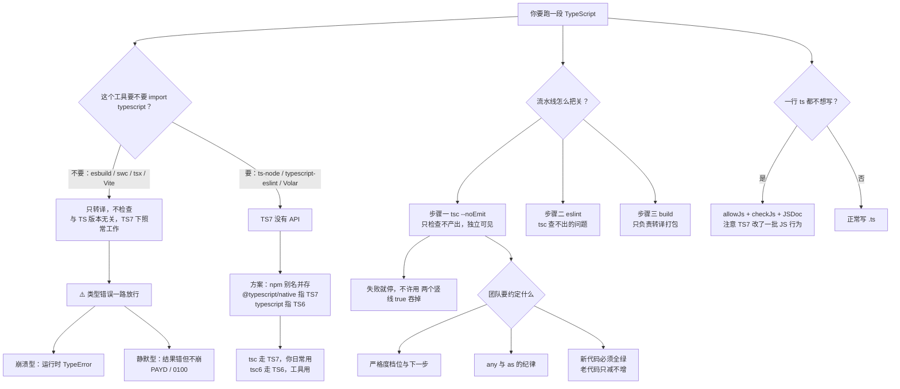

# 第 12 课：工具链集成与团队协作

> 所属阶段：阶段 4《工程化与类型声明》｜ 水平：零基础 TS
> 本课知识点：运行与构建工具分工、ESLint 与 typescript-eslint、类型检查进 CI 与团队规范
> 故事情节：项目构建飞快，类型却从头到尾没检查过一次——**CI 全绿，线上全红**
> ✅ 状态：已完成（2026-09-04）｜ 实操环境：Node.js v22.14.0 + TypeScript 7.0.2（**文中所有输出均为本课本机实测**）

## 🎯 本课目标

- 分清 `tsc` / `tsx` / `ts-node` / esbuild / swc / Vite 的分工，知道哪一步会**悄悄跳过类型检查**
- 配好 TS 7 时代的 lint（7.0 无 API → 用 `@typescript/typescript6` 并存方案）
- 把 `tsc --noEmit` 接进 CI 与 pre-commit，并制定团队的类型严格度约定

## 📌 知识点导航

| # | 知识点 | 关键点 | 状态 |
|---|--------|--------|------|
| 1 | 运行与构建工具分工 | `tsc` 检查 vs 转译 / `tsx`、`ts-node` / esbuild、swc、Vite 分工 / 别让类型检查被跳过 / JSDoc + `checkJs` 的轻量路线 | ✅ |
| 2 | ESLint 与 typescript-eslint | TS 7 无 API → `@typescript/typescript6` 并存方案 / 类型感知 lint / 与 `tsc` 的分工 | ✅ |
| 3 | 类型检查进 CI 与团队规范 | `--noEmit` / pre-commit / 类型严格度的团队约定 / 代码评审时看什么 | ✅ |

## 📦 前置依赖（JS 概念）

| 用到的 JS 概念 | 掌握要求 | 回补 |
|---------------|---------|------|
| npm scripts 与 `package.json` | 会用即可 | — |
| `tsconfig` 配置 | **强依赖** | 课 10 ✅ |
| 模块与 `@types` | **强依赖** | 课 11 ✅ |
| 进程退出码（exit code） | **需理解**（本课全靠它串起来） | —（本课课前回顾给最小说明） |

## ⚠️ 事实核查要求（编写本课时必做）

- 工具链生态**变化极快**（tsx / ts-node / esbuild / swc / Vite 的版本与 TS 7 兼容状态）→ 必须联网核查当前兼容情况并标注 `（核查于 YYYY-MM）`
- **typescript-eslint 与 TS 7 的并存方案**是官方公告明确给出的（`typescript@npm:@typescript/typescript6` 别名 + `@typescript/native`），编写时以官方公告为准并实测
- 拿不准的兼容性一律标 `⏳ 置信度：低`，不写死结论

### ✅ 核查结果（2026-09-04）

| 核查项 | 结果 |
|--------|------|
| 本机版本 | `tsc --version` → **7.0.2**；`node --version` → **v22.14.0**（与基线一致） |
| 官方来源 | Announcing TypeScript 7.0（2026-07-08）已通读，**「RUNNING SIDE-BY-SIDE WITH TYPESCRIPT 6.0」章节逐字引用**于知识点 2；Vite 官方文档 Features 页 TypeScript 小节原文已取得 |
| 版本探测（`npm view <pkg> version`，2026-09-04） | `typescript` **7.0.2** ｜ `@typescript/typescript6` **6.0.2** ｜ `typescript-eslint` **8.69.0** ｜ `eslint` **10.9.1** ｜ `tsx` **4.23.13** ｜ `ts-node` **10.9.2** ｜ `esbuild` **0.28.2** ｜ `vite` **8.2.2** |
| 实测覆盖 | 本文 **6 个子项目**全部实跑：`toolchain`、`jsdoc`、`lint`、`lint-naive`、`ci`，外加 `toolchain` 内的 `tsx` / `ts-node` / `--noCheck` 三组对照 |
| 关键发现① | **`typescript-eslint@8.69.0` 的 peer 范围是 `typescript: ">=4.8.4 <6.1.0"`——TS 7 在范围外。** 直接装会 **ERESOLVE 安装失败**（实测），强装后运行会**直接报错退出**（实测）。这是知识点 2 全部内容的根因 |
| 关键发现② | **`tsc` 支持 `--noCheck`**（实测：加了它就不报类型错误、正常产出 JS），但 `--help` 里**没有列出**这个开关。连 TS 自己都能只转译不检查 |
| 关键发现③ | **`ts-node` 在 TS 7 下直接崩溃**：`TypeError: Cannot read properties of undefined (reading 'fileExists')`——它依赖 `ts.sys`，而 TS 7 没有 API。同场景的 `tsx` 完全正常（它内部用 esbuild，与 TS 版本无关） |
| 关键发现④ | **Vite 8 已改用 Oxc Transformer 转译 TS**（不再是 esbuild），但"只转译不检查"的立场没变，官方文档原话照旧 |
| 一处更正 | 课 1 档案里记的「`@typescript/native`」容易被误解成一个已发布的 npm 包。**它不是**——它是官方示例里让你**自己起的别名名**（`"@typescript/native": "npm:typescript@^7.0.2"`）。实测 `npm view @typescript/native` 查无此包 |

> ⏳ **置信度标注**：`swc` / `@swc/core` 本课**未安装实测**，其结论按"纯转译器、不依赖 TS API"这一类工具的共性推断，⏳ 置信度：中。Vite 的"不检查"立场来自**官方文档原文**（非本机安装实测），置信度：高。

---

## 📦 课前回顾：npm scripts 与退出码

> 本课有一半内容建立在"**进程退出码**"上。它很简单，但很多人从没在意过。

每个命令行程序结束时都会给操作系统一个数字，叫**退出码**：

| 退出码 | 含义 |
|--------|------|
| `0` | 成功 |
| 非 `0` | 失败（具体数字由程序自己定） |

**CI、pre-commit、`&&` 串联，全都只看这一个数字。** 这就是为什么下面两条命令有天壤之别：

```powershell
# A：构建失败就停下（正确）
npm run typecheck && npm run build

# B：把失败吞掉（等于取消门禁）
npm run typecheck || true
npm run build
```

在 PowerShell 里看上一条命令的退出码：

```powershell
npm run typecheck
echo $LASTEXITCODE      # 0 = 通过，非 0 = 失败
```

本课所有实验都会带上 `exit=...`——**那不是装饰，那是 CI 真正读到的东西。**

---

## 第一幕：起源与场景引入

> 🏛️ **起源**：为什么构建工具都不做类型检查？
>
> 答案藏在两种工作的**本质差异**里。Vite 官方文档把这件事说得最直白：
>
> > "Transpilation can work on a per-file basis and aligns perfectly with Vite's on-demand compile model. In comparison, **type checking requires knowledge of the entire module graph**. Shoe-horning type checking into Vite's transform pipeline will inevitably compromise Vite's speed benefits."
> > —— Vite 官方文档 · Features · TypeScript（核查于 2026-09）
>
> 翻译过来：**转译可以一个文件一个文件地做，类型检查必须看全整个模块图。**
>
> 你把 `const x: number = "a"` 变成 `const x = "a"`，只需要看这一行。但要知道 `greet(user)` 这一调用对不对，你得先找到 `greet` 的定义、找到 `user` 的声明、顺着 import 一路追下去——**它天生是全局的**。
>
> 所以工具链分化成了两类：**只转译的**（esbuild / swc / Oxc / Vite）和**做检查的**（`tsc`）。前者可以做到毫秒级，后者快不起来——直到 TS 7 用 Go 重写，把后者也提速了 8–12 倍（课 10）。
>
> **这个分化本身不是问题，问题在于：很多人以为"能构建"就等于"类型对"。**

**记住一句话就够了**：**转译是"把 TS 变成 JS"，检查是"判断这个 TS 对不对"——两件事，两种工具，互不替代。**

好，回到你的项目。

> 🎬 **场景**：订单服务上线前的最后一次 CI。构建 4 毫秒，全绿。
>
> 第二天早上，账单金额开始出现 `0100` 这种东西。

代码长这样（`playground/lesson-12/ci/`）：

```ts
// src/order.ts
export interface Order {
  id: string;
  amount: number;
}

export function sumAmount(orders: Order[]): number {
  return orders.reduce((total, order) => total + order.amount, 0);
}
```

```ts
// src/checkout.ts
import { sumAmount } from "./order.js";

// ❌ 类型错误：amount 写成了字符串
const orders = [{ id: "A-1", amount: "100" }];

console.log("total =", sumAmount(orders));
```

跑一遍 CI 的两半，结果截然相反（**实测**）：

```
$ npm run build        # esbuild
  dist\checkout.js  224b
  Done in 4ms
build-exit=0            ✅ 绿

$ npm run typecheck    # tsc --noEmit
  src/checkout.ts(6,34): error TS2345: Argument of type
    '{ id: string; amount: string; }[]' is not assignable to parameter of type 'Order[]'.
typecheck-exit=1        ❌ 红
```

而那个"全绿"的产物跑起来是这样：

```
$ node dist/checkout.js
total = 0100
```

**`0 + "100"` 拼成了字符串 `"0100"`。** 没有异常、没有堆栈、没有任何日志——账单安静地错了一个数量级的语义。

这就是本课要解决的问题：**类型检查从未在你的流水线里真正跑过。**

---

## 第二幕：认知冲突

你决定把类型检查加上，结果撞了三堵墙：

```powershell
# 实验 A：装 ESLint，装不上
$ npm i -D eslint typescript-eslint typescript
npm error code ERESOLVE
npm error peer typescript@">=4.8.4 <6.1.0" from typescript-eslint@8.69.0

# 实验 B：项目里已经能跑了，为什么还要 ESLint？
$ npx tsc --noEmit
exit=0                       # tsc 说没问题
$ npx eslint .
✖ 4 problems (4 errors)      # ESLint 说有四个

# 实验 C：本地都查过了，CI 里为什么还要再查一遍？
```

三个疑惑，正好落在本课的三个知识点上：

1. **构建工具链里，谁在检查类型？** 为什么有的工具对 TS 7 毫无反应，有的直接崩？
2. **TS 7 没有 API，ESLint 怎么办？** 而且 `tsc` 都说没问题的代码，ESLint 凭什么报错？
3. **本地检查过了，CI 里还要查什么？** 团队层面到底要约定什么？

---

## 第三幕：层层揭示

> ⚠️ **本课的实测环境**：所有结论都在 `playground/lesson-12/` 下**实际跑过**（6 个子项目）。TS 7 与生态的兼容性以官方公告 + 各包 `peerDependencies` 实测为准。

### 知识点 1：运行与构建工具分工

> 关键点：`tsc` 检查 vs 转译 / `tsx`、`ts-node` / esbuild、swc、Vite 分工 / 别让类型检查被跳过 / JSDoc + `checkJs` 的轻量路线

#### 一句话定义

**转译**（把 TS 语法变成 JS）和**类型检查**（判断类型是否正确）是两件独立的事。`tsc` 两个都做；esbuild / swc / Oxc / Vite 只做前者；`tsx` / `ts-node` 是"直接运行 `.ts`"的运行时，也只做前者。

#### 直觉建立（类比）

**出版社的两道工序：排版 与 校对。**

- **转译 = 排版**：把作者的手稿变成可印刷的版式。**一页一页独立处理就行**，不看你前面写了什么
- **类型检查 = 校对**：检查"第 3 章说主角叫张三，第 17 章怎么变成李四了"。**必须通读全书**
- **构建工具 = 印刷厂**：只管排版和印刷，快得惊人
- **`tsc` = 排版 + 校对一起做**

> 💡 **类比的边界**：真实出版社会**强制**有校对环节；而你的构建流水线**不会**自动补上类型检查——它只会安静地跳过。**这正是本课的整个问题所在。**

#### 核心原理

**① 工具分工总表**（本知识点的**决策参考**）

| 工具 | 转译 | 类型检查 | 依赖 TS API | TS 7 可用 | 本课状态 |
|------|------|---------|------------|----------|---------|
| `tsc` | ✅ | ✅（默认开） | — | ✅ | 实测 |
| **`tsc --noCheck`** | ✅ | ❌ | — | ✅ | **实测**（`--help` 里没列） |
| `esbuild` | ✅ | ❌ | ❌ | ✅ | 实测 |
| `swc` / Oxc | ✅ | ❌ | ❌ | ✅ 推断 | ⏳ 置信度：中 |
| `tsx` | ✅（内部用 esbuild） | ❌ | ❌ | ✅ | 实测 |
| `ts-node` | ✅ | ✅（默认开） | ✅ | ❌ | **实测崩溃** |
| Vite | ✅ | ❌（官方明确） | ❌ | ✅ | 官方文档原文 |
| typescript-eslint | — | 借用 TS API | ✅ | ❌ 需别名 | 见知识点 2 |

**判断一个工具在 TS 7 下能不能用，只看一件事：它要不要 `import "typescript"`。**

- **要**（`ts-node`、typescript-eslint、Volar / vue-tsc）→ TS 7 没有 API，**用不了**，需要 TS 6 并存
- **不要**（esbuild、swc、tsx、Vite）→ 它们只是把类型语法**擦掉**，跟 TS 是什么版本毫无关系

**② 实测：只转译不检查会发生什么**（`toolchain/`）

一份类型错得离谱但语法完全合法的代码：

```ts
interface User { profile: { name: string }; }
function greet(user: User): string { return "hello, " + user.profile.name; }

const currentUser = { profile: null };   // ❌ 类型错误
console.log(greet(currentUser));
```

四个工具，四种反应（**全部实测**）：

| 工具 | 结果 |
|------|------|
| `tsc --noEmit` | ❌ **exit=1**：`error TS2345: Argument of type '{ profile: null; }' is not assignable to parameter of type 'User'.` |
| `esbuild` | ✅ **exit=0**：`dist-esbuild\app.js  149b / Done in 4ms` |
| `node dist-esbuild/app.js` | 💥 **exit=1**：`TypeError: Cannot read properties of null (reading 'name')` |
| `tsx src/app.ts` | 💥 **exit=1**：同样的 `TypeError` |

**对照组**（`src/silent.ts`）——类型错了，但**运行时一切正常**：

```ts
type OrderStatus = "paid" | "refunded";
const status: OrderStatus = "payd";   // ❌ 拼写错，但它是合法字符串
console.log("status label =", statusLabel(status));
```

`tsc` 报 **TS2322**；esbuild 照过；`node` 输出 **`status label = PAYD`** —— **不崩，只是业务语义错了。**

> 这一类比崩溃更可怕：**崩溃会被监控抓到，静默的错误结果不会。** 第一幕里那个 `total = 0100` 就是它。

**③ 连 `tsc` 自己都能只转译不检查**（实测）

这是本课最反直觉的一条：

```
$ node ...\tsc -p . --noCheck
exit=0
$ ls dist-tsc
dist-tsc\app.js
dist-tsc\silent.js
```

不加 `--noCheck` 时，同一条命令会报 TS2345 + TS2322 两条错误。**加了它，tsc 就退化成了一台纯粹的转译器。**

> ⚠️ 这个开关在 `tsc --help` 的输出里**查不到**（本课实测确认），但它确实生效。别在任何 CI 脚本里误用它。

**④ `tsx` vs `ts-node`：一对绝佳对照**（实测）

同样是"直接跑 `.ts` 文件"，两者在 TS 7 下命运完全不同：

```
$ npx tsx src/app.ts
TypeError: Cannot read properties of null (reading 'name')     ← 你的 bug，符合预期

$ npx ts-node --esm src/app.ts
TypeError: Cannot read properties of undefined (reading 'fileExists')   ← 工具自己起不来
```

区别在于依赖：

- **`tsx@4.23.13`** 的唯一运行时依赖是 `esbuild`（`npm view tsx dependencies` → `{"esbuild": "~0.28.0"}`）→ **不碰 TS API** → 与 TS 版本无关
- **`ts-node@10.9.2`** 的 peer 里有 `typescript: ">=2.7"` → 它要 `import "typescript"` 并调用 `ts.sys.*` → **TS 7 没有 API，它连启动都做不到**

**记住这个判据，你就能自己判断任何一个新工具在 TS 7 下的命运。**

**⑤ Vite：官方文档把话说死了**（核查于 2026-09，来源 Vite 官方文档 Features 页）

> "Note that Vite only performs transpilation on `.ts` files and does **NOT** perform type checking. It assumes type checking is taken care of by your IDE and build process."

文档还给了官方建议：

> "For production builds, you can run `tsc --noEmit` in addition to Vite's build command."
> "During development, if you need more than IDE hints, we recommend running `tsc --noEmit --watch` in a separate process..."

**顺便补两条与前面课程直接相关的**：

- **Vite 8 已改用 Oxc Transformer 转译 TS**（不再是 esbuild），并因此要求你的 `tsconfig.json` 里设 **`"isolatedModules": true`**——因为纯转译不支持 `const enum`、隐式类型导入这些需要类型信息的特性
- 关于 `paths`：Vite 需要显式开 `resolve.tsconfigPaths: true` 才认你的别名映射，而官方文档引用 TS 团队的立场说这个特性 **"should only be used to inform TypeScript that another tool has this mapping and will use it at runtime or when bundling"**

> 🔗 **回扣课 11**：课 11 说「`paths` 只改类型解析不改产物，要让运行时也认得用打包器 alias」。Vite 的 `resolve.tsconfigPaths` 就是那个"打包器侧的对应配置"——**两边配的是同一件事**。这正是官方那句话的意思：`paths` 是"告诉 TS 别人会处理"，不是"让 TS 处理"。

**⑥ 轻量路线：JSDoc + `checkJs`**（大纲专门要求补的一条）

如果你的项目**一行 `.ts` 都不想写**（老 JS 项目、脚本仓库、不想引入构建步骤），仍然可以拿到类型检查——靠 **JSDoc 注释 + `checkJs`**。

配置（`jsdoc/tsconfig.json`）：

```json
{
  "compilerOptions": {
    "allowJs": true,      // 把 .js 纳入编译
    "checkJs": true,      // 并且检查它们的类型（关键在这行）
    "strict": true,
    "noEmit": true
  }
}
```

用法（`jsdoc/src/legacy.js`，**实测 exit=0**）：

```js
/**
 * @typedef {{ id: string, price: number }} CartItem
 */

/**
 * @param {CartItem[]} items
 * @returns {number}
 */
export function total(items) {
  return items.reduce((sum, item) => sum + item.price, 0);
}
```

**JSDoc 写出来的类型，和 `.ts` 里的类型一样会被检查**（`jsdoc/src/caught.js`，实测）：

```
src/caught.js(9,27): error TS2345: Argument of type 'string' is not assignable to parameter of type 'number'.
```

**`allowJs` 与 `checkJs` 的分工**（实测对照，同一个文件）：

| 配置 | 结果 |
|------|------|
| `allowJs: true` + `checkJs: false` | **exit=0**（纳入编译，但不检查） |
| `allowJs: true` + `checkJs: true` | **exit=1**，报出 TS2345 |

> **`allowJs` 是"看得见"，`checkJs` 才是"查得严"。** 只开前者等于什么都没做。

**⚠️ TS 7 改了 JS 支持的一批行为**（官方公告「JAVASCRIPT DIFFERENCES」章节，逐条列出）：

| 旧写法 | TS 7 的行为 |
|--------|------------|
| 值当类型用（`{MyClass}`） | 不支持，写 `typeof someValue` |
| `@enum` | 不再特殊识别，改用 `@typedef` |
| 单独的 `?` | 不支持，写 `any` |
| `@class` 让函数变构造器 | 不支持，写 `class` 声明 |
| 后缀 `!` | 不支持，直接写 `T` |
| 类型名写在 `@typedef` 标签外 | 不支持，必须写在标签里 |
| **Closure 风格函数语法** `function(string): void` | **不再支持**，改用 TS 简写 `(s: string) => void` |

最后一条本课实测到了，而且比公告描述的更硬——**它是语法错误，不是语义警告**：

```
src/closure-style.js(5,20): error TS1005: '}' expected.
```

> 老 JS 项目升级 TS 7 时，这类报错会成批出现。官方把完整差异维护在 TS 仓库的 `CHANGES.md` 里。

#### 常见误区

1. **"能构建成功就说明类型没问题。"** → 完全无关。实测 esbuild exit=0，运行时 `TypeError`。
2. **"跑一遍没崩就说明没问题。"** → `silent.ts` 实测输出 `PAYD`，`checkout.js` 输出 `0100`，都不崩。
3. **"`tsc` 天生就会检查类型。"** → `tsc --noCheck` 实测只转译不检查。
4. **"TS 7 出来后所有 TS 工具都能直接用。"** → 判据是"要不要 TS API"。`ts-node` 实测崩溃，`tsx` 实测正常。
5. **"Vite 会检查类型。"** → 官方原文：does **NOT** perform type checking。
6. **"开了 `allowJs` 就在检查 JS 了。"** → 还得开 `checkJs`（实测对照 exit=0 vs exit=1）。

#### 一句话记住

> **转译与检查是两件事：`tsc` 两个都做，esbuild / swc / tsx / Vite 只做前者，依赖 TS API 的工具（`ts-node`、typescript-eslint）在 TS 7 下必须换成 TS 6 并存。**

#### 官方文档

- Vite · TypeScript（含"Transpile Only"原文）：https://vite.dev/guide/features#typescript
- tsconfig `checkJs` / `allowJs`：https://www.typescriptlang.org/tsconfig#checkJs
- TS 7 的 JS 差异清单（官方 `CHANGES.md`）：https://github.com/microsoft/TypeScript/blob/main/CHANGES.md

---

### 知识点 2：ESLint 与 typescript-eslint

> 关键点：TS 7 无 API → `@typescript/typescript6` 并存方案 / 类型感知 lint / 与 `tsc` 的分工

#### 一句话定义

**TS 7.0 不提供编程 API**（7.1 才有），而 typescript-eslint 必须调用 TS API 才能工作。官方给出的过渡方案是：**用 npm 别名让 `typescript` 这个名字指向 TS 6.0 的兼容包**，从而 `tsc` 走 7、工具走 6，两边并存。

#### 直觉建立（类比）

**一栋楼翻修期间的临时通行证。**

新装的门禁系统（TS 7）又快又好，但**还没开放接口**给快递公司（typescript-eslint）。于是物业发了一张临时通行证：`typescript` 这个门牌号**继续指向旧系统**（TS 6），快递员照常送货；而你自己走新门禁（`@typescript/native`）。

**两边同时有效，互不干扰。**

> 💡 **类比的边界**：真实翻修有工期，结束后会回收通行证。这里的"工期"是 **TS 7.1**——官方明确说 7.1 会带一套**新的** API，届时 typescript-eslint 需要再次适配（官方给的跟踪 issue 是 typescript-eslint#10940）。

#### 核心原理

**① 先看证据：直接装会怎样**（`lint-naive/`，实测）

```powershell
$ npm i -D eslint typescript-eslint typescript
npm error code ERESOLVE
npm error ERESOLVE unable to resolve dependency tree
npm error
npm error Found: typescript@7.0.2
npm error
npm error Could not resolve dependency:
npm error peer typescript@">=4.8.4 <6.1.0" from typescript-eslint@8.69.0
```

**`npm install` 直接失败**（exit=1）。根因就在那行 peer 范围：

```
typescript-eslint@8.69.0  →  peerDependencies.typescript = ">=4.8.4 <6.1.0"
```

**TS 7 不在范围内。** 这不是 typescript-eslint 保守，是它必须调用 TS 的 API——而 TS 7 没有。

**② 硬装会怎样**（实测）

加上 `--legacy-peer-deps` 能装上，但一运行就露馅：

```
$ npx eslint .
Error: typescript-eslint does not support TS 7.0.

Please see https://devblogs.microsoft.com/typescript/announcing-typescript-7-0/#running-side-by-side-with-typescript-6.0
to run typescript-eslint using the TS 6 API.

See also https://github.com/typescript-eslint/typescript-eslint/issues/10940
for tracking typescript-eslint's support for TS >=7.1

ESLint: 10.9.1
eslint-exit=2
```

**typescript-eslint 自己检测到了 TS 7，并且把解决方案的两个链接直接打给你。** 这在工具界算是很体贴了。

**③ 官方方案：npm 别名并存**（公告原文，逐字引用）

> "While TypeScript 7.0 is here, it does not ship with an API. We expect TypeScript 7.1 to ship with a new (and different) API, but until then we have made it a priority to ensure TypeScript can be run side-by-side with TypeScript 6.0 for utilities that still need some programmatic access to the compiler (such as typescript-eslint)."
>
> "As part of the 6.0/7.0 transition process, we've published a new compatibility package, `@typescript/typescript6`. This package provides an executable named `tsc6`, so that if needed, you can install TypeScript 7.0 (which ships its own `tsc` binary) side-by-side without naming conflicts. The new package also re-exports the TypeScript 6.0 API, so that you can use `tsc` for TypeScript 7, while other tooling can continue to rely on 6.0."
>
> "Because some tools like typescript-eslint expect to import from `typescript` directly via peer dependencies, we recommend achieving this via npm aliases."
>
> ```json
> {
>   "devDependencies": {
>     "@typescript/native": "npm:typescript@^7.0.2",
>     "typescript": "npm:@typescript/typescript6@^6.0.2"
>   }
> }
> ```
> —— Announcing TypeScript 7.0 · RUNNING SIDE-BY-SIDE WITH TYPESCRIPT 6.0

**④ 实测这套方案**（`lint/`，**exit=0，装了 90 个包**）

```json
{
  "devDependencies": {
    "@typescript/native": "npm:typescript@^7.0.2",
    "typescript": "npm:@typescript/typescript6@^6.0.2",
    "eslint": "^10.9.1",
    "typescript-eslint": "^8.69.0"
  }
}
```

三件事各自成立（**全部实测**）：

| 验证 | 命令 | 结果 |
|------|------|------|
| `tsc` 走 TS 7 | `npx tsc --version` | **Version 7.0.2** |
| `tsc6` 走 TS 6 | `npx tsc6 --version` | **Version 6.0.3** |
| 工具 import 到的是 TS 6 | `node -e "console.log(require('typescript').version)"` | **6.0.3** ✅ 满足 peer 范围 |

`node_modules/.bin/` 下四个可执行文件并存：`tsc`、`tsc6`、`eslint`。

> 📌 **一个容易困惑的细节**：这里会出现**两个不同的 6.0.x**：
>
> | 查法 | 得到 | 是什么 |
> |------|------|-------|
> | `npm view @typescript/typescript6 version` / `npm ls` | **6.0.2** | 兼容包 `@typescript/typescript6` 自己的包版本 |
> | `tsc6 --version` / `require('typescript').version` | **6.0.3** | 它**内部包裹的那份 TS 编译器**自报的版本 |
>
> 兼容包的版本号与它所包裹的编译器版本号不必一致，看到差异不必惊慌——**两者都在 `>=4.8.4 <6.1.0` 范围内，typescript-eslint 就满意**。

**⑤ `tsc` 与 ESLint 到底谁查什么**（本知识点的**核心价值**）

同一份代码（`lint/src/sample.ts`）：

```ts
export async function fetchOrder(id: string): Promise<{ id: string }> {
  const row = await Promise.resolve({ id });
  return row;
}
export function processOrder(id: string): void {
  fetchOrder(id);          // ① Promise 没人接
}
export function parse(raw: any): any { return raw; }   // ② any
export function firstLabel(items: string[]): string {
  if (items) { return items[0] ?? ""; }                // ③ 永真条件
  return "";
}
```

**实测结果对比**：

```
$ npx tsc --noEmit
tsc-exit=0                    ← 零错误！

$ npx eslint .
eslint-exit=1                 ← 4 个错误
  10:3   error  Promises must be awaited, end with a call to .catch, ...
                                              @typescript-eslint/no-floating-promises
  14:28  error  Unexpected any. Specify a different type   @typescript-eslint/no-explicit-any
  14:34  error  Unexpected any. Specify a different type   @typescript-eslint/no-explicit-any
  20:7   error  Unnecessary conditional, value is always truthy
                                              @typescript-eslint/no-unnecessary-condition

✖ 4 problems (4 errors, 0 warnings)
```

**这四条，`tsc` 一条都查不出来**，因为它们在 TypeScript 的类型系统里全都是**合法的**：

| 问题 | 为什么 `tsc` 不管 | 谁该管 |
|------|------------------|-------|
| Promise 没人接 | 丢掉一个返回值，类型上完全合法 | ESLint（`no-floating-promises`） |
| 用了 `any` | `any` 是合法类型，TS 故意留的逃生舱（课 6） | **团队约定** + ESLint（`no-explicit-any`） |
| 永真条件 | 判断一个真值，类型上没问题 | ESLint（`no-unnecessary-condition`） |
| `async` 里没有 `await` | 合法（只是没意义） | ESLint（`require-await`） |

**分工一句话**：**`tsc` 管"类型对不对"，ESLint 管"代码该不该这么写"。** 前者是编译器，后者是团队规范的机器化。

**⑥ 类型感知 lint 的配置要点**（实测通过的 `eslint.config.js`）

```js
import tseslint from "typescript-eslint";

export default tseslint.config(
  // recommendedTypeChecked = 需要类型信息才能工作的那批规则
  ...tseslint.configs.recommendedTypeChecked,
  {
    languageOptions: {
      parserOptions: {
        // 类型感知 lint 的关键：告诉 parser 去哪找 tsconfig
        project: "./tsconfig.json",
        tsconfigRootDir: import.meta.dirname,
      },
    },
    rules: {
      "@typescript-eslint/no-unnecessary-condition": "error",
    },
  },
  // 配置文件本身是 .js，不在 tsconfig 的 include 里
  // —— 不给它关掉类型感知规则，它连解析都过不去
  {
    files: ["**/*.js"],
    ...tseslint.configs.disableTypeChecked,
  },
);
```

两个必须知道的点：

1. **`parserOptions.project` 是类型感知的开关**。不配它，parser 不知道类型从哪来，所有 `TypeChecked` 规则集体失效
2. **最后一个 block 不能省**。本课实测：少了它，ESLint 会拿 `eslint.config.js` 自己开刀——
   `Parsing error: "parserOptions.project" has been provided for @typescript-eslint/parser. The file was not found in any of the provided project(s): eslint.config.js`

> ⚠️ **代价**：类型感知 lint 要构建完整的类型信息，比普通 lint 慢得多。TS 7 让 `tsc` 快了 8–12 倍，但 **typescript-eslint 走的还是 TS 6 的那份 API**——这部分提速它吃不到。大型项目上，这是当前过渡期实实在在的成本。

#### 常见误区

1. **"TS 7 装上去，ESLint 自然能用。"** → 装都装不上（ERESOLVE），强装则运行时报错退出（实测 exit=2）。
2. **"`@typescript/native` 是个官方包，去 npm 装它。"** → **不是包**，是官方示例里让你自己起的别名名。实测 `npm view @typescript/native` 查无此包。
3. **"配了 `recommendedTypeChecked` 就有类型感知了。"** → 还必须配 `parserOptions.project`。
4. **"`tsc` 通过就不需要 ESLint。"** → 实测同一份代码：tsc 零错误，ESLint 四个。
5. **"ESLint 能替代 `tsc`。"** → 不能。ESLint 不做类型检查，它只是**借用**类型信息来跑规则。

#### 一句话记住

> **TS 7 无 API → 用 npm 别名让 `typescript` 指向 TS 6、`@typescript/native` 指向 TS 7；`tsc` 管类型对不对，ESLint 管代码该不该这么写。**

#### 官方文档

- TS 7 并存方案（官方公告对应章节）：https://devblogs.microsoft.com/typescript/announcing-typescript-7-0/#running-side-by-side-with-typescript-6-0
- typescript-eslint 上手：https://typescript-eslint.io/getting-started/
- typescript-eslint 对 TS ≥7.1 的支持跟踪：https://github.com/typescript-eslint/typescript-eslint/issues/10940

---

### 知识点 3：类型检查进 CI 与团队规范

> 关键点：`--noEmit` / pre-commit / 类型严格度的团队约定 / 代码评审时看什么

#### 一句话定义

**类型检查必须是流水线里一个独立、可见、不可跳过的步骤**——用 `tsc --noEmit` 实现，并且**排在构建之前**。本地检查只是提速手段，**绝不能是唯一的检查点**。

#### 直觉建立（类比）

**机场的安检与登机口。**

- **本地检查**（编辑器红线、pre-commit）= 你自己在家先称一下行李。方便，但**没人强制**
- **CI 检查** = 安检口。**过不了就是上不了飞机**
- **`tsc --noEmit`** = 安检门本身。它不帮你整理行李（`--noEmit`：不产出任何文件），只负责判断"过不过"
- **构建** = 登机。**它不该承担安检的职责**

> 💡 **类比的边界**：真实机场的安检和登机是串联的、缺一不可；而**你的流水线里这两步是可以完全脱钩的**——构建跑得飞快，安检根本没开。第一幕那个 `total = 0100` 就是这么上飞机的。

#### 核心原理

**① 为什么是 `--noEmit`**

| 命令 | 做什么 | 适合 |
|------|-------|------|
| `tsc` | 检查 **+** 产出 JS | 真正的构建步骤 |
| **`tsc --noEmit`** | **只检查**，一个文件都不产出 | **CI / pre-commit 的类型门禁** |

CI 里跑 `tsc`（不带 `--noEmit`）是在浪费时间：你既不需要它的产物（构建另有工具负责），它还会往磁盘写一堆文件。

**② 实测：一条合格的 CI 脚本**（`ci/`）

```json
{
  "scripts": {
    "typecheck": "tsc --noEmit",
    "build": "esbuild src/checkout.ts --bundle --platform=node --format=esm --outfile=dist/checkout.js",
    "ci": "npm run typecheck && npm run build"
  }
}
```

三步各自的退出码（**实测**）：

| 命令 | 退出码 | 说明 |
|------|-------|------|
| `npm run build` | **0** | esbuild 无视类型错误，4ms 打包完成 |
| `npm run typecheck` | **1** | `error TS2345` |
| `npm run ci` | **1** | `&&` 让 build **根本没跑** |

**`&&` 的语义就是"前一步失败就停"** —— 这正是你要的：类型错了，连构建都不必浪费时间。

**③ CI workflow 的正确与错误写法**（`toolchain/`）

❌ **错误：只跑构建**（`ci-workflow-bad.yml`）

```yaml
- run: npm ci
- run: npm run build:esbuild      # 类型错误从这里溜过去
- run: npm test
```

✅ **正确：类型检查独立且靠前**（`ci-workflow-good.yml`）

```yaml
- run: npm ci
- run: npm run typecheck          # tsc --noEmit：类型错误在这里被拦下
- run: npm run lint               # ESLint：类型检查查不出的问题
- run: npm run build:esbuild      # 构建：只负责转译与打包
- run: npm test
```

**三条纪律**：

1. **顺序**：`typecheck` 要在 `build` 之前。类型错了就别浪费构建时间
2. **独立**：别把 `tsc` 藏进 `build` 脚本里。它必须是一个**单独可见**的步骤，这样 CI 日志里一眼能看出是"类型错"还是"构建错"
3. **不许吞失败**：没有 `|| true`、没有 `|| exit 0`、没有 `continue-on-error: true`

**④ pre-commit：快 vs 全的取舍**

```sh
#!/usr/bin/env sh
# 启用：git config core.hooksPath hooks
set -e

echo "[pre-commit] tsc --noEmit"
npm run typecheck
```

| 位置 | 查什么 | 取舍 |
|------|-------|------|
| **pre-commit** | 全量 `tsc --noEmit` + 改动文件的 lint | 图**快**。TS 7 之前大仓库跑不动全量；官方引用 Slack 的例子是"CI 类型检查从 7.5 分钟降到 1.25 分钟"——**TS 7 让全量进 pre-commit 重新变得可行** |
| **CI** | typecheck + lint + build + test，全量 | 图**全**。这是唯一的强制点 |

> 大仓库的常规做法：pre-commit 用 `lint-staged` 只跑**改动文件**的 ESLint（快），全量 `tsc --noEmit` 留给 CI；如果项目规模允许，把 `tsc` 也放进 pre-commit（TS 7 之后很多团队可以了）。

**⑤ 团队要约定的四件事**（本知识点的**决策参考**）

| 约定 | 为什么 | 建议 |
|------|-------|------|
| **当前严格度档位** | 否则会有人偷偷关开关 | 写进 `README` 或 `docs/typescript.md`：现在开到哪一档（课 10 六步里的第几步）、**下一步打算开什么** |
| **`any` 怎么处理** | `any` 合法，不约定就会泛滥 | 建议：默认禁止（`no-explicit-any` 报 error），确需用 `unknown` + 收窄（课 6）；实在要 `any` 就 `// eslint-disable-next-line` 并**写明理由** |
| **断言的纪律** | `as` 是"我保证"，编译器不验证（课 6 / 课 11） | 建议：`as` 只允许出现在**信任边界**（外部数据进来那一下）；内部逻辑用 `as` 一律打回 |
| **新代码的基线** | 老代码可以不完美，新代码不能 | 建议：**新文件必须全绿**；老文件用 `@ts-expect-error` 标记待修项，并**统计数量、只减不增** |

> 🔧 **`@ts-expect-error` vs `@ts-ignore`**：前者**必须真的有错误**才不报错（错误修好了它会反过来提醒你"这条注释多余了"），后者是无条件静默。**团队规范一律用 `@ts-expect-error`**——它是"待办清单"，`@ts-ignore` 是"欠债不还"。

**⑥ 代码评审时看什么**（类型相关）

| 看什么 | 红灯信号 |
|--------|---------|
| 新增的 `any` | 有没有写理由？能不能换成 `unknown` + 收窄？ |
| 新增的 `as` | 是在信任边界（外部数据）吗？还是内部"为了过编译"？ |
| 新增的 `@ts-expect-error` | 数量是不是在涨？有没有对应的修复计划？ |
| 函数签名 | 参数/返回值类型是否**表达了业务约束**（课 8 泛型、课 9 工具类型的用武之地）？还是清一色 `string` / `object`？ |
| 被关闭的开关 | 有没有人为了过 CI 把 `strict` 的某个子项关掉？ |

> 类型评审的核心只有一个问题：**这个类型有没有替下一个人挡住错误？** 挡住了就是好类型，只是"让编译器闭嘴"就是负资产。

#### 常见误区

1. **"本地编辑器没红线就不用 CI 检查。"** → 编辑器只看打开的文件，且每个人的配置可能不同。CI 是唯一强制点。
2. **"CI 里跑 `tsc` 就行，不用 `--noEmit`。"** → 会白白产出文件、拖慢流水线。
3. **"构建脚本里已经调了 `tsc`，等于检查过了。"** → 藏起来就等于没有：出错时你分不清是类型错还是构建错，而且没人看得到这一步。
4. **"`tsc` 失败但流水线要跑通，加个 `|| true`。"** → 这就是第一幕的 `0100`。
5. **"`@ts-ignore` 和 `@ts-expect-error` 差不多。"** → 前者是静默，后者是"可被回收的待办"。
6. **"类型检查太慢，放 pre-commit 不现实。"** → TS 7 之后要重新评估（官方数据：Slack 的 CI 类型检查 7.5 分钟 → 1.25 分钟）。

#### 一句话记住

> **`tsc --noEmit` 必须是流水线里独立、可见、排在构建前、且失败不被吞掉的一步；团队要把严格度档位、any 与断言的纪律写下来。**

#### 官方文档

- `tsc --noEmit`：https://www.typescriptlang.org/tsconfig#noEmit
- TypeScript 与 CI（官方 wiki 思路，含 `--noEmit` 建议）：https://www.typescriptlang.org/docs/handbook/intro.html

---

## 第四幕：实操验证

回到第一幕那个"构建 4 毫秒、账单变成 `0100`"的订单服务。按本课的三条线把它修完。

**第 1 步 · 先证明问题存在**（`ci/`）

```
$ npm run build
  dist\checkout.js  224b
  Done in 4ms
build-exit=0                    ← 构建：全绿

$ node dist/checkout.js
total = 0100                    ← 产物：静默的错误结果

$ npm run typecheck
src/checkout.ts(6,34): error TS2345: Argument of type
  '{ id: string; amount: string; }[]' is not assignable to parameter of type 'Order[]'.
typecheck-exit=1                ← 类型检查：一直就在这里，只是没人跑
```

**第 2 步 · 把检查接进流水线**

```json
{ "scripts": { "ci": "npm run typecheck && npm run build" } }
```

```
$ npm run ci
npm error ... src/checkout.ts(6,34): error TS2345 ...
ci-exit=1                       ← 拦住了，且 build 根本没跑
```

**第 3 步 · 把 lint 也装上（TS 7 下必须绕开 API 问题）**

```json
{
  "devDependencies": {
    "@typescript/native": "npm:typescript@^7.0.2",
    "typescript": "npm:@typescript/typescript6@^6.0.2",
    "eslint": "^10.9.1",
    "typescript-eslint": "^8.69.0"
  }
}
```

```
$ npx tsc --version   →  Version 7.0.2      （你用的编译器）
$ npx tsc6 --version  →  Version 6.0.3      （工具用的编译器）
$ npx eslint .        →  4 errors           （tsc 一条都没查出来）
```

三个关键点的验证结果汇总（均为本课本机实测）：

| 验证项 | 实测结论 |
|--------|---------|
| `tsc --noEmit` vs esbuild | tsc exit=1 报 TS2345；esbuild exit=0「Done in 4ms」 |
| 崩溃型漏网 | `node dist-esbuild/app.js` → `TypeError: Cannot read properties of null (reading 'name')` |
| 静默型漏网 | `node dist-esbuild/silent.js` → `status label = PAYD`；`node dist/checkout.js` → `total = 0100` |
| `tsc --noCheck` | exit=0 且正常产出 JS（`--help` 里查不到这个开关） |
| `tsx` vs `ts-node` | tsx → 跑到你的 bug（`...reading 'name'`）；ts-node → 工具自崩（`...reading 'fileExists'`） |
| JSDoc + `checkJs` | `checkJs: true` 报 TS2345；`checkJs: false` 同一文件 exit=0 |
| TS 7 的 JS 变更 | Closure 风格 `function(string): void` → **TS1005 语法错误** |
| 硬装 TS 7 + typescript-eslint | **ERESOLVE 安装失败**；`--legacy-peer-deps` 强装后运行报「typescript-eslint does not support TS 7.0.」，exit=2 |
| 官方别名方案 | 安装 exit=0（90 包）；`tsc`=7.0.2、`tsc6`=6.0.3、`require('typescript').version`=6.0.3（包版本 6.0.2） |
| `tsc` vs ESLint | 同一份代码：tsc exit=0，ESLint 4 errors（floating promise / any×2 / 永真条件） |
| CI 门禁 | `typecheck` exit=1、`build` exit=0、`ci`（`&&` 串联）exit=1 且 build 未执行 |

> ✅ **回扣课 10 / 课 11**：课 10 结尾说「类型检查必须进 CI，且不能被构建工具悄悄跳过」——本课把这句话落成了可执行的配置和真实的退出码。课 11 留下的三个伏笔（打包器 alias、`tsx` 直跑 `.ts`、`skipLibCheck` 体检）也都在这里收了口。

---

## 第五幕：体系收束

> 📍 **全局定位**：**本课是阶段 4 的收官，也是整个课程从"个人技能"转向"团队工程"的分界线。**
>
> 前十课都在回答"**我怎么写好 TypeScript**"。从这一课开始，问题变成"**怎么让一个团队、一条流水线持续地写对 TypeScript**"。
>
> 阶段 4 三课的完整闭环：
> - **课 10**：类型检查**怎么配**（`tsconfig.json`）
> - **课 11**：类型**从哪来**（模块解析、声明文件、`@types`）
> - **课 12（本课）**：检查**怎么被执行**（工具链分工、lint、CI 门禁）
>
> 三课合起来就是阶段 4 那句话：**让类型走出单文件，在整个工程、整个团队里真正生效。**
>
> **下一阶段**（阶段 5《深入与架构》）：类型系统的天花板与地板——它能做到什么、做不到什么、什么时候别干。**本课已经埋了两个伏笔**：① 类型体操的编译代价（课 13）② 为什么类型检查慢、怎么提速（课 14）——而这两个问题在 TS 7 之后有了全新的答案。

**现在你会了什么**：

- 能用「**要不要 TS API**」这一个判据，自己判断任何 TS 工具在 TS 7 下的兼容性
- 能说清转译与类型检查是两件独立的事，并举出**崩溃型**与**静默型**两种漏网的实测证据
- 能配好 TS 7 时代的 ESLint（npm 别名并存方案），并说清 `tsc` 与 ESLint 的分工
- 能把 `tsc --noEmit` 接进 CI 与 pre-commit，并给出团队的**四项类型约定**

**给未来自己的提醒**：

> 本课内容**强时效**——工具链生态比 TS 本身变得还快。若你读到这里时已过了一段时间，请重新核三件事：
> 1. `npm view typescript-eslint peerDependencies` —— **TS 7.1 发布后这个范围很可能已放宽**，届时别名方案可能不再必要
> 2. `npm view tsx version` / `npm view vite version` —— 版本与实现细节（如 Vite 已从 esbuild 换成 Oxc）会变
> 3. typescript-eslint 的跟踪 issue **#10940** —— 那是官方对 TS ≥7.1 支持的进度条
>
> **但"转译与检查必须分开、检查必须有独立的强制执行点"这条原则不会过时。** 工具会换，这道门禁不该撤。

> 🔗 **下一步**：阶段 5 第一课——课 13《类型体操进阶》：递归条件类型、高级推断技巧，以及**什么时候不该做类型体操**。

---

## 🐞 常见误区

1. **"能构建成功就说明类型没问题。"** → 完全无关，实测 esbuild exit=0 而运行时 `TypeError`。
2. **"跑一遍没崩就说明没问题。"** → 实测 `PAYD` 与 `0100` 都不崩，只是结果错了。
3. **"TS 7 出来后所有 TS 工具都能直接用。"** → 判据是"要不要 TS API"；`ts-node` 实测崩溃。
4. **"Vite 会检查类型。"** → 官方原文：does **NOT** perform type checking。
5. **"开了 `allowJs` 就在检查 JS 了。"** → 还得开 `checkJs`（实测 exit=0 vs exit=1）。
6. **"ESLint 装不上就加 `--legacy-peer-deps`。"** → 装得上但跑不起来（实测 exit=2），得用官方别名方案。
7. **"`tsc` 通过就不需要 ESLint。"** → 实测同一份代码：tsc 零错误，ESLint 四个。
8. **"CI 里跑 `tsc` 就行，不用 `--noEmit`。"** → 白产出文件、拖慢流水线。
9. **"构建脚本里调了 `tsc` 等于检查过了。"** → 藏起来就等于没有。
10. **"`tsc` 失败加个 `|| true` 让流水线跑通。"** → 这就是第一幕的 `0100`。
11. **"`@ts-ignore` 和 `@ts-expect-error` 差不多。"** → 前者静默，后者是可回收的待办。

## 一图总结



> 关键记忆点：① 判据是「要不要 TS API」；② 转译与检查是两件事，漏网分"崩溃型"和"静默型"；③ TS 7 无 API → npm 别名让 tsc 走 7、工具走 6；④ `tsc` 管类型对不对、ESLint 管代码该不该这么写；⑤ `tsc --noEmit` 必须独立、可见、靠前、失败不被吞。

## 课后小测

**Q1**：项目用 esbuild 打包，CI 里只跑 `npm run build`。下面说法正确的是？

- A. esbuild 会检查类型，报错时构建失败
- B. esbuild 不检查类型，类型错误会一路带到运行时
- C. esbuild 检查类型，但只检查语法错误
- D. esbuild 是否检查类型，取决于 `tsconfig.json` 的 `strict` 开关

<details><summary>答案与解析</summary>

**答案：B**。

实测（`toolchain/`）：类型错得离谱的代码，esbuild 照样打包成功——

```
$ npx esbuild src/app.ts --bundle --platform=node --format=esm --outfile=dist-esbuild/app.js
  dist-esbuild\app.js  149b
  Done in 4ms
esbuild-exit=0
```

而同一份代码 `tsc --noEmit` 报 `error TS2345`，运行产物直接 `TypeError: Cannot read properties of null (reading 'name')`。

A、C、D 都错：**esbuild 根本不读类型信息**，它只是把类型语法擦掉。`tsconfig.json` 的 `strict` 对它没有任何影响（它只看少数几个影响转译结果的选项，如 `target`、`useDefineForClassFields`）。

Vite 官方文档把这件事说得更直白：
> "Vite only performs transpilation on `.ts` files and does **NOT** perform type checking."

**这就是为什么 CI 里必须有独立的 `tsc --noEmit` 步骤。**

</details>

**Q2**：新项目要同时用 TypeScript 7 和 typescript-eslint，下面哪种 `package.json` 写法是对的？

```json
// 甲
{ "devDependencies": { "typescript": "^7.0.2", "typescript-eslint": "^8.69.0" } }

// 乙
{
  "devDependencies": {
    "@typescript/native": "npm:typescript@^7.0.2",
    "typescript": "npm:@typescript/typescript6@^6.0.2",
    "typescript-eslint": "^8.69.0"
  }
}

// 丙
{ "devDependencies": { "@typescript/native": "^7.0.2", "typescript-eslint": "^8.69.0" } }
```

- A. 甲
- B. 乙
- C. 丙
- D. 甲乙都行，装的时候加 `--legacy-peer-deps` 即可

<details><summary>答案与解析</summary>

**答案：B（乙）**。

**甲装不上**（实测 `lint-naive/`）：

```
npm error code ERESOLVE
npm error Found: typescript@7.0.2
npm error Could not resolve dependency:
npm error peer typescript@">=4.8.4 <6.1.0" from typescript-eslint@8.69.0
```

`typescript-eslint@8.69.0` 的 peer 范围是 `>=4.8.4 <6.1.0`，**TS 7 在范围外**——因为它必须调用 TS 的编程 API，而 TS 7.0 没有 API（7.1 才有）。

**乙可以**（实测 `lint/`，安装 exit=0，90 个包）：

| 命令 | 结果 |
|------|------|
| `npx tsc --version` | **7.0.2**（你日常用的编译器） |
| `npx tsc6 --version` | **6.0.3**（工具用的编译器） |
| `node -e "console.log(require('typescript').version)"` | **6.0.3** ✅ 满足 peer 范围 |

这正是官方公告「RUNNING SIDE-BY-SIDE WITH TYPESCRIPT 6.0」给出的写法。

**D 错**：`--legacy-peer-deps` 能让你装上，但一运行就露馅（实测 exit=2）：

```
Error: typescript-eslint does not support TS 7.0.
Please see ...#running-side-by-side-with-typescript-6.0 to run typescript-eslint using the TS 6 API.
```

**丙错**：`@typescript/native` **不是**一个已发布的 npm 包（实测 `npm view @typescript/native` 查无此包）。它是官方示例里让你**自己起的别名名**——`"@typescript/native": "npm:typescript@^7.0.2"` 的意思是"装 typescript@7，但把它叫这个名字"。

</details>

**Q3**：同一份代码，`tsc --noEmit` 零报错，ESLint 报了 4 个错。最合理的解释是？

- A. ESLint 的配置写错了，应该以 `tsc` 为准
- B. `tsc` 管的是"类型对不对"，ESLint 管的是"代码该不该这么写"，两者查的不是同一类问题
- C. `tsc` 有 bug，漏掉了这些错误
- D. 类型感知 lint 失效了，退化成了普通 lint

<details><summary>答案与解析</summary>

**答案：B**。

实测（`lint/src/sample.ts`）——这四条 `tsc` 全都查不出来，因为**它们在 TypeScript 的类型系统里完全合法**：

```
$ npx tsc --noEmit
tsc-exit=0

$ npx eslint .
  10:3   error  Promises must be awaited, ...          @typescript-eslint/no-floating-promises
  14:28  error  Unexpected any. Specify a different type  @typescript-eslint/no-explicit-any
  14:34  error  Unexpected any. Specify a different type  @typescript-eslint/no-explicit-any
  20:7   error  Unnecessary conditional, value is always truthy
                                                       @typescript-eslint/no-unnecessary-condition
✖ 4 problems (4 errors, 0 warnings)
```

逐条看它们为什么"合法"：

| 代码 | 类型上合法吗 | 该不该这么写 |
|------|-------------|-------------|
| `fetchOrder(id);`（没 await） | 合法，丢掉返回值不违反类型规则 | 不该，错误会被静默吞掉 |
| `function parse(raw: any): any` | 合法，`any` 是 TS 故意留的逃生舱（课 6） | 不该，除非团队约定允许 |
| `if (items)` 而 `items: string[]` | 合法，判断一个真值 | 不该，这是死代码 |

**A 错**：两个工具都对，查的是不同维度。ESLint 不替代 `tsc`，`tsc` 也不替代 ESLint。
**C 错**：不是 `tsc` 的 bug，是它的职责边界——编译器只保证类型正确。
**D 错**：恰恰相反，**类型感知 lint 正在正常工作**。第 4 条 `no-unnecessary-condition` 必须知道 `items` 的类型是 `string[]`（永远 truthy）才报得出来——没有类型信息它根本做不到。如果类型感知真的失效了，ESLint 会直接报 `Parsing error: "parserOptions.project" has been provided...`，而不是给出这 4 条规则命中。

</details>

## 🚀 下一批接力提示词

> 学完本课后，**复制下面这段文字发给 AI**，即可无缝进入下一批（无需重新描述上下文）：

```
继续学 TypeScript。我的学习档案在 frontend/typescript-core/00-学习档案.md，
刚学完阶段 4《工程化与类型声明》的课 12《工具链集成与团队协作》三个知识点
（运行与构建工具分工 / ESLint 与 typescript-eslint / 类型检查进 CI 与团队规范），
请按大纲继续讲解阶段 5 的第一课《类型体操进阶》。
```

## 🧭 课程导航

⬅️ **上一课**：[课 11：模块与声明文件](lesson-11-模块与声明文件.md)

➡️ **下一课**：[课 13：类型体操进阶](../../5-深入与架构/lessons/lesson-13-类型体操进阶.md)（阶段 5 · 待编写）

📚 **返回目录**：[课程目录](../../02-课程目录.md)

---

## 附：本课示例文件清单

所有示例位于 `playground/lesson-12/`，**全部实跑过**。

| 目录 | 用途 | 预期结果 |
|------|------|---------|
| `toolchain/src/app.ts` | 类型错 + 运行时崩 | `tsc --noEmit` 报 TS2345；esbuild exit=0；`node` 报 `TypeError: Cannot read properties of null (reading 'name')`；`tsx` 同上 |
| `toolchain/src/silent.ts` | 类型错 + 静默错误结果 | `tsc` 报 TS2322；esbuild exit=0；`node` 输出 `status label = PAYD` |
| `toolchain`（`--noCheck`） | 证明 tsc 自己也能只转译 | `tsc -p . --noCheck` exit=0 且产出 `dist-tsc/app.js`、`dist-tsc/silent.js` |
| `toolchain`（`ts-node`） | 依赖 TS API 的工具在 TS 7 下崩溃 | `TypeError: Cannot read properties of undefined (reading 'fileExists')` |
| `toolchain/ci-workflow-*.yml` | CI 正反两例 | 反例只跑 build；正例 typecheck → lint → build → test |
| `toolchain/hooks/pre-commit` | pre-commit 示例 | `git config core.hooksPath hooks` 启用 |
| `jsdoc/` | JSDoc + `checkJs` 轻量路线 | `checkJs: true` → `caught.js` 报 TS2345、`closure-style.js` 报 **TS1005**；`checkJs: false` → 同一文件 exit=0 |
| `lint/` | **官方 npm 别名并存方案** | 安装 exit=0（90 包）；`tsc`=7.0.2 / `tsc6`=6.0.3 / `require('typescript').version`=6.0.3；`tsc --noEmit` exit=0，`eslint` 报 4 错 |
| `lint-naive/` | 硬装 TS 7 + typescript-eslint（反例） | **干净状态下** `npm install` → **ERESOLVE 失败**；加 `--legacy-peer-deps` 后 `eslint` 报「typescript-eslint does not support TS 7.0.」，exit=2 |
| `ci/` | CI 门禁三步曲 | `build` exit=0 → `node dist/checkout.js` 输出 **`total = 0100`**；`typecheck` exit=1；`npm run ci` exit=1 且 build 未执行 |

复现关键实验：

```powershell
# ① 只转译不检查的代价
cd playground/lesson-12/toolchain
npx tsc --noEmit                 # exit=1（TS2345 + TS2322）
npx esbuild src/app.ts --bundle --platform=node --format=esm --outfile=dist-esbuild/app.js
node dist-esbuild/app.js         # TypeError

# ② JSDoc 轻量路线
cd playground/lesson-12/jsdoc
npx tsc -p .                     # checkJs:true  -> TS2345 + TS1005
npx tsc -p tsconfig.nocheckjs.json   # checkJs:false -> exit=0

# ③ TS 7 下的 lint：反例与正解
#    ⚠️ 复现 ERESOLVE 必须在「干净状态」下（无 node_modules / package-lock.json）
cd playground/lesson-12/lint-naive
npm install                      # ERESOLVE（peer typescript@">=4.8.4 <6.1.0"）
npm install --legacy-peer-deps   # 能装上，但工具跑不起来
npx eslint .                     # "typescript-eslint does not support TS 7.0."  exit=2

cd playground/lesson-12/lint
npm install                      # exit=0
npx tsc --version                # 7.0.2
npx tsc6 --version               # 6.0.3
npx tsc --noEmit                 # exit=0
npx eslint .                     # 4 errors

# ④ CI 门禁
cd playground/lesson-12/ci
npm run build                    # exit=0
node dist/checkout.js            # total = 0100
npm run typecheck                # exit=1
npm run ci                       # exit=1（build 未执行）
```

> ⚠️ **沙盒说明**：`lint/` 与 `lint-naive/` 演示的是**依赖安装行为**，需要联网 `npm install`（各约 90 个包 / 10-20 秒）。
> 其余目录只依赖 `playground/node_modules` 里已有的 TypeScript 7.0.2，无需额外安装。
