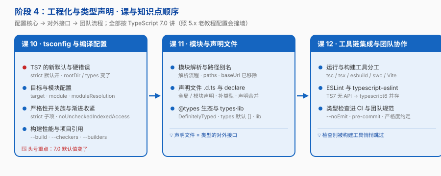

# 阶段 4：工程化与类型声明

> 所属课程：[TypeScript](../01-学习路径总览.md) ｜ 故事章节：**「身份：团队契约」——契约走出单文件，在工程与 CI 里被强制执行**
> 上一阶段：[阶段 3《泛型与类型编程》](../3-泛型与类型编程/overview.md)
> 规模：3 课 / 10 知识点 ｜ **全部内容按 TypeScript 7 讲**

## 🎯 本阶段目标

- 独立写出一份 **TS 7 可用**的 `tsconfig.json`，并解释每个关键选项（尤其是 7.0 改了的默认值）
- 为无类型的 JS 库写 `.d.ts`，说清全局声明 / 模块声明 / 声明合并三种写法
- 把类型检查接进工具链与 CI，并知道它在哪些环节会被**悄悄跳过**

## 📍 学习重点

- **TS 7 改了一批默认值**：`strict` 默认开、`rootDir` 默认 `./`、`types` 默认 `[]`，一批旧选项变成硬错误。**照 5.x 老教程配置会直接撞墙**——这是本阶段头号重点
- **`target` / `module` / `moduleResolution` 是一组联动配置**，不能单独理解；`nodenext` 与 `bundler` 的取舍取决于你的代码**最终跑在哪**
- **声明文件是类型的对外接口**：自己写代码时它是产物，用别人的库时它是契约
- **类型检查必须进 CI，且不能被构建工具悄悄跳过**：只转译不检查的工具（esbuild / swc）跑得飞快，但一个类型错误都不会报

## ✅ 必须掌握的知识点

| 知识点 | 所属课 | 学完应能 |
|--------|--------|----------|
| TS7 的新默认与硬错误 | 课 10 | 说出 7.0 改了哪些默认值、哪些选项变硬错误，并给出老项目的迁移路径 |
| 目标与模块配置 | 课 10 | 为自己的运行环境选出 `target` / `module` / `moduleResolution` 组合，说清 `nodenext` vs `bundler` 的取舍 |
| 严格性开关族与渐进收紧 | 课 10 | 解释 `strict` 各子项的作用，为老项目设计渐进开启策略 |
| 构建性能与项目引用 | 课 10 | 用 `--build` 做增量构建，用 `--checkers` / `--builders` 调并行度，定位常见性能杀手 |
| 模块解析与路径别名 | 课 11 | 配好 `paths` 别名（注意 `baseUrl` 已移除），说清 ESM 下的扩展名规则 |
| 声明文件 .d.ts 与 declare | 课 11 | 为无类型 JS 库写 `.d.ts`；区分全局声明与模块声明；使用声明合并 |
| @types 生态与 types·lib 配置 | 课 11 | 说清 `@types` 的作用、`types` 默认 `[]` 带来的影响、`lib` 与 `libReplacement` |
| 运行与构建工具分工 | 课 12 | 分清 `tsc` / `tsx` / `ts-node` / esbuild / swc / Vite 的分工；知道 JSDoc + `checkJs` 的轻量路线 |
| ESLint 与 typescript-eslint | 课 12 | 配好 TS 7 时代的 lint（无 API → `@typescript/typescript6` 并存方案） |
| 类型检查进 CI 与团队规范 | 课 12 | 把 `tsc --noEmit` 接进 CI 与 pre-commit，制定团队的类型严格度约定 |

## 🗺️ 本阶段路径图

> 课 10 是配置核心（tsconfig），课 11 是类型的对外接口（声明文件），课 12 是把检查落到团队流程。

## 本阶段产出

- [x] `lessons/lesson-10-tsconfig与编译配置.md`
- [x] `lessons/lesson-11-模块与声明文件.md`
- [x] `lessons/lesson-12-工具链集成与团队协作.md`

## ⚠️ 时效性提示

本阶段的命令与配置**强依赖版本**。所有内容以 **TypeScript 7.0.2（2026-08 核查）** 为准，
若你学习时 TS 已发布新版本，请先跑一遍 `npx tsc --version` 并与 [`00-学习档案.md`](../00-学习档案.md) 的「版本事实基线」对照。

## 🔗 下一步

阶段 5《深入与架构》——类型系统的天花板与地板：它能做到什么、做不到什么、什么时候别干。
