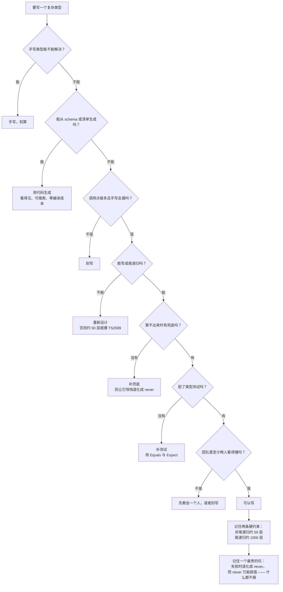

# 第 13 课：类型体操进阶

> 所属阶段：阶段 5《深入与架构》｜ 水平：零基础 TS（学到这里已不再是零基础）
> 本课知识点：递归条件类型与字符串操作、高级推断技巧、类型体操的代价与可读性底线
> 故事情节：主角写出了一个让同事惊叹的类型，也写出了一段没人敢碰的代码——**于是问题变成了：该不该写？**
> ✅ 状态：已完成（2026-09-04）｜ 实操环境：Node.js v22.14.0 + TypeScript 7.0.2（**文中所有输出均为本课本机实测**）

## 🎯 本课目标

- 写出递归条件类型，用模板字面量 + `infer` 做字符串处理，并知道递归深度限制在哪
- 使用多次 `infer`、变元组推断、`NoInfer`、`const` 类型参数等高级推断技巧
- 从编译耗时 / 报错可读性 / 团队可维护性三个维度，判断一个类型体操**该不该写**，并给出放弃标准

## 📌 知识点导航

| # | 知识点 | 关键点 | 状态 |
|---|--------|--------|------|
| 1 | 递归条件类型与字符串操作 | 递归深度限制 / 模板字面量 + `infer` 组合 / 常见字符串工具（拆分、大小写、连接） | ✅ |
| 2 | 高级推断技巧 | `infer` 多次与具名 `infer` / 变元组推断 / `NoInfer` / `const` 类型参数 | ✅ |
| 3 | 类型体操的代价与可读性底线 | 编译耗时 / 报错可读性 / 团队可维护性 / 何时该改用类型生成或干脆放弃 | ✅ |

## 📦 前置依赖

| 依赖 | 要求 | 来源 |
|------|------|------|
| 映射类型、条件类型与 `infer` | **强依赖** | 阶段 3 课 9 ✅ |
| 泛型基础 | **强依赖** | 阶段 3 课 8 ✅ |
| `tsconfig` 与 `--noEmit` | 会用即可 | 阶段 4 课 10 ✅ |

## ⚠️ 事实核查要求（编写本课时必做）

- `NoInfer`、`const` 类型参数等特性有**明确的引入版本**，编写时必须核实其引入版本与当前 TS 7 的行为，标注 `（核查于 YYYY-MM）`
- TS 7 的模板字面量类型**改了 Unicode 码点推断行为**（破坏性变更），本课涉及字符串操作时必须体现这一变化
- 递归深度限制的具体数值以实测为准，不凭记忆写

### ✅ 核查结果（2026-09-04）

| 核查项 | 结果 |
|--------|------|
| 本机版本 | `tsc --version` → **7.0.2**；`node --version` → **v22.14.0**（与基线一致） |
| 特性引入版本（**核查于 2026-09**，来源见下表） | 变元组类型 **TS 4.0** ｜ 尾递归消除 **TS 4.5** ｜ `infer ... extends` 约束 **TS 4.7** ｜ `const` 类型参数 **TS 5.0** ｜ `NoInfer<T>` **TS 5.4** |
| 官方原文已取得 | TS 4.5「Tail-Recursion Elimination on Conditional Types」、TS 4.7「`extends` Constraints on `infer` Type Variables」两节**逐字引用** |
| **递归深度实测** | **非尾递归：48 层 OK / 49 层 → TS2589**；**尾递归：999 层 OK / 1000 层 → TS2589**。用「元组计数」与「字符串取字符」**两种不同构造各测一遍，结果完全一致** |
| Unicode 变更实测 | 用 `@ts-expect-error` 反向断言验证：旧的 UTF-16 代理对拆分结果在 TS 7 上**全部报错** → 码点行为确认生效 |
| 编译耗时实测 | 200 文件 × 20 条长路由：`baseline 135ms` / `手写类型 181ms` / `类型体操 270ms`（预热后取最小值） |
| 实测覆盖 | 本文 4 个目录全部实跑：`probe`（Unicode）、`recursion`（深度，含两个生成器）、`strings`（字符串工具 + Join bug）、`inference`（推断技巧 + 负向对照）、`cost`（耗时 + 报错可读性） |

> 📌 **关于深度数字**：48 / 49 与 999 / 1000 是**本次构造**下测到的值。TS 内部的限制是"实例化深度 / 迭代次数"的启发式阈值，不同写法每递归一层消耗的额度不同，所以**别把这个数字当常量背**——要记的是"非尾递归约 50、尾递归约 1000"这个**数量级**，以及"超限报错码是 TS2589"。

---

## 第一幕：起源与场景引入

> 🏛️ **起源**：类型体操不是 TS 一开始就有的，它是**两次语言升级叠加出来的副产品**。
>
> - **2018-03 · TS 2.8** 引入**条件类型**（`T extends U ? X : Y`）。类型系统第一次有了"分支"。
> - **2020-11 · TS 4.1** 引入**模板字面量类型**（`` `${A}${B}` ``）和映射类型的键重映射（`as`）。类型系统第一次能"操作字符串"。
>
> 有了分支 + 递归 + 字符串操作，类型系统就在事实上**图灵完备**了——理论上你能用类型算出任何可计算的东西。社区立刻把它玩成了竞技项目（type-challenges 仓库里全是这类题）。
>
> 但图灵完备带来一个副作用：**你也能写出跑不完、或者把编译器跑爆的类型**。于是：
>
> - **2021-11 · TS 4.5** 加了**尾递归消除**，把某类递归的上限从"约 50"抬到"约 1000"。官方的原话是：
>
> > "TypeScript often needs to gracefully fail when it detects possibly infinite recursion, or any type expansions that can take a long time and affect your editor experience. As a result, TypeScript has heuristics to make sure it doesn't go off the rails..."
>
> **这段历史的关键点是**：类型体操从诞生第一天起，就伴随着"**这玩意儿到底值不值**"的争论。TS 团队加尾递归消除，是因为有人真的需要；而他们加"启发式限制"，是因为有人真的把编辑器搞崩了。

**记住一句话就够了**：**类型体操 = 用类型系统做计算。它很强，但和所有计算一样，有成本、有上限、有失控的可能。**

好，回到你的项目。

> 🎬 **场景**：团队要做一个类型安全的内部 API 客户端。你写出了这个（`playground/lesson-13/strings/string-ops.ts`，**实测通过**）：

```ts
// 从 URL 模板里自动推出参数名
type RouteParams<S extends string> = RouteParamsHelper<S, never>;
type RouteParamsHelper<S extends string, Acc> =
  S extends `${string}:${infer Param}/${infer Rest}`
    ? RouteParamsHelper<Rest, Acc | Param>
    : S extends `${string}:${infer Param}`
      ? Acc | Param
      : Acc;

type P = RouteParams<"/users/:id/posts/:postId">;
//   ^ "id" | "postId"
```

同事的反应是"这也行？"。于是你上头了。

三个月后，那个文件变成了 300 行：`Split`、`Join`、`CamelCase`、`DeepReadonly`、递归校验、四层条件类型嵌套。**它确实能工作，但它现在是全组最没人敢碰的文件——包括你自己。**

Code review 时有人问了一句："这个类型如果算不出来，会怎么样？"

你答不上来。

**这就是本课的题眼**：前两个知识点教你怎么把类型玩到极限，**第三个知识点要回答的是——该不该玩。**

---

## 第二幕：认知冲突

你开始做实验，结果三个发现互相打架：

```ts
// 实验 A：递归只能撑这么点？
type R = SomeRecursive<49层>;      // ❌ error TS2589: Type instantiation is excessively deep...
type R = SomeRecursive<48层>;      // ✅ 通过

// 实验 B：换个写法，上限翻了 20 倍？
type T = SomeRecursiveTail<999层>;  // ✅ 通过
type T = SomeRecursiveTail<1000层>; // ❌ 同一个 TS2589

// 实验 C：最贵的那个类型，报错反而是干净的？
const wrong: number = pick(obj, "user.profile.name");
// error TS2322: Type 'string' is not assignable to type 'number'.   ← 很清楚啊？
const missing = pick(obj, "user.profile.nickname");
// （什么都没报）                                                    ← 这个才吓人
```

三个疑惑，正好落在本课的三个知识点上：

1. **递归到底能撑多深？** 为什么换个写法差 20 倍？字符串操作的上限又在哪？
2. **除了递归和字符串，`infer` 还有哪些我不知道的用法？**
3. **这些类型这么强，为什么有人说别写？** 代价到底是什么？

---

## 第三幕：层层揭示

> ⚠️ **本课的实测环境**：所有数字都在 `playground/lesson-13/` 下**实际跑出来**。递归深度用两种独立构造交叉验证；编译耗时用"预热后取最小值"的方法（课 10 定下的规矩）。

### 知识点 1：递归条件类型与字符串操作

> 关键点：递归深度限制 / 模板字面量 + `infer` 组合 / 常见字符串工具（拆分、大小写、连接）

#### 一句话定义

**递归条件类型**就是条件类型的分支里调用自己。它在类型系统里做的事情，和递归函数一样——区别是它在**编译期**跑，而且**深度有硬上限**。

#### 直觉建立（类比）

**两种叠箱子的方法。**

- **非尾递归** = 你每拿起一个箱子，都要**先把它举过头顶，再决定放哪**。举着的箱子越堆越高，手臂撑不住就塌了（约 50 个）
- **尾递归** = 你推着一辆**手推车**，每处理一个箱子就直接放进车里，**手上永远不积压**。车能装很多（约 1000 个）

编译器里的"手臂"就是**实例化栈**，"手推车"就是**累加器参数**。

> 💡 **类比的边界**：真实的手推车也有容量上限，装满了会报警——这就是 TS2589。而且**它不告诉你"装了多少"，只告诉你"太多了"**，这是这类报错最讨厌的地方。

#### 核心原理

**① 尾递归消除（TS 4.5 引入）**

官方 TS 4.5 发布说明的原文：

> "That's why TypeScript 4.5 performs some tail-recursion elimination on conditional types. **As long as one branch of a conditional type is simply another conditional type, TypeScript can avoid intermediate instantiations.** There are still heuristics to ensure that these types don't go off the rails, but they are much more generous."

判定标准就一条：**条件类型的某个分支是不是"直接就是"递归调用本身**。

官方给出的正例与反例（逐字引用）：

```ts
// ❌ 不会被优化：递归的结果被并进了联合类型
type GetChars<S> = S extends `${infer Char}${infer Rest}` ? Char | GetChars<Rest> : never;

// ✅ 尾递归：引入累加器参数，递归调用直接作为分支结果
type GetChars<S> = GetCharsHelper<S, never>;
type GetCharsHelper<S, Acc> =
  S extends `${infer Char}${infer Rest}` ? GetCharsHelper<Rest, Char | Acc> : Acc;
```

**② 递归深度上限（本课实测，两种独立构造）**

构造一：**元组计数**（`recursion/gen.js`）
构造二：**字符串逐字符处理**（`recursion/gen-str.js`）

两种构造、两种递归写法，扫出来的结果完全一致：

| 写法 | 最大可用深度 | 越界的报错 |
|------|------------|-----------|
| **非尾递归** | **48** | 49 层起报 `TS2589` |
| **尾递归（累加器）** | **999** | 1000 层起报 `TS2589` |

**报错原文**（实测）：

```
depth/nontail-49.ts(4,10): error TS2589: Type instantiation is excessively deep and possibly infinite.
depth/tail-1000.ts(4,10): error TS2589: Type instantiation is excessively deep and possibly infinite.
```

**换算成字符串长度**（`gen-str.js`，实测）：

| 写法 | 能处理的最长字符串 |
|------|-----------------|
| 朴素版 `GetCharsNaive` | **48 个字符**（49 → TS2589） |
| 累加器版 `GetChars` | **999 个字符**（1000 → TS2589） |

> 官方 TS 4.5 文档里那个 `TrimLeft` 的例子说"如果开头有 50 个空格就会报错"——那是**优化之前**的数字。今天只要你的写法是尾递归，同样的事情能做到 999。

**③ 字符串工具箱**（`strings/string-ops.ts`，**实测全部通过**）

TS 4.1 给了模板字面量类型，配上 `infer` 就能"解析"字符串：

```ts
// 拆分：Split<"a-b-c", "-"> → ["a", "b", "c"]     （累加器 = 尾递归）
type Split<S extends string, Sep extends string> = SplitHelper<S, Sep, []>;
type SplitHelper<S extends string, Sep extends string, Acc extends string[]> =
  S extends `${infer Head}${Sep}${infer Tail}`
    ? SplitHelper<Tail, Sep, [...Acc, Head]>
    : [...Acc, S];

// 连接：Join<["a","b","c"], "-"> → "a-b-c"        （累加器 = 尾递归）
type Join<T extends readonly string[], Sep extends string> = JoinHelper<T, Sep, "", true>;
type JoinHelper<T extends readonly string[], Sep extends string, Acc extends string, First extends boolean> =
  T extends [infer Head extends string, ...infer Rest extends readonly string[]]
    ? JoinHelper<Rest, Sep, First extends true ? Head : `${Acc}${Sep}${Head}`, false>
    : Acc;

// 去左侧空格：官方 TS 4.5 文档的例子，天生尾递归
type TrimLeft<S extends string> = S extends ` ${infer Rest}` ? TrimLeft<Rest> : S;
```

**内置的四个字符串工具**（不用自己写，实测）：

| 工具 | 效果 |
|------|------|
| `Uppercase<"abc">` | `"ABC"` |
| `Lowercase<"ABC">` | `"abc"` |
| `Capitalize<"abc">` | `"Abc"` |
| `Uncapitalize<"ABC">` | `"aBC"` |

> 它们的实现依赖 `lib.es5.d.ts` 里的 intrinsic 定义，不是用类型体操写的——所以**没有递归深度问题**。

**④ ⚠️ TS 7 的破坏性变更：模板字面量改用 Unicode 码点**

这是本课**必须记住的一条 TS 7 变化**。官方公告的原例：

```ts
type HeadTail<S> = S extends `${infer Head}${infer Tail}` ? [Head, Tail] : never;

type Result = HeadTail<"😀abc">;
//   TS 7.0:   ["😀", "abc"]              ← 一个新行为：按码点
//   TS 6 及更早: ["\ud83d", "\ude00abc"]  ← 旧行为：按 UTF-16 码元，把代理对劈成两半
```

**本课怎么验证它**（`probe/unicode.ts`）：把旧行为写成断言，用 `@ts-expect-error` 标上——

```ts
// @ts-expect-error 旧行为：😀 的前半代理项
export const old_h1: "\ud83d" = r1[0];
// @ts-expect-error 旧行为：😀 的后半代理项 + 剩余字符
export const old_t1: "\ude00abc" = r1[1];
```

**实测 exit=0** —— 说明这四条 `@ts-expect-error` **全部命中了**，也就是说旧行为在 TS 7 上确实会报错，变更确实生效了。

（这个技巧本身值得记住：**用 `@ts-expect-error` 去断言"某件事现在会报错"，是验证破坏性变更最干净的手段**——如果变更没生效，注释本身就会变成"多余的指令"而报错。）

**⑤ ⚠️ 一个真实的踩坑：`Join` 吞掉了空字符串首项**

这不是我编的例子——**这是本课写基准测试时实际撞到的 bug**（`strings/join-bug.ts`，实测）：

```ts
type Parts = Split<"/a/b", "/">;   // ["", "a", "b"]  ← 路径以 / 开头，首项是空串

// ❌ 常见写法：用「累加器是不是空」判断当前是不是第一个元素
type JoinBuggy<...> = ... Acc extends "" ? Head : `${Acc}${Sep}${Head}` ...;
//   → JoinBuggy<Parts, "/"> = "a/b"    少了前导斜杠！第一个 "" 被吞了

// ✅ 正确写法：用显式的 First 标志位
type JoinFixed<...> = ... First extends true ? Head : `${Acc}${Sep}${Head}` ...;
//   → JoinFixed<Parts, "/"> = "/a/b"    正确
```

**这个 bug 的可怕之处在于它很安静**：类型不报错，值悄悄少了一个字符。只有当你像本课这样做了**往返测试**（`Split` → `Join` → 断言等于原串）才会发现。

> 🔧 **给自己的规矩**：写字符串工具类型时，一定要对**空串、单字符、分隔符连续出现、首尾是分隔符**这几种边界做往返测试。

#### 常见误区

1. **"递归类型能一直写下去。"** → 不能。实测非尾递归 48 层、尾递归 999 层就爆 TS2589。
2. **"TS2589 是我写错了。"** → 通常是"超限"而不是"写错"，得改写法（改成尾递归）或改设计。
3. **"递归结果稍微加工一下没关系。"** → 有关系。只要分支不是"直接"递归调用，就失去优化（官方原文）。
4. **"字符串操作能处理任意长度。"** → 受同一套深度限制：朴素写法约 48 字符。
5. **"TS 7 的模板字面量跟以前一样。"** → 改了：现在按 Unicode 码点，旧代码里依赖 UTF-16 拆分的类型会失效。
6. **"自己写的字符串工具是对的。"** → 边界 case 极多（本课实测踩到一个）。务必做往返测试。

#### 一句话记住

> **递归条件类型：分支直接递归 = 尾递归（约 1000 层），结果被加工 = 非尾递归（约 50 层）；TS 7 起模板字面量按 Unicode 码点切分，旧行为已失效。**

#### 官方文档

- TS 4.5 · 尾递归消除：https://www.typescriptlang.org/docs/handbook/release-notes/typescript-4-5.html#tail-recursion-elimination-on-conditional-types
- TS 4.1 · 模板字面量类型：https://www.typescriptlang.org/docs/handbook/release-notes/typescript-4-1.html
- TS 7.0 · Unicode 码点变更：https://devblogs.microsoft.com/typescript/announcing-typescript-7-0/

---

### 知识点 2：高级推断技巧

> 关键点：`infer` 多次与具名 `infer` / 变元组推断 / `NoInfer` / `const` 类型参数

#### 一句话定义

`infer` 是"**在模式匹配的同时给匹配到的东西起个名字**"。除了课 9 讲的基础用法，它还有几个能显著改变推断结果的进阶形态。

#### 直觉建立（类比）

**用模具灌石膏。**

`T extends SomePattern<infer X>` 就是：拿一个**带凹槽的模具**（模式）去扣一个类型，凡是被凹槽卡住的部分，就倒出来贴个标签（`X`）。

- **多个 `infer`** = 模具上有**多个凹槽**，一次倒出好几个零件
- **`infer X extends Y`** = 凹槽**带滤芯**：倒出来的东西必须先过筛，不合格就整个模具扣不上
- **变元组里的 `infer`** = 模具能卡在数组的**任意位置**（开头、结尾、中间任意一段）

> 💡 **类比的边界**：真实模具扣不上就是失败；而 TS 的条件类型扣不上会走 `false` 分支——**通常落到 `never`**。这个"落到 never"的行为，正是知识点 3 里最大的坑。

#### 核心原理

下面每一条都在 `inference/advanced-infer.ts` 里**实测通过**。

**① 多次 `infer`**

```ts
type FunctionParts<F> = F extends (a: infer A, b: infer B) => infer R ? [A, B, R] : never;
// FunctionParts<(a: string, b: number) => boolean> = [string, number, boolean]
```

**② ⚠️ 陷阱：函数重载只推断最后一个签名**

```ts
interface Overloaded {
  (x: string): number;
  (x: number): string;
}
type P = Parameters<Overloaded>;   // [x: number]      ← 只有最后一条
type R = ReturnType<Overloaded>;   // string           ← 只有最后一条
```

**这不是 bug，是刻意的设计**：TS 在处理"把重载类型喂给条件类型"时，只保留最后一个签名。想拿全部签名，得靠工具类型分别处理，或者干脆避免重载（课 8 讲过）。

**③ `infer X extends Y`（TS 4.7 引入）**

官方 TS 4.7 发布说明原文：

> "Using nested conditionals to infer a type and then match against that inferred type is pretty common. To avoid that second level of nesting, **TypeScript 4.7 now allows you to place a constraint on any `infer` type.**"

```ts
// 旧写法：两层条件类型
type FirstIfString<T> = T extends [infer S, ...unknown[]] ? (S extends string ? S : never) : never;
// 新写法：一层搞定
type FirstIfString<T> = T extends [infer S extends string, ...unknown[]] ? S : never;

// 本课实测：ParseInt<"100"> = 100，ParseInt<"abc"> = never
type ParseInt<S extends string> = S extends `${infer N extends number}` ? N : never;
```

**④ 变元组推断（TS 4.0 引入）**

`infer` 可以出现在元组/数组的**任意位置**，配合 `...` 做变长匹配：

```ts
type Concat<T extends unknown[], U extends unknown[]> = [...T, ...U];
type Last<T extends unknown[]>   = T extends [...infer _Rest, infer L] ? L : never;      // 末尾
type DropFirst<T extends unknown[]> = T extends [infer _First, ...infer Rest] ? Rest : never;  // 开头
type Init<T extends unknown[]>   = T extends [...infer Rest, infer _Last] ? Rest : never;      // 去掉末尾
```

**⑤ `NoInfer<T>`（TS 5.4 引入）**

**它解决的问题**：泛型参数会从**所有**出现的位置推断，有时候你不希望某个位置参与推断。

```ts
declare function createStreetLightPlain<C extends string>(colors: C[], defaultColor?: C): void;
declare function createStreetLightNoInfer<C extends string>(colors: C[], defaultColor?: NoInfer<C>): void;

// 没有 NoInfer：C 被两个参数一起推出来 → "blue" 混进了颜色联合，静默通过
createStreetLightPlain(["red", "yellow", "green"], "blue");   // ✅ 通过了（但你不想）

// 加了 NoInfer：C 只由第一个参数决定，第二个参数只能「跟从」
createStreetLightNoInfer(["red", "yellow", "green"], "blue"); // ❌ 报错（这才是你要的）
createStreetLightNoInfer(["red", "yellow", "green"], "red");  // ✅ 合法值照常通过
```

**实测**：上面那个"❌ 报错"的行用 `@ts-expect-error` 标注，整份文件 **exit=0**，证明它确实报错了。

**⑥ `const` 类型参数（TS 5.0 引入）**

**它解决的问题**：普通泛型会把字面量"放宽"成基础类型，你得在调用处写 `as const` 才能保住字面量信息。

```ts
type HasNames = { names: readonly string[] };
declare function getNamesPlain<T extends HasNames>(arg: T): T["names"];
declare function getNamesConst<const T extends HasNames>(arg: T): T["names"];

const a = getNamesPlain({ names: ["Alice", "Bob"] });  // string[]              ← 字面量丢了
const b = getNamesConst({ names: ["Alice", "Bob"] }); // readonly ["Alice", "Bob"]  ← 保住了
```

`const` 类型参数把"`as const` 的推断"变成了**函数签名的一部分**，调用方不用再记得写 `as const`。

**⑦ 版本对照表**（**核查于 2026-09-04**）

| 特性 | 引入版本 | 一句话 |
|------|---------|-------|
| 变元组类型 + 元组中的 `infer` | **TS 4.0** | `infer` 可出现在元组任意位置 |
| 尾递归消除 | **TS 4.5** | 分支直接递归 → 上限从约 50 抬到约 1000 |
| `infer X extends Y` 约束 | **TS 4.7** | 推断的同时加约束，省掉一层嵌套 |
| `const` 类型参数 | **TS 5.0** | 让字面量推断成为默认，调用方免写 `as const` |
| `NoInfer<T>` | **TS 5.4** | 标记"这个位置不参与推断" |

**⑧ 类型测试：`Equals` 与它的负向对照**

本课所有"这个类型等于那个类型"的断言，都不是靠肉眼，而是用这个业界通用写法：

```ts
type Equals<X, Y> =
  (<T>() => T extends X ? 1 : 2) extends (<T>() => T extends Y ? 1 : 2) ? true : false;
type Expect<T extends true> = T;

type _1 = Expect<Equals<Last<[1, 2, 3]>, 3>>;   // 断言成立 → 通过
```

**为什么不用 `X extends Y`**：因为 `never`、`any`、父子类系都会让它蒙混过关（`never extends 任何东西` 都成立，反过来不行）。

**怎么证明这套判定不是"永远返回 true"**（`inference/equals-sanity.ts`，**实测 exit=0**）：

```ts
type _ok    = Expect<Equals<Last<[1, 2, 3]>, 3>>;                  // ✅ 正常通过
// @ts-expect-error 故意写错，用于验证判定有效
type _wrong = Expect<Equals<Last<[1, 2, 3]>, 4>>;                  // ❌ 必须报错
// @ts-expect-error never 不等于 undefined
type _wrong2 = Expect<Equals<never, undefined>>;                   // ❌ 必须报错
```

**两个 `@ts-expect-error` 都被命中**（文件 exit=0），说明判定确实会抓错。

> 🔧 **团队建议**：写了类型体操，就**必须配类型测试**。上面的 `Equals` 可以直接抄；项目大了可以上 `tsd` 或 `expect-type`。**没有测试的类型体操 = 没人敢改的代码**，这直接连到知识点 3。

#### 常见误区

1. **"`Parameters<T>` 能拿到重载的所有签名。"** → 只能拿最后一个（实测）。
2. **"`infer` 只能用在最外层。"** → 可以嵌套、可以出现在元组任意位置。
3. **"加 `const` 类型参数就等于到处加 `as const`。"** → 它是函数签名级的，调用方无感。
4. **"`NoInfer` 是禁用推断。"** → 是"这个位置不参与推断"，其他位置照常。
5. **"用 `extends` 就能判断两个类型相等。"** → 不能，用 `Equals` 惯用法。

#### 一句话记住

> **`infer` 是"模式匹配 + 起名"：可以多次、可以加 `extends` 约束、可以卡在元组任意位置；`NoInfer` 管"谁参与推断"，`const` 类型参数管"字面量保不保"。**

#### 官方文档

- TS 4.7 · `extends` Constraints on `infer`：https://www.typescriptlang.org/docs/handbook/release-notes/typescript-4-7.html#extends-constraints-on-infer-type-variables
- TS 4.0 · Variadic Tuple Types：https://www.typescriptlang.org/docs/handbook/release-notes/typescript-4-0.html#variadic-tuple-types
- TS 5.0 · `const` Type Parameters：https://www.typescriptlang.org/docs/handbook/release-notes/typescript-5-0.html
- TS 5.4 · `NoInfer`：https://www.typescriptlang.org/docs/handbook/release-notes/typescript-5-4.html

---

### 知识点 3：类型体操的代价与可读性底线

> 关键点：编译耗时 / 报错可读性 / 团队可维护性 / 何时该改用类型生成或干脆放弃

#### 一句话定义

类型体操的三笔真实账单：**编译变慢**、**失败时静默**、**团队维护不了**。判断"该不该写"，就是看这笔账单值不值。

#### 直觉建立（类比）

**手工定制家具 vs 宜家平板包装。**

- **类型体操** = 手工定制：严丝合缝、能适应各种奇形怪状的角落，**但只有那个老师傅会修，而且做起来慢**
- **手写类型 / 代码生成** = 平板包装：样子朴素、**谁都能看懂、几分钟装好、坏了换一块板就行**

**定制家具不是不好，问题是：你真的需要每个角落都严丝合缝吗？** 大多数时候，一块标准尺寸的板子就够了。

> 💡 **类比的边界**：真实家具坏了，大不了凑合用；而**一个算不出来的类型会退化成 `never`，然后静默吞掉你本来该看到的报错**——这比"难修"严重得多，是本课最硬的一条结论。

#### 核心原理

**① 代价一：编译耗时（实测）**

实验设计（`cost/gen.js`）：生成两个**体量完全相同**的项目，各 200 个文件 × 20 条长路由 × 3 个类型操作：

| 项目 | 做法 |
|------|------|
| `baseline/` | 1 个空文件 —— 用来测出 **node + tsc 的启动开销** |
| `simple/` | 结果**直接写成字面量**（不计算） |
| `gym/` | 同样的结果，由 `Split` → `Join` → `RouteParams` **算出来** |

两边都强制对每个结果做一次赋值检查（包括 `Split`→`Join` 的**往返相等**），避免 TS 的惰性求值让测量失真。

**实测数据**（预热后各跑 3 次取最小值）：

| 项目 | 耗时 |
|------|------|
| `baseline`（1 个文件，纯启动开销） | **135 ms** |
| `simple`（手写类型） | **181 ms** |
| `gym`（类型体操） | **270 ms** |

**关键在扣除启动开销之后**：

| | 真实检查耗时 |
|---|---|
| `simple` | 181 − 135 = **46 ms** |
| `gym` | 270 − 135 = **135 ms** |
| **倍数** | **约 2.9 倍** |

> ⚠️ **第一版实验的教训**：我最初用 100 文件 × 20 条短路由，测出来 `simple=154ms / gym=140ms` —— **体操版反而更快**，因为差异完全被 100ms+ 的启动开销淹没了。**做性能测量一定要先测基线、把固定开销扣掉**，否则你会得出相反的结论。

**怎么读这个数字**：

- 2.9 倍是针对**这一份**体操的。更复杂的类型可以更贵（类型体操的耗时经常是**超线性**的）
- TS 7 已经很快了（课 10），所以"慢"往往是**相对**的：全量构建多 90ms 无所谓，**编辑器里每次按键触发的增量检查多 90ms 就很难受**
- 判断标准不是绝对值，而是：**你的团队有没有人开始抱怨编辑器卡？**

**② 代价二：报错可读性（实测结果和直觉相反）**

我原本准备演示"体操类型的报错没法读"。实测下来，**结论打脸了**：

| 场景 | 实测报错 |
|------|---------|
| 手写类型，少传一个参数 | `TS2741: Property 'postId' is missing in type '{ id: string; }' but required in type '{ id: string; postId: string; }'.` |
| 体操类型（`RouteParams` + `DeepReadonly` + `Record`），同样少传一个 | `TS2741: Property 'postId' is missing in type '{ id: string; }' but required in type '{ readonly id: string; readonly postId: string; }'.` |
| 链式路径取值，结果类型写错 | `TS2322: Type 'string' is not assignable to type 'number'.` |
| 嵌套 `DeepPartial` 最深一层写错 | `TS2322: Type 'string' is not assignable to type 'number'.` |

**四组全部是干净的单行报错。** TypeScript（尤其 TS 7）在"把复杂类型化简后再报错"这件事上做得相当好。

**所以"报错不可读"这个常见理由，在这几例里并不成立。** 真正的问题在下面这一条。

**③ 代价三（最危险）：失败是静默的（实测）**

同一个 `pick` 函数，**路径写错**时：

```ts
const missing = pick(obj, "user.profile.nickname");   // 路径不存在
export const m: string = missing;                      // 实测：不报错！
```

**为什么？** 因为 `Get<T, P>` 匹配失败时返回 `never`，而 **`never` 可以赋给任何类型**。你精心设计的类型在这里不是"报错"，而是"**算了，随你吧**"。

本课补了一条验证，确认它确实是 `never`：

```ts
type IsNever<T> = [T] extends [never] ? true : false;
type MissingIsNever = IsNever<typeof missing>;
export const proof: true = null as unknown as MissingIsNever;   // 实测通过 → 确实是 never
```

**这是类型体操最贵的代价**：

| 失败模式 | 表现 | 危险程度 |
|---------|------|---------|
| 报 TS2589 | 深度超限，明确报错 | 低（看得见） |
| 报错很长 | 不好读但能定位 | 中 |
| **退化成 `never`** | **静默通过，什么都查不出来** | **高** |
| **退化成 `any`** | **静默通过，且关闭所有检查** | **最高** |

**防范手段**（很便宜，务必做）：

```ts
// 1) 给「算不出来」加兜底：让它报错，而不是悄悄变成 never
type Get<T, P extends string> =
  P extends `${infer K}.${infer Rest}`
    ? K extends keyof T ? Get<T[K], Rest> : `错误：路径 ${P} 中的 "${K}" 不存在`
    : P extends keyof T ? T[P] : `错误：路径 ${P} 不存在`;

// 2) 用 Equals / tsd 写类型测试，把「应该算出什么」钉死
type _ = Expect<Equals<Get<Obj, "user.profile.name">, string>>;
```

**④ 代价四：团队可维护性**

| 红灯信号 | 说明 |
|---------|------|
| 类型超过 20 行或嵌套超过 5 层 | 认知负荷爆表 |
| **需要写注释才能解释这个类型在干什么** | 说明它不够自明 |
| 团队里只有 1 个人看得懂 | 那个人休假 = 这段代码冻结 |
| 报错时同事得来找你才能修 | 你已经成了单点故障 |
| 没有配套的类型测试 | 没人敢改，也没人敢验证改对了 |

**⑤ 决策清单：该不该写**（本知识点的**核心产出**）

按这个顺序问自己，**任何一个"否"就停手**：

```
① 手写类型能不能解决？
   └─ 能 → 手写。（大多数情况到此为止）

② 能不能用「代码生成」解决？（从 schema / 路由表 / 后端定义生成 .ts）
   └─ 能 → 生成。生成出来的类型是「死的」：看得见、可搜索、零编译成本、报错直接指向生成的文件

③ 是不是「调用点极多 + 手写会漏」的场景？
   └─ 不是 → 别写

④ 能写成尾递归吗？
   └─ 不能 → 重新设计（否则约 50 层就爆）

⑤ 算不出来时有兜底吗？（不能退化成 never / any 还浑然不觉）
   └─ 没有 → 补上再写

⑥ 配了类型测试吗？
   └─ 没有 → 补上再写

⑦ 团队里至少两个人看得懂吗？
   └─ 不是 → 别写，或者先教会一个人
```

**⑥ 什么情况下值得写**

类型体操真正划算的场景，通常同时满足：

- **调用点极多**（几十上百处），手写字面量会漏、会过期
- **规则确实可由类型表达**（不是靠人去记约定）
- **输入规模可控**（不会撞上递归上限）
- **有兜底 + 有测试**

典型例子：路由参数提取（本课的例子）、表单字段路径、SQL/GraphQL 查询结果的列类型、事件名与 payload 的映射。

**⑦ 替代方案：代码生成**

如果你的类型来源是**外部事实**（OpenAPI schema、数据库表结构、路由清单），那**代码生成几乎总是优于类型体操**：

| | 类型体操 | 代码生成 |
|---|---|---|
| 编译成本 | 每次检查都要算 | 零（生成的是普通类型） |
| 报错可读性 | 取决于化简效果 | 直接指向生成的文件，**点进去就看得见** |
| 可搜索 | 源码里只有一段算法 | 生成产物里能直接 grep 到字段名 |
| 调试 | 得在脑子里跑类型系统 | 打开生成的文件看即可 |
| 何时更新 | 自动（跟着输入走） | 需要跑一次生成命令（可进 CI 校验） |

#### 常见误区

1. **"类型体操会让报错变得没法读。"** → 本课实测四例，报错**都是干净的单行**。真正的问题是**静默失败**，不是难读。
2. **"类型算不出来会报错。"** → 往往退化成 `never`，然后 `never` 万能赋值 —— **什么都不报**（实测）。
3. **"编译慢一点无所谓。"** → 全量构建确实无所谓，**编辑器的增量检查**才有感。测量前先扣掉启动基线，否则会得出相反结论（本课第一版就踩了这个坑）。
4. **"类型体操没有运行时开销，所以是免费的。"** → 编译期开销和团队认知开销都是真实的。
5. **"类型越精确越好。"** → 超过团队能维护的精度就是负债。
6. **"写完了就完事了。"** → 没有类型测试的体操，等于给团队留了一颗不敢碰的雷。

#### 一句话记住

> **类型体操的三大代价是编译变慢、失败静默（退化成 never）、团队维护不了；判断标准是「手写行不行 → 能不能生成 → 有没有兜底和测试 → 有没有第二个人看得懂」。**

#### 官方文档

- TypeScript Wiki · Performance：https://github.com/microsoft/TypeScript/wiki/Performance
- `analyze-trace` 官方性能分析工具：https://github.com/microsoft/typescript-analyze-trace

---

## 第四幕：实操验证

回到第一幕那个"300 行没人敢碰"的类型。用本课的三把尺子量一遍。

**第一把尺：递归安全吗？**

把它里层的递归逐个检查——凡是"分支不是直接递归"的，都改成累加器写法。改完之后跑一遍长度扫描：

```
朴素写法：48 层 OK  / 49 层 → TS2589
尾递归  ：999 层 OK / 1000 层 → TS2589
```

如果你的输入（路径、字符串）可能超过 48 个单位，**必须**写成尾递归。

**第二把尺：算不出来会怎样？**

实测 `pick` 的失败模式：

```ts
const missing = pick(obj, "user.profile.nickname");
export const m: string = missing;    // 实测：不报错
type IsNever<typeof missing> → true  // 实测：确认退化成了 never
```

**这是全课最该记住的一条实测**。如果那 300 行里有类似的静默失败点，它现在不是在保护你，是在骗你。

**第三把尺：值不值？**

跑一遍耗时对比（预热后取最小值）：

```
baseline（启动开销）  135 ms
手写类型             181 ms   → 真实检查  46 ms
类型体操             270 ms   → 真实检查 135 ms（约 2.9 倍）
```

**结论不是"别写"，而是"写之前先把这三把尺子量一遍"**。

三个关键点的验证结果汇总（均为本课本机实测）：

| 验证项 | 实测结论 |
|--------|---------|
| 非尾递归深度 | **48 层 OK / 49 层 TS2589**（元组构造与字符串构造各测一遍，一致） |
| 尾递归深度 | **999 层 OK / 1000 层 TS2589**（同上，两种构造一致） |
| 字符串长度换算 | 朴素写法 48 字符 / 累加器写法 999 字符 |
| TS2589 原文 | `error TS2589: Type instantiation is excessively deep and possibly infinite.` |
| 字符串工具 | `Split` / `Join` / `TrimLeft` / `GetChars` / `RouteParams` 全部通过断言 |
| 内置字符串工具 | `Uppercase` / `Lowercase` / `Capitalize` / `Uncapitalize` 实测符合预期 |
| **TS 7 Unicode 变更** | 旧 UTF-16 行为的四条断言**全部报错**（`@ts-expect-error` 全部命中）→ 变更确认生效 |
| **Join 的真实 bug** | `Acc extends ""` 写法把 `"/a/b"` 拼成 `"a/b"`；改用 `First` 标志位后正确 |
| 多次 `infer` | `FunctionParts<(a: string, b: number) => boolean>` = `[string, number, boolean]` |
| 重载推断 | `Parameters<Overloaded>` = `[x: number]`（只有最后一个签名） |
| `infer ... extends` | `ParseInt<"100">` = 100；`ParseInt<"abc">` = never |
| 变元组 | `Concat` / `Last` / `DropFirst` / `Init` 全部通过精确断言 |
| `NoInfer` | 加了它之后 `"blue"` 被拦下（`@ts-expect-error` 命中） |
| `const` 类型参数 | `readonly ["Alice","Bob"]` vs 普通泛型的 `string[]` |
| `Equals` 判定有效 | 负向对照：故意写错的两条**确实报错** |
| 编译耗时 | baseline 135 / 手写 181 / 体操 270 ms；扣除启动后 **46 vs 135 ms（约 2.9 倍）** |
| 报错可读性 | **四组实测全部是干净的单行报错**（与"难读"的直觉相反） |
| **静默失败** | 路径写错 → `never` → 赋给 `string` **不报错**（已用 `IsNever` 验证） |

> ✅ **回扣课 9**：课 9 讲了条件类型与 `infer` 的基础，本课把它们**递归化**（知识点 1）和**进阶化**（知识点 2），然后第一次认真回答"代价是什么"（知识点 3）。**课 9 教你写，课 13 教你在什么时候别写。**

---

## 第五幕：体系收束

> 📍 **全局定位**：**本课是阶段 5 的第一课，也是整门课从"往上堆能力"转向"往下找边界"的转折点。**
>
> 前 12 课都在给类型系统**加能力**：类型标注、收窄、泛型、工程化。从这一课开始，我们开始问**这些能力的边界在哪**。
>
> 阶段 5 三课的分工：
> - **课 13（本课）探天花板**：类型体操能算到什么程度、代价是什么、什么时候该收手
> - **课 14 看引擎盖底下**：Scanner → Parser → Binder → Checker → Emitter，解释"为什么这个报错长这样"、"为什么类型检查慢"
> - **课 15 回到工程决策**：类型放哪一层、公开 API 怎么设计、老项目怎么迁、什么项目干脆别上 TS
>
> **三课共同回答一个问题：类型系统的边界在哪。**
>
> 本课留下两个伏笔，课 14 会接：① 编译耗时为什么是这个形状（课 14 讲编译器各阶段）② 类型检查为什么慢、TS 7 的并行检查器原理（课 14 展开）。

**现在你会了什么**：

- 能写出递归条件类型，用**尾递归（累加器）**把上限从约 50 抬到约 1000，并知道超限报 **TS2589**
- 能用模板字面量 + `infer` 做字符串处理（`Split` / `Join` / 提取 / 内置四件套），并知道 **TS 7 起按 Unicode 码点切分**
- 会用多次 `infer`、`infer X extends`、变元组推断、`NoInfer`、`const` 类型参数，并知道各自的**引入版本**
- 能用 `Equals` + `Expect` 写类型测试，并且**知道要先做负向对照**证明判定有效
- 能用"编译耗时 / 静默失败 / 团队可维护性"三把尺子判断一个类型**该不该写**，并给出**七步放弃标准**

**给未来自己的提醒**：

> 本课的深度数字（48 / 999）是**本次构造**下测到的，TS 内部是启发式阈值，**会随版本变**。用时重新跑一遍 `recursion/gen.js`。
> 特性版本表**核查于 2026-09**，若你读到此处时已过去较久，`NoInfer` / `const` 类型参数等可能已不是"新特性"。
>
> **但那七步放弃标准不会过时**——它衡量的不是 TS 的能力，而是**你和你的团队能不能长期持有这段代码**。

> 🔗 **下一步**：课 14《编译器原理与类型检查机制》——画出 Scanner → Parser → Binder → Checker → Emitter 全流程，用协变 / 逆变解释"莫名其妙"的报错，并解释类型检查为什么慢、怎么提速。

---

## 🐞 常见误区

1. **"递归类型能一直写下去。"** → 非尾递归约 48 层、尾递归约 999 层，越界报 TS2589（实测）。
2. **"TS2589 是写错了。"** → 通常是超限，得改写法或改设计。
3. **"递归结果稍微加工一下没事。"** → 分支不是直接递归就失去优化（官方原文）。
4. **"TS 7 的模板字面量和以前一样。"** → 改了：按 Unicode 码点，旧的 UTF-16 拆分行为失效（实测）。
5. **"自己写的字符串工具是对的。"** → 本课实测踩到一个真实 bug（`Join` 吞空串首项），务必做边界往返测试。
6. **"`Parameters<T>` 能拿重载的所有签名。"** → 只有最后一个（实测）。
7. **"用 `extends` 能判断类型相等。"** → 不能，`never` / `any` 会蒙混过关，用 `Equals` 惯用法。
8. **"类型体操会让报错没法读。"** → 实测四组都是干净的单行报错；**真正的问题是静默失败**。
9. **"类型算不出来会报错。"** → 常退化成 `never`，而 `never` 万能赋值 → **什么都不报**（实测）。
10. **"编译慢一点无所谓。"** → 编辑器的增量检查才有感；测量前必须扣掉启动基线，否则结论会反（本课第一版就踩了）。
11. **"类型体操没有运行时开销 = 免费。"** → 编译期和团队认知开销都是真实的。
12. **"类型越精确越好。"** → 超过团队能维护的精度就是负债。

## 一图总结



> 关键记忆点：① 尾递归（分支直接递归）把上限从约 50 抬到约 1000；② 模板字面量 + `infer` 能解析字符串，TS 7 起按 Unicode 码点；③ `infer` 可多次、可加 `extends`、可卡在元组任意位置；④ 报错通常**不难读**，但失败常常**静默**（`never` 万能赋值）；⑤ 七步放弃标准里，前两步（手写 / 生成）就能拦下大多数冲动。

## 课后小测

**Q1**：你写了一个递归条件类型处理字符串，输入 200 个字符时报错了。下面说法正确的是？

- A. 递归条件类型没有长度限制，说明你写法有 bug
- B. 朴素（非尾递归）写法大概到 50 层就撞上限，改成累加器（尾递归）写法通常能撑到约 1000 层
- C. 只要把 `strict` 关掉就不会报错了
- D. 报错码是 TS2322，改一下类型标注即可

<details><summary>答案与解析</summary>

**答案：B**。

实测（`recursion/`，用元组计数与字符串取字符**两种独立构造**各测一遍，结果一致）：

| 写法 | 最大可用深度 | 越界 |
|------|------------|------|
| 非尾递归 | **48** | 49 层起报 TS2589 |
| 尾递归（累加器） | **999** | 1000 层起报 TS2589 |

报错原文是：

```
error TS2589: Type instantiation is excessively deep and possibly infinite.
```

TS 4.5 引入了尾递归消除，官方原文：

> "As long as one branch of a conditional type is simply another conditional type, TypeScript can avoid intermediate instantiations. There are still heuristics to ensure that these types don't go off the rails, but they are much more generous."

**关键判据**：条件类型的分支是不是"**直接就是**"递归调用。官方给的反例是 `Char | GetChars<Rest>`（结果被并进联合 → 不优化），正例是引入累加器 `GetCharsHelper<Rest, Char | Acc>`（分支直接递归 → 优化）。

A 错：限制是真实存在的（TS 需要防止无限递归拖垮编辑器）。
C 错：`strict` 与实例化深度完全无关。
D 错：报错码是 **TS2589**，不是 TS2322（TS2322 是赋值不兼容）。

**别把 48 / 999 当常量背**——它们是本次构造下测到的值，TS 内部是启发式阈值。要记的是**数量级**和**报错码**。

</details>

**Q2**：下面这个函数签名里的 `NoInfer<T>` 是干什么的？

```ts
declare function pick<C extends string>(options: C[], chosen: NoInfer<C>): void;
```

- A. 关闭这个函数的类型推断，让所有参数都变成 `any`
- B. 让 `chosen` 这个位置**不参与** `C` 的推断 —— `C` 只由 `options` 决定，`chosen` 只能跟从
- C. 让 `chosen` 的类型变成 `never`，强制调用方传入 `undefined`
- D. 等价于 `chosen?: C`，只是写法不同

<details><summary>答案与解析</summary>

**答案：B**。

`NoInfer<T>`（**TS 5.4 引入**）的作用是：**标记某个位置不参与类型参数的推断**。

实测对照（`inference/advanced-infer.ts`）：

```ts
declare function createStreetLightPlain<C extends string>(colors: C[], defaultColor?: C): void;
declare function createStreetLightNoInfer<C extends string>(colors: C[], defaultColor?: NoInfer<C>): void;

// 没有 NoInfer：C 被两个参数「一起」推出来
//   → C = "red" | "yellow" | "green" | "blue"，静默通过
createStreetLightPlain(["red", "yellow", "green"], "blue");   // ✅ 通过了

// 加了 NoInfer：C 只由第一个参数决定
createStreetLightNoInfer(["red", "yellow", "green"], "blue"); // ❌ 报错（@ts-expect-error 命中）
createStreetLightNoInfer(["red", "yellow", "green"], "red");  // ✅ 合法值照常通过
```

**为什么需要它**：TS 的泛型推断会从**所有**出现该类型参数的位置收集候选。很多时候这是你想要的，但当某个位置应该是"**校验**"而不是"**贡献**"时，它就会反过来把错误的值吸收进类型里——**本该报错的地方静默通过了**。

A 错：只影响被包裹的**那一个位置**，其他位置照常推断，更不会变成 `any`。
C 错：`NoInfer<C>` 的类型仍是 `C`，只是不参与推断。
D 错：跟可选参数毫无关系。

> 💡 这道题和知识点 3 是同一条主线：**类型系统里最贵的错误，往往不是"报错了"，而是"本该报错却没报"**。

</details>

**Q3**：团队里有人提议上一个"很聪明"的类型体操。按本课的结论，最先该问的是哪一句？

- A. 这个类型够不够酷，能不能体现团队技术实力
- B. 手写类型能不能解决？不能的话，能不能用代码生成解决？
- C. 编译会不会变慢？如果只慢几十毫秒就没关系
- D. 报错会不会变得没法读？只要报错还能读就可以上

<details><summary>答案与解析</summary>

**答案：B**。

本课的七步放弃标准，**前两步就能拦下大多数冲动**：

```
① 手写类型能不能解决？        → 能就手写
② 能不能用代码生成解决？      → 能就生成
③ 是不是「调用点极多 + 手写会漏」的场景？
④ 能写成尾递归吗？
⑤ 算不出来时有兜底吗？
⑥ 配了类型测试吗？
⑦ 团队里至少两人看得懂吗？
```

**代码生成为什么优先于类型体操**（本课对比表）：生成出来的类型是"死的"——**看得见、能 grep、零编译成本、报错直接指向生成的文件**。而类型体操每次检查都要重算，且算错了往往静默。

**C 和 D 为什么不对（这两条都只看到了一半）**：

- **C**：本课实测 `baseline 135ms / 手写 181ms / 体操 270ms`，扣掉启动开销后是 **46ms vs 135ms（约 2.9 倍）**。"只慢几十毫秒"听起来没事，但**编辑器的增量检查**才有感；而且**测量前必须先扣掉启动基线**——本课第一版没扣，测出"体操版反而更快"的相反结论。
- **D**：本课实测**四组报错全部是干净的单行报错**（TS 在"化简后再报错"上做得相当好）。所以"报错难读"这个常见理由在本课的场景里**并不成立**。真正致命的是**静默失败**——类型算不出来时退化成 `never`，而 `never` 可以赋给任何类型：

```ts
const missing = pick(obj, "user.profile.nickname");  // 路径不存在
export const m: string = missing;                     // 实测：不报错！
type IsNever<typeof missing> → true                   // 实测：确认是 never
```

**该问的不是"报错难不难读"，而是"它会不会在该报错的时候一声不吭"。**

</details>

## 🚀 下一批接力提示词

> 学完本课后，**复制下面这段文字发给 AI**，即可无缝进入下一批（无需重新描述上下文）：

```
继续学 TypeScript。我的学习档案在 frontend/typescript-core/00-学习档案.md，
刚学完阶段 5《深入与架构》的课 13《类型体操进阶》三个知识点
（递归条件类型与字符串操作 / 高级推断技巧 / 类型体操的代价与可读性底线），
请按大纲继续讲解下一课《编译器原理与类型检查机制》。
```

## 🧭 课程导航

⬅️ **上一课**：[课 12：工具链集成与团队协作](../../4-工程化与类型声明/lessons/lesson-12-工具链集成与团队协作.md)（阶段 4 收官）

➡️ **下一课**：[课 14：编译器原理与类型检查机制](lesson-14-编译器原理与类型检查机制.md)（待编写）

📚 **返回目录**：[课程目录](../../02-课程目录.md)

---

## 附：本课示例文件清单

所有示例位于 `playground/lesson-13/`，**全部实跑过**。

| 目录 / 文件 | 用途 | 预期结果 |
|------------|------|---------|
| `probe/unicode.ts` | TS 7 的 Unicode 码点变更 | `exit=0` —— 四条旧 UTF-16 行为的断言用 `@ts-expect-error` 标注且**全部命中**，证明变更生效 |
| `recursion/gen.js` | 元组计数递归的深度扫描生成器 | `node gen.js nontail 48` → OK；`49` → TS2589；`node gen.js tail 999` → OK；`1000` → TS2589 |
| `recursion/gen-str.js` | 字符串递归的长度扫描生成器 | `node gen.js` 的等价物：`naive 48` OK / `49` TS2589；`acc 999` OK / `1000` TS2589 |
| `recursion/depth/*.ts` | 深度扫描生成的探测文件 | 由生成器产出，供复现 |
| `recursion/strdepth/*.ts` | 字符串长度扫描生成的探测文件 | 同上 |
| `strings/string-ops.ts` | 字符串工具箱 | `exit=0`：`Split` / `Join` / `TrimLeft` / `GetChars`（朴素 + 累加器）/ 内置四件套 / `RouteParams` 全部符合断言 |
| `strings/join-bug.ts` | **真实踩到的 bug**：`Join` 吞掉空串首项 | `exit=0`：buggy 版得到 `"a/b"`（`@ts-expect-error` 命中），fixed 版得到 `"/a/b"` |
| `inference/advanced-infer.ts` | 六种高级推断技巧 | `exit=0`：全部通过 `Equals` 精确断言 |
| `inference/equals-sanity.ts` | `Equals` 判定的**负向对照** | `exit=0`：故意写错的两条**确实报错**（`@ts-expect-error` 命中），证明判定有效 |
| `cost/gen.js` | 生成耗时对照项目（200 文件 × 20 条长路由） | 生成 `simple/` 与 `gym/` 两个项目 |
| `cost/baseline/` | 1 个空文件，测启动开销 | **135 ms** |
| `cost/simple/` | 结果写成字面量（不计算） | **181 ms**（扣除基线后 46 ms） |
| `cost/gym/` | 同样的结果由 `Split`→`Join`→`RouteParams` 算出 | **270 ms**（扣除基线后 135 ms，约 **2.9 倍**） |
| `cost/error-demo.ts` | 报错可读性对照（手写 vs 体操） | 两组都是干净的 `TS2741` 单行报错 |
| `cost/error-deep.ts` | 链式路径取值 + `DeepPartial` | 报错干净（`TS2322`）；但路径写错时**静默不报错**（`never` 万能赋值），已用 `IsNever` 验证 |

复现关键实验：

```powershell
# ① 递归深度（两种构造各扫一遍）
cd playground/lesson-13/recursion
node gen.js nontail 48        # exit=0
node gen.js nontail 49        # TS2589
node gen.js tail 999          # exit=0
node gen.js tail 1000         # TS2589
node gen-str.js naive 48      # exit=0
node gen-str.js naive 49      # TS2589
node gen-str.js acc 999       # exit=0
node gen-str.js acc 1000      # TS2589

# ② Unicode 变更 / 推断技巧
cd playground/lesson-13/probe   && npx tsc -p .     # exit=0
cd playground/lesson-13/strings && npx tsc -p .     # exit=0
cd playground/lesson-13/inference && npx tsc -p .   # exit=0

# ③ 编译耗时（先预热，再各跑 3 次取最小值；记得扣掉 baseline）
cd playground/lesson-13/cost
node gen.js                                          # 重新生成 200 文件 × 2 项目
(Measure-Command { npx tsc -p baseline }).TotalMilliseconds
(Measure-Command { npx tsc -p simple   }).TotalMilliseconds
(Measure-Command { npx tsc -p gym      }).TotalMilliseconds

# ④ 报错可读性与静默失败
cd playground/lesson-13/cost
npx tsc --noEmit --strict --target esnext --lib esnext error-demo.ts
npx tsc --noEmit --strict --target esnext --lib esnext error-deep.ts
```

> ⚠️ **沙盒说明**：`cost/simple/`、`cost/gym/`、`cost/baseline/` 与 `recursion/depth/`、`recursion/strdepth/` 都是**脚本生成的临时文件**（共 400+ 个）。
> 想复现就跑 `node gen.js`，不必把这些产物提交进版本库。
