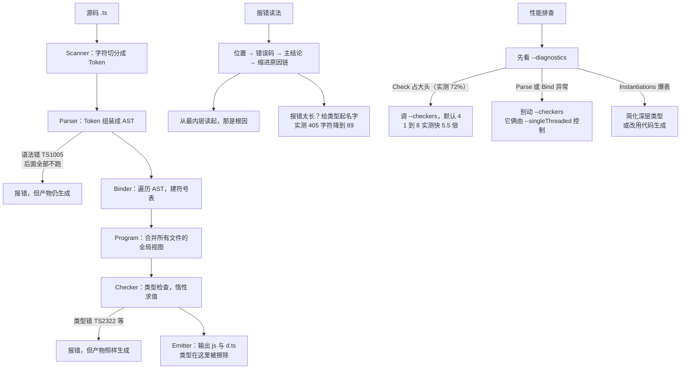

# 第 14 课：编译器原理与类型检查机制

> 所属阶段：阶段 5《深入与架构》｜ 水平：零基础 TS（学到这里已不再是零基础）
> 本课知识点：编译流程全景、可赋值性与变体、为什么慢 & 怎么提速、读懂复杂类型报错
> 故事情节：主角面对一条 20 行的类型报错，第一次没有慌——**因为他知道编译器在想什么**
> ✅ 状态：已完成（2026-09-04）｜ 实操环境：Node.js v22.14.0 + TypeScript 7.0.2（**文中所有输出均为本课本机实测**）

## 🎯 本课目标

- 画出 Scanner → Parser → Binder → Checker → Emitter 全流程，指出类型擦除发生在哪一步
- 用协变 / 逆变解释函数参数与返回值的兼容规则，说清 `strictFunctionTypes` 的作用
- 解释类型检查的复杂度来源、TS 7 的并行检查器原理，并识别常见性能杀手
- 拆解复杂类型报错的结构，逐层展开定位根因

## 📌 知识点导航

| # | 知识点 | 关键点 | 状态 |
|---|--------|--------|------|
| 1 | 编译流程全景 | Scanner → Parser → Binder → Checker → Emitter / AST 与符号表 / 类型擦除发生位置 | ✅ |
| 2 | 可赋值性与变体 | 可赋值性规则 / 协变与逆变 / 函数参数的双变与 `strictFunctionTypes` / 为什么这样设计 | ✅ |
| 3 | 为什么慢 & 怎么提速 | 检查的复杂度来源 / 并行检查器（`--checkers`）原理 / 增量构建 / 常见性能杀手 | ✅ |
| 4 | 读懂复杂类型报错 | 报错结构拆解 / 逐层展开定位 / 用简化手段验证推断 | ✅ |

## 📦 前置依赖

| 依赖 | 要求 | 来源 |
|------|------|------|
| 结构化类型与可赋值性直觉 | **强依赖** | 阶段 1 课 3 ✅ |
| `tsconfig` 配置与 CLI 参数 | 需理解（`--checkers` 等） | 阶段 4 课 10 ✅ |
| 泛型与条件类型 | 需理解（报错常涉及） | 阶段 3 课 8-9 ✅ |

## ⚠️ 事实核查要求（编写本课时必做）

- 编译流程各阶段名称与职责以 TypeScript 官方资料（如官方 Wiki / 编译器内部结构说明 / 官方博客）为准，**凭记忆写阶段职责容易出错**
- `--checkers` / `--builders` / `--singleThreaded` 的语义与默认值以 **TS 7.0 官方公告**为准（默认 `--checkers 4`）
- 变体规则（`strictFunctionTypes` 的精确行为）编写时须**实测验证**再落笔

### ✅ 核查结果（2026-09-04）

| 核查项 | 结果 |
|--------|------|
| 本机版本 | `tsc --version` → **7.0.2**；`node --version` → **v22.14.0**（与基线一致） |
| 阶段职责的官方依据 | 官方 Wiki 的「Overview of the compilation process」**已迁移**到 [microsoft/TypeScript-Compiler-Notes](https://github.com/microsoft/TypeScript-Compiler-Notes) 仓库 README，本课**逐字引用**其中的 preprocessor / parser / binder / program / TypeChecker / Emitter 六段描述 |
| 流水线证据 | `tsc --diagnostics` 直接报告 **Config / Parse / Bind / Check / Emit** 五段耗时——**编译器自己把流水线摊给你看** |
| `--checkers` 等开关 | 以 TS 7.0 公告「CUSTOM SCALING: PARALLELIZATION AND CONTROLS」章节为准，与本机实测交叉验证 |
| **变体规则实测** | 同一份代码在 `strictFunctionTypes: true / false` 两档下各跑一遍，**差异精确落在两行上**（L26 与 L41），并确认**方法语法的参数是双变**的 |
| 实测覆盖 | 本文 4 个目录全部实跑：`pipeline`（阶段证据 + 类型擦除）、`variance`（变体矩阵 + 运行时漏洞）、`perf`（300 文件并行度测量）、`errors`（10 种报错形状的长度与结构测量） |

> 📌 **一处诚实说明**：经典说法是「Scanner → Parser → Binder → Checker → Emitter」五个阶段，但 `--diagnostics` 只报 **Parse / Bind / Check / Emit** 四段——**Scanner 的耗时被合并进了 Parse time**。官方 Compiler Notes 的概述里也把「预处理（决定包含哪些文件）」放在 parser 之前单列，对应 `--diagnostics` 的 Config time。本课文两者并列说明，不假装它们一一对应。

---

## 第一幕：起源与场景引入

> 🏛️ **起源**：为什么需要理解编译器？
>
> 因为 **TypeScript 的报错是编译器思维的产物**。你看到的那几行红字，是编译器在回答一系列它自己提出的问题：
>
> > "What is the `Symbol` for this `Node`? / What is the `Type` of this `Symbol`? / What `Symbol`s are visible in this portion of the AST? / What are the available `Signature`s for a function declaration? / What errors should be reported for a file?"
> > —— [microsoft/TypeScript-Compiler-Notes](https://github.com/microsoft/TypeScript-Compiler-Notes)（官方编译器笔记，核查于 2026-09）
>
> **你不懂它问问题的方式，就只能靠猜。**
>
> 而 TypeScript 编译器有个很特别的地方：**它是"惰性"的**。
>
> > "The `TypeChecker` computes everything lazily; it only 'resolves' the necessary information to answer a question. The checker will only examine `Node`s/`Symbol`s/`Type`s that contribute to the question at hand and will not attempt to examine additional entities."
> > —— 同上
>
> 这一句解释了很多事：为什么 TS 能快到可用、为什么有些错误"看起来该报却没报"、以及——**为什么你写类型性能测试时必须强制求值**（课 13 踩过这个坑）。

**记住一句话就够了**：**报错不是天书，它是编译器沿着"问题链"推出来的结论。读懂它的结构，你就能反推它在想什么。**

好，回到你的项目。

> 🎬 **场景**：周五下午五点，你改了一行配置对象的类型。编译。

```
k-unnamed-source.ts(32,14): error TS2322: Type '{ database: { host: string; port: number; pool:
{ min: number; max: number; idleTimeout: number; }; replica: { host: string; lag: number; weight:
number; }; }; cache: { ttl: number; layers: { name: string; size: number; evict: "lfu" | "lru"; }[];
fallback: { ...; }; }; flags: { ...; }; logging: { ...; }; security: {...' is not assignable to type
'string'.
```

**405 个字符，一行。** 在 80 列的终端里它要折成 6 行——看起来就是那种"传说中的长报错"。

以前你会慌。今天你要做三件事：

1. 看懂它的**结构**（哪个是结论、哪个是原因）
2. 明白它**为什么这么长**（源类型没有名字）
3. 知道**怎么让它变短**（给它起个名字——实测能缩到 **89 字符**）

---

## 第二幕：认知冲突

你开始做实验，撞了三个"说不通"：

```ts
// 实验 A：语法错误和类型错误，后果居然不一样
function f(a: number, b: number {   // 少了个 )
//   → 4 条 TS1005，而且 --diagnostics 里 Bind / Check 两行「整行消失」
const x: number = "abc";            // 类型错
//   → 1 条 TS2322，但 Bind 0.002s / Check 0.013s 照常跑，产物照样生成

// 实验 B：同一个赋值，换个写法就从「通过」变成「报错」
hostA = methodHolder;   // ✅ 方法语法：通过
hostB = propHolder;     // ❌ 函数属性语法：报错
//   差的只是 `m(v: Dog): void` 与 `m: (v: Dog) => void`

// 实验 C：--checkers 只让一部分变快
//   checkers 1 → 4：Check 0.778s → 0.211s（3.7 倍）
//   但 Parse 几乎没动：0.051s → 0.053s
```

三个疑惑，正好落在本课的四个知识点上：

1. **编译器到底分几步走？** 为什么语法错和类型错的后果不同？
2. **"能不能赋值"的底层规则是什么？** 方法语法和函数属性语法凭什么待遇不同？
3. **慢在哪一步？** `--checkers` 管的是哪一段？
4. **那条 405 字符的报错，该怎么读、怎么拆？**

---

## 第三幕：层层揭示

> ⚠️ **本课的实测环境**：所有数字都在 `playground/lesson-14/` 下**实际跑出来**。阶段耗时用 `tsc --diagnostics`（编译器自报）；并行度用「预热后取 3 次最小值」的方法（课 10 定下的规矩）。

### 知识点 1：编译流程全景

> 关键点：Scanner → Parser → Binder → Checker → Emitter / AST 与符号表 / 类型擦除发生位置

#### 一句话定义

TypeScript 编译器把源码变成 JS，中间经过**五个阶段**，每阶段的"原材料"和"产物"都不同：

| 阶段 | 输入 | 产物 | 出错时的报错 |
|------|------|------|-------------|
| **Scanner**（扫描器） | 字符流 | Token 流 | —（耗时并入 Parse） |
| **Parser**（解析器） | Token 流 | **AST**（`SourceFile`） | TS1005 一类**语法错误** |
| **Binder**（绑定器） | AST | **符号表**（`Symbol`） | TS2300 重名、TS2448 用前未声明 |
| **Checker**（检查器） | AST + 符号表 | `Type` + **诊断信息** | TS2322 / TS2345 一类**类型错误** |
| **Emitter**（发射器） | AST | `.js` / `.d.ts` / `.map` | — |

#### 直觉建立（类比）

**出版社的一条流水线。**

- **Scanner** = 把一页手稿拆成一个个**词**
- **Parser** = 把词组成**句子树**（主谓宾谁修饰谁）—— 这就是 AST
- **Binder** = 建**人名索引**：全书出现的"张三"是不是同一个人，哪一章提到的
- **Checker** = **校对**：第 3 章说张三 30 岁，第 17 章怎么 28 了
- **Emitter** = **付印**：把定稿排成书 —— **此时所有的编辑批注（类型）全部丢掉**

> 💡 **类比的边界**：真实出版社**不会**把校对意见印进书里，这点一样。但真实流水线上，**印厂会等校对完成才开机**；而 TypeScript **不会**——默认情况下**类型错了照样付印**（`noEmitOnError` 默认是 `false`）。这是本课第一个反直觉点。

#### 核心原理

**① 官方对各阶段的描述**（逐字引用 [microsoft/TypeScript-Compiler-Notes](https://github.com/microsoft/TypeScript-Compiler-Notes)，核查于 2026-09）

> "The process starts with **preprocessing**. The preprocessor figures out what files should be included in the compilation by following references..."
>
> "The **parser** then generates AST `Node`s. These are just an abstract representation of the user input in a tree format. A `SourceFile` object represents an AST for a given file..."
>
> "The **binder** then passes over the AST nodes and generates and binds `Symbol`s. One `Symbol` is created for each named entity... The binder also handles **scopes** and makes sure that each `Symbol` is created in the correct enclosing scope."
>
> "So far, `Symbol`s represent named entities as seen within a single file... so the next step is to build a global view of all files in the compilation by building a **`Program`**."
>
> "From a `Program` instance a **`TypeChecker`** can be created. `TypeChecker` is the core of the TypeScript type system. It is the part responsible for figuring out relationships between `Symbols` from different files, assigning `Type`s to `Symbols`, and generating any semantic `Diagnostic`s (i.e. errors)."
>
> "An **`Emitter`** can also be created from a given `Program`. The Emitter is responsible for generating the desired output for a given `SourceFile`; this includes `.js`, `.jsx`, `.d.ts`, and `.js.map` outputs."

注意官方描述里有两个容易被忽略的环节：**preprocessing**（决定包含哪些文件）和 **`Program`**（跨文件的全局视图）。它们分别对应 `--diagnostics` 里的 **Config time** 和 `Program` 的构建。

**② 证据：`tsc --diagnostics` 把流水线摊给你看**（`pipeline/`，实测）

```
Files:             221
Lines:          118229
Identifiers:     92698
Symbols:         63942        ← Binder 的产物：符号表大小
Types:             381
Instantiations:     40        ← Checker 的产物：类型实例化次数
Memory used:    52750K
Config time:    0.001s        ← 预处理：决定包含哪些文件
Parse time:     0.051s        ← Scanner + Parser
Bind time:      0.014s        ← Binder
Check time:     0.001s        ← Checker
Emit time:      0.001s        ← Emitter
Total time:     0.069s
```

> 🔍 **诊断工具箱**：`--diagnostics` 看阶段耗时 ｜ `--explainFiles` 看"为什么这个文件被包含进来"（对应 preprocessing）｜ `--listFiles` 列出所有参与的文件 ｜ `--traceResolution` 看模块解析轨迹（课 11 用过）。

**③ 关键证据：语法错误 vs 类型错误，后果完全不同**（`pipeline/src/broken/`，实测）

同一个编译器的两种失败，对比极其鲜明：

**A. 语法错误**（`syntax-error.ts`，`function f(a: number, b: number {`）

```
syntax-error.ts(2,37): error TS1005: ',' expected.
...（共 4 条语法错误）
Symbols:          8412
Instantiations:      0        ← 零次类型实例化
Config time:    0.001s
Parse time:     0.024s
Emit time:      0.004s        ← 注意：Bind 和 Check 两行「整行消失」了
Total time:     0.030s
```

**B. 类型错误**（`type-error-only.ts`，语法完全正确）

```
type-error-only.ts(6,14): error TS2322: Type 'number' is not assignable to type 'string'.
Symbols:         14647        ← Binder 跑过了（比 A 多出 6000+）
Types:            9554
Instantiations:   5301        ← Checker 也跑过了
Config time:    0.001s
Parse time:     0.021s
Bind time:      0.002s        ← 出现了
Check time:     0.013s        ← 出现了
Emit time:      0.001s
Total time:     0.041s
```

**三个可验证的结论**：

1. **Parser 造不出 AST 时，Binder 和 Checker 根本不会运行**——它们在耗时统计里连一行都没有，`Instantiations` 是 0
2. **类型错误发生在 Checker 阶段，此时 AST 和符号表都已就绪**，所以 Binder 的数据（Symbols 14647）是完整的
3. **两种错误都会产出 JS**（`dist-syntax/` 与 `dist-type/` 里都有文件）——这就是 `noEmitOnError` 默认 `false` 的含义

> ⚠️ **CI 上务必记住第 3 条**：`tsc` 报了错但仍会写文件。如果你的流水线"构建成功就发布"，那么**类型错误的产物是会被发布出去的**。课 12 那个 `total = 0100` 就是这么上线的。

**④ 类型擦除发生在 Emitter**（`pipeline/`，实测）

源码 `src/app.ts`：

```ts
interface Order {
  id: string;
  amount: number;
}

function total(orders: Order[]): number {
  return orders.reduce((sum, order) => sum + order.amount, 0);
}

const orders: Order[] = [
  { id: "A-1", amount: 100 },
  { id: "A-2", amount: 250 },
];

console.log("total =", total(orders));
```

产物 `dist/app.js`（**逐字实测**）：

```js
function total(orders) {
    return orders.reduce((sum, order) => sum + order.amount, 0);
}
const orders = [
    { id: "A-1", amount: 100 },
    { id: "A-2", amount: 250 },
];
console.log("total =", total(orders));
export {};
```

`interface Order` 没了、`: Order[]` 没了、`: number` 没了。**一个字符都没留下。**

> 🔗 **回扣课 1**：课 1 就说"TS 是擦除式类型超集"。现在你知道这件事**发生在 Emitter 阶段**——不是某个开关的效果，是流水线的最后一步在输出时就不写类型。这也解释了为什么 `.d.ts` 是另一个产物：它是 Emitter 在 `declaration: true` 下**额外**输出的类型说明书（课 11）。

**⑤ Checker 是"惰性"的**（官方原文，见起源部分）

这一点解释了很多现象：

- 为什么大项目也能秒开：没被问到的类型不会被算
- 为什么"看起来该报错却没报"：那些代码根本没被问到（课 13 的静默失败是另一回事）
- **为什么写类型性能测试必须强制求值**——课 13 的 `cost/gen.js` 里特意给每个类型都加了一次赋值检查，否则惰性求值会让测量失真到测不出差异

#### 常见误区

1. **"类型错误会阻止编译产物生成。"** → 不会，`noEmitOnError` 默认 `false`，实测两种错误都产出了 JS。
2. **"语法错误和类型错误只是错误码不同。"** → 阶段完全不同：语法错误时 Binder/Checker 根本不跑（实测耗时统计里整行消失）。
3. **"类型是在编译的某一步被'删除'的。"** → 不是删除，是 Emitter 输出时**根本不写**。
4. **"编译器会检查所有代码。"** → Checker 是惰性的，只解析被问到的部分（官方原文）。
5. **"`--diagnostics` 报的四段就是五个阶段。"** → 不是：Scanner 的耗时并入了 Parse time，preprocessing 对应 Config time。

#### 一句话记住

> **字符 → Token → AST → 符号表 → 类型与诊断 → JS；语法错在 Parser 就卡住（后面不跑），类型错在 Checker 才报（但照样 emit），类型擦除在 Emitter。**

#### 官方文档

- 官方编译器笔记（本课引用来源）：https://github.com/microsoft/TypeScript-Compiler-Notes
- 官方性能排查 Wiki：https://github.com/microsoft/TypeScript/wiki/Performance
- 性能追踪（逐事件分析）：https://github.com/microsoft/TypeScript/wiki/Performance-Tracing

---

### 知识点 2：可赋值性与变体

> 关键点：可赋值性规则 / 协变与逆变 / 函数参数的双变与 `strictFunctionTypes` / 为什么这样设计

#### 一句话定义

**可赋值性**是 TS 最底层的规则：`A` 能不能赋给 `B`。**变体**（variance）描述的是：当 `A`、`B` 是某个泛型 `T<X>` 的两个实例时，`X` 的兼容方向会不会"翻转"。

- **协变**（covariant）：方向**保持**——`Dog` 可以当 `Animal`，所以 `Getter<Dog>` 可以当 `Getter<Animal>`
- **逆变**（contravariant）：方向**翻转**——`Setter<Animal>` 可以当 `Setter<Dog>`（参数位置）
- **双变**（bivariant）：**两个方向都行**（TS 为了兼容历史代码，在方法参数上保留了这个口子）

#### 直觉建立（类比）

**找一个能替你干活的人。**

假设你要一个"**能处理任何 Animal 的人**"（`Setter<Animal>`）：

- 来了个"**只处理 Dog 的人**"（`Setter<Dog>`）——**不行**。你要是给他一只猫，他当场懵
- 来了个"**能处理任何生物的人**"（`Setter<Creature>`）——**可以**。他连 Animal 都能处理，何况 Dog

**参数位置就是"你能接受什么"：要求越宽的人越能替你干活 —— 这就是逆变。**

反过来，你要一个"**能给你变出 Animal 的人**"（`Getter<Animal>`）：

- 来了个"**能变出 Dog 的人**"（`Getter<Dog>`）——**可以**，Dog 就是 Animal
- 你要是要求"必须变出 Dog"，来个只会变 Animal 的——**不行**

**返回值位置就是"你能得到什么"：承诺越具体的人越能替你干活 —— 这就是协变。**

> 💡 **类比的边界**：真实世界里"要求更宽"和"承诺更具体"都是好事，这条直觉很牢。但 TS **在方法参数上故意不遵守它**（后面会看到实测），理由是兼容——**理论正确 vs 工程现实，这次是工程赢了。**

#### 核心原理

**① 实测矩阵**（`variance/src/variance.ts`，两种配置各跑一遍）

```ts
interface Animal { name: string }
interface Dog extends Animal { breed: string }
```

| 行 | 代码 | 位置 | `strictFunctionTypes: true` | `strictFunctionTypes: false` |
|----|------|------|------|------|
| L11 | `animalObj = dogObj` | 对象属性（协变） | ✅ | ✅ |
| L12 | `dogObj = animalObj` | 对象属性（反向） | ❌ | ❌ |
| L18 | `getAnimal = getDog` | 返回值（协变） | ✅ | ✅ |
| L19 | `getDog = getAnimal` | 返回值（反向） | ❌ | ❌ |
| L25 | `setDog = setAnimal` | 参数（逆变方向） | ✅ | ✅ |
| **L26** | **`setAnimal = setDog`** | **参数（函数属性）** | **❌** | **✅** |
| L40 | `hostA = methodHolder` | **方法语法**参数 | ✅ | ✅ |
| **L41** | **`hostB = propHolder`** | **函数属性语法**参数 | **❌** | **✅** |
| L46 | `animals = dogs` | 数组（协变） | ✅ | ✅ |
| L47 | `dogs = animals` | 数组（反向） | ❌ | ❌ |

**实测报错清单**（`strictFunctionTypes: true`，5 条）：

```
variance.ts(12,1): error TS2322: Type '{ d: Animal; }' is not assignable to type '{ d: Dog; }'.
variance.ts(19,1): error TS2322: Type 'Getter<Animal>' is not assignable to type 'Getter<Dog>'.
variance.ts(26,1): error TS2322: Type 'Setter<Dog>' is not assignable to type 'Setter<Animal>'.
variance.ts(41,1): error TS2322: Type 'PropStyle' is not assignable to type '{ m: (v: Animal) => void; }'.
variance.ts(47,1): error TS2322: Type 'Animal[]' is not assignable to type 'Dog[]'.
```

（`strictFunctionTypes: false` 时只剩 3 条：**L26 和 L41 消失了**。）

**② 三条精确结论**

1. **`strictFunctionTypes` 只影响一处**：**函数类型位置的参数**。对象属性、返回值、数组全都与它无关（实测：L12/L19/L47 在两种配置下都报错）
2. **方法语法的参数是双变的**：`m(v: Dog): void` 即使开了 `strictFunctionTypes` 也不检查（实测 L40 两档都通过）；而 `m: (v: Dog) => void` 会检查（L41）
3. **数组是协变的，而且这个协变不安全**（下面有运行时证据）

**为什么方法语法网开一面？** 官方的设计取舍：很多既有的 JS/TS 代码里，事件处理器、比较器都是用方法语法写的，而且实际使用中"参数写窄了"很少真的出问题。如果一律按逆变检查，大量现存代码会瞬间报错。**TS 选择了"实用主义优先"**（TS 团队把这个叫 *method bivariance*）。

> 💡 **实践建议**：写新的**函数类型**时，用属性语法（`m: (v: T) => void`）能拿到更严格的检查；只有当你确实需要兼容"参数写窄"的用法时才用方法语法。

**③ 协变数组是"故意不安全"的**（`variance/src/unsound-array.ts`，**实测**）

```ts
const dogs: Dog[] = [{ name: "rex", breed: "labrador" }];

const animals: Animal[] = dogs;       // ✅ 协变，允许
animals.push({ name: "generic-animal" });  // ✅ 也允许 —— 但这是个不是 Dog 的东西

console.log("dogs.length =", dogs.length);
console.log("dogs[1].breed =", dogs[1].breed);   // 运行时：undefined
```

**实测输出**：

```
dogs.length = 2
dogs[1].breed = undefined
```

**编译零报错，运行时 `dogs` 里混进了一个没有 `breed` 的对象。** 这是 TS 类型系统**已知**的不安全点——官方明确知道，但为了让 `Dog[]` 能当 `Animal[]` 用（这在真实代码里太常见了），选择了接受它。

> 这一类"明知不安全但接受"的设计，正是课 6 讲的「信任边界」的来源：**类型系统不是证明系统，它挡住常见的错误，不保证消灭所有错误。**

**④ 变体速查表**（本知识点的**决策参考**）

| 位置 | 变体 | 直觉 | 例子 |
|------|------|------|------|
| 对象属性 | 协变 | 子类型的对象可以当父类型用 | `{d: Dog}` → `{d: Animal}` ✅ |
| 函数**返回值** | 协变 | 承诺更具体的函数更好 | `() => Dog` → `() => Animal` ✅ |
| 函数**参数**（函数类型语法） | **逆变**（需 `strictFunctionTypes`） | 要求更宽的函数更好 | `(v: Animal) => void` → `(v: Dog) => void` ✅ |
| 函数**参数**（方法语法） | **双变** | 两个方向都放行 | `m(v: Dog): void` → `{m(v: Animal): void}` ✅ |
| 数组元素 | 协变（**不安全**） | 上面那个运行时漏洞 | `Dog[]` → `Animal[]` ✅ |

#### 常见误区

1. **"`strictFunctionTypes` 让所有函数参数检查变严。"** → 只影响**函数类型语法**的参数；**方法语法**的参数仍是双变（实测 L40）。
2. **"数组是安全的。"** → 协变且不安全，实测能把非 `Dog` 塞进 `Dog[]`。
3. **"`strict` 关掉就不会有变体问题。"** → `strictFunctionTypes` 是 `strict` 的子项，可单独开关（课 10 讲过子开关可单独拧）。
4. **"逆变是 bug。"** → 逆变才是数学上正确的方向；**方法参数的双变**才是为兼容开的口子。
5. **"参数逆变会让代码写不了。"** → 绝大多数代码不受影响；受影响的通常是比较器、事件处理器这类回调。

#### 一句话记住

> **返回值协变、参数逆变；`strictFunctionTypes` 只管函数类型语法的参数（方法语法仍双变）；数组协变但不安全——类型系统挡住常见错误，不保证消灭所有错误。**

#### 官方文档

- `strictFunctionTypes`：https://www.typescriptlang.org/tsconfig#strictFunctionTypes
- TS 2.6 引入该开关的说明（含 method bivariance 的取舍）：https://www.typescriptlang.org/docs/handbook/release-notes/typescript-2-6.html

---

### 知识点 3：为什么慢 & 怎么提速

> 关键点：检查的复杂度来源 / 并行检查器（`--checkers`）原理 / 增量构建 / 常见性能杀手

#### 一句话定义

类型检查慢，是因为**它需要跨文件的全局信息，而且要在类型之间做结构化的两两比较**。TS 7 的解法是：把能并行的（Parse / Emit）和难并行的（Check）**分开调度**，并给后者一个可调的并行度（`--checkers`）。

#### 直觉建立（类比）

**改卷子。**

- **Parse / Emit**（扫描、印刷卷子） = **一份一份独立处理**，多少人一起干都行，人越多越快
- **Check**（批改） = 需要**知道标准答案、还要前后对照**——多个老师改，每人得先复印一份答案，协调有成本
- **`--checkers 4`** = 请 4 个老师批改，每人抱一份答案副本（**更占内存**）
- **`--singleThreaded`** = 一个人干全部：扫描、印刷、批改都串行

> 💡 **类比的边界**：真实改卷子，4 个老师几乎就是 4 倍速度。而实测里 1 → 8 个检查器只快了 **5.5 倍**（不是 8 倍）——因为"复印答案"（共享类型信息的复制与协调）也是成本。**这就是官方说的"以增加内存为代价"。**

#### 核心原理

**① 复杂度从哪来**

| 来源 | 说明 |
|------|------|
| **必须看整个模块图** | 判断 `greet(user)` 对不对，要顺着 import 一路追到定义。转译可以一个文件一个文件做，检查不行（Vite 官方文档的原话，课 12 引用过） |
| **结构化类型的两两比较** | 不是比类型名字，是比结构成员。嵌套越深、成员越多，比较次数越多 |
| **泛型实例化** | 每个不同的类型实参都会产生一份实例化。 `--diagnostics` 里的 `Instantiations` 就是它 |
| **条件类型 / 递归类型** | 一次推断可能触发成百上千次实例化（课 13 的 `Instantiations: 768744` 就是这么来的） |
| **联合类型分发** | 联合成员多时，比较会按成员展开，可能组合爆炸 |

**② 证据：Check 才是瓶颈**（`perf/`，300 文件 × 30 条记录，实测）

```
Files:              388
Lines:           122913
Identifiers:     364021
Symbols:         633801
Types:           182860
Instantiations:  768744
Memory used:    378977K
Config time:     0.001s
Parse time:      0.067s
Bind time:       0.020s
Check time:      0.229s     ← 占 Total 的 72%
Emit time:       0.001s
Total time:      0.320s
```

**Check 一家独大**（72%），Parse + Bind 加起来才 27%。这解释了为什么优化要盯着 Check。

**③ `--checkers` 到底管的是哪一段**（实测，预热后取 3 次最小值）

| 配置 | Check | Parse | Bind | Total |
|------|-------|-------|------|-------|
| `--checkers 1` | **0.778s** | 0.051s | 0.016s | 0.853s |
| `--checkers 4`（默认） | **0.211s** | 0.053s | 0.015s | 0.282s |
| `--checkers 8` | **0.141s** | 0.061s | 0.017s | 0.227s |
| `--singleThreaded` | 0.794s | **0.208s** | **0.089s** | 1.092s |

**这张表是整个知识点最值钱的东西**，它把两件事分得清清楚楚：

1. **`--checkers` 只影响 Check**：0.778 → 0.211 → 0.141（1→8 快 **5.5 倍**），而 **Parse / Bind 几乎纹丝不动**（0.051 → 0.061）
2. **Parse / Bind 的并行由 `--singleThreaded` 控制**：关掉后 Parse 从 0.051 涨到 **0.208**（4 倍）、Bind 从 0.015 涨到 **0.089**（6 倍），而 Check 0.794 与 `--checkers 1` 的 0.778 基本持平

**这正好对上官方公告的说法**（TS 7.0 公告「CUSTOM SCALING」章节）：

> "TypeScript 7.0 now performs many steps in parallel, including parsing, type-checking, and emitting. Some of these steps, like parsing and emitting can mostly be done independently across files... But not every step in a TypeScript build is easily parallelizable."
>
> "The default number of type-checking workers is 4, but it can be configured with the new `--checkers` flag... **increasing this number can further speed up builds... but will typically come at the cost of increased memory usage.**"
>
> "To enable single-threaded mode, you can use the new `--singleThreaded` flag. This will not only cap the number of type-checking workers to 1, but also **ensure parsing and emitting are done in a single thread**."

**④ 怎么提速**

| 手段 | 管什么 | 何时用 |
|------|-------|-------|
| **`--checkers N`**（默认 4） | Check 的并行 worker 数 | 大项目、机器核多 → 调高；**CI 内存紧 → 调到 1**（官方原话：CPU / 内存紧张的环境可以调低） |
| **`--builders N`** | `--build` 时并行构建几个项目 | monorepo；**与 `--checkers` 相乘**（4×4 = 最多 16 个检查器，官方提醒可能过头） |
| **`--singleThreaded`** | 全部串行（Parse / Check / Emit） | 调试、资源极度受限；**不要用于日常构建** |
| **`--build` + 项目引用** | 增量：没变的项目整个跳过 | monorepo / 多包项目（课 10 实测过） |
| **`skipLibCheck: true`** | 不检查 `.d.ts` | 几乎**总是该开**（课 11 实测：默认值是 `false`，`--init` 模板的 `true` 是推荐值） |
| **精确的 `include` / `exclude`** | 少编译无关文件 | 别把产物目录、`node_modules` 卷进来 |
| **简化深层类型体操** | 降低 Instantiations | 见课 13 的七步放弃标准 |

**⑤ 常见性能杀手**

| 杀手 | 症状（`--diagnostics` 里看什么） | 处理 |
|------|--------------------------------|------|
| 巨型 `.d.ts` 依赖 | `Files` / `Lines` 异常大 | `skipLibCheck: true`；升级或换掉依赖 |
| 深层递归 / 条件类型 | `Instantiations` 爆表 | 按课 13 的标准简化，或改成代码生成 |
| `include` 范围过大 | `Files` 远超源码数 | 收窄 `include` / 加 `exclude` |
| 无项目引用的大 monorepo | 每次全量 `Total time` 都很高 | 拆项目 + `references` + `--build` |
| 每次都全量重编 | 改一个文件也要几十秒 | 用 `--watch` 或 `--build` 走增量 |

**诊断步骤**（照着做一遍就能定位）：

```powershell
# 1) 先看阶段分布：谁是大头？
tsc --noEmit --diagnostics

# 2) 文件数不对？看看都编了什么
tsc --noEmit --listFiles | Select-String "node_modules" | Measure-Object

# 3) 某个文件为什么被包含进来？
tsc --noEmit --explainFiles

# 4) 模块解析卡在哪？（课 11 用过）
tsc --noEmit --traceResolution
```

> 📌 **关于 `--checkers` 的收益递减**：课 10 在小项目上测到 1→8 只快 12%（启动开销占了大头）；本课在 300 文件 × 30 条记录的项目上测到 **5.5 倍**。**结论一致：项目越大，`--checkers` 越值钱。**

#### 常见误区

1. **"`--checkers` 越大越好。"** → 收益递减且吃内存；官方明确说 CI 上应该反过来调低。
2. **"`--singleThreaded` 只是慢一点。"** → Parse 慢 4 倍、Bind 慢 6 倍（实测），别用于日常。
3. **"`--checkers` 能加速所有阶段。"** → 只影响 Check；Parse/Bind 由 `--singleThreaded` 控制（实测表）。
4. **"类型检查慢是因为文件多。"** → 主要是 Check 的结构比较与实例化；看 `Instantiations` 比看 `Files` 准。
5. **"TS 7 快了 10 倍，不用管性能了。"** → 快 10 倍也能被一个坏类型吃回去（课 13 实测：体操让检查耗时变 2.9 倍）。

#### 一句话记住

> **Check 是瓶颈（`--checkers` 管它，1→8 实测 5.5 倍）；Parse/Bind 另有一套并行（`--singleThreaded` 能关掉，实测慢 4-6 倍）；先 `--diagnostics` 定位，再对症下药。**

#### 官方文档

- TS 7 并行化与开关：https://devblogs.microsoft.com/typescript/announcing-typescript-7-0/#custom-scaling-parallelization-and-controls
- 官方 Performance Wiki：https://github.com/microsoft/TypeScript/wiki/Performance
- 官方追踪工具 `analyze-trace`：https://github.com/microsoft/typescript-analyze-trace

---

### 知识点 4：读懂复杂类型报错

> 关键点：报错结构拆解 / 逐层展开定位 / 用简化手段验证推断

#### 一句话定义

TS 的报错是一个**四段结构**：`位置 → 错误码 → 主结论 → 缩进的原因链`。**主结论告诉你"不行"，原因链告诉你"为什么"——最内层那句才是根因。**

#### 直觉建立（类比）

**医生的诊断书。**

```
主诉（位置）：  左膝，第 3 行第 14 列
诊断码（错误码）：M17.0
结论：          膝关节置换术适应症
依据（缩进）：
    ├─ 影像学显示关节间隙消失          ← 第一层原因
    │   └─ 软骨磨损达 IV 级            ← 第二层原因（根因）
    └─ 保守治疗 6 个月无效
```

**你不会因为"结论"那一行很长就慌——你会直接看最内层那句依据。** 读 TS 报错完全一样。

> 💡 **类比的边界**：诊断书依据写得越细越好；而 TS 报错的原因链**在类型无法命名时会退化成一个摊开的大结构**（第一幕那个 405 字符）。这时候你要做的不是读它，而是**让它变短**。

#### 核心原理

**① 报错的四段结构**（`errors/i-overloads-all.ts`，实测）

```
i-overloads-all.ts(10,22): error TS2769: No overload matches this call.
  The last overload gave the following error.
    Argument of type 'boolean' is not assignable to parameter of type 'Date'.
```

| 段 | 内容 | 怎么用 |
|----|------|-------|
| **位置** | `文件(行,列)` | 直接跳过去；列号通常已经精确到出问题的那个 token |
| **错误码** | `TS2769` | **先查码**定大类（见下面的速查表），比读文字快 |
| **主结论** | `No overload matches this call.` | 告诉你"哪一类失败" |
| **原因链** | 逐层缩进 | **最内层是根因**；缩进层级 = 推导深度 |

**② 测量：TS 7 的报错其实很收敛**（`errors/`，8 种形状实测）

我原本准备演示"报错长到没法读"。实测下来——**结论与直觉相反**：

| 场景 | 报错行数 |
|------|---------|
| 判别式联合少传一个属性 | 2 行 |
| 4 层嵌套对象最内层类型错 | **1 行**（`Type 'number' is not assignable to type 'string'`） |
| 映射类型 + 模板字面量值写错 | 1 行 |
| 函数重载不匹配 | 1 行（`boolean` 不能赋给 `string`） |
| 泛型 API 的深层属性写错 | 1 行（`"center"` 不在 `"left" \| "right"` 里） |
| 内联深度结构赋值 | 1 行（直接点到 `pool.max`） |
| 同一处错 4 个字段 | 4 行（**每个字段单独报，互不干扰**） |
| 泛型表单最内层写错 | 1 行（直接点到 `opts.required`） |

**TS 7 会一路收敛到真正出问题的那个叶子**，然后把中间层全部省略。这比"抱怨报错长"要有用得多。

**③ 那什么时候会变长？——源类型没有名字**（实测对照）

同样一个 5 大段、深达 4 层的配置结构，赋给 `string`：

| | 报错长度 | 报错内容 |
|---|---|---|
| **匿名类型**（内联返回类型） | **405 字符** | 把整个结构摊开打印，深层用 `{ ...; }` 省略 |
| **具名类型**（`interface AppConfig`） | **89 字符** | `Type 'AppConfig' is not assignable to type 'string'.` |

```
匿名：error TS2322: Type '{ database: { host: string; port: number; pool: { min: number; max: number;
      idleTimeout: number; }; replica: { host: string; lag: number; weight: number; }; }; cache: {
      ttl: number; layers: { name: string; size: number; evict: "lfu" | "lru"; }[]; fallback: { ...; };
      }; flags: { ...; }; logging: { ...; }; security: {...' is not assignable to type 'string'.

具名：error TS2322: Type 'AppConfig' is not assignable to type 'string'.
```

**相差 4.6 倍。** 而且注意：TS 7 不会无限摊开——**超过两层的嵌套会主动省略成 `{ ...; }`**，所以这个 405 字符是有上限的，不会真的变成几千字符。

**④ 三把刀**（本知识点的**核心产出**）

**刀法一：读原因链，只看最内层**

```
error TS2769: No overload matches this call.              ← 结论：没有匹配的重载
  The last overload gave the following error.             ← 层 1：哪一条失败了
    Argument of type 'boolean' is not assignable to ...   ← 层 2：根因（改这里）
```

**刀法二：给类型起名字**

这是**同时改善报错长度和代码可读性**的一步：把内联的大结构抽成 `interface`，报错立刻从 405 字符降到 89 字符（实测）。

> 反过来说：如果你看到一个超长报错，**先去给它涉及的类型起个名字**，往往问题就自己暴露了。

**刀法三：拆中间变量**

当报错指向的位置不够精确时（比如一整行里做了三件事），拆成中间变量，让每一段单独被检查：

```ts
// 原来：一行里 构造对象 → 传给泛型函数 → 取返回值，报错位置含糊
export const bad = submit({
  profile: { name: "amy", avatar: { url: "u", size: "big" } },
  plan: { tier: "pro", seats: 5 },
}).ok;

// 拆开：每一段自己报自己的错
const avatar = { url: "u", size: 123 };     // 这里单独检查
const profile = { name: "amy", avatar };
const plan: { tier: "free" | "pro"; seats: number } = { tier: "pro", seats: 5 };
const account: Account = { profile, plan };
return submit(account).ok;
```

> 本次实测里，TS 7 其实**已经把错误精确到了列 47**（正好是 `size: "big"` 的位置），所以拆分不是必需的。但在类型更绕、涉及推断的场景下，这招依然最可靠——**它把"编译器的一次大判断"变成"几次小判断"**。

**⑤ 错误码速查表**

| 错误码 | 含义 | 常见根因 |
|--------|------|---------|
| **TS2322** | 赋值不兼容 | 变量/属性赋值时类型对不上 |
| **TS2345** | 实参不兼容 | 函数调用传参类型不对 |
| **TS2741** | 缺属性 | 对象少了必填字段 |
| **TS2353** | 对象字面量有多余属性 | 多余属性检查（课 8 提到过与 TS2741 的区别） |
| **TS2769** | 没有匹配的重载 | 所有重载签名都失败，看最后一条的原因 |
| **TS2589** | 类型实例化过深 | 递归超限（课 13） |
| **TS2304** | 找不到名字 | 没导入 / `types` 没配（课 11） |
| **TS2584 / TS2550** | 标准库里没有 | `lib` 配置问题（课 11 实测，`console` 也在 `lib.dom` 里） |
| **TS7016** | 找不到声明文件 | 无类型库（课 11） |
| **TS1005 / TS1128** | 语法错误 | Parser 阶段失败，先修语法 |
| **TS2834 / TS2835** | 缺文件扩展名 | `nodenext` 下的 ESM 规则（课 10 / 课 11） |

#### 常见误区

1. **"报错越长说明问题越严重。"** → 长只说明**类型没法用一个名字概括**（实测 405 vs 89 字符，问题一样）。
2. **"要从报错第一行开始读。"** → 应该**从最内层（缩进最深）读起**，那是根因。
3. **"改报错说的地方就行。"** → 报错位置是"冲突发生地"，根因常常在别处（比如类型定义的源头）。
4. **"内联类型更简洁。"** → 代价是报错里整个结构被摊开（实测 4.6 倍）。
5. **"类型错误会阻止编译通过就没事了。"** → 产物照样生成（知识点 1 实测），CI 上必须单独门禁。

#### 一句话记住

> **报错 = 位置 + 错误码 + 主结论 + 缩进原因链；读最内层，给类型起名字（实测让报错短 4.6 倍），必要时拆中间变量。**

#### 官方文档

- 官方 Performance / 调试 Wiki（含读报错的建议）：https://github.com/microsoft/TypeScript/wiki/Performance
- TS 错误码索引（社区维护）：https://typescript.tv/errors/

---

## 第四幕：实操验证

回到第一幕那条 405 字符的报错。按本课的四把尺子走一遍。

**第 1 步 · 知道它在流水线的哪一步**

它是 `TS2322`，属于 **Checker 阶段**的诊断。也就是说：**AST 和符号表都建好了，只是类型对不上**。所以——产物照样生成了（知识点 1 实测）。

**第 2 步 · 拆结构**

```
k-unnamed-source.ts(32,14)        ← 位置：第 32 行第 14 列
error TS2322                      ← 错误码：赋值不兼容
Type '{ database: ... }' is not assignable to type 'string'.   ← 主结论，没有原因链
```

**没有原因链**——因为这是一个"顶层就不兼容"的判断（`AppConfig` 和 `string` 毫无关系），不需要往下推。**看到没有原因链的报错，说明问题在最外层，反而简单。**

**第 3 步 · 让它变短**

给它起个名字（把返回类型抽成 `interface AppConfig`）：

```
短前：405 字符 —— 整个结构被摊开
短后： 89 字符 —— Type 'AppConfig' is not assignable to type 'string'.
```

**第 4 步 · 顺手看看流水线是不是健康**

```
tsc --noEmit --diagnostics
Parse time:  0.051s
Bind time:   0.014s
Check time:  0.001s     ← 这个项目还太小
```

项目长大了之后（本课 `perf/` 项目）：

```
Check time:  0.229s     ← 占 72%
```

此时 `--checkers` 就是你的第一个杠杆。

四个关键点的验证结果汇总（均为本课本机实测）：

| 验证项 | 实测结论 |
|--------|---------|
| `--diagnostics` 阶段 | Config 0.001 / Parse 0.051 / Bind 0.014 / Check 0.001 / Emit 0.001 秒 |
| 语法错误 | 4 条 TS1005；**Bind / Check 两行从统计里整行消失**；`Instantiations: 0` |
| 类型错误 | 1 条 TS2322；Bind 0.002 / Check 0.013 照常跑；`Instantiations: 5301` |
| 两种错误 | **都产出了 JS**（`noEmitOnError` 默认 `false`） |
| 类型擦除 | `interface Order`、`: Order[]`、`: number` 在产物里一个字符都不剩 |
| 变体矩阵 | `true` 档 5 条错、`false` 档 3 条；**差异精确落在 L26 与 L41** |
| 方法语法 | L40 两档都通过 → **方法参数是双变** |
| 数组协变漏洞 | 编译零报错，运行时 `dogs[1].breed = undefined` |
| Check 占比 | 300 文件项目中 Check 0.229s / Total 0.320s = **72%** |
| `--checkers` | Check 0.778 → 0.211 → 0.141（1→8 快 5.5 倍）；**Parse / Bind 几乎不动** |
| `--singleThreaded` | Parse 0.051 → **0.208**（4 倍）、Bind 0.015 → **0.089**（6 倍） |
| 报错收敛度 | 8 种形状实测：**1-4 行**，普遍直接点到出问题的叶子 |
| 匿名 vs 具名 | 405 字符 vs **89 字符**（4.6 倍）；TS 7 会用 `{ ...; }` 省略深层 |

> ✅ **回扣课 13**：课 13 留下两个伏笔——「编译耗时为什么是这个形状」和「类型检查为什么慢、并行检查器原理」，本课都回答了：耗时集中在 Check（72%），并行检查器只对 Check 生效（5.5 倍），而 Parse / Bind 另有一套并行机制（`--singleThreaded` 实测慢 4-6 倍）。
> 另外，课 13 说"类型性能测试必须强制求值"——根因就是本课的官方原文：**Checker 是惰性求值的**。

---

## 第五幕：体系收束

> 📍 **全局定位**：**本课是阶段 5 的"引擎盖底下"一课，也是整门课里唯一一次把黑盒打开。**
>
> 阶段 5 三课的分工：
> - **课 13 探天花板**：类型体操能算到什么程度、代价是什么、什么时候该收手
> - **课 14（本课）看引擎盖底下**：流水线五阶段、可赋值性与变体的底层规则、慢在哪、报错怎么读
> - **课 15 回到工程决策**：类型放哪一层、公开 API 怎么设计、老项目怎么迁、什么项目干脆别上 TS
>
> 本课接住了课 13 的两个伏笔（耗时形状、并行检查器原理），也给课 15 铺了路：**理解了 Checker 的工作方式，你才能判断"类型的复杂度该放在哪一层"**——因为每一层复杂度都要在每次检查时付一次钱。
>
> 课 15 要回答的最后一问——「**这个项目该不该上 TS**」——在本课有了新的判断依据：**类型检查是一项持续的编译期成本，收益是错误发现左移。这笔账怎么算，取决于你的项目规模、团队和发布频率。**

**现在你会了什么**：

- 能画出 Scanner → Parser → Binder → Checker → Emitter 全流程，说出每阶段的产物，并指出**类型擦除发生在 Emitter**
- 能用 `--diagnostics` 定位瓶颈，并知道**语法错误会让 Binder / Checker 完全不跑**（实测）
- 能用协变 / 逆变解释返回值与参数的兼容规则，说清 **`strictFunctionTypes` 只管函数类型语法的参数**（实测：只有两行受影响），并知道**方法参数仍是双变**
- 能解释 Check 为什么是瓶颈（实测 72%）、`--checkers` 管哪一段（Check，5.5 倍）、`--singleThreaded` 管哪一段（Parse/Bind，慢 4-6 倍）
- 能拆解复杂报错的四段结构，用**读原因链 / 给类型起名字 / 拆中间变量**三把刀定位根因

**给未来自己的提醒**：

> 本课的性能数字（Check 72%、5.5 倍、4-6 倍）是**在 300 文件 × 30 条记录的项目上**测到的。**小项目上这些杠杆都不明显**——课 10 在小项目上测到 1→8 只快 12%。**先量再调**，`--diagnostics` 是你的第一站。
>
> 阶段职责的官方描述我引的是 [TypeScript-Compiler-Notes](https://github.com/microsoft/TypeScript-Compiler-Notes)（官方 Wiki 的迁移目标）。它自己声明"不是权威文档，只是降低贡献门槛的笔记"，所以**阶段划分的措辞可能随版本微调**，但 `--diagnostics` 报的那五段耗时是编译器自报的，永远可靠。

> 🔗 **下一步**：课 15《大型项目类型架构与选型收束》——阶段 5 收官，也是整门课的收官：类型分层与放置、公开 API 的类型设计、JS → TS 渐进迁移，以及最后那个决策——**什么时候不该上 TS**。

---

## 🐞 常见误区

1. **"类型错误会阻止产物生成。"** → 不会，`noEmitOnError` 默认 `false`（实测两种错误都产出了 JS）。
2. **"语法错误和类型错误只是错误码不同。"** → 阶段不同：语法错时 Binder / Checker 根本不跑（实测耗时统计整行消失）。
3. **"类型是在某一步被删掉的。"** → 不是删除，是 Emitter 输出时不写。
4. **"编译器会检查所有代码。"** → Checker 惰性求值，只解析被问到的部分（官方原文）。
5. **"`strictFunctionTypes` 让所有参数检查变严。"** → 只影响函数**类型语法**的参数；方法语法仍双变（实测）。
6. **"数组是类型安全的。"** → 协变且不安全，实测能把非 `Dog` 塞进 `Dog[]`。
7. **"`--checkers` 越大越好。"** → 收益递减且吃内存；CI 上官方建议反而调低。
8. **"`--checkers` 加速所有阶段。"** → 只影响 Check；Parse / Bind 由 `--singleThreaded` 控制（实测表）。
9. **"报错越长问题越严重。"** → 长只说明类型没法用一个名字概括（实测 405 vs 89，问题一样）。
10. **"读报错要从第一行开始。"** → 应该从**缩进最深的那句**读起，那是根因。
11. **"内联类型更简洁。"** → 代价是报错把整个结构摊开（实测 4.6 倍）。

## 一图总结



> 关键记忆点：① 五阶段是 Token → AST → 符号表 → 类型诊断 → JS，擦除在 Emitter；② 语法错卡在 Parser（后面不跑），类型错在 Checker（照样 emit）；③ 返回值协变、参数逆变、方法参数双变、数组协变但不安全；④ Check 是瓶颈且由 `--checkers` 调，Parse / Bind 由 `--singleThreaded` 关；⑤ 报错读最内层，给类型起名字能让它短 4.6 倍。

## 课后小测

**Q1**：你的项目里有个文件语法写错了（少了半个括号）。下面说法正确的是？

- A. 只会报语法错误，Binder 和 Checker 仍然会跑一遍，可能还有额外的类型错误
- B. Parser 造不出完整的 AST，Binder 和 Checker 根本不会运行——`--diagnostics` 里连 Bind / Check 两行都不会出现
- C. 语法错误不会产出任何 JS 文件
- D. 语法错误和类型错误在编译器里是同一类问题，只是错误码不同

<details><summary>答案与解析</summary>

**答案：B**。

实测（`pipeline/src/broken/`，语法错误 vs 类型错误对照）：

```
# A. 语法错误
syntax-error.ts(2,37): error TS1005: ',' expected.  ...（共 4 条）
Instantiations:      0
Config time:    0.001s
Parse time:     0.024s
Emit time:      0.004s        ← Bind 和 Check 两行「整行消失」
Total time:     0.030s

# B. 类型错误
type-error-only.ts(6,14): error TS2322: Type 'number' is not assignable to type 'string'.
Symbols:         14647
Instantiations:   5301
Config time:    0.001s
Parse time:     0.021s
Bind time:      0.002s        ← 出现了
Check time:     0.013s        ← 出现了
Total time:     0.041s
```

`--diagnostics` 是**编译器自己报告**的流水线耗时。语法错误时 Bind / Check 两行直接不出现、`Instantiations` 为 0，说明这两个阶段**根本没执行**——Parser 造不出 AST，后面没有东西可处理。

**C 错**：两种错误**都产出了 JS**（`dist-syntax/` 与 `dist-type/` 里都有文件）。因为 `noEmitOnError` 默认是 `false`。这条在 CI 上特别要命：**类型错误的产品是会被构建出去的**——课 12 那个 `total = 0100` 就是这么上线的。

A、D 都错：语法错误（Parser 阶段）与类型错误（Checker 阶段）是**不同阶段的失败**，后果完全不同。

</details>

**Q2**：`strictFunctionTypes` 开启后，下面哪一行会**从通过变成报错**？

```ts
interface MethodStyle { m(v: Dog): void }        // 方法语法
interface PropStyle   { m: (v: Dog) => void }    // 函数属性语法

declare let methodHolder: MethodStyle;
declare let propHolder: PropStyle;
declare let hostA: { m(v: Animal): void };
declare let hostB: { m: (v: Animal) => void };

hostA = methodHolder;   // 第 8 行
hostB = propHolder;     // 第 9 行
```

- A. 只有第 8 行
- B. 只有第 9 行
- C. 两行都会
- D. 两行都不会

<details><summary>答案与解析</summary>

**答案：B**。

实测（`variance/src/variance.ts`，`strictFunctionTypes` 两档各跑一遍，对应上面代码的 L40 / L41）：

| 行 | `strictFunctionTypes: true` | `strictFunctionTypes: false` |
|----|------|------|
| L40 `hostA = methodHolder`（方法语法） | ✅ 通过 | ✅ 通过 |
| L41 `hostB = propHolder`（函数属性） | ❌ 报错 | ✅ 通过 |

完整实测清单（`true` 档 5 条错，`false` 档只剩 3 条——**消失的正是参数位置那两行**）：

```
strictFunctionTypes: true
  L12  TS2322: Type '{ d: Animal; }' is not assignable to type '{ d: Dog; }'.
  L19  TS2322: Type 'Getter<Animal>' is not assignable to type 'Getter<Dog>'.
  L26  TS2322: Type 'Setter<Dog>' is not assignable to type 'Setter<Animal>'.   ← 参数（函数属性）
  L41  TS2322: Type 'PropStyle' is not assignable to ...                        ← 参数（函数属性）
  L47  TS2322: Type 'Animal[]' is not assignable to type 'Dog[]'.

strictFunctionTypes: false
  L12 / L19 / L47（L26 与 L41 消失）
```

**两个要点**：

1. **`strictFunctionTypes` 只影响函数类型位置的参数**。对象属性（L12）、返回值（L19）、数组（L47）在两种配置下表现完全一致
2. **方法语法的参数是"双变"的**——即使开了 `strictFunctionTypes` 也不检查。这是 TS 为了兼容历史代码（比较器、事件处理器大量用方法语法）**故意保留的口子**

所以：**写新代码时用函数属性语法能拿到更严格的检查**；只有当你确实需要"参数写窄也能通过"时才用方法语法。

</details>

**Q3**：项目大了之后类型检查变慢，`--diagnostics` 显示 `Check time` 占了七成。下面哪个做法**对不上症**？

- A. 调大 `--checkers`（默认 4），并注意内存占用
- B. 检查是否有深层递归 / 条件类型，看 `Instantiations` 是否爆表
- C. 调大 `--singleThreaded` 来加速 Check 阶段
- D. 开 `skipLibCheck`，并收窄 `include` / `exclude`

<details><summary>答案与解析</summary>

**答案：C**。

`--singleThreaded` 是**关掉**并行的开关，不是调大调小的旋钮——它只会让一切变慢。

实测（`perf/`，300 文件，预热后取 3 次最小值）：

| 配置 | Check | Parse | Bind |
|------|-------|-------|------|
| `--checkers 1` | 0.778s | 0.051s | 0.016s |
| `--checkers 4`（默认） | 0.211s | 0.053s | 0.015s |
| `--checkers 8` | **0.141s** | 0.061s | 0.017s |
| `--singleThreaded` | 0.794s | **0.208s** | **0.089s** |

**这张表把两件事分得很清楚**：

- **`--checkers` 只管 Check**：1 → 8 快了 **5.5 倍**，而 Parse / Bind 几乎不动
- **Parse / Bind 的并行由 `--singleThreaded` 控制**（不是由 `--checkers`）：关掉后 Parse 慢 **4 倍**（0.051→0.208）、Bind 慢 **6 倍**（0.015→0.089）

官方公告的原话也对得上：

> "This will not only cap the number of type-checking workers to 1, but also **ensure parsing and emitting are done in a single thread**."

**A 对得上症**：Check 是瓶颈，调 `--checkers` 正是对症。但官方同时提醒"以增加内存为代价"，**CI 内存紧时反而应该调到 1**。

**B 对得上症**：`Instantiations` 是泛型 / 条件类型实例化次数，爆表说明有深层类型体操（本课 `perf/` 项目实测 768744 次）。按课 13 的七步标准简化，或改用代码生成。

**D 对得上症**：`skipLibCheck` 默认其实是 `false`（课 11 实测），`--init` 模板里的 `true` 是推荐值；收窄 `include` 能减少参与编译的文件数。

</details>

## 🚀 下一批接力提示词

> 学完本课后，**复制下面这段文字发给 AI**，即可无缝进入下一批（无需重新描述上下文）：

```
继续学 TypeScript。我的学习档案在 frontend/typescript-core/00-学习档案.md，
刚学完阶段 5《深入与架构》的课 14《编译器原理与类型检查机制》四个知识点
（编译流程全景 / 可赋值性与变体 / 为什么慢和怎么提速 / 读懂复杂类型报错），
请按大纲继续讲解下一课《大型项目类型架构与选型收束》。
```

## 🧭 课程导航

⬅️ **上一课**：[课 13：类型体操进阶](lesson-13-类型体操进阶.md)

➡️ **下一课**：[课 15：大型项目类型架构与选型收束](lesson-15-大型项目类型架构与选型收束.md)（阶段 5 收官 · 待编写）

📚 **返回目录**：[课程目录](../../02-课程目录.md)

---

## 附：本课示例文件清单

所有示例位于 `playground/lesson-14/`，**全部实跑过**。

| 目录 / 文件 | 用途 | 预期结果 |
|------------|------|---------|
| `pipeline/src/app.ts` | 干净的正常项目 | `--diagnostics` 基线：Config 0.001 / Parse 0.051 / Bind 0.014 / Check 0.001 / Emit 0.001 |
| `pipeline/dist/app.js` | 类型擦除的证据 | `interface Order`、`: Order[]`、`: number` 全被擦除 |
| `pipeline/src/broken/syntax-error.ts` + `tsconfig.syntax.json` | 语法错误（Parser 失败） | 4 条 TS1005；**Bind / Check 两行消失**；`Instantiations: 0` |
| `pipeline/src/broken/type-error-only.ts` + `tsconfig.type.json` | 类型错误（Checker 失败） | 1 条 TS2322；Bind 0.002 / Check 0.013；`Instantiations: 5301` |
| `variance/src/variance.ts` + `tsconfig.strict.json` | 变体矩阵（`strictFunctionTypes: true`） | **5 条**错：L12 / L19 / L26 / L41 / L47 |
| `variance/src/variance.ts` + `tsconfig.loose.json` | 变体矩阵（`strictFunctionTypes: false`） | **3 条**错：L12 / L19 / L47（L26、L41 消失） |
| `variance/src/unsound-array.ts` + `tsconfig.unsound.json` | 协变数组的运行时漏洞 | 编译 exit=0；运行输出 `dogs[1].breed = undefined` |
| `perf/gen.cjs` | 生成 Check 吃重的项目 | `node gen.cjs 300 30` → 300 文件 × (20 条路由类型 + 30 条记录) |
| `perf/`（`--diagnostics`） | 阶段分布 | Check 0.229s / Total 0.320s = **72%** |
| `perf/`（`--checkers` 1/4/8） | 并行度对 Check 的影响 | Check 0.778 / 0.211 / 0.141 s；**Parse / Bind 几乎不动** |
| `perf/`（`--singleThreaded`） | 关掉所有并行 | Parse **0.208s**（4 倍）、Bind **0.089s**（6 倍） |
| `errors/a-union.ts` ~ `h-generic-form.ts` | 8 种报错形状的长度测量 | **1-4 行**，TS 7 普遍收敛到出问题的叶子 |
| `errors/i-overloads-all.ts` | 三层原因链 | TS2769 → 层 1 → 层 2（根因） |
| `errors/k-unnamed-source.ts` | 匿名类型的超长报错 | **405 字符**，深层用 `{ ...; }` 省略 |
| `errors/short-named.ts` | 具名类型的对照 | **89 字符**（4.6 倍差） |
| `errors/dissect.ts` | 三把刀的演示 | TS2769 三层链；TS2322 精确到列 47（`size: "big"`） |

复现关键实验：

```powershell
# ① 流水线：阶段耗时 + 语法错 vs 类型错
cd playground/lesson-14/pipeline
npx tsc -p . --diagnostics
cd src/broken
npx tsc -p tsconfig.syntax.json --diagnostics    # Bind / Check 两行消失
npx tsc -p tsconfig.type.json   --diagnostics    # Bind / Check 正常出现

# ② 变体矩阵：两档配置各跑一遍，对比报错清单
cd playground/lesson-14/variance
npx tsc -p tsconfig.strict.json      # 5 条
npx tsc -p tsconfig.loose.json       # 3 条
npx tsc -p tsconfig.unsound.json && node dist/unsound-array.js

# ③ 并行度：先预热，再各跑 3 次取最小值
cd playground/lesson-14/perf
node gen.cjs 300 30
npx tsc -p . --checkers 1 --diagnostics
npx tsc -p . --checkers 4 --diagnostics
npx tsc -p . --checkers 8 --diagnostics
npx tsc -p . --singleThreaded --diagnostics

# ④ 报错长度：匿名 vs 具名
cd playground/lesson-14/errors
npx tsc --noEmit --strict --target esnext --lib esnext --module esnext --moduleResolution bundler k-unnamed-source.ts
npx tsc --noEmit --strict --target esnext --lib esnext --module esnext --moduleResolution bundler short-named.ts
```

> ⚠️ **沙盒说明**：`perf/src/` 是 `gen.cjs` 生成的 300 个文件（约 3.5MB），已加 `.gitignore` 忽略；
> 想复现就跑 `node gen.cjs 300 30`，不必把生成物提交进版本库。
> 本课的耗时数字依赖机器配置，**跨机器会不同**——但「Check 由 `--checkers` 管、Parse/Bind 由 `--singleThreaded` 管」这个**结构**是稳定的。
