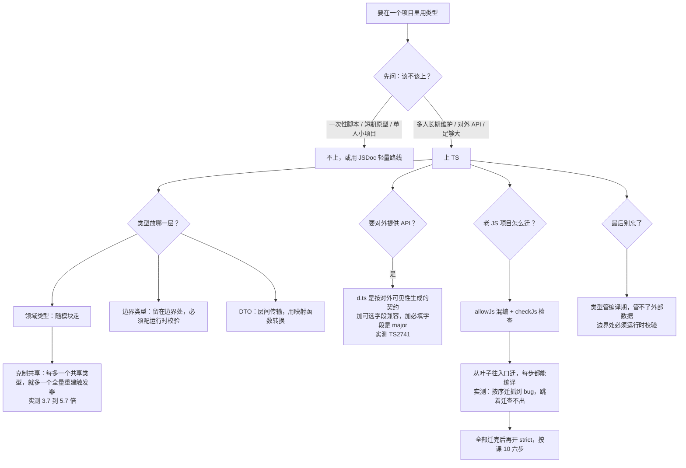

# 第 15 课：大型项目类型架构与选型收束

> 所属阶段：阶段 5《深入与架构》｜ 水平：零基础 TS（学到这里已不再是零基础）
> 本课知识点：类型的分层与放置、公开 API 的类型设计、JS → TS 渐进迁移、决策收束：什么时候不该上 TS
> 故事情节：全书收束——主角面对一个新项目，第一次能回答"**这个项目的类型该上多严？甚至，该不该上 TS？**"
> ✅ 状态：已完成（2026-09-04）｜ 实操环境：Node.js v22.14.0 + TypeScript 7.0.2（**文中所有输出均为本课本机实测**）

## 🎯 本课目标

- 区分领域类型 / 边界类型 / DTO，把类型放在正确的层，避免"类型意大利面"
- 按泛型 API 设计原则设计对外类型，划定类型导出边界，考虑版本兼容
- 用 `allowJs` / `checkJs` 从叶子模块开始迁移老项目，设计 `strict` 逐步开启路径
- 给出"该不该上 TS / 上多严"的判断条件清单，并对比替代方案

## 📌 知识点导航

| # | 知识点 | 关键点 | 状态 |
|---|--------|--------|------|
| 1 | 类型的分层与放置 | 领域类型 / 边界类型 / DTO / 类型放哪一层 / 避免类型意大利面 | ✅ |
| 2 | 公开 API 的类型设计 | 泛型 API 设计原则 / 类型导出的边界 / 版本兼容 | ✅ |
| 3 | JS → TS 渐进迁移 | `allowJs` / `checkJs` / 从叶子模块开始 / `strict` 逐步开启 / 迁移中的取舍 | ✅ |
| 4 | 决策收束：什么时候不该上 TS | 成本收益 / 项目规模与生命周期 / 团队能力 / 替代方案（JSDoc、运行时校验）对比 | ✅ |

## 📦 前置依赖

| 依赖 | 要求 | 来源 |
|------|------|------|
| 全课程前 14 课 | **强依赖**（本课是收束） | 阶段 1-5 ✅ |
| 工程化配置 | 需理解 | 阶段 4 课 10-12 ✅ |

## ⚠️ 事实核查要求（编写本课时必做）

- `allowJs` / `checkJs` / 迁移相关选项在 TS 7 的行为（尤其 JS 支持的若干变化，见官方 7.0 公告「JavaScript Differences」一节）**必须以官方公告为准**
- 迁移策略属"经验性内容"，凡拿不准的一律标 `⏳ 置信度：低`，**不把推测写成最佳实践**
- 本节产出的「判断条件清单」将在 Phase 5 的 `10-场景解法库.md` 中被复用，编写时保持口径一致

### ✅ 核查结果（2026-09-04）

| 核查项 | 结果 |
|--------|------|
| 本机版本 | `tsc --version` → **7.0.2**；`node --version` → **v22.14.0**（与基线一致） |
| 官方公告依据 | TS 7.0 公告「**JavaScript Differences**」一节**逐字引用**于知识点 3（七条行为变更）。其中 Closure 风格函数语法那条，课 12 已实测到 `TS1005`（是语法错误，不只是语义变化） |
| `allowJs` / `checkJs` 实测 | 课 12 `jsdoc/` 项目已实测：`checkJs: true` 报 TS2345 / `checkJs: false` 同一文件 exit=0。本课知识点 3 与知识点 4 再次独立复现 |
| **分层成本实测** | 两个**体量相同**的 monorepo（10 包 × 250 文件）：改一个类型时，集中放置的净重建耗时是分层放置的 **3.7x ~ 5.7x**（**三次独立测量**：4.7x / 5.7x / 3.7x）。绝对值波动不小，**稳定的是「集中放置会放大改动的爆炸半径」这个结构** |
| **破坏性变更实测** | 同一个使用方代码，对 SDK 三个版本各编一遍：加**可选**字段 → exit=0；加**必填**字段 → `TS2741` exit=1 |
| **迁移顺序实测** | 6 个阶段各跑一遍：全 JS=0 错 → 迁叶子=0 错 → 迁中间层=**1 错（bug 浮出）** → 全迁完=0 错 → 开 strict=0 错；**反例「先迁入口」= 0 错（假安全感）** |
| ⏳ 置信度标注 | 「从叶子开始」「类型导出的边界」等**经验性原则**已在正文标注 `⏳ 置信度：中/低`，与实测结论明确区分 |

---

## 第一幕：起源与场景引入

> 🏛️ **起源**：类型该放哪、该不该上 TS —— 这两个问题在 TS 诞生早期根本不存在。
>
> 2012 年 TS 发布时，它的定位是"**给 JS 加上类型标注**"。项目小、人少、类型就写在用到的地方。但十年后，一个 TS 项目可能有几十万行、上百个包、几百人协作。此时出现的新问题是：
>
> - **类型之间开始互相纠缠**：改一个类型，半个项目要重编
> - **类型的"对外承诺"没有边界**：改了内部实现，使用方的代码就崩了
> - **老项目迁不过来**：几十万行 JS，全量重写不现实
>
> 这三个问题，正好是本课前三个知识点。而第四个——「**该不该上 TS**」——是这门课从第一课就埋下的伏笔：课 1 讲过静态类型的**价值**（错误发现左移）与**代价**（认知成本、构建成本）；十五课之后，我们终于有足够的材料来回答"这笔账怎么算"。

**记住一句话就够了**：**前十四课教你"怎么用类型"，这一课教你"怎么不让类型失控"，以及"什么时候干脆别用"。**

好，回到你的项目。

> 🎬 **场景**：你要起一个新项目。团队五个人，预期维护三年，会对外提供一个 SDK。
>
> 你在白板前坐下，需要回答四个问题：
>
> 1. 类型**放哪**？放一个 `types/index.ts` 里大家共用，还是各模块自己带？
> 2. 对外 SDK 的类型**怎么设计**，才能保证将来加功能时不炸使用方？
> 3. 团队还有个 **20 万行的老 JS 服务**，要一起迁吗？从哪开始？
> 4. 以及最根本的——**这个项目，真的该上 TS 吗？**
>
> 一年前你答不上来。今天你要用实测数据来答。

---

## 第二幕：认知冲突

你开始做实验，四个结果里有三个和直觉相反：

```ts
// 实验 A：把类型集中起来「方便复用」，结果改一个类型要重编全项目
//   godtypes（类型集中在 shared）净重建 509~556 ms
//   layered （各包自带类型）    净重建  98~108 ms
//   → 差 3.7 ~ 5.7 倍（三次测量），而两个项目体量完全相同

// 实验 B：SDK 加一个字段，使用方就崩了
//   加可选字段 customerId?  → 使用方 exit=0
//   加必填字段 customerId   → 使用方 TS2741
//   → 「加字段」这件小事，可不可选决定了它是 minor 还是 major

// 实验 C：先迁入口，反而什么都查不出来
//   迁移顺序正确（叶子 → 中间 → 入口）：第 2 步就抓到 1 个 bug
//   反例（跳过叶子先迁入口）        ：0 个报错，bug 安然躺着

// 实验 D：不上 TS 也能拿到同样的类型检查
//   同一段调用错误，JSDoc 路线和完整 TS 路线报的是同一个错：TS2345
```

四个疑惑，正好落在本课的四个知识点上。

---

## 第三幕：层层揭示

> ⚠️ **本课的实测环境**：所有数字都在 `playground/lesson-15/` 下**实际跑出来**。分层成本用「冷启动 → 空转基线 → 改动后增量」三步法测量（课 13 定下的规矩：先测基线再扣）。

### 知识点 1：类型的分层与放置

> 关键点：领域类型 / 边界类型 / DTO / 类型放哪一层 / 避免类型意大利面

#### 一句话定义

**类型意大利面**指的是：类型之间互相引用、没有层次，改一处牵动全身。治它的办法是**按"变化的原因"给类型分层**，并让每一层只依赖它下面那一层。

#### 直觉建立（类比）

**公司的组织架构。**

- **领域类型** = **公司的核心业务规则**（什么是订单、什么算已付款）。变化最慢，一旦改就是大事
- **边界类型** = **前台和快递单**（外部进来的形状：API 请求、数据库行、配置文件）。变化最快，而且**形状不受你控制**
- **DTO** = **部门之间流转的表格**。它是领域类型的"投影"，只带这一次传输需要的字段

**把三种东西混在一起放，就像让前台、快递员和核心业务组挤在一个群里**——任何一条消息都会 @ 到所有人。

> 💡 **类比的边界**：真实公司里跨部门沟通慢一点只是效率低；而**类型耦合的代价是每一次保存都变慢**——下面有实测。

#### 核心原理

**① 三层类型的分工**

| 层 | 是什么 | 变化频率 | 放哪 |
|----|-------|---------|------|
| **领域类型**（Domain） | 业务核心概念：`Order`、`User`、`Money` | 最慢 | **领域层，随模块走** |
| **边界类型**（Boundary） | 系统边界的形状：API 请求/响应、DB 行、配置文件 | 最快（且**不受你控制**） | **边界处定义**（controller / client / repository），**不要渗进领域层** |
| **DTO** | 层与层之间传输用的形状 | 中等 | 边界处定义，用**映射函数**转成领域类型 |

**关键规则**：**边界类型必须配运行时校验**（课 6 的信任边界）。因为"API 返回的对象长什么样"这件事，**编译器根本不知道**——它只能听你的断言。这一点在知识点 4 有实测。

**② 实测：集中放置 vs 分层放置**（`layering/`，**两次独立测量**）

两个**体量完全相同**的 monorepo：10 个包 × 250 个文件。

| | `godtypes`（类型全在 `packages/shared`） | `layered`（各包自带类型） |
|---|---|---|
| 冷启动全量构建 | 291~1205 ms | 161~1254 ms |
| 无改动空转（基线） | ~177~187 ms | ~166~192 ms |
| **改一个类型之后的增量构建** | **628~736 ms** | **274~301 ms** |
| **扣除空转后的净重建耗时** | **451~556 ms** | **98~123 ms** |

**净重建耗时比值：三次独立测量分别为 4.7x / 5.7x / 3.7x（区间 3.7x ~ 5.7x）**

> ⚠️ **这个比值波动不小**（3.7 ~ 5.7）。它依赖机器、磁盘、当时的负载。**别把某个具体数字当结论**——稳定的是下面这条结构性的因果关系。

**为什么会这样**：`godtypes` 里所有包都 `references` 了 `shared`，所以 `shared/dist/index.d.ts` 一变，**全部 10 个包都要重建**——哪怕它们没用到被改的那个 `Entity0`。而 `layered` 里改动被限制在 `p0` 自己。

> 🔍 **这条结论和课 10 / 课 14 是连着的**：课 10 讲项目引用 + `--build` 做增量，课 14 讲 Check 占了 72% 的耗时。**把这两条合起来看就明白了：类型文件的位置决定了增量构建能省下多少 Check 工作。**

**③ 放置原则（可执行的四条）**

1. **领域类型跟着模块走**，不要建一个 `types/index.ts` 大杂烩
2. **边界类型定义在边界处**，并且**在那里做完校验 + 转换**再往里传
3. **跨层只传 DTO**，用显式映射函数（`toDomain(dto)` / `toDTO(domain)`）连接
4. **共享基础类型要极度克制**。真正值得全局共享的通常只有极少数（如 `ID`、`Money`）——**每多一个，就是多一个全量重建触发器**

> ⏳ **置信度：中**。上面四条是社区里相当主流的做法，但"多严格算过度共享"没有客观标准，**请以你自己项目里实测的重建耗时为准**——本课给出的测量脚本可以直接复用。

**④ 怎么自查类型意大利面**

| 信号 | 说明 |
|------|------|
| 有一个 `types.ts` 被几十个文件 import | 它就是重建触发器 |
| 改一个字段要动十几个文件 | 层与层之间没有隔离 |
| 领域层里出现了 `ApiResponse`、`Row` 这类名字 | 边界类型渗进了领域层 |
| 类型之间循环引用 | `A` 引用 `B`、`B` 又引用 `A` |

**诊断命令**：

```powershell
# 谁在 import 这个类型文件？（课 11 用过 traceResolution，这里换个角度）
tsc --noEmit --listFiles          # 看参与编译的文件
tsc --noEmit --explainFiles       # 看每个文件为什么被包含
```

#### 常见误区

1. **"类型集中放方便复用。"** → 复用方便了，但每一次改动都要重编全项目（实测 3.7-5.7 倍）。
2. **"共享类型越多越统一。"** → 每一个共享类型都是一个重建触发器。
3. **"API 返回的类型就是领域类型。"** → 不是。外部形状不受你控制，它必须被校验后转成领域类型。
4. **"DTO 可以直接当领域类型用。"** → 短期省事，长期就是意大利面——两者的变化原因不同。
5. **"项目引用能解决一切。"** → 项目引用只在**项目粒度**做增量；一个项目内部的耦合它管不了。

#### 一句话记住

> **领域类型随模块走、边界类型留在边界并配运行时校验、层间只传 DTO；共享类型每多一个，就多一个全量重建触发器（实测 3.7-5.7 倍）。**

#### 官方文档

- 项目引用（增量构建的基础）：https://www.typescriptlang.org/docs/handbook/project-references.html
- TS 官方 Performance Wiki：https://github.com/microsoft/TypeScript/wiki/Performance

---

### 知识点 2：公开 API 的类型设计

> 关键点：泛型 API 设计原则 / 类型导出的边界 / 版本兼容

#### 一句话定义

**`.d.ts` 就是你的公开契约**。它按"对外可见性"自动生成——内部实现细节不会被写进去，除非它被某个对外签名用到。因此**改一个内部实现可能悄无声息地改变你的公开契约**。

#### 直觉建立（类比）

**餐厅的菜单。**

菜单上写的菜名和配料，是**你对顾客的承诺**。后厨换了锅、改了摆盘方式，顾客不需要知道；但**菜单上多写了一个"必选配菜"，顾客就必须照做**。

- **加可选字段** = 菜单上多了一行"可选配菜"——老顾客照常点单
- **加必填字段** = 菜单上多了一行"必选配菜"——**所有老顾客都得改点单方式**
- **`.d.ts`** = 那份菜单本身

> 💡 **类比的边界**：真实菜单改了，顾客下次来自己会看到；而 `.d.ts` 是**自动生成的**——你可能改了后厨（内部实现），菜单（`.d.ts`）却悄悄跟着变了，**你自己都没意识到**。

#### 核心原理

**① `.d.ts` 是按"对外可见性"生成的**（`publicapi/lib/v1/`，实测）

源码里有一个**没有 export** 的内部类型：

```ts
interface InternalAudit {
  at: string;
  by: string;
}

export function createOrder(input: CreateOrderInput): Order {
  const audit: InternalAudit = { at: new Date().toISOString(), by: "system" };
  void audit;
  return { id: input.id, amount: input.amount, status: "pending" };
}
```

产出的 `dist/index.d.ts`（**逐字实测**）：

```ts
export interface CreateOrderInput {
    id: string;
    amount: number;
    currency?: string;
}
export interface Order {
    id: string;
    amount: number;
    status: "pending" | "paid" | "refunded";
}
export declare function createOrder(input: CreateOrderInput): Order;
```

**`InternalAudit` 没有出现在 `.d.ts` 里。** 因为它只用在函数**体**内部，而函数体会被擦除。

> 🔗 **回扣课 11**：课 11 的 `emit-types/` 实测过另一种情况——那里没导出的 `Mode` **被写进了 `.d.ts`**，因为 `CalcOptions` 这个**对外类型**用到了它。两条合起来才是完整规则：**只有出现在"对外可见的签名"里的类型才会进 `.d.ts`。**

**② 破坏性变更实测**（`publicapi/`，同一个使用方代码对三个版本各编一遍）

使用方代码**从头到尾一行没改**：

```ts
import { createOrder } from "order-sdk";

export const order = createOrder({ id: "A-1", amount: 100 });
```

| SDK 版本 | 改动 | 使用方编译结果 |
|---------|------|---------------|
| `v1` (1.0.0) | — | ✅ exit=0 |
| `v1-safe` (1.1.0) | 加 `customerId?: string`（**可选**） | ✅ **exit=0** |
| `v2` (2.0.0) | 加 `customerId: string`（**必填**） | ❌ **TS2741** exit=1 |

```
src/app.ts(5,34): error TS2741: Property 'customerId' is missing in type
  '{ id: string; amount: number; }' but required in type 'CreateOrderInput'.
```

**同样只是"加一个字段"，可不可选决定了它是 minor 还是 major。**

**③ 版本兼容规则速查**

| 改动 | 兼容性 | 说明 |
|------|-------|------|
| 加**可选**属性 | ✅ 兼容 | 老调用点不受影响 |
| 加**必填**属性 | ❌ 破坏 | 所有老调用点都要改（实测 TS2741） |
| 把可选改成必填 | ❌ 破坏 | 同上 |
| 把必填改成可选 | ✅ 兼容（放宽） | 但会削弱约束 |
| 收窄参数类型 | ❌ 破坏 | 使用方可能传不进去了 |
| 放宽参数类型 | ✅ 兼容 | |
| 收窄返回值类型 | ✅ 兼容（承诺更具体） | 呼应课 14 的协变 |
| 放宽返回值类型 | ❌ 破坏 | 使用方拿到的东西变模糊了 |
| 删除导出 | ❌ 破坏 | |
| 改类型别名（`type`）的**内部结构** | ⚠️ 看情况 | 它是"内联展开"的，可能改变推断结果 |

> 💡 **两条实践建议**：
> - **对外入参优先用可选属性**（给未来留空间），必要的约束用**运行时校验**补，而不是靠必填属性
> - **对外类型用 `interface` 而不是 `type`**：`interface` 可以被使用方 `declare module` 扩展（课 11 讲过声明合并），`type` 不行

**④ 泛型 API 的设计原则**

| 原则 | 说明 |
|------|------|
| **类型参数要出现在参数里** | 否则它只能靠显式指定，推导不出来（课 8） |
| **必要时用 `NoInfer` 划清推断边界** | 防止某个位置的错值被"吸收"进类型（课 13 实测） |
| **需要保住字面量时用 `const` 类型参数** | 免得使用方到处写 `as const`（课 13 实测） |
| **约束要够用就好** | `T extends object` 通常好过 `T extends Record<string, unknown>`（课 9 实测过 interface 没有隐式索引签名） |
| **返回值尽量保留类型信息** | 别返回 `any` / `unknown`，否则整条链断了 |

> ⏳ **置信度：中**。泛型 API 设计这一块主要是**经验性原则**，本课没有对每一条做独立实测。其中 `NoInfer` / `const` 类型参数 / 索引签名三条有课 9、课 13 的实测支撑，其余按工程经验给出。

#### 常见误区

1. **"内部类型不会泄漏到 `.d.ts`。"** → 只要它出现在**对外签名**里就会（课 11 实测过 `Mode`）。
2. **"加一个字段而已，不算破坏性变更。"** → 加必填字段就是（实测 TS2741）。
3. **"`.d.ts` 是我手写的。"** → 它是生成的，你改内部实现它就会跟着变。
4. **"类型用 `type` 和 `interface` 没区别。"** → `interface` 可被使用方扩展，`type` 不行。
5. **"泛型约束越严越好。"** → 过严会让合法用法编译不过（课 9 实测过）。

#### 一句话记住

> **`.d.ts` 是按对外可见性生成的契约；加可选字段是兼容的，加必填字段就是 major（实测 TS2741）。**

#### 官方文档

- 声明文件与 `declaration`：https://www.typescriptlang.org/tsconfig#declaration
- 库作者的类型设计建议（官方 handbook）：https://www.typescriptlang.org/docs/handbook/declaration-files/do-s-and-don-ts.html

---

### 知识点 3：JS → TS 渐进迁移

> 关键点：`allowJs` / `checkJs` / 从叶子模块开始 / `strict` 逐步开启 / 迁移中的取舍

#### 一句话定义

渐进迁移 = **让 `.js` 和 `.ts` 长期共存**，每次只迁一小块，**保证每一步都能编译通过**，最后再统一收紧严格度。

#### 直觉建立（类比）

**老房子翻新。**

你不会把整栋楼一次性拆了重建（那是重写，风险极高）。而是：

1. **先换掉最里间的水管**（叶子模块）——它不依赖任何东西，改了不影响别人
2. 再换中间房间的
3. 最后换门口的（入口）
4. **全部换完之后，才把总水闸开到最大**（`strict: true`）

**顺序为什么重要**：如果你先换门口的管道（入口），里面的老管道还是老样子——**新的接口接不上旧管子，你什么好处都拿不到**。

> 💡 **类比的边界**：真实翻新可以几间房并行；迁移也是——**依赖同一层的模块可以并行迁**，但**跨层必须自下而上**。这一点下面有实测支撑。

#### 核心原理

**① 机制：`allowJs` 与 `checkJs`**

| 选项 | 作用 |
|------|------|
| `allowJs: true` | 让 `.js` 参与编译（**能解析、能被 import**） |
| `checkJs: true` | **检查** `.js` 的类型（关键在这行） |
| JSDoc 注释 | 给 `.js` 提供类型信息的方式 |

**课 12 已实测**：`allowJs: true` + `checkJs: false` → 同一文件 exit=0；`checkJs: true` → 报 TS2345。**`allowJs` 是"看得见"，`checkJs` 才是"查得严"。**

**② 五阶段迁移实测**（`migration/`，每个阶段独立可编译）

依赖方向：`app → middle → leaf`。**埋的 bug**：`app` 把字符串 `"3"` 传给了要求 `number` 的 `lineTotal`。

| 阶段 | 文件构成 | 报错数 | 说明 |
|------|---------|-------|------|
| `stage0-all-js` | 全 `.js`（`checkJs` 开，`strict` 关） | **0** | 起点，什么都查不出 |
| `stage1-leaf-ts` | `leaf.ts` + `middle.js` + `app.js` | **0** | 叶子迁了，但 middle 还没标注 |
| `stage2-middle-ts` | `leaf.ts` + `middle.ts` + `app.js` | **1** | **bug 浮出水面** |
| `stage3-all-ts` | 全 `.ts`（bug 已修） | **0** | 迁移完成 |
| `stage4-strict-on` | 全 `.ts` + `strict: true` | **0** | 收紧严格度，无新增问题 |

`stage2` 报的那条（**实测**）：

```
src/app.js(4,32): error TS2345: Argument of type 'string' is not assignable to parameter of type 'number'.
```

**注意这个顺序**：bug 在 `app` 里，却要到 `middle` 被标注之后才暴露。**因为 `app` 能用到的类型信息，是从它的依赖链底部一层层传上来的。**

**③ 反例：跳过叶子先迁入口**（`order-app-first/`，实测）

把 `app` 单独迁成 `.ts`（`leaf.js`、`middle.js` 都还是未标注的 JS），**同一个 bug 依然躺着**：

```
order-app-first: errors=0  exit=0
```

**对照**：

| 做法 | 报错数 | 结论 |
|------|-------|------|
| 叶子 → 中间 → 入口（到第 2 步） | **1** | **抓到了真 bug** |
| 跳过叶子，先迁入口 | **0** | **假安全感** |

**这就是"从叶子开始"的实测依据**：不是教条，是**依赖方向决定的**——类型信息只能自下而上流动，你在上面先迁，下面没有类型可传给你。

**④ `strict` 什么时候开**

**最后开，不要一开始就开。** 本课 `stage0` ~ `stage3` 都用 `strict: false`，到第 4 步才打开——因为老项目在迁移途中根本满足不了 `strict`。

完整路径对应**课 10 的六步渐进收紧**：

```
第 0 步：strict: false                    ← 先让项目能在 TS 7 下跑起来
   ↓
第 1 步：noImplicitAny（单独开）
   ↓
第 2 步：strictNullChecks（单独开）        ← 报错最多的一档
   ↓
第 3 步：strict: true
   ↓
第 4 步：noUncheckedIndexedAccess
   ↓
第 5 步：exactOptionalPropertyTypes
```

**⑤ ⚠️ TS 7 改了 JS 支持的一批行为**（官方公告「JavaScript Differences」逐字引用）

这是老 JS 项目迁移时**最容易踩的坑**。官方原文：

> "In TypeScript 7.0, we have reworked our JavaScript support to be more consistent with how we analyze TypeScript files. Some of the differences include:
>
> * Values cannot be used where types are expected – instead, write `typeof someValue`
> * `@enum` is not specially recognized anymore – create a `@typedef` on `(typeof YourEnumDeclaration)[keyof typeof YourEnumDeclaration]`.
> * A standalone `?` is no longer usable as a type – use `any` instead.
> * `@class` does not make a function a constructor – use a `class` declaration instead.
> * Postfix `!` is not supported – just use `T`.
> * Type names must be defined within a `@typedef` tag (i.e. `/** @typedef {T} TypeAliasName */`), not adjacent to an identifier (i.e. `/** @typedef {T} */ TypeAliasName;`).
> * Closure-style function syntax (e.g. `function(string): void`) is no longer supported – use TypeScript shorthands instead (e.g. `(s: string) => void`).
>
> Additionally, some JavaScript patterns, like aliasing `this` and reassigning the entirety of a function's `prototype` are no longer specially treated."
> —— Announcing TypeScript 7.0 · JavaScript Differences

**课 12 已实测最后一条**：Closure 风格写法的报错是 `TS1005: '}' expected` —— **它是语法错误，不只是语义变化**。老项目升级 TS 7 时这类报错会成批出现。

**⑥ 迁移中的取舍**

| 取舍 | 建议 |
|------|------|
| 迁到什么程度算完 | **以"这一层用得上类型"为准**，不必强求 100%。叶子和核心逻辑优先，边缘脚本可以一直留着 JS |
| 迁移期要不要加 `any` | 可以用，但**必须配 `@ts-expect-error` 并写明理由**（课 12 的团队约定），且数量只减不增 |
| 要不要一次性改文件扩展名 | **不要**。先 `allowJs` 混编，逐个文件改名，每一步都能编译 |
| 什么时候开 `checkJs` | 越早越好——它让 JS 也被检查，收益立竿见影（课 12 实测） |

> ⏳ **置信度：中**。「从叶子开始」有本课的实测支撑（1 错 vs 0 错）；「迁移到什么程度算完」「`any` 的配额」等属于**经验性建议**，请按自己项目的情况调整。

#### 常见误区

1. **"迁移就是改文件扩展名。"** → 关键是**类型信息要自下而上建立**，光改名拿不到任何好处（实测 `order-app-first` = 0 错）。
2. **"一开始就开 strict。"** → 老项目做不到，会一次冒出几万条报错然后放弃（课 10 的六步）。
3. **"`allowJs` 开了就在检查 JS 了。"** → 还要 `checkJs`（课 12 实测：false 时 exit=0）。
4. **"TS 7 的 JSDoc 支持和以前一样。"** → 改了一批行为，官方列了七条（课 12 实测 Closure 风格直接 TS1005）。
5. **"必须全部迁完才有价值。"** → 不是，每迁一层，下游的检查就强一分（实测 stage2 就抓到 bug）。

#### 一句话记住

> **`allowJs` 让 JS/TS 共存、`checkJs` 让 JS 也被检查；从叶子往入口迁（实测：按序迁抓到 1 个 bug，跳着迁 0 个），全部迁完后再开 `strict`。**

#### 官方文档

- TS 7.0 · JavaScript Differences：https://devblogs.microsoft.com/typescript/announcing-typescript-7-0/
- TS 官方迁移指南（从 JS）：https://www.typescriptlang.org/docs/handbook/migrating-from-javascript.html
- `allowJs` / `checkJs`：https://www.typescriptlang.org/tsconfig#checkJs

---

### 知识点 4：决策收束：什么时候不该上 TS

> 关键点：成本收益 / 项目规模与生命周期 / 团队能力 / 替代方案（JSDoc、运行时校验）对比

#### 一句话定义

TypeScript 是一笔**持续付出的编译期与认知成本**，换取**错误发现左移**。这笔账划算与否，取决于项目规模、生命周期、团队能力，以及——**你有没有 cheaper 的替代方案**。

#### 直觉建立（类比）

**给家装安保系统。**

- **保险柜仓库**（长期、多人、价值高）→ 装全套监控、门禁、报警。成本值得
- **临时样板间**（几周就拆）→ 装了也是白装
- **自家储物间**（单人、东西少）→ 一把锁就够了（**JSDoc 就是那把锁**）
- **但无论装什么**，门口收快递时**你都得亲自验货**——**这是运行时校验，任何门禁系统都替代不了**

> 💡 **类比的边界**：真实安保系统的盲区可以靠加摄像头补；而**类型的盲区（外部数据）永远补不上**——这是课 6 就讲过的信任边界，下面有实测。

#### 核心原理

**① 实测：类型管不住外部数据**（`decision/boundary/`，两个文件都编译通过）

**方案一：只有类型断言**

```ts
interface User { profile: { name: string } }

const payload: unknown = JSON.parse('{"profile": null}');
const user = payload as User;          // 「我保证」—— 编译器信了

console.log("hello, " + user.profile.name);
```

```
编译：✅ exit=0
运行：💥 TypeError: Cannot read properties of null (reading 'name')   exit=1
```

**方案二：类型 + 运行时校验（类型守卫）**

```ts
function isUser(value: unknown): value is User {
  if (typeof value !== "object" || value === null) return false;
  if (!("profile" in value)) return false;
  const profile = (value as { profile: unknown }).profile;
  if (typeof profile !== "object" || profile === null) return false;
  return "name" in profile && typeof profile.name === "string";
}

const payload: unknown = JSON.parse('{"profile": null}');
if (!isUser(payload)) {
  throw new Error("invalid user payload from API");
}
console.log("hello, " + payload.profile.name);
```

```
编译：✅ exit=0
运行：Error: invalid user payload from API        ← 清晰、可控、可观测
```

**同一个输入，两种命运。** 这不是"TS 不够好"，而是**类型的职责边界就在这里**——它管编译期，管不了运行时。

> 🔗 **回扣课 6**：课 6 讲过「信任边界：类型从哪来」。本课的实测把那句话落成了可复现的证据：**`as` 是承诺不是检查（课 11），外部数据必须在边界处用类型守卫真正验证（课 5）。**

**② 实测：替代方案能拿到多少收益**（`decision/`，同一段调用错误）

| 路线 | 写法 | 拦住的错误 |
|------|------|-----------|
| **JSDoc 轻量路线** | `.js` + JSDoc + `checkJs: true` | ✅ `TS2345: Argument of type 'string' is not assignable to parameter of type 'number'.` |
| **完整 TS 路线** | `.ts` + `strict: true` | ✅ **完全相同的 `TS2345`** |

**两行报错一模一样。** 这是个重要发现：**在很多场景下，JSDoc 路线能拿到的类型检查收益与完整 TS 相同**——差别不在"能不能拦住错误"，而在：

| | JSDoc 路线 | 完整 TS 路线 |
|---|---|---|
| 改构建吗 | **不用**（还是 `.js`，现有工具链照跑） | 需要引入编译步骤 |
| 类型表达力 | 够用，但复杂类型写起来很啰嗦 | 完整（泛型、条件类型、映射类型…） |
| 生态支持 | 弱（很多库的类型是为 TS 写的） | 强 |
| 编辑器体验 | 有，但不如 TS 完整 | 最好 |
| 适合 | 老项目、脚本、不想动构建的团队 | 新项目、库、长期维护的项目 |

> ⏳ **置信度：中**。「两条路线拦住的错误相同」是**本例的实测结论**（同一类简单参数错误）。复杂泛型、条件类型等场景下 TS 路线明显更强，别把这个结论推广过头。

**③ 该不该上 TS —— 判断条件清单**

> 📌 本清单将在 Phase 5 的 `10-场景解法库.md` 中复用，口径保持一致。

**先看"算不算得上"**：

| 信号 | 倾向 |
|------|------|
| 代码会被**多人长期维护**（≥2 人，≥1 年） | ✅ 上 |
| 要对外提供 **公共 API / SDK** | ✅ 上（类型即文档，见知识点 2） |
| 项目**足够大**（几千行以上，跨多个模块） | ✅ 上 |
| **一次性脚本、原型、演示、竞赛代码** | ❌ 不上 |
| **生命周期 < 几周** | ❌ 不上 |
| 单人维护且**几百行以内** | ➖ 可不上 |
| 团队里**没人愿意维护类型** | ⚠️ 先小范围试点，别强推 |
| 构建/工具链**不支持**（如某些嵌入式/受限环境） | ➖ 用 JSDoc 路线 |
| 数据来源**全是外部**、形状不稳定 | ✅ 上，但**必须配运行时校验**（见①） |

**再看"上多严"**：

| 项目情况 | 建议档位 |
|---------|---------|
| **新项目** | `strict: true` 全开（TS 7 默认就是），可再考虑 `noUncheckedIndexedAccess` 与 `exactOptionalPropertyTypes`（课 10） |
| **老项目迁移中** | 按课 10 六步渐进；迁移期可先 `strict: false` |
| **对外库 / SDK** | 公开 API 严格，**内部实现可适度放松**（但注意 `.d.ts` 会暴露对外签名用到的内部类型） |
| **脚本 / 工具代码** | `strict: true` 但不必上高阶开关 |

**④ 三条"不上 TS 也很好"的替代方案**

| 方案 | 拿到的收益 | 代价 |
|------|-----------|------|
| **JSDoc + `checkJs`** | 类型检查（本例实测与 TS 相同） | 复杂类型写起来啰嗦；生态支持弱 |
| **运行时校验**（类型守卫 / schema 校验库） | **真正拦住外部数据的错误**（类型做不到） | 要写校验代码；有运行时开销 |
| **测试 + 代码评审** | 拦住逻辑错误 | 拦不住"传错字段类型"这类，且反馈慢 |

**它们不是互斥的**——最稳的组合是：**类型（编译期）+ 运行时校验（边界处）+ 测试（逻辑）**。

**⑤ 一句话总结这套决策**

> **类型系统不是证明系统**（课 6）。它挡住常见错误，不保证消灭所有错误。
> 所以决策问题不是"要不要类型"，而是"**我愿意为多少错误发现左移，付多少编译期与认知成本**"——以及"**我有没有在最关键的地方（外部数据）用对了工具**"。

#### 常见误区

1. **"上了 TS 就不用做运行时校验了。"** → 完全相反。实测：只有类型 → 运行时 `TypeError`；加了守卫 → 清晰的业务错误。
2. **"JSDoc 不如 TS。"** → 本例实测两者拦住的错误**完全相同**；差别在表达力、生态和构建要求。
3. **"TS 一定值得上。"** → 一次性脚本、短期原型、单人小项目通常不值（见判断清单）。
4. **"开了 strict 就万事大吉。"** → strict 管的是类型，管不了外部数据和业务逻辑。
5. **"类型越严越好。"** → 超过团队维护能力的严格度就是负债（课 13 的七步放弃标准）。

#### 一句话记住

> **类型管编译期、运行时校验管外部数据、测试管逻辑——三者互补；该不该上 TS 取决于规模、生命周期与团队，JSDoc 是不改构建就能拿收益的折中路线。**

#### 官方文档

- TS 官方「Should you use TypeScript?」类讨论与迁移指南：https://www.typescriptlang.org/docs/handbook/migrating-from-javascript.html
- `checkJs` / JSDoc 支持：https://www.typescriptlang.org/tsconfig#checkJs

---

## 第四幕：实操验证

回到第一幕白板前的四个问题。逐个用实测数据回答。

**问题 1：类型放哪？**

跑一遍分层测量（`layering/measure.cjs`）：

```
godtypes  改 shared/Entity0 = 628~736 ms（比空转多 451~556 ms）
layered   改 p0/Entity      = 274~301 ms（比空转多  98~123 ms）
净重建耗时比值 = 3.7x ~ 5.7x（三次独立测量）
```

**结论**：领域类型随模块走。集中放一个 `types/index.ts` 的代价是**改一个类型要重编全项目**。

**问题 2：SDK 的类型怎么设计？**

同一个使用方，对三个 SDK 版本各编一遍：

```
v1        (1.0.0)              → exit=0
v1-safe   (1.1.0, 加可选字段)   → exit=0     ✅ 兼容
v2        (2.0.0, 加必填字段)   → TS2741     ❌ 破坏
```

**结论**：对外入参优先用可选属性，必要的约束用运行时校验补。同时记住 `.d.ts` 是**自动生成的**——改内部实现，公开契约可能跟着变。

**问题 3：老 JS 服务从哪开始迁？**

六个阶段各跑一遍：

```
stage0-all-js      0 错
stage1-leaf-ts     0 错
stage2-middle-ts   1 错   ← bug 浮出水面
stage3-all-ts      0 错
stage4-strict-on   0 错
order-app-first    0 错   ← 反例：假安全感
```

**结论**：`allowJs` 混编 → 从叶子往上迁 → 每一步都能编译 → 最后开 `strict`。

**问题 4：该不该上 TS？**

```
外部数据边界：只有类型 → TypeError（崩在半路）
             类型 + 守卫 → Error: invalid payload（可控）
JSDoc vs TS ：拦住的错误完全相同（都是 TS2345）
```

**结论**：按判断清单来。而且**无论上不上 TS，外部数据都必须运行时校验**。

四个知识点的验证结果汇总（均为本课本机实测）：

| 验证项 | 实测结论 |
|--------|---------|
| 分层 vs 集中（冷启动） | 291~1205 ms vs 161~1254 ms —— **体量相同，起点一致** |
| 分层 vs 集中（净重建） | **451~556 ms vs 98~123 ms**，比值 **3.7x ~ 5.7x**（三次独立测量） |
| `.d.ts` 是否泄漏内部类型 | `InternalAudit` **未出现**（它只在函数体内使用） |
| 加可选字段 | 使用方 **exit=0**（兼容） |
| 加必填字段 | 使用方 **TS2741** exit=1（破坏） |
| 迁移阶段报错数 | 0 → 0 → **1** → 0 → 0 |
| 迁移顺序反例 | `order-app-first` = **0 错**（同样的 bug 查不出来） |
| TS 7 的 JS 变更 | 官方七条；Closure 风格实测为 **TS1005**（语法错误） |
| 外部数据（只有类型） | 编译 exit=0，运行 `TypeError: Cannot read properties of null` |
| 外部数据（类型 + 守卫） | 编译 exit=0，运行 `Error: invalid user payload from API` |
| JSDoc vs TS | **同一条 TS2345**，两条路线拦住的错误相同 |

> ✅ **回扣全课程**：这张表里的每一条，都站在前面十四课的肩膀上——课 5 的类型守卫、课 6 的信任边界、课 9 的泛型、课 10 的渐进收紧、课 11 的 `.d.ts`、课 12 的 `checkJs` 与 CI、课 13 的放弃标准、课 14 的 Check 瓶颈。**本课是把它们拧成一股绳。**

---

## 第五幕：体系收束

> 📍 **全局定位**：**本课是阶段 5 的收官，也是整门 TypeScript 课程的收官。**
>
> 回顾这条走了十五课的路：
>
> - **阶段 1**（课 1-3）：类型是什么、不是什么 —— 从此不再把它当成"要背的语法"
> - **阶段 2**（课 4-7）：让编译器看懂你的 `if` —— 类型从死的标注变成随控制流变化的活物
> - **阶段 3**（课 8-9）：给类型装上参数 —— 类型开始可编程
> - **阶段 4**（课 10-12）：类型走出单文件 —— 在工程与 CI 里被强制执行
> - **阶段 5**（课 13-15）：天花板与地板 —— 能做什么、做不到什么、什么时候别干
>
> 对应课程主线里那句话：**一个「类型」在团队里的身份蜕变：从注释 → 到契约 → 到可编程的约束 → 到被治理的对象。**
>
> 而最后一课给出的治理答案是：**分层放置（控制成本）+ 契约边界（控制影响）+ 渐进迁移（控制风险）+ 选型判断（控制投入）。**

**现在你会了什么**：

- 能区分**领域类型 / 边界类型 / DTO**，把类型放在正确的层，并用实测数据说明"集中放置"的代价（3.7-5.7 倍重建）
- 能设计对外类型：知道 `.d.ts` 按对外可见性生成，知道**加可选字段是兼容的、加必填字段是 major**（实测 TS2741）
- 能设计老项目的迁移路径：`allowJs` 混编 → 从叶子往上迁（实测：按序迁抓到 bug，跳着迁查不出）→ 最后开 `strict`
- 能对"该不该上 TS / 上多严"给出有依据的判断，并知道**类型管不住外部数据**，边界处必须运行时校验

**这门课想让你带走的三句话**：

1. **类型是契约，不是装饰。** 它挡住的不是"你写错了字"，而是"你和别人对这段代码的理解不一致"
2. **类型系统不是证明系统。** 它挡住常见错误，不保证消灭所有错误——**`as` 是承诺不是检查，外部数据必须运行时验证**
3. **会写 ≠ 该写。** 类型体操、严格度、乃至 TS 本身，都是**成本与收益的权衡**，不是"越猛越好"

**给未来自己的提醒**：

> 本课的「判断条件清单」口径需在 Phase 5 的 `10-场景解法库.md` 中保持一致。
> 分层测量的绝对值（509ms / 108ms）**高度依赖机器与项目结构**，请用 `layering/measure.cjs` 在自己的项目上重跑；**稳定的结论是"集中放置会让改动波及全部依赖方"这个结构**，不是那个数字。
> 标了 ⏳ 置信度的内容是**经验性原则**，不是实测结论——遇到具体项目请自行验证。

> 🔗 **下一步**：学完全部 5 阶段 49 个知识点后，进入 **Phase 3 结课综合实战项目**——把散装知识点焊成一个完整工程（跨阶段整合 + 设计决策 + 反例对照 + 验收清单）。

---

## 🐞 常见误区

1. **"类型集中放方便复用。"** → 改一个类型要重编全项目（实测 3.7-5.7 倍）。
2. **"领域层可以直接用 API 返回的类型。"** → 外部形状不受你控制，必须校验后转换。
3. **"内部类型不会进 `.d.ts`。"** → 出现在对外签名里就会（课 11 实测过）。
4. **"加一个字段不算破坏性变更。"** → 加必填就是（实测 TS2741）。
5. **"迁移就是改扩展名。"** → 类型信息要自下而上建立，光改名没用（实测 `order-app-first` = 0 错）。
6. **"迁移一开始就要开 strict。"** → 做不到，按课 10 六步来。
7. **"TS 7 的 JSDoc 支持和以前一样。"** → 改了七条，Closure 风格直接是语法错误（实测 TS1005）。
8. **"上了 TS 就不用运行时校验了。"** → 实测：只有类型会崩在半路，加了守卫才可控。
9. **"JSDoc 不如 TS。"** → 本例实测拦住的错误完全相同。
10. **"TS 一定值得上 / 类型越严越好。"** → 都是权衡，按判断清单和课 13 的放弃标准来。

## 一图总结



> 关键记忆点：① 领域/边界/DTO 三层分开，共享类型要克制（实测 3.7-5.7 倍重建）；② `.d.ts` 是自动生成的契约，加必填字段 = major；③ 迁移用 `allowJs` 混编、自下而上、最后开 `strict`；④ 类型管不住外部数据，边界必须运行时校验；⑤ 该不该上 TS 是权衡，JSDoc 是不改构建的折中。

## 课后小测

**Q1**：团队为了方便，把所有类型集中放在 `packages/shared/src/index.ts`，所有业务包都 `references` 它。最可能的后果是什么？

- A. 类型更好维护，编译也更快，因为类型只存一份
- B. 改任何一个类型都会导致所有依赖 shared 的包重建，增量构建基本失效
- C. 只要开了 `skipLibCheck` 就没有影响
- D. 只影响冷启动构建，对增量构建没有影响

<details><summary>答案与解析</summary>

**答案：B**。

实测（`layering/`，两个**体量完全相同**的 monorepo，各 10 包 × 250 文件）：

| | `godtypes`（类型集中在 shared） | `layered`（各包自带类型） |
|---|---|---|
| 冷启动全量构建 | 291~1205 ms | 161~1254 ms |
| 无改动空转（基线） | ~177~187 ms | ~166~192 ms |
| 改一个类型后的增量 | 628~736 ms | 274~301 ms |
| **扣除空转后的净重建** | **451~556 ms** | **98~123 ms** |

**净重建耗时比值：三次独立测量为 4.7x / 5.7x / 3.7x（区间 3.7x ~ 5.7x）**

原因：`shared/dist/index.d.ts` 一变，**所有 references 它的包都要重建**——哪怕它们根本没用到被改的那个 `Entity0`。项目引用（`--build`）只在**项目粒度**做增量，一个共享类型文件把改动的爆炸半径从"一个包"放大到了"全部包"。

A 错：编译**更慢**，不是更快。
C 错：`skipLibCheck` 只是不检查 `.d.ts`（课 11 实测过它的默认值是 `false`），对"要不要重建"毫无影响。
D 错：恰恰相反——冷启动两者差不多（1205 vs 1254），**差异全在增量构建**。

> 这也正好接上课 14 的结论：Check 占了 72% 的耗时，而共享类型文件让"本该被跳过的 Check"全部重来一遍。

</details>

**Q2**：你维护一个对外 SDK，想给 `CreateOrderInput` 加一个 `customerId`。下面说法正确的是？

- A. 加字段都会破坏兼容性，必须发大版本
- B. 加成可选属性（`customerId?: string`）使用方不受影响；加成必填属性会立刻让所有使用方编译失败
- C. 只要内部实现兼容就行，类型改了不影响运行时
- D. 用 `type` 定义就不会有兼容问题，`interface` 才有

<details><summary>答案与解析</summary>

**答案：B**。

实测（`publicapi/`，**同一份使用方代码**对三个 SDK 版本各编一遍，使用方一行没改）：

```ts
import { createOrder } from "order-sdk";
export const order = createOrder({ id: "A-1", amount: 100 });
```

| SDK 版本 | 改动 | 使用方 |
|---------|------|-------|
| v1 (1.0.0) | — | ✅ exit=0 |
| v1-safe (1.1.0) | `customerId?: string` | ✅ **exit=0** |
| v2 (2.0.0) | `customerId: string` | ❌ **TS2741** |

```
src/app.ts(5,34): error TS2741: Property 'customerId' is missing in type
  '{ id: string; amount: number; }' but required in type 'CreateOrderInput'.
```

**同样只是"加一个字段"，可不可选决定了它是 minor 还是 major。**

A 错：加**可选**字段是兼容的。
C 错：类型错误会让使用方**编译失败**，在 CI 门禁下等于交付不了（课 12）。而且别忘了 `.d.ts` 是**自动生成**的——你改内部实现，公开契约可能跟着变。
D 错：无论 `type` 还是 `interface`，加必填属性都是破坏性的。不过对外类型**优先用 `interface`**——它可以被使用方 `declare module` 扩展（课 11 讲过声明合并），`type` 不行。

</details>

**Q3**：下列关于"上 TS"的判断，哪一个是对的？

- A. 上了 TS 就不需要运行时校验了，类型会保证数据形状正确
- B. 外部数据（API 响应、配置文件、用户输入）必须在边界处做运行时校验，类型保证不了
- C. JSDoc 路线完全拿不到类型检查的收益，只有写 `.ts` 才行
- D. 任何项目都该上 TS，而且严格度越高越好

<details><summary>答案与解析</summary>

**答案：B**。

**实测（`decision/boundary/`，两个文件都编译通过，exit=0）**：

```ts
const payload: unknown = JSON.parse('{"profile": null}');
const user = payload as User;                    // 「我保证」
console.log("hello, " + user.profile.name);      // 运行时崩
```

```
只有类型：  💥 TypeError: Cannot read properties of null (reading 'name')
类型 + 守卫：Error: invalid user payload from API     ← 清晰、可控
```

`as` 是**承诺**不是**检查**（课 6 / 课 11 反复强调过）。编译器信了你，然后什么都不做。**外部数据的形状，编译器根本无从知晓**——这是类型的职责边界，不是它的缺陷。

**C 错**：实测同一段调用错误，JSDoc 路线和完整 TS 路线报的是**同一条 TS2345**：

```
route-jsdoc/src/order.js(6,3): error TS2345: Argument of type 'string' is not assignable to parameter of type 'number'.
route-ts/src/order.ts(6,3):    error TS2345: Argument of type 'string' is not assignable to parameter of type 'number'.
```

差别不在"能不能拦住错误"，而在**表达力、生态支持和要不要改构建**（见知识点 4 的对比表）。

**D 错**：一次性脚本、生命周期几周的原型、单人维护的几百行代码，通常不值得（见判断条件清单）。"严格度越高越好"同样不成立——超过团队维护能力的严格度就是负债（课 13 的七步放弃标准）。

> ⏳ 补充：「JSDoc 与 TS 拦住的错误相同」是**本例**的实测结论（简单参数错误）。复杂泛型、条件类型场景下 TS 明显更强，别过度推广。

</details>

## 🚀 下一批接力提示词

> 学完本课后，**复制下面这段文字发给 AI**，即可无缝进入下一批（无需重新描述上下文）：

```
继续学 TypeScript。我的学习档案在 frontend/typescript-core/00-学习档案.md，
刚学完阶段 5《深入与架构》的课 15《大型项目类型架构与选型收束》四个知识点
（类型的分层与放置 / 公开 API 的类型设计 / JS 到 TS 渐进迁移 / 决策收束：什么时候不该上 TS），
至此 5 阶段 15 课 49 个知识点已全部完成。
请按大纲进入 Phase 3：结课综合实战项目。
```

## 🧭 课程导航

⬅️ **上一课**：[课 14：编译器原理与类型检查机制](lesson-14-编译器原理与类型检查机制.md)

➡️ **下一站**：**Phase 3 结课综合实战项目**（跨阶段整合 + 设计决策 + 反例对照 + 验收清单）

📚 **返回目录**：[课程目录](../../02-课程目录.md)

---

## 附：本课示例文件清单

所有示例位于 `playground/lesson-15/`，**全部实跑过**。

| 目录 / 文件 | 用途 | 预期结果 |
|------------|------|---------|
| `layering/gen.cjs` | 生成两个体量相同的 monorepo | `node gen.cjs 10 250` → 各 10 包 × 250 文件 |
| `layering/measure.cjs` | 测量「改一个类型要重建多少」 | 冷启动 → 空转基线 → 改动后增量，输出净重建比值 |
| `layering/godtypes/` | 类型集中在 `packages/shared` | 净重建 451~556 ms |
| `layering/layered/` | 各包自带类型 | 净重建 98~123 ms（比值 **3.7x ~ 5.7x**） |
| `publicapi/lib/v1/` | SDK 1.0.0 | `dist/index.d.ts` **不含**内部类型 `InternalAudit` |
| `publicapi/lib/v1-safe/` | SDK 1.1.0（加**可选**字段） | 使用方 **exit=0** |
| `publicapi/lib/v2/` | SDK 2.0.0（加**必填**字段） | 使用方 **TS2741** exit=1 |
| `publicapi/consumer/` | 同一份使用方代码 × 三个版本 | `tsconfig.v1` / `tsconfig.v1-safe` / `tsconfig.v2` |
| `migration/gen.cjs` | 生成 6 个迁移阶段 | 每个阶段独立可编译 |
| `migration/stage0-all-js/` | 起点：全 JS | **0 错** |
| `migration/stage1-leaf-ts/` | 迁叶子 | **0 错** |
| `migration/stage2-middle-ts/` | 迁中间层 | **1 错**（bug 浮出：TS2345） |
| `migration/stage3-all-ts/` | 全迁完 + 修 bug | **0 错** |
| `migration/stage4-strict-on/` | 打开 `strict` | **0 错** |
| `migration/order-app-first/` | **反例**：跳过叶子先迁入口 | **0 错**（假安全感） |
| `decision/boundary/ts-only.ts` | 只有类型断言 | 编译 exit=0，运行 **TypeError** |
| `decision/boundary/guard.ts` | 类型 + 运行时校验 | 编译 exit=0，运行 **Error: invalid user payload** |
| `decision/route-jsdoc/` | JSDoc 轻量路线 | **TS2345** |
| `decision/route-ts/` | 完整 TS 路线 | **同一条 TS2345** |

复现关键实验：

```powershell
# ① 分层成本（先冷启动，再测空转基线，最后测改动后增量）
cd playground/lesson-15/layering
node gen.cjs 10 250
node measure.cjs 3

# ② 破坏性变更：同一份使用方代码对三个 SDK 版本各编一遍
cd playground/lesson-15/publicapi
npx tsc -p lib/v1 && npx tsc -p lib/v1-safe && npx tsc -p lib/v2
cd consumer
npx tsc -p tsconfig.v1.json       # exit=0
npx tsc -p tsconfig.v1-safe.json  # exit=0
npx tsc -p tsconfig.v2.json       # TS2741

# ③ 渐进迁移：六个阶段各跑一遍，数报错
cd playground/lesson-15/migration
node gen.cjs
foreach ($s in @('stage0-all-js','stage1-leaf-ts','stage2-middle-ts','stage3-all-ts','stage4-strict-on','order-app-first')) {
  npx tsc -p $s
}

# ④ 外部数据边界 + 两条路线对比
cd playground/lesson-15/decision/boundary
npx tsc -p . && node dist/ts-only.js && node dist/guard.js
cd ..
npx tsc -p route-jsdoc
npx tsc -p route-ts
```

> ⚠️ **沙盒说明**：`layering/godtypes/` 与 `layering/layered/` 是 `gen.cjs` 生成的（各约 2500 个文件），已加 `.gitignore` 忽略；
> 想复现就跑 `node gen.cjs 10 250`，不必把生成物提交进版本库。
> 分层测量的**绝对值依赖机器与项目结构**，请在你自己的项目上重跑；稳定的是「集中放置会放大改动的爆炸半径」这个**结构**。
