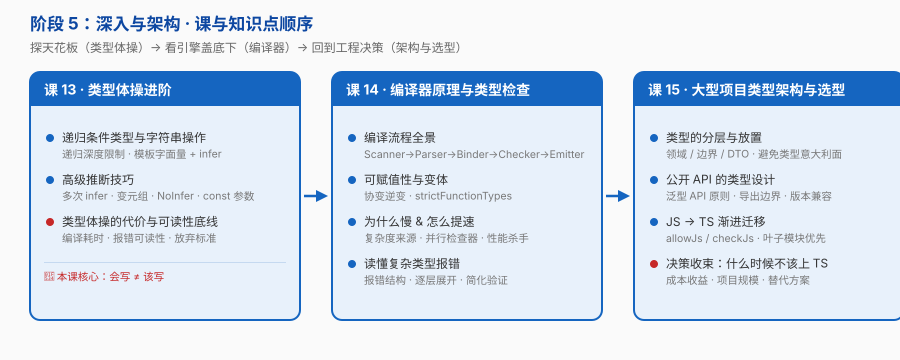

# 阶段 5：深入与架构

> 所属课程：[TypeScript](../01-学习路径总览.md) ｜ 故事章节：**「身份：被治理的对象」——知道它能挡住什么、代价是什么、何时该收手**
> 上一阶段：[阶段 4《工程化与类型声明》](../4-工程化与类型声明/overview.md)
> 规模：3 课 / 11 知识点 ｜ **天花板与地板**

## 🎯 本阶段目标

- 会写进阶类型体操，但更重要的是**知道什么时候不该写**
- 理解编译流程与可赋值性规则，能读懂复杂类型报错并定位根因
- 能为大型项目设计类型分层、为老项目设计渐进迁移路径，并回答"这个项目该不该上 TS"

## 📍 学习重点

- **类型体操的代价是真实的**：编译耗时、报错可读性、团队可维护性。**会写 ≠ 该写**——本阶段的价值一半在于告诉你边界在哪
- **编译流程能解释一切报错**：Scanner → Parser → Binder → Checker → Emitter，知道类型检查发生在哪一步，才能理解"为什么这个报错长这样"
- **可赋值性与变体（协变 / 逆变）是底层规则**：很多"莫名其妙"的报错，根因都在变体规则上
- **收束到决策**：类型放哪一层、公开 API 怎么设计类型、老项目怎么迁、什么项目干脆别上 TS

## ✅ 必须掌握的知识点

| 知识点 | 所属课 | 学完应能 |
|--------|--------|----------|
| 递归条件类型与字符串操作 | 课 13 | 写出递归条件类型；用模板字面量 + `infer` 做字符串处理；知道递归深度限制 |
| 高级推断技巧 | 课 13 | 使用多次 `infer`、变元组推断、`NoInfer`、`const` 类型参数 |
| 类型体操的代价与可读性底线 | 课 13 | 从编译耗时 / 报错可读性 / 团队可维护性三个维度判断"该不该写"，给出放弃标准 |
| 编译流程全景 | 课 14 | 画出 Scanner → Parser → Binder → Checker → Emitter 全流程，指出类型擦除发生在哪一步 |
| 可赋值性与变体 | 课 14 | 用协变 / 逆变解释函数参数与返回值的兼容规则，说清 `strictFunctionTypes` 的作用 |
| 为什么慢 & 怎么提速 | 课 14 | 解释类型检查的复杂度来源、TS 7 的并行检查器原理、常见性能杀手 |
| 读懂复杂类型报错 | 课 14 | 拆解报错结构，逐层展开定位根因，用简化手段验证推断 |
| 类型的分层与放置 | 课 15 | 区分领域类型 / 边界类型 / DTO，把类型放在正确的层，避免类型意大利面 |
| 公开 API 的类型设计 | 课 15 | 按泛型 API 设计原则设计对外类型，划定类型导出边界，考虑版本兼容 |
| JS → TS 渐进迁移 | 课 15 | 用 `allowJs` / `checkJs` 从叶子模块开始迁移，设计 `strict` 逐步开启路径 |
| 决策收束：什么时候不该上 TS | 课 15 | 给出"该不该上 TS / 上多严"的判断条件清单，并对比替代方案 |

## 🗺️ 本阶段路径图

> 课 13 探天花板，课 14 看引擎盖底下，课 15 回到工程决策。**三课共同回答一个问题：类型系统的边界在哪。**

## 本阶段产出

- [x] `lessons/lesson-13-类型体操进阶.md`
- [x] `lessons/lesson-14-编译器原理与类型检查机制.md`
- [x] `lessons/lesson-15-大型项目类型架构与选型收束.md`

## 🔗 下一步

学完全部 5 阶段后，进入 **Phase 3 结课综合实战项目**——把散装知识点焊成一个完整工程（跨阶段整合 + 设计决策 + 反例对照 + 验收清单）。
