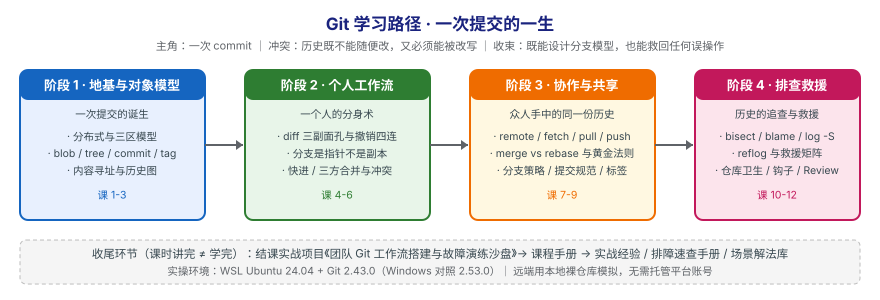

# Git 学习路径总览

> 本文件是活文档，随学习进度动态调整。阶段依赖图统一用 SVG。

## 🎯 学习目标

- **目标类型**：动手实操
- **目标说明**：能独立、有底气地把 Git 用在日常开发与团队协作中——既知道每条命令在做什么，也知道做错了怎么救回来。

> 具体来说，学完应该能做到三件事：
> 1. **说得清**：能解释 commit / branch / merge / rebase 背后的对象模型，而不是背命令。
> 2. **敢操作**：遇到冲突、误提交、误删分支、强推覆盖不再慌，知道该查什么、怎么救。
> 3. **能落地**：能为团队选定并说明一套分支策略与提交规范，并把它固化成钩子与检查。

## 故事主线

- **主角**：一次提交（commit）的一生
- **冲突**：历史既不能随便改，又必须能被改写才能交付
- **收束**：既能设计分支模型，也能用 reflog 把任何误操作救回来

> 整个课程是这条故事线的展开，每个阶段是故事的一个"章节"。

**章节划分**：

| 阶段 | 章节名 | 章节里发生了什么 |
|------|--------|------------------|
| 阶段 1 | 一次提交的诞生 | 主角出生：一次 `git commit` 到底往磁盘里写了什么 |
| 阶段 2 | 一个人的分身术 | 主角学会分身：分支、合并、冲突，全在本地上演 |
| 阶段 3 | 众人手中的同一份历史 | 主角走出本机：推送、拉取、变基，历史开始被别人改写 |
| 阶段 4 | 历史的追查与救援 | 主角遇到危机：东西丢了、历史被覆盖了——怎么找回来 |

## 学习路径图

> SVG 展示四个阶段、各阶段主题与阶段间前置依赖关系。

## 阶段总览

### 阶段 1：地基与对象模型（预计 1 周）

- **目标**：理解 Git 到底存了什么，把"黑盒命令"变成"看得见的对象"。
- **学习重点**：
  - 分布式 ≠ 有服务器：每个克隆都是完整仓库
  - 三区模型：工作区 / 暂存区 / 版本库
  - 四种对象：blob / tree / commit / tag
  - 内容寻址：为什么 SHA-1 就是"内容本身"
- **必须掌握**：能用一个空目录从 `git init` 做出第一次提交，并用 `cat-file` 把这次提交拆到 blob 层。
- **对应课**：课 1、课 2、课 3

### 阶段 2：个人工作流（预计 1 周）

- **目标**：在本机独立完成"改 → 暂存 → 提交 → 分支 → 合并 → 撤销"的完整闭环。
- **学习重点**：
  - diff 的三副面孔与撤销四连的选择
  - 分支是指针不是副本（这是理解后面一切的前提）
  - 快进合并 vs 三方合并，冲突产生的真实原因
- **必须掌握**：能说清 `reset` / `revert` / `restore` 的差别，并能在冲突现场正确解决冲突。
- **对应课**：课 4、课 5、课 6

### 阶段 3：协作与共享（预计 1–2 周）

- **目标**：多人协作时让历史保持可读、可追溯、可回滚。
- **学习重点**：
  - `fetch` 与 `pull` 的区别，远程跟踪分支是什么
  - merge 与 rebase 的取舍与 rebase 黄金法则
  - 分支策略、提交规范、标签与发布
- **必须掌握**：能用本地裸仓库模拟两人协作完整走一遍推送 / 拉取 / 冲突 / 变基，并说明该选 merge 还是 rebase。
- **对应课**：课 7、课 8、课 9

### 阶段 4：排查、救援与工程实践（预计 1–2 周）

- **目标**：从"会用"到"敢用"——出事能定位、能救回、能预防。
- **学习重点**：
  - `bisect` / `blame` / `log -S`：在历史里找东西
  - `reflog`：所有操作的飞行记录仪
  - 误操作救援矩阵与已推送历史的改写边界
  - 仓库卫生、钩子自动化、Code Review 实践
- **必须掌握**：能独立把一次 `reset --hard` 误操作恢复回来，并为团队搭一套提交前检查。
- **对应课**：课 10、课 11、课 12（✅ 全部已讲完）

## 当前进度

- [x] 阶段 1：地基与对象模型（✅ 2026-09-08 完成，3 课 / 9 知识点）
- [x] 阶段 2：个人工作流（✅ 2026-09-08 完成，3 课 / 9 知识点）
- [x] 阶段 3：协作与共享（✅ 已完成：课 7、课 8、课 9，9/9 知识点）
- [x] 阶段 4：排查、救援与工程实践（✅ 2026-09-09 完成，3 课 / 9 知识点）

> 知识点级进度以 [00-学习档案.md](00-学习档案.md) 为准。
> **36 个知识点已全部讲完**，两个收尾环节也已完成：
> - **结课实战项目**（Phase 3）：[wf-lab 工作流沙盘](projects/workflow-lab/README.md)（✅ 68 条断言全通过，复杂度四门槛达标）
> - **实战经验 / 排障速查手册 / 场景解法库**（Phase 5）：✅ 三份全部完成，另有 [final-课程手册.md](final-课程手册.md) 作全课索引

## 实操环境

| 项 | 值 |
|----|-----|
| 主环境 | WSL Ubuntu 24.04，bash 5.2.21，Git 2.43.0 |
| 对照环境 | Windows 11，Git for Windows 2.53.0 |
| 远端演练 | 本地裸仓库（`file://` 协议），无需任何托管平台账号 |
| 上游最新版 | Git 2.55.0（2026-06-29） |

> 平台差异（Windows / macOS / Linux 的换行、路径、权限、大小写）会在涉及处单独标注，不混在正文中。
