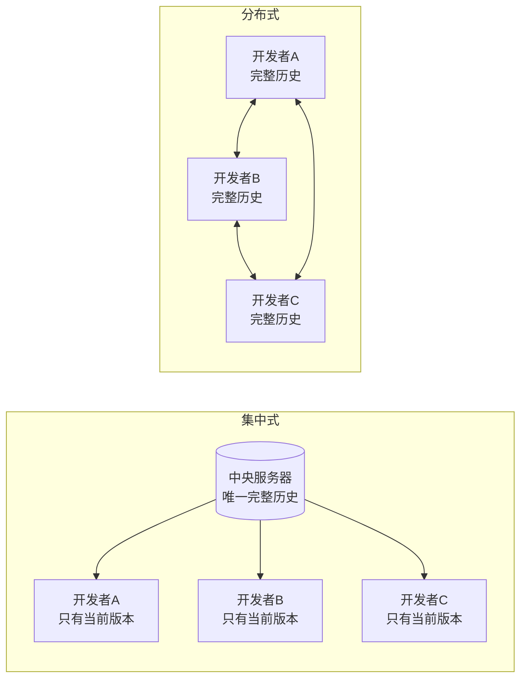
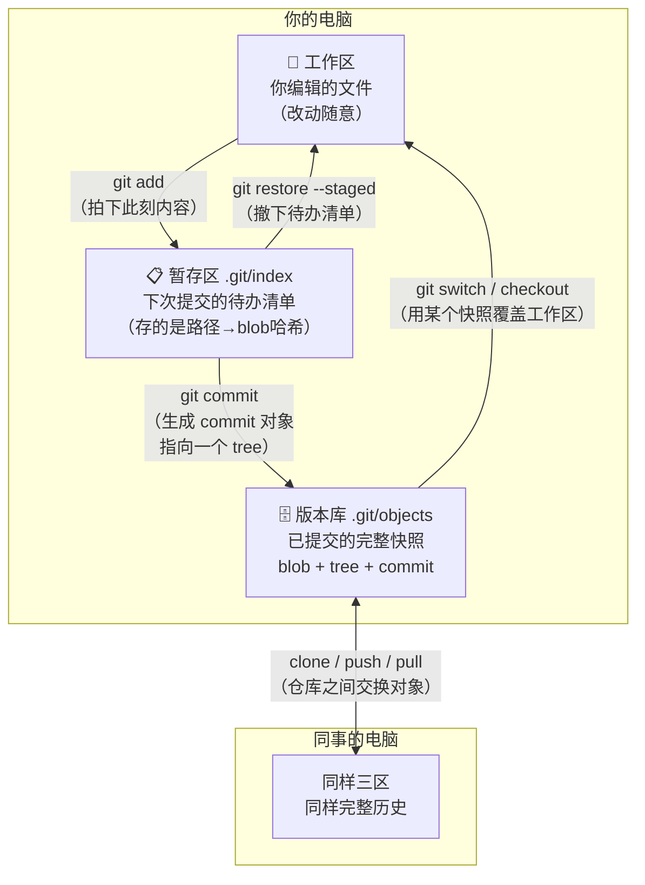

# 第 1 课：版本控制与第一次提交

> 所属阶段：阶段 1《地基与对象模型》｜ 水平：入门 ｜ 本课知识点：Git 是什么（分布式与内容寻址）、三区模型、第一次提交
> 故事情节：**主角的出生**——一个空目录里，第一次 `git commit` 究竟往磁盘写了什么。

## 🎯 本课目标

- 说清 Git 与"集中式版本控制"的本质区别，理解"分布式"到底分布了什么。
- 画出工作区 / 暂存区 / 版本库三区模型，说出 `add` 与 `commit` 各自搬运的是哪一段。
- 用空目录独立完成第一次提交，并看懂 `git status` 输出的四种文件状态。

---

## 第一幕：起源与场景引入

> 🏛️ **起源**：2005 年，Linux 内核开发社区一直在用一款叫 BitKeeper 的分布式版本控制系统，它是**商业软件**，只是免费授权给内核开发者使用。当年 BitKeeper 厂商与社区关系破裂、收回免费授权，Linux 内核一下子失去了趁手的工具。Linus Torvalds 在等了一小段"看看有没有现成方案能顶上"的时间后，于 **2005 年 4 月 3 日**开始自己写一个，4 月 7 日 Git 就完成了自举（能自己管理自己的源代码），6 月 16 日 Linux 2.6.12 发布——这个版本是**用 Git 管理的**。7 月 26 日 Linus 把维护工作交给了 Junio Hamano，此后二十多年 Git 成为全球最主流的版本控制系统。**（核查于 2026-09）**

⚠️ 顺带纠正一个流传很广的说法——"Linus 十天写完了 Git"：**十天指的是从开始写到"能拿来管理内核"的时间，不是全部**。Linus 本人在 2025 年 Git 二十周年的 GitHub 访谈里说得很清楚：整个事情**从 2004 年 11 月或 12 月就开始了**，他花了**约四个月**在脑子里反复推演设计，然后才动手；动手到能用，大约十天。**（核查于 2026-09）**

现在回到你自己身上。

> 🎬 **场景**：你在写一个项目，改了三天，改到最后发现"三天前那个版本才是对的"。
> 你的目录里躺着 `项目-final.doc`、`项目-final2.doc`、`项目-最终版.doc`、`项目-最终版-真的最终.doc`。
> 你不知道哪个是最新的，也不知道 `final2` 和 `最终版` 之间到底差了什么。

这就是"版本控制"要解决的原始问题：**记住每一次改动，并且能随时回到过去**。

但请注意，上面这个场景用任何网盘、任何"文件历史"功能都能部分解决。Git 解决的比这更多——它还要解决**多人同时改同一份代码**、**改了之后怎么合并**、**谁的改动破坏了功能**这些问题。

---

## 第二幕：认知冲突

好，假设你现在决定"我要用版本控制了"。你很自然地会想：

> 那我找一个服务器，把代码存上去，每次改完上传，不就行了？

这确实是一种做法，叫**集中式版本控制**（SVN 就是代表）。它有中央服务器，你本地只有**当前版本**的文件，要看历史、要比较、要回退，都得问服务器。

冲突来了：

> ❓ **问题**：如果服务器挂了、你在飞机上没网、或者你想看三个月前某次改动的完整内容——
> 你就什么都做不了了。更要命的是，**你本地根本没有完整历史，历史只存在于那台服务器上**。

于是 Git 换了个思路：

> 为什么不让**每个人手里都有一份完整的仓库**？包括全部历史、全部分支、全部提交。

听起来很浪费空间？它一点也不浪费——这恰恰引出 Git 最核心的两个设计。而这"两个设计"，就是本课剩下的全部内容。

---

## 第三幕：层层揭示

### 知识点 1：Git 是什么——分布式版本控制与内容寻址

> 本知识点关键点：分布式的真实含义、内容寻址、Git ≠ GitHub、起源事实

#### 一句话定义

Git 是一个**分布式**版本控制系统，它用**内容的哈希值**作为数据的名字（内容寻址），因此每个克隆都天然拥有完整历史。

#### 直觉建立（类比）

想象你和同事各拿了一本**同样的书**，而不是共用一本。

你俩可以各自在书上做笔记、划重点、改错字，互不影响。等联网了，再互相交换"我改了第几页第几行"。如果改的是同一行，就得商量一下听谁的——这就是**合并**。

那"省空间"是怎么做到的？关键在于：这本书不是按"第几页"编号，而是**按内容编号**。

> 💡 **类比的边界**：书的比喻在"编号方式"上不完全准确。真实的 Git 里，被编号的不是"书页"，而是**每一个文件的每一次内容**——而且这个编号是内容本身算出来的哈希，不是人分配的序号。下面马上说到。

#### 核心原理

**第一，分布式到底分布了什么。**

不是"分布式部署了几台服务器"，而是：**每个克隆（clone）都是一个完整仓库**。



图解读：左边断网即瘫痪、历史只有一份；右边任何人掉线都能继续工作，且**任何一个人的硬盘都是完整备份**。

这带来三个直接后果：

- **离线可用**：提交、看历史、建分支、回退，全都能在本地做完，因为历史就在你硬盘上。
- **没有单点故障**：服务器没了，随便谁的仓库克隆一份就回来了。
- **"远端"没有特权**：你同事的仓库、你 U 盘里的仓库、GitHub 上的仓库，在 Git 眼里**地位平等**。所谓"中央仓库"，只是团队约定俗成认的那个，技术上它并不特殊。

**第二，内容寻址——Git 的灵魂。**

普通文件系统按**文件名**找内容；Git 反过来，按**内容**算出一个哈希，拿哈希当名字。

实测一下（WSL Ubuntu，Git 2.43.0，2026-09-08 本机运行）：

```bash
$ printf 'hello git' | git hash-object --stdin
f09e9c379f5fe8f4ce718641c356df87906d87a6

$ printf 'hello git' | git hash-object --stdin
f09e9c379f5fe8f4ce718641c356df87906d87a6

$ printf 'hello git!' | git hash-object --stdin
27706f8151e4c44bb7a129d64b35fff3422d5e3a
```

注意看：内容**完全相同** → 哈希**完全相同**；只多了一个感叹号 → 哈希**面目全非**。

这就是内容寻址的三个直接推论：

1. **自动去重**：两个文件内容一样，Git 只存一份。一百个相同文件只占一份空间——这才是"人人持有完整历史却不占空间"的原因。
2. **完整性保证**：内容被篡改一个字节，哈希立刻对不上，Git 马上能发现。你无法偷偷修改历史。
3. **改名几乎是免费的**：改文件名不影响内容，所以 blob 不变，只变了记录名字的地方。

> 📌 本机实测：哈希算法为 **SHA-1**（`git rev-parse --show-object-format` 输出 `sha1`，40 位十六进制）。
> 新版本 Git 已支持 SHA-256，但本机与绝大多数现存仓库仍是 SHA-1，本讲义一律按 SHA-1 讲。

**第三，Git ≠ GitHub。**

| | 是什么 | 类比 |
|---|--------|------|
| **Git** | 版本控制**系统**，装在你电脑上的软件 | 发动机 |
| **GitHub / GitLab / Gitee** | 代码**托管平台**，跑在服务器上的网站 | 停车场 |

你可以一辈子不用 GitHub 而精通 Git；反过来则不可能。本讲义讲 Git 本身，只有课 7 需要用"远端"时，会用**你自己硬盘上的另一个目录**来模拟——不需要注册任何账号。

#### 示例演示

亲手确认"哈希由内容决定，与文件名无关"：

```bash
$ printf 'hello git' > a.txt
$ printf 'hello git' > b.txt
$ git hash-object a.txt
f09e9c379f5fe8f4ce718641c356df87906d87a6
$ git hash-object b.txt
f09e9c379f5fe8f4ce718641c356df87906d87a6
$ rm a.txt b.txt   # 顺手清掉，别把验证用的临时文件留在项目里
```

# 预期输出：两个文件名不同、内容相同 → 哈希完全一样。
# 这就是"内容与文件名解耦"：文件名不参与哈希计算，只有内容参与。

#### 常见误区

1. **"分布式 = 不需要服务器"**：错。分布式是说**不需要中央权威**，但团队协作仍然需要一个大家都能访问的"约定交汇点"（通常就是 GitHub 或自建 GitLab）。
2. **"我有 GitHub 就等于会 Git"**：错。托管平台只是存放仓库的地方，合并、冲突、回退这些能力都来自 Git 本身。
3. **"Git 存的是每次改动的差异（diff）"**：**这是本课最大的误区**，本课知识点 3 会用实测推翻它。

#### 一句话记住

**Git 是按内容编号的、人手一份完整历史的版本库；GitHub 只是众多存放它的地方之一。**

#### 官方文档

- [Git 官方文档 - 起步：关于版本控制](https://git-scm.com/book/zh/v2/%E8%B5%B7%E6%AD%A5-%E5%85%B3%E4%BA%8E%E7%89%88%E6%9C%AC%E6%8E%A7%E5%88%B6)
- [Git 官方文档 - Git 内部原理](https://git-scm.com/book/zh/v2/Git-%E5%86%85%E9%83%A8%E5%8E%9F%E7%90%86-%E5%BA%95%E5%B1%82%E5%91%BD%E4%BB%A4%E4%B8%8E%E9%AB%98%E5%B1%82%E5%91%BD%E4%BB%A4)

---

### 知识点 2：三区模型——工作区 / 暂存区 / 版本库

> 本知识点关键点：三个区各自是什么、暂存区为什么存在、add 与 commit 各搬哪一段、四种文件状态

#### 一句话定义

Git 把你的项目划成三个区：**工作区**（你编辑的地方）、**暂存区**（下次提交的待办清单）、**版本库**（已提交的历史），所有 Git 命令本质上都是在这三个区之间搬运数据。

#### 直觉建立（类比）

想象你要寄一个包裹。

- **工作区** = 你的房间，东西随便摊着、随便改。
- **暂存区** = 打包台。你把**这次要寄的东西**挑出来放上去，还可以随时拿下来。
- **版本库** = 已寄出的包裹记录，每个包裹有单号，寄出后不能改内容。

关键在那个**打包台**。你可能改了十个文件，但这次只想寄其中三个——暂存区就是让你"挑"的地方。这是 Git 相对很多版本系统独有的中间层。

> 💡 **类比的边界**：真实机制里，暂存区不是一个"放文件副本"的台子，而是一个**索引文件**（`.git/index`），里面记录的是"哪些路径 → 对应哪个 blob 哈希"。它存的是**指针清单**，不是文件本身的拷贝。所以往暂存区加一个 1GB 的文件，并不会让 `.git/index` 变成 1GB。

#### 核心原理


图解读：三个区之间只有这几种搬运方向。**没有"从工作区直接跳到版本库"的箭头**——想提交，必须过暂存区（唯一例外是 `git commit -a`，它帮你自动 add 已跟踪文件的改动，本质仍是先过暂存区）。

三个区的物理位置：

| 区 | 在哪 | 你能直接编辑吗 |
|----|------|----------------|
| 工作区 | 项目目录里除了 `.git` 之外的所有文件 | 能，就是你的代码 |
| 暂存区 | `.git/index` 这一个文件 | 不能，用 `git add` 改它 |
| 版本库 | `.git/objects` 等 | 不能，用 `git commit` 往里写 |

**为什么要暂存区？这是 Git 最容易被误解的设计。**

因为它让"**你改了什么**"和"**你要提交什么**"成为两件独立的事。

实测证明（本机 2026-09-08）：把文件改成两行、`git add` 之后**再**改成三行，然后看状态：

```bash
$ git status -s
MM README.md
```

`MM` 两个字母，左边 M 表示"暂存区相对 HEAD 有改动"，右边 M 表示"工作区相对暂存区还有改动"。**同一个文件，同时存在两个不同版本**——一个在暂存区（2 行），一个在工作区（3 行）。

这时如果你 `git commit`，提交的是**两行的那个版本**，三行的留在工作区：

```bash
$ git commit -m "docs: 补充第二行"
[master eebadc9] docs: 补充第二行
 1 file changed, 1 insertion(+)

$ git status
Changes not staged for commit:
	modified:   README.md
```

看到了吗——**提交之后，第三行仍然没进版本库**。这就是暂存区存在的意义：精确控制"这次提交包含什么"。

#### 示例演示

把四种状态**摆在同一屏**上看（本机实测，照抄即可复现）：

```bash
# 准备一个能同时展示四种状态的局面
mkdir -p ~/git-playground/lesson-01-status && cd ~/git-playground/lesson-01-status
git init
git config user.name  "Git Learner"
git config user.email "learner@example.com"
git config commit.gpgsign false      # 本机 WSL 全局开了 GPG 签名，演练仓库临时关掉

printf 'v1\n' > committed.txt
git add committed.txt && git commit -m "docs: add committed.txt"

printf 'v1-modified\n' > committed.txt   # ① 已提交后又改 → 已修改未暂存
printf 'new\n'       > untracked.txt     # ② 从没 add 过 → 未跟踪
printf 'staged\n'    > staged.txt
git add staged.txt                       # ③ 新文件已 add → 已暂存

$ git status -s
 M committed.txt
A  staged.txt
?? untracked.txt
```

`clean.txt`（已提交且与版本库一致）**不出现**——`status` 只报"有情况的文件"。

**短格式两列的含义**（这是看懂 `git status -s` 的钥匙）：

| 位置 | 含义 |
|------|------|
| 左列 | **暂存区**相对 HEAD 的状态 |
| 右列 | **工作区**相对暂存区的状态 |
| `??` | 未跟踪，两列都是问号 |

所以 `MM` = 暂存区有改动（左 M）+ 工作区还有新改动（右 M）；` M`（空格+M）= 只有工作区改了，暂存区没动。

> ⚠️ **一个新手几乎必踩的坑（本机实测）**：`git commit` 提交的是**整个暂存区**，不是"你最后 add 的那个文件"。
> 实测：先 `git add b.txt`（没提交），之后再 `git add a.txt`，然后 `git commit -m "修改 a.txt"`——
> 结果是 `2 files changed`，**`b.txt` 也一起进去了**，尽管提交信息只提了 a.txt。
> 输出佐证：`439d908 修改 a.txt` 下面挂着 `a.txt | 2 +-` 和 `b.txt | 1 +` 两行。
> **每次提交前跑一遍 `git status`，确认暂存区里到底有什么。**

#### 常见误区

1. **"`git add` 是'开始跟踪这个文件'"**：不准确。`add` 每次执行都是"**把文件此刻的内容**放进暂存区"。改完再 add 一次不是多余动作——它是必须的，因为 add 记录的是**当时的快照**。
2. **"暂存区存了文件的副本，会占双倍空间"**：不会。它存的是路径到 blob 哈希的映射，体积极小——本机实测：1 个文件提交后 `.git/index` 为 **137 字节**，2 个文件为 **209 字节**。顺带一个反证：刚 `git init` 的空仓库里**根本没有 `.git/index` 这个文件**，它是第一次 `git add` 时才被创建的。
3. **"`git commit -a` 能提交所有文件"**：它只自动 add **已被跟踪**文件的改动，新文件（未跟踪）依然要手动 `git add`。

> 📌 **中文用户专属坑（本机实测）**：默认配置下，中文文件名在 `git status` 里会显示成转义串：
> ```bash
> $ git status -s
> ?? "\344\270\255\346\226\207\346\226\207\344\273\266.md"    # 这是"中文文件.md"
>
> $ git -c core.quotepath=false status -s
> ?? 中文文件.md                                              # 这样才正常
> ```
> 原因是 `core.quotepath` 默认为 `true`（本机未设置该值，即取默认）。想一劳永逸：
> `git config --global core.quotepath false`。**只是显示问题，不损坏数据。**

#### 一句话记住

**工作区随便改，暂存区挑着放，版本库只收暂存区那一刻的东西。**

#### 官方文档

- [Git 官方文档 - 记录每次更新到仓库](https://git-scm.com/book/zh/v2/Git-%E5%9F%BA%E7%A1%80-%E8%AE%B0%E5%BD%95%E6%AF%8F%E6%AC%A1%E6%9B%B4%E6%96%B0%E5%88%B0%E4%BB%93%E5%BA%93)

---

### 知识点 3：第一次提交——init / add / commit / status

> 本知识点关键点：init 建了什么、add 的语义、commit 与提交信息、status 的四种状态
> ⚠️ 特别提示：每次提交存的是**完整快照**，不是差异

#### 一句话定义

`git init` 建一个仓库，`git add` 把内容放进暂存区，`git commit` 把暂存区的内容**拍成一张完整快照**永久存进版本库。

#### 直觉建立（类比）

**拍照片，而不是记流水账。**

很多人以为 Git 记的是"我这次改了哪几行"（差异）。不是。Git 每次提交，是把**整个项目此刻的样子**拍一张完整照片存起来。

那为什么 Git 仓库没有变得巨大？因为**没变的文件，照片里只放一个指向上一张照片的指针**（还记得内容寻址吗——内容没变，哈希就没变，于是直接复用同一个 blob）。

> 💡 **类比的边界**：Git 内部为了节省空间，后续会把相似对象做**增量压缩（delta）**打包存储（packfile），这时确实会出现"差异"形态——但那是**存储层的优化**，逻辑模型上每次提交依然是完整快照。你用 `git show` 看到的 diff，是 Git **临时算出来给你看的**，不是它存的东西。

#### 核心原理

**第 1 步：`git init` 到底建了什么。**

实测（WSL Ubuntu，Git 2.43.0）：

```bash
$ git init
hint: Using 'master' as the name for the initial branch. This default branch name
hint: is subject to change. To configure the initial branch name to use in all
hint: of your new repositories, which will suppress this warning, call:
hint:
hint: 	git config --global init.defaultBranch <name>
hint:
hint: Names commonly chosen instead of 'master' are 'main', 'trunk' and
hint: 'development'. The just-created branch can be renamed via this command:
hint:
hint: 	git branch -m <name>
Initialized empty Git repository in /tmp/git-l01/.git/
```

⚠️ **注意这条 hint**：本机默认分支名是 **`master`**（你的环境如果设过 `init.defaultBranch=main` 就是 `main`）。本讲义后续一律照实写 `master`，你若是 `main` 请自行替换——**这不是错误，只是配置不同**。

再看它建出了什么：

```bash
$ ls -a
.  ..  .git

$ find .git -maxdepth 1 | sort
.git
.git/HEAD
.git/branches
.git/config
.git/description
.git/hooks
.git/info
.git/objects
.git/refs
```

**整个仓库的全部秘密，就在这一个 `.git` 目录里。** 删掉 `.git`，你的项目立刻变回一个普通目录——所有历史灰飞烟灭。

其中三个现在就该认识：

- **`.git/objects`**：对象数据库，你提交的所有内容都存在这里（本课唯一的重点目录）
- **`.git/refs`**：引用（分支、标签）存放处
- **`.git/HEAD`**：一个指针文件，内容实测为 `ref: refs/heads/master`——意思是"我当前在 master 分支上"

**第 2 步：`git add` 与 `git commit`。**

完整走一遍第一次提交（本机实测，逐字输出）：

```bash
$ printf '# Hello Git\n' > README.md

$ git status
On branch master

No commits yet

Untracked files:
  (use "git add <file>..." to include in what will be committed)
	README.md

nothing added to commit but untracked files present (use "git add" to track)

$ git add README.md
$ git status -s
A  README.md

$ git commit -m "docs: 添加 README"
[master (root-commit) c7aaaaf] docs: 添加 README
 1 file changed, 1 insertion(+)
 create mode 100644 README.md

$ git status
On branch master
nothing to commit, working tree clean
```

三个细节值得停下来看：

1. **`git add` 成功了却没有任何输出**——Unix 哲学"没消息就是好消息"。别以为它没干活，用 `git status` 确认。
2. **`root-commit`**：这是**根提交**，即仓库的第一次提交，它**没有父提交**。这是整棵历史树的根。
3. **`create mode 100644`**：`100644` 是普通文件；可执行文件是 `100755`。Git 连权限位都记录。

**第 3 步：提交信息不是可选项。**

```bash
$ git commit
# 会打开编辑器（默认通常是 vim/nano），写不出信息就提交不了
$ git commit -m "说明"
# 直接给一行信息
```

`-m` 只适合短信息。好信息写"**为什么改**"，而不是"改了什么"——后者 `git show` 已经能告诉你了。（提交规范的完整讲法在课 9。）

**第 4 步：验证"提交的是完整快照"这一说法。**

看提交之后对象库里到底多了几个文件（本机实测）：

```bash
$ find .git/objects -type f | sort
.git/objects/2a/adf0326c3697a70e049ad2aadc05092d25ce29
.git/objects/ab/690e8789b3cc2136f08269b803d3cebb9da82d
.git/objects/c7/aaaaf042c7d726d458b0e6de8932d7b59e4d25
```

**一次提交产生了 3 个对象**：一个 blob（文件内容）、一个 tree（目录结构）、一个 commit（提交本身）。

注意 `c7/aaaaf...`——`c7aaaaf` 正是上面 `git commit` 输出里那个提交号！目录名取哈希**前两位**，剩下 38 位做文件名。这是为了防止单个目录下文件过多。

blob 和 tree 的具体拆解留给**课 2**，这里你只需要记住结论：**它存的是内容对象，不是一行行的差异。**

最后看一眼提交的原始长相：

```bash
$ git cat-file -p HEAD
tree d087e7ecaade2a24ccc685366cc3fac28291ea90
parent c7aaaaf042c7d726d458b0e6de8932d7b59e4d25
author Git Learner <learner@example.com> 1788855328 +0800
committer Git Learner <learner@example.com> 1788855328 +0800

docs: 补充第二行
```

这就是一次提交的全部内容——**一个 tree 指针 + 一个父指针 + 作者 + 提交者 + 信息**。（这几个字段课 3 会逐个讲透。）

#### 示例演示

证明"不 add 就 commit，什么都不会发生"（本机实测）：

```bash
$ printf '# Hello Git\nSecond line\n' > README.md
$ git status -s
 M README.md

$ git commit -m "试图提交未暂存的改动"
On branch master
Changes not staged for commit:
  (use "git add <file>..." to update what will be committed)
  (use "git restore <file>..." to discard changes in working directory)
	modified:   README.md

no changes added to commit (use "git add" and/or "git commit -a")
```

注意输出：**不是报错，是拒绝并提交失败提示**。`no changes added to commit` 明确告诉你"没有东西被加进这次提交"。

这是新手最常撞的墙：**改了文件就直接 commit，以为会把改动带进去——不会。** 必须先 `add`。

#### 常见误区

1. **"改完直接 commit 就行了"**：不行。改动必须先 `add` 进暂存区（或用 `commit -a`，但它只管已跟踪文件）。
2. **"提交信息随便写"**：三个月后的你（或同事）要靠它判断"这改动能不能删"。认真写。
3. **"`.git` 目录可以删掉重来"**：删掉它 = 删除全部历史。它就是你仓库本身。
4. **"提交存的是差异"**：**本课最需要纠正的一点**。提交存的是完整快照的引用；你看到的 diff 是 Git 算给你看的。

#### 一句话记住

**`add` 挑内容、`commit` 拍快照、不 add 就不进提交；一次提交会往对象库里写 blob + tree + commit 三个对象。**

#### 官方文档

- [Git 官方文档 - 获取 Git 仓库](https://git-scm.com/book/zh/v2/Git-%E5%9F%BA%E7%A1%80-%E8%8E%B7%E5%8F%96-Git-%E4%BB%93%E5%BA%93)

---

## 第四幕：实操验证

**任务**：在 WSL 里从零建一个仓库，完整走一遍"改 → 暂存 → 提交"，并亲手验证三区模型。

### 技术域

```bash
# ---------- 0. 准备（一次性） ----------
mkdir -p ~/git-playground/lesson-01 && cd ~/git-playground/lesson-01

# ⚠️ 本机环境提示：WSL 全局配置了 commit.gpgsign=true（提交需 GPG 签名），
# 在非交互终端里签名会失败并报 "gpg: signing failed: Inappropriate ioctl for device"。
# 演练仓库里临时关掉它（只影响当前仓库，不动全局配置）：
git init
git config user.name  "Git Learner"
git config user.email "learner@example.com"
git config commit.gpgsign false

# ---------- 1. 第一次提交 ----------
printf '# Hello Git\n' > README.md
git status -s                      # 预期：?? README.md
git add README.md
git status -s                      # 预期：A  README.md
git commit -m "docs: 添加 README"   # 预期：[master (root-commit) xxxxxxx] ...
git status                         # 预期：nothing to commit, working tree clean

# ---------- 2. 验证「不 add 不进提交」 ----------
echo "Second line" >> README.md
git status -s                      # 预期： M README.md（注意 M 前有空格）
git commit -m "试试不 add 能不能提交"
# 预期：no changes added to commit —— 提交被拒绝

# ---------- 3. 验证「暂存区是快照，不是标记」 ----------
git add README.md                  # 把 2 行版本放进暂存区
echo "Third line" >> README.md     # 再改成 3 行
git status -s                      # 预期：MM README.md（两个 M！）
git commit -m "docs: 补充第二行"
# 预期：1 file changed, 1 insertion(+) —— 只提交了 2 行那版

git status -s                      # 预期： M README.md —— 第三行还在工作区
echo "=== 验证：版本库里是 2 行，工作区里是 3 行 ==="
git show HEAD:README.md            # 预期：2 行
cat README.md                      # 预期：3 行

# ---------- 4b. 撞一次坑：commit 提交的是「整个暂存区」 ----------
echo "=== 注意：下面这条提交信息只提 b.txt，但 a.txt 也在暂存区里 ==="
printf 'a2\n' >> a.txt && git add a.txt
printf 'b\n'  >  b.txt && git add b.txt
git commit -m "只改了 b.txt"
# 预期输出：2 files changed, ... —— a.txt 也进去了！
git log --oneline --stat -1
# 预期：提交信息下面挂着 a.txt 和 b.txt 两行
# 教训：提交前务必 git status 看一眼暂存区里到底有什么

# ---------- 5. 验证「内容寻址」 ----------
printf 'hello git' | git hash-object --stdin    # f09e9c379f5fe8f4ce718641c356df87906d87a6
printf 'hello git!' | git hash-object --stdin   # 27706f8151e4c44bb7a129d64b35fff3422d5e3a
# 预期：一个感叹号之差，哈希完全不同

# ---------- 5. 看看对象库里多了什么 ----------
find .git/objects -type f | sort
git rev-parse --show-object-format # 预期：sha1
git cat-file -p HEAD               # 看一次提交的原始内容
```

> ✅ **回扣场景**：回到第一幕那个"项目-final2.doc / 最终版.doc"的困境。现在你的目录里永远只有一个 `README.md`——**不会有任何 `-final2` 后缀的文件**，因为所有历史版本都在 `.git` 里，随时可以取回、比较、回退。而且你刚才亲手验证了：Git 记得住"2 行那版"和"3 行那版"的区别，哪怕它们写在同一个文件里。

### 非技术域

不适用（本课为技术域内容）。

---

## 第五幕：体系收束

> 📍 **全局定位**：本课是整个课程的**地基**。你建立了两个心智模型——**分布式**（每人一份完整历史）和**三区模型**（工作区 / 暂存区 / 版本库）。后面 11 课讲的所有命令，本质上都是在这三个区之间、或在两个仓库之间搬运数据。分不清"这条命令搬的是哪一段"，是绝大多数 Git 困惑的根源。
> 🔗 **下一步**：你已经会"制造"一次提交了，但还不知道这次提交**在磁盘上到底是什么**。课 2《Git 的对象数据库》会把它拆开——那 3 个对象（blob / tree / commit）各自长什么样、怎么串起来。拆完你就能回答"为什么 Git 能这么快""为什么改名不占空间"。

---

## 🐞 常见误区

1. **"Git 存的是差异（diff）"**：存的是**完整快照的对象引用**。你看到的 diff 是 Git 临时算出来给你看的。存储层的增量压缩是优化，不改变逻辑模型。
2. **"`git add` 是开始跟踪文件"**：`add` 每次都是"把文件**此刻**的内容放进暂存区"。改完必须再 add 一次。
3. **"改完直接 commit 会带上改动"**：不会，`no changes added to commit`，必须先 add。
4. **"`git commit -m "改 a.txt"` 只会提交 a.txt"**：错。提交的是**整个暂存区**。实测中 `b.txt` 被一起提交了（`2 files changed`）。提交前先 `git status`。
5. **"`.git` 只是个配置目录"**：它是仓库本体。删掉它，历史全没了。
6. **"Git 就是 GitHub"**：Git 是系统，GitHub 是托管平台。两者可以完全独立使用。
7. **"本机默认分支应该是 main"**：本机实测为 `master`（`init.defaultBranch` 未设置）。你的环境可能不同，按实际输出为准。
8. **"中文文件名显示成 `\344\270\255...` 是仓库坏了"**：不是，是 `core.quotepath` 默认为 true 的显示转义，`git config --global core.quotepath false` 即可。

## 一图总结



图解读：中间的暂存区是 Git 独有的设计，它让"改了什么"与"提交什么"解耦；右侧说明"分布式"——别人电脑上有同样一套三区和同样完整的历史。

## 课后小测

**Q1**：关于 Git 与集中式版本控制（如 SVN）的区别，下列说法正确的是？

- A. Git 必须连接中央服务器才能提交
- B. Git 的每个克隆都包含完整历史，SVN 客户端通常只有当前版本
- C. Git 不允许离线工作
- D. 分布式意味着团队不需要任何约定的交汇仓库

<details><summary>答案与解析</summary>

**答案：B**。分布式分布的是"完整仓库"（含全部历史），所以离线可提交、无单点故障。A、C 恰好说反；D 错在"技术上不需要"≠"协作上不需要"——团队仍需约定一个交汇点（如 GitHub），只是它在技术上并无特权。

</details>

**Q2**：你把 `a.txt` 改成两行后执行了 `git add a.txt`，接着又改成三行，然后 `git commit`。提交里包含的是？

- A. 三行版本
- B. 两行版本
- C. 两行和三行都在
- D. 提交失败

<details><summary>答案与解析</summary>

**答案：B**。暂存区存的是 `add` 那一刻的内容快照。第二次修改只落在工作区，不会自动跟进。此时 `git status -s` 会显示 `MM`（暂存区相对 HEAD 变了 + 工作区相对暂存区也变了），提交后第三个版本仍留在工作区。这正是本课实测验证过的。

</details>

**Q3**：在 WSL 里执行 `git commit -m "msg"` 时报错 `gpg: signing failed: Inappropriate ioctl for device`，最可能的原因是？

- A. 提交信息格式不合法
- B. 全局开启了 `commit.gpgsign=true`，而当前非交互终端无法弹出密码输入
- C. `.git` 目录损坏
- D. 磁盘空间不足

<details><summary>答案与解析</summary>

**答案：B**。本机 WSL 全局配置了 `commit.gpgsign=true` 与 `user.signingkey`，GPG 需要交互输入私钥口令，非交互终端无法弹出 pinentry 就报 ioctl 错误。处置：在演练仓库里 `git config commit.gpgsign false`（仅局部生效），或改用可弹出口令框的终端。注意 C、D 的报错信息会完全不同。

</details>

**Q4**：关于 Git 存的是"快照"还是"差异"，下列说法正确的是？

- A. Git 存的是每次改动的行级差异
- B. Git 逻辑上存的是完整快照（tree 指向各文件当前内容的 blob），存储层会做增量压缩优化
- C. 快照模型会让仓库体积随提交次数线性暴涨
- D. `git show` 显示的 diff 就是磁盘上存的内容

<details><summary>答案与解析</summary>

**答案：B**。逻辑模型是快照：tree 指向本次各文件内容的 blob，**未变文件的 blob 直接复用**（内容寻址使哈希不变）。存储层的 packfile 增量压缩是优化，不改变逻辑模型。C 错——复用了 blob 所以不暴涨；D 错——diff 是临时算出来展示的。

</details>

**Q5**：`git init` 之后，下面哪个说法**错误**？

- A. 项目目录下多了一个 `.git` 目录，仓库的全部数据都在里面
- B. `.git/HEAD` 的内容形如 `ref: refs/heads/master`，表示当前所在分支
- C. 删除 `.git` 目录只会清掉配置，历史仍在工作区文件里
- D. 本机默认分支名是 `master`（未设置 `init.defaultBranch` 时）

<details><summary>答案与解析</summary>

**答案：C**。`.git` 就是仓库本体，删掉它历史全部消失，工作区只剩普通文件。A、B、D 均为本机实测结果（HEAD 内容、默认分支名 `master` 都验证过）。

</details>

## 🚀 下一批接力提示词

> 学完本批后，**复制下面这段文字发给 AI**，即可无缝进入下一批（无需重新描述上下文）：

```
继续学 Git。我的学习档案在 git/00-学习档案.md，
刚学完阶段 1《地基与对象模型》的课《版本控制与第一次提交》知识点
「Git 是什么（分布式与内容寻址）」「三区模型」「第一次提交（init/add/commit/status）」，
请按大纲继续讲解下一批知识点（课 2《Git 的对象数据库》）。
```

## 🧭 课程导航

> 本课是阶段 1 第 1 课，暂无上一课。

➡️ **下一课**：[课 2：Git 的对象数据库](lesson-02-Git的对象数据库.md)

📚 **返回目录**：[课程目录](../../../02-课程目录.md)
