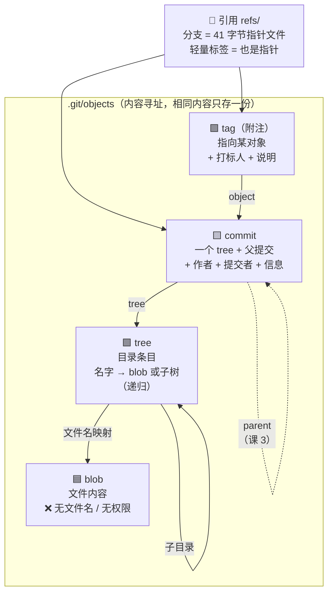

# 第 2 课：Git 的对象数据库

> 所属阶段：阶段 1《地基与对象模型》｜ 水平：入门→进阶过渡 ｜ 本课知识点：四种对象、内容寻址与去重、plumbing 拆解
> 故事情节：**打开黑盒**——把上一课那次提交拆开，看看它到底由几个零件拼成。

## 🎯 本课目标

- 说出 blob / tree / commit / tag 四种对象各自存什么、彼此如何引用。
- 解释"内容与文件名解耦"带来的去重效果，以及为什么分支这么轻。
- 用 `cat-file` / `ls-tree` / `rev-parse` 等 plumbing 命令亲手走完 commit → tree → blob 的拆解路径。

---

## 第一幕：起源与场景引入

> 🏛️ **起源**：上一课留了个尾巴——一次 `git commit` 往 `.git/objects` 里写了 3 个对象，但我们没打开看。
> 本课把那个黑盒撬开。
>
> 这里要先介绍一对 Git 独有的术语：**plumbing（管道命令）** 与 **porcelain（瓷器命令）**。
> `git add` / `git commit` / `git status` 这些日常用的是 porcelain——表面光洁、给人用的。
> 而 `git cat-file` / `git hash-object` / `git ls-tree` 是 plumbing——暴露内部、给脚本用的。
> 这组词是个**厕所比喻**（Linus 的手笔）：porcelain 是看得见的陶瓷洁具（马桶、洗手盆），plumbing 是墙里看不见的管道。**（核查于 2026-09）**
>
> 📌 这个区分有**实际用途**，不只是术语游戏：
> - **plumbing 的输出格式稳定**，适合写脚本解析；
> - **porcelain 的输出面向人类**，版本间可能变化（比如提示文案改了）。
> 所以 Git 贴心地给部分 porcelain 命令加了 `--porcelain` 选项（`git status --porcelain`）——意思是**"输出机器可读的稳定格式"**，专供脚本使用。**（核查于 2026-09）**

> 🎬 **场景**：你刚做完第一次提交，`git log` 显示一条记录。现在有人问你：

> **"这行 `docs: 添加 README` 在磁盘上到底长什么样？"**

你大概会猜："存了 README.md 的内容吧。"然后对方追问三个问题：

1. 文件名 `README.md` 存哪儿了？
2. 如果你有 100 个内容完全相同的文件，磁盘上有 100 份拷贝吗？
3. 为什么 `git branch` 建个分支是瞬间完成的，哪怕仓库有 10 万个文件？

这三个问题，**答案都在同一个地方**——Git 的对象模型。而这套模型只有四种对象，本课全部讲完。

---

## 第二幕：认知冲突

按直觉，版本库应该长这样：一个"提交"记录里，列出"这次改了哪些文件的哪些行"。就像 Word 的修订模式。

于是你自然会以为：

> 版本库 = 一堆"改动记录"的列表，`git show` 显示的 diff 就是磁盘上存的东西。

**上一课已经埋过这个伏笔，本课用实测彻底推翻它。**

冲突在于一个简单的事实：

> ❓ **问题**：如果存的是"改动记录"，那么要看第 100 次提交时的文件内容，
> 就得从第 1 次开始，把 99 次改动**依次重放一遍**。
> 仓库越老，取一个文件就越慢。可实际上 `git checkout` 一个十年前的版本是瞬间完成的——为什么？

答案：因为 Git **根本不存改动**。它存的是**每一个版本的完整内容快照**。

那为什么仓库没有爆炸？这就是本课的核心——**内容寻址**让"完整快照"几乎是免费的。

---

## 第三幕：层层揭示

### 知识点 1：四种对象——blob / tree / commit / tag

> 本知识点关键点：blob 只存内容、tree 存目录结构、commit 指向 tree、tag 给对象起固定名字

#### 一句话定义

Git 的全部数据结构只有四种对象：**blob**（文件内容）、**tree**（目录结构）、**commit**（一次提交）、**tag**（带说明的固定名字），它们通过哈希互相引用，拼出整个版本库。

#### 直觉建立（类比）

想象一栋**图书馆**。

- **blob** = 书页上的**内容本身**。注意：书页上不包含"这本书叫什么、放在哪个书架"。
- **tree** = 每层的**索引卡片**，写着"《三体》→ 第 3 排 A 架"。它负责把名字映射到内容。
- **commit** = 某一时刻**整个图书馆的一张完整清单**（指向一层总索引卡片），外加"上一版清单是哪张"。
- **tag** = 贴在书脊上的**标签**，写着"2026 年度推荐版"——一个固定不变的名字。

关键点在于：**书页（blob）和索引卡片（tree）是分开的**。所以同一页内容可以同时被十本书引用，而磁盘上只有一页纸。

> 💡 **类比的边界**：真实 Git 里 tree 是**递归**的——子目录本身也是一个 tree 对象，由父 tree 引用，形成一棵真正的树（而不像图书馆索引那样是扁平清单）。下面实测能看到 `src` 子目录就是一个独立的 tree。

#### 核心原理

**四种对象一览**（全部为本机实测确认存在）：

| 对象 | 存什么 | **不**存什么 | 本机实测哈希 |
|------|--------|--------------|--------------|
| **blob** | 文件内容（字节流） | 文件名、权限、时间戳 | `b80e322`（`print("hi")`） |
| **tree** | 目录条目：文件名 → blob/tree + 权限 | 文件内容本身 | `212c4fd`（`src` 目录） |
| **commit** | 一个 tree + 父提交 + 作者 + 提交者 + 信息 | 具体改了哪些行 | `f44efec` |
| **tag** | 指向某个对象 + 标签名 + 打标人 + 说明（仅附注标签） | — | `6c51195` |

**实测：逐层拆开一次提交。**

先建一个带子目录的仓库，然后从 commit 一路挖到 blob（WSL Ubuntu，Git 2.43.0，2026-09-08 实测）：

```bash
$ mkdir -p src && printf 'print("hi")\n' > src/app.py
$ printf '# Hello\n' > README.md
$ git add -A && git commit -m "feat: 初始提交"
[master (root-commit) f44efec] feat: 初始提交
 2 files changed, 2 insertions(+)
 create mode 100644 README.md
 create mode 100644 src/app.py
```

**第 1 层：commit 对象。**

```bash
$ git cat-file -t HEAD
commit

$ git cat-file -p HEAD
tree fe8be98790043d40cdeba18037f690c73ea1af03
author Git Learner <learner@example.com> 1788858619 +0800
committer Git Learner <learner@example.com> 1788858619 +0800

feat: 初始提交
```

一个 commit 对象的全部内容就是这些：**一个 tree 指针 + 作者 + 提交者 + 信息**。
（这次是根提交，所以没有 `parent` 行——课 3 会专门讲父指针。）
**注意里面没有任何"改了哪几行"的痕迹。**

**第 2 层：tree 对象——文件名藏在这里。**

```bash
$ git ls-tree HEAD
100644 blob fec56017dc1b1ac87ad6e54e3cb3a20bb8dcc5ab	README.md
040000 tree 212c4fdae26c1d9b9ecee80ce328176151064663	src
```

看到了吗——**文件名 `README.md` 在这一层，不在 blob 里**。格式是：

```
<权限> <类型> <哈希>	<名字>
```

- `100644` = 普通文件；`100755` = 可执行文件；`120000` = 符号链接
- `040000` = 目录（注意：目录的"类型"是 `tree`）

**第 3 层：子目录也是一个 tree——递归结构。**

```bash
$ git ls-tree HEAD:src
100644 blob b80e3222ab264bd7cafb376749bd18814fd66776	app.py

$ git cat-file -t 212c4fdae26c1d9b9ecee80ce328176151064663
tree
```

`src` 目录本身就是一个 tree 对象，被根 tree 引用。**这就是 Git 表达目录层级的方式。**

**第 4 层：blob——只有内容。**

```bash
$ git cat-file -t b80e3222ab264bd7cafb376749bd18814fd66776
blob

$ git cat-file -p b80e3222ab264bd7cafb376749bd18814fd66776
print("hi")
```

**blob 里只有 `print("hi")`，没有 `app.py` 这个文件名、没有权限、没有修改时间。**

**完整引用链**（本机实测的真实哈希）：

```mermaid
flowchart TD
    C["commit f44efec<br/>tree + author + committer + 信息"]
    T["tree fe8be98<br/>根目录"]
    B1["blob fec5601<br/>'# Hello'<br/>（README.md 的内容）"]
    T2["tree 212c4fd<br/>src/ 子目录"]
    B2["blob b80e322<br/>'print(\"hi\")'<br/>（app.py 的内容）"]

    C -->|"tree"| T
    T -->|"README.md"| B1
    T -->|"src"| T2
    T2 -->|"app.py"| B2
```

图解读：commit 只指向一个 tree；tree 把**名字**映射到 blob 或子 tree。**名字存在边上（tree 里），不存在 blob 里。**

**tag 对象：唯一"可选"的那种。**

tag 分两种，这是新手最容易混的地方：

```bash
# ① 轻量标签：只是一个引用（指针文件），不产生对象
$ git tag v1-light
$ git cat-file -t v1-light
commit                          # ← 类型直接是 commit！

# ② 附注标签：产生一个真正的 tag 对象
$ git tag -a v2-anno -m "第二个版本"
$ git cat-file -t v2-anno
tag                             # ← 类型是 tag，独立对象

$ git cat-file -p v2-anno
object 044a153e36356104ea68a3acc55029ab8bb6eb1b
type commit
tag v2-anno
tagger Git Learner <learner@example.com> 1788858620 +0800

第二个版本
```

对比清楚了：

| | 轻量标签 `git tag v1` | 附注标签 `git tag -a v1 -m "..."` |
|---|----------------------|-----------------------------------|
| 产生对象吗 | **不产生**，只是 `.git/refs/tags/` 里一个 41 字节的指针文件 | **产生**一个 tag 对象 |
| `cat-file -t` | `commit` | `tag` |
| 有作者/日期/说明吗 | 无 | 有（tagger + 信息） |
| 能 GPG 签名吗 | 不能 | 能 |
| 用途 | 本地临时标记 | **正式发版**（推荐） |

本机实测两者的哈希也不同：`git rev-parse v2-anno` 得到 tag 对象哈希 `6c51195`，而 `git rev-parse v2-anno^{commit}` 才得到它指向的提交 `044a153`。

> 📌 **发版一律用附注标签**（`git tag -a`）。轻量标签没有作者和说明，事后无法知道"谁在什么时候为什么打了这个标签"。

#### 示例演示

一次性看全四种对象（本机实测）：

```bash
$ echo "--- blob ---";   git cat-file -t $(git rev-parse HEAD:README.md)
blob
$ echo "--- tree ---";   git cat-file -t $(git rev-parse HEAD^{tree})
tree
$ echo "--- commit ---"; git cat-file -t HEAD
commit
$ echo "--- tag ---";    git cat-file -t v2-anno
tag
```

# 预期输出：依次是 blob / tree / commit / tag 四种类型。

#### 常见误区

1. **"blob 里存了文件名"**：**没有**。文件名在 tree 里。这就是为什么"改名"只要改 tree 里那一行——blob 原封不动。
2. **"空目录会被 Git 跟踪"**：**不会**。Git 只跟踪文件。实测：建一个空目录 `emptydir`，`git status -s` 什么也不显示，连 `git add emptydir` 都没有任何效果。（想保留空目录，惯例是放一个 `.gitkeep` 占位文件——但那其实已经不是"空目录"了。）
3. **"commit 存的是改动"**：**不存**。commit 只指向一个完整 tree。`git show` 里的 diff 是 Git 拿两个 tree **当场算出来**给你看的。

#### 一句话记住

**blob 存内容（无名字）、tree 存名字（无内容）、commit 存一次完整快照的入口、tag 给它起个固定名字。**

#### 官方文档

- [Git 官方文档 - Git 对象](https://git-scm.com/book/zh/v2/Git-%E5%86%85%E9%83%A8%E5%8E%9F%E7%90%86-Git-%E5%AF%B9%E8%B1%A1)
- [Git 官方文档 - 底层命令与高层命令](https://git-scm.com/book/zh/v2/Git-%E5%86%85%E9%83%A8%E5%8E%9F%E7%90%86-%E5%BA%95%E5%B1%82%E5%91%BD%E4%BB%A4%E4%B8%8E%E9%AB%98%E5%B1%82%E5%91%BD%E4%BB%A4)

---

### 知识点 2：内容与文件名解耦——内容寻址与去重

> 本知识点关键点：对象名 = 哈希(类型+长度+内容)、相同内容只存一份、哈希即完整性校验、分支极轻

#### 一句话定义

Git 的对象名不是分配的序号，而是**内容本身的哈希**；内容相同则哈希相同，于是相同内容在磁盘上天然只存一份。

#### 直觉建立（类比）

想象一个图书馆，编号规则不是"A 区 3 排 5 号"，而是**把书的内容塞进一台机器，机器吐出一串编号**。

- 两本**内容完全相同**的书 → 机器吐出**同一个编号** → 书架上只需要放一本。
- 有任何一本改动了一个字 → 编号**彻底改变** → 必须新放一本。

听起来很浪费？恰恰相反：**正因为内容没变的东西可以完全复用，"存完整快照"才变得便宜。**

> 💡 **类比的边界**：Git 算哈希时不只是哈希内容，而是哈希 `类型 + 长度 + 内容` 拼起来的整体（下面有实测证据）。这样"字符串 `blob 6`"和"一个长度为 6 的文件"不会被算成同一个东西。

#### 核心原理

**第一，对象名到底怎么算出来的。**

这是我**亲手验证**过的（本机实测，用 Python 解压对象文件后重算哈希）：

```bash
$ printf 'hello\n' > a.txt && git add a.txt
$ B=$(git hash-object a.txt)          # ce013625030ba8dba906f756967f9e9ca394464a
```

对象在磁盘上是 **zlib 压缩**的，解压后看到的是：

```python
b'blob 6\x00hello\n'
#   ↑     ↑    ↑
#  类型  长度  内容（\x00 是分隔符）
```

然后：

```
sha1(b'blob 6\x00hello\n') = ce013625030ba8dba906f756967f9e9ca394464a
```

**与 Git 给出的对象名完全一致（实测 match = True）。**

所以公式是：

> **对象名 = SHA-1( 类型 + " " + 长度 + "\0" + 内容 )**

commit 对象同样成立，实测解压后是 `b'commit 172\x00tree ...\n\nauthor ...'`，重算哈希也与对象名一致。

**顺带解开上一课留的悬念**：对象文件在磁盘上是 `.git/objects/ce/013625...` 这种**前两位做目录名**的布局。现在知道为什么了——内容寻址产生的哈希是完全散乱的，用前两位分桶，避免单个目录下塞进几百万个文件。

**第二，去重是"自动"的，不需要你做任何事。**

实测（本机）：两个文件名不同、内容相同的文件，指向**同一个 blob**：

```bash
$ printf 'same content here\n' > x.txt
$ printf 'same content here\n' > y.txt
$ git add x.txt y.txt
$ git ls-files -s x.txt y.txt
100644 4965e9edcaf375cf802604ad119e739b58602c05 0	x.txt
100644 4965e9edcaf375cf802604ad119e739b58602c05 0	y.txt
                    ↑ 哈希完全相同 —— 磁盘上只有一份内容
```

第三列 `0` 是"暂存阶段"（冲突时才会有 1/2/3，课 6 讲），暂且不管。

反过来，同一个文件名、内容**变了**，就是一个新 blob：

```bash
$ printf 'CHANGED\n' > y.txt && git add y.txt
$ git ls-files -s x.txt y.txt
100644 4965e9edcaf375cf802604ad119e739b58602c05 0	x.txt   # 没变，复用
100644 e9d25acc78c93ae353d489e51a83a5aa4dbd802e 0	y.txt   # 新 blob
```

**第三，"改一个字节"的代价是什么。**

实测：`print("hi")` 改成 `print("hi!")`（多一个字符）：

```bash
$ git hash-object src/app.py        # 改前
b80e3222ab264bd7cafb376749bd18814fd66776
$ git hash-object src/app.py        # 改后（多了一个 !）
9cdf39e25118a1092735cd38309c492642fcc802

# 两个 blob 的实际大小：
$ git cat-file -s b80e322    # 12 字节
$ git cat-file -s 9cdf39e    # 13 字节
```

⚠️ **注意这里有个反直觉的地方**：改一个字节，**确实新存了一份完整内容**（12 → 13 字节，两个 blob 都在）。

那"快照很便宜"从何而来？来自两点：

1. **没变的文件一个字节都不多存**——新 commit 的 tree 直接指向旧 blob 的哈希。
2. **Git 之后会做增量压缩（delta）打包**。实测跑一次 `git gc`，松散对象被打包成 packfile：
   ```bash
   $ git gc
   $ find .git/objects -type f
   .git/objects/pack/pack-ce8b0e7ff032f6ab8ab3de5bec6677c3ac55e004.pack   # 210 字节
   .git/objects/pack/pack-ce8b0e7ff032f6ab8ab3de5bec6677c3ac55e004.idx
   ```
   打包后**对象依然可读**（`git cat-file -p` 照常工作）——**这就是上一课说的"存储层优化不改变逻辑模型"**：逻辑上是快照，物理上可能存成差异，而你对上层完全无感。

**第四，为什么分支这么轻——本课要回答的第三个问题。**

因为分支**只是一个 41 字节的指针文件**（本机实测 `wc -c` 精确为 41 字节：40 个十六进制字符 + 1 个换行符）。

```bash
$ cat -A .git/refs/heads/master        # -A 能看见行尾的换行符
cf0188ba775e0f9ae3e5ea15b7535020caa428c5$   # $ 就是那个换行符
```

就这一行。建分支 = 新建一个这样的文件，**不复制任何对象**。所以哪怕仓库有 10 万个文件、10 年历史，`git branch` 也是瞬间完成。（课 5 会完整展开分支。）

> 📌 **补充实测**：`git gc` 之后 `.git/refs/heads/master` 这个文件会**消失**——引用被打包进了 `.git/packed-refs`。但 `git rev-parse master` 照样返回原哈希，分支完全可用。这是 Git 的引用打包优化，不是数据丢失。

**第五，哈希即完整性校验。**

因为对象名是内容算出来的，所以：

- 内容被篡改一个字节 → 哈希对不上 → Git 立刻发现
- 你**无法悄悄修改历史**——改任何一次提交，它的哈希就变了，而它的子提交记录的父哈希也对不上了，整条链断掉

这就是 Git 历史"不可篡改"的技术根源，不是权限控制，是**密码学**。

#### 示例演示

手工造一个对象，看它是否"悬空"（dangling）：

```bash
$ H=$(printf 'manual blob\n' | git hash-object -w --stdin)
$ echo $H
bb4af66cd55cb40ab7cb2c964b7e7664d23abb98

$ git cat-file -t $H
blob

$ git fsck --dangling
dangling blob 9cdf39e25118a1092735cd38309c492642fcc802
dangling blob bb4af66cd55cb40ab7cb2c964b7e7664d23abb98
```

# 预期：`-w` 真的把对象写进了 `.git/objects`，但它没有被任何 commit 引用，所以是 dangling（悬空）。
# 这是理解课 11「救援」的关键：你以为"删掉"的提交，其实作为悬空对象还在磁盘上，直到 gc 才被回收。

#### 常见误区

1. **"Git 会给相同内容自动做 diff 压缩"**：逻辑层不会。它只是**复用同一个 blob**。真正的增量压缩发生在 `git gc` 打包时，且对上层透明。
2. **"哈希是文件内容直接算的"**：不完全。是 `类型 + 空格 + 长度 + \0 + 内容` 一起算（上面有实测）。
3. **"分支会复制一份代码"**：不会，分支是 41 字节的指针文件。

#### 一句话记住

**内容决定名字，名字相同即内容相同；没变的东西永不重复存，所以完整快照很便宜。**

#### 官方文档

- [Git 官方文档 - Git 对象（对象存储格式）](https://git-scm.com/book/zh/v2/Git-%E5%86%85%E9%83%A8%E5%8E%9F%E7%90%86-Git-%E5%AF%B9%E8%B1%A1)

---

### 知识点 3：用 plumbing 命令亲手拆一个 commit

> 本知识点关键点：cat-file 看内容/类型、hash-object 手工造对象、ls-tree 展开目录、rev-parse 解析引用

#### 一句话定义

plumbing 命令是直接操作 Git 对象数据库的底层命令，用它们可以绕开 porcelain，一层层手工走完从 commit 到 blob 的完整路径。

#### 直觉建立（类比）

porcelain 命令像**自动挡**——踩油门就走，你不用知道变速箱怎么工作。
plumbing 命令像**手动挡 + 打开发动机盖**——你能看见每个齿轮。

日常开车（写代码）用自动挡就行。但要理解"车为什么会动"（Git 为什么这么快/为什么能救回数据），你得打开发动机盖看一眼。

> 💡 **类比的边界**：玩笑归玩笑，plumbing 命令**不是给日常用的**。它们没有 porcelain 的安全检查（比如不会帮你处理冲突、不会更新 index），误用可能造出悬空对象。日常请坚持用 porcelain。

#### 核心原理

**四个核心 plumbing 命令：**

| 命令 | 干什么 | 常用法 |
|------|--------|--------|
| `git cat-file` | 查看对象 | `-t` 看类型、`-p` 看内容、`-s` 看大小 |
| `git ls-tree` | 展开 tree | `git ls-tree HEAD`、`git ls-tree HEAD:src` |
| `git hash-object` | 计算/创建对象 | 不加 `-w` 只算哈希，加 `-w` 写入对象库 |
| `git rev-parse` | 把引用解析成哈希 | `git rev-parse HEAD`、`HEAD^{tree}`、`HEAD:file` |

**`cat-file` 三板斧（本机实测）：**

```bash
$ git cat-file -t HEAD          # 类型
commit

$ git cat-file -p HEAD          # 内容
tree fe8be98790043d40cdeba18037f690c73ea1af03
author Git Learner <learner@example.com> 1788858619 +0800
committer Git Learner <learner@example.com> 1788858619 +0800

feat: 初始提交
```

**`rev-parse` 的语法很值钱——`<rev>^{<type>}` 与 `<rev>:<path>`：**

```bash
$ git rev-parse HEAD               # HEAD 指向的提交
044a153e36356104ea68a3acc55029ab8bb6eb1b

$ git rev-parse HEAD^{tree}        # HEAD 的根 tree
6d426c4f375c64b419ee35e7066cd40b7cae5fa1

$ git rev-parse HEAD:README.md     # HEAD 里 README.md 的 blob
fec56017dc1b1ac87ad6e54e3cb3a20bb8dcc5ab

$ git rev-parse --short HEAD       # 短哈希
044a153

$ git rev-parse --abbrev-ref HEAD  # 当前分支名（写脚本时常用）
master
```

**一个能看全所有对象的利器（本机实测）：**

```bash
$ git cat-file --batch-check --batch-all-objects
044a153e36356104ea68a3acc55029ab8bb6eb1b commit 227
212c4fdae26c1d9b9ecee80ce328176151064663 tree 34
4965e9edcaf375cf802604ad119e739b58602c05 blob 18
6c51195abaf60e8eb05a01db629b61458d389084 tag 147
...
```

三列依次是：**哈希、类型、大小（字节）**。想看仓库里到底有什么，这一条命令就够了。

**走完整条拆解链**（把上面所有命令串起来）：

```bash
# 第 1 步：找到提交
C=$(git rev-parse HEAD)                 # f44efec...

# 第 2 步：提交 → 根 tree
T=$(git rev-parse HEAD^{tree})          # fe8be98...
git cat-file -p "$T"                    # 看到 README.md 和 src

# 第 3 步：根 tree → 子目录 tree
ST=$(git rev-parse HEAD:src)            # 212c4fd...
git cat-file -p "$ST"                   # 看到 app.py

# 第 4 步：子 tree → blob
B=$(git rev-parse HEAD:src/app.py)      # b80e322...
git cat-file -p "$B"                    # print("hi")  ← 终点
```

四步，从一次提交挖到文件内容的字节。**这就是 Git 数据结构的全部。**

> 📌 **`git cat-file -p HEAD:<路径>` 还有一个实用价值**：直接看某个文件在历史某个版本的完整内容，不用 checkout。比如 `git show HEAD:README.md`（课 1 已经用过）。

#### 示例演示

完整可复现的拆解演练（本机实测通过）：

```bash
mkdir -p ~/git-playground/lesson-02 && cd ~/git-playground/lesson-02
git init
git config user.name  "Git Learner"
git config user.email "learner@example.com"
git config commit.gpgsign false      # 本机 WSL 全局开了 GPG 签名，演练仓库临时关掉
git config tag.gpgsign false         # 附注标签也默认签名，一并关掉

mkdir -p src
printf 'print("hi")\n' > src/app.py
printf '# Hello\n'     > README.md
git add -A && git commit -m "feat: 初始提交"

# —— 逐层拆解 ——
git cat-file -t HEAD                 # 预期：commit
git cat-file -p HEAD                 # 预期：tree ... / author / committer / 信息
git ls-tree HEAD                     # 预期：README.md(blob) + src(tree)
git ls-tree HEAD:src                 # 预期：app.py(blob)
git cat-file -p $(git rev-parse HEAD:src/app.py)   # 预期：print("hi")

# —— 内容寻址 ——
printf 'same\n' > x.txt && printf 'same\n' > y.txt && git add x.txt y.txt
git ls-files -s x.txt y.txt          # 预期：两行哈希相同（共用一个 blob）

# —— 对象总览 ——
git cat-file --batch-check --batch-all-objects
```

#### 常见误区

1. **"plumbing 命令可以用来日常操作"**：不建议。它们绕过安全检查（比如不更新 index），容易造出悬空对象。日常用 porcelain。
2. **"`git hash-object` 会把文件加进版本库"**：加 `-w` 才写入对象库；不加只是算出哈希给你看。即便写入，它也是悬空对象，不会被任何提交引用。
3. **"`git rev-parse HEAD^{tree}` 这种语法记不住"**：用 `git help revisions` 可查。日常只需记住 `HEAD^{tree}`（取 tree）和 `HEAD:路径`（取文件）两个。

#### 一句话记住

**`cat-file` 看对象、`ls-tree` 展开目录、`hash-object` 造对象、`rev-parse` 把名字变成哈希。**

#### 官方文档

- [Git 官方文档 - Git 内部原理（底层命令）](https://git-scm.com/book/zh/v2/Git-%E5%86%85%E9%83%A8%E5%8E%9F%E7%90%86-%E5%BA%95%E5%B1%82%E5%91%BD%E4%BB%A4%E4%B8%8E%E9%AB%98%E5%B1%82%E5%91%BD%E4%BB%A4)
- [Git 官方文档 - gitrevisions（引用语法）](https://git-scm.com/docs/gitrevisions)

---

## 第四幕：实操验证

**任务**：亲手把一个 commit 拆成 blob，并验证"内容相同只存一份"与"改一个字节产生新 blob"。

### 技术域

```bash
# ---------- 0. 准备 ----------
mkdir -p ~/git-playground/lesson-02 && cd ~/git-playground/lesson-02
git init
git config user.name  "Git Learner"
git config user.email "learner@example.com"
git config commit.gpgsign false
git config tag.gpgsign false

# ---------- 1. 造一个带子目录的仓库 ----------
mkdir -p src
printf 'print("hi")\n' > src/app.py
printf '# Hello\n'     > README.md
git add -A && git commit -m "feat: 初始提交"
# 预期：2 files changed，create mode 100644 README.md / src/app.py

# ---------- 2. 四步拆解：commit → tree → blob ----------
git cat-file -t HEAD        # 预期：commit
git cat-file -p HEAD        # 预期：tree <hash> + author + committer + 信息
git ls-tree HEAD            # 预期：一行 blob(README.md) + 一行 tree(src)
git ls-tree HEAD:src        # 预期：一行 blob(app.py)
git cat-file -p "$(git rev-parse HEAD:src/app.py)"   # 预期：print("hi")

# ---------- 3. 证明「文件名不在 blob 里」 ----------
B=$(git rev-parse HEAD:src/app.py)
git cat-file -p "$B"        # 预期：只有 print("hi")，没有 app.py 字样
git ls-tree HEAD:src        # 预期：名字 app.py 只出现在这一层

# ---------- 4. 证明「相同内容只存一份」 ----------
printf 'same content here\n' > x.txt
printf 'same content here\n' > y.txt
git add x.txt y.txt
git ls-files -s x.txt y.txt
# 预期：两行第二列哈希完全相同（如 4965e9ed...）

printf 'CHANGED\n' > y.txt && git add y.txt
git ls-files -s x.txt y.txt
# 预期：x.txt 哈希不变（复用），y.txt 哈希变了（新 blob）

# ---------- 5. 证明「改一个字节 = 一个新 blob」 ----------
# ⚠️ 注意：git cat-file -s 只能查询「已在对象库里」的对象。
# 若只是 git hash-object（不加 -w）算出哈希，对象并未写入，cat-file 会报错。
# 所以这里统一加 -w 真正写进对象库：
printf 'print("hi")\n'  > src/app.py
A=$(git hash-object -w src/app.py)      # 12 字节
printf 'print("hi!")\n' > src/app.py    # 多一个 !
B=$(git hash-object -w src/app.py)      # 13 字节
echo "A=$A  B=$B"                        # 预期：两个哈希完全不同
git cat-file -s "$A"                     # 预期：12
git cat-file -s "$B"                     # 预期：13
# 结论：改一个字符 → 一个全新的 blob，存的是完整内容（不是 1 字节差异）

# ---------- 6. 手工造一个悬空对象 ----------
H=$(printf 'manual blob\n' | git hash-object -w --stdin)
git cat-file -t "$H"        # 预期：blob
git fsck --dangling         # 预期：列出 dangling blob（含刚造的这个）

# ---------- 7. 轻量标签 vs 附注标签 ----------
git tag v1-light                          # 轻量
git cat-file -t v1-light                  # 预期：commit（不是 tag！）
git tag -a v2-anno -m "第二个版本"          # 附注
git cat-file -t v2-anno                   # 预期：tag
git cat-file -p v2-anno                   # 预期：object/type/tag/tagger + 说明
# 注意对比：
git rev-parse v2-anno                     # tag 对象自己的哈希
git rev-parse 'v2-anno^{commit}'          # 它指向的提交哈希（两者不同）

# ---------- 8. 对象总览 ----------
git cat-file --batch-check --batch-all-objects
# 预期：每行 = 哈希 + 类型 + 字节大小

# ---------- 9. 看一眼磁盘上的对象（zlib 压缩） ----------
B2=$(git rev-parse HEAD:README.md)
file ".git/objects/${B2:0:2}/${B2:2}"
# 预期：zlib compressed data
# 想看解压后的真面目（需要 python3）：
python3 -c "
import zlib
p='.git/objects/${B2:0:2}/${B2:2}'
print(repr(zlib.decompress(open(p,'rb').read())))
"
# 预期：b'blob 8\x00# Hello\n'  ← 类型+长度+\0+内容

# ---------- 10. 松散对象 → packfile ----------
git gc
find .git/objects -type f | sort
# 预期：松散对象消失，出现 .git/objects/pack/*.pack 与 *.idx
git cat-file -p HEAD        # 预期：照常可读 —— 存储层优化对上层透明
git count-objects -v        # 预期：in-pack 有值，count（松散）为 0

# ⚠️ 一个容易吓一跳的副作用（本机实测）：
ls .git/refs/heads/          # 可能是空的！master 文件不见了
cat .git/packed-refs         # 引用被「打包」到这里了
git rev-parse master         # 但分支照常可用，哈希不变
# 结论：gc 会把引用也打包成 .git/packed-refs，这是正常优化，不是数据丢失。
```

> ✅ **回扣场景**：回到第一幕那三个问题。
> ① **文件名存哪**——存在 tree 里，blob 只有内容（第 3 步实测）。
> ② **100 个相同文件占 100 份吗**——不占，共用一个 blob（第 4 步实测，两个文件内容相同哈希相同）。
> ③ **为什么建分支是瞬间的**——因为分支只是 `.git/refs/heads/` 里一个 41 字节的指针文件，不复制任何对象。
> 而"取一个十年前的文件为什么瞬间完成"也解开了：commit 指向的是**完整 tree**，直接顺着 tree 取 blob 即可，不需要重放历史。

### 非技术域

不适用（本课为技术域内容）。

---

## 第五幕：体系收束

> 📍 **全局定位**：本课打开了黑盒。你现在知道 Git 只有四种对象（blob/tree/commit/tag），知道名字存在 tree 里、内容存在 blob 里、commit 是快照入口、tag 是固定名字。这套模型是**后面 10 课的共同底座**——分支是指针（课 5）、合并是指针运算（课 6）、rebase 是重造 commit 对象（课 8）、历史不可篡改是哈希链（课 11 救援的理论依据），全都建立在这四种对象之上。
> 🔗 **下一步**：你已经能拆开**一次**提交了，但还不会看**多次提交之间的关系**——父指针怎么串成一条链、作者和提交者为什么会不同、`git log --graph` 那些星号到底画的是什么。课 3《提交的身份与历史图》会把提交之间的连线画出来。

---

## 🐞 常见误区

1. **"blob 里存了文件名"**：**没有**，文件名在 tree 里。所以改名不产生新 blob。
2. **"空目录会被 Git 跟踪"**：不会，Git 只跟踪文件。实测 `git add emptydir` 毫无效果。
3. **"改一个字节只会多存一个字节的差异"**：**逻辑层会多存一个新 blob**（实测 12 字节 → 13 字节的全量内容）。真正的增量压缩是 `git gc` 打包时的优化，对上层透明。
4. **"轻量标签和附注标签差不多"**：差很多。轻量只是一个 41 字节指针文件（`cat-file -t` 显示 `commit`），附注才是真的 tag 对象（带作者、日期、说明，可签名）。发版用附注。
5. **"哈希是对文件内容直接算的"**：是 `类型 + 空格 + 长度 + \0 + 内容` 一起算（实测解压对象后重算，match=True）。
6. **"分支会复制一份代码"**：不会，分支是 41 字节的指针文件。
7. **"plumbing 命令可以日常用"**：不建议，它们绕过安全检查，容易造悬空对象。

## 一图总结



图解读：右下角是**引用层**——分支和轻量标签都只是指向对象的指针文件，所以极轻。四种对象之间通过哈希互相引用，构成一棵从 commit 出发可达的**有向无环图**。

## 课后小测

**Q1**：关于 blob 对象，下列说法正确的是？

- A. blob 里存了文件名、权限和内容
- B. blob 只存文件内容，文件名和权限记录在 tree 里
- C. blob 存的是相对于上一版本的差异
- D. 两个内容相同但文件名不同的文件会产生两个不同的 blob

<details><summary>答案与解析</summary>

**答案：B**。实测 `git cat-file -p <blob>` 只输出 `print("hi")`，没有 `app.py`；而 `git ls-tree HEAD:src` 里才有 `app.py` 这个名字。A 错在文件名归属；C 错在 blob 存的是完整内容；D 错——内容相同则哈希相同，两个文件共用一个 blob（本课第 4 步实测）。

</details>

**Q2**：你执行 `git tag v1` 和 `git tag -a v2 -m "发布"` 分别创建了标签，下列说法正确的是？

- A. 两者都产生 tag 对象
- B. `git cat-file -t v1` 输出 `commit`，`git cat-file -t v2` 输出 `tag`
- C. 轻量标签可以 GPG 签名，附注标签不能
- D. 两者都记录了打标人与时间

<details><summary>答案与解析</summary>

**答案：B**。实测：轻量标签 `v1-light` 的 `cat-file -t` 是 `commit`（它只是 `.git/refs/tags/` 里的指针文件）；附注标签 `v2-anno` 是 `tag`（真正的对象，含 tagger 与说明）。C 说反了；D 只有附注标签才有。

</details>

**Q3**：仓库里有一个 `README.md`，你把它改了一个字符后提交。下列说法**错误**的是？

- A. 会产生一个新的 blob 对象
- B. 其他未修改的文件不会产生新 blob，新 tree 直接复用它们的哈希
- C. 磁盘上只会多存这一个字符的差异，不会存完整内容
- D. `git gc` 之后对象可能被打包成 packfile 并做增量压缩

<details><summary>答案与解析</summary>

**答案：C**。逻辑层上，改一个字符就产生一个**完整的新 blob**（实测 `print("hi")` 12 字节 → `print("hi!")` 13 字节，两个全量 blob 都在）。"只存差异"是 `git gc` 打包时存储层的优化（D 正确）。A、B 也正确——未变文件复用原 blob，这正是"快照很便宜"的原因。

</details>

**Q4**：关于 Git 对象名的计算，本机实测验证过的公式是？

- A. SHA-1(文件内容)
- B. SHA-1(类型 + " " + 长度 + "\0" + 内容)
- C. SHA-1(文件名 + 文件内容)
- D. 由 Git 按顺序分配的递增序号

<details><summary>答案与解析</summary>

**答案：B**。实测用 Python 解压对象文件得到 `b'blob 6\x00hello\n'`，重算 `sha1()` 与 Git 给出的对象名 `ce013625...` 完全一致（match=True）。A 漏了头部；C 错——文件名不参与（所以改名不改 blob）；D 是集中式系统的做法。

</details>

**Q5**：下列说法**错误**的是？

- A. 建一个分支只是创建 41 字节的指针文件，不复制任何对象
- B. 空目录不会被 Git 跟踪，`git add emptydir` 没有任何效果
- C. commit 对象里记录了"这次改了哪些行"
- D. `git cat-file --batch-check --batch-all-objects` 可以列出所有对象的哈希、类型与大小

<details><summary>答案与解析</summary>

**答案：C**。commit 只记录一个 tree 指针、父提交、作者、提交者和信息，**不含任何行级改动**。你看到的 diff 是 Git 拿两个 tree 当场算的。A 正确（`.git/refs/heads/master` 实测只有一行哈希）；B 正确（本课实测）；D 正确（本课演示过）。

</details>

## 🚀 下一批接力提示词

> 学完本批后，**复制下面这段文字发给 AI**，即可无缝进入下一批（无需重新描述上下文）：

```
继续学 Git。我的学习档案在 git/00-学习档案.md，
刚学完阶段 1《地基与对象模型》的课《Git 的对象数据库》知识点
「四种对象：blob/tree/commit/tag」「内容与文件名解耦：内容寻址与去重」「用 plumbing 命令亲手拆一个 commit」，
请按大纲继续讲解下一批知识点（课 3《提交的身份与历史图》）。
```

## 🧭 课程导航

⬅️ **上一课**：[课 1：版本控制与第一次提交](lesson-01-版本控制与第一次提交.md)

➡️ **下一课**：[课 3：提交的身份与历史图](lesson-03-提交的身份与历史图.md)

📚 **返回目录**：[课程目录](../../../02-课程目录.md)
