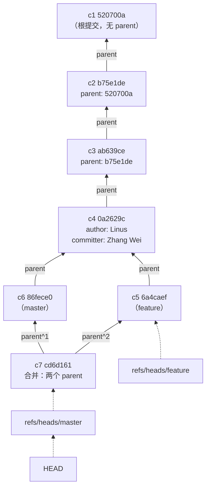

# 第 3 课：提交的身份与历史图

> 所属阶段：阶段 1《地基与对象模型》｜ 水平：入门→进阶过渡 ｜ 本课知识点：提交的完整身份、历史是有向图、配置与身份
> 故事情节：**连点成线**——上一课拆开了单个提交，本课看提交之间怎么连成一张图。

## 🎯 本课目标

- 说清 author 与 committer 为什么会不同，以及父指针如何把提交串成链与图。
- 用 `git log` 的各种视图（`--graph` / `--oneline` / 区间 / 搜索）读懂任意仓库的历史结构。
- 配好 config 三层身份，写出正确的 `.gitignore`，并知道它最常见的失效场景。

---

## 第一幕：起源与场景引入

> 🏛️ **起源**：上一课我们把**一个** commit 拆到了 blob。但 commit 对象里还留了两行没讲：

```
parent 520700a24bcbbd249fd09881011ada0ea5f855fe
author Zhang Wei <zhangwei@example.com> 1788859332 +0800
committer Zhang Wei <zhangwei@example.com> 1788859332 +0800
```

> 为什么有 `author` **和** `committer` 两个身份？`parent` 只有一个吗？
> 本课回答这两个问题——它们正是 Git 历史能分叉、能合并、能被"转交"的根源。

> 🎬 **场景**：你接手一个别人的仓库，跑 `git log`，看到这样一段：

```
*   73ad6c5 (HEAD -> master) merge
|\
| * 84edfa1 (feature) empty2
* | a931a64 empty3
|/
* e7a0fc9 empty1
```

你认得每一行的 `git log` 输出，但面对这段东西，三个问题冒出来：

1. `\` 和 `|` 这些斜线画的是什么？为什么有的提交缩进了一格？
2. 有好几个提交的作者和提交者不一样，这是不是配置错了？
3. 别人给你的仓库，你的 `user.name` 该配在哪一层才不会污染别人的提交记录？

**这三个问题，正好对应本课的三个知识点。**

---

## 第二幕：认知冲突

按直觉，版本库的历史应该像**一条时间线**——一件事情做完，再做下一件，排成一列。

于是你自然会以为：

> 历史 = 按时间先后排成的一条直线，`git log` 从上往下就是"第一件事、第二件事、第三件事"。

**这个直觉在单人单分支时几乎总是对的，所以很难发现问题。**

冲突在这里：

> ❓ **问题**：如果历史是一条直线，那么 `git log` 输出的顺序就该等于时间顺序。
> 可实际跑一下就会发现——**同一秒内的两个提交，谁在上谁在下是不确定的**。
> 上面那段输出里，`empty2`（84edfa1）和 `empty3`（a931a64）是**同一时刻**产生的两个提交，
> 它们分属两条分支。直线模型要怎么表示"同时存在两件事"？

答案：**Git 的历史根本不是线，是一张有向无环图（DAG）**。时间是它的附属属性，不是它的结构。

而"图"这个结构，完全由本课要讲的**父指针**决定。

---

## 第三幕：层层揭示

### 知识点 1：提交的完整身份——作者 / 提交者 / 时间戳 / 父指针

> 本知识点关键点：author 是"谁写的"、committer 是"谁提交的"、父指针决定图结构、合并提交有两个父

#### 一句话定义

一个 commit 的完整身份由**一个 tree + 零到多个父指针 + 作者（含时间）+ 提交者（含时间）+ 信息**构成；其中 author 记录"谁写的代码"，committer 记录"谁把它放进版本库"。

#### 直觉建立（类比）

想象一篇**学术论文**。

- **author（作者）** = 真正做研究、写论文的人。署名荣誉归他。
- **committer（提交者）** = 把论文投稿、送进期刊系统的人。可能是作者本人，也可能是导师代投。

大多数时候两者是同一个人。但**代投**这个场景真实存在——比如你用邮件把补丁发给维护者，维护者帮你合入：论文署名是你，投稿动作是他。

Git 把这两件事分开记录，是为了**同时保全"荣誉"和"责任"**。

> 💡 **类比的边界**：论文只有一次"投稿"。而 Git 里一次提交被 rebase / cherry-pick 到新位置时，**author 不变、committer 变成执行操作的人**——相当于论文被转载了一次，署名不变，转载者另有其人。这是本课最重要的推论。

#### 核心原理

**第一，一个 commit 对象的完整字段。**

这是本机实测的一个**合并提交**的真实内容（Git 2.43.0，2026-09-08）：

```bash
$ git cat-file -p HEAD
tree c0c5ebd21c994797f2160f09200660db367ea996
parent 86fece0c0487e849118baa8315e2ecacd874f584
parent 6a4caef674c450a9080d98627dc704d12d9f6c7d
author Zhang Wei <zhangwei@example.com> 1788859332 +0800
committer Zhang Wei <zhangwei@example.com> 1788859332 +0800

c7: 合并 feature
```

字段逐个说：

| 字段 | 含义 | 备注 |
|------|------|------|
| `tree` | 这次提交的完整快照入口 | 必须有，且只有一个 |
| `parent` | 父提交 | **0 个（根提交）、1 个（普通）、2 个及以上（合并）** |
| `author` | 作者 + 时间戳 + 时区 | 代码是谁写的 |
| `committer` | 提交者 + 时间戳 + 时区 | 谁执行了提交动作 |
| 空行后的内容 | 提交信息 | — |

**第二，父指针的三种形态（全部实测）。**

**① 根提交：没有 parent 行。**

```bash
$ git cat-file -p 520700a
tree 1bef487d18fe7a0e5896782d55649014e42e6dc1
author Zhang Wei <zhangwei@example.com> 1788859332 +0800
committer Zhang Wei <zhangwei@example.com> 1788859332 +0800

c1: 初始
```

没有 `parent`——这就是"第一个提交"在数据结构上的定义。**用 `git rev-list --max-parents=0 HEAD` 可以找出根提交。**

**② 普通提交：一个 parent。**

```bash
$ git cat-file -p b75e1de
tree 24563c9e05a53252b62b4c19557132b56b664f34
parent 520700a24bcbbd249fd09881011ada0ea5f855fe      # ← 指向根提交
author Zhang Wei <zhangwei@example.com> 1788859332 +0800
committer Zhang Wei <zhangwei@example.com> 1788859332 +0800

c2: 修改 a
```

**③ 合并提交：两个 parent。**

```bash
$ git rev-parse HEAD^1
86fece0c0487e849118baa8315e2ecacd874f584     # 第一父（master 侧）
$ git rev-parse HEAD^2
6a4caef674c450a9080d98627dc704d12d9f6c7d     # 第二父（feature 侧）
```

**这是"分叉"在数据结构上的全部秘密**：一个提交有两个父，历史就不再是线，而是图。

**第三，author 与 committer 什么时候会不同。**

正常情况下两者完全相同：

```bash
$ git log -1 --format='%an <%ae> / %cn <%ce>'
Zhang Wei <zhangwei@example.com> / Zhang Wei <zhangwei@example.com>
```

用环境变量强制指定 author 后（**本机实测**）：

```bash
$ GIT_AUTHOR_NAME="Linus" GIT_AUTHOR_EMAIL="linus@example.com" \
    git commit -m "c4: 代他人提交（模拟）"
[master 0a2629c] c4: 代他人提交（模拟）
 Author: Linus <linus@example.com>
 1 file changed, 1 insertion(+), 1 deletion(-)

$ git cat-file -p HEAD
tree 0d3f3952e8d078c1d07bfc4a132549067406b5e5
parent ab639ce520905cfc2f778715c3e328a4ee40557f
author Linus <linus@example.com> 1788859332 +0800              # ← 作者
committer Zhang Wei <zhangwei@example.com> 1788859332 +0800    # ← 提交者

c4: 代他人提交（模拟）
```

看到了：`author` 是 Linus，`committer` 是我。**这就是 Linux 内核那种"邮件列表收补丁"工作流的真实写照**——Linus 合入别人的补丁时，author 是原作者，committer 是 Linus。

**第四，两个时间戳。**

author 和 committer 各有**独立**的时间戳。用 `%ad`（author date）和 `%cd`（committer date）分别查看：

```bash
$ git log -1 --format='作者时间 %ad%n提交时间 %cd'
作者时间 Tue Sep 8 17:22:12 2026 +0800
提交时间 Tue Sep 8 17:22:12 2026 +0800
```

平时两者相同。**但 `rebase` / `cherry-pick` / `amend` 之后，author 时间保留原值、committer 时间变成"现在"**——这就是课 8 讲 rebase 时会反复出现"作者时间很旧、提交时间很新"现象的原因。

**第五，时间戳的两段含义。**

`1788859332 +0800` 这个格式是：**Unix 时间戳 + 时区偏移**。

```bash
$ git log -1 --format='%ad' --date=raw
1788859332 +0800
```

⚠️ **注意**：Git 存的是**作者本地时区**（`+0800`），不是 UTC，也不是查看者的时区。所以跨时区协作时，你看到的"时间"是对方那个时区的墙钟时间。想统一看 UTC 用 `--date=iso-strict` 或设置 `--date=local`。

#### 示例演示

一条命令看全身份四要素：

```bash
$ git log -1 --format=fuller
commit cd6d161fe1127b2925ad33b4d748608430917938
Merge: 86fece0 6a4caef
Author:     Zhang Wei <zhangwei@example.com>
AuthorDate: Tue Sep 8 17:22:12 2026 +0800
Commit:     Zhang Wei <zhangwei@example.com>
CommitDate: Tue Sep 8 17:22:12 2026 +0800

    c7: 合并 feature
```

`--format=fuller` 是少数**同时显示 author 和 committer** 的内置格式，排查身份问题时首选它。

#### 常见误区

1. **"author 和 committer 不同是配置错了"**：不是。这是**特性**——代提交、rebase、cherry-pick 都会产生这种差异。
2. **"合并提交只有一个父"**：有两个（`^1` 和 `^2`）。这是判断"这是不是合并提交"的可靠方法。
3. **"时间戳是 UTC"**：不是，存的是作者本地时区。

#### 一句话记住

**author 是"谁写的"、committer 是"谁提交的"、parent 决定历史是线还是图。**

#### 官方文档

- [Git 官方文档 - git-commit-tree（提交对象格式）](https://git-scm.com/docs/git-commit-tree)
- [Git 官方文档 - 提交对象](https://git-scm.com/book/zh/v2/Git-%E5%86%85%E9%83%A8%E5%8E%9F%E7%90%86-Git-%E5%AF%B9%E8%B1%A1)

---

### 知识点 2：历史是一条有向图——git log 的各种视图

> 本知识点关键点：--graph 画拓扑、区间语法 A..B 与 A...B、搜索（--grep/--author/-S）、--all 与 --first-parent

#### 一句话定义

Git 的历史是由父指针连成的**有向无环图（DAG）**，`git log` 的各种参数本质是"在这张图上按不同规则遍历、投影和过滤"。

#### 直觉建立（类比）

把历史想成一张**地铁线路图**。

- **提交** = 车站。
- **父指针** = 轨道，方向从新站指向老站（**有向**）。
- **分叉** = 一条线分成两条；**合并** = 两条线汇成一条。
- **永远不能成环**（**无环**）——因为时间是单向的，没有提交能成为自己的祖先。

`git log` 就是"从某站出发，沿轨道能走到哪些站"，而 `--graph` 是**把这张图画出来**。

> 💡 **类比的边界**：地铁图上每条线都有名字。Git 的分支名只是**贴在车站上的便签**，会移动、会撕掉，而车站（提交）和轨道（父指针）是永久的。课 5 会专门展开这一点。

#### 核心原理

**第一，`--graph` 到底画的是什么。**

本机实测（一次真实的分叉+合并）：

```bash
$ git log --graph --oneline --all --decorate
*   73ad6c5 (HEAD -> master) merge
|\
| * 84edfa1 (feature) empty2
* | a931a64 empty3
|/
* e7a0fc9 empty1
```

逐个符号解释：

| 符号 | 含义 |
|------|------|
| `*` | 一个提交 |
| `|` | 一条竖向的"边"（父子连线） |
| `\` `/` | 分叉与汇合 |
| `|\` | **合并提交**：竖线 + 分出两条 |
| `(HEAD -> master)` | `--decorate` 显示的引用标签 |
| 缩进 | 不同的"轨道"（分支线） |

**关键洞察**：`empty2` 和 `empty3` 在图上处于**同一层的两条轨道**——它们在结构上**没有先后关系**，尽管时间上可能相差几毫秒。这就是为什么直线模型会失效。

**第二，默认排序不是纯时间序。**

实测对比（同一仓库）：

```bash
$ git log --oneline           # 默认
cd6d161 c7: 合并 feature
86fece0 c6: master 分支
6a4caef c5: feature 分支
...

$ git log --oneline --topo-order
cd6d161 c7: 合并 feature
6a4caef c5: feature 分支          # ← 顺序变了！
86fece0 c6: master 分支
...
```

`--topo-order` 保证**父提交一定排在子提交之后**（拓扑序），而默认排序在时间上更"新"。想看清楚结构，用 `--topo-order --graph`。

**第三，区间语法——本课最实用的一组。**

| 语法 | 含义 | 典型用途 |
|------|------|----------|
| `A..B` | 在 B 但不在 A 的提交 | "这个分支比 master 多了什么" |
| `A...B` | A 和 B 的**对称差**（双方各自独有） | 配合 `--left-right` 看两边差异 |
| `^A` 或 `A^` | 排除 A 及其祖先 | `A^@` 表 A 的所有父 |
| `HEAD~3` | 往前数 3 代（沿第一父） | 回退定位 |
| `HEAD^2` | 第二父 | 取合并的"被合入方" |

实测 `A...B`：

```bash
$ git log --oneline --left-right master...feature
< cd6d161 c7: 合并 feature      # < 只在 master
< 86fece0 c6: master 分支
```

`<` 表示只在左边（master），`>` 表示只在右边。**这是合并前"看看两边各自做了什么"的标准姿势。**

**第四，搜索历史。**

```bash
$ git log --oneline --grep="feature"      # 按提交信息搜
cd6d161 c7: 合并 feature
6a4caef c5: feature 分支

$ git log --oneline --author="Linus"      # 按作者搜
0a2629c c4: 代他人提交（模拟）

$ git log --oneline -S"feature work"      # 按内容搜（pickaxe）
6a4caef c5: feature 分支
```

`-S` 是**按代码内容**搜索——找出"哪次提交让 `feature work` 这个字符串出现或消失"。课 10 会用它做 bug 溯源，本课先混个脸熟。

**第五，几个高频组合拳。**

```bash
$ git log --oneline --all              # 所有分支（默认只显示 HEAD 可达的）
$ git log --oneline --first-parent     # 只沿第一父走，看"主干"演进
$ git log --graph --oneline --all --simplify-by-decoration   # 只显示有引用的提交
```

`--simplify-by-decoration` 实测效果——把中间过程全部折叠，只留"有名字"的节点：

```bash
* 73ad6c5 merge
* 84edfa1 empty2
* 54ae372 track app.log
```

想快速看清"这个仓库有几个里程碑"，用它。

**第六，`-p` 与 `--stat` 看改动。**

```bash
$ git log -1 -p        # 显示完整 diff
$ git log -1 --stat    # 只显示改动统计
```

⚠️ **实测注意**：对**合并提交**，`git log -1 -p` **默认不显示任何 diff**（因为有两个父，Git 不知道该跟谁比）。想看合并引入了什么，用 `git show -m` 或 `git log -1 -p -m`。（课 6 会详细处理。）

**第七，`shortlog` 看贡献。**

```bash
$ git shortlog -sn HEAD
     3	Zhang Wei
     1	Linus
```

`-s` 只显示统计、`-n` 按提交数排序、`-e` 附带邮箱。不带 `-s` 则按人列出每条提交信息。

⚠️ **实测踩坑**：`git shortlog -s`（**不带 revision range**）**输出为空**——它在这个 Git 版本里不会默认使用 `HEAD`。必须显式写 `git shortlog -s HEAD`。

#### 示例演示

接手陌生仓库的标准"破冰"五连：

```bash
git log --graph --oneline --all --decorate    # ① 看清拓扑结构
git log -1 --format=fuller                    # ② 看最近一次提交的完整身份
git shortlog -sn HEAD                         # ③ 有谁在贡献（⚠️ HEAD 不能省）
git log --oneline --first-parent              # ④ 主干演进脉络
git log --oneline --left-right master...HEAD  # ⑤ 我和 master 的差异
```

> ⚠️ 第 ③ 条的 `HEAD` **不能省**：实测 `git shortlog -s` 不带 revision range 时**输出为空**。

#### 常见误区

1. **"`git log` 默认能看到所有分支"**：**不能**。默认只显示从 `HEAD` 可达的提交。想看全部加 `--all`。
2. **"`git log` 的顺序等于时间顺序"**：不完全。默认排序在分叉时不可靠，看结构请加 `--graph --topo-order`。
3. **"合并提交的 diff 丢了"**：没丢，是 `-p` 对多父提交默认不显示，用 `-m`。

#### 一句话记住

**历史是有向无环图，`--graph` 画结构、区间语法切子集、搜索参数做过滤。**

#### 官方文档

- [Git 官方文档 - gitrevisions（区间语法）](https://git-scm.com/docs/gitrevisions)
- [Git 官方文档 - 查看提交历史](https://git-scm.com/book/zh/v2/Git-%E5%9F%BA%E7%A1%80-%E6%9F%A5%E7%9C%8B%E6%8F%90%E4%BA%A4%E5%8E%86%E5%8F%B2)

---

### 知识点 3：配置与身份——config 三层与 .gitignore

> 本知识点关键点：system/global/local 三层及优先级、--show-origin 定位来源、.gitignore 语法与四大失效场景

#### 一句话定义

Git 配置分 **system / global / local** 三层，就近覆盖；`.gitignore` 则用来声明"哪些文件不该进版本库"，但它**只对未跟踪的文件生效**。

#### 直觉建立（类比）

配置三层就像**穿衣**：

- **system** = 公司统一发的工服（全公司默认）
- **global** = 你自己买的常服（你这台机器上的所有仓库）
- **local** = 某个项目要求的特定着装（只在这个仓库里）

出门穿哪件？**最贴身的说了算**——local 覆盖 global 覆盖 system。

> 💡 **类比的边界**：Git 的配置是**逐项**覆盖，不是整件替换。local 里只写 `user.name`，不会让 global 的 `user.email` 失效——两者合并生效。

#### 核心原理

**第一，三层配置与文件位置（本机实测）。**

| 层级 | 作用范围 | 文件位置 | 命令 |
|------|----------|----------|------|
| **system** | 本机所有用户所有仓库 | `/etc/gitconfig` | `git config --system` |
| **global** | 当前用户所有仓库 | `~/.gitconfig` | `git config --global` |
| **local** | 仅当前仓库 | `.git/config` | `git config --local`（默认） |

⚠️ **本机实测的两个意外**：
- WSL 侧 `/etc/gitconfig` **不存在**（`git config --system --list` 报 `unable to read config file`）。所以 WSL 里实际只有 global 和 local 两层在起作用。
- Windows 侧 Git 2.53.0 **有** system 配置，文件在 `D:/software/Git/etc/gitconfig`，且里面设了 `core.autocrlf=true`。

**第二，优先级实测。**

```bash
$ git config --global user.name "GLOBAL-NAME"
$ git config --local  user.name "LOCAL-NAME"
$ git config user.name
LOCAL-NAME                                  # ← local 赢

$ git config --unset --local user.name
$ git config user.name
GLOBAL-NAME                                 # ← local 没了，global 顶上
```

**第三，`--show-origin` 是排查神器。**

不知道某个配置从哪来？加 `--show-origin`：

```bash
$ git config --show-origin --get user.name
file:.git/config	LOCAL-NAME
```

它会告诉你**是哪个文件**里的值生效了。配置行为诡异时，先跑：

```bash
$ git config --list --show-origin
```

⚠️ **注意**：同一个 key 可能出现多次（多值配置）。`--get` 返回**最后一个**，`--get-all` 返回全部：

```bash
$ git config --global --add user.name "A"
$ git config --global --add user.name "B"
$ git config --global --get user.name
B                    # 最后一个生效
$ git config --global --get-all user.name
A
B
```

**第四，`core.autocrlf`——跨平台的换行符问题。**

Windows 用 `CRLF`（`\r\n`），Linux/macOS 用 `LF`（`\n`）。Git 用 `core.autocrlf` 在两端自动转换：

| 值 | 检出（到工作区） | 提交（到对象库） | 适用 |
|----|-----------------|-----------------|------|
| `true` | LF → CRLF | CRLF → LF | **Windows** |
| `input` | 不转换 | CRLF → LF | **Linux / macOS** |
| `false` | 不转换 | 不转换 | 纯单平台项目 |

**本机实测对照（2026-09-08）**：

| 环境 | Git 版本 | `core.autocrlf` | 来源 |
|------|----------|-----------------|------|
| Windows 11 | 2.53.0 | `true` | system：`D:/software/Git/etc/gitconfig` |
| WSL Ubuntu 24.04 | 2.43.0 | **未设置** | 三层都没有 |

⚠️ **这意味着**：本机 WSL 里换行符**完全不转换**。如果你在 Windows 侧编辑、WSL 侧提交，可能出现整文件被判为"全行改动"的情况。

> 📌 **现代最佳实践**：**别依赖 `core.autocrlf`，用 `.gitattributes`**。在仓库根目录放一个 `.gitattributes`：
> ```
> * text=auto eol=lf
> ```
> 它会**跟着仓库走**，所有克隆者自动一致，不依赖每个人的本地配置。（课 12 讲工程实践时会再提。）

**第五，`.gitignore` 语法。**

```bash
# 注释
*.log           # 所有 .log 文件
build/          # 所有名为 build 的目录（任意层级）
/build/         # 仅仓库根目录的 build（锚定）
!important.log  # 否定：不忽略 important.log
a/**/c/         # ** 匹配任意层中间目录
```

**第六，`.gitignore` 的四大失效场景（全部实测）。**

**① 对已跟踪的文件无效——这是头号坑。**

```bash
$ git add app.log && git commit -m "track app.log"     # 先被跟踪了
$ echo "*.log" > .gitignore                            # 再写规则
$ echo "CHANGED" > app.log
$ git status -s
 M app.log        # ← 依然被跟踪！.gitignore 完全没用
```

**`.gitignore` 只管"还没进版本库"的文件。** 想让 Git 忘掉它：

```bash
$ git rm --cached app.log      # 从索引移除，但保留磁盘文件
$ git commit -m "stop tracking app.log"
```

**② `build/` 会匹配任意层级的目录（不只根目录）。**

实测：`build/a.o` 和 `sub/build/b.o` **都被忽略**。要只忽略根目录的，写 `/build/`。

**③ 已排除的目录里，无法再用 `!` 重新包含文件。**

```bash
# ❌ 无效
vendor/
!vendor/need.txt
```
实测 `vendor/need.txt` 依然被忽略——**因为 Git 根本不会进入被排除的目录去检查**。

```bash
# ✅ 正确：排除目录内容，而非目录本身
vendor/*
!vendor/need.txt
```

**④ 否定规则的**顺序**很重要：后面的覆盖前面的。**

```bash
*.log
!logs/keep.log      # 这行必须在 *.log 之后才有效
```

**第七，验证规则用 `check-ignore`。**

```bash
$ git check-ignore -v app.log
.gitignore:1:*.log	app.log      # 显示「哪条规则、在哪个文件第几行」命中了
```

退出码也有意义：`0` = 被忽略，`1` = 未被忽略。**写脚本时可直接用。**

**第八，全局 gitignore。**

有些文件（如 `.DS_Store`、`IDE` 配置）你希望**所有仓库**都忽略，且不写进项目 `.gitignore`（避免污染团队）：

```bash
$ git config --global core.excludesfile ~/.gitignore-global
$ echo ".DS_Store" > ~/.gitignore-global
```

实测生效：`git check-ignore -v .DS_Store` 显示来源为 `/root/.gitignore-global:1:.DS_Store`。

#### 示例演示

一份可直接用的 `.gitignore` 起步模板（Python 项目）：

```bash
cat > .gitignore <<'EOF'
# Python
__pycache__/
*.py[cod]
.venv/
*.egg-info/

# 构建产物
build/
dist/

# 日志与本地配置
*.log
.env
.env.local

# 编辑器与系统
.vscode/
.idea/
.DS_Store
Thumbs.db
EOF
```

验证它：

```bash
git check-ignore -v .venv/pyvenv.cfg build/x.o debug.log .DS_Store
```

# 预期：四条全部命中，并各显示命中的规则行

> 💡 模板里的 `build/` 会匹配**任意层级**的 `build` 目录（见上文坑②）。若只想忽略根目录的构建产物，改成 `/build/`。

#### 常见误区

1. **"`.gitignore` 能让 Git 忘掉已跟踪的文件"**：不能，必须 `git rm --cached`。
2. **"改了 `--global` 会影响同事"**：不会。global 只在你本机；项目级共享配置要写进 `.gitattributes` 或项目 `.gitignore`。
3. **"配了 `core.autocrlf` 就一劳永逸"**：不推荐依赖它，用 `.gitattributes` 更可靠。

#### 一句话记住

**配置三层就近覆盖（local > global > system），`.gitignore` 只管未跟踪文件。**

#### 官方文档

- [Git 官方文档 - git-config](https://git-scm.com/docs/git-config)
- [Git 官方文档 - gitignore 语法](https://git-scm.com/docs/gitignore)
- [Git 官方文档 - 自定义 Git 配置](https://git-scm.com/book/zh/v2/%E8%87%AA%E5%AE%9A%E5%88%B6-Git-%E9%85%8D%E7%BD%AE-Git)

---

## 第四幕：实操验证

**任务**：亲手造一次分叉与合并，验证双亲结构；配好三层身份；踩一遍 `.gitignore` 的坑。

### 技术域

```bash
# ============ 0. 准备（用隔离 HOME，避免污染真实全局配置）============
mkdir -p ~/git-playground/lesson-03 && cd ~/git-playground/lesson-03
git init
git config user.name  "Zhang Wei"
git config user.email "zhangwei@example.com"
git config commit.gpgsign false      # 本机 WSL 全局开了 GPG 签名，演练仓库临时关掉

# ============ 1. 造一条链，观察父指针 ============
for i in 1 2 3; do printf "v$i\n" > a.txt; git add a.txt; git commit -q -m "c$i"; done

git cat-file -p HEAD                     # 预期：有 parent 行
git rev-list --max-parents=0 HEAD        # 找出根提交
git cat-file -p $(git rev-list --max-parents=0 HEAD)
# 预期：根提交**没有** parent 行

# ============ 2. 制造 author ≠ committer ============
printf 'v4\n' > a.txt && git add a.txt
GIT_AUTHOR_NAME="Linus" GIT_AUTHOR_EMAIL="linus@example.com" \
  git commit -m "c4: 代他人提交（模拟）"
# 预期：输出里有 " Author: Linus <linus@example.com>"
git cat-file -p HEAD
# 预期：author 是 Linus，committer 是你自己
git log -1 --format=fuller
# 预期：Author / AuthorDate / Commit / CommitDate 四行齐全

# ============ 3. 制造分叉与合并，观察双亲 ============
git checkout -b feature
printf 'feature work\n' > f.txt && git add f.txt && git commit -q -m "c5: feature 分支"
git checkout master
printf 'master work\n'  > m.txt && git add m.txt && git commit -q -m "c6: master 分支"
git merge --no-ff feature -m "c7: 合并 feature"

git cat-file -p HEAD         # 预期：**两行** parent
git rev-parse HEAD^1         # 第一父（master 侧）
git rev-parse HEAD^2         # 第二父（feature 侧）

# ============ 4. log 视图 ============
git log --graph --oneline --all --decorate
# 预期：看到 |\ 分叉与 |/ 汇合
git log --oneline --topo-order           # 预期：与默认顺序可能不同
git log --oneline --first-parent         # 预期：只看主干
git log --graph --oneline --all --simplify-by-decoration
# 预期：中间节点被折叠

# ============ 5. 区间与搜索 ============
git log --oneline --left-right master...feature
# 预期：< 只在 master，> 只在 feature
git log --oneline --grep="feature"       # 按信息搜
git log --oneline --author="Linus"       # 预期：命中 c4
git log --oneline -S"feature work"       # 按内容搜

# ============ 6. 合并提交的 diff 默认不显示 ============
git log -1 -p        # 预期：只有提交头，没有 diff（因为有两个父）
git log -1 -p -m     # 预期：这次有 diff 了

# ============ 7. config 三层（⚠️ 用隔离 HOME，别污染真实全局配置）============
# 想安全实验，先临时换个 HOME：
#   export HOME=/tmp/git-playground-home && mkdir -p $HOME
git config --global user.name "GLOBAL-NAME"
git config --local  user.name "LOCAL-NAME"
git config user.name                     # 预期：LOCAL-NAME（local 赢）
git config --show-origin --get user.name # 预期：file:.git/config
git config --unset --local user.name
git config user.name                     # 预期：GLOBAL-NAME（global 顶上）
git config --list --show-origin          # 看所有配置及其来源文件

git config --show-origin --get core.autocrlf
# WSL 预期：无输出（三层都未设置）
# Windows 预期：file:D:/software/Git/etc/gitconfig  true

# ============ 8. .gitignore 四大坑 ============
# 坑①：已跟踪文件不受 .gitignore 约束
printf 'x' > app.log && git add app.log && git commit -q -m "track app.log"
printf '*.log\n' > .gitignore && git add .gitignore && git commit -q -m "add gitignore"
printf 'CHANGED\n' > app.log
git status -s                            # 预期： M app.log ← 依然被跟踪
git rm --cached app.log && git commit -q -m "stop tracking app.log"
git status -s                            # 预期：干净了（文件仍在磁盘）

# 坑②：build/ 匹配任意层级
mkdir -p build sub/build && printf 'x' > build/a.o && printf 'x' > sub/build/b.o
printf 'build/\n' > .gitignore
git check-ignore -v build/a.o sub/build/b.o
# 预期：两个**都**被忽略
printf '/build/\n' > .gitignore          # 锚定到根目录
git check-ignore -v sub/build/b.o; echo "exit=$?"
# 预期：exit=1（未被忽略）

# 坑③：排除目录后无法再 ! 包含其中文件
mkdir -p vendor && printf 'x' > vendor/need.txt
printf 'vendor/\n!vendor/need.txt\n' > .gitignore
git check-ignore -v vendor/need.txt      # 预期：依然被忽略（规则无效）
printf 'vendor/*\n!vendor/need.txt\n' > .gitignore
git check-ignore -v vendor/need.txt; echo "exit=$?"
# 预期：exit=1（正确写法生效）

# 坑④：否定规则必须在后面
mkdir -p logs && printf 'x' > logs/keep.log
printf '*.log\n!logs/keep.log\n' > .gitignore
git check-ignore -v logs/keep.log; echo "exit=$?"
# 预期：exit=1（未被忽略）

# ============ 9. 清理 ============
cd ~ && rm -rf ~/git-playground/lesson-03
# 若改过全局配置，记得还原：
#   git config --global --unset user.name   （或改回原值）
```

> ⚠️ **安全提醒（真实踩坑）**：我在编写本课时，第一版脚本直接跑了 `git config --global user.name "GLOBAL-NAME"`，**把本机真实的全局 `user.name` 覆盖了**（原值 `HACK-WU`），事后才用 `git config --global user.name "HACK-WU"` 还原。
> **教训**：`--global` 改的是**你真实的 `~/.gitconfig`**，会影响这台机器上所有仓库。做 config 实验请先 `export HOME=/tmp/xxx-home` 隔离，或直接只动 `--local`。

> ✅ **回扣场景**：回到第一幕那三个问题。
> ① **斜线画的是什么**——`--graph` 画的父指针连线，`|\` 是合并提交的两个父。
> ② **作者和提交者不一样是错了吗**——不是，是代提交/rebase 的正常结果（author 记荣誉、committer 记责任）。
> ③ **`user.name` 配哪层**——配 `--global`（你这台机器的默认身份）；只在某个项目需要换身份时才用 `--local` 覆盖。

### 非技术域

不适用（本课为技术域内容）。

---

## 第五幕：体系收束

> 📍 **全局定位**：**阶段 1 到此收尾**。你现在有了完整的对象心智模型——blob 存内容、tree 存名字、commit 存快照入口并用父指针连成 DAG、tag 给节点起固定名字，外加三层配置与 `.gitignore` 把身份与噪声管起来。
> 后面所有内容都是这套模型的应用：**分支是指针**（阶段 2）、**合并是图上的指针运算**（阶段 2）、**rebase 是重造 commit 对象**（阶段 3，所以 author 不变 committer 变）、**reflog 是引用的移动日志**（阶段 4，所以能救回"删掉"的提交）。
> 🔗 **下一步**：进入**阶段 2《个人工作流》**——课 4《差异与撤销》会讲 diff 的三副面孔与撤销四连（restore / reset / revert / checkout）。到那时你会反复用到本课的两件事：`HEAD~n` / `HEAD^` 定位，以及"撤销其实只是移动指针或新建提交"。

---

## 🐞 常见误区

1. **"author 和 committer 不同是配置错了"**：不是。代提交、rebase、cherry-pick 都会产生差异，是特性。
2. **"合并提交只有一个父"**：有两个（`^1` / `^2`），这是判断合并提交的可靠依据。
3. **"Git 存的时间是 UTC"**：不是，存的是作者本地时区（如 `+0800`）。
4. **"`git log` 默认能看到所有分支"**：不能，默认只显示 `HEAD` 可达的，要加 `--all`。
5. **"`git log` 的顺序等于时间顺序"**：分叉时不可靠，看结构用 `--graph --topo-order`。
6. **"合并提交的 diff 丢了"**：没丢，`-p` 对多父提交默认不显示，用 `-m`。
7. **"`.gitignore` 能让 Git 忘掉已跟踪的文件"**：不能，必须 `git rm --cached`。
8. **`build/` 只忽略根目录**：不，匹配任意层级；只忽略根目录要写 `/build/`。
9. **"`vendor/` + `!vendor/need.txt` 能保留单个文件"**：不能，Git 不进入被排除的目录；改用 `vendor/*`。
10. **"`--global` 改坏了影响不大"**：错，它影响这台机器所有仓库，做实验务必隔离 `HOME`。

## 一图总结



图解读：箭头方向是**父指针**（子 → 父，与提交时间相反）。`c7` 有两条出边，所以它是合并提交、历史在此分叉又汇合。虚线是**引用**（分支与 HEAD），它们只是贴在节点上的便签，可以移动——**节点和边才是永久的**。

## 课后小测

**Q1**：关于合并提交，下列说法正确的是？

- A. 合并提交只有一个父指针
- B. 合并提交有两个或更多父指针，用 `HEAD^1` / `HEAD^2` 分别访问
- C. 合并提交不产生新的 commit 对象
- D. 合并提交一定没有 tree

<details><summary>答案与解析</summary>

**答案：B**。本机实测合并提交对象里有**两行 `parent`**，且 `git rev-parse HEAD^1` 与 `HEAD^2` 返回不同哈希。A 错；C 错——合并会产生新 commit 对象；D 错——任何提交都有且仅有一个 tree。

</details>

**Q2**：你执行 `git log -1 -p` 查看一个合并提交，发现**没有任何 diff 输出**。最可能的原因是？

- A. 这个合并是快进合并，没有产生合并提交
- B. `git log -p` 对有多个父的提交默认不显示 diff，需要加 `-m`
- C. diff 数据丢失了
- D. 必须加 `--stat` 才能看到

<details><summary>答案与解析</summary>

**答案：B**。实测 `git log -1 -p` 对合并提交只输出提交头、不输出 diff，因为有两个父、Git 不知道跟谁比；`git log -1 -p -m` 才有输出。A 不对——若是快进合并，HEAD 会指向一个普通提交，`-p` 照常显示。C 错，数据没丢。D 错，`--stat` 同样不显示。

</details>

**Q3**：仓库里 `app.log` 早就被 `git add` + `git commit` 跟踪了。现在你在 `.gitignore` 里加上 `*.log`，然后修改 `app.log`。结果是？

- A. Git 从此忽略 `app.log` 的改动，`git status` 干净
- B. Git 依然跟踪 `app.log`，`git status` 显示 ` M app.log`；需 `git rm --cached` 才能停止跟踪
- C. `.gitignore` 会立即删除仓库里的 `app.log`
- D. 会报错，因为规则与已跟踪文件冲突

<details><summary>答案与解析</summary>

**答案：B**。实测：加规则后再改文件，`git status -s` 仍显示 ` M app.log`。**`.gitignore` 只对未跟踪文件生效**——这是它最常见的误解。正确做法是 `git rm --cached app.log`（从索引移除但保留磁盘文件）后提交。C 错（不会删文件）；D 错（不报错，只是静默无效）。

</details>

**Q4**：你想忽略**仓库根目录**下的 `build/` 目录，但**不忽略** `sub/build/`。应该写？

- A. `build/`
- B. `/build/`
- C. `**/build/`
- D. `!/build/`

<details><summary>答案与解析</summary>

**答案：B**。实测：`build/` 会同时忽略 `build/a.o` **和** `sub/build/b.o`（匹配任意层级）；写成 `/build/` 后锚定到仓库根，`git check-ignore sub/build/b.o` 返回退出码 1（未被忽略）。A 范围过大；C 同样匹配任意层级；D 是否定语法，用法错误。

</details>

**Q5**：关于 author 与 committer，下列说法**错误**的是？

- A. 正常情况下两者相同
- B. 通过邮件列表收补丁合并时，author 是原作者，committer 是维护者
- C. rebase 之后 author 通常不变，committer 变为执行者
- D. 两者不同说明 Git 配置出了问题，应立即修复

<details><summary>答案与解析</summary>

**答案：D**。author/committer 不同是 Git 的**设计特性**，不是故障。实测用 `GIT_AUTHOR_NAME=Linus` 提交后，commit 对象里 `author Linus` / `committer Zhang Wei` 并存，完全正常。A、B、C 都正确——其中 C 是课 8 讲 rebase 时的关键现象（作者时间保留、提交时间更新）。

</details>

**Q6**：你在 Linux 上执行 `git config --show-origin --get core.autocrlf` 没有任何输出，原因是？

- A. Git 出错了
- B. 三层（system/global/local）都没有设置该项，Git 不报错只是无值
- C. `core.autocrlf` 在 Linux 上不存在
- D. 必须先 `git init` 才能查询

<details><summary>答案与解析</summary>

**答案：B**。本机 WSL 实测：system（`/etc/gitconfig`）甚至不存在，global 与 local 也未设该项，所以无输出。作为对照，本机 Windows 侧 Git 2.53.0 在 `D:/software/Git/etc/gitconfig` 里设了 `true`。**注意本课给出的现代建议：跨平台换行符优先用 `.gitattributes`（`* text=auto eol=lf`）而非依赖本地 autocrlf。**

</details>

## 🚀 下一批接力提示词

> 学完本批后，**复制下面这段文字发给 AI**，即可无缝进入下一批（无需重新描述上下文）：

```
继续学 Git。我的学习档案在 git/00-学习档案.md，
刚学完阶段 1《地基与对象模型》的课《提交的身份与历史图》知识点
「提交的完整身份：作者/提交者/时间戳/父指针」「历史是一条有向图：git log 的各种视图」「配置与身份：config 三层与 .gitignore」，
阶段 1 已全部完成，请按大纲进入阶段 2《个人工作流》课 4《差异与撤销》。
```

## 🧭 课程导航

⬅️ **上一课**：[课 2：Git 的对象数据库](lesson-02-Git的对象数据库.md)

➡️ **下一课**：[课 4：差异与撤销](../../2-个人工作流/lessons/lesson-04-差异与撤销.md)

📚 **返回目录**：[课程目录](../../../02-课程目录.md) ｜ [阶段 1 概览](../overview.md)
