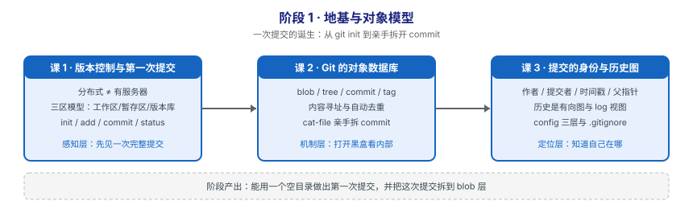

# 阶段 1：地基与对象模型

> 所属课程：Git 使用 ｜ 故事章节：**一次提交的诞生** ｜ 上一阶段：—（阶段 1 为起始阶段）
> 阶段路径图：

## 🎯 本阶段目标

- 能说清 Git 与"有台服务器存代码"的本质区别——分布式到底分布了什么。
- 能把一次 `git commit` 拆到 blob / tree / commit 三层，知道磁盘上真实存了什么。
- 能独立用 `git config` 配好身份，用 `.gitignore` 挡住不该进版本库的文件。

## 📍 学习重点

- **三区模型**（工作区 / 暂存区 / 版本库）：这是理解后面所有命令的坐标系。绝大多数"Git 好难"的困惑，本质是没分清一条命令在哪个区之间搬运数据。
- **内容寻址**（Content Addressing）：Git 用内容的哈希当文件名。理解了这一点，"为什么分支这么轻""为什么历史改不了""为什么相同文件不占两份空间"三个问题会同时解开。
- **四种对象**（blob / tree / commit / tag）：Git 的全部数据结构就这四种，它们拼出一切。
- **不急着记命令**：本阶段命令很少，重点是建立心智模型。

## ✅ 必须掌握的知识点

| 知识点 | 所属课 | 学完应能 |
|--------|--------|----------|
| Git 是什么：分布式版本控制与内容寻址 | 课 1 | 说清"每个克隆都是完整仓库"意味着什么，以及它带来哪些能力 |
| 三区模型：工作区 / 暂存区 / 版本库 | 课 1 | 画出三区图，并说出 `add` / `commit` 各自搬的是哪一段 |
| 第一次提交：init / add / commit / status | 课 1 | 用空目录做出第一次提交，并看懂 `git status` 的四种文件状态 |
| 四种对象：blob / tree / commit / tag | 课 2 | 说出四种对象各自存什么、彼此如何引用 |
| 内容与文件名解耦：内容寻址与去重 | 课 2 | 解释为什么两个同名不同内容的文件是两个 blob |
| 用 plumbing 命令亲手拆一个 commit | 课 2 | 用 `cat-file` / `ls-tree` 手工走完 commit → tree → blob |
| 提交的完整身份：作者 / 提交者 / 时间戳 / 父指针 | 课 3 | 说清 author 与 committer 为何会不同 |
| 历史是一条有向图：git log 的各种视图 | 课 3 | 用 `git log --graph` 看懂分支与合并的结构 |
| 配置与身份：config 三层与 .gitignore | 课 3 | 配好 user.name / user.email，写对 `.gitignore` |

## 本阶段产出

- [x] `lessons/lesson-01-版本控制与第一次提交.md`（✅ 2026-09-08 已讲完，P0=0）
- [x] `lessons/lesson-02-Git的对象数据库.md`（✅ 2026-09-08 已讲完，P0=0）
- [x] `lessons/lesson-03-提交的身份与历史图.md`（✅ 2026-09-08 已讲完，P0=0）

**阶段状态：✅ 已完成（2026-09-08）** —— 3 课 / 9 知识点全部交付。

## 本阶段核心结论（回看用）

- **对象模型只有四种东西**：blob（内容，无名字）+ tree（名字，递归）+ commit（快照入口 + 父指针）+ tag（固定名字）。它们构成一张**有向无环图（DAG）**。
- **内容寻址解锁三个"为什么"**：对象名 = `SHA-1(类型 + 长度 + \0 + 内容)`（实测验证 match=True）。所以相同内容只存一份、历史不可篡改、分支只是 41 字节指针。
- **历史不是线，是图**：父指针决定结构，时间只是附属属性。合并提交有**两个** parent，这是分叉与汇合的全部秘密。
- **author 记荣誉、committer 记责任**：rebase / cherry-pick 后 author 不变、committer 变执行者（课 8 的关键伏笔）。
- **`.gitignore` 只管未跟踪文件**：已跟踪的必须先 `git rm --cached`。
- ⚠️ **本阶段踩过的真坑**：`--global` 配置实验会改**真实** `~/.gitconfig`，必须隔离 HOME（课 3 第一版脚本误改，已还原）。

## 本阶段的坑（提前打个招呼）

- **别急着改默认分支名**：本机 Git 2.43.0 / 2.53.0 的默认分支都是 `master`（未设 `init.defaultBranch`）。讲义会照实展示 `master`，并在涉及协作时说明如何改成 `main`。
- **别把 `.git` 目录当黑盒**：本阶段就是要打开它看。看不懂 plumbing 输出不要紧，照着敲一遍，第三幕会逐行解释。
- **Windows 用户注意换行**：本机 Windows 侧 `core.autocrlf=true`（安装时设的），WSL 侧为默认值。课 3 讲配置时会专门说清这件事。

> 返回：[课程目录](../../02-课程目录.md) ｜ [学习路径总览](../../01-学习路径总览.md)
