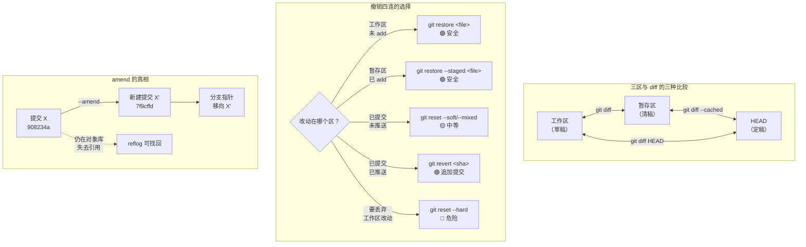

# 第 4 课：差异与撤销

> 所属阶段：阶段 2《个人工作流》｜ 水平：入门→进阶过渡 ｜ 本课知识点：diff 三副面孔、撤销四连、amend 边界
> 故事情节：**反悔的代价**——阶段 1 我们学会了怎么"记下来"，本课学怎么"改回去"。

## 🎯 本课目标

- 一眼看出 `git diff` / `git diff --cached` / `git diff HEAD` 各自在比较哪两个东西，不再靠猜。
- 面对"改错了"能选出正确的撤销命令，说清 `restore` / `reset` / `revert` / `checkout` 的分工。
- 理解 `--amend` 不是"修改提交"而是"新建提交 + 移动指针"，以及它的安全边界在哪。

---

## 第一幕：起源与场景引入

> 🏛️ **起源**：撤销这件事，Git 早期的命令设计是出了名的混乱。

`git checkout` 一个命令干了两件毫不相干的事：**切换分支**和**还原文件**。
`git reset` 的三种模式（`--soft` / `--mixed` / `--hard`）语义差异极大却共用同一个名字。
新手最常问的一句话是：*"我刚才那步怎么撤掉？"*——而答案取决于你**改的是哪个区**。

于是 Git 2.23（2019-08）做了一次大拆分：

| 新命令 | 取代的老写法 | 负责什么 |
|--------|-------------|----------|
| `git switch` | `git checkout <branch>` | **只**管切分支 |
| `git restore` | `git checkout -- <file>` | **只**管还原文件 |
| `git restore --staged` | `git reset HEAD <file>` | **只**管取消暂存 |

> 本课**优先教新命令**，同时告诉你老写法在干什么——因为你一定会读到大量用老写法的教程和 Stack Overflow 答案。

> 🎬 **场景**：你正在改代码，改到一半，屏幕上出现三种"我好像搞砸了"：

1. 你改了 `config.py`，**还没 `git add`**，想把这些改动全部扔掉，回到上次提交的样子。
2. 你手快 `git add .` 了，但 `debug.log` 不该进去——想**只取消暂存**，文件改动还要留着。
3. 你已经 `git commit` 了，还**推到了远端**，发现这个提交引入了一个线上 bug。

**这三个场景，答案完全不同。**

- 场景 1 用 `git restore <file>`
- 场景 2 用 `git restore --staged <file>`
- 场景 3 **`reset` 不能用**，必须用 `git revert`

为什么？因为它们的**危险等级**不同：前两个只影响你本机的工作区/暂存区，第三个会改写**已经公开的历史**——那是别人的历史，你没有权力擦掉。

**本课就是要把这条"危险等级"的界线讲清楚。**

---

## 第二幕：认知冲突

按直觉，"撤销"应该就一个动作：把刚才那步**倒回去**。

于是你自然会以为：

> Git 有一个"撤销"按钮，按一下就回到上一步；`reset` / `revert` / `restore` 只是同一个动作的不同叫法。

**这个直觉会让你在第一次需要"撤销已推送的提交"时，做出一个破坏团队协作的操作。**

冲突在这里：

> ❓ **问题**：`git reset` 和 `git revert` 都能"让代码回到某个旧版本"。
> 那它们有什么区别？能不能随便挑一个用？

**不能。** 实测给你看最直观的差别——**同样是"去掉最近一次提交"**：

| | `git reset HEAD~1` | `git revert HEAD` |
|---|---|---|
| 提交历史 | **变短了**（`c5` 消失） | **变长了**（多出一个 `Revert` 提交） |
| `c5` 这个提交 | 从分支上摘掉，变成"孤儿" | **依然在**，被后面的 revert 抵消 |
| 别人拉取后会怎样 | 历史对不上，需要强推 | 正常 fast-forward，无冲突 |

**一句话**：`reset` 是**改写历史**，`revert` 是**追加一个反向提交**。

> ⚠️ 这就是为什么阶段 4 才放开 `reset --hard`：它会让提交"消失"（实际上还在对象库里，只是没人引用了）。本课只用**安全**的撤销手段。

---

## 第三幕：层层揭示

### 知识点 1：差异的三副面孔——工作区 / 暂存区 / 提交间

> 本知识点关键点：`git diff` 比的是工作区 vs 暂存区、`--cached` 比的是暂存区 vs HEAD、`HEAD` 比的是工作区 vs HEAD

#### 一句话定义

`git diff` 有三种默认形态，区别在于**拿哪两个东西比**：工作区 vs 暂存区、暂存区 vs HEAD、工作区 vs HEAD；此外还能直接比较两个提交。

#### 直觉建立（类比）

把三区想成**三张稿纸**：

- **工作区** = 你正在写的那张草稿（涂改最多）
- **暂存区** = 誊抄好的清稿（你挑出来准备交的）
- **HEAD** = 昨天已经交上去的定稿

`diff` 就是**拿两张稿纸叠在一起对着光看**，找出哪里不一样：

| 命令 | 左手拿 | 右手拿 |
|------|--------|--------|
| `git diff` | 草稿 | 清稿 |
| `git diff --cached` | 清稿 | 定稿 |
| `git diff HEAD` | 草稿 | 定稿 |

> 💡 **类比的边界**：真实 Git 里三区不是三份完整拷贝。暂存区只存"指向 blob 的指针"，工作区是真实文件——课 1 的三区模型已经讲过。这里的"稿纸"只是帮你记住**比较的两端**。

#### 核心原理

**第一，实测：一次修改，三种 diff 的输出差异。**

初始状态：`a.txt` 提交为三行。然后**只改工作区、不 add**：

```bash
$ printf 'line1\nline2-CHANGED\nline3\n' > a.txt

$ git status -s
 M a.txt                      # 注意 M 在**右列**

$ git diff                   # 工作区 vs 暂存区 —— 有输出
-line2
+line2-CHANGED

$ git diff --cached          # 暂存区 vs HEAD —— 空
                             # （因为还没 add，暂存区和 HEAD 一样）
```

**关键**：`git status -s` 里 `M` 的**列位置**就是答案——左列 `M ` 表示已暂存，右列 ` M` 表示未暂存。这是最快的判断方法。

**第二，`git add` 之后，diff "跑"到了另一个命令里。**

```bash
$ git add a.txt
$ git status -s
M  a.txt                     # M 跑到**左列**了

$ git diff                   # 空！因为工作区和暂存区现在一样
$ git diff --cached          # 有输出了
-line2
+line2-CHANGED
```

**这就是新手最困惑的地方**：`add` 之后 `git diff` 突然空了，以为改动丢了。其实改动**没丢**，只是换了个位置——现在要用 `--cached` 才看得到。

**第三，同时存在暂存和未暂存改动时（最难的情况）。**

先 add 一个改动，再**继续改同一个文件**，此时 `a.txt` 同时有两种改动：

```bash
$ git status -s
MM a.txt                     # 两个 M！暂存和未暂存都有

$ git diff HEAD              # 工作区 vs HEAD（忽略暂存，看最终效果）
-line3
+line3-EXTRA

$ git diff                   # 工作区 vs 暂存区（只有后一次改动）
-line2-CHANGED
-line3
+line2
+line3-EXTRA

$ git diff --cached          # 暂存区 vs HEAD（只有前一次改动）
-line2
+line2-CHANGED
```

**记忆口诀**：
- `git diff` = **还差什么没 add**
- `git diff --cached` = **add 了什么（准备提交什么）**
- `git diff HEAD` = **从上次提交到现在，总共改了什么**

**第四，比较两个提交。**

```bash
$ git diff HEAD~1 HEAD       # 相邻两次提交
$ git diff HEAD~2 HEAD       # 跨两次
$ git diff <sha1> <sha2>     # 任意两个提交
$ git show HEAD              # = 提交本身 + 它引入的 diff
```

⚠️ **注意顺序**：`git diff A B` 的含义是"**从 A 到 B 要怎么改**"，所以 `git diff HEAD~1 HEAD` 显示的是"最新提交引入了什么"，反过来写（`git diff HEAD HEAD~1`）会得到**相反符号**的 diff。

**第五，只看统计、不看内容。**

```bash
$ git diff --stat            # 每个文件改了几行
 a.txt | 2 +-
 b.txt | 1 +
 2 files changed, 2 insertions(+), 1 deletion(-)

$ git diff --name-only       # 只列文件名
a.txt
b.txt
```

代码评审前先跑 `--stat`，能快速判断"这次改动规模大不大"。

**第六，词级 diff。**

整行对比在改长句子时很难读。`--word-diff` 只标出**词**的变化：

```bash
$ git diff --word-diff -- w.txt
the quick [-brown-]{+red+} fox
```

`[-brown-]` 是删掉的，`{+red+}` 是加上的。改 Markdown 或配置文件时特别好用。

#### 示例演示

提交前的标准自检三连：

```bash
git status -s                # ① 哪些文件动了、在哪个区（看 M 的列）
git diff                     # ② 还没暂存的改了什么
git diff --cached            # ③ 已暂存的改了什么（即将提交的内容）
```

全部确认无误，再 `git commit`。**这三步能挡掉 90% 的"提交错东西"。**

#### 常见误区

1. **"`git add` 之后 `git diff` 空了，改动丢了"**：没丢，用 `git diff --cached` 看。
2. **"`git diff` 看的是所有改动"**：不是，它只看**工作区 vs 暂存区**。想看全部用 `git diff HEAD`。
3. **"`git diff A B` 顺序无所谓"**：有，方向决定 `+`/`-` 的符号。

#### 一句话记住

**diff 是坐标系：不带参数看"没 add 的"，`--cached` 看"add 了的"，`HEAD` 看"总共改了什么"。**

#### 官方文档

- [Git 官方文档 - git-diff](https://git-scm.com/docs/git-diff)
- [Git 官方文档 - 记录每次更新到仓库](https://git-scm.com/book/zh/v2/Git-%E5%9F%BA%E7%A1%80-%E8%AE%B0%E5%BD%95%E6%AF%8F%E6%AC%A1%E6%9B%B4%E6%96%B0%E5%88%B0%E4%BB%93%E5%BA%93)

---

### 知识点 2：撤销四连——restore / reset / revert / checkout

> 本知识点关键点：按"危险等级"选命令、restore 管文件、reset 管指针（三模式）、revert 管已公开历史、checkout 已被拆分

#### 一句话定义

四个撤销命令的分工是：**`restore` 还原文件内容、`reset` 移动分支指针、`revert` 追加反向提交、`checkout` 是已被拆分的老命令**；选择依据是"你要撤销的东西在哪个区、是否已经推送"。

#### 直觉建立（类比）

把撤销想成**修改一份已经发出的文件**：

- **`restore`** = 用橡皮擦掉**草稿**上的字。只影响你桌上这张，别人不知道。
- **`reset`** = 把**书签**往前挪几页。书页内容还在，但"读到哪了"变了。
- **`revert`** = 在文件末尾**追加一份"更正声明"**。原文一字不改，但所有人都知道前面那处作废。
- **`checkout`** = 一把**瑞士军刀**（既能切分支又能擦字），现在军刀被拆成了两把专用工具。

> 💡 **类比的边界**：`revert` 的"更正声明"不仅作废内容，它自己也是一份**新内容**——所以 revert 之后还能再 revert 那个 revert（套娃），这在实际中是合法的。

#### 核心原理

**第一，决策表——本课最重要的一张表。**

| 场景 | 用什么 | 危险度 | 会丢工作区改动吗 |
|------|--------|--------|------------------|
| 改了文件，还没 add，想扔掉 | `git restore <file>` | 🟢 低 | **会**（这就是目的） |
| add 了，想取消暂存但保留改动 | `git restore --staged <file>` | 🟢 低 | 不会 |
| 想撤销**未推送**的提交，保留改动 | `git reset --soft HEAD~1` | 🟡 中 | 不会（进暂存区） |
| 想撤销**未推送**的提交，改动回工作区 | `git reset --mixed HEAD~1`（默认） | 🟡 中 | 不会（进工作区） |
| 想撤销**未推送**的提交，改动也不要了 | `git reset --hard HEAD~1` | 🔴 高 | **会，且难找回** |
| 想撤销**已推送**的提交 | `git revert <sha>` | 🟢 低 | 不会 |

**一句话原则**：**已推送的用 `revert`，没推送的才敢用 `reset`。**

**第二，`git restore`——还原文件（安全）。**

```bash
$ printf 'line1\nline2-BAD\nline3\n' > a.txt
$ git status -s
 M a.txt

$ git restore a.txt          # 从暂存区还原到工作区
$ git status -s
                             # 干净了
```

**默认从暂存区还原**。想指定从哪个提交还原，用 `--source`：

```bash
$ git restore --source=HEAD~1 -- a.txt      # 只还原工作区
$ git restore --source=HEAD~1 --staged --worktree -- a.txt   # 工作区和暂存区都还原
```

⚠️ **重要**：`git restore` **默认只动工作区**，不动暂存区。想两边都改必须显式加 `--staged --worktree`。

**配套的取消暂存**（老写法是 `git reset HEAD <file>`）：

```bash
$ git add a.txt
$ git status -s
M  a.txt                     # 左列 = 已暂存

$ git restore --staged a.txt
$ git status -s
 M a.txt                     # 右列 = 只剩未暂存
```

**第三，`git reset` 三模式（实测，各从同一干净起点）。**

准备工作：三个提交 `base` → `target-of-reset` → `to-be-removed`（新增了 `n.txt`）。
然后执行 `git reset --<mode> HEAD~1`，观察 `n.txt` 的去向：

| 模式 | HEAD | 暂存区 | 工作区 | `n.txt` 结局 | `git status` |
|------|------|--------|--------|-------------|--------------|
| `--soft` | 移动 | **不动** | **不动** | 仍在磁盘、仍被跟踪 | `Changes to be committed: new file: n.txt` |
| `--mixed`（默认） | 移动 | 重置 | **不动** | 仍在磁盘，**变成未跟踪** | `Untracked files: n.txt` |
| `--hard` | 移动 | 重置 | 重置 | **从磁盘删除** | `nothing to commit, working tree clean` |

实测输出节选：

```bash
$ git reset --soft HEAD~1
Changes to be committed:
	new file:   n.txt          # ← 改动还在，且已暂存

$ git reset --mixed HEAD~1
Untracked files:
	n.txt                      # ← 改动还在，但未暂存了

$ git reset --hard HEAD~1
HEAD is now at bbd3abe target-of-reset
                               # ← 干净了，n.txt 消失
```

**记忆法**：三个模式 = 移动的"箭头"延伸到第几层。
`--soft` 只动 HEAD；`--mixed` 动到暂存区；`--hard` 连工作区一起动。

**第四，`git reset` 带路径时语义完全不同（实测踩坑）。**

```bash
$ git reset HEAD -- p.txt        # ✅ 取消暂存，工作区保留，HEAD 不动
Unstaged changes after reset:
M	p.txt

$ git reset --hard HEAD -- p.txt # ❌ 报错！
fatal: Cannot do hard reset with paths.
```

⚠️ **两个要点**：
1. 带路径时 `reset` **永远不会移动 HEAD**（它只操作暂存区）。
2. **`git reset --hard <path>` 是非法命令**——想丢弃某个文件的改动请用 `git restore <file>` 或 `git checkout -- <file>`。

**第五，`--hard` 真的"删掉"提交了吗（实测证据链）。**

```bash
$ GONE=$(git rev-parse HEAD)          # 记下要被 --hard 掉的提交
$ git reset --hard HEAD~1
$ git log --oneline
2264808 c1                            # 那个提交从 log 里消失了
$ ls g.txt
ls: cannot access 'g.txt': No such file or directory   # 文件也没了

$ git cat-file -p $GONE               # 但它**依然读得出来**
tree 7bb21aa3f5d7a4f8ba12bc7ae7ab9dc4363aa38f
parent 2264808050b8fb72ff3d9b5d456ddd516cd8502b
author Zhang Wei <z@e.com> 1788860873 +0800
committer Zhang Wei <z@e.com> 1788860873 +0800

c2-to-be-hard-reset

$ git reflog
2264808 HEAD@{0}: reset: moving to HEAD~1
242f119 HEAD@{1}: commit: c2-to-be-hard-reset    # ← 在 reflog 里

$ git reset --hard $GONE              # 完全可以恢复
$ ls g.txt
g.txt                                 # ← 回来了
```

**所以 `--hard` 的危险不在于"数据被销毁"，而在于"没人再引用它，你不知道它的 SHA 了"。** 只要能从 reflog 找到 SHA，就能完整恢复——这是课 11 的核心内容。

```bash
$ git revert --no-edit HEAD
[master 1dd1390] Revert "c4"
 1 file changed, 1 deletion(-)

$ git log --oneline
1dd1390 Revert "c4"        # ← 新增
741f191 c4                 # ← 还在！
c11c9e8 c3
```

关键证据——**revert 提交有自己独立的 parent，指向被撤销的那个提交**：

```bash
$ git cat-file -p HEAD
tree 1a02b9cf9961262007ed59c52dbb1984528dad36
parent 741f191dc4046e1338e50ed46c7b943629e72b7e    # ← 指向 c4，不是它之前的提交
author Zhang Wei <zhangwei@example.com> 1788860513 +0800
committer Zhang Wei <zhangwei@example.com> 1788860513 +0800

Revert "c4"

This reverts commit 741f191dc4046e1338e50ed46c7b943629e72b7e.
```

所以它**只是追加**，历史完整保留——别人 `git pull` 能正常 fast-forward。

**第六，revert 一个合并提交必须给 `-m`（实测）。**

```bash
$ git revert --no-edit HEAD
error: commit af9d5a5... is a merge but no -m option was given.
fatal: revert failed              # 退出码 128

$ git revert --no-edit -m 1 HEAD
[master fd83a89] Revert "merge feat"
 1 file changed, 1 deletion(-)
 delete mode 100644 feat.txt      # 成功
```

**为什么**：合并提交有两个父，Git 不知道你想"回到哪一边"。`-m 1` 表示以**第一父**（合入时的主干）为准。

⚠️ **深水区提醒**：revert 一个 merge 之后，如果将来又想把这个分支**重新合并**进来，Git 会认为"已经合过了"而拒绝。解决办法是 revert 那个 revert。这个坑留到课 8 展开。

**第七，`git checkout` 为什么被拆分。**

`git checkout` 身兼两职，靠参数区分：

```bash
git checkout <branch>        # 切分支
git checkout -- <file>       # 还原文件
git checkout <sha>           # 切到某个提交 → 进入 detached HEAD
```

因为容易混淆（尤其是 `checkout <sha>` 和 `checkout <branch>` 长得一样），Git 2.23 拆成了：

```bash
git switch <branch>          # 取代切分支
git restore <file>           # 取代还原文件
```

实测 detached HEAD（本课只做认知，课 5 详细讲）：

```bash
$ git checkout 1dd1390
$ cat .git/HEAD
1dd13903ad5158821a17dcc97b9d1e92970f5669     # ← 直接存 SHA，不是 ref
$ git status
HEAD detached at 1dd1390
```

⚠️ 在 detached HEAD 状态下做的提交**不属于任何分支**，切走就会"丢失"（实际还在对象库里，靠 reflog 能找回——那是课 11 的内容）。

**第八，`git clean`——清理未跟踪文件。**

```bash
$ git clean -n       # 干跑：只显示会删什么
Would remove c.txt
Would remove junk.txt

$ git clean -f       # 删除未跟踪的**文件**
$ git clean -fd      # 连未跟踪的**目录**一起删
```

⚠️ **`git clean` 删掉的东西不进对象库，无法用 Git 手段找回**。`-n` 干跑是好习惯。

**第九，`git stash` 预览**（课 6 详讲）。

```bash
$ git stash
Saved working directory and index state WIP on master: fc85d07 c: fixed message
$ git stash list
stash@{0}: WIP on master: fc85d07 c: fixed message
$ git stash pop          # 恢复
```

当你"改到一半要切分支"时，用 stash 比提交一个半成品干净得多。

#### 示例演示

**场景彩排**：回到第一幕的三个场景，逐个走一遍。

```bash
# 场景 1：改了还没 add，想扔掉
git restore config.py

# 场景 2：add 了但 debug.log 不该进，只取消暂存
git restore --staged debug.log
# 然后把它写进 .gitignore（课 3 学过的）

# 场景 3：已推送的提交有 bug —— 用 revert，绝不用 reset
git revert --no-edit <那个提交的 sha>
git push
```

**彩排"重置三模式"**（见哪个模式符合你的需要）：

```bash
git reset --soft  HEAD~1   # 提交被撤销，改动留在暂存区（想重新提交）
git reset --mixed HEAD~1   # 提交被撤销，改动留在工作区（想改改再提交）
git reset --hard  HEAD~1   # 提交和改动全部丢弃（⚠️ 危险）
```

#### 常见误区

1. **"`reset` 和 `revert` 随便挑一个"**：错。已推送的必须用 `revert`。
2. **"`git restore` 会同时还原暂存区"**：不会，默认只动工作区，要加 `--staged`。
3. **"`git reset --hard <path>` 能丢弃某个文件的改动"**：**报错**（`Cannot do hard reset with paths`），用 `git restore <file>`。
4. **"`git clean` 很安全"**：它删的文件不进对象库，删了就真没了。
5. **"`--hard` 之后的提交彻底消失了"**：对象还在库里（本课实测：`cat-file` 依旧读得出、`reflog` 有记录、`git reset --hard <sha>` 能完整恢复），只是失去引用、你不知道它的 SHA 了——课 11 的 reflog 会教你救回来。

#### 一句话记住

**restore 管文件、reset 管指针、revert 管已公开历史；已推送的只用 revert。**

#### 官方文档

- [Git 官方文档 - git-restore](https://git-scm.com/docs/git-restore)
- [Git 官方文档 - git-reset](https://git-scm.com/docs/git-reset)
- [Git 官方文档 - git-revert](https://git-scm.com/docs/git-revert)
- [Git 官方文档 - 重置揭密](https://git-scm.com/book/zh/v2/Git-%E5%B7%A5%E5%85%B7-%E9%87%8D%E7%BD%AE%E6%8F%AD%E5%AF%86)

---

### 知识点 3：amend 与 commit 的边界

> 本知识点关键点：amend 是新建提交而非修改、author 时间保留而 committer 时间更新、amend 的适用边界（未推送）

#### 一句话定义

`git commit --amend` **不是修改最后一次提交**，而是**用同样的父指针新建一个提交，再把分支指针挪过去**——旧提交依然存在，只是失去了引用。

#### 直觉建立（类比）

想象一份**已经装订好的合同**。

想改一个字，你不会（也不能）在原件上涂改——而是**重新打印一份新合同**，把旧的扔进碎纸机。

- **新合同**：内容改了，**编号（SHA）也变了**
- **旧合同**：碎片还在垃圾桶里（对象库），只是没人再引用它

> 💡 **类比的边界**：Git 的"碎纸机"其实不碎——旧对象会一直留在 `.git/objects` 里，直到 `gc` 回收。所以 amend 之后**还能通过 reflog 找回**（课 11）。

#### 核心原理

**第一，实测：amend 后 SHA 变了。**

```bash
$ git commit -m "c: typo mesage"
$ git rev-parse HEAD
908234a72428968fc73664d89f1e20470b3fbe8a

$ git commit --amend -m "c: fixed message"
[master 7f9cffd] c: fixed message

$ git rev-parse HEAD
7f9cffd6d4ca14f02bca2f330f4168685871de93     # ← 不一样了
```

**哈希变了，说明这是一个全新的对象**——因为哈希是内容算出来的（课 2 的内容寻址），改了提交信息，内容就变了，哈希必然变。

**但提交数量没变**：

```bash
$ git log --oneline
7f9cffd c: fixed message     # 还是 1 个提交（不是 2 个）
1dd1390 Revert "c4"
```

因为旧提交**被从分支链上摘下来了**，不再出现在 `log` 里。

**第二，旧提交还在（实测证据）。**

```bash
$ git reflog
fc85d07 HEAD@{0}: commit (amend): c: fixed message
7f9cffd HEAD@{1}: commit (amend): c: fixed message
908234a HEAD@{2}: commit: c: typo mesage     # ← 原始提交还在！

$ git cat-file -p 908234a
tree 76fdcbdd55479ae766cf065cabb4dea7f9381551
parent 1dd13903ad5158821a17dcc97b9d1e92970f5669
author Zhang Wei <zhangwei@example.com> 1788860513 +0800
committer Zhang Wei <zhangwei@example.com> 1788860513 +0800

c: typo mesage                                # ← 完整读得出来
```

**这就是本课标题说的"边界"**：amend 只是**移动指针**，不是删除数据。

**第三，author 时间 vs committer 时间（实测，加 3 秒延迟）。**

```bash
$ git log -1 --format='author  : %ad%ncommitter: %cd' --date=iso-strict
author  : 2026-09-08T17:42:56+08:00
committer: 2026-09-08T17:42:56+08:00

$ sleep 3 && git commit --amend --no-edit

$ git log -1 --format='author  : %ad%ncommitter: %cd' --date=iso-strict
author  : 2026-09-08T17:42:56+08:00     # ← 没变
committer: 2026-09-08T17:42:59+08:00    # ← 变了（+3 秒）
```

原始时间戳更直观：

```bash
$ git log -1 --format='%at%n%ct'
1788860576      # author
1788860579      # committer（+3）
```

**这正是课 3 讲的"author 记荣誉、committer 记责任"的第一次现身**——amend 之后，作者时间保留（你当初写它的时刻），提交者时间更新（你刚才重造它的时刻）。

⚠️ **注意**：如果 amend 执行得**太快**（同一秒内），两个时间会显示成一样——这就是为什么很多教程说"看不出差别"。**加个 `sleep 3` 就能看到。**

想连 author 时间也一起重置，用 `--reset-author`：

```bash
$ git commit --amend --no-edit --reset-author
author  : 2026-09-08T17:43:01+08:00     # 都变成现在了
committer: 2026-09-08T17:43:01+08:00
```

**第四，amend 的经典用途：补上忘加的文件。**

```bash
$ git commit -m "c: 实现登录"           # 忘了 add 一个新文件
$ git add forgot.txt
$ git commit --amend --no-edit         # --no-edit = 不改提交信息

$ git show --stat --oneline HEAD
fc85d07 c: 实现登录
 forgot.txt | 1 +
 m.txt      | 1 +
 2 files changed, 2 insertions(+)     # ← 现在两个文件都在
```

提交数量依然没变——**这是 amend 最实用的场景**。

**第五，amend 的安全边界（本课最重要的一条）。**

| 状态 | 能用 `--amend` 吗 | 理由 |
|------|------------------|------|
| 提交**只在本地**，从未推送 | ✅ 可以 | 只影响你自己的指针 |
| 提交**已推送**到共享分支 | ❌ 绝对不行 | 会改写别人已拉取的历史，需要强推 |

**为什么不行**：amend 改变了哈希，你的本地历史和远端分叉了。此时 `git push` 会被拒绝，而 `git push --force` 会**覆盖远端**——同事的本地仓库就会和远端对不上。

> 📌 这条规则和课 8 的 **rebase 黄金法则**是同一条：**只改写你自己的、未公开的历史**。课 11 会给出已推送历史的正确处理方式（`--force-with-lease` + 团队协商）。

**第六，`--amend` 之外：什么情况该用新提交？**

| 情况 | 建议 |
|------|------|
| 打错字、忘加文件、提交信息写错 | `--amend` |
| 代码逻辑要改（ review 意见） | **新建提交**，保持 review 的可追溯性 |
| 已经推送 | 新建提交 或 `revert` |

**经验法则**：amend 适合修**提交本身的质量问题**（信息、漏文件），不适合修**代码内容问题**——后者留个新提交，让历史诚实地记录"这里返工过"。

#### 示例演示

一次完整的 amend 演练：

```bash
# 1. 提交（故意打错字）
printf 'v1\n' > login.py && git add login.py
git commit -m "feat: 实现登路"          # 错字 + 忘了加测试文件

# 2. 记录旧哈希，供后面验证
OLD=$(git rev-parse HEAD)

# 3. 补上漏掉的文件 + 修正信息
printf 'def test_login(): pass\n' > test_login.py && git add test_login.py
git commit --amend -m "feat: 实现登录"

# 4. 验证：哈希变了、数量没变、文件齐了
echo "old=$OLD new=$(git rev-parse HEAD)"
git log --oneline | wc -l
git show --stat --oneline HEAD

# 5. 验证旧对象还在
git cat-file -p $OLD | head -3
git reflog | head -3
```

#### 常见误区

1. **"amend 修改了最后一次提交"**：不是，是**新建 + 移动指针**，哈希会变。
2. **"amend 之后旧提交就没了"**：还在对象库里，reflog 能找到（本课实测 `cat-file` 读得到）。
3. **"amend 会改变 author 时间"**：不会，改的是 committer 时间（除非 `--reset-author`）。
4. **"amend 已推送的提交也没关系"**：**大错**，会造成历史分叉，必须强推才能同步，破坏协作。
5. **"看不出 amend 改了 committer 时间"**：因为执行太快（同一秒内），加 `sleep 3` 就能看到。

#### 一句话记住

**amend = 新建提交 + 移动指针，旧的还在；只 amend 未推送的提交。**

#### 官方文档

- [Git 官方文档 - git-commit（--amend）](https://git-scm.com/docs/git-commit)
- [Git 官方文档 - 重写历史](https://git-scm.com/book/zh/v2/Git-%E5%B7%A5%E5%85%B7-%E9%87%8D%E5%86%99%E5%8E%86%E5%8F%B2)

---

## 第四幕：实操验证

**任务**：亲手制造"三种搞砸"，用正确命令逐个救回；验证 amend 的哈希变化与对象残留。

### 技术域

```bash
# ============ 0. 准备（隔离 HOME，避免污染真实全局配置）============
mkdir -p ~/git-playground/lesson-04 && cd ~/git-playground/lesson-04
git init
git config user.name  "Zhang Wei"
git config user.email "zhangwei@example.com"
git config commit.gpgsign false

# ============ 1. diff 三副面孔 ============
printf 'line1\nline2\nline3\n' > a.txt
git add a.txt && git commit -q -m "c1"

printf 'line1\nline2-CHANGED\nline3\n' > a.txt
git status -s                    # 预期： M a.txt（M 在右列）
git diff                         # 预期：有输出
git diff --cached                # 预期：空

git add a.txt
git status -s                    # 预期：M  a.txt（M 跑到左列）
git diff                         # 预期：空了（改动没丢，是换位置了）
git diff --cached                # 预期：有输出

printf 'line1\nline2\nline3-EXTRA\n' > a.txt   # 再改一次
git status -s                    # 预期：MM a.txt（暂存和未暂存都有）
git diff HEAD                    # 预期：工作区 vs HEAD（总改动）
git diff                         # 预期：工作区 vs 暂存区（后一次改动）
git diff --cached                # 预期：暂存区 vs HEAD（前一次改动）

git add a.txt && git commit -q -m "c2"   # 收尾

# ============ 2. 提交间 diff ============
printf 'x\n' > b.txt && git add b.txt && git commit -q -m "c3"
git diff HEAD~1 HEAD             # 预期：b.txt 新增
git diff HEAD~2 HEAD --stat      # 预期：两个文件的统计
git show HEAD --stat             # 预期：提交头 + 它的 diff
git diff --word-diff -- <file>   # 词级 diff（改长句时好用）

# ============ 3. restore：还原文件（安全）============
printf 'line1\nline2-BAD\nline3\n' > a.txt
git status -s                    # 预期： M a.txt
git restore a.txt                # 从暂存区还原工作区
git status -s                    # 预期：干净

# ============ 4. restore --staged：只取消暂存 ============
printf 'newcontent\n' > a.txt && git add a.txt
git status -s                    # 预期：M  a.txt
git restore --staged a.txt       # 取消暂存，工作区保留
git status -s                    # 预期： M a.txt（M 回到右列）

# ============ 5. restore --source：从别的提交取文件 ============
git restore --source=HEAD~1 -- a.txt              # 只动工作区
git restore --source=HEAD~1 --staged --worktree -- a.txt   # 两边都动
# ⚠️ 注意：不加 --staged 时暂存区不变

# ============ 6. reset 三模式（每次从同一干净起点重来）============
# 建议：三个模式各建一个仓库跑，避免互相干扰
setup() {
  rm -rf /tmp/r-$1 && mkdir -p /tmp/r-$1 && cd /tmp/r-$1
  git init -q && git config user.name T && git config user.email t@e.com
  printf 'r1\n' > r.txt; git add r.txt; git commit -q -m "base"
  printf 'r2\n' > r.txt; git add r.txt; git commit -q -m "target"
  printf 'r3\n' > n.txt;  git add n.txt; git commit -q -m "to-be-removed"
}

setup soft  && git reset --soft  HEAD~1 && git status
# 预期：Changes to be committed: new file: n.txt（改动还在、已暂存）

setup mixed && git reset --mixed HEAD~1 && git status
# 预期：Untracked files: n.txt（改动还在、未暂存）

setup hard  && git reset --hard  HEAD~1 && git status
# 预期：nothing to commit（n.txt 从磁盘消失）

# ============ 7. reset 带路径 ≠ 移动 HEAD ============
git reset HEAD -- a.txt              # 预期：取消暂存，工作区保留，HEAD 不动
git reset --hard HEAD -- a.txt       # 预期：**报错** fatal: Cannot do hard reset with paths
# 正确做法：git restore a.txt

# ============ 8. revert：安全撤销（追加提交）============
git revert --no-edit HEAD
# 预期：新增一个 "Revert ..." 提交，被撤销的提交依然在
git cat-file -p HEAD
# 预期：parent 指向被撤销的那个提交（不是它之前的）

# ============ 9. revert 一个合并提交要 -m ============
git revert --no-edit HEAD            # 预期：报错 is a merge but no -m option was given
git revert --no-edit -m 1 HEAD       # 预期：成功

# ============ 10. checkout / switch 与 detached HEAD ============
git checkout -b testbranch           # 建并切分支
git checkout master                  # 切回
git checkout <某个 sha>              # 预期：HEAD detached
cat .git/HEAD                        # 预期：直接是 SHA，不是 ref: refs/heads/...
git checkout master                  # 切回来

git switch -c newbranch              # 现代写法
git switch master

# ============ 11. clean：清理未跟踪（⚠️ 不可恢复）============
printf 'junk\n' > junk.txt && mkdir -p tmpdir && printf 'x' > tmpdir/f
git clean -n                         # 干跑，只看不删（好习惯）
git clean -f                         # 删文件
git clean -fd                        # 连目录一起删

# ============ 12. amend：验证哈希变、数量不变、旧的还在 ============
printf 'v1\n' > m.txt && git add m.txt
git commit -q -m "c: typo mesage"
OLD=$(git rev-parse HEAD)

git commit --amend -m "c: fixed message"
echo "old=$OLD"
echo "new=$(git rev-parse HEAD)"     # 预期：与 OLD 不同
git log --oneline | wc -l            # 预期：数量不变

git cat-file -p $OLD                 # 预期：旧提交**读得出来**（还在对象库）
git reflog | head -5                 # 预期：能看到 commit (amend) 记录

# ============ 13. amend 的日期行为（加 sleep 才看得出）============
git log -1 --format='author  : %ad%ncommitter: %cd' --date=iso-strict
sleep 3
git commit --amend --no-edit
git log -1 --format='author  : %ad%ncommitter: %cd' --date=iso-strict
# 预期：author 不变，committer 晚了 3 秒

git commit --amend --no-edit --reset-author
# 预期：两个都变成现在

# ============ 14. amend 补文件 ============
printf 'forgotten\n' > forgot.txt && git add forgot.txt
git commit --amend --no-edit
git show --stat --oneline HEAD       # 预期：两个文件都在

# ============ 15. 清理 ============
cd ~ && rm -rf ~/git-playground/lesson-04 /tmp/r-soft /tmp/r-mixed /tmp/r-hard
```

> ⚠️ **安全提醒**：本课第 6 步涉及 `reset --hard`，会**丢弃工作区改动**。
> 请在**一次性演练仓库**里跑，不要在你的真实项目里尝试。
> 如果确实误操作了，也别慌——对象还在库里，课 11 的 `reflog` 会教你救回来。

> ✅ **回扣场景**：回到第一幕的三个场景。
> ① **改了没 add 想扔掉** → `git restore <file>`（只动工作区，最安全）。
> ② **add 了想取消暂存** → `git restore --staged <file>`（改动保留在文件里）。
> ③ **已推送的提交有 bug** → `git revert <sha>`（追加反向提交，绝不 `reset`）。
> 以及幕后那条贯穿全课的界线：**只对自己未公开的历史动刀**。

### 非技术域

不适用（本课为技术域内容）。

---

## 第五幕：体系收束

> 📍 **全局定位**：**阶段 2 开局**。你现在有了"改回去"的完整工具箱——用 diff 定位改动在哪、用 restore 擦工作区、用 reset 挪指针、用 revert 追加反向提交、用 amend 修补刚做的提交。
> 🔗 **下一步**：**课 5《分支的本质》**——分支是指针不是副本、HEAD 与 detached HEAD、切换分支时工作区发生了什么。
> 到那时你会反复用到本课的两个结论：**① `reset` 移动的是指针（这正是分支操作的本质）；② 旧对象不会立刻消失（所以 detached HEAD 的提交也能靠 reflog 找回）**。
> 再往后，课 6 的 `stash` 是"临时存放改动"的正规军，课 8 的 `rebase` 则是把本课的 `--amend` 推广到**多个提交**——本质同样是"新建对象 + 移动指针"。

---

## 🐞 常见误区

1. **"`git add` 之后 `git diff` 空了，改动丢了"**：没丢，用 `git diff --cached` 看。
2. **"`git diff` 看的是所有改动"**：不是，它只看工作区 vs 暂存区；看全部用 `git diff HEAD`。
3. **"`reset` 和 `revert` 随便挑一个"**：错。已推送的只用 `revert`。
4. **"`git restore` 会同时还原暂存区"**：不会，默认只动工作区，要加 `--staged`。
5. **"`git reset --hard <path>` 能丢弃某个文件的改动"**：**报错**，用 `git restore <file>`。
6. **"`--hard` 删掉的提交彻底消失了"**：对象还在库里，只是失去引用（课 11 reflog 可救）。
7. **"`git clean` 很安全"**：它删的文件不进对象库，删了就真没了。
8. **"amend 修改了最后一次提交"**：不是，是新建 + 移动指针，哈希会变。
9. **"amend 之后旧提交就没了"**：还在，`reflog` 和 `cat-file` 都找得到。
10. **"amend 会改变 author 时间"**：不会，改的是 committer 时间（除非 `--reset-author`）。
11. **"amend 已推送的提交也没关系"**：**大错**，会造成历史分叉，需强推，破坏协作。
12. **"`git diff A B` 顺序无所谓"**：有，方向决定 `+` / `-` 符号。

## 一图总结



图解读：**上框**是 diff 的坐标系——记住 `--cached` 是"已暂存的"、`HEAD` 是"总共的"。**中框**是撤销决策树——核心判据是"改动在哪个区"和"是否已推送"，颜色即危险等级。**下框**是 amend 的真相——它从不修改旧提交，只新建并移动指针，所以旧对象永远能被 reflog 找到（课 11）。

## 课后小测

**Q1**：你执行 `git add a.txt` 后运行 `git diff`，**没有任何输出**。这说明？

- A. 改动丢失了
- B. 工作区与暂存区一致，改动已暂存，需用 `git diff --cached` 查看
- C. `a.txt` 没有被修改过
- D. Git 出错了

<details><summary>答案与解析</summary>

**答案：B**。实测：`git add` 后 `git status -s` 的 `M` 从左列消失（变成 `M ` 左列），`git diff`（工作区 vs 暂存区）变空，而 `git diff --cached`（暂存区 vs HEAD）出现内容。**改动没丢，只是换了个位置**。看到 `git diff` 空时，先跑 `git status -s` 看 `M` 在哪一列。

</details>

**Q2**：你想撤销一个**已经推送到远端**的提交。正确的做法是？

- A. `git reset --hard HEAD~1` 然后 `git push --force`
- B. `git revert <sha>` 然后 `git push`
- C. `git restore HEAD~1`
- D. `git commit --amend` 然后 `git push`

<details><summary>答案与解析</summary>

**答案：B**。`revert` **追加**一个反向提交，历史完整保留，别人 `pull` 能正常 fast-forward（实测 revert 提交的 `parent` 指向被撤销的提交）。A 会改写已公开历史并需强推，破坏协作；C 的 `restore` 只管文件不管提交；D 的 amend 同样改写历史。

</details>

**Q3**：关于 `git reset` 的三种模式，下列说法正确的是？

- A. `--soft` 会丢弃工作区改动
- B. `--mixed` 是默认模式，重置暂存区但保留工作区
- C. `--hard` 保留暂存区内容
- D. 三种模式对工作区的处理完全相同

<details><summary>答案与解析</summary>

**答案：B**。实测（三个模式各从同一干净起点）：`--soft` 只动 HEAD，改动仍**已暂存**；`--mixed`（默认）动到暂存区，改动变成**未跟踪**；`--hard` 连工作区一起重置，`n.txt` **从磁盘消失**。A、C、D 均与实测相反。

</details>

**Q4**：你执行 `git reset --hard HEAD -- a.txt` 想丢弃 `a.txt` 的改动，结果是？

- A. 成功丢弃 `a.txt` 的改动
- B. 报错 `fatal: Cannot do hard reset with paths`，应改用 `git restore a.txt`
- C. 移动了 HEAD 指针
- D. 删除了 `a.txt` 文件

<details><summary>答案与解析</summary>

**答案：B**。实测报错 `fatal: Cannot do hard reset with paths`。**`reset` 带路径时永远不会移动 HEAD，且不支持 `--hard`**。正确做法是 `git restore a.txt`（或用老写法 `git checkout -- a.txt`）。

</details>

**Q5**：关于 `git commit --amend`，下列说法**错误**的是？

- A. 它会改变提交的哈希值
- B. 它实际是新建一个提交并移动分支指针
- C. 它会同时改变 author 时间和 committer 时间
- D. amend 之后的旧提交仍可用 `reflog` 找到

<details><summary>答案与解析</summary>

**答案：C**。实测（加 `sleep 3` 制造时间差）：amend 后 **author 时间不变、committer 时间更新**（`1788860576` → `1788860579`）。这正是课 3 讲的"author 记荣誉、committer 记责任"。想连 author 时间一起改需要 `--reset-author`。A、B、D 都正确——D 尤其重要：实测 `git cat-file -p <旧sha>` 仍能读出完整内容。

</details>

**Q6**：`git status -s` 显示 `MM a.txt`（两个 M）。这表示？

- A. `a.txt` 有两个副本
- B. `a.txt` 同时存在**已暂存**和**未暂存**两种改动
- C. 命令出错了
- D. `a.txt` 被两个分支同时修改

<details><summary>答案与解析</summary>

**答案：B**。实测：先 `git add` 一个改动、再对同一文件做第二次改动后，`status -s` 显示 `MM`。此时 `git diff --cached` 看的是**第一次**（暂存区 vs HEAD），`git diff` 看的是**第二次**（工作区 vs 暂存区），`git diff HEAD` 看的是**总效果**。A、C、D 均不正确——`MM` 与分支、副本无关。

</details>

## 🚀 下一批接力提示词

> 学完本批后，**复制下面这段文字发给 AI**，即可无缝进入下一批（无需重新描述上下文）：

```
继续学 Git。我的学习档案在 git/00-学习档案.md，
刚学完阶段 2《个人工作流》的课《差异与撤销》知识点
「差异的三副面孔：工作区/暂存区/提交间」「撤销四连：restore/reset/revert/checkout」「amend 与 commit 的边界」，
请按大纲继续讲解下一批知识点（课 5《分支的本质》）。
```

## 🧭 课程导航

⬅️ **上一课**：[课 3：提交的身份与历史图](../../1-地基与对象模型/lessons/lesson-03-提交的身份与历史图.md)

➡️ **下一课**：**[课 5：分支的本质](lesson-05-分支的本质.md)**（未编写，下一批将讲解）

📚 **返回目录**：[课程目录](../../../02-课程目录.md) ｜ [阶段 2 概览](../overview.md)
