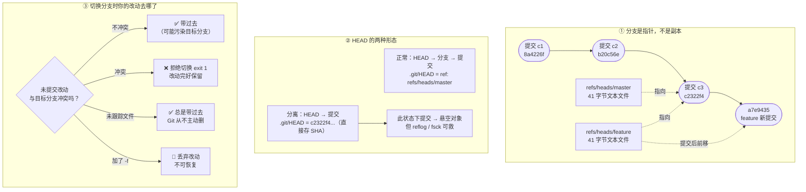

# 第 5 课：分支的本质

> 所属阶段：阶段 2《个人工作流》｜ 水平：入门→进阶过渡 ｜ 本课知识点：分支是指针不是副本、HEAD 与 detached HEAD、切换分支时工作区发生了什么
> 故事情节：**一个人的分身术**——阶段 2 概览把这条认知称作**分水岭**：理解了它，`checkout` / `switch` / `merge` / `rebase` 的行为都能推出来；不理解，就只能死记。

## 🎯 本课目标

- 能用 `.git/refs/heads/` 里的一个 **41 字节文件**证明"分支只是指针"，解释为什么建分支瞬间完成、几乎不占空间。
- 说清 HEAD 是什么、detached HEAD 到底"detached"了什么，以及它的**危险用法与安全用法**。
- 解释未提交改动在切换分支时的**三种去向**，并知道被拒绝时该怎么做（而不是乱加 `-f`）。

---

## 第一幕：起源与场景引入

> 🏛️ **起源**：Git 的分支为什么这么"便宜"？答案藏在 Linus Torvalds 2005 年最初的设计里。

在 Git 之前，主流版本控制系统（SVN、CVS）的分支是**拷贝目录**——建一个分支等于把整个项目树复制一份。在大型项目上，这可能要几十秒到几分钟，并且吃掉成百 MB 磁盘。所以那个年代的团队**很少建分支**，因为"建分支很贵"。

Linus 在设计 Git 时做了一个决定：**分支不复制任何东西，它只是一个指向提交的指针**。

这个决定的连锁反应是：
- 建分支的耗时从"分钟级"降到"微秒级"（本课实测 **2~4 毫秒**）
- 建分支的空间成本从"几十 MB"降到"**约 180 字节**"
- 分支从"稀缺资源"变成"随手就用"——这才有了后来 GitFlow、GitHub Flow 这些**以分支为核心**的协作模型

> 换句话说：**Git 的分支模型不是"功能"，而是它的世界观。** 不理解指针模型，后面所有分支操作都只能靠背命令。

> 🎬 **场景**：你在开发 `feature` 分支上的一个功能，改到一半。

这时三种"搞砸"同时压过来：

1. **老板让你立刻去改 master 上的一个紧急 bug**——但你的改动还不完整，不能提交。
2. 你切到 master 改完 bug 回来，**发现自己在 feature 上写的实验性提交"不见了"**。
3. 你想回到**三天前**的版本看看当时的代码长什么样，但不想动任何分支。

**这三个场景，答案都在同一件事里**：分支到底是什么、HEAD 指向哪里、切换时 Git 对你的工作区做了什么。

**核心矛盾**：如果分支是"副本"，那你切分支时应该看到"另一份文件"；但 Git 只有**一份工作区**。那它是怎么做到"切一下就像换了整个世界"的？

**本课就是要把这个魔术拆开。**

---

## 第二幕：认知冲突

按直觉（以及 SVN 的经验），"建分支"应该是件**很重**的事。

于是你自然会以为：

> `git branch feature` 会把当前代码**复制一份**存起来；分支越多，磁盘占用越大；所以分支要省着用。

**这个直觉会让你在第一次面对"要不要为这个小改动建个分支"时，做出错误的选择**——因为你觉得"不值当"，结果把改动堆在了 master 上。

冲突在这里：

> ❓ **问题**：一个有 500 个文件的仓库（工作区 2 MB），执行 `git branch newfeature` 会花多久、占多少空间？
> 直觉答案："几百毫秒，几 MB。"
> 实测答案：**2.6 毫秒，180 字节**。

**为什么？** 因为 `git branch` **根本没有复制任何文件**。它只是新建了一个文本文件，里面写了 40 个十六进制字符。

来看看这个"分支"到底长什么样：

```bash
$ ls -la .git/refs/heads/
-rw-r--r-- 1 root root   41 Sep  8 17:53 feature
-rw-r--r-- 1 root root   41 Sep  8 17:53 master

$ cat .git/refs/heads/master
c2322f4ccbd3dde3dc962b301bb7ed016e3db5e3

$ wc -c < .git/refs/heads/master
41                    # 40 个十六进制字符 + 1 个换行符
```

**这就是分支的全部真相：一个 41 字节的文本文件，内容是一个提交 SHA。**

> 🎯 **一句话挑明**：Git 的分支不是"一份代码"，是**一张写着"当前指向哪个提交"的便签纸**。

---

## 第三幕：层层揭示

### 知识点 1：分支是指针不是副本

> 本知识点关键点：分支 = refs/heads 下的 41 字节文件、创建成本 O(1)、提交只推进当前分支、删除分支不删提交

#### 一句话定义

Git 的分支是**指向某个提交的可变指针**，存储在 `.git/refs/heads/<名字>` 里，内容仅为一个 40 字符的 SHA-1（加换行共 41 字节）；创建分支不复制任何数据，因此耗时与仓库大小无关。

#### 直觉建立（类比）

把提交历史想象成**一条锁链**，每个提交是一节链条，串成一条线。

分支不是链条的副本，而是**贴在某一节上的一张便利贴**：

- 便利贴上写着"我在这儿"
- 新建分支 = 再拿一张便利贴，贴在**同一节**上（成本 ≈ 一张纸）
- 提交 = 在链条末端**加一节**，然后**只有你所在的便利贴**跟着往前挪

> 💡 **类比的边界**：便利贴可以被撕下来贴到别处（`git branch -f`），但真实分支还受"当前工作区正在使用它"的保护（本课实测 `branch -f` 会拒绝移动当前分支）。另外，多个便利贴可以贴在同一节上——这就是"多个分支指向同一提交"。

#### 核心原理

**第一，实测：建分支的成本与仓库规模无关。**

小仓库（3 个提交）：

```bash
$ du -sk .git
224	.git                              # 建分支前
$ git branch feature
$ du -sk .git
232	.git                              # 建分支后，+8 KB（含目录开销）
$ find .git/objects -type f | wc -l
9                                     # 对象数量：**完全没变**
```

大仓库（500 个文件，工作区 2 MB）：

```bash
files in worktree: 500
worktree size: 2016 KB
--- git size before branch ---
3080	.git
git branch (500 files) took 2598 us        # 2.6 毫秒
--- git size after branch ---
3088	.git                                   # 同样是 +8 KB
big ref: 03b565c22e2ca4f4dcd765659a61dc667a9f3c7f (41 bytes)
```

**关键对比**：500 个文件的仓库，工作区 **2 MB**，而新建一个分支只花了 **180 字节**、**2.6 毫秒**。

精确测量（批量建 100 个分支）：

```bash
100 branches cost 18000 bytes total
per branch ~ 180 bytes
```

> 📌 为什么是 180 而不是 41？因为 ext4 等文件系统的**块分配开销**——一个文件至少要占一个 inode/块单元。文件本身 41 字节，但磁盘记账按 ~180 字节算。**无论仓库多大，这个数字都不变。**

**第二，两个分支指向同一提交时，内容完全相同。**

```bash
$ cat .git/refs/heads/master
c2322f4ccbd3dde3dc962b301bb7ed016e3db5e3
$ cat .git/refs/heads/feature
c2322f4ccbd3dde3dc962b301bb7ed016e3db5e3     # 一模一样
```

新建的分支和原分支**指向同一个提交**——因为它们就是同一份内容，只是有两张便利贴。

**第三，提交只推进"当前"分支（这是分支能分叉的原因）。**

在 feature 上提交一次：

```bash
--- before ---
master =c2322f4
feature=c2322f4        # 相同

--- after commit on feature ---
master =c2322f4        # ← 没动
feature=a7e9435        # ← 前进了
HEAD   =a7e9435
diverged? YES
```

**这就是"分叉"的全部机制**：两个指针从同一点出发，各自往前走。

**第四，删除分支 ≠ 删除提交（实测证据链）。**

```bash
$ TIP=$(git rev-parse HEAD)        # 记下 temp 分支的尖端
temp tip = 66acd23f4845584123ec2446c488a66a83561017

$ git branch -D temp
Deleted branch temp (was 66acd23).

$ git cat-file -p "$TIP"           # 提交对象**依然完整可读**
tree a81feded1158ddf724866bb6c8369d023e8992a0
parent dfd5603f2cfb5322bb9f4c39ae5410587e6fd459
author T <t@e.com> 1788861292 +0800
committer T <t@e.com> 1788861292 +0800

c2-on-temp
exit=0                              # ← 退出码 0，读成功了

$ git branch recovered2 "$TIP"     # 用 SHA 重建分支，工作全回来了
$ git log --oneline recovered2
66acd23 c2-on-temp
dfd5603 c1
```

**这和课 4 的 `reset --hard` 是同一个道理**：分支只是便利贴，撕掉便利贴不会销毁链条。真正让提交"消失"的是**没有任何引用指向它**（悬空对象，dangling）。

**第五，`-d` 与 `-D` 的区别：Git 在保护你。**

```bash
# 分支有未合并的工作时，-d 拒绝删除
$ git branch -d topic
error: the branch 'topic' is not fully merged.
If you are sure you want to delete it, run 'git branch -D topic'
exit=1

# 合并之后，-d 就允许了
$ git merge --no-ff topic -m "merge topic"
$ git branch -d topic
Deleted branch topic (was 21d30e2).
exit=0
```

**`-d` 的语义是**："如果这个分支的工作**已经并入**当前分支，才允许删除"。这是防误删的安全网。

⚠️ **删除当前所在分支会被拒绝**：

```bash
$ git branch -d doomed
error: cannot delete branch 'doomed' used by worktree at '/tmp/git-l05-dc'
exit=1
```

**第六，`--merged` / `--no-merged`：哪些分支已经合过了？**

```bash
$ git branch --merged          # 已并入当前分支（可安全删除）
  feat
* master

$ git branch --no-merged       # 还没并入（删了会丢工作）
  wip

$ git branch --contains <sha>  # 哪些分支包含这个提交
  feat
* master
  wip
```

**这是清理分支的标准流程**：先 `--merged` 列出可删的，再逐个 `-d`。

**第七，`branch -f` 移动指针，但不能移当前分支。**

```bash
$ git branch -f master HEAD~2
fatal: cannot force update the branch 'master' used by worktree at '/tmp/git-l05-bf'
exit=128
```

⚠️ **实测发现**：`branch -f` 对**当前所在分支**会报错（因为工作区正基于它）。要移动当前分支请用 `git reset`（课 4 已讲）。

**第八，分支不一定存成松散文件（packed-refs）。**

```bash
$ git pack-refs --all
$ ls .git/refs/heads
                                 # 空了！
$ cat .git/packed-refs
# pack-refs with: peeled fully-peeled sorted
ebaeb5887f5c043a77d7db7dc546bc55468a1f08 refs/heads/doomed
5f5be42ced0ae46c6e3346fcfab947dffc794a87 refs/heads/feat-renamed
ebaeb5887f5c043a77d7db7dc546bc55468a1f08 refs/heads/master

$ git branch                     # 但 git branch 照常工作
  doomed
  feat-renamed
* master
```

**为什么**：仓库引用多了之后，Git 会把它们打包进一个 `packed-refs` 文件以节省空间、加快读取。**这不影响"分支是指针"的结论**——只是指针的存储形式从"一个文件一个指针"变成了"一个文件多个指针"。

#### 示例演示

```bash
# 完整的"分支只是指针"验证流程
git init && echo v1 > a.txt && git add a.txt && git commit -m c1

ls .git/refs/heads/                # 只有 master
cat .git/refs/heads/master         # 一串 SHA

git branch feature                 # 建分支
ls .git/refs/heads/                # 多了 feature
cmp .git/refs/heads/master .git/refs/heads/feature && echo "内容完全相同"
# 预期输出「内容完全相同」——因为都指向同一个提交

echo v2 > a.txt && git add a.txt && git commit -m c2
cat .git/refs/heads/master         # 变了
cat .git/refs/heads/feature        # 没变
```

#### 常见误区

1. **"分支是代码的副本，建多了占空间"**：一个分支约 180 字节，与仓库大小无关（实测 500 文件仓库建分支也是 2.6 ms）。
2. **"删除分支会删除提交"**：不会。提交仍在对象库，用 SHA 可重建分支（实测 `cat-file` 退出码 0）。
3. **"`branch -d` 删不掉是 Git 的 bug"**：不是，是保护。确认无用后用 `-D`。
4. **"分支文件一定在 `.git/refs/heads/` 下"**：不一定，`git pack-refs` 后会被收进 `packed-refs`。

#### 一句话记住

**分支 = 写着提交 SHA 的 41 字节便利贴；建它不复制数据，删它不销毁提交。**

#### 官方文档

- [Git 官方文档 - 分支简介](https://git-scm.com/book/zh/v2/Git-%E5%88%86%E6%94%AF-%E5%88%86%E6%94%AF%E7%AE%80%E4%BB%8B)
- [Git 官方文档 - git-branch](https://git-scm.com/docs/git-branch)
- [Git 官方文档 - Git 引用](https://git-scm.com/book/zh/v2/Git-%E5%86%85%E9%83%A8%E5%8E%9F%E7%90%86-Git-%E5%BC%95%E7%94%A8)

---

### 知识点 2：HEAD 与 detached HEAD

> 本知识点关键点：HEAD 是指向分支的指针（间接引用）、detached 时 HEAD 直接存 SHA、detached 提交会变成悬空对象但有安全网

#### 一句话定义

**HEAD 是"你当前站在哪里"的指针**：正常状态下它**指向一个分支**（符号引用），分支再指向提交；detached HEAD 状态下它**直接指向某个提交**，不再挂在任何分支上。

#### 直觉建立（类比）

把 HEAD 想成**你手上的激光笔**：

- **正常状态**：激光笔照在便利贴（分支）上，便利贴贴在链条（提交）上 → **两级间接**
- **detached 状态**：激光笔**直接照在链条的某一节上**，中间没有便利贴 → **一级直接**

**关键区别**：
- 便利贴会**跟着你走**（提交时自动前进）
- 链条那一节**不会跟着你走**

所以在 detached 状态下提交，新提交没有任何"便利贴"标记它——你一走开，就没人知道它在哪了。

> 💡 **类比的边界**：detached HEAD 下做的提交**不是立刻消失**，它进入 reflog 和对象库。Git 还会在你切走时**主动警告**你，并告诉你怎么救。所以危险性被高估了。

#### 核心原理

**第一，正常状态：HEAD 是符号引用。**

```bash
$ cat .git/HEAD
ref: refs/heads/master              # ← 内容以 "ref: " 开头

$ git symbolic-ref HEAD
refs/heads/master

$ git rev-parse HEAD
c2322f4ccbd3dde3dc962b301bb7ed016e3db5e3      # 解析出提交
```

**两级结构**：`HEAD` → `refs/heads/master` → `c2322f4...`

切到 feature 后：

```bash
$ git switch feature
$ cat .git/HEAD
ref: refs/heads/feature             # ← 只有这里变了
```

**所以"切换分支"的本质，就是修改 `.git/HEAD` 这个文件里的一行文字。** 就是这么简单。

**第二，detached HEAD：HEAD 直接存 SHA。**

```bash
$ git checkout c2322f4ccbd3dde3dc962b301bb7ed016e3db5e3
Note: switching to 'c2322f4ccbd3dde3dc962b301bb7ed016e3db5e3'.

You are in 'detached HEAD' state. You can look around, make experimental
changes and commit them, and you can discard any commits you make in this
state without impacting any branches by switching back to a branch.

If you want to create a new branch to retain commits you create, you may
do so (now or later) by using -c with the switch command. Example:

  git switch -c <new-branch-name>

$ cat .git/HEAD
c2322f4ccbd3dde3dc962b301bb7ed016e3db5e3     # ← 直接是 SHA，没有 "ref:"

$ git symbolic-ref HEAD
fatal: ref HEAD is not a symbolic ref
exit=128                                      # ← 判断 detached 的标准方法

$ git status
HEAD detached at c2322f4
```

**"detached"（分离）的含义**：HEAD 从"分支"上分离了，直接挂在提交上。

**第三，为什么它会让人丢工作？实测完整链条。**

```bash
# ① 在 detached 状态下提交
$ git commit -m "experiment"
$ cat .git/HEAD
c456171af0eab22a3cf768882e4c54d96ee51655     # HEAD 直接指向新提交

# ② 切走——Git 立刻给出警告
$ git switch master
Warning: you are leaving 1 commit behind, not connected to
any of your branches:

  c456171 experiment

If you want to keep it by creating a new branch, this may be a good time
to do so with:

 git branch <new-branch-name> c456171

Switched to branch 'master'

# ③ 从分支视角看，它真的"消失"了
$ git log --oneline --all
2b7dfe3 c1                          # ← experiment 不在了

# ④ 但 reflog 和 fsck 都找得到
$ git reflog | head -4
2b7dfe3 HEAD@{0}: checkout: moving from c456171... to master
c456171 HEAD@{1}: commit: experiment          # ← 在这儿

$ git fsck --lost-found
dangling commit c456171af0eab22a3cf768882e4c54d96ee51655
```

**⚠️ 关键认知**：Git 的警告里**直接给出了找回命令**（`git branch <new-name> c456171`）。**所以 detached HEAD 不可怕，可怕的是不看警告就关掉终端。**

**第四，detached HEAD 的三种安全用法。**

| 用法 | 命令 | 说明 |
|------|------|------|
| **① 只看不改**（最安全） | `git switch --detach HEAD~2` | 回到历史版本查看代码，看完就走 |
| **② 想要保留提交** | `git switch -c newbranch` | 在提交**前**就建分支，从一开始就挂上便利贴 |
| **③ 提交后想补救** | `git branch newname <sha>` | 按警告提示，用 SHA 补建分支 |

实测用法 ①：

```bash
$ git switch --detach HEAD~2
HEAD is now at 2b7dfe3 c1
$ cat a.txt
v1                                  # ← 看到了两代前的代码

$ git switch -                      # 一个减号 = 回到上一个位置
Previous HEAD position was 2b7dfe3 c1
Switched to branch 'master'
$ cat a.txt
v3                                  # ← 回来了
```

> 💡 **`git switch -`**：减号代表"上一个 HEAD 位置"，在 detached 和分支之间来回跳时极好用。实测在 `two` → `master` → `two` 之间也适用。

**第五，detached HEAD 的急救三招（按代价从低到高）。**

```bash
# 招式 1：警告还在屏幕上——直接用它给的 SHA
git branch rescue c456171

# 招式 2：警告滚过去了——查 reflog
git reflog | grep -i "commit: experiment"
git branch rescue <sha>

# 招式 3：连 reflog 都过期了——用 fsck 找悬空对象
git fsck --lost-found
git branch rescue <dangling-sha>
```

**第 六，怎么判断自己是不是 detached？**

```bash
git branch --show-current           # detached 时输出**空**
git symbolic-ref -q HEAD            # detached 时静默失败（exit 1）
git status                          # 显示 "HEAD detached at <sha>"
```

最直观的是 `git status` 第一行：**`HEAD detached at ...`**。

#### 示例演示

```bash
# 演练：安全地"回到过去看看，再回来"
git log --oneline                    # 确认历史
git switch --detach HEAD~2           # 回到两代前（detached）
cat a.txt                            # 查看当时内容
# ⚠️ 此时不要提交——只是看
git switch -                         # 回到原位

# 演练：想基于历史版本做个实验并保留
git switch --detach HEAD~2
echo "experiment" > exp.txt
git add exp.txt
git commit -m "experiment"
git switch -c experiment-branch      # 立刻命名！这是关键一步
git switch master                    # 安全离开
```

#### 常见误区

1. **"detached HEAD 是一种错误状态"**：不是，它是**正常工作模式**（查看历史、做实验）。Git 的提示信息也明确说 "You can look around, make experimental changes"。
2. **"在 detached 下提交会立刻丢失"**：不会。它进入 reflog 和对象库，Git 还会主动警告并给出恢复命令。
3. **"`git checkout <sha>` 和 `git checkout <branch>` 是一回事"**：不是，前者进 detached，后者不进——这正是 Git 2.23 拆出 `switch` 的原因。
4. **"detached 之后必须放弃改动"**：不用，`git switch -c` 随时可以把当前位置命名成新分支。

#### 一句话记住

**HEAD 正常时指着分支（两级），detached 时直接指着提交（一级）；后者提交会成悬空对象，但 Git 会给警告和救援命令。**

#### 官方文档

- [Git 官方文档 - HEAD 与 detached HEAD](https://git-scm.com/book/zh/v2/Git-%E5%B7%A5%E5%85%B7-%E9%80%89%E6%8B%A9%E7%89%88%E6%9C%AC)
- [Git 官方文档 - git-checkout（detached HEAD 章节）](https://git-scm.com/docs/git-checkout)
- [Git 官方文档 - git-switch](https://git-scm.com/docs/git-switch)

---

### 知识点 3：切换分支时工作区发生了什么

> 本知识点关键点：Git 只有一份工作区、不冲突的改动被"带过去"、冲突的改动被拒绝、未跟踪文件总是被带过去、-f 会丢弃

#### 一句话定义

切换分支时，Git 会**用目标分支的快照重写工作区和暂存区**；对于未提交的改动，它按"是否会冲突"分三种处理：**不冲突的带过去、冲突的拒绝切换、未跟踪文件总是带过去**。

#### 直觉建立（类比）

把工作区想成**一张只有你一个工位的桌子**。

切换分支 = 把桌子清空，换上另一个项目的资料。

- **已提交的改动** = 已经归档进文件夹的东西 → 换项目时会**被正确换掉**
- **未提交的改动** = 摊在桌面上的草稿 → Git 面临一个问题：这份草稿属于哪个项目？

Git 的处理逻辑是**尽量不弄丢你的草稿**：

| 情况 | Git 的做法 | 类比 |
|------|-----------|------|
| 这份草稿和要换的项目**没关系** | **带过去**（留在桌上） | 反正是你的私人草稿，去哪都带着 |
| 这份草稿和要换的项目**冲突了** | **拒绝换**（先别动） | "你把这张纸收好我再换，否则会被压住" |
| 你强行说"别管了" | **丢弃**（`-f`） | "把桌子清空，草稿一起扔了" |

> 💡 **类比的边界**：Git 的判断依据是**文件内容是否会互相覆盖**，不是"文件重不重要"。另外未跟踪文件（新文件）Git 一律不删——因为它不确定那是不是你的私人物品。

#### 核心原理

**第一，Git 只有一份工作区（这是全部问题的根源）。**

不像 SVN 那样一个分支一个目录，Git 的 `.git` 里存着**所有分支的所有版本**，但工作区**只有一份**。

所以"切换分支"必然要**重写工作区文件**——这就带来了"未提交改动怎么办"的问题。

**第二，情况 A：改动不冲突 → 被带过去（实测）。**

master 和 feature 上 `app.py` 内容相同，在 master 上改脏它，然后切到 feature：

```bash
$ printf 'dirty\n' > app.py
$ git status -s
 M app.py

$ git switch feature
Switched to branch 'feature'
M	app.py                          # ← 注意这行：M 表示改动被带过来了
exit=0

$ git status -s
 M app.py                           # 依然是未提交状态
$ cat app.py
dirty                               # ← 内容跟着过来了
```

**这是最反直觉、也最容易踩坑的行为**：你以为"切到 feature 就是干净的 feature"，结果**把 master 上的半成品带了过去**。

> ⚠️ **实战后果**：这是"我在 A 分支改的东西怎么跑到 B 分支去了"这类问题的**唯一原因**。解决办法是切分支前先 `git stash`（课 6）或提交。

**第三，情况 B：改动会冲突 → 拒绝切换（实测）。**

master 和 feature 上 `app.py` 内容**不同**，在 master 上把它改脏：

```bash
$ git status -s
 M app.py

$ git switch feature
error: Your local changes to the following files would be overwritten by checkout:
	app.py
Please commit your changes or stash them before you switch branches.
Aborting
exit=1                              # ← 退出码 1，切换失败

$ git branch --show-current
master                              # ← 仍在 master
$ cat app.py
DIRTY-ON-MASTER                     # ← 你的改动完好无损
```

**这是 Git 的保护机制**：它宁可拒绝你的命令，也不冒险覆盖你的工作。**报错信息里已经告诉你两条出路**：`commit` 或 `stash`。

**第四，被拒绝后的四条出路（按推荐顺序）。**

| 出路 | 命令 | 适用场景 |
|------|------|----------|
| ① **暂存现场**（推荐） | `git stash` → 切换 → `git stash pop` | 改动还不完整，想带着走 |
| ② **提交** | `git commit` → 切换 | 改动已完整 |
| ③ **放弃** | `git restore <file>` → 切换 | 改动确实不想要了 |
| ④ **强行带过去** | `git switch -m <branch>` | 想让改动跟着走并**接受可能的冲突** |

⚠️ **关于 ④ `switch -m`**：它**真的会执行一次合并**，可能产生冲突标记！

```bash
$ git switch -m feature
Switched to branch 'feature'
M	app.py
exit=0                              # ← 注意：切过去了！

$ git status -s
UU app.py                           # ← UU = 双方都改了，冲突！

$ cat app.py
<<<<<<< feature
FEATURE-VERSION
=======
DIRTY-ON-MASTER
>>>>>>> local
```

**这是个重要的实测发现**：`switch -m` 的退出码是 **0**（切过去了），但工作区里留下了**冲突标记**。你必须手工解决冲突才能继续——**它不是"绕过保护"的捷径，是把冲突推迟到你切过去之后**。

⚠️ **另一个易误解点**：`switch -m` **不会移动任何分支指针**。实测两个分支的 SHA 都没变：

```bash
before: master=697b09d feature=15f2954
$ git switch -m feature
after : master=697b09d feature=15f2954      # ← 都没动

$ git log --oneline -5 feature
15f2954 feat changes s
d2519b0 base                                 # ← 不含 master 的提交
```

**它合并的只是"你工作区里那点未提交的改动"**，不是两个分支。真正的分支合并是课 6 的 `git merge`。

如果改动的文件在两边**不冲突**（比如只存在于当前分支的新文件），`switch -m` 就干净地带上：

```bash
$ git switch -m feat
Switched to branch 'feat'
exit=0
$ git status -s
?? other.txt                        # 只是未跟踪文件，没有冲突
```

**第五，`-f` 会真的丢弃（实测，慎用）。**

```bash
--- before: f.txt=[DIRTY-WILL-BE-LOST] ---

$ git switch feat                   # 普通切换
error: Your local changes to the following files would be overwritten by checkout:
	f.txt
Aborting
exit=1
still: master, f.txt=[DIRTY-WILL-BE-LOST]     # 改动还在

$ git switch -f feat                # 强制切换
Switched to branch 'feat'
exit=0
now: feat, f.txt=[FEAT]             # ← 改动**没了**，变成 feature 的版本

$ git status -s
                                    # 干净，但 DIRTY-WILL-BE-LOST 永远消失了
```

⚠️ **`-f` 丢弃的改动不进对象库**（因为没有 commit），**无法用 Git 手段找回**。这是本课唯一真正不可逆的操作。

**第六，未跟踪文件：总是被带过去，Git 从不主动删。**

```bash
$ printf 'untracked\n' > newfile.txt
$ git status -s
?? newfile.txt

$ git switch feature
Switched to branch 'feature'
exit=0

$ ls newfile.txt
newfile.txt                         # ← 还在
$ git status -s
?? newfile.txt                      # ← 依然是未跟踪
```

**为什么**：未跟踪文件**不在任何分支的快照里**，Git 认为"我不知道这是谁的，不敢动"。

⚠️ **副作用**：这会造成"分支污染"——你在 A 分支建的临时文件，切到 B 分支还在。如果 B 分支也有同名文件且已跟踪，切换会**被拒绝**（情况 B）。

**第七，完整决策表（本课第二重要的表）。**

| 改动状态 | 切换时 | 风险 |
|----------|--------|------|
| 已提交 | 被目标分支版本**替换** | 无（可从 reflog 找回） |
| 未提交、不冲突 | **带过去** | 中（污染目标分支） |
| 未提交、会冲突 | **拒绝切换**（exit 1） | 无（改动保留） |
| 未跟踪文件 | **总是带过去** | 低（可能造成污染） |
| 加 `-f` | **丢弃**未提交改动 | 🔴 **高（不可恢复）** |

#### 示例演示

```bash
# ============ 场景 1：改到一半要切分支（正确做法）============
git status -s                    # 看看有哪些改动
git stash                        # ① 存进暂存栈（课 6 详讲）
git switch master                # ② 干净地切走
# ... 在 master 上修 bug ...
git switch feature               # ③ 切回来
git stash pop                    # ④ 恢复半成品

# ============ 场景 2：完整验证三种去向 ============
# 情况 A：不冲突，被带走
git switch master
echo "changed" > shared.txt      # 两分支内容相同的文件
git switch feature               # 预期：成功，M shared.txt（被带过来）
git status -s

# 情况 B：冲突，被拒绝
git switch master
echo "mine" > conflicted.txt     # 两分支内容不同的文件
git switch feature               # 预期：error: ... would be overwritten，exit 1
git branch --show-current        # 预期：master（没切走）
cat conflicted.txt               # 预期：mine（改动完好）

# 情况 C：未跟踪文件被带走
git switch master
echo "temp" > scratch.txt
git switch feature               # 预期：成功
ls scratch.txt                   # 预期：还在
```

#### 常见误区

1. **"切分支后工作区是目标分支的干净状态"**：不一定。**未提交的改动会被带过去**（实测 `M app.py`）。
2. **"切换被拒绝是 Git 出错了"**：不是，是**保护**。错误信息里给了 `commit` / `stash` 两条出路。
3. **"`switch -m` 是绕过保护的技巧"**：不是，它**真的会合并**，可能产生 `UU` 冲突（实测退出码 0 但留下冲突标记）。
4. **"`-f` 只是强行切过去，改动还在"**：**错**，`-f` 会丢弃未提交改动，且不进对象库，无法找回。
5. **"未跟踪文件会被切分支清掉"**：不会，Git 从不主动删未跟踪文件。

#### 一句话记住

**切换时：不冲突的带你走、会冲突的拦住你、-f 把你的改动扔掉、未跟踪文件永远跟着你。**

#### 官方文档

- [Git 官方文档 - 分支管理](https://git-scm.com/book/zh/v2/Git-%E5%88%86%E6%94%AF-%E5%88%86%E6%94%AF%E7%AE%A1%E7%90%86)
- [Git 官方文档 - 贮藏与清理（stash）](https://git-scm.com/book/zh/v2/Git-%E5%B7%A5%E5%85%B7-%E8%B4%AE%E8%97%8F%E4%B8%8E%E6%B8%85%E7%90%86)
- [Git 官方文档 - git-switch（-m / -f 选项）](https://git-scm.com/docs/git-switch)

---

## 第四幕：实操验证

**任务**：亲手证明"分支只是指针"；体验 detached HEAD 的完整危险链条与救援；验证切换分支时工作区的三种去向。

### 技术域

```bash
# ============ 0. 准备（隔离 HOME，避免污染真实全局配置）============
mkdir -p ~/git-playground/lesson-05 && cd ~/git-playground/lesson-05
git init
git config user.name  "Zhang Wei"
git config user.email "zhangwei@example.com"
git config commit.gpgsign false

printf 'v1\n' > app.py && git add app.py && git commit -q -m "c1"
printf 'v2\n' > app.py && git add app.py && git commit -q -m "c2"
printf 'v3\n' > app.py && git add app.py && git commit -q -m "c3"

# ============ 1. 证明：分支只是一个 41 字节的文件 ============
ls -la .git/refs/heads/                # 预期：只有 master
cat .git/refs/heads/master             # 预期：40 位十六进制
wc -c < .git/refs/heads/master         # 预期：41（40 hex + 换行）
cat .git/HEAD                          # 预期：ref: refs/heads/master

du -sk .git                            # 记下建分支前的大小
find .git/objects -type f | wc -l      # 记下对象数
git branch feature
du -sk .git                            # 预期：几乎没变（+8 KB 是目录开销）
find .git/objects -type f | wc -l      # 预期：**完全相同**（没新增对象）
cmp .git/refs/heads/master .git/refs/heads/feature && echo "内容完全相同"
# 预期输出：内容完全相同（都指向同一个提交）

# ============ 2. 大仓库验证：成本与规模无关 ============
mkdir -p /tmp/big/src && cd /tmp/big && git init -q
git config user.name T && git config user.email t@e.com
mkdir -p src                                     # 先建目录，避免第一个文件写入失败
for i in $(seq 1 500); do printf "print(%d)\n" $i > "src/f$i.py"; done
ls src | wc -l                                   # 预期：500
git add -A && git commit -q -m "500 files"
git branch big                                   # 预期：瞬间完成（实测 ~2.6 ms）
cat .git/refs/heads/big                          # 预期：41 字节的 SHA

# ============ 3. 提交只推进当前分支 ============
cd ~/git-playground/lesson-05
echo "master =$(git rev-parse --short master)  feature=$(git rev-parse --short feature)"
git switch feature
printf 'feature work\n' > feat.txt && git add feat.txt && git commit -q -m "on feature"
echo "master =$(git rev-parse --short master)"    # 预期：没变
echo "feature=$(git rev-parse --short feature)"   # 预期：变了
# → 这就是"分叉"

# ============ 4. HEAD 的两级结构 ============
cat .git/HEAD                          # 预期：ref: refs/heads/feature
git symbolic-ref HEAD                  # 预期：refs/heads/feature
git rev-parse HEAD                     # 预期：一个 SHA

# ============ 5. detached HEAD 完整链条 ============
git switch --detach HEAD~2
cat .git/HEAD                          # 预期：直接是 SHA（无 ref:）
git symbolic-ref HEAD                  # 预期：fatal: ref HEAD is not a symbolic ref，exit 128
git status                             # 预期：HEAD detached at <sha>
git branch --show-current              # 预期：**空输出**（这是判断标志）

# 在 detached 下提交
printf 'exp\n' > exp.txt && git add exp.txt
git commit -q -m "experiment"
cat .git/HEAD                          # 预期：变成新提交的 SHA

# 切走 —— 注意看警告！
git switch master
# 预期警告：Warning: you are leaving 1 commit behind...
#         git branch <new-branch-name> <sha>      ← Git 给了救援命令

git log --oneline --all                # 预期：experiment **不在**列表里
git reflog | head -5                   # 预期：能看到 commit: experiment
git fsck --lost-found 2>/dev/null | head # 预期：dangling commit <sha>

# 救援：按警告提示补建分支
git branch rescue <那个 sha>
git log --oneline rescue               # 预期：experiment 回来了

# ============ 6. 安全用法：switch - 来回跳 ============
git switch --detach HEAD~2             # 回到两代前
cat app.py                             # 预期：v1
git switch -                           # 减号 = 回到上一个位置
git branch --show-current              # 预期：master
cat app.py                             # 预期：v3

# ============ 7. 切换时工作区：情况 A（不冲突，被带过去）============
git switch master
printf 'dirty\n' > app.py              # 两分支内容相同，改脏它
git switch feature                     # 预期：成功，输出 "M	app.py"
git status -s                          # 预期： M app.py（改动跟过来了！）
cat app.py                             # 预期：dirty
git restore app.py                     # 清理

# ============ 8. 切换时工作区：情况 B（冲突，被拒绝）============
# 先让两分支的 app.py 内容不同
git switch feature
printf 'FEATURE-VERSION\n' > app.py && git add app.py && git commit -q -m "feat ver"
git switch master
printf 'MASTER-VERSION\n' > app.py && git add app.py && git commit -q -m "master ver"
printf 'DIRTY-ON-MASTER\n' > app.py    # 在 master 上改脏

git switch feature                     # 预期：error: ... would be overwritten，exit 1
git branch --show-current              # 预期：master（没切走）
cat app.py                             # 预期：DIRTY-ON-MASTER（改动完好）

# ============ 9. 被拒绝后的出路 ============
git stash                              # 出路①：存起来（推荐）
git switch feature                     # 预期：成功
git switch master
git stash pop                          # 预期：改动回来了

# ============ 10. switch -m：真的会合并，可能冲突 ============
printf 'DIRTY-ON-MASTER\n' > app.py    # 再次改脏
git switch -m feature                  # 预期：exit 0，切过去了
git status -s                          # 预期：UU app.py（冲突！）
cat app.py                             # 预期：有 <<<<<<< ======= >>>>>>> 标记
# ⚠️ 必须手工解决冲突；switch -m 不是"绕过保护"的捷径
git checkout --theirs app.py 2>/dev/null || git restore --source=feature app.py
git restore --staged app.py 2>/dev/null; git restore app.py

# ============ 11. switch -f：真的会丢弃（⚠️ 唯一不可逆操作）============
git switch master
printf 'SACRIFICIAL\n' > app.py        # 故意要被丢弃的改动
git switch feature                     # 预期：被拒绝（exit 1）
cat app.py                             # 预期：SACRIFICIAL 还在
git switch -f feature                  # 预期：成功
cat app.py                             # 预期：FEATURE-VERSION（改动**没了**）
# ⚠️ SACRIFICIAL 已永久丢失（未 commit 的东西不进对象库）

# ============ 12. 未跟踪文件总是被带过去 ============
git switch master
printf 'scratch\n' > scratch.txt
git switch feature                     # 预期：成功
ls scratch.txt                         # 预期：还在（Git 从不主动删未跟踪文件）
rm -f scratch.txt

# ============ 13. 分支管理：--merged / -d / -D ============
git switch master
git branch --merged                    # 预期：已并入 master 的分支
git branch --no-merged                 # 预期：还没并入的分支

git branch -d <未合并的分支>            # 预期：error: not fully merged，exit 1
git branch -D <未合并的分支>            # 预期：强制删除成功

git switch -c doomed && git branch -d doomed
# 预期：error: cannot delete branch 'doomed' used by worktree，exit 1

# ============ 14. 删除分支不删提交 ============
git switch -c temp && printf 't\n' > t.txt && git add t.txt && git commit -q -m "on temp"
TIP=$(git rev-parse HEAD)
git switch master && git branch -D temp
git cat-file -p $TIP                   # 预期：完整可读（exit 0）！
git branch recovered $TIP              # 预期：工作全部恢复
git log --oneline recovered

# ============ 15. packed-refs：分支不一定存成文件 ============
git pack-refs --all
ls .git/refs/heads                     # 预期：空了
cat .git/packed-refs                   # 预期：所有分支在这里
git branch                             # 预期：照常工作

# ============ 16. 清理 ============
cd ~ && rm -rf ~/git-playground/lesson-05 /tmp/big
```

> ⚠️ **安全提醒**：第 11 步的 `switch -f` 会**永久丢弃**未提交的改动（不进对象库，无法用 Git 找回）。
> 这是本课唯一不可逆的操作，请务必在**一次性演练仓库**里执行。
> 其余操作（detached 提交、删分支）都有 reflog / fsck 兜底。

> ✅ **回扣场景**：回到第一幕的三个场景。
> ① **改到一半要去改 bug** → `git stash` → 切走 → 回来 `git stash pop`（切分支时改动本会被"带过去"或"被拒绝"，stash 是正解）。
> ② **feature 上的实验提交"不见了"** → 它多半是 detached HEAD 的产物，用 `git reflog` 或 Git 给的警告 SHA 补建分支。
> ③ **想回到三天前看代码** → `git switch --detach <sha>` 看完 `git switch -` 回来，全程不动任何分支。
> 以及贯穿全课的那条：**分支是便利贴，不是保险箱**——撕掉便利贴不会销毁提交，但也没人再记得它在哪。

### 非技术域

不适用（本课为技术域内容）。

---

## 第五幕：体系收束

> 📍 **全局定位**：阶段 2 第 2 课。你现在能解释"为什么 Git 的分支这么轻"——因为它只是一个 41 字节的指针文件；也能解释"切换分支时我的改动去哪了"——不冲突带走、冲突拒绝、`-f` 丢弃。
> 🔗 **下一步**：**课 6《合并与冲突》**——把两个分叉的指针重新合起来。
> 到那时你会反复用到本课的两个结论：**① 合并的本质是"移动指针 + 合并快照"，不是"合并分支文件"**（因为分支根本没有文件）；**② fast-forward 之所以能"快进"，正是因为指针可以沿着链条直接往前挪**（课 6 会讲清楚）。
> 再往后，课 8 的 `rebase` 是"把一串提交搬到另一个分支上"——本质同样是**移动指针**，只是这次搬的是整个链条。

---

## 🐞 常见误区

1. **"分支是代码副本，建多了占空间"**：一个分支约 180 字节，与仓库大小无关（实测 500 文件仓库建分支也是 2.6 ms）。
2. **"删除分支会删除提交"**：不会。提交仍在对象库，用 SHA 可重建分支（实测 `cat-file` 退出码 0）。
3. **"`branch -d` 删不掉是 Git 的 bug"**：不是，是保护（该分支工作未并入）。确认无用后用 `-D`。
4. **"分支文件一定在 `.git/refs/heads/` 下"**：不一定，`git pack-refs` 后会被收进 `packed-refs`。
5. **"detached HEAD 是错误状态"**：不是，它是查看历史、做实验的正常工作模式。
6. **"在 detached 下提交会立刻丢失"**：不会，有 reflog 兜底，Git 还会主动警告并给出恢复命令。
7. **"切分支后工作区是目标分支的干净状态"**：不一定，未提交的改动会被**带过去**。
8. **"切换被拒绝是 Git 出错了"**：不是，是保护机制，错误信息里给了 `commit` / `stash` 两条出路。
9. **"`switch -m` 是绕过保护的技巧"**：不是，它真的会合并，可能产生 `UU` 冲突（实测 exit 0 但留下冲突标记）。
10. **"`-f` 只是强行切过去，改动还在"**：错，`-f` 会**丢弃**未提交改动，且不进对象库，无法找回。
11. **"未跟踪文件会被切分支清掉"**：不会，Git 从不主动删未跟踪文件（所以会造成分支污染）。
12. **"`branch -f` 可以随便移动分支"**：移动**当前**分支会被拒绝（exit 128），要用 `git reset`。

## 一图总结



图解读：**上框**是分支的指针模型——两个分支指向同一提交时内容完全相同，提交只推进当前所在的那个指针（这就是"分叉"）。**中框**是 HEAD 的两种形态——关键区别在 `.git/HEAD` 的内容是 `ref: ...` 还是裸 SHA。**下框**是切换时的四种去向——核心判据是"会不会互相覆盖"，`-f` 是唯一不可逆的一条路。

## 课后小测

**Q1**：一个有 500 个文件（工作区 2 MB）的仓库，执行 `git branch newfeature` 大约会？

- A. 耗时几秒，占用几 MB
- B. 耗时约 2.6 毫秒，占用约 180 字节，且不新增任何对象
- C. 复制整个工作区
- D. 取决于当前分支的提交数量

<details><summary>答案与解析</summary>

**答案：B**。实测：500 文件仓库 `git branch` 耗时 2598 微秒（2.6 ms），`.git` 大小不变（对象数完全相同），ref 文件 41 字节、磁盘记账约 180 字节。**分支只是一个写着 SHA 的指针文件，成本与仓库规模无关**。D 也不对——成本与提交数量同样无关。

</details>

**Q2**：你在 master 上改了 `app.py` 但**还没提交**，而 feature 分支上的 `app.py` 内容与 master **不同**。此时执行 `git switch feature` 会？

- A. 成功切换，改动被带过去
- B. 报错拒绝切换（exit 1），你的改动仍完好保留在 master
- C. 成功切换，改动被丢弃
- D. 自动帮你 stash

<details><summary>答案与解析</summary>

**答案：B**。实测：`error: Your local changes to the following files would be overwritten by checkout`，exit=1；`git branch --show-current` 仍是 `master`，`app.py` 内容仍是 `DIRTY-ON-MASTER`。**这是保护不是故障**，错误信息还给了 `commit` / `stash` 两条出路。A 是"两分支内容相同时"的行为（情况 A），C 是 `-f` 的行为，D 不存在——Git 从不会自动 stash。

</details>

**Q3**：关于 detached HEAD，下列说法正确的是？

- A. 它是一种错误状态，出现说明仓库坏了
- B. 此状态下做的提交会立刻从磁盘消失
- C. `.git/HEAD` 里直接存 SHA（而非 `ref: refs/heads/...`），切走时 Git 会警告并给出恢复命令
- D. detached 状态下无法执行任何 git 命令

<details><summary>答案与解析</summary>

**答案：C**。实测：detached 时 `cat .git/HEAD` 输出裸 SHA，`git symbolic-ref HEAD` 报 `fatal: ref HEAD is not a symbolic ref`（exit 128）；切走时 Git 输出 `Warning: you are leaving 1 commit behind...` 并直接给出 `git branch <new-name> <sha>` 的救援命令。A、B 都错——它是查看历史/做实验的正常工作模式，提交进入 reflog 和对象库（`git fsck` 显示 `dangling commit`），可完整恢复。

</details>

**Q4**：你执行了 `git branch -D feature`，然后后悔了。下列说法正确的是？

- A. 提交已被永久删除，无法找回
- B. 提交仍在对象库中，可用 SHA 重建分支（`git branch recovered <sha>`）
- C. `-D` 只删除了分支名，工作区文件也被删了
- D. 必须用 `git revert` 才能恢复

<details><summary>答案与解析</summary>

**答案：B**。实测：删除后 `git cat-file -p <sha>` **完整可读**（exit 0），`git branch recovered <sha>` 后 `git log` 显示工作全部回来。**分支是便利贴，撕掉便利贴不销毁链条**。这与课 4 的 `reset --hard` 同理——危险在于"没有引用指向它"，而非"数据被销毁"。C 错（已提交的内容在对象库里），D 错（revert 是追加反向提交，与找回无关）。

</details>

**Q5**：`git switch -m feature` 在"改动会冲突"时会怎样？

- A. 报错拒绝切换
- B. 成功切过去（exit 0），但工作区可能留下 `<<<<<<<` 冲突标记，状态为 `UU`
- C. 自动解决冲突后切换
- D. 把改动 stash 起来再切换

<details><summary>答案与解析</summary>

**答案：B**。实测：`git switch -m feat` 退出码 **0**（切过去了），但 `git status -s` 显示 `UU app.py`，文件内容里有 `<<<<<<< feat / ======= / >>>>>>> local`。**`-m` 真的会执行一次合并**，所以它不是"绕过保护的捷径"，而是把冲突推迟到你切过去之后。如果改动不冲突（如只存在于当前分支的新文件），`-m` 就干净带上。

</details>

**Q6**：你想回到三代前的版本**只看一眼**代码，不想动任何分支。最合适的命令是？

- A. `git reset --hard HEAD~3`
- B. `git switch --detach HEAD~3`，看完用 `git switch -` 回来
- C. `git checkout HEAD~3 -- .`
- D. `git branch old HEAD~3` 然后 `git switch old`

<details><summary>答案与解析</summary>

**答案：B**。实测：`git switch --detach HEAD~2` 后 `cat a.txt` 显示历史版本，工作区变为当时快照但**不动任何分支**；`git switch -` 一步回到原位（"减号 = 上一个位置"）。A 会**移动当前分支指针并丢弃工作区改动**（课 4 讲过，危险）；C 是"把旧版本的文件取到工作区"而非切换 HEAD；D 可行但留下一个多余分支，不如 `--detach` 干净。

</details>

## 🚀 下一批接力提示词

> 学完本批后，**复制下面这段文字发给 AI**，即可无缝进入下一批（无需重新描述上下文）：

```
继续学 Git。我的学习档案在 git/00-学习档案.md，
刚学完阶段 2《个人工作流》的课《分支的本质》知识点
「分支是指针不是副本」「HEAD 与 detached HEAD」「切换分支时工作区发生了什么」，
请按大纲继续讲解下一批知识点（课 6《合并与冲突》）。
```

## 🧭 课程导航

⬅️ **上一课**：[课 4：差异与撤销](lesson-04-差异与撤销.md)

➡️ **下一课**：**[课 6：合并与冲突](lesson-06-合并与冲突.md)**（未编写，下一批将讲解）

📚 **返回目录**：[课程目录](../../../02-课程目录.md) ｜ [阶段 2 概览](../overview.md)
