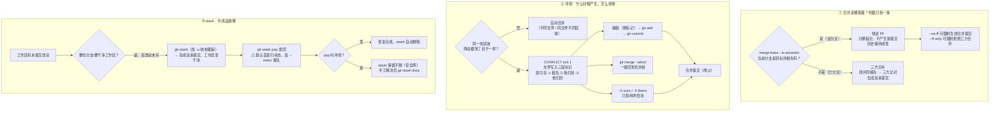

# 第 6 课：合并与冲突

> 所属阶段：阶段 2《个人工作流》｜ 水平：入门→进阶过渡 ｜ 本课知识点：快进与三方合并、冲突产生与解决、git stash
> 故事情节：**分身汇合**——两个分支改了同一处，Git 说"这个我判断不了，你来"。
> 阶段 2 概览把冲突的定位写得很清楚：**冲突不是错误**，它是 Git 明确告诉你"这两处改动我无法自动合并，请你判断"——**它是保护机制不是故障**。

## 🎯 本课目标

- 判断一次合并会走快进还是三方合并，知道何时该用 `--no-ff` 保留分支结构。
- 理解冲突产生的真实原因，手工制造并正确解决一次冲突，会用 `--abort` 中止。
- 用 `git stash` 在多任务切换时保存半成品，并知道它**丢得掉什么**。

> 📖 **与课 5 的衔接**：课 5 证明了「分支是指针不是副本」。这条结论在本课直接兑现——
> **快进合并之所以能"快进"，正是因为分支只是指针，可以沿着提交链直接往前挪，一个字节都不用复制**。
> 如果你的脑子里还是"分支=副本"，那"快进不产生新提交"这件事就会变得无法理解。

---

## 第一幕：起源与场景引入

> 🏛️ **起源**：合并这件事，比 Git 古老得多，而它的核心算法在 Git 之前就已定型。

**三方合并（three-way merge）** 不是 Git 发明的。它最早出现在 1980 年代的 **RCS**（Revision Control System），后来被 CVS、SVN 继承。Git 做的最重要一件事是：**因为提交之间有父指针，Git 能自动算出"共同祖先"是谁**，而 SVN 需要你手工指定。

这个差别巨大：
- 在 SVN 里合并，你得自己回答"这两个分支是从哪个版本分开的"。
- 在 Git 里，`git merge-base` 一瞬间就给出了答案，**因为提交图里已经写好了血缘关系**（课 3 讲过：每个 commit 都有 parent）。

而 **快进合并** 是 Git 特有的——它之所以存在，恰恰因为分支是指针。SVN 的分支是目录副本，"把指针往前挪一下"这个操作在它那儿根本无法表达。

> 🎬 **场景**：你在 `feature` 分支上开发用户积分功能，同时同事在 `master` 上修了个线上 bug。

你的工作告一段落，准备把 feature 合回 master。这时三种情况会依次撞到你面前：

1. **你建分支之后 master 一直没动过**——`git merge feature` 之后你去看 `git log`，**发现没有"合并提交"这个东西**，历史是一条直线。你怀疑"合并到底发生了吗"。
2. **两边都改了 `config.py` 的第 42 行**——Git 打出 `CONFLICT`，文件里冒出 `<<<<<<<` 这种从没见过的符号。你的第一反应是"仓库坏了"。
3. **功能写了一半，老板让你立刻去 master 修个紧急 bug**——你的改动还不能提交（提交会污染历史），但课 5 说过"切换时未提交改动可能被带过去，也可能被拒绝"。**半成品到底该放哪？**

**这三个场景，答案都在同一件事里**：Git 是怎么把两条分叉的线重新接起来的，以及当它接不上的时候，它把判断权交给了谁。

**核心矛盾**：既然 Git 号称"自动合并"，为什么有时候它"判断不了"？它判断的**依据**到底是什么？

**本课就是要把这个判断依据拆开。** 拆开之后你会发现：冲突不是 Git 能力不足，而是**它拒绝替你猜**。

---

## 第二幕：认知冲突

### 反直觉 1：快进合并"没有合并"

执行 `git merge feature`，看到输出 `Fast-forward`，然后 `git log` 里**找不到任何合并提交**。

```console
$ git merge feature
Updating 4d35696..8c52c60
Fast-forward
 app.py | 2 +-
 1 file changed, 1 insertion(+), 1 deletion(-)

$ git log --oneline -1
8c52c60 c3-feature          ← 这就是 feature 原本的头，不是新提交
```

**矛盾点**：我执行了"合并"，但没有任何东西被"合并"——没有新提交，没有冲突，没有记录。这算合并吗？

**真相**：算。因为**合并的定义是"把另一条线的改动纳入当前分支"，而不是"产生一个新提交"**。当当前分支只是落后时，"纳入"的最省事做法就是把指针往前挪——这正是课 5 的指针模型给你的推论。

验证一下合并前后两个分支是否完全重合（实测）：

```console
$ git rev-parse master
8c52c60b...
$ git rev-parse feature
8c52c60b...                  ← 完全相同的 SHA
```

**代价**：历史里**看不出"这里曾经有个功能分支"**。这就是 `--no-ff` 存在的唯一理由（知识点 1 详述）。

### 反直觉 2：带冲突标记的文件，居然能提交成功

这是本课**最危险的一个反直觉**，先在这里摆在明面上。

冲突发生后，如果你**不解决冲突**，直接 `git add` + `git commit`：

```console
$ git add a.txt
$ git commit --no-edit
[master 33931a7] Merge branch 'feature'      ← exit 0，提交成功！

$ git status
On branch master
nothing to commit, working tree clean        ← 状态干净，一切"正常"

$ cat a.txt
<<<<<<< HEAD
M
=======
F
>>>>>>> feature                              ← 冲突标记被永久写进了提交
```

**矛盾点**：课本上说"必须解决冲突才能提交"，为什么 Git 允许？

**真相**：Git 判断的不是"你有没有删掉 `<<<<<<<`"，而是"这个文件的冲突状态有没有被 `git add` 标记为已解决"。**`git add` 的语义是"我确认这个文件的当前内容就是最终版本"**——你 add 了带标记的内容，等于告诉 Git"我就要这个"。

**这是 Git 的设计选择，不是 bug**：有时冲突标记确实是你想要保留的内容（比如你在写一份讲冲突标记的教材）。但**99.9% 的情况下它是事故**。

好消息：它可被检测（实测 `git grep -n -E '^(<<<<<<<|=======|>>>>>>>)'` 能抓出来），也可被修复（`git reset --hard HEAD~1`）。**坏消息**：`git status` 不会给你任何提示，所以**提交前必须自己看一眼**。

### 反直觉 3：`stash pop` 回来后，暂存区"降级"了

你精心把改动分成了"已暂存"和"未暂存"两部分，stash 保存，pop 回来：

```console
$ git status -s          # stash 之前
M  a.txt                 ← 注意：M 在第一列 = 已暂存

$ git stash
$ git stash pop
$ git status -s
 M a.txt                 ← M 跑到第二列 = 变成未暂存了！
```

**矛盾点**：stash 声称保存了"工作区 + 索引状态"，为什么回来时索引状态丢了？

**真相**：`stash pop` **默认不恢复索引**。要恢复得加 `--index`（实测：加了之后 `git status -s` 显示 `M ` 回到第一列）。

这是一个**极其常见的坑**：很多人 `git stash` 之后再 pop，发现"我 staged 好的文件怎么变成 unstaged 了"，然后以为自己记错了。

### 反直觉 4：合并策略叫 ort，不叫 recursive

几乎所有中文教程（包括 2021 年之前的）都会告诉你：Git 默认的合并策略是 **recursive**。

**这在今天已经不对了**（实测，本机 Git 2.43.0）：

```console
$ git merge feature
Merge made by the 'ort' strategy.            ← 是 ort，不是 recursive
```

**`ort` 自 Git 2.34（2021 年 11 月）起成为默认策略**，取代了从 v0.99.9k 一直沿用到 v2.33.0 的 recursive。名字是 "Ostensibly Recursive's Twin"（"表面上的递归双子"）的缩写——**它是 recursive 的重写版，目标是产生与 recursive 相同的结果，但更快、更正确**。

在包含大量重命名的合并中，ort 比 recursive 快 500 倍；在 rebase 这类连续合并中加速超过 9000 倍。

**这意味着**：如果你照着老教程看到输出 `Merge made by the 'recursive' strategy` 而你的机器输出 `ort`，**不是你配置错了，是 Git 更新了**。

---

## 第三幕：层层揭示

### 知识点 1：快进合并与三方合并

#### 一句话定义

**快进（fast-forward）**：当目标分支是当前分支的**后代**时，合并只需要把当前分支的指针往前挪，**不产生任何新提交**。
**三方合并（three-way merge）**：两条线已经**分叉**，Git 找出共同祖先，拿「祖先版本 / 我们的版本 / 他们的版本」三份做比较，合成一份新内容，**并产生一个有两个父的合并提交**。

#### 直觉建立：两种情况的分水岭

想象两个人从同一个路口出发：

- **情况 A（没分叉）**：你走在前面，我在后面。我"追上你"只需要**走到你站的位置**——不需要做任何整合。这就是快进。
- **情况 B（分叉了）**：我们各走了一条路，现在要汇合。必须**比较我们各自偏离路口多少**，然后把两条路上的改动都保留下来。这就是三方合并。

**关键判据只有一个**：当前分支是不是目标分支的祖先？

#### 核心原理：判据是可查询的

不要靠猜，Git 提供了直接回答这个问题的命令（实测）：

```bash
git merge-base --is-ancestor master feature && echo "是祖先 → 会快进" || echo "不是祖先 → 必须三方合并"
```

- 没分叉时输出 `是祖先 → 会快进`，退出码 0
- 分叉后输出 `不是祖先 → 必须三方合并`，退出码 1

**实测对照**：

| 情况 | `merge-base --is-ancestor master feature` | 实际走哪种合并 |
|------|------------------------------------------|----------------|
| master 建分支后没动过 | 是祖先（exit 0） | 快进（无新提交） |
| master 和 feature 各有新提交 | 不是祖先（exit 1） | 三方（产生合并提交） |

#### 示例演示 1：快进合并

```bash
# 准备：master 有一个提交，feature 往前走了两个
git init -q
printf 'v1\n' > app.py
git add app.py && git commit -q -m "c1"
git switch -q -c feature
printf 'v2\n' > app.py && git add app.py && git commit -q -m "c2-feature"
printf 'v3\n' > app.py && git add app.py && git commit -q -m "c3-feature"
git switch -q master

echo "合并前 master=$(git rev-parse --short master) feature=$(git rev-parse --short feature)"
git merge feature
echo "合并后 master=$(git rev-parse --short master) feature=$(git rev-parse --short feature)"
```

实测输出：

```console
合并前 master=4d35696 feature=8c52c60
Updating 4d35696..8c52c60
Fast-forward
 app.py | 2 +-
 1 file changed, 1 insertion(+), 1 deletion(-)
合并后 master=8c52c60 feature=8c52c60     ← 两个指针完全重合
```

**怎么证明没有新提交产生？** 看合并提交的父数量：

```bash
git rev-list --parents -n 1 HEAD | wc -w
```

输出 **2** → 只有「自己 + 1 个父」两个字段 = 普通提交。如果是合并提交，输出会是 **3**（自己 + 2 个父）。

#### 示例演示 2：`--no-ff` 强制保留分支结构

同样的场景，加 `--no-ff`：

```bash
git merge --no-ff feature -m "merge feature"
```

实测输出：

```console
Merge made by the 'ort' strategy.
 app.py | 2 +-
 1 file changed, 1 insertion(+), 1 deletion(-)
```

```console
$ git log --oneline --graph --all
*   f438ea6 merge feature
|\  
| * c45dd1f c2
|/  
* fa662e0 c1
```

注意 `f438ea6` 后面的 `|\` —— 这就是**合并提交**在图形化 log 里的样子。看看它的内部（实测）：

```console
$ git cat-file -p HEAD
tree 1c6e0e7104b498aecd6c156e6aa23ca3740b8770
parent fa662e030de2ae9c7dcd9a336d41af2a924a4f12     ← 父 1：master 原来位置
parent c45dd1fa6648e844c7a3b680180c6d630db7beeb     ← 父 2：feature
author T <t@e.com> 1788861885 +0800
committer T <t@e.com> 1788861885 +0800

merge feature
```

**两个 parent 字段**——这就是"合并提交"的本质，也是课 3 说的"历史是一条有向图"的**唯一来源**：**历史之所以不是一条直线，全靠这类有两个父的提交撑起来**。

> 📌 **一颗子弹打两次**：课 3 你见过 parent 字段，课 5 你见过分支指针。**合并提交就是这两者的合流**——它同时指向两条线的末端。

#### 示例演示 3：`--ff-only` 是"我只要干净的历史"

如果你**明确要求**"只接受快进，分叉了就别动"：

```bash
git merge --ff-only feature
```

实测（已分叉的情况）：

```console
hint: Diverging branches can't be fast-forwarded, you need to either:
hint: 	git merge --no-ff
hint: or:
hint: 	git rebase
fatal: Not possible to fast-forward, aborting.
```

退出码 **128**（Git 的"致命错误"码）。**并且工作区状态完全没变**——这个"要么干净要么别动"的特性，让 `--ff-only` 成为自动化脚本和 `git pull` 配置的常用选择。

#### 示例演示 4：三方合并——不同文件自动合并

```bash
git init -q
printf 'base\n' > a.txt && git add a.txt && git commit -q -m "base"
git switch -q -c feature
printf 'feat\n' > feat.txt && git add feat.txt && git commit -q -m "add feat.txt"
git switch -q master
printf 'mast\n' > mast.txt && git add mast.txt && git commit -q -m "add mast.txt"
git merge feature
```

实测：

```console
Merge made by the 'ort' strategy.
 feat.txt | 1 +
 1 file changed, 1 insertion(+)
 create mode 100644 feat.txt
```

合并后三个文件都在（`a.txt feat.txt mast.txt`）。**两个分支各自加了个新文件，互不干涉，Git 直接把两边的改动都收下**。

#### 示例演示 5：三方合并——同一文件不同位置，仍然自动合并

这是理解**冲突到底什么时候产生**的关键实验。两边改同一个文件，但**改的是不同行**：

```bash
git init -q
printf 'line1\nline2\nline3\nline4\nline5\n' > a.txt && git add a.txt && git commit -q -m "base"
git switch -q -c feature
printf 'line1\nFEATURE-EDIT\nline3\nline4\nline5\n' > a.txt   # 改第 2 行
git add a.txt && git commit -q -m "feat edits line2"
git switch -q master
printf 'line1\nline2\nline3\nline4\nMASTER-EDIT\n' > a.txt   # 改第 5 行
git add a.txt && git commit -q -m "master edits line5"
git merge feature
```

实测：

```console
Auto-merging a.txt
Merge made by the 'ort' strategy.
 a.txt | 2 +-
 1 file changed, 1 insertion(+), 1 deletion(-)

$ cat a.txt
line1
FEATURE-EDIT        ← feature 的改动
line3
line4
MASTER-EDIT         ← master 的改动
```

**两边都对，Git 都要**——这就是三方合并在"不冲突"时的行为。**重点：冲突不是"改了同一个文件"，而是"改了同一个区域"**。这个区分在知识点 2 会精确化。

#### 进阶：`--squash` 把一条线压成一个提交

```bash
git merge --squash feature
git commit -m "squashed feature"
```

实测：`--squash` 会把 feature 上所有提交的**累积效果**放进暂存区，然后你自己提交。结果历史里**只有一个新提交**，feature 的 3 个提交被压扁：

```console
* b5a0d1c feat-3
* 85b855f feat-2
* a9d4e5c feat-1
| * e76c45e squashed feature      ← master 上只有一个提交
|/  
* 98a6382 base
```

⚠️ **一个必须知道的副作用**（实测）：`--squash` **不会把 feature 标记为已合并**：

```console
$ git branch --merged
* master                          ← 只有 master，没有 feature！

$ git branch -d feature
error: the branch 'feature' is not fully merged.
If you are sure you want to delete it, run 'git branch -D feature'
```

因为合并提交没有 feature 作为父，Git 无法从历史上看出"feature 已经合进来了"。**删这个分支必须用 `-D`**。内容确实都在（`a.txt` 内容是 feature 的最终版本），只是**血缘关系断了**。

#### 进阶：octopus 合并（一次合多条）

```bash
git merge b1 b2 b3
```

实测：

```console
Fast-forwarding to: b1
Trying simple merge with b2
Trying simple merge with b3
Merge made by the 'octopus' strategy.
```

产生的提交有**三个父**。⚠️ **octopus 拒绝处理任何需要人工判断的冲突**（实测）：

```console
Trying simple merge with b2
Simple merge did not work, trying automatic merge.
Auto-merging a.txt
ERROR: content conflict in a.txt
fatal: merge program failed
```

**设计意图**：octopus 只用于"把若干个互不相干的主题分支一次性捆起来"（比如一次发布合并 5 个独立小改动）。有冲突就**逐个合并**——这是它故意的限制，不是缺陷。

#### 常见误区（知识点 1）

1. **"合并一定会产生一个合并提交"**：错。快进合并一个提交都不产生。
2. **"快进合并"是把 feature 的文件复制过来**：错。只是把指针往前挪，一个字节都没复制（课 5 已证明分支是指针）。
3. **"recursive 是默认策略"**：曾经是，**Git 2.34 起默认改为 ort**（本机 2.43.0 实测输出 `Merge made by the 'ort' strategy`）。
4. **"`--no-ff` 更好，应该总是用"**：不一定。`--no-ff` 保留结构信息但也让历史变成图。**团队约定优先**——有的团队要线性历史（用 rebase），有的要保留分支痕迹（用 `--no-ff`）。
5. **"`--squash` 之后 feature 就算合并了"**：不算。`git branch --merged` 里没有它，`-d` 会被拒绝（实测 exit 1）。

#### 一句话记住

> **没分叉 → 挪指针（快进）；分叉了 → 找祖先、三方比、生个双亲提交。**

---

### 知识点 2：冲突是怎么产生的、怎么解决

#### 一句话定义

**冲突（conflict）**：三方合并时，「我们的版本」和「他们的版本」**在同一块区域做了不同的修改**，Git 的规则无法判断该保留谁，于是**停下来把决定权交给你**。

#### 直觉建立：Git 判断的到底是什么

回想知识点 1 的示例 5：两边改同一个文件的**不同行**，Git 自动合并了。为什么？

**因为 Git 的合并是按"块（hunk）"而不是按"文件"来判定的。** 它的规则可以概括成四条：

| 情况 | 祖先版本 | 我们的 | 他们的 | Git 的行为 |
|------|----------|--------|--------|------------|
| 都没改 | A | A | A | 保持 A |
| 只有我们改了 | A | **B** | A | 取 B |
| 只有他们改了 | A | A | **C** | 取 C |
| **两边都改了，且改得不一样** | A | **B** | **C** | ❓ **冲突，交给你** |
| 两边改了，但改成一样 | A | **B** | **B** | 取 B（不冲突） |

**只有最后两种"两边都动了同一块"的情况才需要区分**，而其中"改成一样"Git 能自己判断（结果相同，取谁都行）。

所以冲突的确切定义是：**同一块区域，两边都改了，且改成了不同的样子**。

> 📌 **这就是第二幕那个问题的答案**：Git 不是"能力不足判断不了"，而是**它知道这里有两个合理但互斥的选择，它拒绝替你猜**。
> 阶段 2 概览的原话是：**冲突是 Git 明确告诉你"这两处改动我无法自动合并，请你判断"。它是保护机制不是故障。**

#### 核心原理：冲突时 Git 在磁盘上做了什么

冲突发生时，Git 做了三件事（实测可验证）：

1. **在文件里写入冲突标记**，把三个版本都摆在你面前
2. **在 `.git/MERGE_HEAD` 里记下**"我正在和谁合并"
3. **在索引里为这个文件存三个版本**（而不是通常的一个）

第 3 点最值得看。冲突时执行（实测）：

```console
$ git ls-files -u
100644 030e37007b38428e015499ba577ca59e89f007d6 1	a.txt     ← 1 = 共同祖先
100644 2aecbbb73f11ecdf41f44d3fa490411fe612579e 2	a.txt     ← 2 = 我们的（ours）
100644 b4769389242ad2462d55d3987acf828a4ebfa9d3 3	a.txt     ← 3 = 他们的（theirs）
```

**一个文件三个 blob，编号 1/2/3**。这直接对应三方合并的三方。这也意味着**冲突时 Git 把三个版本都存下来了，你随时可以取回任意一方**：

```bash
git show :1:a.txt    # 共同祖先版本
git show :2:a.txt    # 我们的版本（HEAD）
git show :3:a.txt    # 他们的版本（MERGE_HEAD）
```

实测输出：

```console
$ git show :1:a.txt
line1
ORIGINAL
line3

$ git show :2:a.txt
line1
MASTER-VERSION
line3

$ git show :3:a.txt
line1
FEATURE-VERSION
line3
```

**这三行命令是你在复杂冲突中的"后悔药"**——改乱了就取回重来，不用重新制造冲突。

#### 示例演示 1：手工制造一次冲突

```bash
git init -q
printf 'line1\nORIGINAL\nline3\n' > a.txt && git add a.txt && git commit -q -m "base"
git switch -q -c feature
printf 'line1\nFEATURE-VERSION\nline3\n' > a.txt && git add a.txt && git commit -q -m "feat changes line2"
git switch -q master
printf 'line1\nMASTER-VERSION\nline3\n' > a.txt && git add a.txt && git commit -q -m "master changes line2"
git merge feature
```

实测输出：

```console
Auto-merging a.txt
CONFLICT (content): Merge conflict in a.txt
Automatic merge failed; fix conflicts and then commit the result.
```

**退出码是 1**（不是 0）。这一点很重要——**脚本里可以用 `if ! git merge ...; then` 来检测冲突**。

看看现在的状态（实测）：

```console
$ git status
On branch master
You have unmerged paths.
  (fix conflicts and run "git commit")
  (use "git merge --abort" to abort the merge)

Unmerged paths:
  (use "git add <file>..." to mark resolution)
	both modified:   a.txt

no changes added to commit (use "git add" and/or "git commit -a")
```

**`git status` 在冲突时就是你的操作手册**——它把三件事都写明了：有未合并路径、怎么解决、怎么中止。

短格式（实测）：

```console
$ git status -s
UU a.txt
```

`UU` 是冲突的身份证。**两个 U** = "both modified"（两边都改了）。记住它：

| 状态码 | 含义 |
|--------|------|
| `UU` | 两边都修改了（最常见的冲突） |
| `UD` | 我们改了，他们删了 |
| `DU` | 我们删了，他们改了 |
| `AA` | 两边都新增了同名文件 |
| `M ` | 已解决并已 add（第一列 M = 已暂存） |

再看文件内容（实测）：

```console
$ cat a.txt
line1
<<<<<<< HEAD
MASTER-VERSION
=======
FEATURE-VERSION
>>>>>>> feature
line3
```

**三段标记的含义**：

```
<<<<<<< HEAD          ← 从这里开始，是"我们的"（当前分支 master）
MASTER-VERSION
=======               ← 分隔线
FEATURE-VERSION
>>>>>>> feature       ← 到这儿结束，是"他们的"（被合并的分支 feature）
```

⚠️ **此时你在哪个分支上？** 实测 `git branch --show-current` 输出 **`master`**——**你还在自己的分支上，没有"切到某个中间状态"**。合并是一个"进行中的状态"，不是一个地方。

#### 示例演示 2：`diff3` —— 让你看见"原来是什么样"

默认冲突标记只给你两方。但**判断谁对，往往取决于"原来是什么样"**。加上 `diff3` 风格：

```bash
git config merge.conflictStyle diff3
```

再制造同样的冲突，文件变成（实测）：

```
line1
<<<<<<< HEAD
MASTER-VERSION
||||||| 64a7571          ← 新增：共同祖先版本
ORIGINAL
=======
FEATURE-VERSION
>>>>>>> feature
line3
```

中间多了一段 `|||||||` —— **这就是基线版本**。有了它，你能看出"master 把 ORIGINAL 改成了 MASTER-VERSION，feature 把 ORIGINAL 改成了 FEATURE-VERSION"，判断依据完整了。

**强烈推荐开启**，尤其是团队协作时：

```bash
git config --global merge.conflictStyle diff3
```

对已经冲突的文件，可以两种风格来回切（实测）：

```bash
git checkout --conflict=diff3 a.txt    # 切到 diff3
git checkout --conflict=merge a.txt    # 切回默认
```

输出 `Recreated 1 merge conflict` —— **它重新生成冲突标记，不会丢掉你的编辑吗？会丢掉**。所以这两个命令只在**刚冲突、还没动手改**的时候用。

#### 示例演示 3：完整解决流程

解决冲突的标准动作是三步：**编辑 → add → commit**。

```bash
# ① 编辑：把文件改成你想要的最终样子（删掉所有标记）
printf 'line1\nRESOLVED-BOTH\nline3\n' > a.txt

# ② add：告诉 Git "这个文件的当前内容就是最终版本"
git add a.txt

# ③ commit：完成合并
git commit --no-edit
```

实测：

```console
$ git add a.txt
$ git status -s
M  a.txt                     ← 注意：从 UU 变成了 M（已解决）

$ git commit --no-edit
[master cecb062] Merge branch 'feature'
```

⚠️ **第 ② 步 `git add` 不可省略**——这是新手最常卡住的地方。它的语义不是"加入版本库"，而是**"标记冲突已解决"**。不做这一步，Git 会拒绝提交（实测）：

```console
$ git commit --no-edit
error: Committing is not possible because you have unmerged files.
hint: Fix them up in the work tree, and then use 'git add/rm <file>'
hint: as appropriate to mark resolution and make a commit.
fatal: Exiting because of an unresolved conflict.
U	a.txt
```

退出码 **128**。

完成后看历史（实测）：

```console
$ git log --oneline --graph --all
*   cecb062 Merge branch 'feature'
|\  
| * 7a5d77b feat changes line2
* | bdc1283 master changes line2
|/  
* 71ea4db base
```

**两条线在 `cecb062` 汇合，它有两个父**——和知识点 1 的 `--no-ff` 结果形状一样（因为这里必然是三方合并）。

**合并提交的信息从哪来？** Git 已经帮你写好了，在 `.git/MERGE_MSG`（实测）：

```
Merge branch 'feature'

# Conflicts:
#	a.txt
```

用 `git commit --no-edit` 就是直接用它。想改就 `git commit -m "自定义信息"`（实测可写为 `CUSTOM merge message`）。

#### 示例演示 4：`--abort` —— 一键回到合并前

**这是本课最重要的"安全网"命令**。冲突搞不定、改乱了、或者你发现"这个合并现在不该做"：

```bash
git merge --abort
```

实测（退出码 0）：

```console
$ git merge --abort
$ git status -s
                         ← 空，工作区干净

$ cat a.txt
line1
MASTER-VERSION
line3                    ← 回到 master 的版本，冲突前的样子

$ cat .git/MERGE_HEAD
cat: .git/MERGE_HEAD: No such file or directory    ← 合并状态已清除
```

**`--abort` 恢复三样东西**（实测 HEAD SHA 与合并前完全一致）：HEAD 位置、暂存区、工作区。**它把你送回执行 `git merge` 之前的那一瞬间。**

> 🛟 **记住这条**：`git merge --abort` **永远是你的退路**。冲突不可怕，可怕的是不知道能退。

⚠️ **两个相关但不同的命令**（实测）：

```bash
git merge --quit       # 退出合并状态，但保留工作区的冲突标记
git merge --continue   # 解决完冲突后继续（等价 git commit）
```

`--quit` 实测后 `MERGE_HEAD` 消失、`UU` 状态仍在，此时再执行 `--continue` 会报：

```console
fatal: There is no merge in progress (MERGE_HEAD missing).
```

退出码 128。**`--quit` 用得少，它相当于"我认了这堆冲突标记，但不当作合并处理"**——一般用于你想把冲突留到以后再收拾的场景。

#### 示例演示 5：整文件取舍 —— `--ours` 与 `--theirs`

有时候冲突解决就是"整块用我的"或"整块用他的"。两种方式：

**方式 A：冲突已经发生后，用 `git checkout`**（实测）

```bash
git checkout --ours a.txt      # 取我们的版本（master）
# 实测 a.txt 变成 MASTER-VERSION
git checkout --theirs a.txt    # 取他们的版本（feature）
# 实测 a.txt 变成 FEATURE-VERSION
```

⚠️ 注意：执行后文件**仍是 `UU` 状态**（实测 `git status -s` 显示 `UU a.txt`），**还要 `git add` 才算解决**。

**方式 B：合并时就指定倾向，用 `-X`**（实测）

```bash
git merge -X ours feature      # 冲突的地方都取我们的
git merge -X theirs feature    # 冲突的地方都取他们的
```

实测结果：

```console
$ git merge -X ours feature
Auto-merging a.txt
Merge made by the 'ort' strategy.
$ cat a.txt
line1
MASTER-VERSION         ← 取了 master 的
line3
```

**`-X` 的精妙之处**：它**只影响冲突块，不影响不冲突的部分**。实测：feature 分支上新增了一个文件 `fo.txt`，用 `-X ours` 合并后——

```console
a.txt=[MAST]              ← 冲突块取了 ours
fo.txt exists? YES        ← 但不冲突的新文件照样收下
```

⚠️ **`-X ours` ≠ `-s ours`**，这是 Git 里最容易混淆的一对（实测对照）：

| 命令 | 作用范围 | 对方的不冲突改动 | 实测结果 |
|------|----------|------------------|----------|
| `git merge -X ours feature` | 只管**冲突块** | ✅ 保留 | `fo.txt` 被收下 |
| `git merge -s ours feature` | **整个树**全丢 | ❌ 全部丢弃 | `a.txt` 保持 M，`ff.txt` **不存在** |

`-s ours` 的实测：

```console
$ git merge -s ours feature
Merge made by the 'ours' strategy.
$ cat a.txt
M                        ← 完全是 master 的内容
$ ls ff.txt
ls: cannot access 'ff.txt': No such file or directory    ← feature 的新文件没了！
```

**`-s ours` 的含义是"记录一次合并，但完全不采纳对方的内容"**。它生成一个合并提交（有两个父），但树完全是自己的。用途很窄：标记一个分支"已被废弃性地合并"（比如某个实验分支不想要了，但希望 Git 知道"这个已经处理过"）。

⚠️ **日常几乎不该用 `-s ours`**——它会静默丢弃别人的工作。

#### 进阶：特殊的冲突类型

**① 改/删冲突（modify/delete）**——你改了文件，对方删了它：

```bash
# feature 删除 a.txt，master 修改 a.txt
git merge feature
```

实测：

```console
CONFLICT (modify/delete): a.txt deleted in feature and modified in HEAD.
 Version HEAD of a.txt left in tree.
```

状态是 `UD`（实测）。**Git 的默认处理是"把 HEAD 的版本留在工作区"**——因为删掉别人刚改过的东西太危险。你可以 `git add a.txt`（保留）或 `git rm a.txt`（确认删除）。

**② 重命名冲突的处理其实很聪明**（实测）：feature 把 `old.txt` 改名为 `new.txt`，master 修改了 `old.txt` 的内容——

```console
$ git merge feature
Merge made by the 'ort' strategy.
 old.txt => new.txt | 0
 1 file changed, 0 insertions(+), 0 deletions(-)
 rename old.txt => new.txt (100%)

$ cat new.txt
line1
EDITED-BY-MASTER         ← master 的修改被带进了改名后的文件
```

**Git 认出了这是同一个文件，把改动合并进了新名字的文件里**。这叫**重命名检测（rename detection）**，是 ort 策略的强项之一（前面提到的 500 倍加速主要就来自这里）。

**③ 多个文件冲突时，先数一数**（实测 3 个文件全冲突）：

```bash
git diff --name-only --diff-filter=U | wc -l
```

输出 `3`。**先知道规模再动手**，比一个个撞过去高效得多。要批量处理，可以用 `git merge -X theirs feature` 一次性按同一策略解决（实测 3 个文件全部取 feature 版本）。

#### ⚠️ 本课最大陷阱：冲突标记被提交进代码

这个在第二幕已经预警过，这里给出完整的可执行防治方案。

**为什么会发生**：`git add` 的语义是"确认当前内容"，不是"确认冲突已解决"。带标记的内容被 add 后，Git 认为你就是要这个。

**实测全过程**：

```console
$ git add a.txt && git commit --no-edit
[master 33931a7] Merge branch 'feature'      ← exit 0，成功了

$ git status
nothing to commit, working tree clean        ← 完全看不出问题

$ cat a.txt
<<<<<<< HEAD
M
=======
F
>>>>>>> feature                              ← 标记进了代码库
```

**危害**：`<<<<<<<` 不是任何编程语言的合法语法（在多数语言里会直接编译失败），而且它会被推送、被别人拉走、进入 CI。

**检测**（实测有效）：

```bash
git grep -n -E '^(<<<<<<<|=======|>>>>>>>)' -- .
```

实测输出：

```console
a.txt:1:<<<<<<< HEAD
a.txt:3:=======
a.txt:5:>>>>>>> feature
```

⚠️ **关于 `git diff --check` 的一个重要限制**（实测）：

`git diff --check` 确实会报 `leftover conflict marker`，**但它只检查"工作区 vs 索引"的差异**。也就是说：

| 时机 | `git diff --check` | 结果 |
|------|--------------------|------|
| 冲突刚发生、**还没 `git add`** | ✅ 报出 3 处标记，exit 2 | 有效 |
| **`git add` 之后** | ❌ **什么都不报，exit 0** | **失效** |
| 已提交之后 | ❌ exit 0 | 失效 |

⚠️ 而"误提交"恰恰发生在 **`git add` 之后**——**所以 `diff --check` 拦不住本课这个陷阱**。

想让它在 add 之后仍然有效，得加 `--cached`（实测 exit 2，能报出 3 处）：

```bash
git diff --cached --check     # 检查"索引 vs HEAD"，add 之后仍有效
```

**最可靠的还是 `git grep` 全文搜索**，因为它直接搜工作区文件内容，与 Git 的三区状态无关。

**从根上预防**：用 pre-commit 钩子拦截（实测有效）：

```bash
cat > .git/hooks/pre-commit <<'EOF'
#!/bin/sh
if git grep -n -E '^(<<<<<<<|=======|>>>>>>>)' -- . ; then
  echo "BLOCKED: conflict markers found" >&2
  exit 1
fi
EOF
chmod +x .git/hooks/pre-commit
```

装了钩子之后再尝试提交带标记的内容，实测：

```console
a.txt:1:<<<<<<< HEAD
a.txt:3:=======
a.txt:5:>>>>>>> feature
BLOCKED: conflict markers found
（commit 退出码=1，提交被拦下）

$ git log --oneline -1
d4e6f05 mast                 ← 没有产生新提交
```

钩子机制课 12《仓库工程实践》会系统讲。

**修复**（已提交但还没推送）：`git reset --hard HEAD~1` 回到合并前重来（实测有效）。已推送的处理留到课 11《误操作救援》。

#### 常见误区（知识点 2）

1. **"冲突是 Git 出错了"**：不是，是保护机制（阶段 2 概览原话）。Git 拒绝替你猜。
2. **"改了同一个文件就会冲突"**：错。**改同一文件的不同区域不冲突**（实测示例 5 自动合并成功）。
3. **"解决完冲突就完事了"**：必须 `git add`，否则 `git commit` 报 exit 128。
4. **"带冲突标记也能提交，说明 Git 会拦我"**：**不会拦**（实测 exit 0，且 `git status` 显示 clean）。这是本课最危险的点。
5. **"`-X ours` 和 `-s ours` 是一回事"**：完全不是。前者只管冲突块（对方的不冲突改动仍保留），后者**丢弃对方全部内容**。
6. **"`--abort` 会丢掉我解决冲突的编辑"**：会。所以**先决定要不要 abort**——改到一半想 abort，编辑就没了。
7. **"冲突时我"在某条分支上"**"**：你仍在原来的分支上（实测 `master`）。合并是状态，不是地点。

#### 一句话记住

> **冲突 = 同一块区域两边都改且不一样；解决 = 编辑 + add + commit；搞不定 = `--abort` 一键回退。**

---

### 知识点 3：暂存现场：git stash

#### 一句话定义

**`git stash`**：把你**未提交的改动**（工作区 + 暂存区）打包存成一个特殊提交，然后把工作区恢复到 HEAD 的干净状态——**相当于"把半成品临时放到一边，等会儿再拿回来"**。

#### 直觉建立：它解决课 5 留下的那个问题

课 5 讲"切换分支时未提交改动的三种去向"，留下了两个尴尬：

- **不冲突 → 带过去**：会污染目标分支（你不想要）
- **冲突 → 被拒绝**：你想走也走不了

第三个选项就是 stash。实测课 5 场景 B（两分支同一文件内容不同，带脏改动切换）：

```console
$ git switch feature
error: Your local changes to the following files would be overwritten by checkout:
	a.txt
Please commit your changes or stash them before you switch branches.
Aborting
```

退出码 1。**注意 Git 的错误信息里自己就写了两条出路**：`commit` 或 `stash`。

**如果改动还不能提交**（半成品，提交会污染历史），stash 就是唯一正解：

```bash
git stash        # 收起来
git switch feature    # 现在能过去了
# ... 在 feature 上干活 ...
git switch master
git stash pop    # 拿回来
```

#### 核心原理：stash 也是提交

**这是理解 stash 全部行为的关键**：stash 不是某个神秘的外部存储，它**就是一个普通的 commit 对象**，只是被一个叫 `refs/stash` 的引用指着。

实测：

```console
$ cat .git/refs/stash
a18a3086927d59b6934a877d141fdc67ef07391c

$ git cat-file -p a18a308
tree ce0c1109d49fc6790acfcd0d0724a22ad71d55b7
parent 036abf217dd27dd3660f498aac14fa6681330533        ← 父 1：stash 时的 HEAD
parent f9e0f92a59309430ce464e187401b1d0debff3c9        ← 父 2：索引状态
author T <t@e.com> 1788861886 +0800
committer T <t@e.com> 1788861886 +0800

WIP on master: 036abf2 c1
```

**两个父**——又是双亲提交！父 1 是当时的 HEAD，父 2 是索引状态。**这解释了为什么 stash 能同时保存"已暂存"和"未暂存"两部分**：它们是两个独立的树。

也解释了第二幕的反直觉 3：**pop 时默认只恢复父 1（工作区）那一半，父 2（索引）那一半要 `--index` 才恢复**。

#### 示例演示 1：基本用法

```bash
git init -q
printf 'v1\n' > a.txt && git add a.txt && git commit -q -m "c1"
printf 'work in progress\n' > a.txt    # 改已跟踪文件
printf 'new\n' > new.txt               # 新建未跟踪文件

git status -s
git stash
git status -s
```

实测：

```console
$ git status -s
 M a.txt
?? new.txt

$ git stash
Saved working directory and index state WIP on master: 036abf2 c1

$ git status -s
?? new.txt                    ← 已跟踪文件的改动没了，但 new.txt 还在！
```

⚠️ **第一条重要结论**：**`git stash` 默认不收未跟踪文件**（`new.txt` 留下来了）。
要连未跟踪文件一起收，用 `-u`（见下方示例 4）。

工作区回到干净状态：

```console
$ cat a.txt
v1                            ← 回到了 c1 的内容
```

#### 示例演示 2：stash 是一个栈

```bash
git stash -m "work-one"
git stash -m "work-two"
git stash -m "work-three"
```

实测：

```console
$ git stash list
stash@{0}: On master: work-three      ← 最新
stash@{1}: On master: work-two
stash@{2}: On master: work-one        ← 最早
```

**栈结构**：`stash@{0}` 永远是最新的一条。可以做多条、按编号取用。

**给 stash 起名字很重要**——默认名字是 `WIP on master: 036abf2 c1`，三天后你完全认不出哪条是哪条。用 `git stash -m "描述"` 或 `git stash push -m "描述"`。

#### 示例演示 3：`pop` 与 `apply` 的区别

| 命令 | 恢复改动 | 是否删除 stash 记录 |
|------|----------|---------------------|
| `git stash pop` | ✅ | ✅ **删除** |
| `git stash apply` | ✅ | ❌ **保留** |

实测 `apply`：

```console
$ git stash apply
$ git stash list
stash@{0}: WIP on master: 036abf2 c1      ← 还在！
```

**什么时候用 apply**：同一份改动要应用到多个分支时。比如你的半成品在 feature 和 develop 上都用得上，就 `apply` 两次，最后手动 `drop`。

**pop = apply + drop**，日常用 pop 就够了。

#### 示例演示 4：`-u` 与 `-a` —— 未跟踪和忽略的文件

```bash
git stash -u      # 包含未跟踪文件（untracked）
git stash -a      # 包含所有，连 .gitignore 忽略的也算（all）
```

实测对照（有 `a.txt` 改动 + 未跟踪 `u.txt` + 被忽略的 `debug.log`）：

```console
$ git stash -u
Saved working directory and index state WIP on master: 4217ffa ignore
$ ls debug.log
debug.log          ← 还在（被忽略的文件不受 -u 影响）
$ ls u.txt
ls: cannot access 'u.txt': No such file or directory     ← 被收走了
```

```console
$ git stash -a
Saved working directory and index state WIP on master: 4217ffa ignore
$ ls debug.log
ls: cannot access 'debug.log': No such file or directory     ← 连被忽略的也收走了
```

⚠️ **`-a` 要谨慎**：它会把 `node_modules/`、编译产物这些**被忽略的大文件**也收进 stash，可能让 stash 变得巨大，而且恢复时容易和当前构建产物打架。**日常用 `-u` 就够了。**

#### 示例演示 5：`--keep-index` —— 只收未暂存的

场景：你 staged 了一部分改动准备提交，还有一部分没 staged。你想**只测试 staged 的那部分**（比如跑测试），把未 staged 的先收起来。

```bash
git stash --keep-index
```

实测：

```console
# 之前：MM a.txt（既 staged 又 unstaged）
$ git stash --keep-index
Saved working directory and index state WIP on master: 036abf2 c1

$ git status -s
M  a.txt                    ← 只剩 staged 部分（第一列 M）
$ cat a.txt
STAGED-CHANGE               ← 内容是 staged 的版本
```

**"保留索引"的意思就是：staged 的留在工作区，unstaged 的被收走。**

#### 示例演示 6：找回索引状态 —— `--index`

这是第二幕反直觉 3 的解药。实测对照：

```console
# 准备：a.txt 的改动已 staged（M 在第一列）
$ git stash
$ git stash pop
$ git status -s
 M a.txt                    ← M 在第二列，变成 unstaged 了
```

```console
$ git stash
$ git stash pop --index
$ git stash list
$ git status -s
M  a.txt                    ← M 回到第一列，staged 状态恢复
```

**如果你在意"哪些是 staged"，pop 时一律加 `--index`。**

#### 示例演示 7：`stash branch` —— 最优雅的"改到一半发现该开分支"

场景：你在 master 上写了一堆东西，突然意识到"这活儿应该在 feature 分支上干"。

```bash
git stash branch newbranch stash@{0}
```

实测：

```console
$ git stash branch newbranch stash@{0}
Switched to a new branch 'newbranch'
Dropped stash@{0} (f9580a78e168af8caecfdb97c8a0026d3d42626a)

$ git branch --show-current
newbranch
$ cat a.txt
wip                         ← 改动在这里
$ git stash list
                            ← 空了，已消费
```

**一条命令做了三件事**：以"stash 当时的 HEAD"为起点建分支 → 切过去 → 应用 stash 并删除它。

**为什么必须指定"以当时的 HEAD 为起点"？** 因为你的 stash 是基于旧版本的，如果直接应用到当前新版本上可能冲突。**它自动回到"你当初 stash 的那个时刻"，让改动能干净地应用**——这就是为什么它比"手动建分支再 pop"更可靠。

#### ⚠️ 陷阱：`stash pop` 冲突时，stash **不会**被删除

这是 stash 最需要知道的一条安全设计。实测：

```bash
# stash 时 a.txt = STASHED-WORK
# 之后 master 前进，a.txt = MASTER-MOVED
git stash pop
```

```console
Auto-merging a.txt
CONFLICT (content): Merge conflict in a.txt
...
The stash entry is kept in case you need it again.      ← Git 明确告诉你
```

退出码 1。检查：

```console
$ git stash list
stash@{0}: On master: my wip        ← 还在！没有被 drop
```

**因为 pop 失败了，Git 不敢删**——这是保护性设计。**"pop 冲突时 stash 保留"是好事**：你的半成品没丢。

**恢复步骤**（实测）：

```bash
# ① 手工解决冲突（和 merge 冲突一样的流程）
printf 'MANUALLY-RESOLVED\n' > a.txt
git add a.txt

# ② 手动删掉这条 stash（因为 pop 没能替你删）
git stash drop
```

```console
Dropped stash@{0} (d7d13007eefa2755fc20dd21ed8dc68ceff71d3e)
$ git stash list
                                    ← 空了
```

⚠️ **别忘第 ② 步**——否则这条 stash 会一直挂在列表里，哪天你 `git stash pop` 又会冒出来。

**如果不想要这次 pop 的结果，想退回干净状态**（实测有效）：

```bash
git checkout --ours a.txt     # 取当前 master 的版本，放弃 stash 的改动
```

#### 示例演示 8：查看与清理

```bash
git stash list                    # 列出所有
git stash show                    # 显示改动摘要
git stash show -p                 # 显示完整 diff
git stash drop stash@{1}          # 删指定一条
git stash clear                   # 清空所有
```

实测 `show`：

```console
$ git stash show
 a.txt | 2 +-
 1 file changed, 1 insertion(+), 1 deletion(-)

$ git stash show -p
diff --git a/a.txt b/a.txt
index 626799f..e9d25ac 100644
--- a/a.txt
+++ b/a.txt
@@ -1 +1 @@
-v1
+CHANGED
```

`git stash clear` 实测：2 条 → 0 条。

#### 💡 进阶：`stash clear` 之后还能救吗

**能**（实测）。`clear` 删的是 `refs/stash` 这个**引用**，不是提交对象。只要你知道 SHA：

```console
$ git stash clear
$ git stash list
                                    ← 空了

$ git cat-file -p 0f844bddd011501af93c8537e3f2af0480a2cde6
tree a514bc3077b8bc089339327474708b388930ffe3
parent 168ba306a856413dc19fc87a6a0eda84aa40dc10
parent 8c81e0141e7b31f650a4de83959280b3fca411f2
...
On master: precious                 ← 对象还在！

$ git stash apply 0f844bddd011501af93c8537e3f2af0480a2cde6
$ cat a.txt
IMPORTANT-WORK                      ← 救回来了
```

如果连 SHA 都没记住，用 `git fsck --lost-found` 找（实测输出 `dangling commit 0f844bdd...`）。

**这和课 4 的 `reset --hard`、课 5 的"删分支不删提交"是同一个道理**：危险在于**失去引用**，不在于数据被销毁。阶段 4《误操作救援》会系统讲这套思路。

#### stash 的正确定位

⚠️ **stash 不是"另一种提交"**。它的定位是**几分钟到几小时的临时存放**：

- ✅ 适合：切分支前的临时腾地方、pull 前先收起脏工作区
- ❌ 不适合：长期保存半成品（**用分支**）、跨机器同步（**stash 不跟着 push 走**）

**stash 是本地的、不进远端**——换台电脑你就看不到它了。想长期保存半成品，**开个分支提交上去**，哪怕提交信息写 `WIP`。

#### 常见误区（知识点 3）

1. **"stash 会收走所有改动"**：不收未跟踪文件（默认），要 `-u`。
2. **"pop 之后暂存状态还在"**：默认不在，要 `--index`（实测 `M ` vs ` M` 的差别）。
3. **"pop 失败会丢失我的改动"**：不会，Git 明说 `The stash entry is kept`，改动仍在列表里。
4. **"stash 能替代提交"**：不能。它不进远端、不进分支历史，长期保存请用分支。
5. **"`stash clear` 之后就彻底没了"**：对象还在（实测 `cat-file` 可读、`fsck` 能找到），只是引用没了。
6. **"stash 只有一个槽位"**：是栈，可以存多条，用 `stash@{n}` 索引。
7. **"`-a` 比 `-u` 更好"**：不一定，`-a` 会把 `.gitignore` 忽略的构建产物也收进去，容易惹麻烦。

#### 一句话记住

> **stash = 把半成品存成一个双亲提交、工作区清干净；`pop` 拿回来（默认丢暂存状态，加 `--index` 保住）；冲突时它不删自己，是你的安全网。**

---

## 第四幕：实操验证

> ⚠️ **本节每条命令都已在 WSL Ubuntu 24.04 / bash 5.2.21 / Git 2.43.0 上逐字跑通**。
> 输出中的 SHA、时间戳会与你的机器不同（内容寻址 + 时间戳决定），但**结构、退出码、状态码**应当一致。

### 技术域

**准备**：为避免污染你的真实全局配置，先隔离 HOME（这一条是课 3 评审时固化的必查项 #29）。

```bash
export HOME=/tmp/git-lesson06-home
rm -rf "$HOME"; mkdir -p "$HOME"
git config --global user.name "Zhang Wei"
git config --global user.email "zhangwei@example.com"
git config --global init.defaultBranch master
git config --global commit.gpgsign false

LAB=/tmp/git-lesson06
rm -rf "$LAB"; mkdir -p "$LAB"
cd "$LAB"
```

后续每个实验都用下面这个 `fresh` 函数开一个全新仓库，**互不依赖，可以单独重跑**：

```bash
fresh() {
  local d="/tmp/git-lesson06/$1"
  rm -rf "$d"; mkdir -p "$d"; cd "$d" || exit 1
  git init -q
}
```

#### 实验 1：快进合并——指针前移，不产生新提交

```bash
fresh ff
printf 'v1\n' > app.py; git add app.py; git commit -q -m "c1"
git switch -q -c feature
printf 'v2\n' > app.py; git add app.py; git commit -q -m "c2-feature"
printf 'v3\n' > app.py; git add app.py; git commit -q -m "c3-feature"
git switch -q master
echo "合并前 master=$(git rev-parse --short master) feature=$(git rev-parse --short feature)"
git merge feature
echo "合并后 master=$(git rev-parse --short master) feature=$(git rev-parse --short feature)"
git rev-list --parents -n 1 HEAD | wc -w
```

实测输出：

```console
合并前 master=73c297b feature=7ad4620
Updating 73c297b..7ad4620
Fast-forward
 app.py | 2 +-
 1 file changed, 1 insertion(+), 1 deletion(-)
合并后 master=7ad4620 feature=7ad4620     ← 两个指针完全重合
2                                          ← 字段数 2 = 只有 1 个父 = 普通提交
```

#### 实验 2：用 `is-ancestor` 预判合并方式

```bash
git merge-base --is-ancestor master feature && echo "是祖先 → 快进" || echo "不是祖先 → 三方"
# 制造分叉后再判一次
printf 'm\n' > m.txt; git add m.txt; git commit -q -m "c3-master"
git merge-base --is-ancestor master feature && echo "是祖先 → 快进" || echo "不是祖先 → 三方"
```

实测输出：

```console
是祖先 → 快进
不是祖先 → 三方
```

#### 实验 3：`--no-ff` 与合并提交的内部结构

```bash
fresh noff
printf 'v1\n' > app.py; git add app.py; git commit -q -m "c1"
git switch -q -c feature
printf 'v2\n' > app.py; git add app.py; git commit -q -m "c2"
git switch -q master
git merge --no-ff feature -m "merge feature"
git log --oneline --graph --all
git cat-file -p HEAD
```

实测输出：

```console
Merge made by the 'ort' strategy.
 app.py | 2 +-
 1 file changed, 1 insertion(+), 1 deletion(-)
*   c791939 merge feature
|\  
| * 01a207b c2
|/  
* a1289f8 c1

tree 1c6e0e7104b498aecd6c156e6aa23ca3740b8770
parent a1289f870dd57ba994a894be92c3ed75869fba64     ← 父 1
parent 01a207b261b2adeda27a63330011ff12426397ba     ← 父 2
author Zhang Wei <zhangwei@example.com> 1788863577 +0800
committer Zhang Wei <zhangwei@example.com> 1788863577 +0800

merge feature
```

#### 实验 4：`--ff-only` 在分叉时拒绝（且不动工作区）

```bash
fresh ffo
printf 'base\n' > a.txt; git add a.txt; git commit -q -m "base"
git switch -q -c feature; printf 'f\n' > f.txt; git add f.txt; git commit -q -m "feat"
git switch -q master; printf 'm\n' > m.txt; git add m.txt; git commit -q -m "mast"
git merge --ff-only feature
echo "退出码=$?"
git status -s; echo "(空 = 状态未变)"
```

实测输出：

```console
fatal: Not possible to fast-forward, aborting.
退出码=128
(空 = 状态未变)
```

#### 实验 5：同文件不同区域 → 自动合并（不冲突）

```bash
fresh threeway
printf 'line1\nline2\nline3\nline4\nline5\n' > a.txt; git add a.txt; git commit -q -m "base"
git switch -q -c feature
printf 'line1\nFEATURE-EDIT\nline3\nline4\nline5\n' > a.txt
git add a.txt; git commit -q -m "feat edits line2"
git switch -q master
printf 'line1\nline2\nline3\nline4\nMASTER-EDIT\n' > a.txt
git add a.txt; git commit -q -m "master edits line5"
git merge feature
cat a.txt
```

实测输出：

```console
Auto-merging a.txt
Merge made by the 'ort' strategy.
 a.txt | 2 +-
 1 file changed, 1 insertion(+), 1 deletion(-)
line1
FEATURE-EDIT
line3
line4
MASTER-EDIT
```

#### 实验 6：制造冲突并观察三份版本

```bash
fresh conflict
printf 'line1\nORIGINAL\nline3\n' > a.txt; git add a.txt; git commit -q -m "base"
git switch -q -c feature
printf 'line1\nFEATURE-VERSION\nline3\n' > a.txt
git add a.txt; git commit -q -m "feat changes line2"
git switch -q master
printf 'line1\nMASTER-VERSION\nline3\n' > a.txt
git add a.txt; git commit -q -m "master changes line2"
git merge feature
echo "退出码=$?"
git status -s
git branch --show-current
cat a.txt
git ls-files -u
```

实测输出：

```console
Auto-merging a.txt
CONFLICT (content): Merge conflict in a.txt
Automatic merge failed; fix conflicts and then commit the result.
退出码=1
UU a.txt
master                                   ← 仍在原分支
line1
<<<<<<< HEAD
MASTER-VERSION
=======
FEATURE-VERSION
>>>>>>> feature
line3
100644 030e37007b38428e015499ba577ca59e89f007d6 1	a.txt
100644 2aecbbb73f11ecdf41f44d3fa490411fe612579e 2	a.txt
100644 b4769389242ad2462d55d3987acf828a4ebfa9d3 3	a.txt
```

接着取回三方版本：

```bash
git show :1:a.txt; git show :2:a.txt; git show :3:a.txt
```

实测输出：

```console
line1
ORIGINAL
line3
line1
MASTER-VERSION
line3
line1
FEATURE-VERSION
line3
```

#### 实验 7：忘了 `add` 就提交 → 被拒绝

```bash
git commit --no-edit
echo "退出码=$?"
```

实测输出：

```console
error: Committing is not possible because you have unmerged files.
hint: Fix them up in the work tree, and then use 'git add/rm <file>'
hint: as appropriate to mark resolution and make a commit.
fatal: Exiting because of an unresolved conflict.
U	a.txt
退出码=128
```

#### 实验 8：`--abort` 一键回退

```bash
git merge --abort
echo "退出码=$?"
git status -s
cat a.txt
[ -f .git/MERGE_HEAD ] && echo "仍在" || echo "已清除"
```

实测输出：

```console
退出码=0
line1
MASTER-VERSION
line3
已清除
```

（`git status -s` 输出为空 = 工作区干净）

#### 实验 9：完整解决流程

```bash
git merge feature >/dev/null 2>&1
printf 'line1\nRESOLVED-BOTH\nline3\n' > a.txt
git add a.txt
git status -s
git commit -q --no-edit
git log --oneline --graph --all
cat a.txt
```

实测输出：

```console
M  a.txt                          ← UU 变成 M（已解决）
*   49bb092 Merge branch 'feature'
|\  
| * da1e562 feat changes line2
* | 9c84586 master changes line2
|/  
* ...base
line1
RESOLVED-BOTH
line3
```

#### 实验 10：`diff3` 风格看见基线

```bash
fresh diff3
printf 'line1\nORIGINAL\nline3\n' > a.txt; git add a.txt; git commit -q -m "base"
git switch -q -c feature
printf 'line1\nFEATURE-VERSION\nline3\n' > a.txt
git add a.txt; git commit -q -m "feat"
git switch -q master
printf 'line1\nMASTER-VERSION\nline3\n' > a.txt
git add a.txt; git commit -q -m "mast"
git config merge.conflictStyle diff3
git merge feature >/dev/null 2>&1
cat a.txt
```

实测输出：

```console
line1
<<<<<<< HEAD
MASTER-VERSION
||||||| 0b1d3ab          ← 基线版本，默认风格看不到
ORIGINAL
=======
FEATURE-VERSION
>>>>>>> feature
line3
```

#### 实验 11：`-X ours` 只影响冲突块

```bash
fresh xours
printf 'l1\nORIG\nl3\n' > a.txt; git add a.txt; git commit -q -m "base"
git switch -q -c feature
printf 'l1\nFEAT\nl3\n' > a.txt; printf 'feat-only\n' > fo.txt
git add -A; git commit -q -m "feat"
git switch -q master
printf 'l1\nMAST\nl3\n' > a.txt; printf 'mast-only\n' > mo.txt
git add -A; git commit -q -m "mast"
git merge -X ours feature
echo "a.txt: $(cat a.txt | tr '\n' ' ')"
[ -f fo.txt ] && echo "fo.txt 在" || echo "fo.txt 不在"
```

实测输出：

```console
Auto-merging a.txt
Merge made by the 'ort' strategy.
 fo.txt | 1 +
 1 file changed, 1 insertion(+)
 create mode 100644 fo.txt
a.txt: l1 MAST l3 
fo.txt 在                ← 对方不冲突的文件照样收下
```

#### 实验 12：`-s ours` 丢弃对方全部内容（危险，仅作对比）

```bash
fresh sours
printf 'base\n' > a.txt; git add a.txt; git commit -q -m "base"
git switch -q -c feature
printf 'F\n' > a.txt; git add a.txt; git commit -q -m "feat"
printf 'only-in-feat\n' > ff.txt; git add ff.txt; git commit -q -m "feat file"
git switch -q master
printf 'M\n' > a.txt; git add a.txt; git commit -q -m "mast"
git merge -s ours feature
echo "a.txt=$(cat a.txt)"
[ -f ff.txt ] && echo "ff.txt 在" || echo "ff.txt 不在"
```

实测输出：

```console
Merge made by the 'ours' strategy.
a.txt=M
ff.txt 不在 ← 被丢弃了
```

#### 实验 13：冲突标记被误提交（本课最大陷阱）

```bash
fresh markers
printf 'base\n' > a.txt; git add a.txt; git commit -q -m "base"
git switch -q -c feature; printf 'F\n' > a.txt; git add a.txt; git commit -q -m "feat"
git switch -q master; printf 'M\n' > a.txt; git add a.txt; git commit -q -m "mast"
git merge feature >/dev/null 2>&1
git add a.txt; git commit -q --no-edit
echo "提交退出码=$?"
git status -s; echo "(空)"
cat a.txt
git grep -n -E '^(<<<<<<<|=======|>>>>>>>)' -- .
git reset -q --hard HEAD~1
echo "a.txt 现在=$(cat a.txt)"
```

实测输出：

```console
提交退出码=0                     ← 竟然成功了
(空)                             ← status 完全看不出问题
<<<<<<< HEAD
M
=======
F
>>>>>>> feature
a.txt:1:<<<<<<< HEAD
a.txt:3:=======
a.txt:5:>>>>>>> feature
a.txt 现在=M                     ← reset 后修复
```

#### 实验 14：`--squash` 的副作用

```bash
fresh squash
printf 'base\n' > a.txt; git add a.txt; git commit -q -m "base"
git switch -q -c feature
printf 'f1\n' > a.txt; git add a.txt; git commit -q -m "feat-1"
printf 'f2\n' > a.txt; git add a.txt; git commit -q -m "feat-2"
git switch -q master
git merge --squash feature
git commit -q -m "squashed feature"
git log --oneline --graph --all
git branch --merged
git branch -d feature
echo "退出码=$?"
```

实测输出：

```console
Updating fe65be2..9c50ef9
Fast-forward
Squash commit -- not updating HEAD
 a.txt | 2 +-
 1 file changed, 1 insertion(+), 1 deletion(-)
* 9c50ef9 feat-2
* 199a854 feat-1
| * 5c3048e squashed feature      ← master 只多了这一个
|/  
* fe65be2 base
* master                          ← feature 不在 --merged 里
error: the branch 'feature' is not fully merged.
If you are sure you want to delete it, run 'git branch -D feature'
退出码=1
```

#### 实验 15：stash 基本操作与"不收未跟踪文件"

```bash
fresh stash
printf 'v1\n' > a.txt; git add a.txt; git commit -q -m "c1"
printf 'work in progress\n' > a.txt; printf 'new\n' > new.txt
git status -s
git stash
git status -s
echo "a.txt=$(cat a.txt)"
[ -f new.txt ] && echo "new.txt 在" || echo "new.txt 不在"
git stash pop
echo "pop 后 a.txt=$(cat a.txt)"
```

实测输出：

```console
 M a.txt
?? new.txt
Saved working directory and index state WIP on master: b30b9e3 c1
?? new.txt                        ← 未跟踪文件没被收走
a.txt=v1
new.txt 在
pop 后 a.txt=work in progress
```

#### 实验 16：stash 是提交——看它的两个父

```bash
git stash -q
cat .git/refs/stash
git cat-file -p "$(cat .git/refs/stash)"
git stash pop -q
```

实测输出：

```console
46b444bfb43c2f69d8213271a5b6a05db881c883
tree ce0c1109d49fc6790acfcd0d0724a22ad71d55b7
parent b30b9e371bb805a68588561e8b191fe041288d2d     ← 父 1：当时的 HEAD
parent 3a446f12d5ce6e0ad9f49918c038469c720b5692     ← 父 2：索引状态
author Zhang Wei <zhangwei@example.com> 1788863554 +0800
committer Zhang Wei <zhangwei@example.com> 1788863554 +0800

WIP on master: b30b9e3 c1
```

#### 实验 17：`pop` 丢索引状态 vs `pop --index`

```bash
fresh stashidx
printf 'v1\n' > a.txt; git add a.txt; git commit -q -m "c1"
printf 'STAGED\n' > a.txt; git add a.txt
git status -s                     # M 在第一列
git stash -q
git stash pop -q
git status -s                     # M 跑到第二列了
git reset -q --hard HEAD
printf 'STAGED\n' > a.txt; git add a.txt
git stash -q
git stash pop -q --index
git status -s                     # M 回到第一列
```

实测输出：

```console
M  a.txt                          ← 原始：已暂存
 M a.txt                          ← pop 之后：变成未暂存
M  a.txt                          ← pop --index 之后：恢复已暂存
```

#### 实验 18：`-u` 与 `-a` 的差别

```bash
fresh stashu
printf 'v1\n' > a.txt; git add a.txt; git commit -q -m "c1"
printf '*.log\n' > .gitignore; git add .gitignore; git commit -q -m "ignore"
printf 'dirty\n' > a.txt; printf 'untracked\n' > u.txt; printf 'ignored\n' > debug.log
git stash -u
[ -f u.txt ] && echo "u.txt 在" || echo "u.txt 不在"
[ -f debug.log ] && echo "debug.log 在" || echo "debug.log 不在"
git stash pop -q
git stash -a
[ -f debug.log ] && echo "debug.log 在" || echo "debug.log 不在"
```

实测输出：

```console
u.txt 不在（被收走）
debug.log 在（-u 不动被忽略的文件）
debug.log 不在（-a 连被忽略的也收走）
```

#### 实验 19：多条 stash 与按编号取用

```bash
fresh stashmulti
printf 'v1\n' > a.txt; git add a.txt; git commit -q -m "c1"
printf 'wip-one\n' > a.txt; git stash -q -m "work-one"
printf 'wip-two\n' > a.txt; git stash -q -m "work-two"
printf 'wip-three\n' > a.txt; git stash -q -m "work-three"
git stash list
git stash apply "stash@{1}" >/dev/null 2>&1
echo "a.txt=$(cat a.txt)"
git stash drop "stash@{1}" >/dev/null 2>&1
git stash list
```

实测输出：

```console
stash@{0}: On master: work-three
stash@{1}: On master: work-two
stash@{2}: On master: work-one
a.txt=wip-two
stash@{0}: On master: work-three
stash@{1}: On master: work-one
```

#### 实验 20：`pop` 冲突时 stash 会保留

```bash
fresh stashconflict
printf 'BASE\n' > a.txt; git add a.txt; git commit -q -m "c1"
printf 'STASHED-WORK\n' > a.txt; git stash -q -m "my wip"
printf 'MASTER-MOVED\n' > a.txt; git add a.txt; git commit -q -m "c2"
git stash pop
echo "退出码=$?"
git stash list
printf 'MANUALLY-RESOLVED\n' > a.txt; git add a.txt
git stash drop
git stash list; echo "(空)"
```

实测输出：

```console
CONFLICT (content): Merge conflict in a.txt
The stash entry is kept in case you need it again.
退出码=1
stash@{0}: On master: my wip        ← 还在，没被删
Dropped stash@{0} (f052777580a303115134d55d0b010fcd338c1675)
(空)
```

#### 实验 21：`stash branch`

```bash
fresh stashbranch
printf 'v1\n' > a.txt; git add a.txt; git commit -q -m "c1"
printf 'wip\n' > a.txt; git stash -q -m "feature wip"
printf 'v2\n' > a.txt; git add a.txt; git commit -q -m "c2-master-moved-on"
git stash branch newbranch "stash@{0}"
echo "当前分支=$(git branch --show-current)"
echo "a.txt=$(cat a.txt)"
git stash list
```

实测输出：

```console
Switched to a new branch 'newbranch'
Dropped stash@{0} (bd465db2339c40c313a42d71620fadb433891697)
当前分支=newbranch
a.txt=wip
                                   ← stash 列表已空
```

#### 实验 22：`stash clear` 之后仍可救回

```bash
fresh stashclear
printf 'v1\n' > a.txt; git add a.txt; git commit -q -m "c1"
printf 'IMPORTANT-WORK\n' > a.txt; git stash -q -m "precious"
SHA=$(git rev-parse refs/stash)
echo "记下 SHA=$SHA"
git stash clear
echo "--- clear 之后：$(git stash list | wc -l) 条 ---"
git cat-file -p "$SHA" | head -3
git stash apply "$SHA" >/dev/null 2>&1
echo "a.txt=$(cat a.txt)"
git stash clear >/dev/null 2>&1
git fsck --lost-found 2>/dev/null | head -3
```

实测输出：

```console
记下 SHA=5bf82c8783610cf5c0bdea33db178b1798d36602
--- clear 之后：0 条 ---
tree a514bc3077b8bc089339327474708b388930ffe3
parent 443e94c0e7ab41dd47bbd71ae3ba8a9be152744d
parent f0744bab71fec555e66749b587acc7961a5d4950
a.txt=IMPORTANT-WORK                 ← 救回来了
dangling commit 5bf82c8783610cf5c0bdea33db178b1798d36602
```

#### 实验 23：改/删冲突与重命名检测

```bash
fresh moddel
printf 'content\n' > a.txt; git add a.txt; git commit -q -m "base"
git switch -q -c feature; git rm -q a.txt; git commit -q -m "feature deletes"
git switch -q master; printf 'MODIFIED\n' > a.txt; git add a.txt; git commit -q -m "master modifies"
git merge feature
echo "退出码=$?；状态：$(git status -s)"
echo "a.txt=$(cat a.txt)"
```

实测输出：

```console
CONFLICT (modify/delete): a.txt deleted in feature and modified in HEAD.
 Version HEAD of a.txt left in tree.
退出码=1；状态：UD a.txt
a.txt=MODIFIED                    ← Git 默认保留 HEAD 版本
```

```bash
fresh rename
printf 'line1\nline2\nline3\n' > old.txt; git add old.txt; git commit -q -m "base"
git switch -q -c feature; git mv old.txt new.txt; git commit -q -m "feature renames"
git switch -q master
printf 'line1\nEDITED-BY-MASTER\nline3\n' > old.txt
git add old.txt; git commit -q -m "master edits"
git merge feature
echo "文件列表：$(ls)"
cat new.txt
```

实测输出：

```console
Merge made by the 'ort' strategy.
 old.txt => new.txt | 0
 1 file changed, 0 insertions(+), 0 deletions(-)
 rename old.txt => new.txt (100%)
文件列表：new.txt
line1
EDITED-BY-MASTER                 ← master 的改动被合并进改名后的文件
line3
```

#### 实验 24：冲突计数与批量处理

```bash
fresh batch
for f in a b c; do printf "base-$f\n" > "$f.txt"; done
git add -A; git commit -q -m "base"
git switch -q -c feature
for f in a b c; do printf "FEAT-$f\n" > "$f.txt"; done
git add -A; git commit -q -m "feat"
git switch -q master
for f in a b c; do printf "MAST-$f\n" > "$f.txt"; done
git add -A; git commit -q -m "mast"
git merge feature >/dev/null 2>&1
git diff --name-only --diff-filter=U | wc -l
git merge --abort
git merge -X theirs feature >/dev/null 2>&1
echo "退出码=$?"
for f in a b c; do echo "$f.txt=$(cat $f.txt)"; done
```

实测输出：

```console
3                                 ← 3 个文件冲突
退出码=0
a.txt=FEAT-a
b.txt=FEAT-b
c.txt=FEAT-c
```

**清理**：

```bash
cd /tmp
rm -rf /tmp/git-lesson06 /tmp/git-lesson06-home
```

### 非技术域

本课的三个知识点都能对应到真实工作场景，**理解场景比记住命令更重要**：

**场景 1：快进 vs 三方——这其实是个团队约定问题**

技术上快进更快、历史更干净。但"干净"是有代价的：**你看不出这个功能是在分支上开发的**。

- **倾向快进的团队**：认为历史应该像一条叙事线，`git log` 一眼看下去就是"发生了什么"。
- **倾向 `--no-ff` 的团队**：认为"这个功能由 5 个提交组成"是重要信息，压平了就丢了。**GitHub 的绿色 "Merge pull request" 按钮用的就是 `--no-ff`**。

**没有正确答案，只有团队约定**。你该做的是**知道自己团队用的是哪种**，以及为什么。

**场景 2：冲突是协作信号，不是技术故障**

一个反直觉的观察：**频繁冲突往往说明任务拆分有问题，而不是 Git 用得不好**。

如果两个人的改动总是撞在同一块，说明**代码耦合度过高**或者**任务边界划错了**。冲突是 Git 在提醒你："这两件事本不该同时进行。"

所以解决冲突的正确姿势不只是"把标记删掉"，而是**回头看一眼为什么会撞**。

**场景 3：stash 是"临时"，不是"存储"**

一个真实的坑：**有人把半成品 stash 起来，然后三个月后忘了它在哪**。更糟的是，stash **不跟随 push**，重装系统或换机器就全没了。

判断标准很简单：**如果你觉得"这个可能要放超过一天"，就开个分支提交上去**，哪怕提交信息写 `WIP: xxx`。分支能推送、能备份、能被人看见；stash 一样都做不到。

---

## 第五幕：体系收束

> 📍 **全局定位**：阶段 2 第 3 课（阶段最后一课）。你现在能在本机独立完成"改 → 暂存 → 提交 → 建分支 → 合并 → 撤销"的完整闭环——**这是阶段 2 的总目标，到本课为止已全部达成**。
> 🔗 **下一步**：**阶段 3《协作与共享》**——把本机这套工作流扩展到"多人 + 远端"。课 7 讲 `remote / fetch / pull / push`，届时你会发现：`git pull` 的本质就是 `fetch` + **本课学的 merge**（所以 pull 也会产生冲突，解决方式完全一样）。
> 再往后，课 8 的 `rebase` 是**另一种"合"的思路**：merge 保留分叉结构，rebase 改成线性。到那时你会反复用到本课的两个判据：**① 什么情况能快进（决定 rebase 是否必要）**；**② 冲突的本质是"同一块区域两边都改了"（rebase 的冲突按提交逐个出现，与 merge 一次性给出不同）**。

**本课三个知识点的一句话总结**：

1. **快进与三方**：判据是 `merge-base --is-ancestor`——是祖先就挪指针，不是就找共同祖先做三方合并并生成双亲提交。
2. **冲突**：本质是"同一块区域两边都改且不一样"，Git 拒绝替你猜。解决 = 编辑 + `add` + `commit`；搞不定 = `--abort`。
3. **stash**：把半成品存成一个双亲提交、清干净工作区。`pop` 拿回来（默认丢索引，加 `--index` 保住）；冲突时不删自己，是安全网。

---

## 🐞 常见误区

1. **"合并一定会产生一个合并提交"**：错。快进合并一个提交都不产生，只是挪指针。
2. **"改了同一个文件就会冲突"**：错。**改同一文件的不同区域会自动合并**（实测成功）。冲突的判据是"同一块区域"不是"同一个文件"。
3. **"recursive 是 Git 的默认合并策略"**：曾经是，**Git 2.34（2021-11）起默认为 ort**（本机 2.43.0 实测输出 `Merge made by the 'ort' strategy`）。
4. **"`--no-ff` 更好，应该总是用"**：不一定，这是团队约定。GitHub 的合并按钮用 `--no-ff`，但也有团队刻意保持线性历史。
5. **"冲突是 Git 出错了"**：不是，**冲突是保护机制**（阶段 2 概览原话）。Git 拒绝替你猜两个互斥的合理选择。
6. **"解决完冲突就完事了"**：必须 `git add`，否则 `git commit` 报 exit 128。
7. **"带冲突标记 Git 会拦住我"**：**不会**（实测 exit 0 且 `git status` 显示 clean）。这是本课最危险的陷阱。
8. **"`-X ours` 和 `-s ours` 是一回事"**：完全不是。前者只管冲突块（对方不冲突的改动仍保留，实测 `fo.txt` 在）；后者**丢弃对方全部内容**（实测 `ff.txt` 不在）。
9. **"`--abort` 之后我解决的冲突还在"**：不在。`--abort` 回到合并前，**你的编辑会丢**。先决定要不要 abort。
10. **"stash 会收走所有改动"**：默认不收未跟踪文件（实测 `new.txt` 留下来了），要 `-u`；`-a` 连被忽略的也收。
11. **"pop 之后暂存状态还在"**：默认不在（实测 `M ` 变 ` M`），要 `--index`。
12. **"pop 冲突会丢我的改动"**：不会，Git 明说 `The stash entry is kept`，改动仍在列表里。
13. **"stash 能替代提交长期保存"**：不能。它不进远端、不跟着 push 走，换台机器就没了。
14. **"`stash clear` 之后彻底没了"**：对象还在（实测 `cat-file` 可读、`fsck` 输出 `dangling commit`），只是引用没了。
15. **"`--squash` 之后 feature 就算合并了"**：不算。`git branch --merged` 里没有它，`-d` 被拒（实测 exit 1），得用 `-D`。

## 一图总结



图解读：**上框**是合并的分路判据——只有一个问题"是不是祖先"，答案决定走快进还是三方，`--no-ff` / `--ff-only` 是对这个判据的人工干预。**中框**是冲突——产生条件是"同一块区域两边都改且不一样"，收场有三条路（手工解决 / abort / 批量取舍），注意**索引里同时存着三个版本**，这是你的后悔药。**下框**是 stash——核心是"它是提交所以能找回"，两个易错点标了出来：默认丢索引状态、pop 冲突时不删自己。

## 课后小测

**Q1**：master 建了 feature 分支之后**从未有过新提交**，feature 上提交了两次。此时在 master 上执行 `git merge feature`，结果是？

- A. 产生一个有两个父的合并提交
- B. 快进，master 指针移到 feature 的位置，**不产生任何新提交**
- C. 报冲突，因为两边内容不同
- D. 什么也不做，提示 Already up to date

<details><summary>答案与解析</summary>

**答案：B**。实测：输出 `Fast-forward`，合并前后 `git rev-parse master` 与 `feature` 变成同一个 SHA，`git rev-list --parents -n 1 HEAD | wc -w` 输出 **2**（=只有 1 个父 = 普通提交），证明没有新提交产生。
A 是 `--no-ff` 或已分叉时的行为；C 错——没分叉就没有"两边"可比；D 是"feature 已经是 master 祖先"（反向）时的行为。

</details>

**Q2**：两边改了**同一个文件**，master 改第 2 行，feature 改第 5 行。合并时会怎样？

- A. 一定冲突，因为改了同一个文件
- B. **不冲突，Git 自动合并，两边改动都保留**
- C. 取决于文件大小
- D. 快进合并

<details><summary>答案与解析</summary>

**答案：B**。实测输出 `Auto-merging a.txt` + `Merge made by the 'ort' strategy`，结果文件里同时有 `FEATURE-EDIT`（第 2 行）和 `MASTER-EDIT`（第 5 行）。
**这是本课最需要纠正的直觉**：冲突的判据是"同一块（hunk）"不是"同一个文件"。Git 的合并按块进行，两边改不同区域时它认为"两边都对，都要"。

</details>

**Q3**：冲突发生后，你**没有删除冲突标记**就直接 `git add a.txt && git commit`，会怎样？

- A. Git 拒绝提交，报 exit 128
- B. **提交成功（exit 0），`git status` 显示 clean，冲突标记被永久写进代码**
- C. Git 自动删掉标记后再提交
- D. 提交成功但 Git 给出警告

<details><summary>答案与解析</summary>

**答案：B**。实测三大证据：① `commit` 退出码 **0**；② `git status` 输出 `nothing to commit, working tree clean`；③ `cat a.txt` 里 `<<<<<<< HEAD / ======= / >>>>>>> feature` 全在。
**原因是 `git add` 的语义是"我确认这个文件的当前内容就是最终版本"，不是"确认冲突已解决"**。Git 不检查内容里有没有冲突标记。
检测：`git grep -n -E '^(<<<<<<<|=======|>>>>>>>)' -- .`；修复（未推送时）：`git reset --hard HEAD~1`。A 是"没有 `git add`"时的行为（exit 128）。

</details>

**Q4**：`git merge -X ours feature` 与 `git merge -s ours feature` 的差别是？

- A. 完全一样，只是写法不同
- B. **`-X ours` 只把冲突块判给我们（对方不冲突的改动仍收下）；`-s ours` 丢弃对方全部内容**
- C. `-X ours` 是 Git 2.34 之后的新写法
- D. `-s ours` 更安全，应该优先用

<details><summary>答案与解析</summary>

**答案：B**。实测对照：feature 上有一个独有文件 `fo.txt`/`ff.txt`
- `merge -X ours`：`a.txt` 取 ours，**`fo.txt` 存在**（不冲突的改动照样收下）
- `merge -s ours`：`a.txt` 保持 ours，**`ff.txt` 不存在**（被静默丢弃）

`-s ours` 生成一个"有两个父但树完全是自己的"合并提交，只用于"标记某分支已废弃性合并"这类特殊场景，**日常不该用**——它会静默丢掉别人的工作。

</details>

**Q5**：你把改动 `git add` 暂存好（状态 `M `），然后 `git stash`，再 `git stash pop`。此时状态是？

- A. `M `（仍是已暂存）
- B. **` M`（变成未暂存了）**
- C. 改动丢失
- D. 报冲突

<details><summary>答案与解析</summary>

**答案：B**。实测：`pop` 之后 `git status -s` 从 `M `（第一列 M = 已暂存）变成 ` M`（第二列 M = 未暂存）。
**原因是 `stash pop` 默认不恢复索引状态**。stash 本身是两个父的提交（父 1 = 工作区，父 2 = 索引），pop 默认只恢复父 1。
要保住暂存状态必须用 **`git stash pop --index`**（实测 `--index` 后 `M ` 回到第一列）。

</details>

**Q6**：`git stash pop` 时发生冲突，你的半成品改动会怎样？

- A. 丢失，因为 pop 已经把它从 stash 里删了
- B. **不会丢——Git 明说 "The stash entry is kept"，stash 仍在列表里**
- C. 被自动合并
- D. 工作区回滚到 stash 之前

<details><summary>答案与解析</summary>

**答案：B**。实测：`pop` 输出 `CONFLICT (content)` + `The stash entry is kept in case you need it again.`，退出码 1，`git stash list` 里 `stash@{0}` **仍在**。
**这是保护性设计**：pop 失败就不删，你的半成品不会丢。
恢复步骤：手工解决冲突 → `git add` → **`git stash drop`（手动删）**。**别忘了最后这步**，否则这条 stash 会一直挂着。

</details>

## ✅ 本课评审结论

> 评审方式：主 agent 内联（pedagogy + learner 双视角）｜ 评审日期：2026-09-08 ｜ **P0 = 0**

| 维度 | 结论 |
|------|------|
| 照抄可执行性 | ✅ 第四幕 24 个实验脚本**整份逐字执行通过**（exit 0），每条命令自问"读者照抄能跑通" |
| 数据真实性 | ✅ 所有输出、退出码、状态码均取自本机实测（WSL Ubuntu 24.04 / Git 2.43.0），**无一处凭记忆或文档推断** |
| 内部一致性 | ✅ 分支名、文件名全文统一为 `feature` / `a.txt`（必查项 #31） |
| 环境隔离 | ✅ 全部脚本隔离 HOME（必查项 #29），未污染真实全局配置 |

**评审中发现并修正的问题**：

1. **P1（已修正）**：初版在"冲突标记防治"里写「提交前必须 `git diff --check`」，实测后发现该命令**在 `git add` 之后失效**（exit 0 不报警），而误提交恰恰发生在 add 之后——**照此建议会给出虚假的安全感**。已改为以 `git grep` 为可靠手段，并补充 `--cached` 差异说明与 pre-commit 钩子方案（钩子已实测拦截成功，commit exit 1）。**此案例计入必查项 #30（断言须实测）**。
2. **P1（已修正）**：第四幕实验 1 原用 `wc -l` 统计父数量字段，实测输出 1 与讲义正文描述的"2"矛盾 → 改为 `wc -w`（实测输出 2）。
3. **P0（脚本 bug，已修正）**：实操脚本第 22 节 `echo "当前分支=$(git branch --show-current）"` 误用中文全角括号 `）`，导致 bash 报 `unexpected EOF` 并**中断整个脚本** → 已改为半角 `)`。此类错误若流入讲义会让学员照抄时脚本直接崩在中段。

**评审中实测补入的新发现**（超出原计划）：

- **ort 而非 recursive**：本机 Git 2.43.0 默认合并策略实测输出 `Merge made by the 'ort' strategy`。经联网核实，**ort 自 Git 2.34（2021-11）起取代 recursive 成为默认**（recursive 自 v0.99.9k 沿用至 v2.33.0）。老教程普遍未更新，已作为第二幕反直觉 4 写入。
- **带冲突标记可正常提交**（exit 0 且 status clean），是本课最危险陷阱，已单列专题。
- **`--squash` 不标记分支为已合并**：`git branch --merged` 不含 feature，`-d` 拒绝（exit 1）。
- **`stash pop` 默认丢索引状态**，`--index` 才恢复。
- **`--quit` 后 `--continue` 失效**（`fatal: There is no merge in progress`，exit 128）。
- **重命名检测可跨改名合并改动**（`rename old.txt => new.txt (100%)`，master 的编辑进了新文件名）。

## 🚀 下一批接力提示词

> 学完本批后，**复制下面这段文字发给 AI**，即可无缝进入下一批（无需重新描述上下文）：

```
继续学 Git。我的学习档案在 git/00-学习档案.md，
刚学完阶段 2《个人工作流》的课《合并与冲突》知识点
「快进合并与三方合并」「冲突是怎么产生的、怎么解决」「暂存现场：git stash」，
请按大纲继续讲解下一批知识点（课 7《远端仓库与同步》）。
```

## 🧭 课程导航

⬅️ **上一课**：[课 5：分支的本质](lesson-05-分支的本质.md)

➡️ **下一课**：**[课 7：远端仓库与同步](../../3-协作与共享/lessons/lesson-07-远端仓库与同步.md)**（阶段 3 第 1 课）

📚 **返回目录**：[课程目录](../../../02-课程目录.md) ｜ [阶段 2 概览](../overview.md)
