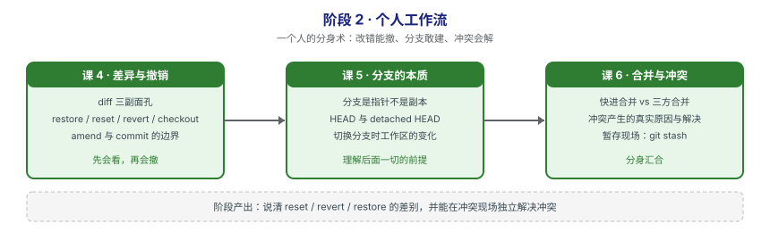

# 阶段 2：个人工作流

> 所属课程：Git 使用 ｜ 故事章节：**一个人的分身术** ｜ 上一阶段：[阶段 1《地基与对象模型》](../1-地基与对象模型/overview.md)
> 阶段路径图：

## 🎯 本阶段目标

- 在本机独立完成"改 → 暂存 → 提交 → 建分支 → 合并 → 撤销"的完整闭环，不依赖任何远端。
- 遇到冲突不再慌，知道冲突是怎么产生的、该怎么解决、以及什么时候该中止。
- 能区分 `reset` / `revert` / `restore` 三条撤销路径，选对而不选错。

## 📍 学习重点

- **diff 是坐标系**：`git diff` 有三种默认形态（工作区 vs 暂存区、暂存区 vs HEAD、工作区 vs HEAD）。分不清这三个，撤销就一定会选错命令。
- **分支是指针不是副本**：这条认知是分水岭。理解了它，`checkout` / `switch` / `merge` / `rebase` 的行为都能推出来；不理解，就只能死记。
- **冲突不是错误**：冲突是 Git 明确告诉你"这两处改动我无法自动合并，请你判断"。它是保护机制不是故障。
- **撤销要分"已推送/未推送"**：本阶段只处理未推送的情况，已推送的救援留到阶段 4。

## ✅ 必须掌握的知识点

| 知识点 | 所属课 | 学完应能 |
|--------|--------|----------|
| 差异的三副面孔：工作区 / 暂存区 / 提交间 | 课 4 | 说出三种 diff 各自比较的是哪两个东西 |
| 撤销四连：restore / reset / revert / checkout | 课 4 | 针对给定场景选出正确的撤销命令 |
| amend 与 commit 的边界 | 课 4 | 说清 `--amend` 实际是"新建提交并移动指针" |
| 分支是指针不是副本 | 课 5 | 解释为什么建分支瞬间完成、几乎不占空间 |
| HEAD 与 detached HEAD | 课 5 | 说清 HEAD 是什么，以及 detached HEAD 的危险与安全用法 |
| 切换分支时工作区发生了什么 | 课 5 | 解释未提交改动在切换分支时的三种去向 |
| 快进合并与三方合并 | 课 6 | 判断一次合并会走快进还是三方，并知道何时用 `--no-ff` |
| 冲突是怎么产生的、怎么解决 | 课 6 | 手工制造一次冲突并正确解决，会用 `--abort` 中止 |
| 暂存现场：git stash | 课 6 | 用 stash 在多任务切换时保存半成品 |

## 本阶段产出

- [x] `lessons/lesson-04-差异与撤销.md`（✅ 2026-09-08 已讲完，P0=0）
- [x] `lessons/lesson-05-分支的本质.md`（✅ 2026-09-08 已讲完，P0=0）
- [x] `lessons/lesson-06-合并与冲突.md`（✅ 2026-09-08 已讲完，P0=0）

## 课 5 核心结论（回看用）

- **分支 = 41 字节的便利贴**：`.git/refs/heads/<名>` 里只写一个 SHA。建分支不复制数据——实测 500 文件仓库耗时 2.6 ms、占约 180 字节、对象数**零增长**。
- **分叉 = 两个指针各自前移**：提交只推进当前分支，另一个不动。
- **HEAD 两级 vs 一级**：正常时 `.git/HEAD` = `ref: refs/heads/x`（→分支→提交）；detached 时直接是裸 SHA。判断标志是 `git branch --show-current` 输出**空**。
- **detached 不可怕**：提交进 reflog + 对象库（`fsck` 显示 dangling），Git 切走时**主动警告并给出救援命令** `git branch <name> <sha>`。
- **切换时三种去向**：不冲突→带过去（会污染目标分支）；冲突→**拒绝**（exit 1，改动完好）；未跟踪→总是带过去。
- ⚠️ **`switch -f` 是本课唯一不可逆操作**：丢弃未提交改动，不进对象库。
- ⚠️ **`switch -m` 会真的合并**：可能产生 `UU` 冲突（exit 0 但留下冲突标记）。它**不移动任何分支指针**，只合并工作区改动。

## 课 4 核心结论（回看用）

- **diff 是坐标系**：不带参数 = 工作区 vs 暂存区（**还有啥没 add**）；`--cached` = 暂存区 vs HEAD（**add 了啥**）；`HEAD` = 工作区 vs HEAD（**总共改了啥**）。`status -s` 里 `M` 的**列位置**就是判断依据。
- **撤销按危险等级选**：`restore` 管文件（🟢）、`reset` 管指针（🟡/🔴）、`revert` 管已公开历史（🟢）。**已推送的只用 revert**。
- **reset 三模式 = 箭头延伸到第几层**：`--soft` 只动 HEAD、`--mixed` 动到暂存区、`--hard` 连工作区一起动。
- **amend = 新建提交 + 移动指针**：哈希必变，数量不变，旧的仍在对象库（reflog 可找回）。author 时间保留、committer 时间更新。
- ⚠️ **三条实测命令行为**（照抄会踩）：`git reset --hard <path>` **报错**（用 `git restore`）；revert 合并提交**必须 `-m 1`**；amend 的日期差要 `sleep ≥3` 才看得出。
- ⚠️ `--hard` 的危险不是"数据销毁"，而是"失去引用、你不知道 SHA 了"——实测可完整恢复，课 11 展开。

## 课 6 核心结论（回看用）

- **合并走哪条路，判据只有一个**：`git merge-base --is-ancestor master feature` —— 是祖先就快进（只挪指针、不产生新提交），不是就三方合并（找共同祖先 + 生成双亲提交）。
- **冲突的判据是「同一块区域」不是「同一个文件」**：改同一文件的不同区域会自动合并（实测成功）；只有两边在同一块都改且改得不一样才冲突。
- **冲突时索引里存着三个版本**：`:1` 共同祖先、`:2` 我们的、`:3` 他们的 —— `git show :N:<file>` 随时取回，是后悔药。
- **解决三步 + 一条退路**：编辑 → `git add` → `git commit`；搞不定就 `git merge --abort`（恢复 HEAD + 索引 + 工作区）。
- **默认合并策略是 ort**：Git 2.34（2021-11）起取代 recursive；本机 2.43.0 实测输出 `Merge made by the 'ort' strategy`。
- ⚠️ **带冲突标记也能提交成功**（exit 0 且 status clean）—— `git add` 的语义是"确认内容"不是"确认已解决"。检测用 `git grep -n -E '^(<<<<<<<|=======|>>>>>>>)'`，**别用 `diff --check`（add 之后失效）**。
- **`-X ours` ≠ `-s ours`**：前者只影响冲突块（对方不冲突的改动仍收下），后者**丢弃对方全部内容**。
- **stash 是提交**：两个父（工作区 + 索引），所以能找回。`pop` **默认不恢复索引**（要 `--index`）；**默认不收未跟踪文件**（要 `-u`）；**pop 冲突时不删自己**（安全网，需手动 `drop`）。
- ⚠️ **`--squash` 不标记分支为已合并**：`branch --merged` 里没有它，`-d` 会被拒（exit 1），得用 `-D`。

## 本阶段的坑（提前打个招呼）

- **`git checkout` 身兼数职**：它既能切分支又能还原文件，这正是 Git 后来拆出 `git switch` / `git restore` 的原因。讲义会优先教新命令，同时告诉你老写法在干什么。
- **`reset --hard` 不可轻易用**：它会丢弃工作区改动且不可通过常规手段找回。本阶段会教你先用更安全的 `restore` / `stash`，`--hard` 留到阶段 4 讲救援时再放开。
- **conflict marker 别漏删**：`<<<<<<<` / `=======` / `>>>>>>>` 必须清理干净再提交，否则会把标记本身提交进代码里（课 6 实测：Git **不会**拦你，见上条）。

> 返回：[课程目录](../../02-课程目录.md) ｜ [学习路径总览](../../01-学习路径总览.md)
