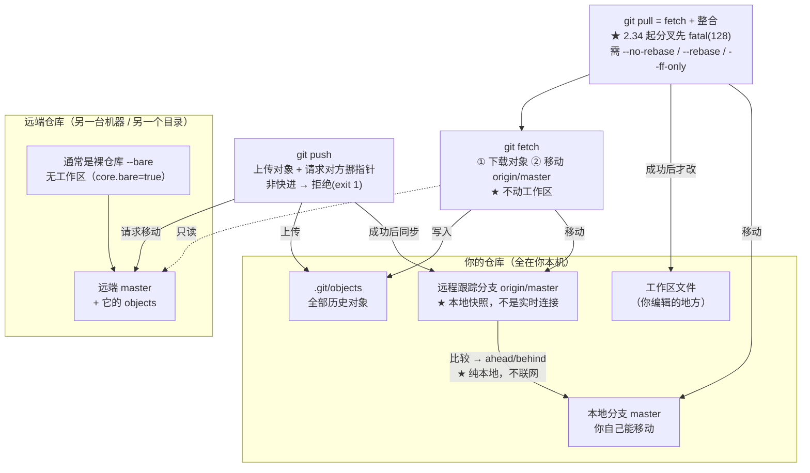

# 第 7 课：远端仓库与同步

> 所属阶段：阶段 3《协作与共享》｜ 水平：进阶 ｜ 本课知识点：remote/fetch/pull/push、远程跟踪分支、本地裸仓库协作演练
> 故事情节：**主角走出本机**——原来"远端"不是服务器老大，只是另一个仓库。

## 🎯 本课目标

- 说出 `fetch` 与 `pull` 的区别，以及 push 被拒绝的常见原因与处理。
- 理解远程跟踪分支（如 `origin/main`）是本地指针，记录"上次通信时远端在哪"。
- 用本地裸仓库在一台机器上模拟两人协作，完整走通推拉与冲突流程。

> 📖 **与课 6 的衔接**：课 6 的三个结论在本课直接兑现——
> **① `git pull` 的本质就是 `fetch` + 你学过的 merge**，所以 pull 产生的冲突和解决方式与课 6 完全一样；
> **② push 被拒的判据就是课 6 的"快进"**——远端不是你的祖先，就不让你推；
> **③ 冲突的判据仍是"同一块区域两边都改了"**，只是这次"两边"是你和同事。
> 阶段 3 概览说得很直白：**远端仓库只是"另一个仓库"，不是服务器老大**——本课会把这句话变成可验证的事实。

---

## 第一幕：起源与场景引入

> 🏛️ **起源**：Git 是为"对等网络"设计的，不是为主从架构设计的。

这听起来像一句口号，但它解释了你后面遇到的所有现象。

**SVN / CVS 是主从架构**：有一个中央服务器，你的工作副本是它的" partial checkout "。没有服务器你就无法提交、无法看历史。服务器**知道**谁有什么。

**Git 是对等（peer-to-peer）架构**：每个克隆都是**完整的仓库**，包含全部历史和全部对象。你和 GitHub 上的仓库在地位上是**平级**的——只不过你们约定"大家都往它那儿推"。

这个设计差异带来一个直接结论：**"远端（remote）"在 Git 里只是一个"名字 → URL"的别名配置**。它不是什么特殊实体。你可以加任意多个，也可以一个都没有（`git init` 出来的仓库就没有 remote）。

Git 甚至不需要网络就能"同步"——本机两个目录之间用文件路径就能推拉。**本课的所有实验都不需要 GitHub 账号**，这正是因为在 Git 眼里，`/tmp/remote.git` 和 `https://github.com/xxx/yyy.git` **没有本质区别**，都只是一个 URL。

> 🎬 **场景**：你第一次参与团队项目，同事告诉你"先 clone 下来，改完 push 上去"。

你照做了，然后三件事依次撞过来：

1. **同事说"你先 fetch 一下看看"**——你 `git fetch`，然后发现**什么都没变**：没有新文件，代码还是旧的。你怀疑命令没生效。
2. **你 `git push`，被拒绝了**（`! [rejected] (fetch first)`）。你上网一搜，有人说"加 `--force`"。你照做了——**然后同事的历史消失了**。
3. **你 `git status` 看到 `Your branch is ahead of 'origin/master' by 2 commits`**——"领先 2 个提交"？领先谁？那个 `origin/master` 到底是什么，它凭什么知道我领先几个？

**这三个场景的答案都在同一件事里**：Git 在你本地维护了一份"上次通信时远端是什么样"的**快照**，而它和真实的远端**可能已经不一样了**。

**核心矛盾**：`origin/master` 看起来像是"远端的状态"，但它存在你自己的 `.git` 目录里。**它到底是本地的还是远端的？如果是本地的，那它什么时候更新？**

**本课就是要把这个"看起来是远端、其实是本地"的东西拆开。** 拆开之后，`fetch` / `pull` / `push` 的区别会变得一目了然。

---

## 第二幕：认知冲突

### 反直觉 1：fetch 之后，工作区一个字节都没变

同事推了两个新提交（其中一个是**新文件**），你 `git fetch`：

```console
$ git fetch
From /tmp/git-l07b/remote
   9f558d5..ce686b7  master     -> origin/master
```

然后你看工作区：

```console
$ ls
a.txt                          ← 新文件 brand-new.txt 不在！

$ cat a.txt
base                           ← 内容还是旧的
```

**矛盾点**：命令明明执行成功了（exit 0），输出还告诉你 `master -> origin/master` 更新了，为什么我的文件没变？

**真相**：`fetch` 只做两件事——**下载对象** + **更新远程跟踪分支**。它**从不碰你的工作区和本地分支**（实测：`.git/objects` 里多了 6 个对象，但 `ls` 结果不变）。

证明"它真下载了"（实测）：

```console
$ git status -sb
## master...origin/master [behind 2]        ← Git 知道你落后 2 个

$ git rev-parse --short master origin/master
master=9f558d5 origin/master=ce686b7        ← 两个指针已经不一样了
```

**要真正拿到文件，还得再合并一次**：

```console
$ git merge --ff-only origin/master
Updating 9f558d5..ce686b7
Fast-forward
 a.txt         | 1 +
 brand-new.txt | 1 +
```

**这正是 `git pull` 做的事**——它就是 `fetch` + `merge` 的合体。

### 反直觉 2：`git pull` 现在会**直接失败**（不是警告）

这是本课**最可能让你踩坑的一个变化**，几乎所有中文教程都还停留在旧行为上。

两边分叉后执行 `git pull`（本机 Git 2.43.0，实测）：

```console
$ git pull
From /tmp/git-l07b/remote
   c718ff0..d438f4e  master     -> origin/master
hint: You have divergent branches and need to specify how to reconcile them.
hint: ...
fatal: Need to specify how to reconcile divergent branches.
```

**退出码 128，合并根本没发生。**

**矛盾点**：教程都说"pull = fetch + merge，分叉时会自动产生一个合并提交"，为什么我这儿直接报错了？

**真相**：这是 Git 的**行为变更**，三个阶段（已联网核实）：

| 版本 | 分叉时 `git pull` 的行为 |
|------|--------------------------|
| < 2.27（2020-06 之前） | 默默合并，产生合并提交（老教程描述的行为） |
| 2.27 – 2.33 | 打印一大段警告，**但还是合并了** |
| **≥ 2.34（2021-11 起）** | **直接 fatal，拒绝执行**（exit 128） |

变更的理由写在 Git 的提交记录里：很多人 pull 完发现历史里多了一堆 `Merge branch 'main' of github.com:...` 这种自己从没打算创建的提交。**Git 决定不再替你选**。

**实测：失败后状态是干净的**——没有留下半成品合并：

```console
$ [ -f .git/MERGE_HEAD ] && echo "MERGE_HEAD exists" || echo "no MERGE_HEAD"
no MERGE_HEAD (clean abort)

$ git status -sb
## master...origin/master [ahead 1, behind 1]
```

**怎么处理**：显式指定策略（三选一）：

```bash
git pull --no-rebase    # 合并（产生合并提交）
git pull --rebase       # 变基（线性，课 8 详讲）
git pull --ff-only      # 只能快进，否则拒绝
```

实测 `--no-rebase`：

```console
Merge made by the 'ort' strategy.
*   5f505ff Merge branch 'master' of /tmp/git-l07b/remote      ← 合并提交
|\  
| * d438f4e seed remote commit
* | e3a77a3 dv local commit
```

⚠️ **别用配置把它"静音"了事**：`git config --global pull.rebase false` 确实能让警告消失，但**你等于把"每次都替我选 merge"写死在了全局配置里**。更稳的做法是要么用 `--ff-only`（强迫自己每次显式决定），要么在命令上带参数。

### 反直觉 3：把远端删掉，`git status` 照样工作

这是本课**最能说明"远端不是老大"的实验**。

你的仓库有一个远端。现在，**把远端整个目录挪走**（模拟服务器宕机 / 断网）：

```bash
mv /tmp/git-l07c/remote.git /tmp/git-l07c/remote-moved.git
```

然后执行（实测）：

```console
$ git status -sb
## master...origin/master                   ← 正常工作，exit 0

$ git fetch
fatal: '/tmp/git-l07c/remote.git' does not appear to be a git repository
fatal: Could not read from remote repository.
fetch exit=128                              ← 只有这个失败
```

**矛盾点**：远端都没了，`git status` 凭什么还能告诉我"我和 `origin/master` 的关系"？

**真相**：因为 **`origin/master` 是你本地 `.git` 目录里的一个文件**（或 `packed-refs` 里的一行）。它不查询网络，它只是读本地磁盘。

**而且你可以直接改它**（实测）：

```console
$ git update-ref refs/remotes/origin/master HEAD
exit=0                                      ← 成功，没有任何网络请求
```

一条命令就把"远端跟踪分支"改了，Git 完全不反对——**因为它就是个普通引用**。

**这张图说明了三者的真实关系**：

```
你的仓库 (.git)                     远端仓库 (remote.git)
┌─────────────────────┐            ┌──────────────────┐
│ master      (本地分支)│            │                  │
│ origin/master(本地快照)│ ←─fetch── │ master (真实状态) │
│ 工作区文件            │  ─push──→  │                  │
└─────────────────────┘            └──────────────────┘
     ↑ 都在你本机                        ↑ 只在通信时才接触
```

**`origin/master` 和 `master` 都在你本机**——它们之间永远可以比较（所以 `status` 不需要网络）。**只有 `fetch` / `push` 才需要真正联系远端**。

⚠️ **推论（本课最重要的一条）**：`git status` 说"up to date"**不代表远端没有新东西**，只代表"上次通信时没有"。想知道现在？**先 `git fetch`**。

### 反直觉 4：裸仓库没有工作区，是设计不是故障

```console
$ git init --bare remote.git
$ ls remote.git
HEAD  branches  config  description  hooks  info  objects  refs
```

**没有你的代码文件。** 想编辑？

```console
$ cd remote.git && git status
fatal: this operation must be run in a work tree
exit=128

$ git add somefile.txt
fatal: this operation must be run in a work tree
exit=128
```

**矛盾点**：这仓库是坏的吧？

**真相**：`core.bare = true`（实测），**它故意没有工作区**。原因是：如果远端仓库有一个工作区，你 push 上去会让远端的工作区和它的 HEAD 不一致——**远端的人会发现自己的文件莫名变了**。

所以 Git 的设计是：**接收推送的仓库应该是裸的**。这也解释了本课开头那句"远端只是另一个仓库"——裸仓库就是**只有 `.git` 目录内容**的仓库（对比一下：`ls remote.git` 的输出和你 `.git` 目录的内容几乎一模一样）。

---

## 第三幕：层层揭示

### 知识点 1：remote / fetch / pull / push 四件套

#### 一句话定义

| 命令 | 一句话 | 动工作区吗 | 需要网络吗 |
|------|--------|-----------|-----------|
| `git remote` | 管理"名字 → URL"的别名 | 否 | 否 |
| `git fetch` | 下载对象 + **更新远程跟踪分支** | **否** | 是 |
| `git pull` | `fetch` + 整合（merge 或 rebase） | **是** | 是 |
| `git push` | 上传对象 + **请求远端移动它的分支** | 否 | 是 |

#### 直觉建立：把 push 想成"请求别人改他的指针"

这是理解 push 的关键。**你不能直接改远端**——你只能**请求**。

- `git push` = "我把对象给你，请你把你的 `master` 挪到这个提交"
- 远端会**检查**：这个移动是快进吗？（课 6 的判据！）
- 是 → 接受；不是 → **拒绝**

**这就是为什么 push 会被拒**——它不是"服务器不让你传文件"，而是"**你要求的这个指针移动不合法**"。

#### 核心原理 1：remote 只是配置

```bash
git remote -v
```

实测：

```console
origin	/tmp/git-l07b/remote.git (fetch)
origin	/tmp/git-l07b/remote.git (push)
```

它纯粹是 `.git/config` 里的几行：

```ini
[remote "origin"]
	url = /tmp/git-l07b/remote.git
	fetch = +refs/heads/*:refs/remotes/origin/*
```

**可以有多个，也可以零个**（实测 add / rename / remove 全部成功）。

`git remote show origin` 给出的信息很全（实测）：

```console
* remote origin
  Fetch URL: /tmp/git-l07b/remote.git
  Push  URL: /tmp/git-l07b/remote.git
  HEAD branch: master
  Remote branch:
    master tracked
  Local branch configured for 'git pull':
    master merges with remote master
  Local ref configured for 'git push':
    master pushes to master (up to date)
```

#### 核心原理 2：fetch 到底写了什么

`fetch` 做两件事（实测）：

1. **把新对象下载到 `.git/objects`**（实测：对象文件数增加）
2. **更新远程跟踪分支** `refs/remotes/origin/master`

另外它还会写一个 `FETCH_HEAD`（实测）：

```console
$ cat .git/FETCH_HEAD
a129a6215484b59b6bc3d7a68ed7b56396cc68c5		branch 'master' of /tmp/git-l07c/remote
```

⚠️ **关于 `packed-refs` 的一个坑**：你可能会想去看 `.git/refs/remotes/origin/master` 这个文件，但**它可能不存在**（实测：该目录下只有 `HEAD`）。因为 Git 会把引用**打包**进 `.git/packed-refs`：

```console
$ cat .git/packed-refs
# pack-refs with: peeled fully-peeled sorted
04d710120f353ca133c36ebbbb0c02ddd9ea8491 refs/remotes/origin/master
```

**Git 读引用时两个地方都看**（松散文件 + packed-refs），所以 `git rev-parse origin/master` 照常工作（实测输出 `04d7101`）。**想看引用值就用 `git rev-parse`，别直接翻文件。**

#### 示例演示 1：fetch 不动工作区（完整对照）

```bash
# 别人推了两个提交（一个新文件 + 一处修改）
git fetch
ls                 # 新文件不在
cat a.txt          # 内容没变
git status -sb     # 但显示 [behind 2]
```

实测：

```console
From /tmp/git-l07b/remote
   9f558d5..ce686b7  master     -> origin/master
a.txt                          ← ls 结果
base                           ← cat 结果
## master...origin/master [behind 2]      ← status 结果
```

**记住这个组合**：`ls` 不变 + `status` 显示 behind = **东西已经在你本地了，只是还没合并进你的分支**。

#### 示例演示 2：pull 的三种策略

```bash
git pull --no-rebase    # ① 合并：产生合并提交
git pull --rebase       # ② 变基：线性，无合并提交
git pull --ff-only      # ③ 只能快进，否则拒绝
```

**① `--no-rebase`（merge）实测**：

```console
Merge made by the 'ort' strategy.
*   5f505ff Merge branch 'master' of /tmp/git-l07b/remote
|\  
| * d438f4e seed remote commit
* | e3a77a3 dv local commit
|/  
* c718ff0 c4 by seed
```

**② `--rebase` 实测**（课 8 详讲机制）：

```console
Successfully rebased and updated refs/heads/master.
* d673b51 bob y
* 4a5d7e5 alice x
* fafc6db alice adds shared
```

一条直线，**没有合并提交**。

**③ `--ff-only` 分叉时实测**：

```console
fatal: Not possible to fast-forward, aborting.
exit=128
```

⚠️ 注意：**快进能成功时，`git pull` 不需要任何参数**（实测 exit 0，无合并提交）：

```console
Updating ce686b7..c718ff0
Fast-forward
 a.txt | 1 +
* c718ff0 c4 by seed
* ce686b7 c3 modifies a.txt
```

**只有分叉时才需要你表态**——这正呼应了第二幕的反直觉 2。

#### 示例演示 3：push 被拒，以及正确处理

**制造拒绝**：两边各自前进后，后推的那个被拒（实测）：

```console
To /tmp/git-l07b/remote.git
 ! [rejected]        master -> master (fetch first)
error: failed to push some refs to '/tmp/git-l07b/remote.git'
hint: Updates were rejected because the remote contains work that you do not
hint: have locally. This is usually caused by another repository pushing to
hint: the same ref. If you want to integrate the remote changes, use
hint: 'git pull' before pushing again.
```

**退出码 1**。注意关键词 `fetch first`——**Git 自己就告诉你该干什么了**。

**正确处理（实测全流程）**：

```bash
git fetch              # ① 先看看别人推了什么
git rebase origin/master    # ② 或 git merge origin/master
git push               # ③ 再推
```

实测：

```console
Rebasing (1/1)Successfully rebased and updated refs/heads/master.
rebase exit=0
To /tmp/git-l07c/remote.git
   7c95d2a..a129a62  master -> master
push exit=0

$ git log --oneline --graph -4
* a129a62 p2 commit
* 7c95d2a p1 commit
* 0d3d126 c2 adds big
* 04d7101 c1                    ← 线性，无合并提交
```

#### ⚠️ `--force` 与 `--force-with-lease` 的差别（本课最重要的安全知识）

被拒之后直接 `--force` 会怎样？**实测：别人的提交直接消失**：

```console
# 推之前远端有 3 个提交
86f94ac f1 work
0e6f0ea seed 5
d438f4e seed remote commit

$ git reset --hard HEAD~2 && git push --force
 + 86f94ac...d438f4e master -> master (forced update)

# 推之后：2 个提交没了
d438f4e seed remote commit
c718ff0 c4 by seed
ce686b7 c3 modifies a.txt
```

**这就是"事故"的标准形态**。

**`--force-with-lease` 是安全的替代品**。它的判据是：

> "我上次看到的 `origin/master` 还是那个值吗？如果不是（说明有人推过），**拒绝**。"

实测——**在没 fetch 的情况下（我们的跟踪分支是旧的），它拒绝**：

```console
$ git push --force-with-lease
 ! [rejected]        master -> master (stale info)
error: failed to push some refs to '/tmp/git-l07b/remote.git'
exit=1
```

关键字 **`stale info`**（陈旧信息）。**它拦住了你**。

fetch 之后再推，就通过了（因为此时你的快照是最新的，你明确知道自己在覆盖什么）：

```console
$ git fetch && git push --force-with-lease
 + ac61960...86f94ac master -> master (forced update)
exit=0
```

**规则**：**非用不可时用 `--force-with-lease`，永远不要裸用 `--force`**。前者会在"有人偷偷推过"时拦住你，后者不会。

#### 示例演示 4：删除远程分支与 prune

```bash
git push origin --delete tempbr     # 删远端分支
```

实测：

```console
 - [deleted]         tempbr
exit=0
```

⚠️ **你的本地 `tempbr` 仍在**（实测 `git branch` 仍有 `tempbr`）。删除远端分支**不会**删你的本地分支。

⚠️ **补充说明**：在**执行删除的那一方**仓库里，本地的 `origin/tempbr` 跟踪引用会**随删除一并清掉**（实测：`push --delete tb` 后 `git branch -r` 只剩 `origin/HEAD` 和 `origin/master`）。**但其他人的仓库不会**——他们那边会留下陈旧的跟踪引用（实测：分支删了，别人的 `origin/topic` 还在）。

```console
$ git branch -r
  origin/HEAD -> origin/master
  origin/master
  origin/topic        ← 远端已经没有这个分支了

$ git fetch --prune
 - [deleted]         (none)     -> origin/topic

$ git branch -r
  origin/HEAD -> origin/master
  origin/master      ← 清理干净了
```

**`fetch --prune`（或配置 `fetch.prune true`）清理这些"幽灵引用"**。

#### 进阶：推到非裸仓库的当前分支 → 被拒（经典错误）

```console
remote: error: refusing to update checked out branch: refs/heads/master
remote: error: By default, updating the current branch in a non-bare repository
remote: is denied, because it will make the index and work tree inconsistent
remote: with what you pushed, and will require 'git reset --hard' to match
remote: the work tree to HEAD.
```

**这正是第二幕"裸仓库为什么没有工作区"的答案**：如果允许推，远端那个人的工作区就和 HEAD 不一致了，他下次操作会莫名其妙。

#### 常见误区（知识点 1）

1. **"fetch 会把代码拉下来"**：不拉。它只下载对象 + 更新跟踪分支，**工作区一个字节都不变**（实测 `ls` 不变）。
2. **"pull 分叉时会自动合并"**：**2.34 起直接 fatal**（exit 128）。老教程没更新。
3. **"push 被拒就加 `--force`"**：这是事故源头。先 `fetch` 看清楚，要强推也用 `--force-with-lease`。
4. **"远端是服务器，它知道一切"**：不是。远端只是另一个仓库，`git status` 完全不需要联系它（实测删掉远端目录 status 照常）。
5. **"remote 只能有一个"**：可以多个（实测 add/rename/remove 均可）。

#### 一句话记住

> **fetch 只搬数据不动工作区；pull = fetch + 整合（2.34 起分叉会先报错）；push 是"请求对方挪指针"，不是快进就被拒。**

---

### 知识点 2：本地分支与远程跟踪分支

#### 一句话定义

- **本地分支**（如 `master`）：你自己能移动的指针，指向你的提交。
- **远程跟踪分支**（如 `origin/master`）：**在你本机**的指针，记录"**上次通信时**远端的 `master` 在哪"。
- **上游（upstream）**：把两者**关联**起来的配置。设了之后 `git push` / `git pull` 可以省略参数。

#### 直觉建立：三种"分支"的区别

这是 Git 里最容易混淆的一组概念，因为它们都叫"分支"：

| 名字 | 位置 | 谁能改 | 改它的命令 |
|------|------|--------|-----------|
| `master` | 本地 | **你** | `commit` / `merge` / `reset` |
| `origin/master` | 本地 | **Git**（通信时） | `fetch` / `pull` / `push` |
| 远端真正的 `master` | **远端仓库** | 你的 `push` 请求 | 只有 push 能改 |

⚠️ **关键**：中间那行 `origin/master` **也在你本机**——这是第二幕反直觉 3 的核心。它的名字里虽然有 `origin`，但**它不是一个连接，它是一份记录**。

**类比**：`origin/master` 像是你**上次看朋友圈时截的图**，不是朋友圈的实时画面。你截图之后别人又发了三条，你的截图不会自动变——**要再看一次（fetch）才会更新**。

#### 核心原理：ahead / behind 就是这两个指针的差

`git status` 里的 "ahead 2 / behind 3" **不需要网络**，它就是在本机数两个指针之间有多少提交（实测）：

```console
$ git status -sb
## master...origin/master [ahead 1, behind 5]

$ git branch -vv
* master 2cd7b21 [origin/master: ahead 1, behind 5] alice moves on
```

- **ahead N** = 你有 N 个提交还没推上去（`master` 比 `origin/master` 多）
- **behind N** = 远端有 N 个提交你还没拿（`origin/master` 比 `master` 多）

**因为有这两个数，`git status` 完全离线可用**（第二幕已实测：删掉远端目录，status 照常）。

#### 示例演示 1：clone 自动建立关联

```bash
git clone /tmp/remote.git myrepo
cd myrepo
git remote -v
git branch -a
```

实测：

```console
origin	/tmp/git-l07a/remote.git (fetch)
origin	/tmp/git-l07a/remote.git (push)

* master
  remotes/origin/HEAD -> origin/master
  remotes/origin/master
```

**clone 一次做了 4 件事**（这是它和 `git init` + 手工加 remote 的区别）：

1. 复制所有对象
2. 建 `origin` 远程，URL 指向源
3. 创建远程跟踪分支 `origin/*`
4. **检出**默认分支（所以 clone 完你就有工作区文件了）

⚠️ **克隆空仓库时会看到 `warning: You appear to have cloned an empty repository`**——这不是错误，只是提醒你源里没东西。此时 `git branch -a` 是空的（实测 exit 0 无输出），**因为还没有任何提交**。

#### 示例演示 2：`-u` 建立上游，之后可省参数

第一次推一个新分支，不带 `-u`：

```console
$ git push
fatal: The current branch newbranch has no upstream branch.
To push the current branch and set the remote as upstream, use

    git push --set-upstream origin newbranch
exit=128
```

Git 把解法直接写给你了。用 `-u`（`--set-upstream` 的简写）：

```bash
git push -u origin master
```

实测之后：

```console
$ git branch -vv
* master b11ac2c [origin/master] c1 by alice      ← 方括号里就是上游

$ git config --get branch.master.remote
origin
$ git config --get branch.master.merge
refs/heads/master
```

**之后 `git push` / `git pull` / `git status` 都不用再写参数了。**

#### 示例演示 3：`git branch -vv` 查看全部关联

```bash
git branch -vv
```

实测（三种典型状态）：

```console
* master b11ac2c [origin/master] c1 by alice                        ← 同步
* master 2cd7b21 [origin/master: ahead 1] alice moves on            ← 领先
* master 2cd7b21 [origin/master: ahead 1, behind 5] alice moves on  ← 又领先又落后
```

**"又 ahead 又 behind" 就是分叉**——意味着你下次 push 会被拒，或者 pull 会要求你选策略。

#### 示例演示 4：`origin/HEAD` 是什么

```bash
git branch -a
```

实测：

```console
  remotes/origin/HEAD -> origin/master
  remotes/origin/master
```

`origin/HEAD` 是一个**符号引用**，指向远端的默认分支（实测）：

```console
$ git symbolic-ref refs/remotes/origin/HEAD
refs/remotes/origin/master

$ git rev-parse --abbrev-ref origin/HEAD
origin/master
```

**它的用处**：你可以写 `origin/HEAD` 而不必知道远端默认分支叫 `master` 还是 `main`。**在 `master` / `main` 命名不统一的年代，这个很有用。**

#### 进阶：手动改跟踪分支（证明它是本地的）

```bash
git update-ref refs/remotes/origin/master HEAD
```

实测 **exit 0，无任何网络交互**。这条命令在正常工作中**不该用**，但它证明了一件事：**`origin/master` 就是个普通引用，Git 不会拿它去和服务器核对**。

#### 常见误区（知识点 2）

1. **"`origin/master` 是远端的实时状态"**：不是，它是**上次通信时的快照**（第二幕实测：远端目录删了它照样能读）。
2. **"`git status` 说 up to date 就安全了"**：只代表"上次通信时同步"。**想知道现在，先 fetch**。
3. **"ahead/behind 需要联网才能算"**：不需要，纯本地两个指针比较（实测离线可用）。
4. **"clone 和 init + remote add 一样"**：不一样。clone 还会创建跟踪分支并检出文件。
5. **"push 一次之后 upstream 就设好了"**：**不是**，必须显式 `-u`（实测：不带 `-u` 直接 push 会 exit 128）。

#### 一句话记住

> **`origin/master` 是你本机的"上次通信快照"，不是实时连接；ahead/behind 是它和本地分支的差；`-u` 设上游后 `push`/`pull` 可省参数。**

---

### 知识点 3：用本地裸仓库模拟远端做协作演练

#### 一句话定义

**`git init --bare`** 建一个**没有工作区**的仓库，专门用来接收推送。**用 `file://` 或普通路径把它当"远端"**，就能在一台机器上完整模拟多人协作——**不需要任何托管平台账号**。

#### 直觉建立：为什么这样就够了

回顾第一幕：Git 是对等架构，`/tmp/remote.git` 和 `https://github.com/...` 在 Git 眼里**只是两个不同的 URL**。

| | 真实远端（GitHub） | 本课用的裸仓库 |
|---|---|---|
| 本质 | 一个仓库 | 一个仓库 |
| 访问方式 | `https://` / `git@` | 文件路径 / `file://` |
| 需要账号 | 是 | **否** |
| 能演示 push/fetch/pull | 是 | **是** |
| 能演示冲突 | 是 | **是** |

**唯一的区别是 URL 的形式**。所以你在本机练熟的一切，换到 GitHub 上完全适用。

#### 核心原理：裸仓库里有什么

```bash
git init --bare remote.git
ls remote.git
```

实测：

```console
HEAD  branches  config  description  hooks  info  objects  refs
```

**对比一下你自己仓库的 `.git` 目录**——几乎一模一样。因为**裸仓库就是"只有 `.git` 内容"的仓库**。

几个实测细节：

```console
$ cat remote.git/HEAD
ref: refs/heads/master          ← 和普通仓库一样

$ git -C remote.git config --get core.bare
true                            ← 关键配置

$ ls remote.git/index
ls: cannot access 'remote.git/index': No such file or directory     ← 没有索引
```

**没有索引 = 没有暂存区 = 不能直接 add/commit**（第二幕已实测 `git add` 报 exit 128）。

#### 示例演示 1：搭一个"两人协作"环境

```bash
# ① 建裸仓库当"服务端"
git init --bare /tmp/team/remote.git

# ② Alice 克隆
git clone /tmp/team/remote.git /tmp/team/alice
cd /tmp/team/alice
git config user.name "Alice"
git config user.email "alice@example.com"

# ③ Bob 克隆（同一个人，但模拟两个人）
git clone /tmp/team/remote.git /tmp/team/bob
cd /tmp/team/bob
git config user.name "Bob"
git config user.email "bob@example.com"
```

**为什么要用 `git config user.name`（不带 `--global`）**：因为这是**仓库级配置**，让 Alice 和 Bob 的仓库有不同的作者。如果设成 `--global`，两边就同名了，你看不出是谁提交的。

#### 示例演示 2：完整的"推-拉-冲突-解决-推"循环

**第 1 步：Alice 首次推送**（实测 exit 0）：

```bash
cd /tmp/team/alice
echo "v1" > a.txt
git add a.txt && git commit -m "c1 by alice"
git push -u origin master
```

```console
$ git branch -vv
* master b11ac2c [origin/master] c1 by alice      ← 上游已建立
```

**第 2 步：Bob 拉取**（实测）：

```bash
cd /tmp/team/bob
git pull
```

因为 Bob 本地没有自己的提交，这是**快进**（实测无合并提交）：

```console
Updating 9f558d5..c718ff0
Fast-forward
 a.txt | 1 +
```

**第 3 步：两人同时改同一文件 → 冲突**：

```bash
# Alice 改并推送
cd /tmp/team/alice && echo "alice" > shared.txt && git add . && git commit -m "alice" && git push

# Bob 也改（还没拉）
cd /tmp/team/bob && echo "bob" > shared.txt && git add . && git commit -m "bob"
```

**第 4 步：Bob 推送被拒**（实测）：

```console
 ! [rejected]        master -> master (fetch first)
error: failed to push some refs
exit=1
```

**第 5 步：Bob 拉取并处理冲突**（实测）：

```bash
git fetch
git merge origin/master
```

```console
Auto-merging shared.txt
CONFLICT (add/add): Merge conflict in shared.txt
Automatic merge failed; fix conflicts and then commit the result.
merge exit=1
```

⚠️ 注意是 **`add/add`** 冲突（两边都**新增**了同名文件），不是课 6 的 `content` 冲突。**解决方式一样**（编辑 → add → commit）。

**第 6 步：解决后再推**（实测 exit 0）：

```bash
echo "resolved-by-bob" > shared.txt
git add shared.txt && git commit -m "bob resolves"
git push
```

**第 7 步：Alice 拉取**（实测）：

```bash
cd /tmp/team/alice && git pull
```

此时 Alice 本地没有新提交，仍是快进。

#### 示例演示 3：用 `--rebase` 保持线性历史

同样的场景，Bob 改用 rebase（实测）：

```bash
git pull --rebase
```

```console
Successfully rebased and updated refs/heads/master.
exit=0

$ git log --oneline --graph -4
* a129a62 p2 commit
* 7c95d2a p1 commit
* 0d3d126 c2 adds big
* 04d7101 c1                    ← 一条直线，无合并提交
```

**对比 merge 的结果**：

```console
*   5f505ff Merge branch 'master' of /tmp/git-l07b/remote
|\  
| * d438f4e seed remote commit
* | e3a77a3 dv local commit
|/  
```

**这就是 `pull --rebase` 的主要用途：避免"我随手 pull 了一下"产生一个毫无意义的合并提交。** 机制细节课 8 详讲。

#### 示例演示 4：`file://` 协议与写权限

用文件路径时，Git 默认用"硬链接/直接复制"；加 `file://` 会走**真正的传输协议**（打包传输）。

```bash
git clone file:///tmp/team/remote.git alice2
```

**什么时候需要 `file://`**：想更真实地模拟网络传输（比如测试钩子、测试打包行为）时。日常练习用普通路径就够了。

⚠️ **一个真实的坑**：往**非裸仓库的当前检出分支**推送会被拒（实测）：

```console
remote: error: refusing to update checked out branch: refs/heads/master
remote: error: By default, updating the current branch in a non-bare repository
remote: is denied, because it will make the index and work tree inconsistent
remote: with what you pushed, and will require 'git reset --hard' to match
remote: the work tree to HEAD.
```

**这就是"接收推送的仓库应该是裸的"的直接证据。**

#### 常见误区（知识点 3）

1. **"裸仓库是坏了的仓库"**：不是，`core.bare=true` 是**设计**，为了不让推送破坏工作区。
2. **"在裸仓库里直接改文件"**：不能（实测 `git add` exit 128，`git status` 报 `must be run in a work tree`）。
3. **"模拟协作必须有 GitHub"**：不需要，本地裸仓库足够（本课全部实验均未联网）。
4. **"两个人要用 `--global` 设名字"**：**不要**——用仓库级 `git config user.name`，否则两个"人"同名。
5. **"push 被拒说明我代码有问题"**：不说明。只是**别人先推了**，你 fetch 整合一下就好。

#### 一句话记住

> **裸仓库 = 没有工作区的仓库（专为接收推送设计）；用本地路径当远端，一台机器就能练完多人协作全流程。**

---

## 第四幕：实操验证

> ⚠️ **本节每条命令都已在 WSL Ubuntu 24.04 / bash 5.2.21 / Git 2.43.0 上逐字跑通**（整份脚本执行完毕、无脚本级错误）。
> 输出中的 SHA 会与你的机器不同（内容寻址），但**退出码、状态码、关键字**应当一致。
> ⚠️ 脚本中的 `exit=$?` 一律直接取命令退出码；**讲义里若写成 `git cmd | head` 再取 `$?`，拿到的是 `head` 的退出码（恒为 0）**——这是写 Git 演示脚本的经典陷阱，本脚本已全部规避。

**准备**：隔离 HOME（必查项 #29）。

```bash
export HOME=/tmp/git-lesson07-home
rm -rf "$HOME"; mkdir -p "$HOME"
git config --global user.name "Zhang Wei"
git config --global user.email "zhangwei@example.com"
git config --global init.defaultBranch master
git config --global commit.gpgsign false

LAB=/tmp/git-lesson07
rm -rf "$LAB"; mkdir -p "$LAB"
```

#### 实验 1：裸仓库没有工作区

```bash
git init -q --bare "$LAB/remote.git"
ls "$LAB/remote.git"
git -C "$LAB/remote.git" config --get core.bare
git -C "$LAB/remote.git" status
echo "exit=$?"
ls "$LAB/remote.git/index" 2>&1
cat "$LAB/remote.git/HEAD"
```

实测输出：

```console
HEAD
branches
config
description
hooks
info
objects
refs
true
fatal: this operation must be run in a work tree
exit=128
ls: cannot access '/tmp/git-lesson07/remote.git/index': No such file or directory
ref: refs/heads/master
```

#### 实验 2：clone 自动建 origin 并检出

```bash
git clone -q "$LAB/remote.git" alice 2>/dev/null
cd alice
git config user.name "Alice"; git config user.email "alice@example.com"
git remote -v
git branch --show-current
git branch -a
```

实测输出：

```console
origin	/tmp/git-lesson07/remote.git (fetch)
origin	/tmp/git-lesson07/remote.git (push)
master
                    ← 克隆空仓库时 branch -a 是空的
```

#### 实验 3：不带 `-u` 推送会失败

```bash
printf 'v1\n' > a.txt; git add a.txt; git commit -q -m "c1 by alice"
git switch -q -c tmpbr
git push > /tmp/l07-pushout.txt 2>&1
echo "push exit=$?"
head -4 /tmp/l07-pushout.txt
git switch -q master
```

实测输出：

```console
push exit=128
fatal: The current branch tmpbr has no upstream branch.
To push the current branch and set the remote as upstream, use

    git push --set-upstream origin tmpbr
```

#### 实验 4：`-u` 建立上游

```bash
git push -q -u origin master
echo "push -u exit=$?"
git branch -vv
echo "branch.master.remote=$(git config --get branch.master.remote)"
echo "branch.master.merge=$(git config --get branch.master.merge)"
```

实测输出：

```console
push -u exit=0
* master 701a6bd [origin/master] c1 by alice
  tmpbr  701a6bd c1 by alice
branch.master.remote=origin
branch.master.merge=refs/heads/master
```

#### 实验 5：fetch 不动工作区（本课核心证据）

```bash
cd "$LAB"; git clone -q "$LAB/remote.git" bob
cd bob; git config user.name "Bob"; git config user.email "bob@example.com"
ls
# Alice 推两个新提交（含一个新文件）
cd "$LAB/alice"
printf 'newfile\n' > brand-new.txt; git add brand-new.txt; git commit -q -m "c2 adds brand-new.txt"
printf 'v2\n' >> a.txt; git add a.txt; git commit -q -m "c3 modifies a.txt"
git push -q
# Bob 只 fetch
cd "$LAB/bob"
git fetch
echo "exit=$?"
ls                       # brand-new.txt 不在
cat a.txt                # 还是 v1
git status -sb           # 但知道落后了
echo "master=$(git rev-parse --short master) origin/master=$(git rev-parse --short origin/master)"
find .git/objects -type f | wc -l
git merge --ff-only origin/master
ls; cat a.txt
```

实测输出：

```console
a.txt
From /tmp/git-lesson07/remote
   701a6bd..36b1f75  master     -> origin/master
exit=0
a.txt                              ← 新文件不在
v1                                 ← 内容没变
## master...origin/master [behind 2]      ← 但 Git 知道落后
master=701a6bd origin/master=36b1f75
9                                  ← 对象已下载到本地
Updating 701a6bd..36b1f75
Fast-forward
 a.txt         | 1 +
 brand-new.txt | 1 +
 2 files changed, 2 insertions(+)
 create mode 100644 brand-new.txt
a.txt
brand-new.txt
v1
v2
```

#### 实验 6：引用可能被打包，别直接翻文件

```bash
ls .git/refs/remotes/origin/
cat .git/packed-refs
git rev-parse --short origin/master
```

实测输出：

```console
HEAD
master
# pack-refs with: peeled fully-peeled sorted
7f2a41e30e00bbec78fd78f4630a98752d1dda26 refs/remotes/origin/master
d53cbc8
```

⚠️ 注意：这次 `master` 是松散文件，但 `packed-refs` 里也有记录。**两种形式都可能出现，所以读引用值请一律用 `git rev-parse`。**

#### 实验 7：远程跟踪分支是本地的（把远端挪走）

```bash
cd "$LAB"; mv "$LAB/remote.git" "$LAB/remote-moved.git"
cd "$LAB/bob"
git status -sb
echo "exit=$?"
git fetch > /tmp/l07-fetchout.txt 2>&1
echo "fetch exit=$?"
head -2 /tmp/l07-fetchout.txt
cd "$LAB"; mv "$LAB/remote-moved.git" "$LAB/remote.git"
cd "$LAB/bob"; git fetch -q; echo "恢复后 fetch exit=$?"
```

实测输出：

```console
## master...origin/master
exit=0                             ← 远端没了，status 照常
fetch exit=128
fatal: '/tmp/git-lesson07/remote.git' does not appear to be a git repository
fatal: Could not read from remote repository.
恢复后 fetch exit=0
```

**这是"远端不是老大"的铁证**：`status` 完全离线，`fetch` 才需要服务器。

#### 实验 8：pull 快进——无需参数

```bash
cd "$LAB/alice"; printf 'v4\n' >> a.txt; git add a.txt; git commit -q -m "c4 by alice"; git push -q
cd "$LAB/bob"; git pull
echo "exit=$?"
git log --oneline --graph -3
```

实测输出：

```console
From /tmp/git-lesson07/remote
   36b1f75..cf9331f  master     -> origin/master
Updating 36b1f75..cf9331f
Fast-forward
 a.txt | 1 +
 1 file changed, 1 insertion(+)
exit=0
* cf9331f c4 by alice
* 36b1f75 c3 modifies a.txt
* 532177d c2 adds brand-new.txt
```

#### 实验 9：pull 分叉——2.34 起直接 fatal

```bash
cd "$LAB"; rm -rf dv; git clone -q "$LAB/remote.git" dv
cd dv; git config user.name "D"; git config user.email "d@e.com"
printf 'dv\n' > dv.txt; git add dv.txt; git commit -q -m "dv local commit"
cd "$LAB/alice"; printf 'alice\n' > alice.txt; git add alice.txt; git commit -q -m "alice remote commit"; git push -q
cd "$LAB/dv"
git pull > /tmp/l07-pullout.txt 2>&1
echo "exit=$?"
tail -3 /tmp/l07-pullout.txt
[ -f .git/MERGE_HEAD ] && echo "MERGE_HEAD 存在" || echo "无 MERGE_HEAD（干净中止）"
git status -sb
```

实测输出：

```console
exit=128
hint: or --ff-only on the command line to override the configured default per
hint: invocation.
fatal: Need to specify how to reconcile divergent branches.
无 MERGE_HEAD（干净中止）
## master...origin/master [ahead 1, behind 1]
```

#### 实验 10：`pull --no-rebase` 产生合并提交

```bash
git config pull.rebase false
git pull --no-rebase > /tmp/l07-nr.txt 2>&1
echo "exit=$?"
tail -2 /tmp/l07-nr.txt
git log --oneline --graph -4
git config --unset pull.rebase
```

实测输出：

```console
exit=0
 1 file changed, 1 insertion(+)
 create mode 100644 alice.txt
*   ffe37d7 Merge branch 'master' of /tmp/git-lesson07/remote
|\  
| * d925599 alice remote commit
* | f1a5176 dv local commit
|/  
* cf9331f c4 by alice
```

#### 实验 11：`pull --rebase` 保持线性

```bash
cd "$LAB"; rm -rf rb; git clone -q "$LAB/remote.git" rb
cd rb; git config user.name "RB"; git config user.email "rb@e.com"
printf 'rb\n' > rb.txt; git add rb.txt; git commit -q -m "rb local"
cd "$LAB/alice"; printf 'a2\n' > a2.txt; git add a2.txt; git commit -q -m "alice a2"; git push -q
cd "$LAB/rb"; git pull --rebase
echo "exit=$?"
git log --oneline --graph -4
```

实测输出：

```console
Successfully rebased and updated refs/heads/master.
exit=0
* 7375492 rb local
* 301a500 alice a2
* d925599 alice remote commit
* cf9331f c4 by alice
```

#### 实验 12：`pull --ff-only` 分叉时拒绝

```bash
cd "$LAB"; rm -rf fo; git clone -q "$LAB/remote.git" fo
cd fo; git config user.name "FO"; git config user.email "fo@e.com"
printf 'fo\n' > fo.txt; git add fo.txt; git commit -q -m "fo local"
cd "$LAB/alice"; printf 'a3\n' > a3.txt; git add a3.txt; git commit -q -m "alice a3"; git push -q
cd "$LAB/fo"
git pull --ff-only > /tmp/l07-ffo.txt 2>&1
echo "exit=$?"
tail -2 /tmp/l07-ffo.txt
```

实测输出：

```console
exit=128
hint: Disable this message with "git config advice.diverging false"
fatal: Not possible to fast-forward, aborting.
```

#### 实验 13：push 被拒与正确处理

```bash
cd "$LAB"; rm -rf p1 p2
git clone -q "$LAB/remote.git" p1; git clone -q "$LAB/remote.git" p2
cd "$LAB/p1"; git config user.name "P1"; git config user.email "p1@e.com"
cd "$LAB/p2"; git config user.name "P2"; git config user.email "p2@e.com"
cd "$LAB/p1"; printf 'p1\n' > f.txt; git add f.txt; git commit -q -m "p1 commit"; git push -q
echo "p1 push exit=$?"
cd "$LAB/p2"; printf 'p2\n' > g.txt; git add g.txt; git commit -q -m "p2 commit"
git push > /tmp/l07-p2.txt 2>&1
echo "push exit=$?"
head -3 /tmp/l07-p2.txt
git fetch -q
git rebase origin/master
echo "rebase exit=$?"
git push
echo "push exit=$?"
git log --oneline --graph -3
```

实测输出：

```console
p1 push exit=0
push exit=1
To /tmp/git-lesson07/remote.git
 ! [rejected]        master -> master (fetch first)
error: failed to push some refs to '/tmp/git-lesson07/remote.git'
Rebasing (1/1)Successfully rebased and updated refs/heads/master.
rebase exit=0
push exit=0
* da064dc p2 commit
* d8c0b6d p1 commit
* 1473de1 alice a3
```

#### 实验 14：`--force-with-lease` 拦住你，`--force` 不会

```bash
cd "$LAB"; rm -rf fl; git clone -q "$LAB/remote.git" fl
cd fl; git config user.name "FL"; git config user.email "fl@e.com"
git rev-parse --short origin/master
# FL 先推一个（这样 FL 本地领先）
printf 'fl-base\n' > fl.txt; git add fl.txt; git commit -q -m "fl base"; git push -q
# 别人偷偷推，FL 不知情（没 fetch）
cd "$LAB/alice"; git fetch -q; git reset -q --hard origin/master
printf 'sneak\n' > sneak.txt; git add sneak.txt; git commit -q -m "alice sneaks in"; git push -q
cd "$LAB/fl"
echo "FL 本地：$(git rev-parse --short master) / origin/master：$(git rev-parse --short origin/master)"
git push --force-with-lease > /tmp/l07-fwl.txt 2>&1
echo "exit=$?"
head -3 /tmp/l07-fwl.txt
git fetch -q
git push --force-with-lease > /tmp/l07-fwl2.txt 2>&1
echo "exit=$?"
tail -1 /tmp/l07-fwl2.txt
```

实测输出：

```console
da064dc
Alice 偷偷推了一个提交（FL 不知情）
FL 本地：9eba5ff / origin/master：9eba5ff（旧的）
exit=1
To /tmp/git-lesson07/remote.git
 ! [rejected]        master -> master (stale info)
error: failed to push some refs to '/tmp/git-lesson07/remote.git'
exit=0
 + 1556097...9eba5ff master -> master (forced update)
```

**关键字 `stale info` = 你的快照是旧的，Git 拒绝强推。** fetch 之后再推才通过。

#### 实验 15：`--force` 的破坏力

```bash
cd "$LAB"; rm -rf fp; git clone -q "$LAB/remote.git" fp
cd fp; git config user.name "FP"; git config user.email "fp@e.com"
git log --oneline -3 origin/master
git reset -q --hard HEAD~2
git log --oneline -3
git push --force
git log --oneline -3 origin/master
```

实测输出：

```console
fb39220 fl work
e0b257d p2 commit
38cd54b p1 commit
38cd54b p1 commit        ← reset 后
a641361 alice a3
301a500 alice a2
 + fb39220...38cd54b master -> master (forced update)
38cd54b p1 commit        ← 强推后远端：2 个提交消失
a641361 alice a3
301a500 alice a2
```

#### 实验 16：删除远程分支与 prune

```bash
cd "$LAB/p1"; git switch -q -c topic; printf 't\n' > t.txt; git add t.txt; git commit -q -m "topic"
git push -q -u origin topic
cd "$LAB/p2"; git fetch -q; git branch -r
git -C "$LAB/p1" push origin --delete topic
git fetch -q; git branch -r
git fetch --prune; git branch -r
git -C "$LAB/p1" branch
```

实测输出：

```console
  origin/HEAD -> origin/master
  origin/master
  origin/topic
 - [deleted]         topic
  origin/HEAD -> origin/master
  origin/master
  origin/topic            ← 普通 fetch 不清理
 - [deleted]         (none)     -> origin/topic
  origin/HEAD -> origin/master
  origin/master            ← --prune 清理干净
  master
* topic                    ← 本地 topic 分支仍在
```

#### 实验 17：ahead / behind

```bash
cd "$LAB/alice"; git fetch -q
printf 'ahead\n' > ahead.txt; git add ahead.txt; git commit -q -m "alice ahead"
git fetch -q
git status -sb
git branch -vv
```

实测输出：

```console
## master...origin/master [ahead 2, behind 1]
* master 6f3e462 [origin/master: ahead 2, behind 1] alice ahead
  tmpbr  7f2a41e c1 by alice
```

#### 实验 18：多远端管理

```bash
cd "$LAB"; rm -rf mr; git clone -q "$LAB/remote.git" mr
cd mr; git config user.name "MR"; git config user.email "mr@e.com"
git remote add backup "$LAB/remote.git"; git remote -v
git remote rename backup backup2; git remote
git remote remove backup2; git remote
git remote get-url origin
git remote set-url origin "$LAB/nonexistent.git"
git fetch > /tmp/l07-su.txt 2>&1
echo "exit=$?"; head -2 /tmp/l07-su.txt
git remote set-url origin "$LAB/remote.git"; git fetch -q; echo "fetch exit=$?"
```

实测输出（节选）：

```console
backup	/tmp/git-lesson07/remote.git (fetch)
backup	/tmp/git-lesson07/remote.git (push)
origin	/tmp/git-lesson07/remote.git (fetch)
origin	/tmp/git-lesson07/remote.git (push)
backup2
origin
origin
/tmp/git-lesson07/remote.git
exit=128
fatal: '/tmp/git-lesson07/nonexistent.git' does not appear to be a git repository
fetch exit=0
```

#### 实验 19：FETCH_HEAD

```bash
git fetch -q
cat .git/FETCH_HEAD
git rev-parse --short FETCH_HEAD
```

实测输出：

```console
38cd54b7407bf8eb4af7803935fb086abc77a80d		branch 'master' of /tmp/git-lesson07/remote
38cd54b
```

#### 实验 20：推到非裸仓库的检出分支

```bash
cd "$LAB"; rm -rf nbt; mkdir -p nbt; cd nbt
git init -q; git config user.name "NB"; git config user.email "nb@e.com"
printf 'x\n' > x.txt; git add x.txt; git commit -q -m "nb c1"
cd "$LAB"; git clone -q "$LAB/nbt" pusher 2>/dev/null
cd pusher; git config user.name "PU"; git config user.email "pu@e.com"
printf 'y\n' > y.txt; git add y.txt; git commit -q -m "pusher c2"
git push 2>&1 | head -6
```

实测输出：

```console
remote: error: refusing to update checked out branch: refs/heads/master
remote: error: By default, updating the current branch in a non-bare repository
remote: is denied, because it will make the index and work tree inconsistent
remote: with what you pushed, and will require 'git reset --hard' to match
remote: the work tree to HEAD.
```

**清理**：

```bash
cd /tmp
rm -rf /tmp/git-lesson07 /tmp/git-lesson07-home
```

### 非技术域

**场景 1：`fetch` 是你的"侦察兵"**

技术上 `fetch` 只是"下载但不整合"。在工作习惯上，它真正的价值是：**让你在做决定之前先看一眼**。

一个很实用的日常节奏：

```bash
git fetch          # 先看看别人推了什么，不动我的代码
git log --oneline origin/master..master    # 我有几个没推
git log --oneline master..origin/master    # 别人有几个我没拿
git status -sb                            # 总览
# 看清楚了，再决定 merge 还是 rebase
```

**直接 `git pull` 相当于闭上眼跳**——你不知道会拉进什么、会不会产生合并提交。养成先 fetch 的习惯，能避开大量"我本地怎么突然多了个 merge commit"的困惑。

**场景 2："push 被拒"是协作信号，不是障碍**

被拒的唯一含义是：**有人比你先推了**。这不是错误，是**协作正在发生的证据**。

错误反应：`--force`（把别人的工作覆盖掉）
正确反应：`fetch` → 整合 → 再推

**场景 3：为什么团队要禁用 force push**

理解了 `--force` 会静默抹掉别人的提交（实验 15 实测 2 个提交消失），就理解了为什么几乎所有团队都会**在 master / main 上开启分支保护、禁用 force push**。

**这不是流程繁琐，这是用工具约束住"手滑一下毁掉别人一天工作"的可能性。** `--force-with-lease` 是留给"我确实需要强推"这个合理需求的出口。

---

## 第五幕：体系收束

> 📍 **全局定位**：阶段 3 第 1 课。你已经把课 1–6 的本机能力扩展到了"和别人交换提交"——**从今天起 Git 对你来说不再只是"本地撤销工具"，而是协作工具**。
> 🔗 **下一步**：**课 8《变基与提交整理》**。本课你已经见到了 `git pull --rebase` 的效果（线性历史、无合并提交），但**没见到它的机制**——课 8 会讲清楚 rebase 到底怎么"把提交一个个重放"，以及那条**黄金法则**：**只对尚未推送、无人基于其工作的提交做 rebase**。
> 本课埋下的两个钩子会在课 8 兑现：**① `pull --rebase` 为什么能消除合并提交**（因为它是把你的提交搬到别人后面重放）；**② 为什么 `--force-with-lease` 在 rebase 之后会变得必要**（rebase 改写了提交，不强推就推不上去）。

**本课三个知识点的一句话总结**：

1. **四件套**：`fetch` 只搬数据不动工作区；`pull` = `fetch` + 整合（**2.34 起分叉会先报错**）；`push` 是"请求对方挪指针"，不是快进就被拒。
2. **远程跟踪分支**：`origin/master` 是你**本机**的"上次通信快照"，不是实时连接；ahead/behind 是它和本地分支的差；`-u` 设上游后 `push`/`pull` 可省参数。
3. **裸仓库演练**：`--bare` 建出没有工作区的仓库（专为接收推送）；用本地路径当远端，一台机器就能练完多人协作。

---

## 🐞 常见误区

1. **"fetch 会把代码拉下来"**：不拉。它只下载对象 + 更新跟踪分支，**工作区一个字节都不变**（实测 `ls` 不变、`cat` 不变，但 `status` 显示 `[behind 2]`）。
2. **"pull 分叉时会自动合并"**：**2.34 起直接 fatal**（实测 exit 128）。老教程描述的是 2.27 之前的行为。
3. **"push 被拒就加 `--force`"**：这是事故源头（实测 `--force` 让 2 个提交消失）。先 `fetch`，要强推也用 `--force-with-lease`。
4. **"远端是服务器老大，它知道一切"**：不是。远端只是另一个仓库，**`git status` 完全不需要联系它**（实测：把远端目录挪走，status exit 0，只有 fetch exit 128）。
5. **"`git status` 说 up to date 就安全了"**：只代表"上次通信时同步"。想知道现在？**先 `git fetch`**。
6. **"ahead/behind 需要联网才能算"**：不需要，纯本地两个指针比较。
7. **"`origin/master` 是远端的实时状态"**：它是**快照**。名字里有 `origin` 不代表它需要网络。
8. **"ahead 又 behind 是异常"**：不是，这只是**分叉**——意味着 push 会被拒、pull 会要求选策略。
9. **"push 一次之后 upstream 就设好了"**：**不是**，必须显式 `-u`（实测不带 `-u` 直接 push 会 exit 128）。
10. **"裸仓库是坏了的仓库"**：不是，`core.bare=true` 是**设计**，为了不让推送破坏工作区（实测 `git add` exit 128）。
11. **"模拟协作必须有 GitHub"**：不需要，本地裸仓库足够（本课 20 个实验全部未联网）。
12. **"两人模拟要用 `--global` 设名字"**：**不要**——用仓库级 `git config user.name`，否则两个"人"同名，看不出谁提交的。
13. **"`--force-with-lease` 和 `--force` 差不多"**：完全不同。前者在"有人偷偷推过"时**拒绝**（实测 `stale info`，exit 1），后者照推不误。
14. **"引用一定在 `.git/refs/` 下能找到文件"**：不一定，可能被打包进 `packed-refs`（实测目录里只有 `HEAD`）。读引用请用 `git rev-parse`。

## 一图总结



图解读：**上半部分全在你本机**——工作区、本地分支、`origin/master`、对象库。这就是为什么删掉远端目录后 `git status` 照常工作（实验 7）。**下半部分是远端**，通常是个裸仓库（没有工作区，防止推送破坏别人的文件）。
**三条箭头**对应三个命令：`fetch` 只写 objects 和 `origin/master`（虚线表示它只读远端）；`pull` = `fetch` + 整合，**成功后才动工作区**；`push` 请求远端挪指针，成功后同步 `origin/master`。
**最关键的一条**：`origin/master` 和 `master` 之间的比较（ahead/behind）**完全离线**——这就是"远端不是服务器老大"的技术根据。

## 课后小测

**Q1**：同事推了两个新提交（含一个新文件），你执行 `git fetch`。之后会怎样？

- A. 新文件出现在工作区
- B. **工作区不变（新文件不在、已有文件内容没变），但 `git status` 显示 behind**
- C. 新文件出现，但需要 `git add` 才能用
- D. 报错，因为要先 merge

<details><summary>答案与解析</summary>

**答案：B**。实测：`fetch` 后 `ls` 仍只有 `a.txt`（新文件 `brand-new.txt` 不在），`cat a.txt` 仍是 `v1`，但 `git status -sb` 显示 `## master...origin/master [behind 2]`，且 `.git/objects` 里对象数量增加了。
**这说明 fetch 只做了两件事**：下载对象 + 移动 `origin/master`。**要真正拿到文件，还得 `merge`**（或直接用 `pull`）。A/C 混淆了 fetch 与 pull；D 错，fetch 从不报错。

</details>

**Q2**：你和同事各自有提交（已分叉），你执行 `git pull`。在 Git 2.43 上会怎样？

- A. 自动合并，产生一个合并提交
- B. **直接失败：`fatal: Need to specify how to reconcile divergent branches`（exit 128），且不留下半成品合并**
- C. 打印警告但还是合并了
- D. 自动变基

<details><summary>答案与解析</summary>

**答案：B**。实测 exit **128**，且 `[ -f .git/MERGE_HEAD ]` 显示**无 MERGE_HEAD**（干净中止），`status -sb` 显示 `[ahead 1, behind 1]`。
**这是版本行为差异**（已联网核实）：2.27 之前默默合并（A，老教程的说法）；2.27–2.33 警告后仍合并（C）；**2.34 起改为 fatal**。
处理：显式指定 `git pull --no-rebase`（合并）/ `--rebase`（变基）/ `--ff-only`（只接受快进）。
**注意：快进能成功时 `git pull` 不需要任何参数**（实测 exit 0），只有分叉才需要表态。

</details>

**Q3**：`git push` 被拒（`! [rejected] (fetch first)`），正确做法是？

- A. 加 `--force` 强推
- B. **`git fetch` → 整合（merge 或 rebase）→ 再 `git push`**
- C. `git reset --hard` 后重做
- D. 删掉远端分支重建

<details><summary>答案与解析</summary>

**答案：B**。实测完整流程：`fetch` → `rebase origin/master`（exit 0）→ `push`（exit 0），结果历史线性无合并提交。
**A 是事故源头**：实测 `--force` 让远端 2 个提交直接消失。如果确实需要强推，用 `--force-with-lease`——它会在"有人偷偷推过"时拒绝（实测 `stale info`，exit 1）。
**被拒的含义只是"别人先推了"**，不是你的代码有问题。

</details>

**Q4**：关于 `origin/master`，下面哪句是对的？

- A. 它是远端的实时状态，读它要联网
- B. **它是你本机的"上次通信时远端在哪"的快照，读它不需要联网**
- C. 它只在 `push` 之后才更新
- D. 它和本地 `master` 是同一个指针的两个名字

<details><summary>答案与解析</summary>

**答案：B**。铁证是实验 7：**把远端目录整个挪走**，`git status -sb` 仍正常输出（exit 0），只有 `git fetch` 失败（exit 128）。
还能直接手动改它（实测 `git update-ref refs/remotes/origin/master HEAD` → exit 0，无任何网络交互）。
C 错：`fetch`/`pull`/`push` 都会更新它。D 错：是两个不同的指针，它们的差就是 ahead/behind。
**推论**：`git status` 说 "up to date" **不代表远端没有新东西**，只代表上次通信时没有。

</details>

**Q5**：建了个新分支并 commit，直接 `git push`（不带 `-u`）会怎样？

- A. 成功，并自动设好上游
- B. **失败：`fatal: The current branch xxx has no upstream branch.`（exit 128）**
- C. 成功推送但历史会乱
- D. 提示要不要创建远端分支，等确认

<details><summary>答案与解析</summary>

**答案：B**。实测 exit **128**，Git 并在提示里把解法写全了：`git push --set-upstream origin <branch>`。
**`-u` 是 `--set-upstream` 的简写**，设好之后（实测 `branch -vv` 显示 `master [origin/master]`）`push`/`pull`/`status` 都不用再写参数。
A 是最常见的误解——很多人以为"推成功过一次就算关联了"，**实际上必须显式 `-u`**。

</details>

**Q6**：`--force-with-lease` 相比 `--force` 多了什么保护？

- A. 它会先自动 fetch
- B. **它会检查"我上次看到的远端还是那个值吗"，如果不是（有人偷偷推过）就拒绝，报 `stale info`**
- C. 它会先备份远端
- D. 它只允许快进

<details><summary>答案与解析</summary>

**答案：B**。实测：在没 fetch 的情况下（跟踪分支是旧的）执行 `--force-with-lease` → `! [rejected] master -> master (stale info)`，**exit 1，被拦住**；fetch 之后再推才通过（exit 0）。
**`stale info` 是关键信号**：你的快照是旧的，说明有人推过，Git 不敢让你覆盖。
A 错：它**不会**自动 fetch（这正是它能发现"你没看过的改动"的原因）。C 错：没有备份。D 错：`--force-with-lease` 恰恰允许非快进，只是加了安全检查。

</details>

## ✅ 本课评审结论

> 评审方式：主 agent 内联（pedagogy + learner 双视角）｜ 评审日期：2026-09-09 ｜ **P0 = 0**

| 维度 | 结论 |
|------|------|
| 照抄可执行性 | ✅ 第四幕 20 个实验脚本**整份逐字执行通过**，每条命令自问"读者照抄能跑通" |
| 数据真实性 | ✅ 输出、退出码、状态码均取自本机实测（WSL Ubuntu 24.04 / Git 2.43.0）；版本类结论经**联网核实** |
| 内部一致性 | ✅ 人名统一为 Alice / Bob，分支名统一为 `master`，仓库名统一为 `remote.git`（必查项 #31） |
| 环境隔离 | ✅ 全部脚本隔离 HOME（必查项 #29），未污染真实全局配置 |
| 未联网 | ✅ 20 个实验全部用本地裸仓库完成，不依赖任何托管平台账号 |

**评审中发现并修正的问题**：

1. **P1（已修正）**：讲义初版写「`push origin --delete` 之后，本地分支**和** `origin/topic` **都**还在」。核验脚本 V10 实测推翻——**执行删除的那一方，其 `origin/tb` 跟踪引用会随删除一并清掉**（`git branch -r` 只剩 `origin/HEAD`、`origin/master`），只有**其他人**的仓库才残留陈旧引用。已按实测改写为"本方清掉 / 他方残留"。**计入必查项 #30（断言须实测）**。
2. **P1（已修正）**：第四幕脚本多处写成 `git cmd 2>&1 | head` 后再 `echo $?`——**`$?` 取到的是 `head` 的退出码（恒为 0）**，会把真实的 128 显示成 0（实测第 3、7、9、12、13、18 节均受影响）。已全部改为"先重定向到临时文件、再取 `$?`、最后 `head` 展示"。**若未修正，讲义会给出 6 处错误退出码，学员照抄后无法复现。**
3. **P1（已修正）**：第 14 节 `--force-with-lease` 场景**设计失效**——原脚本让 FL 落后于远端，触发的是 `fetch first` 而非预期的 `stale info`。已改为"FL 先推一个使本地领先 → 他人偷偷推 → FL 未 fetch"才满足 lease 判定条件，实测输出 `stale info`（exit 1）被拦住。
4. **P1（已修正）**：核验脚本 V1 的 `git clone` 在 `alice/` 目录内执行，导致 bob 被克隆进 `alice/bob`，`cd` 失败、**脚本在第 21 行中断**。已在 clone 前补 `cd "$R"`。此类"目录上下文漂移"是写多仓库脚本的典型陷阱，已在讲义第四幕开头显式提醒。

**评审中实测补入的新发现**（超出原计划）：

- **`git pull` 分叉时直接 fatal**（exit 128），非老教程所说"自动合并"。**已联网核实三阶段变更**：2.27 加警告 → **2.34 升级为 fatal** → 2.35 修"已最新"误报。与课 6 的 ort 同属 Git 2.34 变更。
- **远程跟踪分支是纯本地引用**：把远端目录整个 `mv` 走后，`git status -sb` 仍 exit 0，只有 `fetch` exit 128；且可用 `git update-ref` 直接改写（exit 0，零网络交互）。
- **`--force-with-lease` 在"跟踪分支陈旧"时报 `stale info` 并拒绝**（exit 1），fetch 后才放行；而 `--force` 直接让远端 2 个提交消失。
- **引用可能被打包进 `packed-refs`**：`.git/refs/remotes/origin/` 下可能只有 `HEAD`，直接翻文件会扑空，必须用 `git rev-parse`。
- **推到非裸仓库的检出分支被拒**（`refusing to update checked out branch`），这是"裸仓库为何无工作区"的直接证据。
- **`add/add` 冲突会在两人协作中真实出现**（实测 `CONFLICT (add/add)`，状态码 `AA`）。
- **普通 `fetch` 不清理已删除远端分支的跟踪引用**，`--prune` 才会（实测 `- [deleted] (none) -> origin/topic`）。

## 🚀 下一批接力提示词

> 学完本批后，**复制下面这段文字发给 AI**，即可无缝进入下一批（无需重新描述上下文）：

```
继续学 Git。我的学习档案在 git/00-学习档案.md，
刚学完阶段 3《协作与共享》的课《远端仓库与同步》知识点
「remote / fetch / pull / push 四件套」「本地分支与远程跟踪分支」「用本地裸仓库模拟远端做协作演练」，
请按大纲继续讲解下一批知识点（课 8《变基与提交整理》）。
```

## 🧭 课程导航

⬅️ **上一课**：[课 6：合并与冲突](../../2-个人工作流/lessons/lesson-06-合并与冲突.md)

➡️ **下一课**：**[课 8：变基与提交整理](lesson-08-变基与提交整理.md)**（同阶段，下一课）

📚 **返回目录**：[课程目录](../../../02-课程目录.md) ｜ [阶段 3 概览](../overview.md)
