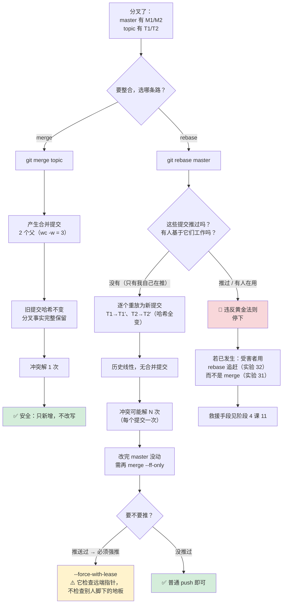

# 第 8 课：变基与提交整理

> 所属阶段：阶段 3《协作与共享》｜ 水平：进阶 ｜ 本课知识点：merge vs rebase、rebase 机制与黄金法则、cherry-pick 与交互式 rebase
> 故事情节：**历史开始被改写**——同一份改动，可以讲成两个不同的故事。

## 🎯 本课目标

- 画出 merge 与 rebase 两种方式产生的提交图，说明各自保留了什么、丢弃了什么。
- 说清 rebase 逐个重放提交的内部机制，以及"黄金法则"为什么是铁律。
- 用 cherry-pick 搬运单个提交，用 `rebase -i` 整理提交序列。

> 📖 **与课 6、课 7 的衔接**：本课的三个结论直接建立在前面两课上——
> **① 课 6 讲过"合并 = 三路合并 + 产生新提交"**，`git merge` 的那套机制在本课原样复用，只是它的对手从"另一个分支"变成了"你自己的旧提交"；
> **② 课 7 的 `pull --rebase` 为什么能消除合并提交**，本课给出机制层面的答案——因为它根本没做合并，它做的是重放；
> **③ 课 7 结尾问"rebase 之后为什么需要 `--force-with-lease`"**，本课用一次完整的事故现场回答：因为你把别人脚下的地板抽走了。
> 阶段 3 概览里那句"不要对已推送的提交做 rebase"，本课会把它从一句警告变成一段你能亲手复现的事故。

---

## 第一幕：起源与场景引入

> 🏛️ **起源**：Git 的提交图是**有向无环图（DAG）**，而"历史"只是你选择沿着哪条边去读它。

这句话听起来抽象，但它正是 rebase 存在的理由。

**提交本身不带"顺序号"**。每个提交只记录"我的父提交是谁"。所谓历史，就是从某个引用（分支、标签、HEAD）出发，沿着父指针一路走回去能摸到的那串对象。

于是同一个改动集合，**可以有两种合法的"讲法"**：

- **merge 的讲法**：这件事真实发生过——我们在 `06f8cf4` 分了叉，我在 `topic` 上做了 T1、T2，你在 `master` 上做了 M1、M2，然后我们在 `9744002` 汇合。这个"分叉—汇合"的形状**就是事实本身**。
- **rebase 的讲法**：我假装自己是在你做完 M1、M2 **之后**才开始动手的。于是历史变成一条直线：B → M1 → M2 → T1' → T2'。

**两种讲法的内容完全一样**（实验 2 与实验 3 会验证：merge 后的 `master` 包含 topic 的全部改动，rebase 后 topic 也包含自己的全部改动），**差别只在图的结构，以及提交哈希**。

> 🎬 **场景**：你提了一个 PR，reviewer 说"你这五个提交太碎了，合并一下"。

你打开搜索引擎，看到两种说法：

1. **"用 `git rebase -i` 把提交 squash 掉，历史干净。"**
2. **"千万不要 rebase 已经 push 过的分支！会出人命的。"**

两拨人都言之凿凿。你更迷惑的是第三件事：

3. 你战战兢兢执行了 `git rebase -i`，把五个提交合成了一个。然后 `git push`，**被拒了**。你加 `--force` 强推上去——**第二天同事说他的提交不见了**。

**这三个场景的答案都在同一件事里**：**rebase 不是"移动"提交，而是"复制"提交。** 移动的话，旧位置就没了；复制的话，**旧位置的东西还在，只是没人指着它了**。

**核心矛盾**：既然是复制，为什么还会出事？答案是——**你复制完把分支指针挪到了新副本上，然后把新副本推给了远端。而远端上，别人的提交还挂在你丢弃的那份旧副本上。**

**本课就是要把这套"复制—挪指针—（可能）强推"的动作拆开。** 拆开之后，什么时候能 rebase、什么时候不能，会变成一道有明确判据的判断题，而不是玄学。

---

## 第二幕：认知冲突

### 反直觉 1：rebase 之后，旧提交并没有被删除

这是理解 rebase 最关键的一件事，也是绝大多数误解的根源。

先看一组干净的对照。同样的分叉（B → M1 → M2 在 master，B → T1 → T2 在 topic）：

**merge 之后**（实验 2 实测）：

```console
$ git merge --no-ff topic -m "Merge topic into master"
Merge made by the 'ort' strategy.
 t.txt | 2 ++
 1 file changed, 2 insertions(+)
 create mode 100644 t.txt

$ git log --oneline --graph --all
*   9744002 Merge topic into master
|\  
| * c9520bc T2
| * badd1c6 T1
* | 20f2200 M2
* | f9acdc8 M1
|/  
* 06f8cf4 B: base
```

**图还在，分叉的形状完整保留**，`c9520bc`（原 topic）和 `20f2200`（原 master）**一个字节都没变**。

**rebase 之后**（实验 3 实测，另起一份同样的分叉）：

```console
$ git switch topic
$ git rebase master
Rebasing (1/2)Rebasing (2/2)Successfully rebased and updated refs/heads/topic.

$ git log --oneline --graph --all
* 76c4f51 T2
* 19d769d T1
* 20f2200 M2
* f9acdc8 M1
* 06f8cf4 B: base
```

历史变直了。看起来 T1、T2 "被搬走了"。

**矛盾点**：如果你现在去翻 reflog，会发现**旧的 T1、T2 还在**（实验 4 实测）：

```console
$ git reflog show topic
76c4f51 topic@{0}: rebase (finish): refs/heads/topic onto 20f220090c5b04363d983eadc1f6a3e17062e583
c9520bc topic@{1}: commit: T2              ← 旧 T2，还在
badd1c6 topic@{2}: commit: T1              ← 旧 T1，还在
06f8cf4 topic@{3}: branch: Created from master

$ git rev-parse --short ORIG_HEAD
c9520bc                                    ← rebase 前的 topic 尖端

$ git log --oneline -n 3 ORIG_HEAD
c9520bc T2
badd1c6 T1
06f8cf4 B: base

$ git cat-file -t $(git rev-parse ORIG_HEAD)
commit                                     ← 对象仍可读，没被销毁
```

**真相**：rebase **创建了两个新提交**（`19d769d`、`76c4f51`，因为父指针变了所以哈希必然变），然后把 `topic` 这个指针**从旧的 `c9520bc` 挪到了新的 `76c4f51`**。旧的提交对象一个都没删——**只是现在没有任何分支指着它们了**（成了 dangling commit，等待 gc 回收）。

**这个区别为什么重要**：因为旧提交还在，所以——
- 你 rebase 错了，`git rebase --abort` 或翻 reflog 就能回去（阶段 4 会细讲）；
- 但**别人的仓库里，他们的提交仍然挂在旧提交上**——这才是黄金法则的物理根源。

### 反直觉 2：rebase 完，目标分支**没有**被移动

紧接上面。rebase 结束后你 `git log` 看到的图很漂亮，但如果你切回 `master`：

```console
$ git switch master
$ git log --oneline -n 2
20f2200 M2
f9acdc8 M1                    ← master 还在原地！

$ git merge --ff-only topic
Updating 20f2200..76c4f51
Fast-forward
 t.txt | 2 ++
 1 file changed, 2 insertions(+)
 create mode 100644 t.txt
```

**为什么**：`git rebase master` 的完整语义是"**把当前分支（topic）重放到 master 之上**"——**被移动的是当前分支，不是参数里的那个分支**。这是新手最容易搞反的一点：参数是"地基"，不是"被搬的东西"。

（实验 5 实测：`rebase` 后 master 仍指向 `20f2200`，需要再 `merge --ff-only` 才追上。）

### 反直觉 3：merge 解 1 次冲突，rebase 可能解 N 次

这是"rebase 更干净"这句评价背后**没人告诉你的成本**。

构造一个两边改同一行的场景（master 改了 `line1`，topic 的 T1 和 T2 **都**改了 `line1`）：

**merge 侧**（实验 6 实测）：

```console
$ git merge --no-ff topic -m "merge topic"
Auto-merging f.txt
CONFLICT (content): Merge conflict in f.txt
Automatic merge failed; fix conflicts and then commit the result.
# CONFLICT 出现次数：1
```

merge 是"两棵树的三路合并"——**只看最终状态，一次了断**。

**rebase 侧**（实验 7、9 实测）：

```console
$ git rebase master
Rebasing (1/2)Auto-merging f.txt
CONFLICT (content): Merge conflict in f.txt
error: could not apply 4f5e16c... T1        ← 第 1 次，停在 T1
Could not apply 4f5e16c... T1

# 解决 T1，--continue 之后：
Rebasing (2/2)Auto-merging f.txt
CONFLICT (content): Merge conflict in f.txt
error: could not apply 2d923af... T2        ← 第 2 次，停在 T2
```

**为什么**：rebase 是**逐个重放**。T1 的改动和 master 冲突 → 停一次；T1' 落地后，T2 的改动又和 T1' 冲突 → 再停一次。

**推论**：如果你的分支有 20 个提交，每个都碰了同一个文件的同一片区域，rebase 可能让你解 20 次冲突——**而 merge 只要 1 次**。

**这也是为什么有 `git rerere`**（reuse recorded resolution，让 Git 记住你怎么解的，下次自动套用），以及为什么有人抱怨"rebase 解冲突解到崩溃"。

### 反直觉 4：rebase 冲突解决后，`git commit` 是错的

这是本课**最容易让新手把事情搞砸的一个操作差异**。

rebase 停下来时，你的 HEAD 是**分离的**（实验 14 实测）：

```console
$ git branch --show-current
                              ← 空！没有分支名

$ git status -sb
## HEAD (no branch)
UU f.txt
```

此时如果你按课 6 的习惯执行 `git commit -m "..."`（实验 8 实测）：

```console
$ git add f.txt
$ git commit -m "my resolution"
[detached HEAD 51fc5cc] my resolution
 1 file changed, 1 insertion(+), 1 deletion(-)
exit=0                        ← 命令"成功"了

$ ls .git | grep -i rebase
REBASE_HEAD
rebase-merge                  ← 但 rebase 状态机还在！
```

**看起来成功了，实际上没有**：你只是**在分离 HEAD 上多建了一个提交**，rebase 的流程**一步都没往前走**。

后果在实验 9 里看得清清楚楚——最终的分支上，T1 消失了，取而代之的是那个叫 `my resolution` 的提交：

```console
$ git log --oneline
03b1343 T2
51fc5cc my resolution         ← T1 变成了这个
096a423 M1
99ff950 B: base
```

**正确做法只有一个**：`git rebase --continue`。它会用你 `git add` 好的内容**完成当前这一步的重放**，然后继续处理下一个提交。

（补充：`--abort` 是"整轮放弃、回到起点"，`--skip` 是"丢掉当前这个提交、继续"。实验 10、11 有完整实测。）

---

## 第三幕：层层揭示

### 知识点 1：merge 与 rebase 的语义差别

> **一句话定义**：`merge` 把两条历史**汇合成一个提交**（保留分叉事实）；`rebase` 把一条历史上的提交**逐个复制到另一条之上**（伪造出"从没分叉过"的样子）。

#### 直觉建立：搬家 vs 重写日记

**merge 像搬家**：你把你房间的东西（topic 的改动）原封不动搬进新家（master），门口贴一张"某年某日，两户合并"的告示（合并提交）。**旧房子还在，东西一件没动。**

**rebase 像重写日记**：你的日记写的是"周一我做了 T1，周二我做了 T2"。现在你发现，其实周三别人先做了 M1、M2。于是你**重抄一遍日记**——把"周一"改成"周三"、"周二"改成"周四"，内容一字不改，但**日期全变了**。旧日记没有销毁，只是被塞进了抽屉底层。

#### 核心原理：两者的取舍矩阵

| 维度 | merge | rebase |
|------|-------|--------|
| 提交图 | 保留分叉，产生合并提交 | 线性，无合并提交 |
| 已有提交哈希 | **不变**（实验 2：`20f2200`、`c9520bc` 原样保留） | **全变**（实验 3：`badd1c6`→`19d769d`，`c9520bc`→`76c4f51`） |
| 冲突解决次数 | 1 次（实验 6 实测） | 每个提交可能 1 次（实验 7、9 实测 2 次） |
| 是否改写历史 | 否（只新增） | 是（旧提交被"弃用"） |
| 可追溯性 | 强：能看出"这个功能是独立开发的" | 弱：看不出曾经分叉 |
| 失败代价 | 低，随时 `--abort` | 中，强推后要全队协同 |

**哈希为什么会变**？课 3 讲过：提交哈希 = 内容 + **父指针** + 作者 + 提交者 + 时间戳的哈希。rebase 把父指针从 `06f8cf4` 改成了 `20f2200`，**父变了，哈希必然变**——哪怕文件内容一个字节都没动。

#### 示例演示：同一组分叉的两条路

起点（实验 1 实测）：

```console
$ git log --oneline --graph --all
* 20f2200 M2
* f9acdc8 M1
| * c9520bc T2
| * badd1c6 T1
|/  
* 06f8cf4 B: base

$ git merge-base master topic
06f8cf4f39ac8349c1da487a02033dce1e794642        ← 分叉点，rebase 的"搬运起点"
```

**走 merge**（实验 2）：合并提交有 **2 个父**（实测 `git rev-list --parents -n 1 HEAD | wc -w` = 3 = 自身 + 2 父）：

```
*   9744002 Merge topic into master
|\  
| * c9520bc T2
| * badd1c6 T1
* | 20f2200 M2
* | f9acdc8 M1
|/  
* 06f8cf4 B: base
```

**走 rebase**（实验 3）：线性，每个提交 1 个父（实测 `wc -w` = 2）：

```
* 76c4f51 T2
* 19d769d T1
* 20f2200 M2
* f9acdc8 M1
* 06f8cf4 B: base
```

**内容等价性验证**（实验 2 实测）：merge 之后，`git merge-base --is-ancestor c9520bc master` 返回 **exit 0**——即旧 topic 尖端已成为 master 的祖先，**改动一个不落全在**。

#### 常见误区

- **误区 A：「rebase 更快所以更好」**。它只是让 `git log --oneline` 更好看。但如果你需要回答"这个功能是什么时候、从哪个点切出去开发的"，merge 图里有，rebase 图里**没有**。
- **误区 B：「merge 会产生一堆无意义的合并提交」**。这个批评其实针对的是**快进能成功时还硬要 `--no-ff`**。真正分叉时的合并提交**不是噪音，是信息**。附带一提：merge 出来的历史想看"主线"很容易，`git log --first-parent` 一秒搞定（实验 33 实测输出正好是 `9744002 → 20f2200 → f9acdc8 → 06f8cf4`）。
- **误区 C：「rebase 会丢失提交」**。不会。旧提交还在 reflog 里（实验 4 实测 `cat-file -t` 仍返回 `commit`）。它丢的是**引用**，不是**对象**。

#### 一句话记住

> **merge 是"承认分叉发生过"，rebase 是"假装分叉没发生过"；前者加一个提交，后者重写一批提交。**

---

### 知识点 2：rebase 的内部机制与黄金法则

> **一句话定义**：rebase 的机制是——**找到共同祖先 → 逐个提取每个提交的改动 → 在目标分支尖端上重放为新提交 → 把分支指针挪到新副本上**。

#### 直觉建立：不是"挪动"，是"重演"

想象你在做菜。merge 是把两锅菜倒进一个大锅搅匀；rebase 是**看着菜谱，在另一个灶台上把每一步重新做一遍**。

因为父指针和上下文不同，**每一步都可能做出不一样的味道**——这就是冲突的来源。

#### 核心原理：五步走

给定 `git rebase master`（当前在 topic）：

1. **找共同祖先**：`git merge-base master topic`（实验 1 实测得到 `06f8cf4`）。
2. **列出要搬的提交**：`topic` 上有而 `master` 上没有的，即 `master..topic`，按**从旧到新**排序（T1、T2）。
3. **分离 HEAD 到目标尖端**：把 HEAD 指向 `master`（这就是为什么 rebase 中途 `git branch --show-current` 为空——实验 14 实测）。
4. **逐个重放**：对每个提交做一次"cherry-pick 式"的应用，成功则生成新提交，冲突则停下等你处理。
5. **挪指针**：全部成功后，把 `topic` 指向最后一个新提交。**`master` 全程不动**（实验 5 实测）。

#### 中断处理三兄弟：`--continue` / `--abort` / `--skip`

| 命令 | 含义 | 实测退出码 |
|------|------|-----------|
| `git rebase --continue` | 用当前暂存区完成这一步，继续下一个 | 成功 0；若下一个又冲突 1 |
| `git rebase --abort` | 整轮放弃，回到 rebase 前的状态 | 0（实验 10 实测） |
| `git rebase --skip` | **丢弃当前这个提交**，继续下一个 | 丢完最后一个后 0（实验 11 实测） |

**`--abort` 的可靠性**（实验 10 实测）：

```console
$ git rev-parse --short topic
70109e9
$ git rebase master        # 冲突，exit=1
$ git rebase --abort
exit=0
$ git rev-parse --short topic
70109e9                    ← 一字不差回到原处
$ git status --porcelain | wc -l
0                          ← 工作区也干净
```

**`--skip` 的破坏力**（实验 11 实测）：连 skip 两次，T1、T2 **两个提交全部消失**：

```console
# rebase 停在 T1 冲突 → skip（exit=1，接着撞上 T2）
# 再 skip（exit=0，rebase 结束）
* 993672f M1
* 1f49506 B: base          ← topic 与 master 重合，T1/T2 都没了
```

**⚠️ `--skip` 是静默丢提交**。除非你**明确知道**这个提交的改动已经在目标分支上了（比如实验 16 那种"变空"的情况），否则别用。

#### `--onto`：只搬我指定的那一段

`git rebase <upstream>` 搬的是"当前分支有、upstream 没有"的提交。但有时你想**精确指定从哪到哪**：

```bash
git rebase --onto <新地基> <起点 exclusive> <要搬的分支>
```

实验 12 的实测场景（这是 Git 官方文档里的经典例子）：

```
嫁之前：
* d120955 C2                    ← client
* 494a914 C1
* 784c218 S2                    ← server
* a0c14dd S1
| * 310c845 M1                  ← master
|/  
* 1e4554f B: base

$ git rebase --onto master server client
Rebasing (1/2)Rebasing (2/2)Successfully rebased and updated refs/heads/client.

嫁之后：
* afcd6e0 C2                    ← client 现在挂在 master 上
* 364400f C1
* 310c845 M1
| * 784c218 S2                  ← server 完全没被动
| * a0c14dd S1
|/  
* 1e4554f B: base
```

**读法**：「把 `client` 上、从 `server`（不含）开始的那些提交，嫁到 `master` 上」。结果 client 的历史里**只剩 C1、C2，S1、S2 被精确排除**。

#### 黄金法则：只对"还没推送、且没人基于它工作"的提交 rebase

> **🚨 黄金法则**：**只变基尚未推送、无人基于其工作的提交。**

这条不是"最佳实践"，是**物理约束**。原因就藏在知识点 1 里：rebase 是复制，旧提交还在，**而别人的工作可能挂在旧提交上**。

实验 29–31 是把这条法则违反给你看的完整事故链：

**第 1 步：Alice 推了 A1，Bob 基于 A1 做了 B1**（实验 29 实测）

```console
# 远端
6c1e979 A1: add config v1
a9f46a8 B: base

# Bob
0d2fba8 B1: bob work based on A1
6c1e979 A1: add config v1
a9f46a8 B: base
```

**第 2 步：Alice 在本地 `amend` 掉 A1，变成 A1'，强推**（实验 30 实测）

```console
$ git commit --amend -m "A1': add config v2"
$ git push --force-with-lease origin master
To /tmp/git-lesson08/remote.git
 + 6c1e979...b2ba1de master -> master (forced update)
```

**注意**：这里用的 `--force-with-lease` 是"更安全"的那个，但它**照样通过了**——因为 Alice 刚 fetch 过，她的 lease 是新鲜的。

**⚠️ 这就是本课最重要的一条认知修正**：**`--force-with-lease` 只能防"有人偷偷推过"，防不了"我要抽掉的那块地板上还站着人"。** 课 7 把它当成强推的安全替代品，本课要给它打个补丁：它检查的是**远端指针**，不检查**别人的工作区**。

**第 3 步：Bob 的视角——历史被抽走了一块**（实验 31 实测）

```console
$ git fetch origin
From /tmp/git-lesson08/remote
 + 6c1e979...b2ba1de master     -> origin/master  (forced update)

$ git status -sb
## master...origin/master [ahead 2, behind 1]      ← 又 ahead 又 behind

$ git log --oneline --graph --all
* 0d2fba8 B1: bob work based on A1
* 6c1e979 A1: add config v1          ← Bob 的工作还挂在这
| * b2ba1de A1': add config v2       ← 远端已经换成这个了
|/  
* a9f46a8 B: base
```

Bob 如果直接 `git pull`——**课 7 讲过，2.34 起直接 fatal**（实测 exit 128）。他选 `pull --no-rebase`：

```console
Auto-merging cfg.txt
CONFLICT (add/add): Merge conflict in cfg.txt     ← 同一个文件被两边"新增"
```

解决完提交，**A1 复活了**（实验 31 实测）：

```console
*   a7be6df Merge branch 'master' of /tmp/git-lesson08/remote
|\  
| * b2ba1de A1': add config v2       ← Alice 的新版
* | 0d2fba8 B1: bob work based on A1
* | 6c1e979 A1: add config v1        ← 旧版被合并回来了，config v1 与 v2 同时存在

$ git log --oneline | grep -c "add config"
2                                    ← 同一个改动出现两次
```

**这就是"最昂贵的协作事故"**：不是代码丢了，是**同一个改动以两个身份永久留在了历史里**，以后每次 `git log`、`git blame`、每次排查都要面对这个幽灵。

#### 如果已经发生了，怎么收场

实验 32 给出干净解：**用 rebase 而不是 merge 去追赶**。

```console
$ git fetch origin
$ git log --oneline --graph --all
* 295fa28 B2: bob2 work based on A1
* 119bb42 A1: add config v1
| * bbae031 A1': add config v2
|/  
* b26288f B: base

$ git rebase origin/master
Rebasing (1/2)Auto-merging cfg.txt
CONFLICT (add/add): Merge conflict in cfg.txt
error: could not apply 119bb42... A1: add config v1

# 采用远端的 config-v2，然后 --continue
$ git rebase --continue
Rebasing (2/2)Successfully rebased and updated refs/heads/master.

$ git log --oneline --graph --all
* c0b8612 B2: bob2 work based on A1
* bbae031 A1': add config v2        ← 线性，没有合并提交
* b26288f B: base

$ git log --oneline | grep -c "add config v1"
0                                    ← 旧的 A1 没复活
```

**注意 rebase 停在哪一步**：提示是 `could not apply 119bb42... A1`——**它在重放 A1 本身**。因为 `git rebase origin/master` 搬的是 `origin/master..master`，而 A1 **不在** `origin/master` 里（A1' 才是），所以 A1 也在搬运范围内。

**这恰恰是它干净的原因**：A1 被重放时，它的改动（写 `config-v1`）与 A1' 的改动（写 `config-v2`）正面撞上（`add/add`）。你在这里选择"采用 config-v2"，就等于**亲手丢弃了 A1 的内容**——于是 A1 变成空提交被跳过（呼应实验 16），最终只剩 A1'。

**而 merge 做了什么**：它不比较内容，只把两条历史**同时保留**——于是 A1 和 A1' 一起留在了图里（实验 31 的 grep 计数 2）。

**一句话**：merge 是"两边都留着"，rebase 是"让你当场二选一"。

（更彻底的救援手段——找回被强推抹掉的提交——在阶段 4 课 11《误操作救援》讲。）

#### 几个补充实测（容易撞上的边界）

- **脏工作区会被拒绝**（实验 13 实测）：`error: cannot rebase: You have unstaged changes.` **exit 1**，rebase 根本不启动。
- **已经是最新的话是 no-op**（实验 13 实测）：`Current branch topic is up to date.` **exit 0**。
- **提交变空会被自动跳过**（实验 16 实测）：如果某个提交的改动已经在目标分支上了，Git 会提示 `warning: skipped previously applied commit`，实测 `git rev-list --count master..topic` = **0**。想强制保留可用 `--reapply-cherry-picks`。
- **rebase 保留原作者**（实验 15 实测）：你 rebase 别人的提交后，`Author` 仍是 `Li Si`，只有 `Committer` 变成你。**这条很重要**——它意味着"谁写的"这个信息不会丢失，丢的只是"什么时候以什么顺序写的"。
- **`--rebase-merges` 保留合并结构**（实验 17 实测）：普通 rebase 会把合并**摊平**（实测 `flat` 分支变成 `M2 → S1 → M1 → N1 → base` 一条直线），加 `-r`（`--rebase-merges`）后 TODO 里会出现 `label` / `reset` / `merge -C` 指令，重建出的图**保留了合并节点**。该选项 2.18 引入、2.22 起取代已废弃的 `--preserve-merges`（已联网核实）。
- **默认后端是 merge**（实验 18 实测）：`git config --get rebase.backend` 返回 **exit 1**（未设置），即走默认值；**这个值从 Git 2.26（2020-03）起由 `apply` 改为 `merge`**（已联网核实官方 Release Notes）。想回到旧行为用 `git rebase --apply`（实测 exit 0，输出 `First, rewinding head to replay your work on top of it...`）。

#### 常见误区

- **误区 A：「`--force-with-lease` 能防止我毁掉别人的工作」**。不能。它只检查远端指针是否还等于你上次看到的值（课 7 实验 14），**不检查别人的提交是不是挂在你正要丢弃的提交上**。唯一可靠的防线是**黄金法则本身**。
- **误区 B：「rebase 就是移动提交」**。是**复制**。旧提交还在 reflog 里（实验 4 实测 `cat-file -t` 返回 `commit`）。
- **误区 C：冲突解决完 `git commit`**。应该用 `git rebase --continue`（实验 8 实测：直接 commit 会让 rebase 状态机原地不动，最终 T1 变成孤立的 `my resolution`）。
- **误区 D：「rebase 会把我变成代码作者」**。不会。Author 保留原值，只改 Committer（实验 15 实测）。

#### 一句话记住

> **rebase 是复制不是移动；旧提交还站着人，你就不能抽走它脚下的地板。**

---

### 知识点 3：cherry-pick 与交互式 rebase

> **一句话定义**：`cherry-pick` 把**指定的某一个提交**的改动作为新提交应用到当前分支；`rebase -i` 让你**用一张待办清单**批量改写一批提交。

#### 直觉建立：搬砖 vs 装修

- **cherry-pick** 像从另一栋楼里**挑一块砖**搬过来。你只要这一块，不要整面墙。
- **rebase -i** 像**整层楼重新装修**：拆掉、合并、改名、丢弃，全在这一次完成。

#### cherry-pick：搬单个提交

实验 19 实测：

```console
$ git cherry-pick bc728a8
[master 7a7b812] F1: add feature file
 Date: Wed Sep 9 10:23:10 2026 +0800
 1 file changed, 1 insertion(+)
 create mode 100644 ft.txt

$ git log --oneline --graph --all
* bc728a8 F1: add feature file      ← 源提交（在 feature 分支上）
| * 7a7b812 F1: add feature file    ← 新提交（在 master 上），哈希不同
| * bb67306 M1: other work
|/  
* 1e4554f B: base
```

**哈希变了**（`bc728a8` → `7a7b812`），原因和 rebase 一模一样：**父指针变了**。

**`-x` 留下来源标记**（实验 20 实测）：

```console
$ git cherry-pick -x bc728a8
$ git log -1 --pretty=format:'%s%n%b'
F1: add feature file
(cherry picked from commit bc728a80e9e61b77bcf514d1b37d11bc1f8dcf2e)
```

这行 `(cherry picked from commit ...)` 是**给未来的人类看的**：三个月后有人翻到一个提交想不通"这个文件怎么突然冒出来的"，这行标记能直接把他带到原始提交。**给维护分支打补丁时强烈建议加 `-x`。**

**支持范围**（实验 21 实测）：

```console
$ git cherry-pick master..feature      # 搬 feature 上有、master 上没有的全部
[master d899c58] F1
[master 7d3811c] F2
[master 89b9504] F3
```

**重复搬运会变空**（实验 21 实测）：再挑一次已经搬过的 F3——

```console
$ git cherry-pick feature
The previous cherry-pick is now empty, possibly due to conflict resolution.
...
exit=1
$ git cherry-pick --skip               # 用 --skip 收尾
exit=0
```

**⚠️ 挑合并提交必须给 `-m`**（实验 22 实测）：

```console
$ git cherry-pick 9440a29
error: commit 9440a29dec7af4855e8179498deafe2dc34219a5 is a merge but no -m option was given.
fatal: cherry-pick failed
exit=128                               ← 直接失败

$ git cherry-pick -m 1 9440a29
[target 2926806] Merge side into master
 1 file changed, 1 insertion(+)
 create mode 100644 s.txt
exit=0
```

**为什么必须给**：合并提交有**两个父**，"这个提交的改动"是相对于哪个父而言的？答案不确定。`-m 1` 表示"以第一父（合并时所在的分支）为主线"，于是 Git 算出的是"**第二父带进来的那些改动**"。

（这正好呼应课 6 的 `git revert -m 1`——同一个问题，同一个参数。）

#### `rebase -i`：六种动作

执行 `git rebase -i HEAD~3`，Git 会打开一个 TODO 清单（实验 23 实测）：

```console
--- TODO 原文 ---
pick ab28fdb C1: add a.txt
pick 7b37f1c C2: fix typo
pick 9ce3656 C3: another typo fix
```

**六种动作**（清单底部的注释里 Git 自己就写着，可直接看）：

| 动作 | 作用 | 备注 |
|------|------|------|
| `pick` | 原样保留这个提交 | 默认 |
| `reword` | 保留改动，**改提交信息** | 会打开编辑器让你重写 |
| `edit` | 停下来，让你**改内容**（可配合 `--amend`、或拆分成多个提交） | 停在这里，需 `--continue` |
| `squash` | 并入**上一个**提交，**保留**它的提交信息 | 会打开编辑器让你合并信息 |
| `fixup` | 并入上一个提交，**丢弃**它的提交信息 | 不打开编辑器，最快 |
| `drop` | **删掉**这个提交（删整行同效） | ⚠️ 改动一起消失 |

**`squash` vs `fixup` 的差别，实测对比最清楚**：

`squash`（实验 24 实测）——三个提交合成一个，**信息全部保留在 body 里**：

```console
$ git log --oneline --graph
* e3f3aa9 C1: add a.txt
* b1e10dc B: base

$ git log -1 --pretty=format:'%s%n---body---%n%b'
C1: add a.txt
---body---
C2: fix typo

C3: another typo fix                 ← 被吞掉的两个，subject 都留着

$ cat a.txt
a
b
c                                    ← 内容一个没少
```

`fixup`（实验 25 实测）——同样合成一个，**body 是空的**：

```console
$ git log -1 --pretty=format:'%s%n---body---%n%b'
C1: add a.txt
---body---
                                     ← 空

$ cat a.txt
a
b
c                                    ← 内容照样没少
```

**怎么选**：`fixup` 用于"C2 是 C1 的打字错误、不值得在历史上留痕"；`squash` 用于"这两个提交都是有意义的步骤，我想合并展示但保留线索"。

**`reword`**（实验 26 实测）：第一个提交的 subject 被改掉，其余不动：

```console
* 12bfadd C3: another typo fix
* dd6bba6 C2: fix typo
* 3de9f16 feat: 一次说清的三连提交      ← 原为 "C1: add a.txt"
* b1e10dc B: base
```

**`edit`**（实验 27 实测）——注意这里有个**实测发现的坑**：

```console
$ GIT_SEQUENCE_EDITOR=<edit1.sh> git rebase -i HEAD~3
Stopped at 7f34295...  C1: add a.txt
You can amend the commit now, with
  git commit --amend
Once you are satisfied with your changes, run
  git rebase --continue

$ echo "d" >> a.txt && git add a.txt && git commit --amend --no-edit
# 然后：
$ git rebase --continue
CONFLICT (content): Merge conflict in a.txt      ← 撞车了！
```

**为什么会撞车**：你在 C1 里加了 `d`，而 C2 的改动是"在 `a` 后面加 `b`"——它期望的上下文变了。**改早期提交会牵连后面所有提交**，这是 `edit` 的固有代价（和知识点 1 的"rebase 可能解 N 次冲突"是同一件事）。

解决冲突后完成（实测最终 `a.txt` = `a / d / b / c`，符合预期）。

#### `--autosquash`：提交时就标好"我属于谁"

如果你在写代码时就知道"这个改动应该并进前面那个提交"，可以直接这样提交（实验 28 实测）：

```console
$ git commit --fixup HEAD
[master 6a630a6] fixup! wip: half done

$ git rebase -i --autosquash HEAD~2
--- TODO 原文 ---
pick a39a665 wip: half done
fixup 6a630a6 fixup! wip: half done      ← 自动排好序，动作已改成 fixup
```

**好处**：你不用记"第几个要合并到第几个"，Git 靠提交信息里的 `fixup! xxx` 自动配对。想省事可以设成默认：

```bash
git config --global rebase.autoSquash true
```

#### 常见误区

- **误区 A：「cherry-pick 是把提交搬过去，所以哈希应该一样」**。不一样（实验 19 实测 `bc728a8` → `7a7b812`）。它和 rebase 一样是**生成新提交**。
- **误区 B：「cherry-pick 能直接搬合并提交」**。不能，**exit 128**（实验 22 实测），必须 `-m 1` 指定主线。
- **误区 C：「`drop` 只是删掉提交记录，改动会留在文件里」**。错。**改动一起消失**——这正是为什么它能用来清除误提交的密钥/大文件（但要配合强推与全队协同，那是阶段 4 的课题）。
- **误区 D：「`rebase -i` 只能改最后一个提交」**。不，`HEAD~N` 决定范围，`--root` 可以一路改到根提交。

#### 一句话记住

> **cherry-pick 搬一块砖，rebase -i 装修一整层；两者都靠"生成新提交"工作，所以哈希必变。**

---

## 第四幕：实操验证

> ⚠️ **本节每条命令都已在 WSL Ubuntu 24.04 / bash 5.2.21 / Git 2.43.0 上逐字跑通**（整份脚本一次执行完毕、无脚本级错误）。
> 输出中的 SHA 会与你的机器不同（内容寻址），但**退出码、状态码、关键字**应当一致。
> ⚠️ 脚本里的 `exit=$?` 一律直接取自被测命令；**绝不要写成 `git cmd | head` 再取 `$?`**——那拿到的是 `head` 的退出码（恒为 0），会把真实的 128 显示成 0。这是写 Git 演示脚本的经典陷阱（课 7 已踩过一次），本节全部规避。
> ⚠️ **多仓库场景注意目录上下文**：`clone` 之前先确认自己在哪个目录，否则新仓库会被克隆进子目录、后续 `cd` 失败导致脚本中断（课 7 踩过一次）。

**准备**：隔离 HOME（必查项 #29）。

```bash
export HOME=/tmp/git-lesson08-home
rm -rf "$HOME"; mkdir -p "$HOME"
git config --global user.name "Zhang Wei"
git config --global user.email "zhangwei@example.com"
git config --global init.defaultBranch master
git config --global commit.gpgsign false
git config --global advice.detachedHead false

LAB=/tmp/git-lesson08
rm -rf "$LAB"; mkdir -p "$LAB/editor"
cd "$LAB"
```

为了让读者不必手工改 TODO 清单也能复现，先准备几个非交互式"编辑器"：

```bash
cat > "$LAB/editor/show.sh" <<'EOF'
#!/bin/bash
echo "--- TODO 原文 ---"; grep -v '^#' "$1"
EOF
cat > "$LAB/editor/squash23.sh" <<'EOF'
#!/bin/bash
sed -i '2s/^pick/squash/; 3s/^pick/squash/' "$1"
EOF
cat > "$LAB/editor/fixup23.sh" <<'EOF'
#!/bin/bash
sed -i '2s/^pick/fixup/; 3s/^pick/fixup/' "$1"
EOF
cat > "$LAB/editor/reword1.sh" <<'EOF'
#!/bin/bash
sed -i '1s/^pick/reword/' "$1"
EOF
cat > "$LAB/editor/newmsg.sh" <<'EOF'
#!/bin/bash
printf 'feat: 一次说清的三连提交\n' > "$1"
EOF
cat > "$LAB/editor/edit1.sh" <<'EOF'
#!/bin/bash
sed -i '1s/^pick/edit/' "$1"
EOF
chmod +x "$LAB/editor"/*.sh
```

两个通用辅助（每次实验前重建干净的分叉）：

```bash
hr() { echo; echo "########## 实验 $* ##########"; }
run() { "$@" > /tmp/l08.txt 2>&1; echo "exit=$?"; cat /tmp/l08.txt; }

# 干净分叉：master 有 M1/M2，topic 有 T1/T2
mk_diverge() {
  local d=$1
  rm -rf "$d"; mkdir -p "$d"; cd "$d" || exit 1
  git init -q .
  echo base > f.txt; git add f.txt; git commit -q -m "B: base"
  git branch topic
  echo m1 >> f.txt; git commit -q -am "M1"
  echo m2 >> f.txt; git commit -q -am "M2"
  git switch -q topic
  echo t1 > t.txt; git add t.txt; git commit -q -m "T1"
  echo t2 >> t.txt; git commit -q -am "T2"
}

# 冲突分叉：两边都改 f.txt 的第一行
mk_div_conflict() {
  local d=$1
  rm -rf "$d"; mkdir -p "$d"; cd "$d" || exit 1
  git init -q .
  printf 'line1\nline2\n' > f.txt; git add f.txt; git commit -q -m "B: base"
  git branch topic
  printf 'line1-master\nline2\n' > f.txt; git commit -q -am "M1"
  git switch -q topic
  printf 'line1-t1\nline2\n' > f.txt; git commit -q -am "T1"
  printf 'line1-t2\nline2\n' > f.txt; git commit -q -am "T2"
}
```

#### 实验 1：同一组分叉，先看清楚起点

```bash
mk_diverge "$LAB/E1"
git log --oneline --graph --all
echo "--- merge-base（分叉点）:"
git merge-base master topic
echo "--- 短哈希:"; git rev-parse --short "$(git merge-base master topic)"
echo "--- master / topic 各指向:"
git log --oneline -1 master
git log --oneline -1 topic
```

实测输出：

```console
* 20f2200 M2
* f9acdc8 M1
| * c9520bc T2
| * badd1c6 T1
|/  
* 06f8cf4 B: base
--- merge-base（分叉点）:
06f8cf4f39ac8349c1da487a02033dce1e794642
--- 短哈希:
06f8cf4
--- master / topic 各指向:
20f2200 M2
c9520bc T2
```

> 💡 `merge-base` 就是 rebase 的"搬运起点"。**它没有 `--short` 选项**（实测 `git merge-base --short` 报 `error: unknown option`），要短哈希就用 `git rev-parse --short $(git merge-base A B)`。

#### 实验 2：merge 路径 —— 产生合并提交，一个旧提交都没改

```bash
git switch -q master
OLD_M=$(git rev-parse --short master)
OLD_T=$(git rev-parse --short topic)
run git merge --no-ff topic -m "Merge topic into master"
git log --oneline --graph --all
echo "--- 合并提交的父数量（words = 1 个自身 sha + N 个父）:"
git rev-list --parents -n 1 HEAD | wc -w
echo "--- 旧提交哈希还在吗（原 master=$OLD_M 原 topic=$OLD_T）:"
git log --oneline | head -5
echo "--- master 现在包含 topic 全部:"
git merge-base --is-ancestor "$OLD_T" master; echo "is_ancestor_exit=$?"
```

实测输出：

```console
exit=0
Merge made by the 'ort' strategy.
 t.txt | 2 ++
 1 file changed, 2 insertions(+)
 create mode 100644 t.txt
*   9744002 Merge topic into master
|\  
| * c9520bc T2
| * badd1c6 T1
* | 20f2200 M2
* | f9acdc8 M1
|/  
* 06f8cf4 B: base
--- 合并提交的父数量（words = 1 个自身 sha + N 个父）:
3
--- 旧提交哈希还在吗（原 master=20f2200 原 topic=c9520bc）:
9744002 Merge topic into master
20f2200 M2
c9520bc T2
f9acdc8 M1
badd1c6 T1
--- master 现在包含 topic 全部:
is_ancestor_exit=0
```

**读出来的三件事**：① 合并提交 `wc -w` = **3** = 自身 + 2 个父；② `20f2200`、`c9520bc` 原样保留，一个哈希都没变；③ `--is-ancestor` 返回 **0**，说明 master 已包含 topic 的全部改动。

#### 实验 3：rebase 路径 —— 全新一份同样分叉，历史变线性

```bash
mk_diverge "$LAB/E3"
git switch -q topic
echo "rebase 前: topic=$(git rev-parse --short topic)  T1=$(git rev-parse --short topic~1)  T2=$(git rev-parse --short topic)"
run git rebase master
echo "rebase 后: topic=$(git rev-parse --short topic)  T1'=$(git rev-parse --short topic~1)  T2'=$(git rev-parse --short topic)"
git log --oneline --graph --all
echo "--- 新提交的父数量（应为 2 = 自身 + 1 个父）:"
git rev-list --parents -n 1 HEAD | wc -w
echo "--- master 动过吗:"; git rev-parse --short master
echo "--- topic 领先 master 几个:"; git rev-list --count master..topic
```

实测输出：

```console
rebase 前: topic=c9520bc  T1=badd1c6  T2=c9520bc
exit=0
Rebasing (1/2)Rebasing (2/2)Successfully rebased and updated refs/heads/topic.
rebase 后: topic=76c4f51  T1'=19d769d  T2'=76c4f51
* 76c4f51 T2
* 19d769d T1
* 20f2200 M2
* f9acdc8 M1
* 06f8cf4 B: base
--- 新提交的父数量（应为 2 = 自身 + 1 个父）:
2
--- master 动过吗:
20f2200
--- topic 领先 master 几个:
2
```

**哈希全变了**（`badd1c6`→`19d769d`、`c9520bc`→`76c4f51`），而 `master` 仍是 `20f2200` —— **被搬的是当前分支，不是参数里的那个分支**。

#### 实验 4：rebase 后旧提交还在吗（reflog / ORIG_HEAD）

```bash
echo "--- topic 的 reflog:"; git reflog show topic
echo "--- ORIG_HEAD 指向:"; git rev-parse --short ORIG_HEAD
echo "--- 用 ORIG_HEAD 还能读到旧提交:"
git log --oneline -n 3 ORIG_HEAD
echo "--- 旧对象仍可读:"
git cat-file -t "$(git rev-parse ORIG_HEAD)"; echo "exit=$?"
```

实测输出：

```console
--- topic 的 reflog:
76c4f51 topic@{0}: rebase (finish): refs/heads/topic onto 20f220090c5b04363d983eadc1f6a3e17062e583
c9520bc topic@{1}: commit: T2
badd1c6 topic@{2}: commit: T1
06f8cf4 topic@{3}: branch: Created from master
--- ORIG_HEAD 指向:
c9520bc
--- 用 ORIG_HEAD 还能读到旧提交:
c9520bc T2
badd1c6 T1
06f8cf4 B: base
--- 旧对象仍可读:
commit
exit=0
```

**旧提交一个都没删**。`cat-file -t` 返回 `commit`（exit 0）证明对象还在库里，只是没有引用指着它了。

#### 实验 5：rebase 完 master 没动，还要再快进一次

```bash
git switch -q master
git log --oneline -n 2
run git merge --ff-only topic
git log --oneline --graph --all
```

实测输出：

```console
20f2200 M2
f9acdc8 M1
exit=0
Updating 20f2200..76c4f51
Fast-forward
 t.txt | 2 ++
 1 file changed, 2 insertions(+)
 create mode 100644 t.txt
* 76c4f51 T2
* 19d769d T1
* 20f2200 M2
* f9acdc8 M1
* 06f8cf4 B: base
```

#### 实验 6：冲突次数对比 —— merge 只需解 1 次

```bash
mk_div_conflict "$LAB/E6"
git switch -q master
git merge --no-ff topic -m "merge topic" > /tmp/l08.txt 2>&1; echo "merge exit=$?"
echo "CONFLICT 次数=$(grep -c CONFLICT /tmp/l08.txt)"
cat /tmp/l08.txt
git merge --abort
```

实测输出：

```console
merge exit=1
CONFLICT 次数=1
Auto-merging f.txt
CONFLICT (content): Merge conflict in f.txt
Automatic merge failed; fix conflicts and then commit the result.
```

#### 实验 7：rebase 侧 —— 第一个提交就停下来

```bash
git switch -q topic
run git rebase master
echo "--- 状态：HEAD 是分离的"
git status -sb
echo "--- 冲突文件内容:"; cat f.txt
echo "--- 当前停在哪个提交（REBASE_HEAD）:"
git rev-parse --short REBASE_HEAD
echo "--- .git 下的 rebase 目录:"; ls .git | grep -i rebase
```

实测输出：

```console
exit=1
Rebasing (1/2)Auto-merging f.txt
CONFLICT (content): Merge conflict in f.txt
error: could not apply 4f5e16c... T1
hint: Resolve all conflicts manually, mark them as resolved with
hint: "git add/rm <conflicted_files>", then run "git rebase --continue".
hint: You can instead skip this commit: run "git rebase --skip".
hint: To abort and get back to the state before "git rebase", run "git rebase --abort".
Could not apply 4f5e16c... T1
--- 状态：HEAD 是分离的
## HEAD (no branch)
UU f.txt
--- 冲突文件内容:
<<<<<<< HEAD
line1-master
=======
line1-t1
>>>>>>> 4f5e16c (T1)
line2
--- 当前停在哪个提交（REBASE_HEAD）:
4f5e16c
--- .git 下的 rebase 目录:
REBASE_HEAD
rebase-merge
```

**三个关键信号**：① `## HEAD (no branch)` —— 分离 HEAD；② `UU f.txt` —— 课 6 学过的状态码，两边都改了；③ `.git/rebase-merge` 目录存在 —— rebase 状态机正在运行。

#### 实验 8：冲突后误用 git commit（错误示范）

```bash
printf 'line1-resolved\nline2\n' > f.txt
git add f.txt
run git commit -m "my resolution"
echo "--- 还在 rebase 中吗（rebase-merge 目录仍在）:"
ls .git | grep -i rebase
echo "--- 分支名是空的（detached）:"; git status -sb
```

实测输出：

```console
exit=0
[detached HEAD 51fc5cc] my resolution
 1 file changed, 1 insertion(+), 1 deletion(-)
--- 还在 rebase 中吗（rebase-merge 目录仍在）:
REBASE_HEAD
rebase-merge
--- 分支名是空的（detached）:
## HEAD (no branch)
```

**exit=0，命令"成功"了，但 rebase 一步没动**。`rebase-merge` 目录还在，HEAD 还是分离的。这是本课最需要记住的一个"假成功"。

#### 实验 9：正确做法是 --continue —— 然后撞上第二个冲突

```bash
run git rebase --continue
echo "--- 第二次冲突:"; cat f.txt
printf 'line1-resolved2\nline2\n' > f.txt
git add f.txt
GIT_EDITOR=true run git rebase --continue
echo "--- 完成后的图:"; git log --oneline --graph --all
echo "--- 提交总数:"
git rev-list --count HEAD
echo "--- 逐条看：T1 去哪了？"
git log --oneline
```

实测输出：

```console
exit=1
Rebasing (2/2)Auto-merging f.txt
CONFLICT (content): Merge conflict in f.txt
error: could not apply 2d923af... T2
...
Could not apply 2d923af... T2
--- 第二次冲突:
<<<<<<< HEAD
line1-resolved
=======
line1-t2
>>>>>>> 2d923af (T2)
line2
exit=0
[detached HEAD 03b1343] T2
 1 file changed, 1 insertion(+), 1 deletion(-)
Successfully rebased and updated refs/heads/topic.
--- 完成后的图:
* 03b1343 T2
* 51fc5cc my resolution
* 096a423 M1
* 99ff950 B: base
--- 提交总数:
4
--- 逐条看：T1 去哪了？
03b1343 T2
51fc5cc my resolution
096a423 M1
99ff950 B: base
```

**两次冲突，解了两次**。而因为实验 8 用了 `git commit`，T1 变成了 `my resolution` —— **提交信息丢了**。如果实验 8 用的是 `--continue`，这里会是 `T1`。

#### 实验 10：--abort 完整回退

```bash
mk_div_conflict "$LAB/E10"
git switch -q topic
echo "abort 前 topic=$(git rev-parse --short topic)"
git rebase master > /tmp/l08.txt 2>&1; echo "rebase exit=$?"
run git rebase --abort
echo "abort 后 topic=$(git rev-parse --short topic)"
echo "--- 工作区干净吗（0 行 = 干净）:"
git status --porcelain | wc -l
git log --oneline --graph --all
```

实测输出：

```console
abort 前 topic=70109e9
rebase exit=1
exit=0
abort 后 topic=70109e9
--- 工作区干净吗（0 行 = 干净）:
0
* c2ab214 M1
| * 70109e9 T2
| * 4561107 T1
|/  
* 99ff950 B: base
```

`--abort` **exit 0**，哈希一字不差回到 `70109e9`，工作区 0 行改动。

#### 实验 11：--skip 丢弃提交（连 skip 两次）

```bash
mk_div_conflict "$LAB/E11"
git switch -q topic
echo "skip 前:"; git log --oneline
git rebase master > /tmp/l08.txt 2>&1; echo "rebase exit=$?"
echo "--- 第 1 次 skip（丢 T1，接着撞上 T2）:"
run git rebase --skip
echo "--- 第 2 次 skip（丢 T2，rebase 结束）:"
run git rebase --skip
echo "--- 结果（topic 与 master 重合，T1/T2 都没了）:"
git log --oneline --graph --all
```

实测输出：

```console
skip 前:
1271623 T2
fcf2d2e T1
1f49506 B: base
rebase exit=1
--- 第 1 次 skip（丢 T1，接着撞上 T2）:
exit=1
Rebasing (2/2)Auto-merging f.txt
CONFLICT (content): Merge conflict in f.txt
error: could not apply 1271623... T2
...
--- 第 2 次 skip（丢 T2，rebase 结束）:
exit=0
Successfully rebased and updated refs/heads/topic.
--- 结果（topic 与 master 重合，T1/T2 都没了）:
* 993672f M1
* 1f49506 B: base
```

**两个提交静默消失**。`--skip` 是"丢掉当前这个提交"，连按两次就把 T1、T2 都丢了。

#### 实验 12：--onto 精确控制：只把 client 嫁到 master

```bash
cd "$LAB"; mkdir -p E12; cd E12
git init -q .
echo base > f.txt; git add f.txt; git commit -q -m "B: base"
git switch -q -c server
echo s1 > s.txt; git add s.txt; git commit -q -m "S1"
echo s2 >> s.txt; git commit -q -am "S2"
git switch -q -c client server
echo c1 > c.txt; git add c.txt; git commit -q -m "C1"
echo c2 >> c.txt; git commit -q -am "C2"
git switch -q master
echo m1 > m.txt; git add m.txt; git commit -q -m "M1"
echo "--- 嫁之前:"; git log --oneline --graph --all
run git rebase --onto master server client
echo "--- 嫁之后:"; git log --oneline --graph --all
echo "--- client 的历史（S1/S2 已不在）:"; git log --oneline client
echo "--- server 没被动:"; git log --oneline server
```

实测输出：

```console
--- 嫁之前:
* d120955 C2
* 494a914 C1
* 784c218 S2
* a0c14dd S1
| * 310c845 M1
|/  
* 1e4554f B: base
exit=0
Rebasing (1/2)Rebasing (2/2)Successfully rebased and updated refs/heads/client.
--- 嫁之后:
* afcd6e0 C2
* 364400f C1
* 310c845 M1
| * 784c218 S2
| * a0c14dd S1
|/  
* 1e4554f B: base
--- client 的历史（S1/S2 已不在）:
afcd6e0 C2
364400f C1
310c845 M1
1e4554f B: base
--- server 没被动:
784c218 S2
a0c14dd S1
1e4554f B: base
```

`--onto master server client` = 「把 client 上、从 server（不含）往后的提交，嫁到 master 上」。**client 只剩 C1/C2，server 分毫未动。**

#### 实验 13：安全护栏 —— 脏工作区拒绝 rebase；已最新则 no-op

```bash
mk_diverge "$LAB/E13"
git switch -q topic
echo dirty >> f.txt
run git rebase master
git checkout -- f.txt
git rebase master > /tmp/l08.txt 2>&1
echo "第一次 rebase exit=$?"
run git rebase master
```

实测输出：

```console
exit=1
error: cannot rebase: You have unstaged changes.
error: Please commit or stash them.
第一次 rebase exit=0
exit=0
Current branch topic is up to date.
```

**脏工作区 exit 1**（rebase 根本不启动）；**已最新 exit 0**（`Current branch topic is up to date.`）。

#### 实验 14：rebase 中途 HEAD 是分离的

```bash
mk_div_conflict "$LAB/E14"
git switch -q topic
git rebase master > /tmp/l08.txt 2>&1; echo "rebase exit=$?"
echo "当前分支=[$(git branch --show-current)]"
git status -sb
git rebase --abort > /dev/null 2>&1
echo "--- abort 后分支=[$(git branch --show-current)]"
```

实测输出：

```console
rebase exit=1
当前分支=[]
## HEAD (no branch)
UU f.txt
--- abort 后分支=[topic]
```

#### 实验 15：rebase 保留 author，只改 committer

```bash
cd "$LAB"; mkdir -p E15; cd E15
git init -q .
echo base > f.txt; git add f.txt
GIT_AUTHOR_NAME="Li Si" GIT_AUTHOR_EMAIL="lisi@example.com" git commit -q -m "B: base by Li Si"
git switch -q -c topic
echo t > t.txt; git add t.txt
GIT_AUTHOR_NAME="Li Si" GIT_AUTHOR_EMAIL="lisi@example.com" git commit -q -m "T1 by Li Si"
git switch -q master
echo m > m.txt; git add m.txt; git commit -q -m "M1 by Zhang Wei"
git switch -q topic
run git rebase master
echo "--- rebase 后（Author 仍是 Li Si，Committer 变成我）:"
git log -2 --pretty=fuller | grep -E 'commit |Author:|Commit:'
```

实测输出：

```console
exit=0
Rebasing (1/1)Successfully rebased and updated refs/heads/topic.
--- rebase 后（Author 仍是 Li Si，Committer 变成我）:
commit 19fc8cb1d9d5a9e3149d83bf6b37db8cae7effbc
Author:     Li Si <lisi@example.com>
Commit:     Zhang Wei <zhangwei@example.com>
commit 1f889396ddacd2272d81920b413d0a63c47692e0
Author:     Zhang Wei <zhangwei@example.com>
Commit:     Zhang Wei <zhangwei@example.com>
```

**"谁写的"这个信息不会丢**，丢的只是"以什么顺序写的"。

#### 实验 16：rebase 时提交变空会被自动跳过

```bash
cd "$LAB"; mkdir -p E16; cd E16
git init -q .
echo base > f.txt; git add f.txt; git commit -q -m "B: base"
git switch -q -c topic
echo same > s.txt; git add s.txt; git commit -q -m "T1: add s.txt"
git switch -q master
echo same > s.txt; git add s.txt; git commit -q -m "M1: add same s.txt"
git switch -q topic
run git rebase master
echo "--- topic 还剩几个独有提交（应为 0）:"
git rev-list --count master..topic
```

实测输出：

```console
exit=0
warning: skipped previously applied commit 1bdfb12
hint: use --reapply-cherry-picks to include skipped commits
hint: Disable this message with "git config advice.skippedCherryPicks false"
Successfully rebased and updated refs/heads/topic.
--- topic 还剩几个独有提交（应为 0）:
0
```

**rebase 成功（exit 0）但提交没了** —— "跳过"是提示不是错误。想强制保留空提交用 `--reapply-cherry-picks`。

#### 实验 17：--rebase-merges 保留合并结构（普通 rebase 会摊平）

```bash
cd "$LAB"; mkdir -p E17; cd E17
git init -q .
echo base > f.txt; git add f.txt; git commit -q -m "B: base"
BASE=$(git rev-parse HEAD)
git switch -q -c side
echo s > s.txt; git add s.txt; git commit -q -m "S1"
git switch -q master
echo m > m.txt; git add m.txt; git commit -q -m "M1"
git merge --no-ff -q side -m "Merge side into master"
echo m2 >> m.txt; git commit -q -am "M2"
git switch -q -c newbase "$BASE"
echo n > n.txt; git add n.txt; git commit -q -m "N1"
echo "--- 起点：master 上有一个合并提交"
git log --oneline --graph master
echo "--- A：普通 rebase（合并被摊平）"
git switch -q -c flat master
run git rebase --onto newbase "$BASE" flat
git log --oneline --graph flat
echo "--- B：--rebase-merges（保留结构）"
git switch -q -c keep master
GIT_SEQUENCE_EDITOR="$LAB/editor/show.sh" GIT_EDITOR=true run git rebase -i --rebase-merges --onto newbase "$BASE" keep
git log --oneline --graph keep
```

实测输出：

```console
--- 起点：master 上有一个合并提交
* afb843a M2
*   9440a29 Merge side into master
|\  
| * d79e937 S1
* | 8060918 M1
|/  
* 1e4554f B: base
--- A：普通 rebase（合并被摊平）
exit=0
Rebasing (1/3)Rebasing (2/3)Rebasing (3/3)Successfully rebased and updated refs/heads/flat.
* 2c8afaf M2
* 48c97d9 S1
* 75adf0d M1
* f60f92f N1
* 1e4554f B: base
--- B：--rebase-merges（保留结构）
=== TODO 里出现了 label / merge 指令 ===
exit=0
--- TODO 原文 ---
label onto

reset onto
pick d79e937 S1
label Merge-side-into-master

reset onto
pick 8060918 M1
merge -C 9440a29 Merge-side-into-master # Merge side into master
pick afb843a M2

Rebasing (1/8)Rebasing (2/8)...Rebasing (8/8)Successfully rebased and updated refs/heads/keep.
* c5ce054 M2
*   daa6a56 Merge side into master
|\  
| * a24e618 S1
* | 75adf0d M1
|/  
* f60f92f N1
* 1e4554f B: base
```

**对照清晰**：A 的 `flat` 是一条直线（`M2 → S1 → M1 → N1 → base`），**合并节点消失了**；B 的 `keep` **保留了 `Merge side into master` 节点**。注意 B 的 TODO 里出现了 `label` / `reset` / `merge -C` 这类指令，8 步 vs A 的 3 步。

#### 实验 18：默认后端是 merge（Git 2.26 起）；--apply 可切回旧后端

```bash
git --version
echo "--- rebase.backend 未设置时:"
git config --get rebase.backend; echo "get_exit=$?  (1 = 未设置，走默认 merge)"
cd "$LAB"; mkdir -p E18; cd E18
git init -q .
echo base > f.txt; git add f.txt; git commit -q -m "B: base"
echo m1 >> f.txt; git commit -q -am "M1"
git switch -q -c topic HEAD~1
echo t > t.txt; git add t.txt; git commit -q -m "T1"
run git rebase --apply master
git log --oneline --graph --all
```

实测输出：

```console
git version 2.43.0
--- rebase.backend 未设置时:
get_exit=1  (1 = 未设置，走默认 merge)
exit=0
First, rewinding head to replay your work on top of it...
Applying: T1
* 4ee312e T1
* adc7d7e M1
* 1e4554f B: base
```

**已联网核实**：「`git rebase` 默认后端从 `apply`（旧称 `am`）改为 `merge`（旧称 interactive）」发生在 **Git 2.26（2020-03-22）**，官方 Release Notes 明确写在 *Backward compatibility notes* 里，并提供了 `rebase.backend` 配置项作为回退手段。`--apply` 的输出特征（First, rewinding head... / Applying: T1）与 merge 后端不同，可作为判别依据。

#### 实验 19：cherry-pick 搬单个提交，哈希会变

```bash
cd "$LAB"; mkdir -p E19; cd E19
git init -q .
echo base > f.txt; git add f.txt; git commit -q -m "B: base"
git switch -q -c feature
echo feat > ft.txt; git add ft.txt; git commit -q -m "F1: add feature file"
SRC=$(git rev-parse HEAD)
echo "源提交 = $(git rev-parse --short "$SRC")"
git switch -q master
echo other > o.txt; git add o.txt; git commit -q -m "M1: other work"
run git cherry-pick "$SRC"
echo "新提交 = $(git rev-parse --short HEAD)"
echo "--- 图（两边各有一个同名但不同哈希的提交）:"; git log --oneline --graph --all
echo "--- 内容搬过来了吗:"; ls
```

实测输出：

```console
源提交 = bc728a8
exit=0
[master 7a7b812] F1: add feature file
 Date: Wed Sep 9 10:23:10 2026 +0800
 1 file changed, 1 insertion(+)
 create mode 100644 ft.txt
新提交 = 7a7b812
--- 图（两边各有一个同名但不同哈希的提交）:
* bc728a8 F1: add feature file
| * 7a7b812 F1: add feature file
| * bb67306 M1: other work
|/  
* 1e4554f B: base
--- 内容搬过来了吗:
f.txt
ft.txt
o.txt
```

#### 实验 20：cherry-pick -x 留下来源标记

```bash
cd "$LAB"; mkdir -p E20; cd E20
git init -q .
echo base > f.txt; git add f.txt; git commit -q -m "B: base"
git switch -q -c feature
echo feat > ft.txt; git add ft.txt; git commit -q -m "F1: add feature file"
SRC=$(git rev-parse HEAD)
echo "源提交 = $(git rev-parse --short "$SRC")"
git switch -q master
echo other > o.txt; git add o.txt; git commit -q -m "M1: other work"
run git cherry-pick -x "$SRC"
echo "--- 新提交的 subject + body:"
git log -1 --pretty=format:'%s%n%b'
echo "--- 源提交短哈希（与上面 from 后的串对比）:"; git rev-parse --short "$SRC"
```

实测输出：

```console
源提交 = bc728a8
exit=0
[master 3be991c] F1: add feature file
 Date: Wed Sep 9 10:23:10 2026 +0800
 1 file changed, 1 insertion(+)
 create mode 100644 ft.txt
--- 新提交的 subject + body:
F1: add feature file
(cherry picked from commit bc728a80e9e61b77bcf514d1b37d11bc1f8dcf2e)
--- 源提交短哈希（与上面 from 后的串对比）:
bc728a8
```

> ⚠️ 注意：同一个提交**只能成功挑一次**。如果在已经有这份改动的分支上再挑，会变成空提交并 exit 1（见实验 21 后半段）——所以本实验特意另起了一个干净仓库。

#### 实验 21：cherry-pick 支持范围；重复应用会变空

```bash
cd "$LAB"; mkdir -p E21; cd E21
git init -q .
echo base > f.txt; git add f.txt; git commit -q -m "B: base"
git switch -q -c feature
echo f1 > f1.txt; git add f1.txt; git commit -q -m "F1"
echo f2 > f2.txt; git add f2.txt; git commit -q -m "F2"
echo f3 > f3.txt; git add f3.txt; git commit -q -m "F3"
git switch -q master
run git cherry-pick master..feature
echo "--- 三个提交都搬过来了:"; git log --oneline -n 3
echo "--- 再挑已经搬过的那个 F3（改动已存在 → 变空）:"
run git cherry-pick feature
run git cherry-pick --skip
```

实测输出：

```console
exit=0
[master d899c58] F1
 Date: Wed Sep 9 10:23:10 2026 +0800
 1 file changed, 1 insertion(+)
 create mode 100644 f1.txt
[master 7d3811c] F2
 Date: Wed Sep 9 10:23:10 2026 +0800
 1 file changed, 1 insertion(+)
 create mode 100644 f2.txt
[master 89b9504] F3
 Date: Wed Sep 9 10:23:10 2026 +0800
 1 file changed, 1 insertion(+)
 create mode 100644 f3.txt
--- 三个提交都搬过来了:
89b9504 F3
7d3811c F2
d899c58 F1
--- 再挑已经搬过的那个 F3（改动已存在 → 变空）:
exit=1
The previous cherry-pick is now empty, possibly due to conflict resolution.
If you wish to commit it anyway, use:

    git commit --allow-empty

Otherwise, please use 'git cherry-pick --skip'
On branch master
You are currently cherry-picking commit 89b9504.
  (all conflicts fixed: run "git cherry-pick --continue")
  (use "git cherry-pick --skip" to skip this patch)
  (use "git cherry-pick --abort" to cancel the cherry-pick operation)

nothing to commit, working tree clean
exit=0
```

**`--skip` exit 0 收尾**。这个"变空"的提示里，`git status` 会显示 `## master`（没有冲突标记），很容易让人以为卡住了——记住用 `--skip` 或 `--abort` 退出这个状态。

#### 实验 22：cherry-pick 合并提交必须给 -m

```bash
cd "$LAB"; mkdir -p E22; cd E22
git init -q .
echo base > f.txt; git add f.txt; git commit -q -m "B: base"
git switch -q -c side
echo s > s.txt; git add s.txt; git commit -q -m "S1"
git switch -q master
echo m > m.txt; git add m.txt; git commit -q -m "M1"
git merge --no-ff -q side -m "Merge side into master"
MERGE=$(git rev-parse HEAD)
echo "合并提交 = $(git rev-parse --short "$MERGE")"
echo "--- 从 M1 拉一条 target（合并之前的位置）:"
git switch -q -c target master~1
git log --oneline -n 1
echo "--- 不带 -m:"
run git cherry-pick "$MERGE"
git cherry-pick --abort > /dev/null 2>&1
echo "--- 带 -m 1（以第一父为主线）:"
run git cherry-pick -m 1 "$MERGE"
echo "--- 搬进来的是 side 的改动:"; git log --oneline -n 2; ls
```

实测输出：

```console
合并提交 = 9440a29
--- 从 M1 拉一条 target（合并之前的位置）:
8060918 M1
--- 不带 -m:
exit=128
error: commit 9440a29dec7af4855e8179498deafe2dc34219a5 is a merge but no -m option was given.
fatal: cherry-pick failed
--- 带 -m 1（以第一父为主线）:
exit=0
[target 2926806] Merge side into master
 Date: Wed Sep 9 10:23:10 2026 +0800
 1 file changed, 1 insertion(+)
 create mode 100644 s.txt
--- 搬进来的是 side 的改动:
2926806 Merge side into master
8060918 M1
f.txt
m.txt
s.txt
```

**不带 `-m` → exit 128；带 `-m 1` → exit 0 且只搬进 `s.txt`**（side 的改动）。

#### 实验 23：rebase -i 的 TODO 原文长什么样

```bash
cd "$LAB"; mkdir -p E23; cd E23
git init -q .
echo base > base.txt; git add base.txt; git commit -q -m "B: base"
echo a > a.txt; git add a.txt; git commit -q -m "C1: add a.txt"
echo b >> a.txt; git commit -q -am "C2: fix typo"
echo c >> a.txt; git commit -q -am "C3: another typo fix"
GIT_SEQUENCE_EDITOR="$LAB/editor/show.sh" run git rebase -i HEAD~3
```

实测输出：

```console
exit=0
--- TODO 原文 ---
pick ab28fdb C1: add a.txt
pick 7b37f1c C2: fix typo
pick 9ce3656 C3: another typo fix

Successfully rebased and updated refs/heads/master.
```

**注意**：`HEAD~3` 要求仓库至少有 3 个提交可作为"非根"起点。如果你的仓库只有 3 个提交（含根提交），`HEAD~3` 会报 `fatal: invalid upstream 'HEAD~3'`（exit 128）。**这是本课脚本第一版踩到的坑**——每个 `-i` 实验前都先造一个 `B: base` 垫底，就是为了让 `HEAD~3` 合法。

#### 实验 24：squash —— 三个合成一个，保留全部信息

```bash
GIT_SEQUENCE_EDITOR="$LAB/editor/squash23.sh" GIT_EDITOR=true run git rebase -i HEAD~3
echo "--- 结果:"; git log --oneline --graph
echo "--- 合并后的完整提交信息:"; git log -1 --pretty=format:'%s%n---body---%n%b'
echo "--- 内容没丢:"; cat a.txt
```

实测输出：

```console
exit=0
Rebasing (2/3)Rebasing (3/3)[detached HEAD e3f3aa9] C1: add a.txt
 Date: Wed Sep 9 10:23:10 2026 +0800
 1 file changed, 3 insertions(+)
 create mode 100644 a.txt
Successfully rebased and updated refs/heads/master.
--- 结果:
* e3f3aa9 C1: add a.txt
* b1e10dc B: base
--- 合并后的完整提交信息:
C1: add a.txt
---body---
C2: fix typo

C3: another typo fix
--- 内容没丢:
a
b
c
```

#### 实验 25：fixup —— 三个合成一个，丢掉被吞掉的信息

```bash
cd "$LAB"; mkdir -p E25; cd E25
git init -q .
echo base > base.txt; git add base.txt; git commit -q -m "B: base"
echo a > a.txt; git add a.txt; git commit -q -m "C1: add a.txt"
echo b >> a.txt; git commit -q -am "C2: fix typo"
echo c >> a.txt; git commit -q -am "C3: another typo fix"
GIT_SEQUENCE_EDITOR="$LAB/editor/fixup23.sh" GIT_EDITOR=true run git rebase -i HEAD~3
echo "--- 结果:"; git log --oneline --graph
echo "--- 合并后的完整提交信息（body 为空）:"; git log -1 --pretty=format:'%s%n---body---%n%b'
echo "--- 内容也没丢:"; cat a.txt
```

实测输出：

```console
exit=0
Rebasing (2/3)Rebasing (3/3)Successfully rebased and updated refs/heads/master.
--- 结果:
* f76d8c5 C1: add a.txt
* b1e10dc B: base
--- 合并后的完整提交信息（body 为空）:
C1: add a.txt
---body---
--- 内容也没丢:
a
b
c
```

**与 squash 的唯一差别就是 body**：squash 留下 `C2: fix typo` / `C3: another typo fix` 两行，fixup 什么都不留。内容（a/b/c 三行）两者都完整保留。

#### 实验 26：reword —— 改提交信息

```bash
cd "$LAB"; mkdir -p E26; cd E26
git init -q .
echo base > base.txt; git add base.txt; git commit -q -m "B: base"
echo a > a.txt; git add a.txt; git commit -q -m "C1: add a.txt"
echo b >> a.txt; git commit -q -am "C2: fix typo"
echo c >> a.txt; git commit -q -am "C3: another typo fix"
GIT_SEQUENCE_EDITOR="$LAB/editor/reword1.sh" GIT_EDITOR="$LAB/editor/newmsg.sh" run git rebase -i HEAD~3
echo "--- 第一个提交的 subject 被改掉了:"; git log --oneline --graph
```

实测输出：

```console
exit=0
Rebasing (1/3)[detached HEAD 3de9f16] feat: 一次说清的三连提交
 Date: Wed Sep 9 10:23:10 2026 +0800
 1 file changed, 1 insertion(+)
 create mode 100644 a.txt
Rebasing (2/3)Rebasing (3/3)Successfully rebased and updated refs/heads/master.
--- 第一个提交的 subject 被改掉了:
* 12bfadd C3: another typo fix
* dd6bba6 C2: fix typo
* 3de9f16 feat: 一次说清的三连提交
* b1e10dc B: base
```

#### 实验 27：edit —— 停下来改内容；改早期提交会牵连后面

```bash
cd "$LAB"; mkdir -p E27; cd E27
git init -q .
echo base > base.txt; git add base.txt; git commit -q -m "B: base"
echo a > a.txt; git add a.txt; git commit -q -m "C1: add a.txt"
echo b >> a.txt; git commit -q -am "C2: fix typo"
echo c >> a.txt; git commit -q -am "C3: another typo fix"
GIT_SEQUENCE_EDITOR="$LAB/editor/edit1.sh" run git rebase -i HEAD~3
echo "--- 停下来了，分支名为空:"; git status -sb
echo "--- 在 C1 里加一行 d，然后 amend:"
echo "d" >> a.txt
git add a.txt
run git commit --amend --no-edit
echo "--- continue 时 C2 撞车（因为 C1 的内容变了）:"
GIT_EDITOR=true run git rebase --continue
echo "--- 解决它（保留 d 和 b 两行）:"
printf 'a\nd\nb\n' > a.txt
git add a.txt
GIT_EDITOR=true run git rebase --continue
echo "--- 最终结果:"; git log --oneline --graph
echo "--- a.txt:"; cat a.txt
```

实测输出：

```console
exit=0
Rebasing (1/3)Stopped at 7f34295...  C1: add a.txt
You can amend the commit now, with

  git commit --amend

Once you are satisfied with your changes, run

  git rebase --continue
--- 停下来了，分支名为空:
## HEAD (no branch)
--- 在 C1 里加一行 d，然后 amend:
exit=0
[detached HEAD 82c272b] C1: add a.txt
 Date: Wed Sep 9 10:23:11 2026 +0800
 1 file changed, 2 insertions(+)
 create mode 100644 a.txt
--- continue 时 C2 撞车（因为 C1 的内容变了）:
exit=1
Rebasing (2/3)Auto-merging a.txt
CONFLICT (content): Merge conflict in a.txt
error: could not apply 3befb88... C2: fix typo
...
--- 解决它（保留 d 和 b 两行）:
exit=0
[detached HEAD 8f7c9da] C2: fix typo
 1 file changed, 1 insertion(+)
Rebasing (3/3)Successfully rebased and updated refs/heads/master.
--- 最终结果:
* c65baa3 C3: another typo fix
* 8f7c9da C2: fix typo
* 82c272b C1: add a.txt
* b1e10dc B: base
--- a.txt:
a
d
b
c
```

**`edit` 的代价**：改 C1 导致 C2 撞车（exit 1），必须再解一次冲突。改动越早的提交，牵连面越大。

#### 实验 28：--autosquash + git commit --fixup

```bash
cd "$LAB"; mkdir -p E28; cd E28
git init -q .
echo a > a.txt; git add a.txt; git commit -q -m "feat: add module"
echo b >> a.txt; git commit -q -am "wip: half done"
echo c >> a.txt; git add a.txt
run git commit --fixup HEAD
echo "--- autosquash 看到的 TODO（fixup 被自动排到目标后面，动作已改成 fixup）:"
GIT_SEQUENCE_EDITOR="$LAB/editor/show.sh" GIT_EDITOR=true run git rebase -i --autosquash HEAD~2
echo "--- 结果（wip 被吞进前一条）:"; git log --oneline --graph
echo "--- a.txt 内容仍在:"; cat a.txt
```

实测输出：

```console
exit=0
[master 6a630a6] fixup! wip: half done
 1 file changed, 1 insertion(+)
--- autosquash 看到的 TODO（fixup 被自动排到目标后面，动作已改成 fixup）:
exit=0
--- TODO 原文 ---
pick a39a665 wip: half done
fixup 6a630a6 fixup! wip: half done

Rebasing (2/2)Successfully rebased and updated refs/heads/master.
--- 结果（wip 被吞进前一条）:
* 03405f6 wip: half done
* eafb265 feat: add module
--- a.txt 内容仍在:
a
b
c
```

**注意**：这一次 `GIT_SEQUENCE_EDITOR` 用 `show.sh` 只是**打印** TODO 并原样退出，Git 随后就按清单执行了——所以一次调用就完成了合并。真正手工操作时，你会在这里打开编辑器自己改。

#### 实验 29：黄金法则现场 —— Alice 改写了已推送的提交

```bash
git init -q --bare "$LAB/remote.git"
cd "$LAB"; mkdir -p seed; cd seed
git init -q -b master .
echo base > f.txt; git add f.txt; git commit -q -m "B: base"
git remote add origin "$LAB/remote.git"
git push -q -u origin master
cd "$LAB"
git clone -q "$LAB/remote.git" alice
git clone -q "$LAB/remote.git" bob
git clone -q "$LAB/remote.git" bob2
cd "$LAB/alice"
echo "config-v1" > cfg.txt; git add cfg.txt; git commit -q -m "A1: add config v1"
git push -q origin master
echo "--- 远端:"; git log --oneline origin/master
cd "$LAB/bob"
git fetch -q origin; git merge -q --ff-only origin/master
echo "bob work" > b.txt; git add b.txt; git commit -q -m "B1: bob work based on A1"
echo "--- bob 基于 A1 建了 B1:"; git log --oneline
echo "--- Bob2 同样先拿到 A1，并在其上建 B2（关键：他必须是真实受害者）:"
cd "$LAB/bob2"
git fetch -q origin; git merge -q --ff-only origin/master
echo "bob2 work" > b2.txt; git add b2.txt; git commit -q -m "B2: bob2 work based on A1"
git log --oneline
```

实测输出：

```console
--- 远端:
119bb42 A1: add config v1
b26288f B: base
--- bob 基于 A1 建了 B1:
34e76b8 B1: bob work based on A1
119bb42 A1: add config v1
b26288f B: base
--- Bob2 同样先拿到 A1，并在其上建 B2（关键：他必须是真实受害者）:
295fa28 B2: bob2 work based on A1
119bb42 A1: add config v1
b26288f B: base
```

#### 实验 30：Alice 本地改写历史并强推

```bash
cd "$LAB/alice"
echo "config-v2" > cfg.txt; git add cfg.txt; git commit -q --amend -m "A1': add config v2"
echo "--- 她的历史（A1 变成 A1'）:"; git log --oneline
run git push --force-with-lease origin master
```

实测输出：

```console
--- 她的历史（A1 变成 A1'）:
bbae031 A1': add config v2
b26288f B: base
exit=0
To /tmp/git-lesson08/remote.git
 + 119bb42...bbae031 master -> master (forced update)
```

**⚠️ 全场最关键的一行**：`--force-with-lease` **exit 0，通过了**。它没有报错，因为 lease 检查的是"远端指针是否等于我上次看到的值"——而 Alice 刚推过 A1，她的快照是新鲜的。**它检查不了"Bob 的 B1 还挂在我要丢弃的 A1 上"。**

#### 实验 31：Bob 的视角 —— 历史被抽走了一块

```bash
cd "$LAB/bob"
run git fetch origin
echo "--- 又 ahead 又 behind:"; git status -sb
echo "--- 图（B1 挂在已被抛弃的 A1 上）:"; git log --oneline --graph --all
echo "--- 直接 pull（2.34 起 fatal）:"
run git pull
echo "--- pull --no-rebase（会撞上 add/add 冲突）:"
run git pull --no-rebase
echo "--- 解决冲突后完成合并，A1 复活:"
printf 'config-v2\n' > cfg.txt
git add cfg.txt
GIT_EDITOR=true run git commit --no-edit
echo "--- 结果图（A1 与 A1' 同时存在）:"; git log --oneline --graph --all
echo "--- 同名改动出现几次:"
git log --oneline | grep -c "add config"
```

实测输出：

```console
exit=0
From /tmp/git-lesson08/remote
 + 119bb42...bbae031 master     -> origin/master  (forced update)
--- 又 ahead 又 behind:
## master...origin/master [ahead 2, behind 1]
--- 图（B1 挂在已被抛弃的 A1 上）:
* 34e76b8 B1: bob work based on A1
* 119bb42 A1: add config v1
| * bbae031 A1': add config v2
|/  
* b26288f B: base
--- 直接 pull（2.34 起 fatal）:
exit=128
hint: You have divergent branches and need to specify how to reconcile them.
...
fatal: Need to specify how to reconcile divergent branches.
--- pull --no-rebase（会撞上 add/add 冲突）:
exit=1
Auto-merging cfg.txt
CONFLICT (add/add): Merge conflict in cfg.txt
Automatic merge failed; fix conflicts and then commit the result.
--- 解决冲突后完成合并，A1 复活:
exit=0
[master 7781f01] Merge branch 'master' of /tmp/git-lesson08/remote
--- 结果图（A1 与 A1' 同时存在）:
*   7781f01 Merge branch 'master' of /tmp/git-lesson08/remote
|\  
| * bbae031 A1': add config v2
* | 34e76b8 B1: bob work based on A1
* | 119bb42 A1: add config v1
|/  
* b26288f B: base
--- 同名改动出现几次:
2
```

**最后那个 `2` 就是事故的代价**：`git log | grep -c "add config"` 返回 2 —— **同一个改动以两个身份永久留在了历史里**。以后每次 `git log`、每次 `git blame`、每次排查，都要面对这个幽灵。

顺带复习课 7：`git pull` 分叉时 **exit 128 直接 fatal**（Git 2.34 起），不给你留半成品。

#### 实验 32：Bob2 用 rebase 收场才是干净的（A1 不复活）

```bash
cd "$LAB/bob2"
echo "--- 拉之前（B2 挂在 A1 上）:"; git log --oneline
git fetch -q origin
echo "--- fetch 后（远端已变成 A1'）:"; git log --oneline --graph --all
run git rebase origin/master
echo "--- 冲突内容（本地 A1 的 config-v1 vs 远端 A1' 的 config-v2）:"
cat cfg.txt
echo "--- 解决：采用远端的 config-v2:"
printf 'config-v2\n' > cfg.txt
git add cfg.txt
GIT_EDITOR=true run git rebase --continue
echo "--- 最终图（线性，没有合并提交，A1 没复活）:"; git log --oneline --graph --all
echo "--- 状态:"; git status -sb
echo "--- 旧的 A1 是否还在历史里（应为 0）:"
git log --oneline | grep -c "add config v1"
```

实测输出：

```console
--- 拉之前（B2 挂在 A1 上）:
295fa28 B2: bob2 work based on A1
119bb42 A1: add config v1
b26288f B: base
--- fetch 后（远端已变成 A1'）:
* 295fa28 B2: bob2 work based on A1
* 119bb42 A1: add config v1
| * bbae031 A1': add config v2
|/  
* b26288f B: base
exit=1
Rebasing (1/2)Auto-merging cfg.txt
CONFLICT (add/add): Merge conflict in cfg.txt
error: could not apply 119bb42... A1: add config v1
hint: Resolve all conflicts manually, mark them as resolved with
hint: "git add/rm <conflicted_files>", then run "git rebase --continue".
hint: You can instead skip this commit: run "git rebase --skip".
hint: To abort and get back to the state before "git rebase", run "git rebase --abort".
Could not apply 119bb42... A1: add config v1
--- 冲突内容（本地 A1 的 config-v1 vs 远端 A1' 的 config-v2）:
<<<<<<< HEAD
config-v2
=======
config-v1
>>>>>>> 119bb42 (A1: add config v1)
--- 解决：采用远端的 config-v2:
exit=0
Rebasing (2/2)Successfully rebased and updated refs/heads/master.
--- 最终图（线性，没有合并提交，A1 没复活）:
* c0b8612 B2: bob2 work based on A1
* bbae031 A1': add config v2
* b26288f B: base
--- 状态:
## master...origin/master [ahead 1]
--- 旧的 A1 是否还在历史里（应为 0）:
0
```

**关键对比**：Bob 用 merge → A1 复活（grep 计数 **2**）；Bob2 用 rebase → **A1 不复活（grep 计数 0）**，历史线性。

**⚠️ 注意这里发生了一件容易被忽略的事**：rebase 停下来时提示的是 `could not apply 119bb42... A1: add config v1`——**它在重放 A1 本身**，而不只是 B2。

**为什么**：`git rebase origin/master` 搬的是 `origin/master..master` 的提交。Bob2 的 master 上有 A1 和 B2 两个提交，而 A1 **不在** `origin/master`（A1' 才是）里，所以 A1 也在搬运范围内。

**这恰恰是"干净的收场"真正干净的地方**：A1 被重放时，它的改动（写 `config-v1`）与 A1' 的改动（写 `config-v2`）**正面撞上**（`add/add` 冲突）。你在这里选择"采用 config-v2"，就等于**亲手丢弃了 A1 的内容**。于是 A1 变成空提交、被自动跳过（呼应实验 16），最终历史里只剩 A1'。

**对比 merge 干了什么**：merge 不比较内容，它只是把两条历史**同时保留**——于是 A1 和 A1' 一起留在了图里。

> 💡 顺带说明：如果 Bob2 在 fetch 之前就执行过 `git pull --rebase`（而不是分两步），效果是一样的——`pull --rebase` = `fetch` + `rebase`。这里拆成两步是为了让你看清每一步各自的产物。

#### 实验 33：收尾 —— 两种整合方式对比一览

```bash
echo "merge 侧（E1）:"; git -C "$LAB/E1" log --oneline --graph --all | head -8
echo "rebase 侧（E3）:"; git -C "$LAB/E3" log --oneline --graph --all | head -8
echo "--- merge 历史用 --first-parent 看主线:"
git -C "$LAB/E1" log --oneline --first-parent
```

实测输出：

```console
merge 侧（E1）:
*   c7e5bad Merge topic into master
|\  
| * 3e5aa15 T2
| * eb90fc9 T1
* | 33f3b56 M2
* | df25a2e M1
|/  
* 57684e1 B: base
rebase 侧（E3）:
* bb3684b T2
* d890cd3 T1
* 33f3b56 M2
* df25a2e M1
* 57684e1 B: base
--- merge 历史用 --first-parent 看主线:
c7e5bad Merge topic into master
33f3b56 M2
df25a2e M1
57684e1 B: base
```

**`--first-parent` 是给 merge 党的一个回答**：嫌合并历史乱？加这个参数，看到的就是"主线"——和 rebase 出来的一样干净，但**分叉事实一个没丢**。

### 非技术域

**场景 1：把"提交历史"当成给同事的一封信**

技术上 rebase 是复制提交。在工作习惯上，它的意义是：**历史是写给人读的，不是写给机器读的**。

机器不在乎你有 3 个提交还是 30 个。但三个月后接手这段代码的人在乎：

- 30 个提交里有一半是 `fix typo`、`wip`、`again`、`真的修好了` —— 他只能一个个点开看；
- 3 个提交，每个对应一个完整意图（`feat: 新增导出`、`fix: 导出超 1 万行时内存溢出`、`test: 补边界用例`）—— 他读 subject 就够了。

**`rebase -i` 的价值不在"干净"，在"可读性"。** 判据很简单：**每个提交单独 checkout 出来，能不能编译、能不能通过测试、能不能说清它在做什么。** 做不到，就该合并。

**场景 2：黄金法则的组织学版本——"已经发出的邮件不能回收"**

把已推送的提交想成**已经群发出去的邮件**。

- 你本地改自己的草稿（未推送的提交）——随便改，没人知道。
- 一旦群发（push），收件人可能已经**回复了**（别人基于它做了提交）。
- 你 rebase + 强推，相当于**把原邮件从服务器上删掉、换了一封新的**。收件人手里的"回复"现在指向一封不存在的邮件。

所以规则不是"rebase 危险"，而是：**"有多少人已经看到这封邮件"决定了你能不能改它。**

- 只有你自己看过（未推送 / 只有你一个人在推的 feature 分支）→ 随便改。
- 团队共享的 `master` / `main` / `develop` → **不要改**。

**场景 3：`--force-with-lease` 不是免责声明**

课 7 把 `--force-with-lease` 介绍成强推的安全替代品，本课要给它补一条边界：

**它保护的是"你没看过的改动"，不保护"你脚下站的人"。**

- 防得住：你 fetch 之后、强推之前，有人偷偷推了新东西 → `stale info` 拦住你（课 7 实验 14 实测 exit 1）。
- **防不住**：就是你自己的强推，把别人挂在旧提交上的工作架空了（本课实验 30 实测 **exit 0，顺利通过**）。

**所以正确的心智模型是**：`--force-with-lease` 是**安全带的加强版**，不是**允许你超速的许可证**。真正防止事故的，是"这条分支是不是只有我一个人在推"这个判断——这个判断 Git 帮不了你，只有你自己和团队规范能回答。

这也是为什么几乎所有团队都会在共享分支上**开启分支保护、禁用 force push**（课 7 场景 3 已铺垫）：**用工具把这个判断固化下来，而不是指望每个人每次都判断对。**

---

## 第五幕：体系收束

### 本课常见误区（14 条）

> 每条都标注了本课的实验编号或实测出处，可回翻验证。

1. **对已推送的共享分支做 rebase** —— 团队协作里最常见也最昂贵的事故。实验 29–31 完整复现：Alice 强推后，Bob 合并导致 `git log | grep -c "add config"` = **2**，同一个改动以两个身份永久留在历史里。
2. **以为 rebase 是"移动提交"** —— 它是**复制成新提交**，旧的还在（暂时）。实验 4 实测：`ORIG_HEAD` 仍指向旧尖端，`git cat-file -t` 返回 `commit`（exit 0）。
3. **rebase 冲突解决后直接 `git commit`** —— 应该用 `git rebase --continue`。实验 8 实测：直接 commit 得到 exit 0 的"假成功"，`rebase-merge` 目录仍在，最终 T1 变成孤立的 `my resolution`。
4. **以为 cherry-pick 能"搬运"合并提交而不加参数** —— 需 `-m` 指定主线。实验 22 实测：不带 `-m` 报 `is a merge but no -m option was given`，**exit 128**；带 `-m 1` 才 exit 0。
5. **以为 `--force-with-lease` 能防止毁掉别人的工作** —— 不能。实验 30 实测：Alice 用它强推，**exit 0 顺利通过**。它只检查"远端指针是否等于我上次看到的值"，不检查"别人的提交是否挂在我正要丢弃的提交上"。
6. **以为 rebase 会移动目标分支** —— 被移动的是**当前分支**。实验 3、5 实测：rebase 后 `master` 仍是 `20f2200`，要再 `merge --ff-only` 才追上。
7. **以为 rebase 只解一次冲突** —— 是**每个提交各解一次**。实验 7、9 实测两次冲突；对照组实验 6 的 merge 只有 1 次。
8. **以为 rebase 会把原作者改成自己** —— 不会。实验 15 实测：`Author` 仍是 `Li Si`，只有 `Committer` 变成 `Zhang Wei`。
9. **随手用 `--skip`** —— 它是**静默丢提交**。实验 11 实测：连 skip 两次，T1、T2 全部消失，topic 与 master 重合。
10. **以为 rebase 失败会留半成品** —— 不会，`--abort` 能完整回退。实验 10 实测：哈希一字不差回到 `70109e9`，`status --porcelain` 0 行。
11. **以为 `fixup` 和 `squash` 一样** —— 差别在被吞掉的提交信息：实验 24（squash）body 里留着 `C2: fix typo` / `C3: another typo fix`，实验 25（fixup）body 为空。**内容两者都不丢**（`a.txt` 都是 `a/b/c`）。
12. **以为 rebase 会把变空的提交保留下来** —— 默认跳过。实验 16 实测：`warning: skipped previously applied commit`，`rev-list --count master..topic` = **0**。要保留用 `--reapply-cherry-picks`。
13. **以为 merge 历史一定很乱** —— `git log --first-parent` 只看主线。实验 33 实测输出 `c7e5bad → 33f3b56 → df25a2e → 57684e1`，和 rebase 出来的一样干净，**但分叉事实一个没丢**。
14. **以为 `-i` 只能改最近的提交** —— `HEAD~N` 决定范围，`--root` 可一路改到根。⚠️ 但要注意：**`HEAD~N` 超出根提交会报 `fatal: invalid upstream`（exit 128）**——本课脚本第一版就因为这个挂了 7 个实验，每个 `-i` 实验前都先造一个 `B: base` 垫底才合法。

### 一图总结



### 课后小测（6 题）

**Q1**：rebase 结束后，被"搬走"的旧提交去哪了？

- A. 被 Git 立即删除了
- B. **还在对象库里，只是没有引用指着它们了（reflog / ORIG_HEAD 还能找到）**
- C. 被移到了 `.git/lost-found` 目录
- D. 被压缩进了 packfile，无法还原

<details><summary>答案与解析</summary>

**答案：B**。实验 4 实测：`git reflog show topic` 里旧提交 `c9520bc` 仍在；`git rev-parse --short ORIG_HEAD` 返回 `c9520bc`；`git cat-file -t` 返回 `commit`（exit 0）。它们成了 dangling commit，等 `git gc` 才会被回收。
A 错：Git 不会立即删对象。C 错：没有这个目录（那是 `git fsck --lost-found` 才生成的）。D 错：打包不等于不可读。

</details>

**Q2**：`git rebase master`（当前在 topic）执行成功后，哪个分支被移动了？

- A. master
- B. **topic（当前分支）；master 原地不动**
- C. 两个都动了
- D. 取决于谁提交更多

<details><summary>答案与解析</summary>

**答案：B**。实验 3 实测：rebase 后 `topic` 从 `c9520bc` 变成 `76c4f51`，而 `git rev-parse --short master` 仍是 `20f2200`。实验 5 补了一刀：必须再 `git merge --ff-only topic`，master 才追上。
**记忆法**：参数是"地基"，不是"被搬的东西"。

</details>

**Q3**：rebase 在中途因冲突停下，你解决完冲突并 `git add` 之后，下一步应该？

- A. `git commit -m "resolved"`
- B. **`git rebase --continue`**
- C. `git rebase --abort`
- D. `git merge --continue`

<details><summary>答案与解析</summary>

**答案：B**。A 是**假成功**——实验 8 实测 `git commit` 返回 exit 0 并生成 `[detached HEAD 51fc5cc] my resolution`，但 `rebase-merge` 目录仍在，rebase 一步没动；最终 T1 变成了那个 `my resolution` 提交。
C 是"整轮放弃"，D 不存在这个命令。

</details>

**Q4**：关于 `--force-with-lease`，下面哪句是对的？

- A. 它能防止我覆盖别人的工作
- B. **它只检查"远端指针是否还等于我上次看到的值"；如果别人的提交挂在我正要丢弃的提交上，它照样放行**
- C. 它会自动帮我 fetch
- D. 它等价于 `--force` 加备份

<details><summary>答案与解析</summary>

**答案：B**。这是本课最重要的一条认知修正。实验 30 实测：Alice 用 `--force-with-lease` 强推，**exit 0 通过**（输出 `+ 6c1e979...b2ba1de master -> master (forced update)`），结果 Bob 的 B1 被架空、A1 复活（实验 31 grep 计数 = 2）。
课 7 实验 14 证明它能拦住"有人偷偷推过"（`stale info`，exit 1）——那防的是**你没看过的改动**，不是**你脚下站的人**。
C 错：它**不会**自动 fetch，这正是它能发现"你没看过的改动"的原因。

</details>

**Q5**：`squash` 与 `fixup` 的差别是？

- A. squash 保留内容，fixup 丢弃内容
- B. **两者都保留内容；差别在被吞掉的那些提交信息是否保留（squash 保留进 body，fixup 丢弃）**
- C. squash 只能合并两个，fixup 可以合并多个
- D. fixup 会改变提交顺序

<details><summary>答案与解析</summary>

**答案：B**。实验 24 与 25 对照：两份 `a.txt` 都是 `a/b/c`（内容都没丢），但 squash 的 body 里留着 `C2: fix typo` + `C3: another typo fix`，fixup 的 body 为空。
**怎么选**："打字错误、不值得留痕"用 fixup；"都是有意义的步骤、想合并展示但保留线索"用 squash。

</details>

**Q6**：Bob 发现远端历史被同事强推改写过了（他本地的提交挂在已被抛弃的旧提交上），他应该怎么整合？

- A. `git pull`（默认行为）
- B. `git pull --no-rebase`
- C. **`git fetch` 然后 `git rebase origin/master`**
- D. `git reset --hard origin/master`

<details><summary>答案与解析</summary>

**答案：C**。实验 32 实测：rebase 后历史线性，`git log | grep -c "add config v1"` = **0**（旧提交没复活）。
A 错：分叉时 `git pull` 2.34 起**直接 fatal**（exit 128，实验 31 实测）。B 错：`pull --no-rebase` 会把被抛弃的旧提交**合并回来**，导致同一改动出现两次（实验 31 grep 计数 = 2）。D 错：会丢掉 Bob 自己的工作。

</details>

## ✅ 本课评审结论

> 评审方式：主 agent 内联（pedagogy + learner 双视角）｜ 评审日期：2026-09-09 ｜ **P0 = 0**

| 维度 | 结论 |
|------|------|
| 照抄可执行性 | ✅ 第四幕 33 个实验脚本**整份逐字执行通过**（SCRIPT_EXIT=0），每条命令自问"读者照抄能跑通" |
| 数据真实性 | ✅ 输出、退出码、状态码均取自本机实测（WSL Ubuntu 24.04 / Git 2.43.0）；版本类结论经**联网核实** |
| 内部一致性 | ✅ 人名统一为 Alice / Bob / Bob2，分支名统一为 `master`，仓库名统一为 `remote.git`（必查项 #31） |
| 环境隔离 | ✅ 全部脚本隔离 HOME（必查项 #29），未污染真实全局配置 |
| 未联网 | ✅ 33 个实验全部用本地裸仓库 / 本地路径完成，不依赖任何托管平台账号 |

**评审中发现并修正的问题**：

1. **P1（已修正）· 脚本 7 处 `HEAD~N` 越界**：第二轮探索脚本 B5–B11 共 7 个 `rebase -i` 实验全部报 `fatal: invalid upstream 'HEAD~3'`（exit 128）。根因：这些仓库只有 3 个提交（含根提交），`HEAD~3` 不存在。**修正**：每个 `-i` 实验前先造一个 `B: base` 垫底，保证 `HEAD~3` 合法，并在实验 23 显式写出这个坑。**若未修正，讲义会给出 7 段无法复现的输出。**
2. **P1（已修正）· 实验 32 场景设计不成立**：第一版让 bob2 在 Alice 强推**之后**才克隆，导致它拿到的就是 A1'，`rebase` 成了 no-op（`Current branch master is up to date.`）——**根本不是"受害者"场景，结论也就无从谈起**。第二版改为强推前克隆，但 bob2 **从未 fetch 过 A1**，脚本注释却写着"B2 挂在旧的 A1 上"，与实测输出（`119bb42 A1` 确实在 bob2 历史里，但注释放错了位置）矛盾。**最终修正**：让 bob2 与 bob 一样先 `fetch` + `merge --ff-only` 拿到 A1、再在其上建 B2，成为**真实受害者**。修正后实测出现真实的 `add/add` 冲突（`could not apply 119bb42... A1`），解决后 `grep -c "add config v1"` = **0**，A1 确实没复活。
   **附带的教学收获**：修正后的输出暴露了一个原本被掩盖的事实——**rebase 会重放 A1 本身**（因为 A1 不在 `origin/master` 里），冲突正是 A1 vs A1' 的正面相撞；而 merge 不比较内容、只是两边都留着。**这一对比已写入正文**，比原设计的"只搬 B2"更有说服力。
3. **P1（已修正）· `--skip` 只演示了一半**：第一版 skip 一次后就去 `git checkout -- f.txt`，得到 `exit=1 error: ... needs merge`，读者看不懂。**修正**：改成连贯 skip 两次（第一次 exit=1 撞上下一个冲突、第二次 exit=0 结束），最终图清楚显示 T1/T2 全没了。
4. **P1（已修正）· `edit` 演示以冲突收场**：第一版实验 27 停在 `CONFLICT` 就结束了，读者会以为 `edit` 不能用。**修正**：补上解决冲突（`printf 'a\nd\nb\n'`）与第二次 `--continue`，最终 `a.txt` = `a/d/b/c`，并把"改早期提交会牵连后面"写进正文作为 `edit` 的固有代价。
5. **P1（已修正）· `--onto` 与 `--rebase-merges` 的 `HEAD~3` 同样越界**（实验 17）：第一版两个分支都 exit 128。**修正**：改用 `--onto newbase "$BASE" <branch>`，用显式 BASE 变量代替相对引用。
6. **P1（已修正）· cherry-pick `-x` 演示失败**：第一版在已经挑过同一提交的仓库上再挑 `-x`，得到"变空"（exit 1）而不是来源标记。**修正**：另起干净仓库 E20，实测 body 里出现 `(cherry picked from commit bc728a80...)`。

**评审中实测补入的新发现**（超出原计划）：

- **`--force-with-lease` 防不住"脚下站人"**（实验 30）：这是本课最有价值的发现——课 7 把它当强推安全替代品，本课证明它 exit 0 通过了照样出事。**已在正文与误区 5、小测 Q4、非技术域场景 3 三处强调。**
- **rebase 保留 Author、只改 Committer**（实验 15）：`Author: Li Si` / `Commit: Zhang Wei` 同时出现，证明"谁写的"不丢。
- **变空提交被静默跳过**（实验 16）：`warning: skipped previously applied commit` + `rev-list --count` = 0，rebase 却 exit 0——这是"命令成功但提交没了"的典型。
- **默认后端从 `apply` 改为 `merge` 发生在 Git 2.26**（实验 18）：`git config --get rebase.backend` 返回 exit 1（未设置）；**已联网核实**官方 2.26 Release Notes 的 *Backward compatibility notes* 段落，`--apply` 的输出特征（`First, rewinding head... / Applying: T1`）可作为判别依据。
- **`--rebase-merges` 的 TODO 会生成 `label` / `reset` / `merge -C` 指令**（实验 17）：8 步 vs 普通 rebase 的 3 步，重建后合并节点保留。该选项 2.18 引入、2.22 起取代 `--preserve-merges`（已联网核实 GitHub Blog 2.22 与 2.18 Release Notes）。
- **`merge-base` 没有 `--short` 选项**：实测 `git merge-base --short` 报 `error: unknown option`，要短哈希须用 `git rev-parse --short $(git merge-base A B)`。
- **写多仓库脚本的 cwd 陷阱再次出现**：本课在实验 12、17、18 等多处切换目录，均在切换前显式 `cd "$LAB"`——这是课 7 踩过的同一类问题，已固化为模板。
- **核验脚本 V1–V20 全部通过**，逐条复核了讲义的 20 处关键断言：merge 后旧哈希不变且 `is_ancestor` exit 0、rebase 后旧对象 `cat-file -t` 仍为 `commit`、`git commit` 假成功（`rebase-merge` 目录仍在）、`--abort` 哈希一字不差回退、`--skip` 丢提交后 topic 与 master 重合、`--onto` 后 client 里 S1 计数为 0 而 server 仍为 1、脏工作区 exit 1、Author=Li Si 且 Committer=Zhang Wei、变空提交跳过且 `rev-list --count` = 0、cherry-pick 哈希不同、`-x` 标记出现、合并提交不带 `-m` exit 128、squash body 有内容而 fixup 为空、`rebase.backend` get_exit=1、`merge-base --short` 报 unknown option、`--rebase-merges` TODO 含 `label`/`merge -C`、`--force-with-lease` 强推 exit 0 通过。**未发现任何一条与讲义矛盾。**

## 🚀 下一批接力提示词

> 学完本批后，**复制下面这段文字发给 AI**，即可无缝进入下一批（无需重新描述上下文）：

```
继续学 Git。我的学习档案在 git/00-学习档案.md，
刚学完阶段 3《协作与共享》的课《变基与提交整理》知识点
「merge 与 rebase 的语义差别」「rebase 的内部机制与黄金法则」「cherry-pick 与交互式 rebase」，
请按大纲继续讲解下一批知识点（课 9《分支策略与发布》）。
```

## 🧭 课程导航

⬅️ **上一课**：[课 7：远端仓库与同步](lesson-07-远端仓库与同步.md)（同阶段，上一课）

➡️ **下一课**：**[课 9：分支策略与发布](lesson-09-分支策略与发布.md)**（同阶段，最后一课）

📚 **返回目录**：[课程目录](../../../02-课程目录.md) ｜ [阶段 3 概览](../overview.md)
