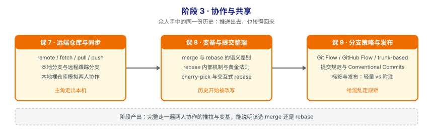

# 阶段 3：协作与共享

> 所属课程：Git 使用 ｜ 故事章节：**众人手中的同一份历史** ｜ 上一阶段：[阶段 2《个人工作流》](../2-个人工作流/overview.md)
> 阶段路径图：

## 🎯 本阶段目标

- 理解远端仓库只是"另一个仓库"，不是服务器老大——把 push / pull 还原成本地仓库之间的数据搬运。
- 能判断一次集该用 merge 还是 rebase，并说清 rebase 为什么有"黄金法则"。
- 能为团队选一套分支策略并说明理由，把提交规范与标签发布固化下来。

## 📍 学习重点

- **fetch 与 pull 的区别**：`pull = fetch + 合并`。分不清这两个，遇到"我本地怎么突然多了个 merge commit"就会懵。
- **远程跟踪分支**（如 `origin/main`）：它只是个本地指针，记录"上次通信时远端在哪"。它不是实时连接。
- **merge 与 rebase 的取舍**：这不是品味问题，而是"你要不要保留真实历史"的判断。讲义会给决策依据，不让你凭感觉选。
- **rebase 黄金法则**：只对尚未推送、无人基于其工作的提交做 rebase。违反它的代价阶段 4 会现场演示。
- **本阶段用本地裸仓库模拟远端**：不依赖 GitHub / GitLab 账号，任何人都能完整演练。

## ✅ 必须掌握的知识点

| 知识点 | 所属课 | 学完应能 |
|--------|--------|----------|
| remote / fetch / pull / push 四件套 | 课 7 | 说出 fetch 与 pull 的区别，以及 push 失败的常见原因 |
| 本地分支与远程跟踪分支 | 课 7 | 解释 `origin/main` 是什么、什么时候会更新 |
| 用本地裸仓库模拟远端做协作演练 | 课 7 | 在一台机器上模拟两人协作完整走通推拉流程 |
| merge 与 rebase 的语义差别 | 课 8 | 画出两种方式的提交图，说明各自保留了什么 |
| rebase 的内部机制与黄金法则 | 课 8 | 说清 rebase 逐个重放提交的机制与适用边界 |
| cherry-pick 与交互式 rebase | 课 8 | 用 cherry-pick 搬单个提交，用 rebase -i 整理提交序列 |
| 分支策略：Git Flow / GitHub Flow / trunk-based | 课 9 | 按团队规模与发布节奏选出合适策略并说明理由 |
| 提交规范与 Conventional Commits | 课 9 | 写出符合规范的提交信息，并知道它带来什么自动化收益 |
| 标签与发布：轻量标签 vs 附注标签 | 课 9 | 区分两种标签并说明发布该用哪种 |

## 本阶段产出

- [x] `lessons/lesson-07-远端仓库与同步.md`（✅ 2026-09-09 已讲完，P0=0）
- [x] `lessons/lesson-08-变基与提交整理.md`（✅ 2026-09-09 已讲完，P0=0）
- [x] `lessons/lesson-09-分支策略与发布.md`（✅ 2026-09-09 已讲完，P0=0）

## 课 7 核心结论（回看用）

- **远端只是另一个仓库，不是服务器老大**：`git status` 完全不需要联系远端（实测把远端目录 `mv` 走，status exit 0，只有 fetch exit 128）。
- **`origin/master` 是你本机的"上次通信快照"**：名字里有 `origin` 但**不联网**。可用 `git update-ref` 直接改写（exit 0，零网络交互）。所以 "up to date" ≠ 远端没新东西，**想知道现在就先 fetch**。
- **ahead / behind = 两个本地指针的差**：纯本地计算，`branch -vv` 和 `status -sb` 都能看。"又 ahead 又 behind" = 分叉 = push 必被拒。
- **fetch 只搬数据不动工作区**：下载对象 + 移动 `origin/master`，工作区一个字节不变（实测 `ls`/`cat` 不变但显示 `[behind 2]`）。要文件还得 merge。
- ⚠️ **`git pull` 分叉时 2.34 起直接 fatal**（exit 128，不留下半成品合并）。老教程"自动合并"是 2.27 前的行为了。需显式 `--no-rebase` / `--rebase` / `--ff-only`；**快进能成功时无需参数**。
- **push 是"请求对方挪指针"**，非快进就被拒（exit 1，`fetch first`）。正确处理：`fetch` → 整合 → 再推。
- ⚠️ **强推用 `--force-with-lease`，永不用裸 `--force`**：前者在"有人偷偷推过"时报 `stale info` 拒绝（exit 1）；实测 `--force` 让远端 2 个提交直接消失。
- **裸仓库（--bare）没有工作区是设计**：`core.bare=true`、无 index、`git add` 报 exit 128。目的是防止推送破坏远端的工作区（推非裸仓库检出分支会被拒）。
- **用本地路径当远端，一台机器就能练完多人协作**：20 个实验全部未联网。

## 课 8 核心结论（回看用）

- **merge = 承认分叉发生过，rebase = 假装分叉没发生过**：前者**新增**一个合并提交（旧哈希一个不变），后者**重写**一批提交（哈希全变，因为父指针变了）。
- **rebase 是复制，不是移动**：旧提交还在，`ORIG_HEAD` 与 reflog 都能找到（实测 `cat-file -t` 仍返回 `commit`）。**这才是黄金法则的物理根源**——旧提交还站着人。
- **rebase 移动的是当前分支，不是参数里的那个**：`git rebase master` 之后 master 原地不动，要再 `merge --ff-only` 才追上。
- **冲突次数：merge 1 次，rebase 每个提交各 1 次**。merge 是两棵树三路合并只看终态；rebase 是逐个重放，T1 撞完 T2 接着撞。
- ⚠️ **冲突后必须用 `git rebase --continue`，不能用 `git commit`**：实测 `git commit` 返回 exit 0 是**假成功**——只在分离 HEAD 上多建了一个提交，rebase 状态机一步没动，最终 T1 变成孤立的 `my resolution`。
- 🚨 **黄金法则：只变基尚未推送、无人基于其工作的提交**。违反的代价现场演示过：Alice 强推后 Bob 用 merge 收场，导致 `grep -c "add config"` = **2**——同一改动以两个身份永久留在历史里。
- ⚠️ **`--force-with-lease` 防不住"脚下站人"**（课 7 结论的重要补丁）：它只检查"远端指针是否等于我上次看到的值"。实测 Alice 用它强推 **exit 0 顺利通过**，照样把 Bob 架空了。它防的是"你没看过的改动"，不是"你脚下站着的人"。
- **受害者该怎么收场：用 rebase 追赶，不是 merge**。实测 rebase 侧 `grep -c "add config v1"` = **0**（A1 不复活、历史线性），merge 侧 = 2。原因：rebase 让 A1 与 A1' 的改动**正面相撞**逼你二选一，merge 则不比较内容、两边都留。
- **rebase 保留 Author，只改 Committer**：`Author: Li Si` + `Commit: Zhang Wei` 同时出现——"谁写的"不丢，丢的是"以什么顺序写的"。
- **变空提交会被静默跳过**：`warning: skipped previously applied commit`，rebase exit 0 但 `rev-list --count` = 0。要保留用 `--reapply-cherry-picks`。
- **默认后端从 Git 2.26 起是 merge**（旧称 interactive），不是 apply/am（已联网核实）。`git config --get rebase.backend` 返回 exit 1 = 未设置走默认。
- **cherry-pick 也是生成新提交**：哈希必变；`-x` 会留 `(cherry picked from commit ...)` 来源标记；**挑合并提交必须给 `-m 1`**（否则 exit 128）。
- **`squash` vs `fixup` 只差在被吞掉的信息**：两者内容都不丢，squash 把 subject 留进 body，fixup 全丢。
- **嫌 merge 历史乱就用 `git log --first-parent`**：看到的主线和 rebase 出来的一样干净，**但分叉事实一个没丢**。

## 课 9 核心结论（回看用）

- **没有最好的策略，只有匹配约束的策略**：判据是**发布频率、团队规模、回滚成本、是否并行维护多版本**。回滚成本越高越需要版本隔离（Git Flow）；部署频率越高越需要流程简化（GitHub Flow → trunk-based）。
- **Git Flow 作者本人 2020 年说"Web 项目别用它"**（已联网核实原文的 Note of reflection）：它是为"多版本同时在生产环境运行"设计的。实测走完一遍：**5 个本地分支 / 4 个远端分支 / master 与 develop 各 2 个合并提交**，**交付一个功能要 3 次合并**。
- **三种策略最本质的差别不是分支名，是分支允许活多久**：Git Flow 数天到数周、GitHub Flow 数天、trunk-based **< 1 天**。实测远端长存分支数 **4 / 1 / 1**。
- **Git Flow 的 master 与 develop 真的会分叉**（实测各独有 1 个提交）。它们永不自动收敛，靠 release/hotfix 的**双向回流**保持同步——这就是它的全部维护成本。
- ⚠️ **release / hotfix 必须合回 develop**，否则 master 上修了、develop 上没有，下次发布 bug **复活**（实测 VERSION 回流后为正确的 `1.0.1`）。
- **GitHub Flow 靠"合完即删"保证不腐化**：远端分支数恒为 1（实测删完回到只剩 master）。Git Flow 规范里没写"立即删"，所以现实里 `release/*` 僵尸分支堆积。
- **trunk-based 的前提不是勇气，是基础设施**：分钟级 CI + 特性开关。开关把"代码合入"与"功能上线"解耦（实测 `if (flags.isEnabled(...))` 那行）。**没有这两个前提，把分支寿命压到一天只会让主干天天红。**
- **Conventional Commits 是社区约定不是 Git 标准**（CC BY 3.0）。只有 `feat`（MINOR）和 `fix`（PATCH）有版本含义，**其余 type 不升版本**——这正是它们的价值：告诉工具"这次改动对用户无感"。
- **破坏性变更两种等价写法**：`feat(api)!:` 前缀 与 `BREAKING CHANGE:` 脚注。**脚注能带迁移说明**，不可替代。判定 MAJOR 必须用 `%B`（全文），`%s` 看不到 body。
- **CHANGELOG 与版本号的全部原料就是 `git log v1.0.0..v1.1.0` + 按 type 分组**：实测三段判定分别得 MINOR / MAJOR / PATCH，与 SemVer 完全吻合。
- **工具只能检查格式，检查不了语义**：把"修改bug"写成 `chore: 修改bug`，正则照样给 OK。落地靠 `commit-msg` 钩子（实测拦住 exit 1），**必须豁免合并提交**（`[ -f .git/MERGE_HEAD ] && exit 0`）。
- **轻量标签只是指针（`cat-file -t` = commit），附注标签是完整的 tag 对象（= tag）**：引用文件都是 41 字节，**差别在指向哪里**——轻量直接存提交 SHA，附注存 tag 对象 SHA。
- **轻量标签的 tagger / date 全空**（实测 `tagger=[] | date=[]`）：不是"不好查"而是**信息根本不存在**。发布必须用 `git tag -a`。
- ⚠️ **标签默认不会 push**（实测 `ls-remote --tags` 为空），必须 `git push origin <tag>` 或 `git push --tags`。这是本课后果最直观的发布事故。
- ⚠️ **已推送的标签，普通 push 覆盖不了**（实测 exit 1 `already exists`）——**与分支行为完全相反**（分支快进能覆盖）。所以：**已发布的标签别挪，要改就发新版本号。**
- **`ls-remote --tags` 里附注标签有 `^{}` 行、轻量没有**：这是不能 clone 时从远端区分两种标签的唯一手段。
- **`git describe` 输出 `<tag>-<n>-g<sha>`**，正好站在标签上时只输出标签名；**仓库无标签时 exit 128**（`fatal: No names found`）——CI 里必须兜底。
- **`v` 前缀必须统一**：混用会让 `--sort=-v:refname` 把不带 v 的 `1.2.4` 排到最后，`describe` 与下游工具的版本比较随之错乱。
- **检出标签 = detached HEAD**：要改就 `git switch -c <新分支> <标签>`，这正好对应 Git Flow 的 hotfix 流程。

## 阶段 3 收束（课 7→8→9 的闭环）

- **课 7 给机制，课 9 把它升级成制度**：`--force-with-lease` 与"推送前先 fetch"是个人习惯，本课变成**分支保护 + 禁用强推**的团队约定——用工具把判断固化下来，而不是指望每个人每次都判断对。
- **课 8 给规则，课 9 给它的组织学前提**：黄金法则"只变基尚未推送的提交"能执行，前提是**分支策略说清了哪些分支是可以随便改的个人地盘、哪些是不能动的公共地盘**。没有策略，"能不能 rebase"只能靠猜。
- **课 8 给工具，课 9 给标准**：`rebase -i` 回答"怎么整理"，Conventional Commits 回答"整理成什么样才算好"。
- **阶段 3 的三个目标全部达成**：能选定并说明一套策略、能把提交规范固化、能用地道的标签做发布。

## 本阶段的坑（提前打个招呼）

- **不要对已推送的提交做 rebase**：这是团队协作里最常见也最昂贵的事故。本阶段讲规则，阶段 4 演示怎么救。
- **push 前先 fetch**：养成"推送前先看看别人推了什么"的习惯，能避免大量无谓冲突。（课 7 实测：`--force-with-lease` 就是把这个习惯做成了工具约束。）
- **裸仓库没有工作区**：`git init --bare` 建出来的仓库不能直接编辑文件，这是设计使然，不是操作失误。（课 7 实测：`git status` 报 `fatal: this operation must be run in a work tree`，exit 128。）
- **Conventional Commits 不是强制标准**：它是社区约定，讲义会说明它解决什么问题、什么时候不必用。

> 返回：[课程目录](../../02-课程目录.md) ｜ [学习路径总览](../../01-学习路径总览.md)
