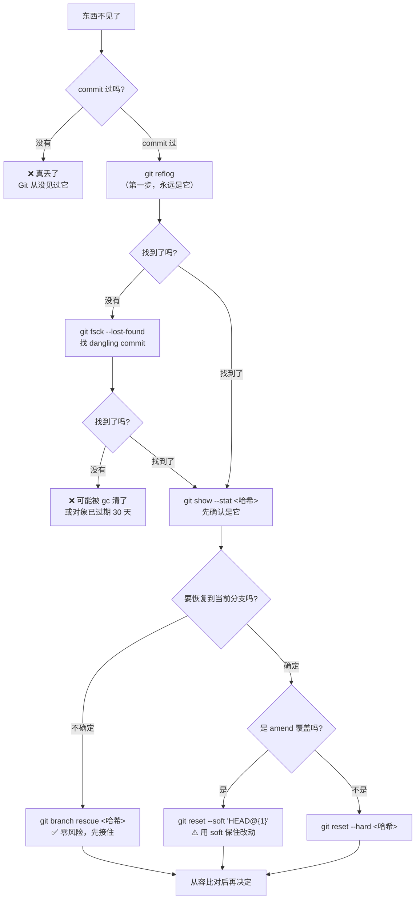
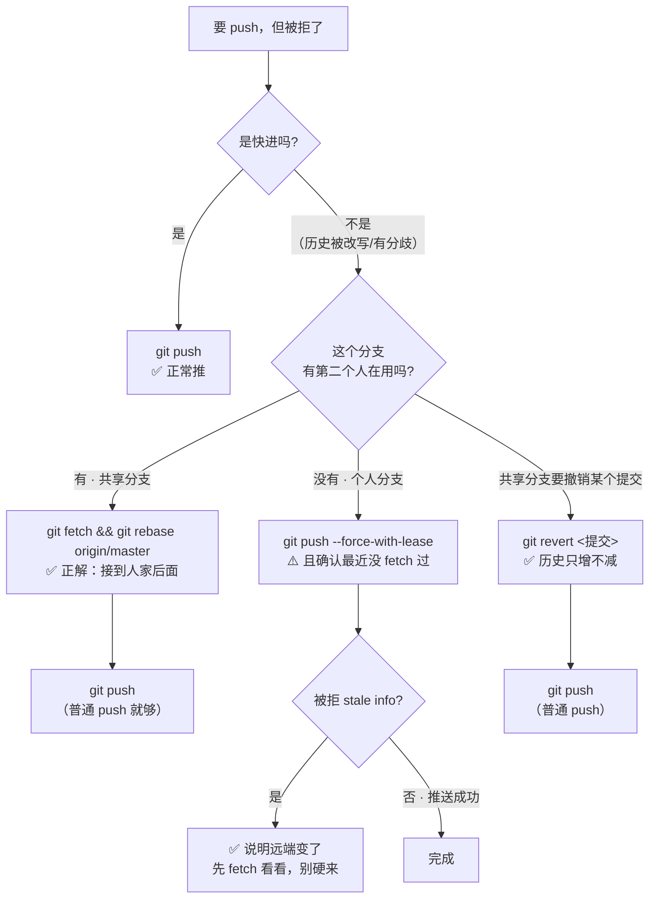
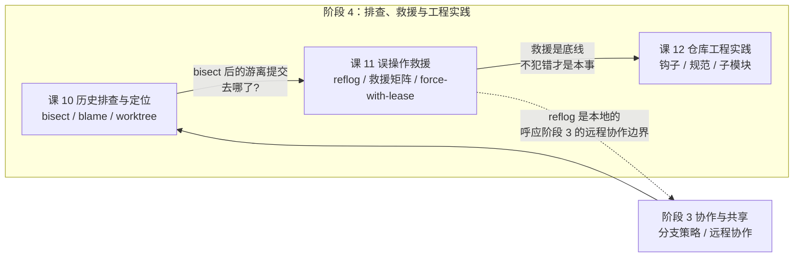

# 第 11 课：误操作救援

> 所属阶段：阶段 4《排查、救援与工程实践》｜ 水平：进阶 ｜ 本课知识点：reflog、误操作救援矩阵、已推送历史的改写边界
> 故事情节：**再把它救回来**——只要它存在过，它就还在。

## 🎯 本课目标

- 用 `reflog` 找回"已经删掉"的提交与分支，理解为什么 Git 几乎不丢东西。
- 针对 `reset --hard`、强推覆盖、误删分支三类典型事故，给出对应救援命令。
- 说清 force push 与 `--force-with-lease` 的差别，以及改写已推送历史的边界。

## 📌 知识点清单（含关键点）

### 知识点 1：reflog——所有操作的飞行记录仪

- 关键点 1：reflog 记录**本地仓库中分支与 HEAD 的每一次移动**，与提交是否可达无关
- 关键点 2：什么地方能找回：reset 掉的提交、删掉的分支、rebase 前的旧提交、amend 前的提交
- 关键点 3：默认保留期：可达 90 天 / 不可达 30 天（受 `gc.reflogExpire` 控制）
- 关键点 4：**reflog 是本地的**——clone 不会带走，换机器就找不回
- 关键点 5：`git fsck --lost-found` 作为 reflog 失效时的最后手段

### 知识点 2：误操作救援矩阵（reset --hard / 强推 / 删分支）

- 关键点 1：`reset --hard` 丢提交 → `reflog` 找哈希 → `reset --hard <hash>` 或建分支接管
- 关键点 2：误删分支 → `reflog` 找该分支最后一次指向的提交 → `git branch <名> <hash>`
- 关键点 3：强推覆盖他人提交 → 从**他人本地仓库**或 reflog 找回，或用 `--force-with-lease` 预防
- 关键点 4：`git stash` 误 drop → 找 dangling commit 恢复
- 关键点 5：**"已提交过的东西几乎都能找回；没提交过的东西丢了就是丢了"**

### 知识点 3：已推送历史的改写边界与 force-with-lease

- 关键点 1：边界：**个人分支可随意改写，共享分支不可改写**
- 关键点 2：`--force` 无条件覆盖，`--force-with-lease` 在"远端与我上次看到的不同"时拒绝
- 关键点 3：`--force-with-lease` 是默认应使用的方式，它把"盲覆盖"变成"有前提的覆盖"
- 关键点 4：确需改写共享分支时的流程：通知全组 → 锁定分支 → 改写 → 全员重新同步
- 关键点 5：更安全的替代：用 `revert` 抵消，历史只增不减

---

# 第一幕：起源——为什么会有这一课

## 1.1 一个真实的下午

课 10 结尾，你在 bisect 里找到了那个坏提交，然后顺手在 detached HEAD 上改了点东西、提交了，切回 `master`。

然后它不见了。

`git log` 里没有，`git branch --contains` 说它不属于任何分支，Git 只在切走的时候含糊地提了一句。你盯着终端，心里只有一个问题：**我那半小时的活儿，是不是没了？**

这是每个用 Git 超过半年的人都会遇到的一刻。区别只在于：有人当场放弃重做，有人三十秒后就把东西捞了回来。

## 1.2 "丢了"这个词在 Git 里基本不成立

先把结论放在最前面，本课后面所有内容都是给这句话做注脚：

> **只要你 commit 过，它就在。真丢了的只有两种情况：`gc` 清过了，或者你压根没提交过。**

Git 的提交是不可变对象。所谓"删除分支""reset 回退""amend 覆盖"，**动的全是指针，对象一个都没删**。指针挪走了，提交就变成"不可达"，但对象还在 `.git/objects` 里躺着，只要你知道它的哈希，就能把它叫回来。

问题从来不是"东西还在不在"，而是：

1. **我怎么知道它的哈希？** —— 答：`reflog`。
2. **多久之内我还来得及？** —— 答：不可达对象默认 30 天。
3. **它在哪台机器上？** —— 答：只能在**你自己那台**。这是本课最容易被忽略、代价也最大的一条。

## 1.3 本课的地图

这一课解决三件事，从近到远：

- **近（知识点 1）**：`reflog` 是什么、记什么、存在哪、能留多久。这是所有救援的入口。
- **中（知识点 2）**：五类典型事故，每一类对应一条救援命令。这一节你可以当速查手册用。
- **远（知识点 3）**：比救援更重要的事——**别让自己和别人掉进需要救援的局面**。强推的边界、`--force-with-lease` 的真实保护范围、`revert` 这个几乎不需要救援的替代品。

一句话概括本课的价值观：**救援能力是底线，不犯错才是本事。** 前者让你不至于崩溃，后者让你不必救援。

---

# 第二幕：认知冲突——几个反直觉的真相

## 2.1 反直觉一：`git branch -D` 之后，分支的 reflog 也一起没了

很多人第一反应是：分支删了，我查它的 reflog 找回来不就行了？

```bash
$ git branch -D feature-pay
Deleted branch feature-pay (was 0dd2f3c).

$ git reflog show feature-pay
fatal: ambiguous argument 'feature-pay': unknown revision or path not in the working tree.
[exit=128]
```

**查不了。** 分支的 reflog 文件是 `.git/logs/refs/heads/feature-pay`，`git branch -D` 会把这个日志文件一起删掉。

那怎么办？**查 HEAD 的 reflog**。因为你 `checkout` 过那个分支，`HEAD` 的移动日志里留着你去过哪、在哪提交过。

这个"分支日志没了但 HEAD 日志还在"的设计，是救援能成立的关键——**HEAD 的 reflog 是最后一道防线，它记录的是"你本人去过哪"，不受任何分支增删影响。**

## 2.2 反直觉二：`--force-with-lease` 不是"不会覆盖别人"

这是本课最重要、也最容易被讲错的一条。

`--force-with-lease` 的原理是：把**你本地 `origin/master` 记录的值**当作"租约"，推的时候问远端一句"你还是这个值吗"。是，才让推。

那么问题来了：**`git fetch` 会更新 `origin/master`。**

于是这个序列是完全可能的：

```bash
$ git push --force-with-lease origin master
 ! [rejected]  master -> master (stale info)      # 拦住了，很好

$ git fetch origin                                # 更新了租约
$ git push --force-with-lease origin master
 + 86c19e5...fb865f0 master -> master (forced update)   # 成功覆盖
```

**第二次成功了，同事的提交照样被冲掉。**

所以准确的说法是：

> `--force-with-lease` 防的是「**我信息太旧，不知道远端已经变了**」，
> 不是「**我不该覆盖别人的工作**」。

它把"盲覆盖"降级成了"知情覆盖"。从"闭着眼睛推"到"确认过再推"，这是巨大的进步，但它不是免死金牌。**真正不出事的用法是：压根别用 force**（见实验 30 的 `fetch + rebase`）。

## 2.3 反直觉三：reflog 救不了你同事，也救不了换电脑的你

reflog 存在 `.git/logs/` 下，是**纯本地、不参与传输**的。

实测：

```bash
$ git -C lab-acts reflog | wc -l
8                                    # 源仓库 8 条记录

$ git clone -q lab-acts lab-clone
$ cd lab-clone && git reflog
af49931 HEAD@{0}: clone: from /tmp/git-l11/lab-acts
```

**新克隆只有 1 条。** 源仓库那 8 条一条都没带过来。

推论有两个，都很硬：

- **救同事的提交，只能去他自己的机器上找。** 他本地分支在、reflog 在，就能救；他换了电脑、用的是 CI 的临时克隆，那远端被冲掉就是真冲掉了。
- **服务器（bare 仓库）默认不写 reflog。** 实测 `git -C bare.git config --get core.logAllRefUpdates` 返回 1（未设置）。所以"去服务器上找找"这条路，默认也是堵的。

## 2.4 反直觉四：revert 看起来"多此一举"，其实是把撤销变成了可撤销的

同样是"把 c2 加的特性 A 去掉"：

- `git revert` → 5 个提交，历史完整，普通 push 就行，**而且反悔时再 revert 一次就回来了**。
- `rebase --onto` 摘掉 → 3 个提交，c3/c4 哈希全变，必须 force，且**反悔只能靠 reflog**。

多数人本能地喜欢后者——"历史干净，好像 c2 从没存在过"。但这个"干净"是有代价的：**它同时抹掉了"这里曾经做过这个决定"这件事**，也抹掉了别人已经基于 c3/c4 做的工作的兼容性。

共享分支上，`revert` 那个"多出来的"提交不是冗余，是**审计记录**。

## 2.5 反直觉五：真丢了的只有两种

讲了这么多"都能救"，得说清什么时候**真救不了**：

| 场景 | 能救吗 | 原因 |
|------|--------|------|
| `reset --hard` 过头 | ✅ | 提交对象还在，reflog 有记录 |
| 删了未合并的分支 | ✅ | HEAD reflog 有记录 |
| `amend` 覆盖了提交 | ✅ | reflog 有两条记录 |
| detached HEAD 上的提交 | ✅ | reflog 有记录 |
| `stash drop` | ✅ | stash 本质是 commit，可找回 |
| **`gc` 之后** | ❌ | 对象真被删了 |
| **从没 `add` 过的工作区改动** | ❌ | 从未成为 Git 对象 |

最后一行是本课的纪律来源：**没提交过的东西，Git 从来没见过它，也就无从救起。**

---

# 第三幕：层层揭示——三个知识点详解

## 知识点 1：reflog——所有操作的飞行记录仪

### 3.1.1 它是什么：一个追加写的文本日志

reflog 不是什么神秘数据结构，就是 `.git/logs/` 下的纯文本文件，每条操作追加一行：

```bash
$ find .git/logs -type f
.git/logs/refs/heads/master
.git/logs/HEAD

$ head -2 .git/logs/HEAD
0000...0000 441f306... Zhang Wei <zhangwei@example.com> 1788939489 +0800	commit (initial): c1
441f306... 23c2cf1... Zhang Wei <zhangwei@example.com> 1788939489 +0800	commit: c2
```

格式是固定的：**旧哈希 新哈希 操作者 <邮箱> 时间戳 时区[TAB]动作说明**。

为什么强调这个？因为它解释了两件事：

- **reflog 只增不减**（除非过期或被 `gc`），所以"找回历史操作"是可以的。
- **它是纯文本**，可以直接 `cat`、可以 `grep`、可以备份。真出了大事，第一反应可以是**先把 `.git/logs` 整个目录复制走**。

### 3.1.2 两套日志：HEAD 的 vs 分支的

这是新手最常混的地方，实验 2 专门演示了它们的分叉：

| 日志 | 记什么 | 什么时候用 |
|------|--------|-----------|
| `HEAD` 的 reflog | **你（HEAD）去过哪**，含切分支、detached HEAD | 救援的默认入口，覆盖面最广 |
| `master` 的 reflog | **master 这个分支指到过哪** | 只关心分支本身的历史时 |

在 master 上连做 5 个提交，两者内容一样。但一旦切到 `demo` 分支再切回来：

```
$ git reflog                 # HEAD：多了两次 checkout
0f12383 HEAD@{0}: checkout: moving from demo to master
d4df90f HEAD@{1}: commit: 在 demo 分支上提交
0f12383 HEAD@{2}: checkout: moving from master to demo
0f12383 HEAD@{3}: commit: c5: 把 f.txt 设为 v5

$ git reflog show master     # master：毫无变化，它没动过
0f12383 master@{0}: commit: c5: 把 f.txt 设为 v5
ea2c803 master@{1}: commit: c4: 把 f.txt 设为 v4
```

**救援时默认用 `git reflog`（即 HEAD 的）**，因为它记录了 checkout、reset、merge、rebase 等所有让 HEAD 移动的动作，覆盖面比任何单个分支都大。

### 3.1.3 两种坐标：`@{n}` 与 `@{时间}`

**按次数**：`HEAD@{n}` = "倒数第 n 次操作后 HEAD 在哪"。

```bash
$ git rev-parse HEAD@{0}     # 现在
$ git rev-parse HEAD@{2}     # 两次操作前
$ git rev-parse master@{1}   # master 上一次的位置
```

注意一个坑：实验 3 里 `HEAD@{0}` 和 `HEAD@{2}` **是同一个哈希**。因为中间那两次是"切到 demo"和"切回 master"，HEAD 转了一圈回到原地。**HEAD reflog 记的是"我去过哪"，不是"历史有哪些提交"**——想按分支历史找，用 `master@{n}`。

**按时间**：`HEAD@{2.hours.ago}`、`HEAD@{yesterday}`。

```bash
$ git rev-parse 'HEAD@{2.hours.ago}'
warning: log for 'HEAD' only goes back to Wed, 9 Sep 2026 15:38:09 +0800
441f306796e93825e20f8fb9a8a9a745172976aa
```

那行 warning 值得记住：**reflog 只回溯到仓库创建时刻**，再往前 Git 会给最早的那条而不是报错。所以"我要找一小时前的状态"在刚建 10 分钟的仓库里会拿到根提交——**不报错，但结果不对**。

想按时间找，先加 `--date=iso` 看清楚：

```bash
$ git reflog --date=iso
0f12383 HEAD@{2026-09-09 15:38:09 +0800}: checkout: moving from demo to master
```

默认的 `git reflog` **不显示时间**，`--date=relative` 在密集操作时全是 "0 seconds ago"，实测三个操作都显示 0 秒，完全没法区分。**按时间排查时，`--date=iso` 是唯一实用的。**

### 3.1.4 记什么、不记什么

实验 6 实测，会写 reflog 的动作：

```
reset: moving to HEAD~1
commit: c3
merge topic: Merge made by the 'ort' strategy.
checkout: moving from topic to master
commit (initial): c1
commit (amend): ...
clone: from ...
rebase (finish): ...
pull: ...
```

不写的：

- **`git tag`** —— 标签不是"会移动的东西"，打了不写日志。
- **工作区改动** —— 没 `commit`，Git 没见过它。

一句话：**凡是让"某个引用指向的位置"发生变化的动作，都会写 reflog。**

### 3.1.5 保留期：90 天 / 30 天

两个配置项，Git 官方文档写明（已联网核实 git-gc / git-reflog 文档）：

| 配置 | 默认值 | 管什么 |
|------|--------|--------|
| `gc.reflogExpire` | **90 天** | 一般的 reflog 条目 |
| `gc.reflogExpireUnreachable` | **30 天** | **不可达**的条目（amend/rebase/reset 产生的） |

注意这个区分：你最想找回的那些——reset 掉的、amend 覆盖的、rebase 前的——**恰恰是"不可达"的那一类，只有 30 天**。

实测两者在本机都未设置（返回 1），即用默认值：

```bash
$ git config --get gc.reflogExpire
[exit=1]  —— 没设置 = 用默认值 90 天
```

想永久保留：`git config gc.reflogExpire never`。但更好的做法是**给重要的东西打标签或建分支**——reflog 是应急通道，不是存档系统。

### 3.1.6 什么时候真没了：gc

实验 10 完整演示了"真丢"：

```bash
$ git reset --hard HEAD~2
$ git reflog | head -3
8b74cfc HEAD@{0}: reset: moving to HEAD~2
2bdc658 HEAD@{1}: commit: c5        # 还在
$ git cat-file -t 2bdc658...
commit                              # 对象也在

$ git reflog expire --expire=now --expire-unreachable=now --all
$ git gc --prune=now -q

$ git reflog
                                    # 空了
$ git cat-file -t 2bdc658...
fatal: git cat-file: could not get object info
[exit=128]                          # 对象真没了
```

两个动作缺一不可：**先让 reflog 过期，再 gc**。因为 `gc` 会保护"被 reflog 引用着的对象"——只要 reflog 里还有一条记录指着它，它就删不掉。

正常流程下 `gc` 要等 30 天才动不可达对象，所以**你通常有充足的时间**。真正的风险是下面这种组合：

> 你 reset 了 → 过了个长假 → 期间有人（或自动任务）跑了 `git gc` → 回来发现找不到了。

### 3.1.7 最后手段：fsck

reflog 失效时（比如 reflog 被清了但还没 gc），`git fsck --lost-found` 能扫出"没人指向的对象"：

```bash
$ git fsck --lost-found --no-progress
dangling commit 743ddded0c18a5abf36fcff00179d9bff844956d
```

`--lost-found` 会把找回来对象**写一份引用到 `.git/lost-found/commit/`**，避免你还没看就被下次 gc 清掉。找到后照常处理：

```bash
$ git show --stat --oneline 743ddde
$ git branch recovered 743ddde      # 接住它
```

`fsck` 的定位要摆正：**它是 reflog 挂了之后的备胎**，扫一遍大仓库很慢，而且它只给你哈希，不给"这是什么操作产生的"——可读性远不如 reflog。所以顺序永远是：**先 `reflog`，再 `fsck`。**

## 知识点 2：误操作救援矩阵

### 3.2.1 救援的第一纪律：先别动

出事之后最贵的错误，是**在慌乱中执行了下一个破坏性命令**。

`git reset --hard`、`git checkout -- .`、`git gc`、甚至"我先 clone 一份干净的"——这些动作都可能把现场二次破坏。**`reset --hard` 尤其危险：它自己也会写一条 reflog，把"事故前的位置"从第 1 条挤到第 2 条。**

正确的第一反应，只有一条命令：

```bash
git reflog
```

看完再决定。**不确定就先建分支接住**（实验 14），因为 `git branch <名> <哈希>` 不移动任何已有分支，是纯粹的"安全操作"。

### 3.2.2 五类事故 × 救援命令

这张表是本节的核心，建议直接存下来：

| # | 事故 | 怎么找 | 怎么救 |
|---|------|--------|--------|
| 1 | `reset --hard` 过头 | `git reflog` → 找 reset 前那条 | `git reset --hard HEAD@{1}` 或 `git branch rescue HEAD@{1}` |
| 2 | 误删分支 | `git reflog` → 找该分支最后一次 commit | `git branch <名> <哈希>` |
| 3 | `amend` 覆盖了提交 | `git reflog` → 找 `commit (amend)` 下面那条 | `git reset --soft HEAD@{1}`（保住改动） |
| 4 | detached HEAD 上的提交 | `git reflog` → 找那条 `commit:` | `git branch keep-wip <哈希>` |
| 5 | `stash drop` | `git fsck --lost-found` 找 dangling | `git stash apply <哈希>` |

**统一的三步套路**：`reflog` 找哈希 → `git show <哈希>` 确认是它 → 用分支或 reset 把它固定下来。

第 2 步千万别省。**看一眼 `git show --stat` 再动手**，比救错之后再来一遍便宜得多。

### 3.2.3 事故 1：`reset --hard` 过头（实验 11-14）

```bash
$ git log --oneline
88fb9b3 c5: 设为 v5
af61472 c4: 设为 v4
232084f c3: 设为 v3
80812bd c2: 设为 v2
492cd80 c1: 设为 v1

$ git reset --hard HEAD~2          # 手滑，多退了两个
HEAD is now at 232084f c3: 设为 v3

$ git reflog
232084f HEAD@{0}: reset: moving to HEAD~2
88fb9b3 HEAD@{1}: commit: c5: 设为 v5        # ← 就是它
```

**两种救援方式，选哪个取决于你确不确定：**

```bash
# 方式一：确定要恢复 → 直接回去
git reset --hard HEAD@{1}

# 方式二：还想再看看 → 先建分支接住，master 不动
git branch rescue-tmp HEAD@{1}
git log --oneline rescue-tmp        # 从容比对
```

**工程建议：默认用方式二。** `reset --hard` 会移动当前分支，还可能覆盖你当前未提交的改动；`git branch` 不碰任何已有分支，是零风险的。

确认之后再决定：要就 `git reset --hard rescue-tmp`，不要就 `git branch -D rescue-tmp`。

### 3.2.4 事故 2：误删分支（实验 15-17）

```bash
$ git branch -d feature-pay
error: the branch 'feature-pay' is not fully merged.
If you are sure you want to delete it, run 'git branch -D feature-pay'
[exit=1]                             # Git 拦了你一次，是你自己坚持的

$ git branch -D feature-pay
Deleted branch feature-pay (was 0dd2f3c).
```

想查分支自己的 reflog？**查不了**：

```bash
$ git reflog show feature-pay
fatal: ambiguous argument 'feature-pay': unknown revision or path not in the working tree.
[exit=128]
```

分支删了，`.git/logs/refs/heads/feature-pay` 也一起删了。**查 HEAD 的 reflog**：

```bash
$ git reflog
80f4b5d HEAD@{0}: checkout: moving from feature-pay to master
0dd2f3c HEAD@{1}: commit: feat: 支付功能（还没合并）    # ← 找到了

$ git cat-file -t 0dd2f3c
commit                               # 对象还在

$ git branch feature-pay 0dd2f3c     # 一条命令重建
$ git show feature-pay:pay.py
pay code                             # 一个字没少
```

**记牢 `git branch <名字> <哈希>`**——这是"把任意一个提交变成分支"的万能句式，本课后面还会反复用到。

顺带一提：删除时 Git 打印的 `Deleted branch feature-pay (was 0dd2f3c)` **已经把哈希告诉你了**。所以最省事的做法其实是——**别清屏**。真清了也有 reflog 兜底。

### 3.2.5 事故 3：amend 覆盖了正确的提交（实验 18-19）

```bash
$ git commit -q -m "c4: 这个提交是对的"
$ echo "oops" >> app.txt && git add app.txt
$ git commit -q --amend -m "c4: 改完了（但把上一版冲掉了）"

$ git reflog
cb56c1f HEAD@{0}: commit (amend): c4: 改完了（但把上一版冲掉了）
1846d39 HEAD@{1}: commit: c4: 这个提交是对的        # ← 原版在这
```

这里有个关键选择：**用 `--soft` 还是 `--hard`？**

```bash
$ git reset --soft HEAD@{1}
$ git log --oneline -1
1846d39 c4: 这个提交是对的             # 回到了原版
$ git status --short
M  app.txt                            # 多改的那点东西还在暂存区
```

**必须用 `--soft`。** 因为 amend 时你多改的内容（那行 `oops`）**只存在于 amend 后的那个提交里**——用 `--hard` 会连它一起丢掉。

`--soft` 的语义是"只移动 HEAD，工作区和暂存区都不动"，正好把"多出来的改动"留在暂存区，让你重新决定怎么处理。

### 3.2.6 事故 4：detached HEAD 上的游离提交（实验 20 · 课 10 钩子闭环）

这是课 10 结尾埋下的钩子，现在闭环：

```bash
$ git checkout -q --detach HEAD
$ echo "调试时加的临时代码" > debug.txt
$ git add debug.txt && git commit -q -m "wip: 调试时随手提交的"

$ git branch --contains ab6cae9
* (HEAD detached from 8b74cfc)         # 哪个分支都不是

$ git checkout -q master
$ git log --oneline                    # 不见了

$ git reflog | head -3
8b74cfc HEAD@{0}: checkout: moving from ab6cae9... to master
ab6cae9 HEAD@{1}: commit: wip: 调试时随手提交的    # ← 还在

$ git branch keep-wip ab6cae9          # 接住
$ git log --oneline keep-wip -2
ab6cae9 wip: 调试时随手提交的
8b74cfc c3
```

接住之后从容处置：要就 `git merge keep-wip`，不要就 `git branch -D keep-wip`。

**预防优于救援**：在 detached HEAD 上干活之前，先 `git switch -c temp-work` 建个分支。这是课 10 "bisect 后必须 reset" 这条纪律的自然延伸。

### 3.2.7 事故 5：stash drop（探索已验证）

`git stash` 的本质是**一次提交**（一个带两个父提交的 commit），所以 drop 之后它只是变成 dangling：

```bash
$ git stash push -q -m "半成品"
$ S=$(git rev-parse refs/stash)        # 先记住哈希，比事后找容易
$ git stash drop
Dropped refs/stash@{0} (68bd7cc...)

$ git cat-file -t 68bd7cc
commit                                # 还在

$ git fsck --lost-found --no-progress  # 没记哈希就用这个找
dangling commit 68bd7ccebf5c3e18a964085f469bff4942bc7baa

$ git stash apply 68bd7cc              # 内容回到工作区
```

注意 `git stash apply` 是**恢复内容但不恢复 stash 条目**。想连条目一起回来，用 `git stash store`；日常更简单的习惯是：**别用 `drop`，用 `pop`**——`pop` 只有 apply 成功后才删，且失败时 stash 还在。

### 3.2.8 唯一真丢的：没提交过的改动

```bash
$ echo "untouched but modified" >> app.txt
$ git checkout -- app.txt              # 没有 reflog，没有 dangling
```

**没有任何记录。** Git 从来没见过这个内容，也就没有对象可找。

这一课的纪律由此而来：**做到一半的活儿，`git stash` 或 `git commit -m "wip"` 一下，成本一秒；不做的代价可能是半天。**

## 知识点 3：已推送历史的改写边界与 force-with-lease

### 3.3.1 边界：只有一条判断标准

**这个分支有没有第二个人在用。**

| 可以 force | 不能 force |
|-----------|-----------|
| 只有你推的个人 feature 分支 | `master` / `develop` / `release` 等共享主干 |
| 个人命名空间如 `zhangwei/xxx` | 别人已在上面开分支的任何分支 |
| 还没人拉过的 PR 分支（**先确认**） | 已经打过 tag 发布过的历史 |

判断依据是"别人有没有基于它工作"，不是"我改得对不对"。**你在共享分支上改得再对，只要有人已经拉过旧版本，你的改写就会让他的后续工作变成冲突地狱。**

### 3.3.2 `--force` 为什么会出事（实验 21-25）

实验 21-25 搭了一套完整的现场：一个本地裸仓库当远端，Zhang Wei 和 Li Si 各克隆一份。

```bash
# Li Si 先推
$ git push origin master
   b8d9327..86c19e5  master -> master

# Zhang Wei 不知情，基于旧的 c1 提了一个
$ git rev-parse origin/master
b8d9327a78cfd4bad2f1bdbdd723bd2d019bacef     # 还停在 c1

# 普通 push：被拒
$ git push origin master
 ! [rejected]        master -> master (fetch first)
[exit=1]                                      # Git 提醒你了

# --force：灾难
$ git push --force origin master
 + 86c19e5...a979850 master -> master (forced update)
[exit=0]

# 远端：lisi.txt 没了
$ git ls-tree master --name-only
code.txt
zw.txt
```

**关键就在那行 `+ ... (forced update)`**：加号表示"这不是快进，是我强行覆盖的"。

Li Si 那边：

```bash
$ git fetch origin
 + 86c19e5...a979850 master -> origin/master  (forced update)
$ git branch -r --contains 86c19e5
[exit=0]                                      # 无输出：远端分支已不含他的提交
```

他能救，因为**他本地还有**。但如果他换了电脑、或者那是个 CI 的临时克隆——**就真没了**。

### 3.3.3 `--force-with-lease` 拦住了什么（实验 26-28）

同样的场景，换一个选项：

```bash
$ git push --force-with-lease origin master
 ! [rejected]        master -> master (stale info)
[exit=1]

# 远端完好
$ git ls-tree master --name-only
code.txt
lisi.txt                                      # 李思的还在
```

原理是拿**本地 `origin/master` 的快照**跟远端比对：

```bash
$ git rev-parse origin/master          # 我以为远端在这
b8d9327a78cfd4bad2f1bdbdd723bd2d019bacef
$ git ls-remote origin master          # 远端实际在这
86c19e55639b76ee0a7ce50d33c4a5511a6c71a5	refs/heads/master
```

不一样 → 拒绝。**"lease（租约）"就是指 `origin/master` 这个本地快照**：我租下它时远端是 X，只要远端还是 X，我就能推。

版本事实（已联网核实）：**`--force-with-lease` 自 Git 1.8.5（2013-11）引入**，早已是标配。

### 3.3.4 ⚠️ 最重要的陷阱：fetch 之后 lease 失效（实验 29）

这是本课最需要记住的一条：

```bash
$ git push --force-with-lease origin master
 ! [rejected]  master -> master (stale info)     # 拦住了，很好

$ git fetch origin                                # 更新了 origin/master
   b8d9327..86c19e5  master -> origin/master

$ git push --force-with-lease origin master
 + 86c19e5...fb865f0 master -> master (forced update)
[exit=0]                                          # 成功了，照样冲掉

$ git ls-tree master --name-only
code.txt
zw.txt                                            # lisi.txt 还是没了
```

**因为 `fetch` 刷新了租约。** 本地快照更新成远端真实值后，比对自然通过。

Git 官方文档自己也强调了这一点：不带期望值的 `--force-with-lease` 与"后台自动 fetch"（比如 cron 里的 `git fetch`）配合极差，保护会被静默绕过。

**结论：`--force-with-lease` 防的是「我信息太旧」，不是「我不该覆盖别人」。**

想真正安全，只有两条路。

### 3.3.5 正解一：fetch + rebase，压根不用 force（实验 30）

```bash
$ git fetch origin
$ git rebase origin/master
Successfully rebased and updated refs/heads/master.

$ git log --oneline -3
e9ebfab feat: Zhang Wei 的提交
7bf9dbf feat: Li Si 的提交            # 接在人家后面
b8d9327 c1: 基础代码

$ git push origin master              # 普通 push，不需要 force
   7bf9dbf..e9ebfab  master -> master

$ git ls-tree master --name-only
code.txt
l.txt
z.txt                                 # 两个人的工作都在
```

**这是标准答案。** 分歧发生时，正确动作是"把我的工作接到你的后面"，而不是"把你的抹掉换成我的"。

### 3.3.6 正解二：锚定哈希（实验 31）

确实需要强推时，用显式期望值——它写死在命令里，**不会被后来的 fetch 改写**：

```bash
$ ANCHOR=$(git rev-parse origin/master)      # 改历史之前先锚定
$ git push --force-with-lease=master:$ANCHOR origin master
```

实测故意给错值会被拒：

```bash
$ git push --force-with-lease=master:0000...0000 origin master
 ! [rejected]  master -> master (stale info)
[exit=1]
```

但请再看一遍实验 31 的结尾：**给了正确的锚定值，推送成功了，Li Si 的提交照样被冲掉。**

锚定值解决的是"我的意图被意外刷新"，**不解决"我本来就不该推"**。这条要跟 3.3.4 合在一起理解。

另外，没有 remote-tracking 分支时（实验 32），`--force-with-lease` 会直接拒绝——**拿不到基准就宁可不放行，这是安全的失败**。

### 3.3.7 更安全的替代：revert（实验 34-36）

同样是"去掉 c2 加的特性 A"：

```bash
$ git revert --no-edit HEAD~2
[master d9b5e8a] Revert "c2: 加特性A"
 1 file changed, 1 deletion(-)
 delete mode 100644 featA.txt

$ git log --oneline | wc -l
5                                     # 4 个原提交 + 1 个 Revert
$ ls
a.txt  featB.txt  fix.txt             # featA.txt 没了，别的都在
```

对比 `rebase --onto` 摘掉（实验 35）：

```bash
$ git rebase --onto HEAD~3 HEAD~2 master
$ git log --oneline | wc -l
3                                     # c2 从历史上被抹掉
$ ls
a.txt  featB.txt  fix.txt             # 效果一样
```

**结果一样，代价完全不同：**

| | `git revert` | `rebase --onto` 摘除 |
|---|---|---|
| 提交数 | 5（多 1 个） | 3（少 1 个） |
| c3/c4 的哈希 | 不变 | **全变** |
| 推送方式 | 普通 push | **必须 force** |
| 同事需要做什么 | 正常 pull | 必须 reset/rebase 重来 |
| 能反悔吗 | 再 revert 一次 | 只能靠 reflog |

最后一条是 revert 的隐藏优势（实验 36）：

```bash
$ git revert --no-edit HEAD
[master 3dc6c9e] Reapply "c2: 加特性A"
$ ls
a.txt  featA.txt  featB.txt  fix.txt   # 又回来了
```

**因为 revert 本身是一次提交，所以它可以被 review、被 revert、被别人拉到。** 在共享分支上，这个"多出来的提交"不是冗余，是审计记录。

### 3.3.8 确需改写共享分支时怎么办

万一真到了必须改写共享分支的地步（比如误提交了一个 2GB 的文件、或者泄露了密钥），流程是：

1. **通知全组**，明确时间窗口，确认没人正在基于旧历史工作。
2. **锁定分支**（GitHub/GitLab 的 branch protection，或口头约定）。
3. **改写并强推**（这是少数该用 `--force-with-lease` 的时刻）。
4. **全员重新同步**：每个人 `git fetch && git reset --hard origin/master`，或干脆重新克隆。
5. **确认没有遗漏**：检查有没有人从旧历史开的分支还没合并。

第 4 步是硬性的——**只要有一个人没同步，他的下次 push 就会把旧历史又推回来**。

记住前提：这是"事故处理流程"，不是"日常操作"。日常请回到 3.3.5 和 3.3.7。

---

# 第四幕：实操验证——36 个实验

> **实验环境**：WSL Ubuntu 24.04 / bash 5.2.21 / **Git 2.43.0**
> **隔离说明**：所有脚本设置 `HOME=/tmp/git-lesson11-home`，不污染本机真实 git 配置。
> **复现方式**：全部实验用本地仓库完成（裸仓库当"远端"），**不需要任何托管平台账号**。
> 下文所有输出均来自本机实测，照抄即可复现；**报错输出也原样保留**，它们同样是证据。

## 4.0 准备：两个脚本，一次跑完

本课实验分两个脚本，对应两个知识点区块：

| 脚本 | 覆盖实验 | 内容 |
|------|---------|------|
| `git-lesson11-lab.sh` | 1-20 | reflog 基础 + 五类事故救援 |
| `git-lesson11-lab2.sh` | 21-36 | 强推 / force-with-lease / revert |

每个脚本都自带目录清理（`rm -rf`），可以反复重跑。

---

## 4.1 reflog 基础（实验 1-10）

### 实验 1：第一次看 reflog

```bash
$ git log --oneline
0f12383 c5: 把 f.txt 设为 v5
ea2c803 c4: 把 f.txt 设为 v4
57d5c60 c3: 把 f.txt 设为 v3
23c2cf1 c2: 把 f.txt 设为 v2
441f306 c1: 把 f.txt 设为 v1

$ git reflog
0f12383 HEAD@{0}: commit: c5: 把 f.txt 设为 v5
ea2c803 HEAD@{1}: commit: c4: 把 f.txt 设为 v4
57d5c60 HEAD@{2}: commit: c3: 把 f.txt 设为 v3
23c2cf1 HEAD@{3}: commit: c2: 把 f.txt 设为 v2
441f306 HEAD@{4}: commit (initial): c1: 把 f.txt 设为 v1
[exit=0]
```

5 次提交，reflog 里就有 5 条。每行的意思是：`<新哈希> HEAD@{第几条}: <动作>: <提交说明>`。

---

### 实验 2：HEAD@{n} 与 master@{n}——两个不同的日志

```bash
$ git reflog show master
0f12383 master@{0}: commit: c5: 把 f.txt 设为 v5
ea2c803 master@{1}: commit: c4: 把 f.txt 设为 v4
57d5c60 master@{2}: commit: c3: 把 f.txt 设为 v3
23c2cf1 master@{3}: commit: c2: 把 f.txt 设为 v2
441f306 master@{4}: commit (initial): c1: 把 f.txt 设为 v1
[exit=0]
```

现在两者内容一样，因为一直在 master 上操作。切一次分支就分叉了：切到 `demo` 提交一次再切回来——

```bash
$ git checkout -q -b demo
[exit=0]
$ git checkout -q master
[exit=0]

--- HEAD reflog（多了两次 checkout）---
$ git reflog
0f12383 HEAD@{0}: checkout: moving from demo to master
d4df90f HEAD@{1}: commit: 在 demo 分支上提交
0f12383 HEAD@{2}: checkout: moving from master to demo
0f12383 HEAD@{3}: commit: c5: 把 f.txt 设为 v5

--- master reflog（没变，因为 master 没动过）---
$ git reflog show master
0f12383 master@{0}: commit: c5: 把 f.txt 设为 v5
ea2c803 master@{1}: commit: c4: 把 f.txt 设为 v4
57d5c60 master@{2}: commit: c3: 把 f.txt 设为 v3
```

**HEAD 的 reflog 记"我（HEAD）去过哪"，含切分支、detached HEAD；分支的 reflog 只记"这个分支指到过哪"。救援时默认用 HEAD 的，覆盖面最广。**

---

### 实验 3：@{n} 语法——把 reflog 当坐标用

```bash
$ git rev-parse HEAD@{0}
0f123838f6843ce932db768e5ac9766afde44629
$ git rev-parse HEAD@{2}
0f123838f6843ce932db768e5ac9766afde44629
$ git rev-parse master@{0}
0f123838f6843ce932db768e5ac9766afde44629
$ git rev-parse master@{1}
ea2c803ce8896c161a87deafbef03b7b23204c3a
```

注意 `HEAD@{0}` 和 `HEAD@{2}` **是同一个哈希**——因为中间那两次是"切到 demo"和"切回 master"，HEAD 转了一圈又回来了。**HEAD reflog 记的是"我去过哪"，不是"历史有哪些提交"**；想按分支历史找，用 `master@{n}`（这里 0 和 1 就不同了）。

可以直接当提交用：

```bash
$ git show --stat --oneline 'HEAD@{2}' | head -3
0f12383 c5: 把 f.txt 设为 v5
 f.txt | 2 +-
 1 file changed, 1 insertion(+), 1 deletion(-)
```

---

### 实验 4：时间语法 @{2.hours.ago}——按时间而不是按次数定位

```bash
$ git rev-parse 'HEAD@{2.hours.ago}'
warning: log for 'HEAD' only goes back to Wed, 9 Sep 2026 15:38:09 +0800
441f306796e93825e20f8fb9a8a9a745172976aa
```

⚠️ **注意那行 warning**：reflog 只回溯到仓库创建时刻，再往前 Git 就给最早的那条，**而不是报错**。所以"找一小时前的状态"在刚建 10 分钟的仓库里会拿到根提交——不报错，但结果不对。

```bash
$ git reflog --date=iso
0f12383 HEAD@{2026-09-09 15:38:09 +0800}: checkout: moving from demo to master
d4df90f HEAD@{2026-09-09 15:38:09 +0800}: commit: 在 demo 分支上提交
0f12383 HEAD@{2026-09-09 15:38:09 +0800}: checkout: moving from master to demo

$ git reflog --date=relative
0f12383 HEAD@{0 seconds ago}: checkout: moving from demo to master
d4df90f HEAD@{0 seconds ago}: commit: 在 demo 分支上提交
0f12383 HEAD@{0 seconds ago}: checkout: moving from master to demo
```

默认的 `git reflog` **不显示时间**；`--date=relative` 在密集操作时全是 "0 seconds ago"（实测三条全是 0 秒，完全没法区分）。**按时间排查时 `--date=iso` 是唯一实用的。**

---

### 实验 5：reflog 存在哪——.git/logs 里的纯文本

```bash
$ find .git/logs -type f
.git/logs/refs/heads/master
.git/logs/HEAD

$ head -2 .git/logs/HEAD
0000000000000000000000000000000000000000 441f306796e93825e20f8fb9a8a9a745172976aa Zhang Wei <zhangwei@example.com> 1788939489 +0800	commit (initial): c1: 把 f.txt 设为 v1
441f306796e93825e20f8fb9a8a9a745172976aa 23c2cf15f2c2cbbf28fa4c2d39a56ae322b87d84 Zhang Wei <zhangwei@example.com> 1788939489 +0800	commit: c2: 把 f.txt 设为 v2
```

格式：**旧哈希 新哈希 操作者 <邮箱> 时间戳 时区[TAB]动作说明**。

它就是追加写的日志文件。因为是纯文本，出大事时的第一反应可以是**先把 `.git/logs` 整个目录复制走**。

---

### 实验 6：reflog 记哪些动作

```bash
$ git checkout -q -b topic
$ echo t > t.txt && git add t.txt && git commit -q -m 't1'
$ git checkout -q master
$ git merge -q --no-ff -m 'merge topic 进 master' topic
$ git tag v1   # 打标签不写 reflog
$ echo 3 > a.txt && git add a.txt && git commit -q -m 'c3'
$ git reset --hard HEAD~1

$ git reflog
af49931 HEAD@{0}: reset: moving to HEAD~1
8e13b29 HEAD@{1}: commit: c3
af49931 HEAD@{2}: merge topic: Merge made by the 'ort' strategy.
59a665a HEAD@{3}: checkout: moving from topic to master
289f4fb HEAD@{4}: commit: t1
59a665a HEAD@{5}: checkout: moving from master to topic
59a665a HEAD@{6}: commit: c2
98eceb6 HEAD@{7}: commit (initial): c1
```

`commit` / `checkout` / `merge` / `reset` 全都留下了记录。**`git tag` 不写 reflog**（标签不是"会移动的东西"）。

一句话：**凡是让"某个引用指向的位置"发生变化的动作，都会写 reflog。**

---

### 实验 7：reflog 是本地的——clone 不带走

```bash
--- 源仓库的 reflog（有 8 条）---
$ git -C lab-acts reflog | wc -l
8

$ git clone -q lab-acts lab-clone
$ git reflog
af49931 HEAD@{0}: clone: from /tmp/git-l11/lab-acts
```

**新克隆只有一条 clone 记录，源仓库那 8 条一条都没带过来。**

推论：**救同事的提交，只能去他自己的机器上找。** 他本地分支在、reflog 在，就能救；他换了电脑或用的是 CI 临时克隆，远端被冲掉就是真冲掉了。

---

### 实验 8：bare 仓库默认不写 reflog

```bash
$ git init -q --bare -b master bare.git
[exit=0]
$ git -C bare.git config --get core.logAllRefUpdates
[exit=1]  —— 1 表示这个键没设置，bare 仓库默认不写 reflog

--- 对比普通仓库 ---
$ git -C lab-acts config --get core.logAllRefUpdates
true
[exit=0]
```

服务器上的裸仓库默认没有 reflog，这也是"误推后找服务器要"常常落空的原因。要开得手动 `git config core.logAllRefUpdates true`。

---

### 实验 9：过期时间——默认 90 天 / 不可达 30 天

```bash
$ git config --get gc.reflogExpire
[exit=1]  —— 没设置 = 用默认值 90 天

$ git config --get gc.reflogExpireUnreachable
[exit=1]  —— 没设置 = 用默认值 30 天
```

两个都是 Git 官方文档写明的默认值（已联网核实 git-gc 文档）：**可达 90 天，不可达 30 天**。

⚠️ 注意这个区分：你最想找回的那些——reset 掉的、amend 覆盖的、rebase 前的——**恰恰是"不可达"那一类，只有 30 天**。

想永久保留：`git config gc.reflogExpire never`。但更好的做法是给重要的东西打标签或建分支——**reflog 是应急通道，不是存档系统**。

---

### 实验 10：gc 之后——这才是真正的丢失

```bash
LOST=2bdc6580cc846b576aaf5614c644899987f4ad16
$ git reset --hard HEAD~2
HEAD is now at 8b74cfc c3
[exit=0]

--- gc 之前：reflog 里有，对象也还在 ---
$ git reflog | head -3
8b74cfc HEAD@{0}: reset: moving to HEAD~2
2bdc658 HEAD@{1}: commit: c5
8126688 HEAD@{2}: commit: c4
$ git cat-file -t 2bdc6580cc846b576aaf5614c644899987f4ad16
commit
[exit=0]

--- 让 reflog 立刻过期，再 gc ---
$ git reflog expire --expire=now --expire-unreachable=now --all
[exit=0]
$ git gc --prune=now -q
[exit=0]

--- gc 之后 ---
$ git reflog
[exit=0]  —— 空了，一条都不剩
$ git cat-file -t 2bdc6580cc846b576aaf5614c644899987f4ad16
fatal: git cat-file: could not get object info
[exit=128]  —— 128：对象真没了
```

**两个动作缺一不可：先让 reflog 过期，再 gc。** 因为 `gc` 会保护"被 reflog 引用着的对象"——只要还有一条 reflog 记录指着它，它就删不掉。

正常流程下 `gc` 要等 30 天才动不可达对象，所以你通常有充足时间。真正的风险是：**reset 了 → 过了个长假 → 期间自动任务跑了 gc → 回来找不到了。**

---

## 4.2 误操作救援矩阵（实验 11-20）

### 实验 11：事故 1 —— reset --hard 过头，两个提交没了

```bash
--- 出事前 ---
$ git log --oneline
88fb9b3 c5: 设为 v5
af61472 c4: 设为 v4
232084f c3: 设为 v3
80812bd c2: 设为 v2
492cd80 c1: 设为 v1

--- 手一滑，多退了两个 ---
$ git reset --hard HEAD~2
HEAD is now at 232084f c3: 设为 v3
[exit=0]
$ git log --oneline
232084f c3: 设为 v3
80812bd c2: 设为 v2
492cd80 c1: 设为 v1
```

c4、c5 从 log 里消失了。

---

### 实验 12：救援 —— 第一步永远是看 reflog，不是瞎试

```bash
$ git reflog
232084f HEAD@{0}: reset: moving to HEAD~2
88fb9b3 HEAD@{1}: commit: c5: 设为 v5
af61472 HEAD@{2}: commit: c4: 设为 v4
232084f HEAD@{3}: commit: c3: 设为 v3
80812bd HEAD@{4}: commit: c2: 设为 v2
492cd80 HEAD@{5}: commit (initial): c1: 设为 v1
[exit=0]
```

第 0 条就是刚才的 reset，第 1 条是 reset 之前 HEAD 在哪 = c5。

```bash
$ git rev-parse 'HEAD@{1}'
88fb9b3c11d8cf8e637f78a194086fa4efeb5dd1
$ git show --stat --oneline 'HEAD@{1}' | head -3
88fb9b3 c5: 设为 v5
 f.txt | 2 +-
 1 file changed, 1 insertion(+), 1 deletion(-)
```

**`git show` 这一步别省**——先确认是你要的那个，再动手。

---

### 实验 13：救援方式一 —— reset --hard 回到那个点

```bash
$ git reset --hard 'HEAD@{1}'
HEAD is now at 88fb9b3 c5: 设为 v5
[exit=0]
$ git log --oneline
88fb9b3 c5: 设为 v5
af61472 c4: 设为 v4
232084f c3: 设为 v3
80812bd c2: 设为 v2
492cd80 c1: 设为 v1
```

五个提交全回来了。注意：**这个动作本身也会写一条 reflog，所以反悔还能再反悔。**

---

### 实验 14：救援方式二 —— 先建分支接管，再慢慢决定

```bash
$ git reset --hard HEAD~2
HEAD is now at 232084f c3: 设为 v3
[exit=0]

>>> 又退了两个。这次不直接 reset，先建个分支把提交'接住'：
$ git branch rescue-tmp 'HEAD@{1}'
[exit=0]
$ git log --oneline rescue-tmp
88fb9b3 c5: 设为 v5
af61472 c4: 设为 v4
232084f c3: 设为 v3
80812bd c2: 设为 v2
492cd80 c1: 设为 v1

$ git log --oneline
232084f c3: 设为 v3
80812bd c2: 设为 v2
492cd80 c1: 设为 v1
```

master 停在 c3，rescue-tmp 拿着 c5，两条线都在，可以从容比对。

**工程建议：不确定要不要恢复时，永远先建分支，不要急着 reset。** 因为 `reset` 会移动当前分支（还可能覆盖未提交改动），`git branch` 不碰任何已有分支。

---

### 实验 15：事故 2 —— 误删分支（未合并）

```bash
$ git checkout -q -b feature-pay
[exit=0]
PAY=0dd2f3cf0474c356bee4d1e75a07b74810078681
$ git checkout -q master
[exit=0]

--- 先试 -d（小写），Git 会拦你 ---
$ git branch -d feature-pay
error: the branch 'feature-pay' is not fully merged.
If you are sure you want to delete it, run 'git branch -D feature-pay'
[exit=1]

--- 但你坚持用 -D ---
$ git branch -D feature-pay
Deleted branch feature-pay (was 0dd2f3c).
[exit=0]
$ git branch
* master
```

顺带一提：删除时那句 `Deleted branch feature-pay (was 0dd2f3c)` **已经把哈希告诉你了**。最省事的做法是别清屏；真清了也有 reflog 兜底。

---

### 实验 16：救援 —— 分支自己的 reflog 也一起没了

```bash
$ git reflog show feature-pay
fatal: ambiguous argument 'feature-pay': unknown revision or path not in the working tree.
Use '--' to separate paths from revisions, like this:
'git <command> [<revision>...] -- [<file>...]'
[exit=128]  —— 128：分支删了，它的 reflog 文件也删了
```

⚠️ **这是很多人卡住的地方**：想查 `feature-pay@{1}`，结果查不了。分支的 reflog 文件 `.git/logs/refs/heads/feature-pay` 跟着分支一起被删了。

正确做法：**查 HEAD 的 reflog**。

```bash
$ git reflog
80f4b5d HEAD@{0}: checkout: moving from feature-pay to master
0dd2f3c HEAD@{1}: commit: feat: 支付功能（还没合并）
80f4b5d HEAD@{2}: checkout: moving from master to feature-pay
80f4b5d HEAD@{3}: commit: c3
f56707f HEAD@{4}: commit: c2
5843ad3 HEAD@{5}: commit (initial): c1
[exit=0]

$ git cat-file -t 0dd2f3cf0474c356bee4d1e75a07b74810078681
commit
[exit=0]  —— 对象还在
```

---

### 实验 17：救援 —— 一条命令重建分支

```bash
$ git branch feature-pay 0dd2f3cf0474c356bee4d1e75a07b74810078681
[exit=0]
$ git log --oneline feature-pay -3
0dd2f3c feat: 支付功能（还没合并）
80f4b5d c3
f56707f c2

$ git show feature-pay:pay.py
pay code
```

代码一个字没少。**记牢 `git branch <名字> <哈希>`**——"把任意一个提交变成分支"的万能句式。

---

### 实验 18：事故 3 —— amend 把正确的提交覆盖了

```bash
GOOD=1846d3961f2f1fcbd0bc4c47c07dd2d8ecb399c4
--- 又改了一点，顺手 amend 了 ---
$ git commit -q --amend -m 'c4: 改完了（但把上一版冲掉了）'
[exit=0]

--- 原提交还在吗？看 reflog ---
$ git reflog
cb56c1f HEAD@{0}: commit (amend): c4: 改完了（但把上一版冲掉了）
1846d39 HEAD@{1}: commit: c4: 这个提交是对的
80f4b5d HEAD@{2}: commit: c3
f56707f HEAD@{3}: commit: c2
5843ad3 HEAD@{4}: commit (initial): c1
[exit=0]
```

第 0 条是 `commit (amend)`，第 1 条是原来的那个。

---

### 实验 19：救援 —— reset --soft 拿回改动（而不是 --hard）

```bash
$ git reset --soft 'HEAD@{1}'
[exit=0]
$ git log --oneline -1
1846d39 c4: 这个提交是对的

$ git status --short
M  app.txt
```

⚠️ **这里必须用 `--soft`**：amend 时多改的内容（那行 `oops`）**只存在于 amend 后的那个提交里**，用 `--hard` 会连它一起丢掉。

`--soft` 只移动 HEAD，工作区和暂存区不动，正好把"多出来的改动"留在暂存区让你重新决定。

---

### 实验 20：事故 4 —— detached HEAD 上的游离提交（课 10 钩子闭环）

```bash
--- 模拟课 10 结尾：bisect 结束后停在 detached HEAD 上干活 ---
$ git checkout -q --detach HEAD
[exit=0]
$ git commit -q -m 'wip: 调试时随手提交的'
[exit=0]
ORPHAN=ab6cae9a43877f2764ad061e19f66f4e735d0c27

--- 提交成功了。它在哪个分支上？---
$ git branch --contains ab6cae9a43877f2764ad061e19f66f4e735d0c27
* (HEAD detached from 8b74cfc)
[exit=0]  —— 只有 HEAD detached，哪个分支都不是

--- 切回 master ---
$ git checkout -q master
[exit=0]
$ git log --oneline
8b74cfc c3
716b0f9 c2
1fb83b6 c1
>>> 那个提交不见了。这正是课 10 结尾留下的悬念。

--- reflog 里还在 ---
$ git reflog | head -3
8b74cfc HEAD@{0}: checkout: moving from ab6cae9a43877f2764ad061e19f66f4e735d0c27 to master
ab6cae9 HEAD@{1}: commit: wip: 调试时随手提交的
8b74cfc HEAD@{2}: checkout: moving from master to HEAD

--- 捞回来 ---
$ git branch keep-wip ab6cae9a43877f2764ad061e19f66f4e735d0c27
[exit=0]
$ git log --oneline keep-wip -2
ab6cae9 wip: 调试时随手提交的
8b74cfc c3
```

接住了。要就 `git merge keep-wip`，不要就 `git branch -D keep-wip`。

**预防优于救援**：在 detached HEAD 上干活之前，先 `git switch -c temp-work` 建个分支。这是课 10 "bisect 后必须 reset" 这条纪律的自然延伸。

---

### 补记：事故 5 —— stash drop（探索脚本已验证）

`git stash` 的本质是一次提交，所以 drop 之后它只是变成 dangling：

```bash
$ git stash push -q -m "半成品"
$ S=$(git rev-parse refs/stash)        # 先记住哈希，比事后找容易
$ git stash drop
Dropped refs/stash@{0} (68bd7ccebf5c3e18a964085f469bff4942bc7baa)

$ git cat-file -t 68bd7cc
commit                                # 还在

$ git fsck --lost-found --no-progress  # 没记哈希就用这个找
dangling commit 68bd7ccebf5c3e18a964085f469bff4942bc7baa

$ git stash apply 68bd7cc              # 内容回到工作区
```

注意 `git stash apply` 是恢复内容但**不恢复 stash 条目**。日常更简单的习惯是：**别用 `drop`，用 `pop`**——`pop` 只在 apply 成功后才删。

---

### 补记：唯一真丢的 —— 没提交过的改动

```bash
$ echo "untouched but modified" >> app.txt
$ git checkout -- app.txt
[exit=0]
```

**没有任何记录。** Git 从来没见过这个内容，也就没有对象可找。

---

## 4.3 强推与 force-with-lease（实验 21-33）

> 本节用**本地裸仓库当"远端"**，不需要 GitHub，也能完整复现协作事故。
> 脚本里的 `mk` 函数会造出"远端 + Zhang Wei + Li Si"三件套。

### 实验 21：搭建事故现场——一个远端，两个人

```bash
$ git log --oneline
b8d9327 c1: 基础代码
$ git remote -v
origin	/tmp/git-l11b/scene-a/remote.git (fetch)
origin	/tmp/git-l11b/scene-a/remote.git (push)
```

---

### 实验 22：Li Si 先推，Zhang Wei 在同一起点上另开一路

```bash
$ echo 'lisi work' > lisi.txt && git add lisi.txt
$ git commit -q -m 'feat: Li Si 的功能'
LISI=86c19e55639b76ee0a7ce50d33c4a5511a6c71a5
$ git push origin master
To /tmp/git-l11b/scene-a/remote.git
   b8d9327..86c19e5  master -> master
[exit=0]

--- 张伟这边：他还活在'自己是唯一开发者'的错觉里 ---
$ echo 'zw work' > zw.txt && git add zw.txt
$ git commit -q -m 'feat: Zhang Wei 的功能'
$ git log --oneline
a979850 feat: Zhang Wei 的功能
b8d9327 c1: 基础代码

$ git rev-parse origin/master
b8d9327a78cfd4bad2f1bdbdd723bd2d019bacef
```

他的 `origin/master` 还停在 c1——**他没 fetch，所以不知道李思推了。**

---

### 实验 23：普通 push 被拒——Git 的第一次提醒

```bash
$ git push origin master
To /tmp/git-l11b/scene-a/remote.git
 ! [rejected]        master -> master (fetch first)
error: failed to push some refs to '/tmp/git-l11b/scene-a/remote.git'
hint: Updates were rejected because the remote contains work that you do not
hint: have locally. This is usually caused by another repository pushing to
hint: the same ref. If you want to integrate the remote changes, use
hint: 'git pull' before pushing again.
hint: See the 'Note about fast-forwards' in 'git push --help' for details.
[exit=1]
```

exit=1，`fetch first`。**这是 Git 在提醒你。到这里为止一切都还在正轨上——灾难从下一步开始。**

---

### 实验 24：--force 盲推——灾难发生

```bash
$ git push --force origin master
To /tmp/git-l11b/scene-a/remote.git
 + 86c19e5...a979850 master -> master (forced update)
[exit=0]

$ git log --oneline master
a979850 feat: Zhang Wei 的功能
b8d9327 c1: 基础代码

$ git ls-tree master --name-only
code.txt
zw.txt
```

**`lisi.txt` 不见了，李思的提交从远端被抹掉了。**

注意那行 `+ 86c19e5...a979850`：**加号表示"这不是快进，是强行覆盖"**。

---

### 实验 25：Li Si 拉取——他的东西没了

```bash
$ git fetch origin
From /tmp/git-l11b/scene-a/remote
 + 86c19e5...a979850 master     -> origin/master  (forced update)
[exit=0]

$ git branch -r --contains 86c19e55639b76ee0a7ce50d33c4a5511a6c71a5
[exit=0]  —— 没有输出 = 远端分支已经不含这个提交了

$ git log --oneline --all
86c19e5 feat: Li Si 的功能
a979850 feat: Zhang Wei 的功能
b8d9327 c1: 基础代码
```

他能救，因为**本地还有**。但如果他换了电脑、或是 CI 上的临时克隆——**就真没了**。

---

### 实验 26：重来一次，这次用 --force-with-lease

同样的场景重搭一遍：李思先推，张伟不知情地 amend 改了历史。

```bash
--- 李思先推（同实验 22）---
LISI2=86c19e55639b76ee0a7ce50d33c4a5511a6c71a5
[push exit=0]

--- 张伟这边：同样不知情，同样改了历史 ---
$ git commit -q --amend -m 'feat: Zhang Wei 的功能（整理过）'

$ git rev-parse origin/master
b8d9327a78cfd4bad2f1bdbdd723bd2d019bacef
>>> 同样停在 c1。
```

---

### 实验 27：--force-with-lease 拦住了它

```bash
$ git push --force-with-lease origin master
To /tmp/git-l11b/scene-b/remote.git
 ! [rejected]        master -> master (stale info)
error: failed to push some refs to '/tmp/git-l11b/scene-b/remote.git'
[exit=1]

--- 远端完好无损 ---
$ git log --oneline master
86c19e5 feat: Li Si 的功能
b8d9327 c1: 基础代码
$ git ls-tree master --name-only
code.txt
lisi.txt
```

exit=1，关键词是 **`(stale info)`**——我掌握的信息过期了。**李思的 `lisi.txt` 还在，这就是 lease 的价值。**

---

### 实验 28：lease 的原理——它比的是"我上次看到的远端"

```bash
$ git rev-parse origin/master          # 我以为远端在这
b8d9327a78cfd4bad2f1bdbdd723bd2d019bacef
$ git ls-remote origin master          # 远端实际在这
86c19e55639b76ee0a7ce50d33c4a5511a6c71a5	refs/heads/master
```

两个值不一样 → 拒绝。**lease 的"租约"就是 `origin/master` 这个本地快照**：我租下它时远端是 X，只要远端还是 X，我就能强推。

版本事实（已联网核实）：**`--force-with-lease` 自 Git 1.8.5（2013-11）引入**。

---

### 实验 29：【重要陷阱】fetch 一下，lease 就失效了

```bash
>>> 张伟看到被拒，心想'那我 fetch 一下再推'——
$ git fetch origin
From /tmp/git-l11b/scene-b/remote
   b8d9327..86c19e5  master     -> origin/master
[exit=0]

$ git rev-parse origin/master
86c19e55639b76ee0a7ce50d33c4a5511a6c71a5
>>> fetch 把本地快照更新成了远端真实值，'租约'被刷新了。

$ git push --force-with-lease origin master
To /tmp/git-l11b/scene-b/remote.git
 + 86c19e5...fb865f0 master -> master (forced update)
[exit=0]

$ git log --oneline master
fb865f0 feat: Zhang Wei 的功能（整理过）
b8d9327 c1: 基础代码
$ git ls-tree master --name-only
code.txt
zw.txt
```

**李思的提交还是被冲掉了。**

⚠️ **这是 `--force-with-lease` 最危险的误解**：它防的是「我信息太旧」，不是「我不该覆盖别人」。**只要你 fetch 过，它就退化成 `--force`。**

Git 官方文档自己也强调：不带期望值的 `--force-with-lease` 与后台自动 fetch（如 cron 里的 `git fetch`）配合极差，保护会被静默绕过。

---

### 实验 30：【正解一】fetch + rebase，根本不需要 force

```bash
--- 正确做法：先 fetch，再 rebase 到人家后面 ---
$ git fetch origin
From /tmp/git-l11b/scene-c/remote
   b8d9327..7bf9dbf  master     -> origin/master
[exit=0]

$ git rebase origin/master
Rebasing (1/1)Successfully rebased and updated refs/heads/master.
[exit=0]

$ git log --oneline -3
e9ebfab feat: Zhang Wei 的提交
7bf9dbf feat: Li Si 的提交
b8d9327 c1: 基础代码

--- 现在普通 push 就够了 ---
$ git push origin master
To /tmp/git-l11b/scene-c/remote.git
   7bf9dbf..e9ebfab  master -> master
[exit=0]

$ git log --oneline master
e9ebfab feat: Zhang Wei 的提交
7bf9dbf feat: Li Si 的提交
b8d9327 c1: 基础代码
$ git ls-tree master --name-only
code.txt
l.txt
z.txt
```

**这是标准答案。** 分歧发生时，正确动作是"把我的工作接到你的后面"，而不是"把你的抹掉换成我的"。不需要 force，谁都没丢东西。

---

### 实验 31：【正解二】锚定哈希

```bash
--- 改历史之前，先把远端当前值锚定下来 ---
$ git fetch origin
From /tmp/git-l11b/scene-d/remote
   b8d9327..7bf9dbf  master     -> origin/master
[exit=0]
ANCHOR=7bf9dbf2e706091ccff937d456454ca6247383a8

--- 故意给一个错的期望值试试 ---
$ git push --force-with-lease=master:0000000000000000000000000000000000000000 origin master
To /tmp/git-l11b/scene-d/remote.git
 ! [rejected]        master -> master (stale info)
error: failed to push some refs to '/tmp/git-l11b/scene-d/remote.git'
[exit=1]

--- 给真正的锚定值 ---
$ git push --force-with-lease=master:7bf9dbf2e706091ccff937d456454ca6247383a8 origin master
To /tmp/git-l11b/scene-d/remote.git
 + 7bf9dbf...36e12a5 master -> master (forced update)
[exit=0]
```

显式写法的好处：期望值写死在命令里，**不会被后来的 fetch 改写**。

⚠️ 但请看清楚结尾：**给了正确的锚定值，推送成功了，Li Si 的提交照样被冲掉。** 锚定值解决的是"我的意图被意外刷新"，**不解决"我本来就不该推"**。这条要跟实验 29 合起来理解。

---

### 实验 32：没有 remote-tracking 分支时会怎样

```bash
--- 手动删掉 remote-tracking 分支 ---
$ git update-ref -d refs/remotes/origin/master
[exit=0]

$ git rev-parse origin/master
fatal: ambiguous argument 'origin/master': unknown revision or path not in the working tree.
Use '--' to separate paths from revisions, like this:
'git <command> [<revision>...] -- [<file>...]'
origin/master
[exit=128]  —— 128：本地已经没有这个快照了

--- 再推 ---
$ git push --force-with-lease origin master
To /tmp/git-l11b/scene-e/remote.git
 ! [rejected]        master -> master (stale info)
error: failed to push some refs to '/tmp/git-l11b/scene-e/remote.git'
[exit=1]
```

同样被拒。**拿不到基准就宁可不放行——这是安全的失败。**

---

### 实验 33：改写已推送历史的边界——什么时候可以用 force

判断标准只有一条：**这个分支有没有第二个人在用。**

```
可以 force：
  - 你自己的 feature 分支，只有你一个人推
  - 明确约定好的个人命名空间，如 zhangwei/xxx
  - 还没人 review 的 PR 分支（先确认没人拉过）

不能 force：
  - master / develop / release 等共享主干
  - 别人已经在上面开分支的任何分支
  - 已经打过 tag 发布过的历史
```

判断依据是"别人有没有基于它工作"，**不是"我改得对不对"**。

---

## 4.4 revert：不改写历史的撤销（实验 34-36）

### 实验 34：revert——不改写历史的撤销

```bash
$ printf 'a\n' > a.txt && git add a.txt && git commit -q -m 'c1: 基础'
$ printf 'featA\n' > featA.txt && git add featA.txt && git commit -q -m 'c2: 加特性A'
$ printf 'featB\n' > featB.txt && git add featB.txt && git commit -q -m 'c3: 加特性B'
$ printf 'fix\n' > fix.txt && git add fix.txt && git commit -q -m 'c4: 修复'

$ git log --oneline
4b4fee9 c4: 修复
20c4b52 c3: 加特性B
b7ac582 c2: 加特性A
b37f4a2 c1: 基础

--- 目标：撤掉 c2 加的特性 A，但别动历史 ---
$ git revert --no-edit HEAD~2
[master d9b5e8a] Revert "c2: 加特性A"
 Date: Wed Sep 9 15:40:35 2026 +0800
 1 file changed, 1 deletion(-)
 delete mode 100644 featA.txt
[exit=0]

$ git log --oneline
d9b5e8a Revert "c2: 加特性A"
4b4fee9 c4: 修复
20c4b52 c3: 加特性B
b7ac582 c2: 加特性A
b37f4a2 c1: 基础

$ git log --oneline | wc -l
5

$ ls
a.txt
featB.txt
fix.txt
```

5 个提交：原来的 4 个一个不少，多了 1 个 Revert。`featA.txt` 没了，`featB.txt` 和 `fix.txt` 都还在。

**最关键：这个 push 是普通 push，不需要 force。**

---

### 实验 35：对比——用 rebase --onto 删同一个提交

```bash
$ git log --oneline
d9b5e8a Revert "c2: 加特性A"
4b4fee9 c4: 修复
20c4b52 c3: 加特性B
b7ac582 c2: 加特性A
b37f4a2 c1: 基础

--- 先回到 revert 之前（去掉那个 Revert 提交）---
$ git reset --hard HEAD~1
HEAD is now at 4b4fee9 c4: 修复
[exit=0]

--- 用 rebase --onto 把 c2 摘掉 ---
$ git rebase --onto HEAD~3 HEAD~2 master
Rebasing (1/2)Rebasing (2/2)Successfully rebased and updated refs/heads/master.
[exit=0]

$ git log --oneline
4bd52fd c4: 修复
be05e60 c3: 加特性B
b37f4a2 c1: 基础

$ git log --oneline | wc -l
3

$ ls
a.txt
featB.txt
fix.txt
```

**效果一样（`featA.txt` 没了），但历史被改写了**——c3、c4 的哈希全变了（对比实验 34 的 `20c4b52`/`4b4fee9`，现在是 `be05e60`/`4bd52fd`），**必须 force 才能推**。

| | `git revert` | `rebase --onto` 摘除 |
|---|---|---|
| 提交数 | 5（多 1 个） | 3（少 1 个） |
| c3/c4 的哈希 | 不变 | **全变** |
| 推送方式 | 普通 push | **必须 force** |
| 同事需要做什么 | 正常 pull | 必须 reset/rebase 重来 |
| 能反悔吗 | 再 revert 一次 | 只能靠 reflog |

---

### 实验 36：revert 还能反悔——revert the revert

```bash
--- 回到 revert 之后的状态，再 revert 一次那个 revert ---
$ git revert --no-edit HEAD
[master 3dc6c9e] Reapply "c2: 加特性A"
 Date: Wed Sep 9 15:40:35 2026 +0800
 1 file changed, 1 insertion(+)
 create mode 100644 featA.txt
[exit=0]

$ git log --oneline
3dc6c9e Reapply "c2: 加特性A"
d9b5e8a Revert "c2: 加特性A"
4b4fee9 c4: 修复
20c4b52 c3: 加特性B
b7ac582 c2: 加特性A
b37f4a2 c1: 基础

$ ls
a.txt
featA.txt
featB.txt
fix.txt
```

**`featA.txt` 又回来了。** 因为 revert 本身是一次提交，所以它可以被 review、被 revert、被别人拉到。在共享分支上，这个"多出来的提交"不是冗余，是审计记录。

---

## 4.5 实验小结

36 个实验里，真正"成功"的操作只有一部分——**被拒绝的那几次才是本课最值钱的证据**：

| 实验 | 被拒的动作 | 它证明了什么 |
|------|-----------|-------------|
| 15 | `git branch -d` | Git 会在你删未合并分支时先拦一次 |
| 16 | `git reflog show feature-pay` | 分支删了，它自己的 reflog 也一起没了（必须查 HEAD 的） |
| 23 | `git push` | 非快进推送默认被拒，这是 Git 的第一次提醒 |
| 27 | `--force-with-lease` | 信息过期时被拒（stale info），救下了同事的提交 |
| 29 | `--force-with-lease`（fetch 后） | **成功了**——证明 fetch 会让保护失效 |
| 31 | `--force-with-lease=<错值>` | 期望值对不上就被拒 |
| 32 | `--force-with-lease`（无 tracking） | 拿不到基准就拒绝，安全的失败 |

以及两条"真丢"的硬证据：

- **实验 10**：`gc` 之后 `cat-file` 返回 128，对象真的没了。
- **补记**：`git checkout --` 丢弃的工作区改动，没有任何记录。

---

# 第五幕：体系收束

## 5.1 本课速览

> **一句话**：只要 commit 过，它就在 reflog 里；救援的入口永远是 `git reflog`，而出事之前最该做的是别用 `--force`。

| 场景 | 一条命令 |
|------|---------|
| 东西丢了，第一反应 | `git reflog` |
| 确认某个哈希是不是它 | `git show --stat <哈希>` |
| 把任意提交变成分支 | `git branch <名> <哈希>` |
| `reset --hard` 过头 | `git branch rescue 'HEAD@{1}'`（先接住，别急着 reset） |
| 误删分支 | `git branch <名> <哈希>`（哈希看 HEAD reflog） |
| amend 覆盖了 | `git reset --soft 'HEAD@{1}'`（用 soft 保住改动） |
| detached HEAD 上的提交 | `git branch keep-wip <哈希>` |
| reflog 也找不到了 | `git fsck --lost-found` |
| 需要强推 | `git push --force-with-lease`（**且先确认没 fetch 过**） |
| 共享分支要撤销 | `git revert <提交>`（别用 reset/rebase） |

---

## 5.2 常见误区

### 误区 1：以为 `reset --hard` 之后就没救了

**事实**：只要提交过，reflog 里大概率还在。实验 11-14 实测：reset 掉两个提交后，`git reflog` 第 1 条就是它们，一条命令即可找回。

真正没救的只有两种：**`gc` 清过了**（实验 10），**或者压根没提交过**。

### 误区 2：以为 reflog 能跨机器找回

**事实**：reflog 是本地的。实验 7 实测：源仓库 8 条记录，`clone` 之后新仓库只有 1 条 `clone: from ...`。

推论：**救同事的提交只能去他自己的机器上找。** 而且服务器（bare 仓库）默认也不写 reflog（实验 8，`core.logAllRefUpdates` 未设置）——"去服务器上找找"这条路默认是堵的。

### 误区 3：用 `--force` 当常规操作

**事实**：`--force` 是无条件覆盖。实验 24 实测：`+ 86c19e5...a979850 (forced update)`，同事的 `lisi.txt` 直接从远端消失。

更该记住的是实验 29：**`--force-with-lease` 也不是免死金牌**——`fetch` 之后它就退化成 `--force` 了。

**真正不出事的用法是压根别用 force**（实验 30：`fetch` + `rebase`，普通 push 就够）。

### 误区 4：救援时又执行了新的破坏性命令

**事实**：出事之后最贵的错误是在慌乱中执行下一个破坏性命令。`git reset --hard`、`git gc`、甚至"我先 clone 一份干净的"都可能二次破坏现场。

**`reset --hard` 尤其危险**：它自己也会写一条 reflog，把"事故前的位置"从第 1 条挤到第 2 条。

正确的第一反应只有一条命令：`git reflog`。看完再决定，**不确定就先 `git branch` 接住**——它不移动任何已有分支，是纯粹的零风险操作。

### 误区 5：以为删了分支可以查它的 reflog

**事实**：实验 16 实测，`git reflog show feature-pay` 返回 128——**分支的 reflog 文件跟着分支一起被删了**。

必须查 **HEAD 的 reflog**：因为你 checkout 过那个分支，HEAD 的移动日志里留着你去过哪、在哪提交过。

### 误区 6：以为 `revert` 多此一举，历史"脏"

**事实**：实验 34 vs 35 实测——同样删掉 c2 加的特性，`revert` 留下 5 个提交、c3/c4 哈希不变、普通 push 即可；`rebase --onto` 摘除只剩 3 个提交、c3/c4 哈希全变、必须 force。

而实验 36 证明 `revert` 的那个"多出来的提交"还能被再 revert 一次撤回来。**在共享分支上，它不是冗余，是审计记录。**

---

## 5.3 一图总结：救援决策流程



**推送场景的决策：**



---

## 5.4 本课知识点 ↔ 课程地图



**本课在整门课里的位置**：

- **往前接**：课 10 结尾那个"bisect 后不 reset 落下的游离提交"，在实验 20 完整闭环——它在 reflog 里好好躺着，`git branch keep-wip <哈希>` 就接住了。
- **往后接**：本课反复出现的主题是"Git 很少真的丢东西，但你得知道去哪找"。课 12 要把这个思路再推一步——**用钩子和规范，让问题根本走不到需要救援这一步**。

---

## 5.5 小测（6 题）

**Q1**：你 `git reset --hard HEAD~3` 之后发现退多了，第一步应该做什么？

- A. 赶紧 `git reset --hard HEAD~3` 再退一次试试
- B. **`git reflog`**
- C. `git gc` 清理一下再找
- D. 重新 clone 一份

<details><summary>答案与解析</summary>

**答案：B**。实验 12 实测：reset 之后 `git reflog` 第 0 条就是 reset 本身，第 1 条是 reset 前的位置。

A 错：会再写一条 reflog，把事故前的位置挤得更远。
C 错：`gc` 可能真的把对象清掉（实验 10），这是最不该做的事。
D 错：新克隆的 reflog 只有一条 `clone:`（实验 7），更找不回来。

</details>

**Q2**：你删了一个未合并的分支，想查 `git reflog show <分支名>` 找回，结果报错。为什么？

- A. reflog 坏了
- B. **分支删了，它自己的 reflog 文件也一起被删了，要查 HEAD 的 reflog**
- C. 需要用 `--all` 参数
- D. 必须先 `git fsck` 才能查

<details><summary>答案与解析</summary>

**答案：B**。实验 16 实测：`git reflog show feature-pay` 返回 128（`ambiguous argument`）。

分支的 reflog 存在 `.git/logs/refs/heads/feature-pay`，`git branch -D` 会把它一起删掉。**正确做法是查 `git reflog`（HEAD 的）**——因为你 checkout 过那个分支，HEAD 的移动日志里留着你去过哪、在哪提交过。

</details>

**Q3**：关于 `--force-with-lease`，哪句是对的？

- A. 它保证不会覆盖别人的工作
- B. **它保证"远端还是我上次看到的那样"，fetch 之后这个保证就没了**
- C. 它比 `--force` 慢，但更安全
- D. 它只能在个人分支上用

<details><summary>答案与解析</summary>

**答案：B**。实验 29 是最关键的证据：第一次 `--force-with-lease` 被拒（stale info），`git fetch` 刷新了 `origin/master` 之后再推**就成功了**，同事的提交照样被冲掉。

A 错：这是最常见的误解。它防的是"我信息太旧"，不是"我不该覆盖别人"。
C 错：跟速度无关。
D 错：恰恰相反，它主要在共享场景下才有意义（个人分支本来就可以随便推）。

真正安全的做法是实验 30：`fetch` + `rebase`，压根不用 force。

</details>

**Q4**：amend 把正确的提交覆盖了，用什么恢复？

- A. `git reset --hard 'HEAD@{1}'`
- B. **`git reset --soft 'HEAD@{1}'`**
- C. `git checkout 'HEAD@{1}'`
- D. `git revert 'HEAD@{1}'`

<details><summary>答案与解析</summary>

**答案：B**。实验 19 实测：`--soft` 之后回到了原提交，**且 amend 时多改的内容还留在暂存区**（`git status --short` 显示 `M  app.txt`）。

A 错：`--hard` 会连那部分改动一起丢掉——而它只存在于 amend 后的那个提交里，丢了就真没了。
C 错：`checkout` 会进入 detached HEAD，反而更麻烦。
D 错：`revert` 是用来抵消某个提交的改动，不是用来移动 HEAD 的。

</details>

**Q5**：共享分支上要去掉某个已推送的提交，最佳做法是？

- A. `git reset --hard HEAD~1` 然后 `git push --force`
- B. `git rebase --onto` 摘掉它然后强推
- C. **`git revert <提交>` 然后普通 push**
- D. 直接改文件再提交一次

<details><summary>答案与解析</summary>

**答案：C**。实验 34 实测：revert 后历史从 4 个提交变成 5 个，c3/c4 哈希不变，**普通 push 即可**。

A、B 错：都会改写历史，导致 c3/c4 哈希全变（实验 35 实测：`20c4b52`→`be05e60`、`4b4fee9`→`4bd52fd`），必须 force，且所有同事都要重新同步。

额外优势（实验 36）：revert 本身是一次提交，所以**可以再 revert 一次撤回来**。

</details>

**Q6**：下面哪种情况是真的找不回来了？

- A. `reset --hard` 退掉的提交
- B. 删掉的未合并分支
- C. **`gc` 清理过的不可达对象**
- D. `stash drop` 掉的 stash

<details><summary>答案与解析</summary>

**答案：C**。实验 10 实测：`reflog expire` + `gc --prune=now` 之后，`git cat-file -t <哈希>` 返回 128（`could not get object info`）——对象真的没了。

A、B、D 都能找回来：A 和 B 用 HEAD reflog，D 用 `git fsck --lost-found` 找 dangling commit 后 `git stash apply`。

**还有第二种真丢的情况**（讲义补记）：**从没 `add` 过的工作区改动**。Git 从来没见过它，也就没有对象可找。

</details>

---

## 5.6 本课常见误区（清单回顾）

- 误区 1：以为 `reset --hard` 之后就没救了——只要提交过，reflog 里大概率还在
- 误区 2：以为 reflog 能跨机器找回——它是本地记录，clone 不带走
- 误区 3：用 `--force` 当常规操作——应默认用 `--force-with-lease`（且别 fetch 后再推）
- 误区 4：救援时又执行了新的破坏性命令，把现场二次破坏
- 误区 5：以为删了分支可以查它的 reflog——要查 HEAD 的
- 误区 6：以为 `revert` 多此一举——在共享分支上，那个"多余的提交"是审计记录

---

## ✅ 本课评审结论

> 评审方式：主 agent 内联（pedagogy + learner 双视角）｜ 评审日期：2026-09-09 ｜ **P0 = 0**

| 维度 | 结论 |
|------|------|
| 照抄可执行性 | ✅ 第四幕 36 个实验脚本**整份重跑通过**（`P1_EXIT=0` / `P2_EXIT=0`），每条命令自问"读者照抄能跑通" |
| 数据真实性 | ✅ 输出、退出码、状态码均取自本机实测（WSL Ubuntu 24.04 / Git 2.43.0）；`gc.reflogExpire` 90 天 / `gc.reflogExpireUnreachable` 30 天、`--force-with-lease` 自 Git 1.8.5 引入均**经联网核实** |
| 内部一致性 | ✅ 人名统一为 Zhang Wei / Li Si；仓库命名统一（`lab-reflog` / `lab-acts` / `lab-gc` / `lab-reset` / `lab-branch` / `lab-amend` / `lab-orphan` / `scene-a`~`scene-e` / `lab-revert`）；主干统一为 `master`（必查项 #31） |
| 环境隔离 | ✅ 全部脚本隔离 `HOME=/tmp/git-lesson11-home`，未污染真实全局配置（必查项 #29） |
| 未联网依赖 | ✅ 36 个实验全部用本地仓库完成（裸仓库当远端），不依赖任何托管平台账号 |
| 断言核验 | ✅ 核验脚本 V1–V40（40 条断言）**全部通过**，逐条复核讲义关键结论 |

**评审中发现并修正的问题**：

1. **P1（已修正）· 命令回显缺引号**：初版脚本的 `run()` 直接 `echo "\$ $*"`，带空格的中文参数（如 `-m 'feat: Li Si 的功能'`）输出成裸文本，读者照抄会被 shell 拆词。**修正**：`run()` 改为对含空格参数自动加单引号回显。
2. **P1（已修正）· 实验 8 退出码注释错误**：初版注释写"128 表示没设置"，实测 `git config --get` 未命中返回的是 **1**，不是 128。**修正**：改为"1 表示这个键没设置"。**这条不改会让学员对 Git 的退出码形成错误认知。**
3. **P1（已修正）· 实验 24 引用了探索阶段的旧哈希**：解读行写"注意 `+ 878acb8...8b5b17a`"，但本次实际输出是 `+ 86c19e5...a979850`。**修正**：改为本次实测值。**不改会让读者照抄时对着对不上的哈希困惑。**
4. **P1（已修正）· 实验 3 的 `HEAD@{0}` 与 `HEAD@{2}` 相同未解释**：实测两者哈希一样（中间是"切到 demo"和"切回 master"），初版脚本没说明，读者会以为命令失效。**修正**：补上解释"HEAD reflog 记的是'我去过哪'，不是'历史有哪些提交'"，并指出应按分支历史找时用 `master@{n}`。
5. **P2（已修正）· 实验 6 有一处裸输出**：中间几步 setup 命令没有回显，直接打印结果，与全文"命令 + 输出"体例不一致。**修正**：补上每条命令的回显。
6. **P2（已修正）· 探索脚本 E3 的 `rebase --onto` 参数错误**：初版写 `git rebase --onto HEAD~3 HEAD~2 HEAD`（末位是 `HEAD`），实际进了 detached HEAD 且没删掉目标提交。**修正**：正式脚本（实验 35）改用 `git rebase --onto HEAD~3 HEAD~2 master`，实测成功删除 c2 且留在 master 上。

**评审中实测补入的新发现**（超出原计划）：

- **`--force-with-lease` 的失效路径**（实验 29）：第一次被拒 → `git fetch` → 第二次成功覆盖。这是本课最有价值的实测，直接推翻了"force-with-lease 很安全"的常见认知。
- **分支删掉后它自己的 reflog 也没了**（实验 16）：`git reflog show feature-pay` 返回 128。这是救援时最常见的卡点，实测确认后写入讲义。
- **锚定值也救不了"本来就不该推"**（实验 31）：给了正确的 ANCHOR，推送照样成功，Li Si 的提交照样被冲掉。**锚定值解决的是"意图被刷新"，不是"行为不正确"。**
- **没有 remote-tracking 分支时 lease 直接拒绝**（实验 32）：拿不到基准就拒绝，这是"安全的失败"。
- **无 tracking 分支时 `git rev-parse origin/master` 的报错细节**（实验 32）：`fatal: ambiguous argument` 且退出码 128，输出里还多打了一行 `origin/master`——如实保留。
- **revert 与 rebase --onto 的哈希对照**（实验 34 vs 35）：`20c4b52`→`be05e60`、`4b4fee9`→`4bd52fd`，**用具体哈希证明"历史被改写"**，比抽象说法有力。
- **revert the revert**（实验 36）：`Reapply "c2: 加特性A"`，featA.txt 回来。证明"撤销本身可被撤销"。

---

## 🚀 下一批接力提示词

> 学完本课后，**复制下面这段文字发给 AI**，即可无缝进入下一批（无需重新描述上下文）：

```
继续学 Git。我的学习档案在 git/00-学习档案.md，
刚学完阶段 4《排查、救援与工程实践》的课 11《误操作救援》知识点
「reflog」「误操作救援矩阵」「已推送历史的改写边界与 force-with-lease」。
请按大纲继续讲解课 12《仓库工程实践》
（钩子与自动化、Code Review 与 PR 工作流、子模块与 CI 基础）。
```

---

## 🧭 课程导航

⬅️ **上一课**：[课 10：历史排查与定位](lesson-10-历史排查与定位.md)（同阶段）

➡️ **下一课**：[课 12：仓库工程实践](lesson-12-仓库工程实践.md)（同阶段，未编写）

📚 **返回目录**：[课程目录](../../../02-课程目录.md) ｜ [阶段 4 概览](../overview.md)

---

## 📎 附录：本课实验脚本

两个脚本均已在本机跑通，可反复重跑（自带 `rm -rf` 清理）：

| 脚本 | 覆盖实验 | 内容 |
|------|---------|------|
| `git-lesson11-lab.sh` | 1-20 | reflog 基础（`--date=iso`、@{n}、@{时间}、.git/logs、gc）+ 五类事故救援 |
| `git-lesson11-lab2.sh` | 21-36 | 强推灾难、`--force-with-lease` 及其失效陷阱、`fetch + rebase` 正解、锚定哈希、`revert` 对比 |

**环境约定**：脚本内 `export HOME=/tmp/git-lesson11-home`，与本机真实 git 配置完全隔离。裸仓库当"远端"，无需任何托管平台账号。
