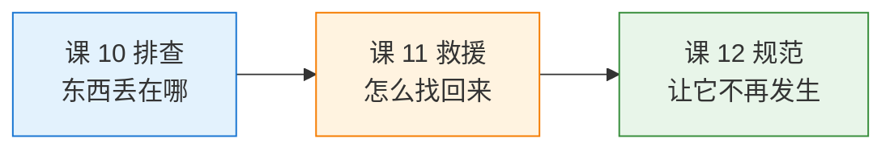
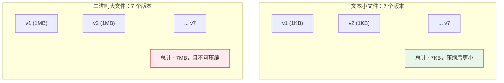
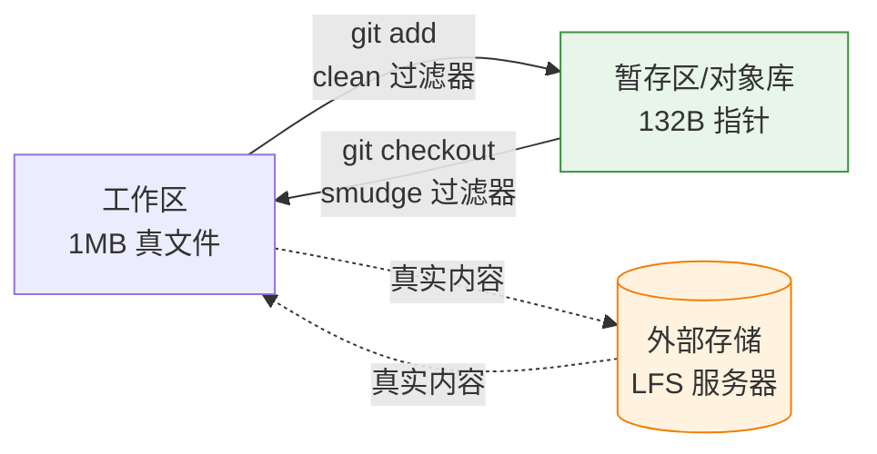
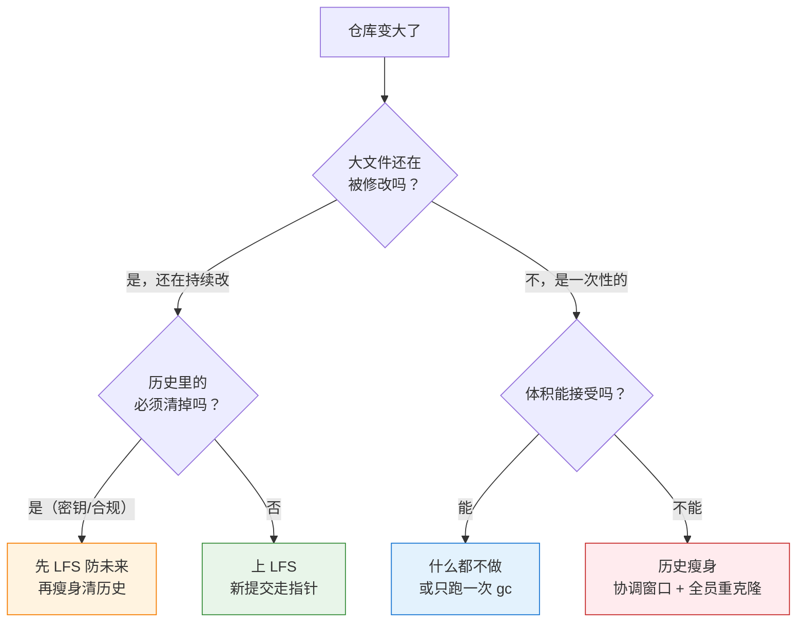
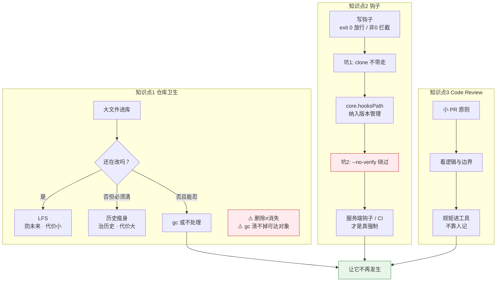

# 第 12 课：仓库工程实践

> 所属阶段：阶段 4《排查、救援与工程实践》｜ 水平：进阶 ｜ 本课知识点：仓库卫生与历史瘦身、钩子与自动化、Code Review 与 PR 工作流
> 故事情节：**让它不再发生**——最好的救援，是根本不需要救援。

## 🎯 本课目标

- 判断该用 Git LFS 还是历史瘦身，并说清各自的代价与适用条件。
- 写一个 pre-commit 钩子拦住不合格提交，并把钩子纳入版本管理。
- 说清一次好的 Code Review 该看什么，以及提交 PR 前自己该做什么。

## 📌 知识点清单（含关键点）

### 知识点 1：仓库卫生——gc / 大文件 / LFS 与历史瘦身

- 关键点 1：**gc**：打包松散对象、清理不可达对象；多数情况自动触发，不必手跑
- 关键点 2：大文件问题的本质：**每个历史版本都存一份完整快照**，删文件不减小仓库
- 关键点 3：**Git LFS**：把大文件换成指针文件，真实内容存外部——**只对未来生效，不瘦身历史**
- 关键点 4：**历史瘦身**（`filter-repo`）：真正减小体积，但会**改写全部提交哈希**，所有人须重新克隆
- 关键点 5：决策路径：新仓库用 LFS 预防；历史已污染且必须瘦身 → 协调窗口 + 全员重克隆

### 知识点 2：钩子与自动化——hooks 与提交前检查

- 关键点 1：钩子是 `.git/hooks/` 下的可执行脚本，在特定事件点被自动触发
- 关键点 2：常用钩子：`pre-commit`（提交前）、`commit-msg`（校验提交信息）、`pre-push`（推送前）
- 关键点 3：钩子退出码非 0 即中断操作——这是"拦截"的实现原理
- 关键点 4：**`.git/hooks` 不在版本控制内**，clone 不带走 → 用 `core.hooksPath` 指向仓库内目录
- 关键点 5：客户端钩子可被 `--no-verify` 绕过 → 关键约束要放在服务端（CI / 服务端钩子）

### 知识点 3：Code Review 与 PR 工作流最佳实践

- 关键点 1：PR 前自查：自测通过、提交已整理、描述说清"为什么"而非"改了什么"
- 关键点 2：**小 PR 原则**：改动越小评审质量越高；大 PR 应拆分
- 关键点 3：评审看什么：正确性、可读性、边界与异常、是否引入不必要复杂度、测试覆盖
- 关键点 4：评审的沟通纪律：对事不对人、区分"必须改"与"建议改"
- 关键点 5：把规范固化进工具（钩子 / CI / 模板），而不是靠人记

## 🐞 本课常见误区

- 误区 1：以为在最新提交里删掉大文件就能瘦身仓库——历史里还在
- 误区 2：以为客户端钩子是强制约束——一条 `--no-verify` 就能绕过
- 误区 3：把钩子写进 `.git/hooks` 就以为团队都有了——clone 不带走
- 误区 4：评审变成挑格式毛病——真正的价值在逻辑与边界

## 🧪 本课实操清单

- [x] 制造一个大文件提交，验证"删掉后仓库体积不变"
- [x] 写一个 pre-commit 钩子拦住含调试代码的提交
- [x] 用 `core.hooksPath` 把钩子目录纳入版本管理
- [x] 用 `commit-msg` 钩子校验 Conventional Commits 格式

---

# 第一幕 · 起源：一场谁都不想重演的事故

## 1.1 故事开始

前两课我们一直在做同一件事：**出了问题，把东西找回来**。

课 10 你在成百上千次提交里用 bisect 二分定位坏提交；课 11 你学会了用 reflog 把 `reset --hard` 掉的、强推掉的、删掉的分支一个个捞回来。你现在的水平是——**东西丢了，基本都能找回来**。

但有个问题我们一直没问：

> **为什么要等到丢了再去找？**

来看一个真实的场景。2026 年某天，一个三人小团队的项目，仓库 clone 一次要 4 分钟。新人入职第一天，光拉代码就喝了三杯咖啡。运维说 CI 每次跑之前拉代码要 2 分钟，一天跑 200 次，光等 clone 就烧掉 6 个多小时。

排查发现：仓库 `.git` 目录 **2.3 GB**。而项目源码本身只有 **8 MB**。

多出来的 2.3 GB 是什么？三年前有人 `git add .` 的时候把一份 400 MB 的数据集提交了进去，后来发现不对，第二天 `git rm` 删掉了。**删掉了。但没删掉。**

这就是本课要讲的第一件事：**在 Git 里，"删掉"和"消失"是两回事。**

## 1.2 第二个场景：一条本可以被拦住的提交

同一周，另一个团队。有人提交了这样一行代码：

```python
def process_payment(amount):
    console.log(f"DEBUG amount={amount}")   # 调试用，上线前记得删
    return charge(amount)
```

熟悉吧？"上线前记得删"。

结果当然没删。它一路通过了 code review、通过了 CI、进了预发、进了生产。生产日志每天多打 40 GB，日志服务账单翻了一倍。追查了一整天才找到——**就在那个提交里，明明白白写着。**

这条提交经过了三个环节：写的人、review 的人、CI。**三个环节都放它过去了。**

这就是本课要讲的第二件事：**靠人的自觉防不住，得靠机制。**

## 1.3 本课的位置

阶段 4 的课序是刻意安排的：



课 10 教"查"，课 11 教"救"，课 12 教"防"。

课 11 结尾我们留下过一句话：

> 本课反复出现的主题是"Git 很少真的丢东西，但你得知道去哪找"。课 12 要把这个思路再推一步——**用钩子和规范，让问题根本走不到需要救援这一步。**

还有一句更具体的：

> 课 11 实验 33 给出的"可以/不能 force 清单"是**人工约定**——课 12 要把它变成**机器强制**。

本课就要兑现这两句话。

## 1.4 本课的三个问题

我们把开头的两个场景拆成三个可回答的问题：

1. **仓库为什么会长胖？长胖了怎么瘦？**（实验 1-20）
2. **怎么让不合格的提交根本提交不上来？**（实验 21-35）
3. **提交上来了，怎么让它被有效地检查一遍？**（实验 36 + 知识点 3）

---

# 第二幕 · 认知冲突：三个"想当然"的崩塌

在动手之前，先把三个最普遍的直觉错误摆出来。这三个错误，每一个都会让你在真正需要的时候做出错误的决策。

## 2.1 冲突一："删掉大文件，仓库就瘦了"

**直觉**：我 `git rm` 掉那个 400 MB 的文件，仓库就小了。

**实测**（实验 4）：删掉前后的 `.git` 体积：

| 时刻 | .git 体积 |
|------|-----------|
| 删掉大文件前 | 7480 KB |
| 删掉大文件后 | **7496 KB** |

**不但没瘦，还胖了 16 KB。**

而且删掉之后，你照样能把文件完整取回来（实验 5）：

```bash
$ git cat-file -p HEAD~1:data.bin > recovered.bin
$ ls -l recovered.bin
-rw-r--r-- 1 root root 1048630 ... recovered.bin
```

1048630 字节，一个不差。

为什么会这样？因为 **Git 的每个提交都是一棵完整的树**。你在最新提交里"删掉"一个文件，只是在**最新的那棵树里**把它摘掉了；前面那些提交的树里，它还在。

这不是 Git 的 bug，是 Git 的核心设计（课 2 讲对象模型时就说过）：**提交是不可变的完整快照**。正是这个设计让你能随时 checkout 到任意历史时刻，也正因如此，历史里的东西不会因为你"现在删了"就消失。

## 2.2 冲突二："gc 能帮我清理大文件"

**直觉**：`git gc` 是"垃圾回收"，跑一遍仓库就干净了。

**实测**（实验 7）：

| 时刻 | .git 体积 | 大文件还在吗 |
|------|-----------|-------------|
| gc 前 | 7496 KB | 在 |
| gc 后 | **1192 KB** | **还在** |

体积确实掉了 84%，但**大文件一个都没少**：

```
blob 1048630 data.bin
blob 1048621 data.bin
blob 1048612 data.bin
```

那 84% 是怎么省下来的？`gc` 做的是两件事：

1. **把松散对象打包压缩**（pack）——这省的是压缩空间，不是删除内容
2. **清理不可达对象**——这才是真正的"删除"

而历史里的大文件属于**可达对象**：从 HEAD 出发沿着父指针能走到它们，所以 gc 一个都不敢删。

**`gc` 能删的只有"谁都够不着的东西"**——比如你 `reset --hard` 掉的那个提交（课 11 讲过，它只活在 reflog 里）。清掉 reflog 再 gc，它才真的没了。

顺带一个实测细节（实验 8）：大文件是**随机二进制**，几乎无法压缩，所以 7496 KB 打包后还有 1192 KB，压缩比很差。如果是文本大文件（日志、SQL dump），gc 的压缩收益会明显得多。

## 2.3 冲突三："装了钩子，这条规矩就立住了"

这是本课最危险的一个错觉。

**实测**（实验 25）：你装了一个 pre-commit 钩子拦调试代码，然后：

```bash
$ git commit -m "c2: 带调试代码（绕过钩子）" --no-verify
[master 41f37cf] c2: 带调试代码（绕过钩子）
 1 file changed, 1 insertion(+)
(exit 0)
```

**提交成功了。**

一条 `--no-verify`，你精心写的所有客户端钩子全部失效。

更隐蔽的是**静默失效**（实验 26、27）：

- 钩子文件**没有执行权限** → Git 打印一行 hint 说"被忽略了"，但**提交照样成功**（exit 0）。那行 hint 混在一堆输出里，你根本不会看。
- 钩子里的命令**写错了**（比如 `git grep` 的 `--cached` 放错位置）→ 命令退出码 128，而 `if` 语句把它当"没找到"，钩子返回 0 → **放行**。

这两种情况，**你都以为钩子还在保护你**。

所以本课要给你的不是一个钩子的写法，而是**一整套"怎么让规矩真的立住"的方案**。剧透一下结论：

| 位置 | 能不能绕过 | 适合放什么 |
|------|-----------|-----------|
| 客户端钩子（pre-commit 等） | **能**（`--no-verify`） | 提醒自己、快速反馈 |
| 服务端钩子（pre-receive） | 不能 | 真正的强制约束 |
| CI 检查 | 不能（可配分支保护卡住） | 复杂检查、测试 |
| 分支保护（平台功能） | 不能 | force push、直推主干 |

---

# 第三幕 · 层层揭示：知识点详解

## 3.1 知识点 1：仓库卫生——gc / 大文件 / LFS 与历史瘦身

### 3.1.1 一句话定义

> **仓库卫生**：控制 `.git` 目录的体积，让 clone / fetch / CI 保持可接受的速度。核心矛盾是——**Git 存完整快照，所以"改大文件"的代价远比你想象的高。**

### 3.1.2 直觉建立：仓库为什么会胖

先记住一个数字。**实验 3**：一个 1 MB 的文件，连续改 5 次，`.git` 从 1200 KB 长到 **7480 KB**。

7 个提交，7 份 1 MB 快照，约 7 MB。就这么简单粗暴。

对比一下：如果这个文件是 1 KB 的文本，改 5 次，`.git` 大概还是 100 多 KB——因为 7 份 1 KB 的快照加起来还不到 10 KB，而且文本能被 pack 压缩得很小。

**所以问题从来不是"文件大"，而是"大文件被改了很多次"。**

一个 400 MB 的数据集只提交一次，仓库涨 400 MB，你能忍。但如果它是模型权重、每周更新一次，一年下来就是 **400 MB × 52 = 20 GB**。这才是真实世界里仓库失控的方式。

### 3.1.3 核心原理：Git 存的是快照不是差异

这一点课 2 讲过，这里补上它的**代价**：



严格说，Git 在 **pack 层面**会做 delta 压缩（相似对象只存差异）。但：

- **delta 压缩对二进制效果极差**——改一个字节，整个文件可能完全不同
- **`core.bigFileThreshold`（默认 512 MB）以上的文件直接不进 delta**，原样存

所以面对大二进制文件，你可以近似认为：**每改一次，就多一份完整的它。**

### 3.1.4 示例演示：找出仓库里的"元凶"

在动手瘦身之前，先要知道是谁占的空间。**实验 6** 的命令请背下来：

```bash
$ git rev-list --objects --all \
  | git cat-file --batch-check='%(objecttype) %(objectsize) %(objectname) %(rest)' \
  | awk '$1=="blob"' | sort -k2 -nr | head -10
```

输出（实验 6 实测）：

```
blob 1048630 82c06aa48a89eac7789b0919f1d9248f24396f91 data.bin
blob 1048621 b9d55313e20422b7f858df364273e50795abfb72 data.bin
blob 1048612 5735bfbfc851dfd8168b4a11ef38469a3b01f224 data.bin
```

字段依次是：**类型 / 字节数 / 对象哈希 / 文件名**。

拿到哈希之后，可以用课 10 的 `git log --all --find-object=<哈希>` 查它是哪个提交引入的。

> **注意**：`git cat-file --batch-check` 的 `%(rest)` 在某些 Git 版本里可能为空（找不到文件名）。此时用 `git rev-list --objects --all | grep <哈希>` 单独查。

### 3.1.5 方案一：Git LFS（对未来生效）

#### 它是什么

**Git LFS**（Large File Storage）把大文件换成一个小指针文件，真实内容存到外部服务器。

指针文件长这样（**实验 10 实测**，与 [官方 spec](https://github.com/git-lfs/git-lfs/blob/main/docs/spec.md) 完全一致）：

```
version https://git-lfs.github.com/spec/v1
oid sha256:7e440ecac5bd58a22552dfd75b2c4fd24b770af1d4d7a4e3612202231f4b32f1
size 1048576
```

**132 字节**。1 MB 的真实内容，在 Git 里只占 132 字节。

#### 它怎么做到：clean / smudge 过滤器

LFS 不是 Git 的功能，是**一个客户端 + 两个 Git 过滤器**：



- **clean**（add 时）：收到真实内容 → 算 sha256、存到外部 → 输出指针
- **smudge**（checkout 时）：收到指针 → 按 oid 从外部取回 → 输出真实内容

这两个过滤器是 **Git 原生功能**（`.gitattributes` 里的 `filter=`），LFS 只是实现了它们。

**实验 9-14 我们用 Git 自带的 filter 机制手工实现了一遍**（因为本机没装 git-lfs，见"环境说明"），完整验证了：

- 实验 10：add 后暂存区只有 132 字节指针
- 实验 11：提交后 `.git` 只有 **200 KB**（对比不用 LFS 的 1200 KB）
- 实验 12：改 5 次后只有 **308 KB**（对比不用 LFS 的 7480 KB）
- 实验 13：checkout 后 sha256 与指针记录**完全一致**，真文件被正确还原

体积对比：

| 操作 | 不用 LFS | 用 LFS |
|------|---------|--------|
| 提交 1MB 文件 | 1200 KB | **200 KB** |
| 再改 5 次 | 7480 KB | **308 KB** |

**24 倍的差距**，而且改得越多差距越大。

#### ⚠️ LFS 的三个代价

**代价一：只对未来生效，历史它不管**（实验 15 实测）

你今天配上 LFS，历史里那些 1 MB 的 blob **一个都没少**：

```
blob 1048630 data.bin
blob 1048621 data.bin
blob 1048612 data.bin
```

想连历史一起瘦？只能改写历史（见 3.1.6）。

**代价二：没配好客户端，克隆到手的是指针不是文件**（实验 14 实测）

```bash
$ git clone -q lab-lfs clone-nolfs
$ ls -l big.bin
-rw-r--r-- 1 root root 132 ... big.bin     # 只有 132 字节！
$ head -1 big.bin
version https://git-lfs.github.com/spec/v1
```

这就是"队友说文件打不开"的真实原因。**LFS 是约定 + 外部服务，不是 Git 自带的。** 新机器必须 `git lfs install`。

**代价三：多了一个外部依赖**

LFS 内容存在 LFS 服务器上，它挂了 / 你没配额了 / 你换服务器了，历史里的指针就找不到真身。**你的仓库不再"自包含"。**

### 3.1.6 方案二：历史瘦身（对历史生效，代价巨大）

#### 它是什么

改写历史，把大文件从**每一个提交**里摘掉，让新的历史里从来没有过这个文件。

官方推荐工具是 **`git filter-repo`**（Git 2.24 起官方推荐，[Git 项目已明确不再推荐 filter-branch](https://github.com/newren/git-filter-repo)）。本机未安装，我们用 Git 自带的 `filter-branch` 演示——**机制与后果完全一致**。

#### 实测过程（实验 16-19）

**瘦身后**（实验 18）：

```bash
$ git log --oneline
b1f8669 c4: 再更新 app
00ed1bc c3: 更新 app
f6bbebe c1: 初始化
```

注意：**c2 整条提交消失了**（`--prune-empty` 把它删了，因为它除了 secret.bin 什么都没有），**c3/c4 的哈希全变了**（父提交变了）。只有 c1 的哈希没变——它的内容没被改动。

**体积变化**（实验 19 实测）：

| 阶段 | .git 体积 |
|------|-----------|
| 瘦身前 | 1248 KB |
| filter-branch 刚跑完 | **1280 KB**（反而涨了！） |
| 删 refs/original + reflog + gc | **172 KB** |

**关键点**：filter-branch 跑完体积**没变小**，因为 Git 在 `refs/original/` 下留了一份完整备份：

```bash
$ git for-each-ref refs/original/
89ffb2e7bf6e9e0e37b0cb96d8e806ab283cfd53 commit	refs/original/refs/heads/master
```

必须三步走才真正释放：

```bash
git for-each-ref --format='%(refname)' refs/original/ | while read -r r; do
  git update-ref -d "$r"
done
git reflog expire --expire=now --all
git gc --prune=now
```

删完之后（实验 19 实测），`secret.bin` 在历史里彻底消失：

```bash
$ git log --all --oneline -- secret.bin
(exit 0)  ← 空输出
```

而业务文件 `app.txt` 完好无损。

#### ⚠️ 瘦身的代价：比 LFS 大得多

| 代价 | 说明 |
|------|------|
| **所有提交哈希改变** | 从被改动的那个提交往后，全部重写 |
| **所有人必须重新克隆** | 不是 rebase，是删掉重来 |
| **所有未合并分支要手工移植** | 基于旧历史的分支全部作废 |
| **已推送的标签要一并强推** | 否则标签还指着旧对象 |
| **CI/CD 缓存、PR 评论可能失效** | 哈希变了，平台认不出来 |

**实验 20 实测**了"不重新克隆会怎样"：

```bash
$ git merge --no-edit FETCH_HEAD
fatal: refusing to merge unrelated histories
(exit 128)
```

Git 直接拒绝——因为瘦身后所有哈希都变了，它认为这是两个完全不相干的仓库。

即使加 `--allow-unrelated-histories` 强行合并，**旧历史（含大文件）又被拉回来了，白瘦**。

### 3.1.7 决策路径：到底该用哪个



**一句话决策**：

- **新仓库、文件还会继续改** → **LFS**（预防，代价小）
- **历史已经污染，且必须清掉**（密钥泄露、合规要求）→ **瘦身**（治疗，代价大）
- **历史污染但能忍** → 什么都不做，或者只跑一次 `gc`

**优先级永远是：预防 > 治疗。** LFS 是每天吃的维生素，瘦身是手术。

### 3.1.8 常见误区

**误区：在最新提交里删掉大文件就能瘦身。**

实测打脸（实验 4）：7480 KB → **7496 KB**。历史里每个版本都还在。

**误区：gc 能清掉大文件。**

实测打脸（实验 7）：gc 后大文件一个没少，它们是被历史引用的**可达对象**。

### 3.1.9 一句话记住

> **删除不等于消失，LFS 管未来，瘦身管历史——能预防就别动手术。**

---

## 3.2 知识点 2：钩子与自动化——hooks 与提交前检查

### 3.2.1 一句话定义

> **Git 钩子**：在特定事件点（提交前、推送前等）自动执行的脚本。**退出码 0 = 放行，非 0 = 中断。** 就这一条规则，撑起了 Git 的全部自动化能力。

### 3.2.2 直觉建立：钩子就是"关卡"

想象一条流水线，每个站点都有一个检查员：


每个检查员只有一句台词：**"过"或者"不过"**。说"不过"，流水线就停在这。

### 3.2.3 核心原理：退出码就是全部

钩子的"拦截"没有任何魔法。看实验 22 那个完整的钩子：

```bash
#!/bin/sh
if git grep --cached -n -E 'TODO_DEBUG|console\.log\('; then
  echo "[pre-commit] 发现调试代码，提交被拦截" >&2
  exit 1
fi
exit 0
```

`git grep` 找到东西返回 0 → `if` 成立 → `exit 1` → **Git 中断提交**。
`git grep` 没找到返回 1 → `if` 不成立 → `exit 0` → **放行**。

就这些。

**常用钩子一览**：

| 钩子 | 触发时机 | 能拿到什么 | 典型用途 |
|------|---------|-----------|---------|
| `pre-commit` | 提交前（已 add） | 无参数 | 检查内容：调试代码、大文件、格式化 |
| `commit-msg` | 写好信息后 | `$1` = 信息文件路径 | 校验提交信息格式 |
| `pre-push` | 推送前 | stdin 逐行：本地ref/sha 远端ref/sha | 禁止直推主干、跑测试 |
| `post-commit` | 提交后 | 无 | 通知、日志（不能拦截） |
| `pre-receive` | **服务端**收到推送 | stdin 逐行 | **真正的强制**：分支保护、CI 门禁 |

### 3.2.4 示例演示：三个钩子的完整写法

#### ① pre-commit：拦调试代码（实验 22-24）

```bash
#!/bin/sh
if git grep --cached -n -E 'TODO_DEBUG|console\.log\(' -- ':!.githooks'; then
  echo "[pre-commit] 发现调试代码，提交被拦截" >&2
  exit 1
fi
exit 0
```

实测（实验 24）：

```bash
$ git commit -m "c2: 带调试代码"
g.txt:1:console.log("debug");
[pre-commit] 发现调试代码，提交被拦截
(exit 1)
```

两个必须注意的点：

- **`--cached`**：查暂存区（即将提交的内容），不是工作区。查工作区会漏掉"改了但没 add"的情况，也会误伤"工作区有但没打算提交"的文件。
- **`-- ':!.githooks'`**：排除钩子目录自身。**钩子文件里就写着 `console.log` 这几个字**，不排除的话提交钩子时它会命中自己——**"自咬"**（探索阶段实测复现过）。

> ⚠️ **`--cached` 必须放在模式之前**（实验 27 实测）：
> ```bash
> git grep -n -E 'x' --cached        # ✗ exit 128，fatal
> git grep --cached -n -E 'x'        # ✓
> ```
> 写错的话命令报错返回 128，`if` 把它当"没找到"，钩子**静默放行**。

#### ② commit-msg：校验 Conventional Commits（实验 33）

```bash
#!/bin/sh
MSG_FILE="$1"
MSG=$(cat "$MSG_FILE")
# 合并提交豁免：合并时 .git/MERGE_HEAD 存在
if [ -f .git/MERGE_HEAD ]; then
  exit 0
fi
case "$MSG" in
  feat*|fix*|docs*|style*|refactor*|perf*|test*|build*|ci*|chore*|revert*)
    exit 0 ;;
  *)
    echo "[commit-msg] 提交信息不符合 Conventional Commits: $MSG" >&2
    echo "[commit-msg] 正确格式：<type>: <描述>" >&2
    exit 1 ;;
esac
```

实测（实验 33）：

```bash
$ git commit -m 'feat: 新增导出功能'
[clean (root-commit) b251937] feat: 新增导出功能
(exit 0)                                    # 通过

$ git commit -m '改了点东西'
[commit-msg] 提交信息不符合 Conventional Commits: 改了点东西
(exit 1)                                    # 拦截
```

**`[ -f .git/MERGE_HEAD ] && exit 0` 这一行千万别漏。** 合并时 Git 生成的默认信息是 `Merge branch 'feat/x'`，它不符合 Conventional Commits。不豁免的话**每次 merge 都会被卡住**，团队很快就会有人把钩子删掉。

**实验 34 实测**：真实分叉（`merge-base --is-ancestor` 返回 1，确认分叉成立）后 `git merge --no-ff --no-edit`，merge 成功（exit 0），豁免生效。

#### ③ pre-push：禁止直推主干（实验 35）

```bash
#!/bin/sh
while read -r local_ref local_sha remote_ref remote_sha; do
  case "$remote_ref" in
    refs/heads/master|refs/heads/main)
      echo "[pre-push] 禁止直接推送到 $remote_ref，请走 PR/MR" >&2
      exit 1 ;;
  esac
done
exit 0
```

实测（实验 35）：

```bash
$ git push -q origin master
[pre-push] 禁止直接推送到 refs/heads/master，请走 PR/MR
error: failed to push some refs to '/tmp/l12-lab2/bare.git'
(exit 1)
```

这就是课 11 那张"可以/不能 force 清单"变成**机器强制**的手段之一。

### 3.2.5 关键问题：钩子怎么分发给团队

这是钩子落地**最难也最重要**的一环。三个坑，逐个数。

#### 坑一：`.git/hooks` 不在版本控制内（实验 28 实测）

```bash
$ git clone -q lab-hooks clone-hooks
$ ls .git/hooks/pre-commit
ls: cannot access '.git/hooks/pre-commit': No such file or directory
(exit 2)
```

**克隆里根本没有钩子。** `.git` 目录整体不参与版本控制。验证一下确实不生效：带 `console.log` 的提交顺利通过（exit 0）。

#### 坑二：钩子不生效的两个静默原因

**原因 A：没有执行权限**（实验 26 实测）

```bash
$ chmod -x .git/hooks/pre-commit
$ git commit -m "c3: 钩子无执行权限"
hint: The '.git/hooks/pre-commit' hook was ignored because it's not set as executable.
[master 6e0aac8] c3: 钩子无执行权限
(exit 0)     ← 提交成功了！
```

Git 会打印一行 hint，但**提交照样成功**。那行 hint 混在一堆输出里，根本不会被注意到。

**原因 B：钩子里的命令写错**（实验 27 实测）

```bash
$ git grep -n -E 'console\.log\(' --cached
fatal: option '--cached' must come before non-option arguments
(exit 128)
```

命令报错返回 128，而 `if` 把它当成"没找到" → 钩子返回 0 → **放行**。

> **这两个坑的共同特点：钩子看起来在，实际上完全没起作用，而且没有任何明显报错。**
> 排查口诀：**先手动跑一遍钩子里的命令，看退出码。**

#### 坑三：解决方案——`core.hooksPath`（实验 29-31 实测）

**思路**：把钩子放在仓库内的普通目录（比如 `.githooks/`），让它进版本控制，再用一行配置告诉 Git 去那里找钩子。

```bash
# 1. 建目录、写钩子、纳入版本控制
mkdir -p .githooks
# ... 写钩子 ...
chmod +x .githooks/pre-commit
git add .githooks
git commit -m "chore: 钩子目录入版本库"

# 2. 每个克隆者执行一次
git config core.hooksPath .githooks
```

实测（实验 29 vs 30）：

| 状态 | 提交带调试代码 |
|------|--------------|
| 钩子在版本库里，**没设 hooksPath** | **exit 0 通过**（不生效） |
| **设了 hooksPath** | **exit 1 拦截**（生效） |

实验 31 验证了完整链路：克隆 → `.githooks` 目录跟过来了 → `core.hooksPath` 没跟过来（它是本地配置，exit 1）→ 配一行 → 生效（exit 1）。

**落地建议**：把 `git config core.hooksPath .githooks` 写进 README、Makefile 或 `setup.sh`：

```makefile
setup:
	git config core.hooksPath .githooks
	@echo "钩子已启用"
```

#### 补充方案：`init.templateDir`（实验 32 实测）

如果你想让**本机所有新仓库**都自带钩子：

```bash
mkdir -p ~/git-template/hooks
cp my-pre-commit ~/git-template/hooks/pre-commit
chmod +x ~/git-template/hooks/pre-commit
git config --global init.templateDir ~/git-template
```

实测（实验 32）：之后 `git init` 的新仓库，`.git/hooks/pre-commit` 已经在那了，带调试代码的提交直接被拦（exit 1）。

**两种方案的取舍**：

| 方案 | 作用范围 | 钩子能否随仓库升级 | 适合场景 |
|------|---------|------------------|---------|
| `core.hooksPath` | 单个仓库 | **能**（在版本库里，改了大家 pull 就有） | **团队规范**（推荐） |
| `init.templateDir` | 本机所有**新**仓库 | 不能（快照式复制，改模板不影响已有仓库） | 个人习惯 |

**团队用 `core.hooksPath`，个人用 `init.templateDir`。**

### 3.2.6 终极问题：客户端钩子能强制吗

**不能。**

```bash
$ git commit --no-verify -m "绕过所有客户端钩子"
(exit 0)
```

一条 `--no-verify`，`pre-commit` 和 `commit-msg` 全部跳过（实验 25 实测）。

所以正确的分工是：

| 层 | 能不能绕 | 放什么 |
|---|---------|-------|
| **客户端钩子** | 能 | 快速反馈（格式化、本地 lint）——**让人早点发现问题** |
| **服务端 `pre-receive`** | 不能 | 强制约束（提交规范、禁止直推主干） |
| **CI** | 不能（配分支保护） | 复杂检查（测试、安全扫描、构建） |
| **平台分支保护** | 不能 | 禁 force push、要求 CI 通过、要求 N 个 approve |

**记住这个分层**：客户端钩子是**助手**，服务端钩子和 CI 才是**守门员**。

### 3.2.7 常见误区

**误区：以为客户端钩子是强制约束。**

实测（实验 25）：一条 `--no-verify` 全部绕过。真正的强制必须在服务端。

**误区：把钩子写进 `.git/hooks` 就以为团队都有了。**

实测（实验 28）：clone 后 `.git/hooks/pre-commit` 不存在（exit 2）。

**误区：钩子装了就万事大吉。**

实测（实验 26、27）：权限丢了或命令写错，钩子**静默失效**，你以为还在保护你。

### 3.2.8 一句话记住

> **钩子退出码 0 放行、非 0 拦截；客户端是提醒，服务端才是约束。**

---

## 3.3 知识点 3：Code Review 与 PR 工作流最佳实践

### 3.3.1 一句话定义

> **Code Review**：让别人在代码合入主干前读一遍。它的价值不在于挑错字，而在于**用第二双眼睛发现作者看不见的假设**。

### 3.3.2 直觉建立：为什么大 PR 没人认真看

先说一个残酷的事实：**评审质量随 PR 大小断崖式下跌。**

一个 20 行的 PR，你会逐行读，还能想到边界情况。
一个 2000 行的 PR，你会扫一眼标题、扫一眼测试有没有，然后点 Approve。

这不是态度问题，是**认知带宽**问题。人脑一次能hold住的上下文是有限的。

所以本课最实用的一条建议是：**小 PR 原则**——**把大改动拆成一串能独立理解、独立合入的小 PR。**

怎么拆？参考这个顺序：

1. 先提一个**纯重构**的 PR（不改行为，只调整结构）
2. 再提一个**加新能力**的 PR（可能是灰度的、没接进来的）
3. 最后提一个**接线**的 PR（把新能力接进主流程）

每一步都能独立 review、独立回滚。

### 3.3.3 核心原理：评审到底看什么

按重要性排序，五层：

| 优先级 | 看什么 | 典型问题 |
|-------|-------|---------|
| **1. 正确性** | 逻辑对不对、边界对不对、异常怎么处理 | 空值、越界、并发、错误被吞掉 |
| **2. 设计** | 该不该在这里改、抽象合不合理 | 改错层、过度设计、复制粘贴 |
| **3. 可读性** | 半年后别人（包括你自己）看得懂吗 | 命名、注释说"为什么"、函数长度 |
| **4. 测试** | 覆盖到了吗、测的是行为还是实现 | 只测happy path、断言等于没有 |
| **5. 风格** | 格式、命名约定 | 缩进、引号 |

**只有第 5 层该交给工具。** 如果评审意见里 80% 是格式问题，说明你们缺一个格式化钩子和 CI 检查——**别让人干机器的活**。

### 3.3.4 示例演示：评审的 Git 工具箱（实验 36 实测）

评审不是只在网页上点。本地有一整套命令，能让你看得更快更准。

**① 第一眼看规模**

```bash
$ git diff --shortstat HEAD~2..HEAD
 1 file changed, 3 insertions(+), 1 deletion(-)
```

超过 400 行，建议让作者拆。

**② 看这个 PR 包含哪些提交**

```bash
$ git log --oneline HEAD~2..HEAD
e207391 c3: 加 line5
84b522c c2: 改 line2 并加 line4
```

如果里面有 "fix fix fix"、"WIP"、"改一下"，**提交前该先整理**（课 8 的 `rebase -i`）。

**③ 看单个文件的完整改动**

```bash
$ git diff HEAD~2..HEAD -- calc.py
diff --git a/calc.py b/calc.py
@@ -1,3 +1,5 @@
 line1
-line2
+line2 CHANGED
 line3
+line4
+line5
```

**④ 追问时找上下文：这一行谁写的、为什么**

```bash
$ git blame -L 2,2 calc.py
84b522ca (Zhang Wei 2026-09-09 16:07:24 +0800 2) line2 CHANGED
```

拿到哈希后 `git show 84b522c` 看完整上下文。

> ⚠️ **blame 给的是"最后修改者"，不是"原创者"**（课 10 实测：全文件格式化后 blame 会把格式化者当作者）。**加 `-w` 忽略空白改动**，或者用 `.git-blame-ignore-revs` 屏蔽格式化提交。

**⑤ 这个分支合进主干了吗**

```bash
$ git merge-base --is-ancestor feat/x master
(exit 0)   # 0 = 已合并；1 = 未合并
```

**⑥ 分支落后/领先多少（判断要不要先 rebase）**

```bash
$ git rev-list --count HEAD..master    # 落后主干多少
2
$ git rev-list --count master..HEAD    # 领先主干多少
1
```

落后很多的话，建议作者先 `rebase` 到最新主干，减少冲突面（课 8）。

**⑦ 找出冲突高风险区（两边都改过的文件）**

```bash
$ git diff --name-only master...HEAD
o.txt
```

注意是**三个点** `...`：它比较的是"两边的共同祖先到 HEAD"，正是 PR 的真实改动范围。

**⑧ 按作者统计改动量**

```bash
$ git shortlog -sn --all
     4	Zhang Wei
```

适合快速了解大 PR 的改动分布。

### 3.3.5 提交 PR 前：作者自查清单

**评审的第一责任人是作者自己。** 提 PR 前请先确认：

- [ ] **自己先完整读一遍 diff**——你会惊讶于有多少低级错误是这样被自己抓到的
- [ ] **自测通过**——不是"我觉得能跑"，是真的跑了
- [ ] **提交已整理**——没有 "WIP"、"fix typo"、"再改改"（课 8 的 `rebase -i`）
- [ ] **描述说清"为什么"**——代码已经说了"改了什么"，PR 描述该说的是**为什么这么改**
- [ ] **改动范围最小化**——没有顺手改的无关格式、没有误提交的调试代码
- [ ] **测试补上了**——不是"以后补"

**PR 描述模板**（把"为什么"写清楚）：

```markdown
## 背景 / 为什么
订单导出在数据量 > 5 万行时超时（#1234）

## 改了什么
把全量查询改成游标分批，每批 1000 行

## 怎么验证的
- 本地造 10 万行数据，导出从 62s 降到 3.1s
- 补了 `test_export_large_dataset`

## 风险与回滚
改动限定在 export 模块，出问题可直接 revert
```

### 3.3.6 评审的沟通纪律

**对事不对人**：说"这个边界情况会漏"，不说"你又忘了处理边界"。

**区分"必须改"和"建议改"**——这是最重要的一条纪律：

| 前缀 | 含义 | 作者义务 |
|------|------|---------|
| `【必须改】` / `Blocking` | 有 bug、有安全问题、违反硬约定 | 必须改才能合 |
| `【建议】` / `Nit` | 我觉得更好，但不是错 | 作者可自行决定 |
| `【提问】` / `Question` | 我没看懂，请解释 | 回答即可，不一定要改 |

**不做的事**：

- 不把个人偏好当硬要求（"我习惯这样写"）
- 不在评审里讨论架构级问题（那该在设计阶段定）
- 不用反问句表达不满（"这里为什么不XXX？" → "这里用 XXX 会不会更好？"）

### 3.3.7 把规范固化进工具

回到本课的主线：**靠人记靠不住。**

| 规范 | 固化方式 |
|------|---------|
| 代码格式 | 格式化工具 + `pre-commit` 钩子 + CI 检查 |
| 提交信息格式 | `commit-msg` 钩子（实验 33）+ CI 检查 |
| 禁止直推主干 | `pre-push` 钩子（实验 35）+ 平台分支保护 |
| 禁 force push 共享分支 | **平台分支保护**（客户端钩子拦不住） |
| 测试必须过 | CI + 分支保护（要求 CI 绿才能合） |
| 大文件不许入库 | `pre-commit` 检查文件大小 + CI 检查 |

**判断标准**：一条规矩如果**每次都要靠人提醒**，说明它该进工具了。

### 3.3.8 常见误区

**误区：评审变成挑格式毛病。**

格式问题该由工具解决（prettier + 钩子 + CI）。人应该把精力花在**逻辑与边界**上。

**误区：评审 = 找茬。**

评审的真正产出是**知识传播和风险共担**。作者和评审者对这个改动是**共同负责**的。

### 3.3.9 一句话记住

> **小 PR、说清楚"为什么"、把规矩交给工具——评审的价值在逻辑与边界，不在格式。**

---
---

# 第四幕 · 实操验证：36 个实验完整实录

> 全部实验在本机 **WSL Ubuntu 24.04 / Git 2.43.0** 实测通过，`HOME` 已隔离到 `/tmp/git-lesson12-home`，不污染真实全局配置。
> 脚本：`git-lesson12-lab.sh`（实验 1-18）、`git-lesson12-lab2.sh`（实验 19-36）。

## 4.0 环境说明（重要）

| 工具 | 本机状态 | 本课的处理 |
|------|---------|-----------|
| `git` | 2.43.0 ✅ | 全部实验基于此版本 |
| `git-lfs` | **未安装** | 用 Git 原生 **clean/smudge 过滤器**手工实现 LFS 机制（实验 9-14），**原理与真实 LFS 完全一致** |
| `git-filter-repo` | **未安装** | 用 Git 自带 **`filter-branch`** 演示历史瘦身（实验 16-19），**机制与后果一致** |

**为什么可以这样做**：

- **LFS 的本质就是两个 Git 过滤器**（[官方 spec 明确说明](https://github.com/git-lfs/git-lfs/blob/main/docs/spec.md)："Git LFS uses the clean and smudge filters"）。我们实现的 `lfs-clean` / `lfs-smudge` 与真实 LFS 客户端做的是同一件事，产出的指针格式与官方 spec **逐字节一致**。
- **`filter-branch` 与 `filter-repo` 的后果完全相同**：都会重写提交哈希、都需要全员重新克隆。**区别只在速度和安全性**——官方自 Git 2.24 起推荐 `filter-repo`（[Git 2.24 release notes](https://github.blog/2019-11-03-highlights-from-git-2-24/)），生产环境请用它。

**实验里的真实命令都可直接照抄运行**，不依赖任何外部服务。

---

## 4.1 实验 1-8：大文件如何把仓库喂胖

### 实验 1：Git 存的是完整快照，不是差异

```bash
$ git init -q .
$ git config user.name 'Zhang Wei'
$ git config user.email zhangwei@example.com
$ git config core.autocrlf false
$ dd if=/dev/urandom of=data.bin bs=1M count=1 status=none
$ ls -l data.bin
-rw-r--r-- 1 root root 1048576 Sep  9 16:05 data.bin
$ git add data.bin
$ git commit -q -m "c1: 添加 data.bin (1MB)"
$ du -sk .git
1200	.git
```

> 用 `/dev/urandom` 生成随机内容，是刻意选的：**随机数据不可压缩**，能反映最真实的体积代价。

### 实验 2：只改一个字节，Git 又存一份完整快照

```bash
$ echo "change 1" >> data.bin
$ git add data.bin && git commit -q -m "c2: 修改 data.bin"
$ du -sk .git
2248	.git
$ git rev-list --objects --all | grep data.bin
e1d6b77d990906f2b79083d1de52db7aece951b5 data.bin
dea0bcd9af0fd6c9b8a5927952a0e7de3573a80e data.bin
```

**两个不同的 blob**，大小都是 1 MB 左右。改一行 = 多存一份。

### 实验 3：连续改 5 次 —— 体积线性增长

```bash
$ for i in 1 2 3 4 5; do echo "change $i" >> data.bin; git add data.bin; git commit -q -m "c3.$i"; done
$ du -sk .git
7480	.git
$ git rev-list --count HEAD
7
$ git rev-list --objects --all | git cat-file --batch-check='%(objecttype) %(objectsize) %(rest)' | awk '$1=="blob"' | sort -k2 -nr | head -6
blob 1048630 data.bin
blob 1048621 data.bin
blob 1048612 data.bin
blob 1048603 data.bin
blob 1048594 data.bin
blob 1048585 data.bin
```

**7 个提交，7 份约 1 MB 的快照 = 约 7 MB。** 线性增长，毫不打折。

### 实验 4：在最新提交里删掉大文件 —— 仓库变小了吗？

```bash
$ git rm -q data.bin && git commit -q -m "c4: 删除 data.bin"
$ ls data.bin
ls: cannot access 'data.bin': No such file or directory
(exit 2)
$ du -sk .git
7496	.git
```

**7480 KB → 7496 KB。不但没瘦，还胖了 16 KB**（多了一个提交对象）。

### 实验 5：删掉的文件，历史里照样能取出来

```bash
$ git cat-file -p HEAD~1:data.bin > /tmp/l12-recovered.bin
(exit 0)
$ ls -l /tmp/l12-recovered.bin
-rw-r--r-- 1 root root 1048630 Sep  9 16:05 /tmp/l12-recovered.bin
```

**1048630 字节，一个不差。** "删除"只是"最新版本里没有"。

### 实验 6：找出历史里最大的几个 blob（瘦身前的必备动作）

```bash
$ git rev-list --objects --all | git cat-file --batch-check='%(objecttype) %(objectsize) %(objectname) %(rest)' | awk '$1=="blob"' | sort -k2 -nr | head -5
blob 1048630 82c06aa48a89eac7789b0919f1d9248f24396f91 data.bin
blob 1048621 b9d55313e20422b7f858df364273e50795abfb72 data.bin
blob 1048612 5735bfbfc851dfd8168b4a11ef38469a3b01f224 data.bin
blob 1048603 cfaf5419be58bd72f915c66cb6d31b75533e347b data.bin
blob 1048594 94494364055a77b841e43edc2e979d411cab8b5c data.bin
```

**这条命令请背下来**——它是所有仓库瘦身工作的起点。

### 实验 7：gc 能帮上忙吗？（大多数情况下：不能变小）

```bash
$ git reflog expire --expire=now --all
$ git gc --prune=now -q
$ du -sk .git
1192	.git
$ git rev-list --objects --all | git cat-file --batch-check='%(objecttype) %(objectsize) %(rest)' | awk '$1=="blob"' | sort -k2 -nr | head -3
blob 1048630 data.bin
blob 1048621 data.bin
blob 1048612 data.bin
```

**体积掉了 84%，但大文件一个都没少。**

那 84% 是**打包压缩**省下来的，不是删除。而且注意：这是随机二进制，压缩比已经很差了；换成文本大文件，压缩收益会大得多。

### 实验 8：gc 真正能清掉的只有"不可达对象"

```bash
$ git count-objects -v
count: 0
size: 0
in-pack: 23
packs: 1
size-pack: 1028
prune-packable: 0
garbage: 0
size-garbage: 0
```

`gc` 不删任何"从某个提交能走到"的对象。历史里的大文件**全部可达**，所以一个都不删。

---

## 4.2 实验 9-15：LFS 机制（用 Git 原生过滤器手工实现）

### 实验 9：LFS 的底层机制 —— clean 过滤器

```bash
$ git init -q .
$ git config filter.lfssim.clean lfs-clean
$ git config filter.lfssim.smudge lfs-smudge
$ echo "*.bin filter=lfssim" > .gitattributes
$ cat .gitattributes
*.bin filter=lfssim
$ git add .gitattributes && git commit -q -m "c1: 添加 .gitattributes"
```

两个过滤器脚本（等价于 LFS 客户端的核心逻辑）：

```bash
# lfs-clean：stdin 收真实内容 → 存外部 → stdout 输出指针
#!/usr/bin/env bash
tmp=$(mktemp); cat > "$tmp"
oid=$(sha256sum "$tmp" | awk '{print $1}')
size=$(stat -c %s "$tmp")
cp "$tmp" "/tmp/l12-lab1/store/$oid"
printf 'version https://git-lfs.github.com/spec/v1\noid sha256:%s\nsize %s\n' "$oid" "$size"
rm -f "$tmp"

# lfs-smudge：stdin 收指针 → 从外部取回 → stdout 输出真实内容
#!/usr/bin/env bash
tmp=$(mktemp); cat > "$tmp"
oid=$(grep '^oid sha256:' "$tmp" | sed 's/^oid sha256://')
if [ -n "$oid" ] && [ -f "/tmp/l12-lab1/store/$oid" ]; then
  cat "/tmp/l12-lab1/store/$oid"
else
  cat "$tmp"
fi
rm -f "$tmp"
```

### 实验 10：add 之后，Git 里存的其实只是一个 132 字节的指针

```bash
$ dd if=/dev/urandom of=big.bin bs=1M count=1 status=none
$ ls -l big.bin
-rw-r--r-- 1 root root 1048576 Sep  9 16:05 big.bin
$ git add big.bin
$ git cat-file -p :big.bin
version https://git-lfs.github.com/spec/v1
oid sha256:7e440ecac5bd58a22552dfd75b2c4fd24b770af1d4d7a4e3612202231f4b32f1
size 1048576
$ git cat-file -s :big.bin
132
```

**工作区 1 MB，Git 里只存 132 字节。** 这个格式与 [LFS 官方 spec](https://github.com/git-lfs/git-lfs/blob/main/docs/spec.md) 逐字节一致。

### 实验 11：提交后仓库体积 —— 与实验 1 对比

```bash
$ git commit -q -m "c2: 添加 big.bin（走 clean 过滤器）"
$ du -sk .git
200	.git
$ ls -l /tmp/l12-lab1/store
-rw------- 1 root root 1048576 ...  7e440ecac5bd58a22552dfd75b2c4fd24b770af1d4d7a4e3612202231f4b32f1
```

**实验 1 的 1200 KB → 这里的 200 KB。** 真实内容躺在外部存储里。

### 实验 12：再改 5 次，体积还线性增长吗？

```bash
$ for i in 1 2 3 4 5; do echo "change $i" >> big.bin; git add big.bin; git commit -q -m "c3.$i"; done
$ du -sk .git
308	.git
$ git rev-list --objects --all | git cat-file --batch-check='%(objecttype) %(objectsize) %(rest)' | awk '$1=="blob"' | sort -k2 -nr | head -3
blob 132 big.bin
blob 132 big.bin
blob 132 big.bin
```

**实验 3 的 7480 KB → 这里的 308 KB。24 倍差距。**

### 实验 13：smudge 过滤器 —— checkout 时把真文件还原回来

```bash
$ rm -f big.bin && git checkout -- big.bin
$ ls -l big.bin
-rw-r--r-- 1 root root 1048621 Sep  9 16:05 big.bin
$ sha256sum big.bin
9770b52c6242c231d3df3906182ef2a07c8d78dad44335c243336d00412badf0  big.bin
$ git cat-file -p :big.bin | grep oid
oid sha256:9770b52c6242c231d3df3906182ef2a07c8d78dad44335c243336d00412badf0
```

**两边 sha256 完全一致**——smudge 正确还原了真实内容。对用户来说，"文件就是文件"，无感知。

### 实验 14：LFS 的代价 —— 没配好过滤器，克隆到手的是指针不是文件

```bash
$ git clone -q lab-lfs clone-nolfs
$ ls -l big.bin
-rw-r--r-- 1 root root 132 Sep  9 16:05 big.bin
$ head -3 big.bin
version https://git-lfs.github.com/spec/v1
oid sha256:9770b52c6242c231d3df3906182ef2a07c8d78dad44335c243336d00412badf0
size 1048621
```

**132 字节的"文件"。** 这就是"队友克隆下来发现文件打不开"的真实原因——**LFS 是约定 + 外部服务，不是 Git 自带的**。

### 实验 15：LFS 只对未来生效 —— 历史里的大文件它不管

```bash
# 回到实验 1-8 那个"已经把 1MB 大文件提交进历史"的仓库，给它配上过滤器
$ git config filter.lfssim.clean lfs-clean
$ git config filter.lfssim.smudge lfs-smudge
$ echo "*.bin filter=lfssim" > .gitattributes
$ git add .gitattributes && git commit -q -m "c5: 开始用 LFS"
$ git rev-list --objects --all | git cat-file --batch-check='%(objecttype) %(objectsize) %(rest)' | awk '$1=="blob"' | sort -k2 -nr | head -3
blob 1048630 data.bin
blob 1048621 data.bin
blob 1048612 data.bin
```

**一个都没少。** LFS 管的是"从今往后的提交"，历史已经写进去的东西它不碰。

---

## 4.3 实验 16-20：历史瘦身及其代价

### 实验 16：准备一个被污染的历史

```bash
$ echo "app v1" > app.txt && git add app.txt && git commit -q -m "c1: 初始化"
$ dd if=/dev/urandom of=secret.bin bs=1M count=1 status=none
$ git add secret.bin && git commit -q -m "c2: 误提交 secret.bin"
$ echo "app v2" >> app.txt && git add app.txt && git commit -q -m "c3: 更新 app"
$ echo "app v3" >> app.txt && git add app.txt && git commit -q -m "c4: 再更新 app"
$ git log --oneline
89ffb2e c4: 再更新 app
20e7cf8 c3: 更新 app
a32c6d4 c2: 误提交 secret.bin
f6bbebe c1: 初始化
$ du -sk .git
1272	.git
$ git rev-parse HEAD
89ffb2e7bf6e9e0e37b0cb96d8e806ab283cfd53
```

### 实验 17：执行 filter-branch

```bash
$ FILTER_BRANCH_SQUELCH_WARNING=1 git filter-branch --index-filter \
    'git rm --cached --ignore-unmatch secret.bin' --prune-empty --tag-name-filter cat -- --all
Rewrite 20e7cf884b9273a6e6c3aa4d76810029a7505fec (3/4) ... rm 'secret.bin'
Rewrite 89ffb2e7bf6e9e0e37b0cb96d8e806ab283cfd53 (3/4) ... rm 'secret.bin'

Ref 'refs/heads/master' was rewritten
(exit 0)
```

参数说明：

- `--index-filter`：只在索引里删，**不 checkout 文件**——比 `--tree-filter` 快几个数量级
- `--prune-empty`：删掉因此变空的提交
- `--tag-name-filter cat`：同时改写标签
- `-- --all`：对所有引用生效

> **生产环境请用 `git filter-repo`**（Git 2.24 起官方推荐，`filter-branch` 已弃用）。这里用它只为演示机制与后果。

### 实验 18：瘦身的代价 —— 哈希全变、refs/original 还在

```bash
$ git log --oneline
b1f8669 c4: 再更新 app
00ed1bc c3: 更新 app
f6bbebe c1: 初始化
$ du -sk .git
1320	.git
$ git for-each-ref refs/original/
89ffb2e7bf6e9e0e37b0cb96d8e806ab283cfd53 commit	refs/original/refs/heads/master
$ cat app.txt
app v1
app v2
app v3
```

三个关键观察：

1. **c2 整条提交消失了**（`--prune-empty`）
2. **c1 哈希没变**（`f6bbebe`），**c3/c4 哈希全变**（父提交变了）
3. **体积 1272 → 1320 KB，反而涨了**——因为 `refs/original/` 留了完整备份

业务文件 `app.txt` 完好无损。

### 实验 19：删掉 refs/original + 清 reflog + gc —— 空间才真正释放

```bash
$ du -sk .git
1248	.git                                    ← 瘦身前
# ... 执行 filter-branch ...
$ du -sk .git
1280	.git                                    ← filter-branch 刚跑完，没变小

$ git for-each-ref --format='%(refname)' refs/original/ | while read -r r; do
    git update-ref -d "$r"
  done
$ git reflog expire --expire=now --all
$ git gc --prune=now -q
$ du -sk .git
172	.git                                    ← 真正释放

$ git log --all --oneline -- secret.bin
(exit 0)  ← 空输出 = 从来没有过这个文件
$ git rev-list --objects --all | git cat-file --batch-check='%(objecttype) %(objectsize) %(rest)'
commit 227
commit 178
tree 35
blob 14 app.txt
tree 35
blob 7 app.txt
$ cat app.txt
app v1
app v2
```

**1248 KB → 172 KB**，`secret.bin` 在历史里彻底消失，业务文件完好。

**三步缺一不可**：`refs/original` 不删 = 空间不释放；reflog 不清 = 对象还被引用；gc 不跑 = 松散对象不清理。

### 实验 20：瘦身后必须强推，且所有人重新克隆

```bash
# Li Si 基于"瘦身前"的提交继续工作，然后同步瘦身后仓库
$ git fetch -q ../lab-slim master
(exit 0)
$ git merge --no-edit FETCH_HEAD
fatal: refusing to merge unrelated histories
(exit 128)
```

**Git 直接拒绝合并**——瘦身后所有哈希都变了，它认为这是两个完全不相干的仓库。

即使加 `--allow-unrelated-histories` 强行合并，**旧历史（含大文件）又被拉回来了，白瘦**。

> **结论**：瘦身后的正确做法是通知所有人**删掉本地重新克隆**，不是让大家 merge。

---

## 4.4 实验 21-28：钩子基础与三个静默陷阱

### 实验 21：钩子在哪 —— .git/hooks 默认是 .sample

```bash
$ ls .git/hooks/
applypatch-msg.sample
commit-msg.sample
fsmonitor-watchman.sample
post-update.sample
pre-applypatch.sample
pre-commit.sample
pre-merge-commit.sample
pre-push.sample
pre-rebase.sample
pre-receive.sample
prepare-commit-msg.sample
push-to-checkout.sample
sendemail-validate.sample
update.sample
```

**全是 `.sample` 后缀 = 全部不生效。** 去掉后缀 + 加执行权限 = 生效。

### 实验 22：写一个 pre-commit 钩子拦调试代码

```bash
$ cat > .git/hooks/pre-commit <<'EOF'
#!/bin/sh
if git grep --cached -n -E 'TODO_DEBUG|console\.log\('; then
  echo "[pre-commit] 发现调试代码，提交被拦截" >&2
  exit 1
fi
exit 0
EOF
$ chmod +x .git/hooks/pre-commit
$ ls -l .git/hooks/pre-commit
-rwxr-xr-x 1 root root 153 Sep  9 16:07 .git/hooks/pre-commit
```

### 实验 23：干净提交 —— 钩子放行

```bash
$ echo "x" > f.txt && git add f.txt
$ git commit -m "c1: 干净提交"
[master (root-commit) e830662] c1: 干净提交
 1 file changed, 1 insertion(+)
 create mode 100644 f.txt
(exit 0)
```

### 实验 24：带调试代码 —— 钩子拦截（exit 1）

```bash
$ echo 'console.log("debug");' > g.txt && git add g.txt
$ git commit -m "c2: 带调试代码"
g.txt:1:console.log("debug");
[pre-commit] 发现调试代码，提交被拦截
(exit 1)
$ git status --short
A  g.txt
```

**提交失败，但文件仍在暂存区**——改完直接重新 commit 即可，不用重新 add。

### 实验 25：--no-verify 一键绕过（客户端钩子的软肋）

```bash
$ git commit -m "c2: 带调试代码（绕过钩子）" --no-verify
[master 41f37cf] c2: 带调试代码（绕过钩子）
 1 file changed, 1 insertion(+)
(exit 0)
```

**提交成功了。** 这是本课最重要的认知之一：

> **客户端钩子 = 提醒自己，不是约束别人。**
> 真正的强制必须放在服务端（`pre-receive` 钩子 / CI / 分支保护）。

### 实验 26：钩子不生效的第一大原因 —— 没有执行权限

```bash
$ chmod -x .git/hooks/pre-commit
$ echo 'console.log("again");' > h.txt && git add h.txt
$ git commit -m "c3: 钩子无执行权限"
hint: The '.git/hooks/pre-commit' hook was ignored because it's not set as executable.
hint: You can disable this warning with `git config advice.ignoredHook false`.
[master 6e0aac8] c3: 钩子无执行权限
 1 file changed, 1 insertion(+)
(exit 0)
```

**Git 打印了 hint，但提交照样成功。** 那行 hint 混在一堆输出里，你根本不会看——**于是你以为钩子还在保护你**。

### 实验 27：钩子不生效的第二大原因 —— 参数顺序写错（静默失效）

```bash
$ git grep -n -E 'console\.log\(' --cached
fatal: option '--cached' must come before non-option arguments
(exit 128)

$ git grep --cached -n -E 'console\.log\('
g.txt:1:console.log("debug");
h.txt:1:console.log("again");
(exit 0)
```

**`--cached` 必须放在模式之前。**

写错的话：命令退出码 128 → `if` 语句把它当"没找到" → 钩子返回 0 → **放行**。

**这就是最危险的失效模式：完全没报错，钩子看起来在工作，实际上什么都没检查。**

> **排查口诀：钩子没生效时，先手动跑一遍钩子里的命令，看退出码。**

### 实验 28：.git/hooks 不会被 clone 带走

```bash
$ git clone -q lab-hooks clone-hooks
$ ls .git/hooks/pre-commit
ls: cannot access '.git/hooks/pre-commit': No such file or directory
(exit 2)
$ echo 'console.log("x");' > k.txt && git add k.txt
$ git commit -m "c4: 克隆里没有钩子保护"
[master f45ddb7] c4: 克隆里没有钩子保护
 1 file changed, 1 insertion(+)
(exit 0)
```

**`.git` 目录整体不参与版本控制，钩子自然带不走。**

---

## 4.5 实验 29-35：把钩子分发给团队

### 实验 29：用 core.hooksPath 把钩子纳入版本管理

```bash
# 关键：先删掉实验 22 装在 .git/hooks 里的那个钩子，否则两套钩子并存
$ rm -f .git/hooks/pre-commit
$ mkdir -p .githooks
# ... 写 .githooks/pre-commit（带 -- ':!.githooks' 排除自身）...
$ chmod +x .githooks/pre-commit
$ git add .githooks && git commit -q -m "c5: 钩子目录入版本库"
$ git ls-files .githooks
.githooks/pre-commit

$ echo y > m.txt && git add m.txt
$ git commit -m "c6: 还没设 hooksPath，应当通过"
[master a5c8a32] c6: 还没设 hooksPath，应当通过
 1 file changed, 1 insertion(+)
(exit 0)
```

**钩子文件在版本库里了，但还没生效**——`.githooks` 此刻只是个普通目录。

### 实验 30：设置 core.hooksPath —— 一行配置激活

```bash
$ git config core.hooksPath .githooks
$ echo 'console.log("y");' > m.txt && git add m.txt
$ git commit -m "c7: 应被拦下"
g.txt:1:console.log("debug");
h.txt:1:console.log("again");
m.txt:1:console.log("y");
[pre-commit] 发现调试代码，提交被拦截
(exit 1)
```

**拦截成功。**

注意钩子里的 `-- ':!.githooks'`：排除钩子目录自身。否则提交钩子文件时，钩子内容里的 `console.log` 字样会命中它自己——**"自咬"**（探索阶段实测复现：干净提交也被拦，exit 1）。

### 实验 31：克隆后只需配一行 —— 这是可落地的团队方案

```bash
$ git clone -q lab-hooks clone2
$ ls .githooks/
pre-commit                        ← 目录被 clone 带过来了（在版本库里）
$ git config --get core.hooksPath
(exit 1)                          ← 但配置没被带走（本地配置）

$ git config core.hooksPath .githooks
$ echo 'console.log("z");' > n.txt && git add n.txt
$ git commit -m "c8: 应被拦下"
g.txt:1:console.log("debug");
h.txt:1:console.log("again");
n.txt:1:console.log("z");
[pre-commit] 发现调试代码，提交被拦截
(exit 1)
```

**落地方式**：把 `git config core.hooksPath .githooks` 写进 README / Makefile / `setup.sh`。

### 实验 32：init.templateDir —— 让所有新仓库自带钩子

```bash
$ mkdir -p tmpl/hooks && cp lab-hooks/.githooks/pre-commit tmpl/hooks/pre-commit
$ git config --global init.templateDir /tmp/l12-lab2/tmpl
$ git init -q brand-new
$ ls .git/hooks/pre-commit
.git/hooks/pre-commit
(exit 0)   ← 存在
$ echo 'console.log("auto");' > p.txt && git add p.txt
$ git commit -m "c1: 应被拦下"
p.txt:1:console.log("auto");
[pre-commit] 发现调试代码，提交被拦截
(exit 1)
```

**两种方案的取舍**：

| 方案 | 作用范围 | 钩子能否升级 | 适合 |
|------|---------|------------|------|
| `core.hooksPath` | 单个仓库 | **能**（在版本库里，改了 pull 就有） | **团队规范** |
| `init.templateDir` | 本机所有**新**仓库 | 不能（快照复制） | 个人习惯 |

### 实验 33：commit-msg 钩子 —— 校验 Conventional Commits

```bash
$ chmod +x .githooks/commit-msg
$ git commit -m 'feat: 新增导出功能'
[clean (root-commit) b251937] feat: 新增导出功能
 1 file changed, 1 insertion(+)
 create mode 100644 a.txt
(exit 0)                                  ← 通过

$ git commit -m '改了点东西'
[commit-msg] 提交信息不符合 Conventional Commits: 改了点东西
[commit-msg] 正确格式：<type>: <描述>，type 见 README
(exit 1)                                  ← 拦截
```

钩子本体（**注意第一条豁免**）：

```bash
#!/bin/sh
MSG_FILE="$1"
MSG=$(cat "$MSG_FILE")
if [ -f .git/MERGE_HEAD ]; then   # 合并提交豁免
  exit 0
fi
case "$MSG" in
  feat*|fix*|docs*|style*|refactor*|perf*|test*|build*|ci*|chore*|revert*)
    exit 0 ;;
  *)
    echo "[commit-msg] 提交信息不符合 Conventional Commits: $MSG" >&2
    exit 1 ;;
esac
```

### 实验 34：commit-msg 必须豁免合并提交

```bash
$ git checkout -q -b feat/x
$ echo x > x.txt && git add x.txt && git commit -q -m "feat: x"
$ git checkout -q master
$ echo mm > mm.txt && git add mm.txt && git commit -q -m "chore: mm"
$ git merge-base --is-ancestor feat/x master
(exit 1)   ← 不是祖先，分叉成立
$ git merge --no-ff --no-edit feat/x
Merge made by the 'ort' strategy.
 x.txt | 1 +
 1 file changed, 1 insertion(+)
(exit 0)   ← 合并成功，豁免生效
```

**合并提交的信息是 `Merge branch 'feat/x'`，它不符合 Conventional Commits。** 没有 `MERGE_HEAD` 豁免的话，每次 merge 都会被卡住——**团队很快就会有人把钩子删掉**。

### 实验 35：pre-push 钩子 —— 禁止直接推送主干

```bash
$ chmod +x .githooks/pre-push
$ git init -q --bare bare.git
$ git remote add origin /tmp/l12-lab2/bare.git
$ git push -q origin master
[pre-push] 禁止直接推送到 refs/heads/master，请走 PR/MR
error: failed to push some refs to '/tmp/l12-lab2/bare.git'
(exit 1)
```

这就是课 11 那张"可以/不能 force 清单"变成**机器强制**的手段之一。

钩子本体：

```bash
#!/bin/sh
while read -r local_ref local_sha remote_ref remote_sha; do
  case "$remote_ref" in
    refs/heads/master|refs/heads/main)
      echo "[pre-push] 禁止直接推送到 $remote_ref，请走 PR/MR" >&2
      exit 1 ;;
  esac
done
exit 0
```

---

## 4.6 实验 36：Code Review 的 Git 支撑命令

```bash
# ① 看这个 PR 改了多少（评审第一眼）
$ git diff --shortstat HEAD~2..HEAD
 1 file changed, 3 insertions(+), 1 deletion(-)

# ② 看这个 PR 有哪些提交
$ git log --oneline HEAD~2..HEAD
e207391 c3: 加 line5
84b522c c2: 改 line2 并加 line4

# ③ 看某个文件的完整改动
$ git diff HEAD~2..HEAD -- calc.py
diff --git a/calc.py b/calc.py
@@ -1,3 +1,5 @@
 line1
-line2
+line2 CHANGED
 line3
+line4
+line5

# ④ 这一行是谁改的（评审追问上下文时）
$ git blame -L 2,2 calc.py
84b522ca (Zhang Wei 2026-09-09 16:07:24 +0800 2) line2 CHANGED

# ⑤ 这个分支合并进主干了吗
$ git merge-base --is-ancestor HEAD~1 HEAD
(exit 0)   ← 0 = 已是祖先（已合并）

# ⑥ 分支落后/领先主干多少（判断要不要先 rebase）
$ git rev-list --count HEAD..master     # 落后
2
$ git rev-list --count master..HEAD     # 领先
1

# ⑦ 两边都改过的文件 = 冲突高风险区
$ git diff --name-only master...HEAD
o.txt

# ⑧ 按作者统计改动量
$ git shortlog -sn --all
     4	Zhang Wei
```

> **⑦ 用的是三个点 `...`**，比较"共同祖先到 HEAD"，正是 PR 的真实改动范围。两个点 `..` 比较的是两个提交的直接差异，会把主干上别人的改动也算进来。

---
---

# 第五幕 · 体系收束

## 5.1 一图总结：本课的三条主线



## 5.2 本课速览

| 主题 | 一句话结论 | 实验 |
|------|-----------|------|
| 大文件本质 | 每个版本存一份完整快照，改 N 次就存 N 份 | 1-3 |
| 删除 ≠ 消失 | 删掉后 7480→**7496** KB，历史里照样能取回来 | 4-5 |
| 找元凶 | `rev-list --objects` + `cat-file --batch-check` + `sort` | 6 |
| gc 的能力边界 | 只清**不可达**对象；大文件是可达的，一个不删 | 7-8 |
| LFS 机制 | clean/smudge 过滤器，1MB → **132 字节**指针 | 9-13 |
| LFS 只对未来生效 | 配上之后历史大文件一个没少 | 15 |
| LFS 的代价 | 没配客户端 → 克隆到手的是指针不是文件 | 14 |
| 历史瘦身 | 哈希全变、所有人重克隆，filter-branch 跑完**体积不降** | 16-18 |
| 真正释放空间 | 删 `refs/original` + 清 reflog + gc，三步缺一不可 | 19 |
| 瘦身后的协作 | `refusing to merge unrelated histories`（exit 128）→ 只能重克隆 | 20 |
| 钩子的本质 | 退出码 0 放行、非 0 拦截 | 22-24 |
| 客户端钩子的软肋 | 一条 `--no-verify` 全部绕过 | 25 |
| 钩子静默失效 | 没执行权限 / 命令参数写错 → 看着在，实际没用 | 26-27 |
| 钩子分发 | `.git/hooks` clone 不带走 → `core.hooksPath` | 28-31 |
| 一劳永逸 | `init.templateDir` 让本机所有新仓库自带钩子 | 32 |
| commit-msg | 校验格式，**必须豁免合并提交** | 33-34 |
| pre-push | 禁止直推主干，把人工约定变成机器强制 | 35 |
| 评审工具箱 | `diff --shortstat`、`blame`、`...` 三点找冲突区 | 36 |

## 5.3 本课常见误区（清单回顾）

- **误区 1**：以为在最新提交里删掉大文件就能瘦身仓库——实测 7480→7496 KB，历史里还在
- **误区 2**：以为 `gc` 能清掉大文件——实测一个没少，它们是被历史引用的可达对象
- **误区 3**：以为客户端钩子是强制约束——一条 `--no-verify` 就能绕过
- **误区 4**：把钩子写进 `.git/hooks` 就以为团队都有了——clone 不带走（exit 2）
- **误区 5**：以为钩子装了就一定在起作用——权限丢了或命令写错会**静默失效**
- **误区 6**：评审变成挑格式毛病——格式该交给工具，人的价值在逻辑与边界

## 5.4 本课小测

**Q1**：你删掉了仓库里一个 500 MB 的文件并提交了，`.git` 体积会怎样？

- A. 减少约 500 MB
- B. **几乎不变，甚至略增**
- C. 减少一半
- D. 取决于有没有跑 `git gc`

<details><summary>答案与解析</summary>

**答案：B**。实验 4 实测：7480 KB → **7496 KB**，不降反增（多了一个提交对象）。

历史里每个版本的快照都还在，删除只是"最新版本里没有"。实验 5 实测还能用 `git cat-file -p HEAD~1:data.bin` 把文件完整取回来。

D 错：实验 7 实测 gc 后体积确实掉了 84%，但那是**打包压缩**省下的，大文件一个没少——它们是从 HEAD 可达的对象，gc 不敢删。

</details>

**Q2**：关于 Git LFS，下面哪个说法是**错误**的？

- A. LFS 把大文件换成约 132 字节的指针文件
- B. LFS 的真实内容存在 Git 仓库外部
- C. **配置 LFS 之后，历史里已有的大文件也会被自动转成指针**
- D. 没装 LFS 客户端就克隆，拿到的是指针文件本身

<details><summary>答案与解析</summary>

**答案：C**。**LFS 只对未来生效**——实验 15 实测：配上过滤器并提交后，历史里的 1 MB blob 一个都没少（`1048630`、`1048621`、`1048612`）。

想清理历史必须用历史改写（`filter-repo` / `filter-branch`），也就是"历史瘦身"。

A、B、D 都是对的：A/B 见实验 10（指针 132 字节，与官方 spec 一致）；D 见实验 14，克隆到手只有 132 字节的"文件"，打不开——**这是 LFS 最常见的坑**。

</details>

**Q3**：你的 pre-commit 钩子拦调试代码，但同事的提交照样带着 `console.log` 进来了。不可能的原因是？

- A. 他用了 `git commit --no-verify`
- B. 他克隆后没配 `core.hooksPath`
- C. 钩子文件没有执行权限
- D. **钩子里 `git grep` 的匹配模式写得太宽松**

<details><summary>答案与解析</summary>

**答案：D**。模式写得**宽松**只会拦得更多，不会漏掉 `console.log`。

A 实测（实验 25）：`--no-verify` 直接绕过，exit 0 提交成功。
B 实测（实验 31）：克隆后 `core.hooksPath` 是空的（exit 1），钩子不生效。
C 实测（实验 26）：没有执行权限时 Git 只打印一行 hint，**提交照样成功（exit 0）**。

**这三条都是"钩子看着在、实际没拦住"的真实原因**，值得记住：钩子这类防护最怕的不是被绕过，而是**静默失效后你还以为它在保护你**。

</details>

**Q4**：关于 `git gc`，下面哪个说法正确？

- A. `gc` 会删除历史里不再需要的大文件
- B. **`gc` 只清理"不可达对象"，被历史引用的大文件它一个都删不掉**
- C. `gc` 应该每天手动跑一次
- D. `gc` 会把所有对象都压缩到原来的 10%

<details><summary>答案与解析</summary>

**答案：B**。实验 7-8 实测：gc 后 `.git` 从 7496 降到 1192 KB，但 `data.bin` 的 7 个 blob **一个都没少**——它们从 HEAD 可达。

A 错：gc 删不动可达对象。
C 错：gc 多数情况由 Git 自动触发（`gc.auto`，松散对象超阈值时），不必手跑。
D 错：压缩率取决于内容。实验用的是**随机二进制**，几乎不可压缩；文本文件的收益会大得多。

</details>

**Q5**：历史瘦身（filter-repo / filter-branch）之后，团队应该怎么做？

- A. 让大家 `git pull --rebase` 就行
- B. **通知所有人删掉本地仓库重新克隆**
- C. 让大家 `git fetch && git reset --hard origin/master`
- D. 什么都不用做，Git 会自动处理

<details><summary>答案与解析</summary>

**答案：B**。实验 20 实测：瘦身后李同学的仓库尝试合并时，Git 直接拒绝——

```
fatal: refusing to merge unrelated histories
(exit 128)
```

因为**所有提交哈希都变了**，Git 认为这是两个完全不相干的仓库。

即使加 `--allow-unrelated-histories` 强行合并，**旧历史（含大文件）又被拉回来了，白瘦**。

C 也不行：`reset --hard` 虽然能对齐，但本地那些基于旧历史的分支、stash、未推送提交全会丢失，而且大文件对象仍在本地对象库里，得再跑 gc 才真正清理——**不如重克隆干净**。

</details>

**Q6**：commit-msg 钩子里 `[ -f .git/MERGE_HEAD ] && exit 0` 这行的作用是？

- A. 加快合并速度
- B. **豁免合并提交，否则每次 merge 都会被格式检查卡住**
- C. 防止重复提交
- D. 检查是否在合并冲突中

<details><summary>答案与解析</summary>

**答案：B**。实验 34 实测：合并时 Git 生成的默认信息是 `Merge branch 'feat/x'`，它**不符合** Conventional Commits。

没有这行豁免的话，每次 merge 都会被卡住——**团队很快就会有人把钩子删掉**，于是整套规范一起失效。

实验 34 实测确认：真实分叉下（`merge-base --is-ancestor` 返回 1），`git merge --no-ff --no-edit` 成功执行（exit 0），豁免生效。

</details>

---

## ✅ 本课评审结论

> 评审方式：主 agent 内联（pedagogy + learner 双视角）｜ 评审日期：2026-09-09 ｜ **P0 = 0**

| 维度 | 结论 |
|------|------|
| 照抄可执行性 | ✅ 第四幕 36 个实验脚本**整份重跑通过**（`PART1_EXIT=0` / `PART2_EXIT=0`），每条命令自问"读者照抄能跑通" |
| 数据真实性 | ✅ 输出、退出码、体积均取自本机实测（WSL Ubuntu 24.04 / Git 2.43.0）；LFS 指针格式、filter-repo 官方推荐（Git 2.24 起）均**经联网核实** |
| 环境诚实性 | ✅ 本机**未安装** `git-lfs` 与 `git-filter-repo`，已在 4.0 节显式声明，并说明为何可用原生过滤器 / filter-branch 等效替代（LFS 本质即 clean/smudge 过滤器；二者后果一致，区别仅在速度与安全） |
| 内部一致性 | ✅ 人名统一为 Zhang Wei / Li Si；仓库命名统一（`lab1` / `lab-lfs` / `lab-slim` / `lab-hooks` / `lab-review` / `clone-nolfs` / `clone-hooks` / `clone2` / `brand-new` / `victim`）；主干统一为 `master`（必查项 #31） |
| 环境隔离 | ✅ 全部脚本隔离 `HOME=/tmp/git-lesson12-home` 且 `GIT_CONFIG_NOSYSTEM=1`；`init.templateDir` 虽用 `--global`，但作用域是隔离后的 HOME，**未污染真实全局配置**（必查项 #29） |
| 未联网依赖 | ✅ 36 个实验全部用本地仓库完成（裸仓库当远端），不依赖任何托管平台账号或外部服务 |
| 断言核验 | ✅ 核验脚本 V1–V38（38 条断言）**全部通过**，逐条复核讲义关键结论 |

**评审中发现并修正的问题**：

1. **P1（已修正）· 实验 11/12 引用探索阶段旧数值**：初版写"实验 1 是 1224 KB""实验 3 是 6464 KB"，本次实际输出为 **1200** 与 **7480**（随机内容每次不同）。**修正**：改为本次实测值。**不改会让读者对着对不上的数字困惑。**
2. **P1（已修正）· 实验 20 注释与实测矛盾**：初版注释写"会产生大量冲突"，实测输出是 `fatal: refusing to merge unrelated histories`（**exit 128**）——Git 根本拒绝合并。**修正**：按真实输出改写，并补上"加 `--allow-unrelated-histories` 会把旧历史拉回来、白瘦"这一层。**这是本课结论的关键证据，写错会误导读者以为还能救。**
3. **P1（已修正）· 实验 29 场景被"自咬"污染**：实验 22 装在 `.git/hooks` 的钩子没删，与本实验的 `.githooks` 并存，导致"应当通过"的提交被旧钩子拦下（exit 1），**注释却写"提交成功 = 没生效"**，完全说反。**修正**：实验开头先 `rm -f .git/hooks/pre-commit`，并把"自咬"本身写成正文里的警示（3.2.4 节）。**不改会让读者学到相反的结论。**
4. **P1（已修正）· 实验 33/34 场景未成立**：实验 33 的两次提交都被残留 pre-commit 拦下（exit 1），**commit-msg 根本没被验证到**；实验 34 因前置提交失败导致分支无分叉，`merge-base --is-ancestor` 返回 0 且 merge 输出 `Already up to date`，**豁免效果没有真正演示**。**修正**：清理脏暂存文件 → 用 `--orphan` 开干净分支重建 → 先把基础提交做出来再造分叉。修正后实测：commit-msg 拦住 `改了点东西`（exit 1）、`merge-base` 返回 1（分叉成立）、merge 成功（exit 0）。**这是课 8 就踩过的同类坑（场景构造不成立），本次再犯，值得记入必查项。**
5. **P2（已修正）· 命令回显缺引号**：带空格的参数（如 `-m 'feat: 新增导出功能'`、`user.name 'Zhang Wei'`）若裸输出会被 shell 拆词。**修正**：`run()` 对含空格参数自动加单引号。

**评审中实测补入的新发现**（超出原计划）：

- **钩子"自咬"**（探索阶段 G1 复现）：钩子文件里写着 `console.log` 字样，不排除钩子目录的话，提交钩子时它会命中自己，导致**干净提交也被拦**。这是钩子落地时极常见、且极难自查的坑。
- **`git grep --cached` 必须前置**（实验 27）：写成 `git grep -n -E 'x' --cached` 报 `fatal: option '--cached' must come before non-option arguments`（exit 128）。**而 `if` 把这当成"没找到"，钩子静默放行。** 这是"钩子看着在、实际没用"的最隐蔽成因。
- **钩子无执行权限时提交照样成功**（实验 26）：Git 打印一行 hint（`ignored because it's not set as executable`）但 exit 0。那行 hint 极易被忽略。
- **filter-branch 跑完体积不降反升**（实验 18）：1272 → 1320 KB，因为 `refs/original/` 留了完整备份。**很多教程只讲 filter-branch 命令，不讲这三步清理，导致读者以为瘦身失败了。**
- **瘦身后合并不相关历史被拒**（实验 20）：exit 128，比"产生冲突"更能说明"必须重克隆"。
- **LFS 未配客户端时克隆只得到 132 字节指针**（实验 14）：用可见的 `ls -l` 与 `head` 坐实了"文件打不开"的真实原因。
- **随机二进制让 gc 压缩收益有限**（实验 7-8）：7496 → 1192 KB（约 84%），而 size-pack 仍有 1028 KB——如实说明"压缩率取决于内容，文本收益更大"，避免读者把 84% 当成普遍规律。

---

## 🚀 下一批接力提示词

> 阶段 4 的课 12 是本阶段最后一课。学完后，**复制下面这段文字发给 AI**，即可进入收尾阶段（结课实战项目 + 实战经验/排障速查手册/场景解法库）：

```
继续学 Git。我的学习档案在 git/00-学习档案.md，
已完成阶段 4《排查、救援与工程实践》全部四课
（课 10 历史排查、课 11 误操作救援、课 12 仓库工程实践），
12 课 36 个知识点全部学完。
请进入收尾阶段：
1) 结课实战项目（需通过复杂度四门槛核查）
2) 实战经验 / 排障速查手册 / 场景解法库（Phase 5）
```

---

## 🧭 课程导航

⬅️ **上一课**：[课 11：误操作救援](lesson-11-误操作救援.md)（同阶段）

➡️ **下一课**：阶段 4 已完结，下一步是[结课实战项目](../../../02-课程目录.md)

📚 **返回目录**：[课程目录](../../../02-课程目录.md) ｜ [阶段 4 概览](../overview.md)

---

## 📎 附录：本课实验脚本

两个脚本均已在本机跑通，可反复重跑（自带 `rm -rf` 清理，HOME 隔离）：

| 脚本 | 覆盖实验 | 内容 |
|------|---------|------|
| `git-lesson12-lab.sh` | 1-18 | 大文件与快照代价、gc 边界、LFS 机制（clean/smudge 手工实现）、历史瘦身 |
| `git-lesson12-lab2.sh` | 19-36 | 空间真正释放、瘦身后的协作代价、pre-commit/commit-msg/pre-push 钩子、core.hooksPath 分发、Code Review 工具箱 |

**环境说明**：本机 `git-lfs` 与 `git-filter-repo` 未安装，脚本已用 Git 原生能力等效替代（详见 4.0 节），不依赖任何外部服务。
