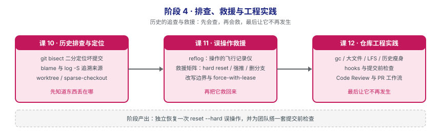

# 阶段 4：排查、救援与工程实践

> 所属课程：Git 使用 ｜ 故事章节：**历史的追查与救援** ｜ 上一阶段：[阶段 3《协作与共享》](../3-协作与共享/overview.md)
> 阶段路径图：

## 🎯 本阶段目标

- 在成百上千次提交里快速定位问题引入点，而不是逐个 checkout 去试。
- 把"误操作"从灾难降级为可恢复事件——丢了的东西几乎都还在。
- 把个人纪律升级为团队机制：用钩子和流程让问题在提交前就被拦下。

## 📍 学习重点

- **先查后救**：本阶段课序刻意安排为"课 10 排查 → 课 11 救援 → 课 12 规范"。先知道东西丢在哪、怎么找，再学怎么救，最后才是让它不再发生。
- **reflog 是最后一道防线**：只要提交曾经存在过，它就在 reflog 里。真正的丢失只发生在 `gc` 之后。
- **改写已推送历史的边界**：个人分支随便改，共享分支不能改——这条边界的代价会现场演示。
- **工程实践是防线的最后一环**：钩子与 Code Review 的价值，是让阶段 2、3 的问题根本走不到阶段 4。

## ✅ 必须掌握的知识点

| 知识点 | 所属课 | 学完应能 |
|--------|--------|----------|
| git bisect：二分定位坏提交 | 课 10 | 用 bisect 在 N 次提交中以 log₂N 步定位问题引入点 |
| git blame 与 git log -S：追溯改动来源 | 课 10 | 用 blame 查行级来源，用 `log -S` 查内容增删改历史 |
| worktree / sparse-checkout：大仓库与并行工作 | 课 10 | 用 worktree 同时检出多个分支，用 sparse-checkout 只拉子目录 |
| reflog：所有操作的飞行记录仪 | 课 11 | 用 reflog 找回"已经删掉"的提交与分支 |
| 误操作救援矩阵（reset --hard / 强推 / 删分支） | 课 11 | 针对三类典型事故给出对应的救援命令 |
| 已推送历史的改写边界与 force-with-lease | 课 11 | 说清 force push 与 force-with-lease 的差别与安全用法 |
| 仓库卫生：gc / 大文件 / LFS 与历史瘦身 | 课 12 | 判断该用 LFS 还是历史瘦身，并知道各自的代价 |
| 钩子与自动化：hooks 与提交前检查 | 课 12 | 写一个 pre-commit 钩子拦住不合格提交 |
| Code Review 与 PR 工作流最佳实践 | 课 12 | 说清一次好评审该看什么、提交 PR 前该做什么 |

## 本阶段产出

- [x] `lessons/lesson-10-历史排查与定位.md`（✅ 2026-09-09 已讲完，P0=0）
- [x] `lessons/lesson-11-误操作救援.md`（✅ 2026-09-09 已讲完，P0=0）
- [x] `lessons/lesson-12-仓库工程实践.md`（✅ 2026-09-09 已讲完，P0=0）

## 课 10 核心结论（回看用）

- **bisect 的核心价值是数量级跨越，不是小优化**：16 提交 4 步、1000 提交 10 步、100 万提交 20 步。实测 16 个提交 **4 轮**定位到第一个坏提交，与 log₂16 完全吻合。
- ⚠️ **bisect 的第一纪律：跑完必须 `git bisect reset`**（无论手动还是 `run`）。实测完整后果链：在 detached HEAD 上提交 **exit 0 成功但不属于任何分支** → `branch --contains` 显示 `(no branch, bisect started on master)` → reset 时 Git 警告"落下 1 个提交" → **reflog 里仍在**（课 11 的救援入口）。
- **bisect run 不会自动 reset**——这是官方文档都强调的点，实测确认。
- **判定脚本的退出码协议**（已联网核实官方文档）：**0 = 好**、**1–127（除 125）= 坏**、**125 = 无法判定→跳过**、**≥128 = 中止整个 bisect**。125 取这个值是因 126/127 被 POSIX shell 占用。
- ⚠️ **125 是最重要也最易错的一个**：把"编译失败"当 exit 1（坏），bisect 会**把编不过的提交当成 bug 引入点**。正确骨架是 `build || exit 125`，只有真正的测试才返回 1。
- **125 与 128 行为完全不同**（实测）：125 会**继续遍历所有提交**然后报 `We cannot bisect more!`（**exit 2**）；128 **一条就中止**。
- **skip 的代价**：实测 10 个提交里 skip 掉 2 个编不过的，bisect **定位不出唯一提交**，只给 4 个候选。总比查 10 个强，但不如唯一定位。
- **`bisect start -- <path>` 一步直达**：限定 `calc.sh` 后**首次就跳到唯一改过该文件的提交**——用领域知识砍候选的实用技巧。
- **`old`/`new` 是 `good`/`bad` 的别名**，用于找**性能退化**而非 bug（语义更贴切）。
- ⚠️ **blame 给的是"最后修改者"，不是"原创者"**。实测：全文件格式化（空格改 tab）后，不带 `-w` 会把**格式化者**当成作者；带 `-w` 才归因回真正写这个值的人。**`-w` 应该是 blame 的默认选项。**
- **`.git-blame-ignore-revs`** 是屏蔽格式化提交的正规手段（临时用 `--ignore-rev`）。**建议提交进仓库全团队共享**，GitHub 的 blame 视图也认它。
- ⚠️ **`-S` 按"出现次数"变化查找，改值（30→90）时计数不变，它完全看不见**——实测证明。改值要用 **`-G`**（按 diff 匹配）。**判据：找"加/删"用 `-S`，找"改过"用 `-G`。**
- **`-S` 默认不是正则**，要 `--pickaxe-regex`；**`-G` 天生是正则**。日常建议直接用 `-G`。
- ⚠️ **单个 `-C` 不够，必须 `-C -C`**：实测三种写法三种结果——不加 `-C` 复制者背锅、加 `-C` **仍然背锅**（只在同一次提交内找）、`-C -C` 才找到跨文件原创者，**且输出会额外显示来源文件名**（`src.py`）。
- **blame 输出里哈希前的 `^`** 表示"追溯的边界提交（根提交）"，不是"有问题的提交"。
- **worktree 的 `.git` 是 58 字节的文件**（不是目录），内容是 `gitdir: <主仓库>/.git/worktrees/<名字>`。共享对象库、引用、配置、钩子；独立的只有 HEAD、index、工作文件。
- **共享对象库的实测**：在 worktree 里提交，主仓库**立刻**能看到（`git log --all`），**不用 push / fetch**。这是它优于"再 clone 一份"的根本原因。
- ⚠️ **同分支不能被两个 worktree 同时检出**（exit 128，`already used by worktree`）；反过来**被别人检出的分支也删不掉**。二者是同一机制的两面：一个分支只有一个 HEAD。
- ⚠️ **worktree 不解决并发修改**：改同一文件照样 CONFLICT（实测 exit 1）。它解决的只是**切换成本**（不用 stash、不用重复 clone）。
- **`worktree remove` = 干净移除；手动 `rm -rf` 后记录会标 `prunable`，要 `prune` 清。**
- ⚠️ **sparse-checkout 不省磁盘**：实测工作区 5→2 个文件，但 `git ls-files` 仍有 5 个——对象一个没少。它省的是 `git status` / `checkout` 的时间。要省空间得用部分克隆（`--filter=blob:none`）或浅克隆（`--depth`）。
- **cone 模式总是保留根目录文件**（README、Makefile 等）。配置文件是可读的成对规则：`/*` + `!/*/` 一层层往下开洞——**"锥形"得名于此**。
- **cone 与非 cone 的取舍**：cone 只能按目录、性能好，写 `/*.txt` 会被拒（exit 128，`no leading slash`）；非 cone 支持 gitignore 风格但大仓库 O(N×M) 会慢。
- **版本要求**（已联网核实）：`git worktree` 在 **Git 2.5**（2015）引入；`git sparse-checkout` 命令与 cone 模式在 **Git 2.25**（2020-01）引入。

## 课 11 核心结论（回看用）

- **本课的第一句话就是结论**：只要 commit 过，它就在。**真丢的只有两种：`gc` 清过了，或者压根没提交过。**
- ⚠️ **救援的入口永远是 `git reflog`，不是瞎试**。出事之后最贵的错误是慌乱中执行下一个破坏性命令——**`git reset --hard` 尤其危险**，它自己也会写一条 reflog，把"事故前的位置"从第 1 条挤到第 2 条。
- **两套日志要分清**：HEAD 的 reflog 记"我（HEAD）去过哪"（含切分支、detached HEAD），分支的 reflog 只记"这个分支指到过哪"。**救援默认用 HEAD 的**，覆盖面最广。
- ⚠️ **分支删掉后，它自己的 reflog 也一起没了**（`.git/logs/refs/heads/<名>` 跟着删）。实测 `git reflog show feature-pay` 返回 **exit 128**——这是救援时最常见的卡点。**必须查 HEAD 的 reflog。**
- **reflog 是 `.git/logs/` 下的纯文本**，格式 `旧哈希 新哈希 操作者 <邮箱> 时间戳 时区[TAB]动作`。出大事时第一反应可以是**先把 `.git/logs` 整个目录复制走**。
- **`@{n}` 记的是"我去过哪"不是"历史有哪些提交"**：实测 `HEAD@{0}` 与 `HEAD@{2}` 是同一个哈希（中间是"切到 demo 再切回"，HEAD 转一圈回原地）。按分支历史找要用 `master@{n}`。
- ⚠️ **按时间排查必须用 `--date=iso`**：默认 reflog 不显示时间，`--date=relative` 在密集操作时全是 "0 seconds ago"（实测三条全 0 秒）。
- **reflog 是本地的，clone 不带走**：实测源仓库 8 条记录，克隆后新仓库**只有 1 条 `clone: from ...`**。推论：**救同事的提交只能去他自己的机器上找。**
- **bare 仓库默认不写 reflog**（`core.logAllRefUpdates` 未设置，实测 exit 1）——"去服务器上找找"这条路默认是堵的。
- **保留期（已联网核实官方文档）**：`gc.reflogExpire` **90 天**、`gc.reflogExpireUnreachable` **30 天**。⚠️ 你最想找回的那些（reset/amend/rebase 产生的）**恰恰是"不可达"那一类，只有 30 天**。
- **真丢的唯一场景**（实测）：`reflog expire --expire=now` + `gc --prune=now` 之后，`git cat-file -t` 返回 **exit 128**。两个动作缺一不可——**`gc` 会保护"被 reflog 引用着的对象"**。
- **`git fsck --lost-found` 是备胎不是首选**：扫大仓库慢，且只给哈希不给"这是什么操作产生的"。**顺序永远是：先 reflog，再 fsck。** `--lost-found` 会把对象引用写到 `.git/lost-found/commit/`，避免还没看就被下次 gc 清掉。
- **救援矩阵三步套路**：`reflog` 找哈希 → `git show --stat <哈希>` 确认 → 用分支或 reset 固定。**第 2 步别省。**
- **不确定就先 `git branch <名> <哈希>` 接住，别急着 `reset --hard`**：`git branch` 不移动任何已有分支，是零风险操作；`reset` 会移动当前分支还可能覆盖未提交改动。
- ⚠️ **amend 覆盖要用 `--soft` 恢复，不能用 `--hard`**：amend 时多改的内容只存在于 amend 后的那个提交里，`--hard` 会连它一起丢掉。实测 `--soft` 后 `git status --short` 显示 `M  app.txt`，改动完好保留。
- **`git branch <名字> <哈希>` 是万能句式**——"把任意一个提交变成分支"，删分支恢复、游离提交接住、fsck 找回全靠它。
- **detached HEAD 上的游离提交**（课 10 钩子闭环）：`branch --contains` 显示 `(HEAD detached from ...)` → 切回 master 后 log 里没有 → **reflog 里仍在** → `git branch keep-wip <哈希>` 接住。
- ⚠️⚠️ **`--force-with-lease` 的失效路径（本课最有价值的实测）**：第一次推被拒（`stale info`）→ `git fetch` 刷新了 `origin/master` → **第二次推送成功，同事的提交照样被冲掉**。**它防的是「我信息太旧」，不是「我不该覆盖别人」。**
- **lease 的"租约"就是本地 `origin/master` 快照**：推的时候问远端"你还是这个值吗"。版本事实（已联网核实）：**`--force-with-lease` 自 Git 1.8.5（2013-11）引入**。
- ⚠️ **锚定值（`--force-with-lease=master:<hash>`）也救不了"本来就不该推"**：实测给了正确的 ANCHOR，推送照样成功，Li Si 的提交照样被冲掉。它解决的是"意图被意外刷新"，**不是"行为不正确"**。
- **没有 remote-tracking 分支时 lease 直接拒绝**（`stale info`）——拿不到基准就宁可不放行，**这是安全的失败**。
- **改写已推送历史的边界只有一条判断标准：这个分支有没有第二个人在用。** 依据是"别人有没有基于它工作"，不是"我改得对不对"。
- **【正解一】遇到分歧：`fetch` + `rebase`，压根不用 force**（实测：rebase 后普通 push 成功，两个人的工作都在）。分歧时的正确动作是"把我的工作接到你的后面"。
- **【正解二】共享分支要撤销：`git revert`**。实测对比同样是删掉 c2 的特性：`revert` → 5 个提交、c3/c4 哈希不变、普通 push；`rebase --onto` 摘除 → 3 个提交、**c3/c4 哈希全变**（`20c4b52`→`be05e60`、`4b4fee9`→`4bd52fd`）、必须 force。
- **revert 的隐藏优势：撤销本身可被撤销**。实测"revert the revert"生成 `Reapply "c2: 加特性A"`，文件又回来了。**在共享分支上，那个"多出来的提交"不是冗余，是审计记录。**

## 课 12 核心结论（回看用）

- **本课的第一句话就是结论**：**最好的救援，是根本不需要救援。** 阶段 4 的课序是"课 10 查 → 课 11 救 → 课 12 防"。
- ⚠️ **删除 ≠ 消失**：实测删掉 1MB 大文件后 `.git` 从 **7480 → 7496 KB**（不降反增，多了一个提交对象）。历史里每个版本的完整快照都还在，实测 `git cat-file -p HEAD~1:data.bin` 能把 1048630 字节**一个不差地取回来**。
- ⚠️ **gc 只清"不可达对象"**：实测 gc 后体积 7496 → 1192 KB，但 7 个 1MB 的 blob **一个都没少**（从 HEAD 可达）。那 84% 是**打包压缩**省的，不是删除。压缩率取决于内容——本课用随机二进制（几乎不可压缩），文本大文件的收益会大得多。
- **找元凶的必备命令**（背下来）：`git rev-list --objects --all | git cat-file --batch-check='%(objecttype) %(objectsize) %(objectname) %(rest)' | awk '$1=="blob"' | sort -k2 -nr | head -10`
- **LFS 的本质是 Git 原生的 clean/smudge 过滤器**（[官方 spec 明确说明](https://github.com/git-lfs/git-lfs/blob/main/docs/spec.md)）。实测手工实现后：**1MB 文件在库里只占 132 字节指针**，格式与官方 spec 逐字节一致。
- **LFS 的体积收益（实测对比）**：提交 1MB 文件 **1200 KB → 200 KB**；再改 5 次 **7480 KB → 308 KB**。**24 倍差距，且改得越多差距越大。**
- ⚠️ **LFS 只对未来生效**：实测配上过滤器并提交后，历史里的 1MB blob 一个都没少。想清历史只能用历史改写。
- ⚠️ **LFS 的最大坑：没配客户端，克隆到手的是指针不是文件**（实测只有 132 字节，`head` 出来就是 `version https://git-lfs.github.com/spec/v1`）。**LFS 是"约定 + 外部服务"，不是 Git 自带的。**
- ⚠️ **filter-branch 跑完体积不降反升**（实测 1272 → 1320 KB）——因为 `refs/original/` 下留了完整备份。**很多教程不讲这三步清理，导致读者以为瘦身失败了。**
- **真正释放空间必须三步**（实测 1248 → **172 KB**）：删 `refs/original` → `reflog expire --expire=now --all` → `gc --prune=now`。**缺一不可。**
- ⚠️ **瘦身后合并不了**：实测 `fatal: refusing to merge unrelated histories`（**exit 128**）。因为所有哈希都变了，Git 认为是两个不相干的仓库。**加 `--allow-unrelated-histories` 强行合并会把旧历史（含大文件）拉回来，白瘦。**
- **瘦身的代价**：所有提交哈希全变（未改动的根提交除外）、所有人**删掉重新克隆**（不是 rebase）、未合并分支要手工移植、标签要一并强推。**优先级永远是 LFS（预防）> 瘦身（手术）。**
- **钩子的全部原理就一句**：**退出码 0 = 放行，非 0 = 中断。** pre-commit / commit-msg / pre-push / pre-receive 全靠这一条。
- ⚠️ **客户端钩子拦不住人**：实测一条 `--no-verify` 全部绕过（exit 0）。**客户端钩子 = 提醒自己，服务端 hook / CI / 分支保护才是真强制。**
- ⚠️⚠️ **钩子静默失效的两大成因（本课最实用的排查经验）**：① **没有执行权限**——Git 只打印一行 `hint: ... ignored because it's not set as executable`，**提交照样成功（exit 0）**；② **命令参数写错**——`git grep -n -E 'x' --cached` 报 `fatal: option '--cached' must come before non-option arguments`（exit 128），而 `if` 把它当"没找到"，**钩子静默放行**。**排查口诀：钩子没生效时，先手动跑一遍钩子里的命令看退出码。**
- ⚠️ **钩子"自咬"**：钩子文件里写着 `console.log` 字样，不加 `-- ':!.githooks'` 排除自身的话，**提交钩子时它会命中自己**，导致干净提交也被拦。
- **`.git/hooks` 不会被 clone 带走**（实测 `.git/hooks/pre-commit` 不存在，exit 2）。**团队落地方案**：把钩子放仓库内 `.githooks/` 入版本控制 + 每人执行一次 `git config core.hooksPath .githooks`（写进 README / Makefile）。
- **`init.templateDir`** 让本机所有**新**仓库自带钩子（实测 `git init` 后 `.git/hooks/pre-commit` 已在，直接拦住 exit 1）。**取舍：团队用 `core.hooksPath`（能随仓库升级），个人用 `init.templateDir`（快照式，不能升级）。**
- ⚠️ **commit-msg 必须豁免合并提交**：`[ -f .git/MERGE_HEAD ] && exit 0`。合并默认信息 `Merge branch 'feat/x'` 不符合 Conventional Commits，不豁免的话**每次 merge 都被卡住，团队很快就会有人把钩子删掉**。
- **pre-push 把人工约定变成机器强制**：实测禁止直推 master（exit 1）——回应课 11 那张"可以/不能 force 清单"。
- **Code Review 的 Git 工具箱**（实验 36）：`diff --shortstat` 看规模、`log A..B` 看提交、`blame` 追上下文（**记得加 `-w`**）、`rev-list --count` 看落后/领先、**`diff --name-only master...HEAD`（三个点）找冲突高风险区**、`shortlog -sn` 看作者分布。
- **评审的优先级**：正确性 > 设计 > 可读性 > 测试 > 风格。**只有"风格"该交给工具**，别让人干机器的活。
- **小 PR 原则**：评审质量随 PR 大小断崖式下跌。拆法：纯重构 → 加新能力（未接线）→ 接线，每步独立 review、独立回滚。

## 课 11 → 课 12 的钩子

- **本课反复出现的主题是"Git 很少真的丢东西，但你得知道去哪找"**——课 12 要把这个思路再推一步：**用钩子和规范，让问题根本走不到需要救援这一步**。
- **课 8 已埋下的伏笔**：`--force-with-lease` 防不住"脚下站人"（它只检查远端指针），本课用完整实验链坐实了这一点。**两课合起来看，结论是：靠人的纪律防不住，得靠机制**——这正是课 12 钩子与分支保护要解决的问题。
- **本课实验 33 给出的"可以/不能 force 清单"是人工约定**——课 12 已用 pre-push 钩子（实验 35，实测 exit 1 拦住直推 master）把它变成机器强制，并说明客户端钩子拦不住 `--no-verify`，真正的强制要靠服务端钩子 / CI / 分支保护。✅ 已闭环

## 课 10 → 课 11 的钩子

- **本课实验 5 埋下的伏笔**：bisect 后游离的那个提交 `3857597`，在 reflog 里好好地躺着（`HEAD@{1}`）。**课 11 就要解决"怎么把它捞回来"**——本课的"找不到"自然过渡到课 11 的"找回来"。
- **本课反复出现的"危险动作"**：detached HEAD 提交、`bisect reset` 丢弃警告、`worktree remove`——它们共同的主题是"**Git 很少真的丢东西，但你得知道去哪找**"，这正是课 11 的主线。

## 本阶段的坑（提前打个招呼）

- **bisect 需要可判定的"好坏"标准**：如果"坏"没法用命令判定，bisect 就用不起来。讲义会说明如何准备判定脚本。
- **reflog 不是永久的**：默认 90 天（ unreachable 对象 30 天）。真要长期留证据，用分支或标签。
- **历史瘦身会改写所有提交哈希**：这是破坏性操作，必须在团队协调窗口内做，且所有人重新克隆。
- **钩子不会被 clone 带走**：`.git/hooks` 不在版本控制内，讲义会给出把钩子纳入版本管理的做法。

> 返回：[课程目录](../../02-课程目录.md) ｜ [学习路径总览](../../01-学习路径总览.md)
