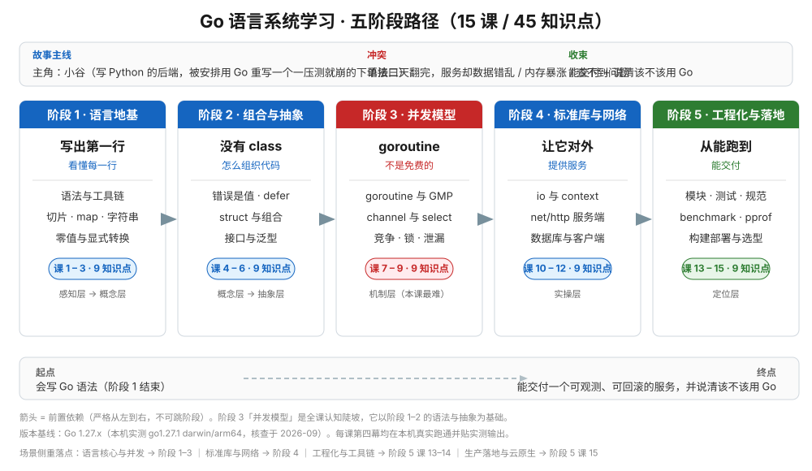

# Go 语言系统学习 · 学习路径总览

> 本文件是活文档，随学习进度动态调整。阶段依赖图统一用 SVG。

## 🎯 学习目标

- **目标类型**：三轨并重 —— 理解概念 + 动手实操 + 决策参考
- **目标说明**：能独立交付一个**带并发控制、可观测、可回滚的 Go 服务**，说清每一步"为什么这样写"，并能判断**该不该用 Go、用到哪一步**

> 四项场景侧重（用户全选）在课程中的落点：
>
> | 场景侧重 | 落点 |
> |----------|------|
> | 语言核心与并发模型 | 阶段 1（语言地基）+ 阶段 2（组合与抽象）+ 阶段 3（并发模型） |
> | 工程化与工具链 | 阶段 5 课 13（模块/测试/静态检查）+ 课 14（benchmark/pprof） |
> | 标准库与网络编程 | 阶段 4（io 与 context / net/http / database·sql·时间） |
> | 生产落地与云原生 | 阶段 5 课 15（交叉编译/容器构建/slog 可观测/优雅退出）+ 课 14（pprof 诊断） |
> | 决策参考 | 阶段 5 课 15.3（Go 的生态位与选型决策）+ 课程手册的「决策清单」 |

## 故事主线

- **主角**：**小谷** —— 一个写了几年 Python 的后端工程师，被安排把一个"一压测就崩"的下单接口用 Go 重写
- **冲突**：Go 的语法三天就能翻完，但写出来的服务**要么数据错乱（并发竞争）、要么内存一路涨（goroutine 泄漏）、要么上线后什么都查不到（没有可观测）** —— "会写 Go"和"写出能上线的 Go"之间，隔着一整个工程
- **收束**：能独立交付一个带并发控制、可观测、可回滚的 Go 服务，并说清「**该不该用 Go、用到哪一步**」

> 整个课程是这条故事线的展开，每个阶段是故事的一个"章节"，每课是章节中的一个"情节"。

## 学习路径图

> SVG 展示：5 个阶段、各阶段主题与课次范围、阶段间前置依赖箭头，以及每个阶段在故事主线中的章节定位。

## 阶段总览

### 阶段 1：语言地基（故事章节：写出第一行，看懂每一行）

- **目标**：装上环境并跑通第一个程序；说清 Go 的语法为什么"少"、这个"少"是设计还是缺失；能用基础类型、控制流、切片与 map 写出像样的逻辑
- **学习重点**：Go 的起源与设计取舍 / `go run`·`go build`·`go mod` 三件套 / 静态编译成一个二进制 / 零值哲学 / 切片是描述符而非数组 / map 并发不安全
- **必须掌握**：能说清「为什么 Go 的二进制这么大」「切片的 `append` 为什么有时会互相影响」「`v, ok := m[k]` 的 `ok` 为什么不能省」
- **对应课**：课 1 Go 是什么、环境怎么跑起来、课 2 变量类型与控制流、课 3 数组切片与 map

### 阶段 2：组合与抽象（故事章节：没有 class，怎么组织代码）

- **目标**：接受"没有继承"并用组合与接口组织代码；把错误当值处理而不是抛异常；说清接口为什么隐式实现、什么时候该上泛型
- **学习重点**：多返回值与 error 是值 / defer 的 LIFO 与求值时机 / struct 嵌入是组合不是继承 / 值接收者 vs 指针接收者 / 小接口哲学 / 类型断言与 type switch
- **必须掌握**：能说清「为什么 Go 没有 try-catch」「`nil` 的 error 返回出去为什么不是 `nil`」「接口值什么时候等于 `nil`」
- **对应课**：课 4 函数与错误处理、课 5 结构体与方法、课 6 接口与泛型

### 阶段 3：并发模型（故事章节：goroutine 不是免费的）

- **目标**：能用 goroutine 与 channel 写并发，并且**收得住** —— 知道数据竞争怎么查、goroutine 泄漏怎么发现、什么时候该用锁而不是 channel
- **学习重点**：goroutine 与 OS 线程的量级差 / GMP 直觉 / 并发 ≠ 并行 / 无缓冲与有缓冲的语义差 / select 与 `time.After` 的泄漏坑 / `-race` 检测器 / context 取消传播
- **必须掌握**：能说清「goroutine 起得容易，为什么收得难」「`time.After` 在循环里为什么会攒 Timer」「nil channel 有什么用」
- **对应课**：课 7 goroutine、课 8 channel、课 9 同步竞争与泄漏

### 阶段 4：标准库与网络编程（故事章节：让它对外提供服务）

- **目标**：用标准库写出一个对外提供 HTTP 接口、能落库、能优雅关闭的服务，并知道标准库的哪些默认值**不能直接上生产**
- **学习重点**：`io.Reader`/`io.Writer` 的组合哲学 / context 取消树 / `http.Handler` 与中间件 / `ResponseWriter` 只能写一次 Header / `http.Client` 默认没有超时 / `sql.DB` 是连接池 / `time.Time` 的单调时钟
- **必须掌握**：能说清「为什么要设超时三件套」「不关 `resp.Body` 会发生什么」「`sql.DB` 为什么不该每次请求都 Open」
- **对应课**：课 10 io 与 context、课 11 net/http 服务端、课 12 数据访问与客户端

### 阶段 5：工程化与生产落地（故事章节：从能跑到能交付）

- **目标**：会让项目可维护（模块、测试、静态检查）、会让性能可度量（benchmark、pprof）、会让服务可交付（交叉编译、容器构建、可观测与优雅退出），并能回答"该不该用 Go"
- **学习重点**：`go.mod` 与语义化版本 / 表驱动测试 / `-race` 与覆盖率 / benchmark 与 benchstat / CPU·heap·goroutine·block profile / 逃逸分析与 GC 直觉 / `slog` 结构化日志 / pprof 端点安全
- **必须掌握**：能说清「benchmark 为什么会被编译器优化掉」「pprof 端点为什么不能直接暴露」「什么时候该选 Rust / Java / Python 而不是 Go」
- **对应课**：课 13 模块测试与规范、课 14 性能与诊断、课 15 构建部署与选型决策

## 当前进度

- [x] 阶段 1：语言地基（9 / 9）
- [x] 阶段 2：组合与抽象（18 / 18）
- [x] 阶段 3：并发模型（27 / 27）
- [x] 阶段 4：标准库与网络编程（36 / 36）
- [x] 阶段 5：工程化与生产落地（45 / 45）
- [x] 结课实战项目（Phase 3）——[订单服务生产化](./projects/订单服务生产化/README.md)（2026-09-16）
- [x] 汇总手册（Phase 4）——[Go 课程手册](./final-课程手册.md)（2026-09-16）
- [ ] 实战经验 / 排障速查手册 / 场景解法库（Phase 5，三份一次生成）

## 📚 版本基线

> 时效敏感内容，核查于 2026-09。命令与语法以 **Go 1.27.x** 为准。

| 项 | 值 |
|----|-----|
| 本机 Go 版本 | **go1.27.1 darwin/arm64**（2026-09-06 由 `brew install go` 安装并实测） |
| Go 1.27 发布时间 | **2026 年 8 月**（官方 Release Notes 原话："arrives in August 2026, six months after Go 1.26"） |
| Go 1.27 主要变化 | 泛型方法（method 可自带类型参数）/ `encoding/json/v2` 与 `jsontext` 新包 / `uuid` 包 / 小对象分配提速约 30% / `goroutineleak` profile 转正 / 多个 GODEBUG 永久移除 |
| 平台要求 | Go 1.27 **要求 macOS 13 Ventura 或更高**（本机 macOS 26.6.2，满足） |
| GOPATH / GOMODCACHE | `/Users/wuyongping/go` / `/Users/wuyongping/go/pkg/mod` |
| 默认 GOPROXY | `https://proxy.golang.org,direct` |
| 语言里程碑 | 泛型 **Go 1.18** 引入；循环变量语义 **Go 1.22** 改为每轮新变量；结构化日志 `log/slog` **Go 1.21** 引入 |

> 详细来源与置信度见 [`00-学习档案.md`](00-学习档案.md) 的「事实核查记录」表。
