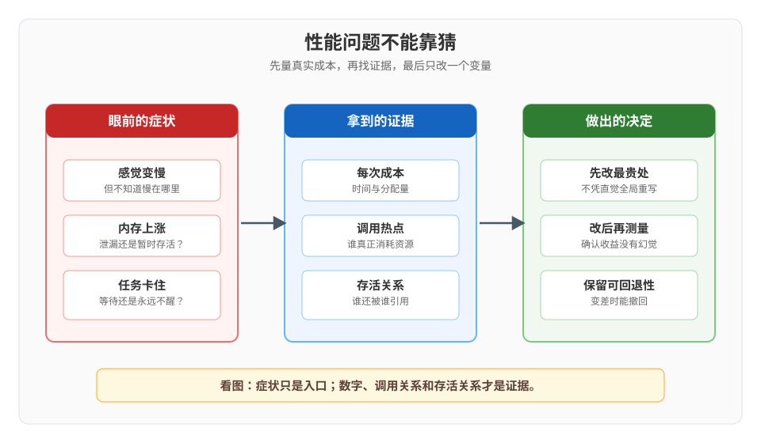

# Go 课程手册

> 课程制总览与结课索引  
> 版本基线：Go 1.27.1 / darwin/arm64 / macOS（版本事实核查于 2026-09）  
> 完成状态：5 阶段、15 课、45 个知识点、结课综合实战项目均已完成  
> 本手册定位：帮助你从任意知识点重新进入课程，并把“学过”收束成“能做工程决策”。

## 一、先知道怎么用这本手册

这不是把 15 课全文再复制一遍，而是一张可回到原课正文的地图。每课保留四个入口：

1. 一句话本质：先恢复概念骨架。
2. 处境对照：知道它解决什么工程摩擦。
3. 一图速览：用一条关系链恢复结构。
4. 知识点地图：精确回到三个知识点、原课实操和官方文档。

原课正文中的 📖 文档核对 与 📚 官方文档 两个收尾段仍以各自课文为准；本手册逐课保留对应的官方入口，便于先快速定位、再回到原文核对完整证据。版本、API 变更和实测数字以课程档案中的核查记录及项目 ALL_OUTPUT.txt 为准。

遇到问题时，建议按“症状 → 证据 → 原理 → 最小修复 → 回归验证”走。不要只背命令；Go 工程的稳定性来自契约、边界、可观测证据和可重复交付。

课程主入口：

- [学习路径总览](01-学习路径总览.md)
- [课程目录](02-课程目录.md)
- [学习档案](00-学习档案.md)
- [评审清单](00-评审清单.md)
- [结课综合实战：订单服务生产化](projects/订单服务生产化/README.md)

## 二、课程目标与故事主线

### 学完之后应该能做什么

| 能力 | 可验证结果 |
|---|---|
| 读懂 Go 语言地基 | 能解释零值、切片共享、接口 nil、错误包装和方法集，而不是只记语法 |
| 设计组合与抽象 | 能在 struct、接口、泛型之间做边界清楚的选择 |
| 写出可控并发 | 能用 channel、context、WaitGroup、锁和 race detector 处理生命周期与共享状态 |
| 使用标准库构建服务 | 能组合 io、context、net/http、database/sql、http.Client 与 time |
| 把程序交付出去 | 能测试、静态检查、诊断、跨平台构建、容器化，并为优雅退出和回滚留证据 |
| 做技术选型 | 能根据边界、团队、部署和运维成本判断 Go 是否适合，而不是把语言当成信仰 |

### 故事主线：从“能跑”到“能上线”

一段 Go 源文件 → go 命令与编译器 → 机器码加 runtime → 数据结构与抽象 → 并发与生命周期 → HTTP、数据库和外部客户端 → 测试、检查与诊断 → 跨平台构建与部署 → 订单服务生产化。

每个阶段都把“边界”再推进一步：

| 阶段 | 故事章节 | 核心问题 | 阶段状态 |
|---|---|---|---|
| 1 · 语言地基 | 先让程序站稳 | Go 的编译模型、语法、数据与控制流如何工作？ | ✅ 完成 |
| 2 · 组合与抽象 | 把代码组织起来 | 如何用函数、结构体、方法、接口和泛型表达变化？ | ✅ 完成 |
| 3 · 并发模型 | 让多个工作单元合作 | 如何避免竞态、泄漏、死锁和失控的后台任务？ | ✅ 完成 |
| 4 · 标准库与网络编程 | 接上真实世界 | 如何读写数据、处理请求、访问数据库并控制时间？ | ✅ 完成 |
| 5 · 工程化与生产落地 | 让它可验证、可诊断、可交付 | 如何把代码变成可测试、可观察、可部署的服务？ | ✅ 完成 |

## 三、五个贯穿全课的判断方法

| 判断方法 | 关键问题 | 贯穿案例 |
|---|---|---|
| 先辨值还是引用 | 复制后是独立值，还是共享底层状态？ | array / slice / map / pointer |
| 先辨契约还是实现 | 调用方真正需要哪些能力？ | interface、io.Reader、http.Handler |
| 先辨所有权 | 谁创建、谁关闭、谁取消、谁发送 close？ | defer、channel、rows、Body |
| 先辨生命周期 | 任务何时开始、何时结束、谁负责收尾？ | goroutine、context、Timer、Shutdown |
| 先留证据再优化 | 现象是什么，测量如何重复，修复如何证明？ | race、benchmark、pprof、构建验收 |

---

## 阶段一：语言地基

阶段概览：[阶段一概览](stages/1-语言地基/overview.md) · 阶段图：[stage-01-language-foundation-path.svg](stages/1-语言地基/assets/stage-01-language-foundation-path.svg)

这一阶段解决“我写的 Go 到底怎样变成程序”。先建立编译、模块和 runtime 的全景，再进入值、控制流、数组、切片、map 与字符串。

### 课 1《Go 是什么，环境怎么跑起来》

**一句话本质**：Go 是面向多核时代大型服务端程序的编译型语言；它用简洁语法、并发模型、垃圾回收、快速工具链和 Go 1 兼容性承诺，换取团队协作与长期维护的确定性。

**处境对照**：手工拼编译参数、依赖路径和跨平台脚本时，问题常常不在业务代码，而在“程序如何被构建”。Go 把编译、依赖、测试和格式化收进 go 命令，把目录与 go.mod 变成可复制的边界。

**一图速览**：源文件 → go 命令 → 编译器 → 机器码加 runtime → 可执行文件；同一个 go 命令还负责模块、测试和格式化。

**知识点地图**

| 知识点 | 记住什么 | 原课入口 |
|---|---|---|
| Go 的起源、定位与兼容性 | 为服务端、多核和团队协作而生；Go 1 兼容性让学习投入可持续 | [课 1 正文](stages/1-语言地基/lessons/lesson-01-Go是什么、环境怎么跑起来.md) |
| 工作区、模块与 go 命令 | 一个目录加 go.mod 就能形成模块；go 命令统一常见工程动作 | [课 1 正文](stages/1-语言地基/lessons/lesson-01-Go是什么、环境怎么跑起来.md) |
| 编译模型、runtime 与跨平台 | 提前编译机器码，但二进制包含 runtime；GOOS/GOARCH 可交叉构建 | [课 1 正文](stages/1-语言地基/lessons/lesson-01-Go是什么、环境怎么跑起来.md) |

实操回看：[编译模型与工作区图](stages/1-语言地基/assets/compile-model-and-workspace.svg)；原课含版本检查、最小模块、跨平台构建和二进制体积对照。

常见误区：把 Go 当成“没有 runtime 的纯静态二进制”；把 GOPATH 当成模块时代的项目必须位置；把编译失败的 unused 当成警告。

官方文档：[Go FAQ：起源](https://go.dev/doc/faq#Origins) · [Go 1 兼容性](https://go.dev/doc/go1compat) · [Getting started](https://go.dev/doc/tutorial/getting-started) · [go 命令](https://go.dev/cmd/go/) · [runtime FAQ](https://go.dev/doc/faq#runtime) · [链接器](https://go.dev/cmd/link/) · [环境变量](https://go.dev/cmd/go/#hdr-Environment_variables)

### 课 2《变量、类型与控制流》

**一句话本质**：Go 用零值、显式类型转换和少数几种控制流，把“未初始化”和“隐式魔法”变成可读、可检查的代码。

**处境对照**：动态语言里一个变量可能在运行中变成任何东西；Go 在编译期固定类型，同时用零值让声明后的变量立即可用。代价是类型转换、错误分支和边界要明确写出。

**一图速览**：声明 → 类型推断或显式类型 → 零值或初值 → if / for / switch → range 遍历复合值。

**知识点地图**

| 知识点 | 记住什么 | 原课入口 |
|---|---|---|
| 变量、零值、常量与 iota | var / := 的作用域不同；零值是类型的一部分；iota 是常量块行计数器 | [课 2 正文](stages/1-语言地基/lessons/lesson-02-变量、类型与控制流.md) |
| 基础类型与转换 | int 宽度随平台；byte 是 uint8 别名、rune 是 int32 别名；跨数值类型要显式转换 | [课 2 正文](stages/1-语言地基/lessons/lesson-02-变量、类型与控制流.md) |
| if、for、switch 与 range | if 可带 init；for 覆盖多种循环；switch 默认 break；range 的下标和元素要看类型 | [课 2 正文](stages/1-语言地基/lessons/lesson-02-变量、类型与控制流.md) |

实操回看：变量零值、枚举、UTF-8 字节与 rune、三种 for、switch fallthrough 和 range 的对照示例。

常见误区：把 int 当成永远 64 位；把字符串下标当成字符下标；忘记用 _ 丢弃 range 返回值；误以为 switch 必须手写 break。

官方文档：[变量声明](https://go.dev/ref/spec#Variable_declarations) · [常量声明](https://go.dev/ref/spec#Constant_declarations) · [零值](https://go.dev/ref/spec#The_zero_value) · [数值类型](https://go.dev/ref/spec#Numeric_types) · [字符串类型](https://go.dev/ref/spec#String_types) · [转换](https://go.dev/ref/spec#Conversions) · [for](https://go.dev/ref/spec#For_statements) · [if](https://go.dev/ref/spec#If_statements) · [switch](https://go.dev/ref/spec#Switch_statements) · [range](https://go.dev/ref/spec#Range_clause)

### 课 3《数组、切片、map 与字符串》

**一句话本质**：数组是值，切片是共享底层数组的描述符，map 是哈希表，string 是只读字节序列；性能和正确性都取决于你是否看清“值、底层存储和编码”的边界。

**处境对照**：复制一个看似很小的 slice，可能仍然让两个调用方改同一块内存；一个 map 查询返回零值，可能代表“键不存在”，也可能代表“键存在且值就是零”。

**一图速览**：array 是值复制；slice 是指针加 len 加 cap；map 用键查找加 comma-ok；string 是只读 bytes，range 按 rune 解码。

**知识点地图**

| 知识点 | 记住什么 | 原课入口 |
|---|---|---|
| array 与 slice | slice 复制便宜但共享底层；append 可能覆盖邻居；必要时用三下标或 copy 隔离 | [课 3 正文](stages/1-语言地基/lessons/lesson-03-数组、切片与map.md) |
| map | 查找用 v, ok 区分不存在；nil map 能读不能写；遍历顺序不应依赖；并发写会直接崩 | [课 3 正文](stages/1-语言地基/lessons/lesson-03-数组、切片与map.md) |
| strings、rune 与 strconv | len 是字节数；range 的 i 是字节下标；按字符截断先转 []rune；转换要检查 error | [课 3 正文](stages/1-语言地基/lessons/lesson-03-数组、切片与map.md) |

原课实测重点：大规模预分配在 N ≥ 10 万时明显受益，小切片不必为“理论优化”增加复杂度。

常见误区：把 slice 当独立数组；直接切字符串截断中文；用 fmt 打印结果推断 map 遍历有序；把 map 的并发写当成可 recover 的普通 panic。

官方文档：[Slice 类型](https://go.dev/ref/spec#Slice_types) · [Slice 表达式](https://go.dev/ref/spec#Slice_expressions) · [append 与 copy](https://go.dev/ref/spec#Appending_and_copying_slices) · [Go Slices 博客](https://go.dev/blog/slices-intro) · [Map 类型](https://go.dev/ref/spec#Map_types) · [Map FAQ](https://go.dev/doc/faq#atomic_maps) · [Map 博客](https://go.dev/blog/maps) · [strings](https://pkg.go.dev/strings) · [strconv](https://pkg.go.dev/strconv) · [utf8](https://pkg.go.dev/unicode/utf8)

---

## 阶段二：组合与抽象

阶段概览：[阶段二概览](stages/2-组合与抽象/overview.md) · 阶段图：[stage-02-composition-abstraction-path.svg](stages/2-组合与抽象/assets/stage-02-composition-abstraction-path.svg)

这一阶段把“语法能写”推进到“边界能设计”：函数和错误先建立可组合的行为，struct、方法、包可见性负责组织代码，接口和泛型负责控制变化。

### 课 4《函数、错误与 defer》

**一句话本质**：Go 把错误当作普通返回值，把资源收尾交给 defer，再用小函数、闭包和 %w 组成可读、可追踪的控制流。

**处境对照**：异常机制会把控制流藏在调用栈里；Go 要求你显式接住 error。显式不是啰嗦的终点，而是让失败路径能被测试、包装、分类和观测。

**一图速览**：函数返回结果和 error → 显式判断 → %w 加上下文 → errors.Is / errors.As 分类；defer 在函数返回时按 LIFO 收尾。

**知识点地图**

| 知识点 | 记住什么 | 原课入口 |
|---|---|---|
| 函数、变参、闭包与传参 | 多返回值承载结果和错误；参数值传递；slice/map 副本仍可能共享底层 | [课 4 正文](stages/2-组合与抽象/lessons/lesson-04-函数与错误处理.md) |
| error、包装与 panic | error 是接口；%w 保留链；用 Is / As 分类；panic 只用于无法继续的程序状态 | [课 4 正文](stages/2-组合与抽象/lessons/lesson-04-函数与错误处理.md) |
| defer | LIFO；参数在 defer 行求值；循环里会累积；os.Exit 不执行 defer | [课 4 正文](stages/2-组合与抽象/lessons/lesson-04-函数与错误处理.md) |

常见误区：用 error 文本比较代替 errors.Is；为了省一行把错误吞掉；在循环里 defer 打开大量文件；把 recover 当作常规异常处理。

官方文档：[函数声明](https://go.dev/ref/spec#Function_declarations) · [函数类型](https://go.dev/ref/spec#Function_types) · [errors 包](https://pkg.go.dev/errors) · [Go 1.13 errors](https://go.dev/blog/go1.13-errors) · [异常 FAQ](https://go.dev/doc/faq#exceptions) · [defer](https://go.dev/ref/spec#Defer_statements) · [defer、panic、recover](https://go.dev/blog/defer-panic-and-recover)

### 课 5《结构体、方法与包》

**一句话本质**：struct 组合数据，方法绑定行为，包决定边界；首字母大小写和 internal/ 是编译器参与执行的 API 设计。

**处境对照**：继承体系把复用和多态绑在一起；Go 选择组合、方法和包边界，让“我需要什么能力”与“对象属于哪棵继承树”脱钩。

**一图速览**：struct 数据 → 方法 → 值接收者或指针接收者 → 方法集 → 包边界与导出 → internal 编译期限制。

**知识点地图**

| 知识点 | 记住什么 | 原课入口 |
|---|---|---|
| struct、嵌入与 tag | struct 是值类型；嵌入是组合；tag 是元数据；不导出的字段不会被 JSON 导出 | [课 5 正文](stages/2-组合与抽象/lessons/lesson-05-结构体与方法.md) |
| 方法与接收者 | 值接收者改副本；指针接收者改原值；*T 方法集包含 T 的，反向不成立 | [课 5 正文](stages/2-组合与抽象/lessons/lesson-05-结构体与方法.md) |
| 导出、包、初始化与 internal | 大写导出；初始化按依赖包、包变量、init、main；internal 由编译器限制导入范围 | [课 5 正文](stages/2-组合与抽象/lessons/lesson-05-结构体与方法.md) |

版本提示：Go 1.27 起提升字段可直接作为复合字面量 key；写新代码时仍应优先保持结构清晰、避免借嵌入制造隐式 API。

常见误区：把嵌入当继承；同一类型混用值接收者和指针接收者却不看方法集；认为 tag 能让未导出字段出现在 JSON 中。

官方文档：[Struct 类型](https://go.dev/ref/spec#Struct_types) · [复合字面量](https://go.dev/ref/spec#Composite_literals) · [方法声明](https://go.dev/ref/spec#Method_declarations) · [方法集](https://go.dev/ref/spec#Method_sets) · [Go 1.27](https://go.dev/doc/go1.27) · [encoding/json Marshal](https://pkg.go.dev/encoding/json#Marshal) · [internal 包](https://go.dev/doc/go1.4#internalpackages)

### 课 6《接口、类型断言与泛型》

**一句话本质**：接口按行为解耦，类型断言处理确实需要知道的具体类型，泛型处理“算法相同但类型不同”；三者解决的是不同层面的变化。

**处境对照**：为了复用一段代码，既可以复制、强转、反射，也可以引入接口或泛型。正确选择取决于调用者要的是行为契约、具体分支，还是编译期类型参数。

**一图速览**：只需要行为用 interface；需要具体类型分支用 comma-ok 或 type switch；算法相同且类型不同用泛型加约束；否则保持具体类型。

**知识点地图**

| 知识点 | 记住什么 | 原课入口 |
|---|---|---|
| 接口与接口值 | 方法签名自动实现；接口值是动态类型和动态值；具体 nil 指针装进接口后接口本身不一定 nil | [课 6 正文](stages/2-组合与抽象/lessons/lesson-06-接口与泛型.md) |
| 类型断言与 type switch | 优先 comma-ok；无 ok 失败会 panic；type switch 适合多分支类型处理 | [课 6 正文](stages/2-组合与抽象/lessons/lesson-06-接口与泛型.md) |
| 泛型与约束 | 类型也能做参数；any、comparable、cmp.Ordered 和自定义约束收紧可用操作 | [课 6 正文](stages/2-组合与抽象/lessons/lesson-06-接口与泛型.md) |

常见误区：为了“未来可能复用”提前泛型化；只是调用方法却做类型断言；把接口 nil 与动态值 nil 混为一谈；用空接口逃避设计契约。

官方文档：[Interface 类型](https://go.dev/ref/spec#Interface_types) · [类型断言](https://go.dev/ref/spec#Type_assertions) · [Type switch](https://go.dev/ref/spec#Type_switches) · [Go 1.18](https://go.dev/doc/go1.18) · [泛型简介](https://go.dev/blog/intro-generics) · [何时用泛型](https://go.dev/blog/when-generics) · [cmp](https://pkg.go.dev/cmp)

---

## 阶段三：并发模型

阶段概览：[阶段三概览](stages/3-并发模型/overview.md) · 阶段图：[stage-03-concurrency-model-path.svg](stages/3-并发模型/assets/stage-03-concurrency-model-path.svg)

这一阶段的主线不是“开更多 goroutine”，而是管理并发工作单元的所有权、通信、共享状态、取消和退出。

### 课 7《goroutine、WaitGroup 与并行》

**一句话本质**：goroutine 是由 Go runtime 调度的轻量工作单元；它便宜在创建和栈空间，昂贵在你必须明确等待、取消和回收。

**处境对照**：启动 goroutine 只有一个关键字，却没有句柄、没有自动回收站。main 返回、进程退出；任务卡住、泄漏；任务没等完、数据就被提前使用。

**一图速览**：主 goroutine → 启动工作单元 → 工作与返回结果 → ctx 取消或自然结束 → WaitGroup 等齐 → 主进程退出。

**知识点地图**

| 知识点 | 记住什么 | 原课入口 |
|---|---|---|
| goroutine 与 runtime | 栈很小、可复用到少量 OS 线程；轻量不等于无需管理 | [课 7 正文](stages/3-并发模型/lessons/lesson-07-goroutine廉价的并发单位.md) |
| WaitGroup 与生命周期 | go 出去没有句柄；用 wg.Go / Add-Done-Wait 或 channel 组织收尾；main 一走全剧终 | [课 7 正文](stages/3-并发模型/lessons/lesson-07-goroutine廉价的并发单位.md) |
| 并发与并行 | 并发是拆活的结构，并行是多核同时执行的结果；还受 GOMAXPROCS 与等待影响 | [课 7 正文](stages/3-并发模型/lessons/lesson-07-goroutine廉价的并发单位.md) |

常见误区：用 sleep 等待 goroutine；复制 WaitGroup；把 goroutine 数量当吞吐量；期待获得 goroutine ID 进行业务管理。

官方文档：[goroutine FAQ](https://go.dev/doc/faq#goroutines) · [无 goroutine ID FAQ](https://go.dev/doc/faq#no_goroutine_id) · [runtime.NumGoroutine](https://pkg.go.dev/runtime#NumGoroutine) · [sync.WaitGroup](https://pkg.go.dev/sync#WaitGroup) · [loopvar](https://go.dev/blog/loopvar-preview) · [GOMAXPROCS](https://pkg.go.dev/runtime#GOMAXPROCS)

### 课 8《channel、select 与取消》

**一句话本质**：channel 负责安全交接，select 负责等待多个事件，context 负责把取消和 deadline 向下传播；三者合起来才是可收尾的并发管道。

**处境对照**：共享变量让每个线程都能碰同一块状态；channel 把“交出去就别再碰”写进结构。代价是必须约定谁发送、谁关闭、谁负责处理取消。

**一图速览**：生产者 → channel → 消费者；ctx.Done、结果、超时共同进入 select；最后一个发送方负责 close。

**知识点地图**

| 知识点 | 记住什么 | 原课入口 |
|---|---|---|
| 无缓冲、有缓冲与 close | 无缓冲是当面交接；有缓冲是传送带；close 表示不再新增，不是清空 | [课 8 正文](stages/3-并发模型/lessons/lesson-08-channel用通信共享内存.md) |
| select、超时与定时器 | select 同时等待事件；default 不等待；定时器超时要可取消，循环里不要反复 time.After | [课 8 正文](stages/3-并发模型/lessons/lesson-08-channel用通信共享内存.md) |
| 单向 channel 与关闭责任 | chan<- 只发、<-chan 只收；发送方关闭；多发送方要等齐再关 | [课 8 正文](stages/3-并发模型/lessons/lesson-08-channel用通信共享内存.md) |

常见误区：接收方关闭 channel；多个发送方直接抢着 close；用无缓冲 channel 假设“异步”；只监听结果不监听 ctx.Done。

官方文档：[Channel 类型](https://go.dev/ref/spec#Channel_types) · [close](https://go.dev/ref/spec#Close) · [select](https://go.dev/ref/spec#Select_statements) · [Share by communicating](https://go.dev/blog/codelab-share) · [Pipelines](https://go.dev/blog/pipelines) · [Go 1.23](https://go.dev/doc/go1.23)

### 课 9《锁、竞态与 goroutine 泄漏》

**一句话本质**：锁保护的是一段不可分割的逻辑，race detector 识别的是缺少 happens-before 的共享内存访问，而泄漏是永远无法解除的阻塞；三者都要求你先定义边界。

**处境对照**：程序“通常没事”不代表并发正确。竞态可能只在压力、调度或特定机器出现；泄漏可能暂时没有报警，却逐步吞掉内存和调度资源。

**一图速览**：共享状态 → 先判断能否交接所有权 → channel 或锁 / atomic → -race 验证 → 继续检查 ctx 与关闭路径。

**知识点地图**

| 知识点 | 记住什么 | 原课入口 |
|---|---|---|
| Mutex、RWMutex 与临界区 | 锁不能复制、不可重入；defer 解锁；先缩小临界区、降低争用，再谈 RWMutex | [课 9 正文](stages/3-并发模型/lessons/lesson-09-同步、竞争与泄漏.md) |
| 竞态与 race detector | 两个 goroutine 访问同一内存、至少一个写、没有 happens-before；测试应开 -race，生产通常不开 | [课 9 正文](stages/3-并发模型/lessons/lesson-09-同步、竞争与泄漏.md) |
| context 与 goroutine 泄漏 | 取消靠 context 传播；每个 cancel 都要调用；goroutineleak 负责识别真实泄漏，不替代生命周期设计 | [课 9 正文](stages/3-并发模型/lessons/lesson-09-同步、竞争与泄漏.md) |

常见误区：给单个变量上锁却没保护读改写逻辑；用 RWMutex 解决所有性能问题；把 race detector 当生产监控；用 Count 为 0 证明没有泄漏。

官方文档：[sync](https://pkg.go.dev/sync) · [Mutex](https://pkg.go.dev/sync#Mutex) · [RWMutex](https://pkg.go.dev/sync#RWMutex) · [atomic](https://pkg.go.dev/sync/atomic) · [Go 内存模型](https://go.dev/ref/mem) · [Race detector](https://go.dev/doc/articles/race_detector) · [race 编译](https://pkg.go.dev/cmd/go#hdr-Compile_packages_and_dependencies_with_race_detector) · [runtime/pprof](https://pkg.go.dev/runtime/pprof) · [context](https://pkg.go.dev/context) · [goroutine leak profiles](https://go.dev/blog/goroutine-leak-profiles)

---

## 阶段四：标准库与网络编程

阶段概览：[阶段四概览](stages/4-标准库与网络编程/overview.md) · 阶段图：[stage-04-stdlib-networking-path.svg](stages/4-标准库与网络编程/assets/stage-04-stdlib-networking-path.svg)

这一阶段让代码接上文件、流、HTTP、数据库、外部服务和时间。所有知识点都围绕一个问题：外部世界会慢、会错、会取消，也会留下需要关闭的资源。

### 课 10《io、context 与文件资源》

**一句话本质**：io 用极小接口组合出整个 I/O 生态，context 用取消树控制外部操作，文件与临时资源则要求创建者明确安排 Close、Remove 和失败路径。

**处境对照**：文件、网络和数据库都是“一次性流或有限资源”。读到 n 个字节时即使同时有 error，也不能丢掉这 n 个字节；一个请求结束时，后台任务也不能继续抱着请求资源不放。

**一图速览**：Reader → bufio 或 decoder → 业务处理 → Writer；context 父节点向下发 deadline 和 Done；业务结束后 Close 或 Remove。

**知识点地图**

| 知识点 | 记住什么 | 原课入口 |
|---|---|---|
| io.Reader、Writer 与 Copy | n > 0 时先处理数据再看 err；io.Copy 不负责关闭两端；目标出错会停止 | [课 10 正文](stages/4-标准库与网络编程/lessons/lesson-10-io与context.md) |
| context 取消、deadline 与 value | 取消沿树向下；子 deadline 取更早者；Done 关闭是广播；WithValue 是链表，key 用私有类型 | [课 10 正文](stages/4-标准库与网络编程/lessons/lesson-10-io与context.md) |
| 文件、临时资源与 embed | 创建者负责关闭和清理；embed 把静态文件编进二进制；ioutil 已由 io/os 等 API 替代 | [课 10 正文](stages/4-标准库与网络编程/lessons/lesson-10-io与context.md) |

常见误区：只看 err 不处理 n；把 context 放进 struct 长期保存；忘记 defer cancel；把 ioutil 当成新 API；把 Close 错误完全忽略在关键写入路径。

官方文档：[io](https://pkg.go.dev/io) · [io.Reader](https://pkg.go.dev/io#Reader) · [io.Copy](https://pkg.go.dev/io#Copy) · [bufio](https://pkg.go.dev/bufio) · [context](https://pkg.go.dev/context) · [WithValue](https://pkg.go.dev/context#WithValue) · [Cause](https://pkg.go.dev/context#Cause) · [Context 博客](https://go.dev/blog/context) · [Go 1.7](https://go.dev/doc/go1.7)

### 课 11《HTTP 服务端》

**一句话本质**：ServeHTTP 定义契约，HandlerFunc 做函数适配，ServeMux 做分发，中间件串起顺序；生产服务还必须有超时、请求限制、可取消和优雅退出。

**处境对照**：ListenAndServe 能让端口打开，但“端口打开”不等于“服务可以上线”。慢客户端、过大请求、下游超时、发布断连和错误响应头顺序，都会把一个能跑的 demo 变成线上事故。

**一图速览**：请求 → Server 超时 → middleware → ServeMux → handler → header → status → body；signal → Shutdown → 停止接收并等待收尾。

**知识点地图**

| 知识点 | 记住什么 | 原课入口 |
|---|---|---|
| Handler、HandlerFunc、ServeMux 与中间件 | 一个方法定契约，一个函数做适配，一个 mux 管分发，一串 handler 排顺序 | [课 11 正文](stages/4-标准库与网络编程/lessons/lesson-11-nethttp服务端.md) |
| Request、Response、JSON 与 context | Body 只能读一遍；请求 context 可取消；响应先头、再码、后体 | [课 11 正文](stages/4-标准库与网络编程/lessons/lesson-11-nethttp服务端.md) |
| Server 超时与优雅退出 | ReadHeaderTimeout、ReadTimeout、WriteTimeout、IdleTimeout 与 Shutdown 共同形成上线边界；永远显式使用自己的 mux | [课 11 正文](stages/4-标准库与网络编程/lessons/lesson-11-nethttp服务端.md) |

常见误区：把 http.DefaultServeMux 当自己的路由表；写过 body 后再改状态码；不限制 JSON body；用 log.Fatal 让 defer 和 Shutdown 路径失效；把 Shutdown timeout 设成无限。

官方文档：[net/http](https://pkg.go.dev/net/http) · [Go 1.22 路由](https://go.dev/doc/go1.22) · [路由变更 issue](https://go.dev/issue/61410) · [Request](https://pkg.go.dev/net/http#Request) · [encoding/json](https://pkg.go.dev/encoding/json) · [Server](https://pkg.go.dev/net/http#Server) · [MaxBytesReader](https://pkg.go.dev/net/http#MaxBytesReader) · [NotifyContext](https://pkg.go.dev/os/signal#NotifyContext)

### 课 12《数据访问与客户端》

**一句话本质**：sql.DB 和 http.Client 都是进程级资源池句柄；它们要复用、要设边界、要关闭借出的资源、要把请求 context 传到底层，还要谨慎重试。

**处境对照**：数据库连接和 HTTP 连接都不是“用一次就忘”的对象。连接池参数、响应体、rows、事务、deadline 和重试策略共同决定服务是否会在压力或下游故障时自我放大。

**一图速览**：HTTP 请求 context → sql.DB 或 http.Client → 连接池 → 数据库或下游服务 → rows 或 response body → Close；Timer 提供 deadline 与 retry backoff。

**知识点地图**

| 知识点 | 记住什么 | 原课入口 |
|---|---|---|
| database/sql | DB 是进程级连接池；Open 不代表已连接；rows 必须关闭；查询带 ctx；事务每条路径都 Commit 或 Rollback；SQL 用占位符 | [课 12 正文](stages/4-标准库与网络编程/lessons/lesson-12-数据访问与客户端.md) |
| http.Client、Transport 与重试 | Client 要复用且显式超时；resp.Body 必关，必要时读完；只对幂等请求重试，并同时具备上限、退避抖动和 ctx 检查 | [课 12 正文](stages/4-标准库与网络编程/lessons/lesson-12-数据访问与客户端.md) |
| time.Time、Timer、Ticker 与布局 | time.Time 同时含墙钟和单调读；格式化、序列化等会丢单调读；Timer/Ticker 按生命周期选择；布局用参考时刻常量 | [课 12 正文](stages/4-标准库与网络编程/lessons/lesson-12-数据访问与客户端.md) |

常见误区：每次请求都 sql.Open 或 new http.Client；把 rows.Close 和 resp.Body.Close 忘在成功路径；无脑重试 POST；循环里 time.After；把字符串时区布局当成常识拼写。

官方文档：[database/sql](https://pkg.go.dev/database/sql) · [net/http](https://pkg.go.dev/net/http) · [http.Client](https://pkg.go.dev/net/http#Client) · [Transport](https://pkg.go.dev/net/http#Transport) · [httptrace](https://pkg.go.dev/net/http/httptrace) · [time](https://pkg.go.dev/time) · [Timer](https://pkg.go.dev/time#Timer) · [Ticker](https://pkg.go.dev/time#Ticker) · [ParseInLocation](https://pkg.go.dev/time#ParseInLocation)

---

## 阶段五：工程化与生产落地

阶段概览：[阶段五概览](stages/5-工程化与生产落地/overview.md) · 阶段图：[stage-05-engineering-production-path.svg](stages/5-工程化与生产落地/assets/stage-05-engineering-production-path.svg)

这一阶段回答“代码如何成为可信交付物”。模块与依赖让工程可复现，测试与静态检查让行为可验证，性能诊断让优化有证据，构建部署让运行边界可控。

### 课 13《模块、测试与规范》

**一句话本质**：go.mod 记录模块身份与依赖要求，测试把行为和边界变成可重复证据，gofmt、go vet 与统一 lint 把低级问题尽量提前到提交前。

**处境对照**：本机能编译不代表别人能复现；测试通过不代表边界完整；格式整齐也不代表逻辑正确。工程规范的价值是把不同人的隐性习惯变成自动化门槛。

**知识点地图**

| 知识点 | 记住什么 | 原课入口 |
|---|---|---|
| 模块与依赖 | go.mod 负责身份和要求；go.sum 提供校验；vendor 是复制；go.work 适合本地多模块联调，不是生产依赖方案 | [课 13 正文](stages/5-工程化与生产落地/lessons/lesson-13-模块、测试与规范.md) |
| 测试 | 测行为、边界和失败路径；table-driven 与 subtests 提升覆盖和定位；-race、coverage 服务于证据而非数字竞赛 | [课 13 正文](stages/5-工程化与生产落地/lessons/lesson-13-模块、测试与规范.md) |
| 静态检查与规范 | gofmt 管形状，go vet 抓可疑构造，golangci-lint 统一多项检查；它们不能替代业务测试 | [课 13 正文](stages/5-工程化与生产落地/lessons/lesson-13-模块、测试与规范.md) |

常见误区：把 go.work 提交成生产依赖真相；只测 happy path；只看 coverage 百分比；把 lint 全绿当作业务正确；手工格式化代替 gofmt。

官方文档：[Go Modules Reference](https://go.dev/ref/mod) · [go.mod reference](https://go.dev/doc/modules/gomod-ref) · [依赖管理](https://go.dev/doc/modules/managing-dependencies) · [Workspaces](https://go.dev/doc/tutorial/workspaces) · [添加测试](https://go.dev/doc/tutorial/add-a-test) · [testing](https://pkg.go.dev/testing) · [httptest](https://pkg.go.dev/net/http/httptest) · [go vet](https://pkg.go.dev/cmd/vet) · [Code Review Comments](https://go.dev/wiki/CodeReviewComments) · [Go doc comments](https://go.dev/doc/comment) · [golangci-lint quick start](https://golangci-lint.run/docs/welcome/quick-start/)

### 课 14《性能与诊断》

**一句话本质**：benchmark 告诉你可重复的成本，pprof 告诉你成本集中在哪里，escape analysis 解释分配可能性；先建立证据，再选择优化动作。

**处境对照**：“感觉这个写法更快”无法解释回归；CPU 热点不一定是分配热点；堆里留下的对象不等于所有曾经分配过的对象；goroutine 数量增长也不自动等于泄漏。

**知识点地图**

| 知识点 | 记住什么 | 原课入口 |
|---|---|---|
| Benchmark 与基准比较 | b.N 是 testing 调整的实验规模；用 sink 防止结果被优化掉；-benchmem 观察分配；重复样本后再比较 | [课 14 正文](stages/5-工程化与生产落地/lessons/lesson-14-性能与诊断.md) |
| pprof 与诊断证据 | CPU、heap、goroutine、block 看不同问题；top 找集中点，list 回到源码，web 看调用关系；诊断必须和场景绑定 | [课 14 正文](stages/5-工程化与生产落地/lessons/lesson-14-性能与诊断.md) |
| escape、堆与 GC | escape 说明对象可能离开栈；heap profile 主要看仍存活对象；GC 回收不可达对象；优化前先 profile | [课 14 正文](stages/5-工程化与生产落地/lessons/lesson-14-性能与诊断.md) |

常见误区：只跑一次 benchmark；拿不同机器的 ns/op 直接比较；见到 alloc 就盲目复用；把 pprof top 第一项当根因；线上为了诊断永久公开 pprof。

官方文档：[Go diagnostics](https://go.dev/doc/diagnostics) · [testing](https://pkg.go.dev/testing) · [Benchmarks](https://go.dev/wiki/Benchmarks) · [benchstat](https://pkg.go.dev/golang.org/x/perf/cmd/benchstat) · [net/http/pprof](https://pkg.go.dev/net/http/pprof) · [runtime/pprof](https://pkg.go.dev/runtime/pprof) · [goroutine leak profiles](https://go.dev/blog/goroutine-leak-profiles) · [Go 1.27](https://go.dev/doc/go1.27) · [GC guide](https://go.dev/doc/gc-guide) · [strings.Builder](https://pkg.go.dev/strings#Builder) · [sync.Pool](https://pkg.go.dev/sync#Pool)

### 课 15《构建部署与选型决策》

**一句话本质**：交付不是“编译成功”，而是面向目标平台生成可验证、可复现、可回滚的产物；选 Go 也不是问“能不能做”，而是比较边界上的总价值。

**处境对照**：开发机上的二进制、生产机上的权限与架构、容器里的信号和探针，可能完全不同。构建、部署、运维和选型必须放在同一张决策表里。

**知识点地图**

| 知识点 | 记住什么 | 原课入口 |
|---|---|---|
| 构建、交叉编译与产物 | 先明确 GOOS/GOARCH、配置注入、符号信息和校验方式；产物应可验证并能回滚 | [课 15 正文](stages/5-工程化与生产落地/lessons/lesson-15-构建部署与选型决策.md) |
| 部署、信号与运维边界 | 状态可观察、失败可见、进程能清理退出；HTTP 服务要配 Shutdown、探针、日志和诊断边界 | [课 15 正文](stages/5-工程化与生产落地/lessons/lesson-15-构建部署与选型决策.md) |
| Go 与替代方案的决策 | 评价总价值：性能、并发、交付、生态、团队、运行边界和长期维护，不把“能做”当“该选” | [课 15 正文](stages/5-工程化与生产落地/lessons/lesson-15-构建部署与选型决策.md) |

常见误区：只在本机编译不测目标平台；容器里 PID 1 不处理信号；把 pprof 暴露在公网；为了语言偏好牺牲团队与生态；把“单二进制”误解成不需要配置、迁移、监控和回滚。

官方文档：[go build](https://pkg.go.dev/cmd/go#hdr-Compile_packages_and_dependencies) · [linker](https://pkg.go.dev/cmd/link) · [环境变量](https://pkg.go.dev/cmd/go#hdr-Environment_variables) · [Docker multi-stage](https://docs.docker.com/build/building/multi-stage/) · [log/slog](https://pkg.go.dev/log/slog) · [Server.Shutdown](https://pkg.go.dev/net/http#Server.Shutdown) · [os/signal](https://pkg.go.dev/os/signal#Notify) · [net/http/pprof](https://pkg.go.dev/net/http/pprof) · [Go Cloud solutions](https://go.dev/solutions/cloud)

---

## 四、45 个知识点总地图

以下表格用于“我记得概念名，但找不到原课”的情况。每课三个知识点，共 45 个。

| 阶段 | 课次 | 知识点 1 | 知识点 2 | 知识点 3 |
|---|---:|---|---|---|
| 1 | 1 | 起源、定位与兼容性 | 工作区、模块与 go 命令 | 编译模型、runtime 与跨平台 |
| 1 | 2 | 变量、零值、常量与 iota | 基础类型与转换 | if、for、switch 与 range |
| 1 | 3 | array 与 slice | map | strings、rune 与 strconv |
| 2 | 4 | 函数、变参、闭包与传参 | error、包装与 panic | defer |
| 2 | 5 | struct、嵌入与 tag | 方法与接收者 | 导出、包、初始化与 internal |
| 2 | 6 | 接口与接口值 | 类型断言与 type switch | 泛型与约束 |
| 3 | 7 | goroutine 与 runtime | WaitGroup 与生命周期 | 并发与并行 |
| 3 | 8 | 无缓冲、有缓冲与 close | select、超时与定时器 | 单向 channel 与关闭责任 |
| 3 | 9 | Mutex、RWMutex 与临界区 | 竞态与 race detector | context 与 goroutine 泄漏 |
| 4 | 10 | io.Reader、Writer 与 Copy | context 取消、deadline 与 value | 文件、临时资源与 embed |
| 4 | 11 | Handler、HandlerFunc、ServeMux 与中间件 | Request、Response、JSON 与 context | Server 超时与优雅退出 |
| 4 | 12 | database/sql | http.Client、Transport 与重试 | time.Time、Timer、Ticker 与布局 |
| 5 | 13 | 模块与依赖 | 测试 | 静态检查与规范 |
| 5 | 14 | Benchmark 与基准比较 | pprof 与诊断证据 | escape、堆与 GC |
| 5 | 15 | 构建、交叉编译与产物 | 部署、信号与运维边界 | Go 与替代方案的决策 |

## 五、跨课排障：从症状回到证据

| 症状 | 先收集的证据 | 优先回看 | 第一动作 |
|---|---|---|---|
| slice 改动影响了调用方 | len、cap、底层共享关系、append 前后地址 | 课 3 | 三下标限制 cap 或 copy 隔离 |
| map 偶发崩溃 | 是否存在并发写、race 输出、所有访问路径 | 课 3、课 9 | 用锁或转成 channel 所有权，不做 recover |
| 错误无法分类 | error 链、是否使用 %w、Is/As 结果 | 课 4 | 保留包装链，按 sentinel 或具体类型判断 |
| goroutine 越来越多 | goroutine profile、阻塞点、ctx 是否取消、关闭路径 | 课 7–9、课 14 | 找到阻塞条件，补取消和收尾，再写回归测试 |
| 请求偶发超时 | Server、Client、DB timeout、下游耗时、ctx deadline | 课 10–12 | 先限制等待边界，再定位下游 |
| 返回码不符合预期 | Header 写入顺序、是否先写 body、middleware 顺序 | 课 11 | 先定头、再定码、最后写体 |
| 数据库连接耗尽 | DB stats、rows 是否关闭、事务是否结束、单请求并发 | 课 12 | 复用 DB、关闭 rows、给查询传 ctx |
| HTTP 连接持续增长 | Client 是否复用、Body 是否关闭、Transport 空闲连接配置 | 课 12 | 复用 Client，确保 Body 关闭并检查读取语义 |
| benchmark 变慢 | 固定环境、重复样本、benchstat、-benchmem | 课 14 | 建立基线，不先凭感觉改代码 |
| CPU 或内存升高 | CPU 或 heap profile、top/list、场景流量 | 课 14 | 先定位热点和存活对象，再做最小优化 |
| 容器收不到退出信号 | PID 1、signal.Notify、Shutdown、等待逻辑 | 课 15 | 保证信号可达，设置退出 deadline，验证 clean shutdown |
| 本地能跑、目标机失败 | GOOS/GOARCH、配置、动态依赖、架构与权限 | 课 1、课 15 | 在目标平台构建并做最小启动验收 |

## 六、资源与生命周期总表

| 对象 | 创建或借出者 | 使用边界 | 收尾责任 | 典型漏点 |
|---|---|---|---|---|
| 文件 | os.Open / Create | 一次或分段读写 | 创建者 Close；临时文件按需 Remove | 循环 defer 累积、忽略写入错误 |
| goroutine | 启动者 | 明确任务、结果、取消 | 启动者等待；任务响应 ctx | main 提前退出、永久阻塞 |
| channel | 创建并约定方向的一方 | send / receive | 最后发送方 close | 接收方 close、多发送方竞态 close |
| context | 父 context 派生者 | 请求、deadline、取消 | 每个 WithCancel 调用 cancel | 把 context 存到 struct、忘记 cancel |
| sql.Rows | Query / QueryContext 调用方 | 迭代结果集 | rows.Close，检查 rows.Err | 连接池耗尽 |
| sql.Tx | BeginTx 调用方 | 一段原子写操作 | 所有路径 Commit 或 Rollback | 事务悬挂、错误路径漏回滚 |
| http.Response.Body | Client.Do 调用方 | 读响应体 | Body.Close；必要时读完复用连接 | 连接泄漏 |
| Timer / Ticker | NewTimer / NewTicker 调用方 | 单次或周期事件 | Stop；select 监听 ctx | 循环创建 time.After |
| HTTP Server | 启动进程 | 处理请求、拒绝新连接 | Shutdown + deadline + Wait | 发布时硬断连接 |

## 七、选型决策清单

### Go 要不要选

| 维度 | Go 更有优势的信号 | 需要谨慎的信号 |
|---|---|---|
| 并发与网络 | 大量 I/O、服务端并发、清晰的 goroutine 生命周期 | 业务主要是单线程脚本或一次性 notebook |
| 交付 | 希望单一可执行文件、快速启动、跨平台构建 | 运行环境强依赖已有大型 JVM/Python 生态且迁移成本高 |
| 团队 | 团队愿意接受显式 error、组合和工具链 | 团队对语言学习和运维边界没有投入 |
| 性能 | 需要稳定延迟、较低运行时复杂度、可测量吞吐 | 性能瓶颈在外部系统，语言切换不能改变主因 |
| 生态 | 依赖集中在 HTTP、存储、云原生、基础设施 | 依赖领域已有成熟专属库，Go 生态需要大量自研 |
| 维护 | 偏好简单可读、统一格式和强工具链 | 需要复杂元编程、动态插件或极度灵活的运行时扩展 |

### Go 应该用到哪一层

| 场景 | 推荐边界 | 不要默认做的事 |
|---|---|---|
| HTTP API | Go 负责服务进程、路由、鉴权、业务编排、可观测性 | 把所有异步工作都塞进进程内、不设队列边界 |
| 数据访问 | database/sql 或成熟驱动负责连接与查询边界 | 每请求创建 DB；无条件引入 ORM |
| 后台任务 | goroutine + context + channel 适合进程内短链路工作 | 用进程内 channel 代替需要持久化和跨实例的消息系统 |
| 命令行工具 | Go 适合单二进制、跨平台、快速启动 | 忽略配置、退出码、信号和可诊断性 |
| 高吞吐数据处理 | 先 profile，再用清晰的流水线和背压 | 用 sync.Pool 或无界 goroutine 作为第一反应 |
| 机器学习 / 数据科学 | Go 可做服务边界和工程集成 | 强行替代成熟的 Python 数值与研究生态 |

### 交付前十问

1. 目标平台和架构是什么？GOOS、GOARCH 是否在 CI 中真实构建过？
2. 配置从哪里来？哪些信息不能编进二进制或镜像？
3. 启动失败会不会显式退出？健康状态是否能被探针看到？
4. 请求、数据库、下游 HTTP 是否都有 deadline？
5. goroutine、Timer、Rows、Body、Tx、文件谁负责收尾？
6. 关闭进程时，是否先停止接收、再等待工作、最后退出？
7. 是否有单元测试、HTTP 测试、race、静态检查和构建验收？
8. 性能结论是否来自固定实验和可比较的 profile？
9. 发布失败能否回滚到上一个可验证产物？
10. Go 带来的收益是否大于团队、生态、迁移和运维边界成本？

---

## 八、结课综合实战：订单服务生产化

项目入口：[订单服务生产化 README](projects/订单服务生产化/README.md) · [验收清单](projects/订单服务生产化/验收清单.md) · [全链路架构图](projects/订单服务生产化/assets/capstone-architecture.svg)

### 项目要解决的问题

把课程中的语言、并发、HTTP、测试、诊断、构建和部署知识，收束成一个可启动、可压测、可检查、可优雅退出的订单服务。项目不是把所有生产系统都做一遍，而是刻意选择一条能验证关键边界的最小闭环：

客户端提交订单 → 校验与幂等 → pending → 有界 channel → worker → 模拟下游支付 → paid 或 failed → 状态查询与 metrics；收到 SIGTERM 后停止接单、等待队列收尾并 clean shutdown。

### 课程知识点如何落到项目

| 课程能力 | 项目中的落点 | 验收证据 |
|---|---|---|
| 模块、测试与规范 | go.mod、gofmt、go vet、单元测试、httptest、race | verify.sh 全绿 |
| 性能与诊断 | benchmark、benchmem、CPU profile、pprof top | 426.9 ns/op、432 B/op、3 allocs/op；profile 可读 |
| 构建部署 | GOOS/GOARCH、strip、Dockerfile、健康检查 | linux/amd64 ELF、Docker 构建运行通过 |
| HTTP 服务端 | 独立 mux、超时、readyz、公开与管理面分离、Shutdown | public pprof=404、admin pprof=200、退出 clean |
| 并发与生命周期 | 有界队列、worker、取消、满队列回滚 pending | 队列满回归测试、worker_shutdown=clean |
| 数据与错误 | 状态机、幂等、失败重试、显式 error | duplicate_created=false、retry_total=1 |

### 本机实测摘要

以下输出来自项目最后一次执行 bash verify.sh，不是纸面预期：

    go1.27.1 darwin/arm64
    tests and race pass all packages
    gofmt-clean, vet, build pass
    benchmark 426.9 ns/op, 432 B/op, 3 allocs/op
    profile benchmark 414.3 ns/op and go tool pprof -top passes
    project=go-order-service version=capstone-local commit=working-tree build_time=2026-09-16T00:00:00Z
    readyz_before=503 readyz_after=200 version_status=200 public_pprof=404 admin_pprof=200
    create_status=202 success_status=paid duplicate_status=200 duplicate_created=false
    failure_create_status=202 failure_status=failed retry_total=1 upstream_calls=3
    metrics_status=200 counters=created:2 paid:1 failed:1
    worker_shutdown=clean
    static linux/amd64 stripped ELF
    Docker build/run pass

项目中还保留了完整输出：[ALL_OUTPUT.txt](projects/订单服务生产化/ALL_OUTPUT.txt)。重新验收：

    cd /Users/wuyongping/Desktop/learning/go/projects/订单服务生产化
    bash verify.sh

项目曾通过一次真实的队列满场景回归：若入队失败却保留 pending 状态，订单会永久卡住；修复为原子地把 pending 拒绝为 failed，并加入 TestServiceQueueFullRejectsPendingOrder。这是本课程“状态边界优先于 happy path”的代表性生产坑。

## 九、结课自测

不看正文，尝试用自己的话回答：

1. 为什么 slice 复制很便宜，却可能修改调用方的数据？
2. 为什么一个装有 nil 指针的接口值不一定等于 nil？
3. 为什么错误要用 %w、errors.Is 和 errors.As，而不是比较字符串？
4. 谁应该关闭 channel？多个发送方时如何保证只关闭一次？
5. race detector 报告的条件是什么？为什么不能用“没复现”证明安全？
6. 为什么 HTTP response body 和 sql.Rows 都必须由调用方关闭？
7. 为什么循环里反复 time.After 可能造成额外资源与调度成本？
8. benchmark、CPU profile、heap profile 分别回答什么问题？
9. 为什么本机 go build 成功仍不能证明 linux/amd64 产物可部署？
10. 什么时候 Go 的总价值不如已有的 Java、Python 或 Rust 方案？

如果第 1–8 题只能背结论，回到对应课程的“常见误区”和“实操验证”；如果第 9–10 题答不出约束条件，回到课 15 的交付与选型清单。

## 十、课程产物与后续入口

| 产物 | 状态 | 说明 |
|---|---|---|
| 15 课正文 | ✅ 15 / 15 | 每课均含五幕叙事、三个知识点、实操验证、文档核对和官方文档 |
| 45 个知识点 | ✅ 45 / 45 | 本手册第四节提供总地图 |
| 结课综合实战 | ✅ 完成 | 订单服务生产化，保留真实测试、诊断、构建、Docker 和退出证据 |
| 课程手册 | ✅ 完成 | 当前文件 |
| 08-实战经验.md | ⏳ 尚未生成 | Phase 5 使用态资产 |
| 09-排障速查手册.md | ⏳ 尚未生成 | Phase 5 QRH 式速查资产 |
| 10-场景解法库.md | ⏳ 尚未生成 | Phase 5 设计态资产 |

本课程目前没有独立的应用实战目录索引；综合应用练习由结课项目承担，项目中的验收清单和实测输出就是本课程的应用验证入口。

下一步可进入 Phase 5，生成三份从本课程和结课项目中提炼的长期使用资产；也可以先使用本手册自测，指出一个知识点进入 Phase 6 对齐或复习。

## 十一、官方文档总入口

- [Go Documentation](https://go.dev/doc/)
- [Go Specification](https://go.dev/ref/spec)
- [Go Command Documentation](https://go.dev/cmd/go/)
- [Effective Go](https://go.dev/doc/effective_go)
- [Go Blog](https://go.dev/blog/)
- [Package Documentation](https://pkg.go.dev/)

> 本手册中的版本和实测数字以课程档案及项目最后一次本机验收为准；性能数字只表示该次实验环境下的基线，不构成跨机器承诺。
