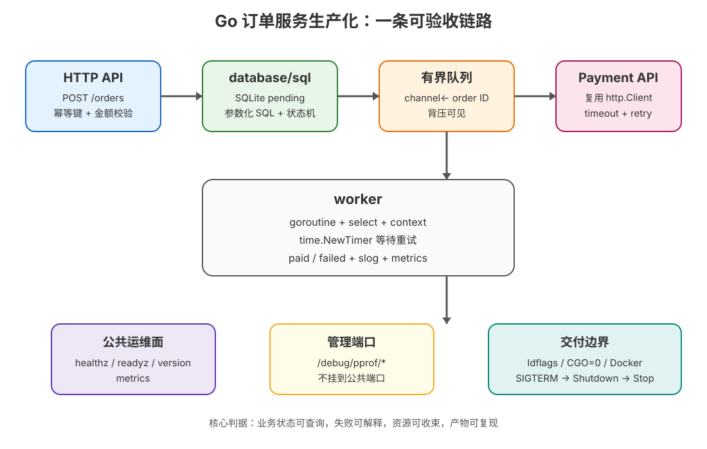

# Go 结课综合实战：订单服务生产化

> 所属课程：Go 语言系统学习 ｜ Phase 3 结课综合实战 ｜ 前提：阶段 1–5、15 课、45 个知识点已完成
>
> 目标：把小谷的下单接口从“能返回 JSON”推进到“能落库、能异步履约、能诊断、能构建、能停干净”。

## 1. 项目总览



这不是把 15 课的代码简单拼在一起，而是一条有真实失败分支的业务链：

```text
POST /orders
    │  校验 Idempotency-Key + amount_cents
    ▼
SQLite pending  ──► 有界 channel ──► worker
                                      │
                                      ├─ context.WithTimeout
                                      ├─ http.Client → payment upstream
                                      ├─ timer 等待一次重试
                                      └─ SQLite paid / failed

公共端口：orders / healthz / readyz / version / metrics
管理端口：/debug/pprof/*
停机：撤 readiness → Shutdown HTTP → cancel worker → deadline 内收束
```

技术选择：

| 项 | 选择 | 取舍 |
|---|---|---|
| 存储 | `database/sql` + `modernc.org/sqlite v1.58.0` | 纯 Go、可 `CGO_ENABLED=0`；SQLite 不替代生产级托管数据库 |
| 异步模型 | 有界 `channel` + 单 worker | 背压可见、状态简单；吞吐不足时应扩展为可持久化队列 |
| 支付客户端 | 可替换 `PaymentClient` + 复用 `http.Client` | 测试可注入 fake；当前重试示例只适合幂等的 charge 契约 |
| 可观测 | `log/slog` + 原子计数器 + 独立 pprof | 零额外指标 SDK；指标维度少，不是完整监控平台 |
| 容器 | 多阶段 + scratch + 非 root | 体积和攻击面小；scratch 没有 shell，排障依赖 admin profile 与外部日志 |

完整反例见[反例对照](./反例对照.md)，逐条验收见[验收清单](./验收清单.md)。

## 2. 快速运行

```bash
cd /Users/wuyongping/Desktop/learning/go/projects/订单服务生产化

# 一键跑完测试、竞态、静态检查、benchmark、demo、交叉构建和 Docker（若 daemon 已启动）
bash verify.sh

# 只跑自包含业务演示
go run ./cmd/order-service -demo
```

`-demo` 会临时启动支付上游和两个 HTTP server，真实执行成功订单、失败重试、幂等复放、readiness、metrics 与 pprof 隔离；不会接触外部服务，也不会留下数据库文件。

正常服务需要支付上游：

```bash
PAYMENT_URL=http://127.0.0.1:8081 \
ORDER_DB_DSN='file:/data/orders.db' \
go run ./cmd/order-service
```

默认监听公共 `:8080`、管理 `:9090`。构建版本通过 `-ldflags` 注入：

```bash
go build -trimpath \
  -ldflags='-s -w -X main.version=v0.1.0 -X main.commit=abc1234 -X main.buildTime=2026-09-16T00:00:00Z' \
  -o order-service ./cmd/order-service
```

## 3. API 契约

创建订单：

```bash
curl -i -X POST http://127.0.0.1:8080/orders \
  -H 'Content-Type: application/json' \
  -H 'Idempotency-Key: checkout-1001' \
  -d '{"amount_cents":1990}'
```

- 首次合法请求：`202 Accepted`，订单状态为 `pending`。
- 同 key 同金额：返回同一订单；若订单已到终态，返回 `200 OK`。
- 同 key 不同金额：`409 Conflict`。
- 缺 key、JSON 不合法或金额越界：`400 Bad Request`。

查询与运维端点：

| 方法 | 路径 | 作用 |
|---|---|---|
| `GET` | `/orders/{id}` | 查询订单状态与失败原因 |
| `GET` | `/healthz` | 进程健康，供存活探针 |
| `GET` | `/readyz` | 是否接收流量，停机时先变 503 |
| `GET` | `/version` | 版本、commit、构建时间 |
| `GET` | `/metrics` | Prometheus 文本格式的低基数计数器 |
| `GET` | `admin:9090/debug/pprof/` | profile 索引，仅管理端口 |

## 4. 文件结构

```text
订单服务生产化/
├── cmd/order-service/main.go        # 旗标、真实 server、SIGTERM、self-contained demo
├── internal/app/app.go              # 应用装配、端口边界、pprof 管理面
├── internal/order/
│   ├── model.go                     # Order / Status / 请求模型
│   ├── errors.go                    # 可判定的业务错误
│   ├── store.go                     # database/sql、schema、状态更新
│   ├── payment.go                   # 可复用 http.Client 的支付客户端
│   ├── service.go                   # channel、worker、timeout、retry、状态机
│   ├── http.go                      # ServeMux、JSON API、metrics、访问日志
│   ├── *_test.go                    # 单元、HTTP、存储、worker、客户端、benchmark
├── Dockerfile                       # CGO=0 linux/amd64 多阶段产物
├── .dockerignore
├── verify.sh                        # 一键验证脚本
├── 验收清单.md
├── 反例对照.md
└── ALL_OUTPUT.txt                  # 实测证据（运行 verify.sh 生成）
```

## 5. 45 个知识点映射

> 映射分为“直接落地”“验证支撑”“决策边界”。结课项目不为了凑 API 而堆无业务价值的语法；没有必要进入主链路的语言点，在测试或设计说明中明确边界。

### 阶段 1：语言地基（1–9）

| # | 知识点 | 项目落点 |
|---:|---|---|
| 1 | Go 的起源与设计取舍 | 标准库优先、显式错误和并发模型是整体设计取舍 |
| 2 | 工具链与工作区 | `go.mod`、`go test`、`go build`、`verify.sh` |
| 3 | 编译模型：一个二进制文件 | `cmd/order-service` 编译为单一 Linux ELF，容器只拷贝该文件 |
| 4 | 变量声明与零值 | 配置默认值、`atomic.Bool` 初始 not ready、计数器零值可用 |
| 5 | 基础类型与显式转换 | 金额统一 `int64` 分，避免浮点金额；HTTP 状态使用 `int` |
| 6 | 控制流：只有 `for` | worker 循环、有限重试循环、轮询状态循环 |
| 7 | 数组与切片 | 随机 ID 的定长 byte array、HTTP body / JSON 的 byte slice |
| 8 | map | JSON 错误/健康/版本响应使用 `map[string]string` / `map[string]any` |
| 9 | 字符串与 UTF-8 | 状态、幂等键、SQL 错误与结构化日志字段都是字符串契约 |

### 阶段 2：组合与抽象（10–18）

| # | 知识点 | 项目落点 |
|---:|---|---|
| 10 | 函数：多返回值与一等公民 | `Create` 返回 `(Order, created, error)`；测试注入函数和 handler helper |
| 11 | error 是值 | `ErrNotFound`、`ErrQueueFull`、`errors.Is` 与 `%w` 错误链 |
| 12 | defer 的机制与坑 | `Rows`/HTTP body/定时器/测试清理全部显式收口 |
| 13 | struct 与组合 | `Order`、`App`、`ServiceConfig` 组合依赖而非继承 |
| 14 | 方法与接收者 | `Store.Get`、`Service.Create`、`HTTPPaymentClient.Charge` |
| 15 | 包与可见性 | `cmd` 只装配；`internal/app`、`internal/order` 隔离实现细节 |
| 16 | 接口：隐式实现 | `PaymentClient` 让 fake 与 HTTP 客户端无感替换 |
| 17 | 类型断言与 type switch | 项目通过接口替身和 `errors.Is` 做分支；业务主链不为类型断言制造额外抽象 |
| 18 | 泛型入门 | 项目核心数据模型不需要泛型；`encoding/json` 与容器边界保持具体类型，记录“不用泛型”的选型理由 |

### 阶段 3：并发模型（19–27）

| # | 知识点 | 项目落点 |
|---:|---|---|
| 19 | goroutine 是什么 | `runWorker` 与 HTTP server 的 Serve goroutine |
| 20 | 生命周期与等待 | worker `done` channel + `Stop` deadline；HTTP `Shutdown` 等待在途请求 |
| 21 | 并发 ≠ 并行 | 有界队列把请求接收与支付履约解耦，不假定 worker 数量等于 CPU 数 |
| 22 | channel 基础 | `queue chan string` 传递订单 ID，避免把可变订单对象跨边界共享 |
| 23 | select 与超时 | worker 监听取消/队列，重试 timer 与 worker context 竞争 |
| 24 | 方向与所有权 | 生产者只发送队列；消费逻辑集中在 worker，队列不由外部关闭 |
| 25 | sync 包 | `atomic.Uint64` 保护指标，测试中的 mutex 保护 fake 客户端调用数 |
| 26 | 数据竞争 | `go test -race ./...` 是验收闸门，指标使用原子操作 |
| 27 | goroutine 泄漏与取消 | worker、支付请求和 timer 都能沿 context 收束；Stop 有 deadline |

### 阶段 4：标准库与网络编程（28–36）

| # | 知识点 | 项目落点 |
|---:|---|---|
| 28 | `io.Reader` / `io.Writer` 哲学 | JSON decoder 从 body 读，encoder / `io.WriteString` 写响应，错误 body 限量读取 |
| 29 | context：取消与超时 | 每次支付 `WithTimeout`，请求 context 传入 SQL，停机取消 worker |
| 30 | 文件与资源 | SQLite 文件 DSN、数据库连接池、body/rows/临时测试 server 生命周期 |
| 31 | Handler 与 ServeMux | Go 1.22+ method pattern：`POST /orders`、`GET /orders/{id}` |
| 32 | 请求与响应 | header 幂等键、JSON body、状态码和错误响应契约 |
| 33 | 生产级 Server 配置 | ReadHeader/Read/Write/Idle timeout 与显式 graceful shutdown |
| 34 | `database/sql` | `Open`、`PingContext`、参数化 SQL、schema、状态更新和连接池旋钮 |
| 35 | `http.Client` | 单例复用 Transport、Client timeout、请求 context、body close、非 2xx 错误 |
| 36 | 时间与定时器 | UTC 时间戳、支付 deadline、重试 `NewTimer`、demo/测试 ticker 轮询 |

### 阶段 5：工程化与生产落地（37–45）

| # | 知识点 | 项目落点 |
|---:|---|---|
| 37 | 模块与依赖 | 独立 `go.mod`，固定 `modernc.org/sqlite v1.58.0`，`go.sum` 锁定校验和 |
| 38 | 测试 | store、API、readiness、worker retry、支付客户端、app surface 测试 |
| 39 | 静态检查与规范 | `gofmt`、`go vet`、包边界、错误包装和 `verify.sh` |
| 40 | benchmark | `BenchmarkEncodeOrder` + `-benchmem`，先测量再优化 |
| 41 | pprof | admin 端 `/debug/pprof/*`，公共端明确 404；可用 `go tool pprof` 接入 |
| 42 | 内存与 GC 直觉 | 有界队列、body 限量读取、无全局缓存；用 profile 观察而非猜 GC |
| 43 | 构建与交付 | ldflags 版本注入、trimpath、`CGO_ENABLED=0`、linux/amd64、Docker 多阶段 |
| 44 | 线上可观测与运维 | slog、health/ready、低基数指标、失败原因、优雅退出和回滚信息 |
| 45 | Go 的生态位与选型 | 结尾决策：何时适合低依赖高并发服务，何时应换托管 DB/队列或其他语言 |

## 6. 真实验收与证据

执行：

```bash
bash verify.sh
```

本机实测输出会写入 `ALL_OUTPUT.txt`，关键验收行形如：

```text
project=go-order-service version=capstone-local commit=working-tree build_time=2026-09-16T00:00:00Z
readyz_before=503 readyz_after=200 version_status=200 public_pprof=404 admin_pprof=200
create_status=202 success_status=paid duplicate_status=200 duplicate_created=false
failure_create_status=202 failure_status=failed retry_total=1 upstream_calls=3
metrics_status=200 counters=created:2 paid:1 failed:1
worker_shutdown=clean
```

其中端口、耗时、benchmark 数字和镜像 digest 会随本机环境变化；不要把它们当成固定契约。固定契约是退出码、状态码、终态、隔离关系和检查命令。

## 7. 部署与回滚决策

### 本地 / CI

```bash
docker build --tag go-order-service:capstone-local .
docker run --rm go-order-service:capstone-local -demo
```

`-demo` 用内存数据库，适合 CI；生产环境不要把 SQLite 内嵌数据库误当高可用存储。若只是单机低吞吐工具，可以把 `/data` 作为显式持久卷并评估备份/恢复；一旦需要多副本、跨机调度或高写入并发，应换托管数据库。

### 生产升级触发条件

| 现状 | 继续用本项目方案 | 触发升级 |
|---|---|---|
| 单机 / 单副本 | 标准库 HTTP + worker + SQLite 可用于学习和小工具 | 多副本写入、主从、备份恢复要求 → 托管数据库 |
| 低吞吐异步任务 | 有界 channel 足够表达背压 | 需要跨进程不丢任务、水平扩展 → 持久化队列 |
| 单一支付上游 | 复用 client + 两次尝试 | 多供应商、复杂熔断/限流/观测 → 专门客户端策略或网关 |
| 一台机器 | scratch + SIGTERM + admin pprof | 多机滚动、自愈、弹性 → 评估编排平台 |

回滚原则：镜像按版本/commit 打不可变 tag；回滚是切换到上一个已验证 tag，不在故障现场临时重编译。数据库 schema 变更必须另行设计向后兼容与恢复演练。

## 8. 后续练习

1. 把 `PaymentClient` 改成带 request ID、指数退避和明确幂等 token 的协议，并补充失败分类测试。
2. 把单 worker 改成可配置 worker pool，先用 benchmark 和 pprof 证明收益，再比较 SQLite 锁竞争。
3. 用真实 Prometheus 抓取 `/metrics`，给 `failed_total` 和队列积压增加告警；保持 label 低基数。
4. 用 `go tool pprof` 采集线上 profile，建立“症状 → profile → 单变量改动 → 回归”的诊断记录。
