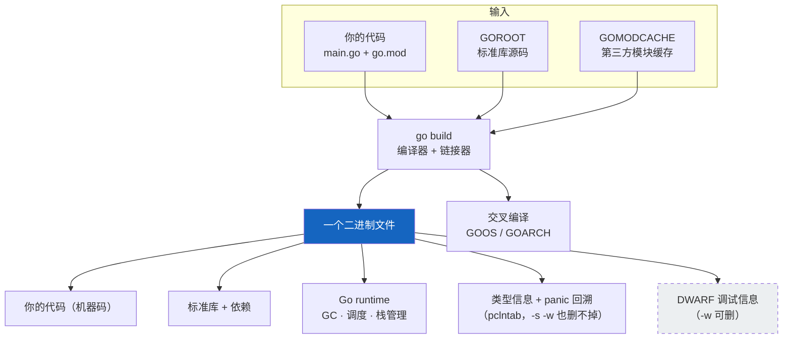

# 课 1：Go 是什么、环境怎么跑起来

> 所属阶段：语言地基 ｜ 故事章节：写出第一行，看懂每一行 ｜ 上一课：无（本课是起点）
> **状态：✅ 已完成** ｜ 版本基线：**Go 1.27.1 darwin/arm64**（核查于 2026-09）
> 📌 本课所有命令与输出**均在本机真实跑通并实测**（macOS 26.6.2 / arm64），不是纸面预期。

## 📌 知识点导航

| # | 知识点 | 关键点 | 状态 |
|---|--------|--------|------|
| 1 | Go 的起源与设计取舍 | ①2007 年的背景：C++/Java 主导、GitHub 尚不存在、多数机器还不是多核 ②三人 2007-09-21 白板起稿，2009-11-10 开源 ③三个设计目标：一等公民并发 + 垃圾回收 + 编译要快 ④Go 1 兼容性承诺与"少即是多" | ✅ 已完成 |
| 2 | 工具链与工作区 | ①`go run` / `go build` / `go mod init` 三件套 ②GOROOT 与 GOPATH 的分工 ③模块缓存 GOMODCACHE 与 GOPROXY ④**未使用变量与导入是编译错误** | ✅ 已完成 |
| 3 | 编译模型：一个二进制文件 | ①AOT 编译成机器码，**有 runtime 但不是虚拟机** ②默认静态链接导致二进制偏大 ③`-ldflags "-s -w"` 瘦身 ④交叉编译 GOOS + GOARCH | ✅ 已完成 |

---

## 第一幕 · 🏛️ 起源与场景引入

### 起源：2007 年的一次白板会议

（以下事实取自 go.dev 官方 FAQ，核查于 2026-09）

**2007 年 9 月 21 日**，Google 的三位工程师 —— **Robert Griesemer、Rob Pike、Ken Thompson** —— 在白板上开始勾勒一门新语言的目标。在此之前，Ken Thompson 已经因为发明 Unix 和 C 语言的前身 B 语言拿了图灵奖，Rob Pike 是 Unix 团队和 UTF-8 的核心作者之一，Robert Griesemer 参与过 Java 的 HotSpot 虚拟机。

他们不是闲着没事造语言。官方 FAQ 记录了那一年软件世界的样子：

> 生产软件通常用 C++ 或 Java 写成，GitHub 还不存在，多数计算机还不是多处理器，除了 Visual Studio 和 Eclipse 之外几乎没有什么 IDE 或高级工具，更不用说免费可得的了。

以及他们真正不满的两件事：

> 我们对用现有语言及其构建系统构建大型软件项目时**所需的过度复杂性**感到沮丧。……多处理器正在变得普遍，但**多数语言几乎没有提供高效、安全地编写它们的帮助**。
> —— go.dev FAQ · *What is the purpose of the project?*

接下来的两年：2008 年 1 月 Ken 写出了第一个编译器（输出 C 代码）；2008 年 5 月 Ian Taylor 独立开始了 GCC 前端；2008 年底 Russ Cox 加入，把语言和标准库从原型推向现实。**2009 年 11 月 10 日，Go 成为公开的开源项目。**

### 场景：小谷接到了一个任务

小谷是个写了几年 Python 的后端工程师。周一早上，leader 把他叫过去：

> "下单接口压测一上量就崩，Python 那版扛不住了。听说你之前看过点 Go？这周用 Go 重写一版，周五能跑起来就行。"

小谷回去第一件事，是打开搜索引擎查"Go 语言教程"。他看到的第一句话是"Go 是 Google 开发的静态强类型编译型并发语言，具有垃圾回收功能" —— 每个字都认识，合在一起不知道在说什么。

于是他决定先不碰业务，而是先回答三个最土的问题：

1. Go 到底是个什么东西，为什么 Google 要再造一门语言？
2. 这门语言在我的电脑上怎么跑起来？
3. 跑完之后，我得到了什么？

这三个问题，就是这一课的全部内容。

---

## 第二幕 · ❓ 认知冲突

小谷下载完 Go，照着教程敲了人生第一个 Go 程序，然后卡在了三件"小事"上。

**怪事一：一个 hello world，凭什么 2.4 MB？**

他写了一个只打印一行字的程序，编译完一看：

```console
$ ls -l hello
-rwxr-xr-x  1 wuyongping  staff  2429714  ...
```

**2,429,714 字节**。而他随手写的 C 语言 hello world，只有 33 KB。一百倍的差距 —— 是他写错了，还是这门语言有问题？

**怪事二：少写一句 `fmt` 就编译不过？**

他照 Python 的习惯，先 import 了一个包打算待会儿用，结果：

```console
$ go build .
./main.go:3:8: "fmt" imported and not used
```

不是警告，是**编译失败**。他懵了：我只是想先放着而已，至于吗？

**怪事三：为什么教程都在说"runtime"，但 Go 不是编译型语言吗？**

他一直以为"编译型 = 直接变机器码 = 没有运行时"。可 Go 的资料里到处是 "Go runtime"、"goroutine 调度器"、"GC"。那它到底是不是编译型？是不是跟 Java 一样要装个虚拟机？

这三个怪事，分别对应本课的三个知识点。**它们不是 Go 的缺陷，而是 Go 的设计取舍留下的指纹。** 看懂这三个指纹，你就看懂了 Go 这门语言的一半。

---

## 第三幕 · 层层揭示

### 知识点 1：Go 的起源与设计取舍

#### 一句话定义

Go 是 Google 于 2007 年起设计、2009 年开源的一门**静态类型、编译型**语言，它的设计目标是：在保留"编译快、跑得快、类型安全"的同时，让写**大型服务端程序**这件事不那么复杂。

#### 直觉建立：把灶台上的旋钮砍到二十个

想象一家餐厅的后厨。

- **C++** 是一套有两百个旋钮的专业灶台，什么都能做，但每个新厨师都要培训三个月才敢上手。
- **Python** 是一台只有一个旋钮的小电磁炉，五分钟学会，但高峰期火力上不去。
- **Go** 想做的是：**把旋钮砍到二十个** —— 常用的全留着，一年用一次的砍掉 —— 并且规定"所有厨师必须按同一套动作流程操作"（这就是 `gofmt`）。

**这个类比在哪失效**：真实语言远比灶台复杂，"砍旋钮"必然有人觉得砍错了 —— Go 砍掉了泛型，社区吵了十年，最后在 Go 1.18 又加了回来。所以"少"不是教条，而是**当时当地的权衡**。另外，砍旋钮是为了让团队协作更顺，不是为了让你写单文件脚本更快 —— 写脚本 Python 依然更省事。

#### 核心原理：Go 押注的三件事

官方 FAQ 说得很直白，Go 团队当年在白板上推演的是"未来几年什么会主导软件工程"，得出三条：

| 设计目标 | 当时的判断 | 落到语言上 |
|---------|-----------|-----------|
| **一等公民的并发** | 多核正在变得普遍，而多数语言几乎不帮忙 | `go` 关键字 + goroutine + channel（阶段 3 展开） |
| **垃圾回收** | 大型并发程序里手工管内存是不现实的 | 内置 GC，不用 `malloc/free` |
| **编译要快** | 官方原话：一台机器上构建大型可执行文件"应该最多几秒钟" | 严格的依赖声明（没有头文件）、单一编译器前端 |

第三条最容易被忽略，但它解释了 Go 很多"反直觉"的语法决定：**没有头文件、没有前向声明、每个符号只声明一次** —— 这些约束都是为了"编译器扫一遍就能把依赖关系搞清楚"。

#### 血统：Go 是谁的孩子

官方 FAQ 的原话：

> Go 主要属于 **C 家族**（基础语法），显著受 **Pascal / Modula / Oberon 家族**影响（声明、包），并吸收了一些受 Tony Hoare 的 **CSP** 启发的语言（如 Newsqueak、Limbo）的并发思想。

一句话记：C 的长相 + Pascal 的声明风格 + CSP 的并发脑子。

#### 时间线（官方一手，核查于 2026-09）

| 时间 | 事件 |
|------|------|
| 2007-09-21 | Robert Griesemer、Rob Pike、Ken Thompson 在白板上开始勾勒新语言目标 |
| 2008-01 | Ken Thompson 开始写编译器（输出 C 代码） |
| 2008-05 | Ian Taylor 独立开始 GCC 前端 |
| 2008 年底 | Russ Cox 加入，推动语言与标准库从原型走向现实 |
| **2009-11-10** | **Go 成为公开开源项目** |
| **2012-03-28** | Go 1 发布，确立兼容性承诺（官方 Release History 原文：`go1 (released 2012-03-28)`） |

#### "少即是多"：Go 砍掉了什么

Rob Pike 在 2012 年 Go SF 的分享里用了这个标题：**Less is exponentially more**（少是指数级的多）—— 原话出自他 2012 年的个人博客。（⏳ **置信度：中** —— 中文转述来源一致，但 go.dev 官方站未收录该文原文，故不把它当官方口号引用。）

具体到语法，Go 砍掉的东西和官方理由如下：

| 砍掉的 | 官方理由（FAQ 原意） | 代价 |
|--------|---------------------|------|
| 三元运算符 `a > b ? a : b` | 见过太多人用它写出无法理解的表达式；`if-else` 虽然长，但**毫无疑问更清晰** | 简单的条件赋值要多写三四行 |
| 断言 `assert` | 会被当成**逃避正确错误处理的拐杖** | 边界检查要自己写 `if` |
| 类型继承 | 类型之间的关系"通常可以自动推导出来"，不需要提前声明 | 习惯了继承的人要重新学组合（课 5） |
| `implements` 声明 | 一个类型只要方法对上就实现了接口，不需要显式声明 | 读代码时不容易一眼看出"谁实现了谁" |
| 异常 `try-catch` | 会**鼓励把"打开文件失败"这类普通错误当成异常** | 错误要一个一个 `if err != nil`（课 4） |

我们实测一下"砍掉三元"这件事是不是真的 —— 故意写一段带三元的 Go 代码：

```console
$ go build .
# ternary
./main.go:8:20: invalid character U+003F '?'
./main.go:8:22: syntax error: unexpected name a in argument list; possibly missing comma or )
```

编译器连 `?` 这个字符都不认识（`invalid character U+003F`）。**这就是"少即是多"的硬边界：Go 不是"支持三元但你最好别用"，而是根本没有。**

#### Go 1 兼容性承诺：一门敢说"十年不破坏"的语言

2012 年 Go 1 发布时，官方做了一个罕见的承诺（[go.dev/doc/go1compat](https://go.dev/doc/go1compat)）：

> 按 Go 1 规范编写的程序，在该规范的整个生命周期内，应当**无需改动就能继续编译并正确运行**。
>
> 兼容性是**源码级**的。编译后包的二进制兼容性在不同发布版之间**不做保证**。

翻译成人话：

- ✅ 你 2012 年写的 Go 代码，今天用 Go 1.27 编译大概率照样能跑；
- ❌ 但你不能指望"用 Go 1.26 编出来的 `.a` 文件能被 Go 1.27 直接链接"，升级 Go 后要**重新编译源码**。

**哪些情况不在承诺范围内**（官方列的清单）：安全问题修复、依赖了未定义行为、规范本身的错误、依赖了编译器的 bug、用了**不带字段名的结构体字面量**（`pkg.T{3, "x"}`）、方法名冲突、`import .` 点导入、以及用了 `unsafe` 包。

这条承诺对学习者的意义是：**你今天学的语法，不会因为 Go 出新版而作废。** 但新版本会加东西（比如泛型 1.18、结构化日志 1.21、泛型方法 1.27），所以"版本"依然要关注 —— 只是方向是"只增不改"。

#### 常见误区

- ❌ **"Go 是 Google 的内部语言，外面用得不多。"** 官方十周年博客点名的项目：Docker、Kubernetes、etcd、Istio、Prometheus、Terraform 全是 Go 写的；CNCF 的多数项目也是 Go。它是云原生基础设施的**事实标准语言**。
- ❌ **"Go 是简化版 C++。"** 它没有继承、没有构造/析构、没有运算符重载，抽象机制（接口）的哲学完全不同。带着 C++ 的脑子学 Go，会比零基础更难受。
- ❌ **"这门语言叫 Golang。"** 官方原话：语言名就是 **Go**；"golang" 只因为早期域名是 `golang.org`（当时还没有 `.dev` 域）。另外注意写法是 `Go` 不是 `GO`。

#### 一句话记住

> **Go 是 Google 在 2007 年为"多核时代的大型服务端程序"造的语言：砍掉语法换团队协作，押注并发 + GC + 快编译，并用 Go 1 兼容性承诺保证你学的东西不过期。**

📚 官方文档
- [go.dev FAQ · Origins（起源、历史、设计原则）](https://go.dev/doc/faq#Origins)
- [Go 1 and the Future of Go Programs（兼容性承诺原文）](https://go.dev/doc/go1compat)
- [Go at Google: Language Design in the Service of Software Engineering](https://go.dev/talks/2012/splash.article)

---

### 知识点 2：工具链与工作区

#### 一句话定义

Go 的全部开发工作都通过一个 `go` 命令完成 —— 编译、运行、依赖管理、测试、格式化、文档查询都挂在它下面，**不需要 Makefile、不需要单独装包管理器和测试框架**。

#### 直觉建立：一把瑞士军刀 vs 一抽屉工具

写 Python 时，你的工具箱是这样的：`python` 解释器 + `pip` 装包 + `venv` 管环境 + `pytest` 跑测试 + `black` 格式化 + `mypy` 类型检查 —— 六样东西，六个版本，六种配置格式。

Go 把这六件事合并进了一个 `go` 命令：`go run` / `go build` / `go get` / `go test` / `go fmt` / `go vet`。

**这个类比在哪失效**：`go` 命令**不管你的编辑器**（要自己装 VS Code + Go 插件或 GoLand），也**不管你的部署**（构建出二进制之后怎么用是你自己的事）。另外，Go 的"瑞士军刀"是官方强制统一的，好处是团队零配置，代价是**你想换个刀片不容易**。

#### 核心原理

**① 三件套：`go mod init` → `go run` / `go build`**

| 命令 | 干什么 | 产物 |
|------|--------|------|
| `go mod init <模块路径>` | 声明"这个目录是一个模块"，生成 `go.mod` | `go.mod` 文件 |
| `go run main.go` | 编译 + 立即运行 | 无（临时编译，跑完就清） |
| `go build -o <名字> .` | 只编译，产出可执行文件 | 可执行文件 |

一个目录 + 一个 `go.mod` = 一个模块（module）。模块是 Go 管理依赖与版本的最小单位（课 13 展开）。

**② 三个目录：GOROOT / GOPATH / GOMODCACHE**

这三个名字是初学者最容易混淆的。本机实测值如下：

| 环境变量 | 实测值 | 放什么 | 你要动它吗 |
|---------|--------|--------|-----------|
| `GOROOT` | `/usr/local/Cellar/go/1.27.1/libexec` | **Go 自己的安装目录**（编译器 + 标准库源码） | ❌ 不要动 |
| `GOPATH` | `/Users/wuyongping/go` | 模块时代之前的工作区；现在主要放模块缓存和 `go install` 装的命令 | 一般不动 |
| `GOMODCACHE` | `/Users/wuyongping/go/pkg/mod` | **下载的第三方模块缓存** | 一般不动（满了可以 `go clean -modcache`） |
| `GOPROXY` | `https://proxy.golang.org,direct` | 从哪儿下载模块 | 国内网络不通时可换 |

> ⚠️ **模块时代最大的心智变化**：你的项目**不需要**放在 `GOPATH` 下面了。`/tmp` 里、桌面、任何目录都行 —— 只要那个目录里有 `go.mod`。老教程里"必须放 GOPATH/src"的说法，**已经过时十年了**。

**③ 未使用的变量与导入是编译错误（不是警告）**

这是 Go 最"不近人情"的一条，也是怪事二的答案。官方 FAQ 的理由：

> 未使用的变量**可能意味着一个 bug**；未使用的导入只是拖慢编译。……编译器**不产生警告，只产生阻止编译的错误**。
>
> 实现上没有警告有两个理由。第一，如果一件事值得抱怨，那就值得在代码里修好。（反过来，如果不值得修，那也不值得提。）第二，让编译器产生警告，会诱使它去警告一些模棱两可的情况，让编译输出变得嘈杂，**反而掩盖了真正该修的错误**。

实测报错原文：

```console
# 未使用的变量
$ go build .
# unused
./main.go:6:2: declared and not used: x

# 未使用的导入
$ go build .
# unusedimp
./main.go:3:8: "fmt" imported and not used
```

开发时想临时绕过，用**空白标识符 `_`**：

```go
import _ "fmt"        // 临时：标记这个包"我故意不用"（上线前删掉）
var _ = unused.Item   // 临时：标记这个变量"我故意不用"
_ = someValue         // 丢弃一个返回值
```

#### 示例演示

```console
$ go version
go version go1.27.1 darwin/arm64

$ go env GOROOT GOPATH GOMODCACHE GOPROXY GOOS GOARCH
/usr/local/Cellar/go/1.27.1/libexec
/Users/wuyongping/go
/Users/wuyongping/go/pkg/mod
https://proxy.golang.org,direct
darwin
arm64

$ go mod init example.com/hello
go: creating new go.mod: module example.com/hello

$ go run main.go
hello, 小谷！
```

#### 常见误区

- ❌ **"我的项目必须放在 GOPATH/src 下。"** 过时说法。有 `go.mod` 就是模块，放哪儿都行。
- ❌ **"`go run` 是 Go 的解释器。"** 不是。`go run` 是"编译到临时目录 → 执行 → 清理"，它背后就是完整的编译，所以第一次跑也会慢（要编译依赖）。
- ❌ **"`go build` 会把我的 `.go` 源码一起打包进去。"** 不会。产物是**编译后的机器码**，源码不进二进制 —— 但**源码路径会**进（下面知识点 3 的 panic 堆栈就是证据）。

#### 一句话记住

> **一个 `go` 命令包办编译、依赖、测试、格式化；一个目录加一个 `go.mod` 就是一个模块，放哪儿都行；并且 Go 编译器只报错、不警告 —— 没用到的变量和 import 会直接让它编译失败。**

📚 官方文档
- [Tutorial: Get started with Go](https://go.dev/doc/tutorial/getting-started)
- [go command documentation](https://go.dev/cmd/go/)
- [go.dev FAQ · Writing Code](https://go.dev/doc/faq#Writing_Code)

---

### 知识点 3：编译模型：一个二进制文件

#### 一句话定义

Go 是 **AOT（提前编译）成机器码**的语言：源码直接编译成 CPU 能执行的本机指令，不经过虚拟机；但每个 Go 程序都内嵌一个 **runtime**（运行时库），负责垃圾回收、goroutine 调度和栈管理。

#### 直觉建立：翻译好的手册 + 一个随行助理

- **Java 路线**：你带着一本原文手册出国，现场配一个**翻译官（JVM）**，翻译官一句句解释给你听。
- **Go 路线**：出发前就把整本手册**翻译好了**带上飞机 —— 但手册里还夹着一位**随行助理（runtime）**。

**这个类比在哪失效**（关键！）：助理 ≠ 翻译官。翻译官是"把字节码解释成机器码"；而 Go 的助理**不做解释** —— 程序本身就是机器码，CPU 直接执行。助理只负责三件后勤：**回收垃圾（GC）、调度 goroutine、管理栈**。官方原话：

> Go 的 runtime **不包含虚拟机**，不像 Java runtime 提供的那种。Go 程序是**提前编译成本机机器码**的。
> —— go.dev FAQ · *Does Go have a runtime?*

#### 核心原理：二进制为什么这么大

Go 的链接器**默认生成静态链接的二进制**（官方 FAQ：*The linker in the gc toolchain creates statically-linked binaries by default*）。也就是说，你的程序需要的东西几乎全被拷进了那一个文件里：

| 进了二进制的东西 | 为什么需要 |
|-----------------|-----------|
| 你的代码编译出的机器码 | 当然 |
| 用到的标准库（如 `fmt`） | 静态链接 |
| 用到的第三方依赖 | 静态链接 |
| **Go runtime** | GC、调度器、栈管理 |
| **运行时类型信息** | 支持反射、动态类型检查 |
| **panic 时的堆栈回溯信息** | 出事时能打出文件名和行号 |
| **DWARF 调试信息** | 给调试器用（可用 `-w` 去掉） |

官方给的同口径对照（Linux + gcc 静态链接）：

> 一个用 gcc 静态编译链接的简单 C "hello, world" 程序大约 **750 kB**（含 `printf` 的实现）。等价的 Go 程序用 `fmt.Printf`，重**几兆字节** —— 但它包含了更强大的运行时支持，以及类型和调试信息。
> —— go.dev FAQ · *Why is my trivial program such a large binary?*

⚠️ **口径警告**：如果你在 macOS 上用 `clang` 编一个 C 的 hello world，会得到 **33,432 字节**（本机实测）—— 但这个数字**不能**和 Go 的 2.4 MB 比，因为 macOS 上 C 程序默认**动态链接** libc，`printf` 的实现根本没进二进制。**要比就得同口径。**

真正同口径的对比，用我们交叉编译出的 Linux 版 Go 二进制（实测 **2,346,817 字节**，且 `file` 明确显示 `statically linked`）对比官方给的 Linux 静态 C hello world（约 750 kB）：**同口径下 Go 大约是 C 的 3 倍**。这 3 倍买的就是上面表格里那一堆东西。

#### 示例演示：瘦身与交叉编译

```console
$ go build -o hello .
$ stat -f%z hello
2429714                      # 2.32 MiB

$ go build -ldflags "-s -w" -o hello-slim .
$ stat -f%z hello-slim
1587714                      # 1.51 MiB —— 少了 842,000 字节，−34.6%

$ file hello
hello: Mach-O 64-bit executable arm64

$ GOOS=linux GOARCH=amd64 go build -o hello-linux-amd64 .
$ file hello-linux-amd64
hello-linux-amd64: ELF 64-bit LSB executable, x86-64, version 1 (SYSV), statically linked, ... with debug_info, not stripped
```

`-s -w` 做了两件事：`-s` 去掉符号表，`-w` 去掉 DWARF 调试信息。

**⚠️ 一个反直觉的实测结论**：去掉 DWARF **不等于**崩了就没救。我们用同一个会 panic 的程序分别构建，对比堆栈输出：

```console
# 默认构建 vs -ldflags "-s -w" 构建，panic 输出完全一致：
panic: runtime error: invalid memory address or nil pointer dereference
[signal SIGSEGV: segmentation violation code=0x2 addr=0x0 pc=...]

goroutine 1 [running]:
main.boom(...)
	/tmp/go-l01/panic/main.go:5
main.main()
	/tmp/go-l01/panic/main.go:9 +0x8
```

**文件名和行号都在。** 原因是 Go 的堆栈回溯用的是**自己的符号表**（社区常称 pclntab），不依赖 DWARF；`-w` 删掉的是给 `dlv` 这类调试器用的信息。（⏳ **置信度：中** —— "实测现象"是本机验证的硬事实，但"内部符号表叫 pclntab"这一命名属社区通行说法，go.dev 官方文档未以此名收录，故不展开讲机制。）**所以"加 `-s -w` 就完全没法排查"是错的** —— 你付出的代价是不能用调试器单步，不是看不到崩溃位置。

**⚠️ 第二个边界：macOS 上没有"完全静态"这回事**

很多人说"Go 编译出的二进制是完全静态的"。我们实测了 macOS 上的情况：

```console
$ otool -L hello            # 默认构建（CGO_ENABLED=1）
hello:
	/usr/lib/libSystem.B.dylib ...
	/usr/lib/libresolv.9.dylib ...

$ CGO_ENABLED=0 go build -o hello-static . && otool -L hello-static
hello-static:
	/usr/lib/libSystem.B.dylib ...     # 依然在
	/usr/lib/libresolv.9.dylib ...     # 依然在
```

**即使设了 `CGO_ENABLED=0`，macOS 上的 Go 二进制仍然链接 `libSystem`**（因为 macOS 上系统调用必须经过系统库，苹果不提供稳定的裸系统调用接口）。

所以准确的表述是：

- **Linux 上**：Go 二进制可以做到真正的静态链接（上面交叉编译的 `hello-linux-amd64`，`file` 明确写 `statically linked`）；
- **macOS 上**：做不到完全静态，总会链接系统的 `libSystem`。

> 🎯 **这对你意味着什么**：如果你听到"Go 的二进制丢到任何机器上都能跑"，要加上限定语 —— **同操作系统、同架构、且目标机器上有兼容的系统库**。跨操作系统是不行的（那才需要交叉编译）。

#### 常见误区

- ❌ **"有 runtime 就是解释执行 / 需要装虚拟机。"** 错。runtime 是**编译进二进制的库**，不是独立进程。你把一个 Go 二进制拷到同架构的另一台机器上，那台机器**不需要装 Go**。
- ❌ **"二进制大说明我代码写得烂。"** 一个 hello world 就 2.3 MB，这是语言的下限，不是你的锅。真正该关心的是"相对你的代码量增长了多少"。
- ❌ **"加了 `-s -w` 就完全没法调试了。"** 上面实测过：panic 堆栈的文件名行号照样有。
- ❌ **"Go 的二进制在任何机器上都能跑。"** 要同 OS + 同架构；否则用 `GOOS` / `GOARCH` 交叉编译。

#### 一句话记住

> **Go 提前编译成机器码（不需要虚拟机），但每个二进制里都嵌了一个负责 GC 与调度的 runtime；默认静态链接让产物偏大，`-ldflags "-s -w"` 能瘦掉约三分之一，而 `GOOS`/`GOARCH` 让你在一台机器上编出所有平台的产物。**

📚 官方文档
- [go.dev FAQ · Does Go have a runtime?](https://go.dev/doc/faq#runtime)
- [go.dev FAQ · Why is my trivial program such a large binary?](https://go.dev/doc/faq#Why_is_my_trivial_program_such_a_large_binary)
- [cmd/link（链接器参数，含 `-s` `-w`）](https://go.dev/cmd/link/)
- [Optional environment variables（GOOS / GOARCH / CGO_ENABLED）](https://go.dev/cmd/go/#hdr-Environment_variables)

---

## 第四幕 · 🔬 实操验证

**这一幕的每一步都在本机真实执行过**（macOS 26.6.2 / arm64 / go1.27.1，2026-09-06）。你可以照着敲，得到一样的输出。

### 步骤 1：确认环境与工作区

```console
$ go version
go version go1.27.1 darwin/arm64

$ go env GOROOT GOPATH GOMODCACHE GOPROXY GOOS GOARCH
/usr/local/Cellar/go/1.27.1/libexec
/Users/wuyongping/go
/Users/wuyongping/go/pkg/mod
https://proxy.golang.org,direct
darwin
arm64
```

**回扣第二幕**：这就是"Go 到底装在哪、依赖往哪下"的答案。`GOROOT` 是 Go 自己家，`GOMODCACHE` 是第三方模块的仓库。

### 步骤 2：建模块、写代码、跑起来

```console
$ mkdir -p /tmp/go-l01/hello && cd /tmp/go-l01/hello
$ go mod init example.com/hello
go: creating new go.mod: module example.com/hello
```

`main.go`：

```go
package main

import "fmt"

func main() {
	fmt.Println("hello, 小谷！")
}
```

```console
$ go run main.go
hello, 小谷！
```

> 🙋 **零基础先把这三行照抄下来，课 5 才会系统讲"包"**：
> - `package main` —— 声明"这是一个能独立运行的程序"（不是给别人 import 的库）；
> - `import "fmt"` —— 引入标准库里的"格式化输入输出"包，`Println` 就在里面；
> - `func main()` —— 程序的入口函数，被运行时第一个调用，**名字必须是 `main`**。

**回扣第二幕**：注意我们是在 `/tmp` 下建的模块 —— 不在 `GOPATH` 里，照样能跑。这就是"模块时代"最直接的反证。

### 步骤 3：验证"编译要快"这个设计目标

```console
$ go clean -cache                    # 清空构建缓存，模拟冷启动
$ /usr/bin/time -p go build -o /dev/null .
real 1.70
user 5.49
sys  0.94

$ /usr/bin/time -p go build -o /dev/null .   # 第二次，缓存命中
real 0.09
user 0.09
sys  0.06
```

冷启动 1.70 秒（要重编依赖的标准库），缓存命中后 **0.09 秒**。官方目标是"构建大型可执行文件最多几秒" —— 单文件项目在缓存命中后已经是毫秒级。

### 步骤 4：解剖那个 2.4 MB 的二进制

> 📌 下面用 `stat -f%z` 取字节数，这是 **macOS / BSD** 的写法。**Linux（GNU coreutils）要写成 `stat -c%s hello`**，或者干脆用 `ls -l` 看第五列。

```console
$ go build -o hello .
$ stat -f%z hello
2429714

$ go build -ldflags "-s -w" -o hello-slim .
$ stat -f%z hello-slim
1587714

$ file hello
hello: Mach-O 64-bit executable arm64

$ go version -m hello
hello: go1.27.1
	path	example.com/hello
	mod	example.com/hello	(devel)
	build	-buildmode=exe
	build	-compiler=gc
	build	CGO_ENABLED=1
	build	GOARCH=arm64
	build	GOOS=darwin
```

**回扣怪事一**：2,429,714 → 1,587,714，**瘦了 34.6%**。而 `go version -m` 告诉我们，二进制里还**嵌着模块路径、Go 版本、构建参数** —— 这就是"静态链接把什么都装进去了"的证据。

顺便：即使加了 `-s -w`，`go version -m hello-slim` 依然能读出 `go1.27.1` 和模块路径（实测通过）—— 这份构建信息不在被删的范围内。

### 步骤 5：交叉编译，一台机器产所有平台

```console
$ GOOS=linux GOARCH=amd64 go build -o hello-linux-amd64 .
$ file hello-linux-amd64
hello-linux-amd64: ELF 64-bit LSB executable, x86-64, version 1 (SYSV), statically linked, ...

$ stat -f%z hello-linux-amd64
2346817
```

在一台 Mac（arm64）上，编出了一个 Linux（x86-64）的可执行文件，而且 `file` 明确标注 **`statically linked`**。

**回扣怪事三**：这个文件里没有 Java 那种"需要外部虚拟机"的东西 —— 它就是 x86-64 的机器码 + 内嵌的 runtime。把它拷到一台 Linux 服务器上（那台机器**不需要装 Go**），`chmod +x` 后就能直接跑。

### 步骤 6：亲手撞一次"编译器不警告，只报错"

```go
package main

import "fmt"

func main() {
	x := 1
	fmt.Println("这行会报错：x 声明了但没用")
}
```

```console
$ go build .
# unused
./main.go:6:2: declared and not used: x
```

**回扣怪事二**：这不是 Go 在刁难你。官方的判断是"未使用的变量可能就是 bug"，而且"如果一件小事也警告，真正严重的警告就会被淹没"。

---

## 第五幕 · 体系收束

### 三个怪事，三个答案

| 怪事 | 答案 | 对应知识点 |
|------|------|-----------|
| hello world 凭什么 2.4 MB | 默认静态链接，把标准库 + runtime + 类型信息 + 调试信息全装进去了；同口径下 Go 约为 C 的 3 倍 | 知识点 3 |
| 少写一句就编译不过 | Go 编译器只报错不警告，未使用的变量/导入直接失败；用 `_` 临时绕过 | 知识点 2 |
| 有 runtime 是不是虚拟机 | 不是。AOT 编成机器码，runtime 只是嵌进去的"后勤库"（GC + 调度 + 栈管理） | 知识点 3 |

### 小谷现在站在哪

他已经能回答自己那三个问题了：Go 是 Google 为多核时代服务端程序造的语言；`go` 一个命令管所有事；跑完得到的是一个自带 runtime 的静态二进制，可以直接丢到同平台的机器上运行。

但他**还没写任何业务逻辑**。他现在会的，是"让 Go 程序跑起来"这件事的全部基础设施。

### 本课在全局的位置


- **已经会的**：说清 Go 是什么、怎么建模块、怎么编译、产物是什么、为什么这么大。
- **还不会的**：怎么写真正的逻辑（课 2 开始）。
- **埋下的伏笔**：
  - 本课反复出现的 `fmt.Println` 和 `package main` 到底是什么？→ **课 5「包与可见性」** 才系统讲；现在先照抄。
  - 本课说"runtime 负责调度 goroutine"，但 goroutine 是什么？→ **课 7** 揭晓，这是本课的第三个设计目标（一等公民并发）的兑现点。
  - 本课说"官方理由是未使用变量可能是 bug"，那 Go 怎么处理真正的错误？→ **课 4「error 是值」**。

---

## 🐞 常见误区（本课合订）

| # | 误区 | 真相 |
|---|------|------|
| 1 | Go 是 Google 内部语言，用得不多 | Docker / Kubernetes / etcd / Istio / Prometheus / Terraform 全是 Go 写的（官方十周年博客） |
| 2 | 语言名叫 Golang | 官方：就叫 **Go**（不是 `GO`）；"golang" 源自早期域名 `golang.org` |
| 3 | 有 runtime 就等于解释执行 | runtime 是**编译进二进制**的库（GC + 调度 + 栈管理），产物是机器码，目标机不需要装 Go |
| 4 | 项目必须放在 `GOPATH/src` 下 | 模块时代不必；有 `go.mod` 的目录放哪儿都行（本课实测就在 `/tmp`） |
| 5 | `go run` 是解释器 | 它是"编译到临时目录 → 执行 → 清理"，背后是完整编译 |
| 6 | 二进制大 = 代码写得烂 | 一个 hello world 就 2.32 MiB，是语言下限；`-s -w` 能降到 1.51 MiB |
| 7 | 加了 `-s -w` 崩了就没法查 | 实测：panic 堆栈的**文件名与行号照样在**（Go 用自己的 pclntab，不靠 DWARF） |
| 8 | Go 二进制完全静态、哪都能跑 | **Linux 上成立**（实测 `statically linked`）；**macOS 上不成立**（即使 `CGO_ENABLED=0` 仍链接 `libSystem`） |
| 9 | 未使用的 import 只是警告 | 是**编译错误**（`imported and not used`），这是官方刻意的取舍 |

---

## 🗺️ 一图总结




---

## 📋 速查卡

| 命令 / 语法 | 一句话 | 坑 |
|------------|--------|-----|
| `go version` | 看 Go 版本 | 排查任何"语法不认识"的问题，**先看它** |
| `go env <变量...>` | 看环境变量（`GOROOT` `GOPATH` `GOMODCACHE` `GOPROXY` `GOOS` `GOARCH`） | `GOROOT` ≠ `GOPATH`：前者是 Go 自己家，后者是工作区 |
| `go mod init <模块路径>` | 建模块，生成 `go.mod` | 一个目录只建一次；模块路径通常是仓库地址 |
| `go run main.go` | 编译并运行，不留文件 | 不是解释器；每次都真编译，所以有冷启动成本 |
| `go build -o <名字> .` | 编译出可执行文件 | 末尾的 `.` 是包路径，不是当前目录的同义词 |
| `go build -ldflags "-s -w"` | 去符号表 + DWARF，实测瘦身 **34.6%** | 不影响 panic 堆栈行号，但**不能用调试器单步** |
| `GOOS=linux GOARCH=amd64 go build` | 交叉编译 | macOS 产物并非完全静态（仍链 `libSystem`）；Linux 产物是 |
| `go version -m <二进制>` | 看二进制里嵌的 Go 版本与构建参数 | 加了 `-s -w` 也读得出来 |
| `go clean -cache` | 清构建缓存 | 之后第一次编译会慢（实测 hello world 从 0.09s → 1.70s） |
| `_` 空白标识符 | 丢弃值 / 标记"故意不用" | 是绕开"未使用"报错的**临时**手段，上线前清理 |
| 未使用变量报错 | `declared and not used: x` | 编译错误不是警告，改掉或用 `_` |
| 未使用导入报错 | `"fmt" imported and not used` | 同上；`import _ "fmt"` 可临时绕过 |

---

## 📝 课后小测

<details>
<summary><b>第 1 题</b>：Go 编译出的二进制里包含一个 runtime。下面哪个说法是对的？</summary>

**B**。

- A. 说明 Go 需要像 Java 一样安装虚拟机才能运行 ❌ —— runtime 是**编译进二进制的库**，不是独立进程，目标机器不需要装 Go。
- **B. runtime 负责垃圾回收、goroutine 调度和栈管理，但它不解释字节码** ✅ —— 官方原话："Go's runtime does not include a virtual machine"。
- C. runtime 是在运行时从网上下载的 ❌ —— 静态链接，全在里面。
- D. 只要用了 `-ldflags "-s -w"` 就能把 runtime 删掉 ❌ —— `-s -w` 只删符号表和 DWARF，runtime 还在（所以二进制仍有 1.51 MiB）。
</details>

<details>
<summary><b>第 2 题</b>：小谷在 macOS 上编译了一个 Go 程序，说"这下完全静态了，丢到任何 Linux 服务器都能跑"。这句话错在哪？</summary>

错在**两处**：

1. **跨操作系统不行** —— macOS（darwin/arm64）编出的是 Mach-O 格式，Linux 不认。要跑在 Linux 上得交叉编译：`GOOS=linux GOARCH=amd64 go build`。
2. **macOS 上根本没有"完全静态"** —— 实测即使 `CGO_ENABLED=0`，`otool -L` 仍能看到 `/usr/lib/libSystem.B.dylib`。**只有在 Linux 上**，`file` 才会显示 `statically linked`（我们的交叉编译产物实测就是）。

正确说法：**同操作系统 + 同架构，且目标机器有兼容的系统库。**
</details>

<details>
<summary><b>第 3 题</b>：为什么 Go 要规定"未使用的变量和 import 是编译错误"而不是警告？</summary>

官方 FAQ 给了两层理由：

1. **未使用的变量可能就是 bug**（比如你本想用它却拼错了名字），而未使用的 import 会拖慢编译 —— 所以值得直接报错。
2. **编译器不产生警告，只产生错误。** 如果一件小事也警告，输出就会变得嘈杂，**反而掩盖真正该修的错误**。官方原话："if it's worth complaining about, it's worth fixing in the code."

开发期想临时绕过，用**空白标识符 `_`**：`_ = someValue` 或 `import _ "fmt"` —— 但这是临时手段，上线前要清掉。
</details>

---

## 🚀 下一批接力提示词

> 学完本课后，**复制下面这段文字发给 AI**，即可无缝进入下一批（无需重新描述上下文）：

```
继续学 Go。我的学习档案在 go/00-学习档案.md，
刚学完阶段 1《语言地基》的课 1《Go 是什么、环境怎么跑起来》
（知识点：Go 的起源与设计取舍 / 工具链与工作区 / 编译模型），
请按大纲继续讲解课 2《变量、类型与控制流》
（知识点：变量声明与零值 / 基础类型与显式转换 / 控制流：只有 for），
第四幕的示例代码必须在本机真实跑通并贴实测输出。
```

---

## 🧭 课程导航

- ⬅️ 上一课：无（本课是课程起点）
- ➡️ 下一课：[课 2 · 变量、类型与控制流](lesson-02-变量、类型与控制流.md)
- 📚 返回：[课程目录](../../../02-课程目录.md) ｜ [阶段概览](../overview.md) ｜ [学习路径总览](../../../01-学习路径总览.md)
