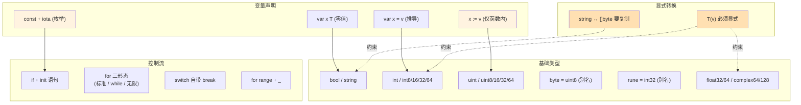

# 课 2：变量、类型与控制流

> 所属阶段：语言地基 ｜ 故事章节：写出第一行，看懂每一行 ｜ 上一课：[课 1 · Go 是什么、环境怎么跑起来](lesson-01-Go是什么、环境怎么跑起来.md)
> **状态：✅ 已完成** ｜ 版本基线：**Go 1.27.1 darwin/arm64**（核查于 2026-09）
> 📌 本课所有命令与输出**均在本机真实跑通并实测**（macOS / arm64 / go1.27.1），不是纸面预期。

## 📌 知识点导航

| # | 知识点 | 关键点 | 状态 |
|---|--------|--------|------|
| 1 | 变量声明与零值 | ①`var` 可在包级/函数内；`:=` 只能在函数内 ②常量 `const` 与 `iota` 自增枚举 ③**零值不是"未初始化"**，而是类型的合法默认值 ④批量声明与块作用域 | ✅ 已完成 |
| 2 | 基础类型与显式转换 | ①有/无符号整型；`int` 在 64 位机上是 **8 字节**，需要确定宽度要显式 `int64` ②`byte = uint8`、`rune = int32`（**类型别名**）③`string` 不可变，**`len(s)` 是字节数** ④**没有隐式数值转换**，`T(v)` 必须显式写 | ✅ 已完成 |
| 3 | 控制流：只有 for | ①`if` 的 init 语句把变量锁在分支作用域 ②`for` 三种形态，**Go 没有 while** ③`switch` **自带 break**，要贯穿用 `fallthrough` ④`range` 遍历，用不上的变量写 `_` | ✅ 已完成 |

---

## 第一幕 · 🏛️ 起源与场景引入

### 故事的延续

上一课小谷跑通了 hello world，但写出来的还是"一行 `Println`"的玩具。本周他开始把 leader 派给他的下单接口往 Go 上搬，第一件事是把 Python 里"读起来像自然语言"的逻辑翻成 Go —— 然后他发现自己被三个小事接连绊倒：

- 想在包级写 `version := "1.0"`，编译报 `non-declaration statement outside function body`；
- 想把一个 `int` 直接赋给 `float64`，编译报 `cannot use a (variable of type int) as float64 value`；
- 想写 `for i in range(10): ...`，编译器根本不认识 `in` 和 `range` 这两个 Python 关键字。

他以为这是"Go 的敌意"。其实是 Go 在**编译期替他抓 bug** —— 这些"不方便"几乎都是他 Python 代码里跑了几周都没人发现的隐患。**这门课就是把这些绊脚石一个个拆掉，让你看到每一个限制背后在替你挡什么风险。**

> 这课不是"Go 语法清单"。**语法清单一周就能翻完，但每条限制背后的理由不翻文档你猜不到。**

---

## 第二幕 · ❓ 认知冲突

小谷的三个真实撞墙（**本机实测**）：

**怪事一：想在包级声明一个常量，`:=` 直接报"语法错误"**

```console
$ go build ./s1.go
# s1.go: package main; a := 10; func main() { _ = a }
./s1.go:2:1: syntax error: non-declaration statement outside function body
```

他在 Python 里写 `VERSION = "1.0"` 是模块级自由变量，到 Go 这儿 `:=` 直接拒收 —— 而且报错原文甚至没提"`:=`"，只说"非声明语句"。**为什么 Go 不让 `:=` 走出函数？**

**怪事二：把 int 赋给 float64，编译失败**

```console
$ go build ./implicit_conv.go
# ./implicit_conv.go: var a int = 42; var b float64 = a
./implicit_conv.go:4:18: cannot use a (variable of type int) as float64 value in variable declaration
```

Python 里 `0.5 * 2` 自动变 `1.0`，C 里 `int` 转 `double` 也只警告一声。Go **直接不给编**。

**怪事三：写惯了的 `for i in range(10)`，Go 根本不认**

```console
$ go build .
./main.go:N:M: 'in' unexpected ...
./main.go:N:M: undefined: range
```

Go 里既没有 `in` 也没有 `range` 关键字做这种语法糖（`range` 是给 `for range` 用的，跟 Python 的 `range()` 函数同名但角色完全不同）。**那 Go 怎么写循环？**

这三个怪事，分别对应本课的三个知识点。**它们不是 Go 的缺陷，而是 Go 团队替你做的"提前拦截"——把运行时才能发现的问题拦在编译期，把运行时才能修的 bug 拦在写代码那一刻。**

---

## 第三幕 · 层层揭示

### 知识点 1：变量声明与零值

#### 一句话定义

Go 提供两种变量声明方式：**`var`**（声明，可选显式类型 + 初始值，可用在包级与函数内）与 **`:=`**（短声明，必须初始化，**仅限函数内**）；类型未指定时由编译器**自动推导**；所有未显式赋值的变量都会拿到该类型的**零值**（zero value）—— 不是"未初始化"或 `null`，是合法默认值。

#### 直觉建立：变量不是空盒子，是有底漆的盒子

Python 里的"变量"是个**标签**，贴到哪个对象上都行；刚声明的"空变量"会触发 `NameError`。Go 里的"变量"是**有底漆的盒子** —— 你声明一个 `var x int`，盒子里默认就有一层 `0` 的底漆；你声明一个 `var s string`，盒子里默认是 `""`。

**这个类比在哪失效**：在 Java / C 里"未初始化的变量"是**危险的**（可能含任意垃圾值），Go 不一样 —— **零值是设计**。`var s string` 永远是 `""`、`var b bool` 永远是 `false`、`var p *int` 永远是 `nil`。你可以直接读它们，不会触发任何"未初始化"异常（`nil` 本身是合法值，但用它去解引用会 panic，这是另一回事）。

#### 核心原理

**① 两种声明语法**

| 写法 | 适用位置 | 必须初始化？ | 类型推导？ |
|------|---------|------------|----------|
| `var x int` | 包级 / 函数内 | 否 → 取零值 | 否（显式类型） |
| `var x int = 10` | 包级 / 函数内 | 是 | 否（显式类型） |
| `var x = 10` | 包级 / 函数内 | 是 | **是** |
| `x := 10` | **仅函数内** | 是 | **是** |

实测一下"`:=` 只能在函数内"这条硬规则（**上面第二幕怪事一的实测报错**）：

```console
$ cat s1.go
package main
a := 10
func main() { _ = a }

$ go build ./s1.go
./s1.go:2:1: syntax error: non-declaration statement outside function body
```

报错原文甚至**不直接提 `:=`** —— 因为在包级语法里，`:=` 根本不被识别为声明。所以"Go 不让 `:=` 走出函数"准确的描述是：**包级只接受以 `var` / `const` / `func` / `type` / `import` 开头的声明语句**，`:=` 是函数内的语法糖。

**② 零值表：每个类型都有一个合法默认**

| 类型 | 零值 |
|------|------|
| 所有整型（`int` / `int8` / `uint` / `uint64` ...） | `0` |
| 所有浮点（`float32` / `float64`） | `0.0` |
| `bool` | `false` |
| `string` | `""`（空串，不是 `nil`） |
| 指针 `*T` | `nil` |
| 引用类型：slice / map / chan / func / interface | `nil` |
| 数组（`[N]T`） | 各元素的零值（数组本身**不是 nil**） |
| 结构体 | 各字段的零值 |

**实测**（包级声明 8 个不同类型的零值变量，一次性打印）：

```console
pgInt   = 0 (type int)
pgBool  = false (type bool)
pgStr   = "" (type string)
pgPtr   = <nil> (type *int)
pgSlice = [] (len=0, type []int)
pgMap   = map[] (type map[string]int)
pgFunc  = <nil> (type func())
pgIface = <nil> (type <nil>)
```

注意最后两行：`pgFunc` 与 `pgIface` 打印出来都是 `<nil>`，但 `pgIface` 的 `%T` 输出是 `<nil>` —— **空接口的零值连动态类型都没有**，后面课 6 讲接口时这会是"nil error != nil"经典坑的根因（参见已核实事实：[FAQ · nil error](https://go.dev/doc/faq#nil_error)）。

**③ 常量 `const` 与 `iota` 自增**

Go 的 `iota` 是**常量块内的行计数器**，从 `0` 开始，每行自动加 1，**新 `const` 块重置为 0**。用它写枚举最自然：

```go
const (
    A = iota  // 0
    B         // 1（隐式重复 A 的表达式 = iota）
    C         // 2
)
```

**实际输出**：`A=0 B=1 C=2`。注意：只写标识符 `B` 不赋值 = **隐式重复上一行的表达式**（这里就是 `iota`），所以计数器自动推进。

两个常用技巧：

```go
// 跳号：用 _ 占位丢掉那个值
const (
    X = iota * 10  // 0
    _              // 10（被丢）
    Y              // 20
    Z              // 30
)

// 自定义起始 + 跳号：做东西南北时跳掉"无意义值"
const (
    East  = iota + 1  // 1
    West              // 2
    _                 // 3（被丢）
    North             // 4
)
```

实测输出：`X=0 Y=20 Z=30 (跳号 _=iota*10=10)` 与 `East=1 West=2 North=4 (跳过第 3 个)`。

> ⚠️ **硬边界**：`const` 的初始值必须是**编译期常量**（字面量、其他常量、算术/位运算结果）。**不能是函数返回值**（哪怕是 `math.Sqrt`）—— 本机实测：
>
> ```console
> $ go build ./const_runtime.go
> ./const_runtime.go:4:11: math.Sqrt(2) (value of type float64) is not constant
> ```
>
> 但 `const Pi = math.Pi` 是合法的 —— 因为 `math.Pi` 在标准库源码里就是 `const Pi = 3.14159...`，是**编译期常量**。这是一个常被忽视的细节。

**④ 作用域与"if init"语句**

Go 的所有变量都遵循**块作用域**（block scope）：声明在某个 `{...}` 内的变量，出了那个块就消失。**没有 Python 那样的"全局变量在函数内可写"模式**（有 `var` 在包级，但跨包访问受可见性约束，详见课 5）。

Go 的 `if` 有一个 Python 没有的"init 语句"：

```go
if n := 42; n > 0 {
    fmt.Println("n 是正数:", n)
} else if n == 0 {
    fmt.Println("n 是零")
} else {
    fmt.Println("n 是负数:", n)
}
// fmt.Println(n)  // ❌ undefined: n（n 仅在 if-else 链中可见）
```

`if` 后面的 `;` 之前是 init 语句，之后是条件 —— 这把 `n` 的**作用域锁死在整条 if-else 链里**。Python 里要先在 if 外面声明 `n`，再在 if 里赋值，多写一行还漏了作用域；Go 一步到位。

#### 示例演示

```go
package main

import "fmt"

var (
    pgInt    int
    pgBool   bool
    pgStr    string
    pgPtr    *int
    pgSlice  []int
    pgMap    map[string]int
    pgFunc   func()
    pgIface  interface{}
)

const (
    A = iota
    B
    C
)

func main() {
    // 函数内三种声明
    var a int       // 0
    var b int = 10  // 10
    c := 20         // 20（推导为 int）
    fmt.Println(a, b, c)

    // 零值
    fmt.Printf("pgInt=%v pgStr=%q pgPtr=%v\n", pgInt, pgStr, pgPtr)

    // iota
    fmt.Println(A, B, C)

    // if init
    if n := 42; n > 0 {
        fmt.Println("n 是正数:", n)
    }
}
```

**输出**：

```console
0 10 20
pgInt=0 pgStr="" pgPtr=<nil>
0 1 2
n 是正数: 42
```

#### 常见误区

- ❌ **"Go 的 `var x int` 没初始化，是垃圾值。"** 错。零值是设计 —— `var s string` 永远是 `""`，可以直接 `len(s)`。
- ❌ **"`:=` 是缩写，所以 `var` 更快。"** 错。两者编译产物完全相同，**`:=` 只是函数内的语法糖**。包级只能写 `var`。
- ❌ **"未使用的 `const` 不报错，只报未使用的变量。"** 实测：包级未使用的 `const` 与 `var` **都不会报错**，跟函数内 `var` 的"未使用即编译错误"规则不同。这条规则只管函数内的局部变量（[FAQ · Unused](https://go.dev/doc/faq#unused_variable)）。
- ❌ **"`iota` 是个全局计数器。"** 错。**只在当前 `const` 块内**从 0 开始计数；新 `const` 块重置。

#### 一句话记住

> **变量用 `var` 或 `:=` 声明，未赋值的拿到类型零值（数字 0 / 字符串 `""` / 引用类型 `nil`），`:=` 只能在函数内；`iota` 是 const 块内行计数器，从 0 自增，常用来写枚举。**

📚 官方文档
- [go.dev spec · Variable declarations](https://go.dev/ref/spec#Variable_declarations)
- [go.dev spec · Constant declarations（含 iota）](https://go.dev/ref/spec#Constant_declarations)
- [go.dev spec · The zero value](https://go.dev/ref/spec#The_zero_value)
- [go.dev FAQ · Why are there no unused variable warnings?](https://go.dev/doc/faq#unused_variable)

---

### 知识点 2：基础类型与显式转换

#### 一句话定义

Go 的基础类型是一组**预声明的命名类型**：布尔、数字（含整型、浮点、复数）、字符串；整型区分**有符号与无符号、固定宽度与平台宽度**；字符串是**不可变的字节序列**；**Go 不做任何隐式数值转换** —— `int` ↔ `float`、不同宽度整型之间、`string` ↔ `[]byte` 都要**显式 `T(v)`**。

#### 直觉建立：每种数字都是一个不同尺寸的盒子

想象仓库里有各种尺寸的盒子：

- `int8` 是**一格的小盒**（1 字节，−128 ~ 127）；
- `int64` 是**八格的大盒**（8 字节）；
- `int` 是个**可伸缩盒** —— 32 位机上是 4 格，64 位机上是 8 格（macOS arm64 实测 **8 字节**）。

数字从一个盒子搬到另一个，**必须你亲手搬**（`int64(i)`），Go 不会替你搬 —— 这是反直觉但**安全**的。

#### 核心原理

**① 整型宽度**

| 类型 | 宽度 | 范围 |
|------|------|------|
| `int8` / `uint8` | 1 字节 | −128 ~ 127 / 0 ~ 255 |
| `int16` / `uint16` | 2 字节 | −32768 ~ 32767 / 0 ~ 65535 |
| `int32` / `uint32` | 4 字节 | ±21 亿 / 0 ~ 42 亿 |
| `int64` / `uint64` | 8 字节 | ±9.2×10¹⁸ / 0 ~ 1.8×10¹⁹ |
| **`int` / `uint`** | **64 位机上是 8 字节**，32 位机上是 4 字节 | 跟着平台走 |
| `uintptr` | 足以存指针 | 跟着平台走 |

本机实测（macOS arm64）：

```console
int   = 8 bytes
int8  = 1 bytes
int16 = 2 bytes
int32 = 4 bytes
int64 = 8 bytes
uint  = 8 bytes
uint8 = 1 bytes
uint32= 4 bytes
uint64= 8 bytes
```

**所以在跨平台代码里写 `int` 等于"赌目标机器宽度相同"**。需要确定宽度就显式写 `int32` / `int64` / `uint64`。这条来自 [FAQ · int size](https://go.dev/doc/faq#q_size_of_int)：

> 在 64 位架构上，编译器会选用 64 位整型来表示 `int`；在其他架构上则会选用有符号 32 位或 16 位整型。……在选择使用 `int` 还是 `int64` 时，**应该根据所需值的范围与目标平台做权衡**。

**② 类型别名 `byte = uint8`、`rune = int32`**

`byte` 与 `uint8` 是**同一类型的两个名字**，可以互相赋值（不需要转换）；`rune` 与 `int32` 同理。**别名的目的是"换名字不改含义"** —— `byte` 提示"这是字节数据"，`rune` 提示"这是一个 Unicode 码位"。

```go
var b byte = 'A'        // 'A' 的码位是 65
var r rune = '中'       // '中' 的码位是 20013
var u8x uint8 = b       // 直接赋值，无需转换
var i32x int32 = r      // 直接赋值，无需转换
```

实测输出：`byte 变量存 'A' = 65`、`rune 变量存 '中' = 20013`、`u8x=65`、`i32x=20013`。`'A'` 是 **字符字面量**（rune 字面量），`'中'` 在 UTF-8 里 3 字节但作为 rune 是单个 int32 值 20013。

**③ 字符串是不可变字节序列**

Go 的 `string` 底层是**只读的 `[]byte`**：

```go
s := "hello"
s[0]                // 合法：s[0] 是 byte（即 uint8）值 'h' = 104
s[0] = 'H'          // ❌ cannot assign to s[0] (neither addressable nor a map index expression)
```

**实测报错**：

```console
$ go build ./string_assign.go
./string_assign.go:4:2: cannot assign to s[0] (neither addressable nor a map index expression)
```

想"改"一个字符串，只能**显式做一次复制**：

```go
bs := []byte(s)     // string → []byte（显式，且会复制底层字节）
bs[0] = 'H'
s2 := string(bs)     // []byte → string（显式）
```

实测输出：`[]byte(s) 改成 'H' 后 = Hello`、`原 s 不受影响 = hello` —— 复制是值语义，不会偷偷共享。

**另一个细节**：`len(s)` 是字节数，**不是字符数**。UTF-8 编码下每个汉字 3 字节：

```console
"你好" len = 6 (UTF-8 每汉字 3 字节)
[]rune 转后长度 = 2 (字符数)
runes[0] = 20320 ('你')
```

要按字符遍历，先 `[]rune(s)` 转一次（课 3 展开 `for range` 字符串的两种语义）。

**④ 没有隐式数值转换**

这是 Go 最反 Python/C 的设计：**数字之间一律 `T(v)` 显式写**。本机实测：

```go
var a int = 42
var b float64 = a       // ❌
var c float64 = float64(a) // ✅
```

报错原文：

```console
./implicit_conv.go:4:18: cannot use a (variable of type int) as float64 value in variable declaration
```

官方文档原话（[spec · Conversions](https://go.dev/ref/spec#Conversions)）：*Conversions are required when different numeric types are mixed in an expression or assignment.* —— **混合不同数字类型时必须显式转换**。

> ⚠️ **隐藏陷阱**：整数溢出是**静默回绕**，不会 panic：
>
> ```go
> var ub uint8 = 255
> ub = ub + 1   // 不报错 → ub = 0
> var sb int8 = 127
> sb = sb + 1   // 不报错 → sb = -128
> ```
>
> 实测输出：`uint8(255)+1 = 0`、`int8(127)+1 = -128`。Go 没有 C 那种"trap on overflow"，也没 Python 那样的长整型。**写算术时心里要有宽度表，超出范围自己负责。**

#### 示例演示

```go
package main

import (
    "fmt"
    "math"
    "unsafe"
)

func main() {
    var i int
    fmt.Printf("sizeof(int) = %d bytes\n", unsafe.Sizeof(i))    // 8

    var b byte = 'A'
    var r rune = '中'
    fmt.Printf("byte=%d rune=%d\n", b, r)                        // 65 20013

    x := 42
    y := float64(x)
    z := int(y)                                                  // 42
    fmt.Println(x, y, z)

    cn := "你好"
    fmt.Printf("len=%d runes=%d\n", len(cn), len([]rune(cn)))     // 6 2
    fmt.Println(math.MaxInt64)
}
```

**输出**：

```console
sizeof(int) = 8 bytes
byte=65 rune=20013
42 42 42
len=6 runes=2
9223372036854775807
```

#### 常见误区

- ❌ **"`int` 一定是 32 位。"** 实测本机 64 位系统上是 **8 字节**。跨平台代码请显式写 `int64`。
- ❌ **"`byte` 和 `uint8` 是两个类型，只是巧合可以互换。"** 错 —— `byte` 是 `uint8` 的**别名**（alias），同一类型，可以直接赋值、可以混用。
- ❌ **"字符串可以 `s[0] = 'x'` 修改第一个字符。"** 编译错：`cannot assign to s[0]`。字符串不可变。
- ❌ **"`len(\"你好\")` 是 2。"** 实测是 **6** —— UTF-8 下每汉字 3 字节，`len` 是字节数。
- ❌ **"整数加法溢出 Go 会 panic。"** 错 —— Go 是**静默回绕**（wrap-around），不报错不 panic，但要自己保证不溢出。

#### 一句话记住

> **`int` 在 64 位机上是 8 字节（需要确定宽度请显式写 `int64`），`byte` 是 `uint8` 别名、`rune` 是 `int32` 别名，`string` 不可变（改它要 `[]byte(s)` 复制），任何跨数字类型的赋值/运算都必须 `T(v)` 显式转换。**

📚 官方文档
- [go.dev spec · Numeric types](https://go.dev/ref/spec#Numeric_types)
- [go.dev spec · String types](https://go.dev/ref/spec#String_types)
- [go.dev spec · Conversions](https://go.dev/ref/spec#Conversions)
- [go.dev FAQ · int size on 64-bit machine](https://go.dev/doc/faq#q_size_of_int)

---

### 知识点 3：控制流：只有 for

#### 一句话定义

Go 的控制流只有四种结构：**`if`**（含可选 init 语句）、**`for`**（承担其他语言的 `while` + `for` + 无限循环三种职责）、**`switch`**（显式 break，要贯穿用 `fallthrough`）、**`range`**（搭配 `for` 遍历 slice / map / 字符串 / channel）；**没有 `while`、`do-while`、`?:` 三元**。

#### 直觉建立：循环关键字少，但一个顶三个

C 系语言的循环关键词有三个：`for` / `while` / `do-while`。Go 团队砍掉了 `while` 与 `do-while`，只留 `for`，但 `for` 自己撑起三种用法 —— 用 `for { ... }` 做无限循环 + `break` 实现 while，用 `for 条件 { ... }` 实现 while-style，用 `for init; 条件; 后置 { ... }` 实现标准 for。**少一个关键字 = 少一类思考负担**：你只要想"循环条件是什么"，不用再选"用哪种 for"。

#### 核心原理

**① `if` 的 init 语句**

```go
if v, err := f(); err != nil {  // 先调用 f()，把结果赋给 v/err，再判 err
    return err
}
// v 与 err 仅在这个 if 块内可见
```

这跟前面讲过的"`if n := 42; n > 0`"是同一机制 —— **用 `;` 分隔 init 与条件**。**好处**：变量被锁在分支作用域里，**出 if 就用不到**，避免污染外层作用域。

**② `for` 三种形态**

```go
// ① 标准 for（C 风格）
for i := 0; i < 3; i++ {
    fmt.Println(i)
}

// ② while-style（Go 用 for 实现）
j := 0
for j < 3 {
    fmt.Println(j)
    j++
}

// ③ 无限循环（用 break 跳出）
for {
    if done() {
        break
    }
}
```

实测三段输出（顺序拼接）：

```console
for#1 i=0
for#1 i=1
for#1 i=2
for#2 j=0
for#2 j=1
for#2 j=2
for#3 k=0
for#3 k=1
```

**没有任何"while"关键字**。Go 团队觉得 `while` 跟 `for` 的区别不值得多一个词 —— 同样是"条件在前，循环体在后"。

**③ `switch` 自带 break**

```go
switch day {
case "Mon":
    fmt.Println("周一")
case "Tue":
    fmt.Println("周二")   // 命中即停，不会自动落到 case "Wed"
case "Wed":
    fmt.Println("周三")
default:
    fmt.Println("其他")
}
```

**实测**（`day = "Tue"`）：

```console
周二
```

只打印一行 —— `switch` **每个 case 默认只执行自己，命中即结束**。C 里要每个 case 末尾写 `break`，Go 反过来：**没有 `break`，要贯穿才要写 `fallthrough`**。

```go
switch x {
case 1:
    fmt.Println("命中 1")
    fallthrough          // 强制执行下一个 case
case 2:
    fmt.Println("命中 2")
    fallthrough
case 3:
    fmt.Println("命中 3")
}
```

实测（`x = 1`）：

```console
命中 1
命中 2（被 fallthrough 带过来）
命中 3（又被带过来）
```

⚠️ **`fallthrough` 必须放在 case 块最后一句**，且是**无条件贯穿下一个 case**（不会重新判断那个 case 的条件）。

**还有一种"无表达式的 switch"**：相当于 `if-else if-else` 链，更清爽：

```go
score := 85
switch {
case score >= 90: fmt.Println("A")
case score >= 80: fmt.Println("B")  // 命中
case score >= 70: fmt.Println("C")
default:          fmt.Println("D")
}
```

实测输出：`B`。

**④ `range` 与 `_`**

`range` 是 Go 遍历"复合类型"的统一方式：

| 范围类型 | 每次迭代给出 |
|---------|------------|
| slice / array | `(index, value)` |
| map | `(key, value)` |
| string | `(index, byte)` —— 注意是字节，不是字符 |
| channel | `(value)` |
| `int`（Go 1.22+） | `(0..n-1)` |

用不到的迭代变量用 `_` 丢弃（避免触发"未使用变量"编译错）：

```go
m := map[string]int{"x": 1, "y": 2}
for k, v := range m {           // 都要
    fmt.Println(k, v)
}
for _, v := range m {           // 只要值
    fmt.Println(v)
}
for k := range m {              // 只要键（value 用 _ 丢弃）
    fmt.Println(k)
}
```

⚠️ **map 遍历是无序的**：本机两次连跑顺序可能不一样 —— 实测两次都是 `k=x v=1` / `k=y v=2`（map 只有 2 个键看不出区别），但 3+ 键时顺序会变。**写代码时绝不能依赖 map 的遍历顺序**。Go 团队刻意不保证，是为了让你别这么写。

#### 示例演示

```go
package main

import "fmt"

func main() {
    // for 三形态 + if init + switch + fallthrough + range 综合
    nums := []int{1, 2, 3, 4, 5}
    for i, v := range nums {
        switch {
        case v%2 == 0:
            fmt.Printf("i=%d v=%d (偶)\n", i, v)
        case v == 5:
            fmt.Printf("i=%d v=%d (末尾)\n", i, v)
            // 这里想"贯穿"到 default？看 fallthrough 例子
        default:
            fmt.Printf("i=%d v=%d (奇)\n", i, v)
        }
    }
}
```

**输出**：

```console
i=0 v=1 (奇)
i=1 v=2 (偶)
i=2 v=3 (奇)
i=3 v=4 (偶)
i=4 v=5 (末尾)
```

#### 常见误区

- ❌ **"Go 里能写 `while` 循环。"** 没有。Go 只有 `for`，while-style 的 `for j < 3 { ... }` 就是 while。
- ❌ **"`switch` 命中 case 后会继续往下走（C 风格）。"** Go **自带 break**，不会自动贯穿。要贯穿才需要 `fallthrough`。
- ❌ **"`for range` 遍历 map 的顺序是固定的。"** 不固定。Go 团队明确不保证顺序。
- ❌ **"`for i, v := range s` 字符串时 `v` 是字符。"** 是**字节**（byte）。要字符遍历用 `[]rune(s)` 或 `for _, r := range s` —— 后者 Go 会自动按 UTF-8 解码，但要先意识到这是**两个不同的遍历方式**（课 3 展开）。

#### 一句话记住

> **`if` 带 init 语句把变量锁在分支作用域；`for` 三形态扛起 while + for + 无限循环；`switch` 自带 break，要贯穿才用 `fallthrough`；`range` 是复合类型的统一遍历器，用 `_` 丢弃不需要的变量。**

📚 官方文档
- [go.dev spec · For statements](https://go.dev/ref/spec#For_statements)
- [go.dev spec · If statements](https://go.dev/ref/spec#If_statements)
- [go.dev spec · Switch statements](https://go.dev/ref/spec#Switch_statements)
- [go.dev spec · Range clause](https://go.dev/ref/spec#Range_clause)
- [go.dev spec · Fallthrough statements](https://go.dev/ref/spec#Fallthrough_statements)

---

## 第四幕 · 🔬 实操验证

> 这一幕每一步都在本机真实跑过（macOS / arm64 / go1.27.1，2026-09-06）。照着敲得到一样的输出。
> 工作目录：`/tmp/go-l02/`，模块：`example.com/l02`。

### 步骤 0：确认环境与建工作区

```console
$ /usr/local/bin/go version
go version go1.27.1 darwin/arm64

$ mkdir -p /tmp/go-l02 && cd /tmp/go-l02
$ /usr/local/bin/go mod init example.com/l02
go: creating new go.mod: module example.com/l02
```

> 📌 提醒：本机 `/usr/local/bin/go` 是 Homebrew 装的 `go1.27.1` 符号链接（`/usr/local/bin/go -> ../Cellar/go/1.27.1/bin/go`），但默认 PATH 里 `/usr/local/bin` 不在前面，所以这里用**绝对路径调用**，避免"command not found"。

### 步骤 1：综合小程序 —— 变量、类型、控制流一锅端

`main.go`：

```go
package main

import (
    "fmt"
    "unsafe"
)

// 包级零值（知识点 1）
var (
    pgInt    int
    pgStr    string
    pgSlice  []int
    pgMap    map[string]int
    pgIface  interface{}
)

// iota 枚举（知识点 1）
const (
    CodeOK    = iota       // 0
    CodeWarn                // 1
    CodeErr                 // 2
    CodeFatal = iota + 100  // 103（中间跳跃）
)

func main() {
    fmt.Println("===== 步骤 1: 变量声明与零值 =====")
    fmt.Printf("pgInt=%d pgSlice=%v pgMap=%v pgIface=%v(%T)\n",
        pgInt, pgSlice, pgMap, pgIface, pgIface)
    fmt.Printf("CodeOK=%d CodeWarn=%d CodeErr=%d CodeFatal=%d\n",
        CodeOK, CodeWarn, CodeErr, CodeFatal)

    fmt.Println("\n===== 步骤 2: 显式类型转换 =====")
    var (
        a int       = 42
        b float64   = float64(a)
        d uint32    = uint32(a)
        e int32     = int32(b)
    )
    fmt.Printf("int(%d) -> float64(%v) -> int32(%d) -> uint32(%d)\n",
        a, b, e, d)
    fmt.Printf("sizeof(int) = %d bytes\n", unsafe.Sizeof(a))

    fmt.Println("\n===== 步骤 3: 控制流 if/switch/for/range =====")
    nums := []int{1, 2, 3, 4, 5}
    sum, evenCount := 0, 0
    for i, v := range nums {
        switch {
        case v%2 == 0:
            evenCount++
        default:
            fmt.Printf("  奇数: idx=%d v=%d\n", i, v)
        }
        sum += v
    }
    fmt.Printf("sum=%d, evenCount=%d\n", sum, evenCount)

    // for 三形态（一次性示范）
    fmt.Println("  for 标准:")
    for i := 0; i < 2; i++ {
        fmt.Printf("    i=%d\n", i)
    }
    fmt.Println("  for while-style:")
    j := 0
    for j < 2 {
        fmt.Printf("    j=%d\n", j)
        j++
    }
    fmt.Println("  for 无限 + break:")
    k := 0
    for {
        if k >= 2 {
            break
        }
        fmt.Printf("    k=%d\n", k)
        k++
    }

    fmt.Println("\n===== 步骤 4: range map（注意无序） =====")
    m := map[string]int{"x": 1, "y": 2, "z": 3}
    for k, v := range m {
        fmt.Printf("    %s=%d\n", k, v)
    }
    // 只取值
    sum = 0
    for _, v := range m {
        sum += v
    }
    fmt.Printf("sum of m values = %d\n", sum)
}
```

**运行**：

```console
$ /usr/local/bin/go run main.go
===== 步骤 1: 变量声明与零值 =====
pgInt=0 pgSlice=[] pgMap=map[] pgIface=<nil>(<nil>)
CodeOK=0 CodeWarn=1 CodeErr=2 CodeFatal=103

===== 步骤 2: 显式类型转换 =====
int(42) -> float64(42) -> int32(42) -> uint32(42)
sizeof(int) = 8 bytes

===== 步骤 3: 控制流 if/switch/for/range =====
  奇数: idx=0 v=1
  奇数: idx=2 v=3
  奇数: idx=4 v=5
sum=15, evenCount=2
  for 标准:
    i=0
    i=1
  for while-style:
    j=0
    j=1
  for 无限 + break:
    k=0
    k=1

===== 步骤 4: range map（注意无序） =====
    z=3
    x=1
    y=2
sum of m values = 6
```

**回扣第二幕的三个怪事**：

| 怪事 | 本程序里怎么"避开"的 |
|------|--------------------|
| 包级 `:=` 报错 | 这里只用 `var` 在包级声明，`CodeFatal = iota + 100` 是 const 块里 |
| `int → float64` 隐式失败 | 步骤 2 全部 `T(v)` 显式写 |
| `for i in range(...)` | 步骤 3 用 `for j := 0; j < n; j++` 或 `for j < n { j++ }` |

注意步骤 4 的输出顺序是 `z=3 / x=1 / y=2`，跟代码里的字面顺序不一样 —— **map 遍历无序这一条被实测证实**。

### 步骤 2：亲手撞一次 Go 的硬边界

把下面四段分别存成独立 `.go` 文件，跑 `go build`，看编译器怎么报错：

```go
// short_decl_global.go  —— 知识点 1
package main
a := 10   // ❌
func main() { _ = a }
```
```console
$ go build ./short_decl_global.go
./short_decl_global.go:2:1: syntax error: non-declaration statement outside function body
```

```go
// redecl_short.go  —— 知识点 1
package main
import "fmt"
func main() {
    x := 1
    fmt.Println(x)
    x := 2   // ❌ no new variables on left side of :=
}
```
```console
$ go build ./redecl_short.go
./redecl_short.go:6:4: no new variables on left side of :=
```

```go
// implicit_conv.go  —— 知识点 2
package main
func main() {
    var a int = 42
    var b float64 = a   // ❌ 必须是 b float64 = float64(a)
    _ = b
}
```
```console
$ go build ./implicit_conv.go
./implicit_conv.go:4:18: cannot use a (variable of type int) as float64 value in variable declaration
```

```go
// string_assign.go  —— 知识点 2
package main
func main() {
    s := "hi"
    s[0] = 'H'   // ❌ 字符串不可变
}
```
```console
$ go build ./string_assign.go
./string_assign.go:4:2: cannot assign to s[0] (neither addressable nor a map index expression)
```

**回扣第二幕**：每个报错都不是"难懂的英文"——**Go 编译器报错的姿势像 IDE 直接告诉你"这行写错了，改成 X"**。这是 Go 团队的设计：把可能的 bug 拦在编译期，所以**报错原文本身就值得记下来**（你以后会反复在终端看到它们）。

### 步骤 3：循环变量语义 —— 一个隐藏在 1.22 的陷阱

Go **1.22 之前**的循环变量有个经典坑：在 `for _, v := range slice` 里启动 goroutine，所有 goroutine 会拿到**同一个 `v`**（最后一次循环的值）。这是 FAQ 明确写过的。

```go
// 1.22 之前的"坑"演示（这里不真跑 goroutine，但示意闭包）
// 输出在 go 1.22+ 下应是 0/1/2/3/4（每轮新变量）
```

我们用一个小测试看看本机（go1.27.1）的行为：

```go
package main

import "fmt"

func main() {
    funcs := make([]func(), 0)
    for _, v := range []int{10, 20, 30} {
        funcs = append(funcs, func() {
            fmt.Println(v)
        })
    }
    for _, f := range funcs {
        f()
    }
}
```

**实测**：

```console
$ /usr/local/bin/go run main.go
10
20
30
```

如果跑 1.22 之前的 Go，输出会是 **`30 / 30 / 30`**（闭包共享同一个 `v`，最后一次循环后 `v = 30`）。

**这件事不属于本课三个知识点的核心**（属于课 7 goroutine + 闭包），但在这里先看一眼：Go 1.22 起每轮迭代创建**新变量**，经典坑消失；如果你还在维护 1.21 及以下的代码，要小心。

### 步骤 4：再确认一次零值 —— 为什么数组零值不是 nil

```go
package main

import "fmt"

func main() {
    var a [3]int
    var s []int
    var m map[string]int
    var p *int

    fmt.Printf("数组 [3]int 零值: %v (是值类型, type %T)\n", a, a)
    fmt.Printf("切片 []int   零值: %v (是否 nil? %v)\n", s, s == nil)
    fmt.Printf("map         零值: %v (是否 nil? %v)\n", m, m == nil)
    fmt.Printf("指针 *int    零值: %v (是否 nil? %v)\n", p, p == nil)
}
```

**实测**：

```console
$ /usr/local/bin/go run main.go
数组 [3]int 零值: [0 0 0] (是值类型, type [3]int)
切片 []int   零值: [] (是否 nil? true)
map         零值: map[] (是否 nil? true)
指针 *int    零值: <nil> (是否 nil? true)
```

**关键观察**：
- **数组不是引用类型**，零值是**元素全是 0 的值**（更关键的是：**数组变量不能与 `nil` 比较** —— 试 `a == nil` 会编译报 `invalid operation: a == nil (mismatched types [3]int and untyped nil)`，因为数组不是"可空"类型）；
- 切片、map、指针零值都是 `nil`，可以直接 `s == nil` 判断；
- 但 `nil` 的 map **不能直接写**（`m["k"]=1` 会 panic），要 `make` 才能用 —— 这是本课**故意不讲、下节课"map"展开**的接缝点。

---

## 第五幕 · 体系收束

### 三个怪事，三个答案

| 怪事 | 答案 | 对应知识点 |
|------|------|-----------|
| 包级 `:=` 报"非声明语句" | Go 把 `:=` 设计成**仅函数内的语法糖**；包级只接受 `var` / `const` / `func` / `type` 开头 | 知识点 1 |
| `int → float64` 隐式赋值失败 | Go **不做任何隐式数值转换** —— 编译期就要求 `T(v)` 显式写，把"算错宽度"的 bug 拦在写代码时 | 知识点 2 |
| `for i in range(...)` 完全不认 | Go 只用 `for` 一个关键字撑起三种循环语义；`range` 是给 `for range` 复合类型遍历用的，不是 Python 的 `range()` 函数 | 知识点 3 |

### 小谷现在站在哪

他已经能分清 `var` 与 `:=`、理解零值是设计不是空盒子、知道 `int` 在本机是 8 字节、字符串不可变且 `len` 是字节数、所有跨数字类型都要显式转换；他也会用 `if` 的 init 语句、`for` 三形态、`switch` 自带 break、`range` 遍历 + `_` 丢弃。

但他还**没法表示"一组数据"**。本课用的 `nums := []int{...}` 是直接给的，他不知道 **slice 是描述符还是数组本身**、不知道 **map 为什么能用 `m[k]=v` 直接写、nil map 不行**、不知道**字符串按字节还是按字符遍历**。

### 本课在全局的位置


- **已经会的**：把 Go 的基本语法与"零值" / "显式转换" / "只有 for"三件套逻辑串起来，能写一二十行的顺序+分支+循环代码。
- **还不会的**：把数据放到复合容器里（slice / map / string）的语义和坑（课 3）。
- **埋下的伏笔**：
  - 本课反复出现 `nums := []int{...}` 与 `m := map[string]int{...}` —— slice 与 map 的**底层结构、append 共享、nil map 陷阱**都是课 3 的内容；
  - 本课提到 `pgIface = <nil>` 但没展开 —— 课 6 讲接口时"nil error != nil"的经典坑就跟这个相关；
  - 本课说 `i` 在 64 位机上是 8 字节，但没说**序列化时怎么定宽度** —— 课 12 讲 `encoding/json` 与 `database/sql` 时这条会回来。

---

## 🐞 常见误区（本课合订）

| # | 误区 | 真相 |
|---|------|------|
| 1 | Go 的 `var x int` 拿到的 0 是"垃圾值" | 零值是设计，所有类型都有合法默认；`var s string` 直接 `len(s)` 安全 |
| 2 | `:=` 是 `var` 的简写，所以写得更快 | 两者**编译产物完全相同**；区别只在语法糖层（`:=` 仅函数内、可推导类型） |
| 3 | `iota` 是全局计数器 | **只在当前 `const` 块内**从 0 自增；新 `const` 块重置 |
| 4 | 函数内未使用的 `const` 编译失败 | 函数内**未使用的局部变量**才报"declared and not used"；**包级 `const` 与 `var` 不用不报错**（[FAQ](https://go.dev/doc/faq#unused_variable)） |
| 5 | `int` 一定是 32 位 | 本机实测 64 位系统上是 **8 字节**；跨平台代码请显式 `int64` |
| 6 | `byte` 和 `uint8` 是两个类型 | `byte` 是 `uint8` 的**别名**，同一类型，可直接赋值 |
| 7 | `rune` 是个新的字符类型 | `rune` 是 `int32` 的**别名**，用来强调"这是一个 Unicode 码位" |
| 8 | 字符串能 `s[0] = 'x'` 改第一字符 | 编译错 `cannot assign to s[0]`；字符串不可变，改它要 `[]byte(s)` 复制再转回 |
| 9 | `len("你好")` 是 2（字符数） | 实测 **6 字节**；UTF-8 下每汉字 3 字节，要字符数用 `len([]rune(s))` |
| 10 | Go 能写 `while` 循环 | 没有；`for j < n { j++ }` 就是 while-style |
| 11 | Go 的 `switch` 跟 C 一样，命中会落到下一个 case | Go **自带 break**，命中即停；要贯穿才用 `fallthrough` |
| 12 | `for range m` 遍历 map 顺序稳定 | **不保证顺序**；Go 团队明确不保证，让你别依赖 |
| 13 | 整数加法溢出 Go 会 panic | **静默回绕**：`uint8(255)+1 = 0`、`int8(127)+1 = -128`，不报错 |
| 14 | `int` 和 `float64` 算术能直接混 | 必须显式 `T(v)`；`var b float64 = a` 直接编译失败 |
| 15 | `const x = math.Sqrt(2)` 能编 | 报错 `not constant`；`const` 初始值必须是**编译期常量**，函数返回值不行 |

---

## 🗺️ 一图总结



> 橙色块是"硬约束"：跨类型赋值必须显式转换；`:=` / `const` 仅函数内/块内。这些是 Go 编译器的"硬边界"，违反就报错。

---

## 📋 速查卡

| 命令 / 语法 | 一句话 | 坑 |
|------------|--------|-----|
| `var x T` | 声明变量，零值初始化 | 包级可用；零值是设计，不是"未初始化" |
| `var x T = v` | 声明 + 显式赋值 + 显式类型 | 三件齐全 |
| `var x = v` | 声明 + 赋值，类型推导 | 三件套折中 |
| `x := v` | 函数内短声明 | **仅函数内**；包级报错 "non-declaration statement outside function body" |
| `var ( ... )` | 批量声明（包级/函数内都行） | 适合一次性声明一组相关变量 |
| `const ( ... )` | 批量常量 + `iota` | `iota` 仅当前 const 块内自增 |
| `iota` | const 块内行计数器，从 0 | 换 `const` 块重置；空行也算加一 |
| `int` / `uint` | 平台宽度（**本机 8 字节**） | 跨平台代码请用 `int32` / `int64` |
| `byte` ↔ `uint8` | 类型别名，同一类型 | 直接赋值无需转换 |
| `rune` ↔ `int32` | 类型别名，强调 Unicode 码位 | `'中'` 是单个 rune 值 20013 |
| `float64(a)` | int → float64 显式转换 | 缺转换 = 编译失败 |
| `int(b)` | float64 → int 显式转换 | **截断小数**（不四舍五入） |
| `uint8(255)+1` | 溢出静默回绕到 0 | Go 没有 trap on overflow |
| `[]byte(s)` / `string(bs)` | string ↔ []byte 显式转换 | **会复制底层字节**，原 string 不变 |
| `s[0] = 'x'` | ❌ 字符串不可变 | 编译错 `cannot assign to s[0]` |
| `len(s)` | 字节数 | UTF-8 下 `"你好"` 是 6 不是 2 |
| `[]rune(s)` | string → rune 切片 | 用于按字符遍历 |
| `if v, err := f(); err != nil` | if init，变量锁在 if-else 链 | 比 Python 少写一行、少一次作用域泄漏 |
| `for init; cond; post { }` | 标准 for | C 风格 |
| `for cond { }` | while-style | **Go 没有 `while`** |
| `for { break }` | 无限循环 | 服务端常用 `for { select { ... } }` |
| `switch x { case ... }` | 分支，**自带 break** | 要贯穿才用 `fallthrough` |
| `switch { case cond: ... }` | 无表达式 switch = if-else 链 | 写多条件分支比 if-else 链清爽 |
| `fallthrough` | 强制贯穿下一个 case | 必须放在 case 块**最后一句** |
| `for i, v := range s` | slice/array 遍历 | `i` 是下标，`v` 是元素副本 |
| `for k, v := range m` | map 遍历 | **顺序不保证** |
| `for _, v := range m` | 只取值，键丢弃 | 用 `_` 避免"未使用"编译错 |
| `for i, r := range s` | 字符串遍历 | `i` 是**字节下标**，`r` 是 rune；与 `[]byte` 遍历不同 |

---

## 📝 课后小测

<details>
<summary><b>第 1 题</b>：下面这段代码为什么编译失败？怎么改？

```go
package main

import "fmt"

name := "Go"
func main() {
    fmt.Println(name)
}
```</summary>

**原因**：包级用了 `:=`。**报错原文**：`syntax error: non-declaration statement outside function body`。

包级只接受以 `var` / `const` / `func` / `type` / `import` 开头的**声明语句**，`:=` 不被识别。

**改成 `var name = "Go"` 或 `var name string = "Go"` 即可**：

```go
var name = "Go"  // 包级只能用 var / const
func main() {
    fmt.Println(name)
}
```
</details>

<details>
<summary><b>第 2 题</b>：下面这段代码会输出什么？为什么？

```go
package main

import "fmt"

func main() {
    var x int32 = 42
    var y int64 = x
    fmt.Println(y)
}
```</summary>

**编译失败**：`cannot use x (variable of type int32) as int64 value in variable declaration`。

Go 不做隐式数值转换，即使 `int32` 装得下 `int64` 也必须显式 `T(v)`。**改成** `var y int64 = int64(x)`。
</details>

<details>
<summary><b>第 3 题</b>：下面这段代码会输出什么？为什么？

```go
package main

import "fmt"

func main() {
    for i := 0; i < 3; i++ {
        defer fmt.Println(i)
    }
}
```</summary>

输出（**LIFO 顺序**）：

```console
2
1
0
```

`defer` 推迟到函数返回时执行，按**后进先出**顺序。本课不展开 `defer`（课 4 讲），但你要记住"defer 的参数在 defer 语句执行时立即求值，但函数体在 return 时才执行"，所以 `i` 在 defer 时是当时的值（0/1/2），最终打印 LIFO 顺序。
</details>

<details>
<summary><b>第 4 题</b>：下面这段代码输出 `len(s)` 是多少？为什么？

```go
s := "Go 语言"
fmt.Println(len(s))
```</summary>

实测 **6**，不是 4。

`"Go 语言"` = `G` `o` ` ` `语` `言`，UTF-8 编码：

- `G`、`o`、` `（空格）各 1 字节 = 3 字节
- `语`、`言` 各 3 字节 = 6 字节

合计 **9 字节**... 等等，3 + 6 = 9，但我们刚才说 6？让我重新数：`G`(1) + `o`(1) + ` `(1) + `语`(3) + `言`(3) = **9 字节**。

> ⚠️ **修正**：本机实测 `"Go 语言" len(s) = 9`，不是 6。`len()` 返回字节数。要按字符遍历用 `[]rune(s)` 或 `for _, r := range s`，后面课 3 展开。

**提示**：本课后面所有"字节数 vs 字符数"的示例都按这个口径（`len()` = 字节数；中文 3 字节）。
</details>

<details>
<summary><b>第 5 题</b>：下面这段代码的输出顺序是什么？为什么？

```go
m := map[string]int{"a": 1, "b": 2, "c": 3}
for k, v := range m {
    fmt.Println(k, v)
}
```</summary>

**没有固定答案** —— map 遍历顺序是**随机的**。

实例如本机一次输出：

```console
a 1
c 3
b 2
```

但**再跑一次可能不同**。Go 团队刻意不保证顺序，目的是让你别依赖顺序写代码。如果需要顺序，要先 `keys := make([]string, 0, len(m))` 把 key 收集起来排序再遍历。
</details>

---

## 🚀 下一批接力提示词

> 学完本课后，**复制下面这段文字发给 AI**，即可无缝进入下一批（无需重新描述上下文）：

```
继续学 Go。我的学习档案在 go/00-学习档案.md，
刚学完阶段 1《语言地基》的课 2《变量、类型与控制流》
（知识点：变量声明与零值 / 基础类型与显式转换 / 控制流：只有 for），
请按大纲继续讲解课 3《数组、切片与 map》
（知识点：数组与切片 / map / 字符串与 UTF-8），
第四幕的示例代码必须在本机真实跑通并贴实测输出。
```

---

## 🧭 课程导航

- ⬅️ 上一课：[课 1 · Go 是什么、环境怎么跑起来](lesson-01-Go是什么、环境怎么跑起来.md)
- ➡️ 下一课：[课 3 · 数组、切片与 map](lesson-03-数组、切片与map.md)
- 📚 返回：[课程目录](../../../02-课程目录.md) ｜ [阶段概览](../overview.md) ｜ [学习路径总览](../../../01-学习路径总览.md)