# 课 3：数组、切片与 map

> 所属阶段：语言地基 ｜ 故事章节：写出第一行，看懂每一行 ｜ 上一课：[课 2 · 变量、类型与控制流](lesson-02-变量、类型与控制流.md)
> **状态：✅ 已完成** ｜ 版本基线：**Go 1.27.1 darwin/arm64**（核查于 2026-09）
> 📌 本课所有命令与输出**均在本机真实跑通并实测**（macOS / arm64 / go1.27.1），不是纸面预期。

## 📌 知识点导航

| # | 知识点 | 关键点 | 状态 |
|---|--------|--------|------|
| 1 | 数组与切片 | ①数组是**值类型**、切片是**描述符**（data 指针 + len + cap）②`append` 与扩容（<256 段翻倍，大容量渐进增长）③共享底层数组导致"改一个影响另一个"这个高频坑 ④`make([]T, len, cap)` 预分配减少扩容搬运 | ✅ 已完成 |
| 2 | map | ①哈希表直觉与字面量 ②`v, ok := m[k]` 的 comma-ok 区分"值就是零值"与"键不存在" ③遍历顺序**无序**（不要依赖顺序）④**map 并发写不安全** + 元素不可取地址 | ✅ 已完成 |
| 3 | 字符串与 UTF-8 | ①`string` 本质是只读字节序列 ②`len(s)` 是**字节数**不是字符数（中文一个字 3 字节）③`for range` 按 rune 迭代但 **下标 `i` 仍是字节下标** ④`strings` 与 `strconv` 常用函数速览 | ✅ 已完成 |

---

## 第一幕 · 🏛️ 起源与场景引入

### 故事的延续

课 2 结束时，小谷能写顺序、分支、循环了 —— 但他写出来的还是"一次性脚本"：**数据一多就没地方放**。

这周他开始给下单接口搭数据层的雏形：

- **待处理订单列表** → 需要一个"能增长的容器" → 切片
- **订单 ID → 订单详情的缓存** → 需要一个"按键查值"的容器 → map
- **订单里的收货地址文本** → 字符串

他原以为这三样东西跟 Python 的 `list` / `dict` / `str` 差不多，"照着名字用就行"。然后踩了三个坑，而且**每个坑都不是语法错，是语义错** —— 代码能编译、单测能过，只有在真实数据量或并发下才炸。

> 这一课是**阶段 1 的收尾**，也是 Go 里"容器语义"这一层的地基。Go 的容器不像 Python 那样"帮你把什么都想好了"——它的每个容器都有明确的底层结构，你不懂这个结构，写出来的服务就是**压测即崩的伏笔**。

---

## 第二幕 · ❓ 认知冲突

小谷的三个真实撞墙（**本机实测**）：

**怪事一：两个切片各自 append，一个把另一个的数据覆盖了**

```console
初始: src=[1 2 3 4 5 6] s1=[1 2 3](len=3,cap=6) s2=[4 5 6](len=3,cap=3)
append(s1, 99) 后:
  s1 =[1 2 3 99]
  s2 =[99 5 6]  <-- s2[0] 被 99 覆盖了！
  src=[1 2 3 99 5 6]
```

他只动了 `s1`，`s2` 的值却变了。**`append` 一个切片，为什么会写坏另一个？**

**怪事二：压测一上并发，map 直接把进程打崩**

```console
fatal error: concurrent map writes

goroutine 96 [running]:
internal/runtime/maps.fatal(...)
	/usr/local/Cellar/go/1.27.1/libexec/src/runtime/panic.go:1195 +0x20
```

不是返回错误，不是抛异常，是 **`fatal error` —— 进程直接死**。他懵了：我只是多个请求同时写缓存而已。

**怪事三：`len()` 数出来的不是字符数，按它截断中文变乱码**

```console
cn = "你好, Go", len=10 (字节数)
```

`"你好, Go"` 肉眼是 6 个字符，`len()` 却说是 10。他按 `len()` 去截断地址文本，结果中文被砍成半个字，日志里一片 `�`。

这三个怪事，分别对应本课的三个知识点。**它们都不是"Go 不好用"，而是 Go 把容器的底层语义摆在了明面上 —— 你看见它，就能预判行为；你忽略它，它就在线上等你。**

---

## 第三幕 · 层层揭示

### 知识点 1：数组与切片

#### 一句话定义

- **数组 `[N]T`** 是**值类型**：固定长度，赋值与传参都是**完整复制**。
- **切片 `[]T`** 是**描述符**（slice header）：三个 word = 指向底层数组的 `data` 指针 + `len`（当前长度）+ `cap`（容量）。切片赋值/传参只复制这 24 字节的头部，**底层数组仍然共享**。

#### 直觉建立：数组是"整箱搬走"，切片是"一张提货单"

想象一个仓库里的一排货位：

- **数组** = 你把整排货位**连货带架子整个搬回家**。谁改自己家的货，跟别人无关。代价是搬一次很费劲（复制全部元素）。
- **切片** = 你只拿一张**提货单**（写着"从第几号货位开始、能提几件、仓库这一排总共有多少位置"）。提货单复制一百张都很便宜（24 字节），但**所有拿着单子的人提的是同一批货** —— 一个人改了货，其他人看到的都变了。

**这个类比在哪失效**：提货单有"能提几件"（len）和"这排总共有多少位置"（cap）两个数，而真实仓库没这么复杂。**更关键的是**：`append` 不是"往单子上添一行"—— 当"这排位置"不够时，Go 会把**整批货搬到一个更大的新仓库**，并给你换一张新单子。这时候新旧单子就**分家**了，谁也影响不了谁。

#### 核心原理

**① 数组是值类型（实测）**

```go
arr1 := [3]int{1, 2, 3}
arr2 := arr1        // 完整复制（不是共享！）
arr2[0] = 99
```

实测输出：

```console
arr1=[1 2 3] (改 arr2 不影响 arr1)
arr2=[99 2 3]
  函数内 a 改后: [999 20 30]
调用 modifyArray 后 arr3=[10 20 30] (传参也是完整复制)
sizeof([3]int) = 24 bytes (3 × 8 = 24)
```

传参也是复制 —— `modifyArray(arr3)` 在函数里把 `a[0]` 改成 999，**调用方的 `arr3` 纹丝不动**。

> ⚠️ **这跟你课 2 学的"数组不能与 `nil` 比较"是同一件事的两面**：数组是值类型，它本身就是"数据"，不是"指向数据的引用"。课 2 实测 `a == nil` 编译报 `mismatched types [3]int and untyped nil`，正是这个语义的硬证据。

**② 切片头只有 24 字节（实测）**

```console
sizeof(slice header) = 24 bytes (3 个 word: data/len/cap)
```

三个 word 在 64 位机上各 8 字节：`data`（指针 8）+ `len`（8）+ `cap`（8）= 24。**所以复制一个切片的成本永远只有 24 字节，跟它"装了多少元素"无关** —— 这是切片高效的原因，也是所有共享陷阱的根源。

**③ `len` 与 `cap` 不等（关键！）**

```go
s := []int{1, 2, 3, 4, 5}
s1 := s[:3]  // len=3 cap=5
s2 := s[3:]  // len=2 cap=2
```

实测：

```console
s    = [1 2 3 4 5] len=5 cap=5
s1=[1 2 3] len=3 cap=5
s2=[4 5] len=2 cap=2
```

注意 `s2 := s[3:]` 的 **cap 是 2 不是 5** —— 因为 `s[3:]` 的 `data` 指针已经指到第 3 号位置，它"往后能用的位置"只剩 `5-3=2` 个。**`cap` 是"从 data 指针开始到底层数组末尾的距离"，不是"底层数组总长"。**

**④ 共享底层数组 —— 本课第一大坑（实测）**

```go
s2[0] = 999   // 只改 s2
```

```console
s2[0] = 999 后:
  s  = [1 2 3 999 5] (原切片也跟着变!)
  s1 = [1 2 3]
  s2 = [999 5]
  函数内 s 改后: [999 2 3]
调用 modifySlice(s1) 后 s=[999 2 3 999 5]
```

`s`、`s1`、`s2` 三个切片共享同一块底层数组，改任何一个的元素，其他全部可见 —— 包括**传给函数之后在函数里改**。

**⑤ 最阴的陷阱：`append` 静默覆盖邻居（实测）**

这是把 ①②③ 串起来的经典事故：

```go
src := []int{1, 2, 3, 4, 5, 6}
s1 := src[:3]  // [1 2 3] len=3 cap=6  ← cap 还有 3 个富余！
s2 := src[3:]  // [4 5 6] len=3 cap=3
s1 = append(s1, 99)  // cap 够 → 不分配新数组，直接写 src[3] 的位置
```

实测：

```console
初始: src=[1 2 3 4 5 6] s1=[1 2 3](len=3,cap=6) s2=[4 5 6](len=3,cap=3)
append(s1, 99) 后:
  s1 =[1 2 3 99]
  s2 =[99 5 6]  <-- s2[0] 被 99 覆盖了！
  src=[1 2 3 99 5 6]
```

**`s2[0]` 从 4 变成了 99，而代码里一个字都没碰过 `s2`。** 原因：`s1` 的 `cap=6 > len=3`，`append` 判定"容量够，不用搬家"，于是把 99 写进了底层数组的第 4 个位置 —— 而那个位置正是 `s2[0]` 指向的地方。

**解法：用三索引切片 `s[low:high:max]` 把 `cap` 钉死**

```go
src2 := []int{1, 2, 3, 4, 5, 6}
t1 := src2[:3:3]  // len=3 cap=3（把 cap 也钉死 = high）
t2 := src2[3:]
t1 = append(t1, 99)  // cap 满 → 必定分配新数组
```

实测：

```console
初始: t1=[1 2 3](len=3,cap=3) t2=[4 5 6]
append(t1, 99) 后:
  t1 =[1 2 3 99] (搬到新数组)
  t2 =[4 5 6]  <-- 安全，没被覆盖
```

**三索引 `s[low:high:max]` 的含义**：`len = high-low`，`cap = max-low`。把 `max` 设成等于 `high`，就把 `cap` 压到跟 `len` 一样大 —— 任何 `append` 都必然触发搬家，从而与别人彻底分家。

**⑥ `append` 的扩容策略（实测 + 规范警告）**

```console
-- 小容量段（< 256）--
start cap=1
  len=2: cap 1 -> 2 (x2.00)
  len=3: cap 2 -> 4 (x2.00)
  len=5: cap 4 -> 8 (x2.00)
  len=9: cap 8 -> 16 (x2.00)
  len=17: cap 16 -> 32 (x2.00)

-- 跨越 256 阈值 --
start cap=200
  len=201: cap 200 -> 400 (x2.000)

-- 更大容量段 --
start cap=1000
  len=1001: cap 1000 -> 1536 (x1.536)
```

规律：**小容量（<256）时翻倍；大容量时渐进增长**（约 1.25 倍 + 向上取整到内存规格，所以实测 `1000 → 1536` 而不是 1250）。

> ⚠️ **规范警告（重要）**：**扩容后的具体 `cap` 值不是语言规范保证的**。规范只说"`append` 会分配一个足够大的新数组"，具体多大是实现细节，**Go 版本之间可能变**（Go 1.18 就调整过扩容公式）。
>
> **所以：永远不要写死依赖 `cap` 具体值的代码**。你只应该依赖 `len()`。想知道"够不够用"用 `len(s) < cap(s)` 判断，不要假设"append 之后 cap 一定是 2 倍"。

**⑦ 预分配 `make([]T, len, cap)` 值不值（实测 + 临界点）**

反复扩容的代价是"每次都要把老元素搬到新数组"。预分配能省掉这些搬运。实测（预热后跑 20 轮取最快）：

| N | 预分配（最快） | 不预分配（最快） | 提速 |
|---|--------------|----------------|------|
| 100 | 41ns | 84ns | **2.05x** |
| 1,000 | 291ns | 833ns | **2.86x** |
| 10,000 | 6.541µs | 10.583µs | 1.62x |
| 100,000 | 29.417µs | 166.709µs | **5.67x** |
| 1,000,000 | 290.666µs | 1.356875ms | **4.67x** |
| 5,000,000 | 1.427459ms | 6.770917ms | **4.74x** |

**临界点与适用区间**（本仓库纪律：凡比较结论必须给区间）：

- **N ≥ 10 万：预分配收益明显（实测 4.7~5.7 倍）**，值得写 `make([]T, 0, n)`。
- **N 在 100~1 万：收益 1.6~2.9 倍**，且绝对值都在微秒级 —— **只有在热路径（每秒调用几千次以上）才值得**。
- **N < 100：差异淹没在噪声里**，不值得为它写死 `cap`，可读性优先。
- **例外**：即使 N 小，如果你**确切知道**最终长度（比如 `make([]T, 0, len(src))` 做转换），顺手写上 `cap` 是零成本的，写就写了。

**⑧ `copy`：显式复制，彻底隔离**

```go
src := []int{1, 2, 3}
dst := make([]int, len(src))
copy(dst, src)
dst[0] = 999
```

实测：`src=[1 2 3]  dst=[999 2 3] (改 dst 不影响 src)`。

`copy` 返回**实际复制的元素数**（=`min(len(dst), len(src))`）。**想让两个切片互不干扰，`copy` 是唯一可靠手段。**

**⑨ 陷阱：切片传给函数后 `append`，调用方看不到**

```go
func grow(x []int) {
    x = append(x, 7)   // 改的是形参副本
}

s := make([]int, 0, 10)
grow(s)
```

实测：

```console
  grow 内 x=[7] len=1 cap=10
调用 grow(s) 后 s=[] len=0 (调用方看不到 append 的结果)
```

即使 `cap` 足够、没有扩容，`s` 的 `len` 仍然是 0 —— 因为 `append` 返回的新长度只赋给了形参 `x`。**正确做法**：`func grow(x []int) []int { return append(x, 7) }`，调用方 `s = grow(s)`。

#### 示例演示

```go
package main

import "fmt"

func main() {
    // 数组：值类型
    a1 := [3]int{1, 2, 3}
    a2 := a1
    a2[0] = 99
    fmt.Println(a1, a2)                    // [1 2 3] [99 2 3]

    // 切片：共享底层
    s := []int{1, 2, 3, 4, 5}
    s1 := s[:3]
    s1[0] = 111
    fmt.Println(s)                          // [111 2 3 4 5]

    // 三索引隔离
    t := s[:2:2]
    t = append(t, 888)
    fmt.Println(s, t)                       // s 不受影响

    // copy 隔离
    src := []int{1, 2, 3}
    dst := make([]int, len(src))
    copy(dst, src)
    dst[0] = 999
    fmt.Println(src, dst)                   // src 不受影响
}
```

**输出（本机实测）**：

```console
[1 2 3] [99 2 3]
[111 2 3 4 5]
[111 2 3 4 5] [111 2 888]
[1 2 3] [999 2 3]
```

注意第三行：`s` 仍是 `[111 2 3 4 5]`，而 `t` 变成了 `[111 2 888]` —— **三索引成功隔离了 `append`**，没有污染原切片。

#### 常见误区

- ❌ **"切片赋值是深拷贝。"** 只复制 24 字节头部，底层数组共享 —— 这是所有切片陷阱的根源。
- ❌ **"`cap` 是底层数组总长度。"** 是"从 `data` 指针到数组末尾的距离"。`s[3:]` 的 `cap` 会变小。
- ❌ **"`append` 总是分配新数组。"** `cap` 够时原地写（**正是这时候会覆盖邻居**）。
- ❌ **"`append` 后 `cap` 一定翻倍。"** 大容量时是渐进增长 + 内存对齐取整；**且规范不保证具体值**，别依赖。
- ❌ **"把切片传给函数后 `append`，外面能看到。"** 看不到 —— `len` 在形参副本上。要返回新切片。
- ❌ **"数组和切片差不多，就是长度固定不固定。"** 完全不同：数组是值（复制整个数据），切片是描述符（复制 24 字节头部 + 共享底层）。

#### 一句话记住

> **数组是值类型（赋值/传参都整个复制），切片是 24 字节的"指针+len+cap"描述符（复制便宜但共享底层）；`append` 在 cap 够时原地写、会覆盖邻居，用 `s[low:high:max]` 钉死 cap 或 `copy` 来隔离；预分配在 N≥10 万时收益 4.7~5.7 倍，小切片不值得。**

📚 官方文档
- [go.dev spec · Slice types](https://go.dev/ref/spec#Slice_types)
- [go.dev spec · Slice expressions（含三索引 full slice expression）](https://go.dev/ref/spec#Slice_expressions)
- [go.dev spec · Appending and copying slices](https://go.dev/ref/spec#Appending_and_copying_slices)
- [go.dev blog · Go Slices: usage and internals（官方切片内部原理）](https://go.dev/blog/slices-intro)
- [go.dev blog · Arrays, slices (and strings): The mechanics of 'append'](https://go.dev/blog/slices)

---

### 知识点 2：map

#### 一句话定义

`map[K]V` 是 Go 内置的**哈希表**：把 `K` 类型的键映射到 `V` 类型的值。用 `map[K]V{...}` 字面量或 `make(map[K]V, hint)` 创建；用 `m[k]` 读（键不存在返回**值类型的零值**）、`m[k] = v` 写、`delete(m, k)` 删；用 **`v, ok := m[k]`** 的 comma-ok 区分"值就是零值"与"键不存在"。

#### 直觉建立：字典 + 一个"查不到就给默认值"的怪脾气

map 就像一本字典：你查 "apple"，它给你释义。

**但 Go 的 map 有个怪脾气**：你查一个**根本没有的词**（比如 "cherry"），它不会说"没这个词"，而是**一声不吭地给你一个空字符串**。

```go
counts := map[string]int{"apple": 3}
fmt.Println(counts["cherry"])  // 输出 0 —— 但 "cherry" 根本不存在！
```

这跟 Python 的 `dict["cherry"]` 直接抛 `KeyError` 完全不同。**Go 选择"返回零值"**，方便你写 `counts[w]++` 这种统计代码（不用先判断键存不存在），代价就是**你得用 comma-ok 才能分清"值是 0"和"键不存在"**。

**这个类比在哪失效**：真实字典不会自己变页码顺序，而 **Go 的 map 遍历顺序是随机的**（下面 ③ 会实测）。另外，真实字典多人同时翻没问题，而 **Go 的 map 多人同时写会直接把进程搞崩**（下面 ⑥）。

#### 核心原理

**① 创建：`sizeof` 只有一个指针（实测）**

```console
sizeof(map header) = 8 bytes (一个指向 hmap 的指针)
```

`map` 变量本身只是**一个指向 `hmap` 结构的指针**（8 字节）。所以 map 赋值/传参也是"共享"，不是复制 —— 跟切片一个道理，但 map 连 `len`/`cap` 都不放在头部里。

```go
m1 := map[string]int{"a": 1, "b": 2, "c": 3}
m2 := make(map[string]int, 10)  // 10 只是"容量提示 hint"，不是上限
m2["x"] = 100
```

⚠️ `make` 的第二个参数是 **hint（提示）**，不是容量上限 —— map 会自动扩容，写 10 也能装 1000 个键。它的作用跟切片的 `cap` 类似：**预分配能减少扩容搬运**。

**② comma-ok：区分"零值"与"不存在"（实测）**

```console
counts[apple] = 3
counts[cherry] = 0 (不存在也是 0 — 跟 apple=0 时分不清!)
counts[apple] -> v=3, ok=true
counts[cherry] -> v=0, ok=false (ok=false 表示键不存在)
```

**这是 map 最常用的惯用法**：

```go
v, ok := m[k]
if ok {
    // 键存在，v 是真实值
} else {
    // 键不存在，v 是零值（不是真实数据）
}
```

经典应用 —— 词频统计（正好利用了"不存在返回零值"这个特性）：

```go
text := "the quick brown fox jumps over the lazy dog the"
wordCount := map[string]int{}
for _, w := range strings.Split(text, " ") {
    wordCount[w]++   // 不存在时 m[w] 是 0，0+1=1，正好！
}
```

实测输出：`the: 3`、其余各 1。

**③ 遍历顺序无序（实测：10 键跑 5 次）**

```console
===== map 遍历无序验证（10 个键，跑 5 次）=====
第 1 次: k5 k7 k3 k4 k6 k8 k9 k0 k1 k2
第 2 次: k0 k1 k2 k5 k7 k3 k4 k6 k8 k9
第 3 次: k0 k1 k2 k5 k7 k3 k4 k6 k8 k9
第 4 次: k3 k4 k6 k8 k9 k0 k1 k2 k5 k7
第 5 次: k0 k1 k2 k5 k7 k3 k4 k6 k8 k9
```

**5 次跑出了 3 种不同顺序**（有些重复是巧合，不是"稳定"）。Go 团队**刻意随机化**遍历起点，就是为了让你**不要依赖顺序写代码** —— 依赖了就必然在某些机器上、某些数据量下炸。

**要有序遍历？自己排序**：

```go
keys := make([]string, 0, len(m))
for k := range m {
    keys = append(keys, k)
}
sort.Strings(keys)          // 排序
for _, k := range keys {
    fmt.Println(k, m[k])    // 按 key 顺序访问
}
```

> 🎯 **一个反直觉的实测陷阱**：**`fmt.Println(m)` 打印出来的 map 是"有序"的**（Go 1.12 起 `fmt` 为了让输出可复现，会**内部按 key 排序**再打印），但 **`for range` 是无序的**。本机实测（4 键跑 4 次）：
>
> ```console
> === fmt.Println(m) 跑 4 次（看是否稳定）===
>    map[apple:1 banana:2 mango:13 zebra:26]
>    map[apple:1 banana:2 mango:13 zebra:26]
>    map[apple:1 banana:2 mango:13 zebra:26]
>    map[apple:1 banana:2 mango:13 zebra:26]     ← 稳定（fmt 排序了）
> === for range 跑 4 次 ===
>    zebra apple mango banana
>    zebra apple mango banana
>    banana zebra apple mango     ← 不一样了！
>    zebra apple mango banana
> ```
>
> **调试时你看 `fmt.Println(m)` 觉得"map 是有序的"，于是写出依赖顺序的代码 —— 上线就炸。** 记住：**打印有序 ≠ 遍历有序。**

**④ 删除后再查（实测）**

```console
delete(m1, "b") 后 m1=map[a:1 c:3]
查 m1[b] -> v=0, ok=false (键已被删)
```

`delete` 一个不存在的键**不会报错**（no-op）。

**⑤ 元素不可取地址（实测编译错）**

```go
_ = &m1["a"]
```

```console
./err_map_addr.go:6:7: invalid operation: cannot take address of m1["a"] (map index expression of type int)
```

**为什么**：map 扩容时会"搬迁"键值对，元素的内存地址随时可能变。如果允许你持有地址，扩容后这个指针就悬空了。**Go 直接在编译期禁止。**

连带效应 —— **不能直接改 map 里 struct 的字段**：

```go
orders := map[string]Order{"o1": {ID: 1, Total: 100}}
orders["o1"].Total = 200   // ❌
```

```console
./err_map_struct_field.go:7:2: cannot assign to struct field m["a"].X in map
```

两个办法：

```go
// 办法 1：整个取出 → 改 → 整个放回去
o := orders["o1"]
o.Total = 200
orders["o1"] = o

// 办法 2：map 里装指针（*Order），可以直接改字段
ordersPtr := map[string]*Order{"o1": {ID: 1, Total: 100}}
ordersPtr["o1"].Total = 999   // ✅
```

实测：`orders=map[o1:{1 200}]`、`ordersPtr=map[o1:0x...]`（装指针可直接改）。

**⑥ map 并发写不安全 —— 本课第二大坑（实测）**

```go
m := make(map[string]int)
var wg sync.WaitGroup
for i := 0; i < 100; i++ {
    go func() { defer wg.Done(); m[...] = i }()
}
```

```console
fatal error: concurrent map writes

goroutine 96 [running]:
internal/runtime/maps.fatal({0x10019877c?, 0x10018f134?})
	/usr/local/Cellar/go/1.27.1/libexec/src/runtime/panic.go:1195 +0x20
```

**`fatal error` 不是 `panic`** —— 它**不能被 `recover` 捕获**，进程直接死。Go 的 map 内置了并发写检测，一旦探测到就主动让进程崩溃，**宁可死给你看，也不给你一个静默损坏的数据结构**。

用 `-race` 能拿到更精确的报告：

```console
fatal error: concurrent map writes
==================
WARNING: DATA RACE
Write at 0x00c00007e0f0 by goroutine 8:
  runtime.mapaccess2_faststr()
      /usr/local/Cellar/go/1.27.1/libexec/src/internal/runtime/maps/runtime_faststr.go:120 +0x2bc
  main.main.func1()
      /tmp/go-l03/race_demo.go:17 +0xe8

Previous write at 0x00c00007e0f0 by goroutine 9:
  ...
```

官方 FAQ 的明确立场（[Why are map operations not defined to be atomic?](https://go.dev/doc/faq#atomic_maps)）：

> 典型用法不需要从多个 goroutine 安全地访问 map。……**只从多个 goroutine 读是安全的；一旦有写就不安全。**……需要时通常用更大粒度的同步（如 `sync.Mutex`）。

> 📌 **前向引用**：本课的 `go` 关键字、`sync.WaitGroup`、`sync.Mutex` 都只是"演示现象"用的，**系统讲解在阶段 3（课 7 goroutine / 课 9 sync 与数据竞争）**。`sync.Map` 也留到课 9 —— 它只适合特定模式（如读多写少的静态缓存），**不是内置 map 的通用替代品**（官方 FAQ 明确这么说）。

**⑦ nil map：能读不能写（实测）**

```go
var m map[string]int   // nil map
_ = m["a"]             // ✅ 读：返回零值 0
m["a"] = 1             // ❌ 运行时 panic
```

```console
panic: assignment to entry in nil map

goroutine 1 [running]:
main.main()
	/tmp/go-l03/err_nil.go:4 +0x34
```

**注意这个报错的时机**：`go build` **能通过**（编译期不检查），**运行时才 panic**。所以"声明了 map 忘了 `make`"是个很容易漏到线上的 bug。

#### 示例演示

```go
package main

import (
    "fmt"
    "sort"
)

func main() {
    m := map[string]int{"banana": 2, "apple": 1, "cherry": 3}

    // comma-ok
    if v, ok := m["apple"]; ok {
        fmt.Println("apple =", v)
    }
    if _, ok := m["durian"]; !ok {
        fmt.Println("durian 不存在")
    }

    // 无序遍历
    fmt.Print("无序: ")
    for k := range m {
        fmt.Print(k, " ")
    }
    fmt.Println()

    // 有序遍历
    keys := make([]string, 0, len(m))
    for k := range m {
        keys = append(keys, k)
    }
    sort.Strings(keys)
    fmt.Print("有序: ")
    for _, k := range keys {
        fmt.Print(k, "=", m[k], " ")
    }
    fmt.Println()

    // 删除
    delete(m, "banana")
    fmt.Println("删除后:", m)
}
```

**输出（本机实测，连跑 3 次）**：

```console
apple = 1
durian 不存在
无序: banana apple cherry            ← 第 1、2 次
有序: apple=1 banana=2 cherry=3      ← 稳定（排序过）
删除后: map[apple:1 cherry:3]        ← fmt 打印是排序的
---
apple = 1
durian 不存在
无序: cherry banana apple            ← 第 3 次不一样了！
有序: apple=1 banana=2 cherry=3
删除后: map[apple:1 cherry:3]
```

**三个观察**：

1. **"无序"那行 3 次跑出 2 种顺序** —— 随机化坐实；
2. **"有序"那行稳定** —— 因为我们先 `sort.Strings(keys)`；
3. **`删除后: map[apple:1 cherry:3]` 看起来也"有序"** —— 这是 `fmt` 内部排序的功劳，**不是 map 本身有序**（见上面 ③ 的陷阱）。

#### 常见误区

- ❌ **"map 的键不存在会返回 `nil` 或报错。"** 返回值类型的**零值**（int→0、string→""、指针→nil）。**必须用 comma-ok 才能区分。**
- ❌ **"`make(map[K]V, 10)` 最多装 10 个。"** 10 是**容量提示**，不是上限；map 会自动扩容。
- ❌ **"map 遍历顺序是插入顺序或 key 排序。"** **随机** —— Go 刻意为之。要顺序自己 `sort`。
- ❌ **"`fmt.Println(m)` 打印有序，所以 map 有序。"** **陷阱** —— `fmt` 内部排序只是为了输出可复现；`for range` 仍然无序。
- ❌ **"map 可以随便并发写。"** `fatal error: concurrent map writes` —— **不可 recover，进程直接死**。多读没事，一有写就危险。
- ❌ **"可以对 map 元素取地址 / 直接改 struct 字段。"** 编译错 —— 扩容会让地址失效。装指针可绕过。
- ❌ **"声明了 `var m map[K]V` 就能写。"** **nil map 写会 panic**（但 `go build` 能过！）。必须 `make`。
- ❌ **"`delete` 不存在的键会报错。"** 不会，静默 no-op。

#### 一句话记住

> **map 是哈希表：查不到的键返回值类型的零值（要用 `v, ok := m[k]` 区分"值为零"与"键不存在"），遍历顺序随机（要顺序自己排序，`fmt` 打印有序是假象），元素不可取地址，nil map 能读不能写，多 goroutine 一有写就 `fatal error` 直接崩（不可 recover）。**

📚 官方文档
- [go.dev spec · Map types](https://go.dev/ref/spec#Map_types)
- [go.dev FAQ · Why are map operations not defined to be atomic?](https://go.dev/doc/faq#atomic_maps)
- [go.dev blog · Go maps in action](https://go.dev/blog/maps)
- [pkg.go.dev · sync.Map 文档](https://pkg.go.dev/sync#Map)

---

### 知识点 3：字符串与 UTF-8

#### 一句话定义

Go 的 `string` 是**只读的字节序列**（底层是 `[]byte`，但不可修改），**默认按 UTF-8 编码**。`len(s)` 返回**字节数**（不是字符数）；`for range s` 会自动按 UTF-8 解码出 rune，但**循环变量 `i` 仍是字节下标**（会跳着走）；要按"字符"处理就转 `[]rune(s)`，要按字节处理就用 `[]byte(s)`。

#### 直觉建立：字符串是"一串贴了编号的字节"

把 `"你好, Go"` 想象成一排格子：

```
字节下标:  0   1   2   3   4   5   6   7   8   9
字节值:   E4  BD  A0  E5  A5  BD  2C  20  47  6F
字符:     [-----你-----][-----好-----] ,  ␣  G  o
```

- `len()` 数的是**格子数 = 10**；
- 你肉眼看到的**字符数 = 6**（你、好、,、空格、G、o）；
- 一个汉字**占 3 个格子**（UTF-8 规则）。

`for range` 遍历时，Go 会"聪明地"一次跳 3 格读出一个完整的"你"，但它**告诉你的位置 `i` 仍然是格子编号**（0 → 3 → 6）。

**这个类比在哪失效**：真实世界你不会去数格子。而代码里你会 —— 尤其是做**截断**（`s[:n]`）、**取子串**（`s[i:j]`）、**按位置取字符**（`s[i]`）时，`i` 是字节下标这件事会直接导致中文乱码。

#### 核心原理

**① `len()` 是字节数（实测）**

```console
hello = "hello", len=5
cn    = "你好, Go", len=10 (字节数)
```

`"你好, Go"` 肉眼 6 个字符，`len()` = 10。**这与课 2 实测的 `len("Go 语言") = 9` 是同一条规则**（G/o/空格 各 1 字节 + 语/言 各 3 字节 = 9）。

**② 两种遍历的对比（实测）**

```console
-- 2. for range 按 rune vs 按字节下标 --
  按字节下标遍历 (拿到的是 byte):
    i=0 byte=228 (0xE4)
    i=1 byte=189 (0xBD)
    i=2 byte=160 (0xA0)
    i=3 byte=229 (0xE5)
    i=4 byte=165 (0xA5)
    i=5 byte=189 (0xBD)
    i=6 byte=44 (0x2C)
    i=7 byte=32 (0x20)
    i=8 byte=71 (0x47)
    i=9 byte=111 (0x6F)
  按 rune 遍历 (for range 自动 UTF-8 解码):
    i=0 rune=20320 ('你')
    i=3 rune=22909 ('好')
    i=6 rune=44 (',')
    i=7 rune=32 (' ')
    i=8 rune=71 ('G')
    i=9 rune=111 ('o')
```

**关键观察**：

- 按字节遍历：**10 次**，每次拿到 1 个字节（汉字被拆成 3 个数字：228/189/160 → "你"）。
- 按 rune 遍历：**6 次**，每次拿到 1 个完整字符（20320 → '你'）。
- **`i` 的值是 0, 3, 6, 7, 8, 9 —— 跳着走！** 因为 `i` 是**字节下标**，读一个 3 字节的汉字后 `i` 就 +3。

> ⚠️ **这是本课第三大坑的根源**：如果你用 `for i, r := range s` 得到 `i`，然后拿 `i` 去给另一个字符串做 `s2[i]`，**在中文场景下会错位**。

**③ 字符数的正确算法（实测）**

```console
utf8.RuneCountInString("你好, Go") = 6
[]rune(cn) = [20320 22909 44 32 71 111], len=6 (字符数)
[]byte(cn) = [228 189 160 229 165 189 44 32 71 111], len=10 (字节数)
```

三种数"字符数"的办法：

| 办法 | 返回 | 备注 |
|------|------|------|
| `len(s)` | **字节数** | ❌ 不是字符数 |
| `utf8.RuneCountInString(s)` | 字符数 | ✅ 只数不分配，最快 |
| `len([]rune(s))` | 字符数 | ✅ 但会分配一个 rune 切片 |

**只要数个数用 `RuneCountInString`；要按字符操作才转 `[]rune`。**

**④ `strings` 包速览（实测）**

```console
strings.Split("/usr/local/bin/go", "/") = [ usr local bin go]
strings.Contains("/usr/local/bin/go", "bin") = true
strings.HasPrefix("/usr/local/bin/go", "/usr") = true
strings.HasSuffix("/usr/local/bin/go", "go") = true
strings.Index("/usr/local/bin/go", "bin") = 11
strings.ToLower("Hello, Go") = "hello, go"
strings.Replace("foo bar foo", "foo", "baz", -1) = "baz bar baz"
strings.TrimSpace("  hi  ") = "hi"
```

**⑤ `strconv` 包速览（实测）**

```console
strconv.Atoi("42") = 42 (err=<nil>)
strconv.ParseFloat("3.14", 64) = 3.14 (err=<nil>)
strconv.Itoa(255) = "255"
strconv.ParseBool("true") = true (err=<nil>)
strconv.Atoi("not-a-number") err = strconv.Atoi: parsing "not-a-number": invalid syntax
```

> ⚠️ `strconv.Atoi` 的第二个返回值 `err` **必须检查**（`strconv.Atoi: parsing "not-a-number": invalid syntax`）。这是课 4「error 是值」的典型场景 —— **现在先记住"这些转换函数都返回 `(值, error)`，别忽略 error"**。

**⑥ 字符串拼接与 `strings.Builder`**

```go
s := "hello" + " " + "world"   // 偶尔一次可以

// 循环里拼接用 Builder（避免反复分配）
var sb strings.Builder
sb.WriteString("多行")
sb.WriteString("字符串")
sb.WriteString("拼接")
sb.WriteByte('!')
```

实测：`strings.Builder: "多行字符串拼接!"`。

**适用区间**：拼接次数 **< 5 次**用 `+` 就行（可读性好）；**循环里或次数多**用 `strings.Builder`。Go 的 `+` 在编译期能优化连续的常量拼接，但**循环内的 `s += x` 是 O(n²)**。

**⑦ 字符串不可变（课 2 已实测，此处回扣）**

```go
cn[0] = 'h'   // ❌ 编译错
```

```console
cannot assign to s[0] (neither addressable nor a map index expression)
```

想改就转 `[]byte` / `[]rune`（**会复制**），改完再 `string(...)` 转回来。

#### 示例演示

```go
package main

import (
    "fmt"
    "unicode/utf8"
)

func main() {
    s := "你好, Go"
    fmt.Printf("len=%d (字节), RuneCount=%d (字符)\n",
        len(s), utf8.RuneCountInString(s))

    fmt.Println("按 rune 遍历:")
    for i, r := range s {
        fmt.Printf("  i=%d rune=%q\n", i, r)
    }

    // 安全截断：按字符截断（不是按字节！）
    runes := []rune(s)
    if len(runes) > 4 {
        fmt.Printf("前 4 个字符: %q\n", string(runes[:4]))
    }
    // 危险的按字节截断（会切坏中文）
    fmt.Printf("前 4 个字节: %q  <-- 乱码！\n", s[:4])
}
```

**输出（本机实测）**：

```console
len=10 (字节), RuneCount=6 (字符)
按 rune 遍历:
  i=0 rune='你'
  i=3 rune='好'
  i=6 rune=','
  i=7 rune=' '
  i=8 rune='G'
  i=9 rune='o'
前 4 个字符: "你好, "
前 4 个字节: "你\xe5"  <-- 乱码！
```

最后两行是本课第三大坑的**现场**：`s[:4]` 切在"好"字的第 1 个字节上，剩下的 `\xe5` 不是合法 UTF-8，打印出来就是乱码。**订单里的收货地址被这么截断过一次，你就永远记得了。**

#### 常见误区

- ❌ **"`len(s)` 是字符数。"** 是**字节数**。中文一个字 3 字节。
- ❌ **"`for range` 的 `i` 是字符下标。"** 是**字节下标**，会跳着走（0, 3, 6...）。
- ❌ **"`s[i]` 取到第 i 个字符。"** 取到第 i 个**字节**（`byte`）。
- ❌ **"截断中文用 `s[:n]`。"** 会切坏字符产生乱码 —— 先 `[]rune(s)` 再切。
- ❌ **"字符串可以修改。"** 不可变（课 2 实测 `cannot assign to s[0]`）。
- ❌ **`strconv.Atoi` 不检查 error 也没事。** 会返回 0 + error，静默把非法输入当 0 用 —— **必须检查**。

#### 一句话记住

> **`string` 是只读字节序列，`len()` 是字节数不是字符数；`for range` 按 rune 解码但下标 `i` 仍是字节下标（会跳）；截断中文必须先 `[]rune(s)` 再切，否则切出乱码；`strings` 管文本操作、`strconv` 管字符串↔数字转换（记得检查 error）。**

📚 官方文档
- [go.dev spec · String types](https://go.dev/ref/spec#String_types)
- [go.dev blog · Strings, bytes, runes and characters in Go（必读）](https://go.dev/blog/strings)
- [pkg.go.dev · strings](https://pkg.go.dev/strings)
- [pkg.go.dev · strconv](https://pkg.go.dev/strconv)
- [pkg.go.dev · unicode/utf8](https://pkg.go.dev/unicode/utf8)

---

## 第四幕 · 🔬 实操验证

> 这一幕每一步都在本机真实跑过（macOS / arm64 / go1.27.1，2026-09-06）。照着敲得到一样的输出。
> 工作目录：`/tmp/go-l03/`，模块：`example.com/l03`。

### 步骤 0：环境与工作区

```console
$ /usr/local/bin/go version
go version go1.27.1 darwin/arm64

$ mkdir -p /tmp/go-l03 && cd /tmp/go-l03
$ /usr/local/bin/go mod init example.com/l03
go: creating new go.mod: module example.com/l03
```

> 📌 本机 `/usr/local/bin/go` 是 Homebrew 装的 `go1.27.1` 符号链接，默认 PATH 里 `/usr/local/bin` 不在前面，故**用绝对路径调用**。

### 步骤 1：数组值语义 vs 切片共享（知识点 1）

`arrays_slices.go`：

```go
package main

import (
    "fmt"
    "unsafe"
)

func modifyArray(a [3]int) {
    a[0] = 999
    fmt.Printf("  函数内 a 改后: %v\n", a)
}

func main() {
    fmt.Println("===== 1. 数组是值类型 =====")
    arr1 := [3]int{1, 2, 3}
    arr2 := arr1
    arr2[0] = 99
    fmt.Printf("arr1=%v (改 arr2 不影响 arr1)\n", arr1)
    fmt.Printf("arr2=%v\n", arr2)

    arr3 := [3]int{10, 20, 30}
    modifyArray(arr3)
    fmt.Printf("调用 modifyArray 后 arr3=%v (传参也是完整复制)\n", arr3)
    fmt.Printf("sizeof([3]int) = %d bytes (3 × 8 = 24)\n", unsafe.Sizeof(arr3))

    fmt.Println("\n===== 2. 切片是描述符 =====")
    s := []int{1, 2, 3, 4, 5}
    fmt.Printf("s = %v len=%d cap=%d\n", s, len(s), cap(s))
    fmt.Printf("sizeof(slice header) = %d bytes\n", unsafe.Sizeof(s))

    s1 := s[:3]
    s2 := s[3:]
    fmt.Printf("s1=%v len=%d cap=%d\n", s1, len(s1), cap(s1))
    fmt.Printf("s2=%v len=%d cap=%d (注意 cap 是 2 不是 5!)\n", s2, len(s2), cap(s2))

    fmt.Println("\n===== 3. 共享底层数组 =====")
    s2[0] = 999
    fmt.Printf("s2[0]=999 后: s=%v  s1=%v  s2=%v\n", s, s1, s2)

    fmt.Println("\n===== 4. append 扩容 =====")
    a := make([]int, 0, 1)
    for i := 0; i < 10; i++ {
        a = append(a, i)
        fmt.Printf("  append(%d): len=%d cap=%d\n", i, len(a), cap(a))
    }

    fmt.Println("\n===== 5. copy 隔离 =====")
    src := []int{1, 2, 3}
    dst := make([]int, len(src))
    copy(dst, src)
    dst[0] = 999
    fmt.Printf("src=%v  dst=%v (改 dst 不影响 src)\n", src, dst)
}
```

**运行**：

```console
$ /usr/local/bin/go run arrays_slices.go
===== 1. 数组是值类型 =====
arr1=[1 2 3] (改 arr2 不影响 arr1)
arr2=[99 2 3]
  函数内 a 改后: [999 20 30]
调用 modifyArray 后 arr3=[10 20 30] (传参也是完整复制)
sizeof([3]int) = 24 bytes (3 × 8 = 24)

===== 2. 切片是描述符 =====
s = [1 2 3 4 5] len=5 cap=5
sizeof(slice header) = 24 bytes
s1=[1 2 3] len=3 cap=5
s2=[4 5] len=2 cap=2 (注意 cap 是 2 不是 5!)

===== 3. 共享底层数组 =====
s2[0]=999 后: s=[1 2 3 999 5]  s1=[1 2 3]  s2=[999 5]

===== 4. append 扩容 =====
  append(0): len=1 cap=1
  append(1): len=2 cap=2
  append(2): len=3 cap=4
  append(3): len=4 cap=4
  append(4): len=5 cap=8
  append(5): len=6 cap=8
  append(6): len=7 cap=8
  append(7): len=8 cap=8
  append(8): len=9 cap=16
  append(9): len=10 cap=16

===== 5. copy 隔离 =====
src=[1 2 3]  dst=[999 2 3] (改 dst 不影响 src)
```

**回扣第二幕怪事一**：`s2[0]=999` 之后 `s` 变成 `[1 2 3 999 5]` —— 改一个切片，另一个跟着变。这就是"提货单"共享同一批货的实证。

### 步骤 2：append 覆盖邻居 + 三索引隔离（本课第一大坑）

`slice_trap.go`：

```go
package main

import "fmt"

func main() {
    fmt.Println("===== 陷阱 1: 两个切片从同一底层数组 append，互相覆盖 =====")
    src := []int{1, 2, 3, 4, 5, 6}
    s1 := src[:3] // len=3 cap=6（cap 还有富余）
    s2 := src[3:] // len=3 cap=3
    fmt.Printf("初始: src=%v s1=%v(len=%d,cap=%d) s2=%v(len=%d,cap=%d)\n",
        src, s1, len(s1), cap(s1), s2, len(s2), cap(s2))

    s1 = append(s1, 99) // cap 够 → 原地写 src[3]
    fmt.Printf("append(s1, 99) 后:\n")
    fmt.Printf("  s1 =%v\n", s1)
    fmt.Printf("  s2 =%v  <-- s2[0] 被 99 覆盖了！\n", s2)
    fmt.Printf("  src=%v\n", src)

    fmt.Println("\n===== 陷阱 2: 三索引 [low:high:max] 钉死 cap 来隔离 =====")
    src2 := []int{1, 2, 3, 4, 5, 6}
    t1 := src2[:3:3] // len=3 cap=3
    t2 := src2[3:]
    fmt.Printf("初始: t1=%v(len=%d,cap=%d) t2=%v\n", t1, len(t1), cap(t1), t2)

    t1 = append(t1, 99) // cap 满 → 必定分配新数组
    fmt.Printf("append(t1, 99) 后:\n")
    fmt.Printf("  t1 =%v (搬到新数组)\n", t1)
    fmt.Printf("  t2 =%v  <-- 安全，没被覆盖\n", t2)

    fmt.Println("\n===== 陷阱 3: 切片传参后 append，调用方看不到 =====")
    s := make([]int, 0, 10)
    grow(s)
    fmt.Printf("调用 grow(s) 后 s=%v len=%d (调用方看不到 append 结果)\n", s, len(s))
}

func grow(x []int) {
    x = append(x, 7)
    fmt.Printf("  grow 内 x=%v len=%d cap=%d\n", x, len(x), cap(x))
}
```

**运行**：

```console
$ /usr/local/bin/go run slice_trap.go
===== 陷阱 1: 两个切片从同一底层数组 append，互相覆盖 =====
初始: src=[1 2 3 4 5 6] s1=[1 2 3](len=3,cap=6) s2=[4 5 6](len=3,cap=3)
append(s1, 99) 后:
  s1 =[1 2 3 99]
  s2 =[99 5 6]  <-- s2[0] 被 99 覆盖了！
  src=[1 2 3 99 5 6]

===== 陷阱 2: 三索引 [low:high:max] 钉死 cap 来隔离 =====
初始: t1=[1 2 3](len=3,cap=3) t2=[4 5 6]
append(t1, 99) 后:
  t1 =[1 2 3 99] (搬到新数组)
  t2 =[4 5 6]  <-- 安全，没被覆盖

===== 陷阱 3: 切片传参后 append，调用方看不到 =====
  grow 内 x=[7] len=1 cap=10
调用 grow(s) 后 s=[] len=0 (调用方看不到 append 结果)
```

**三个陷阱的对照表**：

| 陷阱 | 现象 | 根因 | 解法 |
|------|------|------|------|
| append 覆盖邻居 | 改 `s1` 弄坏 `s2` | `cap` 有富余 → 原地写 | `s[low:high:max]` 钉死 cap |
| 改元素影响所有 | 改 `s2[0]` 弄坏 `s` | 共享底层数组 | `copy` 显式复制 |
| 传参 append 无效 | 函数里 append，外面 `len` 不变 | `append` 返回新长度，赋给了形参副本 | 返回新切片 `s = f(s)` |

### 步骤 3：map 的 comma-ok、无序与并发崩（知识点 2）

`maps.go`（节选）：

```go
package main

import (
    "fmt"
    "sort"
    "strings"
    "unsafe"
)

func main() {
    m1 := map[string]int{"a": 1, "b": 2, "c": 3}
    fmt.Printf("m1=%v len=%d\n", m1, len(m1))
    fmt.Printf("sizeof(map header) = %d bytes (一个指向 hmap 的指针)\n", unsafe.Sizeof(m1))

    // comma-ok
    counts := map[string]int{"apple": 3, "banana": 5}
    fmt.Printf("counts[cherry] = %d (不存在也是 0)\n", counts["cherry"])
    v, ok := counts["cherry"]
    fmt.Printf("counts[cherry] -> v=%d, ok=%v (ok=false 表示不存在)\n", v, ok)

    // 词频统计
    text := "the quick brown fox jumps over the lazy dog the"
    wordCount := map[string]int{}
    for _, w := range strings.Split(text, " ") {
        wordCount[w]++
    }
    fmt.Printf("%s\n 统计: the=%d\n", text, wordCount["the"])

    // 有序遍历
    keys := make([]string, 0, len(m1))
    for k := range m1 {
        keys = append(keys, k)
    }
    sort.Strings(keys)
    fmt.Print("  有序: ")
    for _, k := range keys {
        fmt.Printf("%s=%d ", k, m1[k])
    }
    fmt.Println()
}
```

**运行**：

```console
$ /usr/local/bin/go run maps.go
m1=map[a:1 b:2 c:3] len=3
sizeof(map header) = 8 bytes (一个指向 hmap 的指针)
counts[cherry] = 0 (不存在也是 0)
counts[cherry] -> v=0, ok=false (ok=false 表示不存在)
the quick brown fox jumps over the lazy dog the
 统计: the=3
  有序: a=1 b=2 c=3
```

**遍历无序验证**（`map_order.go`，10 键跑 5 次）：

```console
$ /usr/local/bin/go run map_order.go
===== map 遍历无序验证（10 个键，跑 5 次）=====
第 1 次: k5 k7 k3 k4 k6 k8 k9 k0 k1 k2
第 2 次: k0 k1 k2 k5 k7 k3 k4 k6 k8 k9
第 3 次: k0 k1 k2 k5 k7 k3 k4 k6 k8 k9
第 4 次: k3 k4 k6 k8 k9 k0 k1 k2 k5 k7
第 5 次: k0 k1 k2 k5 k7 k3 k4 k6 k8 k9
```

**5 次跑出 3 种顺序** —— 随机化坐实。

**⚠️ 反直觉陷阱：`fmt.Println(m)` 有序 vs `for range` 无序**

```console
$ /usr/local/bin/go run fmt_vs_range.go
=== fmt.Println(m) 跑 4 次（看是否稳定）===
   map[apple:1 banana:2 mango:13 zebra:26]
   map[apple:1 banana:2 mango:13 zebra:26]
   map[apple:1 banana:2 mango:13 zebra:26]
   map[apple:1 banana:2 mango:13 zebra:26]     ← 稳定（fmt 内部排序了）
=== for range 跑 4 次 ===
   zebra apple mango banana
   zebra apple mango banana
   banana zebra apple mango     ← 不一样了！
   zebra apple mango banana
```

**这是调试时最容易上当的地方**：你看日志觉得"map 输出是有序的"，于是放心写了依赖顺序的代码 —— 上线就炸。**打印有序 ≠ 遍历有序。**

**并发写崩溃**（`concurrent_map.go`）：

```console
$ /usr/local/bin/go run concurrent_map.go
fatal error: concurrent map writes

goroutine 96 [running]:
internal/runtime/maps.fatal({0x10019877c?, 0x10018f134?})
	/usr/local/Cellar/go/1.27.1/libexec/src/runtime/panic.go:1195 +0x20
main.main.func1()
	/tmp/go-l03/err_concurrent_map.go:18 +0xb4
created by main.main in goroutine 1
```

**回扣第二幕怪事二**：`fatal error` 不是 `panic`，**不可 `recover`**，进程直接死。这就是为什么"map 当缓存、多请求并发写"是 Go 新手最经典的生产事故。

### 步骤 4：亲手撞一次 map 的编译期与运行期边界

```go
// err_map_addr.go
package main
func main() {
    m := map[string]int{"a": 1}
    _ = &m["a"]
}
```
```console
$ /usr/local/bin/go build ./err_map_addr.go
./err_map_addr.go:6:7: invalid operation: cannot take address of m["a"] (map index expression of type int)
```

```go
// err_map_struct_field.go
package main
func main() {
    type S struct{ X int }
    m := map[string]S{"a": {X: 1}}
    m["a"].X = 99
}
```
```console
$ /usr/local/bin/go build ./err_map_struct_field.go
./err_map_struct_field.go:7:2: cannot assign to struct field m["a"].X in map
```

```go
// err_nil.go —— 编译能通过，运行时才崩
package main
func main() {
    var m map[string]int
    m["a"] = 1
}
```
```console
$ /usr/local/bin/go build ./err_nil.go
(无输出 —— 编译通过！)

$ /usr/local/bin/go run err_nil.go
panic: assignment to entry in nil map

goroutine 1 [running]:
main.main()
	/tmp/go-l03/err_nil.go:4 +0x34
```

**这个对照最有教育意义**：前两个是**编译期拦截**（你写的时候就知道错了），第三个是**运行时才炸**（`go build` 一片绿）。**"声明了 map 忘了 make" 就这么混过 CI 上了线。**

### 步骤 5：字符串的字节数与 rune 遍历（知识点 3）

`strings_utf8.go`（节选）：

```go
package main

import (
    "fmt"
    "unicode/utf8"
)

func main() {
    cn := "你好, Go"
    fmt.Printf("cn = %q, len=%d (字节数)\n", cn, len(cn))
    fmt.Printf("utf8.RuneCountInString = %d (字符数)\n", utf8.RuneCountInString(cn))

    fmt.Println("按 rune 遍历 (注意 i 跳着走):")
    for i, r := range cn {
        fmt.Printf("    i=%d rune=%d (%q)\n", i, r, r)
    }

    runes := []rune(cn)
    fmt.Printf("前 4 个字符: %q\n", string(runes[:4]))
    fmt.Printf("前 4 个字节: %q  <-- 乱码！\n", cn[:4])
}
```

**运行**：

```console
$ /usr/local/bin/go run strings_utf8.go
cn = "你好, Go", len=10 (字节数)
utf8.RuneCountInString = 6 (字符数)
按 rune 遍历 (注意 i 跳着走):
    i=0 rune=20320 ('你')
    i=3 rune=22909 ('好')
    i=6 rune=44 (',')
    i=7 rune=32 (' ')
    i=8 rune=71 ('G')
    i=9 rune=111 ('o')
前 4 个字符: "你好, "
前 4 个字节: "你\xe5"  <-- 乱码！
```

**回扣第二幕怪事三**：`"你好, Go"` 肉眼 6 个字符、`len()` 说 10；`cn[:4]` 切在"好"的第 1 个字节上，剩下的 `\xe5` 不是合法 UTF-8 —— **这就是订单地址被截断出乱码的完整复现**。

### 步骤 6：预分配收益实测（临界点数据）

`prealloc.go`（预热 + 20 轮取最快）：

```console
$ /usr/local/bin/go run prealloc.go
N             预分配(最快)        不预分配(最快)       提速
---------------------------------------------------------
100           41ns           84ns           2.05x
1000          291ns          833ns          2.86x
10000         6.541µs        10.583µs       1.62x
100000        29.417µs       166.709µs      5.67x
1000000       290.666µs      1.356875ms     4.67x
5000000       1.427459ms     6.770917ms     4.74x
```

**读这张表的正确姿势**：收益在 **N ≥ 10 万** 时稳定在 4.7~5.7 倍；N ≤ 1 万时绝对值都在十微秒内，**只有热路径才值得优化**。

---

## 第五幕 · 体系收束

### 三个怪事，三个答案

| 怪事 | 答案 | 对应知识点 |
|------|------|-----------|
| 两个切片各自 append，一个覆盖另一个 | 切片是 24 字节描述符，`cap` 有富余时 `append` **原地写**，写到了邻居的位置。用 `s[low:high:max]` 钉死 cap 或 `copy` 隔离 | 知识点 1 |
| 压测并发写 map 进程直接死 | map **并发写不安全**，触发 `fatal error: concurrent map writes`（**不可 recover**）。多读安全，一有写就危险 | 知识点 2 |
| `len()` 数的不是字符数，截断中文乱码 | `string` 是只读字节序列，`len()` 是**字节数**；`for range` 的 `i` 是**字节下标**（会跳）。截断中文先 `[]rune(s)` | 知识点 3 |

### 小谷现在站在哪

他已经能把数据放进容器了：订单列表用切片（知道 `append` 会覆盖邻居、知道预分配的临界点）、订单缓存用 map（知道 comma-ok、知道并发会崩、知道 nil map 写会 panic）、地址文本用字符串（知道 `len()` 是字节数、知道怎么安全截断中文）。

**阶段 1《语言地基》到此闭环** —— 他现在能写"像样的逻辑"了。

但他**还没法把逻辑组织起来**：没有函数（多返回值、error 是值）、没有结构体（怎么表示一个"订单"）、没有包（代码怎么分文件）。**这些是阶段 2《组合与抽象》的内容**。

### 本课在全局的位置


- **已经会的**：用数组/切片/map/字符串装数据，并预判它们各自的坑（共享底层、并发写、字节 vs 字符）。
- **还不会的**：把逻辑封装成函数、把数据建模成结构体、把代码分到多个包 —— 阶段 2 全揽。
- **埋下的伏笔**：
  - 本课反复出现 `strconv.Atoi` 的 `err` —— **课 4「error 是值」** 系统讲；现在先记住"转换函数返回的 error 必须检查"。
  - 本课说"map 并发写会崩"，但没讲怎么正确地并发 —— **课 7 goroutine / 课 9 sync 与数据竞争**（含 `sync.Map` 到底该不该用）。
  - 本课的结构体 `Order` 只是临时写了一下 —— **课 5「struct 与组合」** 才系统讲（Go 没有 class，靠 struct + 方法 + 组合拼出结构）。
  - 本课的 `strings.Builder` 只是提了一句 —— **课 10 `io.Reader`/`io.Writer`** 会把"流式处理"这条线接上。

### 🎉 阶段 1 收尾

阶段 1 的三课到此全部完成（9 / 45 知识点）。**你现在已经能用 Go 写出像样的顺序逻辑了** —— 接下来是"怎么把代码组织起来"。

> ⚠️ **课时讲完 ≠ 学完**：按本课程的流程，全部 45 个知识点完成后还有 **Phase 3 结课实战项目** 与 **Phase 5 实战经验 / 排障速查手册 / 场景解法库** 两个收尾环节。阶段 1 只是第一章。

---

## 🐞 常见误区（本课合订）

| # | 误区 | 真相 |
|---|------|------|
| 1 | 切片赋值是深拷贝 | 只复制 24 字节头部，底层数组**共享** |
| 2 | `cap` 是底层数组总长度 | 是"从 data 指针到数组末尾的距离"；`s[3:]` 的 cap 会变小 |
| 3 | `append` 总是分配新数组 | `cap` 够时**原地写**（正是这时候覆盖邻居） |
| 4 | `append` 后 cap 一定翻倍 | 大容量渐进增长 + 内存对齐取整；**规范不保证具体值**，别依赖 |
| 5 | 切片传参后 append，外面能看到 | 看不到（`len` 在形参副本上），要返回新切片 |
| 6 | 数组和切片差不多 | 数组是**值**（复制整个数据），切片是**描述符**（复制 24 字节 + 共享底层） |
| 7 | map 键不存在会返回 nil 或报错 | 返回值类型的**零值**；必须 `v, ok := m[k]` 才能区分 |
| 8 | `make(map[K]V, 10)` 最多装 10 个 | 10 是**容量提示**不是上限，会自动扩容 |
| 9 | map 遍历顺序是插入顺序 | **随机**（Go 刻意随机化，5 次跑出 3 种顺序实测为证） |
| 10 | `fmt.Println(m)` 有序 → map 有序 | **陷阱**：fmt 内部排序只为输出可复现；`for range` 仍无序 |
| 11 | map 可以并发写 | `fatal error: concurrent map writes`，**不可 recover**，进程直接死 |
| 12 | 可以对 map 元素取地址 | 编译错 `cannot take address of m["a"]`（扩容会让地址失效） |
| 13 | 声明 `var m map[K]V` 就能写 | **nil map 写会 panic，但 `go build` 能过**（最容易漏到线上） |
| 14 | `delete` 不存在的键会报错 | 不会，静默 no-op |
| 15 | `len(s)` 是字符数 | 是**字节数**；中文一个字 3 字节 |
| 16 | `for range` 的 `i` 是字符下标 | 是**字节下标**，会跳着走（0, 3, 6...） |
| 17 | `s[i]` 取到第 i 个字符 | 取到第 i 个**字节**（byte） |
| 18 | 截断中文用 `s[:n]` | 会切坏字符产生乱码；先 `[]rune(s)` 再切 |
| 19 | `strconv.Atoi` 不检查 error 也没事 | 会返回 0 + error，静默把非法输入当 0 用 |

---

## 🗺️ 一图总结

```mermaid
graph TD
    subgraph 数组
      A1["[N]T 固定长度"]
      A2["值类型：赋值/传参<br/>完整复制"]
      A3["sizeof([3]int)=24"]
    end
    subgraph 切片
      S1["[]T 描述符 24 字节"]
      S2["data 指针 + len + cap"]
      S3["共享底层数组 → 陷阱"]
      S4["append：cap 够原地写<br/>不够才搬家"]
      S5["s[low:high:max] 钉死 cap"]
    end
    subgraph map
      M1["哈希表，头部 8 字节指针"]
      M2["查不到 → 值类型零值"]
      M3["v, ok := m[k] 区分"]
      M4["遍历无序（刻意随机）"]
      M5["并发写 → fatal error"]
    end
    subgraph 字符串
      T1["只读字节序列"]
      T2["len = 字节数 ≠ 字符数"]
      T3["for range 按 rune<br/>但 i 是字节下标"]
      T4["截断先 []rune(s)"]
    end
    A1 --> A2
    A2 --> A3
    S1 --> S2
    S2 --> S3
    S3 --> S4
    S4 --> S5
    M1 --> M2
    M2 --> M3
    M1 --> M4
    M1 --> M5
    T1 --> T2
    T2 --> T3
    T3 --> T4
    style S3 fill:#ffe0b2,color:#333
    style S4 fill:#ffe0b2,color:#333
    style M4 fill:#ffe0b2,color:#333
    style M5 fill:#ffcdd2,color:#333
    style T2 fill:#ffe0b2,color:#333
    style T3 fill:#ffe0b2,color:#333
    style T4 fill:#ffe0b2,color:#333
```



> 橙色 = 高频踩坑点；红色 = 会让进程直接死的坑（不可 recover）。

---

## 📋 速查卡

| 语法 / API | 一句话 | 坑 |
|-----------|--------|-----|
| `[N]T{...}` | 数组字面量，**值类型** | 赋值/传参都整个复制；长度是类型的一部分（`[3]int` ≠ `[4]int`） |
| `[]T{...}` | 切片字面量 | 是描述符，共享底层 |
| `s[low:high]` | 切片表达式 | `cap = 原cap - low`；`s[3:]` 的 cap 会变小 |
| `s[low:high:max]` | 三索引切片 | `cap = max - low`；**钉死 cap 来隔离 append** |
| `len(s)` / `cap(s)` | 长度 / 容量 | 只依赖 `len`；**`cap` 具体值规范不保证** |
| `append(s, v...)` | 追加元素 | **必须接收返回值** `s = append(s, v)`；cap 够时原地写会覆盖邻居 |
| `copy(dst, src)` | 复制元素，返回复制个数 | 想彻底隔离两个切片，这是唯一可靠手段 |
| `make([]T, len, cap)` | 预分配 | N≥10 万收益 4.7~5.7x；N<100 不值得 |
| `make(map[K]V, hint)` | 建 map（hint 是提示不是上限） | **忘了 make 就用 = nil map 写 panic** |
| `m[k]` | 读，不存在返回零值 | 分不清"值为零"与"键不存在" |
| `v, ok := m[k]` | comma-ok 惯用法 | **读 map 的标准姿势** |
| `m[k] = v` | 写 | nil map 写 → `panic: assignment to entry in nil map` |
| `delete(m, k)` | 删除，不存在也不报错 | 静默 no-op |
| `for k, v := range m` | 遍历 | **顺序随机**，要顺序先 `sort` keys |
| `fmt.Println(m)` | 打印 | **输出被 fmt 排序过**（假象！）；不代表遍历有序 |
| `&m[k]` | 取元素地址 | ❌ 编译错；扩容会让地址失效 |
| `m[k].Field = v` | 改 struct 字段 | ❌ 编译错；整个取出改完放回去，或装指针 |
| 并发写 map | — | ❌ `fatal error: concurrent map writes`，**不可 recover** |
| `len(s)` | 字符串**字节数** | 不是字符数；中文一个字 3 字节 |
| `utf8.RuneCountInString(s)` | 字符数（不分配） | 只要数个数用这个 |
| `[]rune(s)` / `[]byte(s)` | 转 rune / byte 切片 | **会复制**；截断中文先 `[]rune` |
| `string(runes)` / `string(bs)` | 转回 string | 会复制 |
| `for i, r := range s` | 按 rune 遍历 | **`i` 是字节下标（0,3,6...），不是字符下标** |
| `s[i]` | 第 i 个**字节**（byte） | 不是第 i 个字符 |
| `s[:n]` | 按**字节**截断 | 切中文会乱码；先 `[]rune(s)` |
| `strings.Split/Contains/HasPrefix/HasSuffix/Index/ToLower/Replace/TrimSpace` | 文本操作 | 全部按**字节**语义（但 UTF-8 安全，不会切坏字符） |
| `strconv.Atoi/Itoa/ParseFloat/ParseBool` | 字符串 ↔ 数字 | **必须检查 error**；`Atoi("abc")` 返回 0 + error |
| `strings.Builder` | 高效拼接 | 循环内或次数多时用；<5 次用 `+` 就够 |

---

## 📝 课后小测

<details>
<summary><b>第 1 题</b>：下面这段代码输出什么？为什么？

```go
src := []int{1, 2, 3, 4, 5, 6}
s1 := src[:3]
s2 := src[3:]
s1 = append(s1, 99)
fmt.Println(s1)
fmt.Println(s2)
```</summary>

输出：

```console
[1 2 3 99]
[99 5 6]
```

**原因**：`s1 := src[:3]` 的 `len=3` 但 `cap=6`（cap 是从 data 指针到数组末尾的距离），`append(s1, 99)` 时 cap 有富余，**原地写入底层数组的第 4 个位置** —— 而那个位置正是 `s2[0]` 指向的地方。所以 `s2[0]` 从 4 变成 99。

**修法**（二选一）：

```go
s1 := src[:3:3]  // 三索引钉死 cap=3，append 必定搬家
// 或
s2 := make([]int, 3)
copy(s2, src[3:])  // copy 彻底隔离
```
</details>

<details>
<summary><b>第 2 题</b>：`m := map[string]int{"a": 0}`，下面两种写法有什么区别？

```go
v1 := m["a"]
v2 := m["b"]
v3, ok1 := m["a"]
v4, ok2 := m["b"]
```</summary>

- `v1 = 0`，`v2 = 0` —— **两者完全一样**，分不清"a 的值就是 0"和"b 根本不存在"；
- `v3 = 0, ok1 = true`（键 a **存在**，值就是 0）；
- `v4 = 0, ok2 = false`（键 b **不存在**，0 是零值不是真实数据）。

**这就是 comma-ok 存在的唯一理由**：Go 的 map 对不存在的键返回**值类型的零值**，只有 `ok` 能告诉你真实情况。

**实践规则**：只要"零值"在你的业务里有含义（比如"库存 0 件"），**读 map 就必须用 comma-ok**。
</details>

<details>
<summary><b>第 3 题</b>：`s := "你好, Go"`，`len(s)` 和 `utf8.RuneCountInString(s)` 分别是多少？按 `s[:4]` 截断会得到什么？</summary>

- `len(s)` = **10**（字节数：你 3 + 好 3 + `,` 1 + 空格 1 + G 1 + o 1）
- `utf8.RuneCountInString(s)` = **6**（字符数）
- `s[:4]` = `"你\xe5"` —— **乱码**

原因：`s[:4]` 切在"好"字的第 1 个字节上（好 = E5 A5 BD，只切到了 E5），剩下的 `\xe5` 不是合法 UTF-8 序列，打印出来就是乱码/替换字符。

**正确截断**：

```go
runes := []rune(s)
fmt.Println(string(runes[:4]))  // "你好, "
```
</details>

<details>
<summary><b>第 4 题</b>：为什么说"`fatal error: concurrent map writes` 比 `panic` 更可怕"？</summary>

因为 **`fatal error` 不能用 `recover` 捕获**。

- `panic` 可以用 `defer` + `recover` 拦下来，让程序（或那个 goroutine）有机会继续跑；
- `fatal error` 是 Go 运行时判断"数据结构已经处于不可信状态"后**主动终止整个进程** —— 没有任何拦截手段。

Go 这么设计的理由是（官方 FAQ [atomic_maps](https://go.dev/doc/faq#atomic_maps)）：**并发写损坏的 map 会导致静默的数据错误，比崩溃更难排查**，所以宁可死给你看。

**正确做法**（系统讲解在课 9）：

```go
var mu sync.Mutex
mu.Lock()
m[k] = v
mu.Unlock()
```

或者用 `sync.Map` —— 但它只适合特定模式（读多写少的静态缓存），**不是内置 map 的通用替代品**。
</details>

<details>
<summary><b>第 5 题</b>：`var m map[string]int` 之后直接 `m["a"] = 1` 会发生什么？`go build` 能发现吗？</summary>

**`go build` 能过（编译无错），运行时 panic**：

```console
panic: assignment to entry in nil map

goroutine 1 [running]:
main.main()
	/tmp/go-l03/err_nil.go:4 +0x34
```

这是本课**最阴的坑**之一：编译期不检查，`go build` / `go vet` 一片绿，只有跑到那一行才炸。

**注意区分**：

- **读** nil map：**安全**（返回零值）；
- **写** nil map：**panic**；
- `len(nilMap)` / `delete(nilMap, k)` / `for range nilMap`：**都安全**（0 / no-op / 不迭代）。

**铁律**：声明 map 后必须 `make`（或用字面量）才能写。
</details>

---

## 🚀 下一批接力提示词

> 学完本课后，**复制下面这段文字发给 AI**，即可无缝进入下一批（无需重新描述上下文）：

```
继续学 Go。我的学习档案在 go/00-学习档案.md，
刚学完阶段 1《语言地基》的课 3《数组、切片与 map》
（知识点：数组与切片 / map / 字符串与 UTF-8），
阶段 1 已闭环，请按大纲继续讲解阶段 2 课 4《函数与错误处理》
（知识点：函数：多返回值与一等公民 / error 是值 / defer 的机制与坑），
第四幕的示例代码必须在本机真实跑通并贴实测输出。
```

---

## 🧭 课程导航

- ⬅️ 上一课：[课 2 · 变量、类型与控制流](lesson-02-变量、类型与控制流.md)
- ➡️ 下一课：[阶段 2 · 课 4 · 函数与错误处理](../../2-组合与抽象/lessons/lesson-04-函数与错误处理.md)
- 📚 返回：[课程目录](../../../02-课程目录.md) ｜ [阶段概览](../overview.md) ｜ [学习路径总览](../../../01-学习路径总览.md)