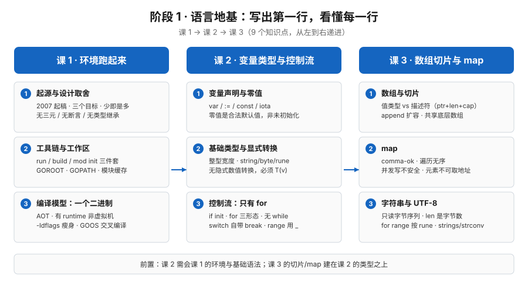

# 阶段 1 概览：语言地基

> 所属课程：Go 语言系统学习 ｜ 故事章节：写出第一行，看懂每一行 ｜ 课程起点：[学习路径总览](../../01-学习路径总览.md)

## 🎯 本阶段目标

- 装上 Go 环境并跑通第一个程序，会用 `go run` / `go build` / `go mod init` 三件套组织起一个能运行的项目。
- 看懂 Go 的语法为什么"少"——这个"少"是刻意设计而非功能缺失，能说清它付出的代价（处处显式、没有三元与 while）。
- 能用基础类型、控制流、切片、map 与字符串写出像样的逻辑，并知道这些基础容器各自的坑（append 共享、map 无序与并发不安全、len 是字节数）。

## 📍 学习重点

- Go 的起源与设计取舍：为什么是这三个目标（一等公民并发 + 垃圾回收 + 编译要快）、为什么砍掉一堆语法。
- 工具链三件套 `go run` / `go build` / `go mod init`，以及 GOROOT / GOPATH / 模块缓存的分工。
- 静态编译成一个二进制：为什么 Go 的二进制偏大、用 `-ldflags "-s -w"` 怎么瘦身、怎么交叉编译。
- 核心直觉：零值不是"未初始化"、切片是描述符不是数组、`v, ok := m[k]` 的 `ok` 不能省、`len(s)` 是字节数。

## ✅ 必须掌握的知识点

| 知识点 | 所属课 | 学完应能 |
|--------|--------|----------|
| Go 的起源与设计取舍 | 课 1 | 说清 Go 诞生于 2007 年的背景与三个设计目标，解释"少即是多"的取舍及代价 |
| 工具链与工作区 | 课 1 | 用 `go run`/`go build`/`go mod init` 建起项目，说清 GOROOT、GOPATH、GOMODCACHE、GOPROXY 的分工 |
| 编译模型：一个二进制文件 | 课 1 | 说清 Go 是 AOT 编译成机器码但有 runtime，解释二进制为何偏大并会用 `-ldflags "-s -w"` 瘦身、用 GOOS/GOARCH 交叉编译 |
| 变量声明与零值 | 课 2 | 分清 `var` 与 `:=`、常量与 `iota`，理解"零值"是合法默认值而非未初始化，掌握作用域规则 |
| 基础类型与显式转换 | 课 2 | 区分有/无符号整型与 `int` 的平台宽度，理解 `string`/`byte`/`rune` 的关系，明白为什么必须 `T(v)` 显式转换 |
| 控制流：只有 for | 课 2 | 掌握 `if` 的 init 语句、`for` 的三种形态、`switch` 自带 break 与 `fallthrough`、`range` 的空白标识符用法 |
| 数组与切片 | 课 3 | 说清数组是值类型、切片是描述符，预判 `append` 扩容与共享底层数组的互相影响，会用 `make` 预分配 |
| map | 课 3 | 会用 comma-ok 区分零值与键不存在，知道遍历无序、并发写不安全、元素不可取地址 |
| 字符串与 UTF-8 | 课 3 | 说清 `string` 是只读字节序列、`len` 是字节数、两种遍历的差异，会用 `strings` 与 `strconv` |

## 🛠 课前环境准备

> 本节是**零基础读者动手前的门槛**，不属于知识点，不计入 45 个知识点之列。

### 三平台安装表

| 平台 | 推荐安装方式 | 说明 |
|------|--------------|------|
| **macOS** | `brew install go`（Homebrew） | 本机采用此方式，实测版本 **go1.27.1 darwin/arm64**；也可到 go.dev/dl 下 pkg 安装包 |
| **Windows** | go.dev/dl 下载 `.msi` 安装包 | 装完自动写入 PATH；命令行在 PowerShell / CMD 中使用 |
| **Linux** | 下载 go.dev/dl 的 `.tar.gz`，解压后把 `bin` 加入 PATH | 或用发行版包管理器（版本可能滞后，建议官方包） |

### 装完验证命令

在终端依次执行：

```bash
go version   # 应输出形如：go version go1.27.1 darwin/arm64
```

再跑一个最小的 hello world，确认工具链能编译能运行：

```bash
mkdir -p ~/hello && cd ~/hello
go mod init hello            # 生成 go.mod，模块路径为 hello
# 新建 main.go，内容见课 1（第四幕示例，需在本机真实跑通）
go run main.go               # 应输出：hello, 小谷！
```

> 若 `go version` 找不到命令，先确认 Go 的 `bin` 目录已加入 `PATH`，并重开一个终端再试。

### 版本基线说明

- 本课程命令与语法以 **Go 1.27.x** 为准（本机 `go1.27.1 darwin/arm64`，核查于 2026-09）。
- 需留意涉及语法演进的旧版本差异：泛型 **Go 1.18** 引入、循环变量语义 **Go 1.22** 起每轮新变量、结构化日志 `log/slog` **Go 1.21** 引入。
- Go 1.27 起新增的能力（如泛型方法、`encoding/json/v2`）会在对应课明确标注"需 Go 1.27+"，老版本无法运行。
- 遇到"版本相关报错"时，先 `go version` 确认当前环境，再判断是语法差异还是环境问题。

## 🗺️ 本阶段路径图



## 本阶段产出

- [x] `lessons/lesson-01-Go是什么、环境怎么跑起来.md`
- [ ] `lessons/lesson-02-变量、类型与控制流.md`
- [ ] `lessons/lesson-03-数组、切片与map.md`
